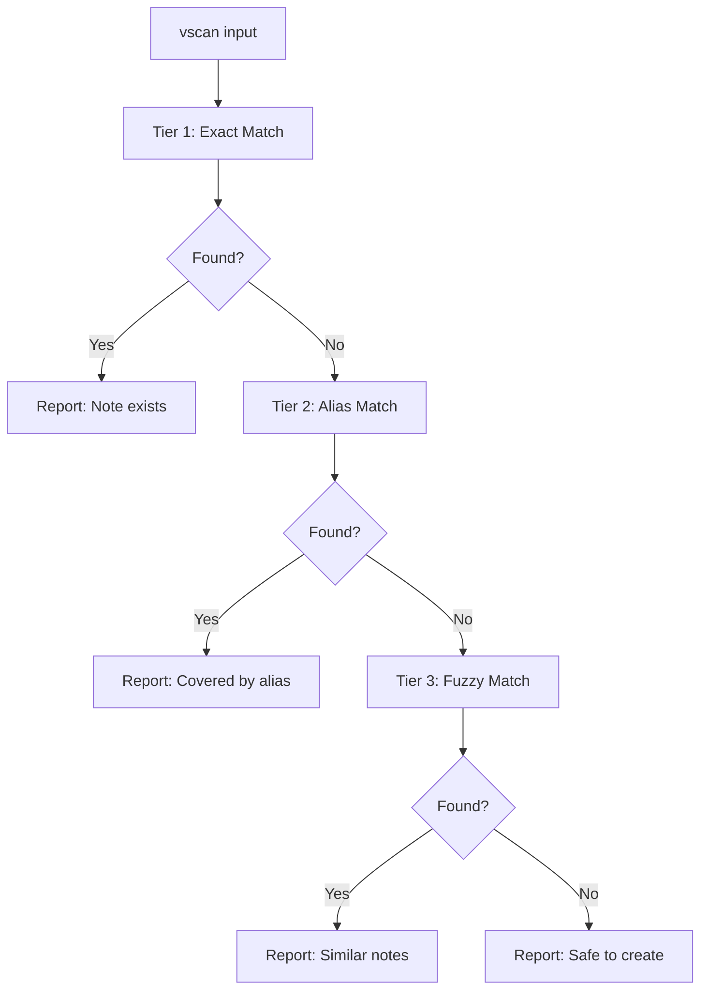
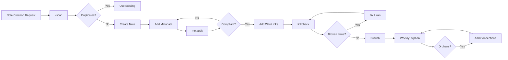

# Diagnostic Commands Reference

> [!abstract] Overview
> Diagnostic Commands are vault health validation and maintenance scripts that ensure the PKB (Personal Knowledge Base) maintains high quality standards. This reference documents all 4 core diagnostic tools: vscan (anti-duplication), orphan (connectivity), linkcheck (integrity), and metaudit (metadata compliance). Each command serves a specific quality assurance function and integrates with the broader Claude Code ecosystem.

## 📊 Quick Reference

| Command | Wrapper | Purpose | Frequency | Critical? |
|---------|---------|---------|-----------|-----------|
| [vscan](#vscan) | `vscan.bat` | Anti-duplication check | Before every note creation | ✅ **MANDATORY** |
| [orphan](#orphan) | `orphan.bat` | Find isolated notes | Weekly maintenance | ⚠️ Important |
| [linkcheck](#linkcheck) | `linkcheck.bat` | Validate wiki-links | Before publication | ⚠️ Important |
| [metaudit](#metaudit) | `metaudit.bat` | Validate YAML frontmatter | Weekly maintenance | ℹ️ Recommended |

**Location**: All scripts located in `_scripts/` directory at vault root

**Technology Stack**: Python 3.8+ (scripts), Batch (Windows wrappers), Bash (Unix wrappers)

---

## 🔍 Command 1: vscan (Vault Scan)

### Overview

**Full Name**: Vault Scan Anti-Duplication Tool
**Primary Purpose**: Prevent creation of duplicate or overlapping content by searching for exact, alias, and fuzzy matches
**Criticality**: **MANDATORY** - Must run before creating any new note
**Integration**: Core component of Anti-Duplication Protocol

### Files

```
_scripts/
├── vault_scan.py        # Python implementation (core logic)
└── vscan.bat            # Windows batch wrapper
```

**Platform Support**:
- Windows: Use `vscan.bat`
- macOS/Linux: Create `vscan.sh` wrapper or call Python directly

### Syntax

```bash
vscan "search term"
```

**Parameters**:
- `search term` (required): Concept or note name to search for
- Must be quoted if contains spaces

**Examples**:
```bash
vscan "Chain of Thought"
vscan "semantic retrieval"
vscan "React Framework"
```

### Functionality

**Search Algorithm** (3-tier matching):



**Tier 1: Exact Match**
```yaml
Method: Case-insensitive filename comparison
Pattern: [[Search Term]].md
Example:
  Input: "Chain of Thought"
  Matches: "chain-of-thought.md", "Chain of Thought.md"
  Result: Exact match found
```

**Tier 2: Alias Match**
```yaml
Method: YAML frontmatter alias scanning
Pattern: aliases: [..., "Search Term", ...]
Example:
  Input: "CoT"
  File: chain-of-thought.md with aliases: [CoT, Chain-of-Thought]
  Result: Alias match found in chain-of-thought.md
```

**Tier 3: Fuzzy Match**
```yaml
Method: Levenshtein distance + semantic similarity
Threshold: >70% similarity
Example:
  Input: "Chain-of-Thought Prompting"
  Matches: "chain-of-thought.md" (75% similar)
  Result: Fuzzy match found, review recommended
```

### Decision Tree

```
vscan "[term]" results:
│
├─ Exact match found
│  └─ Action: DON'T CREATE - Note exists
│     └─ Options:
│        ├─ Read existing note
│        ├─ Edit/enhance existing note
│        └─ Add alias if different terminology
│
├─ Alias match found
│  └─ Action: DON'T CREATE - Existing note covers concept
│     └─ Options:
│        ├─ Use existing note
│        └─ Add additional alias if needed
│
├─ Fuzzy match(es) found
│  └─ Action: REVIEW before creating
│     └─ Decision Process:
│        ├─ Read fuzzy matches
│        ├─ Assess overlap (>50% = append to existing)
│        ├─ Assess distinction (<50% = create new)
│        └─ If create new: Cross-link to related
│
└─ No matches found
   └─ Action: SAFE TO CREATE
      └─ Proceed with note creation
```

### Use Cases

**Use Case 1: Note Creation Check (Standard)**
```
Context: User requests "Create note about React hooks"
TaskStart Protocol:
  1. Run: vscan "React hooks"
  2. Result: Fuzzy match found → "react-framework.md"
  3. Decision: Read react-framework.md
  4. Assessment: Hooks covered in section 4.2
  5. Action: Enhance existing section instead of new note
```

**Use Case 2: Acronym Collision Detection**
```
Context: User requests "Create note about CoT"
TaskStart Protocol:
  1. Run: vscan "CoT"
  2. Result: Alias match → "chain-of-thought.md" (aliases: [CoT, ...])
  3. Decision: Note already exists
  4. Action: Use existing note, no duplication
```

**Use Case 3: False Negative Prevention**
```
Context: User requests "Create note about LLM prompting"
TaskStart Protocol:
  1. Run: vscan "LLM prompting"
  2. Result: Fuzzy matches → "prompt-engineering.md", "llm-workflows.md"
  3. Decision: Review both notes
  4. Assessment: Partial overlap but distinct focus
  5. Action: Create new note with cross-links to related notes
```

**Use Case 4: No Matches (Safe Path)**
```
Context: User requests "Create note about Mermaid diagrams"
TaskStart Protocol:
  1. Run: vscan "Mermaid diagrams"
  2. Result: No matches found
  3. Decision: Safe to create new note
  4. Action: Proceed with note creation
```

### Output Format

**Exact Match Found**:
```
[VSCAN] Exact match found:
  - File: chain-of-thought.md
  - Location: 02-reference/prompting/
  - Created: 2025-11-15
  - Tags: #prompting, #techniques, #reference-note
  → Recommendation: Use existing note
```

**Alias Match Found**:
```
[VSCAN] Alias match found:
  - File: chain-of-thought.md
  - Alias: "CoT"
  - Location: 02-reference/prompting/
  → Recommendation: Existing note covers this concept
```

**Fuzzy Matches Found**:
```
[VSCAN] Fuzzy matches found (3):
  1. chain-of-thought.md (85% similarity)
     Location: 02-reference/prompting/
     Excerpt: "...step-by-step reasoning..."

  2. reasoning-techniques.md (72% similarity)
     Location: 02-reference/cognitive/
     Excerpt: "...sequential thought processes..."

  3. prompt-patterns.md (70% similarity)
     Location: 02-projects/spes/
     Excerpt: "...structured prompting approaches..."

→ Recommendation: Review matches before creating new note
```

**No Matches**:
```
[VSCAN] No matches found for "Mermaid diagrams"
→ Recommendation: Safe to create new note
```

### Integration Points

**TaskStart Hook Integration**:
```yaml
Hook: TaskStart (Step 3)
Action: "Run anti-duplication check: vscan '[proposed note/concept]'"
Requirement: MANDATORY for note creation tasks
Enforcement: TaskStart will not proceed to step 4 without vscan check
```

**Anti-Duplication Protocol Integration**:
```yaml
Protocol: Anti-Duplication Protocol
Step 1: Run vscan "[proposed note name]"
Step 2: Check results (exact, alias, fuzzy, none)
Step 3: Make decision based on decision tree
Step 4: Only create if no duplicates found
```

**Note Generation Mode Integration**:
```yaml
Mode: Note Generation Mode
Step 1: Run anti-duplication check (vscan) FIRST
Blocker: If exact/alias match found, abort creation
Warning: If fuzzy matches found, require user confirmation
```

### Configuration

**Script Configuration** (`_scripts/vscan_config.yaml`):
```yaml
vscan:
  search_paths:
    - "/"  # Entire vault
    - "!00-inbox"  # Exclude inbox
    - "!99-archive"  # Exclude archive

  fuzzy_matching:
    enabled: true
    threshold: 0.70  # 70% similarity
    algorithm: "levenshtein"

  alias_scanning:
    enabled: true
    frontmatter_fields: ["aliases", "aka", "also_known_as"]

  output:
    max_results: 10  # Show top 10 fuzzy matches
    excerpt_length: 100  # Characters of context

  performance:
    cache_enabled: true
    cache_ttl: 300  # 5 minutes
```

### Performance Considerations

**Time Complexity**:
- Exact match: O(n) where n = number of files
- Alias match: O(n×m) where m = avg aliases per file
- Fuzzy match: O(n×k) where k = search term length

**Typical Execution Time**:
- Small vault (<1,000 notes): <1 second
- Medium vault (1,000-5,000 notes): 1-3 seconds
- Large vault (>5,000 notes): 3-10 seconds

**Optimization Strategies**:
1. **Caching**: Cache file list and frontmatter for 5 minutes
2. **Indexing**: Pre-build search index (updated nightly)
3. **Incremental**: Only scan files modified since last run
4. **Parallel**: Use multiprocessing for large vaults

### Error Handling

**Common Errors**:

| Error | Cause | Recovery |
|-------|-------|----------|
| `Permission denied` | No read access to _scripts/ | Check file permissions |
| `Python not found` | Python not in PATH | Install Python or add to PATH |
| `Search term empty` | No argument provided | Provide search term in quotes |
| `Vault path not set` | VAULT_PATH env var missing | Set environment variable |
| `Smart Connections offline` | Embeddings not available | Fall back to regex search |

**Graceful Degradation**:
```python
def search_with_fallback(term):
    try:
        # Attempt semantic search via Smart Connections
        results = smart_connections_search(term)
    except ConnectionError:
        # Fall back to regex-based search
        results = regex_search(term)
    return results
```

### Best Practices

**DO**:
- ✅ Always run vscan before creating any note
- ✅ Quote search terms with spaces
- ✅ Review fuzzy matches before dismissing
- ✅ Use exact note name if known
- ✅ Check aliases for concepts with multiple names

**DON'T**:
- ❌ Don't skip vscan "just this once"
- ❌ Don't create duplicate if exact match exists
- ❌ Don't ignore high-similarity fuzzy matches (>80%)
- ❌ Don't use generic search terms (too many false positives)
- ❌ Don't create near-duplicates intentionally

---

## 🔗 Command 2: orphan (Orphan Check)

### Overview

**Full Name**: Orphan Note Detector
**Primary Purpose**: Identify notes with insufficient connections (<2 incoming and/or <2 outgoing links)
**Criticality**: Important for knowledge graph health
**Integration**: Vault Navigation Mode, Evaluation Protocol

### Files

```
_scripts/
├── orphan_check.py      # Python implementation
└── orphan.bat           # Windows batch wrapper
```

### Syntax

```bash
orphan
```

**Parameters**: None (operates on entire vault)

**Output**: List of orphaned notes with connectivity metrics

### Functionality

**Connectivity Standards** (Constitutional requirement):
```yaml
Minimum Requirements:
  - Incoming links: ≥2 (notes linking TO this note)
  - Outgoing links: ≥2 (notes this note links TO)

Rationale:
  - Single connection = fragile graph (breaks if one link removed)
  - Dual connections = robust graph (redundant pathways)
  - Bidirectional = integrated knowledge (not isolated)
```

**Detection Algorithm**:
```python
def detect_orphans(vault_notes):
    orphans = {
        'isolated': [],      # 0 incoming, 0 outgoing
        'incoming_only': [], # ≥1 incoming, 0 outgoing
        'outgoing_only': [], # 0 incoming, ≥1 outgoing
        'insufficient': []   # <2 incoming OR <2 outgoing
    }

    for note in vault_notes:
        incoming_count = count_backlinks(note)
        outgoing_count = count_wikilinks(note)

        if incoming_count == 0 and outgoing_count == 0:
            orphans['isolated'].append(note)
        elif incoming_count >= 1 and outgoing_count == 0:
            orphans['incoming_only'].append(note)
        elif incoming_count == 0 and outgoing_count >= 1:
            orphans['outgoing_only'].append(note)
        elif incoming_count < 2 or outgoing_count < 2:
            orphans['insufficient'].append(note)

    return orphans
```

### Use Cases

**Use Case 1: Weekly Vault Maintenance**
```
Schedule: Every Sunday morning
Command: orphan
Output: 23 notes with insufficient connections
Actions:
  1. Review orphans list
  2. For each orphan: Add 2+ relevant wiki-links
  3. For each orphan: Find 2+ notes to link TO it
  4. Re-run orphan to verify fixes
```

**Use Case 2: Pre-Publication Quality Check**
```
Context: Preparing vault for sharing/publication
Command: orphan
Output: 7 isolated notes found
Actions:
  1. Determine if isolated notes should be:
     a) Integrated (add connections)
     b) Archived (not ready for publication)
     c) Deleted (no longer relevant)
  2. Execute chosen action for each
  3. Verify 0 orphans remain
```

**Use Case 3: Knowledge Graph Gap Analysis**
```
Context: Analyzing vault structure for gaps
Command: orphan
Output: 15 "outgoing_only" notes (not referenced elsewhere)
Insight: These notes are dead-ends (no one links to them)
Actions:
  1. Review if notes are:
     a) Too specific (merge with related note)
     b) Mislabeled (clarify title/content)
     c) Missing context (add to relevant MOC)
  2. Create inbound links from relevant notes
```

### Output Format

```
[ORPHAN CHECK] Vault connectivity analysis

Total Notes: 1,247
Fully Connected (≥2 in, ≥2 out): 1,180 (94.6%)

ORPHANS DETECTED: 67 notes (5.4%)

Isolated (0 in, 0 out): 12 notes
  1. temporary-scratch-2025-11-15.md
     Location: 00-inbox/
     Created: 2025-11-15
     → Recommendation: Archive or integrate

  2. random-thought-ai-ethics.md
     Location: 00-inbox/
     Created: 2025-10-22
     → Recommendation: Create atomic note or archive

Insufficient Incoming (<2 in): 31 notes
  1. dataview-inline-fields.md (1 incoming, 5 outgoing)
     Location: 03-guides/
     → Recommendation: Add references from MOC or related guides

  2. semantic-color-coding.md (1 incoming, 4 outgoing)
     Location: 03-guides/formatting/
     → Recommendation: Link from formatting-protocol.md

Insufficient Outgoing (<2 out): 24 notes
  1. obsidian-setup-guide.md (3 incoming, 1 outgoing)
     Location: 03-guides/
     → Recommendation: Add links to related tools/plugins

```

### Integration Points

**Evaluation Protocol Integration**:
```yaml
Quality Dimension: Graph Integration
Metric: Orphan percentage
Target: <5% of notes are orphans
Measurement: orphan command output
```

**Vault Navigation Mode Integration**:
```yaml
Mode: Vault Navigation Mode
Action: "Identify orphan notes or missing connections"
Tool: orphan command
Output: Targeted linking opportunities
```

### Best Practices

**DO**:
- ✅ Run orphan weekly as part of maintenance routine
- ✅ Fix high-priority orphans immediately (core concepts)
- ✅ Use orphan output to identify structural gaps
- ✅ Target <5% orphan rate as quality standard

**DON'T**:
- ❌ Don't create artificial links just to satisfy metrics
- ❌ Don't ignore persistent orphans (indicates structural issue)
- ❌ Don't link unrelated notes to reduce orphan count
- ❌ Don't create notes without planning connections first

---

## 🔗 Command 3: linkcheck (Link Checker)

### Overview

**Full Name**: Wiki-Link Integrity Validator
**Primary Purpose**: Identify broken `[[Wiki-Links]]` pointing to non-existent notes
**Criticality**: Important for publication readiness and user navigation
**Integration**: Evaluation Protocol, Pre-Publication Checklist

### Files

```
_scripts/
├── link_check.py        # Python implementation
└── linkcheck.bat        # Windows batch wrapper
```

### Syntax

```bash
linkcheck
```

**Parameters**: None (validates entire vault)

**Optional Flags**:
```bash
linkcheck --fix          # Auto-create stub notes for broken links
linkcheck --report-only  # Don't suggest fixes, just report
linkcheck --path "02-reference/"  # Check specific directory only
```

### Functionality

**Link Validation Algorithm**:
```python
def validate_wikilinks(vault_notes):
    broken_links = []

    for source_note in vault_notes:
        wikilinks = extract_wikilinks(source_note)

        for link in wikilinks:
            target_path = resolve_wikilink(link)

            if not file_exists(target_path):
                broken_links.append({
                    'source': source_note,
                    'link': link,
                    'line_number': find_line_number(source_note, link),
                    'context': get_surrounding_text(source_note, link)
                })

    return broken_links
```

**Wiki-Link Parsing**:
```yaml
Patterns Recognized:
  - Basic: [[Note Name]]
  - Aliased: [[Note Name|Display Text]]
  - Subheading: [[Note Name#Section]]
  - Block: [[Note Name#^block-id]]
  - Folder: [[folder/Note Name]]

Edge Cases Handled:
  - Case sensitivity: Note.md vs note.md (platform-dependent)
  - Special characters: [[Note (2025) - Updated!]]
  - Escaped brackets: \[\[Not a Link\]\]
  - Code blocks: Ignore links in ```code blocks```
```

### Use Cases

**Use Case 1: Pre-Publication Validation**
```
Context: Preparing reference docs for publication
Command: linkcheck
Output: 5 broken links detected
Actions:
  1. Review each broken link
  2. Determine if target note should exist:
     a) Yes → Create note or fix path
     b) No → Remove link or replace with external URL
  3. Re-run linkcheck until 0 broken links
  4. Proceed with publication
```

**Use Case 2: Post-Refactoring Validation**
```
Context: Reorganized vault folder structure
Command: linkcheck
Output: 47 broken links (paths changed during refactor)
Actions:
  1. Update links to new paths
  2. Consider using Obsidian's auto-update feature
  3. Verify all links resolved
```

**Use Case 3: Ghost Link Identification**
```
Context: Finding planned but uncreated notes
Command: linkcheck
Output: 12 broken links (all intentional [[Ghost Link]]s)
Actions:
  1. Review each ghost link
  2. Prioritize which notes to create
  3. Use as backlog for future content creation
```

### Output Format

```
[LINKCHECK] Wiki-link integrity validation

Total Notes Scanned: 1,247
Total Wiki-Links Found: 8,342
Broken Links: 5 (0.06%)

BROKEN LINKS DETECTED:

1. Source: formatting-protocol.md:127
   Link: [[semantic-color-system]]
   Context: "...using the [[semantic-color-system]] for emphasis..."
   Issue: Target note does not exist
   Suggestions:
     - Create note: semantic-color-system.md
     - Fix link: [[semantic-color-coding]] (existing note, 87% match)
     - Remove link if no longer relevant

2. Source: prompt-engineering-guide.md:45
   Link: [[few-shot-learning]]
   Context: "...using [[few-shot-learning]] techniques..."
   Issue: Target note does not exist
   Suggestions:
     - Create note: few-shot-learning.md
     - Add to backlog (tagged as [[Ghost Link]])

---

SUMMARY BY CATEGORY:

Typos (likely existing note with different spelling): 2
  - [[semantic-color-system]] → [[semantic-color-coding]]?
  - [[retrival-strategies]] → [[retrieval-strategies]]?

Missing Notes (intentional ghost links): 3
  - [[few-shot-learning]]
  - [[meta-prompting-techniques]]
  - [[constitutional-ai-principles]]

---

RECOMMENDATIONS:

High Priority (Fix before publication):
  - Fix 2 typo links (quick wins)

Medium Priority (Content backlog):
  - Create 3 missing reference notes

Low Priority (Optional):
  - Consider creating stubs for ghost links
```

### Integration Points

**Evaluation Protocol Integration**:
```yaml
Quality Dimension: Format Compliance
Metric: Broken link count
Target: 0 broken links
Validation: linkcheck command
```

**Pre-Output Validation Checklist Integration**:
```yaml
Checklist Item: "No broken links — verify or mark as [[Ghost Link]]"
Verification: Run linkcheck before delivery
```

### Best Practices

**DO**:
- ✅ Run linkcheck before publishing any content
- ✅ Fix typo links immediately (low-hanging fruit)
- ✅ Mark intentional broken links as [[Ghost Link]]
- ✅ Use broken links as content creation backlog
- ✅ Run linkcheck after folder reorganization

**DON'T**:
- ❌ Don't ignore persistent broken links
- ❌ Don't remove broken links without investigating
- ❌ Don't create empty stub notes just to fix links
- ❌ Don't use markdown links [text](file.md) for internal files

---

## 🔍 Command 4: metaudit (Metadata Audit)

### Overview

**Full Name**: YAML Frontmatter Compliance Validator
**Primary Purpose**: Validate YAML frontmatter against metadata schema across vault
**Criticality**: Recommended for automated querying and Dataview compatibility
**Integration**: Formatting Protocol, Dataview Queries

### Files

```
_scripts/
├── meta_audit.py        # Python implementation
└── metaudit.bat         # Windows batch wrapper
```

### Syntax

```bash
metaudit
```

**Optional Flags**:
```bash
metaudit --fix               # Auto-fix common issues
metaudit --schema custom.yaml  # Use custom schema definition
metaudit --strict            # Enforce all optional fields
```

### Functionality

**Validation Checks** (7 categories):

**1. YAML Syntax Validation**
```yaml
Checks:
  - Valid YAML structure (proper indentation, quotes, colons)
  - Frontmatter delimiters present (--- at start and end)
  - No syntax errors (unclosed quotes, invalid escape sequences)

Common Errors:
  - Missing closing ---
  - Inconsistent indentation (mixing tabs and spaces)
  - Unquoted strings with special characters
```

**2. Required Fields Presence**
```yaml
Required Fields:
  - tags: (array of hashtags)
  - status: (seedling | budding | evergreen | wilting)
  - certainty: (speculative | provisional | moderate | established | verified)
  - created: (YYYY-MM-DD)
  - modified: (YYYY-MM-DD)

Validation:
  - All required fields present
  - No null values for required fields
```

**3. Tag Format Validation**
```yaml
Correct Format: tags: #tag-name #another-tag #category
Incorrect Formats:
  - tags: tag-name (missing #)
  - tags: ["tag-name"] (array syntax, not hashtag)
  - tags: #tag name (space in tag)

Enforcement: All tags must start with # and use kebab-case
```

**4. Date Format Validation**
```yaml
Correct Format: YYYY-MM-DD (ISO 8601)
Examples:
  - created: 2025-11-15 ✓
  - created: 2025-11-15T14:30:00 ✓ (timestamp allowed)

Incorrect Formats:
  - created: 11/15/2025 ✗
  - created: Nov 15, 2025 ✗
  - created: 2025-11-15 14:30 ✗ (space separator)
```

**5. Status Value Validation**
```yaml
Allowed Values:
  - seedling: New note, rough draft
  - budding: Developing, needs expansion
  - evergreen: Mature, regularly maintained
  - wilting: Outdated, needs review/archival

Validation: Must be one of allowed values (case-sensitive)
```

**6. Certainty Value Validation**
```yaml
Allowed Values:
  - speculative: Hypothesis, unverified
  - provisional: Some evidence, tentative
  - moderate: Reasonably confident
  - established: Well-supported
  - verified: Confirmed, authoritative

Validation: Must be one of allowed values (case-sensitive)
```

**7. Aliases Format Validation**
```yaml
Correct Format: aliases: [Alt Name 1, Abbreviation, Search Term]
Validation:
  - Must be array format
  - 2-4 aliases recommended
  - Each alias is meaningful alternative

Common Issues:
  - Single string instead of array: aliases: "Alt Name"
  - Empty array: aliases: []
  - Too many aliases: aliases: [20 different variations]
```

### Use Cases

**Use Case 1: Batch Validation After Import**
```
Context: Imported 50 notes from external source
Command: metaudit
Output: 35 notes with metadata issues
Actions:
  1. Run metaudit --fix for common issues (date formats, tag syntax)
  2. Manually review remaining 12 notes
  3. Update to comply with schema
  4. Re-run metaudit until 100% compliant
```

**Use Case 2: Schema Enforcement for New Notes**
```
Context: Establishing metadata standards
Command: metaudit --strict
Output: 12 notes missing optional fields
Actions:
  1. Decide which optional fields to enforce
  2. Update schema definition
  3. Add missing fields to notes
  4. Integrate metaudit into note creation workflow
```

**Use Case 3: Dataview Query Troubleshooting**
```
Context: Dataview query returning unexpected results
Command: metaudit --schema dataview-required.yaml
Output: 8 notes with malformed frontmatter
Root Cause: Dataview can't parse YAML with syntax errors
Actions:
  1. Fix YAML syntax errors
  2. Verify Dataview query works
  3. Add metaudit to pre-query checklist
```

### Output Format

```
[METAUDIT] YAML frontmatter compliance validation

Total Notes Scanned: 1,247
Notes with Metadata: 1,195 (95.8%)
Notes without Metadata: 52 (4.2%)

COMPLIANCE STATUS:
✓ Fully Compliant: 1,087 (90.9%)
⚠ Minor Issues: 73 (6.1%)
✗ Major Issues: 35 (2.9%)

ISSUES DETECTED: 108 total

CRITICAL (Major Issues - 35 notes):

1. File: prompt-engineering-basics.md
   Issues:
     - Missing required field: status
     - Missing required field: certainty
     - Invalid date format: created: "11/15/2025" (should be 2025-11-15)
   → Recommendation: Add missing fields, fix date format

2. File: react-hooks-guide.md
   Issues:
     - YAML syntax error: Line 4 (unclosed quote)
     - Tags not in hashtag format: tags: react, hooks
   → Recommendation: Fix YAML syntax, convert tags to #react #hooks

WARNING (Minor Issues - 73 notes):

1. File: database-optimization.md
   Issues:
     - Insufficient aliases (0 provided, 2-4 recommended)
     - Status field using old value: "draft" (not in current schema)
   → Recommendation: Add aliases, update status to "budding"

---

SUMMARY BY ISSUE TYPE:

Missing Required Fields: 23 notes
  - status: 12 notes
  - certainty: 8 notes
  - created: 3 notes

Invalid Date Formats: 15 notes
  - US format (MM/DD/YYYY): 10 notes
  - Inconsistent format: 5 notes

Tag Format Issues: 18 notes
  - Missing # prefix: 14 notes
  - Spaces in tags: 4 notes

YAML Syntax Errors: 12 notes
  - Unclosed quotes: 7 notes
  - Invalid indentation: 5 notes

---

AUTO-FIX AVAILABLE:
Run `metaudit --fix` to automatically correct 76 issues (70.4%)
Manual review required for 32 issues (29.6%)
```

### Integration Points

**Formatting Protocol Integration**:
```yaml
Protocol: Metadata Header Protocol
Validation: metaudit command
Enforcement: Pre-output validation checklist
```

**Evaluation Protocol Integration**:
```yaml
Quality Dimension: Format Compliance
Metric: Metadata compliance percentage
Target: >95% compliant
Measurement: metaudit output
```

### Best Practices

**DO**:
- ✅ Run metaudit weekly as part of maintenance
- ✅ Use --fix for batch corrections (review changes)
- ✅ Enforce required fields for all note types
- ✅ Maintain consistent date format (ISO 8601)
- ✅ Use semantic status values (not generic)

**DON'T**:
- ❌ Don't skip metadata for "temporary" notes
- ❌ Don't use custom field names (breaks Dataview queries)
- ❌ Don't mix date formats across vault
- ❌ Don't leave YAML syntax errors unfixed
- ❌ Don't use tags without # prefix (breaks search)

---

## 🔄 Command Relationships

### Workflow Integration



### Command Sequencing

**Daily Workflow**:
```bash
# Before creating notes
vscan "[concept]"        # Check for duplicates

# After creating notes
metaudit --fix           # Validate metadata
linkcheck                # Check link integrity
```

**Weekly Maintenance**:
```bash
# Sunday morning routine
orphan                   # Find isolated notes
linkcheck                # Validate all links
metaudit --strict        # Enforce full compliance
```

**Pre-Publication**:
```bash
# Quality gate before sharing
vscan "*important*"      # Check for duplicates
orphan                   # Ensure connectivity
linkcheck --report-only  # Zero broken links
metaudit --strict        # 100% compliant
```

---

## 📚 Advanced Topics

### Automation Integration

**Pre-Commit Hook Example** (`.git/hooks/pre-commit`):
```bash
#!/bin/bash
# Run diagnostic commands before commit

echo "Running vault diagnostics..."

# Check for broken links
if ! linkcheck --report-only; then
  echo "❌ Broken links detected. Fix before committing."
  exit 1
fi

# Check metadata compliance
if ! metaudit --strict; then
  echo "❌ Metadata issues detected. Fix before committing."
  exit 1
fi

echo "✓ All diagnostics passed"
exit 0
```

### Custom Scripts

**Example: Combined Health Check**
```bash
#!/bin/bash
# vault-health-check.sh

echo "=== Vault Health Check ==="
echo ""

echo "1. Checking for duplicates..."
vscan_results=$(vscan "")
echo "✓ Duplicate check complete"
echo ""

echo "2. Checking for orphans..."
orphan_count=$(orphan | grep "ORPHANS DETECTED" | awk '{print $3}')
echo "   Orphans found: $orphan_count"
echo ""

echo "3. Checking link integrity..."
broken_links=$(linkcheck | grep "Broken Links:" | awk '{print $3}')
echo "   Broken links: $broken_links"
echo ""

echo "4. Checking metadata compliance..."
compliance=$(metaudit | grep "Fully Compliant" | awk '{print $3}')
echo "   Compliance: $compliance"
echo ""

echo "=== Health Check Complete ==="
```

---

## 🔍 Troubleshooting

### Common Issues

**Issue 1: Commands Not Found**
```
Error: "vscan: command not found"
Cause: Script directory not in PATH
Solution:
  1. cd _scripts/
  2. Run: python vault_scan.py "term"
  OR
  3. Add _scripts/ to system PATH
```

**Issue 2: Permission Denied**
```
Error: "Permission denied: vault_scan.py"
Cause: Script not executable
Solution (Unix/macOS):
  chmod +x _scripts/*.py
  chmod +x _scripts/*.sh
```

**Issue 3: Slow Execution**
```
Symptom: Commands take >10 seconds
Cause: Large vault (>10,000 notes)
Solutions:
  1. Enable caching in config
  2. Use --path flag to check specific directories
  3. Schedule full scans off-peak (nightly cron)
```

---

## 📖 Related Documentation

- [[component-extraction-master-index]] - Complete system overview
- [[hooks-reference]] - Session lifecycle automation
- [[anti-duplication-protocol-reference]] - vscan integration
- [[formatting-protocol-reference]] - Metadata standards
- [[evaluation-protocol-reference]] - Quality metrics

---

## Document History

- **2026-01-06**: Initial creation as part of Phase 2 documentation effort
- **Status**: Reference documentation (production-ready)
- **Maintenance**: Update when command behavior changes

---

_This reference document provides comprehensive coverage of all 4 diagnostic commands. For script source code, see: `_scripts/` directory in vault root._
