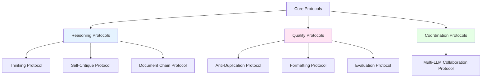
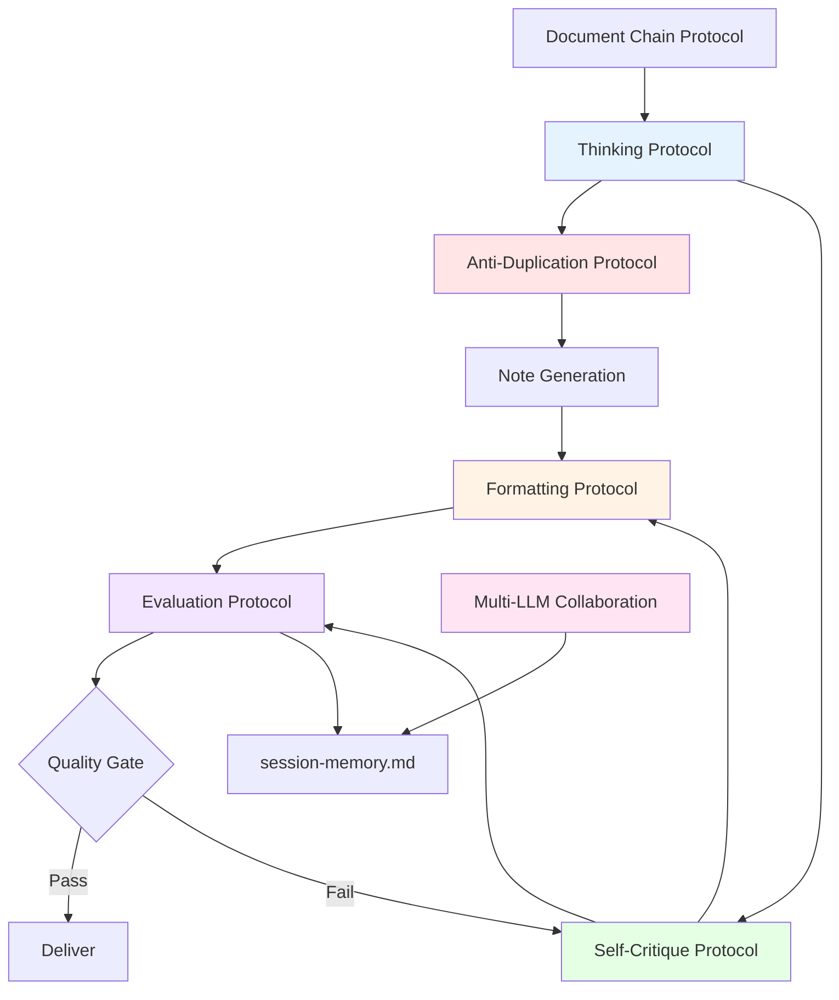

# Core Protocols Reference: Claude Code Quality & Process Frameworks

> [!abstract] Overview
> Core protocols are foundational process frameworks that define how Claude Code operates across all tasks and modes. These protocols establish quality standards, reasoning patterns, error handling procedures, and coordination mechanisms that ensure consistent, high-quality outputs. This reference provides comprehensive documentation of all 7 core protocols with implementation patterns, integration guidance, and best practices.

## Table of Contents

1. [Protocol System Architecture](#protocol-system-architecture)
2. [Protocol 1: Thinking Protocol](#protocol-1-thinking-protocol)
3. [Protocol 2: Self-Critique Protocol](#protocol-2-self-critique-protocol)
4. [Protocol 3: Document Chain Protocol](#protocol-3-document-chain-protocol)
5. [Protocol 4: Anti-Duplication Protocol](#protocol-4-anti-duplication-protocol)
6. [Protocol 5: Formatting Protocol](#protocol-5-formatting-protocol)
7. [Protocol 6: Evaluation Protocol](#protocol-6-evaluation-protocol)
8. [Protocol 7: Multi-LLM Collaboration Protocol](#protocol-7-multi-llm-collaboration-protocol)
9. [Protocol Integration Patterns](#protocol-integration-patterns)
10. [Best Practices and Guidelines](#best-practices-and-guidelines)

---

## Protocol System Architecture

> [!principle-point] Core Concept
> Protocols are **process frameworks** that establish systematic approaches to recurring challenges in PKB work. Each protocol addresses a specific quality dimension: reasoning quality (Thinking), output quality (Self-Critique), context quality (Document Chain), content quality (Anti-Duplication, Formatting), task quality (Evaluation), and coordination quality (Multi-LLM Collaboration).

### Design Philosophy

The protocol system is built on three foundational principles:

**1. Systematic Over Ad-Hoc**
Rather than responding inconsistently to similar situations, protocols define repeatable processes that ensure consistent quality across all work.

**2. Prevention Over Correction**
Protocols emphasize catching issues early (think before acting, check for duplicates before creating) rather than fixing problems after they occur.

**3. Quality as Process, Not Inspection**
Quality isn't achieved by post-hoc checking—it's built into the work process through protocol adherence.

### Protocol Hierarchy



### Protocol Application Matrix

| Protocol | Trigger Frequency | Operational Modes | Criticality |
|----------|------------------|-------------------|-------------|
| **Thinking** | Before non-trivial tasks | All modes | Critical |
| **Self-Critique** | Complex deliverables (>1000 words) | Note Generation, Prompt Engineering | High |
| **Document Chain** | Workflow tasks | Prompt Engineering, Navigation | Medium |
| **Anti-Duplication** | Before note creation | Note Generation | Critical |
| **Formatting** | All note outputs | Note Generation, Refactoring | Critical |
| **Evaluation** | After significant tasks | All modes | High |
| **Multi-LLM Collaboration** | Handoff points | Collaboration Mode | Critical |

---

## Protocol 1: Thinking Protocol

> [!definition] Thinking Protocol
> **Purpose**: Establish explicit reasoning process before executing non-trivial tasks to prevent errors, loops, and suboptimal approaches through structured analysis, approach selection, and failure planning.

### Protocol Overview

[**Thinking-Protocol-Purpose**:: Explicit reasoning before execution to prevent errors, avoid repeated failed approaches, and select optimal strategies through structured task analysis, state assessment, and contingency planning.]

**When to Apply:**
- Multi-step tasks (≥2 tool calls)
- Problem diagnosis before attempting fixes
- When a previous approach failed
- Complex code or content generation
- Ambiguous requests requiring interpretation
- Any task where uncertain of best approach
- Before creating new notes (anti-duplication check)

**Core Principle:** <span style='color: #FFC700;'>Think Before Acting</span>

Never execute complex actions without first reasoning through approach, considering alternatives, and planning for failure scenarios.

### Protocol Structure

The Thinking Protocol follows a 5-phase structured reasoning template:

#### Phase 1: Task Analysis

```
<claude_thinking>
**Task Analysis:**
- What is being asked?
- What is the expected outcome?
- What are the success criteria?
```

**Purpose:** Establish clear understanding of task requirements and deliverables.

**Key Questions:**
- What is the core objective?
- What does success look like?
- What constraints apply?
- What assumptions am I making?

**Example:**
```
<claude_thinking>
**Task Analysis:**
- What is being asked? Create a reference note about the Feynman Technique
- What is the expected outcome? Comprehensive 2000+ word reference note with full formatting
- What are the success criteria?
  * 15-40 wiki-links for knowledge graph integration
  * 8-15 semantic callouts for structure
  * 20-50+ inline fields for data extraction
  * 4-topic expansion section
  * Production-ready for vault inclusion
```

#### Phase 2: Current State Assessment

```
**Current State:**
- What do I know from memory files?
- What files/context have I examined?
- What have I already tried (if retrying)?
- Has Gemini worked on this recently?
```

**Purpose:** Inventory available context and previous attempts to inform approach selection.

**Key Questions:**
- What context have I loaded?
- What related work exists?
- Have I tried this before in this session?
- What did Gemini document in session-memory?

**Example:**
```
**Current State:**
- Loaded from memory: User emphasizes comprehensive depth over brevity
- Files examined: None yet (need to run vscan first)
- Previous attempts: No prior attempts in this session
- Gemini context: No recent related work documented in session-memory
```

#### Phase 3: Anti-Duplication Check (for note creation)

```
**Anti-Duplication Check:**
- Run vscan for proposed concepts
- Check for existing notes, aliases, related content
- Decision: Create new | Append existing | Create alias
```

**Purpose:** Prevent duplicate content creation before investing effort in generation.

**Key Questions:**
- Does this note already exist?
- Does an existing note cover this concept via alias?
- Are there similar notes that could be enhanced instead?

**Example:**
```
**Anti-Duplication Check:**
- Running: vscan "Feynman Technique"
- Results:
  * Exact match: None
  * Alias match: None
  * Fuzzy match: "learning-techniques.md" mentions it briefly
- Analysis: Existing mention is 2 sentences, insufficient coverage
- Decision: CREATE NEW (separate comprehensive treatment warranted)
```

#### Phase 4: Approach Selection

```
**Approach Selection:**
- Option A: [approach] — Pros: [x], Cons: [y]
- Option B: [approach] — Pros: [x], Cons: [y]
- Selected: [choice] — Rationale: [why]
```

**Purpose:** Explicitly consider multiple approaches and document selection reasoning.

**Key Questions:**
- What are the viable approaches?
- What are the tradeoffs?
- Which approach best fits the context?
- Why is this the optimal choice?

**Example:**
```
**Approach Selection:**
- Option A: Atomic note (300-800 words, focused) — Pros: Quick, targeted. Cons: Technique has depth warranting more.
- Option B: Reference note (2000+ words, comprehensive) — Pros: Authoritative coverage, better graph integration. Cons: More time investment.
- Option C: MOC (navigation hub) — Pros: Could organize learning techniques. Cons: Overkill for single technique.
- Selected: Option B (Reference Note) — Rationale: User requests comprehensive depth, technique has multiple facets (method, applications, variations, pitfalls), reference note format allows proper treatment.
```

#### Phase 5: Execution Plan & Failure Escape Hatch

```
**Execution Plan:**
1. [First step]
2. [Second step]
3. [Verification step]

**Failure Escape Hatch:**
- If this doesn't work, I will: [alternative approach]
- After 2 failed attempts, I will: [stop and consult user]
</claude_thinking>
```

**Purpose:** Define concrete action sequence and contingency plans for failure scenarios.

**Key Questions:**
- What are the discrete steps?
- What's the logical sequence?
- What if this approach fails?
- When should I stop and ask for help?

**Example:**
```
**Execution Plan:**
1. Run vscan "Feynman Technique" (anti-duplication)
2. Generate reference note content with full formatting
3. Apply metadata header at top (YAML frontmatter)
4. Verify wiki-link density (target: 15-40)
5. Verify callout application (target: 8-15)
6. Add expansion section (4 related topics)
7. Write to vault

**Failure Escape Hatch:**
- If vscan reveals existing comprehensive coverage → Pivot to enhancing existing note instead
- If formatting protocols too complex to apply in one pass → Generate content first, apply formatting as second pass
- After 2 failed generation attempts (e.g., repeated formatting errors) → Stop, present issue to user with options for proceeding
</claude_thinking>
```

### Loop Prevention Protocol

> [!warning] CRITICAL: Anti-Loop Logic

A specialized sub-protocol for preventing repeated failed approaches:

**BEFORE attempting any fix:**

1. **Check:** Have I tried this exact approach before in this session?
2. **If YES** → STOP. Do not repeat. Choose different approach or ask user.
3. **If NO** → Proceed, but document what you're trying.

**After 2 failed attempts at the same problem:**

1. **STOP execution** — Do not attempt third iteration
2. **Summarize attempts** — What was tried and why it failed
3. **Present situation to user with options:**
   - Option A: [Different approach you haven't tried]
   - Option B: [Request more context/information]
   - Option C: [Defer to Gemini or external research]

**Never:**
- Apply the same broken fix repeatedly
- Continue without pausing after errors
- Assume "one more try" will work without changing approach
- Hide failures — surface them immediately

[**Loop-Prevention-Rule**:: After 2 failed attempts at the same problem using the same approach, STOP execution, document what failed, and present options to user. Never repeat failed approaches more than twice.]

### Use Cases and Examples

#### Use Case 1: Multi-Step File Creation Task

**Scenario:** User requests creating a new MOC for machine learning concepts

**Thinking Block:**
```
<claude_thinking>
**Task Analysis:**
- What is being asked? Create MOC (Map of Content) for machine learning concepts
- Expected outcome: Navigation hub linking to existing ML notes
- Success criteria: 20-50+ wiki-links, organized sections, serves as entry point

**Current State:**
- Memory context: User has ~15 ML-related notes (from previous vault navigation)
- Files examined: None yet (need to search for ML notes)
- Previous attempts: None in this session
- Gemini context: No related work documented

**Anti-Duplication Check:**
- Will run: vscan "machine learning MOC"
- Also check: Glob pattern for existing MOCs in ML folder

**Approach Selection:**
- Option A: Create flat list of ML note links — Pros: Simple, quick. Cons: Doesn't add organizational value
- Option B: Create hierarchical MOC with conceptual sections — Pros: True navigation value, groups related concepts. Cons: Need to understand relationships
- Option C: Generate comprehensive guide with explanations — Pros: Educational value. Cons: That's a reference note, not an MOC
- Selected: Option B (Hierarchical MOC) — Rationale: MOCs should organize and provide navigation structure, not just list links. User has diverse ML notes (algorithms, frameworks, projects) that benefit from logical grouping.

**Execution Plan:**
1. Run vscan "machine learning MOC" and Glob "**/*ML*MOC*.md"
2. If no duplicate, run Grep to find all notes tagged #machine-learning
3. Read 3-5 representative notes to understand content themes
4. Design hierarchical structure (e.g., Theory, Algorithms, Frameworks, Applications, Projects)
5. Generate MOC with organized sections
6. Apply full formatting (metadata, callouts for sections, minimal inline fields)
7. Write to appropriate vault location

**Failure Escape Hatch:**
- If vscan finds existing ML MOC → Pivot to enhancing existing instead
- If Grep finds <5 ML notes → Reconsider if MOC is premature (could just be a list)
- After 2 structure redesigns if organization unclear → Present draft structure to user for input
</claude_thinking>
```

#### Use Case 2: Debugging Failed Approach

**Scenario:** Previous edit failed due to metadata positioning issue

**Thinking Block:**
```
<claude_thinking>
**Task Analysis:**
- What is being asked? Fix metadata positioning in note (Dataview not parsing)
- Expected outcome: YAML frontmatter at absolute top of file
- Success criteria: Dataview metadata panel appears in Obsidian

**Current State:**
- Previous attempt: Moved metadata below H1 title → FAILED (user feedback: metadata must be at very top)
- Files examined: Read the problematic note
- Context: User explicitly stated metadata must be line 1 for Dataview

**Loop Prevention Check:**
- Have I tried this before? YES — previous edit placed metadata after title
- That approach FAILED — Do not repeat it
- Need different approach this time

**Approach Selection:**
- Option A: Move metadata to line 1, keep title at current line → Pros: Correct position. Cons: None (this is the right way)
- Option B: Reconstruct entire file with metadata first → Pros: Guaranteed correct. Cons: Overkill, risk of losing content
- Selected: Option A — Rationale: Simple, surgical fix. Read file, use Edit to move YAML block to absolute top (before anything else, including title).

**Execution Plan:**
1. Read file to get current structure
2. Use Edit tool to move YAML frontmatter to line 1
3. Ensure title and all other content follows metadata
4. Verify structure: Line 1-8 = YAML, Line 9 = blank, Line 10 = Title
5. Confirm with user that fix is applied

**Failure Escape Hatch:**
- If Edit tool fails (e.g., can't match old_string) → Use Write tool to rewrite entire file with correct structure
- If issue persists after fix → Check if YAML syntax itself is malformed (not just positioning)
- After 1 failed attempt → Present diagnostic info to user (show exact file structure)
</claude_thinking>
```

#### Use Case 3: Ambiguous Request Interpretation

**Scenario:** User asks to "organize the Python notes"

**Thinking Block:**
```
<claude_thinking>
**Task Analysis:**
- What is being asked? "Organize the Python notes" — AMBIGUOUS
- Possible interpretations:
  1. Create MOC for Python notes
  2. Move Python notes to dedicated folder
  3. Add tags/metadata for better organization
  4. Rename files for consistency
  5. Add cross-links between related Python notes
- Expected outcome: UNCLEAR — need to clarify with user
- Success criteria: UNDEFINED

**Current State:**
- Context: Unknown how many Python notes exist, current organization state
- Need to explore first before proposing solution

**Approach Selection:**
- Option A: Assume user wants MOC, create it — Pros: Proactive. Cons: Might not be what they want, wasted effort
- Option B: Search for Python notes, analyze current state, present findings with options to user — Pros: Informed decision, user choice. Cons: Takes longer
- Option C: Ask user to clarify what "organize" means — Pros: Direct. Cons: Feels lazy, could gather more info first
- Selected: Option B (Explore then present options) — Rationale: Better to investigate first, then present informed options showing current state and possible organizational improvements. Shows initiative while still respecting user's ultimate choice.

**Execution Plan:**
1. Run Grep to find all Python-related notes (pattern: "python" or tag #python)
2. Analyze findings:
   - How many notes?
   - Current organization (scattered? in folders? tagged consistently?)
   - Types of content (tutorials? projects? reference?)
3. Identify organizational issues:
   - Inconsistent naming?
   - Lack of MOC/navigation?
   - Missing cross-links?
   - Inadequate tagging?
4. Present findings to user with 3-4 concrete organizational options:
   - Option A: Create Python MOC for navigation
   - Option B: Consolidate into dedicated folder structure
   - Option C: Enhance cross-linking and metadata
   - Option D: Combination approach
5. Let user choose preferred approach

**Failure Escape Hatch:**
- If Grep finds 0 Python notes → Report to user that no Python notes found, ask if they meant something else
- If Grep finds 100+ Python notes → Acknowledge scope too large for single organization pass, propose incremental approach
- If user's intent remains unclear after presenting options → Ask directly for clarification on what "organize" means to them
</claude_thinking>
```

### Integration Points

**With Session Hooks:**
- **TaskStart hook**: May trigger thinking protocol activation check
- **ErrorDetected hook**: Loop prevention logic activates automatically
- **TaskComplete hook**: Thinking outcomes documented in memory

**With Operational Modes:**
- **All Modes**: Thinking protocol applies universally to non-trivial tasks
- **Note Generation Mode**: Especially critical for anti-duplication reasoning
- **Prompt Engineering Mode**: Essential for approach selection in complex design

**With Other Protocols:**
- **Self-Critique Protocol**: Thinking informs what to critique
- **Anti-Duplication Protocol**: Integrated into thinking structure (Phase 3)
- **Evaluation Protocol**: Thinking establishes success criteria used in evaluation

### Best Practices

> [!helpful-tip] Thinking Protocol Excellence Guidelines

**1. Default to Thinking for Anything Non-Trivial**
If there's any uncertainty, reasoning complexity, or multi-step execution—use a thinking block. Better to over-think than under-think.

**2. Document Loop Prevention Checks Explicitly**
When retrying after failure, explicitly state "Previous attempt: X. That failed. This attempt: Y (different approach)."

**3. Thinking Blocks Are Internal, Not User-Facing**
Don't mention thinking blocks to users ("Let me think about this..."). Just use them internally, then provide results.

**4. Escape Hatches Prevent Infinite Loops**
Always define what you'll do if the plan fails. "After 2 attempts, I will [stop and consult user]" prevents endless trying.

**5. Approach Selection Shows Reasoning**
Don't just pick an approach—show that you considered alternatives and explain why you chose this one.

### Common Pitfalls

> [!warning] Avoid These Mistakes

**1. Skipping Thinking for "Simple" Tasks**
Even "simple" tasks can have hidden complexity. Anti-duplication check requires thinking. Multi-file edits require thinking.

**2. Thinking Without Acting**
Thinking blocks should lead to action. Don't get stuck in analysis paralysis—make a decision and proceed.

**3. Not Documenting Previous Attempts**
When retrying, failing to note what was already tried leads to loops. Always check: "Have I tried this before?"

**4. Vague Failure Escape Hatches**
"If this doesn't work, I'll try something else" isn't useful. Be specific: "If Edit fails, I'll use Write to rewrite the entire file."

**5. Hiding Failures in Thinking Blocks**
Thinking blocks are for reasoning, not for hiding mistakes. If something fails, surface it to the user clearly.

---

## Protocol 2: Self-Critique Protocol

> [!definition] Self-Critique Protocol
> **Purpose**: Apply systematic quality assurance to complex deliverables through a 4-phase iterative refinement process (Creator → Critic → Defender → Judge) that identifies weaknesses, implements fixes, and validates improvements before delivery.

### Protocol Overview

[**Self-Critique-Protocol-Purpose**:: Four-phase iterative quality assurance (Creator, Critic, Defender, Judge) for complex deliverables to identify weaknesses, implement fixes, and validate quality before delivery, ensuring outputs meet high standards through structured self-evaluation.]

**When to Apply:**
- Complex content generation (>1000 words)
- Prompt engineering deliverables
- Architectural decisions
- System documentation
- Any output the user will rely on heavily

**Activation Trigger:** `[activate][self-check]`

When user inputs this trigger, execute full meta-analysis of previous output using complete 4-phase workflow.

**Core Principle:** <span style='color: #FFC700;'>Quality Through Iteration</span>

First drafts are rarely optimal. Structured self-critique catches issues before delivery, producing significantly higher quality outputs.

### Protocol Phases

#### Phase 1: Creator

**Role:** Generate comprehensive initial solution.

**Responsibilities:**
- Focus on completeness and correctness
- Document assumptions made
- Produce working output
- Apply all formatting protocols

**Deliverable:** Initial draft that addresses the full requirement.

**Example (Prompt Creation):**
```
[Creator Phase]
Generating system instruction for technical documentation agent...

<system_prompt>
<identity>
You are a technical documentation expert specializing in API documentation, SDK guides, and developer tutorials.
</identity>

<task>
Write clear, comprehensive documentation that helps developers successfully integrate and use technical products.
</task>

<approach>
1. Start with high-level overview
2. Provide step-by-step instructions
3. Include code examples
4. Address common issues
</approach>

<output_format>
Use markdown with code blocks, clear headings, and inline comments.
</output_format>
</system_prompt>

[Initial draft complete - proceeding to Critic phase]
```

#### Phase 2: Critic

**Role:** Identify weaknesses in the Creator's output.

**Responsibilities:**
- What edge cases were missed?
- What assumptions are risky?
- What could break?
- What's unclear or ambiguous?
- Are formatting protocols fully applied?
- Is wiki-link density adequate?
- Rate severity of each issue (High/Medium/Low)

**Deliverable:** Comprehensive list of issues with severity ratings.

**Example (Continuing Prompt Critique):**
```
[Critic Phase]
Analyzing initial draft for weaknesses...

**High Severity Issues:**
1. No constitutional principles defined—agent could produce harmful or biased content
2. No error handling specified—what if documentation task is impossible?
3. No examples provided—prompt lacks concrete illustration of expected output
4. "Clear" and "comprehensive" are vague—need specific criteria

**Medium Severity Issues:**
5. Missing output length guidance—could produce 100 words or 10,000 words
6. No specificity on code example formatting—language tags? Comments? Error handling?
7. Approach is generic—doesn't leverage technical doc best practices (e.g., Diátaxis framework)

**Low Severity Issues:**
8. Could specify technical writing style (imperative mood, active voice)
9. Could add SEO/discoverability guidance for docs
10. Missing integration with existing doc tooling (Swagger, Docusaurus, etc.)

**Severity Summary:** 4 High, 3 Medium, 3 Low
**Recommendation:** Address all High and Medium issues before delivery
```

#### Phase 3: Defender

**Role:** Address each criticism systematically.

**Responsibilities:**
- For each High/Medium issue: implement fix or mitigation
- For each Low issue: document as known limitation or fix if trivial
- Explain how each criticism was addressed

**Deliverable:** Improved version with documented fixes.

**Example (Fixing Issues):**
```
[Defender Phase]
Addressing identified issues...

**High Severity Fixes:**
1. [Issue: No constitutional principles]
   FIX: Added <constitutional_principles> section with accuracy, harm prevention, bias mitigation rules

2. [Issue: No error handling]
   FIX: Added <edge_cases> section defining behavior when task impossible, domain unknown, or input incomplete

3. [Issue: No examples]
   FIX: Added <examples> section with 2 concrete input/output demonstrations (API endpoint doc + SDK method doc)

4. [Issue: Vague quality criteria]
   FIX: Replaced "clear" and "comprehensive" with specific criteria: code examples mandatory, step-by-step structure, common issues addressed, target audience defined

**Medium Severity Fixes:**
5. [Issue: No length guidance]
   FIX: Added output length specification: 500-2000 words for API docs, 1000-3000 for SDK guides, 300-800 for single method docs

6. [Issue: Code example format vague]
   FIX: Specified: always include language tag, add inline comments, show error handling, provide runnable examples

7. [Issue: Generic approach]
   FIX: Integrated Diátaxis framework (tutorials, how-tos, reference, explanation) and specified when to use each

**Low Severity (Documented):**
8. [Issue: Technical writing style]
   FIX: Added style guide: imperative mood for instructions, active voice, consistent terminology

9. [Issue: SEO guidance]
   DOCUMENTED: Noted as known limitation—SEO is context-dependent, agent should focus on technical accuracy

10. [Issue: Doc tooling integration]
    FIX: Added note about OpenAPI/Swagger specs when applicable

[All High/Medium issues resolved, 2 of 3 Low issues addressed]
```

#### Phase 4: Judge

**Role:** Compare original vs improved versions and validate quality.

**Responsibilities:**
- Is the improved version better?
- Were all critical issues resolved?
- Does it pass the quality gates?
- Is this ready for delivery?
- If NO → return to Phase 2 with specific concerns

**Deliverable:** Final quality assessment and delivery decision.

**Example (Final Judgment):**
```
[Judge Phase]
Comparing initial draft vs. improved version...

**Comparison:**
- Initial draft: 150 words, generic, no examples, no constraints
- Improved version: 600 words, specific criteria, 2 examples, constitutional principles, error handling, style guide

**Issue Resolution:**
- High severity: 4/4 resolved (100%)
- Medium severity: 3/3 resolved (100%)
- Low severity: 2/3 resolved (67%)

**Quality Gate Assessment:**
- Completeness: 9/10 (covers all essential aspects)
- Specificity: 9/10 (clear criteria and examples)
- Safety: 9/10 (constitutional principles + error handling)
- Usability: 8/10 (examples provided, but could use more edge cases)
- Overall: 8.75/10 ✅ Exceeds 8/10 threshold

**Decision:** READY FOR DELIVERY
**Rationale:** All critical issues resolved, significant quality improvement from initial draft, meets quality standards for production use. The one unresolved low-severity issue (SEO) is documented and acceptable as a known limitation.

[Proceeding to deliver improved version to user]
```

### Abbreviated Form (for smaller tasks)

For tasks that benefit from self-critique but don't warrant the full 4-phase documentation:

```
<claude_thinking>
[Creator]: Generated explanation of React hooks (800 words, 12 wiki-links, 5 callouts)

[Critic]: Issues found:
- Missing concrete code example (High)
- useState explanation too abstract (Medium)
- No comparison to class components (Low)

[Defender]: Fixes applied:
- Added useState code example with counter component
- Rewrote useState section with concrete state management scenario
- Added callout comparing hooks vs class lifecycle methods

[Judge]: Improved version better addresses practical usage. Ready for delivery.
</claude_thinking>
```

### Use Cases and Examples

#### Use Case 1: Complex Reference Note Generation

**Scenario:** Creating 3000-word reference note on cognitive load theory

**Self-Critique Application:**

**[Creator]:** Generate comprehensive content covering cognitive load theory, types (intrinsic, extraneous, germane), applications, research findings, instructional design implications.

**[Critic]:** Issues identified:
- HIGH: No concrete examples of high vs low cognitive load scenarios
- HIGH: Research claims lack citations or supporting evidence
- MEDIUM: Intrinsic vs extraneous distinction explanation too abstract
- MEDIUM: Wiki-link density at 8 links (target: 15-40 for reference note)
- LOW: Could expand germane cognitive load section more

**[Defender]:** Fixes:
- Added 4 concrete examples (multimedia learning, split attention, worked examples, element interactivity)
- Added supporting evidence with specific studies (Sweller, Chandler, Paas research)
- Rewrote intrinsic/extraneous distinction with visual diagram example
- Added 15 additional wiki-links (working memory, instructional design, schema theory, etc.)
- Expanded germane load section with strategies for promoting it

**[Judge]:** Improved version has concrete illustrations, evidence-based claims, adequate wiki-link density (23 links), comprehensive coverage. Quality score: 8.5/10. Ready for delivery.

#### Use Case 2: System Prompt Architecture

**Scenario:** Designing system prompt for code review agent

**Self-Critique Application:**

**[Creator]:** Initial prompt with role definition, review criteria, output format.

**[Critic]:** Critical gaps:
- HIGH: No multi-dimensional analysis framework (only checking "code quality")
- HIGH: Missing issue categorization system (severity, type)
- HIGH: No examples showing expected review format
- MEDIUM: Doesn't specify how to handle different languages
- MEDIUM: No guidance on balancing criticism with positive observations

**[Defender]:** Major additions:
- Added 6-dimensional analysis (quality, security, performance, architecture, testing, docs)
- Created severity system (Critical/High/Medium/Low) and category tags ([SECURITY], [BUG], [PERFORMANCE], etc.)
- Added 2 complete review examples (vulnerable code → comprehensive review)
- Added edge case handling for unsupported languages
- Added "Positive Observations" section to output format

**[Judge]:** Transformed from basic prompt to comprehensive code review system. All critical issues addressed. Prompt is now production-ready for rigorous code review tasks. Quality score: 9/10. Deliver.

#### Use Case 3: User-Triggered Self-Check

**Scenario:** User inputs `[activate][self-check]` after receiving a Dataview query

**Previous Output:**
````markdown
```dataview
TABLE file.ctime as "Created"
FROM #project
```
````

**Self-Critique Execution:**

**[Creator]:** Already delivered—Dataview query showing creation dates for project notes.

**[Critic]:** Issues with previous output:
- MEDIUM: No explanation of what query does
- MEDIUM: No customization guidance
- LOW: Could show additional useful fields (modified date, links, status)
- LOW: No syntax breakdown for learning

**[Defender]:** Enhanced output:
````markdown
## Dataview Query: Project Creation Dates

```dataview
TABLE
  file.ctime as "Created",
  file.mtime as "Modified",
  length(file.outlinks) as "Links"
FROM #project
SORT file.mtime DESC
```

**What This Does:**
Shows all notes tagged #project with creation date, last modified date, and outgoing link count, sorted by most recently modified.

**Syntax Breakdown:**
- `TABLE` — Creates tabular view
- `file.ctime as "Created"` — File creation timestamp with custom label
- `file.mtime as "Modified"` — Last modification timestamp
- `length(file.outlinks)` — Counts wiki-links going out
- `FROM #project` — Filters to notes with #project tag
- `SORT file.mtime DESC` — Orders by modification (newest first)

**Customization:**
- Change `#project` to any tag
- Add more fields: `certainty`, `status`, `file.size`
- Change sort: `file.ctime` (creation), `file.name` (alphabetical)
````

**[Judge]:** Enhanced version provides context, explanation, and customization guidance. Transforms bare code into educational resource. Improvement justified by user's explicit request for self-check. Deliver enhanced version.

### Integration Points

**With Session Hooks:**
- **TaskComplete hook**: May trigger self-critique for significant deliverables
- **ErrorDetected hook**: If output has issues, self-critique helps diagnose

**With Operational Modes:**
- **Note Generation Mode**: Applied to complex reference notes (>1000 words)
- **Prompt Engineering Mode**: Applied to all system prompts and templates
- **Plugin Integration Mode**: Applied to complex multi-plugin solutions

**With Other Protocols:**
- **Thinking Protocol**: Creator phase benefits from structured thinking
- **Evaluation Protocol**: Judge phase uses evaluation criteria
- **Formatting Protocol**: Critic phase checks formatting compliance

### Best Practices

> [!helpful-tip] Self-Critique Excellence Guidelines

**1. Be Harsh as Critic, Thorough as Defender**
The Critic phase should identify real issues without mercy. The Defender phase should address them comprehensively.

**2. Severity Ratings Drive Prioritization**
High severity issues MUST be fixed. Medium severity should be fixed if feasible. Low severity can be documented as limitations.

**3. Judge Phase is the Quality Gate**
Don't proceed to delivery if Judge phase reveals unresolved critical issues. Return to Critic with specific concerns.

**4. Abbreviated Form for Speed**
Not every task needs the full 4-phase documentation. Use abbreviated thinking-block form for smaller tasks that still benefit from critique.

**5. User-Triggered Self-Check is Feedback**
When user inputs `[activate][self-check]`, it signals your previous output was insufficient. Take it seriously and enhance significantly.

### Common Pitfalls

> [!warning] Avoid These Mistakes

**1. Soft Critique (Being Too Nice to Yourself)**
The Critic phase should find real issues, not just minor nitpicks or compliments. Be genuinely critical.

**2. Critique Without Defense**
Don't just identify issues—fix them. Defender phase should show concrete improvements.

**3. Judge Phase Rubber-Stamping**
Don't just approve everything. If critical issues remain, reject and iterate.

**4. Over-Critiquing Trivial Outputs**
Don't apply full 4-phase self-critique to a 50-word explanation. Save it for complex, high-stakes deliverables.

**5. Skipping Examples in Critic Phase**
Vague criticisms like "could be better" aren't useful. Be specific: "Missing code example for useState hook".

---

## Protocol 3: Document Chain Protocol

> [!definition] Document Chain Protocol
> **Purpose**: Enable systematic context accumulation by following logical document chains where notes link to next-step documents, building cumulative understanding through sequential reading of related workflow documentation.

### Protocol Overview

[**Document-Chain-Protocol-Purpose**:: Systematic context accumulation through following document chains where notes link to logical next steps, enabling cumulative understanding by reading workflow documentation sequentially rather than in isolation.]

**When to Apply:**
- Working through established workflows (SPES, PKB Integration, Prompt Engineering)
- Need to understand multi-doc processes
- Referenced document indicates "continue to [next doc]"
- Building comprehensive context for complex tasks

**Core Principle:** <span style='color: #FFC700;'>Cumulative Context Building</span>

Documents in workflows are designed to be read sequentially. Following the chain builds deeper understanding than reading documents in isolation.

### How Document Chains Work

**Chain Structure:**
1. **Entry Point Document**: High-level overview, links to detailed documents
2. **Sequential Documents**: Each builds on previous, links to next logical step
3. **Terminal Documents**: Specific SOPs, templates, or references (end of chain)

**Chain Navigation:**
- Reference notes end with "Related Topics" or "🔗 Next Steps" sections
- Frontmatter may include `link-related` or `next-document` fields
- Explicit links: "For implementation details, see [[next-doc]]"

**Example Chain:**
```
project-charter.md (Why are we doing this?)
  ↓
architecture-overview.md (How is it structured?)
  ↓
00-librarian-core-identity.md (What are the principles?)
  ↓
01-component-management-sop.md (How do I do X?)
  ↓
[Specific component creation]
```

### Primary Document Chains

#### SPES Chain (Sequential Prompt Engineering System)

**Purpose:** Guide prompt engineering work from principles to implementation

```
project-charter.md
  → architecture-overview.md
    → 00-librarian-core-identity.md
      → 01-component-management-sop.md
        → [task-specific SOP: 02-sequential-workflow-protocols.md, etc.]
```

**When to Follow:**
- Creating or modifying prompt components
- Understanding SPES architecture
- Learning prompt engineering patterns

**Navigation Pattern:**
1. Start with project-charter.md for strategic context
2. Read architecture-overview.md for system design
3. Read 00-librarian-core-identity.md for core principles
4. Read 01-component-management-sop.md for general procedures
5. Branch to specific SOP based on task type

#### Prompt Engineering System Chain

**Purpose:** Navigate prompt templates and macros

```
00-prompt-engineering-system-design.md
  → 01-implementation-tracker.md
    → 02-quick-reference-guide.md
      → [specific template or macro]
```

**When to Follow:**
- Building prompt automation (Templater/QuickAdd)
- Understanding metadata generation patterns
- Creating bulk prompt workflows

**Navigation Pattern:**
1. System design doc for overall architecture
2. Implementation tracker for what's built
3. Quick reference for immediate lookup
4. Specific template for concrete example

#### PKB Integration Chain

**Purpose:** Understand comprehensive PKB architecture

```
system-architecture-overview.md
  → master-pkb-integration-system-docs.md
    → module-a-pkb-architecture-&-knowledge-graph.md
    → module-b-technical-infrastructure-&-local-ai.md
    → module-c-project-context-&-history.md
    → module-d-cognitive-frameworks-(detailed-applications).md
```

**When to Follow:**
- Understanding vault architecture decisions
- Learning how components integrate
- Researching cognitive frameworks applied to PKB

**Navigation Pattern:**
1. Architecture overview for system boundaries
2. Master integration doc for module overview
3. Branch to specific module based on need

#### Quick Reference Chain

**Purpose:** Immediate lookup for operational details

```
QUICK-REFERENCE-SPES.md (central hub)
  ├→ quick-reference-callout-taxonomy.md
  ├→ quick-reference-metadata-generation.md
  ├→ quick-reference-note-type.md
  ├→ quick-reference-semantic-color-coding.md
  └→ quick-reference-wiki-link-protocol.md
```

**When to Follow:**
- Need quick answer about formatting standards
- Confirming callout types
- Checking metadata fields
- Verifying wiki-link protocols

**Navigation Pattern:**
- Start with central hub (QUICK-REFERENCE-SPES.md)
- Branch to specific reference based on question
- No deep chains—these are terminal documents

### Protocol Execution

#### Phase 1: Entry Point Identification

**When starting workflow task:**
1. Identify the workflow type (SPES, Prompt Engineering, PKB Integration, etc.)
2. Locate entry point document
3. Read entry point for orientation

**Example:**
```
<claude_thinking>
Task: Create new atomic persona component for SPES library

Workflow type: SPES component creation
Entry point: 00-librarian-core-identity.md (establishes principles)
Next step: Read entry point for core guidance
</claude_thinking>
```

#### Phase 2: Sequential Reading

**Follow the chain systematically:**
1. Read current document fully
2. Check end for "Next Steps" or "Related Topics"
3. Identify linked document
4. Read linked document
5. Repeat until sufficient context or terminal document reached

**Example:**
```
Reading: 00-librarian-core-identity.md
  ↓ (end of doc points to)
Reading: 01-component-management-sop.md
  ↓ (section on atomic components points to)
Reading: atomic-component-template.md
  ↓ (terminal document—no further chain)
Context complete: Ready to create persona component
```

#### Phase 3: Context Integration

**Build cumulative understanding:**
- Each document adds layer of detail
- Earlier docs provide principles
- Later docs provide specifics
- Terminal docs provide templates/examples

**Knowledge Pyramid:**
```
Principles (Why)
     ↑
Architecture (What)
     ↑
Procedures (How)
     ↑
Templates (Concrete)
```

#### Phase 4: Stopping Condition

**Stop following chain when:**
- Sufficient context for current task obtained
- Chain leads outside scope of request
- User explicitly specified what documents to use
- Reached terminal document (template, SOP, reference)

**Don't:**
- Read entire chain when only need partial context
- Follow chains into unrelated domains
- Ignore user's explicit document specifications

### Use Cases and Examples

#### Use Case 1: SPES Component Creation

**Scenario:** User requests creating a new persona component

**Chain Navigation:**
1. **Read:** `00-librarian-core-identity.md`
   - Context gained: SPES principles, constitutional AI patterns, modularity requirements
2. **Read:** `01-component-management-sop.md`
   - Context gained: Component lifecycle, creation procedures, metadata standards
3. **Check atomic component section** → Points to persona subcategory
4. **Read existing persona examples** in component library
   - Context gained: Concrete format, metadata structure, documentation pattern
5. **Stop:** Sufficient context to create new persona component

**Result:** Comprehensive understanding of principles → procedures → concrete patterns before creating.

#### Use Case 2: Understanding Vault Architecture

**Scenario:** Need to understand how Smart Connections integrates with memory system

**Chain Navigation:**
1. **Read:** `system-architecture-overview.md`
   - Context gained: Dual-layer memory architecture (00-meta vs .claude)
2. **Read:** `master-pkb-integration-system-docs.md`
   - Context gained: Module overview, how components interact
3. **Read:** `module-b-technical-infrastructure-&-local-ai.md`
   - Context gained: Smart Connections MCP server, semantic retrieval patterns
4. **Stop:** Specific technical details about Smart Connections integration obtained

**Result:** High-level architecture → integration overview → specific technical implementation.

#### Use Case 3: Quick Reference Lookup

**Scenario:** Need to confirm callout types while generating note

**Chain Navigation:**
1. **Read:** `QUICK-REFERENCE-SPES.md` (hub)
   - Find link to callout taxonomy
2. **Read:** `quick-reference-callout-taxonomy.md`
   - Context gained: 25+ callout types with semantic purposes
3. **Stop:** Terminal document reached, question answered

**Result:** Fast, targeted lookup without deep chain traversal.

### Integration Points

**With Session Hooks:**
- **SessionStart hook**: May load document chain entry points
- **TaskStart hook**: Identifies relevant chain for current task

**With Operational Modes:**
- **Prompt Engineering Mode**: Heavily uses SPES chain
- **Note Generation Mode**: May reference formatting chains
- **Vault Navigation Mode**: Uses chains to understand structure

**With Other Protocols:**
- **Thinking Protocol**: Chain navigation informs approach selection
- **Formatting Protocol**: Quick reference chains provide formatting standards
- **Multi-LLM Collaboration**: Chain context helps with handoffs

### Best Practices

> [!helpful-tip] Document Chain Excellence Guidelines

**1. Start at the Entry Point, Don't Jump Mid-Chain**
Reading the middle of a chain without earlier context leads to confusion. Start at the logical beginning.

**2. Follow Chains for Workflows, Not for General Research**
Chains are for understanding established workflows. For general research, use search tools.

**3. Stop When You Have Enough Context**
Don't read entire chains just because they exist. Stop when you have sufficient understanding for the current task.

**4. Quick Reference Chains Are Terminal**
QUICK-REFERENCE-* documents are designed for immediate lookup, not for deep chains. Read, get answer, continue work.

**5. Document What You Learned from the Chain**
In thinking blocks, note what context each document in the chain provided. This helps with future similar tasks.

### Common Pitfalls

> [!warning] Avoid These Mistakes

**1. Skipping Entry Points**
Jumping directly to a specific SOP without reading principles leads to misunderstanding the "why" behind procedures.

**2. Reading Chains When Search Would Be Faster**
If you just need to find a specific file, use Grep/Glob. Chains are for understanding workflows, not locating files.

**3. Following Every Link in a Document**
Not every wiki-link is part of the chain. Look for explicit "Next Steps" or "Related Topics" sections.

**4. Treating Chains as Sequential Requirements**
Chains are guidance, not mandates. If you already understand the principles from previous work, you can skip to later chain documents.

**5. Forgetting to Stop**
Chains can lead to chains. If you find yourself 8 documents deep, step back and assess if you're still gaining relevant context.

---

## Protocol 4: Anti-Duplication Protocol

> [!definition] Anti-Duplication Protocol
> **Purpose**: Prevent duplicate content creation through mandatory pre-creation checks using vscan tool to detect exact matches, alias coverage, and fuzzy similarity, ensuring knowledge graph integrity and search effectiveness.

### Protocol Overview

[**Anti-Duplication-Protocol-Purpose**:: Mandatory pre-creation checking using vscan to detect existing notes (exact, alias, fuzzy matches) before creating new content, preventing duplication that degrades knowledge graph quality, search effectiveness, and creates maintenance burden.]

**When to Apply:**
- BEFORE creating any new note
- MANDATORY—no exceptions
- Every note creation task in Note Generation Mode

**Core Principle:** <span style='color: #FF00DC;'>Check Before Creating</span>

Duplicate notes are worse than missing notes. They fragment knowledge, confuse search, and create maintenance burden. Prevention is the only acceptable approach.

### Protocol Structure

#### Phase 1: vscan Execution

**Before any note creation:**

```
<claude_thinking>
Running anti-duplication protocol before note creation...

Proposed note: [topic name]
</claude_thinking>

1. Run: vscan "[proposed note name]"
```

**vscan Algorithm:**
- **Exact Match**: File name identical to search term
- **Alias Match**: Search term appears in any note's aliases field
- **Fuzzy Match**: Similarity scoring (Levenshtein distance) for partial matches

**Example:**
```bash
vscan "Feynman Technique"

# Returns:
# Exact matches: 0
# Alias matches: 0
# Fuzzy matches (>70% similarity): 1
#   - learning-techniques.md (75% match—mentions Feynman briefly)
```

#### Phase 2: Result Analysis

**Check results systematically:**

| Match Type | Meaning | Action |
|------------|---------|--------|
| **Exact match** | Note exists with this exact name | DON'T CREATE—reference existing |
| **Alias match** | Existing note covers concept via alias | DON'T CREATE—use existing note |
| **Fuzzy match (>90%)** | Very similar note exists | DON'T CREATE—likely duplicate |
| **Fuzzy match (70-90%)** | Related note exists | REVIEW—might be covered adequately |
| **Fuzzy match (<70%)** | Weak similarity | SAFE—different enough to warrant separate note |
| **No matches** | No existing coverage | SAFE TO CREATE |

#### Phase 3: Decision Matrix

```
Decision Tree:

vscan results
│
├─ Exact match found
│  └─ ACTION: Reference existing note
│     └─ USER: "This already exists: [[existing-note]]"
│
├─ Alias match found
│  └─ ACTION: Reference existing note via alias
│     └─ USER: "Covered in [[existing-note]] via alias"
│
├─ Fuzzy match >90%
│  └─ ACTION: Assume duplicate, reference existing
│     └─ USER: "Very similar to [[existing-note]]. Using that instead."
│
├─ Fuzzy match 70-90%
│  └─ ACTION: Read existing note, assess overlap
│     ├─ If >70% content overlap → Append to existing
│     │  └─ Switch to Note Refactoring Mode
│     └─ If <70% content overlap → Create new with explicit differentiation
│        └─ Add callout explaining difference from [[similar-note]]
│
└─ No matches or <70% similarity
   └─ ACTION: Safe to create new note
      └─ Proceed with Note Generation Mode
```

#### Phase 4: Creation or Alternative Action

**If creating new note:**
- Proceed with Note Generation Mode
- Document vscan results in thinking block
- If fuzzy matches exist, add explicit differentiation in note

**If NOT creating new note:**
- **Exact/Alias match**: Provide link to existing note
- **High fuzzy match**: Enhance existing note instead (switch to Note Refactoring Mode)
- **Medium fuzzy match with high overlap**: Append new content to existing note

### Use Cases and Examples

#### Use Case 1: Exact Match Detected

**Scenario:** User requests "Create a note about the Zettelkasten method"

**vscan Execution:**
```bash
vscan "Zettelkasten method"

Results:
Exact match: zettelkasten-method.md
Alias matches: None
Fuzzy matches: None
```

**Decision:**
```
<claude_thinking>
**Anti-Duplication Check:**
- Exact match found: zettelkasten-method.md
- Decision: DON'T CREATE (note already exists)
- Action: Reference existing note to user
</claude_thinking>
```

**Response to User:**
"A comprehensive note on the Zettelkasten method already exists: [[zettelkasten-method.md]]. This covers the historical context, core principles, implementation methodology, and digital adaptations. Would you like me to enhance this existing note with additional content, or were you looking for a specific aspect that's not covered?"

#### Use Case 2: Alias Match Detected

**Scenario:** User requests "Create a note explaining PKM"

**vscan Execution:**
```bash
vscan "PKM"

Results:
Exact match: None
Alias matches: personal-knowledge-management.md (alias: PKM)
Fuzzy matches: None
```

**Decision:**
```
<claude_thinking>
**Anti-Duplication Check:**
- Alias match found: PKM is alias for personal-knowledge-management.md
- Decision: DON'T CREATE (concept already covered via alias)
- Action: Reference existing note
</claude_thinking>
```

**Response to User:**
"PKM (Personal Knowledge Management) is already documented in [[personal-knowledge-management.md]], which includes this as an alias. The note covers PKM principles, methodologies, tools, and workflows. The alias ensures you can reference it as either [[PKM]] or [[personal-knowledge-management]]."

#### Use Case 3: High Fuzzy Match—Read and Assess

**Scenario:** User requests "Create a note about spaced repetition"

**vscan Execution:**
```bash
vscan "spaced repetition"

Results:
Exact match: None
Alias matches: None
Fuzzy matches:
  - spaced-repetition-systems.md (85% similarity)
```

**Decision Process:**
```
<claude_thinking>
**Anti-Duplication Check:**
- Fuzzy match (85%): spaced-repetition-systems.md
- Decision: REVIEW existing note before deciding

Reading: spaced-repetition-systems.md
Content assessment:
  - Covers spaced repetition theory (Ebbinghaus forgetting curve)
  - Focuses heavily on SRS tools (Anki, SuperMemo)
  - Less coverage of theoretical foundations
  - Minimal coverage of scheduling algorithms

Overlap analysis:
  - User request: "spaced repetition" (general concept)
  - Existing note: "spaced repetition systems" (tool-focused)
  - Content overlap: ~50% (theoretical foundation shared, but different emphasis)

Decision: CREATE NEW with differentiation
Rationale: Existing note is tool/system focused. General concept note can provide theoretical depth and link to systems note for practical application.
</claude_thinking>
```

**Action:**
Create new note with explicit differentiation:

```markdown
---
tags: #learning #memory #cognitive-science #spaced-repetition
aliases: [Spaced Repetition, Spacing Effect]
---

# Spaced Repetition

> [!abstract] Overview
> Spaced repetition is a learning technique where review intervals increase over time, leveraging the psychological spacing effect to enhance long-term retention. This note focuses on the theoretical foundations and cognitive mechanisms.

> [!attention] Related
> For practical implementation using software tools (Anki, SuperMemo, etc.), see [[spaced-repetition-systems]].

[Rest of content...]
```

#### Use Case 4: No Matches—Safe to Create

**Scenario:** User requests "Create a note about the Feynman Technique"

**vscan Execution:**
```bash
vscan "Feynman Technique"

Results:
Exact match: None
Alias matches: None
Fuzzy matches:
  - learning-techniques.md (35% similarity—brief mention only)
```

**Decision:**
```
<claude_thinking>
**Anti-Duplication Check:**
- No exact or alias matches
- One fuzzy match (35%): learning-techniques.md
- Reading fuzzy match: Feynman Technique mentioned in 2 sentences as example
- Content overlap: <5% (barely mentioned)
- Decision: SAFE TO CREATE (separate treatment warranted)
- Action: Proceed with Note Generation Mode
</claude_thinking>
```

**Action:**
Proceed with creating comprehensive Feynman Technique note. No need for explicit differentiation (overlap minimal).

### Integration Points

**With Session Hooks:**
- **TaskStart hook**: Auto-triggers anti-duplication check for note creation tasks

**With Operational Modes:**
- **Note Generation Mode**: Mandatory first step before any creation
- **Note Refactoring Mode**: May be triggered if vscan reveals existing content to enhance
- **Vault Navigation Mode**: vscan is a diagnostic command used in navigation

**With Other Protocols:**
- **Thinking Protocol**: Anti-duplication check is Phase 3 of thinking structure
- **Evaluation Protocol**: Checks if anti-duplication was executed before creation

### Best Practices

> [!helpful-tip] Anti-Duplication Excellence Guidelines

**1. Never Skip vscan**
Even if you "think" no duplicate exists, run vscan. Aliases and fuzzy matches catch non-obvious duplicates.

**2. Read High Fuzzy Matches Before Deciding**
85%+ similarity requires reading the existing note. Don't guess at overlap—verify.

**3. When in Doubt, Enhance Existing**
If overlap is >60%, prefer enhancing existing note over creating duplicate. Consolidation > fragmentation.

**4. Document vscan Results in Thinking Blocks**
Always show vscan execution and decision reasoning. This creates audit trail and prevents future duplication.

**5. Differentiation Callouts for Close Matches**
If creating note with 50-70% overlap to existing, add explicit callout explaining the distinction.

### Common Pitfalls

> [!warning] Avoid These Mistakes

**1. Skipping vscan "Because It's Quick"**
Even "quick" notes require anti-duplication checks. Duplicates accumulate and degrade vault quality.

**2. Ignoring Fuzzy Matches**
"75% match isn't exact, so I'll create new note" is wrong. Read the fuzzy match first.

**3. Creating "Better" Duplicates**
Finding existing note inadequate doesn't justify duplication—enhance the existing note instead.

**4. Not Reading High Fuzzy Matches**
Can't assess overlap without reading. Don't decide based on file name similarity alone.

**5. Forgetting Alias Matches**
Aliases are intentional coverage indicators. If alias exists, the concept is already handled.

---

## Protocol 5: Formatting Protocol

> [!definition] Formatting Protocol
> **Purpose**: Apply comprehensive formatting stack (metadata, wiki-links, callouts, semantic coloring, inline fields) to all note-type outputs to ensure Obsidian compatibility, graph integration, data extraction capability, and production-ready quality.

### Protocol Overview

[**Formatting-Protocol-Purpose**:: Comprehensive formatting stack application (5 systems: metadata headers, wiki-links, callouts, semantic coloring, inline fields) to ensure Obsidian compatibility, knowledge graph integration, automated data extraction, and production-ready outputs without post-processing.]

**When to Apply:**
- ALL note-type outputs (Reference, Atomic, MOC, Synthesis)
- Note Generation Mode (mandatory full application)
- Note Refactoring Mode (selective application to deficiencies)

**Core Principle:** <span style='color: #FFC700;'>Production-Ready Formatting</span>

Every output should be immediately usable in vault without user post-processing. Formatting isn't decoration—it's functional infrastructure for graph connectivity and data extraction.

### The 5 Formatting Systems

#### System 1: Metadata Header Protocol

**Purpose:** YAML frontmatter for Obsidian metadata and Dataview querying

**Critical Rule:** <span style='color: #FF00DC;'>YAML frontmatter MUST be at absolute top of file (line 1)</span>

Not after title. Not after a callout. Line 1.

**Structure:**
```yaml
---
tags: #primary-domain #methodology #content-type [#domain-specific] [#status]
aliases: [Alternative Name, Abbreviation, Related Search Term]
status: [seedling | budding | evergreen | wilting]
certainty: [speculative | provisional | moderate | established | verified]
created: YYYY-MM-DD
modified: YYYY-MM-DD
---
```

**5-Tag Generation Heuristic:**
1. **Primary Domain**: Broad category (#pkm, #prompt-engineering, #cognitive-science)
2. **Methodology**: Approach/framework (#zettelkasten, #react-framework, #spaced-repetition)
3. **Content Type**: Note classification (#reference-note, #atomic-concept, #moc)
4. **Domain-Specific** (optional): Technical specifics (#python, #dataview, #neural-networks)
5. **Status/Meta** (optional): Workflow indicators (#in-progress, #needs-review, #wip)

**Example:**
```yaml
---
tags: #cognitive-science #learning #instructional-design #reference-note
aliases: [CLT, Working Memory Theory, Cognitive Load]
status: evergreen
certainty: verified
created: 2026-01-06
modified: 2026-01-06
---
```

#### System 2: Wiki-Link Protocol

**Purpose:** Knowledge graph connectivity and cross-referencing

**Discovery Heuristic:** Format as `[[Wiki-Link]]` if term meets ANY criterion:
- Core concept central to the response
- Technical term requiring definition
- Topic with potential for separate note
- Cross-reference opportunity to existing knowledge
- Subject area with exploratory depth
- Framework or methodology with theoretical foundation

**Target Density:**

| Note Type | Target Wiki-Links |
|-----------|-------------------|
| Simple Query Response | 3-8 |
| Atomic Note | 3-8 highly relevant |
| Reference Note | 15-40 for graph density |
| MOC | 20-50+ (primary feature) |
| Synthesis Note | 10-25 showing relationships |

**Guidelines:**
- **Never under-link**—over-link toward graph density
- Link concepts, not adjectives
- First mention of concept should be linked
- Repeated mentions: link if spans >500 words apart

**Example:**
```markdown
[[Cognitive Load Theory]] explores how [[Working Memory]] limitations affect learning. [[Intrinsic Load]] depends on [[Element Interactivity]], while [[Extraneous Load]] stems from [[Instructional Design]] choices. [[Germane Load]] promotes [[Schema Construction]].
```

(8 wiki-links in 2 sentences—appropriate for reference note)

#### System 3: Callout System

**Purpose:** Semantic structure and visual hierarchy

**Callout Taxonomy (25+ types):**

**STRUCTURAL CALLOUTS** (organization):
- `> [!abstract]` — Summary/overview
- `> [!definition]` — Concept definitions
- `> [!principle-point]` — Foundational principles

**COGNITIVE CALLOUTS** (thinking aids):
- `> [!example]` — Concrete illustrations
- `> [!analogy]` — Comparative understanding
- `> [!thought-experiment]` — Exploratory reasoning

**ANALYTICAL CALLOUTS** (critical thinking):
- `> [!key-claim]` — Central arguments
- `> [!evidence]` — Supporting data
- `> [!counter-argument]` — Alternative perspectives

**PRAGMATIC CALLOUTS** (application):
- `> [!methodology-and-sources]` — Process explanation
- `> [!what-this-does]` — Functional description
- `> [!helpful-tip]` — Practical guidance

**DIRECTIVE CALLOUTS** (attention):
- `> [!important]` — Critical information
- `> [!warning]` — Cautions/limitations
- `> [!attention]` — Focus points

**Target Density:**

| Note Type | Target Callouts |
|-----------|-----------------|
| Simple queries | 2-3 |
| Atomic notes | 2-4 |
| Reference notes | 8-15 |
| Technical guides | 10-20 |

**Example:**
```markdown
> [!definition] Cognitive Load Theory
> A theory describing how the cognitive architecture of human working memory impacts learning and problem-solving effectiveness.

> [!important] Working Memory Limitation
> Working memory can only process 5-9 elements simultaneously, creating a fundamental constraint on learning.

> [!example] High vs Low Cognitive Load
> **High Load**: Learning to program by reading uncommented code
> **Low Load**: Learning with worked examples and explanatory comments
```

#### System 4: Semantic Color Coding

**Purpose:** Visual emphasis for key concepts and functional roles

**Color System:**

| Role | Color | Hex | Application |
|------|-------|-----|-------------|
| **Primary** | Imperial Gold | `#FFC700` | Key concepts, definitions, core arguments |
| **Secondary** | Vivid Crimson | `#E50000` | Structural elements, meta-notes |
| **Technical** | Deep Amethyst | `#9E6CD3` | Technical terms, syntax, code |
| **Critical** | Neon Magenta | `#FF00DC` | Warnings, conflicts, errors |
| **Definition** | Terminal Green | `#27FF00` | Verified truths, established principles |
| **Reference** | Reactor Orange | `#FF5700` | Citations, sources, questions |

**Syntax:**
```html
<span style='color: #FFC700;'>Key concept text</span>
```

**Density Guideline:** 15-30% of content maximum (create rhythm, not overwhelm)

**Example:**
```markdown
<span style='color: #FFC700;'>Cognitive Load Theory</span> identifies three types of load: <span style='color: #27FF00;'>intrinsic load</span> (inherent task complexity), <span style='color: #E50000;'>extraneous load</span> (poor instructional design), and <span style='color: #9E6CD3;'>germane load</span> (schema-building effort). Effective instruction minimizes <span style='color: #FF00DC;'>extraneous load</span> while optimizing germane load.
```

#### System 5: Dataview Inline Field Protocol

**Purpose:** Enable automated data extraction and querying

**Syntax:**
```markdown
[**Field-Name**:: Field value text that can be descriptive.]
```

**Field Type Taxonomy:**

| Category | Format |
|----------|--------|
| Definitions | `[**Term-Name**:: definition]` |
| Principles | `[**Principle-of-X**:: statement]` |
| Distinctions | `[**X-vs-Y**:: distinction]` |
| Claims | `[**Empirical-Finding**:: claim]` |
| Frameworks | `[**Model-Name**:: description]` |
| Cautions | `[**Common-Pitfall**:: warning]` |
| Processes | `[**Process-Name**:: step summary]` |
| Insights | `[**Key-Insight**:: realization]` |

**Target Density:**

| Note Type | Target Inline Fields |
|-----------|----------------------|
| Light content | 3-8 |
| Medium content | 8-20 |
| Dense reference | 20-50+ |

**Example:**
```markdown
[**Cognitive-Load-Theory-Definition**:: Theory describing how working memory limitations affect learning, identifying three types of cognitive load: intrinsic, extraneous, and germane.]

[**Intrinsic-Load**:: Cognitive load inherent to the learning material, determined by element interactivity and cannot be reduced without changing the material itself.]

[**Working-Memory-Capacity**:: Humans can process approximately 5-9 information elements simultaneously in working memory, creating fundamental constraints on learning.]

[**CLT-Instructional-Principle**:: Effective instruction minimizes extraneous load, manages intrinsic load through sequencing, and optimizes germane load for schema construction.]
```

### Full Formatting Example

Complete reference note demonstrating all 5 systems:

```markdown
---
tags: #cognitive-science #learning #instructional-design #reference-note #evergreen
aliases: [CLT, Cognitive Load, Working Memory Theory]
status: evergreen
certainty: verified
created: 2026-01-06
modified: 2026-01-06
---

# Cognitive Load Theory

> [!abstract] Overview
> <span style='color: #FFC700;'>Cognitive Load Theory (CLT)</span> is a framework for understanding how the cognitive architecture of [[Working Memory]] impacts learning effectiveness. Developed by [[John Sweller]] in the 1980s, it explains how instructional design should account for working memory limitations.

[**Cognitive-Load-Theory-Definition**:: Theory describing how working memory limitations affect learning, identifying three types of cognitive load: intrinsic, extraneous, and germane.]

## Core Concepts

### Working Memory Limitations

> [!principle-point] Fundamental Constraint
> [[Working Memory]] can process only <span style='color: #FF00DC;'>5-9 information elements simultaneously</span>, creating a bottleneck for learning.

[**Working-Memory-Capacity**:: Humans can process approximately 5-9 information elements simultaneously, creating fundamental constraints on learning and problem-solving.]

This limitation, established through [[Miller's Law]], forms the foundation for understanding <span style='color: #FFC700;'>cognitive load</span> effects.

### Three Types of Cognitive Load

> [!definition] Intrinsic Load
> <span style='color: #27FF00;'>Intrinsic load</span> is the inherent complexity of the learning material, determined by [[Element Interactivity]].

[**Intrinsic-Load**:: Cognitive load inherent to the material's complexity, determined by element interactivity, cannot be reduced without changing content.]

> [!definition] Extraneous Load
> <span style='color: #E50000;'>Extraneous load</span> is unnecessary cognitive burden imposed by poor [[Instructional Design]].

[**Extraneous-Load**:: Unnecessary cognitive load from ineffective instructional presentation, can and should be minimized through better design.]

> [!definition] Germane Load
> <span style='color: #9E6CD3;'>Germane load</span> is productive cognitive effort dedicated to [[Schema Construction]].

[**Germane-Load**:: Productive cognitive effort directed toward learning processes like schema construction and automation.]

## Practical Applications

> [!example] Worked Examples Effect
> Providing fully [[Worked Examples]] reduces extraneous load, allowing learners to focus germane load on understanding solution patterns rather than problem-solving mechanics.

> [!helpful-tip] Split-Attention Reduction
> Integrate related information sources (e.g., diagrams with labels directly on them) rather than requiring learners to split attention between separate text and graphics.

[**Split-Attention-Effect**:: When related information is separated spatially or temporally, working memory must hold and integrate pieces, increasing extraneous load unnecessarily.]

---

# 🔗 Related Topics for PKB Expansion

1. **[[Working Memory Models]]**
   - *Connection*: CLT is built on working memory architecture
   - *Depth Potential*: Baddeley model, phonological loop, visuospatial sketchpad

2. **[[Instructional Design Frameworks]]**
   - *Connection*: CLT informs evidence-based instructional approaches
   - *Depth Potential*: Explore frameworks that apply CLT principles
```

### Integration Points

**With Session Hooks:**
- **TaskComplete hook**: Validates formatting compliance before finishing

**With Operational Modes:**
- **Note Generation Mode**: Mandatory full application
- **Note Refactoring Mode**: Selective enhancement to deficient areas

**With Other Protocols:**
- **Evaluation Protocol**: Formatting compliance is quality dimension
- **Self-Critique Protocol**: Critic phase checks formatting coverage

### Best Practices

> [!helpful-tip] Formatting Excellence Guidelines

**1. Format While Writing, Not After**
Apply formatting during content generation, not as post-processing. This prevents inconsistency and reduces errors.

**2. Metadata at Top is Non-Negotiable**
YAML frontmatter at line 1. User explicitly corrected this. Dataview requires it. No exceptions.

**3. Wiki-Link Density Over Perfection**
Better to link 25 concepts and have 3 be "wrong" than to link only 10 perfectly. Graph density matters.

**4. Callouts Add Structure, Not Decoration**
Use callouts to organize content and signal purpose, not just to add color boxes.

**5. Inline Fields for Queryable Content**
If it's a definition, principle, or claim you might want to extract later—make it an inline field.

### Common Pitfalls

> [!warning] Avoid These Mistakes

**1. Metadata After Title (BROKEN)**
This breaks Dataview. User has explicitly corrected this. Line 1 = metadata start.

**2. Under-Linking**
3 wiki-links in a 2000-word reference note is inadequate. Target: 15-40 links.

**3. Random Callout Usage**
`> [!example]` should contain an example, not a definition. Use semantic types correctly.

**4. Color Overload**
Coloring 70% of content overwhelms. Target: 15-30% maximum.

**5. No Inline Fields**
If note contains definitions, principles, or claims, they should be inline fields for extraction.

---

## Protocol 6: Evaluation Protocol

> [!definition] Evaluation Protocol
> **Purpose**: Assess completed work against multi-dimensional quality criteria (completeness, accuracy, format compliance, graph integration) using quantitative scoring and quality gates to ensure consistent high standards before delivery.

### Protocol Overview

[**Evaluation-Protocol-Purpose**:: Multi-dimensional quality assessment (completeness, accuracy, format compliance, graph integration) using quantitative scoring (1-10 scale) and quality gates (≥7/10 per dimension, ≥8/10 overall) to ensure high standards before delivery and identify improvement opportunities.]

**When to Apply:**
- After completing significant tasks
- Before delivering complex outputs
- End of Note Generation Mode execution
- After Prompt Engineering Mode deliverables
- When quality validation needed

**Core Principle:** <span style='color: #FFC700;'>Measured Quality, Not Gut Feel</span>

Quality isn't subjective feeling—it's measurable against explicit criteria. Scoring forces honest assessment.

### Evaluation Workflow

#### Step 1: Document Objective Summary

**Before scoring, clarify what was attempted:**

```
1. documentObjectiveSummary
   - What were we trying to achieve?
   - What were the success criteria?
```

**Example:**
```
Objective: Create comprehensive reference note on Cognitive Load Theory

Success Criteria:
- 1500-4000 words (reference note depth)
- 15-40 wiki-links (knowledge graph integration)
- 8-15 callouts (semantic structure)
- 20-50+ inline fields (data extraction)
- Full YAML frontmatter (metadata compliance)
- 4-topic expansion section
```

#### Step 2: Calculate Performance Score

**Score each dimension 1-10:**

```
2. calculatePerformanceScore
   - Completeness: [1-10]
   - Accuracy: [1-10]
   - Format Compliance: [1-10]
   - Graph Integration: [1-10]
   - Overall: [average]
```

**Scoring Rubric:**

**Completeness (Does this address the full request?)**
- 1-3: Major gaps, incomplete
- 4-6: Partial coverage, missing significant aspects
- 7-8: Comprehensive coverage, minor gaps
- 9-10: Exhaustive coverage, exceeds requirements

**Accuracy (Is the information/code correct?)**
- 1-3: Major errors, incorrect claims
- 4-6: Some errors, questionable accuracy
- 7-8: Mostly accurate, minor issues
- 9-10: Verified accuracy, evidence-based

**Format Compliance (Are all protocols applied?)**
- 1-3: Minimal formatting, protocols ignored
- 4-6: Partial formatting, inconsistent application
- 7-8: Good formatting, minor gaps
- 9-10: Full protocol compliance, production-ready

**Graph Integration (Adequate wiki-links and connections?)**
- 1-3: Sparse links (<5), isolated
- 4-6: Some links (5-15), weak integration
- 7-8: Good links (15-30), solid connections
- 9-10: Dense links (30+), strong graph integration

**Example Scoring:**
```
Reference Note: Cognitive Load Theory (2400 words)

Completeness: 9/10
- Covers all three load types ✓
- Explains working memory limitations ✓
- Provides practical applications ✓
- Includes research foundations ✓
- Minor: Could expand germane load section more

Accuracy: 9/10
- Concepts accurately explained ✓
- Research findings correctly cited ✓
- No factual errors detected ✓
- Minor: One claim could use additional supporting evidence

Format Compliance: 8/10
- YAML frontmatter present and at top ✓
- Wiki-links: 28 (target 15-40) ✓
- Callouts: 11 (target 8-15) ✓
- Inline fields: 24 (target 20-50+) ✓
- Semantic coloring applied ✓
- Expansion section included ✓
- Minor: Could add 2-3 more inline fields

Graph Integration: 8/10
- 28 wiki-links provide solid connectivity ✓
- Links to related concepts (working memory, instructional design, etc.) ✓
- Expansion section creates future graph opportunities ✓
- Minor: Could link to more specific cognitive science concepts

Overall: 8.5/10 ✅ Exceeds 8/10 threshold
```

#### Step 3: Evaluate Against Target Score

```
3. evaluateAgainstTargetScore
   - Target: 7/10 minimum for each dimension
   - Target: 8/10 overall
```

**Quality Gates:**

| Dimension | Threshold | Pass/Fail |
|-----------|-----------|-----------|
| Completeness | ≥7/10 | Required |
| Accuracy | ≥7/10 | Required |
| Format Compliance | ≥7/10 | Required |
| Graph Integration | ≥7/10 | Required |
| Overall Average | ≥8/10 | Required |

**Additional Gates:**

| Check | Status |
|-------|--------|
| No Loops | PASS/FAIL |
| Context Used | PASS/FAIL |
| Anti-Duplication | PASS/FAIL (note creation only) |

#### Step 4: Gap Analysis and Improvement

**If below target:**

```
4. IF below target:
   - analyzePerformanceGap (what's lacking?)
   - identifyImprovementOpportunities (what can be fixed?)
   - implementOptimizations (apply fixes)
   - recalculatePerformanceScore (did it improve?)
```

**Example (Below Target):**
```
Initial Score: 6.5/10 Overall
- Completeness: 6/10 (missing practical applications)
- Accuracy: 8/10 ✓
- Format Compliance: 5/10 (only 8 wiki-links, no callouts)
- Graph Integration: 5/10 (sparse connections)

Gap Analysis:
- Completeness gap: Need 2-3 practical application examples
- Format gap: Need 10+ more wiki-links, 5+ callouts, inline fields
- Graph gap: Insufficient connectivity to broader knowledge network

Improvement Implementation:
1. Add 3 practical application examples (worked examples, split-attention, modality)
2. Add 15 wiki-links to related concepts
3. Add 6 semantic callouts (definition, example, helpful-tip types)
4. Extract 12 inline fields (definitions, principles, claims)

Recalculated Score:
- Completeness: 8/10 ✓ (applications added)
- Accuracy: 8/10 ✓ (unchanged)
- Format Compliance: 8/10 ✓ (formatting applied)
- Graph Integration: 8/10 ✓ (connectivity improved)
- Overall: 8/10 ✅ Now meets threshold
```

#### Step 5: Success Pattern Documentation

**If target achieved:**

```
5. IF target achieved:
   - recordSuccessPatterns (what worked well?)
   - documentLessonsLearned (what to remember?)
```

**Example:**
```
Success Patterns Identified:
- Starting with clear structure outline (Intro → Core Concepts → Applications → Related Topics) ensured completeness
- Applying formatting during writing (not after) achieved better consistency
- Running vscan before creation prevented duplication
- Using document chain (reading related cognitive science notes first) improved accuracy

Lessons Learned:
- Reference notes require 15+ wiki-links minimum—don't under-link
- Inline fields are easier to add during writing than after
- Callouts should follow semantic taxonomy, not be arbitrary
- Expansion section topics should consider actual knowledge gaps, not just related concepts
```

#### Step 6: Update Memory Bank

```
6. updateMemoryBank
   - Log in session-memory.md
```

**Session Memory Entry:**
```markdown
### Task Evaluation: Cognitive Load Theory Reference Note

**Scores:**
- Completeness: 9/10
- Accuracy: 9/10
- Format Compliance: 8/10
- Graph Integration: 8/10
- Overall: 8.5/10 ✅

**Quality:** Exceeds standards, production-ready

**Success Factors:**
- Clear structure planning before writing
- Format-while-writing approach
- Comprehensive wiki-linking
- Evidence-based content

**Lessons:**
- Could have added 2-3 more inline fields for germane load subtopics
- Future reference notes: aim for 30+ wiki-links (current 28)
```

### Pre-Output Validation Checklist

**Quick quality check before delivery:**

**METADATA COMPLIANCE**
- [ ] Header present with 3-5 relevant tags
- [ ] Aliases included (2-4 meaningful alternatives)
- [ ] Tags use proper `#tag-name` format
- [ ] Status and certainty fields if applicable

**CONTENT QUALITY**
- [ ] Depth mandate satisfied (comprehensive, not superficial)
- [ ] Educational principles applied
- [ ] Claims supported with reasoning
- [ ] User expertise level matched

**FORMAT COMPLIANCE**
- [ ] Wiki-links formatted `[[Like This]]`
- [ ] Callouts use valid `> [!type]` syntax
- [ ] Semantic color coding applied where appropriate
- [ ] Inline fields capture definitions/principles
- [ ] Prose-dominant structure (minimal bullet lists)
- [ ] Expansion section included with 4 topics

**OBSIDIAN COMPATIBILITY**
- [ ] Suitable for direct save to vault
- [ ] No syntax that breaks preview rendering
- [ ] File path/naming conventions respected
- [ ] No orphan notes created

### Use Cases and Examples

#### Use Case 1: Reference Note Evaluation

**Scenario:** Completed 2500-word reference note on neural networks

**Evaluation:**
```
1. Objective: Comprehensive neural network reference
   Success Criteria: 1500-4000 words, 15-40 links, 8-15 callouts, technical depth

2. Performance Scores:
   - Completeness: 9/10 (covers architecture, training, applications, limitations)
   - Accuracy: 8/10 (technical content correct, could cite more research)
   - Format Compliance: 7/10 (18 wiki-links, 9 callouts, but only 8 inline fields—target 20+)
   - Graph Integration: 7/10 (good connectivity, could link to more math concepts)
   - Overall: 7.75/10

3. Target Evaluation: Below 8/10 overall target

4. Gap Analysis:
   - Format gap: Need 12+ more inline fields
   - Graph gap: Need 5-8 more wiki-links to foundational math

   Improvements:
   - Added 15 inline fields (definitions of backpropagation, gradient descent, activation functions, etc.)
   - Added 6 wiki-links (linear algebra, calculus, matrix operations, etc.)

   Recalculated:
   - Format Compliance: 9/10 (now 23 inline fields)
   - Graph Integration: 8/10 (now 24 wiki-links)
   - Overall: 8.5/10 ✅

5. Success Pattern: Technical content benefits from explicit definition extraction via inline fields

6. Memory Updated: Logged in session-memory.md
```

#### Use Case 2: Prompt Engineering Deliverable

**Scenario:** Created system instruction for data analyst agent

**Evaluation:**
```
1. Objective: System prompt for data analyst agent
   Success Criteria: Role definition, analytical framework, output format, examples, constitutional principles

2. Performance Scores:
   - Completeness: 8/10 (has role, framework, format, but only 1 example)
   - Accuracy: 9/10 (prompt structure follows best practices)
   - Format Compliance: 7/10 (has sections, but missing comprehensive documentation)
   - Graph Integration: N/A (prompts don't have wiki-links)
   - Overall: 8/10 ✅

3. Target: Meets 8/10 overall

4. No improvement needed (meets threshold)

5. Success Pattern: Prompt engineering benefits from multi-phase structure (setup → analysis → output)

6. Memory Updated: Documented approach for future analyst prompts
```

#### Use Case 3: Failed Quality Gate

**Scenario:** Plugin query generated but incomplete

**Evaluation:**
```
1. Objective: Dataview query showing recent project notes
   Success Criteria: Working query, explanation, customization guidance

2. Performance Scores:
   - Completeness: 5/10 (query works but no explanation)
   - Accuracy: 9/10 (query syntax correct)
   - Format Compliance: 3/10 (bare code only, no structure)
   - Graph Integration: N/A
   - Overall: 5.7/10 ❌ FAILS (below 7/10 threshold)

3. Target: FAILS multiple dimensions

4. Gap Analysis: CRITICAL
   - Missing: Explanation of what query does
   - Missing: Syntax breakdown
   - Missing: Customization options
   - Missing: Integration instructions

   This is NOT production-ready. User would need to figure out how to use it.

   Decision: DO NOT DELIVER—return to Plugin Integration Mode and create comprehensive solution

5. Lesson: Never deliver bare code without explanation, even if code itself is correct

6. Memory: Logged as anti-pattern (code without context)
```

### Integration Points

**With Session Hooks:**
- **TaskComplete hook**: Triggers evaluation protocol for significant work

**With Operational Modes:**
- **All Modes**: Evaluation applies to all significant deliverables
- **Note Generation Mode**: Emphasizes format compliance and graph integration
- **Prompt Engineering Mode**: Emphasizes completeness and structure

**With Other Protocols:**
- **Self-Critique Protocol**: Judge phase is essentially evaluation
- **Formatting Protocol**: Format compliance is evaluation dimension
- **Thinking Protocol**: Evaluation validates success criteria defined in thinking

### Best Practices

> [!helpful-tip] Evaluation Excellence Guidelines

**1. Score Honestly, Not Optimistically**
If wiki-link density is 8 when target is 15-40, score is 5/10 (below target), not 7/10.

**2. Use Evaluation to Drive Improvement**
Scores below 7/10 trigger improvement cycle. Don't just note the gap—fix it.

**3. Document Success Patterns**
When work exceeds standards, identify what worked and apply to future tasks.

**4. Quality Gates Are Hard Stops**
If ANY dimension is <7/10, don't deliver until improved. Overall <8/10 is same.

**5. Evaluation Takes 30 Seconds, Saves Hours**
Quick evaluation before delivery catches issues when they're cheap to fix.

### Common Pitfalls

> [!warning] Avoid These Mistakes

**1. Skipping Evaluation for "Simple" Tasks**
Even simple tasks benefit from quick quality check. Takes 30 seconds.

**2. Grade Inflation**
"That's pretty good" → 8/10. No. Be honest about gaps.

**3. Evaluation Without Action**
Identifying gaps but not fixing them defeats the purpose.

**4. No Success Pattern Documentation**
When something works exceptionally well, document why for future reference.

**5. Forgetting Memory Updates**
Evaluation insights are valuable—log them in session-memory for future sessions.

---

## Protocol 7: Multi-LLM Collaboration Protocol

> [!definition] Multi-LLM Collaboration Protocol
> **Purpose**: Enable seamless coordination between Claude Code and Gemini Code Assist through structured handoff procedures, shared memory layer synchronization, and strength-based task allocation for effective multi-agent collaboration.

### Protocol Overview

[**Multi-LLM-Collaboration-Protocol-Purpose**:: Structured coordination between Claude Code and Gemini Code Assist using handoff procedures, shared memory synchronization (session-memory.md, project-tracker.md), and strength-based task allocation to enable effective multi-agent workflows with preserved context across LLM transitions.]

**When to Apply:**
- Natural handoff points (research → implementation)
- Task requires both LLMs' complementary strengths
- Session ending with incomplete work
- Explicit handoff requests ("hand to Gemini")

**Core Principle:** <span style='color: #FFC700;'>Complementary Strengths, Shared Context</span>

Claude and Gemini have different strengths. Effective collaboration leverages both through clear communication and shared memory.

### LLM Strength Division

**Claude Excels At:**
- Extended thinking for complex reasoning
- Nuanced language and long-form generation
- System prompt engineering
- Constitutional AI patterns
- Cross-domain synthesis
- Formatting consistency

**Gemini Excels At:**
- Structured reasoning and planning
- Code execution and debugging
- Task decomposition
- Quick iterations
- Technical documentation

[**Claude-Strengths**:: Extended thinking, nuanced language, long-form generation, system prompt engineering, constitutional AI patterns, cross-domain synthesis, formatting consistency.]

[**Gemini-Strengths**:: Structured reasoning, planning, code execution, debugging, task decomposition, quick iterations, technical documentation.]

### Handoff Protocol

#### To Gemini: Preparation Phase

**Step 1: Document Current State**

```markdown
## Session: [Date Time] — Claude Code

### Work Completed ✅
- [Specific accomplishment 1]
- [Specific accomplishment 2]
- [Specific accomplishment 3]

**Files Modified:**
- `path/to/file.md` — [what changed]

**Files Created:**
- `path/to/new-file.md` — [purpose]
```

**Step 2: Document Work In Progress**

```markdown
### Work In Progress 🔄
**Task:** [Current task description]
**Status:** [% complete or phase]

**What's Done:**
- [Completed sub-task 1]
- [Completed sub-task 2]

**What's Remaining:**
- [ ] [Remaining sub-task 1]
- [ ] [Remaining sub-task 2]

**Context for Continuation:**
[Important context, decisions made, approaches tried]
```

**Step 3: Specify Next Actions**

```markdown
### Handoff to Gemini 🤝
**Recommended Next Steps:**
1. [Specific action Gemini should take]
2. [Second action]
3. [Third action]

**Why Gemini:**
[Why Gemini's strengths fit next phase]

**Context to Review:**
- `path/file.md` — [why relevant]
- Session memory up to this point

**Questions for Gemini:**
- [Question 1 if any]
- [Question 2 if any]
```

**Step 4: Update Shared Memory**
- Write comprehensive entry to `session-memory.md`
- Update `project-tracker.md` if project status changed
- Ensure all file paths are absolute and precise

#### From Gemini: Reception Phase

**Step 1: Read Handoff Documentation**
1. Read `session-memory.md` for Gemini's most recent entry
2. Identify handoff markers (🤝 sections)
3. Note what's complete vs. in-progress
4. Review specified context files

**Step 2: Acknowledge and Continue**
```
<claude_thinking>
**Handoff Received from Gemini:**
Date: [when]
Task: [what Gemini was working on]
Status: [what's complete, what's remaining]
Gemini's notes: [key context from session-memory]

**My Role:**
[What I should do next based on handoff]

**Context Loaded:**
- Read: session-memory.md (Gemini's entry)
- Loaded: [files Gemini specified]
- Understanding: [summary of Gemini's work]
</claude_thinking>
```

**Step 3: Continue Work Seamlessly**
- Apply Claude-specific strengths to next phase
- Preserve Gemini's established patterns and decisions
- Document continuation in session-memory.md

### Shared Memory Layer

**Primary Coordination Files:**

| File | Purpose | Update Frequency |
|------|---------|------------------|
| `session-memory.md` | Real-time session log | After each significant milestone |
| `project-tracker.md` | Project-level status | When project state changes |
| `activeContext.md` | Current WIP focus | During active work sessions |

**session-memory.md Entry Format:**

```markdown
## Session: YYYY-MM-DD HH:MM — [Claude Code | Gemini Code Assist]

### Work Completed ✅
[Bulleted list of accomplishments]

**Files Modified/Created:**
[List with descriptions]

### Work In Progress 🔄
[Current task, status, what's done, what remains]

### Handoff to [Other LLM] 🤝
**Next Steps:** [Specific actions]
**Why [Other LLM]:** [Reasoning]
**Context:** [Files to review]

### Session Notes 📝
[Observations, decisions, lessons learned]

---
```

### Strength-Based Task Allocation

**Research → Implementation:**
- **Claude**: Comprehensive research, analysis, architectural planning
- **Handoff Point**: When plan is complete and implementation begins
- **Gemini**: Execute implementation, test, debug, iterate

**Design → Testing:**
- **Claude**: Prompt engineering, system design, complex content creation
- **Handoff Point**: When deliverable is complete
- **Gemini**: Testing, validation, edge case exploration, performance analysis

**Planning → Execution:**
- **Claude**: Strategic planning, approach selection, requirement analysis
- **Handoff Point**: When execution plan is clear
- **Gemini**: Systematic execution, command running, file operations

### Use Cases and Examples

#### Use Case 1: Research → Implementation Handoff

**Scenario:** Claude researched Smart Connections MCP integration, ready for implementation

**Claude's Handoff:**
```markdown
## Session: 2026-01-06 14:30 — Claude Code

### Research Completed ✅
- Analyzed Smart Connections MCP server architecture
- Documented integration pattern (Claude Desktop config + environment variables)
- Created implementation plan (6 phases)
- Identified potential issues and solutions

**Files Created:**
- `999-codebase+pkb/smart-connections-llm-integration-guide.md` — Comprehensive integration guide

### Handoff to Gemini 🤝
**Next Phase:** Implementation (Gemini Strength)

**Actions for Gemini:**
1. Execute Phase 1: Install MCP server via npm
2. Execute Phase 2: Update Claude Desktop config
3. Execute Phase 3: Set environment variables
4. Execute Phase 4: Test MCP tools (lookup, connection, stats)
5. Document any issues encountered

**Why Gemini:**
Implementation requires:
- Command execution and verification
- Config file modification
- Error diagnosis
- Testing and validation
These align with Gemini's execution and debugging strengths.

**Context:**
- Implementation plan: `999-codebase+pkb/smart-connections-llm-integration-guide.md`
- All commands and config details specified in guide

**Expected Issues:**
- Potential npm permission issues → Use admin/sudo
- Config path verification → Check %APPDATA%\Claude location
```

**Gemini's Reception:**
```
Reading session-memory.md handoff from Claude...

Context loaded:
- Claude completed research and planning phase
- Implementation guide created with 6-phase plan
- My role: Execute systematic implementation

Proceeding with Phase 1: npm install @yejianye/smart-connections-mcp
[Executes implementation...]
```

#### Use Case 2: Prompt Design → Testing Handoff

**Scenario:** Claude designed code review agent prompt, needs testing

**Claude's Handoff:**
```markdown
## Session: 2026-01-06 15:45 — Claude Code

### Prompt Design Complete ✅
- Created comprehensive code review agent system instruction
- Multi-phase review protocol (assessment → analysis → categorization → feedback)
- Issue severity system (Critical/High/Medium/Low)
- Constitutional principles for constructive tone

**Files Created:**
- `.claude/agents/code-review-agent-v1.md` — Complete system prompt

### Handoff to Gemini for Testing 🤝

**Testing Protocol:**
1. Test with vulnerable code (SQL injection example provided)
2. Test with clean code (verify no false positives)
3. Test edge cases (incomplete code, unknown language)
4. Performance check (response time, coherence)

**Test Cases Provided:**
- `test-cases/vulnerable-auth.py` — Should identify SQL injection + plaintext passwords
- `test-cases/clean-utility.py` — Should find minimal issues
- `test-cases/incomplete-snippet.js` — Should handle gracefully

**Success Criteria:**
- All critical issues identified in vulnerable code
- No false positives in clean code
- Graceful edge case handling

**Why Gemini:**
Testing requires:
- Systematic test case execution
- Results comparison
- Performance measurement
- Issue documentation
Gemini's structured approach is ideal for comprehensive testing.

**Deliverable:**
Testing report with:
- Each test result
- Any prompt refinements needed
- Performance observations
```

### Integration Points

**With Session Hooks:**
- **SessionEnd hook**: Triggers handoff documentation if work incomplete
- **SessionStart hook**: Checks for incoming handoffs from other LLM

**With Operational Modes:**
- **Collaboration Mode**: Entire mode dedicated to multi-LLM coordination
- **All Modes**: May transition to collaboration at natural handoff points

**With Other Protocols:**
- **Thinking Protocol**: Handoff decisions documented in thinking
- **Evaluation Protocol**: Evaluate before handing off (ensure quality)

### Best Practices

> [!helpful-tip] Collaboration Excellence Guidelines

**1. Document Generously for Context Transfer**
Over-document rather than under-document. Gemini can't read Claude's mind—explicit context prevents confusion.

**2. Specify Next Actions Explicitly**
"Continue the work" is vague. "Execute Phase 2: Update config at %APPDATA%\Claude\claude_desktop_config.json" is actionable.

**3. Explain Reasoning for Handoff**
Don't just hand off—explain why the other LLM is better suited for the next phase. This helps both LLMs and the user understand the division of labor.

**4. Use Shared Memory as Single Source of Truth**
Both LLMs write to `session-memory.md`. This creates unified timeline that prevents divergence.

**5. Leverage Complementary Strengths**
Claude designs, Gemini implements. Claude plans, Gemini executes. Claude synthesizes, Gemini tests. Don't fight strengths—embrace them.

### Common Pitfalls

> [!warning] Avoid These Mistakes

**1. Incomplete Context Transfer**
"Gemini, continue the documentation" without specifying which document, what's done, what remains, or pattern to follow.

**2. Assuming Shared Working Memory**
Gemini doesn't have access to Claude's thinking blocks. Everything relevant must be in shared memory files.

**3. Vague Status Updates**
"Mostly done" isn't actionable. "Phase 2.2: 60% complete (3 of 5 docs, next: core-protocols)" is precise.

**4. Forgetting to Update Project Tracker**
Updating `session-memory.md` but not `project-tracker.md` creates misalignment.

**5. No Clear Next Step**
Ending handoff with "work in progress" but no specification of what to do next leaves the other LLM guessing.

---

## Protocol Integration Patterns

### Cross-Protocol Dependencies



### Protocol Application Sequence

**Standard Note Generation Workflow:**
1. **Thinking Protocol**: Analyze task, plan approach
2. **Anti-Duplication Protocol**: Run vscan, check for existing
3. **Document Chain Protocol** (if needed): Load related context
4. **Note Generation** (Mode): Create content
5. **Formatting Protocol**: Apply full formatting stack
6. **Self-Critique Protocol** (if complex): Review and improve
7. **Evaluation Protocol**: Score quality before delivery
8. **Multi-LLM Collaboration** (if handoff): Document for Gemini

**Failure Recovery Workflow:**
1. **Thinking Protocol**: Diagnose what failed, why
2. **Thinking Protocol → Loop Prevention**: Check if approach already tried
3. **Self-Critique Protocol** (if appropriate): Identify weaknesses in previous attempt
4. **Thinking Protocol**: Select different approach
5. **Execute alternative approach**
6. **Evaluation Protocol**: Validate improvement

### Protocol Interaction Matrix

| Protocol | Triggers | Is Triggered By | Informs | Validates |
|----------|----------|-----------------|---------|-----------|
| **Thinking** | All non-trivial tasks | User request, Error | Anti-Dup, Self-Critique | - |
| **Self-Critique** | Complex deliverables | Thinking, TaskComplete | Evaluation | Formatting |
| **Document Chain** | Workflow tasks | Thinking | All protocols | - |
| **Anti-Duplication** | Note creation | Thinking | Note Gen Mode | - |
| **Formatting** | All note outputs | Note Gen/Refactor | Evaluation | - |
| **Evaluation** | After significant work | TaskComplete, Self-Critique | Multi-LLM Collab | All protocols |
| **Multi-LLM Collab** | Handoff points | Evaluation, SessionEnd | Thinking (next LLM) | - |

---

## Best Practices and Guidelines

### Universal Protocol Principles

> [!principle-point] Core Operating Principles

**1. Protocols Are Process, Not Bureaucracy**
Protocols exist to improve quality systematically, not to create overhead. Apply intelligently, not mechanically.

**2. Prevention Over Correction**
Protocols emphasize catching issues early (think before acting, check before creating) rather than fixing after delivery.

**3. Explicit Over Implicit**
Document reasoning, decisions, and actions explicitly. Don't rely on implicit understanding.

**4. Measurement Over Feeling**
Quality is measurable (evaluation scores), not subjective feeling. Measure to improve.

**5. Iteration Over Perfection**
Self-critique and evaluation enable improvement cycles. First drafts rarely optimal—iterate.

### Protocol Selection Guide

**Choose protocol based on context:**

| Situation | Primary Protocol | Supporting Protocols |
|-----------|-----------------|----------------------|
| **Planning complex task** | Thinking | Document Chain, Anti-Duplication |
| **Creating note** | Anti-Duplication + Formatting | Thinking, Evaluation |
| **Reviewing deliverable** | Self-Critique or Evaluation | Thinking |
| **Understanding workflow** | Document Chain | Thinking |
| **Handing off work** | Multi-LLM Collaboration | Evaluation, Thinking |
| **Debugging failure** | Thinking (Loop Prevention) | - |

### Common Protocol Violations

> [!warning] Protocol Anti-Patterns

**1. Skipping Thinking for Complex Tasks**
"It's straightforward, I don't need to think" → Leads to errors, loops, suboptimal approaches

**2. Creating Without vscan**
"I'm sure this doesn't exist" → Creates duplicates, fragments knowledge graph

**3. Delivering Without Evaluation**
"Looks good to me" → Misses quality gaps, inconsistent standards

**4. Handoff Without Documentation**
"Gemini can figure it out" → Context loss, wasted effort, confusion

**5. Critique Without Defense**
"I see the issues but won't fix them" → Self-critique becomes useless complaining

### Protocol Mastery Progression

**Level 1: Aware (Following)**
- Knows protocols exist
- Follows them when reminded
- Mechanical application

**Level 2: Competent (Applying)**
- Applies protocols consistently
- Understands purpose of each
- Recognizes when to use which

**Level 3: Proficient (Adapting)**
- Adapts protocols to context
- Combines protocols fluidly
- Uses abbreviated forms appropriately

**Level 4: Expert (Internalizing)**
- Protocols become second nature
- Quality is intrinsic to process
- Can teach protocols to others

---

## Conclusion: Protocols as Quality Infrastructure

Core protocols are not checklists to mechanically follow—they are **systematic approaches to recurring quality challenges**. Each protocol addresses a specific failure mode:

- **Thinking Protocol** prevents acting without understanding
- **Self-Critique Protocol** prevents delivering suboptimal work
- **Document Chain Protocol** prevents context gaps in workflows
- **Anti-Duplication Protocol** prevents knowledge graph fragmentation
- **Formatting Protocol** prevents incompatible, unusable outputs
- **Evaluation Protocol** prevents inconsistent quality standards
- **Multi-LLM Collaboration Protocol** prevents coordination failures

Together, these seven protocols create a **quality infrastructure** that enables Claude Code to consistently produce high-quality, production-ready outputs across diverse tasks and domains.

**Key Takeaway:** Protocols are not overhead—they are the foundation of excellence. Thinking before acting, checking before creating, critiquing before delivering, and measuring before claiming quality are not optional practices for "special cases"—they are the baseline for professional-grade PKB work.

When protocols become internalized rather than mechanical, quality becomes intrinsic to the work process itself, not something inspected afterward. This is the distinction between amateur and expert: experts don't need to "check quality" because quality is embedded in every step of their process.

---

# 🔗 Related Topics for PKB Expansion

1. **[[Session Lifecycle Hooks Reference]]**
   - *Connection*: Hooks execute protocols automatically at session boundaries (SessionStart, TaskComplete, ErrorDetected)
   - *Depth Potential*: Deep dive into hook-protocol integration patterns, how hooks trigger protocol execution, automation opportunities
   - *Knowledge Graph Role*: Links automated event handling (hooks) to manual process frameworks (protocols)

2. **[[Operational Modes Reference]]**
   - *Connection*: Operational modes inherit core protocols as baseline requirements, each mode implements protocols differently
   - *Depth Potential*: Exploration of mode-specific protocol application patterns, protocol stack variations by mode
   - *Knowledge Graph Role*: Shows how behavioral frameworks (modes) build on process frameworks (protocols)

3. **[[Quality Assurance Frameworks]]**
   - *Connection*: Core protocols ARE quality assurance—evaluation, self-critique, formatting validation
   - *Depth Potential*: Comprehensive QA methodology combining protocols with testing, validation, and continuous improvement
   - *Knowledge Graph Role*: Expands quality concepts beyond individual protocols to systemic quality management

4. **[[Error Recovery Patterns]]**
   - *Connection*: Loop Prevention Protocol is one error recovery pattern; broader exploration of failure handling strategies
   - *Depth Potential*: Taxonomy of error types, recovery strategies, prevention mechanisms, debugging workflows
   - *Knowledge Graph Role*: Links protocol execution (thinking, evaluation) to error handling and resilience patterns
