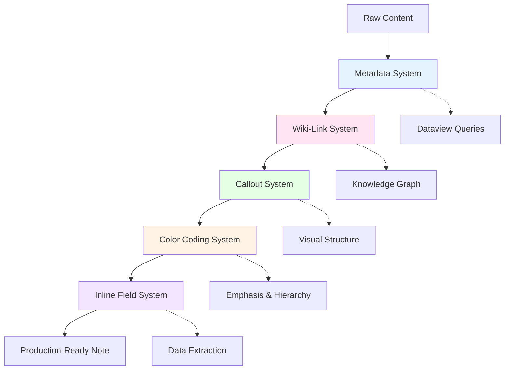

# Formatting Systems Reference: Production-Ready Output Standards

> [!abstract] Overview
> Claude Code implements five integrated formatting systems that transform raw content into production-ready Obsidian notes. These systems ensure metadata compatibility, knowledge graph integration, semantic structure, visual emphasis, and automated data extraction. This reference provides comprehensive documentation of all formatting systems with implementation patterns, examples, and quality standards.

## Table of Contents

1. [Formatting System Architecture](#formatting-system-architecture)
2. [System 1: Metadata Header System](#system-1-metadata-header-system)
3. [System 2: Wiki-Link System](#system-2-wiki-link-system)
4. [System 3: Callout System](#system-3-callout-system)
5. [System 4: Semantic Color Coding System](#system-4-semantic-color-coding-system)
6. [System 5: Dataview Inline Field System](#system-5-dataview-inline-field-system)
7. [Note Type Specifications](#note-type-specifications)
8. [Integration Patterns](#integration-patterns)
9. [Best Practices](#best-practices)

---

## Formatting System Architecture

> [!principle-point] Core Concept
> Formatting systems are **functional infrastructure**, not decorative styling. Each system serves a specific purpose: metadata enables querying, wiki-links build knowledge graph, callouts provide semantic structure, coloring creates visual hierarchy, inline fields enable data extraction.

### Design Philosophy

[**Formatting-Philosophy**:: Formatting is functional infrastructure serving specific purposes: metadata enables Dataview querying, wiki-links build knowledge graph connectivity, callouts provide semantic structure and visual hierarchy, semantic coloring emphasizes key concepts, inline fields enable automated data extraction and analysis.]

**Core Principles:**

1. **Function Over Form**: Every formatting element serves a functional purpose (searchability, graph connectivity, data extraction)
2. **Obsidian Native**: All formatting uses Obsidian-native syntax (YAML, wiki-links, callouts, HTML spans, inline fields)
3. **Production-Ready**: Output requires zero post-processing by user
4. **Mandatory Application**: For note-type outputs, formatting is required, not optional
5. **Consistent Standards**: Formatting follows established patterns and density targets

### System Interaction Model



### Formatting Application Matrix

| System | Purpose | Obsidian Feature | Mandatory For | Density Target |
|--------|---------|------------------|---------------|----------------|
| **Metadata** | Querying & categorization | YAML frontmatter + Dataview | All note types | 3-5 tags, 2-4 aliases |
| **Wiki-Links** | Knowledge graph connectivity | `[[Wiki-Links]]` | All note types | 3-8 (atomic) to 20-50+ (MOC) |
| **Callouts** | Semantic structure | `> [!type]` blocks | All note types | 2-4 (atomic) to 8-15 (reference) |
| **Color Coding** | Visual emphasis | HTML `<span>` elements | Optional (recommended) | 15-30% of content max |
| **Inline Fields** | Data extraction | `[**Field**:: value]` | Reference/atomic notes | 3-8 (light) to 20-50+ (dense) |

---

## System 1: Metadata Header System

> [!definition] Metadata Header System
> **Purpose**: YAML frontmatter block providing structured metadata for Obsidian core features and Dataview plugin queries, enabling categorization, searching, filtering, and relationship tracking.

### System Overview

[**Metadata-Header-Purpose**:: YAML frontmatter providing structured metadata for Obsidian and Dataview, enabling note categorization, tag-based searching, alias resolution, status tracking, certainty assessment, and temporal tracking through standardized fields.]

**Critical Rule:** <span style='color: #FF00DC;'>YAML frontmatter MUST be at line 1 (absolute top of file)</span>

Not after title. Not after blank line. Not after callout. **Line 1**.

**Why This Matters:**
- Dataview cannot parse metadata if placed after content
- Obsidian metadata panel requires frontmatter at top
- User explicitly corrected this error
- Broken placement breaks automation and querying

### Standard YAML Structure

```yaml
---
tags: #primary-domain #methodology #content-type [#domain-specific] [#status]
aliases: [Alternative Name, Abbreviation, Related Term]
status: [seedling | budding | evergreen | wilting]
certainty: [speculative | provisional | moderate | established | verified]
created: YYYY-MM-DD
modified: YYYY-MM-DD
---
```

### Field Specifications

#### tags Field (Required, 3-5 tags)

**Purpose:** Primary categorization and filtering mechanism

**5-Tag Generation Heuristic:**

1. **Primary Domain Tag** (Required)
   - Broad category placing note in knowledge domain
   - Examples: `#pkm`, `#cognitive-science`, `#prompt-engineering`, `#programming`

2. **Methodology Tag** (Required)
   - Approach, framework, or technique category
   - Examples: `#zettelkasten`, `#spaced-repetition`, `#agile`, `#functional-programming`

3. **Content Type Tag** (Required)
   - Note classification by structure/purpose
   - Examples: `#reference-note`, `#atomic-concept`, `#moc`, `#synthesis-note`

4. **Domain-Specific Tag** (Optional)
   - Technical specifics, tools, technologies
   - Examples: `#python`, `#react`, `#dataview`, `#neural-networks`

5. **Status/Meta Tag** (Optional)
   - Workflow or state indicators
   - Examples: `#in-progress`, `#needs-review`, `#deprecated`, `#wip`

**Syntax Requirements:**
- Space-separated (not comma-separated)
- Hash prefix required: `#tag-name`
- Lowercase with hyphens: `#cognitive-science` (not `#Cognitive Science`)
- No special characters except hyphens

**Examples:**

```yaml
# Atomic Note on Learning Technique
tags: #learning #cognitive-science #atomic-concept #spaced-repetition

# Reference Note on Programming Framework
tags: #programming #web-development #reference-note #react #javascript

# MOC for Project Organization
tags: #pkm #project-management #moc #productivity

# Work-in-Progress Synthesis
tags: #ai #prompt-engineering #synthesis-note #in-progress
```

#### aliases Field (Recommended, 2-4 aliases)

**Purpose:** Alternative names enabling multiple access paths to same concept

**Include:**
- Common abbreviations (e.g., PKM for Personal Knowledge Management)
- Alternative terminology (e.g., Slip Box for Zettelkasten)
- Search-friendly variations (e.g., AI for Artificial Intelligence)
- Related terms users might search (e.g., Memory Systems for Cognitive Architecture)

**Syntax:**
```yaml
aliases: [Alternative Name 1, Abbreviation, Related Term]
```

**Examples:**

```yaml
# Cognitive Load Theory note
aliases: [CLT, Working Memory Theory, Cognitive Load]

# Personal Knowledge Management note
aliases: [PKM, Knowledge Management, Second Brain]

# Zettelkasten note
aliases: [Slip Box, Note-Taking System, Luhmann Method]
```

**Benefits:**
- `[[PKM]]` and `[[Personal Knowledge Management]]` both resolve to same note
- Search finds note via any alias
- Graph view shows connections via all alias variations

#### status Field (Optional but Recommended)

**Purpose:** Track note maturity and completeness

**Values:**
- `seedling` — Initial creation, rough draft, incomplete
- `budding` — Growing content, partial development
- `evergreen` — Mature, comprehensive, well-maintained
- `wilting` — Outdated, needs refresh, deprecated

**Example:**
```yaml
status: evergreen
```

**Usage Pattern:**
- New notes start as `seedling`
- As content develops, progress to `budding`
- Comprehensive, well-linked notes become `evergreen`
- Outdated content marked `wilting` for review/archival

#### certainty Field (Optional but Recommended)

**Purpose:** Indicate confidence level in content accuracy

**Values:**
- `speculative` — Hypothesis, unverified, exploratory
- `provisional` — Some evidence, needs confirmation
- `moderate` — Reasonably supported, likely accurate
- `established` — Well-supported, standard knowledge
- `verified` — Confirmed, authoritative, definitive

**Alternative Syntax:**
```yaml
certainty: ^verified
```

**Usage Pattern:**
- Research notes often start `speculative` or `provisional`
- Reference notes on established topics: `established` or `verified`
- Synthesis notes combining sources: `moderate` to `established`

#### created and modified Fields (Recommended)

**Purpose:** Temporal tracking for currency assessment

**Format:** `YYYY-MM-DD` (ISO 8601 date)

**Example:**
```yaml
created: 2026-01-06
modified: 2026-01-06
```

**Automation:**
- Templater can auto-populate on creation: `<% tp.date.now("YYYY-MM-DD") %>`
- Some plugins update `modified` automatically on edit

### Complete Examples

#### Atomic Note Metadata

```yaml
---
tags: #learning #cognitive-science #atomic-concept #memory
aliases: [Spaced Repetition, Spacing Effect, Distributed Practice]
status: evergreen
certainty: verified
created: 2025-11-15
modified: 2026-01-06
---
```

#### Reference Note Metadata

```yaml
---
tags: #programming #web-development #reference-note #react #javascript
aliases: [React, React.js, React Framework]
status: evergreen
certainty: established
created: 2025-10-20
modified: 2026-01-05
---
```

#### MOC Metadata

```yaml
---
tags: #pkm #knowledge-management #moc #productivity
aliases: [PKM Hub, Knowledge Management Index, Second Brain Navigation]
status: budding
certainty: moderate
created: 2026-01-01
modified: 2026-01-06
---
```

### Integration with Dataview

**Query by Tag:**
```dataview
LIST
FROM #reference-note
WHERE status = "evergreen"
SORT modified DESC
```

**Query by Certainty:**
```dataview
TABLE certainty, modified
FROM #cognitive-science
WHERE certainty IN ["established", "verified"]
```

**Query by Aliases:**
```dataview
TABLE aliases, tags
WHERE contains(aliases, "PKM")
```

### Common Pitfalls

> [!warning] Critical Errors to Avoid

**1. Metadata After Title (BREAKS DATAVIEW)**

❌ **WRONG:**
```markdown
# My Note Title

---
tags: #example
---
```

✅ **CORRECT:**
```markdown
---
tags: #example
---

# My Note Title
```

**2. Comma-Separated Tags**

❌ **WRONG:**
```yaml
tags: #example, #test, #note
```

✅ **CORRECT:**
```yaml
tags: #example #test #note
```

**3. Missing Hash Prefix**

❌ **WRONG:**
```yaml
tags: example test note
```

✅ **CORRECT:**
```yaml
tags: #example #test #note
```

**4. Too Many or Too Few Tags**

❌ **WRONG (too few):**
```yaml
tags: #note
```

❌ **WRONG (too many):**
```yaml
tags: #note #example #test #demo #draft #wip #idea #concept #learning
```

✅ **CORRECT (3-5 focused tags):**
```yaml
tags: #learning #cognitive-science #atomic-concept
```

---

## System 2: Wiki-Link System

> [!definition] Wiki-Link System
> **Purpose**: Create bidirectional connections between notes using `[[Wiki-Link]]` syntax, building a knowledge graph that enables non-linear navigation, concept exploration, and emergent insight discovery.

### System Overview

[**Wiki-Link-Purpose**:: Bidirectional linking using `[[Wiki-Link]]` syntax to create knowledge graph connections, enabling non-linear navigation, context-aware exploration, concept relationship mapping, and emergent insight discovery through graph density.]

**Core Principle:** <span style='color: #FFC700;'>Graph Density Over Isolation</span>

Notes without links are isolated islands. Connected notes form a navigable knowledge graph where insights emerge from relationships.

**Philosophy:**
- **Never under-link** — err on side of more links
- **Link concepts, not adjectives** — `[[Cognitive Load]]` not `[[High]]`
- **First mention priority** — link first occurrence of concept
- **Context over precision** — better to have 25 links with some "wrong" than 8 "perfect" links

### Discovery Heuristic

Format as `[[Wiki-Link]]` if term meets **ANY** of these criteria:

| Criterion | Description | Example |
|-----------|-------------|---------|
| **Core Concept** | Central to response content | `[[Cognitive Load Theory]]` |
| **Technical Term** | Requires definition or explanation | `[[Working Memory]]`, `[[Gradient Descent]]` |
| **Linkable Topic** | Has potential for separate note | `[[Spaced Repetition]]` |
| **Cross-Reference** | Connects to existing knowledge | `[[Zettelkasten Method]]` |
| **Exploratory Depth** | Subject area with theoretical foundation | `[[Instructional Design]]` |
| **Framework/Methodology** | Named approach or system | `[[Agile Development]]` |

**Mental Model:** If you would explain this term to someone unfamiliar with it, or if it could warrant its own note, link it.

### Target Density Guidelines

[**Wiki-Link-Density-Targets**:: Atomic notes: 3-8 highly relevant links, Reference notes: 15-40 for graph density, MOCs: 20-50+ as primary feature, Synthesis notes: 10-25 showing relationships, Simple responses: 3-8 contextual links.]

| Note Type | Target Range | Rationale |
|-----------|--------------|-----------|
| **Simple Query Response** | 3-8 links | Basic connectivity without overwhelming |
| **Atomic Note** | 3-8 highly relevant | Focused concept with key relationships |
| **Reference Note** | 15-40 links | Comprehensive coverage requires dense graph integration |
| **MOC** | 20-50+ links | Navigation hub—links are the primary feature |
| **Synthesis Note** | 10-25 links | Multi-concept integration showing relationships |

**Distribution Pattern:**
- Introductory paragraph: 2-4 links (key concepts)
- Body sections: 1-2 links per 100 words
- Examples: Link to concepts being illustrated
- Conclusion/expansion: 3-5 links (future exploration)

### Linking Patterns

#### Pattern 1: Concept Introduction

```markdown
[[Cognitive Load Theory]] explains how [[Working Memory]] limitations affect learning. The theory identifies three types of load: [[Intrinsic Load]], [[Extraneous Load]], and [[Germane Load]].
```

**Analysis:** 5 links in 2 sentences—appropriate for reference note introduction.

#### Pattern 2: Technical Explanation

```markdown
In [[Machine Learning]], [[Neural Networks]] use [[Backpropagation]] to update [[Weights]] based on [[Gradient Descent]] optimization. The [[Loss Function]] measures prediction error, guiding the [[Training Process]] toward better [[Generalization]].
```

**Analysis:** 8 links in 2 sentences—high density appropriate for technical content.

#### Pattern 3: Contextual Linking

```markdown
The [[Feynman Technique]] involves explaining concepts in simple terms, identifying knowledge gaps, and iterating until understanding is complete. This approach aligns with principles from [[Active Learning]] and [[Metacognition]].
```

**Analysis:** 3 links in 2 sentences—moderate density for methodological content.

#### Pattern 4: MOC Structure

```markdown
## Core Concepts
- [[Neural Network Architecture]]
- [[Activation Functions]]
- [[Forward Propagation]]
- [[Backpropagation Algorithm]]
- [[Loss Functions]]
- [[Optimization Algorithms]]

## Architectures
- [[Convolutional Neural Networks]] (CNNs)
- [[Recurrent Neural Networks]] (RNNs)
- [[Transformers]]
- [[Autoencoders]]
```

**Analysis:** 12 links in small section—appropriate for MOC structure.

### Advanced Linking Techniques

#### Aliased Links

When display text should differ from target note:

```markdown
[[Cognitive Load Theory|CLT]] is a framework...
[[Zettelkasten Method|slip-box system]]...
[[Neural Networks|deep learning models]]...
```

#### Block Links

Link to specific section or block:

```markdown
See [[Cognitive Load Theory#Intrinsic Load]]
Reference [[React Hooks#useState]]
```

#### Embedded Links

Embed entire note:

```markdown
![[Definition - Spaced Repetition]]
```

#### Ghost Links

Placeholder for future notes:

```markdown
This concept relates to [[Self-Regulated Learning]] (note to be created).
```

### Linking Decision Tree

```
Encounter term while writing
│
├─ Is this a proper noun (person/place)? → Usually NO LINK
│
├─ Is this a common adjective/verb? → Usually NO LINK
│
├─ Could this term be its own note? → YES LINK
│
├─ Is this a technical term needing definition? → YES LINK
│
├─ Does this connect to existing knowledge? → YES LINK
│
└─ Would explaining this require >50 words? → YES LINK
```

### Integration with Graph View

**Benefits of Dense Linking:**
- **Graph View Navigation**: Visual exploration of concept relationships
- **Backlinks Panel**: See all notes referencing current note
- **Unlinked Mentions**: Discover implicit connections
- **Local Graph**: Visualize immediate neighborhood

**Graph Health Indicators:**
- Well-connected note: 5+ incoming, 5+ outgoing links
- Hub note (MOC): 20+ incoming or outgoing links
- Orphan note: <2 incoming or <2 outgoing (needs improvement)

### Best Practices

> [!helpful-tip] Wiki-Link Excellence Guidelines

**1. Link First Mention, Optionally Repeat**
First occurrence of concept should be linked. Subsequent mentions: link if >500 words apart.

**2. Link Concepts, Not Modifiers**
- ✅ `[[Cognitive Load]] is high when...`
- ❌ `Cognitive load is [[high]] when...`

**3. Bidirectional Thinking**
When creating link, ask: "Will I want to navigate back from the target?" If yes, ensure target links back.

**4. MOCs Are Link Aggregators**
Create MOCs when you have 10+ notes on a topic. MOC becomes navigation hub with dense linking.

**5. Prefer Over-Linking to Under-Linking**
25 links with 3 "questionable" ones > 10 "perfect" links. Graph density matters more than precision.

### Common Pitfalls

> [!warning] Linking Mistakes to Avoid

**1. Sparse Linking**
❌ 3 links in 2000-word reference note
✅ 15-40 links for reference note

**2. Linking Common Words**
❌ `[[The]] [[importance]] [[of]] [[learning]]`
✅ `The importance of [[Active Learning]]`

**3. Broken Link Syntax**
❌ `[Cognitive Load](cognitive-load.md)` (markdown link)
✅ `[[Cognitive Load]]` (wiki-link)

**4. No Backlink Strategy**
Creating links from Note A → Note B but Note B never links back creates one-way graph.

**5. Duplicate Links in Same Sentence**
❌ `[[React]] is a [[React]] framework...`
✅ `[[React]] is a JavaScript framework...`

---

## System 3: Callout System

> [!definition] Callout System
> **Purpose**: Provide semantic structure and visual hierarchy using typed callout blocks (`> [!type]`) that indicate the function and importance of content sections, improving scanability and comprehension.

### System Overview

[**Callout-System-Purpose**:: Semantic structure and visual hierarchy using typed callout blocks that indicate content function (definition, example, warning, etc.), improving document scanability, comprehension, and cognitive organization through consistent visual cues.]

**Core Principle:** <span style='color: #FFC700;'>Semantic Function Over Decoration</span>

Callouts communicate **what kind** of content follows, not just "this is highlighted." Each callout type has specific semantic meaning.

### Callout Taxonomy (25+ Types)

#### STRUCTURAL CALLOUTS (Organization & Overview)

**Purpose:** Document structure and high-level organization

| Type | Syntax | Purpose | Usage Pattern |
|------|--------|---------|---------------|
| **abstract** | `> [!abstract]` | Summary or overview | Document/section introductions |
| **definition** | `> [!definition]` | Concept definitions | Formal concept introductions |
| **principle-point** | `> [!principle-point]` | Foundational principles | Core conceptual foundations |

**Examples:**

```markdown
> [!abstract] Document Overview
> This reference provides comprehensive coverage of cognitive load theory, including theoretical foundations, empirical evidence, and practical applications.

> [!definition] Cognitive Load
> The total amount of mental effort being used in working memory.

> [!principle-point] Working Memory Limitation
> Human working memory can process approximately 5-9 information elements simultaneously, creating a fundamental constraint on cognitive processing.
```

#### COGNITIVE CALLOUTS (Thinking & Understanding)

**Purpose:** Aid comprehension through examples and analogies

| Type | Syntax | Purpose | Usage Pattern |
|------|--------|---------|---------------|
| **example** | `> [!example]` | Concrete illustrations | After abstract explanations |
| **analogy** | `> [!analogy]` | Comparative understanding | Complex concept simplification |
| **thought-experiment** | `> [!thought-experiment]` | Exploratory reasoning | Hypothesis exploration |

**Examples:**

```markdown
> [!example] High vs Low Cognitive Load
> **High Load:** Learning programming by reading obfuscated code with no comments
> **Low Load:** Learning with annotated, well-structured code examples and explanations

> [!analogy] Working Memory as RAM
> Working memory functions like computer RAM: limited capacity, fast access, volatile (information disappears when not actively maintained).

> [!thought-experiment] Cognitive Load in VR Learning
> What if we could offload working memory to external displays in VR environments? Would this eliminate cognitive load constraints?
```

#### ANALYTICAL CALLOUTS (Critical Thinking)

**Purpose:** Present arguments, evidence, and counterpoints

| Type | Syntax | Purpose | Usage Pattern |
|------|--------|---------|---------------|
| **key-claim** | `> [!key-claim]` | Central arguments | Main assertions |
| **evidence** | `> [!evidence]` | Supporting data | After claims |
| **counter-argument** | `> [!counter-argument]` | Alternative perspectives | Balanced analysis |

**Examples:**

```markdown
> [!key-claim] Worked Examples Reduce Cognitive Load
> Providing fully worked examples reduces extraneous cognitive load by eliminating problem-solving demands during initial learning.

> [!evidence] Empirical Support
> Sweller & Cooper (1985) demonstrated that students studying worked examples outperformed those solving equivalent problems, with reduced mental effort reported.

> [!counter-argument] Expertise Reversal Effect
> For expert learners, worked examples can increase cognitive load by forcing processing of information they've already automated (Kalyuga et al., 2003).
```

#### PRAGMATIC CALLOUTS (Application & Guidance)

**Purpose:** Practical implementation and usage

| Type | Syntax | Purpose | Usage Pattern |
|------|--------|---------|---------------|
| **methodology-and-sources** | `> [!methodology-and-sources]` | Process explanation | How-to sections |
| **what-this-does** | `> [!what-this-does]` | Functional description | Code/tool explanations |
| **helpful-tip** | `> [!helpful-tip]` | Practical guidance | Best practices |

**Examples:**

```markdown
> [!methodology-and-sources] Calculating Cognitive Load
> Subjective cognitive load can be measured using the NASA-TLX scale or Paas scale. Objective measures include dual-task methodology and psychophysiological indicators.

> [!what-this-does] Dataview Query Function
> This query aggregates all notes tagged #reference-note, calculates their wiki-link density, and sorts by connectivity to identify knowledge graph hubs.

> [!helpful-tip] Reducing Extraneous Load
> When creating instructional materials, integrate text and diagrams (avoiding split-attention effect), use worked examples before problems, and sequence from simple to complex.
```

#### DIRECTIVE CALLOUTS (Attention & Warnings)

**Purpose:** Direct reader attention to critical information

| Type | Syntax | Purpose | Usage Pattern |
|------|--------|---------|---------------|
| **important** | `> [!important]` | Critical information | Key points |
| **warning** | `> [!warning]` | Cautions and limitations | Risk communication |
| **attention** | `> [!attention]` | Focus points | Crucial details |

**Examples:**

```markdown
> [!important] Intrinsic Load Cannot Be Eliminated
> Intrinsic cognitive load is inherent to the material's complexity and cannot be reduced without simplifying the content itself or changing prerequisites.

> [!warning] Overload Leads to Failure
> When cognitive load exceeds working memory capacity, learning fails. New information is not encoded into long-term memory.

> [!attention] Context Dependency
> Optimal cognitive load varies by learner expertise, prior knowledge, and domain. What's appropriate for novices may be inadequate for experts.
```

### Target Density Guidelines

[**Callout-Density-Targets**:: Simple queries: 2-3 callouts, Atomic notes: 2-4 callouts, Reference notes: 8-15 callouts, Technical guides: 10-20 callouts, MOCs: Minimal (3-6) for section organization.]

| Content Type | Target Callouts | Rationale |
|--------------|-----------------|-----------|
| **Simple query responses** | 2-3 | Basic structure without overwhelming |
| **Atomic notes** | 2-4 | Focused callouts (definition + example + tip) |
| **Reference notes** | 8-15 | Comprehensive structure requires more organization |
| **Technical guides** | 10-20 | Step-by-step processes benefit from heavy callout usage |
| **MOCs** | 3-6 | Minimal—links are primary feature, not callouts |

### Callout Selection Guide

**Decision Tree:**

```
Need to structure content
│
├─ Defining a concept? → [!definition]
├─ Introducing document/section? → [!abstract]
├─ Providing concrete example? → [!example]
├─ Making main argument? → [!key-claim]
├─ Supporting with data? → [!evidence]
├─ Presenting alternative view? → [!counter-argument]
├─ Explaining process? → [!methodology-and-sources]
├─ Describing function? → [!what-this-does]
├─ Sharing practical tip? → [!helpful-tip]
├─ Highlighting crucial info? → [!important]
├─ Warning about risk/limitation? → [!warning]
└─ Directing attention? → [!attention]
```

### Custom Callout Types

Obsidian supports custom callout types. Define in CSS:

```css
.callout[data-callout="protocol"] {
    --callout-color: 100, 150, 255;
}
```

Then use:
```markdown
> [!protocol] Anti-Duplication Protocol
> Always run vscan before creating new notes.
```

### Best Practices

> [!helpful-tip] Callout Excellence Guidelines

**1. Semantic Correctness**
Use callouts that match content function. Don't use `[!example]` for definitions or `[!warning]` for tips.

**2. Balanced Distribution**
Spread callouts throughout document. Don't cluster all at start or end.

**3. Callout Density Balance**
Too few: Document lacks structure
Too many: Every paragraph callout-wrapped (overwhelming)
Sweet spot: 1 callout per 200-300 words

**4. Nesting Sparingly**
Avoid nesting callouts inside callouts unless truly necessary for hierarchical structure.

**5. Combine with Color Coding**
Callouts provide structure, color coding emphasizes concepts. Use together.

### Common Pitfalls

> [!warning] Callout Mistakes to Avoid

**1. Generic Callout Usage**
❌ Using only `[!note]` for everything
✅ Using semantic types (`[!definition]`, `[!example]`, `[!warning]`)

**2. Callout Overload**
❌ Every paragraph wrapped in callout
✅ Strategic callouts for key sections (8-15 in reference note)

**3. Wrong Semantic Type**
❌ `> [!example]` containing definition
✅ `> [!definition]` for definitions, `> [!example]` for examples

**4. No Titles**
❌ `> [!important]` with no title or context
✅ `> [!important] Critical Limitation`

---

## System 4: Semantic Color Coding System

> [!definition] Semantic Color Coding System
> **Purpose**: Apply semantic color emphasis using HTML `<span>` elements to create visual hierarchy, emphasize key concepts, and communicate functional roles through consistent color semantics.

### System Overview

[**Color-Coding-Purpose**:: Visual hierarchy and semantic emphasis using HTML span elements with consistent color semantics to highlight key concepts (gold), structural elements (crimson), technical terms (amethyst), warnings (magenta), definitions (green), and references (orange).]

**Core Principle:** <span style='color: #FFC700;'>Semantic Color, Not Decoration</span>

Colors have **meaning**—they indicate the role and importance of content, not just "this looks nice."

### Color Semantic System

| Role | Color Name | Hex Code | Semantic Meaning | When to Use |
|------|------------|----------|------------------|-------------|
| **Primary** | Imperial Gold | `#FFC700` | Key concepts, definitions, core arguments | The most important term in sentence |
| **Secondary** | Vivid Crimson | `#E50000` | Structural elements, meta-notes, context | Framework names, section references |
| **Technical** | Deep Amethyst | `#9E6CD3` | Technical terms, syntax, code references | Programming terms, algorithms |
| **Critical** | Neon Magenta | `#FF00DC` | Warnings, conflicts, errors, attention | Things that could go wrong |
| **Definition** | Terminal Green | `#27FF00` | Verified truths, established principles | Proven facts, authoritative statements |
| **Reference** | Reactor Orange | `#FF5700` | Citations, sources, questions | External references, open questions |

### Syntax and Application

**Basic Syntax:**
```html
<span style='color: #FFC700;'>Key concept text</span>
```

**Examples by Semantic Role:**

```markdown
<span style='color: #FFC700;'>Cognitive Load Theory</span> identifies three types of load: <span style='color: #27FF00;'>intrinsic load</span> (inherent complexity), <span style='color: #E50000;'>extraneous load</span> (poor design), and <span style='color: #9E6CD3;'>germane load</span> (productive effort). Exceeding <span style='color: #FF00DC;'>working memory capacity</span> causes learning failure.
```

**Color Role Distribution:**
- **Primary (Gold)**: 40% of colored text — Main concepts
- **Secondary (Crimson)**: 20% — Structural/contextual
- **Technical (Amethyst)**: 15% — Technical terminology
- **Critical (Magenta)**: 10% — Warnings/important
- **Definition (Green)**: 10% — Verified facts
- **Reference (Orange)**: 5% — Citations/questions

### Density Guidelines

[**Color-Density-Guideline**:: Target 15-30% of content maximum colored to create visual rhythm without overwhelming. Distribute colors semantically, prioritize key concepts (gold), use magenta sparingly for actual warnings/critical info.]

**Target:** 15-30% of content maximum

**Why Not More:**
- 40%+ colored content becomes overwhelming
- Visual fatigue reduces effectiveness
- Key concepts lose emphasis when everything is emphasized

**Distribution Pattern:**
```markdown
Paragraph example:
<span style='color: #FFC700;'>Primary concept</span> connects to secondary ideas through relationships. Technical implementation uses <span style='color: #9E6CD3;'>specific algorithms</span> to achieve <span style='color: #27FF00;'>proven outcomes</span>. <span style='color: #FF00DC;'>Critical limitation</span>: doesn't work under X conditions.
```

4 colors in ~40-word paragraph = ~25% colored content ✅

### Use Case Examples

#### Example 1: Conceptual Explanation

```markdown
<span style='color: #FFC700;'>Working memory</span> is the cognitive system responsible for temporarily holding and manipulating information during complex tasks. According to <span style='color: #27FF00;'>Baddeley's model</span>, it consists of the <span style='color: #E50000;'>central executive</span>, <span style='color: #9E6CD3;'>phonological loop</span>, and <span style='color: #9E6CD3;'>visuospatial sketchpad</span>. Capacity is limited to <span style='color: #FF00DC;'>approximately 7±2 items</span>.
```

**Analysis:**
- **Gold**: Core concept (working memory)
- **Green**: Established model (Baddeley)
- **Crimson**: Structural component (central executive)
- **Amethyst**: Technical components (phonological loop, visuospatial sketchpad)
- **Magenta**: Critical limitation (capacity)

#### Example 2: Technical Content

```markdown
<span style='color: #FFC700;'>Neural networks</span> use <span style='color: #9E6CD3;'>backpropagation</span> to compute <span style='color: #9E6CD3;'>gradients</span> of the <span style='color: #E50000;'>loss function</span> with respect to weights. The <span style='color: #9E6CD3;'>chain rule</span> enables efficient calculation through the network layers. <span style='color: #FF00DC;'>Vanishing gradients</span> occur when gradients become extremely small in deep networks.
```

**Analysis:**
- **Gold**: Core concept (neural networks)
- **Amethyst**: Technical terms (backpropagation, gradients, chain rule)
- **Crimson**: Structural concept (loss function)
- **Magenta**: Critical problem (vanishing gradients)

#### Example 3: Instructional Content

```markdown
To reduce <span style='color: #E50000;'>extraneous cognitive load</span>, integrate text directly with diagrams rather than separating them. This prevents the <span style='color: #FF00DC;'>split-attention effect</span>. The <span style='color: #27FF00;'>integrated format principle</span> has been validated across numerous studies (Chandler & Sweller, 1991). Use <span style='color: #FFC700;'>worked examples</span> before problem-solving practice.
```

**Analysis:**
- **Crimson**: Type of load being addressed
- **Magenta**: Problem being prevented
- **Green**: Validated principle
- **Gold**: Key instructional strategy

### Color Coding Decision Tree

```
Emphasizing text
│
├─ Most important concept? → Gold (#FFC700)
├─ Structural/framework term? → Crimson (#E50000)
├─ Technical/algorithm term? → Amethyst (#9E6CD3)
├─ Warning/critical limitation? → Magenta (#FF00DC)
├─ Verified fact/principle? → Green (#27FF00)
└─ Citation/open question? → Orange (#FF5700)
```

### Best Practices

> [!helpful-tip] Color Coding Excellence

**1. Prioritize Key Concepts**
Gold is most visually prominent—reserve for truly key concepts, not every technical term.

**2. Magenta for Actual Warnings**
Don't overuse magenta. Reserve for genuine warnings, errors, critical limitations.

**3. Create Rhythm**
Distribute colored text throughout content. Don't cluster all at start.

**4. Combine with Callouts**
Color coding + callouts work together. Color emphasizes within prose, callouts structure sections.

**5. Test Readability**
If you find yourself squinting or overwhelmed, you've over-colored. Reduce density.

### Common Pitfalls

> [!warning] Color Coding Mistakes

**1. Color Overload**
❌ 60% of content colored
✅ 15-30% maximum

**2. Random Color Selection**
❌ Using colors based on "what looks good"
✅ Using colors based on semantic role

**3. Magenta Overuse**
❌ Every important point in magenta
✅ Magenta only for actual warnings/critical info

**4. Forgetting Accessibility**
Consider that some users may have color vision deficiency. Don't rely solely on color to convey critical information—combine with callouts or bold text.

---

## System 5: Dataview Inline Field System

> [!definition] Dataview Inline Field System
> **Purpose**: Embed structured data within prose using `[**Field-Name**:: value]` syntax, enabling automated extraction, querying, and analysis of note content through Dataview plugin.

### System Overview

[**Inline-Field-Purpose**:: Structured data embedding within prose using bracket-colon syntax enabling Dataview extraction, automated querying, aggregation analysis, and metadata-driven intelligence without breaking prose flow.]

**Core Principle:** <span style='color: #FFC700;'>Data Extraction Without Breaking Prose</span>

Inline fields embed structured data within natural prose, enabling automation without sacrificing readability.

### Syntax Specifications

**Primary Syntax:**
```markdown
[**Field-Name**:: Field value text that can be quite long and descriptive.]
```

**Requirements:**
- Double brackets around field name: `[**Field-Name**::`
- Field name in bold (between `**` markers)
- Double colon separator: `::`
- Space after colon
- Close with `]`

**Naming Convention:**
- PascalCase or kebab-case: `[**Field-Name**::` or `[**field-name**::`
- Descriptive: `[**Cognitive-Load-Definition**::` not `[**def**::`
- Category prefixes optional: `[**CLT-Principle**::` for organization

### Field Type Taxonomy

[**Inline-Field-Categories**:: Eight primary field categories: Definitions (concept meanings), Principles (foundational rules), Distinctions (comparative differences), Claims (empirical findings), Frameworks (model descriptions), Cautions (warnings/pitfalls), Processes (procedure summaries), Insights (key realizations).]

| Category | Format Pattern | Purpose | Example |
|----------|---------------|---------|---------|
| **Definitions** | `[**Term-Name**:: definition]` | Concept meanings | `[**Cognitive-Load**:: ...]` |
| **Principles** | `[**Principle-of-X**:: statement]` | Foundational rules | `[**Principle-of-Least-Effort**:: ...]` |
| **Distinctions** | `[**X-vs-Y**:: distinction]` | Comparative differences | `[**Intrinsic-vs-Extraneous-Load**:: ...]` |
| **Claims** | `[**Empirical-Finding**:: claim]` | Research findings | `[**Split-Attention-Effect**:: ...]` |
| **Frameworks** | `[**Model-Name**:: description]` | Model descriptions | `[**Baddeley-Working-Memory-Model**:: ...]` |
| **Cautions** | `[**Common-Pitfall**:: warning]` | Warnings/limitations | `[**Cognitive-Overload-Risk**:: ...]` |
| **Processes** | `[**Process-Name**:: steps]` | Procedure summaries | `[**Backpropagation-Process**:: ...]` |
| **Insights** | `[**Key-Insight**:: realization]` | Important realizations | `[**Emergent-Graph-Property**:: ...]` |

### Target Density Guidelines

| Content Depth | Target Fields | Rationale |
|---------------|---------------|-----------|
| **Light content** (800-1500 words) | 3-8 | Basic extraction capability |
| **Medium content** (1500-3000 words) | 8-20 | Substantial queryable data |
| **Dense reference** (3000+ words) | 20-50+ | Comprehensive data extraction |
| **Technical docs** | 15-30 | Process steps, definitions, algorithms |

### Implementation Examples

#### Example 1: Cognitive Science Reference Note

```markdown
# Cognitive Load Theory

[**Cognitive-Load-Theory-Definition**:: Theory describing how working memory limitations affect learning, identifying three types of cognitive load: intrinsic, extraneous, and germane.]

[**Working-Memory-Capacity**:: Humans can process approximately 5-9 information elements simultaneously in working memory, creating fundamental constraints on learning and problem-solving.]

## Types of Cognitive Load

### Intrinsic Load

[**Intrinsic-Load**:: Cognitive load inherent to the learning material's complexity, determined by element interactivity, cannot be reduced without changing the material itself.]

[**Element-Interactivity**:: The degree to which elements of information must be processed simultaneously in working memory to be understood. High interactivity creates high intrinsic load.]

### Extraneous Load

[**Extraneous-Load**:: Unnecessary cognitive load from ineffective instructional presentation, can and should be minimized through better instructional design.]

[**Split-Attention-Effect**:: When related information is spatially or temporally separated, working memory must hold and integrate pieces, unnecessarily increasing extraneous load.]

### Germane Load

[**Germane-Load**:: Productive cognitive effort directed toward learning processes like schema construction and automation, should be optimized within working memory constraints.]

[**Schema-Construction**:: Process of organizing information into meaningful patterns stored in long-term memory, reducing future working memory demand for that content.]

## Instructional Principles

[**CLT-Instructional-Principle**:: Effective instruction minimizes extraneous load, manages intrinsic load through sequencing, and optimizes germane load for schema construction within working memory limits.]

[**Worked-Example-Effect**:: Providing fully worked examples reduces cognitive load compared to problem-solving during initial learning, enabling focus on schema construction rather than search processes.]

[**Common-Pitfall-Cognitive-Overload**:: Attempting to teach complex material without managing cognitive load leads to learning failure when total load exceeds working memory capacity.]
```

**Field Count:** 11 inline fields in ~400-word section

**Queryable Data:**
- All definitions extractable
- Principles can be aggregated
- Pitfalls can be filtered
- Framework elements identified

#### Example 2: Technical Documentation

```markdown
# Neural Network Backpropagation

[**Backpropagation-Definition**:: Algorithm for computing gradients of loss function with respect to network weights, enabling weight updates through gradient descent optimization.]

[**Backpropagation-Process**:: 1) Forward pass computes predictions, 2) Loss function measures error, 3) Backward pass computes gradients using chain rule, 4) Weights updated via gradient descent.]

[**Chain-Rule-Application**:: Backpropagation applies chain rule from calculus to efficiently compute how small weight changes affect overall network loss, propagating error gradients backwards through layers.]

[**Vanishing-Gradient-Problem**:: In deep networks, gradients can become extremely small during backpropagation, preventing effective learning in early layers, particularly with sigmoid/tanh activations.]

[**Gradient-Explosion-Problem**:: Conversely, gradients can become extremely large, causing unstable updates and divergence, particularly in recurrent neural networks without proper initialization or clipping.]

[**Common-Pitfall-Learning-Rate**:: Learning rate too high causes divergence, too low causes extremely slow convergence. Requires careful tuning or adaptive methods like Adam optimizer.]
```

**Field Count:** 6 inline fields in ~200-word section

**Dataview Query Potential:**
```dataview
TABLE Process-Name, Process-Description
FROM "machine-learning"
WHERE contains(Process-Name, "Backpropagation")
```

### Dataview Query Integration

**Querying Inline Fields:**

```dataview
TABLE Definition
FROM #cognitive-science
WHERE Definition
SORT file.name
```

**Filtering by Field Content:**

```dataview
LIST
FROM #machine-learning
WHERE contains(Common-Pitfall, "gradient")
```

**Aggregating Field Types:**

```dataview
TABLE
  length(rows.Principle) as "Principles Count",
  length(rows.Definition) as "Definitions Count"
FROM #reference-note
GROUP BY file.folder
```

### Best Practices

> [!helpful-tip] Inline Field Excellence

**1. Embed in Prose, Don't Break Flow**
Inline fields should integrate naturally into sentences, not disrupt reading.

**2. Descriptive Field Names**
`[**Cognitive-Load-Definition**::` is better than `[**def**::` or `[**cog-load**::`

**3. Value Completeness**
Field values should be self-contained and meaningful when extracted:
- ❌ `[**Definition**:: see above]`
- ✅ `[**Definition**:: Complete definition text...]`

**4. Strategic Placement**
Place inline fields after introducing concept in prose:
```markdown
Cognitive load theory addresses working memory limitations. [**CLT-Definition**:: Theory describing...]
```

**5. Category Consistency**
Use consistent field name patterns across notes for easier querying:
- `[**X-Definition**::` for all definitions
- `[**Principle-of-X**::` for all principles
- `[**X-vs-Y**::` for all distinctions

### Common Pitfalls

> [!warning] Inline Field Mistakes

**1. Breaking Prose Flow**
❌ Placing inline field mid-sentence awkwardly
✅ Placing after complete thought or sentence

**2. Incomplete Values**
❌ `[**Definition**:: See section 3]`
✅ `[**Definition**:: Complete standalone definition]`

**3. Inconsistent Naming**
❌ `[**def**::`, `[**Definition**::`, `[**define**::`  in same note
✅ `[**X-Definition**::` pattern consistently

**4. Wrong Syntax**
❌ `**Field**:: value` (missing brackets)
❌ `[Field:: value]` (missing bold markers)
✅ `[**Field**:: value]`

**5. No Fields in Dense Content**
2500-word reference note with 0 inline fields = missed extraction opportunity

---

## Note Type Specifications

### Note Type Formatting Matrix

[**Note-Type-Matrix**:: Four primary note types with specific formatting requirements: Atomic (3-4 tags, 300-800 words, 3-8 links, 2-4 callouts), Reference (4-5 tags, 1500-4000+ words, 15-40 links, 8-15 callouts), MOC (3-4 tags, variable length, 20-50+ links, minimal callouts), Synthesis (4-5 tags, variable, 10-25 links, connection callouts).]

| Note Type | Tags | Length | Wiki-Links | Callouts | Inline Fields | Key Features |
|-----------|------|--------|------------|----------|---------------|--------------|
| **Atomic** | 3-4 | 300-800 | 3-8 | 2-4 | 5-12 | Single concept, thorough explanation |
| **Reference** | 4-5 | 1500-4000+ | 15-40 | 8-15 | 20-50+ | Exhaustive coverage, examples, diagrams |
| **MOC** | 3-4 (#moc) | Variable | 20-50+ | 3-6 | 3-8 | Curated navigation hub, link-heavy |
| **Synthesis** | 4-5 | Variable | 10-25 | 5-10 | 8-20 | Multi-concept integration, relationships |

### Atomic Note Template

```markdown
---
tags: #domain #methodology #atomic-concept [#specific-tech]
aliases: [Alternative Name, Abbreviation]
status: [seedling | budding | evergreen]
certainty: [provisional | moderate | established]
created: YYYY-MM-DD
modified: YYYY-MM-DD
---

# Concept Name

> [!definition] Concept Name
> [**Concept-Definition**:: Clear, complete definition of the concept in one or two sentences.]

[Explanatory paragraph with 2-3 [[Wiki-Links]] to related concepts.]

> [!example] Concrete Example
> [Specific illustration demonstrating the concept in action.]

## Key Characteristics

[**Key-Characteristic-1**:: Description of first key characteristic.]
[**Key-Characteristic-2**:: Description of second key characteristic.]

## Applications

[[Application-Area-1]], [[Application-Area-2]]

> [!helpful-tip] Practical Guidance
> [Actionable advice for using or understanding this concept.]

---

# 🔗 Related Topics for PKB Expansion

1. **[[Related-Concept-1]]** — Connection explanation
2. **[[Related-Concept-2]]** — Connection explanation
3. **[[Related-Concept-3]]** — Connection explanation
4. **[[Related-Concept-4]]** — Connection explanation
```

**Formatting Stats:**
- Metadata: 3-4 tags, 2 aliases
- Wiki-Links: 6-8 (concept intro, applications, related topics)
- Callouts: 3 (definition, example, helpful-tip)
- Inline Fields: 3-4 (definition, characteristics)
- Length: 300-800 words

### Reference Note Template

```markdown
---
tags: #domain #methodology #reference-note #specific-tech [#status]
aliases: [Full Name, Abbreviation, Alternative Term, Search Term]
status: evergreen
certainty: established
created: YYYY-MM-DD
modified: YYYY-MM-DD
---

# Topic Name

> [!abstract] Overview
> [High-level summary of entire topic in 2-3 sentences, introducing main concepts.]

[**Topic-Definition**:: Comprehensive definition of the main topic.]

## Historical Context

[[Originator-Name]] developed [[Topic]] in [year]...

[**Historical-Context**:: Brief history providing origin and development context.]

## Core Concepts

### Concept 1

> [!definition] Concept 1
> [**Concept-1-Definition**:: Definition...]

[Detailed explanation with multiple [[Related-Terms]]...]

> [!example] Concept 1 Example
> [Concrete illustration...]

### Concept 2

> [!definition] Concept 2
> [**Concept-2-Definition**:: Definition...]

[Detailed explanation...]

## Theoretical Foundations

[**Theoretical-Foundation**:: Core theoretical principles...]

### Framework Model

> [!principle-point] Key Principle
> [**Key-Principle**:: Statement of foundational principle...]

## Practical Applications

> [!methodology-and-sources] Application Method
> [How to apply this in practice...]

[**Application-Pattern-1**:: Description of first application pattern...]
[**Application-Pattern-2**:: Description of second application pattern...]

> [!example] Real-World Example
> [Detailed case study or application scenario...]

## Limitations and Criticisms

> [!warning] Key Limitation
> [**Primary-Limitation**:: Description of main limitation or constraint...]

> [!counter-argument] Alternative Perspective
> [Discussion of criticism or alternative viewpoint...]

[**Common-Pitfall**:: Description of typical misuse or misunderstanding...]

---

# 🔗 Related Topics for PKB Expansion

1. **[[Related-Topic-1]]**
   - *Connection*: How this relates to current topic
   - *Depth Potential*: Why separate note warranted
   - *Knowledge Graph Role*: Position in broader knowledge structure

[Continue for 4 total topics...]
```

**Formatting Stats:**
- Metadata: 4-5 tags, 3-4 aliases
- Wiki-Links: 20-35 (distributed throughout)
- Callouts: 10-15 (various semantic types)
- Inline Fields: 25-40 (definitions, principles, patterns, limitations)
- Length: 2000-4000+ words

---

## Integration Patterns

### Cross-System Synergy

**Pattern 1: Metadata + Wiki-Links = Queryable Graph**

```markdown
---
tags: #cognitive-science #learning #reference-note
status: evergreen
---

# Cognitive Load Theory

[[Working Memory]] limitations create [[Cognitive Load]]...

# Dataview Query:
LIST
FROM #cognitive-science AND #reference-note
WHERE status = "evergreen"
```

**Pattern 2: Callouts + Color + Inline Fields = Structured Data**

```markdown
> [!definition] Cognitive Load
> [**Cognitive-Load-Definition**:: <span style='color: #FFC700;'>Total mental effort</span> used in working memory during task execution.]
```

**Result:** Definition is semantically marked (callout), visually emphasized (color), and extractable (inline field).

### System Application Sequence

**Standard Note Generation Workflow:**

1. **Metadata System** (First): Create YAML frontmatter at line 1
2. **Title**: H1 heading
3. **Wiki-Link System** (During Writing): Link concepts as you write
4. **Callout System** (During Writing): Structure sections with semantic callouts
5. **Color Coding System** (During Writing): Emphasize key concepts
6. **Inline Field System** (During Writing): Extract definitions, principles
7. **Expansion Section** (Last): 4 related topics with wiki-links

**Refactoring Workflow:**

1. Read existing content
2. **Metadata** (if missing/broken): Add or fix YAML frontmatter
3. **Wiki-Links** (if sparse): Add links to meet density target
4. **Callouts** (if lacking): Add semantic structure
5. **Color Coding** (if absent): Emphasize key concepts
6. **Inline Fields** (if missing): Extract definitions/principles

---

## Best Practices

### Universal Formatting Principles

> [!principle-point] Golden Rules

**1. Format While Writing, Not After**
Apply formatting during content generation, not as post-processing step. This ensures consistency and reduces rework.

**2. Metadata at Top is Non-Negotiable**
YAML frontmatter at line 1. User has explicitly corrected this multiple times. Dataview requires it.

**3. Function Drives Form**
Every formatting element serves a purpose. Don't format for aesthetics—format for functionality (querying, linking, extraction).

**4. Production-Ready Standard**
Every output should be immediately usable in vault without user post-processing. No placeholders, no "TODO" markers, no broken formatting.

**5. Density Targets Are Guidelines, Not Quotas**
15 wiki-links is better than forcing 20 irrelevant links to hit a "target." Use judgment.

### System-Specific Guidelines

**Metadata:**
- Always at line 1
- 3-5 focused tags (not 1, not 10)
- 2-4 meaningful aliases
- Include status and certainty for important notes

**Wiki-Links:**
- Link first mention of concepts
- Prefer over-linking to under-linking
- MOCs should be link-dense (20-50+)
- Check: Does this term merit its own note? → Link it

**Callouts:**
- Use semantic types correctly (definition ≠ example ≠ warning)
- Balance: 1 callout per 200-300 words
- Reference notes: 8-15 callouts
- MOCs: Minimal callouts (3-6)

**Color Coding:**
- Target 15-30% of content maximum
- Gold for most important concepts
- Magenta only for actual warnings
- Create rhythm, not overwhelm

**Inline Fields:**
- Descriptive field names (`[**Cognitive-Load-Definition**::`)
- Complete, standalone values
- Dense reference notes: 20-50+ fields
- Light content: 3-8 fields minimum

---

## Conclusion: Formatting as Infrastructure

The five formatting systems work together to transform raw content into **structured knowledge**:

- **Metadata** enables discovery and categorization
- **Wiki-Links** build navigable knowledge graph
- **Callouts** provide semantic structure and scanability
- **Color Coding** creates visual hierarchy and emphasis
- **Inline Fields** enable automated data extraction and analysis

When applied consistently and correctly, these systems create **production-ready outputs** that integrate seamlessly into Obsidian vaults, support powerful Dataview queries, and form dense knowledge graph connections.

**Key Takeaway:** Formatting is not optional decoration—it's functional infrastructure that makes notes discoverable, queryable, navigable, and analyzable. Master these five systems to produce consistently high-quality PKB content.

---

# 🔗 Related Topics for PKB Expansion

1. **[[Obsidian Plugin Ecosystem]]**
   - *Connection*: Formatting systems leverage Obsidian plugins (Dataview, Smart Connections)
   - *Depth Potential*: Deep dive into plugin capabilities, configuration, integration patterns
   - *Knowledge Graph Role*: Technical infrastructure enabling formatting systems

2. **[[Knowledge Graph Theory]]**
   - *Connection*: Wiki-link system builds knowledge graph; understanding graph theory enhances usage
   - *Depth Potential*: Graph metrics, centrality, clustering, emergent properties
   - *Knowledge Graph Role*: Theoretical foundation for link-based knowledge organization

3. **[[Data Extraction and Analysis Patterns]]**
   - *Connection*: Inline fields enable extraction; what analytical patterns emerge from structured data?
   - *Depth Potential*: Dataview advanced queries, statistical analysis, insight discovery
   - *Knowledge Graph Role*: Analytical layer above formatting infrastructure

4. **[[Visual Hierarchy and Information Design]]**
   - *Connection*: Color coding and callouts create visual hierarchy; formal design principles apply
   - *Depth Potential*: Typography, color theory, cognitive load in visual design, accessibility
   - *Knowledge Graph Role*: Human-factors foundation for formatting system effectiveness
