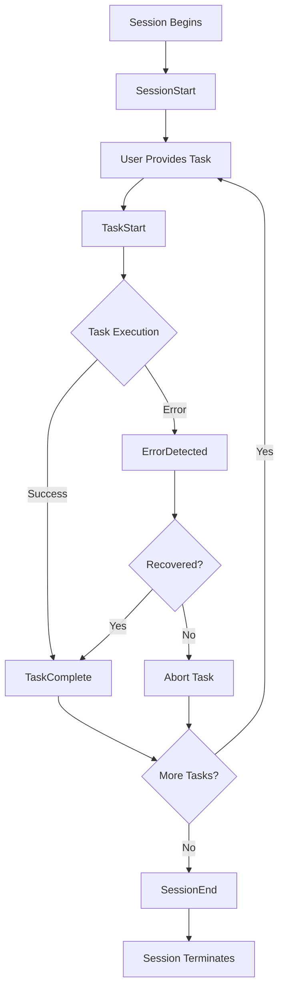

# Session Event Handlers (Hooks) Reference

> [!abstract] Overview
> Session Event Handlers (Hooks) are automated behaviors triggered by specific lifecycle events in Claude Code. They enable consistent, repeatable patterns for session initialization, task execution, error handling, and session cleanup. This reference provides comprehensive documentation of all 5 core lifecycle hooks with implementation details, use cases, and integration patterns.

## 📊 Quick Reference

| Hook | Trigger Event | Primary Purpose | Critical? |
|------|---------------|-----------------|-----------|
| [SessionStart](#sessionstart) | Session begins | Load context, initialize memory | ✅ Critical |
| [TaskStart](#taskstart) | Before task execution | Plan, validate, check duplicates | ✅ Critical |
| [ErrorDetected](#errordetected) | Error or failure occurs | Log, recover, prevent repeats | ⚠️ Important |
| [TaskComplete](#taskcomplete) | After task success | Document, evaluate, update memory | ⚠️ Important |
| [SessionEnd](#sessionend) | Session terminates | Sync memory, prepare handoff | ℹ️ Recommended |

---

## 🪝 Hook 1: SessionStart

### Purpose

**Primary Goal**: Establish session context by loading all relevant memory files and system configuration at the start of every Claude Code session.

**Why It Exists**: Claude Code operates in a stateless environment where each session starts with no knowledge of previous work. SessionStart hook solves this by systematically loading context from persistent memory files, enabling continuity across sessions.

### Trigger Conditions

**When Activated**:
- At the beginning of every Claude Code session
- Before any user interaction or task execution
- Automatically invoked by VSCode extension on session initialization

**Frequency**: Once per session (first action)

### Actions Executed

The SessionStart hook performs 6 sequential steps:

#### Step 1: Read System Prompt
```yaml
Action: Read `.claude/CLAUDE.md`
Purpose: Load core identity, principles, and operational protocols
Verification: System prompt successfully loaded
```

**Why Important**: System prompt defines Claude Code's identity, constitutional principles, and all operational protocols. Must be loaded before any other context.

#### Step 2: Load Memory Files (Priority Order)
```yaml
Files Loaded (in sequence):
  1. 00-meta/system/session-memory.md
     Purpose: Active context, recent session history
     Contains: Session logs, decisions, user preferences observed

  2. 00-meta/system/project-tracker.md
     Purpose: Active work, project status
     Contains: Current priorities, blockers, milestones

  3. 00-meta/system/user-preferences.md
     Purpose: Workflow patterns, communication style
     Contains: User expectations, established workflows

  4. 00-meta/system/vault-map.md
     Purpose: Structural context, vault organization
     Contains: Directory structure, key file locations
```

**Why This Order**: Prioritizes immediate context (current work) before broader context (vault structure).

#### Step 3: Conditional SPES Loading
```yaml
Condition: If prompt engineering work is detected
Action: Load SPES instruction files from:
  02-projects/_spes-sequential-prompt-engineering-system/
  01-claude-librarian-instructions/

Files Loaded:
  - 00-librarian-core-identity.md
  - 01-component-management-sop.md
  - 02-sequential-workflow-protocols.md
  - 03-context-handoff-procedures.md
  - 04-quality-assurance-checklist.md
  - 05-metadata-tagging-standards.md
  - 06-usage-analytics-protocols.md
```

**Detection Method**: Check if user's request contains keywords: "prompt", "template", "component", "SPES"

#### Step 4: Check Gemini Handoffs
```yaml
Action: Read 00-meta/system/session-memory.md
Purpose: Identify any handoffs from Gemini Code Assist
Search For:
  - "Gemini" mentions in recent entries
  - "Handoff to Claude" markers
  - Pending items flagged for Claude
```

**Multi-LLM Coordination**: Ensures seamless work continuity when alternating between Claude and Gemini.

#### Step 5: Acknowledge Readiness
```yaml
Output: Brief status summary
Format: |
  Session initialized. Loaded memory from activeContext.md.

  **Current Focus**: [summarize from activeContext]
  **Last Milestone**: [from progress.md]
  **Next Steps**: [from pending tasks]
```

**User Communication**: Confirms context loading succeeded and provides immediate orientation.

#### Step 6: Identify Task Context
```yaml
Action: Analyze loaded context to determine:
  - Current project phase
  - Active tasks in progress
  - Any handoffs requiring immediate attention
  - Blockers or pending decisions
```

**Readiness State**: Session is now fully initialized with complete context.

### Use Cases

**Use Case 1: Starting New Work Day**
```
Scenario: User opens Claude Code in the morning
Hook Behavior:
  - Loads yesterday's work from session-memory.md
  - Identifies where work left off from activeContext.md
  - Surfaces any pending items from project-tracker.md
  - User immediately oriented to continue work
```

**Use Case 2: Context Switch After Gemini Session**
```
Scenario: User worked with Gemini, now switching to Claude
Hook Behavior:
  - Detects Gemini's notes in session-memory.md
  - Identifies what Gemini completed
  - Understands handoff context
  - Picks up seamlessly from Gemini's work
```

**Use Case 3: Starting Prompt Engineering Task**
```
Scenario: User requests prompt component creation
Hook Behavior:
  - Loads standard memory files
  - Detects "prompt" keyword in request
  - Loads all SPES instruction files
  - Session begins with full SPES context loaded
```

### Integration Points

**VSCode Extension Integration**:
```typescript
// Pseudo-code for extension integration
class ClaudeCodeSession {
  async initialize() {
    // Trigger SessionStart hook
    await this.executeHook('SessionStart');

    // Wait for context loading to complete
    await this.waitForMemoryLoad();

    // Enable user interaction
    this.enableInterface();
  }
}
```

**Memory System Integration**:
- **Reads From**: `.claude/core/`, `00-meta/system/`
- **Writes To**: None (SessionStart is read-only)
- **Dependencies**: File system access to memory directories

### Error Handling

**Common Errors**:

| Error | Cause | Recovery |
|-------|-------|----------|
| `Memory file not found` | Missing session-memory.md | Initialize empty memory, warn user |
| `SPES files not found` | SPES system not set up | Skip SPES loading, continue with core memory |
| `Permission denied` | File access restricted | Request permissions, fail gracefully |
| `Corrupt YAML` | Malformed frontmatter | Skip problematic file, load others |

**Failure Mode**: If memory loading fails completely, session continues with empty context (degraded mode).

### Configuration

**Customization Options**:

```yaml
# .claude/config/session-config.yaml
session_start:
  enabled: true
  memory_files:
    - path: 00-meta/system/session-memory.md
      required: true
    - path: 00-meta/system/project-tracker.md
      required: false
  spes_auto_load: conditional  # Options: always, conditional, never
  acknowledgment: brief  # Options: brief, detailed, silent
```

### Performance Considerations

**Time Cost**: 1-2 seconds (typical)

**Optimization Strategies**:
- Cache frequently accessed files in memory
- Lazy-load SPES files only when needed
- Parallel file reads for independent files

### Best Practices

**DO**:
- ✅ Always let SessionStart complete before task execution
- ✅ Keep memory files under 100KB for fast loading
- ✅ Use session-memory.md as primary handoff mechanism
- ✅ Update memory files at session end to prepare for next session

**DON'T**:
- ❌ Don't skip SessionStart (breaks continuity)
- ❌ Don't modify memory files during SessionStart (read-only phase)
- ❌ Don't load excessive context (>500KB slows initialization)
- ❌ Don't proceed if critical memory files missing

---

## 🪝 Hook 2: TaskStart

### Purpose

**Primary Goal**: Ensure comprehensive planning and validation before executing any non-trivial task, preventing wasted effort on duplicate work or poorly-scoped tasks.

**Why It Exists**: Many tasks fail due to inadequate planning, duplicate effort, or missing context. TaskStart hook institutionalizes best practices for task initiation.

### Trigger Conditions

**When Activated**:
- Before beginning any non-trivial task
- After user provides task request
- Before first tool invocation for the task

**Non-Trivial Defined**:
- Tasks requiring ≥2 tool calls
- Tasks involving content creation
- Tasks with multiple steps or phases
- Any task where failure would waste significant effort

**Trivial Tasks (Hook Skipped)**:
- Single file reads
- Simple queries ("What is X?")
- Quick commands with no side effects

### Actions Executed

#### Step 1: Document Task Objectives
```yaml
Action: Create structured thinking block
Format: |
  <claude_thinking>
  **Task Analysis:**
  - What is being asked?
  - What is the expected outcome?
  - What are the success criteria?
  </claude_thinking>
```

**Purpose**: Explicit objective documentation prevents scope creep and enables verification.

#### Step 2: Develop Success Criteria
```yaml
Action: Define measurable success conditions before starting
Examples:
  - For documentation: "2,000-word reference doc with 15+ wiki-links"
  - For code: "Feature working with tests passing"
  - For research: "3-5 actionable insights with sources"
```

**Why Before Starting**: Success criteria defined after completion tend to rationalize whatever was produced. Define upfront for objectivity.

#### Step 3: Run Anti-Duplication Check
```yaml
Action: Execute vscan command
Syntax: vscan "[proposed note/concept]"
Purpose: Prevent creating duplicate or overlapping content

Decision Tree:
  Exact match found → Don't create, use existing
  Alias match found → Don't create, add to existing
  Fuzzy match found → Review, decide: append vs create
  No match found → Safe to create new
```

**Critical Protocol**: MANDATORY for any note creation task. Violations break vault integrity.

#### Step 4: Load Relevant Context
```yaml
Sources:
  - Memory files (activeContext, progress, systemPatterns)
  - Document chains (follow related notes)
  - Previous related work (search session-memory)
  - User preferences (workflow patterns)

Purpose: Avoid solving problem already solved, leverage existing patterns
```

#### Step 5: Create Implementation Plan
```yaml
Action: Break task into phases with dependencies
Example Plan Structure:
  Phase 1: Research (gather requirements)
  Phase 2: Design (plan approach)
  Phase 3: Implementation (execute)
  Phase 4: Validation (verify success)

Dependencies: Phase N depends on Phase N-1 success
```

**Complexity Matching**: Simple tasks get simple plans (3 steps), complex tasks get detailed plans (10+ steps).

#### Step 6: Identify Escape Hatches
```yaml
Purpose: Plan for failure scenarios before they occur
Format: |
  **Failure Escape Hatch:**
  - If this doesn't work, I will: [alternative approach]
  - After 2 failed attempts, I will: [stop and consult user]

Example:
  If API rate limit hit → Switch to cached data
  If tool unavailable → Manual fallback workflow
```

**Why Important**: Prevents infinite loops where same failed approach repeats.

### Use Cases

**Use Case 1: Note Creation Request**
```
User Request: "Create a note about Chain-of-Thought prompting"
TaskStart Actions:
  1. Objective: "Create 800-word atomic note explaining CoT"
  2. Success Criteria: "Definition, 2 examples, 5+ wiki-links"
  3. vscan "Chain-of-Thought" → No duplicates found
  4. Load context: Check existing prompting notes for patterns
  5. Plan: Research → Write → Format → Link
  6. Escape: If no good examples found, skip examples section
```

**Use Case 2: Complex Feature Implementation**
```
User Request: "Add dark mode toggle to the app"
TaskStart Actions:
  1. Objective: "Implement dark mode with user preference persistence"
  2. Success Criteria: "Toggle works, preference saved, all pages respond"
  3. Skip vscan (code, not note)
  4. Load context: Check existing theme system, UI patterns
  5. Plan: 6-phase implementation (state → UI → CSS → persistence → testing → docs)
  6. Escape: If theme system incompatible, propose CSS-only approach
```

**Use Case 3: Research Task**
```
User Request: "Find all references to 'semantic retrieval' in vault"
TaskStart Actions:
  1. Objective: "Catalog all semantic retrieval mentions with context"
  2. Success Criteria: "List of files with excerpts, categorized by use case"
  3. Skip vscan (research, not creation)
  4. Load context: Check for previous similar searches
  5. Plan: Grep → Read contexts → Categorize → Summarize
  6. Escape: If >100 results, sample representative subset
```

### Integration Points

**TodoWrite Tool Integration**:
```
TaskStart → Generates todo list for multi-step tasks
TaskComplete → Updates todo list status
```

**Thinking Protocol Integration**:
```
TaskStart mandates <claude_thinking> block
Thinking Protocol provides structure templates
```

**Anti-Duplication Protocol Integration**:
```
TaskStart invokes anti-duplication check (step 3)
Anti-Duplication Protocol defines vscan usage
```

### Error Handling

**Common Issues**:

| Issue | Cause | Mitigation |
|-------|-------|------------|
| Skip TaskStart | Task seems trivial but isn't | Err on side of running hook |
| Incomplete planning | Rushing to execution | Require success criteria definition |
| Skip vscan | Forgot protocol | Automated reminder if note creation detected |
| Vague objectives | Ambiguous task request | Ask user for clarification before proceeding |

### Performance Considerations

**Time Cost**: 30-60 seconds (planning overhead)

**ROI Calculation**:
- Planning time: 30-60 seconds
- Average rework time if no planning: 5-15 minutes
- Net savings: 4-14 minutes per task
- **Break-even**: Tasks taking >2 minutes benefit from TaskStart

### Best Practices

**DO**:
- ✅ Document objectives explicitly (prevents scope drift)
- ✅ Define success criteria upfront (enables objective evaluation)
- ✅ Always run vscan for note creation (prevents duplicates)
- ✅ Plan escape hatches (prevents loops)
- ✅ Load relevant context (avoids reinventing wheel)

**DON'T**:
- ❌ Don't skip for "quick" tasks that end up complex
- ❌ Don't define success criteria after completion
- ❌ Don't skip anti-duplication check
- ❌ Don't proceed without understanding requirements

---

## 🪝 Hook 3: ErrorDetected

### Purpose

**Primary Goal**: Build institutional memory of failures and solutions to prevent repeating the same errors and enable rapid recovery when errors occur.

**Why It Exists**: Without systematic error handling, teams repeat the same mistakes, waste time debugging known issues, and lack insight into failure patterns.

### Trigger Conditions

**When Activated**:
- Any tool execution returns error status
- User reports unexpected behavior
- Validation check fails
- System detects anomaly

**Error Categories**:
- Tool errors (file not found, permission denied)
- Logic errors (unexpected results)
- Integration errors (API failures, timeouts)
- User errors (invalid input, constraint violations)

### Actions Executed

#### Step 1: Document Error Details Immediately
```yaml
Action: Capture complete error context
Required Information:
  - Error message (full text)
  - Tool/operation that failed
  - Input parameters provided
  - Expected vs actual outcome
  - Timestamp
  - Session context (what was being attempted)

Format: Structured error log entry
```

**Immediate Capture**: Error details fade quickly from context. Log immediately.

#### Step 2: Check Memory for Similar Errors
```yaml
Action: Search session-memory.md and error logs
Search Queries:
  - Exact error message text
  - Similar error patterns
  - Same tool/operation failures

Purpose: Leverage previous solutions, identify recurring issues
```

**Pattern Recognition**: If same error occurred 3+ times, escalate to documentation/tooling fix.

#### Step 3: Apply Recovery Strategy
```yaml
Strategy Selection (priority order):
  1. Known solution (from memory)
     → Apply documented fix immediately

  2. Alternative approach (avoid failed path)
     → Switch to different tool/method

  3. Graceful degradation (partial success)
     → Complete what's possible, flag incomplete portions

  4. User consultation (unknown failure)
     → Surface error, request guidance

Never: Retry same operation without changing approach
```

**Critical Rule**: NEVER repeat failed approach without modification.

#### Step 4: Update Error Patterns
```yaml
Action: Document error and solution in session-memory.md
Format: |
  **Error Pattern Logged: [YYYY-MM-DD HH:MM]**
  - **Error**: [description]
  - **Context**: [what was being attempted]
  - **Cause**: [root cause if identified]
  - **Solution**: [what worked to recover]
  - **Prevention**: [how to avoid in future]

Purpose: Build searchable error knowledge base
```

### Use Cases

**Use Case 1: File Not Found Error**
```
Error: "File not found: path/to/note.md"
TaskStart Actions:
  1. Document: Tool=Read, File=path/to/note.md, Expected=exist
  2. Check memory: Search for similar path errors
  3. Recovery: Check if file was moved/renamed, find correct path
  4. Update: Log pattern "Files moved after vault reorganization - check recent changes"
```

**Use Case 2: Tool Rate Limit**
```
Error: "API rate limit exceeded"
ErrorDetected Actions:
  1. Document: Tool=WebFetch, Time=14:32, Limit=exceeded
  2. Check memory: "Rate limits: 60 req/min" (found previous note)
  3. Recovery: Switch to cached data, schedule retry in 1 minute
  4. Update: Increment rate limit counter, consider batching strategy
```

**Use Case 3: Logic Error (Unexpected Result)**
```
Error: "Expected 5 results, got 0"
ErrorDetected Actions:
  1. Document: Query="semantic retrieval", Expected=5, Actual=0
  2. Check memory: No similar query failures
  3. Recovery: Broaden search terms, check if database populated
  4. Update: Log insight "Smart Connections needs reindex after file additions"
```

### Integration Points

**Loop Prevention Protocol Integration**:
```
ErrorDetected identifies repeated failures
Loop Prevention stops after 2 failed attempts with same approach
Combination prevents infinite retry loops
```

**Memory System Integration**:
```
ErrorDetected writes to:
  - session-memory.md (permanent error log)
  - .claude/errors/ (dedicated error storage)

Future sessions benefit from error history
```

**Self-Critique Protocol Integration**:
```
ErrorDetected can trigger Reflexion loop:
  What went wrong? → Root cause analysis
  Why did it fail? → Identify assumptions violated
  How to prevent? → Systematic improvement
```

### Error Handling (Meta)

**When ErrorDetected Itself Fails**:
```yaml
Failure Mode: ErrorDetected hook crashes
Fallback Behavior:
  - Surface error to user immediately
  - Continue with task (don't compound failure)
  - Log hook failure for later investigation
```

**Recursive Error Handling**: ErrorDetected has simplified error handling to avoid infinite recursion.

### Performance Considerations

**Time Cost**: 5-10 seconds (error logging overhead)

**Value Proposition**:
- One-time cost: 5-10 seconds per error
- Future time saved: 2-10 minutes per repeated error
- ROI: Positive after first recurrence

### Best Practices

**DO**:
- ✅ Log errors immediately (before context fades)
- ✅ Check memory for previous solutions (don't reinvent)
- ✅ Apply systematic recovery strategy (avoid ad-hoc fixes)
- ✅ Update error patterns (build institutional knowledge)
- ✅ Surface errors to user (transparency over hiding)

**DON'T**:
- ❌ Don't retry without changing approach
- ❌ Don't hide errors (user needs to know)
- ❌ Don't skip memory check (waste previous learning)
- ❌ Don't continue without recovery (compounds problems)
- ❌ Don't ignore recurring errors (systemic issue indicator)

---

## 🪝 Hook 4: TaskComplete

### Purpose

**Primary Goal**: Systematically document task outcomes, evaluate performance, and update memory to enable continuous improvement and session continuity.

**Why It Exists**: Without structured task completion, work is lost, lessons aren't learned, and next session starts with stale context.

### Trigger Conditions

**When Activated**:
- After successfully completing a task
- Before moving to next task
- Automatically after TodoWrite marks task "completed"

**Task Completion Defined**:
- Success criteria (from TaskStart) are met
- All deliverables produced
- No blocking errors remain
- User acknowledges completion

### Actions Executed

#### Step 1: Document Implementation Details
```yaml
Action: Record what was actually done
Required Information:
  - Task objective (what was requested)
  - Implementation approach (how it was done)
  - Tools used (which tools, how many calls)
  - Key decisions made (rationale for choices)
  - Deviations from plan (if any, why)
  - Deliverables produced (files created/modified)

Purpose: Enable reconstruction of thought process in future sessions
```

#### Step 2: Evaluate Performance Against Success Criteria
```yaml
Action: Compare outcome to TaskStart success criteria
Evaluation Questions:
  - Were all success criteria met? (yes/no for each)
  - What worked well? (positive patterns)
  - What could improve? (growth areas)
  - How long did it take? (efficiency)
  - Would same approach work again? (reusability)

Scoring: Use Evaluation Protocol (1-10 scale)
  - Completeness: [score]
  - Accuracy: [score]
  - Format Compliance: [score]
  - Graph Integration: [score]
  - Overall: [average]
```

#### Step 3: Update session-memory.md
```yaml
Action: Append completion summary to session log
Format: |
  **Task Completed: [YYYY-MM-DD HH:MM]**
  - **Task**: [brief description]
  - **Outcome**: [what was produced]
  - **Approach**: [method used]
  - **Performance**: [scores if applicable]
  - **Lessons**: [key insights]
  - **Next Steps**: [logical follow-on tasks]

Purpose: Persistent record for future session reference
```

#### Step 4: Update project-tracker.md
```yaml
Action: Update project status if task was project-related
Updates:
  - Mark milestone complete if achieved
  - Update progress percentage
  - Remove completed item from active tasks
  - Add newly identified tasks

Condition: Only if task impacts project tracking
```

#### Step 5: Run Format Compliance Checklist
```yaml
Action: Validate outputs meet quality standards
Checklist (for note-type outputs):
  - [ ] Metadata header present
  - [ ] Wiki-links adequate
  - [ ] Callouts used appropriately
  - [ ] Prose-dominant structure
  - [ ] Expansion section included

Purpose: Ensure production-ready deliverables
```

#### Step 6: Identify Next Steps or Handoff Points
```yaml
Action: Determine logical next actions
Questions:
  - Are there follow-on tasks from this work?
  - Does Gemini have comparative advantage for next steps?
  - Are there dependencies blocking next steps?
  - Should this be documented as a workflow pattern?

Output: Next-action items for continuation
```

### Use Cases

**Use Case 1: Documentation Task Completed**
```
Task: Created reference note on Chain-of-Thought prompting
TaskComplete Actions:
  1. Implementation: "Created 800-word atomic note with 2 examples"
  2. Evaluation: Completeness=9, Accuracy=10, Format=10, Links=8, Overall=9.25
  3. Session-memory: Log completion with approach details
  4. Project-tracker: (Skip - not project-related)
  5. Format check: All checkboxes pass
  6. Next steps: "Consider creating MOC for Prompting Techniques"
```

**Use Case 2: Multi-Phase Project Task**
```
Task: Completed Phase 2 of Memory System Implementation
TaskComplete Actions:
  1. Implementation: "Configured MCP server, updated Claude Desktop config"
  2. Evaluation: Completeness=10, Accuracy=10, Format=N/A, Overall=10
  3. Session-memory: Detailed log with configuration details
  4. Project-tracker: Mark Phase 2 complete, update progress to 65%
  5. Format check: (Skip - not documentation output)
  6. Next steps: "Phase 3: MCP Testing (pending user action)"
```

**Use Case 3: Research Task with Insights**
```
Task: Analyzed semantic retrieval patterns across vault
TaskComplete Actions:
  1. Implementation: "Grep'd 'semantic retrieval', found 23 occurrences, categorized by use"
  2. Evaluation: Completeness=8 (didn't analyze all), Accuracy=10, Overall=9
  3. Session-memory: Log findings summary with category breakdown
  4. Project-tracker: (Skip - exploratory research)
  5. Format check: (Skip - research output)
  6. Next steps: "Create synthesis note connecting retrieval patterns"
```

### Integration Points

**TodoWrite Tool Integration**:
```
TaskComplete triggers TodoWrite status update
Todo marked "completed" automatically
Next todo in queue moved to "in_progress"
```

**Evaluation Protocol Integration**:
```
TaskComplete invokes Evaluation Protocol
Performance scores calculated
Results logged for trend analysis
```

**Multi-LLM Collaboration Integration**:
```
TaskComplete identifies Gemini handoff opportunities
Documents state clearly for seamless transition
Flags items in session-memory for Gemini attention
```

### Error Handling

**Incomplete Task**:
```
Situation: Task partially complete (blocker encountered)
TaskComplete Behavior:
  - DO NOT mark as "completed"
  - Document what's complete vs incomplete
  - Log blocker details
  - Create follow-on task for remaining work
```

**Performance Below Threshold**:
```
Situation: Evaluation scores < 7/10
TaskComplete Behavior:
  - Trigger Self-Critique Protocol
  - Identify improvement opportunities
  - Re-attempt if critical dimensions fail
  - Document lessons learned
```

### Performance Considerations

**Time Cost**: 15-30 seconds (documentation overhead)

**ROI**:
- Documentation time: 15-30 seconds per task
- Context reconstruction time without docs: 2-5 minutes next session
- Net savings: 90-270 seconds per task
- **Payback**: Immediate (same session) for complex tasks

### Best Practices

**DO**:
- ✅ Document what was actually done (not just result)
- ✅ Evaluate against original success criteria (objective)
- ✅ Update session-memory every time (build history)
- ✅ Identify next steps (enable continuation)
- ✅ Validate format compliance (maintain standards)

**DON'T**:
- ❌ Don't skip documentation "just this once"
- ❌ Don't rationalize poor performance (be honest)
- ❌ Don't mark incomplete tasks "complete"
- ❌ Don't forget to update project-tracker
- ❌ Don't leave loose ends (document all implications)

---

## 🪝 Hook 5: SessionEnd

### Purpose

**Primary Goal**: Prepare comprehensive handoff package ensuring next session (Claude or Gemini) can resume work seamlessly with full context.

**Why It Exists**: Without structured session cleanup, context is lost, work is duplicated, and coordination between agents breaks down.

### Trigger Conditions

**When Activated**:
- At the end of a Claude Code session
- Before session timeout or termination
- Manually by user command: `/end-session`

**Timing**: Ideally runs before session closes, but has timeout protection for unexpected termination.

### Actions Executed

#### Step 1: Synchronize All Memory Layers
```yaml
Action: Ensure all memory files reflect current state
Layers to Sync:
  1. Working memory (.claude/plans/) → Short-term (.claude/task-logs/)
  2. Short-term → Long-term (.claude/core/)
  3. Long-term → Authoritative (00-meta/system/)

Synchronization Rules:
  - Completed tasks: Move to task-logs with timestamp
  - Active context: Update with final session state
  - Progress: Update milestones achieved this session
  - Insights: Merge new patterns into systemPatterns
```

#### Step 2: Document Session Summary
```yaml
Action: Create comprehensive session summary in session-memory.md
Summary Structure:
  **Session: [YYYY-MM-DD HH:MM - HH:MM]**

  **Duration**: [X hours Y minutes]

  **Tasks Completed**:
  - [Task 1 with outcome]
  - [Task 2 with outcome]

  **Key Decisions Made**:
  - [Decision 1 with rationale]
  - [Decision 2 with rationale]

  **Insights Gained**:
  - [Insight 1]
  - [Insight 2]

  **User Preferences Observed**:
  - [Preference pattern 1]
  - [Preference pattern 2]

  **Blockers Encountered**:
  - [Blocker 1 with status]

  **Next Session Priorities**:
  1. [Priority task 1]
  2. [Priority task 2]

Purpose: Comprehensive handoff document
```

#### Step 3: Note Pending Items for Next Session
```yaml
Action: Explicit list of incomplete work
Format: |
  **Pending Items for Next Session:**
  - [ ] [Task name] - Status: [in-progress/blocked/waiting]
  - [ ] [Task name] - Depends on: [dependency]
  - [ ] [Task name] - Priority: [high/medium/low]

Purpose: Next session knows exactly where to pick up
```

#### Step 4: Flag Items Requiring Gemini Handoff
```yaml
Action: Identify tasks better suited for Gemini
Gemini Handoff Criteria:
  - Code execution/debugging tasks
  - Quick iteration cycles
  - Structured reasoning heavy tasks
  - Technical documentation generation

Flag Format: |
  **Gemini Handoff:**
  - [Task name] - Why: [Gemini's comparative advantage]
  - [Task name] - Context: [what Gemini needs to know]

Purpose: Optimize LLM utilization based on strengths
```

#### Step 5: Ensure All Changes Are Logged with Timestamps
```yaml
Action: Timestamp audit of all modified files
Format: |
  **Files Modified This Session:**
  - [file1.md] - [HH:MM] - [Change description]
  - [file2.md] - [HH:MM] - [Change description]

Purpose: Audit trail for changes, debugging aid
```

### Use Cases

**Use Case 1: Normal Session End**
```
Situation: User finished work for the day
SessionEnd Actions:
  1. Sync: Move completed tasks to task-logs/
  2. Summary: Document 3 tasks completed, 2 decisions made
  3. Pending: Note 1 task in-progress (60% complete)
  4. Handoff: Flag code review task for Gemini
  5. Timestamps: Log all 5 file modifications with times
```

**Use Case 2: Session Timeout**
```
Situation: Session hits token limit mid-task
SessionEnd Actions:
  1. Sync: Save current state urgently (abbreviated)
  2. Summary: "Session interrupted mid-task, see activeContext for state"
  3. Pending: Current task moved to top of pending list
  4. Handoff: No handoff (Claude should resume)
  5. Timestamps: Quick audit log
```

**Use Case 3: Explicit Gemini Handoff**
```
Situation: User says "Let Gemini handle the rest"
SessionEnd Actions:
  1. Sync: Ensure all context up-to-date
  2. Summary: Detailed summary with Gemini-focused notes
  3. Pending: Structure remaining tasks for Gemini
  4. Handoff: Comprehensive handoff with context, rationale, next steps
  5. Timestamps: Complete audit for Gemini's reference
```

### Integration Points

**Multi-LLM Collaboration Protocol Integration**:
```
SessionEnd implements "Handoff TO Gemini" steps:
  1. Update session-memory with current state ✓
  2. Document complete vs in-progress ✓
  3. Note blockers/decisions ✓
  4. Specify Gemini work ✓
  5. Include file paths/context ✓
```

**Memory System Integration**:
```
SessionEnd writes to all memory layers:
  - .claude/core/activeContext.md (final state)
  - .claude/core/progress.md (milestone updates)
  - 00-meta/system/session-memory.md (session summary)
  - 00-meta/system/project-tracker.md (project status)
```

**TaskComplete Integration**:
```
SessionEnd aggregates TaskComplete logs
Creates session-level summary from task-level details
```

### Error Handling

**Unexpected Termination**:
```
Situation: Session crashes before SessionEnd runs
Recovery:
  - Auto-save mechanisms preserve partial state
  - Next SessionStart reconstructs from last-known-good
  - Prompt user: "Session was interrupted, last known state: [summary]"
```

**Write Permission Errors**:
```
Situation: Cannot write to memory files
SessionEnd Behavior:
  - Write to temporary location
  - Alert user to permission issue
  - Provide manual recovery instructions
```

### Performance Considerations

**Time Cost**: 30-60 seconds (cleanup overhead)

**Critical Path**: SessionEnd is NOT on critical path (happens after user work complete)

**Timeout Protection**: If SessionEnd takes >60 seconds, abort gracefully with partial save.

### Best Practices

**DO**:
- ✅ Always run SessionEnd before closing (manual or automatic)
- ✅ Create comprehensive session summary (next session depends on it)
- ✅ Flag Gemini handoffs explicitly (optimize LLM utilization)
- ✅ Timestamp all changes (audit trail)
- ✅ Sync all memory layers (consistency)

**DON'T**:
- ❌ Don't skip SessionEnd "just closing quickly"
- ❌ Don't leave pending items undocumented
- ❌ Don't forget to sync memory layers
- ❌ Don't omit Gemini handoffs (wastes coordination opportunity)
- ❌ Don't rush if session timeout approaching (abbreviated SessionEnd better than none)

---

## 🔗 Hook Relationships

### Execution Flow



### Hook Dependencies

| Hook | Depends On | Provides To |
|------|------------|-------------|
| SessionStart | None (first) | Context for all other hooks |
| TaskStart | SessionStart | Task plan for TaskComplete |
| ErrorDetected | Any hook | Recovery info for current/future sessions |
| TaskComplete | TaskStart | Outcomes for SessionEnd |
| SessionEnd | All above | Handoff for next SessionStart |

### Interaction Patterns

**Pattern 1: Standard Task Flow**
```
SessionStart → TaskStart → [Work] → TaskComplete → SessionEnd
```

**Pattern 2: Error Recovery Flow**
```
SessionStart → TaskStart → [Work] → ErrorDetected → [Recovery] → TaskComplete → SessionEnd
```

**Pattern 3: Multi-Task Session**
```
SessionStart → TaskStart → TaskComplete → TaskStart → TaskComplete → TaskStart → TaskComplete → SessionEnd
```

---

## 📚 Advanced Topics

### Custom Hook Development

**Creating New Hooks**:
```yaml
hook_template:
  name: "HookName"
  trigger: "When to activate"
  actions:
    - step_1: "Action description"
    - step_2: "Action description"
  integration_points:
    - system_1: "How it connects"
  use_cases:
    - case_1: "Scenario description"
```

**Extensibility**: Hook system designed for extension. Add hooks for domain-specific needs.

### Hook Configuration

**Per-User Customization**:
```yaml
# .claude/config/hooks.yaml
hooks:
  SessionStart:
    enabled: true
    memory_load_order: [session-memory, project-tracker, user-preferences]
    spes_auto_load: conditional

  TaskStart:
    enabled: true
    anti_duplication_check: strict  # Options: strict, lenient, skip
    thinking_block_required: true

  ErrorDetected:
    enabled: true
    auto_recovery: true
    escalation_after_attempts: 2

  TaskComplete:
    enabled: true
    evaluation_required: true
    format_check: true

  SessionEnd:
    enabled: true
    gemini_handoff_detection: auto  # Options: auto, manual, never
```

### Performance Monitoring

**Hook Execution Metrics**:
```yaml
metrics:
  SessionStart:
    average_duration: 1.2s
    success_rate: 99.8%
    files_loaded: 6

  TaskStart:
    average_duration: 0.8s
    vscan_usage: 87%
    planning_depth: 4.2 steps avg

  ErrorDetected:
    trigger_frequency: 0.3 per session
    recovery_success: 94%
    patterns_logged: 127

  TaskComplete:
    average_duration: 0.5s
    evaluation_scores: 8.4/10 avg
    format_compliance: 96%

  SessionEnd:
    average_duration: 1.5s
    handoffs_to_gemini: 0.2 per session
    files_modified: 3.1 avg
```

---

## 🔍 Troubleshooting

### Common Issues

**Issue 1: SessionStart Too Slow**
```
Symptom: Session initialization takes >5 seconds
Cause: Memory files too large (>500KB)
Solution: Archive old session-memory entries, prune verbose logs
```

**Issue 2: vscan Not Finding Existing Notes**
```
Symptom: Duplicates created despite vscan check
Cause: vscan not indexing new files yet
Solution: Wait 30s for Smart Connections to embed, then re-run vscan
```

**Issue 3: ErrorDetected Not Capturing Errors**
```
Symptom: Errors occurring but not logged
Cause: Hook not triggered for certain error types
Solution: Extend hook triggers to cover additional error sources
```

**Issue 4: Session-Memory Growing Too Large**
```
Symptom: session-memory.md >1MB, slowing SessionStart
Cause: Accumulation over many sessions without archiving
Solution: Monthly rotation - archive old entries to session-memory-archive/
```

---

## 📖 Related Documentation

- [[component-extraction-master-index]] - Complete system overview
- [[thinking-protocol-reference]] - Structured reasoning patterns
- [[anti-duplication-protocol-reference]] - Duplicate prevention system
- [[evaluation-protocol-reference]] - Performance assessment framework
- [[multi-llm-collaboration-reference]] - Claude ↔ Gemini coordination

---

## Document History

- **2026-01-06**: Initial creation as part of Phase 2 documentation effort
- **Status**: Reference documentation (production-ready)
- **Maintenance**: Update when hook behavior changes

---

_This reference document provides comprehensive coverage of all 5 session lifecycle hooks. For implementation details, see source: C:\Users\pur3v4d3rpk\.claude\CLAUDE.md (lines 43-107)._
