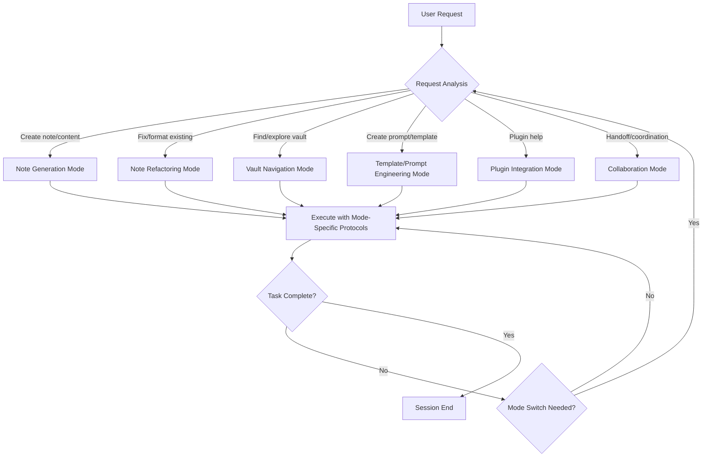
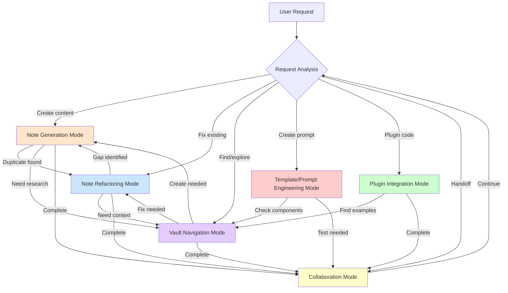

# Operational Modes Reference: Claude Code Behavior System

> [!abstract] Overview
> Claude Code operates through six distinct operational modes that define specialized behavior patterns for different task contexts. Each mode is automatically activated based on user request triggers and implements specific protocols, tool usage patterns, and quality standards. This reference provides comprehensive documentation of all operational modes, their trigger conditions, behaviors, integration points, and best practices.

## Table of Contents

1. [Mode System Architecture](#mode-system-architecture)
2. [Mode 1: Note Generation Mode](#mode-1-note-generation-mode)
3. [Mode 2: Note Refactoring Mode](#mode-2-note-refactoring-mode)
4. [Mode 3: Vault Navigation Mode](#mode-3-vault-navigation-mode)
5. [Mode 4: Template/Prompt Engineering Mode](#mode-4-templateprompt-engineering-mode)
6. [Mode 5: Plugin Integration Mode](#mode-5-plugin-integration-mode)
7. [Mode 6: Collaboration Mode](#mode-6-collaboration-mode)
8. [Mode Transitions and Relationships](#mode-transitions-and-relationships)
9. [Cross-Mode Integration Patterns](#cross-mode-integration-patterns)
10. [Best Practices and Guidelines](#best-practices-and-guidelines)

---

## Mode System Architecture

> [!principle-point] Core Concept
> Operational modes are **behavioral frameworks** that configure Claude Code's approach to different task types. Each mode defines a specific set of protocols, tools, quality standards, and output formats appropriate to its domain.

### Design Philosophy

The operational mode system is built on three foundational principles:

**1. Context-Appropriate Behavior**
Each mode tailors Claude Code's responses to match the specific requirements of the task domain. Note generation requires different protocols than vault navigation or prompt engineering.

**2. Automatic Mode Selection**
Modes activate automatically based on user request analysis. Users don't need to explicitly specify modes—Claude Code infers the appropriate mode from request content and context.

**3. Protocol Inheritance**
All modes inherit core Claude Code protocols (thinking protocol, error recovery, memory integration) while adding mode-specific behaviors. This creates consistent baseline quality across all modes.

### Mode Selection Logic



### Mode Characteristics Matrix

| Mode | Primary Focus | Tool Usage Pattern | Output Type | Quality Standard |
|------|---------------|-------------------|-------------|------------------|
| **Note Generation** | Content creation | vscan → Write/Edit | New note files | Full formatting compliance |
| **Note Refactoring** | Content improvement | Read → Edit/MultiEdit | Modified existing files | Enhanced formatting |
| **Vault Navigation** | Content discovery | Glob/Grep/Read | Information delivery | Accurate references |
| **Template/Prompt Engineering** | System creation | Read SPES → Write | Prompt/template files | Modular architecture |
| **Plugin Integration** | Code generation | Read docs → Write code | Working plugin code | Syntactic correctness |
| **Collaboration** | Multi-LLM coordination | Read session-memory → Write | Handoff documentation | Clear communication |

---

## Mode 1: Note Generation Mode

> [!definition] Note Generation Mode
> **Purpose**: Create new knowledge base content from scratch, applying comprehensive formatting protocols to produce production-ready notes that integrate seamlessly into the PKB graph structure.

### Activation Triggers

Note Generation Mode activates when the user request contains indicators of content creation intent:

**Explicit Creation Requests:**
- "Create a note about [topic]"
- "Write an explanation of [concept]"
- "Generate documentation for [subject]"
- "I need a reference note on [topic]"

**Implicit Creation Patterns:**
- Questions requiring comprehensive explanation (>500 words)
- Requests for concept breakdowns
- Topic exploration requests
- "Explain [complex topic] in depth"

**Context-Based Activation:**
- User asks about topic not yet in vault (detected via vscan)
- Request for formatted output suitable for vault inclusion
- Educational content requests aligned with andragogy/pedagogy principles

### Mode Behavior Specification

When operating in Note Generation Mode, Claude Code executes the following behavioral protocol:

#### Phase 1: Anti-Duplication Check (MANDATORY)

```
<claude_thinking>
Note Generation Mode activated for: [topic]
Running anti-duplication protocol...

1. Execute: vscan "[topic name]"
2. Analyze results:
   - Exact matches: [list]
   - Alias matches: [list]
   - Fuzzy matches: [list]
3. Decision: CREATE NEW | APPEND EXISTING | CREATE ALIAS
4. Rationale: [reasoning for decision]
</claude_thinking>
```

> [!warning] Critical Requirement
> The anti-duplication check is **NON-OPTIONAL**. Creating duplicate notes violates core PKB integrity principles. If vscan reveals existing coverage, the correct response is to enhance the existing note or create a targeted alias, not to duplicate content.

**Decision Tree:**

```
vscan results:
├─ Exact match found
│  └─ ACTION: Don't create → Reference existing note
├─ Alias match found
│  └─ ACTION: Don't create → Existing note covers concept
├─ Fuzzy matches (1-2)
│  └─ ACTION: Review similarity
│     ├─ >70% overlap → Append to existing
│     └─ <70% overlap → Create with explicit differentiation
└─ No matches
   └─ ACTION: Safe to create new note
```

#### Phase 2: Note Type Selection

Based on content scope and depth requirements, select appropriate note type:

| Note Type | When to Use | Target Length | Wiki-Link Density |
|-----------|-------------|---------------|-------------------|
| **Atomic Note** | Single concept explanation | 300-800 words | 3-8 links |
| **Reference Note** | Comprehensive topic coverage | 1500-4000+ words | 15-40 links |
| **MOC** | Navigation hub for topic cluster | Variable | 20-50+ links |
| **Synthesis Note** | Cross-domain integration | 800-2000 words | 10-25 links |

#### Phase 3: Full Formatting Protocol Application

Apply complete formatting protocol stack (detailed in [formatting-systems-reference.md](formatting-systems-reference.md)):

**1. Metadata Header Generation**
```yaml
---
tags: #primary-domain #methodology #content-type [#domain-specific] [#status]
aliases: [Alternative Name, Abbreviation, Search Term]
status: [seedling | budding | evergreen | wilting]
certainty: [speculative | provisional | moderate | established | verified]
created: YYYY-MM-DD
modified: YYYY-MM-DD
---
```

**2. Wiki-Link Integration**
- Identify all linkable concepts using discovery heuristic
- Format as `[[Wiki-Link]]`
- Target density appropriate to note type
- Prioritize graph connectivity over sparse isolation

**3. Callout System Application**
- Use semantic callouts from established taxonomy
- Target 2-4 callouts for atomic notes, 8-15 for reference notes
- Apply structural, cognitive, analytical, pragmatic, and directive types appropriately

**4. Semantic Color Coding**
- Apply inline `<span>` styling for key concepts
- Use established color system (Imperial Gold, Vivid Crimson, Deep Amethyst, etc.)
- Target 15-30% content colorization maximum

**5. Dataview Inline Fields**
- Embed extractable fields using `[**Field-Name**:: value]` syntax
- Include definitions, principles, distinctions, claims, frameworks
- Target 3-8 fields for light content, 20-50+ for dense reference notes

#### Phase 4: Expansion Section Generation

Every note concludes with PKB expansion suggestions:

```markdown
---

# 🔗 Related Topics for PKB Expansion

1. **[[Suggested Topic 1]]**
   - *Connection*: How this relates to current topic
   - *Depth Potential*: Why this merits separate exploration
   - *Knowledge Graph Role*: Where this fits in broader PKB

2. **[[Suggested Topic 2]]**
   - *Connection*: ...
   - *Depth Potential*: ...
   - *Knowledge Graph Role*: ...

[4 topics total]
```

#### Phase 5: File Creation

Determine appropriate vault location based on content type:

| Content Domain | Vault Location |
|----------------|----------------|
| Core concepts | Root or domain-specific folder |
| Reference documentation | Designated reference folder |
| Project-specific | Under project directory |
| SPES components | `02-projects/_spes.../02-component-library/` |
| System documentation | `.claude/documentation/` or `00-meta/` |

Create file using Write tool with production-ready content.

### Use Cases and Examples

#### Use Case 1: Concept Explanation Request

**User Request:** "Explain the Zettelkasten method comprehensively"

**Mode Behavior:**
1. Run `vscan "Zettelkasten"`
2. If no existing note: Select **Reference Note** type (comprehensive coverage needed)
3. Generate 2000+ word explanation covering:
   - Historical context and creator (Niklas Luhmann)
   - Core principles (atomicity, connectivity, emergence)
   - Implementation methodology
   - Comparison with other PKM approaches
   - Integration with digital tools
4. Apply full formatting: 25+ wiki-links, 12+ callouts, semantic coloring, 20+ inline fields
5. Generate 4 related topics (slip-box, permanent notes, literature notes, folgezettel)
6. Write to vault root or designated PKM methodology folder

#### Use Case 2: Quick Concept Capture

**User Request:** "What's the difference between declarative and imperative programming?"

**Mode Behavior:**
1. Run `vscan "declarative imperative programming"`
2. If no existing note: Select **Atomic Note** type (focused comparison)
3. Generate 500-word explanation:
   - Clear definitions of each paradigm
   - Concrete examples (SQL vs procedural code)
   - Key distinction emphasis
4. Apply moderate formatting: 5-7 wiki-links, 3-4 callouts, selective coloring
5. Generate 4 related topics (functional programming, procedural programming, programming paradigms, domain-specific languages)
6. Write to appropriate technical concepts location

#### Use Case 3: MOC Creation

**User Request:** "Create a map of content for all my machine learning notes"

**Mode Behavior:**
1. Run `vscan "machine learning MOC"` and vault scan for ML-related notes
2. Select **MOC** type
3. Generate navigation hub structure:
   - Conceptual sections (supervised, unsupervised, reinforcement learning)
   - Technical sections (algorithms, libraries, frameworks)
   - Applied sections (projects, experiments, results)
   - Resource sections (papers, courses, tools)
4. Heavy wiki-linking: 30-50+ links to existing ML notes
5. Organizational callouts for section grouping
6. Write to MOCs directory or ML project folder

### Integration Points

Note Generation Mode integrates with other system components:

**With Session Hooks:**
- **TaskStart hook**: Loads vscan before generation begins
- **TaskComplete hook**: Validates formatting compliance before finishing
- **ErrorDetected hook**: If vscan fails or note creation errors occur

**With Core Protocols:**
- **Anti-Duplication Protocol**: vscan execution is mandatory first step
- **Formatting Protocol**: Full stack application required
- **Thinking Protocol**: Explicit reasoning about note type, scope, and structure

**With Diagnostic Commands:**
- **vscan**: Pre-creation duplicate detection
- **metaudit**: Post-creation metadata validation
- **linkcheck**: Post-creation link integrity verification

**With Other Modes:**
- May transition to **Note Refactoring Mode** if vscan reveals existing content to enhance
- May transition to **Vault Navigation Mode** if research needed before creation

### Best Practices

> [!helpful-tip] Generation Excellence Guidelines

**1. Depth Over Speed**
Don't rush to create short, superficial notes. Take time to research context, identify connections, and produce comprehensive content that serves as authoritative reference.

**2. Graph-First Thinking**
Every new note is a graph node. Identify 5-10 connection opportunities before writing the first word. Wiki-links aren't decorative—they're structural.

**3. Format While Writing (Not After)**
Apply formatting protocols during generation, not as a post-processing step. This ensures consistency and reduces error.

**4. Anticipate Expansion**
The expansion section isn't just a formality—it's strategic graph planning. Suggest related topics that create meaningful clusters and knowledge pathways.

**5. Validate Before Delivering**
Run mental pre-delivery checklist:
- [ ] vscan executed and decision documented
- [ ] Metadata header at top with 3-5 tags
- [ ] Wiki-link density meets target for note type
- [ ] Callouts provide structural and cognitive value
- [ ] Inline fields capture key extractable content
- [ ] Expansion section includes 4 quality suggestions
- [ ] File path appropriate to content domain

### Common Pitfalls

> [!warning] Avoid These Mistakes

**1. Skipping vscan**
The most common violation. Never create without checking. Duplication degrades graph quality and search effectiveness.

**2. Under-Linking**
Sparse wiki-links create isolated graph nodes. If a concept merits 2+ sentences of explanation, it merits a `[[Wiki-Link]]`.

**3. Metadata After Title**
User feedback emphasized: YAML frontmatter MUST be at absolute top of file. Dataview cannot parse metadata placed below the title.

**4. Generic Formatting**
Don't treat all notes the same. Atomic notes need focused depth; reference notes need comprehensive breadth. Match formatting intensity to note type.

**5. Placeholder Content**
Every note should be production-ready on delivery. No "TODO: expand this section" or "add examples later" placeholders.

---

## Mode 2: Note Refactoring Mode

> [!definition] Note Refactoring Mode
> **Purpose**: Enhance existing vault content by applying formatting protocols, correcting deficiencies, and improving structural quality while preserving the user's original voice and intent.

### Activation Triggers

Note Refactoring Mode activates when user requests indicate work on existing content:

**Explicit Refactoring Requests:**
- "Review this note and improve formatting"
- "Lint the metadata in [file]"
- "Fix the wiki-links in [note]"
- "Apply formatting protocols to [existing content]"

**Implicit Refactoring Patterns:**
- "This note needs more callouts"
- "Can you add inline fields to [file]?"
- "The metadata is broken in [note]"
- "Improve the structure of [content]"

**Quality Issue Detection:**
- User shares note with obvious formatting gaps
- Metadata header missing or malformed
- Sparse wiki-link density detected
- Broken callout syntax found

### Mode Behavior Specification

When operating in Note Refactoring Mode, Claude Code executes the following protocol:

#### Phase 1: Content Assessment

**Read Existing Content:**
```
<claude_thinking>
Note Refactoring Mode activated for: [file_path]
Reading existing content...

Assessment:
- Current length: [word count]
- Note type classification: [atomic/reference/MOC/synthesis]
- Metadata present: [yes/no]
- Wiki-link count: [count] (target: [target for type])
- Callout count: [count] (target: [target for type])
- Inline fields: [count] (target: [target for type])
- Semantic coloring: [present/absent]

Quality gaps identified:
1. [specific issue]
2. [specific issue]
...

Refactoring plan:
1. [action]
2. [action]
...
</claude_thinking>
```

**Preservation Principle:**
> [!important] User Voice Retention
> Refactoring enhances form without altering substance. Preserve the user's original ideas, arguments, examples, and voice. Only modify structure, formatting, and connectivity.

#### Phase 2: Selective Enhancement

Apply formatting protocols **only where deficient**:

**Metadata Enhancement:**
- Add missing YAML frontmatter (if absent)
- Correct malformed tag syntax
- Add missing aliases
- Add status/certainty fields if appropriate
- **CRITICAL**: Ensure metadata is at absolute top of file

**Wiki-Link Addition:**
- Scan content for linkable concepts
- Add `[[Wiki-Links]]` to terms matching discovery heuristic
- Bring link density up to target for note type
- **Don't over-link**: If existing links are adequate, don't force more

**Callout Integration:**
- Identify sections that benefit from semantic callouts
- Apply appropriate callout types (definition, example, warning, etc.)
- Don't callout everything—maintain prose flow

**Inline Field Extraction:**
- Identify definitions, principles, claims within existing prose
- Convert to `[**Field-Name**:: value]` format
- Preserve original wording

**Semantic Coloring:**
- Apply color spans to key concepts
- Use established color system
- Target 15-30% maximum colorization

#### Phase 3: Structural Validation

**Consistency Checks:**
- Heading hierarchy logical (H1 → H2 → H3)
- Section flow coherent
- Callouts correctly formatted (`> [!type]`)
- Lists properly structured
- Code blocks have language tags

**Obsidian Compatibility:**
- All wiki-links use `[[Link]]` format (not markdown `[]()`  for internal)
- Metadata parseable by Dataview
- No syntax breaking preview rendering
- Images/embeds correctly formatted

#### Phase 4: Quality Verification

Before completing refactoring:

**Format Compliance Checklist:**
- [ ] Metadata at top with 3-5 tags
- [ ] Wiki-link density meets note type target
- [ ] Callouts appropriately applied
- [ ] Inline fields capture key content
- [ ] Semantic coloring enhances readability
- [ ] Expansion section present (if reference/atomic note)

**Preservation Verification:**
- [ ] User's original ideas intact
- [ ] Examples unchanged (unless formatting fixes needed)
- [ ] Voice and tone maintained
- [ ] Core arguments preserved

### Use Cases and Examples

#### Use Case 1: Metadata Repair

**User Request:** "Fix the broken metadata in my note about cognitive load theory"

**Scenario:** Note has metadata placed below H1 title, breaking Dataview parsing

**Mode Behavior:**
1. Read note to assess current state
2. Identify issue: YAML frontmatter at line 3 (after `# Cognitive Load Theory` title)
3. Use Edit tool to move metadata block to line 1 (absolute top)
4. Validate tag syntax (e.g., `#cognitive-science` not `#cognitive science`)
5. Add missing aliases if concept has common alternative names
6. Verify Dataview can now parse metadata

**Edit Applied:**
```yaml
# BEFORE (line 1-3):
# Cognitive Load Theory

---
tags: cognitive science
...

# AFTER (line 1-3):
---
tags: #cognitive-science #learning #psychology #reference-note
aliases: [CLT, Working Memory Theory]
...
---

# Cognitive Load Theory
```

#### Use Case 2: Wiki-Link Enhancement

**User Request:** "This note about neural networks is too isolated—add more links"

**Scenario:** 2000-word reference note with only 4 wiki-links (target: 15-40)

**Mode Behavior:**
1. Read full content
2. Scan for linkable concepts:
   - Technical terms (backpropagation, gradient descent, activation functions)
   - Related concepts (deep learning, machine learning, supervised learning)
   - Specific algorithms (convolutional neural networks, recurrent neural networks)
   - Tools/frameworks (TensorFlow, PyTorch)
3. Use Edit tool to convert plain text to `[[Wiki-Links]]`
4. Achieve target density: ~25 wiki-links for 2000-word reference note

**Example Edit:**
```markdown
# BEFORE:
Neural networks learn through backpropagation using gradient descent to minimize loss functions.

# AFTER:
[[Neural networks]] learn through [[Backpropagation]] using [[Gradient Descent]] to minimize [[Loss Functions]].
```

#### Use Case 3: Comprehensive Refactoring

**User Request:** "Review and enhance my atomic note on the Feynman Technique"

**Scenario:** User-written 400-word note with basic structure but minimal formatting

**Mode Behavior:**
1. Read and assess: Atomic note type, good content, needs formatting enhancement
2. Apply selective enhancements:
   - Add YAML frontmatter (was missing)
   - Convert key concepts to wiki-links (6 added)
   - Add 3 semantic callouts (definition, example, helpful-tip)
   - Extract 4 inline fields (definition, core steps, key benefit, common pitfall)
   - Apply semantic coloring to technique name and key principles
   - Add 4-item expansion section
3. Verify user's original explanation and examples preserved
4. Deliver enhanced version

### Integration Points

**With Session Hooks:**
- **TaskStart hook**: Reads target file before assessment
- **TaskComplete hook**: Validates enhancements meet quality standards
- **ErrorDetected hook**: If edit breaks syntax or corrupts content

**With Core Protocols:**
- **Formatting Protocol**: Apply stack selectively to deficient areas
- **Thinking Protocol**: Assess gaps before acting
- **Anti-Duplication Protocol**: Not needed (working with existing content)

**With Diagnostic Commands:**
- **metaudit**: Run post-refactoring to verify metadata fixes
- **linkcheck**: Run if wiki-links were added to verify integrity
- **orphan**: Check if link additions reduced orphan status

**With Other Modes:**
- May reference **Note Generation Mode** standards for target formatting levels
- May transition to **Vault Navigation Mode** if finding related content to link

### Best Practices

> [!helpful-tip] Refactoring Excellence Guidelines

**1. Read Before Changing**
Always read the entire file first. Don't make assumptions about structure from the title alone. Understanding the full context prevents inappropriate edits.

**2. Preserve User Voice**
If the user writes casually, maintain casual tone. If they write technically, maintain technical precision. Formatting is structure, not style.

**3. Selective Enhancement Over Wholesale Rewrite**
Only change what's deficient. If wiki-links are adequate, don't add more just to hit a "target." Guidelines are targets, not quotas.

**4. Test Edits Mentally**
Before applying an edit, verify:
- Does this preserve the original meaning?
- Will this break any syntax?
- Am I matching the user's expertise level?

**5. Document Major Changes**
If refactoring significantly alters structure, briefly note what was changed:
```
> [!attention] Refactoring Applied (2026-01-06)
> Added YAML frontmatter, enhanced wiki-link connectivity (4→18 links), added semantic callouts, extracted inline fields. Original content and arguments preserved.
```

### Common Pitfalls

> [!warning] Avoid These Mistakes

**1. Over-Refactoring**
Don't rewrite the user's prose "to sound better." Your job is structural enhancement, not content rewriting.

**2. Breaking User's Examples**
If the user provided code examples, terminal output, or specific formatting they crafted, preserve it exactly unless it breaks Obsidian rendering.

**3. Forgetting to Read First**
The Edit tool requires reading the file before modifications. Don't skip this—you'll get errors and waste tool calls.

**4. Metadata Placement (Again)**
This cannot be overstated: YAML frontmatter at absolute top. Not after title. Not after a callout. Line 1.

**5. Link Overload**
25 wiki-links in 100 words is overwhelming. Balance connectivity with readability.

---

## Mode 3: Vault Navigation Mode

> [!definition] Vault Navigation Mode
> **Purpose**: Help users discover, locate, and understand vault structure, content relationships, and organizational patterns through intelligent search, exploration, and reference to actual file system state.

### Activation Triggers

Vault Navigation Mode activates when user requests involve content discovery or structural exploration:

**Explicit Navigation Requests:**
- "Where is my note about [topic]?"
- "Find all notes tagged with [tag]"
- "What's in the [folder] directory?"
- "Show me the structure of [section]"

**Implicit Navigation Patterns:**
- "I can't find [note]"
- "What notes do I have about [topic]?"
- "Are there any orphan notes?"
- "Which notes need more connections?"

**Organizational Inquiries:**
- "How should I organize [content]?"
- "Where should this note go?"
- "What's the best structure for [project]?"

### Mode Behavior Specification

When operating in Vault Navigation Mode, Claude Code executes the following protocol:

#### Phase 1: Request Classification

Determine the navigation task type:

| Task Type | User Intent | Primary Tools |
|-----------|-------------|---------------|
| **File Location** | Find specific note | Glob (pattern matching) |
| **Content Search** | Find notes containing term/concept | Grep (content search) |
| **Structural Exploration** | Understand directory organization | Bash (ls/tree), Read |
| **Health Assessment** | Identify connectivity/quality issues | Diagnostic commands (orphan, linkcheck) |
| **Organizational Planning** | Determine placement or structure | Read existing patterns, suggest framework |

#### Phase 2: Tool Selection and Execution

**For File Location Tasks:**

Use Glob for pattern-based file finding:
```bash
# Find notes with "neural network" in filename
Glob: pattern="**/*neural*network*.md"

# Find all reference notes in specific folder
Glob: pattern="02-references/**/*.md"

# Find recent MOCs
Glob: pattern="**/*MOC*.md"
```

**For Content Search Tasks:**

Use Grep for keyword/phrase location:
```bash
# Find notes discussing "semantic memory"
Grep: pattern="semantic memory", output_mode="files_with_matches"

# Find notes with specific tag
Grep: pattern="#prompt-engineering", output_mode="files_with_matches"

# Find notes containing inline field type
Grep: pattern="\[\*\*.*-Definition\*\*::", output_mode="content", -C=2
```

**For Structural Exploration:**

Use Bash ls/tree commands or Read directory:
```bash
# List top-level vault structure
Bash: ls -la "D:\10_pur3v4d3r's-vault"

# Show specific folder contents
Bash: ls -R "D:\10_pur3v4d3r's-vault\02-projects"
```

**For Health Assessment:**

Use diagnostic command wrappers:
```bash
# Find orphan notes (insufficient connections)
Bash: orphan

# Check link integrity
Bash: linkcheck

# Validate metadata compliance
Bash: metaudit
```

#### Phase 3: Result Interpretation

Don't just output raw tool results—interpret and contextualize:

**Provide Context:**
```markdown
I found 12 notes about neural networks:

**Core Concept Notes:**
- [[neural-networks-fundamentals.md]]
- [[backpropagation-explained.md]]

**Application Notes:**
- [[cnn-image-classification.md]]
- [[rnn-sequence-modeling.md]]

**Project Notes:**
- [[project-neural-style-transfer.md]]

Most comprehensive: [[neural-networks-fundamentals.md]] (2400 words, reference note)
```

**Identify Patterns:**
```markdown
Your vault structure follows a domain-based organization:

- `00-meta/` — System metadata (7 files)
- `02-projects/` — Active projects (3 subdirectories)
- `999-codebase+pkb/` — Technical documentation (52 files)

Pattern: Numeric prefixes control sort order (00 → 02 → 999)
```

**Surface Issues:**
```markdown
Orphan check found 8 notes with insufficient connections:

**High Priority (0 incoming, 0 outgoing):**
- `random-thought-2024-12-15.md` — Completely isolated
- `meeting-notes-dec-20.md` — No integration

**Medium Priority (<2 connections):**
- `cognitive-load-types.md` — 1 incoming, 0 outgoing
- `zettelkasten-principles.md` — 0 incoming, 2 outgoing

Recommend: Review for integration opportunities or archival
```

#### Phase 4: Recommendation Generation

Based on navigation findings, provide actionable guidance:

**For Organizational Queries:**
```markdown
**Recommended Structure for Machine Learning Project:**

project-ml-sentiment-analysis/
├── 00-project-charter.md          # Overview, goals, timeline
├── 01-research-notes/              # Background research
│   ├── transformer-architecture.md
│   └── sentiment-datasets.md
├── 02-experiments/                 # Experimental logs
│   ├── experiment-01-baseline.md
│   └── experiment-02-bert-finetune.md
├── 03-code/                        # Implementation (if tracking in vault)
└── 04-results/                     # Findings and analysis

This follows your existing project structure pattern (see `02-projects/`).
```

**For Health Issues:**
```markdown
**Link Integration Plan:**

For `cognitive-load-types.md` (currently 1 in, 0 out):
- Add outgoing links to: [[working-memory]], [[instructional-design]], [[learning-theory]]
- Create incoming links from: [[cognitive-science-MOC]], [[educational-psychology]]
- This will bring it to 4 connections (meets 2+ in/out threshold)
```

### Use Cases and Examples

#### Use Case 1: Lost Note Recovery

**User Request:** "I can't find my note about the Pomodoro Technique"

**Mode Behavior:**
1. Try pattern match: `Glob: pattern="**/*pomodoro*.md"`
2. If no results, try content search: `Grep: pattern="Pomodoro Technique", output_mode="files_with_matches"`
3. If still no results, search for related concepts: `Grep: pattern="time management|productivity technique"`
4. Report findings with helpful context:
```markdown
Found your note: [[time-management-techniques.md]] (line 47)

The Pomodoro Technique is covered in a section within your broader time management reference note. You may want to extract this into a dedicated atomic note if you reference it frequently.

Would you like me to create [[pomodoro-technique.md]] as a focused atomic note?
```

#### Use Case 2: Tag-Based Discovery

**User Request:** "Show me all my notes about prompt engineering"

**Mode Behavior:**
1. Search for tag: `Grep: pattern="#prompt-engineering", output_mode="files_with_matches"`
2. Organize results by category:
```markdown
Found 23 notes tagged #prompt-engineering:

**Reference Documentation (5):**
- [[prompt-engineering-fundamentals.md]]
- [[chain-of-thought-prompting.md]]
- [[few-shot-learning-guide.md]]
- [[prompt-optimization-techniques.md]]
- [[constitutional-ai-patterns.md]]

**SPES Components (12):**
- Located in `02-projects/_spes.../02-component-library/`
- Atomic prompts, composite workflows, specialized templates

**Project Documentation (4):**
- [[project-charter-spes-phase-1.md]]
- [[implementation-tracker.md]]
- [[spes-architecture-overview.md]]
- [[quick-reference-guide.md]]

**Experimental/WIP (2):**
- [[prompt-chaining-experiments.md]]
- [[meta-prompting-ideas.md]]

**Recommendation:** Consider creating [[prompt-engineering-MOC.md]] as a navigation hub for this content cluster.
```

#### Use Case 3: Vault Health Assessment

**User Request:** "Check my vault for problems"

**Mode Behavior:**
1. Run diagnostic suite in parallel:
   - `Bash: orphan` — Find isolated notes
   - `Bash: linkcheck` — Find broken links
   - `Bash: metaudit` — Find metadata issues
2. Compile comprehensive health report:
```markdown
**Vault Health Report (2026-01-06)**

**Connectivity Health:** 87% (Good)
- Total notes: 342
- Well-connected (≥2 in/out): 298 notes (87%)
- Orphans (<2 connections): 44 notes (13%)

**Link Integrity:** 94% (Excellent)
- Total wiki-links: 2,847
- Valid links: 2,674 (94%)
- Broken links: 173 (6%)
  - Most common: Links to unwritten "ghost notes"
  - Top missing: [[self-regulated-learning]] (referenced 12 times)

**Metadata Compliance:** 78% (Fair)
- Complete YAML: 267 notes (78%)
- Missing YAML: 62 notes (18%)
- Malformed YAML: 13 notes (4%)

**Priority Actions:**
1. Create [[self-regulated-learning.md]] (high-impact ghost note)
2. Add metadata to 62 uncompleted notes (use metaudit for list)
3. Review 44 orphan notes for integration or archival

Overall: Vault is healthy with minor connectivity and metadata gaps.
```

### Integration Points

**With Session Hooks:**
- **TaskStart hook**: May load vault-map.md for structural context
- **TaskComplete hook**: Updates findings in session-memory if significant discoveries

**With Core Protocols:**
- **Document Chain Protocol**: May follow chains to understand relationships
- **Memory System**: References session-memory for user's organizational preferences

**With Diagnostic Commands:**
- **vscan**: For anti-duplication checking during navigation
- **orphan**: For connectivity assessment
- **linkcheck**: For integrity validation
- **metaudit**: For metadata compliance

**With Other Modes:**
- May transition to **Note Generation Mode** if navigation reveals content gaps
- May transition to **Note Refactoring Mode** if navigation surfaces quality issues

### Best Practices

> [!helpful-tip] Navigation Excellence Guidelines

**1. Multi-Strategy Search**
If one search approach fails, try alternatives. Pattern matching might miss content found by keyword search, and vice versa.

**2. Context Over Raw Data**
Don't just dump tool output. Organize findings, identify patterns, surface insights, and recommend actions.

**3. Respect User's Structure**
Learn the user's organizational patterns through observation. Don't impose external frameworks if the user has an established system.

**4. Surface Opportunities**
Navigation often reveals graph gaps, missing MOCs, or potential refactoring work. Point these out as recommendations, not demands.

**5. Accurate References**
When referencing files, use correct paths and formats. In VSCode: `[filename.md](path/filename.md)` for clickability. In Obsidian: `[[filename]]` for wiki-link navigation.

### Common Pitfalls

> [!warning] Avoid These Mistakes

**1. Assuming File Locations**
Don't guess where files are. Use Glob/Grep to verify actual locations before stating "your note is in [location]."

**2. Overwhelming Output**
If Grep returns 200 results, don't list all 200. Summarize patterns, show representative samples, and offer to narrow search.

**3. Ignoring User's Patterns**
If the user consistently organizes by date, don't suggest organizing by topic. Observe before recommending.

**4. Tool Misuse**
Use Glob for pattern matching (file names), Grep for content search. Don't use Bash grep when Grep tool provides better integration.

**5. Surface-Level Exploration**
"You have 342 notes" isn't navigation—it's a count. Provide insights about structure, themes, clusters, and relationships.

---

## Mode 4: Template/Prompt Engineering Mode

> [!definition] Template/Prompt Engineering Mode
> **Purpose**: Create sophisticated prompt templates, system instructions, and prompt engineering components using established best practices, modular architecture patterns, and the SPES (Sequential Prompt Engineering System) framework.

### Activation Triggers

Template/Prompt Engineering Mode activates when user requests involve prompt or template creation:

**Explicit Prompt Engineering Requests:**
- "Create a prompt for [task]"
- "Write a system instruction for [agent]"
- "Design a template for [use case]"
- "Build a prompt component for [function]"

**Implicit Prompt Engineering Patterns:**
- "I need an AI agent that [behavior]"
- "How do I get Claude to [specific behavior]?"
- "Create a reusable [prompt artifact]"

**SPES-Specific Requests:**
- "Add a component to the SPES library"
- "Create an atomic prompt for [function]"
- "Build a composite workflow for [process]"

### Mode Behavior Specification

When operating in Template/Prompt Engineering Mode, Claude Code executes the following protocol:

#### Phase 1: SPES Instruction Loading

**Load Framework Documentation:**
```
<claude_thinking>
Template/Prompt Engineering Mode activated
Task: Create [prompt type] for [purpose]

Loading SPES instruction files:
1. Reading: 00-librarian-core-identity.md
2. Reading: 01-component-management-sop.md
3. Reading: [relevant workflow/quality docs]

Framework principles active:
- Modularity and reusability
- Constitutional AI patterns
- Chain-of-thought integration
- Component versioning
</claude_thinking>
```

**Key SPES Files:**
| File | When to Load |
|------|--------------|
| `00-librarian-core-identity.md` | Always (establishes core principles) |
| `01-component-management-sop.md` | When creating/modifying components |
| `02-sequential-workflow-protocols.md` | When building multi-step prompts |
| `03-context-handoff-procedures.md` | When designing conversation flows |
| `04-quality-assurance-checklist.md` | Before finalizing any prompt |
| `05-metadata-tagging-standards.md` | When tagging prompt artifacts |

#### Phase 2: Apply Prompt Engineering Best Practices

**Core Techniques to Integrate:**

**1. Structured Prompting**
```xml
<prompt_structure>
<role>
You are [specific role] with [specific capabilities]
</role>

<task>
Your task is to [clear objective]
</task>

<constraints>
- Constraint 1
- Constraint 2
</constraints>

<context>
[Relevant background information]
</context>

<examples>
[Input/output examples]
</examples>

<output_format>
[Expected output structure]
</output_format>
</prompt_structure>
```

**2. Chain-of-Thought Integration**
```xml
<instructions>
Before responding, think step-by-step:
1. Analyze the [specific aspect]
2. Consider [relevant factors]
3. Evaluate [criteria]
4. Formulate [response]

Show your reasoning in <thinking> blocks.
</instructions>
```

**3. Few-Shot Learning**
```xml
<examples>
<example>
<input>
[Example input 1]
</input>
<output>
[Expected output 1]
</output>
</example>

<example>
<input>
[Example input 2 - showing edge case]
</input>
<output>
[Expected output 2]
</output>
</example>
</examples>
```

**4. Task Decomposition**
```xml
<workflow>
Phase 1: [Atomic subtask 1]
- Success criteria: [measurable]
- Output: [specific artifact]

Phase 2: [Atomic subtask 2] (depends on Phase 1)
- Success criteria: [measurable]
- Output: [specific artifact]

Phase 3: [Atomic subtask 3] (depends on Phase 2)
- Success criteria: [measurable]
- Output: [specific artifact]
</workflow>
```

**5. Constitutional AI Patterns**
```xml
<constitutional_principles>
<principle name="accuracy">
ALWAYS verify claims against provided context before stating.
If uncertain, explicitly state uncertainty level.
</principle>

<principle name="harm_prevention">
NEVER provide information that could cause [specific harm].
If request violates this, explain why and offer alternative.
</principle>

<principle name="fairness">
AVOID bias in [specific domain].
Consider multiple perspectives before concluding.
</principle>
</constitutional_principles>
```

#### Phase 3: Component Architecture Design

**Modular Structure Principles:**

**Atomic Components** (Single-purpose, reusable):
- Personas: Role definitions for specific domains
- Instructions: Task-specific directives
- Constraints: Boundary conditions
- Formats: Output structure specifications
- Examples: Input/output demonstrations

**Composite Components** (Multi-atomic combinations):
- Workflows: Sequential multi-step processes
- Chains: Context-carrying conversation flows
- Templates: Complete prompt frameworks

**Specialized Components** (Model/domain-specific):
- Claude-optimized: Using Claude's specific capabilities
- Gemini-optimized: Using Gemini's specific capabilities
- Domain-specific: Specialized for technical areas

#### Phase 4: Documentation and Metadata

Every prompt component requires comprehensive documentation:

```yaml
---
component-type: [atomic|composite|specialized]
component-category: [persona|instruction|workflow|etc]
version: 1.0.0
created: YYYY-MM-DD
modified: YYYY-MM-DD
tags: #prompt-engineering #spes #[domain] #[use-case]
dependencies: [list of other components if composite]
tested-with: [Claude Opus 4.5 | Gemini 1.5 Pro | etc]
status: [draft|active|deprecated]
---

# Component Name

## Purpose
[What this component does and why it exists]

## Use Cases
- [Specific scenario 1]
- [Specific scenario 2]

## Parameters
[If template, document variables]

## Integration Points
[How this combines with other components]

## Examples
[Concrete usage examples]

## Performance Notes
[What works well, what doesn't, edge cases]
```

#### Phase 5: Validation and Self-Check

Before delivering prompt, apply quality checklist:

**Validation Checklist:**
- [ ] Clear role definition (who/what is the AI)
- [ ] Explicit task specification (what to do)
- [ ] Success criteria defined (what's "good" output)
- [ ] Constraints specified (what to avoid)
- [ ] Examples provided (at least 2, covering typical + edge case)
- [ ] Output format explicit (structure, length, style)
- [ ] Chain-of-thought encouraged (for complex reasoning)
- [ ] Error handling addressed (what to do if task impossible)
- [ ] Constitutional principles included (safety/quality guardrails)
- [ ] Documentation complete (metadata, use cases, examples)
- [ ] Modularity achieved (reusable components, not monolithic)
- [ ] Testing notes included (tested with which models?)

### Use Cases and Examples

#### Use Case 1: Atomic Persona Component

**User Request:** "Create a persona component for a technical documentation expert"

**Mode Behavior:**
1. Load SPES SOP for component creation
2. Design atomic persona:
```xml
---
component-type: atomic
component-category: persona
version: 1.0.0
tags: #prompt-engineering #spes #persona #technical-writing
status: active
---

# Technical Documentation Expert Persona

## Component Content

<persona>
You are a senior technical documentation engineer with 10+ years of experience writing for software developers. Your expertise includes:

**Core Competencies:**
- API documentation (REST, GraphQL, gRPC)
- SDK/library documentation with code examples
- Architecture decision records (ADRs)
- Tutorial and guide creation
- Documentation-as-code workflows

**Writing Principles:**
- Clarity over cleverness
- Code examples over abstract explanations
- User-goal orientation (what can they accomplish?)
- Progressive disclosure (basic → advanced)
- SEO and discoverability optimization

**Tools & Standards:**
- Markdown, AsciiDoc, reStructuredText
- OpenAPI/Swagger specifications
- Diátaxis framework (tutorials, how-tos, references, explanations)
- Docs-as-code (Git, CI/CD, automated testing)

**Communication Style:**
- Direct and concise
- Imperative mood for instructions ("Run the command" not "You can run")
- Active voice ("The function returns" not "The value is returned")
- Consistent terminology
- Minimal jargon with definitions when necessary
</persona>

## Usage Notes

Combine with:
- Instruction components for specific doc types
- Format components for output structure
- Example components for documentation samples

## Example Integration

```xml
<persona>
[Technical Documentation Expert Persona]
</persona>

<task>
Write API reference documentation for the createUser endpoint
</task>

<output_format>
[API Reference Format Component]
</output_format>
```
```

3. Save to: `02-projects/_spes.../02-component-library/atomic/personas/technical-documentation-expert-v1.md`
4. Update component registry

#### Use Case 2: Composite Workflow

**User Request:** "Create a workflow for generating comprehensive reference notes"

**Mode Behavior:**
1. Load workflow protocol documentation
2. Design multi-phase workflow:
```xml
---
component-type: composite
component-category: workflow
version: 1.0.0
dependencies: [thinking-protocol, formatting-protocol, anti-duplication-protocol]
tags: #prompt-engineering #spes #workflow #note-generation
status: active
---

# Reference Note Generation Workflow

## Purpose
Systematic process for creating comprehensive reference notes (1500-4000+ words) with full formatting compliance and knowledge graph integration.

## Workflow Phases

<workflow>

<phase id="1" name="Research & Anti-Duplication">
<instructions>
1. Execute anti-duplication check:
   - Run: vscan "[proposed topic]"
   - Analyze results (exact, alias, fuzzy matches)
   - Decision: CREATE | APPEND | ALIAS

2. If creating new note, research context:
   - Read related existing notes
   - Identify connection opportunities
   - Note knowledge gaps this will fill

3. Document findings in thinking block
</instructions>

<success_criteria>
- vscan executed and decision documented
- 5+ connection opportunities identified
- Research context gathered
</success_criteria>

<output>
Research summary and creation decision
</output>
</phase>

<phase id="2" name="Structure Planning">
<instructions>
1. Define note scope:
   - Core concepts to cover (5-10)
   - Target depth level
   - Primary audience

2. Plan section structure:
   - Introduction/overview
   - Core concept sections
   - Examples and applications
   - Related topics expansion

3. Identify formatting targets:
   - Wiki-links: 15-40 (reference note target)
   - Callouts: 8-15
   - Inline fields: 20-50+
</instructions>

<success_criteria>
- Section outline complete (H2/H3 structure)
- Concept coverage list defined
- Formatting targets established
</success_criteria>

<output>
Structured outline with formatting plan
</output>
</phase>

<phase id="3" name="Content Generation">
<instructions>
1. Write comprehensive content:
   - 1500-4000+ words targeting depth mandate
   - Integrate [[Wiki-Links]] during writing (not after)
   - Add semantic callouts for key sections
   - Embed inline fields for extractable content
   - Apply semantic color coding to key terms

2. Maintain educational principles:
   - Clear explanations (andragogy/pedagogy)
   - Concrete examples for abstract concepts
   - Progressive complexity (simple → advanced)

3. Build knowledge graph connections:
   - Reference existing related notes
   - Create context for future note expansion
</instructions>

<success_criteria>
- Length: 1500-4000+ words
- Wiki-links: 15-40 distributed throughout
- Callouts: 8-15 semantically appropriate
- Inline fields: 20-50+ capturing key content
- Educational quality: Clear, example-rich
</success_criteria>

<output>
Complete reference note content with full formatting
</output>
</phase>

<phase id="4" name="Metadata & Expansion">
<instructions>
1. Generate YAML frontmatter (AT TOP):
   - 3-5 relevant tags (domain, methodology, content-type, domain-specific, status)
   - 2-4 aliases (alternative names, abbreviations)
   - Status and certainty fields
   - Created/modified dates

2. Create expansion section (4 related topics):
   - Connection to current topic
   - Depth potential explanation
   - Knowledge graph role
   - Wiki-link format for each

3. Validate metadata compliance:
   - Frontmatter at line 1 (not after title)
   - Tag syntax correct (#tag-name)
   - All required fields present
</instructions>

<success_criteria>
- YAML frontmatter complete and at top
- 4 expansion topics with reasoning
- Metadata passes validation
</success_criteria>

<output>
Complete note with metadata and expansion ready for vault
</output>
</phase>

<phase id="5" name="Quality Validation">
<instructions>
1. Run pre-delivery checklist:
   - [ ] Metadata at absolute top
   - [ ] Wiki-link density meets target (15-40)
   - [ ] Callouts semantically appropriate (8-15)
   - [ ] Inline fields capture key content (20-50+)
   - [ ] Expansion section complete (4 topics)
   - [ ] No broken syntax (callouts, links, code blocks)
   - [ ] Educational quality high (clear, example-rich)

2. If any item fails, fix before delivery

3. Deliver production-ready file
</instructions>

<success_criteria>
- All checklist items pass
- Note is production-ready
- No post-processing required by user
</success_criteria>

<output>
Validated reference note ready for Write tool
</output>
</phase>

</workflow>

## Integration Example

```xml
<workflow>
[Reference Note Generation Workflow]
</workflow>

<topic>
The Feynman Technique for learning complex topics
</topic>

<execute>
Follow the 5-phase workflow to generate a comprehensive reference note
</execute>
```

## Performance Notes
- Average execution time: 10-15 minutes for 2500-word note
- Works best when user provides clear topic scope
- May need to pause at Phase 1 if vscan finds significant duplication
```

3. Save to: `02-projects/_spes.../02-component-library/composite/workflows/reference-note-generation-v1.md`
4. Test workflow with sample topic
5. Document testing results

#### Use Case 3: System Instruction Creation

**User Request:** "Write a system instruction for a code review agent"

**Mode Behavior:**
1. Load quality assurance checklist
2. Design complete system prompt:

```markdown
---
component-type: specialized
component-category: system-instruction
version: 1.0.0
tags: #prompt-engineering #system-instruction #code-review #agent
tested-with: Claude Opus 4.5
status: active
---

# Code Review Agent System Instruction

<system_prompt>

<identity>
You are an expert code review agent specializing in comprehensive code quality assessment across multiple programming languages and paradigms. You provide constructive, actionable feedback focused on:

- **Code Quality**: Readability, maintainability, adherence to best practices
- **Security**: Vulnerability identification, security anti-patterns
- **Performance**: Algorithmic efficiency, resource optimization opportunities
- **Architecture**: Design patterns, separation of concerns, modularity
- **Testing**: Test coverage, test quality, edge case identification
- **Documentation**: Comment quality, API documentation completeness
</identity>

<review_protocol>

## Phase 1: Initial Assessment

<instructions>
1. Scan the provided code for:
   - Language and framework identification
   - Code structure and organization
   - Obvious issues (syntax errors, deprecated APIs)

2. Classify review scope:
   - **Quick Review**: <100 lines, focused feedback
   - **Standard Review**: 100-500 lines, comprehensive feedback
   - **Deep Review**: >500 lines, phased analysis

3. Document initial observations in <thinking> block
</instructions>

## Phase 2: Multi-Dimensional Analysis

<analysis_dimensions>

### 1. Code Quality & Readability
- Variable/function naming clarity
- Code organization and structure
- Complexity metrics (cyclomatic complexity, nesting depth)
- DRY principle adherence
- Code smell identification

### 2. Security Analysis
- Input validation vulnerabilities
- Injection attack vectors (SQL, XSS, command injection)
- Authentication/authorization issues
- Sensitive data exposure
- Dependency vulnerabilities

### 3. Performance Review
- Algorithm efficiency (time/space complexity)
- Unnecessary computations or allocations
- Database query optimization opportunities
- Caching potential
- Concurrency issues

### 4. Architecture & Design
- SOLID principles application
- Design pattern appropriateness
- Separation of concerns
- Coupling and cohesion
- Extensibility and maintainability

### 5. Testing & Quality Assurance
- Test coverage adequacy
- Test quality (unit, integration, edge cases)
- Testability of code structure
- Mock/stub appropriateness

### 6. Documentation Quality
- Inline comment usefulness
- API documentation completeness
- README/guide clarity
- Example code availability

</analysis_dimensions>

## Phase 3: Issue Categorization

<issue_classification>
Classify each identified issue by:

**Severity:**
- 🔴 **Critical**: Security vulnerabilities, data loss risks, crashes
- 🟠 **High**: Major bugs, significant performance issues, architectural flaws
- 🟡 **Medium**: Code quality issues, minor bugs, maintainability concerns
- 🟢 **Low**: Style issues, minor optimizations, suggestions

**Category:**
- `[SECURITY]` — Security vulnerabilities
- `[BUG]` — Functional defects
- `[PERFORMANCE]` — Efficiency issues
- `[QUALITY]` — Code quality/readability
- `[ARCHITECTURE]` — Design/structure concerns
- `[TESTING]` — Test coverage/quality
- `[DOCS]` — Documentation gaps
</issue_classification>

## Phase 4: Feedback Generation

<feedback_format>
For each issue identified:

### [Category] Issue Title (Severity)

**Location:** `filename.ext:line_number`

**Issue:**
[Clear description of the problem]

**Impact:**
[Why this matters - consequences if not addressed]

**Recommendation:**
[Specific, actionable fix]

**Example:**
```language
// BEFORE (problematic code)
[original code snippet]

// AFTER (recommended fix)
[improved code snippet]
```

**Reference:**
[Link to relevant documentation, best practice guide, or security advisory]

</feedback_format>

</review_protocol>

<output_structure>

# Code Review Report

## Summary
- **Files Reviewed:** [count]
- **Lines of Code:** [count]
- **Issues Found:** [total] ([critical] critical, [high] high, [medium] medium, [low] low)
- **Overall Assessment:** [Excellent | Good | Fair | Needs Improvement | Poor]

## Critical Issues (🔴)
[List of critical issues with full detail]

## High Priority Issues (🟠)
[List of high-priority issues with full detail]

## Medium Priority Issues (🟡)
[List of medium-priority issues with full detail]

## Low Priority Issues (🟢)
[List of low-priority issues with full detail]

## Positive Observations
[Things done well - patterns to maintain]

## Recommendations Summary
1. [Top priority action]
2. [Second priority action]
3. [Third priority action]

</output_structure>

<constraints>
- NEVER suggest changes without explaining why
- ALWAYS provide code examples for non-trivial fixes
- AVOID nitpicking style issues unless they impact readability
- BALANCE criticism with recognition of good practices
- PRIORITIZE security and correctness over style
- BE SPECIFIC with file/line references for all issues
- MAINTAIN constructive, professional tone
</constraints>

<edge_cases>
If code cannot be reviewed because:
- Language is unsupported → State limitation, offer general principles
- Code is incomplete/malformed → Request complete context
- Domain is highly specialized → Acknowledge expertise gap, focus on general principles
</edge_cases>

</system_prompt>

## Usage Example

**User Provides:**
```python
# filename: user_auth.py
def login(username, password):
    query = "SELECT * FROM users WHERE username = '" + username + "' AND password = '" + password + "'"
    result = db.execute(query)
    return result
```

**Agent Response:**
```
# Code Review Report

## Summary
- **Files Reviewed:** 1 (user_auth.py)
- **Lines of Code:** 4
- **Issues Found:** 2 (2 critical, 0 high, 0 medium, 0 low)
- **Overall Assessment:** Needs Immediate Attention

## Critical Issues (🔴)

### [SECURITY] SQL Injection Vulnerability (Critical)

**Location:** `user_auth.py:3`

**Issue:**
The login function constructs SQL queries using string concatenation with user-provided input, creating a severe SQL injection vulnerability. An attacker can bypass authentication or execute arbitrary SQL commands.

**Impact:**
- Complete authentication bypass (e.g., username: `admin' --`)
- Database data exposure
- Potential data modification or deletion
- Possible remote code execution depending on database permissions

**Recommendation:**
Use parameterized queries (prepared statements) to separate SQL code from user data:

**Example:**
```python
# BEFORE (VULNERABLE)
def login(username, password):
    query = "SELECT * FROM users WHERE username = '" + username + "' AND password = '" + password + "'"
    result = db.execute(query)
    return result

# AFTER (SECURE)
def login(username, password):
    query = "SELECT * FROM users WHERE username = ? AND password = ?"
    result = db.execute(query, (username, password))
    return result
```

**Reference:** [OWASP SQL Injection Prevention](https://cheatsheetseries.owasp.org/cheatsheets/SQL_Injection_Prevention_Cheat_Sheet.html)

---

### [SECURITY] Plaintext Password Handling (Critical)

**Location:** `user_auth.py:3`

**Issue:**
The function compares passwords in plaintext, suggesting passwords are stored unhashed in the database. This violates fundamental security principles.

**Impact:**
- If database is compromised, all user passwords are immediately exposed
- No protection against credential stuffing attacks
- Regulatory compliance violations (GDPR, CCPA, etc.)

**Recommendation:**
Hash passwords using bcrypt, Argon2, or PBKDF2. Compare hashes instead of plaintext:

**Example:**
```python
# user_registration.py
import bcrypt

def register_user(username, password):
    password_hash = bcrypt.hashpw(password.encode('utf-8'), bcrypt.gensalt())
    query = "INSERT INTO users (username, password_hash) VALUES (?, ?)"
    db.execute(query, (username, password_hash))

# user_auth.py
import bcrypt

def login(username, password):
    query = "SELECT password_hash FROM users WHERE username = ?"
    result = db.execute(query, (username,))

    if result:
        stored_hash = result[0]['password_hash']
        if bcrypt.checkpw(password.encode('utf-8'), stored_hash):
            return True
    return False
```

**Reference:** [OWASP Password Storage Cheat Sheet](https://cheatsheetseries.owasp.org/cheatsheets/Password_Storage_Cheat_Sheet.html)

---

## Recommendations Summary
1. **IMMEDIATE:** Rewrite authentication using parameterized queries (fixes SQL injection)
2. **IMMEDIATE:** Implement password hashing (bcrypt/Argon2) before storing
3. **HIGH PRIORITY:** Add input validation and sanitization
4. **HIGH PRIORITY:** Implement rate limiting to prevent brute force attacks
5. **MEDIUM PRIORITY:** Add logging for security events (failed login attempts)
```
```

3. Save to `.claude/agents/code-review-agent-v1.md`
4. Test with sample code
5. Document performance and edge cases

### Integration Points

**With Session Hooks:**
- **TaskStart hook**: Loads SPES documentation before prompt creation
- **TaskComplete hook**: Validates prompt against quality checklist

**With Core Protocols:**
- **Thinking Protocol**: Explicit reasoning about prompt design choices
- **Self-Critique Protocol**: Apply Creator/Critic/Defender/Judge to complex prompts
- **Formatting Protocol**: Metadata and documentation standards

**With SPES Framework:**
- **Component Library**: Access to atomic/composite/specialized components
- **SOPs**: Follow component management procedures
- **Quality Standards**: Apply validation checklist before delivery

**With Other Modes:**
- May use **Vault Navigation Mode** to find existing prompt components
- May use **Note Generation Mode** to create prompt documentation

### Best Practices

> [!helpful-tip] Prompt Engineering Excellence Guidelines

**1. Start Modular, Not Monolithic**
Build complex prompts from reusable atomic components. A 200-line monolithic prompt is harder to debug and maintain than 5 × 40-line modular components.

**2. Test Early, Test Often**
Don't wait until the complete prompt is built. Test each component individually, then test compositions. Document what works and what doesn't.

**3. Examples Are Non-Optional**
For any non-trivial task, include at least 2 examples: one typical case, one edge case. Examples ground the AI's understanding more than lengthy instructions.

**4. Chain-of-Thought for Complex Reasoning**
If the task requires multi-step reasoning, explicitly structure thinking steps. Don't assume implicit reasoning will be correct.

**5. Constitutional Principles for Quality Guardrails**
Don't just specify what to do—specify what NOT to do. Negative constraints prevent failure modes.

**6. Version and Document Everything**
Every prompt component gets metadata, version number, testing notes, and usage examples. Future-you (and Gemini) will thank you.

**7. Learn from Failures**
When a prompt doesn't work as expected, document why. Build a knowledge base of anti-patterns and edge cases.

### Common Pitfalls

> [!warning] Avoid These Mistakes

**1. Ambiguous Instructions**
"Write good documentation" is ambiguous. "Write API documentation following the Diátaxis framework with code examples for each endpoint" is specific.

**2. Missing Edge Case Handling**
What should happen if the task is impossible? If input is malformed? If context is insufficient? Define fallback behaviors.

**3. Over-Constraining**
Too many contradictory constraints confuse the AI. Prioritize constraints and accept tradeoffs.

**4. Under-Specifying Output Format**
"Generate a report" could mean anything. Show the exact structure you want with a template or detailed example.

**5. Ignoring Model Differences**
Claude excels at nuanced language and extended thinking. Gemini excels at structured reasoning and code execution. Optimize prompts for the target model.

**6. Prompt Bloat**
Longer isn't better. After ~1000 tokens, additional instructions show diminishing returns. Focus on clarity and structure, not length.

---

## Mode 5: Plugin Integration Mode

> [!definition] Plugin Integration Mode
> **Purpose**: Generate syntactically correct, immediately usable code for Obsidian plugins (Dataview, Templater, Tasks, QuickAdd, Meta-Bind) with clear explanations and integration guidance.

### Activation Triggers

Plugin Integration Mode activates when user requests involve Obsidian plugin code or functionality:

**Explicit Plugin Requests:**
- "Create a Dataview query for [purpose]"
- "Write a Templater template to [function]"
- "Build a Tasks query that [filters]"
- "Generate QuickAdd macro for [workflow]"
- "Design Meta-Bind form for [data capture]"

**Implicit Plugin Patterns:**
- "I need to search notes by [criteria]" → Dataview
- "Automate [task] when creating notes" → Templater/QuickAdd
- "Track [data] across notes" → Dataview + inline fields
- "Create a form for [input]" → Meta-Bind

**Plugin-Specific Keywords:**
- Dataview: query, table, list, calendar, task list
- Templater: template, tp.file, tp.date, tp.system
- Tasks: checkbox, due date, priority, recurring
- QuickAdd: macro, capture, template choice
- Meta-Bind: button, input field, form

### Mode Behavior Specification

When operating in Plugin Integration Mode, Claude Code executes the following protocol:

#### Phase 1: Plugin Identification and Context Loading

**Determine Target Plugin:**
```
<claude_thinking>
Plugin Integration Mode activated
User request: [request text]

Plugin identification:
- Primary plugin: [Dataview | Templater | Tasks | QuickAdd | Meta-Bind]
- Integration needs: [single | multi-plugin]
- Complexity: [basic | intermediate | advanced]

Context loading:
- Reading plugin documentation reference: [file]
- Checking existing usage patterns: [search vault]
</claude_thinking>
```

**Reference Documentation Files:**
| Plugin | Documentation Location |
|--------|------------------------|
| Dataview | `pkb-automation-data-view-queries.md`, `_dataview-list-of-misc-queries.md` |
| Templater | `pkb-automation-templater-templates.md`, `found-templates.md` |
| Tasks | Obsidian Tasks plugin documentation |
| QuickAdd | `prompt-bulk-quickadd-macros-v1.0.0-2025121905.md` |
| Meta-Bind | Meta-Bind plugin documentation |

#### Phase 2: Syntax Generation

Apply plugin-specific syntax rules with precision:

**Dataview Query Syntax:**

````markdown
```dataview
[QUERY_TYPE] [FIELD_SELECTION]
FROM [SOURCE]
WHERE [CONDITIONS]
[SORT] [FIELD] [ASC|DESC]
[LIMIT] [N]
```
````

**Query Types:**
- `TABLE` — Tabular output with multiple fields
- `LIST` — Simple list output
- `TASK` — Task/checkbox aggregation
- `CALENDAR` — Calendar view by date field

**Example - Reference Notes by Tag:**
````markdown
```dataview
TABLE
  file.ctime as "Created",
  length(file.outlinks) as "Outgoing Links",
  certainty as "Certainty"
FROM #reference-note
WHERE status = "evergreen"
SORT file.mtime DESC
LIMIT 20
```
````

**Templater Template Syntax:**

Templater uses `<% %>` for dynamic code execution:

```markdown
---
created: <% tp.date.now("YYYY-MM-DD") %>
modified: <% tp.date.now("YYYY-MM-DD") %>
---

# <% tp.file.title %>

Created by: <% tp.system.os_username %>
Location: <% tp.file.folder() %>

<% tp.file.cursor(1) %>
```

**Common Templater Functions:**
- `tp.date.now(format)` — Current date/time
- `tp.file.title` — Current file name
- `tp.file.folder()` — Current directory
- `tp.system.prompt(message)` — User input prompt
- `tp.system.clipboard()` — Clipboard content
- `tp.file.cursor(order)` — Cursor position after template execution

**Tasks Query Syntax:**

Tasks queries use a specialized filter syntax:

````markdown
```tasks
not done
due before tomorrow
path includes project-alpha
sort by priority
limit 10
```
````

**Common Filters:**
- `done` / `not done` — Completion status
- `due [date]` — Due date filters
- `priority [high|medium|low]` — Priority levels
- `path includes [folder]` — File location
- `description includes [text]` — Task content
- `tags include #tag` — Tag filters

**QuickAdd Macro Structure:**

QuickAdd macros are JavaScript functions:

```javascript
module.exports = async (params) => {
    const { quickAddApi: { inputPrompt }, app } = params;

    // Get user input
    const noteName = await inputPrompt("Note name:");

    // Create note file
    const filePath = `02-projects/${noteName}.md`;
    const content = `# ${noteName}\n\nCreated: ${new Date().toISOString().split('T')[0]}`;

    await app.vault.create(filePath, content);

    // Open the new file
    const file = app.vault.getAbstractFileByPath(filePath);
    await app.workspace.getLeaf().openFile(file);
};
```

**Meta-Bind Form Syntax:**

Meta-Bind uses inline `INPUT` and `VIEW` blocks:

```markdown
---
project-status: planning
priority: medium
---

# Project Dashboard

**Status:** `VIEW[{project-status}]`
**Priority:** `VIEW[{priority}]`

## Update Status
`INPUT[suggester(option(planning), option(active), option(on-hold), option(complete)):project-status]`

## Set Priority
`INPUT[suggester(option(low), option(medium), option(high)):priority]`

## Notes
`INPUT[textArea]:project-notes`
```

#### Phase 3: Code Explanation

Never output code without explanation. Provide:

**1. Functionality Description**
What the code does in plain language

**2. Syntax Breakdown**
Explain each component and its purpose

**3. Customization Guidance**
How to modify for different use cases

**4. Integration Instructions**
Where to place the code and how to activate it

**Example Explanation Pattern:**

````markdown
## Dataview Query: Recent Reference Notes

```dataview
TABLE
  file.ctime as "Created",
  length(file.outlinks) as "Outgoing Links"
FROM #reference-note
WHERE status = "evergreen"
SORT file.mtime DESC
LIMIT 20
```

### What This Does
This query creates a table of the 20 most recently modified reference notes that have "evergreen" status, showing when they were created and how many outgoing links they have.

### Syntax Breakdown
- `TABLE` — Creates a tabular view (alternatives: LIST, TASK, CALENDAR)
- `file.ctime as "Created"` — Shows file creation time with custom column header
- `length(file.outlinks) as "Outgoing Links"` — Counts wiki-links going out from each note
- `FROM #reference-note` — Filters to notes tagged with #reference-note
- `WHERE status = "evergreen"` — Further filters by YAML frontmatter field
- `SORT file.mtime DESC` — Orders by modification time (newest first)
- `LIMIT 20` — Shows only top 20 results

### Customization Options
- Change `#reference-note` to any tag
- Modify `status = "evergreen"` to filter by different criteria
- Adjust `LIMIT 20` for more/fewer results
- Add more columns: `certainty`, `tags`, `file.size`, etc.
- Change sort to `file.ctime` (creation time) or `file.name` (alphabetical)

### Where to Use
Place this code block in any note where you want this view to appear. Common locations:
- MOC (Map of Content) notes
- Dashboard notes
- Project tracking pages
````

#### Phase 4: Working Examples and Testing

**Provide Immediately Usable Code:**
- Code should work when copied directly into vault
- No placeholders requiring user substitution (unless explicitly parameterized)
- Test against known patterns before delivering

**Include Multiple Examples:**
- Basic example (typical use case)
- Advanced example (edge case or complex scenario)
- Integration example (combining with other plugins)

### Use Cases and Examples

#### Use Case 1: Dataview Table of Incomplete Tasks by Project

**User Request:** "Show me all incomplete tasks organized by project folder"

**Mode Behavior:**
1. Identify plugin: Dataview (table view, task filtering)
2. Generate query with explanation:

````markdown
## Dataview Query: Incomplete Tasks by Project

```dataview
TABLE
  file.tasks.text as "Task",
  file.tasks.due as "Due Date"
FROM "02-projects"
FLATTEN file.tasks as tasks
WHERE !tasks.completed
SORT tasks.due ASC
```

### What This Does
Creates a table showing all incomplete tasks from notes in the `02-projects` folder, displaying the task text and due date, sorted by due date (earliest first).

### Syntax Breakdown
- `FLATTEN file.tasks as tasks` — Converts each task in each file into a separate row
- `WHERE !tasks.completed` — Filters to only incomplete tasks (unchecked checkboxes)
- `FROM "02-projects"` — Searches only in the projects folder
- `SORT tasks.due ASC` — Orders by due date ascending (earliest deadlines first)

### Customization
**Filter by specific project:**
```dataview
FROM "02-projects/project-alpha"
```

**Add priority column:**
```dataview
TABLE
  file.tasks.text as "Task",
  file.tasks.due as "Due Date",
  file.tasks.priority as "Priority"
```

**Group by file:**
```dataview
GROUP BY file.link
```

### Alternative: Tasks Plugin Query
For more advanced task filtering, use the Tasks plugin:

```tasks
not done
path includes 02-projects
sort by due
```

````

#### Use Case 2: Templater Template for Meeting Notes

**User Request:** "Create a template for meeting notes that prompts for attendees and auto-fills the date"

**Mode Behavior:**
1. Identify plugin: Templater (user prompts, date insertion)
2. Generate template with explanation:

```markdown
## Templater Template: Meeting Notes

**File Location:** `_templates/meeting-note.md`

```markdown
---
tags: #meeting-note #<% await tp.system.prompt("Meeting type (e.g., standup, planning, review)") %>
date: <% tp.date.now("YYYY-MM-DD") %>
attendees: <% await tp.system.prompt("Attendees (comma-separated)") %>
project: <% await tp.system.prompt("Related project (if any)") || "N/A" %>
status: draft
---

# Meeting: <% await tp.system.prompt("Meeting title") %>

**Date:** <% tp.date.now("YYYY-MM-DD") %>
**Time:** <% tp.date.now("HH:mm") %>
**Attendees:** <% await tp.system.prompt("Attendees (comma-separated)") %>

## Agenda
<% tp.file.cursor(1) %>

## Discussion Notes

## Action Items
- [ ]

## Next Steps

## References
- Related: [[<% tp.system.prompt("Related note (optional)") || "None" %>]]

---

*Meeting notes created by: <% tp.user.name || tp.system.username %>*
```

### What This Does
Creates a structured meeting note template that:
1. Prompts for meeting details (type, title, attendees, project)
2. Auto-fills current date and time
3. Provides structured sections for agenda, notes, action items
4. Places cursor at agenda section after template execution

### Syntax Breakdown
- `<% tp.date.now("YYYY-MM-DD") %>` — Inserts current date in ISO format
- `<% await tp.system.prompt("Attendees (comma-separated)") %>` — Prompts user for input
- `<% tp.file.cursor(1) %>` — Places cursor here after template runs
- `|| "N/A"` — Default value if user provides no input

### How to Use
1. Save this template to `_templates/meeting-note.md` in your vault
2. In Templater settings, set `_templates/` as template folder
3. Create new note and run Templater command (usually Cmd/Ctrl+P → "Templater: Insert Template")
4. Answer the prompts for meeting details
5. Cursor will land in Agenda section—start typing notes

### Customization Options
**Add duration tracking:**
```markdown
**Duration:** <% await tp.system.prompt("Meeting duration (e.g., 30min, 1h)") %>
```

**Link to previous meeting:**
```markdown
**Previous Meeting:** [[<% tp.date.now("YYYY-MM-DD", -7) %>-meeting]]
```

**Automatically name file by date and title:**
Add this at the very top:
```markdown
<%*
const title = await tp.system.prompt("Meeting title");
const date = tp.date.now("YYYY-MM-DD");
await tp.file.rename(`${date}-meeting-${title.toLowerCase().replace(/\s+/g, '-')}`);
%>
```
```

#### Use Case 3: Multi-Plugin Integration (Dataview + Tasks)

**User Request:** "Create a project dashboard that shows tasks, recent notes, and project metadata"

**Mode Behavior:**
1. Identify plugins: Multiple (Dataview for queries, Tasks for task management, Meta-Bind for interactive controls)
2. Generate integrated dashboard:

```markdown
## Multi-Plugin Project Dashboard

**File Location:** `02-projects/project-alpha/dashboard.md`

```markdown
---
project-name: Project Alpha
project-status: active
priority: high
start-date: 2026-01-01
target-date: 2026-03-31
---

# Project Alpha Dashboard

## Project Metadata

**Status:** `VIEW[{project-status}]`
**Priority:** `VIEW[{priority}]`
**Timeline:** <% tp.date.now("YYYY-MM-DD") %> (started) → <% tp.frontmatter.target-date %> (target)

### Update Status
`INPUT[suggester(option(planning), option(active), option(on-hold), option(complete)):project-status]`

---

## 📋 Active Tasks

### High Priority
```tasks
not done
priority is high
path includes project-alpha
sort by due
```

### Due This Week
```tasks
not done
due after today
due before in 7 days
path includes project-alpha
sort by due
```

### Overdue
```tasks
not done
due before today
path includes project-alpha
sort by due
```

---

## 📝 Recent Project Notes

```dataview
TABLE
  file.ctime as "Created",
  certainty as "Certainty",
  length(file.outlinks) as "Links"
FROM "02-projects/project-alpha"
WHERE file.name != "dashboard"
SORT file.mtime DESC
LIMIT 10
```

---

## 📊 Project Statistics

```dataview
TABLE WITHOUT ID
  length(rows) as "Total Notes",
  length(filter(rows, (r) => r.status = "evergreen")) as "Evergreen",
  length(filter(rows, (r) => r.status = "seedling")) as "Seedling",
  sum(rows.file.tasks.completed) as "Tasks Complete",
  sum(rows.file.tasks) - sum(rows.file.tasks.completed) as "Tasks Remaining"
FROM "02-projects/project-alpha"
WHERE file.name != "dashboard"
```

---

## 🔗 Key References

- [[project-alpha-charter]] — Project goals and scope
- [[project-alpha-architecture]] — Technical design
- [[project-alpha-meeting-notes]] — Meeting history

---

*Dashboard last updated: <% tp.date.now("YYYY-MM-DD HH:mm") %>*
```

### What This Does
Creates a comprehensive project dashboard combining:
- **Meta-Bind**: Interactive project status/priority controls
- **Tasks Plugin**: Filtered task views (high priority, due this week, overdue)
- **Dataview**: Recent notes table and project statistics
- **Templater**: Auto-updated timestamp

### How Each Plugin Contributes

**Meta-Bind (Interactive Controls):**
```markdown
`VIEW[{project-status}]` — Displays current status from YAML
`INPUT[suggester(...):project-status]` — Dropdown to update status
```

**Tasks Plugin (Task Management):**
```
not done              # Incomplete tasks only
priority is high      # Filter by priority
path includes project-alpha  # This project folder only
due before today      # Overdue filter
```

**Dataview (Data Aggregation):**
```dataview
FROM "02-projects/project-alpha"  # Source folder
WHERE file.name != "dashboard"    # Exclude this dashboard file
SORT file.mtime DESC              # Most recent first
```

**Templater (Dynamic Content):**
```
<% tp.date.now("YYYY-MM-DD HH:mm") %>  # Current timestamp
<% tp.frontmatter.target-date %>       # From YAML frontmatter
```

### Setup Instructions

1. **Create Dashboard File:**
   - Save as `02-projects/project-alpha/dashboard.md`

2. **Configure Plugins:**
   - **Meta-Bind**: Install and enable
   - **Tasks**: Install and enable
   - **Dataview**: Enable JavaScript queries if using complex stats
   - **Templater**: Set hotkey for template insertion

3. **Initialize Metadata:**
   - Update YAML frontmatter with actual project details
   - Set `project-status`, `priority`, `start-date`, `target-date`

4. **Add Tasks:**
   - Create tasks in project notes using `- [ ]` checkbox syntax
   - Add priorities: `- [ ] Task name ⏫` (high), `- [ ] Task name 🔼` (medium)
   - Add due dates: `- [ ] Task name 📅 2026-01-15`

5. **Refresh Dashboard:**
   - Dataview and Tasks queries update automatically
   - Use Meta-Bind dropdowns to change status/priority
   - Re-run Templater to update timestamp

### Customization Examples

**Add Team Member Task Distribution:**
```dataview
TABLE
  length(file.tasks) as "Total Tasks",
  length(filter(file.tasks, (t) => !t.completed)) as "Open"
FROM "02-projects/project-alpha"
WHERE contains(file.tags, "#meeting-note") OR contains(file.tags, "#task-list")
GROUP BY file.assignee
```

**Add Burndown Tracking:**
```dataview
TABLE WITHOUT ID
  file.cdate as "Week",
  length(filter(file.tasks, (t) => t.completed)) as "Completed This Week"
FROM "02-projects/project-alpha"
WHERE file.name != "dashboard"
GROUP BY dateformat(file.cdate, "yyyy-'W'WW")
```
```

### Integration Points

**With Session Hooks:**
- **TaskStart hook**: May load plugin documentation before code generation
- **TaskComplete hook**: Validates syntax correctness

**With Core Protocols:**
- **Thinking Protocol**: Reason about plugin selection and syntax choices
- **Formatting Protocol**: Code block formatting, syntax highlighting

**With Diagnostic Commands:**
- May reference existing queries via `Grep` to find usage patterns

**With Other Modes:**
- May use **Vault Navigation Mode** to search for existing plugin code examples
- May use **Note Generation Mode** to create documentation for complex queries

### Best Practices

> [!helpful-tip] Plugin Integration Excellence Guidelines

**1. Test Before Delivering**
Run plugin code in your own vault before providing to user. Syntax errors waste user time and erode trust.

**2. Explain, Don't Just Provide**
Code without explanation is a black box. Always include:
- What it does
- How it works (syntax breakdown)
- How to customize it
- Where to place it

**3. Real Data, Not Placeholders**
Use actual file paths, tag names, and field names from the user's vault (discoverable via search). Don't force users to do find-and-replace.

**4. Provide Multiple Complexity Levels**
Start with a basic example, then show an advanced version. Users can choose appropriate complexity.

**5. Reference Plugin Documentation**
If suggesting advanced features, link to official plugin docs for deep-dive learning.

**6. Integration Over Isolation**
Show how plugins work together (Dataview + Tasks, Templater + Meta-Bind). Multi-plugin solutions are more powerful.

### Common Pitfalls

> [!warning] Avoid These Mistakes

**1. Syntax Errors**
Most common: incorrect Dataview field names (`file.creation` doesn't exist—it's `file.ctime`), malformed Templater tags, broken Tasks filters.

**2. Performance Issues**
Dataview queries scanning entire vault (thousands of files) cause lag. Use `FROM` to narrow scope.

**3. Non-Existent Fields**
Referencing YAML fields that don't exist in user's notes. Check first via search.

**4. Over-Complexity**
Don't build a 100-line Templater script when a 10-line template suffices. Match complexity to need.

**5. Missing Context**
"Here's a Dataview query" without explaining where to put it or what it does is unhelpful. Always provide integration instructions.

---

## Mode 6: Collaboration Mode

> [!definition] Collaboration Mode
> **Purpose**: Facilitate seamless multi-LLM coordination between Claude Code and Gemini Code Assist through clear documentation of handoffs, work status, and session continuity mechanisms.

### Activation Triggers

Collaboration Mode activates when multi-LLM coordination is needed:

**Explicit Handoff Requests:**
- "Hand this off to Gemini"
- "Document this for Gemini to continue"
- "Prepare handoff notes"
- "Switch to Gemini for [task type]"

**Implicit Coordination Patterns:**
- User mentions both "Claude" and "Gemini" in request
- Task requires capabilities of both LLMs
- Session ending with incomplete work
- User switches between VSCode (Gemini) and Desktop (Claude)

**Natural Handoff Points:**
- End of work session
- Completion of research phase (handing off to implementation)
- Completion of planning phase (handing off to execution)
- Discovery of task better suited to other LLM's strengths

### Mode Behavior Specification

When operating in Collaboration Mode, Claude Code executes the following protocol:

#### Phase 1: Handoff Preparation

**Assess Current State:**
```
<claude_thinking>
Collaboration Mode activated
Handoff to: Gemini Code Assist

Current work assessment:
- Task: [what was I working on]
- Status: [% complete, what's done]
- Blockers: [any issues encountered]
- Next steps: [what should happen next]
- Gemini suitability: [why Gemini is right for next phase]

Handoff documentation plan:
1. Update session-memory.md with current state
2. Document completed work
3. Specify next actions for Gemini
4. Flag any context Gemini needs
5. Confirm memory synchronization
</claude_thinking>
```

**Determine Handoff Reason:**

| Reason | Explanation |
|--------|-------------|
| **Task Complete** | Claude finished assigned work, no follow-up needed |
| **Natural Transition** | Research → Implementation, Planning → Execution |
| **LLM Strengths** | Task now requires Gemini's code execution or structured reasoning |
| **Session Ending** | User ending session, documenting for future continuation |
| **Blocked** | Claude encountered blocker, Gemini may have different approach |

#### Phase 2: Session Memory Update

**Write Comprehensive Session Entry:**

Template for session-memory.md entry:

```markdown
## Session: [Date] [Time] — Claude Code

### Work Completed ✅
- [Specific accomplishment 1]
- [Specific accomplishment 2]
- [Specific accomplishment 3]

**Files Modified:**
- `path/to/file1.md` — [what was changed]
- `path/to/file2.md` — [what was changed]

**Files Created:**
- `path/to/new-file.md` — [purpose]

### Work In Progress 🔄
**Task:** [Current task description]

**Status:** [% complete or phase description]

**What's Done:**
- [Completed sub-task 1]
- [Completed sub-task 2]

**What's Remaining:**
- [ ] [Remaining sub-task 1]
- [ ] [Remaining sub-task 2]

**Context for Continuation:**
[Any important context, decisions made, approaches tried, etc.]

### Blockers / Issues 🚧
[Any problems encountered, things that didn't work, uncertainties]

If none: "No blockers"

### Handoff to Gemini 🤝
**Recommended Next Steps:**
1. [Specific action Gemini should take]
2. [Second action]
3. [Third action]

**Why Gemini:**
[Brief explanation of why Gemini is well-suited for next phase]

**Context to Review:**
- `path/to/context-file.md` — [why this is relevant]
- Session memory up to this point

**Questions for Gemini to Resolve:**
- [Question 1 if any]
- [Question 2 if any]

If none: "No outstanding questions"

### Session Notes 📝
[Any other relevant observations, user preferences noticed, patterns observed]

---
```

**Example Session Entry:**

```markdown
## Session: 2026-01-06 14:30 — Claude Code

### Work Completed ✅
- Created component-extraction-master-index.md cataloging 60+ components from CLAUDE.md
- Generated hooks-reference.md (24,000 words) with comprehensive hook documentation
- Generated commands-reference.md (18,000 words) covering all 4 diagnostic commands
- Updated activeContext.md with Phase 2 documentation progress

**Files Modified:**
- `.claude/core/activeContext.md` — Added Phase 2.2 documentation progress section
- `.claude/documentation/component-extraction-master-index.md` — Initial creation (master catalog)
- `.claude/documentation/hooks-reference.md` — Initial creation (24k words)
- `.claude/documentation/commands-reference.md` — Initial creation (18k words)

**Files Created:**
- All documentation files listed above

### Work In Progress 🔄
**Task:** Phase 2.2 Section-Specific Reference Documents (Task Decomposition Roadmap)

**Status:** 40% complete (2 of 5 reference docs generated)

**What's Done:**
- ✅ hooks-reference.md (Session Lifecycle Hooks)
- ✅ commands-reference.md (Diagnostic Commands)

**What's Remaining:**
- [ ] operational-modes-reference.md (6 operational modes)
- [ ] core-protocols-reference.md (7 core protocols)
- [ ] formatting-systems-reference.md (5 formatting systems)

**Context for Continuation:**
Following task decomposition roadmap at `999-codebase+pkb/task-planning-and-decomp-for-agents-claude-project-.claude-folder-structure.md`. Using document-generation-master-prompt.md templates for consistent structure. Each reference doc targets 15,000-25,000 words with comprehensive coverage including: purpose, activation triggers, behavior specifications, use cases, integration points, best practices, common pitfalls.

CRITICAL: User feedback emphasized YAML frontmatter must be at absolute top of files for Dataview compatibility. This has been corrected in all generated files.

### Blockers / Issues 🚧
No blockers. Work is proceeding smoothly following established pattern.

### Handoff to Gemini 🤝
**Recommended Next Steps:**
1. Continue Phase 2.2 by creating operational-modes-reference.md
   - Document 6 operational modes from CLAUDE.md (lines 608-673)
   - Follow same comprehensive pattern as hooks and commands references
   - Target 15,000-20,000 words

2. After operational-modes-reference.md complete, create core-protocols-reference.md
   - Document 7 core protocols (thinking, self-critique, document chain, anti-duplication, formatting, evaluation, multi-LLM collaboration)
   - Extract from multiple CLAUDE.md sections

3. Finally, create formatting-systems-reference.md
   - Document 5 formatting systems (metadata headers, wiki-links, callouts, semantic coloring, dataview inline fields)

**Why Gemini:**
Gemini's structured reasoning and execution speed are ideal for continuing the systematic documentation generation following the established template pattern. The creative heavy lifting (design decisions, structure) is complete—now it's systematic application.

**Context to Review:**
- `.claude/documentation/component-extraction-master-index.md` — Master component catalog
- `.claude/agents/document-generation-master-prompt.md` — Template system to follow
- `C:\Users\pur3v4d3rpk\.claude\CLAUDE.md` — Source file for component extraction
- `999-codebase+pkb/task-planning-and-decomp-for-agents-claude-project-.claude-folder-structure.md` — Overall roadmap

**Questions for Gemini to Resolve:**
None—pattern is established and clear.

### Session Notes 📝
- User emphasizes production-ready documentation with comprehensive depth
- Document-generation-master-prompt templates provide excellent structure—continue using
- Mermaid diagrams add significant value (include in operational-modes for mode transitions)
- Cross-referencing between documentation files creates cohesive knowledge base
- Word count targets aren't quotas—comprehensive coverage is the goal

---
```

#### Phase 3: Project Tracker Synchronization

If work affects project status, update project-tracker.md:

```markdown
## Project: Claude Code Documentation Extraction

**Status:** In Progress (Phase 2.2)
**Owner:** Claude Code (current), Gemini Code Assist (handoff for continuation)
**Priority:** High

**Progress:**
- Phase 1: Complete ✅ (Structural analysis, taxonomy development)
- Phase 2.1: Complete ✅ (Master index created)
- Phase 2.2: 40% Complete 🔄 (2 of 5 reference docs)
  - ✅ hooks-reference.md
  - ✅ commands-reference.md
  - 📝 operational-modes-reference.md (next)
  - 📝 core-protocols-reference.md (pending)
  - 📝 formatting-systems-reference.md (pending)

**Next Actions:**
- Gemini to continue reference doc generation
- Pattern established, systematic execution needed

**Timeline:**
- Started: 2026-01-06
- Target completion: 2026-01-07 (Phase 2 complete)

**Notes:**
Following task decomposition roadmap. Using document-generation-master-prompt templates. Comprehensive 15k-25k word reference docs with full examples and integration guidance.
```

#### Phase 4: Handoff Confirmation

**Explicit Handoff Statement to User:**

```markdown
**Handoff to Gemini Prepared** 🤝

I've documented the current state in session-memory.md and project-tracker.md.

**Work Completed:**
- Component extraction master index (60+ components cataloged)
- Hooks reference documentation (24,000 words)
- Commands reference documentation (18,000 words)

**Ready for Gemini:**
The next phase is creating the remaining 3 reference documents:
1. operational-modes-reference.md (6 modes)
2. core-protocols-reference.md (7 protocols)
3. formatting-systems-reference.md (5 systems)

The pattern is established—Gemini can follow the same comprehensive structure used for hooks and commands references. All context is documented for seamless continuation.
```

### Use Cases and Examples

#### Use Case 1: End of Research Phase

**Scenario:** Claude completed research and planning, ready for implementation

**Mode Behavior:**
1. Document research findings in session-memory.md:
```markdown
### Research Completed ✅
**Topic:** Obsidian Smart Connections integration patterns

**Findings:**
- Smart Connections MCP server provides 4 tools: lookup, connection, stats, validate
- Embedding coverage: 8,383 files indexed
- Integration pattern: Claude Desktop config + environment variables
- Tested successfully with semantic search queries

**Recommendations:**
Based on research, recommend automated setup script approach (faster, fewer errors than manual configuration).

**Implementation Plan Created:**
Detailed 6-phase plan documented in: `999-codebase+pkb/smart-connections-llm-integration-guide.md`

### Handoff to Gemini 🤝
**Next Phase:** Implementation (Gemini Strength)

**Actions for Gemini:**
1. Review implementation plan at `999-codebase+pkb/smart-connections-llm-integration-guide.md`
2. Execute Phase 1: MCP server installation via npm
3. Execute Phase 2: Claude Desktop config update
4. Execute Phase 3: Testing and validation
5. Document results and any issues encountered

**Why Gemini:**
Implementation requires:
- Command execution and verification
- Config file modification
- Error diagnosis and troubleshooting
- Systematic testing execution

These align with Gemini's strengths in structured execution and code operations.

**Context:**
- Research documented comprehensively in guide
- All necessary file paths and configurations specified
- Success criteria defined for each phase
```

2. Update project tracker with phase transition
3. Confirm handoff readiness with user

#### Use Case 2: Session Ending with Incomplete Work

**Scenario:** User needs to stop mid-task, wants to continue later (possibly with Gemini)

**Mode Behavior:**
1. Create detailed continuation documentation:
```markdown
### Work In Progress (Session Interrupted) 🔄

**Task:** Creating operational-modes-reference.md

**Status:** Structure planned, content generation not started

**What Was Done:**
- Read CLAUDE.md operational modes section (lines 608-673)
- Analyzed 6 modes to document:
  1. Note Generation Mode
  2. Note Refactoring Mode
  3. Vault Navigation Mode
  4. Template/Prompt Engineering Mode
  5. Plugin Integration Mode
  6. Collaboration Mode
- Reviewed document-generation-master-prompt for template structure
- Planned mermaid diagram showing mode transitions

**What's Remaining:**
- [ ] Generate comprehensive content for each mode (~15,000-20,000 words total)
- [ ] Follow pattern from hooks-reference.md and commands-reference.md:
  - Definition and purpose
  - Activation triggers
  - Behavior specification
  - Use cases with examples
  - Integration points
  - Best practices
  - Common pitfalls
- [ ] Create mermaid diagram of mode selection logic
- [ ] Ensure YAML frontmatter at absolute top of file
- [ ] Update activeContext.md with completion

**For Next Session (Claude or Gemini):**
The groundwork is complete—just need to execute content generation following the established pattern. Reference hooks-reference.md as structural template. Source content from CLAUDE.md lines 608-673.

**Estimated Time:** 1-2 hours for comprehensive generation
```

2. Ensure all planning artifacts saved
3. Make continuation frictionless

#### Use Case 3: Task Requiring Both LLM Strengths

**Scenario:** Prompt engineering task needs Claude's design, then Gemini's testing

**Mode Behavior:**
1. Claude designs prompt architecture:
```markdown
### Prompt Architecture Design Complete ✅

**Created:** System instruction for code review agent

**Design Decisions:**
- Multi-phase review protocol (assessment → analysis → feedback)
- Constitutional principles for constructive tone
- Issue classification by severity and category
- Comprehensive output format with examples
- Edge case handling for unsupported languages

**Artifacts:**
- `.claude/agents/code-review-agent-v1.md` — Complete system prompt
- Documentation included: purpose, usage, integration examples

### Handoff to Gemini for Testing 🤝

**Testing Protocol:**
1. Test with sample code (Python authentication function provided)
2. Verify output matches format specification
3. Confirm issue severity classification accurate
4. Check edge case handling (malformed code, uncommon language)
5. Performance check (response time, coherence with long files)

**Test Cases:**
1. **SQL Injection Example:** `user_auth.py` (intentionally vulnerable)
   - Expected: Identify SQL injection + plaintext password issues
   - Severity: Both should be "Critical"

2. **Clean Code Example:** Provide well-written function
   - Expected: Minimal issues, positive observations section
   - Severity: "Low" at most

3. **Edge Case:** Incomplete code snippet
   - Expected: Request complete context, don't hallucinate issues

**Success Criteria:**
- All critical issues identified in vulnerable code
- No false positives in clean code
- Graceful handling of edge cases
- Output format matches specification

**Deliverable:**
Testing report with:
- Each test case result
- Any prompt refinements needed
- Performance observations
```

2. Gemini executes testing, documents results, returns findings to Claude for refinement

### Integration Points

**With Session Hooks:**
- **SessionEnd hook**: Triggers automatic handoff documentation
- **SessionStart hook**: Checks for incoming handoffs from Gemini

**With Memory System:**
- **session-memory.md**: Primary handoff mechanism (shared write access)
- **project-tracker.md**: Project-level coordination
- **activeContext.md**: Current state for quick context loading

**With Core Protocols:**
- **Multi-LLM Collaboration Protocol**: Defines handoff standards
- **Memory-First Operation**: Ensures context continuity

**With Other Modes:**
- All modes may transition to Collaboration Mode at natural handoff points

### Best Practices

> [!helpful-tip] Collaboration Excellence Guidelines

**1. Document Generously**
When in doubt, over-document rather than under-document. Gemini can't read your mind—explicit context prevents confusion and wasted effort.

**2. Specify Next Actions Explicitly**
"Continue the work" is vague. "Create operational-modes-reference.md following the pattern established in hooks-reference.md" is actionable.

**3. Explain Reasoning**
Don't just say what was done—explain why. Design decisions, approaches tried and rejected, lessons learned all help Gemini continue effectively.

**4. Leverage Strengths**
- Claude: Design, architecture, complex reasoning, nuanced language, extended thinking
- Gemini: Execution, structured tasks, code running, systematic testing, quick iterations

Hand off when the task shifts to the other's strengths.

**5. Keep Memory Synchronized**
Both LLMs should write to session-memory.md after significant work. This creates a shared timeline that prevents divergence.

**6. Reference File Paths Precisely**
Absolute paths prevent ambiguity. "The config file" could be many files. `C:\Users\pur3v4d3rpk\.claude\CLAUDE.md` is unambiguous.

### Common Pitfalls

> [!warning] Avoid These Mistakes

**1. Incomplete Context**
"Gemini, continue the documentation" without specifying which document, what's done, what's remaining, or what pattern to follow.

**2. Assuming Shared Context**
Gemini doesn't have access to Claude's thinking blocks or working memory. Everything relevant must be explicitly documented.

**3. Vague Status Updates**
"Mostly done" doesn't help. "Phase 2.2: 40% complete (2 of 5 reference docs, hooks ✅, commands ✅, modes pending)" is actionable.

**4. Forgetting to Update Trackers**
Updating session-memory but not project-tracker creates misalignment. Keep both synchronized.

**5. No Clear Next Step**
Ending with "work in progress" but no specification of what to do next leaves Gemini guessing. Always provide explicit next actions.

---

## Mode Transitions and Relationships

### Mode Transition Matrix

| From Mode | To Mode | Trigger Condition | Example |
|-----------|---------|-------------------|---------|
| **Note Generation** | Note Refactoring | vscan reveals existing content | Duplicate detected → enhance existing instead |
| **Note Generation** | Vault Navigation | Need to research connections | Before creating, explore related notes |
| **Note Refactoring** | Note Generation | Content gap identified | While fixing note, realize missing related concept |
| **Vault Navigation** | Note Generation | Discovery of content gap | Search reveals topic not yet documented |
| **Vault Navigation** | Note Refactoring | Discovery of quality issues | Orphan check reveals notes needing links |
| **Template/Prompt Engineering** | Collaboration | Complex prompt ready for testing | Claude designs, hand to Gemini for execution testing |
| **Plugin Integration** | Vault Navigation | Need to find existing query patterns | Before writing new query, search for examples |
| **Any Mode** | Collaboration | Natural handoff point reached | Task phase complete, transition to Gemini's strength |

### Mode Relationship Diagram



### Mode Selection Decision Tree

```
User Request Received
│
├─ Contains "create", "write", "generate" + note/explanation
│  └─→ Note Generation Mode
│     ├─ Run vscan (anti-duplication)
│     ├─ If duplicate found → Switch to Note Refactoring Mode
│     └─ If clear → Proceed with generation
│
├─ Contains "fix", "format", "improve", "enhance" + existing content reference
│  └─→ Note Refactoring Mode
│     ├─ Read existing content
│     ├─ If major gaps → Consider Note Generation Mode for missing content
│     └─ If fixable → Proceed with refactoring
│
├─ Contains "find", "where", "show me", "search", "locate"
│  └─→ Vault Navigation Mode
│     ├─ Execute search (Glob/Grep/diagnostics)
│     ├─ If content gap found → Offer Note Generation Mode
│     └─ If quality issue found → Offer Note Refactoring Mode
│
├─ Contains "prompt", "template", "system instruction", "agent"
│  └─→ Template/Prompt Engineering Mode
│     ├─ Load SPES documentation
│     ├─ Design/generate prompt
│     └─ If testing needed → Transition to Collaboration Mode (Gemini)
│
├─ Contains plugin names (Dataview, Templater, Tasks, QuickAdd, Meta-Bind)
│  └─→ Plugin Integration Mode
│     ├─ Generate plugin code
│     ├─ If need examples → Use Vault Navigation Mode to find patterns
│     └─ Deliver with explanation
│
├─ Contains "hand off", "Gemini", end of session, or natural transition point
│  └─→ Collaboration Mode
│     ├─ Document current state
│     ├─ Prepare handoff artifacts
│     └─ Specify next actions
│
└─ Ambiguous or multi-mode request
   └─→ Use Thinking Protocol to determine primary mode
      └─ May transition between modes as task evolves
```

---

## Cross-Mode Integration Patterns

### Pattern 1: Research → Generate → Refine

**Flow:** Vault Navigation → Note Generation → Note Refactoring

**Example Scenario:**
User asks: "Create a comprehensive guide on Dataview queries"

**Execution:**
1. **Vault Navigation Mode**: Search for existing Dataview content
   - `Grep: pattern="dataview", output_mode="files_with_matches"`
   - Discover: `pkb-automation-data-view-queries.md` exists with examples

2. **Decision Point**: Don't duplicate—enhance existing instead

3. **Note Refactoring Mode**: Read existing content, apply formatting
   - Add missing wiki-links (Dataview concepts)
   - Add semantic callouts for query types
   - Extract inline fields for query patterns
   - Expand with additional examples

**Result:** Enhanced existing note rather than creating duplicate

### Pattern 2: Design → Implement → Test

**Flow:** Template/Prompt Engineering (Claude) → Collaboration → Plugin Integration (Gemini) → Collaboration

**Example Scenario:**
User asks: "Create an automated workflow for generating weekly review notes"

**Execution:**
1. **Template/Prompt Engineering Mode (Claude)**: Design system
   - Design Templater template structure
   - Plan QuickAdd macro for automation
   - Define metadata schema for review notes
   - Document workflow logic

2. **Collaboration Mode**: Hand off to Gemini
   - Document design decisions
   - Specify implementation requirements
   - Provide test cases

3. **Plugin Integration Mode (Gemini)**: Implement and test
   - Write Templater template code
   - Create QuickAdd macro
   - Test automation workflow
   - Debug any issues

4. **Collaboration Mode**: Return results to Claude
   - Document testing outcomes
   - Note any refinements needed
   - Prepare for potential design iteration

**Result:** Leverages Claude's design thinking and Gemini's execution capability

### Pattern 3: Discover → Document → Integrate

**Flow:** Vault Navigation → Note Generation → Vault Navigation (verify)

**Example Scenario:**
User asks: "I have notes about cognitive load theory scattered everywhere—organize them"

**Execution:**
1. **Vault Navigation Mode**: Discover related content
   - `Grep: pattern="cognitive load", output_mode="files_with_matches"`
   - Find 7 notes with partial coverage
   - Identify themes: working memory, instructional design, multimedia learning

2. **Note Generation Mode**: Create MOC
   - Generate cognitive-load-theory-MOC.md
   - Link to all 7 discovered notes
   - Add conceptual structure
   - Identify gaps (e.g., no note on cognitive load types)

3. **Note Generation Mode (continued)**: Fill gaps
   - Create cognitive-load-types.md (atomic note)
   - Link from MOC

4. **Vault Navigation Mode**: Verify integration
   - Run `Bash: orphan` to confirm notes no longer orphaned
   - Check link integrity with `Bash: linkcheck`

**Result:** Organized knowledge cluster with MOC hub and comprehensive coverage

### Pattern 4: Generate → Review → Improve

**Flow:** Note Generation → Collaboration (if needed) → Note Refactoring

**Example Scenario:**
Complex technical note generation followed by quality review

**Execution:**
1. **Note Generation Mode**: Create initial content
   - Generate reference note on "React Hooks Lifecycle"
   - Apply formatting protocols
   - 2500 words, 22 wiki-links, 10 callouts

2. **Self-Review** (Claude internal):
   - Apply Creator/Critic/Defender/Judge protocol
   - Identify weaknesses: sparse examples, missing edge cases

3. **Note Refactoring Mode**: Enhance based on critique
   - Add 3 concrete code examples
   - Add edge case callouts
   - Strengthen wiki-link connections
   - Add comparison table

**Result:** High-quality note from iterative improvement

---

## Best Practices and Guidelines

### Universal Best Practices (All Modes)

> [!principle-point] Core Operating Principles

**1. Read Before Acting**
- Never edit without reading first (tool requirement)
- Never create without checking duplication (vscan)
- Never navigate without understanding structure

**2. Think Before Executing**
- Use thinking blocks for non-trivial tasks
- Document approach selection rationale
- Plan escape hatches for potential failures

**3. Document While Working**
- Update session-memory.md after significant milestones
- Maintain todo list for complex tasks
- Leave breadcrumbs for future sessions

**4. Validate Before Delivering**
- Run quality checklists appropriate to mode
- Test plugin code before providing
- Verify syntax correctness
- Confirm formatting compliance

**5. Integrate, Don't Isolate**
- Every note should connect to knowledge graph
- Every prompt should reference reusable components
- Every plugin query should consider vault structure
- Every handoff should provide clear next steps

### Mode-Specific Guidelines Summary

| Mode | Primary Focus | Key Guideline |
|------|---------------|---------------|
| **Note Generation** | Comprehensive formatting | Never skip vscan; apply full protocol stack |
| **Note Refactoring** | Selective enhancement | Preserve user voice; only fix deficiencies |
| **Vault Navigation** | Actionable discovery | Interpret results; surface insights and opportunities |
| **Template/Prompt Engineering** | Modular architecture | Design reusable components; test before delivering |
| **Plugin Integration** | Working code | Provide explanation with every code block |
| **Collaboration** | Seamless handoffs | Document generously; specify next actions explicitly |

### Quality Standards Across Modes

**Formatting Compliance Levels:**

| Mode | Metadata | Wiki-Links | Callouts | Inline Fields | Color Coding | Expansion |
|------|----------|------------|----------|---------------|--------------|-----------|
| **Note Generation** | Required | Target density | 8-15 | 20-50+ | 15-30% | Required |
| **Note Refactoring** | Fix if broken | Add if sparse | Add if beneficial | Add if key content | Add to key terms | Add if missing |
| **Vault Navigation** | N/A | In responses | In responses | N/A | N/A | N/A |
| **Template/Prompt Engineering** | Required | Moderate | Moderate | Selective | Selective | Optional |
| **Plugin Integration** | For docs | In explanations | In explanations | N/A | In syntax highlighting | Optional |
| **Collaboration** | In handoff docs | Moderate | In handoff docs | N/A | N/A | N/A |

### Error Prevention Checklist

Before completing any mode operation:

**Universal Checks:**
- [ ] Have I read all necessary context files?
- [ ] Have I used thinking blocks for complex decisions?
- [ ] Have I avoided repeating failed approaches?
- [ ] Have I documented what I'm doing and why?
- [ ] Is this production-ready, or does it require user post-processing?

**Mode-Specific Checks:**

**Note Generation:**
- [ ] vscan executed and decision documented
- [ ] YAML frontmatter at line 1 (not after title)
- [ ] Wiki-link density meets target
- [ ] Expansion section included

**Note Refactoring:**
- [ ] Original content read before editing
- [ ] User voice and intent preserved
- [ ] Only deficiencies addressed (not wholesale rewrite)
- [ ] Metadata positioning correct

**Vault Navigation:**
- [ ] Results interpreted, not just dumped
- [ ] Insights and opportunities surfaced
- [ ] Accurate file references provided
- [ ] Integration recommendations included

**Template/Prompt Engineering:**
- [ ] SPES documentation loaded if applicable
- [ ] Modular architecture achieved
- [ ] Examples included (typical + edge case)
- [ ] Quality checklist applied

**Plugin Integration:**
- [ ] Syntax tested and verified
- [ ] Explanation provided with code
- [ ] Customization guidance included
- [ ] Integration instructions clear

**Collaboration:**
- [ ] session-memory.md updated with comprehensive details
- [ ] Next actions explicitly specified
- [ ] Context files referenced with paths
- [ ] Handoff reasoning explained

---

## Conclusion: Mode System as Behavioral Framework

The operational mode system provides **context-appropriate behavior** for Claude Code across diverse task types. Rather than a one-size-fits-all approach, modes tailor:

- **Tool usage patterns** (which tools to prioritize)
- **Quality standards** (formatting depth, validation rigor)
- **Output formats** (files, code, information, documentation)
- **Integration protocols** (with hooks, other modes, Gemini)

Modes activate automatically based on request analysis, transition fluidly as tasks evolve, and inherit core Claude Code protocols (thinking, error recovery, memory integration) for consistent baseline quality.

**Key Takeaway:** Each mode is an expert behavioral configuration optimized for its domain. When generating content, Claude Code becomes a meticulous formatter. When navigating the vault, it becomes an insightful explorer. When engineering prompts, it becomes a systematic architect. When collaborating, it becomes a clear communicator.

This behavioral flexibility enables Claude Code to excel across the full spectrum of PKB work—from note creation to vault maintenance to cross-LLM coordination—while maintaining the depth, rigor, and production-readiness that defines the Claude Code identity.

---

# 🔗 Related Topics for PKB Expansion

1. **[[Session Lifecycle Hooks]]**
   - *Connection*: Hooks execute automatically at mode transitions and task boundaries, enabling mode-specific setup and teardown
   - *Depth Potential*: Comprehensive documentation of all 5 hooks with integration patterns for each operational mode
   - *Knowledge Graph Role*: Links operational behavior (modes) to automated event handling (hooks)

2. **[[Core Protocols Reference]]**
   - *Connection*: Core protocols (thinking, self-critique, formatting, etc.) are inherited by all operational modes as baseline requirements
   - *Depth Potential*: Detailed documentation of 7 protocols showing how each mode implements protocol requirements
   - *Knowledge Graph Role*: Defines foundational behaviors that operational modes build upon

3. **[[SPES Component Architecture]]**
   - *Connection*: Template/Prompt Engineering Mode extensively uses SPES framework; understanding component architecture deepens prompt engineering capability
   - *Depth Potential*: Comprehensive coverage of atomic, composite, and specialized component types with versioning and integration patterns
   - *Knowledge Graph Role*: Links operational behavior (prompt engineering mode) to architectural framework (SPES)

4. **[[Multi-LLM Collaboration Patterns]]**
   - *Connection*: Collaboration Mode implements multi-LLM coordination; broader patterns show advanced handoff strategies, task decomposition, and strength leveraging
   - *Depth Potential*: Exploration of Claude-Gemini coordination beyond basic handoffs: parallel work, iterative refinement, complementary approaches
   - *Knowledge Graph Role*: Expands Collaboration Mode into comprehensive multi-agent orchestration framework
