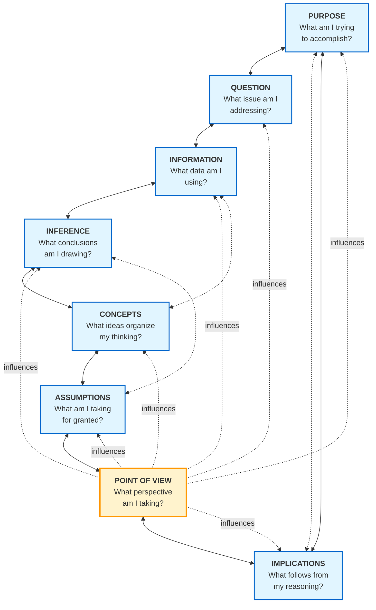
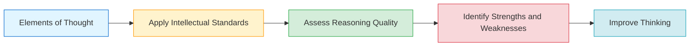

---
aliases:
  - Elements of Reasoning
  - Structures of Thought
tags:
  - type/report
  - year/2025
  - type/analysis
  - status/not-read
  - critical-thinking
  - self-improvement
  - processing-workflow
  - cognitive-science/metacognition
  - skill-acquisition
  - cognitive-resources
  - working-memory
  - reasoning
  - cognitive-enhancement
source: claude-sonnet-4.5
id: "20251205032205"
created: 2025-12-05T03:22:05
modified: 2025-12-05T03:22:05
week: "[[2025-W49]]"
month: "[[2025-12]]"
quarter: "[[2025-Q4]]"
year: "[[2025]]"
type: report
maturity: seedling
confidence: provisional
next-review: 2025-12-12
review-count: 0
link-up:
  - "[[practical-philosophy-moc]]"
link-related:
  - "[[2025-12-05|Daily-Note]]"
---
Interpretation and Inference 🔍
> [!overview] ### <span style='color: #7200ff;'>Overview</span>
> - **Title**: [[The Elements of Thought: Fundamental Structures of Reasoning]]
> - **MOC**: `=this.link-up`

> [! ] # In-Note Metadata Panel
> 
> - **Note-Type**: `= this.type`
> - **Development Status**: `= this.maturity`
> - **Epistemic Confidence**: `= this.confidence`
> - **Next Review**: `= this.next-review`
> - **Review Count**: `= this.review-count`
> - **Created**: `= this.created`
> - **Last Modified**: `= this.modified`
> 
> > [!purpose] ### 📝Content Metrics
> > **Word Count**: `= this.file.size`| **Est. Read Time**: `= round(this.file.size / 1300) + " min"`
> > **Depth Class**: `= choice(this.file.size < 500, "🌱Stub", choice(this.file.size < 2000, "📄Note", "📜Essay"))`
> ----
> > [!purpose] ### 🕰️Temporal Context
> > **Created**: `= this.file.ctime` | **Age**: `= (date(today) - this.file.ctime).days + " days"`
> > **Last Touch**: `= this.file.mtime` | **Staleness**: `= choice((date(today) - this.file.mtime).days > 180, "🕸️Cobwebs", choice((date(today) - this.file.mtime).days > 30, "🍂Cold", "🔥Fresh"))`
> > **Touch Frequency**: `= choice((date(today) - this.file.mtime).days < 7, "🔥Active", choice((date(today) - this.file.mtime).days < 30, "👌Regular", "❄️Dormant"))`
> ----
> > [!topic-idea] ### 🔗Network Connectivity
> > **In-Links**: `= length(this.file.inlinks)` | **Out-Links**: `= length(this.file.outlinks)`
> > **Network Status**: `= choice(length(this.file.inlinks) = 0, "🕸️Orphan", choice(length(this.file.inlinks) > 5, "⚡ Hub", "🌱Node"))`
> ```dataviewjs
> // SYSTEM: Semantic Bridge Engine
> // PURPOSE: Find "Sibling" notes that share the same Outlinks (Contexts)
> const current = dv.current();
> const myOutlinks = current.file.outlinks.map(l => l.path);
> 
> // 1. Filter the Vault
> const siblings = dv.pages()
>     .where(p => p.file.path !== current.file.path) // Exclude self
>     .where(p => !current.file.outlinks.map(l => l.path).includes(p.file.path)) // Exclude existing direct links
>     .map(p => {
>         // Find overlap between this page's links and the current page's links
>         const shared = p.file.outlinks.filter(l => myOutlinks.includes(l.path));
>         return { 
>             link: p.file.link, 
>             sharedCount: shared.length, 
>             sharedLinks: shared 
>         };
>     })
>     .where(p => p.sharedCount > 0) // Must share at least 1 connection
>     .sort(p => p.sharedCount, "desc") // Sort by strongest connection
>     .limit(5); // Only show top 5
> 
> // 2. Render the Bridge
> if (siblings.length > 0) {
>     dv.header(3, "Semantic Bridges (Missing Connections)");
>     dv.table(
>         ["Sibling Note", "Strength", "Shared Context"], 
>         siblings.map(s => [
>             s.link, 
>             "🔗" + s.sharedCount, 
>             s.sharedLinks.slice(0, 3).join(", ") + (s.sharedCount > 3 ? "…" : "")
>         ])
>     );
> } else {
>     dv.paragraph("*No semantic siblings found. This note is unique in its connections.*");
> }
> ```
> ---
> ### Related Notes
> ```dataview
> TABLE type, maturity, confidence
> FROM  ""
> WHERE  type = "report"
> SORT "maturity" DESC
> LIMIT 15
> ```
> ### Sources & References
> ```dataview
> TABLE 
>     source AS "Source Type",
>     file.ctime AS "Date Added"
> FROM ""
> WHERE source = "claude-sonnet-4.5"
> SORT file.ctime DESC
> LIMIT 10
> ```
> ### Backlinks & Connections
> ```dataview
> TABLE 
>     type AS "Type",
>     maturity AS "Maturity",
>     length(file.inlinks) AS "Its Backlinks",
>     dateformat(date(created), "MMM dd, yyyy") AS "Created"
> FROM [[#]]
> WHERE file.name != this.file.name
> SORT length(file.inlinks) DESC
> LIMIT 20
> ```
> ### <% dateNow %> - Initial Creation
> *Context*: `=this.title` **by**: `=this.source`
> *Maturity*: `= this.maturity`  
> *Confidence*: `= this.confidence`
> 
> ### Tags & Classification
> *Primary Tags*: `= this.tags`  
> *Type*: `= this.type`  
> *Source*: `= this.source`
# The Elements of Thought: Fundamental Structures of Reasoning


> [!etched] ### Claude Thinking
> This is a comprehensive request for a foundational academic report on the Paul-Elder Elements of Thought. Let me analyze the requirements:
> **REQUEST CLASSIFICATION:**
> - Type: comprehensive_note (reference note)
> - Scope: reference (exhaustive coverage)
> - Research Required: YES - Need to verify Paul-Elder framework details, ensure accuracy on the 8 elements, find authoritative sources
> **RESEARCH STRATEGY:**
> I need to search for:
> 1. Paul-Elder Elements of Thought framework - official sources
> 2. Richard Paul and Linda Elder's work on critical thinking
> 3. Foundation for Critical Thinking materials
> 4. Academic sources on the Elements framework
> 5. Examples of Element-based analysis
> **STRUCTURAL PLANNING:**
> This will be a Reference Note with:
> - Metadata: tags (#critical-thinking #paul-elder #reasoning-framework #elements-of-thought #reference-note), aliases (Elements of Reasoning, Paul-Elder Elements, Eight Elements Framework)
> - Major sections: Introduction, Each of 8 Elements (detailed), Interrelationships, Analytical Framework, Examples, PKB Integration
> - Wiki-links: Each element, related concepts, broader framework components
> - Callouts: definitions, examples, key questions, warnings about common failures
> - Visual: Mermaid diagram of element relationships
> **WIKI-LINK OPPORTUNITIES:**
> [[Critical Thinking]], [[Paul-Elder Framework]], [[Purpose in Reasoning]], [[Question at Issue]], [[Information]], [[Inference]], [[Concepts]], [[Assumptions]], [[Implications]], [[Point of View]], [[Intellectual Standards]], [[Reasoning]], [[Logic]], [[Argumentation]], [[Analytical Thinking]], [[Metacognition]], [[Socratic Questioning]]
> Let me search for authoritative information on the Paul-Elder Elements of Thought.
> Now I have excellent foundational information. Let me search for more specific details about how the Elements interrelate and practical application examples.Excellent. Now I have comprehensive information about the Elements of Thought. Let me compile this into a detailed, encyclopedic report following all the specified formatting and content requirements. I have sufficient information about:
> 1. The 8 Elements of Thought
> 2. Their definitions and key questions
> 3. How they interrelate
> 4. The broader Paul-Elder framework context
> 5. How to apply them analytically
> Let me now generate the comprehensive report.

---
tags: #critical-thinking #paul-elder #reasoning-framework #elements-of-thought #reference-note #analytical-thinking
aliases: [Elements of Reasoning, Paul-Elder Elements, Eight Elements Framework, Structures of Thought]
---

# 🧠 The Elements of Thought: Fundamental Structures of Reasoning

> [!abstract] Executive Summary
> The **Elements of Thought**, developed by Richard Paul and Linda Elder as part of the [[Paul-Elder Framework]], represent the fundamental building blocks present in all human reasoning. These eight universal structures—Purpose, Question at Issue, Information, Interpretation and Inference, Concepts, Assumptions, Implications and Consequences, and Point of View—provide a systematic methodology for analyzing, deconstructing, and improving thinking across any domain. Mastering these elements transforms critical thinking from an abstract aspiration into a concrete analytical practice, enabling practitioners to identify weaknesses in reasoning, uncover hidden assumptions, trace logical consequences, and construct well-reasoned arguments grounded in intellectual rigor.

## 📖 Extracted Definitions
```dataviewjs
const currentFile = dv.current().file;
const content = await dv.io.load(currentFile.path);
const bracketedFieldRegex = /\[\*\*([^*]+)\*\*::\s*([^\]]+)\]/g;

let definitions = [];
let match;

while ((match = bracketedFieldRegex.exec(content)) !== null) {
    definitions.push({
        key: match[1].trim(),
        value: match[2].trim()
    });
}

// Group by first letter
const grouped = {};
definitions.forEach(d => {
    const firstLetter = d.key[0].toUpperCase();
    if (!grouped[firstLetter]) grouped[firstLetter] = [];
    grouped[firstLetter].push(d);
});

// Display grouped results
const sortedLetters = Object.keys(grouped).sort();

for (let letter of sortedLetters) {
    dv.header(4, `${letter}`);
    dv.table(
        ["Term", "Definition"],
        grouped[letter].map(d => [`**${d.key}**`, d.value])
    );
}
```

## 🎯 Introduction: The Architecture of Reasoning

### The Universality of Thought Structures

Every instance of human reasoning, regardless of discipline, domain, or context, contains the same fundamental structural elements. When a physician diagnoses a patient, a software engineer debugs code, a historian interprets primary sources, or a citizen evaluates a political argument, they engage the identical cognitive architecture. Richard Paul and Linda Elder's profound insight was recognizing that these structures are not optional features of thinking but *constitutive* components—thinking cannot occur without them. Just as all physical matter consists of atoms arranged in different configurations, all reasoning consists of these eight elements arranged in different patterns and relationships.

> [!core-principle] The Universality Principle
> According to Paul and Elder, the Elements of Thought are **discipline-neutral** and **content-independent**. They apply with equal force to mathematics, literature, engineering, ethics, medicine, and everyday decision-making. This universality makes them extraordinarily powerful as analytical tools—once mastered in one domain, they transfer seamlessly to all others. The elements are not taught separately in physics versus history; rather, they represent the fundamental logic of human cognition itself.

The power of the Elements framework lies in making the implicit explicit. Most people think constantly yet remain unconscious of their thinking's underlying structure. They draw conclusions without recognizing their inferences, accept information without questioning its relevance, pursue goals without clarifying their purpose, and hold perspectives without acknowledging their point of view. The Elements provide a vocabulary and conceptual framework for bringing these unconscious processes into conscious awareness, where they can be examined, evaluated, and improved.

### Why Exactly Eight Elements?

The choice of eight elements is neither arbitrary nor exhaustive for completeness's sake—it represents a careful phenomenological analysis of the essential structures present in every act of reasoning. Paul and Elder arrived at this schema through decades of analyzing thinking across disciplines, asking: What fundamental components must be present for reasoning to occur at all? Their answer identifies the minimal sufficient set of elements that, taken together, constitute a complete reasoning process.

**Purpose** and **Question at Issue** establish the directionality and focus of thinking. **Information** provides the empirical raw material. **Concepts** supply the theoretical organizing principles. **Assumptions** represent the taken-for-granted beliefs enabling the reasoning. **Inference** performs the actual cognitive work of deriving conclusions. **Implications** trace the logical consequences forward. **Point of View** locates the reasoning within a particular frame of reference. Remove any single element, and reasoning becomes impossible—attempt to reason without purpose, and thinking becomes aimless; without concepts, information remains unorganized data; without inferences, no conclusions emerge.

The elements function as an **interconnected system**, not isolated components. Each element both constrains and enables the others through complex reciprocal relationships. Your Purpose shapes which Question you pose, which in turn determines what Information you seek, which you interpret through particular Concepts based on certain Assumptions, leading to Inferences with Implications, all filtered through your Point of View, which circles back to affect your Purpose. This systemic interdependence means that weakness in any single element cascades throughout the entire reasoning process.


### Integration Within the Paul-Elder Framework

The Elements of Thought constitute one of three essential components in the complete [[Paul-Elder Framework]] for [[Critical Thinking]]. Understanding their relationship to the other components is crucial for grasping how the framework functions as an integrated whole.

> [!methodology-and-sources] The Three-Component Paul-Elder System
> The complete framework consists of:
> 
> **1. Elements of Thought (Reasoning Structures)**: The eight fundamental components present in all thinking—the "parts" or "anatomy" of reasoning that this document examines in depth.
> 
> **2. [[Intellectual Standards]] (Quality Criteria)**: Universal criteria for assessing the quality of reasoning applied to each element—clarity, accuracy, precision, relevance, depth, breadth, logic, significance, and fairness. These standards function as evaluative lenses through which we assess each element.
> 
> **3. [[Intellectual Traits]] (Virtues of the Critical Thinker)**: Character dispositions developed through consistent application of the intellectual standards to the elements of thought—intellectual humility, courage, empathy, autonomy, integrity, perseverance, confidence in reason, and fair-mindedness.

The relationship between these components follows a developmental progression. First, you learn to *identify* the elements present in any instance of reasoning—recognizing purposes, detecting assumptions, tracing inferences. Second, you learn to *evaluate* the quality of each element by applying intellectual standards—asking whether the purpose is clear, whether the assumptions are justified, whether the inferences are logical. Third, through consistent practice applying standards to elements, you internalize certain character dispositions—developing habits of questioning your assumptions, considering alternative perspectives, and following reasoning wherever it leads. The elements thus represent the starting point, the foundation upon which the entire critical thinking edifice is constructed.

Understanding this relationship illuminates why Paul and Elder identify the Elements of Thought as the cornerstone of critical thinking development. Without first learning to recognize and label the structures of reasoning, you cannot systematically evaluate thinking quality or develop critical thinking virtues. The elements provide the analytical vocabulary that makes disciplined thinking possible—they are simultaneously a *descriptive framework* (describing what thinking consists of), an *analytical methodology* (providing tools for deconstructing reasoning), and a *developmental scaffold* (supporting growth toward intellectual excellence).

---

## 📋 The Eight Elements of Thought: Comprehensive Analysis

The following sections provide exhaustive treatment of each element, exploring its definition, key questions for identification, common failures, and relationships to other elements. Master these elements individually, and their systemic interrelationships become the subject of subsequent analysis.

### 1. Purpose 🎯

> [!definition] Purpose (Goal/Objective)
> [**Purpose**:: is the aim, goal, or objective that drives thinking.] It answers the question: *What am I trying to accomplish?* Every instance of reasoning pursues some end, whether explicitly articulated or implicitly operative. Purpose provides the teleological direction for thinking—it determines what counts as relevant information, which concepts to employ, what inferences to draw, and what implications matter.

<span style='color: #ff6e00;'>Purpose functions as the</span> **steering mechanism** <span style='color: #ff6e00;'>of reasoning.</span> Just as a ship requires a destination to chart its course, thinking requires a purpose to organize and direct its cognitive resources. <span style='color: #ff0075;'>Without clear purpose, thinking drifts aimlessly</span>, gathering random information, drawing arbitrary conclusions, and mistaking activity for progress. Conversely, a well-defined purpose focuses attention on relevant considerations, filters out distractions, and provides criteria for evaluating success.

<span style='color: #ff0075;'>The quality of reasoning depends fundamentally on the quality of its purpose.</span> A trivial purpose cannot support significant thinking. <span style='color: #7200ff;'>A confused purpose produces confused conclusions.</span> <span style='color: #7200ff;'>A hidden purpose undermines intellectual honesty.</span> Therefore, [**Clarifying purpose**:: represents the essential first step in analyzing any reasoning process—your own or others'.]

> [!key-claim] Critical Questions for Identifying Purpose
> When analyzing thinking, ask these essential questions:
> 
> - **What exactly am I trying to accomplish?** State the purpose explicitly and precisely.
> - **Is my purpose clearly defined, or is it vague and unfocused?** Vague purposes produce vague thinking.
> - **Is my purpose trivial or significant?** Purpose determines the importance of the entire reasoning process.
> - **Is my purpose realistic and achievable?** Unrealistic purposes lead to frustration and failure.
> - **Do I have more than one purpose?** Multiple conflicting purposes fragment thinking.
> - **If I have conflicting purposes, which takes priority?** Prioritization clarifies thinking.
> - **Is my stated purpose my actual purpose?** Hidden agendas undermine intellectual integrity.
> - **Is my purpose ethical and fair-minded?** Purposes can be intellectually clear yet morally problematic.

Purpose operates at different levels of generality. At the most abstract level, you might purpose "to understand climate change." At intermediate levels: "to understand the relationship between carbon emissions and temperature rise." At specific levels: "to determine whether reducing industrial emissions by 20% would slow warming significantly." More specific purposes typically enable more focused, rigorous thinking.

> [!example] Purpose in Action: Medical Diagnosis
> Consider a physician examining a patient with chest pain. The *general purpose* is "providing effective medical care." But this remains too vague for quality reasoning. More specifically: "determining whether this chest pain indicates a cardiac emergency requiring immediate intervention." This specific purpose immediately constrains the inquiry—it makes cardiac markers highly relevant, makes dermatological information largely irrelevant, and makes speed essential to the reasoning process. The specific purpose determines which diagnostic tests to order, which information to prioritize, and what inferences to draw.

#### Common Failures in Purpose

<span style='font-size: 1.3em;'><span style='color: #ff0075;'>Reasoning frequently fails at the level of purpose in several characteristic ways.</span></span> [**Purpose confusion**:: occurs when the thinker lacks a clearly defined goal, leading to unfocused wandering rather than directed inquiry.] [**Purpose substitution**:: happens when an initial worthwhile purpose gets replaced mid-stream by a trivial or distracting purpose]—beginning research to understand a phenomenon but becoming diverted into defending a predetermined conclusion. [**Hidden purposes**:: undermine intellectual honesty when unstated agendas (protecting ego, winning arguments, maintaining comfortable beliefs) drive reasoning that claims different explicit purposes.] [**Conflicting purposes**:: create logical incoherence when a single reasoning process attempts to serve incompatible ends simultaneously—trying both to pursue truth and to avoid uncomfortable conclusions.]

Excellence in reasoning requires not merely having a purpose, but having a clear, explicitly articulated, realistic, ethical, and singular purpose that remains constant throughout the inquiry. <span style='color: #ff0075;'>When analyzing arguments</span>—<span style='color: #7200ff;'>whether your own or others'</span>—<span style='color: #ff0075;'>always begin by identifying and evaluating the purpose.</span> <span style='color: #7200ff;'>Poor purpose guarantees poor reasoning, regardless of excellence in other elements.</span>

---

### 2. Question at Issue ❓

> [!definition] Question at Issue (Problem/Topic)
> The [**Question at Issue**:: is the specific problem, question, or issue that the thinking addresses.] It defines the focal point of inquiry and determines the scope of relevant considerations. While Purpose establishes *why* you are thinking, the <span style='color: #ff0075;'>Question at Issue establishes *what* you are thinking about.</span> It converts general purpose into specific inquiry.

The relationship between Purpose and Question deserves careful attention. Your purpose generates your question—if your purpose is "understanding climate change," you might ask "What factors drive global temperature changes?" The question operationalizes the purpose, translating abstract intention into concrete investigation. <span style='color: #ff0075;'>Different questions can serve the same purpose, and the quality of your thinking depends heavily on</span> **selecting the right question**.

> [!key-claim] The Power of Question Formulation
> <span style='color: #ff0075;'>Paul and Elder emphasize that how you frame the question dramatically constrains possible answers.</span> A poorly formulated question—vague, loaded, biased, or falsely dichotomous—makes good reasoning impossible regardless of subsequent cognitive work. Conversely, a well-formulated question—clear, precise, neutral, and appropriately scoped—creates the conditions for excellent reasoning.

Questions exist at different levels of complexity. [**Simple factual questions**:: ("What is the boiling point of water?") admit straightforward empirical answers.] [**Conceptual questions**:: ("What is justice?") require definitional analysis and theoretical interpretation.] [**Evaluative questions**:: ("Is this policy just?") demand application of criteria and value judgments.] [**Complex synthetic questions**:: ("How can we create a more just society?") integrate multiple question types and resist simple answers.] <span style='color: #ff0075;'>The question type determines appropriate reasoning strategies.</span>

> [!example] Question Formulation: Criminal Justice
> Consider reasoning about criminal justice reform. Different questions produce radically different inquiries:
> 
> - *"What works to reduce crime?"* (Empirical/pragmatic focus on effectiveness)
> - *"What does justice require in criminal punishment?"* (Normative/ethical focus on principles)
> - *"How can we balance public safety with individual rights?"* (Synthetic question integrating multiple values)
> - *"Why do our opponents oppose prison reform?"* (Psychologizing question that presumes opposition stems from bad motives)
> 
> The first three questions, though different, all enable serious inquiry. The fourth question commits a logical error—it assumes opposition requires psychological explanation rather than engaging substantive arguments. Question formulation shapes the entire reasoning trajectory.

#### Critical Questions for Identifying and Evaluating Questions

When analyzing the question at issue, ask:

[**Identification Questions**:: *What is the key question I am addressing? Is this question the central question, or is it peripheral? Am I addressing multiple questions that should be separated? Am I treating a complex question as if it were simple?*]

[**Clarity Questions**:: *Is my question clear and precisely stated? Could someone else understand exactly what I'm asking? Does my question use ambiguous terms that need definition?*]

[**Complexity Questions**:: *Is this question purely factual, conceptual, evaluative, or some combination? What type of answer does this question require—empirical evidence, logical analysis, value judgment? Have I broken a complex question into component questions?*]

[**Bias Questions**:: *Is my question loaded or slanted toward a particular answer? Does my question contain hidden assumptions? Am I asking a genuine open question, or merely a rhetorical one?*]

#### Common Failures in Questions

[**Question vagueness**:: plagues much reasoning. When the question remains fuzzy and ill-defined, thinking wanders without clear direction.] "How can we fix education?" is too vague to guide inquiry—fix what aspect? For whom? According to what criteria? <span style='color: #ff0075;'>Vague questions produce vague answers.</span>

[**Question substitution**:: occurs when reasoning addresses an easier question instead of the actual question at issue.] Faced with "Is this policy just?" a thinker might substitute "Will this policy benefit me?"—answering a different, simpler question than the one posed. Much poor reasoning results from answering the wrong question while believing you've addressed the right one.

[**Loaded questions**:: embed assumptions or biases that prejudge the answer.] <span style='color: #ff0075;'>"Why are opponents of policy X so foolish?"</span> <span style='color: #7200ff;'>assumes opposition stems from foolishness rather than legitimate disagreement.</span> <span style='color: #ff0075;'>The question itself prevents fair-minded inquiry.</span>

[**Dichotomous framing**:: presents false either/or questions when reality contains additional options.] "Should we prioritize freedom or equality?" may be a false dichotomy if systems supporting both are possible. Artificially constraining options through question formulation limits reasoning.

Excellence in reasoning requires identifying the question precisely, formulating it clearly and fairly, recognizing its type and complexity, and resisting substitution or distortion of the genuine issue at stake.

---

### 3. Information 📊

> [!definition] Information (Data/Evidence)
> [**Information**:: comprises the facts, data, observations, experiences, and evidence used as the raw material for reasoning.] Information answers the question: *What information am I using to address this question?* It constitutes the empirical foundation upon which inferences are built. The quality of conclusions depends fundamentally on the quality of information supporting them—the principle "garbage in, garbage out" applies universally to reasoning.

Information exists in multiple forms across a continuum from concrete to abstract. [**Raw sensory data**:: (temperature readings, visual observations) represents the most concrete form.] [**Reported facts**:: (historical records, scientific measurements) add a layer of interpretation.] [**Testimonial evidence**:: (eyewitness accounts, expert opinions) introduces human judgment.] [**Statistical summaries**:: (averages, correlations, trends) aggregate individual data points.] [**Theoretical claims**:: (scientific laws, economic principles) abstract from empirical particulars to general patterns.] Each form of information carries different epistemic status and requires different evaluative standards.

> [!key-claim] The Information-Inference Distinction
> Paul and Elder emphasize the critical importance of distinguishing [**Information**:: (what we observe, what is given)] from [**inference**:: (what we conclude, what we interpret).] Confusion between these categories represents one of the most common reasoning failures. When someone says "He is lying," are they reporting information (observing false statements) or making an inference (interpreting motivation)? The distinction matters profoundly for reasoning quality.
>
> Much poor reasoning results from treating inferences as if they were information—presenting interpretations as if they were observations, conclusions as if they were facts. <span style='color: #ff0075;'>Disciplined thinkers carefully distinguish what they *observe* from what they *infer* from observations.</span>

#### Critical Questions for Evaluating Information

When assessing the information element in reasoning, ask:

[**Identification Questions**:: *What information am I using to address this question? What information do I need that I don't yet have? Is my information primarily empirical, testimonial, statistical, or theoretical?*]

[**Quality Questions**:: *Is my information accurate? How can I verify it? Is my information relevant to the question at issue? Is my information sufficient to support strong conclusions, or do I need more? Is my information biased or one-sided? Have I sought information that challenges my preferred conclusions?*]

[**Source Questions**:: *Where does this information come from? Is the source credible and reliable? Does the source have biases or conflicts of interest? Am I relying on multiple independent sources or a single source?*]

[**Completeness Questions**:: *Have I considered all relevant information? What information might I be ignoring or overlooking? Am I aware of contradictory information? Have I examined information that challenges my position?*]

> [!example] Information Quality in Medical Reasoning
> A physician diagnosing a patient must carefully distinguish types of information and assess quality:
> 
> **Patient symptoms (reported information)**: "I have chest pain." The physician notes this is the *patient's subjective experience*, not necessarily indicative of cardiac issues (could be anxiety, muscle strain, etc.).
> 
> **Physical examination (observational information)**: Measuring blood pressure, listening to heart sounds, palpating for tenderness. This direct sensory data carries high evidential value but requires skilled interpretation.
> 
> **Diagnostic tests (instrumental information)**: EKG readings, blood test results, imaging studies. These provide objective measurements but require understanding of what the instruments actually measure and their error rates.
> 
> **Medical literature (theoretical information)**: Research on cardiac conditions, treatment effectiveness, diagnostic accuracy. This provides general principles but requires judgment in applying them to individual cases.
> 
> The skilled physician recognizes that each information type serves different functions, carries different levels of certainty, and requires different interpretive frameworks. Diagnosis fails when information types are confused or quality is inadequately assessed.

#### Common Failures in Information Handling

[**Information insufficiency**:: occurs when reasoning proceeds on inadequate data.] Jumping to conclusions before gathering sufficient information produces unreliable results. <span style='color: #ff0075;'>The pressure for quick answers often leads to premature closure—forming</span> judgments before adequate investigation.

[**Information bias**:: results from selective gathering or attention.] [**Confirmation bias**:: leads to seeking information supporting preexisting beliefs while avoiding contradictory data.] Echo chambers amplify this problem by limiting information exposure to sources agreeing with preferred conclusions.

[**Information confusion**:: involves mistaking inference for observation, treating opinions as facts, or accepting unreliable sources as authoritative.] The contemporary information environment makes this particularly challenging—distinguishing credible from unreliable sources requires sophisticated epistemic judgment.

[**Information overload**:: can paradoxically produce reasoning failures when excessive data prevents synthesis and pattern recognition.] The challenge is not merely gathering information but selecting relevant information and organizing it effectively.

Excellence in reasoning requires gathering sufficient, relevant, accurate information from credible sources; carefully distinguishing information from inference; actively seeking information challenging preferred conclusions; and recognizing the limits of available information.

---

### 4. Interpretation and Inference 🔍

> [!definition] Interpretation and Inference (Conclusions/Solutions)
> [**Inference**:: is the intellectual act of drawing conclusions from information and reasoning.] [**Interpretation**:: is the process of making sense of information by placing it within conceptual frameworks.] Together, they represent the *active cognitive work* of reasoning—<span style='color: #ff6e00;'>moving from premises to conclusions, from data to understanding, from observations to explanations</span>. Inference answers: *What conclusions am I drawing? How am I interpreting this information?*

Inference represents reasoning's productive moment—the logical step from "given this information" to "therefore this conclusion." <span style='color: #ff0075;'>Every inference involves a logical move</span>, an intellectual leap from grounds to claim. <span style='color: #ff0075;'>The quality of this move determines reasoning quality.</span> [**Valid inferences**:: follow logically from their premises.] [**Strong inferences**:: rest on sufficient evidence.] [**Weak inferences**:: leap beyond what the evidence supports.] [**Invalid inferences**:: simply do not follow from their premises.]

> [!core-principle] The Inference Chain Principle
> Complex reasoning rarely involves single inferences; rather, it consists of [**Chains of Inferences**:: where each conclusion becomes a premise for subsequent reasoning.] Understanding these chains is essential for analyzing argument structure:
> 
> *Information → Inference 1 → Inference 2 → Inference 3 → Final Conclusion*
> 
> Weakness anywhere in the chain undermines the final conclusion. Skilled critical thinkers trace inference chains backward, examining each step: "You conclude X. What evidence supports X? What intermediate conclusions connect your evidence to X? Does each step follow logically?"

The relationship between interpretation and inference deserves careful attention. **Interpretation** involves applying conceptual frameworks to make sense of raw information—seeing data *as* something. When a meteorologist interprets atmospheric pressure readings *as* indicating an approaching storm, they place raw data within a theoretical framework that gives it meaning. **Inference** then moves from interpreted information to conclusions—*because* a storm approaches, *therefore* we should issue warnings. Interpretation provides the conceptual understanding enabling inference.

> [!example] Interpretation and Inference in Historical Reasoning
> Consider a historian examining a medieval document describing peasant protests. The raw **information** consists of words on parchment. But what do these words mean? 
> 
> **Interpretation** (making sense of information): The historian must interpret the document through understanding of medieval social structure, economic conditions, and political context. The same words might be read as evidence of widespread discontent (one interpretation) or as propaganda exaggerating isolated incidents (alternative interpretation). Interpretation requires applying conceptual frameworks about medieval society.
> 
> **Inference** (drawing conclusions): Once interpreted, the historian draws conclusions: "These protests indicate deteriorating feudal relations in this region during this period." This inference moves from the interpreted evidence to a historical claim. The inference quality depends on both the interpretation quality and the logical connection between interpreted evidence and historical conclusion.

#### Critical Questions for Evaluating Inferences

When analyzing inferences and interpretations, ask:

[**Identification Questions**:: *What conclusions am I drawing? What am I inferring from this information? How am I interpreting this data? What alternative interpretations exist?*]

[**Logical Questions**:: *Do my conclusions follow logically from my information? Is my inference valid? Have I made logical leaps? Could someone reach different conclusions from the same information?*]

[**Strength Questions**:: *Is my inference strong or weak? Do I have sufficient information to support strong conclusions? Am I inferring beyond what my evidence warrants? Where am I most uncertain in my reasoning?*]

[**Alternative Questions**:: *What alternative inferences could be drawn from this information? Have I considered competing interpretations? Why is my interpretation superior to alternatives? What would it take to change my interpretation?*]

#### Common Failures in Inference

[**Hasty generalization**:: involves inferring general conclusions from insufficient particular cases. Observing a few instances and concluding "all X are Y" represents this error. The inference leaps beyond what the evidence supports.]

[**False cause**:: confuses correlation with causation or mistakes temporal sequence for causal relation. "A occurred before B, therefore A caused B" (post hoc fallacy) exemplifies this failure. Valid causal inference requires more than temporal correlation.]

[**Interpretation bias**:: occurs when conceptual frameworks distort understanding of information. Seeing data through strongly ideological lenses leads to interpreting ambiguous information in ways confirming preferred conclusions. The same facts receive radically different interpretations depending on the interpreter's framework.]

[**Inference confusion**:: involves treating weak inferences as if they were certain conclusions or failing to recognize that conclusions are inferences at all. When someone presents an interpretation as if it were simple observation—"He is lying" rather than "I infer from his behavior that he is lying"—they commit this error.]

[**Inference chains**:: commonly break down when intermediate steps go unexamined. A person might hold a strong conviction but cannot trace the inferential path from evidence to conclusion—they "just know" without understanding how they know. Disciplined reasoning requires ability to articulate each inferential step.]

Excellence in reasoning demands drawing conclusions that follow logically from evidence, recognizing that inferences are interpretations open to revision, acknowledging alternative interpretations, clearly distinguishing strong from weak inferences, and tracing complete inferential chains from premises to conclusions.

---

### 5. Concepts 💡

> [!definition] Concepts (Theories/Ideas)
> **Concepts** are the organizing ideas, theories, principles, definitions, models, or axioms that structure thinking. They provide the abstract frameworks through which we understand and categorize experience. Concepts answer: *What key ideas am I using to organize my thinking? What theories shape my understanding?* All reasoning necessarily employs concepts—we cannot think without conceptual frameworks any more than we can see without eyes.

Concepts function as the *theoretical infrastructure* of reasoning. When an economist thinks about markets, supply curves, equilibrium prices, and marginal utility, these concepts organize their understanding of economic phenomena. When a biologist thinks through evolution, natural selection, genetic drift, and speciation, these concepts structure biological reasoning. Without these organizing principles, information remains unorganized data points rather than coherent understanding.

> [!key-claim] The Concept-Information Relationship
> Paul and Elder emphasize that concepts and information exist in reciprocal relationship. **Information** provides the empirical content; **concepts** provide the organizational form. Concepts without information remain empty abstractions. Information without concepts remains disorganized data. Excellence in reasoning requires both rich conceptual frameworks *and* careful attention to empirical detail. The relationship works bidirectionally: concepts shape what information we notice and how we interpret it, while information tests and refines our concepts.

Concepts exist at multiple levels of abstraction. **Concrete concepts** (chair, tree, water) refer to directly observable entities. **Abstract concepts** (justice, democracy, consciousness) refer to complex theoretical constructs requiring extensive definition. **Domain-specific concepts** (equilibrium in economics, validity in logic, paradigm in science) structure thinking within particular disciplines. **Meta-concepts** (truth, evidence, reasoning) operate across domains to structure inquiry itself.

The quality of concepts profoundly affects reasoning quality. **Clear concepts** enable precise thinking. **Vague concepts** produce confusion. **Sophisticated concepts** capture nuance and complexity. **Crude concepts** oversimplify. **Well-defined concepts** support logical rigor. **Ill-defined concepts** allow reasoning to drift. Therefore, **conceptual clarification**—carefully defining key terms and examining the theories structuring thinking—represents an essential critical thinking skill.

> [!example] Conceptual Frameworks in Political Reasoning
> Consider reasoning about political systems. Different conceptual frameworks produce different analyses:
> 
> **Classical Liberal Framework**: Organizes thinking around concepts of *individual rights*, *limited government*, *free markets*, *rule of law*. Through this lens, political questions become primarily about protecting individual liberty against government overreach.
> 
> **Socialist Framework**: Organizes thinking around concepts of *class conflict*, *exploitation*, *collective ownership*, *economic democracy*. Through this lens, political questions become primarily about achieving economic equality and worker control.
> 
> **Conservative Framework**: Organizes thinking around concepts of *tradition*, *organic community*, *hierarchy*, *social order*. Through this lens, political questions become primarily about maintaining stable social structures.
> 
> Notice how the *same information* (unemployment statistics, wealth distribution, policy outcomes) gets interpreted completely differently depending on the conceptual framework employed. The framework determines what counts as important, what requires explanation, and what solutions make sense.

#### Critical Questions for Evaluating Concepts

When analyzing the conceptual element in reasoning, ask:

**Identification Questions**: *What are the key concepts I'm using? What theories or models structure my thinking? What definitions am I operating with? Which concepts are domain-specific versus generally applicable?*

**Clarity Questions**: *Are my key concepts clearly defined? Do I understand these concepts deeply? Could I explain these concepts to someone else? Am I using concepts consistently?*

**Adequacy Questions**: *Are my concepts adequate to the complexity of what I'm analyzing? Am I oversimplifying with crude concepts? Are my concepts too abstract to connect with reality? Do my concepts capture relevant distinctions?*

**Assumption Questions**: *What assumptions are built into my conceptual framework? What perspective do these concepts embody? What alternative conceptual frameworks exist? How would thinking change if I employed different concepts?*

#### Common Failures in Conceptual Reasoning

**Conceptual vagueness** undermines reasoning when key terms remain undefined or poorly understood. Arguments about "justice," "freedom," or "fairness" often fail because participants employ these concepts differently without recognizing definitional disagreement. Apparent factual disputes often mask conceptual confusion.

**Conceptual rigidity** occurs when thinkers treat their conceptual frameworks as representing reality itself rather than as intellectual tools for understanding reality. Every conceptual scheme highlights certain features while obscuring others—no framework captures everything. Rigid adherence to a single framework produces blind spots.

**Conceptual confusion** involves mixing incompatible concepts, using concepts inconsistently, or applying concepts inappropriately. Trying to analyze quantum mechanics using classical concepts of "particle" and "wave" produces confusion because quantum phenomena exceed these conceptual categories.

**Conceptual oversimplification** reduces complex phenomena to crude categories. Dividing political positions into simple "left" versus "right," or personality types into four categories, or human motivations into "nature" versus "nurture" oversimplifies in ways that distort understanding.

Excellence in reasoning requires mastering sophisticated conceptual frameworks appropriate to the domain, clearly defining key concepts, recognizing that all conceptual schemes embody particular perspectives, maintaining flexibility to employ alternative frameworks, and avoiding both vagueness and rigidity in conceptual application.

---

### 6. Assumptions 🔒

> [!definition] Assumptions (Presuppositions)
> **Assumptions** are the beliefs, ideas, or claims you take for granted—the presuppositions operating in your reasoning whether or not you recognize them. Assumptions answer: *What am I taking for granted? What must I believe for my reasoning to make sense?* Every instance of reasoning rests on assumptions, yet assumptions typically remain implicit and unexamined. Making assumptions explicit represents one of critical thinking's most powerful techniques.

Assumptions function as reasoning's *hidden foundation*. Like the underwater portion of an iceberg, assumptions support the visible reasoning while remaining largely invisible. Your explicit conclusions follow from your stated premises, but those premises themselves rest on unstated assumptions. Tracing assumptions backward reveals the bedrock beliefs upon which reasoning ultimately depends.

> [!core-principle] The Ubiquity of Assumptions
> According to Paul and Elder, it is *impossible* to reason without making assumptions. Every statement, argument, or theory presupposes certain background beliefs. When a scientist conducts an experiment, they assume instruments provide reliable measurements, natural laws operate consistently, and experimental results can be generalized. When a person plans their day, they assume continued existence, relatively predictable conditions, and their capacity for action. Reasoning could not begin without assumptions—we cannot verify everything; some beliefs must be accepted as starting points.
> 
> The critical question is not whether you make assumptions (you inevitably do) but whether you **recognize** your assumptions, whether they are **justified**, and whether you're **willing to examine them**.

Assumptions exist in multiple forms. **Factual assumptions** presuppose certain states of affairs—assuming economic growth will continue, assuming historical records are generally accurate, assuming most people are basically rational. **Value assumptions** presuppose ethical or aesthetic judgments—assuming human life has inherent worth, assuming democracy is preferable to tyranny, assuming truth-seeking matters. **Methodological assumptions** presuppose the validity of certain reasoning procedures—assuming empirical evidence provides knowledge, assuming logic can establish truth, assuming expert opinion deserves weight. **Paradigmatic assumptions** presuppose entire worldviews—assuming materialism (physical reality is fundamental) or idealism (mental reality is fundamental), assuming determinism or free will, assuming humanity's place in nature.

> [!example] Uncovering Hidden Assumptions: The Standardized Testing Debate
> Consider the argument: "We should expand standardized testing in schools because it improves educational outcomes."
> 
> **Explicit Premise**: Standardized testing improves educational outcomes.
> **Explicit Conclusion**: We should expand standardized testing.
> 
> But what **assumptions** does this reasoning require?
> 
> *Factual Assumptions*: That test scores correlate with genuine learning, that teachers respond to testing incentives by improving instruction (rather than teaching to the test), that improved outcomes outweigh testing costs and stress.
> 
> *Value Assumptions*: That measurable outcomes are what we should prioritize in education (rather than, say, creativity or critical thinking that resists standardized measurement), that educational efficiency justifies increased testing burden.
> 
> *Methodological Assumptions*: That quantitative metrics adequately capture educational quality, that standardized tests validly measure learning.
> 
> Notice that someone might challenge this reasoning not by disputing the explicit premise (test scores improve) but by challenging the underlying assumptions (that test scores represent genuine learning). Much productive disagreement occurs at the level of assumptions rather than explicit claims.

#### Critical Questions for Uncovering Assumptions

When analyzing assumptions, ask:

**Identification Questions**: *What am I taking for granted? What must be true for my conclusions to follow? What am I presupposing about the topic? What background beliefs support my reasoning?*

**Justification Questions**: *Are my assumptions justified? What evidence supports my assumptions? Could my assumptions be false? Am I aware of alternative assumptions others might make?*

**Examination Questions**: *Which assumptions are factual versus values versus methodological? Which assumptions are widely shared versus controversial? Which assumptions are peripheral versus central to my reasoning?*

**Revision Questions**: *What happens if I question this assumption? How would my reasoning change if I adopted different assumptions? Am I willing to revise assumptions in light of evidence?*

#### Common Failures Involving Assumptions

**Assumption blindness** represents the most pervasive failure—simply not recognizing that one is making assumptions. When assumptions remain unconscious, they cannot be examined. People often confuse their assumptions with "obvious facts" or "common sense," failing to recognize that what seems obvious to them embodies particular presuppositions others might not share.

**Unjustified assumptions** occur when reasoning rests on beliefs for which no adequate evidence exists. Assuming "technology always improves life" or "all politicians are corrupt" or "my intuitions are reliable" without evidence makes reasoning vulnerable to these assumptions being false.

**Question-begging assumptions** (circular reasoning) occur when assumptions presuppose the very conclusion supposedly being established. Arguing "We should trust the Bible because the Bible says it's trustworthy" assumes biblical authority in order to prove biblical authority.

**Incompatible assumptions** create logical incoherence when reasoning presupposes mutually contradictory beliefs. Simultaneously assuming "all people are self-interested" and "we should trust expert disinterested judgment" creates tension—if experts are self-interested, why trust their judgment?

**Assumption rigidity** involves unwillingness to examine or revise assumptions even when challenged. When core assumptions become identity-defining or ideologically protected, people resist questioning them regardless of contrary evidence. This transforms assumptions into dogmas.

Excellence in reasoning requires developing skill at **uncovering implicit assumptions**, both in your own reasoning and others'; subjecting assumptions to critical examination rather than treating them as immune from scrutiny; recognizing that all reasoning rests on assumptions; and maintaining willingness to revise assumptions when evidence warrants.

---

### 7. Implications and Consequences ⚡

> [!definition] Implications and Consequences
> **Implications** are what logically follows from your reasoning—the conclusions that must be accepted if you accept your premises and reasoning. **Consequences** are the likely results or effects that would occur if your conclusions were acted upon. Together they answer: *If I accept this reasoning, what else follows? What would happen if I acted on these conclusions?* Tracing implications and consequences projects reasoning forward to examine what it commits you to.

The implications element looks both *logically* forward (what follows necessarily from these premises) and *practically* forward (what would result from acting on these conclusions). **Logical implications** concern what must be true if your reasoning is valid. **Practical consequences** concern what would happen in the world. Both matter profoundly for evaluating reasoning quality.

> [!key-claim] The Implications Test
> Paul and Elder identify tracing implications as one of critical thinking's most powerful techniques. Many arguments appear plausible when examined directly but reveal flaws when their implications are traced. The **implications test** asks: "If I consistently applied this principle, what would follow?" Often, unacceptable implications indicate flawed reasoning. Someone might argue "People should always follow their feelings." Trace the implications: this would justify acting on feelings of anger, vengeance, or greed. The unacceptable implications suggest the principle requires qualification.

Distinguishing implications from consequences requires care. **Implications** are logical relationships—if P is true, then Q must be true. **Consequences** are causal relationships—if we do P, then Q will likely result. Implications concern truth; consequences concern outcomes. Both deserve careful analysis.

> [!example] Implications and Consequences in Ethical Reasoning
> Consider utilitarian ethical reasoning: "Actions are right insofar as they maximize happiness for the greatest number."
> 
> **Logical Implications**: This principle implies that an action producing great happiness for many could be right even if it requires sacrificing an innocent person's happiness entirely (if net happiness increases). It implies that intentions don't matter morally—only consequences. It implies that distributional questions don't matter—10 people experiencing happiness of 10 equals 100 people experiencing happiness of 1 (both sum to 100 units of happiness).
> 
> **Practical Consequences**: If society adopted this principle as policy, consequences might include: utilitarian calculations justifying violations of individual rights if doing so benefits the majority; difficult measurement problems (how do we quantify happiness?); potential for majority tyranny (majority happiness justifies minority suffering).
> 
> Critics of utilitarianism often focus on implications (it implies morally repugnant conclusions in thought experiments) or consequences (it would produce bad outcomes if implemented). Examining implications and consequences reveals whether a theory can withstand critical scrutiny.

#### Critical Questions for Tracing Implications and Consequences

When analyzing implications and consequences, ask:

**Logical Implication Questions**: *What follows logically from my reasoning? If I accept these premises, what else must I accept? What am I committed to by this reasoning? Are there implications I'm unwilling to accept?*

**Principle Application Questions**: *If I apply this principle consistently, what would follow? Would I accept the implications in other cases? Am I making exceptions to avoid uncomfortable implications?*

**Practical Consequence Questions**: *If we acted on these conclusions, what would happen? What are the likely short-term consequences? What are the potential long-term consequences? What unintended consequences might occur?*

**Scope Questions**: *Who would be affected by these consequences? How significant are these implications? Are the potential benefits worth the likely costs?*

#### Common Failures in Examining Implications

**Implication blindness** occurs when reasoners fail to trace what their principles logically commit them to. They hold beliefs without recognizing their implications, leading to inconsistent positions. Someone might simultaneously hold "All taxation is theft" and "Government should provide national defense," failing to recognize the logical tension—defense requires taxation.

**Cherry-picking implications** involves accepting favorable implications while ignoring or dismissing unfavorable ones. A person might accept that their principle implies beneficial outcomes while rejecting that it also implies harmful outcomes, failing to recognize that principles apply universally.

**Consequence blindness** happens when reasoners focus exclusively on intended effects while ignoring unintended consequences. Policy proposals often fail this way—focusing on hoped-for benefits while neglecting probable costs, side effects, or downstream impacts.

**Short-term thinking** examines immediate consequences while neglecting long-term implications. A decision might produce favorable short-term outcomes but destructive long-term consequences. Reasoning that doesn't project forward beyond immediate effects proves inadequate.

**Inconsistent application** involves applying principles when they support desired conclusions but abandoning them when they would support undesired conclusions. This reveals that the stated principle doesn't actually guide reasoning—it merely rationalizes predetermined conclusions.

Excellence in reasoning requires systematically tracing both logical implications and practical consequences; accepting the full scope of what your reasoning commits you to; examining long-term and unintended consequences alongside intended effects; and maintaining consistency in applying principles regardless of whether their implications prove convenient.

---

### 8. Point of View 👁️

> [!definition] Point of View (Perspective/Frame of Reference)
> **Point of View** is the perspective, frame of reference, or orientation from which you reason. It encompasses your vantage point, the lens through which you view issues, and the orientation that shapes your thinking. Point of View answers: *From what perspective am I viewing this? What is my frame of reference?* Every instance of reasoning necessarily proceeds from some point of view—thinking cannot occur from nowhere.

Point of View operates at multiple levels simultaneously. At the most concrete level, it involves **literal perspective**—your physical position determines what you can observe. At the **social-positional level**, your role and circumstances shape perspective—a CEO and factory worker view labor relations differently. At the **disciplinary level**, your field shapes perspective—an economist and sociologist analyze poverty differently. At the **ideological level**, your worldview shapes perspective—a progressive and conservative evaluate policies differently. At the most abstract **paradigmatic level**, your fundamental assumptions about reality shape perspective—a materialist and idealist understand consciousness differently.

> [!core-principle] The Necessity and Limitation of Perspective
> Paul and Elder emphasize a crucial tension: **Point of view is both necessary and limiting**. Necessary because thinking cannot occur from no perspective—you must view situations from somewhere. Limiting because every perspective highlights certain features while obscuring others. Like standing in a particular place in a room, your position determines what you can see—but also what remains outside your field of vision.
> 
> This creates an intellectual challenge: How can you recognize your own point of view (which shapes everything you perceive) while *viewing through* that perspective? The answer lies in **deliberately adopting multiple perspectives**—attempting to see situations from viewpoints different from your own, recognizing that each perspective illuminates some aspects while obscuring others.

The relationship between Point of View and other Elements deserves careful attention. Your **Point of View shapes your Purpose** (what goals seem important). It **frames your Questions** (what problems require attention). It **determines what Information you notice** (what data seem relevant). It **provides Concepts for interpretation** (what theories you employ). It **influences what Assumptions you make** (what beliefs seem obvious). It **affects what Inferences you draw** (what conclusions seem to follow). It **determines what Implications you recognize** (what consequences seem significant). Point of View thus functions as a *master element* coloring all others.

> [!example] Point of View in Historical Analysis
> Consider analysis of European colonization. Different points of view produce radically different histories:
> 
> **European Colonizer Perspective**: Emphasis on exploration, civilizing mission, technological advancement, spreading Christianity and European culture. Questions focus on colonial administration effectiveness, resistance to progress, economic development. Information highlights European achievements, institutions built, diseases conquered.
> 
> **Indigenous Peoples' Perspective**: Emphasis on invasion, genocide, cultural destruction, land theft, exploitation. Questions focus on survival strategies, resistance movements, cultural preservation. Information highlights population decimation, forced assimilation, resource extraction.
> 
> **Contemporary Western Academic Perspective**: Attempts to balance perspectives, recognize colonial harms while understanding European motivations, examine power dynamics and structural violence. Questions focus on long-term impacts, ongoing colonial legacies, possibilities for reconciliation.
> 
> Notice that the *same events* appear entirely different depending on perspective. Each viewpoint has access to certain information and interpretations while other aspects remain less visible. Understanding requires recognizing how perspective shapes historical narrative.

#### Critical Questions for Examining Point of View

When analyzing point of view, ask:

**Identification Questions**: *What is my point of view? What perspective am I taking? What shapes my frame of reference? How does my position affect my thinking?*

**Limitation Questions**: *What does my perspective allow me to see clearly? What does it obscure or prevent me from seeing? What am I taking for granted because of my perspective? What assumptions are built into my viewpoint?*

**Alternative Questions**: *What alternative points of view exist on this issue? How would someone with a different perspective see this situation? What information or arguments would be more salient from other perspectives? How would my reasoning change if I adopted a different viewpoint?*

**Fairness Questions**: *Am I considering viewpoints different from my own? Am I treating alternative perspectives fairly? Am I dismissing opposing viewpoints without genuinely considering them? Can I articulate alternative positions charitably?*

#### Common Failures Involving Point of View

**Perspective unconsciousness** represents the most fundamental failure—not recognizing that you have a particular perspective at all. Treating your viewpoint as "just the way things are" rather than as one perspective among alternatives produces intellectual rigidity. You confuse your perspective with objective reality.

**Egocentrism** involves viewing everything from your personal perspective and needs. "This policy is bad" often means "This policy doesn't benefit me." Egocentric thinking assumes personal experience generalizes universally—"I don't experience discrimination, therefore discrimination doesn't exist" mistakes limited perspective for comprehensive understanding.

**Sociocentrism** involves viewing everything from your group's perspective without recognizing this limitation. Your culture, nation, religion, or ideological group provides the frame of reference treated as obviously correct. Alternative perspectives appear not merely wrong but incomprehensible.

**Perspective rigidity** occurs when you recognize that alternative perspectives exist but refuse to genuinely consider them. You dismiss opposing viewpoints as obviously mistaken without attempting to understand why someone might hold them. This prevents learning from dialogue with those who see things differently.

**False balance** involves treating all perspectives as equally valid without discrimination. While respecting alternative viewpoints matters, not all perspectives have equal merit—some rest on better evidence, logic, and ethical principles than others. Critical thinking requires both openness to alternative perspectives *and* evaluation of their quality.

Excellence in reasoning requires **recognizing your own point of view** and its limitations; **deliberately seeking alternative perspectives**; **attempting to understand viewpoints different from your own**; evaluating perspectives based on intellectual standards rather than whether they match your preferences; and developing **intellectual empathy**—the capacity to imagine yourself into another's perspective with genuine understanding.

---

## 🔗 The Interrelationships: How Elements Form a System

### The Non-Linear Nature of Element Relationships

The eight Elements of Thought do not exist as isolated, independent components that can be understood separately. Rather, they form what Paul and Elder describe as a "nonlinear interrelationship"—a complex web of reciprocal influences where each element both shapes and is shaped by the others. Understanding this systemic nature represents crucial advancement beyond merely memorizing element definitions. Excellence in critical thinking requires grasping how elements function together to constitute reasoning as a unified process.

> [!key-claim] Elements as an Integrated System
> According to Paul and Elder, "There is an intimate overlap among all of the elements by virtue of their interrelationship." This means that changes in any single element ripple throughout the entire reasoning structure. Clarifying your Purpose affects what Questions you ask, which determines what Information you seek, which you interpret through particular Concepts, and so forth. The elements don't operate sequentially (first purpose, then question, then information...) but simultaneously and reciprocally, each constraining and enabling the others.

### Core Systemic Relationships

Several fundamental patterns characterize how elements interrelate:

**Purpose ↔ Question at Issue**: Your overarching Purpose generates specific Questions for investigation, while the particular Question you formulate operationalizes and clarifies Purpose. A vague Purpose produces an unfocused Question; a precise Question reveals whether Purpose is clear. This bidirectional relationship means that clarifying either element improves the other. When Purpose and Question misalign—when you ask questions that don't serve your actual purpose—reasoning goes astray.

**Information ↔ Concepts**: Information provides empirical content; Concepts provide organizational structure. Concepts determine what Information you notice as relevant and how you categorize it. Meanwhile, Information tests and refines Concepts—when facts don't fit your conceptual framework, you must either revise concepts or explain anomalies. This dialectical relationship between theory and observation drives intellectual progress across disciplines. Scientists gathering data (Information) interpret it through theoretical models (Concepts), which then guide further data collection in a iterative cycle.

**Assumptions ↔ Point of View**: Your Point of View embodies certain Assumptions—particular perspectives presuppose certain background beliefs. Recognizing your perspective requires uncovering its built-in assumptions. Conversely, examining assumptions reveals the perspective they constitute. A person reasoning from a free-market economic perspective (Point of View) makes assumptions about human nature (rational self-interest), market dynamics (prices convey information efficiently), and government (intervention creates inefficiency). These assumptions aren't separate beliefs added to the perspective—they constitute the perspective's foundation.

**Interpretation/Inference ↔ Information**: This relationship determines reasoning quality most directly. Inferences must be drawn *from* Information; the stronger your informational base, the stronger your inferences can be. But Information requires Interpretation to yield conclusions—raw data doesn't speak for itself. The critical challenge lies in drawing inferences that follow from information without exceeding what information warrants. Weak reasoning typically fails here—either drawing strong conclusions from insufficient information or failing to draw warranted conclusions from available information.

**Implications ↔ Purpose**: The Implications of your reasoning must serve your Purpose; otherwise, your reasoning defeats itself. If your Purpose is pursuing truth but your reasoning's Implications contradict known facts, something has gone wrong. This relationship provides a **consistency check**—do the implications align with your intended purpose, or does your reasoning undermine what you're trying to accomplish?

### Visual Representation: The Elements Wheel



This diagram illustrates several key patterns. The **outer ring** shows adjacent element pairs with especially direct relationships. **Point of View** (highlighted) sends influences to all other elements, representing its role as a master element coloring everything. **Dotted lines** show some additional crucial cross-connections (Information-Concepts, Assumptions-Inference, Purpose-Implications) that don't follow the circular pattern but remain essential.

### Practical Implications of Systemic Understanding

Understanding elements as a system rather than isolated components has profound practical implications for improving reasoning:

**You cannot fix reasoning by addressing only one element.** If your conclusions are weak, examining only your inferences may prove insufficient—the problem might lie in inadequate information, flawed concepts, unjustified assumptions, or unclear purpose. Systemic diagnosis requires examining multiple elements and their relationships.

**Improving any element enhances overall reasoning quality.** Because elements interrelate, strengthening one component cascades through the system. Clarifying concepts improves interpretation of information. Questioning assumptions reveals limitations in point of view. Tracing implications tests inference quality. The system's interconnected nature means that analytical work at any point yields broader benefits.

**Element analysis reveals where disagreements actually lie.** Apparent disagreements about facts often mask deeper disagreements about concepts, assumptions, or point of view. Two people might cite different information not because they have access to different facts, but because their conceptual frameworks lead them to consider different information relevant. Systemic analysis reveals whether disagreement concerns empirical questions (information), definitional questions (concepts), presuppositional questions (assumptions), or perspectival questions (point of view).

---

## 🎓 Analytical Framework: Applying the Elements

### Systematic Element-Based Analysis: A General Protocol

The Elements of Thought provide a powerful methodology for analyzing reasoning—whether evaluating your own thinking, assessing others' arguments, or deconstructing complex texts. The following protocol offers a systematic approach applicable across contexts:

> [!methodology-and-sources] The Element Analysis Protocol
> 
> **Phase 1: Preliminary Reading/Observation**
> Begin by encountering the reasoning to be analyzed without immediately applying the Elements framework. Read the text, listen to the argument, or observe your own thinking process. Get an overall sense of the reasoning's direction and content.
> 
> **Phase 2: Purpose Identification**
> Ask: *What is the purpose of this reasoning? What is it trying to accomplish?* Identify both stated and unstated purposes. Evaluate: Is the purpose clear? Significant? Realistic? Does the reasoning serve its stated purpose, or does it serve some other hidden agenda?
> 
> **Phase 3: Question Analysis**
> Ask: *What question or problem does this reasoning address?* Identify the central question and any subsidiary questions. Evaluate: Is the question clearly formulated? Is it the right question? Is it answerable? Does the reasoning actually address this question, or does it substitute an easier question?
> 
> **Phase 4: Information Assessment**
> Ask: *What information does this reasoning use? What is the nature and source of this information?* Identify empirical data, testimonial evidence, statistical information, theoretical claims. Evaluate: Is the information accurate? Relevant? Sufficient? From credible sources? Is contrary information ignored? Is inference confused with information?
> 
> **Phase 5: Inference Examination**
> Ask: *What conclusions does this reasoning draw? What interpretations does it offer?* Trace the inferential path from premises to conclusions. Evaluate: Do conclusions follow logically? Are inferences valid? Strong? Are alternative inferences possible? Where are the inferential leaps?
> 
> **Phase 6: Conceptual Analysis**
> Ask: *What key concepts organize this reasoning? What theories or definitions does it employ?* Identify central concepts and how they're being used. Evaluate: Are concepts clearly defined? Used consistently? Adequate to complexity? Do conceptual confusions create problems?
> 
> **Phase 7: Assumption Uncovering**
> Ask: *What is being taken for granted? What must be true for this reasoning to work?* Identify factual, value, methodological, and paradigmatic assumptions. Evaluate: Are assumptions justified? Questionable? Controversial? Hidden? Do they beg questions?
> 
> **Phase 8: Implication Tracing**
> Ask: *What follows if this reasoning is accepted? What would result from acting on these conclusions?* Trace logical implications and practical consequences. Evaluate: Are implications acceptable? Recognized? Significant? Are consequences likely to be positive or negative?
> 
> **Phase 9: Point of View Recognition**
> Ask: *From what perspective does this reasoning proceed? What frame of reference does it adopt?* Identify the viewpoint and what it enables/limits. Evaluate: Is the perspective acknowledged? Limited? Fair to alternatives? Could other perspectives yield different conclusions?
> 
> **Phase 10: Synthetic Evaluation**
> Step back and assess the reasoning as a whole: Which elements are strongest? Which are weakest? Do elements work together coherently, or are there tensions? What would most improve this reasoning? Is the overall reasoning sound?

### Application Example 1: Analyzing a Policy Argument

Let us apply this protocol to a sample argument about environmental policy:

**The Argument**: "We should implement a carbon tax to combat climate change. Scientific evidence clearly shows that human carbon emissions cause global warming, which threatens catastrophic consequences including sea level rise, extreme weather, and ecosystem collapse. A carbon tax creates economic incentives for emissions reduction by making pollution costly, harnessing market forces to solve the problem efficiently. Countries that have implemented carbon taxes have successfully reduced emissions without harming economic growth. Therefore, we should enact a carbon tax immediately."

**Element Analysis**:

**Purpose**: The stated purpose is "combating climate change." This appears clear and significant. However, we might ask whether the deeper purpose is environmental protection, economic efficiency, or political coalition-building. The framing suggests primary commitment to market-based solutions—is this because they're most effective, or because they're politically palatable?

**Question at Issue**: The central question is "Should we implement a carbon tax?" This is actually a complex question containing several sub-questions: Will a carbon tax reduce emissions sufficiently? Will it avoid economic harm? Is it politically feasible? Is it better than alternative climate policies? The argument treats these as a single question, potentially oversimplifying.

**Information**: The argument references "scientific evidence" about climate change and "countries that have implemented carbon taxes." But what specific evidence? Which countries? What exactly were their results? The information remains too general to evaluate. We need specific data: emission reduction percentages, economic impact metrics, timeframes. The argument also omits information about carbon tax limitations and challenges.

**Interpretation and Inference**: The key inference is: "carbon tax → economic incentives → emissions reduction → climate mitigation." This inference chain rests on several steps: that economic incentives effectively change behavior, that reduced emissions would significantly slow climate change, that the tax level would be sufficient. Each step requires justification. Are there alternative interpretations—might carbon taxes be too small to matter, or might they have unintended consequences?

**Concepts**: Central concepts include "carbon tax," "market forces," "economic incentives," and "efficiency." But these require definition—what counts as "efficient"? Different economic schools define efficiency differently. The concept of "harnessing market forces" embodies particular economic theory—but is this theory adequate to environmental problems involving public goods and externalities?

**Assumptions**: Multiple assumptions operate here. *Factual*: that emissions can be reduced sufficiently, that economic growth metrics capture wellbeing. *Value*: that preventing climate change justifies policy intervention, that market-based solutions are preferable to regulations. *Methodological*: that past results predict future outcomes, that comparing countries yields valid inferences. Some assumptions seem justified (climate change is real and human-caused); others are more questionable (that carbon taxes won't harm vulnerable populations).

**Implications**: If we accept this argument, what follows? We're committed to market-based environmental policy generally. We might oppose stronger regulatory approaches. We're implicitly accepting some level of continued emissions (since taxes reduce but don't eliminate emissions). The argument implies that successful implementation in some countries means it will work elsewhere—but countries differ in economic structure, political systems, and energy sources.

**Point of View**: The argument proceeds from a perspective that values market-based solutions and economic efficiency. It's framed from an environmental economics perspective rather than, say, an environmental justice perspective that might prioritize distributional impacts. From alternative perspectives (degrowth economics, conservative skepticism of market intervention, indigenous land protection movements), the argument looks quite different.

**Synthetic Evaluation**: The argument is strongest on the scientific consensus about climate change. It's weakest on specifics—the general claim about carbon taxes needs concrete evidence. The reasoning would improve by: (1) providing specific data on carbon tax performance, (2) addressing counterarguments and limitations, (3) clarifying what "efficiency" means, (4) examining distributional effects, (5) comparing carbon taxes to alternative policies explicitly. The argument isn't unsound, but it requires substantial strengthening.

### Application Example 2: Analyzing Your Own Thinking

Element analysis is perhaps most powerful when applied to your own reasoning. Consider using this protocol for **metacognitive reflection** on decisions, beliefs, or reasoning processes:

**Scenario**: You're deciding whether to accept a new job offer that pays significantly more but requires relocating to a city far from family.

**Element-Based Reflection**:

**Purpose**: *What am I trying to accomplish through this decision?* Initially you might think your purpose is "making a good decision." But probe deeper—good according to what criteria? Career advancement? Financial security? Personal fulfillment? Family closeness? Clarifying purpose reveals that you're actually balancing multiple purposes that may conflict. You need to prioritize: Which purpose takes precedence when they conflict?

**Question**: *What is the actual question I'm addressing?* It's not simply "Should I take this job?" More precisely: "Should I prioritize career/financial advancement over proximity to family?" Or: "Can I maintain family closeness despite distance?" Or: "Will this job provide long-term fulfillment?" The questions frame the decision differently. Clarifying the precise question focuses analysis.

**Information**: *What information am I using?* You have the salary offer and job responsibilities (concrete information). But what information are you missing? What is the cost of living in the new city? What is the realistic travel frequency to see family? What are others' experiences with similar moves? What is the job stability? You realize you're deciding with insufficient information—you need more data before choosing.

**Inference**: *What conclusions am I drawing, and are they warranted?* You might be inferring "higher salary = better life" or "geographic distance = family estrangement" or "career opportunity = lasting fulfillment." But are these inferences valid? Higher salary might not improve life if cost of living increases proportionally or if the job is miserable. Distance doesn't necessarily destroy relationships if you maintain connection through visits and communication. Career opportunities can prove disappointing. You need to examine whether your inferences are strong or hasty.

**Concepts**: *What concepts am I using to think about this?* You're thinking in terms of "career success," "family," "financial security," "happiness," "home." But what do these concepts actually mean to you? What counts as "success"? Is "family" defined by physical proximity or emotional connection? Clarifying concepts might reveal that your working definitions differ from what you assumed. Perhaps "success" means creative fulfillment more than status, or "family" means quality relationships more than frequent physical presence.

**Assumptions**: *What am I taking for granted?* You might be assuming: that career advancement requires this specific job (maybe other opportunities exist), that family relationships require geographic proximity (maybe technology enables close connection despite distance), that financial benefits outweigh non-financial costs (maybe money isn't as important as you assume), that you must decide now (maybe you can negotiate). Questioning assumptions opens up possibilities you hadn't considered.

**Implications**: *What follows from each choice?* If you take the job: you're committing to relocating, to reduced family contact frequency, to this career path. You might be giving up alternative opportunities in your current location. If you decline: you're prioritizing family proximity, accepting lower income, potentially closing this career path. You're committed to finding fulfillment in your current situation. Tracing implications clarifies what each choice actually means.

**Point of View**: *From what perspective am I viewing this?* You might be viewing it primarily from a career perspective (what advances my profession?) or family perspective (what keeps me close to loved ones?) or financial perspective (what maximizes income?). Try shifting perspectives: How would your parents view this decision? Your future self at age 60? Someone from a culture that prioritizes extended family? Different perspectives reveal different relevant considerations.

**Reflection**: This element-based analysis reveals that your initial question was too simple, your information insufficient, your inferences questionable, your assumptions worth examining. The analysis doesn't make the decision for you, but it clarifies what the decision actually involves and what you need to think through more carefully.

---

## 🛠️ Practical Tools and Templates

### The Elements of Thought Analysis Checklist

> [!helpful-tip] Quick-Reference Analysis Tool
> Use this checklist when analyzing any argument, text, policy, or decision:
> 
> **□ PURPOSE**: What is this reasoning trying to accomplish? Is the purpose clear, significant, realistic, and ethical?
> 
> **□ QUESTION**: What specific question does this address? Is the question clearly formulated, answerable, and the right question? 
> 
> **□ INFORMATION**: What data/evidence is used? Is the information accurate, relevant, sufficient, from credible sources, and fairly selected?
> 
> **□ INFERENCE**: What conclusions are drawn? Are inferences valid, strong, and clearly distinguished from information?
> 
> **□ CONCEPTS**: What key ideas organize this thinking? Are concepts clearly defined, consistently used, and adequate to complexity?
> 
> **□ ASSUMPTIONS**: What is taken for granted? Are assumptions justified, recognized, and open to examination?
> 
> **□ IMPLICATIONS**: What follows from this reasoning? Are implications recognized, acceptable, and carefully traced?
> 
> **□ POINT OF VIEW**: From what perspective does this reason? Is the viewpoint acknowledged, limited, and fair to alternatives?

### Self-Assessment Template for Personal Reasoning

When analyzing your own thinking on any topic, work through these prompts:

**My Purpose**: In thinking about [TOPIC], I am trying to accomplish... The main goal driving my thinking is... [Evaluate: Is this purpose clear to me? Is it worthwhile? Am I serving this purpose, or has another purpose taken over?]

**My Question**: The key question I am trying to answer is... [Evaluate: Is this question precise? Is it the right question to address my purpose? Am I answering this question or inadvertently substituting an easier one?]

**My Information**: The information I am using to answer this question includes... The sources of my information are... [Evaluate: Is this information accurate? Sufficient? Relevant? Am I missing crucial information? Am I treating inferences as if they were information?]

**My Inferences**: Based on this information, I conclude that... I interpret this information to mean... [Evaluate: Do my conclusions follow logically? Am I leaping beyond what my information supports? What alternative inferences are possible?]

**My Concepts**: The key ideas I am using to organize my thinking are... [Evaluate: Am I clear about what these concepts mean? Am I using them consistently? Are they adequate to what I'm analyzing?]

**My Assumptions**: In thinking this way, I am taking for granted... [Evaluate: Are these assumptions justified? What happens if these assumptions are false? Am I willing to question these assumptions?]

**My Implications**: If I follow this reasoning, it leads to... The consequences would be... [Evaluate: Am I willing to accept these implications? Have I fully traced what follows from my reasoning? Are there unintended consequences I'm overlooking?]

**My Point of View**: I am viewing this situation from the perspective of... My frame of reference is shaped by... [Evaluate: How is my perspective limiting what I can see? How would this look from other perspectives? Am I being fair to viewpoints different from mine?]

### Comparative Analysis Template

When comparing two opposing arguments or positions, use parallel element analysis:

| Element | Position A | Position B | Analysis |
|---------|-----------|-----------|----------|
| **Purpose** | What A aims to accomplish | What B aims to accomplish | Are purposes compatible or fundamentally opposed? |
| **Question** | The question A addresses | The question B addresses | Are they actually answering the same question? |
| **Information** | Evidence A uses | Evidence B uses | Do they have access to different information, or interpret the same information differently? |
| **Inference** | Conclusions A draws | Conclusions B draws | Where do the inferential paths diverge? |
| **Concepts** | Key concepts in A | Key concepts in B | Is this a conceptual dispute? Do they define terms differently? |
| **Assumptions** | What A takes for granted | What B takes for granted | What background beliefs differ? Is this the real source of disagreement? |
| **Implications** | What follows from A | What follows from B | Which set of implications is more acceptable? |
| **Point of View** | A's perspective | B's perspective | What does each perspective enable or limit? Can they be reconciled? |

This comparative template often reveals that apparent disagreements about facts actually stem from differences in concepts, assumptions, or point of view—insight that redirects discussion productively.

---

## 🎯 Integration With the Broader Paul-Elder Framework

### How Elements Relate to Intellectual Standards

The [[Intellectual Standards]]—clarity, accuracy, precision, relevance, depth, breadth, logic, significance, and fairness—function as *quality criteria* applied to each Element. Understanding this relationship is crucial because the Elements and Standards work together: Elements provide the structures to analyze; Standards provide the criteria for evaluation.

Every Element can be assessed using appropriate Standards. Consider **Purpose**: You evaluate purpose for *clarity* (is it clearly stated?), *significance* (does it matter?), *relevance* (does it relate to the context?), and *fairness* (is it ethical?). Consider **Information**: You assess it for *accuracy* (is it true?), *precision* (is it specific enough?), *relevance* (does it relate to the question?), *breadth* (is alternative information considered?), and *depth* (does it address complexity?). Consider **Inferences**: You evaluate them for *logic* (do they follow?), *depth* (do they address root issues?), *breadth* (do they consider alternatives?), and *fairness* (do they avoid bias?).

The relationship works systematically: **Standards ✗ Elements = Quality Assessment**. To assess reasoning quality, you apply intellectual standards to each element. This produces a matrix of evaluation:



**Example Application**: Evaluate the purpose element of climate change reasoning by asking: *Is the purpose clear (clarity)? Is it accurately stated (accuracy)? Is it sufficiently important (significance)? Is it relevant to stakeholder needs (relevance)? Does it address underlying issues (depth)? Does it consider multiple perspectives (breadth)? Is it logically connected to proposed actions (logic)? Is it fair to all affected parties (fairness)?*

This systematic application of Standards to Elements transforms vague assessment ("this seems weak") into precise diagnosis ("the purpose lacks clarity and the information is insufficient, though the inferences are logical given the limited information base").

### How Elements Develop Intellectual Traits

The [[Intellectual Traits]]—humility, autonomy, integrity, courage, perseverance, empathy, confidence in reason, and fair-mindedness—emerge through **consistent practice** applying Standards to Elements. This developmental relationship explains how technical analytical skills transform into character virtues.

**Intellectual Humility** develops when you repeatedly uncover your own hidden Assumptions and recognize your Point of View's limitations. Each time you discover you were wrong about something you felt certain of, humility deepens. Regularly examining assumptions and perspectives builds the trait of recognizing your knowledge limits.

**Intellectual Courage** develops when you follow Inferences and Implications wherever they lead, even to uncomfortable conclusions. When you trace implications that challenge your beliefs and accept them because logic demands it, you build courage. Repeatedly facing uncomfortable truths strengthens this trait.

**Intellectual Empathy** develops through systematic examination of alternative Points of View. Each time you genuinely attempt to understand reasoning from perspectives different from your own—really trying to see how the world looks through other frameworks—empathy grows. This becomes a disposition to automatically consider multiple perspectives.

**Intellectual Integrity** develops when you hold your own reasoning to the same Standards you apply to others', recognize when your stated Purpose differs from your actual purpose, and adjust Inferences when Information proves them wrong. Consistently prioritizing truth over ego builds integrity.

**Intellectual Autonomy** develops through practicing independent analysis of all Elements rather than passively accepting others' conclusions. Each time you independently assess information quality, question stated assumptions, or trace implications for yourself, autonomy strengthens.

**Confidence in Reason** develops through repeated experience that careful element-based analysis leads to better understanding than intuition alone. When systematic reasoning consistently proves more reliable than gut feelings, confidence in reason grows.

**Intellectual Perseverance** develops when you refuse to quit analyzing challenging topics, working through all Elements even when reasoning proves difficult. Each time you persist through complex conceptual analysis or painstaking inference tracing despite frustration, perseverance strengthens.

**Fair-mindedness** develops through consistently applying Standards to all Elements regardless of whether conclusions match your preferences. When you evaluate your own assumptions as critically as others', and recognize that alternative Points of View have legitimate foundations, fair-mindedness emerges.

This developmental progression—from technical skill to character virtue—explains the transformative potential of mastering the Elements. You begin with *tools* for analysis. Through consistent practice, these tools become *habits*. Eventually, habits become *virtues*—stable character traits defining who you are as a thinker.

---

## 📚 Connections and Links

> [!connections-and-links] PKB Integration and Cross-References
> 
> The Elements of Thought connect to numerous other areas within a comprehensive personal knowledge base:
> 
> **Critical Thinking Foundations**: The Elements represent the core component of the [[Paul-Elder Framework]], working in conjunction with [[Intellectual Standards]] and [[Intellectual Traits]]. They provide the anatomical structure that Standards evaluate and Traits develop through practice.
> 
> **Logic and Argumentation**: Element analysis directly supports [[Argument Analysis]], [[Premise-Conclusion Structure]], [[Validity and Soundness]], and [[Informal Fallacies]]. Many fallacies are element failures—hasty generalization fails at Information sufficiency, ad hominem fails at relevance to the Question at Issue, false cause fails in Inference logic.
> 
> **Epistemology**: The Information and Inference elements connect to [[Epistemology]], [[Justified True Belief]], [[Sources of Knowledge]], and [[Skepticism]]. Questions about what counts as reliable information and warranted inference are fundamentally epistemological.
> 
> **Metacognition**: The Elements provide a framework for [[Metacognitive Monitoring]], [[Self-Regulated Learning]], and [[Reflective Practice]]. Using elements to analyze your own thinking exemplifies metacognition—thinking about thinking.
> 
> **Scientific Reasoning**: Element analysis illuminates [[Scientific Method]], [[Hypothesis Testing]], [[Experimental Design]], and [[Theory Construction]]. Scientific reasoning explicitly operationalizes the Elements—hypotheses frame Questions, experiments gather Information, results support Inferences, theories provide Concepts.
> 
> **Ethical Reasoning**: The Purpose, Implications, and Point of View elements are central to [[Ethical Reasoning]], [[Moral Philosophy]], and [[Applied Ethics]]. Ethical analysis requires clarifying purposes (what outcomes do we seek?), tracing implications (what consequences follow?), and considering perspectives (whose viewpoint matters?).
> 
> **Hermeneutics**: The Interpretation element connects to [[Hermeneutics]], [[Textual Analysis]], and [[Historical Interpretation]]. Understanding that interpretation involves applying conceptual frameworks to information illuminates interpretive methodology.
> 
> **Cognitive Psychology**: The Elements align with findings in [[Cognitive Psychology]], [[Heuristics and Biases]], [[Decision Making]], and [[Judgment Under Uncertainty]]. Many documented biases represent element failures—confirmation bias affects Information gathering, anchoring affects Inference, framing effects operate through Point of View.
> 
> **Academic Writing**: Element analysis directly supports [[Academic Writing]], [[Thesis Development]], [[Evidence-Based Argumentation]], and [[Literature Review Methodology]]. Each academic paper should have clear Purpose, address specific Questions, marshal relevant Information, draw warranted Inferences, define key Concepts, acknowledge Assumptions, trace Implications, and situate arguments within scholarly conversations (Point of View).
> 
> **Socratic Questioning**: The Elements provide the structure for [[Socratic Method]], [[Probing Questions]], and [[Dialectical Reasoning]]. Socratic questions target specific elements—"What is your purpose?" "What evidence supports that?" "What assumptions does that presuppose?" "What implications follow?"

---

## 🔄 Synthesis & Reflection

### The Transformative Power of Element Mastery

Mastering the Elements of Thought represents one of the most consequential intellectual accomplishments possible. It transforms thinking from an unconscious process into a deliberate practice, from a mysterious gift into a teachable skill, from luck into method. Once you can reliably identify and evaluate the eight elements in any reasoning process—your own or others'—you possess an analytical power that applies across every domain of thought.

The Elements provide what philosophers call a *conceptual framework* or *interpretive lens*, but one with extraordinary breadth. Unlike frameworks limited to specific domains (Marxist analysis in sociology, Freudian interpretation in psychology, supply-demand in economics), the Elements framework applies universally because it describes the structure of reasoning itself rather than particular content areas. Wherever thinking occurs—in mathematics, medicine, law, engineering, art criticism, business strategy, personal relationships, or moral deliberation—these same eight elements are present and analyzable.

This universality explains why the Paul-Elder Framework has been adopted so widely in educational institutions, professional organizations, and government agencies worldwide. It provides a common vocabulary for discussing thinking across disciplines, enabling productive dialogue between specialists who otherwise might struggle to communicate. The engineer, philosopher, and policy analyst can all use element language to analyze problems together despite their different substantive expertise.

> [!key-claim] From Unconscious Incompetence to Conscious Mastery
> Most people exist in a state of *unconscious incompetence* regarding reasoning—they think constantly but remain unaware of thinking's structure, unable to identify weaknesses or improve systematically. Learning the Elements moves you to *conscious incompetence*—recognizing reasoning's components but not yet skillfully employing them. Extensive practice develops *conscious competence*—deliberately and effectively analyzing thinking using the Elements. Eventually, with sufficient practice, element analysis becomes *unconscious competence*—an automatic habit where you instinctively notice purposes, question assumptions, trace implications, and consider perspectives without conscious effort. At this stage, the Elements have become internalized, transforming not just what you think but how you think.

### The Elements and Intellectual Autonomy

Perhaps the Elements' most profound contribution is enabling **intellectual autonomy**—the capacity to think independently rather than merely accepting others' conclusions. When you can deconstruct any argument into its component elements and evaluate each element against intellectual standards, you are no longer epistemically dependent on authorities telling you what to believe. You can assess reasoning quality yourself.

This doesn't mean rejecting all authority or expert opinion—that would be foolish. Rather, it means possessing the tools to *evaluate* authority claims rather than accepting them uncritically. When an expert makes a claim, element analysis allows you to ask: What is the expert's purpose? What question are they addressing? What information supports their conclusion? What assumptions underlie their reasoning? What are the implications? From what perspective do they reason? You can distinguish genuine expertise from pseudo-expertise, strong reasoning from weak.

In an age of information abundance and competing truth claims, this analytical capacity becomes essential to functioning as an educated citizen, professional, and person. The Elements provide intellectual self-defense against manipulation, propaganda, logical fallacies, and simple confusion. They enable you to navigate complex issues independently rather than merely selecting which authority to trust.

### Moving Forward: From Learning to Application

This comprehensive treatment of the Elements of Thought provides foundational understanding, but genuine mastery requires **extensive practice**. Intellectual skills, like any skills, develop through deliberate practice over time. Reading about the Elements no more makes you a skilled critical thinker than reading about piano playing makes you a pianist. The next phase must involve active application.

Begin by analyzing arguments and texts you encounter—news articles, opinion pieces, academic papers, policy proposals. Work through each element systematically using the templates provided. Initially this process will feel mechanical and slow. That's expected. With practice, element identification becomes faster and more natural until it occurs semi-automatically.

Apply element analysis to your own reasoning, especially regarding important decisions or strongly held beliefs. This metacognitive practice proves challenging—analyzing your own thinking requires unusual honesty and willingness to discover errors. But it yields the greatest returns. The examined life, as Socrates insisted, is worth living precisely because examining your own reasoning offers the path to intellectual growth and genuine knowledge.

Engage in dialogue with others who are learning the Elements framework. Teaching someone else how to analyze reasoning using the Elements deepens your own understanding. Discussing analyses with peers reveals alternative perspectives and interpretations you might miss independently. Critical thinking is ultimately a social practice—we think better together than alone when we share common analytical vocabulary and standards.

> [!ask-yourself-this] Reflective Questions for Deepening Understanding
> 
> **On Element Relationships**: Can you identify a case where weakness in one element cascaded through the system to produce overall reasoning failure? How did the elements' interconnection amplify the initial problem?
> 
> **On Personal Reasoning**: Select a strong belief you hold. Can you trace all eight elements in your reasoning supporting this belief? Are there elements you've never explicitly examined? What happens when you scrutinize assumptions and implications you've taken for granted?
> 
> **On Perspective-Taking**: Can you articulate an opposing viewpoint on an issue you care deeply about, identifying all eight elements from that alternative perspective? Not a caricature or straw man, but the strongest version of reasoning from a point of view different from your own? What does this exercise reveal about perspective's power?

---

## 📚 References & Resources

> [!cite] Primary Sources and Further Reading
> 
> **Foundation for Critical Thinking Resources**:
> - Paul, R., & Elder, L. (2006). *The Miniature Guide to Critical Thinking: Concepts and Tools* (4th ed.). Foundation for Critical Thinking Press. [Comprehensive guide to the Paul-Elder framework, including detailed treatment of Elements]
> - Paul, R., & Elder, L. (2008). *The Thinker's Guide to Analytic Thinking*. Foundation for Critical Thinking Press. [Focused specifically on element-based analysis]
> - Paul, R., & Elder, L. (2002). *Critical Thinking: Tools for Taking Charge of Your Professional and Personal Life*. Prentice Hall. [Extensive application of Elements to practical reasoning]
> - Foundation for Critical Thinking. *Wheel of Reason*. https://community.criticalthinking.org/wheelOfReason.php [Visual representation and interactive exploration of Elements]
> - *The Elements of Thought Online Resource*. https://theelementsofthought.org/ [Educational resource specifically devoted to teaching the Elements]
> 
> **Academic Applications and Research**:
> - Ralston, P., & Bays, C. (2013). "Enhancing Critical Thinking Across The Undergraduate Experience: An Exemplar From Engineering." *American Journal of Engineering Education*, 4(2), 119-126. [Empirical study of Paul-Elder framework implementation in engineering curriculum]
> - University of Louisville Ideas to Action. "Paul-Elder Critical Thinking Framework." https://louisville.edu/ideastoaction/about/criticalthinking/framework [Comprehensive institutional adoption of framework]
> - Nosich, G. M. (2009). *Learning to Think Things Through: A Guide to Critical Thinking Across the Curriculum* (3rd ed.). Prentice Hall. [Application of Elements to disciplinary thinking]
> 
> **Philosophical Foundations**:
> - Paul, R., & Elder, L. (2009). *The Miniature Guide to Critical Thinking Concepts and Tools* (updated). Foundation for Critical Thinking Press.
> - Paul, R. (1992). "Critical Thinking: What, Why, and How." *New Directions for Community Colleges*, 1992(77), 3-24. [Theoretical foundations of Paul-Elder approach]
> 
> **Related Frameworks**:
> - Halpern, D. F. (2014). *Thought and Knowledge: An Introduction to Critical Thinking* (5th ed.). Psychology Press. [Cognitive psychology perspective on thinking skills]
> - Ennis, R. H. (1987). "A Taxonomy of Critical Thinking Dispositions and Abilities." In J. B. Baron & R. J. Sternberg (Eds.), *Teaching Thinking Skills: Theory and Practice*. W. H. Freeman. [Alternative framework for analyzing thinking]
> - Facione, P. A. (1990). *Critical Thinking: A Statement of Expert Consensus for Purposes of Educational Assessment and Instruction*. California Academic Press. [Delphi consensus on critical thinking components]

---

# 🔗 Related Topics for PKB Expansion

1. **[[Intellectual Standards - Universal Criteria for Reasoning Quality]]**
   - *Connection*: Intellectual Standards provide the evaluative criteria applied to each Element to assess reasoning quality. While Elements answer "what are the structures of thinking?", Standards answer "how do we evaluate each structure's quality?"
   - *Depth Potential*: Comprehensive treatment of each standard (clarity, accuracy, precision, relevance, depth, breadth, logic, significance, fairness) with application methodology, questions for each standard, and examples showing how standards reveal reasoning strengths and weaknesses.
   - *Knowledge Graph Role*: Core component of Paul-Elder Framework alongside Elements; forms essential pair where Elements provide analytical structure and Standards provide evaluative criteria. Links to logic, epistemology, and quality assessment.

2. **[[Intellectual Traits - Virtues of the Critical Thinker]]**
   - *Connection*: Intellectual Traits emerge developmentally through consistent practice applying Standards to Elements. They represent the character dispositions that result from disciplined critical thinking—the transformation from technical skills to intellectual virtues.
   - *Depth Potential*: Detailed exploration of each trait (humility, autonomy, integrity, courage, perseverance, empathy, confidence in reason, fair-mindedness), how each develops through Element-analysis practice, psychological mechanisms underlying trait formation, and practical exercises for trait cultivation.
   - *Knowledge Graph Role*: Represents the developmental endpoint of the Paul-Elder Framework—the character transformation that results from mastering Elements and Standards. Links to virtue epistemology, moral psychology, and character development.

3. **[[Socratic Questioning - Disciplined Interrogation of Thinking]]**
   - *Connection*: Socratic Questioning provides the dialogical method for probing each Element systematically. Each Element corresponds to a category of Socratic questions targeting that element—questions about purpose, questions about evidence, questions about assumptions, etc.
   - *Depth Potential*: Comprehensive taxonomy of question types targeting each Element, techniques for asking probing questions that reveal reasoning structure, dialogue methodology using Socratic approach, and application to classroom teaching, self-examination, and dialectical reasoning.
   - *Knowledge Graph Role*: Represents the *method* for applying Elements analysis in dialogue and self-reflection. Links to dialectic, Socratic method, philosophical counseling, and pedagogical technique. Complements Elements by providing questioning protocols.

4. **[[Cognitive Biases and Element Failures - Psychology of Reasoning Errors]]**
   - *Connection*: Many documented cognitive biases from psychology can be understood as systematic failures at specific Elements. Confirmation bias affects Information gathering; anchoring affects Inference; fundamental attribution error involves Assumption and Point of View failures.
   - *Depth Potential*: Systematic mapping of cognitive biases to Element failures, understanding psychological mechanisms that cause Element weaknesses, integration of Paul-Elder framework with dual-process theory and heuristics research, debiasing strategies targeting specific Elements.
   - *Knowledge Graph Role*: Bridges normative critical thinking frameworks with descriptive cognitive psychology. Shows how ideal reasoning structure (Elements) compares with actual human reasoning patterns (biases). Links to cognitive science, behavioral economics, and judgment research.


---

*This reference note provides comprehensive foundation for analyzing reasoning using the Elements of Thought. Create atomic notes for each individual element and begin building your [[MOC - Paul-Elder Framework]] to integrate this material with Intellectual Standards, Intellectual Traits, and application methodologies.*

