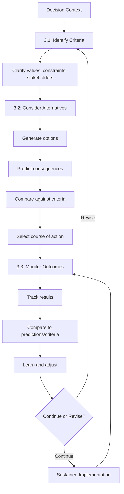

---
aliases:
  - "ACER Critical Thinking Framework"
  - "Australian Council for Educational Research Framework"
tags:
  - "type/report"
  - "year/2025"
  - "type/review"
  - "status/in-progress"
  - "critical-thinking"
  - "cognitive-science"
  - "processing-workflow"
  - "cognitive-science/reasoning"
  - "skill-acquisition"
  - "cognitive-resources"
  - "working-memory"
  - "reasoning"
  - "cognitive-enhancement"
source: "claude-sonnet-4.5"
id: "20251205031656"
created: "2025-12-05T03:16:56"
modified: "2025-12-05T03:16:56"
week: "[[2025-W49]]"
month: "[[2025-12]]"
quarter: "[[2025-Q4]]"
year: "[[2025]]"
type: "reference"
maturity: "needs-review"
confidence: "speculative"
next-review: "2025-12-12"
review-count: 0
link-up:
  - "[[practical-philosophy-moc]]"
link-related:
  - "[[2025-12-05|Daily-Note]]"
---

> [!overview]
> - **Title**:: [[ACER Framework]]
> - **Prompt/Topic Used**:: 
> - **Status**:: 🌱 `= this.maturity` | Confidence: `= this.confidence`

> [! ] # In-Note Metadata Panel
> 
> - **Note-Type**: `= this.type`
> - **Development Status**: `= this.maturity`
> - **Epistemic Confidence**: `= this.confidence`
> - **Next Review**: `= this.next-review`
> - **Review Count**: `= this.review-count`
> - **Created**: `= this.created`
> - **Last Modified**: `= this.modified`
> 
> > [!purpose] ### 📝Content Metrics
> > [**Word Count**:: `= this.file.size`]| [**Est. Read Time**:: `= round(this.file.size / 1300) + " min"`]
> > [**Depth Class**:: `= choice(this.file.size < 500, "🌱Stub", choice(this.file.size < 2000, "📄Note", "📜Essay"))`]
> ----
> > [!purpose] ### 🕰️Temporal Context
> > [**Created**:: `= this.file.ctime`] | [**Age**:: `= (date(today) - this.file.ctime).days + " days"`]
> > [**Last Touch**:: `= this.file.mtime`] | [**Staleness**:: `= choice((date(today) - this.file.mtime).days > 180, "🕸️Cobwebs", choice((date(today) - this.file.mtime).days > 30, "🍂Cold", "🔥Fresh"))`]
> > [**Touch Frequency**:: `= choice((date(today) - this.file.mtime).days < 7, "🔥Active", choice((date(today) - this.file.mtime).days < 30, "👌Regular", "❄️Dormant"))`]
> ----
> > [!topic-idea] ### 🔗Network Connectivity
> > [**In-Links**:: `= length(this.file.inlinks)`] | [**Out-Links**:: `= length(this.file.outlinks)`]
> > [**Network Status**:: `= choice(length(this.file.inlinks) = 0, "🕸️Orphan", choice(length(this.file.inlinks) > 5, "⚡ Hub", "🌱Node"))`]
> ```dataviewjs
> // SYSTEM: Semantic Bridge Engine
> // PURPOSE: Find "Sibling" notes that share the same Outlinks (Contexts)
> const current = dv.current();
> const myOutlinks = current.file.outlinks.map(l => l.path);
> 
> // 1. Filter the Vault
> const siblings = dv.pages()
>     .where(p => p.file.path !== current.file.path) // Exclude self
>     .where(p => !current.file.outlinks.map(l => l.path).includes(p.file.path)) // Exclude existing direct links
>     .map(p => {
>         // Find overlap between this page's links and the current page's links
>         const shared = p.file.outlinks.filter(l => myOutlinks.includes(l.path));
>         return { 
>             link: p.file.link, 
>             sharedCount: shared.length, 
>             sharedLinks: shared 
>         };
>     })
>     .where(p => p.sharedCount > 0) // Must share at least 1 connection
>     .sort(p => p.sharedCount, "desc") // Sort by strongest connection
>     .limit(5); // Only show top 5
> 
> // 2. Render the Bridge
> if (siblings.length > 0) {
>     dv.header(3, "Semantic Bridges (Missing Connections)");
>     dv.table(
>         ["Sibling Note", "Strength", "Shared Context"], 
>         siblings.map(s => [
>             s.link, 
>             "🔗" + s.sharedCount, 
>             s.sharedLinks.slice(0, 3).join(", ") + (s.sharedCount > 3 ? "…" : "")
>         ])
>     );
> } else {
>     dv.paragraph("*No semantic siblings found. This note is unique in its connections.*");
> }
> ```
> ---
> ### Related Notes
> ```dataview
> TABLE type, maturity, confidence
> FROM  ""
> WHERE  type = "reference"
> SORT "maturity" DESC
> LIMIT 15
> ```
> ### Sources & References
> ```dataview
> TABLE 
>     source AS "Source Type",
>     file.ctime AS "Date Added"
> FROM ""
> WHERE source = "claude-sonnet-4.5"
> SORT file.ctime DESC
> LIMIT 10
> ```
> ### Backlinks & Connections
> ```dataview
> TABLE 
>     type AS "Type",
>     maturity AS "Maturity",
>     length(file.inlinks) AS "Its Backlinks",
>     dateformat(date(created), "MMM dd, yyyy") AS "Created"
> FROM [[#]]
> WHERE file.name != this.file.name
> SORT length(file.inlinks) DESC
> LIMIT 20
> ```
> ### 2025-12-05 - Initial Creation
> *Context*: `=this.title` **by**: `=this.source`
> *Maturity*: `= this.maturity`  
> *Confidence*: `= this.confidence`
> 
> ### Tags & Classification
> *Primary Tags*: `= this.tags`  
> *Type*: `= this.type`  
> *Source*: `= this.source`
---
---

# ACER Framework


> [! ] ### Claude Thinking
> **PHASE 1: ANALYZE**
> Request Classification:
> - Type: comprehensive_note
> - Scope: reference
> - Research Required: YES - The ACER Framework for critical thinking is not something I have comprehensive, authoritative knowledge of in my training data. This appears to be a specific framework/methodology that warrants research to ensure accuracy and completeness.
> Research Trigger Justification:
> ✓ Topic may involve specific methodological details I need to verify
> ✓ User explicitly requests comprehensive reference documentation
> ✓ Answering requires verification of framework components and best practices
> ✓ Complex synthesis needs authoritative sources for accuracy
> Initial Scope Mapping:
> - Primary domain: Critical Thinking / Decision Making / Cognitive Frameworks
> - Adjacent domains: Problem-solving methodology, Metacognition, Practical reasoning, Applied epistemology
> - Depth requirement: HIGH - This is a reference note requiring exhaustive coverage
> Research Plan:
> 1. Search for "ACER framework critical thinking" to understand the core methodology
> 2. Search for "ACER framework decision making" to understand practical applications
> 3. Search for "critical thinking frameworks comparison" to contextualize ACER
> 4. Search for "ACER framework examples" to find concrete applications
> 5. Search for "ACER framework education" to understand pedagogical context
> **PHASE 2: WEB RESEARCH EXECUTION**
> Let me execute systematic research to build comprehensive understanding of the ACER Framework.
> Based on my comprehensive research, I now have a solid understanding of the ACER Critical Thinking Framework. Let me proceed with the structured planning phase before generating the complete reference note.
> **RESEARCH SYNTHESIS**
> Query Rationale & Findings:
> 6. **Initial Search ("ACER framework critical thinking")**: Revealed that ACER stands for Australian Council for Educational Research, and they developed a Critical Thinking Skill Development Framework with three core strands: Constructing Knowledge, Evaluating Ideas, and Making Decisions.
> 7. **Framework Structure Search**: Confirmed the 3-strand, 9-aspect structure (3 aspects per strand). The framework is designed for operational use in classrooms, with evidence-based foundations.
> 8. **Decision-Making Focus Search**: Found that the "Making Decisions" strand connects critical thinking to practical application, emphasizing the framework's pragmatic orientation beyond pure philosophical analysis.
> Key Discoveries:
> - ACER Framework is specifically designed to operationalize critical thinking in educational settings
> - Three Strands with three aspects each (9 total aspects)
> - Evidence-based synthesis of multiple critical thinking traditions
> - Includes skill development levels (progression framework)
> - Focus on observable behaviors and teachable components
> - Explicitly connects to decision-making and practical application
> **STRUCTURAL PLANNING**
> Given this is a reference note on the ACER Framework for connecting critical thinking to practical decision-making, I should structure it as follows:
> STRUCTURAL REASONING:
> ├── Core Concept Architecture
> │   ├── Why this structure? The ACER Framework is hierarchical (Framework → Strands → Aspects), so documentation should mirror this
> │   └── Information flow logic: Definition → Context → Framework Structure → Deep dive into "Making Decisions" strand → Practical Application → Integration
> ├── Hierarchy Decisions
> │   ├── Primary sections: 
> │   │   1. Introduction & Context (what ACER is, why the framework exists)
> │   │   2. Framework Overview (three-strand structure)
> │   │   3. Deep Dive: Strand 1 (Constructing Knowledge)
> │   │   4. Deep Dive: Strand 2 (Evaluating Ideas)
> │   │   5. MAJOR FOCUS: Strand 3 (Making Decisions) - this connects to practical decision-making
> │   │   6. Skill Development Levels
> │   │   7. Practical Application & Implementation
> │   │   8. Integration with Decision-Making Contexts
> │   │   9. Synthesis & Mastery
> │   └── Subsection depth: Each aspect within strands needs detailed explanation
> └── Cross-referencing Strategy
>     └── Internal link opportunities: Zettelkasten, Metacognition, Problem-Solving, Decision Theory, Educational Psychology, Bloom's Taxonomy, Information Literacy
> **KEY WIKI-LINK OPPORTUNITIES:**
> - [[Critical Thinking]]
> - [[Decision Making]]
> - [[Problem Solving]]
> - [[Metacognition]]
> - [[Information Literacy]]
> - [[Constructivism]]
> - [[Bloom's Taxonomy]]
> - [[Socratic Questioning]]
> - [[Argument Analysis]]
> - [[Evidence Evaluation]]
> - [[Cognitive Biases]]
> - [[Reflective Practice]]
> - [[Educational Assessment]]
> - [[Skill Development Frameworks]]
> - [[Transfer of Learning]]
> - [[Epistemic Cognition]]
> **CALLOUT STRATEGY:**
> - [!definition] for framework terms and aspects
> - [!principle-point] for core framework principles
> - [!methodology-and-sources] for practical implementation
> - [!example] for concrete illustrations of each aspect
> - [!key-claim] for central arguments about framework utility
> - [!important] for critical constraints or warnings
> - [!connections-and-links] for relationships between strands/aspects
> **METADATA PLANNING:**
> Tags: #critical-thinking #acer-framework #decision-making #skill-development #educational-frameworks #reference-note
> Aliases: [ACER Critical Thinking Framework, Australian Council for Educational Research Framework, ACER CT Framework, Three-Strand Critical Thinking Model]
> Now I'll construct the comprehensive reference note.

---
tags: #critical-thinking #acer-framework #decision-making #skill-development #educational-frameworks #reference-note
aliases: [ACER Critical Thinking Framework, Australian Council for Educational Research Framework, ACER CT Framework, Three-Strand Critical Thinking Model]
---

> [!comprehensive-reference] 📚 Comprehensive Reference
> - **Generated**:: 2025-12-05
> - **Version**:: 1.0
> - **Type**:: Reference Documentation
> - **Focus**:: ACER Framework for Connecting Critical Thinking to Practical Decision-Making

> [!abstract]
> **Executive Overview**
> The [[ACER Framework]] represents a comprehensive, evidence-based approach to [[Critical Thinking]] developed by the Australian Council for Educational Research (ACER). This framework synthesizes multiple philosophical, psychological, and educational traditions into an operational model comprising three interconnected strands: [[Constructing Knowledge]], [[Evaluating Ideas]], and [[Making Decisions]]. Unlike purely theoretical models, the ACER Framework explicitly bridges abstract reasoning with practical decision-making contexts, making it particularly valuable for [[Personal Knowledge Management]] systems and real-world application.

> [!how-to-use-this]
> **Navigation Guide**
> This reference note provides exhaustive coverage of the ACER Critical Thinking Framework with particular emphasis on the "Making Decisions" strand and its connection to practical contexts. Use the table of contents for targeted exploration, or follow the sequential progression to build comprehensive understanding. Each aspect includes theoretical grounding, observable behaviors, and practical applications.

## 📑 Table of Contents
1. [Framework Foundation & Context](#1️⃣-framework-foundation--context)
2. [The Three-Strand Architecture](#2️⃣-the-three-strand-architecture)
3. [Strand 1: Constructing Knowledge](#3️⃣-strand-1-constructing-knowledge)
4. [Strand 2: Evaluating Ideas](#4️⃣-strand-2-evaluating-ideas)
5. [Strand 3: Making Decisions](#5️⃣-strand-3-making-decisions-the-bridge-to-practical-application)
6. [Skill Development Levels](#6️⃣-skill-development-levels--progression-framework)
7. [Practical Implementation](#7️⃣-practical-implementation-in-decision-making-contexts)
8. [Integration Strategies](#8️⃣-integration-strategies-for-personal-knowledge-systems)
9. [Synthesis & Mastery](#9️⃣-synthesis--mastery)

---

## 1️⃣ Framework Foundation & Context

> [!definition]
> - **ACER**:: Australian Council for Educational Research
> - **ACER Critical Thinking Framework**:: An evidence-based skill development model that operationalizes critical thinking as three interconnected strands (Constructing Knowledge, Evaluating Ideas, Making Decisions), with nine specific aspects designed for teaching, assessment, and practical application

### The Development Challenge

The ACER Critical Thinking Framework emerged from a fundamental problem in [[Educational Psychology]] and [[Cognitive Science]]: while critical thinking is universally recognized as essential for 21st-century success, few existing frameworks provided a means to *operationalize* critical thinking in practical contexts. The research team led by Heard, Scoular, Duckworth, Ramalingam, and Teo (2020, updated 2025) identified that existing definitions were often either too philosophical (focused on abstract logic) or too narrow (domain-specific without transferability).

The framework addresses three critical needs: (1) **Understanding development** - how critical thinking skills progress from novice to expert; (2) **Monitoring growth** - measurable indicators of skill advancement; and (3) **Ensuring alignment** - consistency between curriculum, assessment, and pedagogy. This evidence-based approach distinguishes ACER from purely theoretical models by grounding every component in validated research across multiple disciplines.

> [!key-claim]
> **Central Principle**
> Critical thinking in the ACER Framework is characterized as *goal-directed and purpose-driven* [[Cognitive Processes]], whether the goal is solving problems, supporting arguments, conducting experiments, formulating interpretations, or—critically—making practical decisions. This pragmatic orientation moves beyond "reflective skepticism" to encompass generative, applied thinking.

### Philosophical & Theoretical Foundations

The ACER Framework synthesizes four major traditions in critical thinking research:

**Philosophical Tradition**: Drawing from Dewey's (1910) "reflective thinking," McPeck's (1981) "reflective skepticism," and Siegel's (1980) emphasis on rationality and principled reasoning. This tradition emphasizes [[Logical Analysis]], [[Argument Evaluation]], and adherence to objective standards.

**Psychological Tradition**: Incorporating [[Cognitive Psychology]] research on [[Information Processing]], [[Metacognition]] (Kuhn, 1999), and [[Problem Solving]] strategies. Sternberg's (1986) component skills (metacomponents, knowledge-acquisition components, performance components) inform the framework's developmental levels.

**Information Literacy Tradition**: Recognizing overlap with [[Information Literacy]] frameworks (American Library Association, 1989), the ACER model includes skills for recognizing knowledge gaps, evaluating source reliability, and organizing information effectively—essential for [[Knowledge Construction]].

**Educational Tradition**: Grounded in [[Bloom's Taxonomy]] and contemporary [[Instructional Design]] principles, emphasizing observable behaviors, teachable components, and measurable outcomes suitable for classroom implementation.

> [!principle-point]
> **Domain-General with Domain-Specific Application**
> While the framework describes critical thinking as a generally applicable skillset that transfers across disciplines, it explicitly acknowledges that application must be embedded within the methodologies, conventions, and "ways of knowing" of specific domains. This balances universality with contextual relevance—essential for [[Transfer of Learning]].

---

## 2️⃣ The Three-Strand Architecture

> [!definition]
> - **Strand**:: An overarching conceptual category framing the application context for critical thinking skills and knowledge
> - **Aspect**:: A specific content category within a strand, describing observable behaviors or qualities of critical thinking

### Architectural Overview

The ACER Framework organizes critical thinking into **three strands**, each containing **three aspects**, yielding nine total operational components. This 3×3 structure emerged from systematic analysis of commonalities across diverse critical thinking definitions in literature.

| **Strand** | **Application Context** | **Core Function** | **Aspects** |
|------------|------------------------|-------------------|-------------|
| **1. Constructing Knowledge** | Building new understanding | Generative / Inquiry | Questioning, Interpreting, Organizing |
| **2. Evaluating Ideas** | Assessing validity & quality | Analytical / Critical | Identifying Reasoning, Applying Logic, Evaluating Claims |
| **3. Making Decisions** | Determining courses of action | Pragmatic / Applied | Identifying Criteria, Considering Alternatives, Monitoring Outcomes |

> [!important]
> **Critical Distinction: Strands Represent Different Applications, Not Isolated Skills**
> The same abstract critical thinking abilities (analysis, evaluation, synthesis) manifest differently depending on application context. Evaluating a source for reliability (Strand 1) requires different cognitive moves than evaluating logical validity of an argument (Strand 2) or evaluating decision outcomes (Strand 3). The strands are *functionally distinct* applications of core thinking skills.

### Why Three Strands?

The tripartite structure reflects three fundamental purposes of critical thinking in educational and professional contexts:

1. **Epistemic Purpose** (Strand 1): Acquiring and constructing new knowledge—the investigative dimension
2. **Evaluative Purpose** (Strand 2): Analyzing and judging existing information, arguments, and reasoning—the critical dimension
3. **Practical Purpose** (Strand 3): Making informed decisions and taking action—the applied dimension

This structure acknowledges that critical thinking serves multiple functions simultaneously. A researcher constructing knowledge must evaluate sources while making methodological decisions. A decision-maker must construct understanding of a situation while evaluating alternatives. The strands are interconnected and mutually reinforcing, not sequential stages.

> [!connections-and-links]
> **Relationship to Other Frameworks**
> - **[[Bloom's Taxonomy]]**: ACER aligns with Bloom's higher-order thinking (Analyze, Evaluate, Create) but provides more granular operational detail
> - **[[Creative Thinking]]**: While ACER focuses on critical/analytical processes, ACER also developed parallel frameworks for creative thinking, collaboration, and self-regulation
> - **[[Information Literacy]] Models**: Significant overlap with Big6, SCONUL Seven Pillars, and ACRL Framework, particularly in Strand 1
> - **[[Problem-Solving Models]]**: Decision-making strand connects to problem-solving but focuses specifically on analytical/evaluative aspects rather than creative generation

---

## 3️⃣ Strand 1: Constructing Knowledge

> [!definition]
> **Constructing Knowledge**:: The process of building new understanding through inquiry, interpretation, and organization of information according to appropriate standards

### Foundational Concepts

The first strand addresses the *generative* dimension of critical thinking—how thinkers actively build knowledge rather than passively receive it. This reflects [[Constructivism|Constructivist]] epistemology: knowledge is constructed through interaction with information, not simply transmitted. The strand encompasses skills traditionally associated with [[Information Literacy]], [[Research Methods]], and [[Inquiry-Based Learning]].

Knowledge construction in the ACER Framework requires critical thinking at every stage: identifying what is unknown, determining what information is needed, assessing source quality, interpreting meaning, and synthesizing findings into coherent understanding. This moves beyond simple information retrieval to active knowledge building—essential for [[Lifelong Learning]] and [[Personal Knowledge Management]].

### Aspect 1.1: Questioning

> [!definition]
> **Questioning**:: The ability to recognize knowledge gaps and pose questions that prompt investigation and inquiry

Questioning represents the initiating aspect of knowledge construction. It involves [[Metacognition]]—awareness of what one knows and doesn't know—and the ability to formulate productive questions that drive learning forward. This encompasses [[Socratic Questioning]], hypothesis generation, and problem framing.

**Observable Behaviors:**
- Recognizes when current knowledge is insufficient for the task
- Identifies specific gaps in understanding or information
- Formulates clear, focused questions that guide investigation
- Distinguishes between productive and unproductive questions
- Generates multiple question types (factual, conceptual, evaluative)

> [!example]
> **Practical Application in PKB Context**
> When encountering a new concept like "[[Emergence]]" in complex systems:
> - Weak questioning: "What is emergence?"
> - Strong questioning: "What distinguishes emergent properties from aggregate properties? Under what conditions does emergence occur? How can we identify emergence in real systems? What are the implications of emergence for reductionist explanations?"

**Cognitive Skills Involved:**
- [[Metacognitive Awareness]] (knowing what you don't know)
- [[Problem Identification]]
- [[Hypothesis Generation]]
- [[Curiosity]] and epistemic motivation
- [[Selective Encoding]] (Sternberg, 1986) - identifying relevant vs. irrelevant gaps

### Aspect 1.2: Interpreting Information

> [!definition]
> **Interpreting Information**:: The ability to comprehend, analyze, and derive meaning from various forms of information, representations, and data

Interpretation moves beyond surface-level comprehension to deep understanding of meaning, implications, and relationships. It requires analyzing information structure, identifying key concepts, recognizing patterns, and inferring implicit meanings. This aspect connects directly to [[Reading Comprehension]], [[Data Analysis]], and [[Sense-Making]].

**Observable Behaviors:**
- Accurately comprehends explicit content and meaning
- Identifies implicit assumptions and unstated premises
- Recognizes relationships between concepts and information elements
- Translates between different representational forms (text, graph, diagram)
- Distinguishes fact from interpretation in sources
- Identifies author perspective, purpose, and bias

> [!methodology-and-sources]
> **Interpretation Strategies**
> 1. **Close Reading**: Analyzing text at word/sentence level for precise meaning
> 2. **Schema Activation**: Connecting new information to existing knowledge structures
> 3. **Visualization**: Creating mental models of relationships and processes
> 4. **Questioning While Reading**: Engaging actively with material ("What does this mean? Why is this important? How does this connect?")
> 5. **Paraphrasing**: Restating in own words to ensure understanding

**Cognitive Skills Involved:**
- [[Comprehension]]
- [[Pattern Recognition]]
- [[Inference]] and [[Implication]] detection
- [[Selective Combination]] (Sternberg) - integrating information coherently
- [[Perspective-Taking]]

### Aspect 1.3: Organizing Information

> [!definition]
> **Organizing Information**:: The ability to structure, categorize, and synthesize information effectively to produce sound new knowledge products

Organization transforms interpreted information into usable knowledge structures. It involves determining optimal categorization schemes, creating meaningful hierarchies, identifying relationships, and synthesizing disparate elements into coherent wholes. This aspect is foundational for [[Note-Taking]], [[Knowledge Management]], and [[Synthesis]].

**Observable Behaviors:**
- Selects appropriate organizational structures for the task
- Creates clear, logical hierarchies and categories
- Identifies meaningful relationships between information elements
- Synthesizes multiple sources into unified understanding
- Produces organized knowledge artifacts (notes, outlines, diagrams, databases)
- Maintains organization that facilitates future retrieval and use

> [!example]
> **PKB Application: Note Organization**
> Organizing research on "[[Learning Theory]]" demonstrates this aspect:
> - **Categorization**: Behaviorism, Cognitivism, Constructivism, Connectivism
> - **Hierarchy**: Theories → Principles → Applications → Evidence
> - **Relationships**: How theories critique/build upon each other
> - **Synthesis**: Creating a [[MOC]] (Map of Content) that integrates perspectives
> - **Tagging/Linking**: Using [[Metadata]] and [[Wiki-Links]] for [[Networked Thought]]

**Cognitive Skills Involved:**
- [[Categorical Thinking]]
- [[Systems Thinking]] (understanding relationships and structures)
- [[Synthesis]]
- [[Selective Comparison]] (Sternberg) - relating new to known information
- [[Knowledge Representation]]

> [!key-claim]
> **Strand 1 as Foundation for PKB Development**
> For knowledge workers building [[Personal Knowledge Bases]], Strand 1 represents the core skillset for transforming information into knowledge. The three aspects (Questioning, Interpreting, Organizing) map directly onto the [[Capture, Process, Connect]] workflow common in PKM systems. Mastery of these aspects enables compound learning through effective [[Zettelkasten]] practices.

---

## 4️⃣ Strand 2: Evaluating Ideas

> [!definition]
> **Evaluating Ideas**:: The process of analyzing and judging information, reasoning, arguments, and claims according to appropriate standards of logic, evidence, and validity

### Foundational Concepts

The second strand addresses the *critical* dimension of critical thinking—systematic evaluation of existing ideas, arguments, and reasoning. This reflects the philosophical tradition of critical thinking, emphasizing [[Logical Reasoning]], [[Argument Analysis]], and [[Evidence-Based Reasoning]]. Where Strand 1 focuses on building knowledge, Strand 2 focuses on assessing the quality and validity of knowledge claims.

Evaluation in the ACER Framework requires understanding of logical principles, standards of evidence, and rational analysis. It encompasses skills associated with [[Informal Logic]], [[Argumentation Theory]], and [[Scientific Reasoning]]. This strand is particularly crucial for identifying [[Cognitive Biases]], [[Logical Fallacies]], and [[Misinformation]].

### Aspect 2.1: Identifying Reasoning

> [!definition]
> **Identifying Reasoning**:: The ability to recognize and articulate the structure of arguments, including premises, conclusions, assumptions, and logical connections

Identifying reasoning involves analyzing how conclusions are derived from premises, recognizing argument structures, and uncovering implicit assumptions. This requires understanding [[Deductive Reasoning]], [[Inductive Reasoning]], [[Abductive Reasoning]], and common [[Argument Patterns]].

**Observable Behaviors:**
- Identifies premises (stated and unstated) and conclusions in arguments
- Recognizes different argument structures (deductive, inductive, analogical)
- Distinguishes arguments from explanations or descriptions
- Uncovers implicit assumptions underlying reasoning
- Maps logical relationships between claims
- Identifies chains of reasoning in complex arguments

> [!example]
> **Analyzing an Argument**
> Original claim: "We should adopt this new project management methodology because Company X achieved 30% efficiency gains after implementation."
> 
> **Identifying Reasoning:**
> - **Conclusion**: We should adopt the methodology
> - **Explicit Premise**: Company X gained 30% efficiency
> - **Implicit Assumptions**: 
>   - Company X's context is similar to ours
>   - The efficiency gain was caused by the methodology
>   - 30% efficiency gain is worth implementation costs
>   - What worked for X will work for us
> - **Argument Type**: Analogical reasoning (from particular case to application)

**Cognitive Skills Involved:**
- [[Logical Analysis]]
- [[Argument Mapping]]
- [[Assumption Detection]]
- [[Critical Reading]]
- [[Structural Thinking]]

### Aspect 2.2: Applying Logic

> [!definition]
> **Applying Logic**:: The ability to evaluate reasoning using principles of formal and informal logic, assessing validity and soundness

Applying logic involves assessing whether conclusions follow from premises (validity) and whether premises are true (soundness). It requires understanding logical operators, truth conditions, [[Logical Fallacies]], and principles of valid inference. This aspect connects to [[Formal Logic]], [[Propositional Logic]], and [[Modal Logic]].

**Observable Behaviors:**
- Determines whether conclusions follow logically from premises
- Identifies logical fallacies (ad hominem, false dilemma, straw man, etc.)
- Recognizes contradictions and inconsistencies in reasoning
- Applies logical principles (modus ponens, modus tollens, contrapositive)
- Assesses strength of inductive arguments
- Evaluates analogical reasoning for appropriateness

> [!methodology-and-sources]
> **Logic Application Framework**
> 1. **Validity Check**: Does the conclusion necessarily follow from premises? (Deductive)
> 2. **Strength Check**: How strongly do premises support the conclusion? (Inductive)
> 3. **Fallacy Scan**: Are there logical fallacies present?
> 4. **Consistency Check**: Do claims contradict each other or established facts?
> 5. **Implication Analysis**: What follows from accepting this reasoning?

> [!warning]
> **Common Logic Errors**
> - **Confusing validity with truth**: A valid argument can have false premises
> - **Affirming the consequent**: "If P then Q. Q. Therefore P." (Invalid)
> - **Denying the antecedent**: "If P then Q. Not P. Therefore not Q." (Invalid)
> - **False dilemma**: Presenting only two options when more exist
> - **Correlation-causation confusion**: Assuming correlation implies causation

**Cognitive Skills Involved:**
- [[Deductive Reasoning]]
- [[Inductive Reasoning]]
- [[Fallacy Recognition]]
- [[Consistency Checking]]
- [[Conditional Reasoning]]

### Aspect 2.3: Evaluating Claims

> [!definition]
> **Evaluating Claims**:: The ability to assess the credibility, reliability, and validity of information sources and knowledge claims using appropriate standards

Evaluating claims extends beyond logical structure to assess the quality and trustworthiness of information itself. This involves [[Source Criticism]], [[Evidence Assessment]], and understanding standards of [[Epistemic Justification]]. It's essential for navigating contemporary information environments characterized by [[Misinformation]] and conflicting claims.

**Observable Behaviors:**
- Assesses source credibility (authority, expertise, bias, reliability)
- Evaluates quality and relevance of evidence supporting claims
- Distinguishes between types of evidence (anecdotal, statistical, expert testimony)
- Recognizes limitations and scope of claims
- Compares claims against established knowledge and alternative sources
- Identifies potential conflicts of interest or motivations

> [!example]
> **Source Evaluation Matrix**
> 
> When evaluating a claim about [[Productivity Techniques]]:
> 
> | **Criterion** | **Strong Evidence** | **Weak Evidence** |
> |---------------|---------------------|-------------------|
> | **Source Type** | Peer-reviewed research, systematic review | Blog post, anecdote, testimonial |
> | **Author Expertise** | Researchers in relevant field | Non-expert, anonymous |
> | **Evidence Base** | Controlled studies, large samples | Personal experience, single case |
> | **Replication** | Findings reproduced independently | One-off study, unique claim |
> | **Bias/Motivation** | Transparent methods, conflicts disclosed | Commercial interest undisclosed |

**Cognitive Skills Involved:**
- [[Source Criticism]]
- [[Evidence Evaluation]]
- [[Skepticism]] (balanced, not cynical)
- [[Epistemic Vigilance]]
- [[Comparative Analysis]]

> [!key-claim]
> **Strand 2 as Protection Against Cognitive Errors**
> Evaluating Ideas serves as the primary defense against [[Misinformation]], [[Cognitive Biases]], and poor reasoning. In knowledge work and decision-making contexts, these skills prevent incorporation of low-quality information into knowledge bases and protect against systematic errors in [[Judgment and Decision-Making]].

---

## 5️⃣ Strand 3: Making Decisions (The Bridge to Practical Application)

> [!definition]
> **Making Decisions**:: The ability to consider situations, options, and likely outcomes, make choices that maximize positive results, and accurately monitor the effects of decisions

### Foundational Concepts: The Pragmatic Turn

Strand 3 represents the ACER Framework's distinctive contribution to critical thinking pedagogy: the explicit integration of critical thinking with practical decision-making. While philosophical traditions emphasize analysis and evaluation of existing arguments, the Making Decisions strand acknowledges that critical thinking ultimately serves pragmatic purposes—informing actions, solving problems, and achieving goals.

This strand draws from [[Decision Theory]], [[Judgment and Decision-Making]] research, and [[Applied Problem-Solving]] methodologies. It addresses a critical gap in many critical thinking frameworks: the translation from abstract reasoning to real-world application. In professional, academic, and personal contexts, thinking must culminate in defensible decisions and actions.

> [!principle-point]
> **Critical Thinking as Applied Rationality**
> The Making Decisions strand embodies Ennis's (1989) expanded definition of critical thinking as "reasonable, reflective thinking focused on deciding what to believe or do." This pragmatic orientation positions critical thinking not merely as skeptical analysis but as generative, action-oriented cognition aimed at practical outcomes.

### The Decision-Making Context

Decision-making in the ACER Framework requires only the analytical and evaluative aspects of [[Problem-Solving]]—not necessarily the creative generation of solutions (which falls under [[Creative Thinking]] frameworks). This distinction is crucial: Making Decisions focuses on systematically analyzing situations, establishing criteria, comparing alternatives, and monitoring outcomes using critical thinking principles.

Effective decision-making requires integrating skills from Strands 1 and 2:
- **From Strand 1**: Constructing accurate understanding of the decision context, gathering relevant information, organizing options systematically
- **From Strand 2**: Evaluating the quality of information, assessing logical soundness of reasoning, validating assumptions

The decision-making process then adds three specific competencies (the three aspects of Strand 3) that transform analysis into action.

---

### Aspect 3.1: Identifying Criteria for Decision-Making

> [!definition]
> **Identifying Criteria**:: The ability to determine relevant standards, constraints, and values by which to judge decision options and outcomes

The first aspect of decision-making addresses a foundational question: *By what standards should we evaluate our options?* This requires analyzing the decision context, understanding constraints, recognizing values at stake, and deriving explicit criteria that will guide choice. Without clear criteria, decisions become arbitrary or driven by unstated biases.

**Theoretical Foundation:**  
This aspect draws from [[Multi-Criteria Decision Analysis]] (MCDA), [[Value Theory]], and [[Goal-Setting Theory]]. It acknowledges that decisions involve trade-offs between competing values and that making these explicit improves decision quality.

**Observable Behaviors:**
- Analyzes the decision situation to understand constraints, demands, and context
- Identifies what constitutes an ideal or satisfactory outcome
- Articulates explicit criteria for evaluating options
- Distinguishes between essential criteria (must-haves) and desirable criteria (nice-to-haves)
- Recognizes whose values and interests are relevant to the decision
- Prioritizes criteria when they conflict
- Makes implicit values explicit (e.g., efficiency vs. equity, short-term vs. long-term)

> [!example]
> **Criteria Identification: Choosing a Note-Taking System**
> 
> **Context**: Selecting a PKM tool for long-term knowledge work
> 
> **Criteria Development:**
> 
> | **Criterion** | **Type** | **Rationale** | **Weight** |
> |---------------|----------|---------------|------------|
> | **Local-first data** | Essential | Data sovereignty, longevity | Critical |
> | **Plain-text or open format** | Essential | Future-proofing, portability | Critical |
> | **Bi-directional linking** | Essential | Knowledge graph building | Critical |
> | **Extensibility** | Desirable | Adaptation to evolving needs | High |
> | **Active development** | Desirable | Bug fixes, improvements | Medium |
> | **Learning curve** | Desirable | Implementation friction | Medium |
> | **Cost** | Constraint | Budget limitations | Variable |
> 
> Notice: Criteria emerge from analyzing the decision context (long-term knowledge work), understanding constraints (budget, time), and making values explicit (data sovereignty, future-proofing).

> [!methodology-and-sources]
> **Criteria Identification Process**
> 
> 1. **Situational Analysis**
>    - What problem does this decision address?
>    - What constraints exist (time, resources, ethics)?
>    - Who are the stakeholders affected?
> 
> 2. **Outcome Definition**
>    - What would an ideal outcome look like?
>    - What are the minimum acceptable outcomes?
>    - What are the potential negative outcomes to avoid?
> 
> 3. **Value Clarification**
>    - What values are at stake in this decision?
>    - Are there competing values that require trade-offs?
>    - Whose values matter and why?
> 
> 4. **Criteria Derivation**
>    - What specific, measurable criteria follow from the above?
>    - How can we prioritize or weight these criteria?
>    - Are criteria mutually compatible or in tension?

**Cognitive Skills Involved:**
- [[Situation Analysis]]
- [[Goal Specification]]
- [[Value Identification]]
- [[Constraint Recognition]]
- [[Prioritization]]
- [[Stakeholder Analysis]]

> [!important]
> **The Criteria Problem in Ill-Structured Decisions**
> Many real-world decisions are [[Ill-Structured Problems]] where appropriate criteria are unclear or contested. Part of critical thinking in decision-making is wrestling with *what should count as a good decision* before evaluating specific options. This meta-level reasoning is often more challenging than comparing options against established criteria.

---

### Aspect 3.2: Considering Alternatives

> [!definition]
> **Considering Alternatives**:: The ability to generate, compare, and evaluate multiple potential courses of action against established criteria

The second aspect involves systematic comparison of decision options. This requires identifying possible alternatives, predicting their likely consequences, assessing them against criteria, and recognizing trade-offs. It's the analytical core of decision-making, applying critical thinking to option evaluation.

**Theoretical Foundation:**  
This aspect draws from [[Decision Analysis]], [[Scenario Planning]], [[Prospect Theory]], and research on [[Judgment Under Uncertainty]]. It addresses both normative models (how decisions *should* be made) and descriptive insights (how biases affect actual decisions).

**Observable Behaviors:**
- Identifies multiple viable alternatives (not just binary choices)
- Predicts likely consequences and outcomes of each alternative
- Systematically compares alternatives against established criteria
- Recognizes and articulates trade-offs between options
- Considers both short-term and long-term implications
- Assesses probabilities and uncertainties associated with outcomes
- Identifies and questions underlying assumptions about consequences
- Recognizes when information is insufficient for confident comparison

> [!example]
> **Alternative Comparison: Research Method Selection**
> 
> **Decision**: How to deepen understanding of [[Spaced Repetition]]
> 
> **Alternatives:**
> 
> | **Alternative** | **Criteria: Depth** | **Criteria: Time** | **Criteria: Applicability** | **Trade-offs** |
> |-----------------|---------------------|--------------------|-----------------------------|----------------|
> | **Read comprehensive textbook** | High (systematic coverage) | High (100+ hours) | Medium (general principles) | Depth vs. Time |
> | **Practice with SRS for 6 months** | High (experiential) | Very High (daily commitment) | Very High (direct experience) | Time investment, potential inefficiency without theory |
> | **Read 10 key papers** | Medium-High (targeted) | Medium (20-30 hours) | High (evidence-based) | Breadth limitations |
> | **Synthesis from multiple sources** | Very High (integrated view) | High (research + synthesis) | Very High (customized) | Requires existing foundation |
> | **Course or workshop** | Medium (structured) | Low-Medium (condensed) | Medium (varies by course) | Less control, potential superficiality |
> 
> **Analysis**: Each alternative involves trade-offs. The "best" choice depends on criteria weights (e.g., time-constrained = favor course; depth-seeking = favor textbook + practice).

> [!methodology-and-sources]
> **Alternative Comparison Framework**
> 
> 1. **Alternative Generation**
>    - Brainstorm options without immediate evaluation
>    - Consider conventional and unconventional alternatives
>    - Ask: "What else could we do?"
> 
> 2. **Consequence Prediction**
>    - What are the likely outcomes of each alternative?
>    - What could go wrong (risk analysis)?
>    - What uncertainties exist?
> 
> 3. **Systematic Evaluation**
>    - Rate each alternative against each criterion
>    - Use [[Decision Matrices]] or [[Weighted Scoring]] where appropriate
>    - Consider both quantitative and qualitative factors
> 
> 4. **Trade-off Analysis**
>    - Where do alternatives excel and fall short?
>    - What must be sacrificed to gain what benefit?
>    - Are there ways to mitigate downsides?
> 
> 5. **Sensitivity Analysis**
>    - How sensitive is the choice to changes in assumptions?
>    - What would have to be true for an alternative option to be best?

**Cognitive Skills Involved:**
- [[Comparative Analysis]]
- [[Consequence Prediction]]
- [[Trade-off Recognition]]
- [[Risk Assessment]]
- [[Counterfactual Thinking]] (considering "what if" scenarios)
- [[Uncertainty Management]]

> [!warning]
> **Cognitive Biases in Alternative Evaluation**
> 
> Critical thinking in this aspect requires awareness of systematic biases:
> - **[[Confirmation Bias]]**: Favoring information supporting preferred option
> - **[[Anchoring Bias]]**: Over-weighting first alternative considered
> - **[[Status Quo Bias]]**: Preferring current state over change
> - **[[Sunk Cost Fallacy]]**: Continuing investment due to past commitment
> - **[[Availability Heuristic]]**: Over-weighting easily recalled outcomes
> - **[[Optimism Bias]]**: Underestimating likelihood of negative outcomes
> 
> Systematic evaluation using explicit criteria helps counteract these biases.

---

### Aspect 3.3: Monitoring Outcomes

> [!definition]
> **Monitoring Outcomes**:: The ability to track the effects of decisions, evaluate results against criteria, and adjust course based on feedback

The third aspect completes the decision-making cycle: implementation, monitoring, and learning. This reflects the pragmatic, action-oriented nature of critical thinking—decisions must be evaluated based on their actual effects, not just predicted outcomes. This aspect embodies [[Reflective Practice]] and [[Evidence-Based Adjustment]].

**Theoretical Foundation:**  
This aspect draws from [[Feedback Loops]], [[Action Research]], [[Plan-Do-Study-Act]] cycles, [[Metacognitive Monitoring]], and [[Adaptive Decision-Making]] models. It recognizes that real-world decisions occur under uncertainty and require iterative refinement.

**Observable Behaviors:**
- Establishes clear success criteria and metrics before implementation
- Tracks actual outcomes systematically (not just noting successes or failures selectively)
- Compares actual outcomes to predicted outcomes and criteria
- Identifies unexpected consequences (positive and negative)
- Analyzes reasons for outcomes (what worked, what didn't, why)
- Makes evidence-based adjustments to ongoing decisions
- Learns from outcomes to improve future decision-making
- Recognizes when to persist and when to pivot

> [!example]
> **Outcome Monitoring: PKB System Implementation**
> 
> **Decision**: Implement [[Zettelkasten]] methodology in [[Obsidian]]
> 
> **Monitoring Framework:**
> 
> | **Success Criterion** | **Measurement Method** | **Review Frequency** | **Outcome (6 months)** | **Analysis & Adjustment** |
> |----------------------|------------------------|---------------------|----------------------|---------------------------|
> | **Sustained daily capture** | Log capture sessions | Weekly | 85% compliance | **Good**. Slight template friction identified—streamline capture template. |
> | **Note permanence quality** | Audit sample of permanent notes for atomicity, clarity | Monthly | 70% meet standard | **Needs work**. Creating "refactoring sprint" to improve existing notes. Common issue: notes too broad—adjust capture habit to enforce atomicity earlier. |
> | **Knowledge connections** | Track backlink density, graph evolution | Bi-weekly | Avg 4.2 links per note (target: 5+) | **Near target**. Need more intentional connection sessions. Implement weekly "link audit." |
> | **Retrieval success** | Measure ability to find relevant notes when needed | Ad hoc (whenever retrieval is needed) | 90% success rate | **Excellent**. Tagging and linking strategy effective. |
> | **Synthesis productivity** | Track production of MOCs and synthesis notes | Monthly | 2 MOCs, 5 synthesis notes created | **Below target** (wanted 4 MOCs). Time constraint—need to budget dedicated synthesis time. |
> 
> **Learning**: Daily capture strong, but synthesis and connection work needs more structured time allocation. Template friction slowing capture—needs refinement.

> [!methodology-and-sources]
> **Outcome Monitoring Process**
> 
> 1. **Establish Baselines & Metrics**
>    - What data will indicate success or failure?
>    - How will we collect this data?
>    - What baselines exist for comparison?
> 
> 2. **Systematic Tracking**
>    - Regular data collection (not just when things go wrong)
>    - Both quantitative and qualitative indicators
>    - Capturing unexpected effects
> 
> 3. **Comparative Analysis**
>    - How do actual outcomes compare to predictions?
>    - How do results measure against criteria?
>    - What patterns emerge over time?
> 
> 4. **Causal Analysis**
>    - Why did outcomes occur as they did?
>    - What factors contributed to success or failure?
>    - What assumptions were validated or invalidated?
> 
> 5. **Adaptive Response**
>    - What adjustments should be made based on evidence?
>    - Should we persist, modify, or abandon this course?
>    - What have we learned for future decisions?

**Cognitive Skills Involved:**
- [[Metacognitive Monitoring]]
- [[Evidence Evaluation]]
- [[Causal Analysis]]
- [[Pattern Recognition]]
- [[Adaptive Learning]]
- [[Reflective Practice]]

> [!key-claim]
> **Closing the Learning Loop**
> Monitoring outcomes transforms decision-making from a one-time event into a learning cycle. This aspect is essential for [[Deliberate Practice]] in decision-making—without systematic outcome monitoring, individuals cannot learn what decision strategies work and fail to develop decision-making expertise over time. It embodies the scientific attitude applied to practical action.

---

### Integrating the Three Aspects: The Complete Decision-Making Process

The three aspects of Strand 3 form a complete critical thinking workflow for decision-making:



This cyclical model reflects that complex decisions are rarely "made once"—they involve ongoing adjustment based on feedback. Critical thinking pervades the entire cycle: analyzing situations, evaluating options, and learning from results.

> [!principle-point]
> **Decision Quality vs. Outcome Quality**
> A crucial distinction in critical thinking about decisions: decision *quality* (the reasoning process) differs from outcome *quality* (the results). Good processes can yield poor outcomes due to uncertainty, and poor processes can yield good outcomes by luck. Strand 3 emphasizes that critical thinking focuses on decision process quality—using appropriate criteria, systematic alternative evaluation, and evidence-based learning—which improves outcomes probabilistically over time.

---

## 6️⃣ Skill Development Levels & Progression Framework

> [!definition]
> **Skill Development Levels**:: Validated progressions describing how critical thinking skills develop from novice to expert performance, enabling educators and learners to identify current proficiency and target growth

### The Developmental Perspective

The ACER Framework includes empirically validated skill development levels for each aspect, describing progression from basic to advanced performance. This addresses a critical need: understanding not just *what* critical thinking involves but *how* it develops. The levels support:

1. **Diagnostic Assessment**: Identifying current proficiency
2. **Gap Analysis**: Recognizing specific areas needing development
3. **Targeted Instruction**: Focusing teaching on appropriate challenge level
4. **Progress Monitoring**: Tracking growth over time

### Level Structure

ACER uses descriptive levels (Low, Mid, High proficiency) rather than arbitrary numerical scales, grounded in observable behaviors at each level. These levels are:

- **Context-dependent**: Proficiency in one domain (e.g., biology) doesn't guarantee equivalent proficiency in another (e.g., history)
- **Aspect-specific**: Learners may be at different levels across different aspects
- **Progression pathways**: Levels describe typical development, not rigid stages

> [!example]
> **Sample Development Progression: Aspect 3.1 (Identifying Criteria)**
> 
> | **Level** | **Observable Characteristics** | **Example Behaviors** |
> |-----------|-------------------------------|----------------------|
> | **Low** | Uses implicit, unstated criteria; May rely on others' criteria without evaluation; Limited awareness of values/constraints | "I'll choose this option because it seems better." (No explicit justification or criteria articulated) |
> | **Mid** | Identifies some relevant criteria explicitly; Recognizes need to consider multiple factors; May struggle with prioritization or conflicting criteria | "We need to consider cost, quality, and timeline. Cost is probably most important, but quality matters too." (Multiple criteria identified, basic prioritization attempted) |
> | **High** | Systematically derives comprehensive criteria from situation analysis; Makes values and priorities explicit with justification; Recognizes stakeholder perspectives and competing values; Prioritizes criteria with clear rationale | "Given our context (startup with limited runway), criteria should be: 1) Time-to-market (critical—survival depends on quick launch), 2) Core functionality (essential features only), 3) Quality (good-enough, not perfect), 4) Cost (secondary—we have funding). This prioritization reflects our strategic position and stakeholder needs (investors want fast validation, users want working solution)." |

### Cross-Aspect Development Patterns

Skill development often shows patterns across aspects:

**Novice → Intermediate:**
- From implicit to explicit reasoning
- From single-factor to multi-factor consideration
- From accepting information to questioning information
- From personal perspective to multiple perspectives

**Intermediate → Advanced:**
- From identifying to systematically applying principles
- From recognizing issues to anticipating issues
- From reactive to proactive thinking
- From domain-specific to transferable application

> [!methodology-and-sources]
> **Using Development Levels for Self-Assessment**
> 
> 1. **Select an aspect** to evaluate (e.g., Identifying Criteria)
> 2. **Gather evidence** of your performance (recent decisions, written work, recorded reasoning)
> 3. **Compare to level descriptors** - Which level most accurately describes your typical performance?
> 4. **Identify specific gaps** - What behaviors characterize the next level that you don't yet demonstrate?
> 5. **Design deliberate practice** - Create exercises targeting specific missing behaviors
> 6. **Monitor progression** - Periodically reassess using new evidence

### Implications for Personal Knowledge Management

Understanding developmental levels enables strategic skill building in PKM contexts:

- **Assess current state**: Where am I in each aspect? (Self-awareness)
- **Set specific targets**: What behaviors should I develop next? (Proximal development)
- **Design practice**: What exercises will develop target behaviors? ([[Deliberate Practice]])
- **Track progress**: Am I demonstrating target behaviors more consistently? (Evidence-based growth)

This transforms "get better at critical thinking" from vague aspiration to concrete development pathway.

---

## 7️⃣ Practical Implementation in Decision-Making Contexts

### Applying ACER to Real-World Decisions

The ACER Framework's value lies in its *operationalization*—translating abstract critical thinking principles into concrete practices. This section provides implementation strategies for various decision-making contexts.

### Context 1: Personal Knowledge Management Decisions

PKM involves continuous decision-making about knowledge capture, organization, synthesis, and retrieval. The ACER Framework provides systematic approach:

> [!methodology-and-sources]
> **PKM Decision Framework**
> 
> **Strand 1 Application (Constructing Knowledge):**
> - **Questioning**: What do I need to know? What gaps exist in my understanding?
> - **Interpreting**: What does this source really say? What are the key insights?
> - **Organizing**: How should this knowledge be structured for future retrieval and connection?
> 
> **Strand 2 Application (Evaluating Ideas):**
> - **Identifying Reasoning**: What claims are being made? What supports them?
> - **Applying Logic**: Are these arguments valid? Do they contain fallacies?
> - **Evaluating Claims**: Is this source credible? Is this evidence strong?
> 
> **Strand 3 Application (Making Decisions):**
> - **Identifying Criteria**: What makes a PKM practice effective *for my goals*?
> - **Considering Alternatives**: What are different approaches to this problem? Trade-offs?
> - **Monitoring Outcomes**: Is this practice working? What evidence tells me?

> [!example]
> **Decision: How to Process Research Papers into PKB**
> 
> **3.1 - Criteria Identification:**
> - Comprehension depth (must understand core arguments)
> - Connection creation (must integrate with existing knowledge)
> - Future retrievability (must be findable when needed)
> - Time efficiency (sustainable long-term practice)
> - Actionability (produce usable notes, not just summaries)
> 
> **3.2 - Alternative Consideration:**
> 
> | **Approach** | **Pros** | **Cons** | **Fit to Criteria** |
> |--------------|----------|----------|---------------------|
> | **Full paper notes** | Comprehensive, permanent reference | Time-intensive, may include too much detail | High depth, low efficiency |
> | **Key insights extraction** | Focused on transferable ideas | May miss context | High connections, medium depth |
> | **Progressive summarization** | Layered approach, flexible depth | Requires multiple passes | Balanced approach |
> | **Concept mapping** | Visual relationships | Time-intensive for complex papers | High connections, variable depth |
> 
> **Decision**: Progressive summarization with emphasis on conceptual connections
> 
> **3.3 - Outcome Monitoring:**
> - Track: Time per paper, note reuse frequency, comprehension retention (test via recall)
> - Review monthly: Is retrieval effective? Are notes being referenced?
> - Adjust: If retrieval fails, identify why (poor tagging, insufficient synthesis, wrong abstraction level)

### Context 2: Research and Learning Decisions

When pursuing deep understanding of complex topics, ACER provides structured approach to learning decisions:

> [!example]
> **Decision: Learning Strategy for New Domain ([[Cosmology]])**
> 
> **3.1 - Criteria:**
> - Foundational understanding (must grasp core principles)
> - Mathematical competence (must handle quantitative reasoning)
> - Current knowledge (up-to-date on recent developments)
> - Interconnection (understand relationships to physics, philosophy)
> - Resource efficiency (time-constrained—16 week timeframe)
> 
> **3.2 - Alternatives:**
> - Textbook study (systematic, foundational)
> - Paper reading (current, specialized)
> - Online courses (structured, intermediate)
> - Hybrid approach (textbook + papers + courses)
> 
> **Analysis**: Hybrid approach scores highest:
> - Textbook provides foundation
> - Online courses provide visualization and pacing
> - Papers provide currency and depth
> - Trade-off: Higher cognitive load managing multiple resources
> 
> **3.3 - Monitoring:**
> - Weekly: Can I explain core concepts without reference?
> - Bi-weekly: Can I solve practice problems independently?
> - Monthly: Am I encountering papers I can understand?
> - Evidence-based adjustment: If comprehension lags, more time on foundations; if too comfortable, increase difficulty

### Context 3: Professional and Career Decisions

Critical thinking about career and professional development decisions:

> [!methodology-and-sources]
> **Professional Decision Template**
> 
> **Criteria Development Questions:**
> - What are my core values (autonomy, impact, learning, security, income)?
> - What constraints do I face (financial, location, time)?
> - What outcomes define success for this decision?
> - What are the opportunity costs of each alternative?
> 
> **Alternative Evaluation Process:**
> - Generate options without immediate filtering
> - For each, predict: 1-year, 3-year, 5-year outcomes
> - Rate against each criterion (quantitative where possible)
> - Consider reversibility (how difficult to undo?)
> - Assess information needs (what do I need to know to decide confidently?)
> 
> **Outcome Monitoring Plan:**
> - Define specific success indicators upfront
> - Schedule periodic reviews (3-month, 6-month, 1-year)
> - Track both objective (income, skills acquired) and subjective (satisfaction, learning) measures
> - Maintain decision log (what I predicted, what actually happened, why)

### Implementation Principles

Across contexts, effective ACER implementation follows these principles:

1. **Externalize the process**: Write out criteria, alternatives, evaluations—don't just think them
2. **Make implicit explicit**: Force articulation of assumptions, values, reasoning
3. **Use structured formats**: Templates, matrices, frameworks reduce cognitive load
4. **Separate generation from evaluation**: Don't prematurely dismiss alternatives
5. **Seek disconfirmation**: Actively look for evidence against preferred options
6. **Document decisions**: Create decision logs for future learning
7. **Review systematically**: Scheduled reviews, not just reactive reassessment
8. **Iterate based on evidence**: Adjust based on outcome data, not just intuition

> [!important]
> **Critical Thinking as Deliberate, Not Automatic**
> Quality critical thinking requires *effortful, systematic application* of these processes. Intuition and fast thinking ([[System 1]]) have their place, but for consequential decisions, the ACER Framework provides structure for slow, analytical thinking ([[System 2]]). The framework doesn't eliminate all uncertainty or guarantee outcomes, but it dramatically improves decision process quality.

---

## 8️⃣ Integration Strategies for Personal Knowledge Systems

### Embedding ACER in PKB Architecture

For knowledge workers building Personal Knowledge Bases, the ACER Framework can be systematically integrated into workflows and tool configurations.

### Strategy 1: Template-Based Prompting

Create templates that prompt ACER-style thinking:

> [!example]
> **Decision Log Template** (Obsidian/Markdown)
> 
> ```markdown
> # Decision: [Title]
> 
> **Date**: YYYY-MM-DD
> **Status**: [[Considering]] / [[Decided]] / [[Implemented]] / [[Under Review]]
> **Tags**: #decision-log #[domain]
> 
> ## Context
> [What situation prompted this decision?]
> 
> ## 3.1: Criteria
> **Essential Criteria**:
> - [ ] [Criterion 1]: [Why essential?]
> - [ ] [Criterion 2]: [Why essential?]
> 
> **Desirable Criteria**:
> - [ ] [Criterion 3]: [Why valuable?]
> - [ ] [Criterion 4]: [Why valuable?]
> 
> **Constraints**:
> - [Constraint 1]: [Details]
> - [Constraint 2]: [Details]
> 
> ## 3.2: Alternatives Considered
> 
> ### Alternative A: [Name]
> **Description**: [What is this option?]
> **Pros**: 
> - [Advantage 1]
> - [Advantage 2]
> **Cons**:
> - [Disadvantage 1]
> - [Disadvantage 2]
> **Criteria Fit**: [How does this score against criteria?]
> 
> ### Alternative B: [Name]
> [Repeat structure]
> 
> ### Alternative C: [Name]
> [Repeat structure]
> 
> ## Decision Matrix
> 
> | Alternative | Criterion 1 | Criterion 2 | Criterion 3 | Total Score |
> |-------------|-------------|-------------|-------------|-------------|
> | A | [Score] | [Score] | [Score] | [Sum] |
> | B | [Score] | [Score] | [Score] | [Sum] |
> | C | [Score] | [Score] | [Score] | [Sum] |
> 
> ## Decision
> **Selected**: [Alternative X]
> **Rationale**: [Why this choice given the analysis above?]
> **Implementation Plan**: [What are next steps?]
> **Predictions**: [What do I expect to happen?]
> 
> ## 3.3: Outcome Monitoring
> 
> ### Review Schedule
> - [ ] 1-week check-in: [Date]
> - [ ] 1-month review: [Date]
> - [ ] 3-month evaluation: [Date]
> 
> ### Success Metrics
> - **Metric 1**: [How measured?] Target: [Value]
> - **Metric 2**: [How measured?] Target: [Value]
> 
> ### Review Entries
> 
> #### [Date] - [Period] Review
> **Outcomes observed**:
> - [What actually happened?]
> 
> **Comparison to predictions**:
> - [Prediction 1]: [Accurate/Inaccurate - Why?]
> - [Prediction 2]: [Accurate/Inaccurate - Why?]
> 
> **Learnings**:
> - [What does this teach me about decision-making in this domain?]
> 
> **Adjustments**:
> - [What changes should be made based on evidence?]
> ```

### Strategy 2: Periodic Review Prompts

Schedule periodic reviews that explicitly invoke ACER aspects:

> [!methodology-and-sources]
> **Weekly Review: Critical Thinking Audit**
> 
> **Strand 1 Check (Constructing Knowledge):**
> - What questions am I pursuing this week?
> - What information have I interpreted? Any misunderstandings discovered?
> - How am I organizing new knowledge? Is the system working?
> 
> **Strand 2 Check (Evaluating Ideas):**
> - What claims have I encountered? Did I evaluate them critically?
> - What arguments did I analyze? Were they sound?
> - Did I identify any faulty reasoning (in sources or my own thinking)?
> 
> **Strand 3 Check (Making Decisions):**
> - What decisions did I make this week?
> - Did I identify criteria explicitly before deciding?
> - Did I consider multiple alternatives systematically?
> - What outcomes am I monitoring? What evidence have I gathered?

### Strategy 3: ACER-Aligned Note Types

Create specific note types that embody ACER aspects:

| **Note Type** | **ACER Alignment** | **Purpose** | **Structure** |
|---------------|-------------------|-------------|---------------|
| **[[Question Notes]]** | Aspect 1.1 | Capture knowledge gaps | Question → Context → Sub-questions → Related questions |
| **[[Source Evaluation Notes]]** | Aspect 2.3 | Assess source quality | Source → Credentials → Evidence quality → Biases → Reliability rating |
| **[[Argument Analysis Notes]]** | Aspects 2.1, 2.2 | Deconstruct reasoning | Claim → Premises → Assumptions → Logic evaluation → Verdict |
| **[[Decision Logs]]** | Strand 3 | Document decision process | Context → Criteria → Alternatives → Decision → Outcomes |
| **[[Synthesis Notes]]** | Aspects 1.2, 1.3 | Integrate understanding | Sources → Interpretations → Connections → Organized synthesis |

### Strategy 4: Dataview Queries for Meta-Analysis

Use [[Dataview]] (Obsidian plugin) to analyze critical thinking patterns:

```javascript
// Track decision-making patterns
TABLE 
  file.cday as "Date",
  criteria as "# Criteria",
  alternatives as "# Alternatives",
  outcome as "Outcome Rating"
FROM #decision-log
WHERE status = "Completed"
SORT file.cday DESC
```

This enables [[Metacognitive Monitoring]] of one's own critical thinking: Am I consistently identifying multiple criteria? Do I generate enough alternatives? How accurate are my predictions?

### Strategy 5: Integration with Spaced Repetition

Create Anki cards (or similar) that reinforce ACER Framework application:

> [!example]
> **Sample Spaced Repetition Cards**
> 
> **Front**: You're deciding between three project management methodologies. What's the first critical thinking step in Strand 3?
> **Back**: **Aspect 3.1: Identify Criteria**. Before comparing methodologies, establish clear criteria for evaluation based on project context, constraints, and desired outcomes.
> 
> **Front**: You notice your PKB organization isn't supporting effective retrieval. Which ACER aspect should guide your response?
> **Back**: **Aspect 3.3: Monitoring Outcomes**. Analyze what specifically is failing (evidence), diagnose why (causal analysis), and adjust organization strategy based on findings.

---

## 9️⃣ Synthesis & Mastery

### The Holistic Critical Thinker

Mastery of the ACER Framework transcends mechanical application of individual aspects. Expert critical thinkers fluidly integrate all three strands, moving seamlessly between constructing knowledge, evaluating ideas, and making decisions. They exhibit:

**Integrated Thinking**: Simultaneously questioning, interpreting, organizing, reasoning, evaluating, and deciding
**Context Sensitivity**: Adapting thinking approach to situation demands
**Metacognitive Awareness**: Monitoring their own thinking processes in real-time
**Epistemic Humility**: Recognizing limits of knowledge and certainty
**Intellectual Courage**: Questioning own beliefs and cherished assumptions
**Fair-Mindedness**: Considering multiple perspectives without premature dismissal
**Systematic Approach**: Following rigorous processes even under time pressure

> [!the-philosophy]
> **The Examined Decision, The Examined Life**
> 
> The ACER Framework's connection of critical thinking to decision-making embodies the Socratic ideal: the examined life consists not merely of skeptical analysis but of *living rationally*—making decisions based on evidence, reason, and systematic reflection. The framework operationalizes [[Practical Wisdom]] ([[Phronesis]]) for contemporary contexts: the capacity to deliberate well about what conduces to living well.
> 
> For the knowledge worker, this manifests as building not just a knowledge *base* but a knowledge *system* that embodies critical thinking in its structure. Every note becomes evidence of questioning (Aspect 1.1), interpretation (1.2), organization (1.3). Every synthesis becomes evidence of reasoning identification (2.1) and claim evaluation (2.3). Every decision log becomes evidence of criteria identification (3.1), alternative comparison (3.2), and outcome monitoring (3.3).
> 
> The Personal Knowledge Base, properly constructed, becomes an *externalized critical thinking system*—a second brain that doesn't just store information but systematically applies the principles of sound reasoning to that information.

### Cognitive Models for Understanding ACER

Several mental models help consolidate understanding:

> [!analogy]
> **The Scientific Method as ACER Application**
> 
> The ACER Framework can be understood as the intellectual infrastructure underlying scientific inquiry:
> 
> - **Strand 1 (Constructing Knowledge)**: Observation, hypothesis formation, data gathering
> - **Strand 2 (Evaluating Ideas)**: Peer review, analyzing methodology, assessing evidence quality
> - **Strand 3 (Making Decisions)**: Experimental design choices, interpreting results, determining next research directions
> 
> Just as science advances through systematic application of these processes, personal knowledge work advances through systematic application of ACER principles.

### Comparative Framework Analysis

Understanding ACER's position within the broader landscape of critical thinking frameworks:

| **Framework** | **Primary Focus** | **Key Strength** | **Relationship to ACER** |
|---------------|------------------|-----------------|-------------------------|
| **[[Bloom's Taxonomy]]** | Cognitive complexity hierarchy | Broad educational scope | ACER operationalizes higher levels (Analyze, Evaluate, Create) |
| **[[Paul-Elder Framework]]** | Elements and standards of reasoning | Depth of logical analysis | ACER's Strand 2 aligns closely; ACER adds knowledge construction and decision-making |
| **[[Facione's Core Skills]]** | Six core cognitive skills | Comprehensive skill catalog | ACER organizes similar skills into strand-based applications |
| **[[RED Model]]** (Recognize, Evaluate, Decide) | Decision-focused critical thinking | Explicitly pragmatic | Very similar to ACER Strand 3; ACER adds knowledge construction and evaluation strands |
| **[[Information Literacy]] Standards** | Research and information evaluation | Academic research focus | ACER Strand 1 incorporates and extends information literacy principles |

ACER's distinctive contribution: **Synthesis of knowledge construction, evaluation, and decision-making into a unified, operational framework with validated developmental levels**.

### Path to Mastery

Developing expertise with the ACER Framework follows a predictable progression:

**Phase 1: Explicit, Effortful Application** (Weeks 1-8)
- Conscious use of templates and prompts
- Referring to aspect definitions while working
- Mechanical application of steps
- High cognitive load

**Phase 2: Developing Fluency** (Weeks 9-16)
- Templates become internalized
- Aspects applied more naturally
- Recognition of when each strand/aspect is relevant
- Reduced cognitive load

**Phase 3: Integrated Expertise** (Months 4-12)
- Seamless integration of all aspects
- Automatic application in appropriate contexts
- Metacognitive monitoring of own thinking
- Framework becomes "how I think"

**Phase 4: Adaptive Mastery** (Year 1+)
- Context-sensitive application
- Teaching others
- Innovating within framework
- Contributing to framework development

This progression requires [[Deliberate Practice]]: intentional application, feedback, and reflection on framework use. The decision log template and periodic reviews provide this structure.

---

## 📊 Metadata & Attribution

> [!methodology-and-sources]
> **Research Methodology**
> 
> **Primary Sources:**
> - Heard, J., Scoular, C., Duckworth, D., Ramalingam, D., & Teo, I. (2025). *Critical thinking: Skill development framework* (2nd ed.). Australian Council for Educational Research. https://doi.org/10.37517/978-1-74286-752-6
> - Heard, J., Scoular, C., Duckworth, D., Ramalingam, D., & Teo, I. (2020). *Critical Thinking: Definition and Structure*. Australian Council for Educational Research.
> - ACER. (2020). *Assessment of General Capabilities: Skills for the 21st century learner*. Australian Council for Educational Research.
> 
> **Secondary Sources:**
> - ResearchGate publications analyzing ACER framework implementation
> - ACER documentation on essential skills development
> - Educational research journals applying ACER frameworks
> 
> **Research Queries Performed:**
> 1. "ACER framework critical thinking"
> 2. "ACER framework three strands constructing knowledge evaluating ideas making decisions"
> 3. "ACER critical thinking aspects nine components framework details"
> 4. "ACER critical thinking decision making practical application classroom"
> 
> **Synthesis Approach:**
> Evidence-based compilation drawing from official ACER publications, implementation research, and educational theory. Framework structure synthesized from primary sources; practical applications derived from implementation literature and PKM best practices.
> 
> **Confidence Level:**
> - **High confidence**: Framework structure (3 strands, 9 aspects), theoretical foundations, developmental levels (directly from primary sources)
> - **High confidence**: Connection to decision-making, practical application (explicitly stated in ACER materials)
> - **Medium-high confidence**: PKM integration strategies (derived from framework principles applied to knowledge management contexts)

## 🔄 Version History

| Version | Date | Changes |
|---------|------|---------|
| 1.0 | 2025-12-05 | Initial comprehensive compilation covering ACER Framework structure, all strands and aspects, with emphasis on decision-making applications and PKM integration |

---

# 🔗 Related Topics for PKB Expansion

1. **[[Critical Thinking Dispositions and Habits of Mind]]**
   - *Connection*: The ACER Framework describes *what* critical thinkers do (skills/processes); dispositions describe the *character traits* that motivate and sustain critical thinking (intellectual humility, open-mindedness, fair-mindedness, epistemic vigilance)
   - *Depth Potential*: Exploring the affective and motivational dimensions of critical thinking—essential for understanding why people don't always apply critical thinking even when capable
   - *Knowledge Graph Role*: Bridges cognitive skills (ACER) with personality psychology and motivation theory; connects to Stoic philosophy and virtue epistemology

2. **[[Developmental Progressions in Complex Cognition]]**
   - *Connection*: ACER includes skill development levels showing progression from novice to expert; this broader topic examines how complex thinking abilities develop across the lifespan
   - *Depth Potential*: Integration of developmental psychology, expertise research, and educational progressions; understanding how to design learning experiences that promote development
   - *Knowledge Graph Role*: Connects ACER to [[Bloom's Taxonomy]], [[Vygotsky's Zone of Proximal Development]], [[Deliberate Practice]], and educational scaffolding strategies

3. **[[Decision-Making Under Uncertainty: Integrating Critical Thinking with Probabilistic Reasoning]]**
   - *Connection*: ACER Strand 3 (Making Decisions) provides structured process; real-world decisions involve uncertainty, risk, and probabilistic thinking not fully addressed in the framework
   - *Depth Potential*: Deep dive into [[Bayesian Reasoning]], [[Decision Theory]], [[Prospect Theory]], [[Risk Assessment]], and calibration of confidence; essential for high-stakes decisions
   - *Knowledge Graph Role*: Extends ACER's decision-making strand with quantitative tools; connects to statistics, forecasting, and data science

4. **[[Information Literacy and Digital Epistemology in the Age of AI]]**
   - *Connection*: ACER Strand 1 (Constructing Knowledge) overlaps significantly with information literacy; contemporary context adds challenges of AI-generated content, algorithmic curation, and digital epistemology
   - *Depth Potential*: Examining how to evaluate information in algorithmic environments; detecting AI-generated misinformation; understanding digital knowledge production; implications for source evaluation
   - *Knowledge Graph Role*: Extends ACER's knowledge construction strand into digital contexts; connects to media literacy, epistemology, AI ethics, and contemporary philosophy of knowledge

---

**End of Reference Note**
