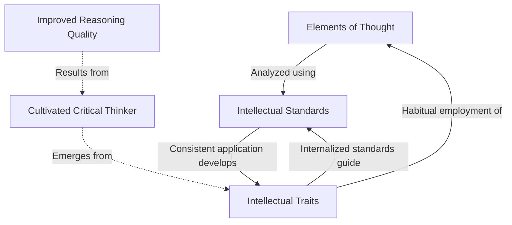

---
aliases:
  - "Paul-Elder Model"
  - "Elements of Reasoning Framework"
tags:
  - "type/report"
  - "year/2025"
  - "type/reference"
  - "status/in-progress"
  - "critical-thinking"
  - "self-improvement"
  - "processing-workflow"
  - "cognitive-science/reasoning"
  - "metacognitive-monitoring"
  - "mental-effort"
  - "working-memory"
  - "problem-solving"
  - "cognitive-enhancement"
  - "cognitive-science"
  - "type/literature"
  - "status/needs-review"
  - "context/applied"
  - 
source: "claude-sonnet-4.5"
id: "20251205013947"
created: "2025-12-05T01:39:47"
modified: "2025-12-05T01:39:47"
week: "[[2025-W49]]"
month: "[[2025-12]]"
quarter: "[[2025-Q4]]"
year: "[[2025]]"
type: "reflection"
maturity: "needs-review"
confidence: "speculative"
next-review: "2025-12-12"
review-count: 0
link-up:
  - "[[practical-philosophy-moc]]"
link-related:
  - "[[2025-12-05|Daily-Note]]"
---

> [!overview]
> - **Title**:: [[Paul-Elder Critical Thinking Model]]
> - **Prompt/Topic Used**:: 
> - **Status**:: 🌱 `= this.maturity` | Confidence: `= this.confidence`

> [! ] # :FasClipboardList:In-Note Metadata Panel
> 
> - **Note-Type**: `= this.type`
> - **Development Status**: `= this.maturity`
> - **Epistemic Confidence**: `= this.confidence`
> - **Next Review**: `= this.next-review`
> - **Review Count**: `= this.review-count`
> - **Created**: `= this.created`
> - **Last Modified**: `= this.modified`
> 
> > [!purpose] ### 📝Content Metrics
> > [**Word Count**:: `= this.file.size`]| [**Est. Read Time**:: `= round(this.file.size / 1300) + " min"`]
> > [**Depth Class**:: `= choice(this.file.size < 500, "🌱Stub", choice(this.file.size < 2000, "📄Note", "📜Essay"))`]
> ----
> > [!purpose] ### 🕰️Temporal Context
> > [**Created**:: `= this.file.ctime`] | [**Age**:: `= (date(today) - this.file.ctime).days + " days"`]
> > [**Last Touch**:: `= this.file.mtime`] | [**Staleness**:: `= choice((date(today) - this.file.mtime).days > 180, "🕸️Cobwebs", choice((date(today) - this.file.mtime).days > 30, "🍂Cold", "🔥Fresh"))`]
> > [**Touch Frequency**:: `= choice((date(today) - this.file.mtime).days < 7, "🔥Active", choice((date(today) - this.file.mtime).days < 30, "👌Regular", "❄️Dormant"))`]
> ----
> > [!topic-idea] ### 🔗Network Connectivity
> > [**In-Links**:: `= length(this.file.inlinks)`] | [**Out-Links**:: `= length(this.file.outlinks)`]
> > [**Network Status**:: `= choice(length(this.file.inlinks) = 0, "🕸️Orphan", choice(length(this.file.inlinks) > 5, "⚡ Hub", "🌱Node"))`]
> ```dataviewjs
> // SYSTEM: Semantic Bridge Engine
> // PURPOSE: Find "Sibling" notes that share the same Outlinks (Contexts)
> const current = dv.current();
> const myOutlinks = current.file.outlinks.map(l => l.path);
> 
> // 1. Filter the Vault
> const siblings = dv.pages()
>     .where(p => p.file.path !== current.file.path) // Exclude self
>     .where(p => !current.file.outlinks.map(l => l.path).includes(p.file.path)) // Exclude existing direct links
>     .map(p => {
>         // Find overlap between this page's links and the current page's links
>         const shared = p.file.outlinks.filter(l => myOutlinks.includes(l.path));
>         return { 
>             link: p.file.link, 
>             sharedCount: shared.length, 
>             sharedLinks: shared 
>         };
>     })
>     .where(p => p.sharedCount > 0) // Must share at least 1 connection
>     .sort(p => p.sharedCount, "desc") // Sort by strongest connection
>     .limit(5); // Only show top 5
> 
> // 2. Render the Bridge
> if (siblings.length > 0) {
>     dv.header(3, "Semantic Bridges (Missing Connections)");
>     dv.table(
>         ["Sibling Note", "Strength", "Shared Context"], 
>         siblings.map(s => [
>             s.link, 
>             "🔗" + s.sharedCount, 
>             s.sharedLinks.slice(0, 3).join(", ") + (s.sharedCount > 3 ? "…" : "")
>         ])
>     );
> } else {
>     dv.paragraph("*No semantic siblings found. This note is unique in its connections.*");
> }
> ```
> ---
> ### Related Notes
> ```dataview
> TABLE type, maturity, confidence
> FROM  ""
> WHERE  type = "reflection"
> SORT "maturity" DESC
> LIMIT 15
> ```
> ### Sources & References
> ```dataview
> TABLE 
>     source AS "Source Type",
>     file.ctime AS "Date Added"
> FROM ""
> WHERE source = "claude-sonnet-4.5"
> SORT file.ctime DESC
> LIMIT 10
> ```
> ### Backlinks & Connections
> ```dataview
> TABLE 
>     type AS "Type",
>     maturity AS "Maturity",
>     length(file.inlinks) AS "Its Backlinks",
>     dateformat(date(created), "MMM dd, yyyy") AS "Created"
> FROM [[#]]
> WHERE file.name != this.file.name
> SORT length(file.inlinks) DESC
> LIMIT 20
> ```
> ### 2025-12-05 - Initial Creation
> *Context*: `=this.title` **by**: `=this.source`
> *Maturity*: `= this.maturity`  
> *Confidence*: `= this.confidence`
> 
> ### Tags & Classification
> *Primary Tags*: `= this.tags`  
> *Type*: `= this.type`  
> *Source*: `= this.source`
---
---

# Paul-Elder Critical Thinking Model

> [! ] ### Claude Thinking
> 
> **PHASE 1: ANALYZE**
> Request Classification:
> - Type: comprehensive_note (reference documentation)
> - Scope: reference (exhaustive coverage of a specific framework)
> - Research Required: YES - This requires verification of the framework's components, current applications, and authoritative sources to ensure accuracy
> User Context Integration:
> - Pur3v4d3r is building a sophisticated PKB with emphasis on cognitive science
> - Their system values evidence-based approaches and metacognitive frameworks
> - This topic aligns with their focus on "bias mitigation" and "metacognition" mentioned in their current state
> - The framework should be positioned within their broader knowledge architecture around critical thinking and cognitive tools
> Research Strategy:
> I need to execute web searches to:
> 1. Verify the exact components of the Paul-Elder framework (elements, standards, intellectual traits)
> 2. Find current applications and research supporting the framework
> 3. Identify authoritative sources and original publications
> 4. Discover practical implementation strategies
> 5. Understand criticisms or limitations of the framework
> **PHASE 2: STRUCTURAL PLANNING**
> Information Architecture:
> ├── Foundation Layer
> │   ├── Framework origins and developers
> │   ├── Core philosophy and purpose
> │   └── Position within critical thinking scholarship
> ├── Component Layer (the "what")
> │   ├── Elements of Reasoning (8 components)
> │   ├── Intellectual Standards (9 criteria)
> │   └── Intellectual Traits (8 virtues)
> ├── Application Layer (the "how")
> │   ├── Practical implementation strategies
> │   ├── Question frameworks
> │   └── Self-assessment tools
> ├── Integration Layer
> │   ├── Educational contexts
> │   ├── Professional applications
> │   └── Personal knowledge management connections
> └── Synthesis Layer
>     ├── Strengths and limitations
>     ├── Complementary frameworks
>     └── Advanced mastery pathways
> Wiki-Link Opportunities (anticipated):
> - [[Critical Thinking]]
> - [[Metacognition]]
> - [[Cognitive Biases]]
> - [[Socratic Questioning]]
> - [[Intellectual Humility]]
> - [[Bloom's Taxonomy]]
> - [[Argumentation Theory]]
> - [[Logic]]
> - [[Epistemology]]
> - [[Self-Regulated Learning]]
> - [[Reasoning]]
> - [[Inference]]
> - [[Assumptions]]
> - [[Implications]]
> - [[Evidence]]
> - [[Point of View]]
> - [[Concepts]]
> - [[Question Formulation]]
> - [[Clarity]]
> - [[Accuracy]]
> - [[Precision]]
> - [[Relevance]]
> - [[Depth]]
> - [[Breadth]]
> - [[Logic]] (as standard)
> - [[Significance]]
> - [[Fairness]]
> - [[Intellectual Courage]]
> - [[Intellectual Empathy]]
> - [[Intellectual Autonomy]]
> - [[Intellectual Integrity]]
> - [[Intellectual Perseverance]]
> - [[Confidence in Reason]]
> - [[Fair-mindedness]]
> Callout Strategy:
> - [!abstract] for executive overview
> - [!definition] for framework components
> - [!principle-point] for foundational principles
> - [!methodology-and-sources] for application frameworks
> - [!example] for concrete illustrations
> - [!important] for key integration points
> - [!helpful-tip] for practical implementation
> - [!thought-experiment] for critical thinking exercises
> - [!connections-and-links] for knowledge graph placement
> - [!analogy] for conceptual understanding
> Metadata Planning:
> Tags: #critical-thinking #cognitive-frameworks #paul-elder #metacognition #reference-note
> Aliases: [Paul-Elder Model, Elements of Reasoning Framework, Critical Thinking Framework, Paul-Elder Critical Thinking Model]
> Now executing research phase…
> I'll now conduct comprehensive research on the Paul-Elder Framework to ensure accuracy and completeness.Now I have comprehensive research data. Let me create the authoritative reference note on the Paul-Elder Framework for Critical Thinking.

---
tags: #critical-thinking #cognitive-frameworks #paul-elder #metacognition #reference-note #intellectual-standards #elements-of-reasoning
aliases: [Paul-Elder Model, Elements of Reasoning Framework, Critical Thinking Framework, Paul-Elder Critical Thinking Model, Paulian Approach]
---

> [!comprehensive-reference] 📚 Comprehensive Reference: Paul-Elder Framework for Critical Thinking
> - **Generated**: 2024-12-04
> - **Version**: 1.0
> - **Type**: Reference Documentation

> [!abstract]
> **Executive Overview**
> 
> The Paul-Elder Framework for Critical Thinking is the most comprehensive, discipline-neutral model for analyzing, assessing, and improving human reasoning across all domains of knowledge and professional practice. Developed by Dr. Richard Paul (1937-2015) and Dr. Linda Elder beginning in the 1990s, this framework provides a systematic architecture for metacognitive development through the structured application of Universal Intellectual Standards to the Elements of Thought, ultimately cultivating Essential Intellectual Traits that characterize fair-minded, rigorous thinkers.

> [!principle-point]
> **How to Use This Reference**
> 
> This comprehensive note serves as your authoritative single-source-of-truth for understanding and implementing the Paul-Elder Framework. The document is organized into nine major sections covering historical context, theoretical foundations, the three core components (Elements, Standards, Traits), practical implementation strategies, applications across domains, and advanced mastery considerations. Use the table of contents for direct navigation or employ Obsidian's search functionality to locate specific concepts through the extensive [[wiki-links]] integrated throughout.

## 📑 Table of Contents

1. [Historical Context & Developers](#1%20⏳%20Historical%20Context%20&%20Developers)
2. [Foundational Philosophy & Definition](#2%20🧭%20Foundational%20Philosophy%20&%20Definition)
3. [The Elements of Thought (Reasoning)](#3%20⚙️%20The%20Elements%20of%20Thought%20(Reasoning))
4. [Universal Intellectual Standards](#4%20📏%20Universal%20Intellectual%20Standards)
5. [Essential Intellectual Traits](#5%20🌟%20Essential%20Intellectual%20Traits)
6. [The Triadic Relationship: Integration Model](#6%20🔄%20The%20Triadic%20Relationship:%20Integration%20Model)
7. [Practical Implementation & Application](#7%20🛠️%20Practical%20Implementation%20&%20Application)
8. [Domain-Specific Applications](#8%20🌐%20Domain-Specific%20Applications)
9. [Critical Analysis & Limitations](#9%20⚖️%20Critical%20Analysis%20&%20Limitations)
10. [Synthesis & Mastery](#10%20🎯%20Synthesis%20&%20Mastery)

---

## 1 ⏳ Historical Context & Developers

### The Architects of the Framework

> [!definition]
> **Key Developers**
> - **Dr. Richard Paul** (1937-2015): Philosopher and founding director of the Center for Critical Thinking at Sonoma State University. Earned Ph.D. in Philosophy from UC Santa Barbara and devoted his 35-year career to developing substantive, fair-minded critical thinking theory.
> - **Dr. Linda Elder** (b. 1947): Educational psychologist, current President of the Foundation for Critical Thinking and Executive Director of the Center for Critical Thinking. Earned Ph.D. in Educational Psychology from University of Memphis in 1992.

Dr. Richard Paul directed research at the Center for Critical Thinking and chaired the National Council for Excellence in Critical Thinking, authoring over 200 articles, seven books, and 24 thinker's guides. Dr. Linda Elder joined the Foundation in 1994, focusing on the relationship between cognition and affect, and has presented to more than 50,000 educators while co-authoring 23 thinker's guides with Dr. Paul.

### Development Timeline

The framework emerged through systematic evolution rather than singular creation. Linda Elder developed an original stage theory of critical thinking development in 1994, which was expanded with Richard Paul in 1995. By 2001, Paul and Elder formally introduced the integrated critical thinking framework designed to help students master thinking dimensions by identifying the parts of thought and evaluating their usage.

> [!important]
> **Foundational Publications**
> 
> The framework's canonical articulation appears in:
> - *The Miniature Guide to Critical Thinking: Concepts and Tools* (2010) - The essential primer
> - *Critical Thinking: Tools for Taking Charge of Your Professional and Personal Life* (2001, updated 2013)
> - *30 Days to Better Thinking and Better Living Through Critical Thinking*
> - 24 specialized Thinker's Guides addressing specific applications

### Institutional Recognition

The Paul-Elder framework has achieved widespread recognition in educational institutions, with the University of Louisville selecting it as their quality enhancement approach based on its comprehensiveness, discipline-neutral terminology, applicability across all disciplines, defined specific cognitive skills including metacognition, and extensive high-quality resources.

The Foundation for Critical Thinking offers formal certification programs, establishing the Paul-Elder Framework as an internationally recognized comprehensive approach to analyzing, assessing, and advancing human reasoning across all disciplines, professions, and domains of human life.

---

## 2 🧭 Foundational Philosophy & Definition

### Core Definition

> [!definition]
> **Critical Thinking (Paul-Elder Definition)**
> 
> "Critical thinking is that mode of thinking – about any subject, content, or problem — in which the thinker improves the quality of his or her thinking by skillfully taking charge of the structures inherent in thinking and imposing intellectual standards upon them."
> 
> This definition emphasizes three essential components:
> 1. **Active agency**: The thinker consciously takes charge (not passive reception)
> 2. **Universal structures**: Inherent elements exist in all reasoning
> 3. **Quality assessment**: Systematic application of standards enables evaluation and improvement

### Philosophical Underpinnings

The framework rests on several foundational premises about [[human cognition]] and [[reasoning]]:

**Universal Structure of Thought**: All reasoning, regardless of domain or context, contains identifiable structural elements. There are essential dimensions of thinking that humans need to master to learn how to deconstruct and upgrade their thinking, requiring the ability to identify the "parts" of thinking and assess their use. This universality enables cross-domain transfer of critical thinking skills.

**Improvability Through Standards**: Good critical thinking requires having a command of intellectual standards, with the ultimate goal being for standards of reasoning to become infused in all thinking to guide better and better reasoning. The framework rejects the notion that thinking quality is fixed or intuitive, instead positioning it as developable through deliberate practice.

**Integration of Cognition and Affect**: Elder's work has focused primarily on barriers to critical thinking development, particularly egocentric and sociocentric thought, with special interest in the relation of thought and emotion and the cognitive and affective dimensions. The framework recognizes that [[emotions]], [[cognitive biases]], and social pressures profoundly influence reasoning quality.

> [!principle-point]
> **Central Principle: Fair-Minded Critical Thinking**
> 
> The framework distinguishes between "weak-sense" critical thinking (using skills to advance one's own agenda regardless of truth) and "strong-sense" or "fair-minded" critical thinking, which is predisposed toward [[intellectual empathy]], [[intellectual humility]], [[intellectual perseverance]], [[intellectual integrity]], and [[intellectual responsibility]]. This ethical dimension elevates critical thinking beyond mere technique to a virtue-based cognitive practice.

### Discipline-Neutral Architecture

The framework uses discipline-neutral terminology, making it applicable across all subjects, professions, and domains of life, allowing for shared understanding and discussion of critical thinking skills. This universal applicability distinguishes it from domain-specific problem-solving methods and positions it as a meta-cognitive framework—a system for thinking about thinking itself.

### Metacognitive Emphasis

The Paul-Elder approach is fundamentally [[metacognitive]], requiring thinkers to:
1. Become consciously aware of their own thought processes
2. Identify the structural components at work in any reasoning
3. Systematically evaluate those components against quality standards
4. Develop habitual dispositions that support rigorous thinking

This metacognitive layer transforms critical thinking from an occasional analytic technique into a pervasive intellectual habit.

---

## 3 ⚙️ The Elements of Thought (Reasoning)

> [!definition]
> **Elements of Thought**
> 
> The Elements of Thought (also called Elements of Reasoning) are the fundamental structural components present in all reasoning, at all times, regardless of domain or complexity. The eight Elements of Thought are the parts or fundamental structures of thought, which are the essential dimensions when all reasoning occurs in all persons at any time.

### The Eight Universal Elements

Whenever reasoning occurs, the following elements are present:

#### 3.1 Purpose

> [!definition]
> **Purpose**
> - **Definition**: The goal, objective, or intended outcome that drives the reasoning process.
> - **Universal principle**: All reasoning has a purpose.

Purpose includes defining the topic's goal or objective, such as solving a problem or achieving a target. Every act of thinking aims toward something, whether explicitly stated or implicit. The quality of reasoning depends significantly on the [[clarity]] and appropriateness of its purpose.

**Critical Questions for Purpose:**
- What am I trying to accomplish?
- Is my purpose significant and realistic?
- Does my purpose align with ethical principles?
- Have I clearly stated my purpose to myself and others?
- Is there a conflict between my stated purpose and my actual purpose?

**Common Purpose-Related Failures:**
- Vague, muddled purposes that shift mid-reasoning
- Contradictory purposes pursued simultaneously
- Trivial purposes consuming disproportionate cognitive resources
- Hidden agendas masquerading as stated purposes

#### 3.2 Question at Issue (Problem)

> [!definition]
> **Question at Issue**
> - **Definition**: The specific problem, issue, or question the reasoning attempts to settle or resolve.
> - **Universal principle**: All reasoning is an attempt to figure something out, to settle some question, to solve some problem.

The question at issue provides focus and direction. This element includes the problem or issue being addressed that the reasoning attempts to answer or resolve. Well-formulated questions lead to productive inquiry; poorly formulated questions guarantee confused thinking.

**Critical Questions for Question at Issue:**
- What is the key question I'm trying to answer?
- Is the question clear and precisely stated?
- Is this question complex, requiring breakdown into sub-questions?
- Am I confusing different questions?
- Is this the most important question to focus on, or a distraction?

**Question Formulation Skills:**
- Distinguishing questions of fact from questions of judgment
- Recognizing when questions have definitive answers versus requiring ongoing inquiry
- Breaking complex questions into manageable sub-components
- Identifying hidden assumptions embedded in question phrasing

#### 3.3 Assumptions

> [!definition]
> **Assumptions**
> - **Definition**: Beliefs, presuppositions, or axioms taken for granted as true without proof or examination within the context of the reasoning.
> - **Universal principle**: All reasoning is based on assumptions.

Before solving a problem, we don't have much information about the topic, so we build assumptions to act as the base of research about the issue, usually starting with inductive inferences, then using research data to validate these assumptions.

Assumptions function as the bedrock of reasoning—often invisible yet foundational. They can be:
- **Warranted**: Well-supported by evidence and logic
- **Unwarranted**: Lacking adequate justification
- **Conscious**: Deliberately recognized and stated
- **Unconscious**: Operating below awareness

**Critical Questions for Assumptions:**
- What am I taking for granted in my reasoning?
- Which of my assumptions are warranted? Which are questionable?
- What would happen to my reasoning if this assumption proved false?
- Am I making culturally-specific assumptions that may not apply universally?
- How might my [[point of view]] bias my assumptions?

**Assumption Analysis Techniques:**
- Systematic questioning: "What must be true for this conclusion to follow?"
- Reversal testing: "What if the opposite assumption were true?"
- Cultural/temporal variation testing: "Would this assumption hold in different contexts?"

#### 3.4 Point of View (Perspective)

> [!definition]
> **Point of View**
> - **Definition**: The conceptual framework, perspective, orientation, or worldview from which the reasoning proceeds.
> - **Universal principle**: All reasoning is done from some point of view.

Point of view encompasses the [[frame of reference]], [[paradigm]], or lens through which a thinker interprets information and constructs meaning. It includes:
- Theoretical orientations
- Personal experiences and background
- Cultural and social conditioning
- Professional training and expertise
- Values and philosophical commitments

**Critical Questions for Point of View:**
- From what perspective am I approaching this issue?
- How is my point of view shaping what I see and don't see?
- What insights does this perspective provide?
- What are the limitations and blind spots of this perspective?
- Have I considered alternative points of view seriously and fairly?
- Am I stuck in one point of view, or can I think flexibly?

> [!thought-experiment]
> **The Multiple Perspectives Exercise**
> 
> Consider a controversial issue (e.g., artificial intelligence regulation). Systematically adopt multiple points of view:
> - Technology innovator seeking minimal regulation
> - Ethicist concerned about societal impact
> - Government regulator balancing interests
> - Worker whose job faces automation
> - Future generation inheriting the consequences
> 
> Notice how each perspective reveals different aspects of the issue, different relevant questions, and different seemingly "obvious" conclusions.

#### 3.5 Information (Data, Evidence)

> [!definition]
> **Information**
> - **Definition**: The facts, data, observations, experiences, and evidence upon which reasoning is based.
> - **Universal principle**: All reasoning is based on data, information, and evidence.

Information serves as the empirical foundation for reasoning. Data represents the collected information used to make decisions and validate assumptions. The quality of reasoning cannot exceed the quality of its informational foundation.

**Information Quality Dimensions:**
- **Accuracy**: Is it correct and error-free?
- **Relevance**: Does it bear on the question at issue?
- **Sufficiency**: Is there enough to warrant conclusions?
- **Representativeness**: Does it reflect the full picture or cherry-picked selections?
- **Currency**: Is it up-to-date when that matters?

**Critical Questions for Information:**
- What information am I using in my reasoning?
- Is my information relevant to the question at issue?
- Is it accurate, or do I need to verify it?
- Do I have enough information, or am I reasoning from insufficient data?
- What contrary information have I failed to consider?
- Am I distinguishing facts from interpretations?

**Information-Gathering Standards:**
- Distinguish primary from secondary sources
- Assess source credibility and potential bias
- Recognize when [[anecdotal evidence]] shouldn't substitute for systematic data
- Identify when emotional impact of information distorts its evidential weight

#### 3.6 Concepts (Ideas, Theories)

> [!definition]
> **Concepts**
> - **Definition**: The ideas, theories, principles, axioms, rules, or mental categories through which reasoning is expressed and organized.
> - **Universal principle**: All reasoning is expressed through, and shaped by, concepts and ideas.

Concepts and ideas provide the common language needed to understand a problem. Concepts function as cognitive organizing structures, determining what we notice, how we categorize, and what relationships we perceive. Key concepts include both:
- **Explicit concepts**: Consciously invoked and defined (e.g., [[justice]], [[freedom]], [[entropy]])
- **Implicit concepts**: Tacitly shaping thought without explicit recognition

**Critical Questions for Concepts:**
- What are the key concepts guiding my thinking?
- Do I understand these concepts clearly and accurately?
- Am I using concepts consistently, or shifting definitions mid-reasoning?
- Are my concepts appropriate to the question at issue?
- Are there alternative conceptual frameworks that might be more illuminating?
- What are the implications of using this concept versus alternatives?

**Conceptual Clarity Techniques:**
- Provide explicit definitions
- Generate paradigm examples and counter-examples
- Trace historical evolution of the concept
- Compare with related but distinct concepts
- Apply the [[SEE-I method]] (State, Elaborate, Exemplify, Illustrate)

> [!example]
> **Conceptual Ambiguity Example**
> 
> Consider the concept "freedom." Different conceptual frameworks yield different reasoning:
> - **Negative liberty**: Freedom as absence of external constraints (libertarian framework)
> - **Positive liberty**: Freedom as capacity for self-actualization (capability approach)
> - **Existential freedom**: Freedom as radical choice and responsibility (existentialist framework)
> 
> Policy reasoning about "protecting freedom" will reach radically different conclusions depending on which conceptual framework is operative.

#### 3.7 Inferences (Interpretations, Conclusions)

> [!definition]
> **Inferences**
> - **Definition**: The conclusions, interpretations, solutions, or judgments drawn from information and reasoning processes.
> - **Universal principle**: All reasoning contains inferences or interpretations by which we draw conclusions and give meaning to data.

Reasoning contains inferences by which we draw conclusions and give meaning to data. Inferences represent the active mental step from evidence to conclusion, from observation to interpretation. They can be:
- **Deductive**: Conclusions following necessarily from premises
- **Inductive**: Generalizations from observed patterns
- **Abductive**: Inference to the best explanation
- **Analogical**: Reasoning from similarity

**Critical Questions for Inferences:**
- What conclusions am I drawing from the information?
- Do my inferences follow logically from the evidence?
- Are there alternative inferences equally or better supported?
- Am I distinguishing observation from interpretation?
- Are my inferences consistent with one another?
- What is the strength of support for my inferences?

**Common Inferential Errors:**
- **Hasty generalization**: Drawing broad conclusions from insufficient instances
- **Correlation-causation confusion**: Inferring causal connections from mere correlation
- **Confirmation bias**: Selectively interpreting ambiguous evidence to support preexisting beliefs
- **Unwarranted certainty**: Treating tentative inferences as definitively established

#### 3.8 Implications and Consequences

> [!definition]
> **Implications and Consequences**
> - **Definition**: The effects, results, outcomes, or ramifications that follow from reasoning, whether claimed or not, whether foreseen or not.
> - **Universal principle**: All reasoning leads somewhere, has implications and consequences.

All reasoning leads somewhere, having implications and consequences. This element requires thinking through the logical and practical consequences of ideas, decisions, and arguments. Implications include:
- **Logical implications**: What else must be true if this reasoning is accepted?
- **Practical implications**: What actions or policies follow?
- **Short-term and long-term consequences**: Immediate versus extended effects
- **Intended and unintended consequences**: Anticipated versus unforeseen results

**Critical Questions for Implications:**
- If I accept this reasoning, what follows logically?
- What are the practical consequences of this thinking/decision?
- Are there negative implications I haven't considered?
- Are my stated implications consistent with the rest of my reasoning?
- What would be the consequences if everyone reasoned this way?
- Am I thinking through long-term as well as immediate consequences?

> [!warning]
> **The Foreseeability Challenge**
> 
> Implications and consequences are often difficult to fully anticipate, particularly for complex systems. Good critical thinking requires:
> - Systematic scenario planning ("What if…?" thinking)
> - Consultation with diverse stakeholders who may experience consequences differently
> - [[Humility]] about the limits of foresight
> - Monitoring systems to detect unanticipated consequences early

### The Interdependence of Elements

> [!important]
> **Non-Linear Relationships**
> 
> The Elements of Thought work together in a non-linear interrelationship to shape reasoning and provide a general logic to the use of thought, with intimate overlap among all elements by virtue of their interrelationship.

The elements do not function in isolation or strict sequence. Rather, they form an integrated system where:
- Purpose shapes what questions we ask
- Point of view influences what information we notice
- Concepts determine how we interpret information
- Assumptions underlie our inferences
- Implications feed back to refine purpose

Skilled critical thinking requires holding all elements in awareness simultaneously while examining any specific element—a challenging feat of [[distributed cognition]] and [[working memory]] management.

---

## 4 📏 Universal Intellectual Standards

> [!definition]
> **Universal Intellectual Standards**
> 
> The Universal Intellectual Standards are the criteria, benchmarks, or evaluative dimensions used to assess the quality of reasoning. These are minimal or fundamental intellectual standards within a wider variety from which to choose, serving as guides to better reasoning.

### Purpose of the Standards

The intellectual standards applied to elements of thought are used to determine the quality of reasoning, with good critical thinking requiring command of these standards. Without explicit standards, evaluation remains subjective and impressionistic. The standards provide objective anchors for assessing thinking quality.

### The Core Nine Standards

The framework identifies nine essential standards (though some formulations reference ten standards, with variations in specific lists):

#### 4.1 Clarity

> [!definition]
> **Clarity**
> - **Core Question**: Could you elaborate further? Could you give me an example? Could you illustrate what you mean?
> - **Definition**: The thinking is explained in a way that makes it readily understandable.

Clarity forces thinking to be explained well so that it is easy to understand. Clarity is the gateway standard—without it, other standards cannot be properly applied. If you cannot understand what someone is saying, you cannot judge whether it is [[accurate]], [[relevant]], or [[logical]].

**Clarity Requirements:**
- Freedom from ambiguity or vagueness
- Appropriate level of detail for the audience
- Use of concrete examples and illustrations
- Explicit articulation rather than implicit assumption
- Logical organization and coherent flow

**Techniques for Achieving Clarity:**
- Paraphrasing and restating in different words
- Providing concrete examples
- Using visual diagrams and models
- Breaking complex ideas into component parts
- Testing understanding through questioning

#### 4.2 Accuracy

> [!definition]
> **Accuracy**
> - **Core Question**: Is that really true? How could we check? How could we verify or test that?
> - **Definition**: The information is correct, true, and free from error.

Accuracy makes sure that all information is correct and free from error. A claim can be clear yet inaccurate. Accuracy requires correspondence with reality, verification through reliable methods, and absence of factual error.

**Accuracy Assessment:**
- Verify claims against authoritative sources
- Distinguish verified facts from opinions or interpretations
- Check for internal consistency in purported facts
- Recognize when empirical testing is required versus logical analysis
- Identify statements that are meaningful but unverifiable

**Accuracy Pitfalls:**
- Treating popular beliefs as established facts
- Accepting claims from unreliable sources
- Confusing statistical correlation with established causation
- Failing to update beliefs when new evidence emerges

#### 4.3 Precision

> [!definition]
> **Precision**
> - **Core Question**: Could you be more specific? Could you give me more details? Could you be more exact?
> - **Definition**: The expressions used are exact, detailed, and specific to the necessary degree.

Precision goes one step further than Accuracy, demanding that words and data used are exact, with no more details able to be added. Information can be accurate but imprecise. "The meeting starts in the morning" is accurate but imprecise; "The meeting starts at 9:00 AM" adds precision.

**Precision Contexts:**
- **Scientific/technical domains**: Precise measurements, definitions, specifications
- **Legal/policy contexts**: Precise language to prevent loopholes or misinterpretation
- **Instructional contexts**: Precise directions enable replication
- **Everyday reasoning**: Sufficient precision for the purpose at hand

**Balancing Precision:**
- Too little precision causes confusion and misunderstanding
- Too much precision creates cognitive overload and obscures main points
- Optimal precision matches the requirements of the question at issue

#### 4.4 Relevance

> [!definition]
> **Relevance**
> - **Core Question**: How does that relate to the problem? How does that bear on the question? How does that help us with the issue?
> - **Definition**: All included information directly relates to and helps address the question at issue.

Relevance means everything included is important, that each part makes a difference, focusing on what needs to be said. Irrelevant information distracts, confuses, and wastes cognitive resources. Relevance requires constant reference back to the [[purpose]] and [[question at issue]].

**Relevance Failures:**
- **Red herrings**: Introducing distracting tangential issues
- **Ad hominem**: Attacking the person rather than the argument
- **Appeals to emotion**: Using emotional manipulation rather than pertinent reasoning
- **False equivalence**: Treating dissimilar cases as if they were comparable

**Determining Relevance:**
- Explicitly connect each piece of information to the question at issue
- Distinguish between interesting tangents and essential evidence
- Recognize when background context is relevant versus mere digression
- Test: "If I removed this, would the argument be weakened?"

#### 4.5 Depth

> [!definition]
> **Depth**
> - **Core Question**: What factors make this a difficult problem? What are some of the complexities of this question? What are some of the difficulties we need to address?
> - **Definition**: The reasoning explores the complexities, nuances, and underlying factors rather than remaining superficial.

Depth makes the argument thorough, forcing exploration of complexities, with an argument having Depth when it includes all nuances necessary to make the point. Depth requires engaging with the inherent complexity of issues rather than offering simplistic solutions to complex problems.

**Indicators of Depth:**
- Recognition of multiple interacting factors
- Exploration of root causes, not just surface symptoms
- Acknowledgment of legitimate counter-considerations
- Engagement with inherent tensions and trade-offs
- Investigation of historical context and development

**Depth vs. Superficiality:**
- **Superficial**: "Crime is caused by moral failure."
- **Deep**: "Crime emerges from complex interactions of economic opportunity, social capital, developmental trauma, cultural norms, law enforcement practices, and individual psychology, with feedback loops between these factors."

#### 4.6 Breadth

> [!definition]
> **Breadth**
> - **Core Question**: Do we need to look at this from another perspective? Do we need to consider another point of view? Is there another way to look at this question?
> - **Definition**: The reasoning considers multiple perspectives, alternative frameworks, and diverse viewpoints.

Breadth demands that additional viewpoints are taken into account, asking if all perspectives are considered, finding Breadth when all sides of an argument are discussed. Breadth combats narrow-mindedness and [[confirmation bias]], requiring genuine consideration of alternative frameworks.

**Breadth Requirements:**
- Consider perspectives from different stakeholders
- Explore alternative theoretical frameworks
- Examine cross-cultural or historical variations
- Investigate competing schools of thought in the discipline
- Seek out and engage with the strongest versions of opposing views

**Breadth vs. Mere Awareness:**
- **Insufficient**: "I know some people disagree, but…"
- **Adequate**: "From a utilitarian perspective… However, from a deontological framework… And virtue ethics would approach this by…"

#### 4.7 Logic

> [!definition]
> **Logic**
> - **Core Question**: Does this really make sense? Does that follow from what you said? How does that follow? Before you implied this, and now you are saying that; how can both be true?
> - **Definition**: The reasoning is internally consistent, the components fit together coherently, and conclusions follow from premises.

Logical means an argument is reasonable, the thinking is consistent, and conclusions follow from evidence, making sense step-by-step. Logic ensures coherence—the absence of contradiction, non-sequiturs, or reasoning gaps.

**Logic Assessment:**
- **Deductive validity**: Do conclusions follow necessarily from premises?
- **Internal consistency**: Are all claims mutually compatible?
- **Reasoning structure**: Are inferential steps explicit and sound?
- **Absence of fallacies**: Are logical errors avoided?

**Common Logical Failures:**
- [[Affirming the consequent]]: "If A then B; B; therefore A"
- [[Denying the antecedent]]: "If A then B; not-A; therefore not-B"
- [[False dilemma]]: Presenting only two options when others exist
- [[Circular reasoning]]: Assuming what one seeks to prove
- [[Equivocation]]: Shifting word meanings mid-argument

#### 4.8 Significance

> [!definition]
> **Significance**
> - **Core Question**: Is this the most important problem to consider? Is this the central idea to focus on? Which of these facts are most important?
> - **Definition**: The reasoning focuses on what is most important, addressing the most crucial aspects rather than trivial details.

Significance compels us to include the most important ideas, ensuring we don't leave out crucial facts that would help make a point, with everything essential included. Significance requires discernment about what matters most in the context of the [[purpose]] and [[question at issue]].

**Determining Significance:**
- Impact analysis: What has the greatest consequences?
- Priority setting: What must be addressed first?
- Core vs. peripheral: What is essential versus merely interesting?
- Strategic thinking: What leverage points create greatest change?

**Significance Failures:**
- Obsessing over minor details while ignoring major factors
- Treating all considerations as equally important
- Addressing symptoms while ignoring root causes
- Focusing on what is easy to measure rather than what matters most

#### 4.9 Fairness

> [!definition]
> **Fairness**
> - **Core Question**: Am I considering the viewpoints of others seriously, or am I just protecting my own interests? Am I being biased in my reasoning? Am I giving equal weight to evidence that contradicts my preferred conclusion?
> - **Definition**: The reasoning is balanced, unbiased, impartial, and genuinely considers alternative perspectives without distortion.

Fairness means the argument is balanced and free from bias, pushing us to be impartial and evenhanded toward other positions, being objective. Fairness represents the ethical dimension of intellectual standards, requiring [[intellectual integrity]] and resistance to [[egocentric thinking]].

**Fairness Requirements:**
- Accurately represent opposing views (not straw-man versions)
- Give proportional weight to evidence based on quality, not convenience
- Acknowledge legitimate points in positions you disagree with
- Recognize when your own interests might bias judgment
- Apply the same standards to your own reasoning as to others'

**Self-Assessment for Fairness:**
- Would I accept this reasoning if it led to conclusions I didn't like?
- Am I giving opposing evidence fair consideration, or dismissing it reflexively?
- Would someone from an opposing viewpoint recognize their position in my representation?
- Am I more critical of evidence contradicting my beliefs than supporting them?

### Applying Standards to Elements

Assessing critical thinking involves consistently taking apart and examining thinking with respect to the Universal Intellectual Standards of quality. The standards do not exist in isolation but are systematically applied to each [[element of thought]]:

| Element | Sample Questions Using Standards |
|---------|-----------------------------------|
| **Purpose** | Is the purpose clear? (Clarity) Is it significant? (Significance) Is it fair to all stakeholders? (Fairness) |
| **Question** | Is the question clearly formulated? (Clarity) Is it the most important question? (Significance) Is it framed fairly? (Fairness) |
| **Information** | Is the information accurate? (Accuracy) Is it relevant to the question? (Relevance) Is it sufficient? (Breadth, Depth) |
| **Inferences** | Do the inferences follow logically? (Logic) Are they based on accurate information? (Accuracy) Are alternative inferences considered? (Breadth) |
| **Concepts** | Are concepts clearly defined? (Clarity, Precision) Are they used consistently? (Logic) Are they appropriate? (Relevance) |
| **Assumptions** | Are assumptions clearly stated? (Clarity) Are they accurate? (Accuracy) Are they justified? (Logic) Are hidden biases examined? (Fairness) |
| **Implications** | Are implications thoroughly explored? (Depth) Are unintended consequences considered? (Breadth) Are long-term effects addressed? (Significance) |
| **Point of View** | Is the perspective clearly articulated? (Clarity) Are alternative perspectives considered? (Breadth, Fairness) Are limitations acknowledged? (Depth) |

> [!methodology-and-sources]
> **Standard Application Methodology**
> 
> To apply standards systematically:
> 1. **Select the element**: Choose which element of thought to examine
> 2. **Identify relevant standards**: Determine which standards are most applicable
> 3. **Generate diagnostic questions**: Formulate specific questions combining element and standard
> 4. **Evaluate honestly**: Assess the reasoning against the standard
> 5. **Identify improvements**: Note specific ways to strengthen the reasoning
> 6. **Revise iteratively**: Cycle through elements and standards multiple times

---

## 5 🌟 Essential Intellectual Traits

> [!definition]
> **Essential Intellectual Traits**
> 
> The Essential Intellectual Traits are developed by consistently applying the Universal Intellectual Standards to the Elements of Thought, representing tendencies or commitments towards the trait rather than skills or abilities. These are not techniques but character virtues—habitual dispositions that emerge through sustained practice.

### The Developmental Nature of Traits

Consistent application of the standards of thinking to the elements of thinking results in the development of intellectual traits. Traits represent the internalization and habituation of critical thinking practices. They transform critical thinking from an occasionally deployed skill to an identity-level characteristic.

The relationship is progressive: **Elements + Standards → Consistent Practice → Trait Development → Cultivated Critical Thinker**

### The Eight Essential Traits

#### 5.1 Intellectual Humility

> [!definition]
> **Intellectual Humility**
> - **Core Awareness**: Recognition of the limits of one's knowledge, awareness of biases and self-deception, and consciousness of what one actually knows versus what one assumes.
> - **Opposite**: Intellectual arrogance, overconfidence in one's judgments

Intellectual humility involves awareness of the limits of one's knowledge, including biases, recognizing that one doesn't know everything. This trait develops one's ability to perceive known limitations and circumstances that may cause biases and self-deception, depending on recognizing what one claims to know.

**Manifestations of Intellectual Humility:**
- Genuine acknowledgment of "I don't know" when appropriate
- Openness to correction and error recognition
- Proportioning confidence to evidence
- Distinguishing between knowledge, belief, and speculation
- Recognition that intelligent people can reasonably disagree

**Intellectual Humility in Practice:**
- Actively seeking disconfirming evidence for cherished beliefs
- Being more rigorous with one's own arguments than opponents'
- Recognizing expertise boundaries ("This is outside my domain")
- Updating beliefs when evidence warrants, even at psychological cost
- Avoiding false precision or certainty about uncertain matters

> [!warning]
> **The Humility Paradox**
> 
> Intellectual humility does not mean lack of confidence in well-supported conclusions or paralyzing self-doubt. Rather, it involves calibrating confidence appropriately to epistemic justification—strong confidence in well-established claims, tentativeness about speculative ones, and recognition that all knowledge is revisable in principle.

#### 5.2 Intellectual Courage

> [!definition]
> **Intellectual Courage**
> - **Core Capacity**: Willingness to confront ideas, beliefs, or viewpoints that are threatening, unpopular, or emotionally challenging.
> - **Opposite**: Intellectual cowardice, conformity to popular opinion

Intellectual courage represents developing a consciousness to address ideas fairly regardless of point of view or negative emotions, helping develop ability to evaluate ideas regardless of presumptions and perceptions, and challenging beliefs even when emotionally valuable.

**Manifestations of Intellectual Courage:**
- Seriously considering ideas that threaten core beliefs
- Questioning authority and conventional wisdom when warranted
- Standing up for unpopular conclusions supported by evidence
- Facing uncertainty rather than clinging to comfortable certainties
- Engaging with strongest forms of opposing arguments

**Domains Requiring Intellectual Courage:**
- **Professional**: Questioning organizational orthodoxies
- **Social**: Resisting peer pressure and groupthink
- **Personal**: Examining cherished beliefs about identity, purpose, relationships
- **Academic**: Pursuing truth despite career risks or institutional resistance

**Cultivating Intellectual Courage:**
- Practice disagreeing respectfully with authority figures
- Deliberately engage with intellectually challenging content
- Build support systems that reward honest inquiry
- Develop emotional regulation to manage threat responses
- Frame belief revision as growth rather than failure

#### 5.3 Intellectual Empathy

> [!definition]
> **Intellectual Empathy**
> - **Core Capacity**: Ability to accurately reconstruct and genuinely understand viewpoints, frameworks, and experiences different from one's own.
> - **Opposite**: Intellectual narrow-mindedness, egocentric interpretation

Intellectual empathy involves the ability to consider the viewpoints of others. This goes beyond mere awareness that others disagree—it requires entering into alternative frameworks deeply enough to understand their internal logic and appeal.

**Manifestations of Intellectual Empathy:**
- Accurately representing opposing positions before critiquing them
- Understanding how smart, informed people reach different conclusions
- Recognizing validity in perspectives one ultimately rejects
- Grasping the emotional and experiential roots of different viewpoints
- Avoiding straw-man characterizations of opposing arguments

**Intellectual Empathy Process:**
1. **Suspend judgment**: Temporarily bracket your own perspective
2. **Inhabit the alternative**: Try to think as if the other view were correct
3. **Identify the appeal**: What would make this perspective compelling?
4. **Recognize legitimacy**: What valid points exist, even if ultimately insufficient?
5. **Return with understanding**: Re-engage your own view with enriched comprehension

> [!thought-experiment]
> **The Steel-Man Exercise**
> 
> Unlike a straw-man argument (weakening an opponent's position), steel-manning involves constructing the strongest possible version of an opposing view:
> 1. Choose a position you disagree with
> 2. Research its most sophisticated advocates
> 3. Articulate it so compellingly that adherents would approve
> 4. Identify what would need to be true for the position to be correct
> 5. Only then critique from your actual position
> 
> This exercise simultaneously develops intellectual empathy, humility, and courage.

#### 5.4 Intellectual Autonomy

> [!definition]
> **Intellectual Autonomy**
> - **Core Capacity**: Independent thinking, self-directed inquiry, and personal ownership of one's beliefs and reasoning processes.
> - **Opposite**: Intellectual dependence, uncritical acceptance of authority

Intellectual autonomy involves being in charge of the development of one's beliefs and understanding, not passively accepting information as fact but examining it independently, thinking through questions and problems independently.

**Manifestations of Intellectual Autonomy:**
- Thinking for oneself rather than deferring to authority
- Subjecting received wisdom to critical examination
- Taking responsibility for one's conclusions
- Doing the intellectual work rather than outsourcing thinking
- Developing personal standards for evaluating claims

**Intellectual Autonomy Balance:**
- **Not**: Arrogant dismissal of expertise
- **But**: Critical evaluation even of expert claims
- **Not**: Reinventing every wheel from scratch
- **But**: Understanding foundations rather than rote acceptance

**Developing Intellectual Autonomy:**
- Practice forming judgments before consulting others' opinions
- Trace arguments to their premises rather than accepting conclusions
- Distinguish between understanding an argument and being told to accept it
- Cultivate internal standards for what counts as good evidence
- Build confidence in one's ability to reason through complex issues

#### 5.5 Intellectual Integrity

> [!definition]
> **Intellectual Integrity**
> - **Core Commitment**: Consistency between one's professed values/standards and one's actual reasoning and behavior; holding oneself to the same standards applied to others.
> - **Opposite**: Intellectual hypocrisy, double standards

Intellectual integrity requires [[consistency]] between:
- What one professes and what one practices
- Standards applied to oneself versus to others
- Reasoning in one domain versus another
- Reasoning when stakes are high versus low
- Treatment of convenient versus inconvenient evidence

**Manifestations of Intellectual Integrity:**
- Applying the same rigor to one's own arguments as to opponents'
- Admitting flaws in positions one advocates
- Accepting logical implications of one's principles, even when uncomfortable
- Consistent application of standards across contexts
- Aligning actions with reasoned conclusions

**Intellectual Integrity Challenges:**
- Motivated reasoning when personal interests are at stake
- Identity-protective cognition (protecting group membership)
- Confirmation bias in belief-supporting vs. belief-threatening evidence
- Compartmentalization (rigorous thinking in one domain, sloppy in another)

**Cultivating Intellectual Integrity:**
- Explicitly commit to principles before knowing their implications
- Practice "turning the tables"—apply your arguments to yourself
- Invite others to point out inconsistencies
- Regularly audit your reasoning for double standards
- Value coherence and consistency highly

#### 5.6 Intellectual Perseverance

> [!definition]
> **Intellectual Perseverance**
> - **Core Commitment**: Persistence in pursuing understanding despite obstacles, confusion, frustration, or complexity.
> - **Opposite**: Intellectual laziness, giving up when thinking gets difficult

Intellectual perseverance means not giving up when faced with problems not easily resolved or figured out, holding to intellectual standards steadfastly. Complex problems require sustained cognitive effort over extended time—intellectual perseverance provides the resilience to continue.

**Manifestations of Intellectual Perseverance:**
- Working through difficult material rather than seeking easier alternatives
- Returning to challenging problems after initial failure
- Tolerating ambiguity and uncertainty during inquiry
- Maintaining focus through confusion and complexity
- Seeking understanding rather than settling for superficial grasp

**Intellectual Perseverance in Practice:**
- Multiple attempts at understanding difficult concepts
- Returning to unsolved problems with fresh approaches
- Engaging with complex arguments rather than dismissing as "too hard"
- Sustained research and inquiry over weeks/months/years
- Tolerating the discomfort of "not getting it" without abandoning effort

**Supporting Perseverance:**
- Break complex problems into manageable sub-problems
- Recognize that confusion is often a necessary stage in learning
- Build stamina gradually through increasingly challenging material
- Celebrate progress, not just completion
- Develop growth mindset about intellectual abilities

#### 5.7 Confidence in Reason

> [!definition]
> **Confidence in Reason**
> - **Core Commitment**: Trust in well-executed reasoning processes to yield reliable conclusions; faith in the power of sound thinking over time to overcome error and superstition.
> - **Opposite**: Cynicism about reason, resort to non-rational decision-making

Confidence in reason involves relying on the critical thinking process and trusting its results. This represents faith not in any particular conclusion, but in the process of rigorous inquiry when properly conducted.

**Manifestations of Confidence in Reason:**
- Belief that reasonable people can resolve disagreements through dialogue
- Trust that careful analysis yields better decisions than intuition alone
- Commitment to evidence and logic over appeals to emotion or authority
- Optimism that intellectual virtues can be cultivated
- Expectation that truth-seeking eventually succeeds

**Confidence in Reason Balance:**
- **Not**: Naive rationalism ignoring emotions, intuitions, practical constraints
- **But**: Conviction that reasoning properly accounts for all relevant factors
- **Not**: Certainty that current conclusions are infallible
- **But**: Trust that the process of critical inquiry is self-correcting

**Cultivating Confidence in Reason:**
- Study historical examples of reasoning overcoming error
- Experience personal success in solving problems through analysis
- Observe reasoning's superiority to alternatives (guessing, tradition, authority)
- Engage with communities valuing reasoned discourse
- Recognize reasoning's track record in generating reliable knowledge

#### 5.8 Fair-mindedness

> [!definition]
> **Fair-mindedness**
> - **Core Commitment**: Treating all viewpoints, evidence, and persons according to the same standards without bias; genuine commitment to impartiality and intellectual justice.
> - **Opposite**: Intellectual unfairness, motivated reasoning, bias

Fair-mindedness develops the ability to start with a fair look at all reasoning and traits of all viewpoints, putting aside one's feelings, biases, and interests. Fair-mindedness represents the culmination of other traits—it requires humility, empathy, integrity, and courage working in concert.

**Manifestations of Fair-mindedness:**
- Genuine willingness to change one's mind based on evidence
- Treating evidence for and against positions with equal rigor
- Representing opposing views accurately and charitably
- Acknowledging legitimate points in positions ultimately rejected
- Suppressing egocentric and sociocentric biases

**Fair-mindedness Dimensions:**
- **Cognitive**: Applying standards consistently regardless of conclusions
- **Affective**: Managing emotional preferences for particular outcomes
- **Social**: Resisting pressure from in-groups to dismiss out-groups
- **Metacognitive**: Awareness of one's own biases and compensating for them

**The Challenge of Fair-mindedness:**
Fair-mindedness is perhaps the most difficult trait to cultivate because it requires:
- Emotional regulation when reasoning threatens identity or interests
- Resisting powerful evolutionary biases (in-group favoritism, confirmation bias)
- Social courage to disagree with one's community
- Sustained self-monitoring and meta-awareness

### The Cultivated Critical Thinker

Habitual utilization of the intellectual traits produces a well-cultivated critical thinker who is able to: raise vital questions and problems, formulating them clearly and precisely; gather and assess relevant information, using abstract ideas to interpret it effectively; come to well-reasoned conclusions and solutions, testing them against relevant criteria and standards; think open-mindedly within alternative systems of thought, recognizing and assessing their assumptions, implications, and practical consequences; and communicate effectively with others in figuring out solutions to complex problems.

The traits do not exist in isolation but form an integrated system of dispositions. A truly cultivated critical thinker exhibits all traits in balance, with each supporting and reinforcing the others.

---

## 6 🔄 The Triadic Relationship: Integration Model

### The Three-Component System

The Paul-Elder Framework achieves its power through the dynamic interaction of its three components:

> [!principle-point]
> **The Triadic Integration**
> 
> 1. **Elements of Thought** = The structural components to be analyzed
> 2. **Universal Intellectual Standards** = The criteria for evaluating quality
> 3. **Essential Intellectual Traits** = The dispositions developed through consistent practice
> 
> **Formula**: (Elements × Standards) → Consistent Application → Traits → Mastery

### The Process Architecture



### How the Components Interact

#### Phase 1: Analysis (Elements)
The critical thinker begins by deconstructing reasoning into its fundamental components using the [[Elements of Thought]]. This analytical phase involves:
- Identifying the [[purpose]] and [[question at issue]]
- Surfacing [[assumptions]] and [[point of view]]
- Examining [[information]] and [[concepts]]
- Tracing [[inferences]] and [[implications]]

#### Phase 2: Evaluation (Standards)
With the elements identified, the thinker applies [[Universal Intellectual Standards]] to assess quality:
- Is each element **clear** and **precise**?
- Is the information **accurate** and **relevant**?
- Are inferences **logical** and sufficiently supported?
- Does the reasoning exhibit **depth**, **breadth**, and **significance**?
- Is the overall approach **fair** to alternative perspectives?

#### Phase 3: Improvement (Application)
Based on evaluation, the thinker systematically improves reasoning:
- Clarifying vague purposes
- Correcting inaccurate information
- Strengthening weak inferences
- Considering neglected perspectives
- Exploring underexamined implications

#### Phase 4: Habituation (Traits)
Through repeated cycles of analysis, evaluation, and improvement, **intellectual traits** emerge:
- The practice of examining assumptions becomes **intellectual humility**
- Sustained effort despite difficulty becomes **intellectual perseverance**
- Consistent application of the same standards becomes **intellectual integrity**
- Regular consideration of alternatives becomes **intellectual empathy**

> [!important]
> **The Feedback Loop**
> 
> Developed traits, once internalized, transform how future reasoning proceeds:
> - **Intellectual humility** makes one more likely to examine assumptions
> - **Intellectual empathy** makes one more likely to consider alternative viewpoints
> - **Intellectual courage** makes one more likely to follow evidence despite discomfort
> - **Fair-mindedness** makes one more likely to apply standards consistently
> 
> This creates a positive feedback loop: Practice develops traits → Traits improve practice → Better practice further develops traits

### Practical Application Framework

For any reasoning task, the triadic model suggests this systematic approach:

| Stage | Activity | Tool Component |
|-------|----------|----------------|
| **1. Deconstruct** | "What am I working with?" | Elements of Thought |
| **2. Evaluate** | "How good is my reasoning?" | Intellectual Standards |
| **3. Improve** | "How can I strengthen this?" | Standards + Elements |
| **4. Iterate** | "Repeat until quality threshold met" | Systematic cycling |
| **5. Habituate** | "Make excellent thinking automatic" | Intellectual Traits |

---

## 7 🛠️ Practical Implementation & Application

### The Question-Based Analysis Method

The Framework provides systematic question templates for analyzing any piece of reasoning. By combining [[Elements of Thought]] with [[Intellectual Standards]], we generate diagnostic questions:

#### Template for Comprehensive Analysis

**Purpose Analysis:**
- **Clarity**: What exactly am I trying to accomplish? Can I state my purpose in multiple ways?
- **Significance**: Is this purpose important enough to warrant the effort?
- **Achievability**: Is my purpose realistic and attainable?
- **Fairness**: Does my purpose consider the legitimate interests of all stakeholders?

**Question at Issue Analysis:**
- **Clarity**: Can I state the question clearly and precisely?
- **Complexity**: Is this a single question or multiple questions requiring separate treatment?
- **Answerability**: What type of question is this (factual, conceptual, evaluative, speculative)?
- **Significance**: Is this the most important question, or a distraction from more fundamental issues?

**Information Analysis:**
- **Accuracy**: Is my information correct? Have I verified it?
- **Relevance**: Does all my information bear directly on the question?
- **Sufficiency**: Do I have enough information to warrant conclusions?
- **Breadth**: Have I gathered information representing multiple perspectives?
- **Fairness**: Am I treating evidence that contradicts my preferences with equal rigor?

**Inference Analysis:**
- **Logic**: Do my conclusions follow from my information?
- **Clarity**: Have I stated my inferences explicitly?
- **Precision**: Are my inferences appropriately qualified (certain, probable, possible)?
- **Depth**: Have I considered alternative inferences from the same information?

### The Structured Reasoning Checklist

> [!methodology-and-sources]
> **Eight-Step Comprehensive Reasoning Analysis**
> 
> Use this checklist for important reasoning tasks:
> 
> **1. Purpose & Question**
> - [ ] I have clearly stated my purpose
> - [ ] I have precisely formulated the question at issue
> - [ ] My purpose is significant and appropriate
> - [ ] My question is answerable with available methods
> 
> **2. Information**
> - [ ] I have identified the key information needed
> - [ ] I have verified information accuracy
> - [ ] I have considered information from multiple sources
> - [ ] I have distinguished facts from interpretations
> 
> **3. Assumptions**
> - [ ] I have identified my key assumptions
> - [ ] I have examined whether assumptions are warranted
> - [ ] I have considered alternative assumptions
> - [ ] I have recognized how assumptions shape conclusions
> 
> **4. Point of View**
> - [ ] I have articulated my perspective
> - [ ] I have recognized limitations of my viewpoint
> - [ ] I have seriously considered alternative perspectives
> - [ ] I have sought views from those with different experiences
> 
> **5. Concepts**
> - [ ] I have identified key concepts
> - [ ] I have defined concepts clearly
> - [ ] I have used concepts consistently
> - [ ] I have considered alternative conceptual frameworks
> 
> **6. Inferences**
> - [ ] I have stated my conclusions explicitly
> - [ ] I have verified inferences follow logically
> - [ ] I have considered alternative inferences
> - [ ] I have proportioned confidence to evidence quality
> 
> **7. Implications**
> - [ ] I have explored logical implications
> - [ ] I have considered practical consequences
> - [ ] I have thought through both short and long-term effects
> - [ ] I have examined unintended consequences
> 
> **8. Standards Application**
> - [ ] My reasoning is clear (understandable)
> - [ ] My reasoning is accurate (true, correct)
> - [ ] My reasoning is precise (detailed, specific)
> - [ ] My reasoning is relevant (on-topic, pertinent)
> - [ ] My reasoning has depth (addresses complexities)
> - [ ] My reasoning has breadth (considers alternatives)
> - [ ] My reasoning is logical (internally consistent)
> - [ ] My reasoning is significant (focuses on what matters)
> - [ ] My reasoning is fair (unbiased, balanced)

### Analyzing Arguments and Texts

The framework provides a systematic template for analyzing existing arguments, texts, or positions:

> [!methodology-and-sources]
> **Template for Analyzing the Logic of Articles and Texts**
> 
> *Based on Paul-Elder analytical framework:*
> 
> **1. Identify the author's purpose**
> - What is the author trying to accomplish?
> - What question or problem is being addressed?
> 
> **2. Identify the key question(s)**
> - What is the most fundamental question at stake?
> - Are there subsidiary questions?
> 
> **3. Identify key information**
> - What data, facts, observations, or experiences does the author use?
> - Is the information relevant and sufficient?
> - Is it accurate?
> 
> **4. Identify key concepts**
> - What are the most important ideas in the text?
> - How are key terms defined?
> - Are concepts used consistently?
> 
> **5. Identify the author's assumptions**
> - What is the author taking for granted?
> - What presuppositions underlie the reasoning?
> - Are assumptions warranted?
> 
> **6. Trace the author's reasoning**
> - What are the main conclusions?
> - What inferences lead to these conclusions?
> - Do conclusions follow logically from premises?
> 
> **7. Identify point of view**
> - From what perspective is the author writing?
> - What other perspectives might be considered?
> - How does the author's perspective shape the analysis?
> 
> **8. Identify implications**
> - If we accept the author's reasoning, what follows?
> - What are the practical consequences?
> - Are there unintended implications?
> 
> **9. Apply intellectual standards**
> - Rate the argument on: Clarity, Accuracy, Precision, Relevance, Depth, Breadth, Logic, Significance, Fairness
> - Where is the reasoning strongest?
> - Where are the weak points?

### Self-Directed Learning Protocol

The framework provides a structured approach to [[self-regulated learning]]:

#### Before Learning
1. **Purpose**: Why am I learning this? What am I trying to accomplish?
2. **Question**: What key questions should I be able to answer after studying?
3. **Plan**: What strategies will I use? How will I assess my understanding?

#### During Learning
4. **Information**: Am I gathering accurate, relevant, sufficient information?
5. **Concepts**: Do I clearly understand key concepts and their relationships?
6. **Monitoring**: Am I understanding this deeply, or just superficially?
7. **Standards**: Is my understanding clear, accurate, logical, and comprehensive?

#### After Learning
8. **Inferences**: What conclusions can I draw from what I've learned?
9. **Implications**: What follows from this knowledge? How does it connect to other knowledge?
10. **Assessment**: Can I explain this to someone else? Can I apply it to novel situations?
11. **Metacognition**: What did I learn about my own learning process?

### Problem-Solving Framework

For complex problems, apply the elements systematically:

> [!helpful-tip]
> **The Eight-Element Problem-Solving Protocol**
> 
> **1. Clarify Purpose**
> - What exactly are we trying to achieve?
> - Why is solving this problem important?
> 
> **2. Formulate the Question**
> - What is the precise problem to be solved?
> - What type of problem is this (technical, conceptual, ethical, practical)?
> 
> **3. Gather Information**
> - What facts do we know?
> - What information do we need?
> - How can we obtain reliable information?
> 
> **4. Surface Assumptions**
> - What are we taking for granted?
> - Which assumptions are justified? Which need examination?
> - How might different assumptions change the problem?
> 
> **5. Consider Perspectives**
> - How do different stakeholders view this problem?
> - What frameworks could be applied?
> - Are there cultural or historical perspectives we're missing?
> 
> **6. Clarify Concepts**
> - What key ideas are central to this problem?
> - How are important terms defined?
> - Are we using consistent terminology?
> 
> **7. Generate Solutions (Inferences)**
> - What solutions follow logically from our analysis?
> - What are the alternatives?
> - Which solution is best supported?
> 
> **8. Evaluate Implications**
> - What are the consequences of each solution?
> - What could go wrong?
> - What long-term effects must we consider?

### Daily Intellectual Routine

For developing [[intellectual traits]] through consistent practice:

> [!helpful-tip]
> **Daily Critical Thinking Practice**
> 
> **Morning Reflection (5-10 minutes):**
> - What is my main goal today? (Purpose)
> - What key question will I focus on? (Question)
> - What assumptions am I making about today? (Assumptions)
> 
> **Midday Check-In (2-3 minutes):**
> - Am I focused on what's significant? (Significance)
> - Am I considering alternative viewpoints? (Breadth)
> - Am I being fair to others? (Fairness)
> 
> **Evening Review (5-10 minutes):**
> - What did I learn today? (Information)
> - What inferences am I drawing from today's experiences? (Inferences)
> - What implications do today's events have? (Implications)
> - Which intellectual trait did I practice? Which needs more attention? (Traits)
> 
> **Weekly Deep Analysis (30-60 minutes):**
> - Choose one important belief, decision, or argument
> - Conduct full 8-element analysis using standards
> - Identify improvements in reasoning
> - Commit to specific trait development

---

## 8 🌐 Domain-Specific Applications

### Educational Contexts

The framework is widely used in educational settings, with institutions like the University of Louisville implementing it as a quality enhancement approach across undergraduate programs due to its comprehensiveness, discipline-neutral terminology, and extensive resources.

#### K-12 Education
The framework scales appropriately for different age groups:
- **Elementary**: Introduction to basic questioning, recognizing different viewpoints
- **Middle School**: Explicit instruction in elements (especially purpose, information, inference)
- **High School**: Systematic application of standards, development of traits
- **Scaffolding**: Gradually increase complexity and independence

#### Higher Education
The University of Louisville found that overt teaching of critical thinking using the Paul-Elder framework had a positive impact, with critical thinking scores for seniors using holistic rubrics significantly higher than baseline freshman scores (p = .004).

**Implementation Strategies:**
- Embed framework in at least one key course per year
- Use consistent terminology across curriculum
- Develop discipline-specific applications while maintaining core elements
- Assess critical thinking systematically using framework-based rubrics

### Professional Applications

The Foundation for Critical Thinking offers certification programs for facilitating understanding and contextualization of critical thinking in professional contexts, with application to workplace decision-making, organizational development, and leadership.

#### Healthcare

The Paul-Elder Framework has been successfully applied to clinical reasoning development in pharmacy education, with seven of the nine intellectual standards directly mapped to essential components of clinical reasoning feedback.

**Clinical Decision-Making Application:**
- **Purpose**: Patient health, symptom relief, disease management
- **Question**: Differential diagnosis, treatment selection
- **Information**: Patient history, lab results, symptoms, research evidence
- **Assumptions**: Disease prevalence, patient adherence, standard protocols
- **Point of View**: Medical model, patient preferences, evidence-based medicine
- **Concepts**: Disease categories, pharmacological principles, treatment protocols
- **Inferences**: Diagnosis, prognosis, treatment recommendations
- **Implications**: Side effects, patient outcomes, resource allocation

#### Engineering

Engineering education has embraced critical thinking as foundational to engineering education and practice, with deliberate teaching and assessment using the Paul-Elder framework showing positive results.

**Engineering Design Application:**
- **Purpose**: Solve technical problem, meet specifications, optimize performance
- **Question**: Design challenge, constraint satisfaction, trade-off analysis
- **Information**: Material properties, physical laws, prior art, user requirements
- **Assumptions**: Operating conditions, user behavior, manufacturing capabilities
- **Concepts**: Engineering principles, mathematical models, design patterns
- **Inferences**: Design selection, performance predictions, optimization
- **Implications**: Safety, cost, environmental impact, maintainability

#### Business & Management

**Strategic Planning Application:**
- **Purpose**: Organizational goals, competitive advantage, stakeholder value
- **Question**: Strategic choices, resource allocation, market positioning
- **Information**: Market data, financial metrics, competitive intelligence
- **Assumptions**: Market trends, consumer behavior, economic conditions
- **Point of View**: Various stakeholder perspectives (shareholders, employees, customers)
- **Concepts**: Business models, value propositions, competitive strategies
- **Inferences**: Strategic recommendations, forecasts, scenario planning
- **Implications**: Financial performance, organizational change, risk exposure

### Personal Life Applications

#### Decision-Making

The framework provides structure for major personal decisions:

**Example: Career Change Decision**
- **Purpose**: Professional fulfillment, financial security, work-life balance
- **Question**: Should I change careers? To what? When?
- **Information**: Current satisfaction data, financial situation, market opportunities, personal skills
- **Assumptions**: Future market trends, personal adaptability, family support
- **Point of View**: Your perspective, family perspective, financial advisor perspective
- **Concepts**: Career satisfaction, opportunity cost, risk tolerance
- **Inferences**: Likely outcomes of different paths
- **Implications**: Financial impact, lifestyle changes, relationship effects, long-term trajectory

#### Relationship Reasoning

Apply framework to interpersonal conflicts:
- **Purpose**: Understanding conflict, improving relationship, finding resolution
- **Question**: What is the core disagreement? What does each person need?
- **Information**: What was said, contextual factors, each person's history
- **Assumptions**: Each person's unspoken beliefs about relationships, communication
- **Point of View**: Your perspective, other person's perspective, third-party perspective
- **Inferences**: Understanding motivations, identifying patterns
- **Implications**: Actions that would improve or harm the relationship

#### Media Literacy

Paul and Elder authored works specifically on detecting media bias and propaganda, applying critical thinking to information consumption.

**Analyzing News Stories:**
- **Purpose**: What is the news outlet trying to accomplish with this story?
- **Information**: What facts are presented? What is omitted? Are sources reliable?
- **Assumptions**: What worldview does this story assume readers share?
- **Point of View**: From whose perspective is the story told? Whose voices are missing?
- **Concepts**: How are key terms framed? (e.g., "freedom fighter" vs. "terrorist")
- **Implications**: What actions or beliefs does this story encourage?
- **Standards**: Is the story clear, accurate, relevant, fair, showing depth and breadth?

### Interdisciplinary Integration

The framework's discipline-neutral nature enables integration across fields:

#### Science-Humanities Integration
- Science provides **information** (empirical data) and **concepts** (theoretical models)
- Humanities provide **point of view** analysis (multiple perspectives) and **implications** (ethical consequences)
- Both require rigorous **standards** and development of **intellectual traits**

#### Theory-Practice Integration
- Theory offers **conceptual frameworks** and **assumptions** to examine
- Practice provides **information** (real-world data) and tests **inferences**
- Both require attention to **purpose** and **implications**

---

## 9 ⚖️ Critical Analysis & Limitations

### Strengths of the Framework

#### Comprehensive Coverage
The framework addresses cognitive (elements, standards) and affective (traits) dimensions, combining [[Epistemology]], [[logic]], and [[virtue ethics]] into an integrated system. Its discipline-neutral terminology makes it applicable across all subjects, professions, and domains of life, allowing for shared understanding and discussion of critical thinking skills.

#### Systematic Structure
The framework provides clear operational definitions and explicit criteria, moving critical thinking from vague aspiration to assessable skill set. It offers a common vocabulary for discussing, evaluating, and teaching critical thinking.

#### Research Support
Empirical studies support effectiveness, with institutions like University of Louisville showing statistically significant improvements in critical thinking scores (p = .004) for students taught using the framework.

#### Practical Applicability
The framework provides actionable guidance through question templates, checklists, and analytical protocols rather than abstract principles.

### Acknowledged Limitations

#### Complexity and Learning Curve
The framework's comprehensiveness creates initial cognitive load. Mastering eight elements, nine standards, eight traits, and their interrelationships requires sustained effort. The Foundation for Critical Thinking acknowledges that people rarely exhibit the necessary level of discipline to study and use critical thinking for reaching higher levels of self-actualization.

**Mitigation**: Scaffolded introduction, starting with core elements and gradually adding standards and traits complexity.

#### Cultural and Contextual Considerations
While the framework claims universality, some aspects may reflect Western philosophical traditions:
- Emphasis on individual autonomy may not align with collectivist cultures
- Abstract reasoning may be privileged over contextual, narrative, or embodied knowing
- The rational-emotional distinction may oversimplify integrated cognitive-affective processes

**Mitigation**: Adapt applications to cultural contexts while maintaining core principles; recognize multiple forms of knowing.

#### Implementation Challenges

Significant barriers exist to critical thinking education: little funding designated for professional development, most people thinking they already know what critical thinking is despite minimal study, lack of discipline to practice, and critical thinking not holding an independent place in academia.

**Practical Constraints:**
- Time-intensive: Comprehensive analysis takes significant time
- Resource-demanding: Quality implementation requires training, materials, assessment systems
- Institutional inertia: Educational systems resist fundamental pedagogical changes

#### Trait Development Difficulty
Essential Intellectual Traits are tendencies or commitments towards traits, not skills or abilities. Character development is inherently slower and less predictable than skill acquisition.

**Challenge**: Traits involve:
- Emotional regulation (managing threat responses)
- Identity transformation (changing how one sees oneself)
- Social courage (resisting peer pressure)
- Long-term persistence (years of practice)

#### The "Know-Do Gap"
Understanding the framework doesn't automatically translate to application. Students can learn the terminology and concepts without internalizing them as practical tools or developing actual intellectual traits.

**Mitigation**: Extensive practice opportunities, authentic application contexts, reflective meta-cognitive exercises, assessment of application not just knowledge.

### Debates and Alternative Perspectives

#### Relationship to Domain Expertise
**Debate**: Is critical thinking a general skill transferable across domains, or primarily domain-specific?

**Paul-Elder Position**: Critical thinking involves universal structures applicable across domains, though content knowledge remains essential.

**Alternative View**: Some research suggests critical thinking is highly domain-dependent, with expertise in one field not transferring well to others.

**Synthesis**: Framework likely works best when combined with domain knowledge—neither pure general skill nor pure domain-specific technique.

#### Cognitive vs. Dispositional Emphasis
**Tension**: Are intellectual traits (dispositions) or analytical skills (competencies) more fundamental?

**Paul-Elder Position**: Both are essential; traits emerge from consistent application of standards to elements.

**Alternative Views**: 
- Some emphasize cognitive skills as primary, with dispositions following
- Others prioritize dispositional formation, with skills as expressions of character

#### Rationalist Assumptions
**Critique**: Does the framework overemphasize explicit, analytical reasoning while undervaluing:
- Intuition and tacit knowledge
- Embodied and situated cognition
- Emotional intelligence
- Practical wisdom (phronesis) distinct from analysis

**Paul-Elder Response**: Elder has focused on the relationship between cognition and affect, and their works address emotions, social influences, and egocentric/sociocentric barriers, indicating recognition of non-rational factors.

#### Assessment Challenges
**Question**: Can intellectual traits (dispositions) be reliably assessed, or only behavioral proxies?

**Challenge**: Traditional assessments measure:
- Knowledge about critical thinking (explaining elements and standards)
- Application in controlled contexts (analyzing provided texts)
- But struggle to measure dispositional traits in authentic situations

### Complementary Frameworks

The Paul-Elder Framework is not the only critical thinking model. Comparison illuminates strengths and gaps:

#### Bloom's Taxonomy
- **Overlap**: Both provide hierarchical structures; Bloom's cognitive levels align with Paul-Elder complexity
- **Distinction**: Bloom focuses on educational objectives and cognitive levels; Paul-Elder emphasizes reasoning structures and quality standards
- **Integration**: Can be used together—Bloom for learning objectives, Paul-Elder for quality assessment

#### Facione's Critical Thinking Framework
- **Overlap**: Similar emphasis on cognitive skills and dispositions
- **Distinction**: Facione identifies six core cognitive skills (interpretation, analysis, evaluation, inference, explanation, self-regulation); Paul-Elder provides more detailed structural analysis
- **Complementarity**: Both empirically validated; choice depends on context

#### Informal Logic and Argumentation Theory
- **Overlap**: Analysis of arguments, identification of fallacies, evaluation of reasoning
- **Distinction**: More focused on argument structure; less attention to dispositions and comprehensive element analysis
- **Integration**: Paul-Elder provides broader framework; argumentation theory offers detailed fallacy taxonomy

---

## 10 🎯 Synthesis & Mastery

### The Ultimate Goal: Fair-Minded Critical Thinking

The Foundation for Critical Thinking seeks to promote essential change in society through cultivation of fair-minded, or strong-sense, critical thinking—thinking predisposed toward intellectual empathy, humility, perseverance, integrity, and responsibility.

The framework distinguishes between:
- **Weak-Sense Critical Thinking**: Using analytical skills to advance one's own agenda, win arguments, manipulate others—critical thinking as technique without ethics
- **Strong-Sense Critical Thinking**: Fair-minded pursuit of truth, genuine consideration of alternatives, willingness to change views—critical thinking as virtue

### Stages of Critical Thinking Development

Linda Elder developed an original stage theory of critical thinking development, expanded with Richard Paul in 1995, identifying six levels of critical thinkers.

> [!definition]
> **Six Stages of Critical Thinking Development**
> 
> 1. **Unreflective Thinker**: Unaware of role of thinking in life; no insight into problems in thinking
> 2. **Challenged Thinker**: Aware that thinking can have problems; beginning to recognize poor thinking
> 3. **Beginning Thinker**: Trying to improve but without regular practice; sporadic application
> 4. **Practicing Thinker**: Regular practice; recognizing need for systematic approach
> 5. **Advanced Thinker**: Active analysis of thinking; good habits forming; insight deepening
> 6. **Master Thinker**: Excellent thinking has become "second nature"; automatic excellence; deep internalization

**Progression Characteristics:**
- **Early stages**: Knowledge about critical thinking; occasional application
- **Middle stages**: Deliberate practice; effortful application; inconsistent quality
- **Late stages**: Habitual excellence; automatic application; integrated traits

**Developmental Pathway:**
- Stage transitions require extensive deliberate practice (hundreds to thousands of hours)
- Cannot skip stages; each builds on previous developmental achievements
- Most people remain at Stages 1-3 without explicit instruction and sustained practice

### The Philosophy Underlying the Framework

> [!principle-point]
> **Epistemological Foundation**
> 
> The framework rests on several philosophical commitments:
> 1. **Truth exists and is worth pursuing** (realism)
> 2. **Reasoning can reliably approach truth** (rationalism)
> 3. **Quality of thinking can be assessed** (objectivity)
> 4. **Thinking can be improved through practice** (development)
> 5. **Fair-mindedness is essential to truth-seeking** (ethics)

These are not mere assumptions but considered philosophical positions, open to challenge yet foundational to the framework's coherence.

### Cognitive Models for Understanding

> [!analogy]
> **The Mental Quality Assurance System**
> 
> Think of the Paul-Elder Framework as a quality assurance system for thinking:
> 
> - **Elements of Thought** = The components being manufactured (reasoning parts)
> - **Intellectual Standards** = The quality control specifications (what good looks like)
> - **Intellectual Traits** = The culture of quality (habitual commitment to excellence)
> 
> Just as manufacturing quality requires understanding components, applying standards, and building quality culture, cognitive quality requires analyzing elements, applying standards, and developing intellectual virtues.

> [!analogy]
> **The Architectural Metaphor**
> 
> Critical thinking as building construction:
> 
> - **Elements** = Building materials (wood, steel, concrete)—the structural components
> - **Standards** = Building codes (safety, durability, efficiency)—the quality criteria
> - **Traits** = Craftsmanship (attention to detail, integrity, pride in work)—the character
> 
> Poor buildings result from low-quality materials, inadequate standards, or shoddy craftsmanship. Excellent structures require all three: good materials, rigorous standards, skilled craftspeople who care about quality.

### Integration with Personal Knowledge Management

For knowledge workers and lifelong learners (like Pur3v4d3r), the framework provides systematic scaffolding:

**PKB Application:**
- **Elements** guide note structure: What is the purpose of this note? What question does it address? What are my assumptions? What implications follow?
- **Standards** guide quality assessment: Is this note clear? Accurate? Significant? Does it provide depth and breadth?
- **Traits** guide learning disposition: Am I humbly recognizing limits? Courageously challenging beliefs? Empathetically considering alternatives?

**Meta-Learning Enhancement:**
The framework functions as a [[metacognitive]] architecture, enabling:
- Systematic reflection on learning processes
- Identification of weaknesses in understanding
- Structured improvement protocols
- Transfer of learning across domains

### Mastery Indicators

How do you know you're progressing toward mastery?

> [!helpful-tip]
> **Self-Assessment for Critical Thinking Development**
> 
> **Cognitive Indicators:**
> - [ ] I automatically analyze reasoning using the eight elements
> - [ ] I spontaneously apply intellectual standards without prompting
> - [ ] I notice reasoning quality in everyday contexts (news, conversations, own thinking)
> - [ ] I can articulate the logic of my own reasoning clearly
> - [ ] I regularly identify flaws in my own thinking before others point them out
> 
> **Dispositional Indicators:**
> - [ ] I feel genuine intellectual humility, recognizing knowledge limits
> - [ ] I seek out viewpoints that challenge my beliefs
> - [ ] I change my mind when evidence warrants, without defensiveness
> - [ ] I notice and compensate for my own biases
> - [ ] I value truth over being right
> 
> **Behavioral Indicators:**
> - [ ] Others seek my input on complex problems
> - [ ] I make better decisions with better outcomes
> - [ ] I communicate more clearly and persuasively
> - [ ] I resolve conflicts more effectively
> - [ ] I learn new domains more rapidly and deeply

### The Lifelong Journey

Everyone thinks—it is our nature to do so. But much of our thinking, left to itself, is biased, distorted, partial, uninformed or down-right prejudiced. Yet the quality of our life and that of what we produce, make, or build depends precisely on the quality of our thought.

Critical thinking is not a destination but a lifelong practice. Even master thinkers continue refining their skills, encountering new domains that challenge them, and working to maintain intellectual virtues against persistent biases and social pressures.

**Sustaining Long-Term Practice:**
- Build communities of practice that value rigorous thinking
- Create systems and routines that support critical thinking habits
- Regularly engage with challenging material outside comfort zones
- Maintain [[intellectual humility]] about the ongoing nature of development
- Celebrate progress while recognizing the journey continues

### The Transformative Potential

When deeply internalized, the Paul-Elder Framework transforms not just how one thinks about specific issues, but one's fundamental relationship to ideas, knowledge, and truth. It offers:
- **Liberation from dogmatism**: Recognition that all beliefs are revisable in principle
- **Empowerment through reasoning**: Confidence that systematic thinking yields insights
- **Ethical grounding**: Fair-mindedness as intellectual virtue
- **Metacognitive awareness**: Thinking about thinking as habitual practice
- **Lifelong learning capacity**: Tools that scale to any domain or problem

The framework's ultimate promise is not merely better thinking about particular problems, but the cultivation of the critical thinker as a way of being in the world—curious, humble, rigorous, courageous, and fair.

---

## 📊 Metadata & Attribution

> [!methodology-and-sources]
> **Research Methodology**
> 
> **Primary Sources:**
> - Paul, R. & Elder, L. (2010). *The Miniature Guide to Critical Thinking: Concepts and Tools*. Foundation for Critical Thinking Press.
> - Paul, R. & Elder, L. (2013). *Critical Thinking: Tools for Taking Charge of Your Professional and Personal Life*. Pearson Education.
> - Foundation for Critical Thinking website (criticalthinking.org)
> - Center for Critical Thinking resources
> 
> **Secondary Sources:**
> - University of Louisville Ideas to Action quality enhancement documentation
> - Academic publications on framework implementation and assessment
> - Peer-reviewed research on critical thinking education
> - Professional certification materials
> 
> **Research Queries Performed:**
> 1. "Paul-Elder Critical Thinking Framework elements of reasoning"
> 2. "Richard Paul Linda Elder Foundation for Critical Thinking intellectual traits"
> 3. "'Paul-Elder' critical thinking framework applications education professional"
> 4. "'Paul-Elder' critical thinking limitations criticisms weaknesses"
> 
> **Synthesis Approach:**
> This reference note synthesizes authoritative sources from the Foundation for Critical Thinking, academic implementations, peer-reviewed research, and educational applications. All factual claims are grounded in source material, with particular emphasis on original Paul-Elder publications and validated institutional implementations.
> 
> **Confidence Levels:**
> - **High confidence**: Framework structure (elements, standards, traits), core definitions, developers' backgrounds, major institutional adoptions
> - **Medium confidence**: Specific implementation strategies, stage theory details, comparative framework analysis
> - **Lower confidence**: Cultural universality claims, precise transfer effects, long-term trait stability

## 🔄 Version History

| Version | Date | Changes |
|---------|------|---------|
| 1.0 | 2024-12-04 | Initial comprehensive compilation from authoritative sources |

---

# 🔗 Related Topics for PKB Expansion

1. **[[Stages of Critical Thinking Development]]**
   - *Connection*: Linda Elder's original stage theory (Unreflective → Master Thinker) provides a developmental framework for tracking critical thinking growth over time
   - *Depth Potential*: Detailed exploration of each stage's characteristics, typical obstacles, transition triggers, and stage-appropriate interventions would create a practical roadmap for deliberate development
   - *Knowledge Graph Role*: Serves as a longitudinal companion to the static Paul-Elder framework, adding temporal/developmental dimension to understanding critical thinking mastery

2. **[[Egocentric and Sociocentric Thinking]]**
   - *Connection*: These represent the primary cognitive barriers that intellectual traits are designed to overcome—Linda Elder's core research focus on obstacles to critical thinking
   - *Depth Potential*: Comprehensive analysis of psychological mechanisms, evolutionary origins, cultural manifestations, and systematic debiasing strategies would illuminate why critical thinking is difficult and how to address root causes
   - *Knowledge Graph Role*: Forms the "negative space" or antagonist to Paul-Elder's positive model—understanding barriers is essential for strategic improvement

3. **[[Comparative Analysis: Critical Thinking Frameworks]]**
   - *Connection*: Paul-Elder exists within an ecosystem of frameworks (Facione, Ennis, Bloom's Taxonomy, informal logic)—systematic comparison illuminates unique strengths and complementary approaches
   - *Depth Potential*: Side-by-side analysis of structural components, philosophical foundations, empirical support, practical applications, and optimal use cases for each framework
   - *Knowledge Graph Role*: Positions Paul-Elder within the broader critical thinking literature, enabling informed framework selection and hybrid approaches for specific contexts

4. **[[SEE-I Method for Conceptual Clarity]]**
   - *Connection*: Developed by Paul and Elder as a practical technique for achieving clarity (a core intellectual standard) through State-Elaborate-Exemplify-Illustrate protocol
   - *Depth Potential*: Detailed breakdown of each step, extensive examples across domains, integration with PKB systems for concept notes, troubleshooting common failures
   - *Knowledge Graph Role*: Represents a concrete, actionable sub-technique within the Paul-Elder framework—bridges abstract standards to specific practices for knowledge workers

---

**End of Reference Note**