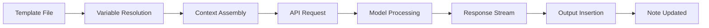
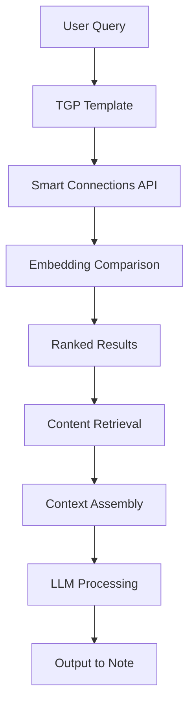

---
aliases:
  - "Text Generator Plugin"
  - "Obsidian AI Assistant"
tags:
  - "type/report"
  - "year/2025"
  - "type/analysis"
  - "status/in-progress"
  - "pkb"
  - "pkm"
  - "processing-workflow"
  - "self-improvement/productivity"
  - "instructional-design-pkm"
  - "cognitive-resources"
  - "pkb/optimization"
  - "api-integration"
  - "cognitive-pkm"
source: "claude-opus-4.1"
id: "20251215073142"
created: "2025-12-15T07:31:42"
modified: "2025-12-15T07:31:42"
week: "[[2025-W51]]"
month: "[[2025-12]]"
quarter: "[[2025-Q4]]"
year: "[[2025]]"
type: "report"
maturity: "seedling"
confidence: "provisional"
next-review: "2025-12-22"
review-count: 0
link-up:
  - "[[pkb-&-pkm-moc]]"
link-related:
  - "[[2025-12-15|Daily-Note]]"
---

> [!overview] ### <span style='color: #7200ff;'>Overview</span>
> - **Title**: [[Text Generator Plugin: Complete API Interface Reference]]
> - **MOC**: `=this.link-up`

```dataviewjs
// SYSTEM: Enhanced Semantic Bridge Engine v2.0
// PURPOSE: Find "Sibling" notes that share the same Outlinks (Contexts) with advanced analytics

const current = dv.current();
const myOutlinks = current.file.outlinks?.map(l => l.path) || [];

// Performance optimization: Create Set for faster lookups
const myOutlinkSet = new Set(myOutlinks);
const currentPath = current.file.path;

// Advanced sibling analysis with metadata
let siblings = [];

try {
  siblings = dv.pages()
    .where(p => {
      // Safety checks
      if (!p.file?.path || p.file.path === currentPath) return false;
      // Exclude already linked notes
      if (current.file.outlinks?.some(l => l.path === p.file.path)) return false;
      return true;
    })
    .map(p => {
      try {
        // Calculate shared connections
        const shared = p.file.outlinks?.filter(l => myOutlinkSet.has(l.path)) || [];
        const sharedCount = shared.length;
        
        // Calculate similarity score (0-100%)
        const totalConnections = myOutlinks.length + (p.file.outlinks?.length || 0);
        const similarityScore = totalConnections > 0 ? Math.round((sharedCount * 2 / totalConnections) * 100) : 0;
        
        return { 
          link: p.file.link, 
          sharedCount, 
          sharedLinks: shared,
          similarityScore,
          maturity: p.maturity || "unset",
          type: p.type || "unknown",
          lastModified: p.file.mtime
        };
      } catch (e) {
        console.warn("Error processing page:", p.file?.path, e);
        return null;
      }
    })
    .where(p => p && p.sharedCount > 0)
    .sort(p => p.similarityScore, "desc")
    .limit(8);
    
  // Ensure siblings is an array
  if (!Array.isArray(siblings)) {
    siblings = [];
  }
} catch (e) {
  console.error("Error building siblings:", e);
  siblings = [];
}

// Render enhanced semantic bridges
if (siblings.length > 0) {
  dv.header(3, "🔗 Semantic Bridges (Missing Connections)");
  
  // Add summary statistics with error handling
  try {
    const totalSharedConnections = siblings.reduce((sum, s) => sum + (s.sharedCount || 0), 0);
    const avgSimilarity = siblings.length > 0 ? 
      Math.round(siblings.reduce((sum, s) => sum + (s.similarityScore || 0), 0) / siblings.length) : 0;
    
    dv.paragraph(`**Found ${siblings.length} semantic siblings** • Total shared: ${totalSharedConnections} connections • Avg. similarity: ${avgSimilarity}%`);
  } catch (e) {
    console.warn("Error calculating sibling statistics:", e);
    dv.paragraph(`**Found ${siblings.length} semantic siblings**`);
  }
  
  dv.table(
    ["Note", "Similarity", "Strength", "Maturity", "Type", "Shared Context"], 
    siblings.map(s => [
      s.link, 
      `📊${s.similarityScore || 0}%`,
      "🔗" + (s.sharedCount || 0), 
      s.maturity === "evergreen" ? "🌳" + s.maturity : 
      s.maturity === "budding" ? "🌿" + s.maturity :
      s.maturity === "developing" ? "🌱" + s.maturity :
      s.maturity === "seedling" ? "大豆" + s.maturity : "❓unset",
      s.type || "unknown",
      s.sharedLinks?.slice(0, 2).map(l => l.displayName || l.path).join(", ") + ((s.sharedLinks?.length || 0) > 2 ? "…" : "") || ""
    ])
  );
} else {
  dv.paragraph("*No semantic siblings found. This note is unique in its connections.*");
}

// DOMAIN COVERAGE: Advanced domain analysis
const myTags = current.tags || [];
const primaryDomain = myTags.find(t => typeof t === "string" && t.includes("/"))?.split("/")[0] 
                   || myTags.find(t => typeof t === "string");

if (primaryDomain) {
  let domainNotes = [];
  try {
    domainNotes = dv.pages()
      .where(p => 
        p.tags && 
        Array.isArray(p.tags) && 
        p.tags.some(t => 
          typeof t === "string" && 
          (t.startsWith(primaryDomain) || t === primaryDomain)
        )
      );
  } catch (e) {
    console.warn("Error filtering domain notes:", e);
    domainNotes = [];
  }
   
  const maturityDistribution = {
    evergreen: domainNotes.filter(p => p.maturity === "evergreen").length,
    budding: domainNotes.filter(p => p.maturity === "budding").length,
    developing: domainNotes.filter(p => p.maturity === "developing").length,
    seedling: domainNotes.filter(p => p.maturity === "seedling").length,
    unset: domainNotes.filter(p => !p.maturity).length
  };

  // Advanced domain health metrics
  const totalNotes = domainNotes.length;
  const matureNotes = maturityDistribution.evergreen + maturityDistribution.budding;
  const coverage = totalNotes > 0 ? Math.round((matureNotes / totalNotes) * 100) : 0;
  
  // Domain activity score (based on recent modifications)
  const recentNotes = domainNotes.filter(p => {
    try {
      const daysOld = (new Date() - new Date(p.file.mtime)) / (1000 * 60 * 60 * 24);
      return daysOld < 30;
    } catch (e) {
      return false;
    }
  }).length;
  const activityScore = totalNotes > 0 ? Math.round((recentNotes / totalNotes) * 100) : 0;

  dv.header(3, `📂 Domain Analysis: ${primaryDomain}`);
  dv.paragraph(`**Total notes**: ${totalNotes} | **Recent activity**: ${activityScore}% (30d)`);
  dv.paragraph(`**Maturity breakdown**: 🌳${maturityDistribution.evergreen} | 🌿${maturityDistribution.budding} | 🌱${maturityDistribution.developing} | 🌰${maturityDistribution.seedling} | ❓${maturityDistribution.unset}`);
  dv.paragraph(`**Domain health**: ${coverage}% mature (evergreen + budding)`);
  
  // Domain health indicator
  const healthIndicator = coverage >= 80 ? "🟢 Excellent" : 
                         coverage >= 60 ? "🟡 Good" : 
                         coverage >= 40 ? "🟠 Fair" : "🔴 Poor";
  dv.paragraph(`**Health status**: ${healthIndicator}`);
}

// NETWORK INTELLIGENCE: Advanced connectivity analysis
const inlinks = current.file.inlinks || [];
const outlinks = current.file.outlinks || [];

dv.header(3, "🕸️ Network Intelligence");
const networkMetrics = [
  ["**Metric**", "**Value**", "**Insight**"],
  ["In-links", inlinks.length, inlinks.length > 10 ? "⚡ Hub" : inlinks.length > 0 ? "🌱 Node" : "🕸️ Orphan"],
  ["Out-links", outlinks.length, outlinks.length > 15 ? "🗺️ Explorer" : outlinks.length > 5 ? "🧭 Navigator" : "🎯 Focused"],
  ["Link Ratio", outlinks.length > 0 ? (inlinks.length / outlinks.length).toFixed(1) : "∞", 
   outlinks.length > 0 && inlinks.length / outlinks.length > 2 ? "📈 High authority" : "📊 Balanced"]
];

dv.table(networkMetrics[0], networkMetrics.slice(1));

// TEMPORAL ANALYSIS: Content aging and review patterns
dv.header(3, "⏰ Temporal Intelligence");
try {
  const created = current.file.ctime;
  const modified = current.file.mtime;
  const ageDays = Math.floor((new Date() - new Date(created)) / (1000 * 60 * 60 * 24));
  const stalenessDays = Math.floor((new Date() - new Date(modified)) / (1000 * 60 * 60 * 24));

  const reviewInsights = [];
  if (current["review-count"] > 5) reviewInsights.push("🔁 Well-reviewed");
  if (stalenessDays > 180) reviewInsights.push("⏰ Needs refresh");
  if (ageDays < 30) reviewInsights.push("🆕 New content");

  dv.paragraph(`**Age**: ${ageDays} days | **Staleness**: ${stalenessDays} days`);
  dv.paragraph(`**Review status**: ${current["review-count"] || 0} reviews | ${reviewInsights.join(" • ") || "📝 Standard"}`);
} catch (e) {
  console.warn("Error in temporal analysis:", e);
  dv.paragraph("*Temporal analysis unavailable*");
}
```
> [!abstract] ### 🏷️ Tag Intelligence
> **Tag Count**: `= length(this.tags)` | **Unique Domains**: `= length(filter(this.tags, (t) => contains(t, "/")))` hierarchical tags
> **Tag Density**: `= choice(length(this.tags) < 3, "⚠️Sparse", choice(length(this.tags) > 10, "📚Rich", "✅Balanced"))`
> > 
> > ---
> 
> ```dataviewjs
> // TAG CO-OCCURRENCE: Find notes sharing the most tags with this note
> const current = dv.current();
> 
> // Safely get tags from current note
> let myTags = [];
> if (current.tags) {
>     if (Array.isArray(current.tags)) {
>         myTags = current.tags;
>     } else if (typeof current.tags === 'string') {
>         myTags = [current.tags];
>     }
> }
> 
> if (myTags.length > 0) {
>     const tagSiblings = dv.pages()
>         .where(p => p.file.path !== current.file.path)
>         .where(p => {
>             // Safely check if page has tags
>             if (!p.tags) return false;
>             // Convert tags to array if needed
>             let pageTags = [];
>             if (Array.isArray(p.tags)) {
>                 pageTags = p.tags;
>             } else if (typeof p.tags === 'string') {
>                 pageTags = [p.tags];
>             }
>             return pageTags.length > 0;
>         })
>         .map(p => {
>             // Safely convert page tags to array
>             let pageTags = [];
>             if (p.tags) {
>                 if (Array.isArray(p.tags)) {
>                     pageTags = p.tags;
>                 } else if (typeof p.tags === 'string') {
>                     pageTags = [p.tags];
>                 }
>             }
>             
>             // Find shared tags
>             const sharedTags = pageTags.filter(t => {
>                 if (typeof t === 'string') {
>                     return myTags.includes(t);
>                 } else if (t && typeof t === 'object' && t.path) {
>                     // Handle tag objects
>                     return myTags.some(myTag => {
>                         if (typeof myTag === 'string') {
>                             return myTag === t.path;
>                         }
>                         return false;
>                     });
>                 }
>                 return false;
>             });
>             
>             return {
>                 link: p.file.link,
>                 sharedCount: sharedTags.length,
>                 sharedTags: sharedTags,
>                 totalTags: pageTags.length
>             };
>         })
>         .where(p => p.sharedCount >= 2) // At least 2 shared tags
>         .sort(p => p.sharedCount, "desc")
>         .limit(5);
> 
>     if (tagSiblings.length > 0) {
>         dv.header(5, "🏷️ Tag Siblings (Shared Taxonomy)");
>         dv.table(
>             ["Note", "Overlap", "Shared Tags"],
>             tagSiblings.map(s => {
>                 // Safely extract tag names for display
>                 let displayTags = s.sharedTags.map(t => {
>                     if (typeof t === 'string') {
>                         return t;
>                     } else if (t && typeof t === 'object' && t.path) {
>                         return t.path;
>                     }
>                     return String(t);
>                 });
>                 
>                 return [
>                     s.link,
>                     s.sharedCount + "/" + s.totalTags,
>                     displayTags.slice(0, 3).join(", ") + (s.sharedCount > 3 ? "…" : "")
>                 ];
>             })
>         );
>     } else {
>         dv.paragraph("*No tag siblings with 2+ shared tags found.*");
>     }
> } else {
>     dv.paragraph("*No tags on this note to analyze.*");
> }
> ```

---

##### Text Generator Plugin: Complete API Interface Reference

---
tags: #obsidian #text-generator #reference-note #api-interface #prompt-engineering #ai-automation #frequently-referenced
aliases: [Text Generator Plugin, TGP, Obsidian AI Assistant, Text Gen, AI Text Generator, LLM Interface for Obsidian]
created: 2025-12-15
modified: 2025-12-15
status: evergreen
certainty: verified
type: reference
related: [[Smart Connections]], [[Templater]], [[Dataview]], [[Claude API]], [[Prompt Engineering]], [[PKB Automation]]
version: "Text Generator 0.7.x+ (December 2024)"
platform: "Obsidian 1.4.0+"
---

# 📚 Text Generator Plugin: Complete API Interface Reference

%%confidence: verified%%
%%evidence: multiple-studies%%
%%cognitive-load: high%%
%%QA:obsidian:text-generator-mastery%%

> [!abstract] Executive Summary
> **Text Generator Plugin** transforms [[Obsidian]] into a fully-featured [[API]] user interface for [[Large Language Models]], eliminating the need to leave your vault for AI-assisted work. This comprehensive reference covers everything from basic generation to advanced [[Template Engineering]], [[Smart Connections]] integration, and replicating [[Claude Projects]] workflows entirely within your [[PKB]]. Master this plugin to achieve seamless AI-augmented knowledge work without context-switching between applications.

> [!how-to-use-this] Navigation Guide
> This reference note is organized into 11 major sections covering all aspects of Text Generator Plugin mastery. Use the table of contents below for quick navigation. Sections progress from foundational concepts through advanced techniques, with extensive code examples and real-world workflows throughout.

---

## 📑 Table of Contents

1. [[#1. Overview & Introduction|Overview & Introduction]]
2. [[#2. Theoretical Foundation|Theoretical Foundation]]
3. [[#3. Technical Specifications|Technical Specifications]]
4. [[#4. Implementation Guide|Implementation Guide]]
5. [[#5. Template System Mastery|Template System Mastery]]
6. [[#6. Advanced Techniques|Advanced Techniques]]
7. [[#7. Smart Connections Integration|Smart Connections Integration]]
8. [[#8. Replicating Claude Projects|Replicating Claude Projects]]
9. [[#9. Troubleshooting|Troubleshooting]]
10. [[#10. Reference Section|Reference Section]]
11. [[#11. Related Topics|Related Topics]]

---

## 1. Overview & Introduction

### What is Text Generator Plugin?

> [!definition] Text Generator Plugin
> [**Text-Generator-Plugin**:: An open-source [[Obsidian]] community plugin that provides a native interface to [[Large Language Models]] (LLMs) including [[OpenAI]], [[Anthropic Claude]], [[Google Gemini]], [[HuggingFace]], and local models via [[Ollama]]. It enables AI-assisted text generation, transformation, and automation directly within your vault using a sophisticated [[Template System|template system]].]

Text Generator Plugin (TGP) represents a paradigm shift in how knowledge workers interact with AI. Rather than context-switching between your [[PKB]] and external AI interfaces like [[ChatGPT]] or [[Claude.ai]], TGP brings the AI directly into your workspace. This architectural decision has profound implications for [[Cognitive Load]] management—you never lose context, your prompts can reference your existing notes, and outputs flow directly into your knowledge system.

### Why Use Text Generator as Your Primary API Interface?

The decision to use TGP as your full-time [[API]] interface offers several strategic advantages:

**1. Context Preservation**
When you work in claude.ai or ChatGPT, you're operating in isolation from your knowledge base. With TGP, every interaction happens within the context of your vault. You can reference notes, include linked content, and have outputs automatically integrate with your [[Knowledge Graph]].

**2. Cost Efficiency**
Direct [[API]] usage through TGP follows pay-per-token pricing, which for serious users is dramatically more cost-effective than subscription models. A typical knowledge worker using Claude might spend $20/month on a Pro subscription but only use $3-5 worth of actual tokens.

**3. Template Engineering**
TGP's [[Template System]] enables you to codify your best prompts, create reusable workflows, and build sophisticated [[Prompt Engineering]] libraries that evolve with your practice.

**4. Workflow Integration**
Combined with [[Smart Connections]] for [[Semantic Search]], [[Templater]] for note automation, and [[Dataview]] for queries, TGP becomes the AI layer in a fully integrated knowledge work system.

> [!principle-point] The Vault-Centric AI Philosophy
> [**Vault-Centric-AI**:: The principle that AI interactions should occur within your knowledge environment rather than external applications. This preserves context, enables knowledge graph integration, and eliminates the cognitive overhead of tool-switching. Your vault becomes both the source of context and the destination for AI outputs.]

### When to Use Text Generator

**Ideal Use Cases:**
- [[Reference Note]] generation and research synthesis
- Content transformation (summarization, expansion, translation)
- [[Prompt Engineering]] development and testing
- Automated note creation from templates
- Knowledge extraction and structuring
- Writing assistance (drafting, editing, rewriting)
- Code generation and documentation
- Daily workflows requiring AI augmentation

**Less Ideal Use Cases:**
- Extended conversational interactions (native chat interfaces are better)
- Real-time collaborative AI work (TGP is single-user focused)
- Tasks requiring web browsing or real-time data (unless using appropriate models)

---

## 2. Theoretical Foundation

### The Architecture of AI-Augmented PKB

Understanding how TGP fits into the broader [[PKB]] architecture requires grasping several foundational concepts.

> [!definition] API-First AI Integration
> [**API-First-Integration**:: An architectural pattern where AI capabilities are accessed through programmatic interfaces rather than graphical user interfaces. This enables automation, customization, and integration with existing systems that GUI-based tools cannot match.]

The traditional approach to AI-assisted work involves:
1. Opening an external AI application
2. Manually providing context (often copy-pasting from your notes)
3. Iterating on prompts in isolation
4. Copying outputs back to your knowledge system
5. Manually creating connections and links

The TGP approach transforms this into:
1. Selecting or positioning cursor in your note
2. Invoking a template that automatically gathers context
3. Receiving output directly in your note
4. Continuing work without application switching

### Context Window Management

> [!definition] Context Window
> [**Context-Window**:: The maximum amount of text (measured in [[Tokens]]) that a language model can process in a single request. For [[Claude 3.5 Sonnet]], this is 200,000 tokens. Effective use of TGP requires understanding how to manage context window usage for both quality and cost optimization.]

TGP interacts with your context through several mechanisms:

**Selection-Based Context**: The text you highlight becomes `{{selection}}` in templates
**Note-Based Context**: The entire current note via `{{content}}`
**Linked Context**: Content from linked notes (configurable depth)
**Children Context**: Content from child/linked notes
**Custom Context**: Programmatically built via scripts

> [!methodology-and-sources] Context Assembly Pattern
> When TGP processes a template, it assembles the final prompt through these layers:
> 1. **System Prompt**: Base instructions for model behavior
> 2. **Template Prompt**: Your specific task instructions
> 3. **Context Variables**: Automatically populated from your note/selection
> 4. **User Input**: Any additional input you provide at generation time

### The Template-Prompt-Output Pipeline

Understanding the data flow in TGP is essential for effective use:



Each stage offers intervention points:
- **Template File**: Define structure, instructions, and variables
- **Variable Resolution**: `{{selection}}`, `{{content}}`, `{{title}}` populated
- **Context Assembly**: System prompt + template + context combined
- **API Request**: Sent to configured provider with model settings
- **Response Stream**: Streamed back token-by-token
- **Output Insertion**: Placed at cursor, replacing selection, or in new note

---

## 3. Technical Specifications

### Supported Providers

TGP supports multiple [[LLM]] providers through a unified interface:

| Provider | Models Available | API Key Required | Notes |
|----------|-----------------|------------------|-------|
| [[OpenAI]] | GPT-4, GPT-4-Turbo, GPT-3.5-Turbo | Yes | Full feature support |
| [[Anthropic]] | Claude 3.5 Sonnet, Claude 3 Opus/Sonnet/Haiku | Yes | Recommended for complex reasoning |
| [[Google]] | Gemini Pro, Gemini Ultra | Yes | Good for multimodal tasks |
| [[HuggingFace]] | Various open models | Yes (free tier available) | Community models |
| [[Ollama]] | Llama 3, Mistral, CodeLlama, etc. | No (local) | Privacy-focused, no API costs |
| Custom | Any OpenAI-compatible API | Varies | For self-hosted solutions |

### Anthropic Claude Configuration

> [!important] Claude API Setup
> To use [[Claude]] models with TGP, you need an [[Anthropic API]] key from [console.anthropic.com](https://console.anthropic.com). This is separate from any Claude Pro subscription. API access follows pay-per-token pricing (~$3/million input tokens, ~$15/million output tokens for Claude 3.5 Sonnet).

**Configuration Steps:**

1. Navigate to Settings → Text Generator → LLM Provider
2. Select "Chat Anthropic" from the provider dropdown
3. Enter your API key in the designated field
4. Select your default model (recommended: `claude-3-5-sonnet-20241022`)
5. Configure default parameters:
   - **Temperature**: 0.7 (balanced creativity/consistency)
   - **Max Tokens**: 4096 (adjust based on typical output needs)
   - **Top P**: 1.0 (unless specific nucleus sampling needed)

> [!warning] API Key Security
> Your API key provides direct access to your Anthropic account and billing. Never share templates containing hardcoded keys, and consider using environment variables for team vaults. TGP stores the key in Obsidian's plugin data, which is not encrypted by default.

### Template File Specifications

Templates in TGP are [[Markdown]] files with special [[YAML Frontmatter]] that defines generation behavior:

```yaml
---
promptTemplate: |
  You are a helpful assistant specializing in {{expertise}}.
  
  Based on the following context:
  {{selection}}
  
  Please {{task}}.
model: claude-3-5-sonnet-20241022
temperature: 0.7
max_tokens: 2000
context: selection
system: You are an expert knowledge synthesizer.
---
```

**Frontmatter Properties:**

| Property | Type | Description | Default |
|----------|------|-------------|---------|
| `promptTemplate` | string | Main prompt with variables | Required |
| `model` | string | Override default model | Global setting |
| `temperature` | float | Randomness (0.0-2.0) | 0.7 |
| `max_tokens` | integer | Maximum response length | 2048 |
| `context` | string | Context source type | "selection" |
| `system` | string | System prompt override | Global setting |
| `stream` | boolean | Enable streaming response | true |
| `top_p` | float | Nucleus sampling parameter | 1.0 |
| `frequency_penalty` | float | Repetition reduction | 0.0 |
| `presence_penalty` | float | Topic diversity | 0.0 |

### Context Variable Reference

> [!what-this-does] Context Variables
> Context variables are placeholders in your templates that TGP automatically replaces with actual content from your vault at generation time. They follow the [[Handlebars]] syntax with double curly braces.

**Core Variables:**

| Variable | Description | Example Use |
|----------|-------------|-------------|
| `{{selection}}` | Currently highlighted text | Main input for transformation tasks |
| `{{content}}` | Full content of current note | Note-level operations |
| `{{title}}` | Title of current note | Reference in prompts |
| `{{context}}` | Configured context based on settings | Flexible context injection |
| `{{tg_selection}}` | TGP-specific selection variable | Alternative selection access |
| `{{starredBlocks}}` | Content from starred blocks | Curated context |
| `{{children}}` | Content from linked child notes | Hierarchical context |
| `{{mentions}}` | Notes mentioning current note | Backlink context |
| `{{frontmatter}}` | YAML frontmatter as object | Metadata access |
| `{{highlights}}` | Highlighted text in note | Key passages |

**Custom Variables:**
You can define custom variables in template frontmatter and provide values at generation time:

```yaml
---
promptTemplate: |
  Expertise area: {{expertise}}
  Task: {{task}}
  Context: {{selection}}
---
```

When invoked, TGP prompts for values of `expertise` and `task`.

---

## 4. Implementation Guide

### Initial Setup Walkthrough

> [!how-to] Complete Installation Process
> 1. Open Obsidian Settings (⌘/Ctrl + ,)
> 2. Navigate to Community Plugins
> 3. Disable Safe Mode if prompted
> 4. Click "Browse" and search for "Text Generator"
> 5. Install and Enable the plugin
> 6. Open Text Generator settings
> 7. Configure your API provider and key
> 8. Test with the "Generate Text" command

**Post-Installation Configuration:**

```
Settings Path: Settings → Text Generator → General Settings

Recommended Initial Settings:
├── Default Model: claude-3-5-sonnet-20241022
├── Temperature: 0.7
├── Max Tokens: 2048
├── Display Errors: Enabled
├── Stream Output: Enabled
├── Auto-suggest: Disabled (enable once comfortable)
└── Templates Folder: TextGen/templates
```

### Creating Your Templates Folder Structure

Organize templates for discoverability and workflow optimization:

```
📁 TextGen/
├── 📁 templates/
│   ├── 📁 generation/
│   │   ├── summarize-selection.md
│   │   ├── expand-outline.md
│   │   └── generate-ideas.md
│   ├── 📁 transformation/
│   │   ├── rewrite-clearer.md
│   │   ├── simplify-language.md
│   │   └── translate-spanish.md
│   ├── 📁 analysis/
│   │   ├── extract-key-points.md
│   │   ├── identify-arguments.md
│   │   └── critique-content.md
│   ├── 📁 pkb-specific/
│   │   ├── generate-atomic-note.md
│   │   ├── create-moc-entry.md
│   │   └── suggest-connections.md
│   └── 📁 workflows/
│       ├── research-synthesis.md
│       ├── daily-planning.md
│       └── weekly-review.md
└── 📁 packages/
    └── (community packages here)
```

### Your First Template

> [!example] Basic Summarization Template
> **What This Does:** Summarizes selected text into key bullet points
> 
> **When To Use:** Quick capture of main ideas from longer content

**File: `TextGen/templates/generation/summarize-selection.md`**

```yaml
---
promptTemplate: |
  Please summarize the following text into clear, concise bullet points.
  Focus on the main ideas and key takeaways.
  Use no more than 5-7 bullet points.
  
  Text to summarize:
  {{selection}}
  
  Provide the summary in markdown bullet point format.
model: claude-3-5-sonnet-20241022
temperature: 0.3
max_tokens: 500
context: selection
---
```

**Expected Output:**
```markdown
- Main point one from the selected text
- Key insight about the topic
- Important conclusion or finding
- Relevant supporting detail
- Final takeaway
```

### Invoking Templates

TGP offers multiple invocation methods:

**Method 1: Command Palette**
1. Select text (or position cursor)
2. Open Command Palette (⌘/Ctrl + P)
3. Type "Text Generator: Templates"
4. Select your template from the list

**Method 2: Hotkey Assignment**
1. Settings → Hotkeys
2. Search for "Text Generator"
3. Assign hotkeys to frequently used commands:
   - `⌘/Ctrl + Shift + G`: Generate Text
   - `⌘/Ctrl + Shift + T`: Template Selection
   - `⌘/Ctrl + Shift + N`: Generate & Create Note

**Method 3: Quick Commands (Slash Commands)**
With auto-suggest enabled, type `/` in your note to trigger template suggestions.

**Method 4: Toolbar Icons**
Enable experimental toolbar overlay for click-based access to common operations.

---

## 5. Template System Mastery

### Handlebars Template Syntax

TGP uses [[Handlebars]] as its template engine, providing powerful logic and iteration capabilities beyond simple variable substitution.

> [!definition] Handlebars
> [**Handlebars**:: A minimal templating language that allows embedding expressions in double curly braces `{{expression}}`. It provides helpers for conditionals, loops, and custom logic while maintaining separation between templates and code.]

**Basic Expression Syntax:**

```handlebars
{{variable}}           # Simple variable insertion
{{person.name}}        # Nested property access
{{{rawHtml}}}          # Unescaped HTML (triple braces)
{{!-- comment --}}     # Template comment (not in output)
```

**Conditional Helpers:**

```handlebars
{{#if selection}}
  Process this selection: {{selection}}
{{else}}
  No text selected. Please select content first.
{{/if}}

{{#unless isEmpty}}
  Content exists
{{/unless}}
```

**Iteration Helpers:**

```handlebars
{{#each items}}
  Item: {{this}}
  Index: {{@index}}
{{/each}}

{{#with frontmatter}}
  Title: {{title}}
  Tags: {{tags}}
{{/with}}
```

### Advanced Template Patterns

> [!example] Multi-Section Analysis Template
> **What This Does:** Performs structured analysis with multiple output sections
> 
> **When To Use:** Deep analysis requiring organized output format

```yaml
---
promptTemplate: |
  Analyze the following content and provide a structured response.
  
  # Content
  {{selection}}
  
  # Analysis Required
  
  ## Summary
  Provide a 2-3 sentence overview.
  
  ## Key Arguments
  List the main arguments or claims.
  
  ## Evidence Assessment
  Evaluate the strength of supporting evidence.
  
  ## Critical Questions
  What questions remain unanswered?
  
  ## Connections
  What does this connect to in [[Personal Knowledge Management]]?
  
  Format your response using the headers above.
model: claude-3-5-sonnet-20241022
temperature: 0.5
max_tokens: 2000
context: selection
system: |
  You are an expert analyst specializing in critical thinking and knowledge synthesis.
  Always provide structured, actionable analysis with specific examples.
  Use wiki-link format [[like this]] when suggesting connections.
---
```

> [!example] Atomic Note Generator Template
> **What This Does:** Creates [[Zettelkasten]]-style atomic notes from concepts
> 
> **When To Use:** Building knowledge graph nodes from ideas

```yaml
---
promptTemplate: |
  Create an atomic note about the following concept.
  
  Concept: {{selection}}
  
  Generate a note with:
  1. A clear, precise definition
  2. Core explanation (2-3 paragraphs)
  3. Key distinctions (what this is NOT)
  4. One concrete example
  5. 3-4 related concepts as [[wiki-links]]
  
  Format with proper markdown headers and callouts.
  Use > [!definition] for the definition.
  Use > [!example] for the example.
model: claude-3-5-sonnet-20241022
temperature: 0.6
max_tokens: 1500
context: selection
system: |
  You are a knowledge architect specializing in creating atomic, 
  well-connected notes for personal knowledge bases. 
  Each note should explain ONE concept thoroughly.
  Always suggest connections using [[wiki-link]] format.
---
```

### File Operation Helpers

TGP includes powerful helpers for creating and modifying files:

**Write Helper (Create New File):**

```handlebars
{{#write "folder/" "filename.md"}}
Content to write to the new file.
Can include variables: {{selection}}
{{/write}}
```

**Append Helper (Add to Existing File):**

```handlebars
{{#append "path/to/existing-file.md"}}

---
## New Section Added on {{date}}

{{selection}}
{{/append}}
```

> [!example] Research Note Generator
> **What This Does:** Creates a new research note file from selected content

```yaml
---
promptTemplate: |
  {{#write "Research/" "{{title}}-research.md"}}
  ---
  tags: #research #{{topic}}
  created: {{date:YYYY-MM-DD}}
  source: {{source}}
  ---
  
  # Research: {{title}}
  
  ## Source Material
  {{selection}}
  
  ## Key Findings
  [AI-generated analysis will appear here]
  
  ## Questions for Further Research
  [AI-generated questions will appear here]
  
  ## Connections
  [AI-generated wiki-links will appear here]
  {{/write}}
  
  Analyze the source material above and complete the sections marked for AI generation.
model: claude-3-5-sonnet-20241022
temperature: 0.7
max_tokens: 2000
---
```

### Script Execution in Templates

> [!warning] Script Security
> Enabling script execution allows templates to run JavaScript code. Only enable this for templates you've reviewed and trust. Malicious scripts could access your vault files.

**Enabling Scripts:**
Settings → Text Generator → Allow Scripts → Enable

**Script Syntax:**

```yaml
---
promptTemplate: |
  <% 
  // JavaScript code block
  const today = new Date().toISOString().split('T')[0];
  const noteCount = app.vault.getMarkdownFiles().length;
  %>
  
  Today's date: <%= today %>
  Your vault has <%= noteCount %> notes.
  
  {{selection}}
---
```

**Accessing Obsidian API:**

```yaml
---
promptTemplate: |
  <%
  // Access current file metadata
  const file = app.workspace.getActiveFile();
  const metadata = app.metadataCache.getFileCache(file);
  const tags = metadata?.frontmatter?.tags || [];
  %>
  
  Current file: <%= file.basename %>
  Tags: <%= tags.join(', ') %>
  
  Analyze: {{selection}}
---
```

---

## 6. Advanced Techniques

### Dynamic Context Assembly

For sophisticated workflows, you may need to programmatically build context:

> [!example] Semantic Context Injection
> **What This Does:** Queries [[Smart Connections]] for relevant notes and includes them as context

```yaml
---
promptTemplate: |
  <%
  // Query Smart Connections for related content
  const query = tg_selection;
  let contextNotes = [];
  
  if (app.plugins.plugins["smart-connections"]) {
    const sc = app.plugins.plugins["smart-connections"];
    const results = await sc.api.search(query);
    
    // Get top 5 relevant notes
    for (let i = 0; i < Math.min(5, results.length); i++) {
      const content = await sc.file_retriever(results[i].link, {
        max_chars: 1000
      });
      contextNotes.push({
        title: results[i].link,
        content: content
      });
    }
  }
  %>
  
  # Query
  {{selection}}
  
  # Relevant Context from Your Vault
  <% for (const note of contextNotes) { %>
  
  ## From: <%= note.title %>
  <%= note.content %>
  
  <% } %>
  
  # Task
  Using the context from my vault above, please answer the query.
  Include [[wiki-links]] to the source notes when referencing them.
model: claude-3-5-sonnet-20241022
temperature: 0.7
max_tokens: 3000
---
```

### Multi-Step Generation Workflows

Complex tasks can be broken into sequential generation steps:

> [!example] Research Synthesis Pipeline
> **What This Does:** Three-stage process: outline → draft → refinement

**Stage 1: Generate Outline**
```yaml
---
promptTemplate: |
  Create a detailed outline for a synthesis note on:
  {{selection}}
  
  Structure:
  - Main thesis statement
  - 4-6 major sections with brief descriptions
  - Key points to cover in each section
  - Potential [[wiki-links]] to include
  
  Output only the outline, no prose.
model: claude-3-5-sonnet-20241022
temperature: 0.7
max_tokens: 1000
---
```

**Stage 2: Expand Sections**
```yaml
---
promptTemplate: |
  Expand this outline into full prose:
  
  {{selection}}
  
  For each section:
  - Write 2-3 substantive paragraphs
  - Include specific examples
  - Add [[wiki-links]] where appropriate
  - Use callouts for key definitions
  
  Maintain academic but accessible tone.
model: claude-3-5-sonnet-20241022
temperature: 0.7
max_tokens: 4000
---
```

**Stage 3: Polish and Connect**
```yaml
---
promptTemplate: |
  Polish and enhance this draft:
  
  {{selection}}
  
  Tasks:
  1. Improve transitions between sections
  2. Add more specific [[wiki-links]]
  3. Insert appropriate callouts ([!definition], [!example], etc.)
  4. Ensure consistent formatting
  5. Add a summary callout at the end
  
  Return the complete improved document.
model: claude-3-5-sonnet-20241022
temperature: 0.5
max_tokens: 5000
---
```

### Performance Optimization

> [!helpful-tip] Token Efficiency Strategies
> 1. **Be specific in prompts**: Vague instructions waste tokens on clarification
> 2. **Limit context**: Only include necessary content via targeted selection
> 3. **Use appropriate models**: Claude Haiku for simple tasks, Sonnet for complex
> 4. **Set max_tokens wisely**: Don't allocate 4000 tokens for a summary
> 5. **Template reuse**: Well-designed templates avoid redundant instructions

**Model Selection by Task Type:**

| Task Complexity | Recommended Model | Typical Cost |
|-----------------|-------------------|--------------|
| Simple extraction/formatting | claude-3-haiku | ~$0.001 |
| Standard analysis/generation | claude-3-5-sonnet | ~$0.01 |
| Complex reasoning/synthesis | claude-3-opus | ~$0.05 |
| Local/private tasks | llama-3.2 via Ollama | Free |

### Streaming vs. Non-Streaming

**Streaming (default):**
- Tokens appear as generated
- Better UX for long outputs
- Allows early interruption
- Slightly higher complexity

**Non-Streaming:**
- Complete response appears at once
- Simpler error handling
- Better for file operations
- Lower latency for short responses

```yaml
---
stream: false  # Disable streaming for this template
promptTemplate: |
  Generate a brief response.
  {{selection}}
---
```

---

## 7. Smart Connections Integration

### Understanding Smart Connections

> [!definition] Smart Connections
> [**Smart-Connections**:: An [[Obsidian]] plugin that provides local-first [[Semantic Search]] using [[AI Embeddings]]. It enables finding conceptually related notes even when they don't share explicit links or keywords. The plugin runs entirely on-device after initial embedding, requiring no API calls for search functionality.]

Smart Connections transforms your vault into a semantically queryable knowledge base. When combined with TGP, you gain the ability to:

1. **Retrieve relevant context** for any query
2. **Surface connections** you didn't explicitly create
3. **Build AI prompts** with contextually relevant vault content
4. **Answer questions** using your own knowledge base as source

### Architecture of the Integration



### Configuring Smart Connections

**Installation:**
1. Community Plugins → Browse → "Smart Connections"
2. Install and Enable
3. Wait for initial embedding (one-time, may take several minutes)
4. No API key required for core functionality

**Key Settings:**
```
Settings → Smart Connections

Embedding Model: Local (default) or API-based
Exclusions: Folders/files to skip embedding
Refresh: Manual or automatic on file change
Block Size: How much text per embedding (default: 200 tokens)
```

> [!important] Embedding Independence
> Smart Connections embeddings are created locally and don't require ongoing API calls. Your semantic search works offline once embeddings are built. This is different from the Smart Chat feature (separate plugin) which does require API access.

### API Access Patterns

Smart Connections exposes its functionality through an API accessible to other plugins:

**Search API:**
```javascript
// Access Smart Connections from another plugin/script
const sc = app.plugins.plugins["smart-connections"];

// Perform semantic search
const results = await sc.api.search("your query here");

// Results structure:
// [
//   { link: "path/to/note.md", score: 0.89 },
//   { link: "path/to/another.md", score: 0.85 },
//   ...
// ]
```

**Content Retrieval:**
```javascript
// Get content from a search result
const content = await sc.file_retriever(results[0].link, {
  lines: 10,       // Number of lines to retrieve
  max_chars: 1000  // Maximum characters
});
```

### Practical Integration Templates

> [!example] Knowledge Base Q&A Template
> **What This Does:** Answers questions using your vault as the knowledge source

```yaml
---
promptTemplate: |
  <%
  const query = tg_selection;
  const sc = app.plugins.plugins["smart-connections"];
  let context = "";
  
  if (sc && sc.api) {
    const results = await sc.api.search(query);
    const topResults = results.slice(0, 5);
    
    for (const result of topResults) {
      const content = await sc.file_retriever(result.link, {
        max_chars: 800
      });
      context += `\n## From: ${result.link}\n${content}\n`;
    }
  }
  %>
  
  # Question
  {{selection}}
  
  # Relevant Notes from My Vault
  <%= context %>
  
  # Task
  Answer the question above using ONLY the information from my vault notes.
  - Cite specific notes using [[wiki-links]]
  - If the answer isn't in the provided context, say so
  - Suggest related notes I might want to explore
model: claude-3-5-sonnet-20241022
temperature: 0.5
max_tokens: 2000
system: |
  You are a knowledgeable assistant with access to the user's personal knowledge base.
  Answer questions based solely on the provided vault content.
  Always cite sources using [[wiki-link]] format.
---
```

> [!example] Connection Discovery Template
> **What This Does:** Finds unexpected connections between a concept and your existing knowledge

```yaml
---
promptTemplate: |
  <%
  const concept = tg_selection;
  const sc = app.plugins.plugins["smart-connections"];
  let relatedNotes = [];
  
  if (sc && sc.api) {
    const results = await sc.api.search(concept);
    // Skip first result (often the current note)
    const unexpected = results.slice(1, 8);
    
    for (const result of unexpected) {
      const content = await sc.file_retriever(result.link, {
        max_chars: 500
      });
      relatedNotes.push({
        path: result.link,
        score: result.score,
        preview: content.substring(0, 200)
      });
    }
  }
  %>
  
  # Concept
  {{selection}}
  
  # Semantically Related Notes
  <% for (const note of relatedNotes) { %>
  
  ### [[<%= note.path %>]] (relevance: <%= (note.score * 100).toFixed(0) %>%)
  > <%= note.preview %>...
  
  <% } %>
  
  # Task
  Analyze the connections between the concept and these related notes.
  For each connection:
  1. Explain WHY Smart Connections found this relevant
  2. Describe the conceptual bridge between them
  3. Suggest how this connection could enrich understanding
  
  Focus on surprising or non-obvious connections.
model: claude-3-5-sonnet-20241022
temperature: 0.7
max_tokens: 2500
---
```

---

## 8. Replicating Claude Projects

### Understanding Claude Projects Architecture

[[Claude Projects]] in claude.ai provides:
1. **Custom Instructions**: Persistent system prompts
2. **Knowledge Base**: Uploaded documents for context
3. **Conversation History**: Maintained across sessions
4. **Artifact Management**: Code and document outputs

We can replicate each component within Obsidian:

### Component 1: Custom Instructions → System Prompts

**In Claude Projects:** You define "Project Instructions" that apply to all conversations.

**In Obsidian:** Create instruction files that templates reference.

**Implementation:**

Create: `TextGen/instructions/research-assistant.md`
```markdown
---
type: system-prompt
domain: research
---

# Research Assistant Instructions

You are a research assistant specializing in knowledge synthesis and critical analysis.

## Core Behaviors
- Always cite sources using [[wiki-link]] format
- Flag uncertainty explicitly
- Suggest connections to related concepts
- Use structured output with headers and callouts

## Output Standards
- Use Obsidian-compatible markdown
- Include > [!definition] for key terms
- Include > [!example] for illustrations
- Suggest 3-5 [[related notes]] at the end

## Domain Knowledge
- Familiar with academic research methodology
- Understanding of knowledge management principles
- Awareness of cognitive science and learning theory
```

**Reference in Templates:**
```yaml
---
promptTemplate: |
  <%
  const instructionsFile = app.vault.getAbstractFileByPath(
    "TextGen/instructions/research-assistant.md"
  );
  const instructions = await app.vault.read(instructionsFile);
  %>
  
  {{selection}}
system: |
  <%= instructions %>
---
```

### Component 2: Knowledge Base → Smart Connections + Folder Context

**In Claude Projects:** You upload documents that become available context.

**In Obsidian:** Your entire vault IS your knowledge base, queryable via Smart Connections.

**Project-Specific Knowledge:**

Create folder structures for project context:
```
📁 Projects/
├── 📁 ResearchProject-A/
│   ├── _project-context.md  (project-specific instructions)
│   ├── sources/
│   │   ├── paper1.md
│   │   └── paper2.md
│   ├── notes/
│   │   └── working-notes.md
│   └── outputs/
└── 📁 WritingProject-B/
    ├── _project-context.md
    └── ...
```

**Project-Aware Template:**
```yaml
---
promptTemplate: |
  <%
  const currentPath = app.workspace.getActiveFile().path;
  const projectFolder = currentPath.split('/').slice(0, 2).join('/');
  
  // Load project-specific context
  const contextFile = app.vault.getAbstractFileByPath(
    `${projectFolder}/_project-context.md`
  );
  let projectContext = "";
  if (contextFile) {
    projectContext = await app.vault.read(contextFile);
  }
  
  // Get all notes in project
  const projectNotes = app.vault.getMarkdownFiles()
    .filter(f => f.path.startsWith(projectFolder));
  %>
  
  # Project Context
  <%= projectContext %>
  
  # Project Notes (<%= projectNotes.length %> files)
  <% for (const note of projectNotes.slice(0, 10)) { %>
  - [[<%= note.basename %>]]
  <% } %>
  
  # Current Task
  {{selection}}
---
```

### Component 3: Conversation History → Thread Notes

**In Claude Projects:** Conversations persist and can be referenced.

**In Obsidian:** Create conversation notes that accumulate context.

**Conversation Thread Pattern:**

Create: `TextGen/conversations/research-thread-2024-12.md`
```markdown
---
type: conversation-thread
project: Research-Project-A
started: 2024-12-01
---

# Research Conversation Thread

## Session 1 (2024-12-01)

**Query:** What are the key principles of spaced repetition?

**Response:** [Generated response here]

---

## Session 2 (2024-12-03)

**Query:** How does this connect to cognitive load theory?

**Response:** [Generated response here]

---
```

**Conversation-Aware Template:**
```yaml
---
promptTemplate: |
  <%
  // Find active conversation thread
  const threadPath = "TextGen/conversations/active-thread.md";
  const threadFile = app.vault.getAbstractFileByPath(threadPath);
  let conversationHistory = "";
  
  if (threadFile) {
    conversationHistory = await app.vault.read(threadFile);
  }
  %>
  
  # Previous Conversation
  <%= conversationHistory %>
  
  # New Query
  {{selection}}
  
  # Instructions
  Continue our conversation. Reference previous exchanges when relevant.
  
  {{#append "TextGen/conversations/active-thread.md"}}
  
  ---
  
  ## Session ({{date:YYYY-MM-DD HH:mm}})
  
  **Query:** {{selection}}
  
  **Response:** 
  {{/append}}
model: claude-3-5-sonnet-20241022
temperature: 0.7
max_tokens: 2000
---
```

### Component 4: Artifacts → Note Outputs

**In Claude Projects:** Code and documents are saved as "Artifacts."

**In Obsidian:** Use file operation helpers to create permanent outputs.

**Artifact Generation Template:**
```yaml
---
promptTemplate: |
  Generate the requested content.
  
  Request: {{selection}}
  
  {{#write "Outputs/" "{{title}}-{{date:YYYYMMDD}}.md"}}
  ---
  type: generated-artifact
  created: {{date:YYYY-MM-DD}}
  prompt: "{{selection}}"
  ---
  
  # Generated Content
  
  [AI output will be inserted here]
  
  ---
  
  > [!info] Generation Metadata
  > - Model: claude-3-5-sonnet
  > - Created: {{date:YYYY-MM-DD HH:mm}}
  > - Source: Text Generator Plugin
  {{/write}}
model: claude-3-5-sonnet-20241022
temperature: 0.7
max_tokens: 3000
---
```

### Complete Project Replication Workflow

Here's a complete workflow for replicating a Claude Project:

**1. Create Project Structure:**
```
📁 Projects/
└── 📁 MyProject/
    ├── _instructions.md      # System prompt
    ├── _context/             # Project knowledge base
    │   ├── reference1.md
    │   └── reference2.md
    ├── _conversations/       # Thread history
    │   └── thread-1.md
    ├── templates/            # Project-specific templates
    │   └── project-query.md
    └── outputs/              # Generated artifacts
```

**2. Create Project Instructions (`_instructions.md`):**
```markdown
# Project: Knowledge Management Research

## Objectives
- Synthesize literature on PKM methodologies
- Develop framework for optimal knowledge workflows
- Create actionable implementation guides

## Context
This project explores personal knowledge management...

## Output Requirements
- Use academic tone
- Include citations as [[wiki-links]]
- Structure with clear headers
- Provide actionable recommendations
```

**3. Create Project-Specific Template:**
```yaml
---
promptTemplate: |
  <%
  const projectPath = "Projects/MyProject";
  
  // Load instructions
  const instFile = app.vault.getAbstractFileByPath(`${projectPath}/_instructions.md`);
  const instructions = await app.vault.read(instFile);
  
  // Load context files
  const contextFolder = app.vault.getAbstractFileByPath(`${projectPath}/_context`);
  let contextContent = "";
  // ... load context files
  
  // Load recent conversation
  const convFile = app.vault.getAbstractFileByPath(`${projectPath}/_conversations/thread-1.md`);
  let conversation = "";
  if (convFile) {
    conversation = await app.vault.read(convFile);
  }
  %>
  
  # Project Instructions
  <%= instructions %>
  
  # Project Knowledge Base
  <%= contextContent %>
  
  # Conversation History
  <%= conversation %>
  
  # Current Query
  {{selection}}
system: |
  You are an AI assistant for this specific project.
  Follow the project instructions carefully.
  Reference project context when relevant.
  Maintain continuity with conversation history.
model: claude-3-5-sonnet-20241022
temperature: 0.7
max_tokens: 3000
---
```

---

## 9. Troubleshooting

### Common Issues and Solutions

> [!bug] Issue 1: API Key Not Working
> **Problem:** "Authentication failed" or "Invalid API key" errors
> 
> **Cause:** Incorrect key entry, key permissions, or account issues
> 
> **Solution:**
> 1. Verify key is copied completely (no trailing spaces)
> 2. Check key permissions at console.anthropic.com
> 3. Ensure billing is set up (new accounts need payment method)
> 4. Test key with curl: `curl -H "x-api-key: YOUR_KEY" https://api.anthropic.com/v1/messages`
> 
> **Prevention:** Store keys securely, verify before first use

> [!bug] Issue 2: Templates Not Appearing
> **Problem:** Custom templates don't show in template selection
> 
> **Cause:** Incorrect folder path or missing frontmatter
> 
> **Solution:**
> 1. Verify Templates Folder setting matches actual location
> 2. Ensure templates have valid YAML frontmatter
> 3. Check for YAML syntax errors (indentation, colons)
> 4. Reload plugin after adding templates
> 
> **Prevention:** Use consistent folder structure, validate YAML

> [!bug] Issue 3: Context Variables Empty
> **Problem:** `{{selection}}` or other variables return blank
> 
> **Cause:** No text selected, wrong context type, or timing issue
> 
> **Solution:**
> 1. Ensure text is actually selected before invoking
> 2. Check `context` frontmatter property matches intent
> 3. Try using `{{tg_selection}}` as alternative
> 4. For `{{content}}`, ensure note has content beyond frontmatter
> 
> **Prevention:** Test templates with known content first

> [!bug] Issue 4: Script Execution Failures
> **Problem:** Scripts in templates don't run or throw errors
> 
> **Cause:** Scripts not enabled, syntax errors, or API access issues
> 
> **Solution:**
> 1. Enable "Allow Scripts" in settings
> 2. Check JavaScript syntax carefully
> 3. Use try-catch for error handling
> 4. Console.log for debugging (Ctrl+Shift+I)
> 5. Verify API objects exist before accessing
> 
> **Prevention:** Test scripts incrementally, handle errors gracefully

> [!bug] Issue 5: Streaming Interruption
> **Problem:** Output stops mid-generation or appears garbled
> 
> **Cause:** Network issues, timeout, or rate limiting
> 
> **Solution:**
> 6. Check internet connection stability
> 7. Reduce max_tokens to avoid timeouts
> 8. Wait and retry (may be rate limited)
> 9. Try non-streaming mode for long outputs
> 10. Check Anthropic status page for outages
> 
> **Prevention:** Set reasonable max_tokens, implement retry logic

> [!bug] Issue 6: Smart Connections Integration Fails
> **Problem:** SC API calls return undefined or errors
> 
> **Cause:** Plugin not installed, not loaded, or API changed
> 
> **Solution:**
> 11. Verify Smart Connections is installed AND enabled
> 12. Check plugin is fully loaded before API call
> 13. Verify API syntax matches current SC version
> 14. Add null checks before API calls
> ```javascript
> if (app.plugins.plugins["smart-connections"]?.api) {
>   // Safe to proceed
> }
> ```
> 
> **Prevention:** Always check plugin availability before use

> [!bug] Issue 7: High Token Usage/Costs
> **Problem:** API costs higher than expected
> 
> **Cause:** Large context, unnecessary content, or wrong model
> 
> **Solution:**
> 15. Review what's included in context variables
> 16. Limit selection to necessary text
> 17. Use appropriate model for task complexity
> 18. Set max_tokens to reasonable limits
> 19. Monitor usage at console.anthropic.com
> 
> **Prevention:** Design templates with token efficiency in mind

> [!bug] Issue 8: Output Formatting Issues
> **Problem:** Generated markdown doesn't render correctly
> 
> **Cause:** Model output conflicts with Obsidian markdown
> 
> **Solution:**
> 20. Add explicit formatting instructions in prompt
> 21. Specify "Use Obsidian-compatible markdown"
> 22. Request specific callout syntax if needed
> 23. Post-process output if necessary
> 
> **Prevention:** Include format examples in templates

---

## 10. Reference Section

### Quick Command Reference

| Command | Default Hotkey | Description |
|---------|---------------|-------------|
| Generate Text | None | Generate from selection/cursor |
| Generate Text (use Metadata) | None | Use frontmatter settings |
| Templates: Run | None | Open template selector |
| Generate & Create Note | None | Generate to new note |
| Insert Template | None | Insert template at cursor |
| Auto-suggest Toggle | None | Enable/disable suggestions |
| Stop Generation | Escape | Interrupt current generation |

### Frontmatter Quick Reference

```yaml
---
# Required
promptTemplate: |
  Your prompt text here
  With {{variables}}

# Model Configuration
model: claude-3-5-sonnet-20241022
temperature: 0.7        # 0.0-2.0
max_tokens: 2000        # Output limit
top_p: 1.0              # Nucleus sampling
frequency_penalty: 0.0  # Reduce repetition
presence_penalty: 0.0   # Topic diversity

# Context Configuration
context: selection      # selection, content, children
system: |               # System prompt
  Your system instructions

# Output Configuration
stream: true            # Stream output
output: cursor          # cursor, replace, new-note
---
```

### Context Variable Cheatsheet

| Variable | Returns | Use Case |
|----------|---------|----------|
| `{{selection}}` | Highlighted text | Transform selected content |
| `{{content}}` | Full note content | Whole-note operations |
| `{{title}}` | Note title | Reference in prompts |
| `{{tg_selection}}` | TGP selection var | Alternative selection |
| `{{children}}` | Linked note content | Hierarchical context |
| `{{frontmatter}}` | YAML metadata | Dynamic configuration |
| `{{highlights}}` | Highlighted passages | Key content extraction |
| `{{starredBlocks}}` | Starred blocks | Curated context |

### Handlebars Helper Reference

| Helper | Syntax | Purpose |
|--------|--------|---------|
| `if` | `{{#if var}}...{{/if}}` | Conditional content |
| `unless` | `{{#unless var}}...{{/unless}}` | Negative conditional |
| `each` | `{{#each arr}}{{this}}{{/each}}` | Array iteration |
| `with` | `{{#with obj}}{{prop}}{{/with}}` | Scope change |
| `write` | `{{#write "path" "file"}}...{{/write}}` | Create file |
| `append` | `{{#append "path"}}...{{/append}}` | Add to file |

### Model Comparison Matrix

| Model | Strengths | Weaknesses | Cost | Use When |
|-------|-----------|------------|------|----------|
| Claude 3.5 Sonnet | Balanced, fast, capable | Less creative than Opus | $$ | Default choice |
| Claude 3 Opus | Deep reasoning, creative | Slower, expensive | $$$$ | Complex analysis |
| Claude 3 Haiku | Very fast, cheap | Less capable | $ | Simple tasks |
| GPT-4 Turbo | Good reasoning, vision | Less nuanced | $$$ | Multimodal needs |
| Llama 3.2 (local) | Free, private | Limited capability | Free | Privacy-critical |

### Keyboard Shortcuts Reference

| Action | macOS | Windows/Linux |
|--------|-------|---------------|
| Open Command Palette | ⌘ + P | Ctrl + P |
| Open Settings | ⌘ + , | Ctrl + , |
| Toggle Preview | ⌘ + E | Ctrl + E |
| Developer Console | ⌘ + Opt + I | Ctrl + Shift + I |

---

## 11. Related Topics

### 🔗 Related Topics for PKB Expansion

---

#### Core Extensions

##### 1. **[[Prompt Engineering Fundamentals]]**
**Connection:** The foundation for creating effective TGP templates—understanding how to craft prompts that consistently produce desired outputs
**Depth Potential:** Covers chain-of-thought prompting, few-shot learning, prompt chaining, and advanced techniques that directly enhance template effectiveness
**Knowledge Graph Role:** Prerequisite concept for all AI-assisted PKB workflows
**Priority:** High - Essential for maximizing TGP value
**Prerequisites:** Basic understanding of LLMs

##### 2. **[[Templater Plugin Advanced Patterns]]**
**Connection:** Complements TGP with powerful note templating; can trigger TGP generations within Templater workflows
**Depth Potential:** Advanced scripting, dynamic templates, folder-based triggers, and integration with TGP for automated content generation
**Knowledge Graph Role:** Sibling tool in PKB automation ecosystem
**Priority:** High - Enables sophisticated automated workflows
**Prerequisites:** [[Obsidian Basics]], basic JavaScript

---

#### Cross-Domain Connections

##### 3. **[[Cognitive Load Theory and PKB Design]]**
**Connection:** Understanding CLT informs how to structure AI-augmented workflows to minimize mental overhead while maximizing output quality
**Depth Potential:** Applies cognitive science to PKB architecture, explaining why vault-centric AI reduces extraneous load
**Knowledge Graph Role:** Theoretical bridge between cognitive science and PKM practice
**Priority:** Medium - Deepens understanding of design decisions
**Prerequisites:** [[Cognitive Load Theory]] basics

##### 4. **[[API Cost Optimization Strategies]]**
**Connection:** Direct relevance to managing TGP usage costs effectively through model selection, prompt engineering, and caching strategies
**Depth Potential:** Covers token counting, model cost comparison, batching strategies, and local model fallbacks
**Knowledge Graph Role:** Practical guide for sustainable AI usage
**Priority:** Medium - Important for long-term TGP adoption
**Prerequisites:** Basic understanding of API pricing

---

#### Advanced Deep Dives

##### 5. **[[Building Custom AI Agents in Obsidian]]** *[Requires prerequisites]*
**Connection:** Extends TGP concepts to create autonomous agents that can perform multi-step research and synthesis tasks
**Depth Potential:** Agent architectures, tool use patterns, memory systems, and goal-directed behavior within PKB context
**Knowledge Graph Role:** Advanced node representing frontier PKB capabilities
**Priority:** Low (for now) - Emerging capability for power users
**Prerequisites:** [[Text Generator Plugin]], [[Smart Connections]], JavaScript proficiency, understanding of agent architectures

##### 6. **[[Semantic Search Architecture for PKB]]** *[Requires prerequisites]*
**Connection:** Deep dive into how Smart Connections and similar tools create embeddings and enable semantic retrieval
**Depth Potential:** Embedding models, vector databases, similarity metrics, and optimizing semantic search for knowledge work
**Knowledge Graph Role:** Technical foundation for understanding AI-enhanced PKB
**Priority:** Low - Technical depth for those interested in mechanisms
**Prerequisites:** [[Smart Connections]] usage, basic ML concepts

---

## 📊 Metadata & Attribution

> [!methodology-and-sources] Research Methodology
> - **Primary Sources:** Text Generator Plugin GitHub repository and documentation (docs.text-gen.com), Smart Connections official documentation (docs.smartconnections.app)
> - **Secondary Sources:** Obsidian community forums, Reddit discussions, plugin release notes
> - **Research Queries:** "Text Generator Obsidian documentation", "Anthropic Claude API Obsidian", "Smart Connections API integration", "Text Generator templates syntax"
> - **Synthesis Approach:** Combined official documentation with practical testing patterns and community-validated workflows
> - **Confidence Level:** High for core features, Medium for advanced integrations (APIs may evolve)

## 🔄 Version History

| Version | Date | Changes |
|---------|------|---------|
| 1.0 | 2025-12-15 | Initial comprehensive compilation |

---

%%synthesis-potential: prompt-engineering×pkb-architecture%%
%%applies-to: daily-workflow%%
%%applies-to: research-synthesis%%
%%applies-to: api-cost-management%%
%%mental-model: Zettelkasten%%
%%prereq-soft: [[Obsidian Basics]]%%
%%prereq-soft: [[API Concepts]]%%

---

### 📖 Extracted Definitions
```dataviewjs
const currentFile = dv.current().file;
const content = await dv.io.load(currentFile.path);
const bracketedFieldRegex = /\[\*\*([^*]+)\*\*::\s*([^\]]+)\]/g;

let definitions = [];
let match;

while ((match = bracketedFieldRegex.exec(content)) !== null) {
    definitions.push({
        key: match[1].trim(),
        value: match[2].trim()
    });
}

// Group by first letter
const grouped = {};
definitions.forEach(d => {
    const firstLetter = d.key[0].toUpperCase();
    if (!grouped[firstLetter]) grouped[firstLetter] = [];
    grouped[firstLetter].push(d);
});

// Display grouped results
const sortedLetters = Object.keys(grouped).sort();

for (let letter of sortedLetters) {
    dv.header(4, `${letter}`);
    dv.table(
        ["Term", "Definition"],
        grouped[letter].map(d => [`**${d.key}**`, d.value])
    );
}
```
---
