### 📖 Extracted Definitions From Cognitive Science
```dataviewjs
try {
 // Get the current file
 const currentPage = dv.current();
 // Load the content of the current file
 const content = await dv.io.load(currentPage.file.path);
 // Storage for definitions in current file
 let allDefinitions = [];
 // Extract bracketed inline fields from current file content
 const bracketedFieldRegex = /\[\*\*([^*]+?)\*\*::\s*([^\]]+?)\]/g;
 let match;
 while ((match = bracketedFieldRegex.exec(content)) !== null) {
  allDefinitions.push({
   key: match[1].trim(), // This is the clean term without ** markdown
   value: match[2].trim()
  });
 }
 // Display results
 if (allDefinitions.length > 0) {
  dv.header(3, `📚 Definitions in Current File (${allDefinitions.length} total)`);
  // Group by first letter (using the clean key)
  const grouped = {};
  allDefinitions.forEach(d => {
   const firstLetter = d.key[0].toUpperCase();
   if (!grouped[firstLetter]) grouped[firstLetter] = [];
   grouped[firstLetter].push(d);
  });
  // Sort letters alphabetically
  const sortedLetters = Object.keys(grouped).sort();
  // Display grouped results
  for (let letter of sortedLetters) {
   dv.header(4, `${letter} (${grouped[letter].length} terms)`);
   dv.table(
    ["🔑 Term", "📝 Definition"],
    grouped[letter].map(d => [
     `**${d.key}**`,
     d.value
    ])
   );
   dv.paragraph(""); // Add spacing between groups
  }
 } else {
  dv.paragraph(`*No bracketed inline fields found in current file.*`);
 }
} catch (error) {
 console.error("Error in definitions script:", error);
 dv.paragraph("*Error loading definitions. Check console for details.*");
}
```
---


# Foundational Understanding
> [!definition] # Definition
> [**Note Title**:: [[**Hierarchical Task Decomposition: Plan-and-Solve as Cognitive Architecture**]]]
> [**Prompt Used**:: ]
> ##### [✅`= dateformat(this.file.ctime, "MMMM dd, yyyy")` - Initial Creation]


---
tags: #cognitive-architecture #planning-systems #task-decomposition #hierarchical-planning #means-ends-analysis #prompt-engineering #agentic-reasoning #strips-planning #htn #problem-solving
aliases: [HTD, Plan-and-Solve, Hierarchical Planning, Task Decomposition, Cognitive Planning Architecture, Means-Ends Analysis]
created: 2025-12-27
modified: 2025-12-27
status: evergreen
certainty: verified
type: reference
related_frameworks: [[ReAct]], [[Tree of Thoughts]], [[Chain of Thought]], [[Agentic Reasoning]]
cognitive_foundations: [[General Problem Solver]], [[Means-Ends Analysis]], [[Cognitive Load Theory]]
planning_formalisms: [[STRIPS]], [[HTN]], [[Classical Planning]]
---

# Hierarchical Task Decomposition: Plan-and-Solve as Cognitive Architecture

> [!abstract] Core Thesis
> **Hierarchical Task Decomposition** represents the fundamental cognitive strategy enabling both humans and AI agents to tackle complex problems by recursively breaking goals into manageable subtasks, grounded in 60+ years of cognitive science research from Newell and Simon's General Problem Solver through modern LLM planning architectures. This framework bridges classical AI planning formalisms (STRIPS, HTN) with contemporary prompt engineering techniques, revealing decomposition as the essential precursor to effective execution in agentic systems.

## Table of Contents

1. [[#Cognitive Science Foundations]]
2. [[#Formal Planning Theory]]
3. [[#Prompt Engineering for Decomposition]]
4. [[#Dynamic Replanning Architecture]]
5. [[#Framework Implementations]]
6. [[#Integration with Execution Systems]]
7. [[#Evaluation Methodologies]]

---

## Cognitive Science Foundations

### The Human Problem-Solving Heritage

[**Hierarchical-Task-Decomposition**:: A cognitive strategy where complex problems are recursively subdivided into smaller, more tractable subproblems, each potentially further decomposed until reaching directly executable primitive actions—originating from Newell and Simon's work on human problem-solving (1957-1972) and formalized in AI planning systems like STRIPS (1971) and HTN (1990s).]

The theoretical foundation for hierarchical task decomposition emerged from pioneering cognitive science research in the late 1950s. ^cognitive-origins [[Allen Newell]] and [[Herbert Simon]] developed the **General Problem Solver** (GPS, 1957-1972) as both a computational model and a psychological theory of human problem-solving, introducing **means-ends analysis** as the core decomposition mechanism.^newell-simon-1972

> [!key-claim] Means-Ends Analysis as Universal Decomposition Strategy
> Newell and Simon demonstrated that human experts across domains (chess, mathematical proofs, cryptarithmetic) employ a consistent strategy: identify the difference between current state and goal state, select an operator that reduces this difference, recursively apply the same strategy to preconditions of that operator. This "difference reduction through operator application" pattern provides the cognitive template for all hierarchical planning systems.

[**Means-Ends-Analysis**:: Problem-solving strategy that recursively identifies differences between current and goal states, selects operators to reduce those differences, and recursively solves precondition subgoals—the foundational decomposition mechanism demonstrated by GPS and underlying modern hierarchical planning.]

GPS revealed several critical insights about decomposition that remain relevant to contemporary AI agent design:

**1. Working Memory Bottleneck Creates Decomposition Necessity**

Human [[working memory]] can maintain approximately 4±1 information chunks simultaneously ([[Cowan's Capacity Limit]], refined from [[Miller's 7±2]]).^cowan-2001 Complex problems involving 20+ interdependent elements exceed this capacity, making decomposition not just helpful but cognitively mandatory. When a problem requires tracking more elements than working memory can hold, humans automatically chunk related elements into higher-level units, process those units, then expand them only when needed for execution.

This capacity constraint drives the fundamental **architectural requirement** for hierarchical decomposition: ^capacity-constraint

```
Problem Complexity > Working Memory Capacity 
  → Decomposition Required
  → Abstract high-level plan (fits in WM)
  → Expand subtasks only during execution
```

> [!example] Chess Master Chunking
> [[Chase and Simon (1973)]] demonstrated that chess masters don't hold individual piece positions in working memory—they perceive meaningful configurations (pawn chains, king safety structures, piece coordination patterns) as single chunks. A position with 30 pieces might be represented as 5-7 strategic chunks, fitting within working memory limits. Similarly, hierarchical task decomposition allows agents to represent complex 50-step plans as 5-7 high-level phases.

**2. Goal Regression Drives Top-Down Decomposition**

[**Goal-Regression**:: Planning strategy that works backward from desired goal state, identifying immediate preconditions, then recursively planning for those preconditions—contrasts with forward search from initial state, offers computational advantages when goal more constrained than initial state.]

GPS introduced **goal regression** as the primary decomposition direction: start with the desired end state, identify what must be true immediately before achieving it, recursively solve for those preconditions. This backward chaining proves computationally efficient when goals are more constrained than initial conditions—a pattern prevalent in real-world task planning.

Consider software development: the goal "deploy production-ready authentication system" backward-chains into immediate preconditions ("pass security audit," "complete integration tests," "implement token refresh"), each further decomposing. Forward planning from "empty repository" would explore vastly more unproductive paths.

**3. Abstraction Hierarchies Enable Progressive Refinement**

[**Abstraction-Hierarchy**:: Multi-level representation where higher levels suppress irrelevant details, intermediate levels provide progressively more specificity, and lowest level contains full execution detail—enables planning at appropriate granularity for current decision without premature commitment to implementation details.]

Newell and Simon observed that expert problem-solvers operate across multiple abstraction levels simultaneously:^abstraction-levels

- **Strategic level**: High-level goals and major milestones (few elements, fits WM)
- **Tactical level**: Intermediate subgoals and approach selection
- **Operational level**: Concrete actions with specific parameters

This three-tier structure (minimum; can extend to 5+ levels for very complex domains) allows maintaining overall direction while deferring detailed planning until contextually appropriate. Modern AI planning inherits this architecture directly.

### Cognitive Load Theory and Decomposition Efficiency

[[John Sweller]]'s **Cognitive Load Theory** (CLT, 1988) provides crucial explanatory power for *why* hierarchical decomposition improves problem-solving performance beyond working memory capacity alone.^sweller-1988

[**Intrinsic-Cognitive-Load**:: Inherent complexity of material determined by element interactivity—how many pieces of information must be processed simultaneously to understand the concept. Decomposition reduces element interactivity by isolating subproblems.]

Complex problems impose high **intrinsic load** due to element interactivity: solving a 20-step plan requires simultaneously considering how Step 5 affects Step 12's preconditions, how Step 8's output feeds Step 15, etc. Every element potentially interacts with every other element, creating O(n²) interactivity scaling.

Hierarchical decomposition transforms this:

```
MONOLITHIC PLAN (20 steps, no decomposition):
- Element interactivity: O(20²) = 400 potential interactions
- Working memory load: Exceeds capacity
- Error propagation: Global (one mistake cascades)

HIERARCHICAL PLAN (4 phases × 5 steps):
- Phase-level interactivity: O(4²) = 16 interactions
- Within-phase interactivity: 4 × O(5²) = 100 interactions  
- Working memory load: Fits capacity at each level
- Error propagation: Localized (phase boundaries contain errors)
```

The decomposition reduces cognitive load by **90%** (from 400 to ~116 managed interactions) through hierarchical containment.^load-reduction

> [!methodology-and-sources] Schema Construction Through Decomposition
> CLT posits that expertise develops through **schema construction**—organizing domain knowledge into coherent structures that can be retrieved and applied as single chunks. Hierarchical task decomposition directly facilitates schema formation: repeatedly decomposing "user authentication" into {credential validation, session management, token generation, permission checking} creates a reusable schema. Future authentication tasks activate this entire structure as one working memory chunk, rather than four separate elements.

### Problem Space Theory and Decomposition Dynamics

Newell and Simon's **problem space theory** provides the formal framework for understanding decomposition mechanics:^problem-space

[**Problem-Space**:: Formal representation consisting of (1) set of knowledge states, (2) operators that transform states, (3) constraints on operator application, (4) initial state, (5) goal test—problem-solving as search through this space from initial to goal state.]

Hierarchical decomposition creates **nested problem spaces**:


Each subproblem defines its own local problem space with:
- **Local initial state**: Inherited from parent problem's partial solution
- **Local goal**: Specific subgoal from parent decomposition
- **Local operators**: Subset of master operators relevant to this subtask
- **Local constraints**: Additional constraints from decomposition context

This nested structure provides **combinatorial explosion containment**: instead of searching through all possible action sequences in a monolithic space (exponential in plan length), decomposition partitions the search into smaller spaces searched independently (exponential in subproblem size, polynomial in number of subproblems).

**Mathematical Advantage**:
```
Monolithic search: O(b^d) where b = branching factor, d = solution depth
Hierarchical search: O(k × b^(d/k)) where k = number of subproblems

Example: b=10, d=20
- Monolithic: 10^20 = 10 quintillion states
- Hierarchical (k=4, d/k=5): 4 × 10^5 = 400,000 states
```

> [!warning] Decomposition Overhead and Suboptimality Trade-off
> While hierarchical decomposition dramatically reduces search complexity, it introduces two costs: (1) **Decomposition overhead**—the computational effort to determine appropriate subtask boundaries and ordering, and (2) **Potential suboptimality**—decomposition may prevent discovering optimal solutions that require coordinated cross-subtask actions. GPS-style planning accepts near-optimal solutions (satisficing rather than optimizing) in exchange for tractability. Modern planning systems address this through **hierarchical refinement** where initial coarse decomposition is progressively refined, or **anytime algorithms** that improve solution quality given additional computation time.

### From Human Cognition to Computational Planning

The cognitive science foundation established several principles that directly transfer to AI agent decomposition:

1. **[[Working-Memory-as-Architectural-Constraint]]**: Capacity limits necessitate chunking and hierarchical representation
2. **[[Goal-Regression-Efficiency]]**: Backward chaining from constrained goals outperforms forward search from unconstrained initial states  
3. **[[Abstraction-Hierarchy-Necessity]]**: Multi-level representation enables appropriate granularity at each planning stage
4. **[[Schema-Formation-Through-Decomposition]]**: Repeated decomposition patterns become reusable templates
5. **[[Combinatorial-Containment]]**: Nested problem spaces prevent exponential explosion

These principles informed the development of formal AI planning systems in the 1970s-1990s, which we examine next. The transition from psychological theory to computational formalism required making explicit what humans perform implicitly, leading to foundational work on [[STRIPS]], [[HTN]], and [[classical planning theory]].

---

## Formal Planning Theory

### STRIPS: The Foundation of Automated Planning

[**STRIPS**:: Stanford Research Institute Problem Solver (1971)—the seminal automated planning system that formalized planning as search through state space using operator preconditions and effects, establishing the template for classical AI planning and influencing every planning formalism since.]

**STRIPS**, developed by [[Richard Fikes]] and [[Nils Nilsson]] in 1971, transformed GPS's cognitive insights into a computational formalism that remains foundational to modern planning systems.^fikes-nilsson-1971 While GPS modeled human problem-solving descriptively, STRIPS provided a **prescriptive formalization** enabling automated plan generation.

**Core STRIPS Representation**:

A STRIPS planning problem consists of:

1. **States**: Sets of logical predicates describing world conditions
   ```
   State = {At(Robot, RoomA), Empty(Hand), Closed(Door)}
   ```

2. **Operators**: Actions with preconditions and effects
   ```
   Operator: Move(from, to)
   Preconditions: {At(Robot, from), Open(Door_between)}
   Effects: 
     - Delete: {At(Robot, from)}
     - Add: {At(Robot, to)}
   ```

3. **Initial State**: Starting world configuration
   ```
   I = {At(Robot, RoomA), Empty(Hand), Closed(Door1)}
   ```

4. **Goal**: Desired predicates (partial state specification)
   ```
   G = {At(Robot, RoomB), Holding(Package)}
   ```

**Planning Algorithm**: Backward search from goal to initial state, selecting operators whose effects match goal conditions, recursively planning for operator preconditions.

[**STRIPS-Assumption**:: The closed-world assumption that any predicate not explicitly listed as true is false, and the frame assumption that operators only change predicates explicitly listed in their effects (all other predicates remain unchanged)—critical simplifications enabling tractable planning.]

> [!key-claim] STRIPS as Hierarchical Decomposition Engine
> While STRIPS appears as simple state-space search, it inherently implements hierarchical decomposition through **goal regression**. Each operator application creates a new subproblem (achieving the operator's preconditions), establishing a recursive goal hierarchy. A plan for "deliver package to RoomB" decomposes into {grasp package, navigate to door, open door, navigate through door, navigate to destination}—each with its own preconditions forming further subgoals.

**STRIPS Decomposition Example**:

```
GOAL: At(Robot, RoomB) ∧ Holding(Package)

Decompose via Move(RoomA, RoomB):
├─ SUBGOAL 1: At(Robot, RoomA) ∧ Open(Door_AB)  [preconditions]
│  └─ Decompose via OpenDoor(Door_AB):
│     └─ SUBGOAL 1.1: At(Robot, Door_AB) ∧ Empty(Hand)
│        └─ Decompose via Move(CurrentLoc, Door_AB):
│           └─ SUBGOAL 1.1.1: At(Robot, CurrentLoc)  [satisfied by init state]
│
└─ SUBGOAL 2: Holding(Package)  [additional goal conjunct]
   └─ Decompose via Grasp(Package):
      └─ SUBGOAL 2.1: At(Robot, Package_Location) ∧ Empty(Hand)
         └─ [Further decomposition...]

PLAN (linearizing the goal tree):
1. Move(InitLoc, Package_Location)
2. Grasp(Package)  
3. Move(Package_Location, Door_AB)
4. PutDown(Package)  [to satisfy Empty(Hand) for opening door]
5. OpenDoor(Door_AB)
6. Grasp(Package)
7. Move(Door_AB, RoomB)
```

The plan emerges from recursive goal decomposition, with each operator application creating new subgoals. This is **implicit hierarchical decomposition**—the goal structure forms a tree, though STRIPS represents it through sequential regression.

**Limitations Driving Further Formalization**:

STRIPS's flat operator representation encounters scaling challenges:^strips-limitations

1. **Operator Proliferation**: Complex domains require hundreds of primitive operators, making search intractable
2. **No Abstraction Mechanism**: All planning occurs at single granularity level—cannot reason about "deliver package" without specifying every motor command
3. **Inefficient Search**: Explores action sequences that violate domain constraints or ignore standard practices
4. **No Task Knowledge**: Cannot leverage common patterns like "to enter a room, first navigate to door, then open it"

These limitations motivated the development of **Hierarchical Task Networks**, which make decomposition *explicit* rather than implicit.

### Hierarchical Task Networks (HTN)

[**HTN-Planning**:: Planning formalism where tasks are explicitly decomposed via methods that specify how compound (abstract) tasks reduce to networks of subtasks, continuing recursively until reaching primitive (directly executable) actions—introduced by Sacerdoti (1974) and formalized by Erol, Hendler, Nau (1994).]

**HTN planning** emerged from [[Earl Sacerdoti]]'s NOAH system (1974) and was formalized comprehensively by [[Kutluhan Erol]], [[James Hendler]], and [[Dana Nau]] in the 1990s.^erol-et-al-1994 HTN makes hierarchical decomposition a **first-class construct** in the planning formalism itself, rather than an emergent property of goal regression.

**HTN Formal Structure**:

1. **Primitive Tasks**: Directly executable actions (like STRIPS operators)
   ```
   primitive: drive(from, to)
   preconditions: {at(vehicle, from), road(from, to)}
   effects: {at(vehicle, to), ¬at(vehicle, from)}
   ```

2. **Compound Tasks**: Abstract activities requiring decomposition
   ```
   compound: travel(from, to)
   [No direct execution—must be decomposed]
   ```

3. **Methods**: Decomposition rules specifying how to achieve compound tasks
   ```
   method: travel_by_car(from, to)
   task: travel(from, to)
   preconditions: {have_car, license_valid}
   subtasks: [
     get_in_car(car),
     drive(from, to),
     get_out_car(car)
   ]
   ordering: get_in_car → drive → get_out_car
   ```

4. **Method Selection**: Multiple methods may decompose the same task under different conditions
   ```
   method: travel_by_train(from, to)
   task: travel(from, to)  
   preconditions: {train_available(from, to)}
   subtasks: [
     walk(current_loc, train_station),
     buy_ticket(from, to),
     board_train(from),
     ride_train(from, to),
     exit_train(to)
   ]
   ```

**HTN Planning Process**:

```mermaid
graph TD
    A[Initial Task Network] --> B{Contains Compound Tasks?}
    B -->|Yes| C[Select Compound Task]
    C --> D[Choose Applicable Method]
    D --> E[Replace Task with Subtask Network]
    E --> F{Constraints Satisfied?}
    F -->|Yes| A
    F -->|No| G[Backtrack, Try Different Method]
    G --> D
    B -->|No| H[All Primitive → Execute Plan]
    
    style H fill:#90EE90
```



[**HTN-Decomposition-Strategy**:: Planning proceeds by selecting compound tasks from the current task network, choosing applicable methods based on current state and preconditions, replacing the compound task with its method's subtask network, and recursively continuing until all tasks are primitive.]

> [!example] HTN Planning for Package Delivery
> **Initial Task**: `deliver_package(warehouse, customer_address)`
> 
> **Decomposition Trace**:
> ```
> Level 0: deliver_package(warehouse, customer_address)
> 
> Method Selected: standard_delivery
> Level 1 Network:
>   ├─ load_package(warehouse, truck)
>   ├─ transport(warehouse, customer_address, truck)  [compound]
>   └─ unload_package(truck, customer_address)
> 
> Expand transport(...):
> Method Selected: road_transport (train_transport preconditions failed)
> Level 2 Network:
>   ├─ load_package(warehouse, truck)
>   ├─ plan_route(warehouse, customer_address)  [compound]
>   ├─ drive_route(route, truck)  [compound]
>   └─ unload_package(truck, customer_address)
> 
> Expand plan_route(...):
> Method Selected: use_gps_routing
> Level 3 Network:
>   ├─ load_package(warehouse, truck)
>   ├─ query_gps(warehouse, customer_address)  [primitive]
>   ├─ optimize_route(gps_result)  [primitive]
>   ├─ drive_route(route, truck)  [compound]
>   └─ unload_package(truck, customer_address)
> 
> Expand drive_route(...):
> Method Selected: multi_segment_drive
> Level 4 Network (All Primitive):
>   1. load_package(warehouse, truck)
>   2. query_gps(warehouse, customer_address)
>   3. optimize_route(gps_result)
>   4. start_engine(truck)
>   5. drive_to_waypoint_1(truck)
>   6. drive_to_waypoint_2(truck)
>   ...
>   N. unload_package(truck, customer_address)
> ```

**Key Advantages of HTN**:

1. **[[Domain-Knowledge-Encoding]]**: Methods encode expert decomposition strategies—"the right way to achieve X in this domain"
2. **[[Abstraction-Level-Control]]**: Planner operates at semantically meaningful levels (deliver package, transport, drive) rather than primitive motor commands
3. **[[Search-Space-Reduction]]**: Methods constrain decomposition to sensible patterns, preventing exploration of nonsensical action sequences
4. **[[Reusability]]**: Methods are reusable across problems—once "transport" is defined, it applies to all transportation subproblems

[**HTN-vs-STRIPS-Distinction**:: STRIPS performs goal regression (backward search from desired states), while HTN performs task decomposition (forward expansion from abstract to primitive tasks). STRIPS discovers plans through search; HTN constructs plans through application of domain knowledge encoded in methods.]

**HTN Expressiveness**: HTN can represent problems STRIPS cannot efficiently handle:^htn-expressiveness

- **Procedural Constraints**: "Always check inventory before ordering supplies" (enforced via method structure)
- **Resource Management**: "Balance deliveries across fleet" (method selects truck based on current allocation)  
- **Temporal Patterns**: "Complete quality inspection before packaging" (ordering constraints in methods)
- **Conditional Workflows**: Different methods for different circumstances (rush delivery vs. standard)

> [!warning] HTN's Brittleness and Incompleteness
> HTN's strength (encoding expert knowledge in methods) is also its weakness: if no method covers a novel situation, the planner **fails** even if a solution exists. STRIPS, lacking method constraints, can theoretically find any solution reachable through its operators (given unlimited computation). This **completeness vs. efficiency** trade-off drives hybrid approaches: HTN for standard cases, STRIPS-style search for novel situations.

### Classical Planning and Complexity Analysis

**Classical planning theory** provides the computational complexity foundations for understanding when decomposition helps versus when it creates overhead.^ghallab-et-al-2004

[**Classical-Planning**:: Planning framework with restrictive assumptions—deterministic actions, complete information, static environment, sequential execution, implicit time—enabling tractable analysis while limiting real-world applicability. Serves as theoretical foundation before relaxing assumptions for practical systems.]

**Complexity Landscape**:

| Planning Variant | Complexity Class | Decomposition Impact |
|-----------------|------------------|---------------------|
| **STRIPS (propositional)** | PSPACE-complete | Decomposition doesn't change worst-case, but improves average-case exponentially |
| **HTN (with full recursion)** | Undecidable | Expressive power comes at cost of incomputability |
| **HTN (bounded depth)** | EXPTIME-complete | Decomposition depth directly impacts complexity |
| **Linear HTN** | NP-complete | Restricted ordering makes tractable |
| **Totally Ordered HTN** | P | Strict sequencing admits polynomial algorithms |

The key insight: **hierarchical decomposition trades worst-case complexity for practical tractability**. While HTN's worst case is harder than STRIPS, real-world problems exhibit structure that decomposition exploits.^complexity-vs-practice

[**Hierarchical-Complexity-Reduction**:: Decomposition transforms exponential branching factor in depth into polynomial branching factor times polynomial depth, changing search from O(b^d) to O(b_decomp × k × b_subtask^(d/k)) where k is number of subtasks—practical improvement despite similar worst-case complexity.]

**When Decomposition Helps** (empirically):^decomposition-conditions

1. **Subtask Independence**: Solving subproblem A doesn't constrain subproblem B → parallel decomposition wins
2. **Natural Hierarchies**: Domain has clear abstraction levels (strategic/tactical/operational) → matches HTN structure
3. **Reusable Patterns**: Same subtask structures recur → method libraries amortize encoding cost
4. **Constraint Propagation**: Higher-level decisions constrain lower levels → prunes search
5. **Anytime Requirements**: Need approximate solutions quickly → hierarchical refinement provides progressive detail

**When Decomposition Hurts**:

1. **Tight Coupling**: All subtasks interact → decomposition boundaries are artificial
2. **Flat Domains**: No natural abstraction hierarchy → HTN overhead without benefit
3. **Novel Problems**: Methods don't cover situation → HTN fails, STRIPS might succeed
4. **Optimality Requirements**: Decomposition prevents seeing globally optimal solutions → suboptimality cost exceeds search savings

### Modern Extensions: Temporal, Probabilistic, and Continual Planning

Classical planning's restrictive assumptions have been progressively relaxed:^modern-planning-extensions

**Temporal Planning** ([[PDDL 2.1]], [[TGP]])
- Actions have durations and can overlap
- Hierarchical decomposition handles temporal constraints across abstraction levels
- Example: "While coffee brews (5 min), prepare breakfast (4 min)" → concurrent subtasks

**Probabilistic Planning** ([[MDP]], [[POMDP]], [[Contingent Planning]])  
- Actions have uncertain outcomes
- Decomposition creates contingency hierarchies: "If delivery fails, escalate to supervisor"
- Methods include probability distributions over subtask outcomes

**Continual Planning** ([[Online Planning]], [[Execution Monitoring]])
- Plans execute in dynamic environments requiring replanning
- Hierarchical monitoring: track high-level progress, expand details only for current active subtask
- Enables **plan repair**: replan failed subtask without discarding entire plan

[**Plan-Monitoring-Hierarchy**:: Multi-level execution monitoring where high-level tasks track coarse-grained progress and success criteria, intermediate levels detect constraint violations, and low-level monitors catch primitive action failures—matches decomposition hierarchy to enable localized replanning.]

These extensions maintain hierarchical decomposition as core organizing principle while addressing real-world planning challenges. The key insight: **decomposition structure provides the scaffolding for handling uncertainty, time, and dynamic replanning**.

---

## Prompt Engineering for Decomposition

### The Transition from Formal Planning to LLM Prompting

The theoretical foundations from cognitive science (GPS, means-ends analysis) and formal AI (STRIPS, HTN) provide the **conceptual blueprint** for designing prompts that elicit effective decomposition from Large Language Models. However, LLMs introduce unique characteristics that modify how decomposition must be prompted:^llm-planning-characteristics

1. **Implicit Knowledge**: LLMs possess vast procedural knowledge from training but don't have explicit operator definitions or methods
2. **Natural Language Interface**: Decomposition must be elicited through linguistic prompting rather than formal problem specification  
3. **Stochastic Generation**: Same prompt can produce different decompositions (variance as feature and bug)
4. **No Built-in Search**: Unlike STRIPS/HTN planners with systematic search, LLMs generate plans autoregressively
5. **Contextual Reasoning**: Can leverage world knowledge and common sense unavailable to formal planners

[**Prompt-Induced-Decomposition**:: The process of designing natural language prompts that activate LLM's latent decomposition capabilities, translating formal planning concepts (goal regression, task networks, abstraction hierarchies) into linguistic patterns that elicit systematic problem breakdown.]

### Zero-Shot Decomposition Prompting

The simplest decomposition prompt leverages LLM's training on human problem-solving discourse:

**Basic Decomposition Prompt**:
```
Task: {complex_task_description}

Break this task down into a step-by-step plan. For each step:
1. Describe what needs to be done
2. Identify any dependencies on previous steps
3. Note any resources or preconditions required

Plan:
```

This **zero-shot** approach relies on the LLM having learned decomposition patterns implicitly from training data (how-to guides, recipes, instructional materials, software documentation).^zero-shot-decomposition

> [!example] Zero-Shot Decomposition Output
> **Task**: "Plan a surprise birthday party for 50 people"
> 
> **LLM Decomposition**:
> ```
> Plan:
> 
> 1. Set Date and Time
>    - Dependencies: None
>    - Preconditions: Know birthday person's availability
>    - Resources: Calendar
> 
> 2. Create Guest List
>    - Dependencies: None (parallel with step 1)
>    - Preconditions: Contact information access
>    - Resources: Phone contacts, social media
> 
> 3. Select and Book Venue  
>    - Dependencies: Step 1 (need date), Step 2 (need headcount)
>    - Preconditions: Budget established
>    - Resources: Venue search tools, payment method
> 
> 4. Send Invitations
>    - Dependencies: Step 2 (guest list), Step 3 (venue/date confirmed)
>    - Preconditions: RSVP tracking method
>    - Resources: Email/messaging platform
> 
> [Continues with catering, decorations, entertainment, etc.]
> ```

**Strengths of Zero-Shot**:
- Minimal prompt engineering required
- Leverages LLM's general knowledge
- Works across diverse task types

**Weaknesses of Zero-Shot**:  
- Inconsistent decomposition granularity (might skip crucial substeps)
- No guarantee of completeness (may omit critical aspects)
- Varying quality based on task domain familiarity
- Doesn't enforce hierarchical structure (flat list common)

### Plan-and-Solve Prompting

The **Plan-and-Solve (PS)** technique, introduced by [[Wang et al. (2023)]]^wang-plan-solve-2023, addresses zero-shot limitations through explicit two-stage prompting:

[**Plan-and-Solve-Prompting**:: Two-stage prompting technique where Stage 1 generates a high-level decomposition plan with explicit steps and dependencies, Stage 2 executes each step with detailed reasoning—separates planning from execution to reduce errors and improve systematic coverage.]

**Plan-and-Solve Prompt Template**:

```markdown
Task: {task_description}

## Stage 1: Planning

Let's devise a plan to solve this task. The plan should:
1. Break the task into clearly defined steps
2. Identify dependencies between steps  
3. Ensure all aspects of the task are covered
4. Provide enough detail that each step is actionable

Plan:
[LLM generates plan]

## Stage 2: Execution

Now let's execute the plan step-by-step, providing detailed reasoning for each:

Step 1: [Plan step 1 description]
Reasoning: [Detailed execution of step 1]
Result: [Output from step 1]

Step 2: [Plan step 2 description]
Reasoning: [Detailed execution, using Step 1 results]  
Result: [Output from step 2]

[Continue for all steps...]

Final Answer: [Synthesized result from all steps]
```

**Key Innovations**:

1. **Explicit Separation**: Planning phase **before** execution prevents premature commitment to implementation details
2. **Dependency Tracking**: Forces explicit identification of inter-step dependencies (mirrors HTN method ordering)  
3. **Coverage Check**: "Ensure all aspects covered" prompt activates completeness verification
4. **Detailed Execution**: Each step gets expanded reasoning (hierarchical refinement)

> [!evidence] Plan-and-Solve Performance Gains
> Wang et al. (2023) demonstrated Plan-and-Solve improves over zero-shot Chain of Thought across multiple reasoning benchmarks:
> - **GSM8K** (math word problems): 71.2% accuracy (vs. 40.7% zero-shot)
> - **MultiArith**: 93.0% (vs. 78.7% zero-shot)
> - **SVAMP**: 79.0% (vs. 69.5% zero-shot)  
> - **AQuA**: 48.4% (vs. 35.8% zero-shot)
>
> The gains stem from decomposition reducing errors through systematic step isolation and dependency management—mirroring classical planning's advantage of contained search spaces.

**PS+ Variant (Plan-and-Solve Plus)**:

The enhanced version adds explicit instructions to extract relevant information and perform calculations step-by-step:

```markdown
Let's devise a plan to solve this task:
1. Extract relevant variables and their values
2. Break the task into clearly defined sub-tasks with dependencies
3. For each sub-task:
   a. Identify required calculations or logical steps  
   b. Execute step-by-step with explicit intermediate values
   c. Verify result before proceeding
4. Combine sub-task results for final answer

[Rest of template continues...]
```

[**PS-Plus-Enhancements**:: Augments Plan-and-Solve with explicit variable extraction, calculation breakdown, and verification steps—addresses numerical reasoning errors through fine-grained decomposition of arithmetic operations.]

### Self-Ask Decomposition

[[Self-Ask]] prompting, developed by [[Press et al. (2022)]]^press-self-ask-2022, implements decomposition through **recursive question generation**—the LLM breaks down complex questions into simpler sub-questions, answers those, and composes the final answer.

[**Self-Ask-Pattern**:: Decomposition technique where LLM generates follow-up questions that must be answered to solve the original question, recursively continues until reaching answerable base questions, then composes answers bottom-up—mirrors goal regression in STRIPS planning.]

**Self-Ask Prompt Structure**:

```markdown
Question: {original_complex_question}

Are follow-up questions needed here: Yes.

Follow-up: {sub-question_1}
Intermediate answer: {answer_to_sub_question_1}

Follow-up: {sub-question_2}  
Intermediate answer: {answer_to_sub_question_2}

[Continue generating follow-ups until base knowledge reached]

So the final answer is: {composed_answer}
```

**Example Execution**:

```
Question: Who was the spouse of the director of film The Pursuit of Happyness?

Are follow-up questions needed here: Yes.

Follow-up: Who directed the film The Pursuit of Happyness?
Intermediate answer: Gabriele Muccino

Follow-up: Who is the spouse of Gabriele Muccino?
Intermediate answer: Unable to determine from training data.

[At this point, Self-Ask would trigger web search or knowledge retrieval]
```

**Self-Ask as HTN-Style Decomposition**:

The pattern mirrors HTN planning structure:

| HTN Concept | Self-Ask Equivalent |
|-------------|-------------------|
| Compound Task | Complex question requiring decomposition |
| Method | Follow-up question generation pattern |
| Subtasks | Sub-questions |
| Primitive Task | Directly answerable question from training data |
| Task Network | Question dependency graph |

> [!key-claim] Self-Ask Implements Implicit Goal Regression
> When Self-Ask generates "Who directed the film X?" as a follow-up to "Who was X's director's spouse?", it performs **backward chaining**: identifying the precondition (knowing the director) required to answer the goal question (knowing the spouse). This mirrors STRIPS goal regression, but expressed linguistically rather than through formal operators.

**Performance Characteristics**:^self-ask-performance

- **Multi-hop reasoning**: Excels at questions requiring chaining multiple knowledge pieces
- **Decomposition depth**: Typically 2-4 levels (rarely deeper due to context constraints)
- **Factual accuracy**: Improved when combined with retrieval (answering sub-questions via search)
- **Transparency**: Question chain provides interpretable reasoning trace

### Tree of Thoughts for Hierarchical Planning

[[Tree of Thoughts (ToT)]]^yao-tot-2023, discussed extensively in the companion reference note, provides the most sophisticated decomposition architecture for complex planning tasks.

[**ToT-Planning-Mode**:: Application of Tree of Thoughts specifically to task decomposition where each "thought" represents a potential decomposition choice (how to break down a task), the tree structure captures alternative decomposition strategies, and search algorithms (BFS/DFS) explore the space of possible plans before committing to one.]

**ToT Decomposition Prompt Template**:

```markdown
Task: {complex_task}

Let's explore different ways to decompose this task:

## Decomposition Approach 1: [Strategy Name]
Subtasks:
1. [Subtask 1.1]
2. [Subtask 1.2]  
3. [Subtask 1.3]

Evaluation: [Assess completeness, dependencies, feasibility]
Score: [1-10]

## Decomposition Approach 2: [Alternative Strategy]  
Subtasks:
1. [Subtask 2.1]
2. [Subtask 2.2]
3. [Subtask 2.3]

Evaluation: [Assess]
Score: [1-10]

## Decomposition Approach 3: [Another Alternative]
[Similar structure...]

## Selection and Refinement:
Best approach: [Selected approach with justification]

Refined Plan:
[Expand selected approach with detailed steps]
```

**ToT Advantages for Decomposition**:

1. **Explores Multiple Strategies**: Rather than committing to first decomposition, generates alternatives
2. **Explicit Evaluation**: Scores decomposition quality before refinement
3. **Backtracking Capability**: Can abandon poor decompositions and try alternatives  
4. **Hierarchical Expansion**: Each selected subtask can itself be decomposed via ToT

**When to Use ToT for Planning**:^tot-planning-conditions

- **Complex Projects**: Software architecture design, research study planning, business strategy development
- **High Stakes**: Medical treatment planning, legal case strategy (where wrong decomposition costly)
- **Novel Domains**: Problems lacking established decomposition templates (requires exploration)
- **Optimization Requirements**: When plan quality matters more than generation speed

> [!warning] ToT Computational Cost
> Generating 3-5 alternative decompositions, evaluating each, potentially backtracking and refining, imposes **5-10x token cost** versus zero-shot prompting. This investment is justified for complex, high-value planning tasks but excessive for routine problems with standard decompositions.

### Few-Shot Decomposition Learning

**Few-shot prompting** provides examples of expert decompositions, enabling LLM to learn decomposition patterns from demonstrations:^few-shot-decomposition

**Few-Shot Template**:

```markdown
I will show you examples of how to decompose tasks, then you will decompose a new task following the pattern.

## Example 1:
Task: Organize a professional conference

Decomposition:
1. Planning Phase (Month 1-2)
   1.1 Define conference theme and goals
   1.2 Form organizing committee
   1.3 Set budget and secure initial funding
   
2. Logistics Phase (Month 3-4)  
   2.1 Select and book venue
   2.2 Set up registration system
   2.3 Arrange accommodations
   
3. Content Phase (Month 4-5)
   3.1 Issue call for papers/presentations
   3.2 Review submissions
   3.3 Build program schedule
   
4. Promotion Phase (Month 5-6)
   4.1 Create marketing materials
   4.2 Launch social media campaign
   4.3 Send targeted invitations
   
5. Execution Phase (Conference Week)
   5.1 Final logistics check
   5.2 Run conference sessions
   5.3 Handle real-time adjustments
   
6. Post-Event Phase (Month 7)
   6.1 Collect feedback
   6.2 Financial reconciliation
   6.3 Publish proceedings

## Example 2:
Task: Develop mobile application

Decomposition:
[Similar structured decomposition...]

## Now decompose this task:
Task: {new_task_to_decompose}

Decomposition:
```

**Few-Shot Learning Mechanisms**:

1. **Pattern Transfer**: LLM extracts decomposition structure (phases, hierarchical numbering, temporal organization) from examples
2. **Granularity Calibration**: Examples establish appropriate level of detail
3. **Domain Adaptation**: Task-specific examples teach domain conventions
4. **Dependency Encoding**: Examples demonstrate how to express inter-step dependencies

[**Decomposition-Template-Learning**:: The process by which LLMs generalize from few-shot examples to extract reusable decomposition patterns (schemas) applicable to new tasks in similar domains—analogous to schema formation in human expertise development (CLT).]

**Empirical Guidelines**:^few-shot-guidelines

- **Example Count**: 2-3 examples optimal (more risks overfitting to example specifics)
- **Example Diversity**: Show different decomposition strategies for different task types
- **Complexity Matching**: Examples should match target task complexity
- **Annotation**: Explicitly marking decomposition principles in examples improves learning

### Prompt Patterns for Hierarchical Structure

Effective decomposition prompts explicitly enforce hierarchical organization:

**Hierarchical Numbering Prompt**:
```markdown
Decompose this task using hierarchical numbering (1, 1.1, 1.1.1, etc.) to show:
- Top level (1, 2, 3): Major phases or modules
- Second level (1.1, 1.2): Significant subtasks  
- Third level (1.1.1, 1.1.2): Detailed steps
- Fourth level if needed (1.1.1.1): Atomic actions

Task: {task}

Hierarchical Decomposition:
```

**Phase-Based Decomposition Prompt**:
```markdown
Decompose this task into distinct phases, each with subtasks:

Task: {task}

## Phase 1: [Phase Name]
**Purpose**: [What this phase achieves]
**Subtasks**:
1.1 [Subtask]
1.2 [Subtask]
**Outputs**: [What this phase produces]

## Phase 2: [Phase Name]  
**Purpose**: [What this phase achieves]
**Dependencies**: [What from Phase 1 is required]
**Subtasks**:
2.1 [Subtask]
2.2 [Subtask]
**Outputs**: [What this phase produces]

[Continue...]
```

**Dependency-Explicit Prompt**:
```markdown
Create a task decomposition showing explicit dependencies:

For each subtask, specify:
- Subtask name and description
- **Depends on**: Which prior subtasks must complete first
- **Enables**: Which subsequent subtasks this unblocks  
- **Resources required**: What's needed to execute
- **Success criteria**: How to know it's complete

Task: {task}

Dependency-Explicit Decomposition:
```

These prompt patterns translate HTN planning concepts (hierarchical task structure, method preconditions, subtask ordering) into natural language instructions that LLMs can follow.

### Decomposition Quality Evaluation Prompts

To implement HTN-style method selection (choosing best decomposition), include explicit evaluation:

**Self-Evaluation Prompt**:
```markdown
After generating a decomposition, evaluate it:

Decomposition Quality Checklist:
[ ] Completeness: All aspects of original task covered?
[ ] Granularity: Each step is actionable (not too abstract, not too detailed)?  
[ ] Dependencies: Correct ordering and prerequisite identification?
[ ] Feasibility: Each step is realistically achievable?
[ ] Efficiency: No redundant or unnecessary steps?
[ ] Clarity: Each step unambiguously defined?

Score: [X/6 checkmarks]

If score < 5, revise decomposition addressing failed criteria.
```

**Comparative Evaluation Prompt** (for ToT-style approach):
```markdown
I will generate 3 different decompositions, then select the best:

## Decomposition A: [Strategy 1]
[Subtasks...]

Evaluation:
- Strengths: [What this approach does well]
- Weaknesses: [Limitations or risks]  
- Score: [1-10]

## Decomposition B: [Strategy 2]  
[Subtasks...]

Evaluation:
- Strengths: [...]
- Weaknesses: [...]
- Score: [1-10]

## Decomposition C: [Strategy 3]
[Subtasks...]

Evaluation:
- Strengths: [...]
- Weaknesses: [...]
- Score: [1-10]

Selected Approach: [A/B/C with justification]

Refined Final Decomposition:
[Expand selected approach with improvements]
```

---

## Dynamic Replanning Architecture

### The Necessity of Adaptive Planning

Classical planning assumes **static environments**: the world state remains unchanged during planning and execution, and plans execute without failures. Real-world task execution violates these assumptions constantly:^replanning-necessity

- **Environmental Changes**: Market conditions shift, APIs change, dependencies update
- **Action Failures**: Network requests timeout, resources become unavailable, services fail
- **Information Discovery**: Execution reveals hidden constraints or opportunities
- **Goal Evolution**: User requirements change mid-execution
- **Resource Constraints**: Time/budget limitations tighten unexpectedly

[**Replanning**:: The process of generating a revised plan when the current plan becomes invalid or suboptimal due to environmental changes, action failures, or goal modifications—essential for robust real-world agent operation.]

Hierarchical task decomposition provides natural **replanning efficiency**: when a low-level subtask fails, the agent can replan just that subtask without discarding the entire high-level plan. This **localized replanning** is the practical payoff of decomposition's nested problem spaces.

### Plan Monitoring and Failure Detection

Effective replanning requires detecting when plans need revision:^plan-monitoring

**Three-Level Monitoring Hierarchy**:

1. **Action-Level Monitoring**: Tracks primitive action execution
   - Detects: Timeouts, exceptions, invalid outputs
   - Response: Retry with modifications or escalate to subtask level
   
2. **Subtask-Level Monitoring**: Tracks subtask goal achievement  
   - Detects: Subtask completion failures, unexpected states
   - Response: Replan subtask or escalate to high-level plan
   
3. **Plan-Level Monitoring**: Tracks overall goal progress
   - Detects: Goal unreachability, deadline violations, resource exhaustion
   - Response: Major plan revision or goal reformulation

[**Failure-Escalation-Hierarchy**:: When a primitive action fails, attempt local repair; if unsuccessful, escalate to subtask replanning; if that fails, escalate to high-level plan revision—hierarchical decomposition provides natural containment boundaries for failure handling.]

**Prompt Pattern for Monitored Execution**:

```markdown
Task: {task}
Plan: {current_plan}
Current Step: {step_N}

## Execution Attempt
Attempting: {step_N_description}
Result: {execution_result}

## Monitoring Check
Expected outcome: {expected_state}
Actual outcome: {actual_state}
Match: [Yes/No]

## Failure Diagnosis (if No)
Failure type: [Action failure | Precondition violation | Resource unavailability | Unexpected state]
Severity: [Minor | Moderate | Critical]
Scope: [Action-level | Subtask-level | Plan-level]

## Replanning Decision
If Minor + Action-level: Retry with modification
If Moderate + Subtask-level: Replan current subtask  
If Critical + Plan-level: Replan entire task

Action: {selected_replanning_strategy}
```

### Replanning Strategies

**1. Plan Repair (Minimal Modification)**

When most of the plan remains valid, repair minimizes changes:

```markdown
Current Plan:
1. ✓ Completed: Setup environment
2. ✓ Completed: Install dependencies  
3. ✗ FAILED: Run tests (Error: pytest not found)
4. Pending: Deploy application
5. Pending: Run smoke tests

Plan Repair:
- Keep: Steps 1-2 (already completed)
- Replace: Step 3 with "Install pytest, then run tests"
- Keep: Steps 4-5 (still valid)

Repaired Plan:
1. ✓ Setup environment
2. ✓ Install dependencies
3. NEW: Install pytest  
4. RETRY: Run tests
5. Deploy application
6. Run smoke tests
```

[**Plan-Repair-Efficiency**:: Replanning strategy that modifies only the failed portion of a plan while preserving completed and still-valid portions—exploits hierarchical structure to contain changes, minimizing re-planning cost and maintaining context.]

**2. Subtask Replanning (Localized Revision)**

When a subtask fails but higher-level plan remains sound:

```markdown
High-Level Plan (Still Valid):
Phase 1: ✓ Data Collection
Phase 2: ✗ Data Processing [FAILED - corrupt data detected]
Phase 3: Pending - Model Training
Phase 4: Pending - Deployment

Subtask Replanning for Phase 2:

Original Phase 2 Plan:
2.1 Load data
2.2 Normalize features
2.3 Handle missing values → FAILED (corruption exceeds threshold)

Revised Phase 2 Plan:
2.1 Validate data integrity
2.2 IF corruption > threshold: Request fresh dataset ELSE proceed
2.3 [Current branch: Requesting fresh dataset]
2.4 Re-load validated data
2.5 Normalize features  
2.6 Handle missing values

High-level plan unchanged; only Phase 2 internally revised.
```

**3. Full Replanning (Ground-Up Revision)**

When fundamental assumptions violated, regenerate entire plan:

```markdown
Original Goal: Deploy web application to cloud server

Original Plan:
1. Package application
2. Configure cloud server
3. Deploy to server
4. Run integration tests

Critical Failure: Cloud provider outage, ETA 24 hours

Goal Remains: Deploy application (urgency unchanged)
Constraint Changed: Cloud unavailable

Full Replan Required:

New Plan:
1. Identify alternative deployment target (local server, different cloud)
2. IF alternative available:
   2.1 Reconfigure for alternative target
   2.2 Deploy to alternative
   2.3 Run adapted integration tests
3. ELSE:  
   3.1 Notify stakeholders of delay
   3.2 Queue deployment for cloud restoration
   3.3 Prepare contingency manual deployment
```

**4. Opportunistic Replanning (Exploitation of New Information)**

Replanning triggered by discovered opportunities, not failures:

```markdown
Current Plan: Analyze Q3 sales data manually

During Execution Discovery: Found automated analysis tool

Opportunistic Replan:
Original Step 3: Manually aggregate regional data (estimated 2 hours)
Revised Step 3: Use discovered tool to auto-aggregate (estimated 15 minutes)
Time saved: 1h 45m → reallocate to deeper trend analysis

New Plan incorporates tool, enhancing final output quality.
```

### Prompt Architectures for Replanning

**Reactive Replanning Prompt**:

```markdown
## Current Situation
Task: {overall_task}
Plan: {current_plan}
Completed: {completed_steps}
Failed: {failed_step} - Error: {error_description}  
Remaining: {pending_steps}

## Replanning Analysis
1. Is the failure recoverable through retry? [Yes/No]
   - If Yes: What modification needed for retry?
   
2. Can the plan continue with subtask replanning? [Yes/No]
   - If Yes: Generate revised subtask plan
   
3. Do completed steps remain valid? [Yes/No]  
   - If No: Which must be redone?

4. Are high-level goals still achievable? [Yes/No]
   - If No: Require goal reformulation

## Revised Plan
[Generate new plan based on analysis]
```

**Proactive Replanning Prompt** (continuous improvement):

```markdown
## Execution Review
Task: {task}
Plan: {current_plan}
Progress: {current_progress}

## Environment Scan
Changes detected: {environmental_changes}
New information: {discovered_information}  
Resource status: {resource_availability}

## Optimization Opportunities
Current plan efficiency: [Estimate]
Identified improvements:
1. {opportunity_1}
2. {opportunity_2}

## Replanning Decision
Should we revise the plan? [Criteria: >20% efficiency gain OR >50% risk reduction]

If Yes:
- Revised Plan: {optimized_plan}
- Expected improvement: {quantified_benefit}
```

### HTN-Inspired Contingency Planning

HTN methods can encode contingencies directly in decomposition:

```markdown
Method: data_processing_robust

Task: process_dataset(data_source)

Preconditions: {access_to_data_source}

Subtasks:
1. validate_data(data_source)
2. IF validation_passed:
     2.1 normalize_data(validated_data)
     2.2 transform_features(normalized_data)
   ELSE IF corruption_repairable:
     2.1 repair_data(corrupted_data)  
     2.2 revalidate_data(repaired_data)
     2.3 RECURSE to step 2 with repaired_data
   ELSE:
     2.1 log_failure(data_source, corruption_details)
     2.2 request_fresh_dataset(data_source)
     2.3 WAIT for fresh_dataset
     2.4 RESTART with fresh_dataset

3. export_results(processed_data)
```

[**Contingency-Method**:: HTN method that includes conditional branches and failure-handling subtasks, enabling the plan to adapt to execution outcomes without external replanning—embeds common failure modes and recovery strategies in the decomposition itself.]

**Prompt for Contingency-Aware Decomposition**:

```markdown
Create a robust task decomposition that includes contingency handling:

For each subtask, specify:
1. Primary execution path
2. Success criteria
3. Failure modes (what could go wrong)
4. Contingency actions for each failure mode  
5. Escalation conditions (when to give up and replan)

Task: {task}

Robust Decomposition with Contingencies:
```

### Replanning Efficiency through Decomposition

The fundamental advantage: **hierarchical decomposition contains replanning scope**.

**Cost Comparison**:

| Replanning Scope | Search Space Size | Example |
|-----------------|-------------------|---------|
| **Action-Level** | O(b) actions | Retry failed API call with backoff |
| **Subtask-Level** | O(b^k) where k = subtask depth | Replan "data validation" (5-10 steps) |  
| **Phase-Level** | O(b^m) where m = phase depth | Replan "deployment phase" (20-30 steps) |
| **Full Plan** | O(b^d) where d = full plan depth | Replan entire project (100+ steps) |

Decomposition enables **minimal replanning**: only regenerate the invalidated portion, preserving all valid work.

> [!example] Replanning Efficiency in Software Development
> **Scenario**: Deploying application
> 
> **Original Plan** (4 phases, 40 steps total):
> - Phase 1: Build (10 steps) ✓ Completed
> - Phase 2: Test (12 steps) ✓ Completed  
> - Phase 3: Deploy (8 steps) → Step 3.4 FAILED (credential error)
> - Phase 4: Monitor (10 steps) - Pending
> 
> **Without Decomposition**: Must replan all 40 steps (even though 22 succeeded)
> 
> **With Decomposition**: Replan only Phase 3, preserving Phases 1-2 and keeping Phase 4 unchanged
> - Replanning scope: 8 steps instead of 40 (80% reduction)
> - Phases 1-2 remain valid (22 steps preserved)
> - Phase 4 still applicable (10 steps unchanged)

[**Replanning-Containment-Principle**:: Hierarchical decomposition limits replanning scope to the failed abstraction level and below, preserving completed work and unaffected portions—the practical benefit that makes decomposition essential for robust execution in dynamic environments.]

---

## Framework Implementations

### HuggingGPT: Explicit Task Decomposition as DAG

[[HuggingGPT]]^shen-hugging-gpt-2023 represents one of the most sophisticated implementations of hierarchical task decomposition in LLM-based agents. The system explicitly models task decomposition as a **directed acyclic graph (DAG)** where nodes are subtasks and edges represent dependencies.

[**HuggingGPT-Architecture**:: LLM-based agent system that (1) decomposes user requests into structured task graphs with dependencies, (2) selects appropriate tools (Hugging Face models) for each subtask, (3) executes subtasks respecting dependency ordering, (4) synthesizes results into coherent response—pioneering architecture for explicit decomposition + tool orchestration.]

**Four-Stage Pipeline**:

**Stage 1: Task Planning**

LLM receives user request and generates structured task decomposition:

```json
{
  "task": "Create a promotional image with text overlay and audio narration",
  "decomposition": [
    {
      "id": "task-1",
      "type": "image-generation",
      "description": "Generate base promotional image",
      "dependencies": [],
      "args": {"prompt": "modern tech product advertisement, clean design"}
    },
    {
      "id": "task-2",  
      "type": "text-to-image",
      "description": "Add promotional text overlay",
      "dependencies": ["task-1"],
      "args": {"image": "<TASK-1-OUTPUT>", "text": "Limited Time Offer"}
    },
    {
      "id": "task-3",
      "type": "text-to-speech",
      "description": "Generate promotional audio narration",  
      "dependencies": [],
      "args": {"text": "Visit our website for exclusive deals"}
    }
  ],
  "dependency_graph": {
    "task-1": [],
    "task-2": ["task-1"],
    "task-3": []
  }
}
```

**Stage 2: Model Selection**

For each task, HuggingGPT selects appropriate Hugging Face model:

```json
{
  "task-1": {
    "selected_model": "stabilityai/stable-diffusion-2-1",
    "reason": "Best image generation quality for marketing content"  
  },
  "task-2": {
    "selected_model": "salesforce/blip-image-captioning-large",
    "reason": "Supports text overlay on existing images"
  },
  "task-3": {
    "selected_model": "microsoft/speecht5_tts",  
    "reason": "Natural-sounding English TTS"
  }
}
```

**Stage 3: Task Execution**

Execute tasks respecting dependency graph:

```python
# Topological sort of dependency graph
execution_order = topological_sort(dependency_graph)
# Result: [task-1, task-3, task-2] (task-1 and task-3 parallel, task-2 after task-1)

results = {}
for task_id in execution_order:
    # Check dependencies satisfied
    if all(dep in results for dep in dependencies[task_id]):
        # Substitute dependency outputs
        args = substitute_placeholders(task.args, results)
        # Execute task  
        results[task_id] = execute_model(selected_models[task_id], args)
```

**Stage 4: Response Generation**

Synthesize task outputs into coherent response:

```markdown
I've created your promotional package:

1. Base Image: [displays generated image]
2. Image with Text Overlay: [displays final promotional image]  
3. Audio Narration: [provides audio player]

All components are ready for your marketing campaign.
```

**HuggingGPT Decomposition Insights**:

1. **Explicit DAG Structure**: Makes dependencies first-class—enables parallel execution where possible
2. **Tool-Aware Decomposition**: Breaks tasks into units matchable to available tools (Hugging Face models)
3. **Placeholder Mechanism**: `<TASK-X-OUTPUT>` syntax allows referencing future results
4. **Automatic Parallelization**: Dependency graph enables concurrent execution of independent tasks

> [!key-claim] HuggingGPT as HTN-to-Execution Bridge
> HuggingGPT implements HTN-style hierarchical decomposition where:
> - **Compound tasks** = User request requiring decomposition
> - **Methods** = LLM-generated decomposition strategies  
> - **Primitive tasks** = Tool-executable subtasks (API calls to models)
> - **Task network** = Dependency DAG
> - **Execution** = Topologically sorted traversal respecting dependencies
>
> This represents perhaps the clearest mapping from classical planning formalisms to modern LLM agent architecture.

### AutoGPT: Iterative Decomposition with Memory

[[AutoGPT]] implements decomposition through **iterative task refinement** with persistent memory:^autogpt-architecture

**AutoGPT Decomposition Loop**:

```python
class AutoGPT:
    def __init__(self, goal):
        self.goal = goal
        self.task_queue = []
        self.completed_tasks = []
        self.memory = []
        
    def run(self):
        # Initial decomposition
        self.task_queue = self.decompose_goal(self.goal)
        
        while self.task_queue and not self.goal_achieved():
            # Get next task
            current_task = self.task_queue.pop(0)
            
            # Execute task
            result = self.execute_task(current_task)
            self.completed_tasks.append((current_task, result))
            self.memory.append({
                'task': current_task,
                'result': result,  
                'timestamp': now()
            })
            
            # Reflect and potentially replan
            if self.should_replan(result):
                new_tasks = self.replan(current_task, result)
                self.task_queue = new_tasks + self.task_queue
                
            # Generate new tasks based on results
            if self.new_tasks_needed(result):
                additional_tasks = self.decompose_further(result)
                self.task_queue.extend(additional_tasks)
        
        return self.synthesize_result()
```

**Key Decomposition Features**:

1. **Dynamic Task Queue**: Tasks generated iteratively, not all upfront
2. **Memory-Informed Replanning**: Past task results inform future decomposition
3. **Reflection-Driven Refinement**: After each task, evaluates if replanning needed
4. **Opportunistic Decomposition**: Discovery during execution generates new subtasks

**AutoGPT Prompt Pattern**:

```markdown
## Current Status
Goal: {overall_goal}
Completed Tasks: {task_history}
Current Task Queue: {pending_tasks}
Recent Result: {last_task_result}

## Reflection
1. Did the last task succeed? [Yes/Partial/No]
2. Does the task queue still lead to the goal? [Yes/Uncertain/No]
3. Did execution reveal new requirements? [Yes/No]  

## Planning Decision
Action: [Continue/Replan/Add-Tasks/Goal-Achieved]

If Replan: {generate_new_task_queue}
If Add-Tasks: {generate_additional_tasks}
If Continue: [Execute next task in queue]
```

**Comparison: HuggingGPT vs AutoGPT**:

| Dimension | HuggingGPT | AutoGPT |
|-----------|------------|---------|
| **Decomposition** | Upfront DAG generation | Iterative queue building |
| **Dependencies** | Explicit edges in graph | Implicit in queue ordering |
| **Parallelization** | Automatic via DAG | Sequential execution |
| **Replanning** | Limited (requires full replan) | Continuous (queue modification) |
| **Memory** | Per-execution only | Persistent across sessions |
| **Tool Integration** | Explicit model selection | General-purpose tool use |

### BabyAGI: Minimalist Hierarchical Task Management

[[BabyAGI]]^baby-agi represents a minimal viable implementation of hierarchical task decomposition:^baby-agi-architecture

```python
class BabyAGI:
    def __init__(self, objective):
        self.objective = objective
        self.task_list = []
        
    def run(self):
        # Create initial task
        self.task_list.append({
            'task_id': 1,
            'task': f'Develop initial plan for: {self.objective}'
        })
        
        while self.task_list:
            # Get highest priority task
            task = self.task_list.pop(0)
            
            # Execute task
            result = self.execute_task(task)
            
            # Generate new tasks based on result
            new_tasks = self.task_creation_agent(
                objective=self.objective,
                completed_task=task,
                result=result,
                task_list=self.task_list
            )
            
            # Prioritize task list
            self.task_list = self.prioritization_agent(
                objective=self.objective,
                task_list=self.task_list + new_tasks
            )
    
    def task_creation_agent(self, objective, completed_task, result, task_list):
        """Generate new tasks based on execution result"""
        prompt = f"""
Based on this completed task:
Task: {completed_task['task']}
Result: {result}

And this objective: {objective}

Create new tasks that should be completed to achieve the objective.
Do not create tasks that are already in the task list: {task_list}

New tasks:
"""
        return parse_task_list(llm.complete(prompt))
    
    def prioritization_agent(self, objective, task_list):
        """Reorder tasks by priority"""  
        prompt = f"""
Objective: {objective}
Task list: {task_list}

Prioritize these tasks (1 = highest priority).
Return numbered list in priority order.

Prioritized tasks:
"""
        return parse_prioritized_list(llm.complete(prompt))
```

**BabyAGI Decomposition Characteristics**:

- **Emergent Hierarchy**: No explicit levels, but task-generation-from-results creates de facto hierarchy
- **Dynamic Prioritization**: Continuous reordering prevents depth-first lock-in
- **Minimal Overhead**: Simple prompt-based agents, no complex planning logic
- **Scalability Concerns**: Task list can grow unbounded without pruning

### LangChain Planning Agents

[[LangChain]] provides multiple planning agent implementations:^langchain-planning

**Plan-and-Execute Agent**:

```python
from langchain.agents import PlanAndExecute, load_tools
from langchain.llms import OpenAI

llm = OpenAI(temperature=0)
tools = load_tools(["serpapi", "llm-math"], llm=llm)

# Plan-and-execute agent automatically decomposes
agent = PlanAndExecute(
    llm=llm,
    tools=tools,
    verbose=True
)

# Execution
result = agent.run("Research AI planning formalisms and calculate average paper count per year since 1970")

# Internal process (simplified):
# 1. Generate plan:
#    - Search for AI planning papers  
#    - Extract publication years
#    - Calculate count per year
#    - Compute average
# 2. Execute steps with tools:
#    - serpapi for search
#    - llm-math for calculations
# 3. Synthesize results
```

**ReAct Integration with Planning**:

```python
from langchain.agents import create_react_agent

# ReAct prompt includes planning
react_prompt = """
Answer the following question: {question}

You have access to tools. Use this format:

Thought: Plan your approach to answering this question  
Action: First action to take
Action Input: Input for that action
Observation: Result from action
... (Thought/Action/Action Input/Observation can repeat)
Thought: I now have enough information
Final Answer: Complete response

Question: {question}
"""

agent = create_react_agent(llm, tools, react_prompt)
```

[**ReAct-Planning-Integration**:: ReAct's "Thought" step serves as micro-planning, generating next action based on current state—when augmented with explicit planning prompts, ReAct combines HTN-style decomposition (plan high-level strategy) with STRIPS-style execution (select actions achieving subgoals).]

---

## Integration with Execution Systems

### The Plan-Execute Cycle

Hierarchical task decomposition achieves value only through **integration with execution systems** that can:^plan-execute-integration

1. **Interpret Plans**: Parse decomposed tasks into executable actions
2. **Map to Capabilities**: Connect abstract subtasks to concrete tool invocations
3. **Manage State**: Track progress, maintain context across subtask boundaries  
4. **Handle Failures**: Implement the replanning strategies from Section 4
5. **Provide Feedback**: Return execution results to enable closed-loop planning

[**Plan-Execute-Feedback-Loop**:: Architectural pattern where decomposition generates hierarchical plan, execution system attempts plan with monitoring, feedback returns results and failures, replanning updates plan based on feedback—iterates until goal achieved or deemed unreachable.]

**Ideal Integration Architecture**:


### ReAct as Execution Framework for Decomposed Plans

[[ReAct]] (Reasoning + Acting)^yao-react-2023 provides a natural execution framework for plans generated through hierarchical decomposition:

**ReAct Execution of Decomposed Plan**:

```markdown
## High-Level Plan (from decomposition)
1. Research current AI safety regulations
2. Analyze implications for autonomous vehicles
3. Draft policy recommendations

## ReAct Execution Trace

**Task 1: Research current AI safety regulations**

Thought: I need to find recent regulatory frameworks for AI safety. I'll search for government documents and recent legislation.

Action: Search
Action Input: "AI safety regulations 2024 government policy"

Observation: Found: EU AI Act (2024), US Executive Order on AI (2023), UK AI Safety Summit outcomes...

Thought: Good coverage. Let me fetch the EU AI Act full text as it's most comprehensive.

Action: Fetch  
Action Input: https://eur-lex.europa.eu/legal-content/EN/TXT/?uri=CELEX:32024R1689

Observation: [Full text retrieved - focusing on Title III: High-Risk AI Systems, Chapters on autonomous vehicles]

Thought: EU Act comprehensively covers autonomous vehicles as high-risk systems. Now need US perspective.

Action: Search
Action Input: "US autonomous vehicle AI regulation NHTSA 2024"

Observation: Found NHTSA standing general order on AV incidents, draft rule for AV safety standards...

Thought: Sufficient regulatory framework gathered for Task 1. Proceeding to Task 2.

**Task 2: Analyze implications for autonomous vehicles**

Thought: From gathered regulations, I need to extract specific requirements for AVs and analyze impact. Key areas: safety validation, testing requirements, liability frameworks.

Action: Extract
Action Input: Query EU AI Act for autonomous vehicle requirements

Observation: AVs classified as high-risk (Annex III), require: conformity assessment, risk management, data governance, transparency, human oversight, accuracy/robustness testing...

Thought: These create substantial compliance burden. Let me analyze cost implications.

Action: Calculate
Action Input: Estimate compliance costs based on requirement categories [uses tool to estimate]

Observation: Estimated €2-5M additional R&D per AV model, ongoing monitoring costs...

[Continues through all subtasks...]

**Final Answer**: 
Based on comprehensive analysis of EU AI Act and US regulations, key policy recommendations are:
1. Harmonize international standards to avoid fragmentation...
2. Provide SME compliance support to prevent market concentration...
3. Establish phased implementation to allow adaptation...

[Synthesizes all task results]
```

**Integration Benefits**:

- **Decomposition** provides strategic structure (high-level tasks)
- **ReAct** provides tactical execution (how to accomplish each task with tools)
- **Feedback Loop** enables replanning when subtasks fail or reveal new requirements

### Tool Selection and Subtask Matching

Effective integration requires **mapping abstract subtasks to concrete tool invocations**:

[**Tool-Subtask-Mapping**:: The process of analyzing decomposed subtask requirements (inputs needed, outputs expected, constraints) and selecting appropriate tools/APIs that satisfy those requirements—critical integration step enabling execution of hierarchical plans.]

**Mapping Heuristics**:

1. **Capability Matching**: Subtask requirements â†' Tool capabilities
   ```
   Subtask: "Extract key points from research paper"
   Requirements: {PDF input, text extraction, summarization}
   
   Tool Candidates:
   - PyPDF2 (PDF extraction only) ❌ Missing summarization
   - Claude API (full text processing) ✅ Meets all requirements
   - GPT-4 + LangChain PDF loader ✅ Meets all requirements
   ```

2. **Input/Output Type Matching**: Ensure data flow compatibility
   ```
   Subtask Chain:
   A: Generate image → Output: image_data (PIL.Image)  
   B: Add text overlay → Input: image_data, text → Output: modified_image
   
   Tool Selection:
   A: DALL-E (outputs PIL-compatible format) ✅
   B: Pillow.ImageDraw (accepts PIL.Image input) ✅
   
   Incompatible Example:
   A: Stable Diffusion (outputs bytes) → B expects PIL.Image ❌
   Fix: Add conversion subtask or select compatible tools
   ```

3. **Precondition Verification**: Check tool prerequisites satisfied
   ```
   Subtask: "Deploy to AWS Lambda"
   
   Preconditions Check:
   - AWS credentials configured? [Verify via boto3]
   - Lambda function code packaged? [Check file existence]
   - IAM role created? [Query AWS IAM]
   
   If any precondition fails → Add prerequisite subtasks to plan
   ```

### State Management Across Subtasks

Hierarchical execution requires **maintaining state** across subtask boundaries:^state-management

**State Types**:

1. **Execution State**: Which subtasks completed, what's next
2. **Data State**: Intermediate results flowing between subtasks  
3. **Resource State**: What's allocated, available, consumed
4. **Context State**: Information discovered during execution relevant to future subtasks

**State Management Patterns**:

**Pattern 1: Blackboard Architecture**

```python
class Blackboard:
    """Shared state accessible to all subtasks"""
    def __init__(self):
        self.completed_tasks = []
        self.results = {}  # task_id → result
        self.resources = {}  # resource_id → allocation
        self.context = {}  # key → value discoveries
        
    def record_completion(self, task_id, result):
        self.completed_tasks.append(task_id)
        self.results[task_id] = result
        
    def get_dependency_results(self, task_id, dependencies):
        """Retrieve results from prerequisite tasks"""
        return {dep: self.results[dep] for dep in dependencies}
        
    def allocate_resource(self, resource_id, amount):
        if resource_id not in self.resources:
            self.resources[resource_id] = 0
        self.resources[resource_id] += amount
        
    def add_context(self, key, value):
        """Store discovered information"""
        self.context[key] = value

# Usage in execution
blackboard = Blackboard()

for task in plan:
    # Get prerequisite results
    inputs = blackboard.get_dependency_results(task.id, task.dependencies)
    
    # Execute task
    result = execute(task, inputs, blackboard.context)
    
    # Record result
    blackboard.record_completion(task.id, result)
    
    # Update resource tracking  
    blackboard.allocate_resource('api_calls', result.api_usage)
```

**Pattern 2: Message Passing Between Subtasks**

```python
class SubtaskExecutor:
    def execute(self, task, input_message):
        """
        Execute task with input message, return output message
        """
        # Parse input
        params = self.extract_params(input_message)
        
        # Execute task logic
        result = self.run_task_logic(task, params)
        
        # Create output message for dependent tasks
        output_message = {
            'task_id': task.id,
            'result': result,
            'metadata': {
                'execution_time': elapsed_time,
                'resources_used': resource_log
            }
        }
        
        return output_message

# Execution coordinator
def execute_plan(plan):
    message_queue = {}
    
    for task in topological_sort(plan):
        # Collect messages from dependencies
        input_messages = [
            message_queue[dep_id] 
            for dep_id in task.dependencies
        ]
        
        # Execute task
        executor = SubtaskExecutor()
        output = executor.execute(task, input_messages)
        
        # Store for dependents
        message_queue[task.id] = output
```

### Prompt Patterns for Plan Execution

**Execution Coordinator Prompt**:

```markdown
## Plan Execution Framework

Hierarchical Plan: {plan_structure}
Current Task: {current_task}
Available Tools: {tool_inventory}

## Execution Process

For the current task:

1. **Analyze Requirements**
   - What inputs are needed? (from dependencies or external)
   - What outputs must be produced?  
   - What constraints apply?

2. **Tool Selection**
   - Which tools can accomplish this task?
   - Do tool inputs match available data?
   - Are tool preconditions satisfied?
   
   Selected Tool: {tool_name}
   Justification: {why_this_tool}

3. **Execution**
   - Tool: {tool_name}
   - Inputs: {concrete_inputs}
   - Parameters: {tool_parameters}
   
   Result: {tool_output}

4. **Validation**
   - Does output match expected format? [Yes/No]
   - Does output satisfy task success criteria? [Yes/No]  
   - Are there errors or warnings? {error_analysis}

5. **State Update**
   - Record task completion
   - Store result for dependent tasks
   - Update resource usage
   - Add any discovered context

6. **Next Action**
   [Continue to next task | Replan due to failure | Goal achieved]
```

---

## Evaluation Methodologies

### Measuring Decomposition Quality

Unlike task execution success (binary: achieved goal or not), **decomposition quality** is multi-dimensional:^decomposition-quality-metrics

[**Decomposition-Quality-Dimensions**:: Six primary evaluation dimensions—(1) Completeness: all goal aspects covered, (2) Correctness: dependencies and ordering valid, (3) Granularity: appropriate subtask size, (4) Efficiency: no redundant steps, (5) Executability: subtasks are actionable, (6) Robustness: plan handles likely failures.]

**1. Completeness Assessment**

Does the decomposition address all aspects of the original goal?

```markdown
Evaluation Prompt:

Original Goal: {goal_description}
Decomposed Plan: {plan}

Completeness Check:
1. List all goal requirements: {requirement_list}
2. For each requirement, identify which subtask(s) address it:
   Requirement A → Subtasks {X, Y}
   Requirement B → Subtasks {Z}
   ...
3. Identify any requirements not addressed: {uncovered_requirements}

Completeness Score: [Covered Requirements / Total Requirements]
```

**Automated Completeness Metric**:

```python
def assess_completeness(goal, plan):
    """
    Extract requirements from goal, check coverage by plan
    """
    # Extract requirements via LLM
    requirements = extract_requirements(goal)
    
    # For each requirement, check if plan addresses it
    coverage = {}
    for req in requirements:
        covering_tasks = find_covering_tasks(req, plan)
        coverage[req] = len(covering_tasks) > 0
    
    completeness_score = sum(coverage.values()) / len(requirements)
    uncovered = [req for req, covered in coverage.items() if not covered]
    
    return {
        'score': completeness_score,
        'uncovered_requirements': uncovered
    }
```

**2. Correctness Validation**

Are dependencies valid? Is ordering logically sound?

```markdown
Evaluation Prompt:

Plan: {plan_with_dependencies}

Correctness Checks:

1. **Dependency Validation**
   For each task with dependencies, verify:
   - Do dependencies produce outputs this task needs?
   - Are dependencies executed before this task?
   
   Invalid dependencies found: {list_invalid_deps}

2. **Ordering Validation**  
   - Can the plan execute in the specified order?
   - Are there circular dependencies?
   - Are there unnecessary sequential constraints (tasks that could be parallel)?
   
   Ordering issues: {issues_found}

3. **Logical Soundness**
   - Does the plan make sense for this domain?
   - Are there obvious logical errors (e.g., "deploy before building")?
   
   Logical problems: {logical_errors}

Correctness Score: [1 - (Total Issues / Total Tasks)]
```

**3. Granularity Appropriateness**

Are subtasks sized appropriately? (Not too atomic, not too coarse)

```python
def assess_granularity(plan):
    """
    Evaluate if subtasks are appropriately sized
    """
    issues = []
    
    for task in plan:
        # Check if too coarse (contains implicit subtasks)
        if has_implicit_substeps(task):
            issues.append({
                'task': task.id,
                'problem': 'too_coarse',
                'suggestion': 'decompose further'
            })
        
        # Check if too atomic (trivial action)
        if is_trivial_action(task):
            issues.append({
                'task': task.id,  
                'problem': 'too_atomic',
                'suggestion': 'merge with related tasks'
            })
    
    granularity_score = 1 - (len(issues) / len(plan))
    return granularity_score, issues
```

**4. Efficiency Analysis**

Does plan contain redundancy or unnecessary steps?

```markdown
Efficiency Evaluation:

Plan: {plan}

1. **Redundancy Detection**
   - Are any subtasks duplicative?
   - Could any tasks be combined without loss?
   
   Redundant tasks identified: {redundant_task_pairs}

2. **Necessity Check**
   - For each task, is it necessary for goal achievement?
   - Could goal be achieved without this task?
   
   Potentially unnecessary: {questionable_tasks}

3. **Path Optimization**  
   - Are there more direct ways to achieve subtask outcomes?
   - Could steps be reordered for better efficiency?
   
   Optimization opportunities: {suggested_improvements}

Efficiency Score: [1 - (Redundant + Unnecessary) / Total Tasks]
```

**5. Executability Assessment**

Can subtasks actually be executed given available tools/resources?

```python
def assess_executability(plan, available_tools):
    """
    Check if plan can be executed with available capabilities
    """
    executable_tasks = 0
    execution_barriers = []
    
    for task in plan:
        # Check tool availability
        required_capabilities = extract_capabilities(task)
        available = all(
            has_tool_for(cap, available_tools) 
            for cap in required_capabilities
        )
        
        if available:
            executable_tasks += 1
        else:
            missing = [
                cap for cap in required_capabilities
                if not has_tool_for(cap, available_tools)
            ]
            execution_barriers.append({
                'task': task.id,
                'missing_capabilities': missing
            })
    
    executability_score = executable_tasks / len(plan)
    return executability_score, execution_barriers
```

**6. Robustness Evaluation**

Does plan handle likely failure modes?

```markdown
Robustness Check:

Plan: {plan}

1. **Failure Mode Identification**
   For each task, what could go wrong?
   Task 1 → Failures: {API timeout, invalid input, resource unavailable}
   Task 2 → Failures: {permission denied, disk full}
   ...

2. **Contingency Coverage**  
   - Which failure modes have contingency plans?
   - Which are unhandled?
   
   Covered: {failures_with_contingencies}
   Unhandled: {failures_without_contingencies}

3. **Recovery Capability**
   - Can the plan recover from partial failures?
   - Are there rollback mechanisms?
   
   Recovery assessment: {recovery_analysis}

Robustness Score: [Covered Failures / Total Likely Failures]
```

### Benchmarking Planning Systems

**Standard Datasets**:^planning-benchmarks

1. **ALFWorld** (Interactive household tasks)
   - Measures: Success rate, plan length, execution steps
   - Hierarchical structure: Rooms â†' Objects â†' Actions

2. **WebShop** (E-commerce shopping tasks)  
   - Measures: Task completion, efficiency, error recovery
   - Decomposition: Search â†' Compare â†' Purchase

3. **PDDL Planning Domains** (Classical planning benchmarks)
   - Measures: Plan optimality, search nodes, time
   - Domains: Logistics, BlocksWorld, Depot

4. **PlanBench** (LLM planning evaluation)^valmeekam-planbench-2023
   - Tests decomposition, dependency understanding, executability
   - Includes "impossible plans" to detect validity checking

**Evaluation Metrics**:

| Metric | Definition | Interpretation |
|--------|------------|----------------|
| **Task Success Rate** | % of goals achieved | Overall effectiveness |
| **Plan Efficiency** | Actual steps / Optimal steps | Quality vs. baseline |
| **Decomposition Depth** | Average hierarchy levels | Abstraction utilization |
| **Replanning Frequency** | Replans per task | Robustness indicator |
| **Execution Time** | Total time to completion | Practical usability |
| **Resource Consumption** | API calls, tokens used | Cost efficiency |

### Human Evaluation Frameworks

Automated metrics miss subtle quality aspects requiring human judgment:^human-evaluation

**Expert Evaluation Protocol**:

```markdown
## Plan Quality Assessment

Plan: {hierarchical_plan}
Goal: {original_goal}

Rate each dimension (1-5 scale):

1. **Strategic Soundness** (__/5)
   Does the high-level approach make sense?
   Are major phases logically organized?

2. **Operational Clarity** (__/5)  
   Are individual steps clearly described?
   Could a competent executor follow this plan?

3. **Dependency Accuracy** (__/5)
   Are dependencies correctly identified?
   Would this order of operations work?

4. **Completeness** (__/5)
   Are all necessary aspects covered?  
   Are there obvious omissions?

5. **Appropriateness** (__/5)
   Is the granularity appropriate for the task?
   Is the level of detail suitable?

6. **Robustness** (__/5)
   Does the plan anticipate potential issues?
   Are there contingency considerations?

Overall Quality: [Sum / 30]

Open-Ended Feedback:
- Strengths: {what_works_well}
- Weaknesses: {what_needs_improvement}  
- Suggestions: {how_to_improve}
```

**Inter-Rater Reliability**: Multiple evaluators assess same plans, measure agreement (Cohen's kappa, Krippendorff's alpha)

**Comparative Evaluation**: Rank multiple decompositions of same task

```markdown
Task: {task_description}

Plan A: {plan_a}
Plan B: {plan_b}  
Plan C: {plan_c}

Rank these plans (best to worst) based on:
1. Would most likely succeed
2. Most efficient approach
3. Easiest to execute
4. Most robust to failures

Ranking: [Your ordering with rationale]
```

### Ablation Studies for Decomposition Components

To understand which aspects of hierarchical decomposition matter most:^ablation-methodology

**Experimental Design**:

1. **Full System**: Complete hierarchical decomposition
2. **Ablation 1**: Remove hierarchy (flat plan)  
3. **Ablation 2**: Remove dependency tracking
4. **Ablation 3**: Remove replanning capability
5. **Ablation 4**: Remove contingency planning

**Measure impact on**:
- Task success rate
- Plan quality  
- Execution efficiency
- Error recovery rate

**Example Results** (hypothetical):

| Configuration | Success Rate | Avg Plan Quality | Replanning Episodes |
|---------------|--------------|------------------|-------------------|
| **Full System** | 87% | 4.2/5 | 1.3 |
| **No Hierarchy** | 62% | 3.1/5 | 3.7 |
| **No Dependencies** | 71% | 3.4/5 | 2.8 |
| **No Replanning** | 73% | 4.0/5 | 0 (fails instead) |
| **No Contingencies** | 79% | 3.9/5 | 2.1 |

**Insights**: Hierarchy provides largest benefit (25pp success gain), dependency tracking and replanning also substantial.

---

## 🔗 Related Topics for PKB Expansion

1. **[[Cognitive-Architectures-for-Agent-Systems]]**
   - **Connection**: Extends this note's cognitive science foundations (GPS, means-ends analysis) to modern cognitive architectures like SOAR, ACT-R, and their application to AI agent design
   - **Depth Potential**: SOAR production system architecture and chunking mechanisms, ACT-R's subsymbolic layer and memory activation, integration with LLM-based reasoning, architectural principles for long-term autonomous operation
   - **Knowledge Graph Role**: Bridge between cognitive psychology and practical agent implementation—connects theoretical models of cognition to engineering decisions in agent design
   - **Priority**: High—provides deeper theoretical grounding for decomposition strategies and offers additional architectural patterns beyond HTN/STRIPS

2. **[[Multi-Agent-Coordination-and-Decomposition]]**
   - **Connection**: Natural extension when tasks decompose into subtasks executable by different specialized agents—hierarchical decomposition becomes distributed planning problem
   - **Depth Potential**: Contract Net Protocol for task allocation, blackboard architectures for multi-agent coordination, auction mechanisms for subtask assignment, consensus protocols for distributed planning, communication overhead analysis
   - **Knowledge Graph Role**: Extends single-agent decomposition to multi-agent systems—critical for enterprise AI deployments where tasks naturally distribute across specialized models/agents
   - **Priority**: High—increasingly relevant as agent systems scale beyond single-LLM monoliths to orchestrated multi-agent architectures

3. **[[Temporal-and-Resource-Constrained-Planning]]**
   - **Connection**: Adds temporal and resource dimensions to hierarchical decomposition—tasks have durations, resources are finite, scheduling becomes optimization problem
   - **Depth Potential**: Temporal Planning (PDDL 2.1+), resource-constrained scheduling, anytime planning algorithms, plan quality metrics under constraints, deadline-aware decomposition strategies
   - **Knowledge Graph Role**: Addresses practical deployment constraints—connects theoretical planning to real-world project management, workflow automation, and resource-limited environments
   - **Priority**: Medium-High—essential for production agent deployments where time and compute budgets are hard constraints

4. **[[Verification-and-Validation-of-Hierarchical-Plans]]**
   - **Connection**: Formal methods for proving plan correctness before execution—prevents costly failures by detecting logical errors, missing dependencies, resource conflicts at plan-time
   - **Depth Potential**: Model checking for plan verification, SMT solvers for constraint satisfaction, invariant checking, reachability analysis, temporal logic for plan properties (LTL/CTL), automated testing of decomposed plans
   - **Knowledge Graph Role**: Bridges formal methods and practical planning—provides rigorous quality assurance for safety-critical agent applications (medical, financial, industrial)
   - **Priority**: Medium—crucial for high-stakes domains but requires formal methods expertise

5. **[[Learning-Hierarchical-Task-Networks-from-Demonstrations]]**
   - **Connection**: Rather than hand-coding HTN methods, learn decomposition strategies from expert demonstrations or successful execution traces—enables adaptive planning that improves with experience
   - **Depth Potential**: Hierarchical Reinforcement Learning (Options, HAM), imitation learning for task decomposition, inverse planning to infer expert strategies, transfer learning across task families, meta-learning for decomposition templates
   - **Knowledge Graph Role**: Connects machine learning to symbolic planning—addresses brittleness of hand-coded methods through data-driven approach
   - **Priority**: Medium—active research area with high practical potential but less mature than supervised learning approaches

6. **[[Explainability-and-Interpretability-of-Agent-Plans]]**
   - **Connection**: Hierarchical decomposition provides natural explanation structure—plans are inherently interpretable through their abstraction hierarchy
   - **Depth Potential**: Contrastive explanations (why this plan vs alternatives), hierarchical explanation at multiple granularity levels, visualization techniques for plan graphs, natural language generation from plan structures, user studies on plan comprehensibility
   - **Knowledge Graph Role**: Critical for human-agent collaboration—enables trust, debugging, and human oversight of autonomous systems
   - **Priority**: High—increasingly important for deploying agents in human-facing applications where decisions must be explainable

---

*This reference synthesizes 60+ years of research from cognitive science (Newell & Simon 1957-1972), classical AI planning (STRIPS 1971, HTN 1990s), and contemporary LLM prompting techniques (Plan-and-Solve 2023, HuggingGPT 2023). The integration reveals hierarchical task decomposition as the foundational cognitive architecture enabling both human expertise and robust AI agent operation.*


> [!warning] ### 📅 Review Intelligence
> **Next Review**: `= this.next-review` | **Review Count**: `= this.review-count`
> **Review Status**: `= choice(this.next-review < date(today), "🔴 OVERDUE", choice(this.next-review = date(today), "🟡 Due Today", choice(dateformat(this.next-review, "yyyy-MM-dd") <= dateformat(date(today) + dur(7 days), "yyyy-MM-dd"), "🟢 This Week", "⚪ Scheduled")))`
> **Days Until Review**: `= choice(this.next-review, (this.next-review - date(today)).days + " days", "Not scheduled")`
> [!abstract] ### 🏷️ Tag Intelligence
> **Tag Count**: `= length(this.tags)` | **Unique Domains**: `= length(filter(this.tags, (t) => contains(t, "/")))` hierarchical tags
> **Tag Density**: `= choice(length(this.tags) < 3, "⚠️Sparse", choice(length(this.tags) > 10, "📚Rich", "✅Balanced"))`
>


### Review Information
## 📅 Review System
**Maturity Level**: `= this.maturity`  
**Confidence Level**: `= this.confidence`  
**Review Interval**: 1 week  
**Next Review**: 2026-01-03
### Active Review Task
- [ ] Review [[Hierarchical Task Decomposition: Plan-and-Solve as Cognitive Architecture]] (seedling | speculative) 📅 2026-01-03 🔼 🔁 every 1 week #review
```tasks
not done
description includes [[Hierarchical Task Decomposition: Plan-and-Solve as Cognitive Architecture]]
description includes Review
```

---
