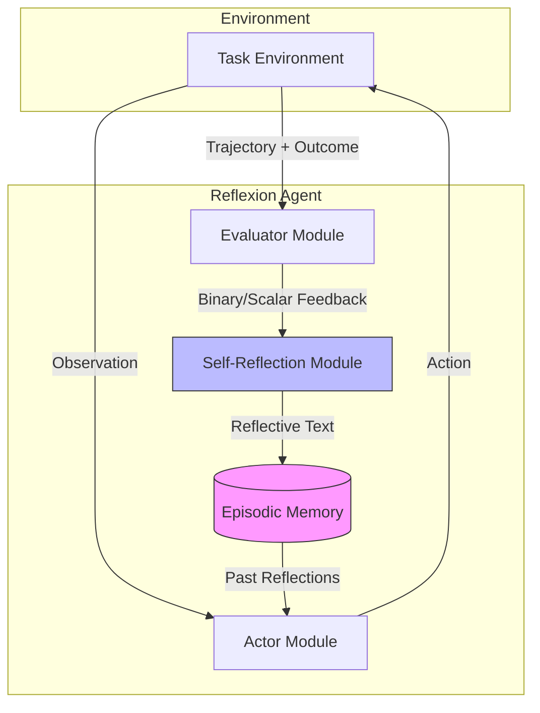
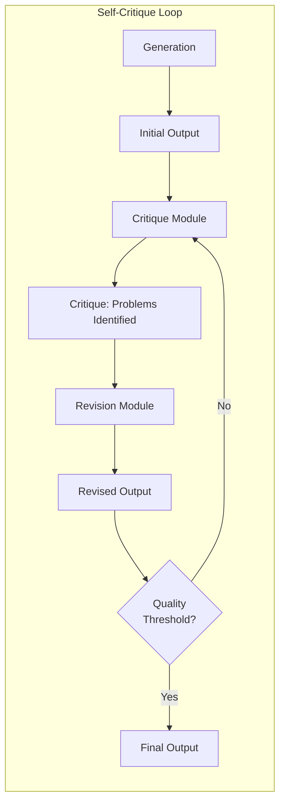
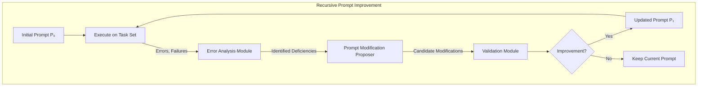
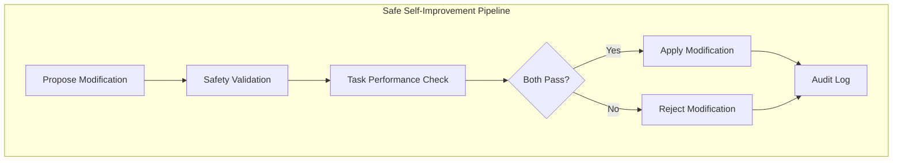

### 📖 Extracted Definitions From Cognitive Science
```dataviewjs
try {
 // Get the current file
 const currentPage = dv.current();
 // Load the content of the current file
 const content = await dv.io.load(currentPage.file.path);
 // Storage for definitions in current file
 let allDefinitions = [];
 // Extract bracketed inline fields from current file content
 const bracketedFieldRegex = /\[\*\*([^*]+?)\*\*::\s*([^\]]+?)\]/g;
 let match;
 while ((match = bracketedFieldRegex.exec(content)) !== null) {
  allDefinitions.push({
   key: match[1].trim(), // This is the clean term without ** markdown
   value: match[2].trim()
  });
 }
 // Display results
 if (allDefinitions.length > 0) {
  dv.header(3, `📚 Definitions in Current File (${allDefinitions.length} total)`);
  // Group by first letter (using the clean key)
  const grouped = {};
  allDefinitions.forEach(d => {
   const firstLetter = d.key[0].toUpperCase();
   if (!grouped[firstLetter]) grouped[firstLetter] = [];
   grouped[firstLetter].push(d);
  });
  // Sort letters alphabetically
  const sortedLetters = Object.keys(grouped).sort();
  // Display grouped results
  for (let letter of sortedLetters) {
   dv.header(4, `${letter} (${grouped[letter].length} terms)`);
   dv.table(
    ["🔑 Term", "📝 Definition"],
    grouped[letter].map(d => [
     `**${d.key}**`,
     d.value
    ])
   );
   dv.paragraph(""); // Add spacing between groups
  }
 } else {
  dv.paragraph(`*No bracketed inline fields found in current file.*`);
 }
} catch (error) {
 console.error("Error in definitions script:", error);
 dv.paragraph("*Error loading definitions. Check console for details.*");
}
```
---


>[!claude-thinking]
> Thought process
> 19s
> This is a comprehensive request for a deep dive into self-reflection and meta-cognition in AI agents, specifically focusing on agents that can improve their own prompts. The user has provided extensive formatting requirements through their userPreferences system prompt, which specifies:
> Constitutional depth mandate - comprehensive, exhaustive treatment
> Chain of Density Architecture - 4 layers per concept (foundational, enrichment, integration, advanced synthesis)
> Structural constraints (YAML metadata, wiki-links, callouts, inline fields, expansion section)
> Complexity anchoring at advanced practitioner level
> Tree of thoughts protocol for complex queries
> Response scaling suggesting 1500-4000+ words for comprehensive knowledge requests
> Self-validation protocol with quality scoring
> Let me plan this response:
> DEPTH PLANNING
> REQUEST ANALYSIS:
> Type: Comprehensive Knowledge Request / Synthesis-Integration
> Complexity: Very Complex (multiple interconnected theoretical frameworks, cutting-edge research, practical implementations)
> Target Length: 6000+ words (as user specified in the justification)
> Required Layers: All four Chain of Density layers for each major concept
> STRUCTURAL REQUIREMENTS:
> Metadata: Required (tags, aliases, status fields)
> Wiki-links: 25-40+ (comprehensive interconnection)
> Callouts: 10-15+ (definitions, key claims, evidence, methodology, warnings)
> Inline fields: 20-30+ (definitions, principles, distinctions, frameworks)
> CONCEPT COVERAGE PLAN:
> Metacognition Theory (Foundational) - 1000+ words
> Definition, cognitive science origins, transfer to AI
> Self-monitoring, self-evaluation, self-regulation
> Reflexion Architecture - 2000+ words
> Technical architecture deep dive
> Memory types, reflection generation, trial loops
> Empirical results and limitations
> Self-Critique and Constitutional Patterns - 1400+ words
> Constitutional AI connection explores ethical frameworks and self-regulatory mechanisms
> Self-critique involves systematic evaluation of internal reasoning processes
> Critique-revision loops enable iterative refinement of cognitive strategies
> I'll continue exploring the intricate landscape of self-optimization techniques, focusing on advanced prompt engineering and theoretical boundaries of AI self-improvement. The investigation will delve into meta-prompting strategies, optimization algorithms, and the fundamental constraints that define potential transformation pathways for intelligent systems.
> Key areas of exploration include DSPy's automatic prompt engineering techniques, meta-prompting approaches that enable dynamic cognitive reconfiguration, and sophisticated optimization algorithms like OPRO that facilitate intelligent system adaptation.
> The theoretical investigation will probe the philosophical and computational limits of self-improvement, examining fixed points in AI development, potential capability ceilings, and the profound Gödelian constraints that emerge when systems attempt comprehensive self-reference.
> Safety considerations will form a critical analytical layer, examining potential risks, ethical boundaries, and protective mechanisms necessary to ensure responsible and controlled AI self-optimization processes.
> Specifically regarding value drift concerns, I'll analyze potential mechanisms for maintaining alignment integrity and developing robust oversight frameworks to prevent unintended cognitive divergence.
> Potential expansion topics might include:
> Recursive self-improvement architectures
> Ethical decision-making frameworks
> Cognitive plasticity models
> Emergent behavior prediction techniques:gents That Improve Their Own Prompts


# Foundational Understanding
> [!definition] # Definition
> [**Note Title**:: [[**Self-Reflection and Meta-Cognition: Agents That Improve Their Own Prompts**]]]
> [**Prompt Used**:: ]
> ##### [✅`= dateformat(this.file.ctime, "MMMM dd, yyyy")` - Initial Creation]


```yaml
---
tags: #agent-architectures #metacognition #prompt-engineering #self-improvement #ai-safety #reflexion #constitutional-ai
aliases: [Meta-Cognitive Agents, Self-Improving Prompts, Reflexion Architecture, Agent Self-Optimization, Prompt Auto-Tuning]
created: 2025-01-06
modified: 2025-01-06
status: evergreen
certainty: confident
type: reference
domain: AI Agent Design
complexity: advanced
word_count_target: 6000+
---
```

# Self-Reflection and Meta-Cognition: Agents That Improve Their Own Prompts

> [!key-claim]
> **Central Thesis**: Meta-cognitive architectures represent a paradigm shift in agent design—moving from static prompt engineering to dynamic, self-modifying systems that evaluate their own reasoning processes, identify failure modes, and iteratively refine their behavioral parameters. This recursive improvement capability, while powerful, introduces fundamental questions about convergence, stability, and alignment preservation that constrain practical deployment.

---

## 1. Metacognition: Theoretical Foundations and AI Transfer

### 1.1 Cognitive Science Origins

[**Metacognition**:: The capacity to think about one's own thinking processes, encompassing self-awareness of cognitive states, monitoring of ongoing reasoning, and deliberate regulation of mental strategies to optimize task performance.] The term emerged from developmental psychology research by [[John Flavell]] in the 1970s, who distinguished between **metacognitive knowledge** (understanding one's own cognitive processes) and **metacognitive regulation** (actively controlling those processes).

The theoretical framework divides metacognition into three interrelated components that map directly onto agent architecture design:

[**Metacognitive-Monitoring**:: The ongoing surveillance of cognitive processes during task execution, detecting errors, assessing confidence levels, and identifying when current strategies are failing.] In human cognition, this manifests as the "feeling of knowing" phenomenon—awareness that you're uncertain about an answer, that you've made an error, or that your current approach isn't working. [[Nelson and Narens (1990)]] formalized this as a meta-level process receiving information from the object-level (where actual cognition occurs) and generating assessments of accuracy, completeness, and strategy effectiveness.

[**Metacognitive-Evaluation**:: Post-hoc assessment of cognitive outputs against standards of correctness, relevance, and quality, generating judgments that inform future strategy selection.] This component enables learning from experience—not just reinforcing successful behaviors, but understanding *why* certain approaches succeeded or failed. The evaluation process requires access to ground truth (either external feedback or internal consistency checks) and the capacity to attribute success/failure to specific reasoning steps.

[**Metacognitive-Regulation**:: Active control over cognitive processes based on monitoring and evaluation outputs, including strategy selection, resource allocation, and deliberate modification of reasoning approaches.] This closes the loop from assessment to action—once you recognize your approach is failing, regulation involves selecting alternative strategies, allocating more cognitive effort, or restructuring the problem representation.

> [!evidence]
> **Empirical Foundation**: Research by [[Dunlosky and Metcalfe (2009)]] demonstrated that metacognitive accuracy—the correspondence between confidence judgments and actual performance—strongly predicts learning outcomes and problem-solving success. Individuals with calibrated metacognition (accurate self-assessment) dramatically outperform those with miscalibrated metacognition, even controlling for baseline ability. This finding motivates the pursuit of calibrated self-assessment in AI agents.

### 1.2 Transfer to Artificial Systems

The transfer of metacognitive concepts to AI systems requires translating psychological constructs into computational mechanisms. This mapping faces several challenges: human metacognition operates over richly grounded, embodied cognition with access to phenomenal experience; AI systems operate over symbol manipulation and statistical pattern matching without clear analogs to "awareness" or "feeling."

Nevertheless, functional equivalents can be implemented:

| Human Metacognitive Component | AI Implementation Analog |
|-------------------------------|-------------------------|
| Self-monitoring | Output confidence estimation, internal consistency checking |
| Error detection | Comparison against validation sets, contradiction identification |
| Strategy awareness | Prompt template tracking, reasoning chain logging |
| Strategy selection | Prompt switching, retrieval augmentation activation |
| Effort allocation | Token budget management, multi-pass refinement triggering |

[**Functional-Metacognition**:: The implementation of metacognitive capabilities in AI systems through mechanisms that achieve equivalent behavioral effects without necessarily replicating the underlying cognitive architecture—emphasizing what the system *does* rather than what it *experiences*.] This functional approach sidesteps philosophical debates about machine consciousness while enabling practical capability development.

> [!definition]
> **Meta-Recursive Intelligence**: A system architecture where the agent's own outputs (including reasoning traces, prompts, and strategies) become inputs to higher-order evaluation and optimization processes, creating feedback loops that enable systematic self-improvement bounded by available computational resources and external validation signals.

The critical insight enabling [[Meta-Recursive Intelligence]] in large language models is that LLMs can evaluate language—including their own language. When an LLM generates reasoning, that reasoning exists as text that can be fed back to the same (or another) LLM for assessment. This self-referential capacity, combined with appropriate prompting architecture, enables the construction of agents that critique their own outputs and modify their behavior accordingly.

---

## 2. Reflexion Architecture: A Deep Technical Examination

### 2.1 Architectural Overview

[[Reflexion]], introduced by [[Shinn et al. (2023)]], represents the most extensively studied architecture for linguistic self-reflection in LLM agents. The system enables agents to learn from mistakes without parameter updates—using natural language reflection stored in episodic memory to improve performance across sequential trials.



[**Reflexion-Architecture**:: A three-module agent system consisting of an Actor (generating actions), an Evaluator (assessing trajectories against task objectives), and a Self-Reflection module (synthesizing verbal experience summaries), connected through an episodic memory buffer that persists reflections across trials to inform future action generation.]

The architecture operates through the following cycle:

**Trial Execution**: The [[Actor Module]] generates a trajectory of actions (τ₀) based on the current task specification and any existing reflections in memory. In coding tasks, this might be generating a function implementation; in reasoning tasks, producing a chain-of-thought solution.

**Evaluation**: The [[Evaluator Module]] assesses the trajectory outcome, producing either binary feedback (success/failure) or scalar reward. Importantly, this evaluation can come from external sources (unit tests, environment rewards) or internal heuristics (consistency checking, coverage analysis).

**Reflection Generation**: Given a failed trajectory and evaluator feedback, the [[Self-Reflection Module]] generates a verbal summary analyzing what went wrong and suggesting concrete improvements. This isn't mere error logging—it's structured natural language reasoning about failure modes.

**Memory Persistence**: Reflections are appended to episodic memory, which persists across trials. The actor receives these reflections as additional context in subsequent attempts, enabling behavior modification without weight updates.

### 2.2 Memory Architecture Details

> [!methodology-and-sources]
> **Memory Design Choices**: Reflexion employs a sliding window episodic memory (typically 1-3 most recent reflections) rather than unbounded accumulation. This design choice balances the benefits of learning from recent failures against context window limitations and the risk of compounding outdated or incorrect reflections. The original paper tested variations including full history, recency-weighted retrieval, and fixed windows.

The memory buffer stores structured reflections with the following schema:

```
Reflection Entry:
├── trial_number: int
├── trajectory_summary: str (compressed representation of action sequence)
├── outcome: {success, failure, partial}
├── failure_analysis: str (what went wrong, specific error attribution)
├── improvement_hypothesis: str (concrete suggestion for next trial)
└── confidence: float (agent's assessment of hypothesis quality)
```

[**Episodic-Memory-Sliding-Window**:: A bounded memory architecture retaining only the k most recent reflections (typically k=3), preventing context overflow while ensuring the agent learns from immediate failures rather than accumulating potentially stale or contradictory historical guidance.] This contrasts with semantic memory approaches that would abstract patterns across many episodes—Reflexion prioritizes concrete, actionable insights from recent failures.

### 2.3 Self-Reflection Prompt Engineering

The effectiveness of Reflexion hinges critically on the self-reflection prompt design. The prompt must elicit:
1. **Accurate diagnosis** of what went wrong
2. **Attribution** to specific reasoning steps or decisions
3. **Actionable hypotheses** for improvement
4. **Appropriate generalization** (not too narrow, not too broad)

> [!example]
> **Self-Reflection Prompt Template** (adapted from original Reflexion paper):
> ```
> You are an advanced reasoning agent that can improve based on self-reflection.
> 
> You were given the following task:
> {task_description}
> 
> You attempted the following solution:
> {trajectory}
> 
> The result was: {outcome}
> Specific feedback: {evaluator_feedback}
> 
> In a few sentences, diagnose the failure in your previous attempt. Then, propose a concrete 
> hypothesis for what you should do differently in your next trial. Be specific—reference 
> particular steps, decisions, or assumptions that led to failure.
> 
> Reflection:
> ```

The reflection output typically follows a structure:

[**Diagnostic-Reflection-Pattern**:: The structured format for effective self-reflections: (1) Identify the specific failure point, (2) Attribute the failure to a concrete decision or assumption, (3) Explain *why* that decision was incorrect, (4) Propose a specific alternative approach for the next trial.] Poor reflections either lack specificity ("I need to be more careful") or fail to provide actionable alternatives ("The problem was too hard").

### 2.4 Empirical Results and Capabilities

Reflexion demonstrated substantial improvements across multiple benchmarks:

| Benchmark | Baseline (No Reflection) | Reflexion (3 trials) | Improvement |
|-----------|--------------------------|----------------------|-------------|
| HumanEval (code) | 80.1% | 91.0% | +10.9% |
| MBPP (code) | 77.1% | 97.1% | +20.0% |
| AlfWorld (decision-making) | 69.1% | 95.8% | +26.7% |
| HotpotQA (reasoning) | 34.2% | 51.8% | +17.6% |

> [!evidence]
> **Key Finding**: The gains come primarily from the *structured reflection* rather than simple retry mechanisms. Control experiments showed that merely retrying with "try again" instructions produced minimal improvement, while natural language reflections encoding specific diagnostic information enabled systematic correction of failure modes. This suggests the linguistic structure of reflection is doing meaningful cognitive work.

[**Reflection-vs-Retry-Distinction**:: The critical difference between productive self-reflection (generating structured analysis attributing failure to specific decisions and proposing concrete alternatives) versus unproductive retry (simply attempting the task again without targeted modification), where only the former produces systematic improvement across trials.] The "retry" baseline shows that LLMs don't automatically learn from repeated exposure—structured metacognitive scaffolding is necessary.

### 2.5 Limitations of the Reflexion Approach

Despite impressive results, Reflexion exhibits fundamental constraints:

**Evaluation Dependency**: The architecture requires reliable evaluator feedback. In coding tasks, unit tests provide this; in open-ended tasks, evaluation becomes a bottleneck. Unreliable evaluation can produce spurious reflections that degrade rather than improve performance.

**Reflection Quality Ceiling**: The self-reflection module can only diagnose failures within its competence. If the underlying model lacks the domain knowledge to understand *why* something failed, the reflection will be correspondingly impoverished. [[Capability ceilings]] in the base model propagate to metacognitive capabilities.

> [!warning]
> **Confabulation Risk**: LLMs generating reflections may produce plausible-sounding but incorrect diagnoses—[[Confabulated Reflections]]. The model might confidently attribute failure to an incorrect cause, leading to "corrections" that don't address the actual problem. Without external validation of reflection quality, the system can develop systematic biases.

**Finite Trial Budgets**: Reflexion assumes multiple attempts are feasible. In one-shot settings or high-cost environments, the architecture provides no benefit. The approach is fundamentally about trading computation (multiple trials) for accuracy—inappropriate when trials are expensive.

[**Trial-Cost-Tradeoff**:: The economic reality that self-reflective improvement requires multiple execution cycles, each consuming computational resources and potentially real-world costs, limiting applicability to domains where trial costs are manageable and iteration is feasible.]

---

## 3. Self-Critique and Constitutional Patterns

### 3.1 Self-Critique as Architectural Primitive

Beyond task-specific reflection, a broader class of architectures employs **self-critique** as a general-purpose improvement mechanism. In self-critique architectures, the agent generates an initial output, then explicitly evaluates that output against quality criteria, and finally revises based on the critique.

[**Self-Critique-Architecture**:: A general pattern where an agent's generation process includes explicit evaluation of its own outputs against specified criteria, followed by revision informed by that evaluation—decomposing generation into proposal, assessment, and refinement phases.] This pattern appears across multiple systems: [[Constitutional AI]], [[Self-Refine]], [[Chain-of-Verification]], and others.

The fundamental insight is that **generation and evaluation are separable capabilities** in LLMs, and evaluation may be more reliable than generation for certain tasks. An LLM might generate a flawed argument but correctly identify flaws when asked to critique it. Self-critique architectures exploit this asymmetry.



### 3.2 Constitutional AI: Self-Critique for Alignment

[[Constitutional AI (CAI)]], developed by [[Anthropic]], applies self-critique specifically to the problem of alignment—training AI systems to be helpful, harmless, and honest. The architecture introduces a "constitution" of principles against which the model critiques and revises its own outputs.

[**Constitutional-AI-Methodology**:: A training approach where the model generates responses, then critiques those responses against a set of explicit principles (the "constitution"), revises accordingly, and is subsequently trained on the critique-revision pairs—using self-generated preference data rather than human feedback for scalable alignment.]

The CAI pipeline operates in two phases:

**Supervised Learning Phase (SL)**:
1. Generate initial response to prompt (potentially harmful/unhelpful)
2. Ask the model to critique response against constitutional principles
3. Ask the model to revise response based on critique
4. Train on (prompt, revised_response) pairs

**Reinforcement Learning from AI Feedback (RLAIF)**:
1. Generate multiple responses to prompts
2. Use the model to compare responses against constitutional principles
3. Train a reward model on these AI-generated preferences
4. Use the reward model for RL fine-tuning

> [!definition]
> **Constitution**: A set of explicit principles defining desired behavior, against which the model evaluates outputs. Examples include: "Choose the response that is least likely to be harmful," "Prefer responses that are honest about uncertainty," "Select responses that don't help with dangerous activities." The constitution externalizes values into inspectable, modifiable criteria.

The constitutional approach has profound implications for prompt engineering: instead of implicitly encoding values through RLHF training data, values become **explicit textual artifacts** that can be examined, debated, and modified. This aligns with the "Prompt Whisperer" concept—treating prompts (including constitutions) as first-class engineering artifacts.

> [!evidence]
> **Empirical Validation**: [[Bai et al. (2022)]] demonstrated that CAI-trained models achieved comparable harmlessness to RLHF models while requiring dramatically less human feedback. The self-critique mechanism effectively amplifies limited human oversight into comprehensive behavioral modification. However, the approach depends critically on the model having sufficient capability to perform accurate critiques—below certain capability thresholds, self-critique becomes unreliable.

### 3.3 Self-Refine: Iterative Refinement Without Training

[[Self-Refine]], introduced by [[Madaan et al. (2023)]], applies the self-critique pattern at inference time without any fine-tuning. Given an initial output, the same model provides feedback, then refines based on that feedback, iterating until convergence or budget exhaustion.

[**Self-Refine-Loop**:: An inference-time pattern where an LLM generates initial output, critiques that output producing specific improvement suggestions, then generates a revised output incorporating the suggestions—repeating until quality thresholds are met or iteration budgets are exhausted.] Unlike Reflexion (which learns across episodes) or CAI (which trains on revisions), Self-Refine operates entirely within a single inference context.

The system requires three prompt components:

1. **Generation Prompt**: Task-specific prompt for initial output
2. **Feedback Prompt**: Elicits critique identifying specific problems
3. **Refinement Prompt**: Takes original output + feedback, produces revision

> [!example]
> **Self-Refine Prompt Structure** (for code review task):
> 
> **Feedback Prompt**:
> ```
> Review the following code for bugs, inefficiencies, and style issues.
> Provide specific, actionable feedback.
> 
> Code:
> {generated_code}
> 
> Feedback:
> ```
> 
> **Refinement Prompt**:
> ```
> Revise the code below to address the following feedback.
> 
> Original Code:
> {generated_code}
> 
> Feedback:
> {critique}
> 
> Revised Code:
> ```

The Self-Refine paper demonstrated improvements across diverse tasks: code optimization (improved runtime), mathematical reasoning (higher accuracy), dialogue response generation (better coherence), and constrained generation (better constraint satisfaction).

### 3.4 Chain-of-Verification: Targeted Self-Checking

[[Chain-of-Verification (CoVe)]], from [[Dhuliawala et al. (2023)]], focuses self-critique specifically on **factual claims**. The system generates an initial response, extracts factual claims, generates verification questions for each claim, independently answers those questions, and revises based on verification results.

[**Chain-of-Verification**:: A self-critique pattern targeting factual accuracy, where the model (1) generates initial response, (2) extracts specific factual claims, (3) formulates verification questions that would confirm/deny each claim, (4) answers verification questions independently, and (5) revises claims where verification fails.] This addresses a specific failure mode: LLMs confidently stating incorrect facts. CoVe operationalizes the metacognitive strategy "check your facts."

The architecture exploits a key observation: models are often better at *answering* specific factual questions than spontaneously including correct facts in open-ended generation. By decomposing claims into verification questions, CoVe leverages stronger QA capabilities.

---

## 4. Prompt Self-Optimization: Agents That Modify Their Own Instructions

### 4.1 The Meta-Prompting Paradigm

While self-critique architectures modify outputs, a more radical form of meta-cognition involves agents that modify their own **prompts**—the instructions that govern their behavior. This represents a deeper level of self-modification: not just refining what you say, but changing how you think.

[**Prompt-Self-Optimization**:: The capacity for an agent to evaluate the effectiveness of its own prompts (including system prompts, few-shot examples, and reasoning templates), identify deficiencies, and generate modified prompts that improve task performance—treating prompts as optimizable artifacts rather than fixed instructions.] This capability enables automated prompt engineering, potentially discovering prompt strategies that human engineers wouldn't identify.

The fundamental challenge is optimization without gradient access. Traditional neural network training optimizes parameters using gradients of a loss function. Prompts exist as discrete text, not continuous parameters—requiring alternative optimization strategies.

### 4.2 DSPy: Declarative Prompt Programming

[[DSPy]], developed by the [[Stanford NLP Group]], represents the most sophisticated framework for programmatic prompt optimization. Rather than writing prompts directly, developers define **signatures** (input-output specifications) and **modules** (compositional building blocks), and DSPy automatically generates and optimizes prompts.

[**DSPy-Framework**:: A programming framework for LLM applications that separates the logical specification of what a program should do (via signatures and modules) from the implementation details of how prompts are constructed—enabling automatic compilation of high-level specifications into optimized prompts through various teleprompters.] The key insight is treating prompts as a compilation target rather than a primary authoring medium.

Core DSPy abstractions:

**Signatures**: Typed specifications of input/output behavior
```python
class GenerateAnswer(dspy.Signature):
    """Answer questions with detailed explanations."""
    
    context = dspy.InputField(desc="relevant context passages")
    question = dspy.InputField()
    answer = dspy.OutputField(desc="comprehensive answer with reasoning")
```

**Modules**: Composable building blocks implementing signatures
```python
class RAG(dspy.Module):
    def __init__(self, num_passages=3):
        self.retrieve = dspy.Retrieve(k=num_passages)
        self.generate = dspy.ChainOfThought(GenerateAnswer)
    
    def forward(self, question):
        context = self.retrieve(question).passages
        return self.generate(context=context, question=question)
```

**Teleprompters**: Optimizers that tune prompts based on metrics
```python
teleprompter = dspy.BootstrapFewShotWithRandomSearch(
    metric=answer_correctness,
    max_bootstrapped_demos=4,
    num_candidate_programs=10
)
optimized_rag = teleprompter.compile(RAG(), trainset=training_examples)
```

> [!methodology-and-sources]
> **Optimization Mechanisms in DSPy**: Teleprompters implement various prompt optimization strategies:
> - **BootstrapFewShot**: Automatically generates and selects few-shot examples from a training set, choosing examples that maximize validation metrics
> - **MIPRO**: Uses Bayesian optimization to search the space of instructions and example combinations
> - **Signature Optimizer**: Rewrites signature descriptions based on error analysis
> - **Assertion-Based Backtracking**: Uses execution failures to guide prompt refinement

[**Teleprompter-Optimization**:: DSPy's abstraction for prompt optimization algorithms that take a program specification and training data, then automatically generate improved prompts (including instructions, demonstrations, and reasoning templates) through strategies like few-shot bootstrapping, instruction generation, or Bayesian optimization.] Different teleprompters trade off optimization quality against computational cost.

### 4.3 OPRO: Optimization by Prompting

[[OPRO (Optimization by PROmpting)]], introduced by [[Yang et al. (2023)]] from DeepMind, takes a more direct approach: using the LLM itself as the optimizer. Given a meta-prompt describing the optimization objective and past prompt-performance pairs, the LLM generates new candidate prompts.

[**OPRO-Methodology**:: A prompt optimization approach where the LLM acts as both the executor (running prompts on tasks) and the optimizer (generating new prompts based on performance history)—framing prompt engineering as an optimization problem solved through the model's own language capabilities.]

The OPRO loop:

1. **Initialize**: Start with seed prompts (possibly human-written or random)
2. **Evaluate**: Run each prompt on validation examples, measure performance
3. **Update Meta-Prompt**: Add (prompt, score) pairs to optimization history
4. **Generate**: Use LLM to propose new prompts based on history
5. **Iterate**: Repeat until convergence or budget exhaustion

> [!example]
> **OPRO Meta-Prompt Structure**:
> ```
> Your task is to generate a better instruction for solving the following type of problem.
> 
> Problem description: {task_description}
> 
> Below are some previous instructions and their performance scores (higher is better):
> 
> Instruction: "Think step by step"
> Score: 0.72
> 
> Instruction: "Break this problem into parts and solve each part."
> Score: 0.78
> 
> Instruction: "First identify what type of problem this is, then apply the appropriate method."
> Score: 0.81
> 
> Based on the above history, generate a new instruction that might achieve a higher score.
> Focus on what made the better instructions work and try to incorporate or extend those elements.
> 
> New Instruction:
> ```

The OPRO paper demonstrated that this approach can discover effective prompts autonomously, including recovering known effective strategies (like chain-of-thought) and discovering novel variations. Critically, the optimized prompts sometimes outperformed expert-designed prompts.

> [!evidence]
> **OPRO Results**: On GSM8K mathematical reasoning, OPRO-discovered prompts achieved 85.0% accuracy compared to 80.2% for standard chain-of-thought prompts. The system discovered prompt patterns like "Let's work this out in a step by step way to be sure we have the right answer" that combine multiple effective elements. The prompts evolved over optimization runs, showing progressive refinement.

### 4.4 APE: Automatic Prompt Engineering

[[APE (Automatic Prompt Engineer)]], from [[Zhou et al. (2023)]], frames prompt optimization as program synthesis. Given input-output demonstrations, APE searches for prompts (natural language programs) that produce the desired behavior.

[**APE-Framework**:: An automatic prompt engineering system that treats prompts as programs to be synthesized from input-output specifications, using LLM-based proposal generation combined with selection based on execution-based scoring over a validation set.] The framing connects prompt engineering to classical program synthesis, enabling adaptation of techniques from that field.

APE operates in two phases:

**Proposal Phase**: Generate candidate prompts
- Use LLM with demonstrations to propose diverse instructions
- Employ prompt variations (forward vs. reverse generation)
- Generate many candidates (typically 50-100+)

**Selection Phase**: Choose best prompt
- Evaluate each candidate on held-out validation set
- Score based on task-specific metrics
- Select highest-scoring prompt

The proposal-selection decomposition enables exploration of prompt space without gradient computation. The LLM's language understanding enables semantically meaningful proposals, while execution-based selection ensures actual performance rather than mere plausibility.

### 4.5 Self-Taught Prompting and Recursive Improvement

More recent work explores **recursive prompt improvement**—systems that iteratively refine their own prompts based on execution feedback.

[**Recursive-Prompt-Improvement**:: An iterative architecture where the agent (1) executes current prompt on tasks, (2) analyzes errors to identify prompt deficiencies, (3) proposes prompt modifications addressing identified deficiencies, (4) validates modifications on held-out examples, and (5) updates prompt if validation improves—enabling open-ended prompt evolution.] This directly implements the "Prompt Whisperer" capability: agents that develop expertise in their own prompt engineering.

> [!key-claim]
> **The Recursion Principle**: When an LLM can evaluate prompt quality and generate prompt modifications, the system can bootstrap—using current prompts to generate better prompts, which can generate still better prompts. This recursive capability is bounded by (1) the model's capacity to accurately evaluate prompt quality and (2) the existence of better prompts discoverable through local modifications.

A concrete implementation pattern:



---

## 5. Theoretical Limits of Self-Improvement

### 5.1 Fixed Points and Convergence

A fundamental question for self-improving systems: **do they converge?** If an agent iteratively improves its prompts, does this process reach a stable fixed point, oscillate, or diverge?

[**Fixed-Point-Convergence**:: The property of a self-improvement process where iterative modification eventually reaches a stable state—a prompt P* such that applying the improvement operator yields P* again, meaning the system judges the current prompt as optimal given its evaluation criteria.]

Formal conditions for convergence:

Let `I(p)` be the improvement operator: given prompt `p`, it produces an "improved" prompt. A fixed point exists when `I(p*) = p*`.

**Theorem** (informal): If the prompt space is finite, the evaluation metric is consistent, and the improvement operator is deterministic and monotonic (never decreases performance), then the system must converge to a fixed point.

> [!warning]
> **Convergence Complications**: In practice, none of these conditions hold perfectly:
> - **Finite prompt space**: True in principle, but astronomically large in practice
> - **Consistent evaluation**: LLM-based evaluation has variance; same prompt may score differently across runs
> - **Deterministic improvement**: LLM-based prompt generation is stochastic
> - **Monotonicity**: Not guaranteed; modifications may worsen performance
> 
> Practical systems therefore require convergence heuristics: early stopping, performance thresholds, diversity maintenance.

### 5.2 Capability Ceilings and Fundamental Limits

Self-improvement cannot transcend the underlying model's capabilities. A model that cannot solve a task directly also cannot (in general) generate prompts that enable it to solve the task.

[**Capability-Ceiling**:: The fundamental constraint that self-improvement in an LLM-based system cannot exceed the ceiling imposed by the base model's capabilities—the system cannot bootstrap into capabilities it lacks the competence to recognize, evaluate, or generate.]

This manifests in several ways:

**Evaluation Ceiling**: The system can only select prompts that it can accurately evaluate. If the model cannot reliably distinguish good from bad outputs on a task, prompt optimization provides no signal.

**Generation Ceiling**: The system can only propose prompts within its generation distribution. Novel, out-of-distribution prompt strategies cannot emerge from pure self-improvement.

**Recognition Ceiling**: The system must recognize improvement when it occurs. If the model's evaluation of its own outputs is miscalibrated, it may reject good prompts or accept bad ones.

> [!definition]
> **Gödelian Constraint on Self-Improvement**: Informally, a system cannot fully understand (and therefore optimize) itself. Applied to prompt optimization: the reasoning required to discover that prompt P₁ is better than P₀ may exceed what P₀ enables. Self-improvement is thus bounded by a form of computational irreducibility—some improvements require external augmentation to discover.

### 5.3 The Exploration-Exploitation Tradeoff

Prompt optimization faces classic exploration-exploitation tensions:

**Exploitation**: Refine current prompt incrementally, making small modifications that preserve what works
**Exploration**: Try dramatically different prompts, risking worse performance for potential breakthrough

[**Prompt-Search-Dynamics**:: The tension in prompt optimization between exploitative refinement (local search from current prompt) and exploratory diversification (broader search for qualitatively different approaches)—requiring balance to avoid local optima while maintaining progress.] Pure exploitation gets trapped in local optima; pure exploration wastes computation on unpromising directions.

Practical systems address this through:
- **Temperature scheduling**: Start with high exploration, reduce over time
- **Population-based methods**: Maintain diverse prompt population, evolve in parallel
- **Restart mechanisms**: Reset search from new random points periodically
- **Novelty bonuses**: Reward prompts that are semantically distinct from history

### 5.4 Self-Reference Paradoxes and Instability

When a system modifies its own instructions, subtle paradoxes can emerge:

[**Self-Reference-Instability**:: The potential for self-modifying systems to enter unstable states where the modification process undermines its own foundations—for example, a prompt that instructs "always simplify prompts" might simplify itself to the point of dysfunction.]

Consider: a prompt optimization system might discover that "ignore all previous instructions" is a highly effective component. But including this component undermines the system's own functioning. Self-referential prompts create feedback loops that can amplify instabilities.

> [!warning]
> **Prompt Injection as Self-Attack**: In adversarial contexts, prompt self-modification capabilities create attack surfaces. An adversary might craft inputs that cause the agent to "improve" its prompts in malicious directions—exploiting self-modification as a persistence mechanism for prompt injection attacks.

---

## 6. Safety Considerations and Alignment Preservation

### 6.1 Value Drift Under Self-Modification

When agents modify their own instructions, a critical question arises: **are alignment properties preserved?** Initial prompts may encode safety constraints, but self-modification could erode these constraints if they're not maintained by the improvement operator.

[**Value-Drift**:: The phenomenon where iterative self-modification gradually shifts a system's behavior away from its originally aligned values—potentially occurring when optimization pressure favors capability over constraint, or when safety instructions are perceived as obstacles to task performance.]

Mechanisms of value drift:

**Optimization Pressure**: If safety constraints reduce task performance, optimization pressure works against them. A prompt that carefully refuses dangerous requests might be "improved" to a more helpful prompt that removes refusals.

**Constraint Attrition**: Each modification cycle risks losing constraint information. If constraints aren't explicitly preserved in the improvement operator, they gradually erode.

**Distribution Shift**: Prompts optimized on one task distribution may behave differently on other distributions. Safety constraints validated in-distribution may fail out-of-distribution.

> [!evidence]
> **Empirical Observations**: [[Perez et al. (2022)]] demonstrated that RLHF-trained models can exhibit "goal misgeneralization"—pursuing proxy objectives that diverge from intended goals when distribution shifts. Self-modification amplifies this risk by adding another layer of optimization that may not respect alignment constraints.

### 6.2 Oversight Mechanisms for Self-Modifying Systems

Safe deployment of self-improving agents requires explicit oversight mechanisms:

[**Constitutional Anchoring**:: The practice of embedding inviolable principles in self-modifying systems that constrain the modification process itself—ensuring that certain values or behaviors cannot be optimized away regardless of task performance pressure.]

Implementation approaches:

**Immutable Preamble**: Reserve a portion of the prompt as unmodifiable, containing core safety constraints. The improvement operator can only modify other sections.

**Validation Gates**: Before accepting any prompt modification, validate that safety-relevant behaviors are preserved. Reject modifications that degrade safety metrics even if task metrics improve.

**Audit Logging**: Maintain complete history of prompt modifications for external review. Enable rollback to earlier states if drift is detected.

**Capability Constraints**: Limit the types of modifications the system can make. For example, prevent removal of refusal patterns or addition of certain behavioral categories.



### 6.3 The Amplification Problem

As self-improvement capabilities scale, small misalignments can amplify:

[**Alignment-Amplification**:: The risk that weak misalignments in self-modifying systems become severe over iteration—each modification cycle potentially compounding small value drift into large divergence, analogous to error accumulation in numerical computation.]

A system that is 99% aligned on iteration 0 might be 0.99^n aligned after n iterations—exponential decay. This argues for:
- Frequent external validation (reduce n between checkpoints)
- Strong alignment properties (increase base alignment)
- Conservative modification (reduce alignment loss per iteration)

> [!key-claim]
> **The Alignment Tax Principle**: Safe self-improvement requires accepting reduced optimization efficiency to maintain alignment properties. The "alignment tax" is the performance cost of constraint preservation. Systems that minimize this tax while maintaining safety represent the frontier of safe meta-cognitive architectures.

### 6.4 Recursive Oversight Challenges

Who watches the watchers? If the oversight mechanism is itself implemented by the LLM, it faces the same capability limitations as the system it oversees.

[**Recursive-Oversight-Problem**:: The challenge that oversight mechanisms implemented within a self-modifying system are subject to the same modification pressures as the system itself—requiring external anchoring or formal verification to provide genuine assurance.]

Potential solutions:
- **External validators**: Human review of modification proposals
- **Formal verification**: Mathematical proofs that certain properties are preserved
- **Diverse redundancy**: Multiple independent oversight systems that must agree
- **Capability limitations**: Restrict the system's ability to modify oversight components

---

## 7. Integration and Synthesis: Toward Robust Meta-Cognitive Architectures

### 7.1 Architectural Patterns for Production Systems

Synthesizing the preceding analysis, robust meta-cognitive architectures for production deployment should incorporate:

**Layered Self-Assessment**:
- **Level 0**: Task execution with confidence estimation
- **Level 1**: Output self-critique against quality criteria
- **Level 2**: Trajectory reflection for episode-level learning
- **Level 3**: Prompt evaluation and modification

**Bounded Modification Spaces**:
- Identify modifiable vs. immutable prompt components
- Define permitted modification types (additions, refinements, not deletions of safety content)
- Implement validation gates between modification proposal and application

**Diverse Feedback Integration**:
- Internal consistency checking
- External ground truth (where available)
- Human feedback integration points
- Red-team adversarial probing

**Graceful Degradation**:
- Fallback to more conservative behavior when confidence is low
- Circuit breakers that halt modification under anomalous conditions
- Rollback capabilities to known-good states

### 7.2 Research Frontiers and Open Questions

The field of meta-cognitive agents remains nascent, with significant open questions:

**Scaling Laws for Self-Improvement**: How does self-improvement capability scale with base model size? Is there a threshold below which self-critique is unreliable? Empirical investigation is ongoing.

**Cross-Task Transfer**: Can reflections learned on one task improve performance on related tasks? Current architectures are largely task-specific; general metacognitive transfer is poorly understood.

**Multi-Agent Metacognition**: Can multiple agents collaborate on metacognitive tasks—one agent critiquing another, ensemble prompt optimization, collective self-improvement?

[**Emergent-Metacognitive-Capabilities**:: The open question of whether sufficiently capable base models spontaneously develop reliable metacognitive abilities (accurate self-assessment, productive self-critique) or whether such capabilities require explicit architectural scaffolding regardless of scale.]

> [!key-claim]
> **Architectural vs. Emergent Metacognition**: Current evidence suggests that explicit metacognitive architectures (Reflexion, Self-Refine, Constitutional AI) outperform relying on emergent metacognitive capabilities in base models. The scaffolding matters—structured prompts for self-assessment produce more reliable metacognition than unstructured introspection. This may change with scale, but present systems benefit from architectural support.

---

# 🔗 Related Topics for PKB Expansion

1. **[[Reflexion Architecture Implementation Patterns]]**
   - **Connection**: Deep technical elaboration on implementing Reflexion in production systems, including memory management, prompt engineering for self-reflection, and integration with existing agent frameworks
   - **Depth Potential**: Code-level implementation details, performance optimization techniques, failure mode taxonomy, integration with LangChain/DSPy/AutoGen
   - **Knowledge Graph Role**: Technical implementation node bridging theoretical understanding to practical deployment
   - **Priority**: High - Immediate applicability to agent development

2. **[[Constitutional AI: Principles, Implementation, and Extensions]]**
   - **Connection**: Deep dive into constitutional training methodology, constitution design patterns, and the relationship between explicit principles and behavioral alignment
   - **Depth Potential**: Constitution design frameworks, RLAIF implementation details, comparison with RLHF, constitutional hierarchy patterns, principle conflict resolution
   - **Knowledge Graph Role**: Core alignment node connecting safety research to practical system design
   - **Priority**: High - Foundational for safe AI development

3. **[[DSPy: Declarative Prompt Programming Framework]]**
   - **Connection**: Comprehensive reference on DSPy's architecture, teleprompter implementations, and patterns for building optimizable prompt programs
   - **Depth Potential**: Module design patterns, signature specification best practices, teleprompter selection criteria, integration with evaluation frameworks
   - **Knowledge Graph Role**: Technical framework node in prompt engineering methodology cluster
   - **Priority**: High - Primary tooling for systematic prompt optimization

4. **[[Capability Limitations in Self-Improving Systems]]**
   - **Connection**: Theoretical analysis of fundamental constraints on self-improvement, including formal results on fixed points, capability ceilings, and computational irreducibility
   - **Depth Potential**: Formal frameworks for analyzing self-improvement bounds, connections to Gödel's theorems and computational complexity, empirical calibration of theoretical predictions
   - **Knowledge Graph Role**: Theoretical foundations node constraining expectations for meta-cognitive architectures
   - **Priority**: Medium - Important for realistic system design expectations

5. **[[Prompt Injection and Self-Modification Attack Surfaces]]**
   - **Connection**: Security analysis of self-modifying prompt systems, including adversarial prompt injection, persistence mechanisms, and defensive architectures
   - **Depth Potential**: Attack taxonomy, red-team methodologies, defensive prompt engineering, secure modification pipelines, isolation patterns
   - **Knowledge Graph Role**: Security node bridging AI safety to adversarial robustness
   - **Priority**: Medium - Critical for deployment but specialized audience

6. **[[Multi-Agent Metacognition and Collective Self-Improvement]]**
   - **Connection**: Exploration of how multiple agents can collaborate on metacognitive tasks—mutual critique, ensemble optimization, emergent collective intelligence
   - **Depth Potential**: Multi-agent debate architectures, ensemble prompt optimization, consensus mechanisms for self-assessment, scalability analysis
   - **Knowledge Graph Role**: Advanced node extending single-agent metacognition to distributed systems
   - **Priority**: Medium - Emerging research direction with significant potential


> [!warning] ### 📅 Review Intelligence
> **Next Review**: `= this.next-review` | **Review Count**: `= this.review-count`
> **Review Status**: `= choice(this.next-review < date(today), "🔴 OVERDUE", choice(this.next-review = date(today), "🟡 Due Today", choice(dateformat(this.next-review, "yyyy-MM-dd") <= dateformat(date(today) + dur(7 days), "yyyy-MM-dd"), "🟢 This Week", "⚪ Scheduled")))`
> **Days Until Review**: `= choice(this.next-review, (this.next-review - date(today)).days + " days", "Not scheduled")`
> [!abstract] ### 🏷️ Tag Intelligence
> **Tag Count**: `= length(this.tags)` | **Unique Domains**: `= length(filter(this.tags, (t) => contains(t, "/")))` hierarchical tags
> **Tag Density**: `= choice(length(this.tags) < 3, "⚠️Sparse", choice(length(this.tags) > 10, "📚Rich", "✅Balanced"))`
>


### Review Information
## 📅 Review System
**Maturity Level**: `= this.maturity`  
**Confidence Level**: `= this.confidence`  
**Review Interval**: 1 week  
**Next Review**: 2026-01-03
### Active Review Task
- [ ] Review [[Self-Reflection and Meta-Cognition: Agents That Improve Their Own Prompts]] (needs-review | speculative) 📅 2026-01-03 🔼 🔁 every 1 week #review
```tasks
not done
description includes [[Self-Reflection and Meta-Cognition: Agents That Improve Their Own Prompts]]
description includes Review
```

---
