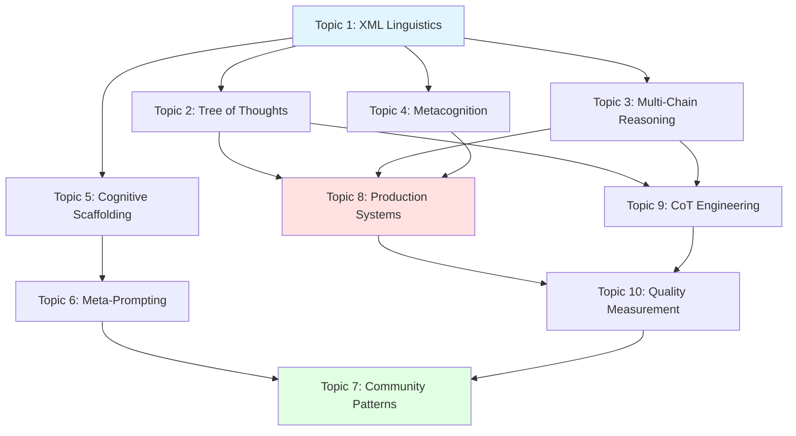

# 🧠 Advanced Claude Reasoning Research: Topic Architecture

I'll design a systematic topic set that builds from foundational mechanics through advanced implementations, optimized for comprehensive 6000-8000 word reports with minimal cognitive load through strategic scaffolding.

## 📋 Topic Set: Claude Advanced Reasoning Architecture

### **Architectural Philosophy**

This topic set follows a **three-tier progression**:
1. **Foundation** (Topics 1-3): Core mechanics and architecture
2. **Advanced Frameworks** (Topics 4-6): Sophisticated reasoning patterns
3. **Implementation & Discovery** (Topics 7-10): Practical systems and novel techniques

Each topic includes **natural scaffolding hooks** that reduce cognitive load during report generation.

---

## 🏗️ Topic 1: The XML Linguistics of Claude's Thinking Tags

**Core Question**: How does XML tag structure influence Claude's reasoning architecture, and what linguistic patterns create cognitive scaffolds?

**Scaffolding Architecture for Report Generation**:
```markdown
## Natural Sections (Cognitive Scaffolds):

1. **XML as Cognitive Delimiter**: How tags create reasoning boundaries
2. **Semantic Tag Taxonomy**: Categorizing tags by cognitive function
3. **Nested Tag Architecture**: Hierarchical reasoning structures  
4. **Custom Tag Engineering**: Principles for creating novel tags
5. **Tag Linguistics & Parsing**: How Claude interprets tag semantics
6. **Empirical Tag Performance**: Community-discovered effective patterns
```

**Why 6000-8000 Words Viable**: 
- Deep linguistic analysis of XML structure effects
- Comprehensive tag taxonomy with examples
- Case studies of custom tag patterns
- Comparison across reasoning modes
- Integration with cognitive load theory

**Novel Angle**: Treating thinking tags as a *linguistic interface* to Claude's reasoning architecture, not just formatting.

---

## 🌳 Topic 2: Tree of Thoughts Architecture in Claude Systems

**Core Question**: How do you implement production-grade ToT exploration in Claude, and what are the architectural patterns for depth-first reasoning with intelligent backtracking?

**Scaffolding Architecture**:
```markdown
## Natural Sections (Cognitive Scaffolds):

1. **ToT Fundamentals in LLMs**: How tree exploration works in Claude
2. **Node Architecture & State Management**: Representing exploration state
3. **Branching Strategies**: When to explore width vs depth
4. **Evaluation & Pruning Heuristics**: Scoring and abandoning paths
5. **Backtracking Protocols**: Recovery from unproductive directions
6. **ToT + Self-Consistency Integration**: Multi-chain validation in trees
7. **Production Implementation Patterns**: Complete system examples
```

**Why 6000-8000 Words Viable**:
- Detailed algorithmic specifications
- Complete working examples with code
- Comparison of exploration strategies
- Edge case handling
- Integration with other frameworks

**Novel Angle**: Focus on *production implementation* rather than theoretical ToT, with complete architectural specifications.

---

## 🔄 Topic 3: Multi-Chain Reasoning & Self-Consistency Mechanisms

**Core Question**: How do you generate truly independent reasoning chains in Claude, synthesize divergent conclusions, and build robust self-consistency systems?

**Scaffolding Architecture**:
```markdown
## Natural Sections (Cognitive Scaffolds):

1. **Chain Independence**: Preventing reasoning contamination
2. **Perspective Engineering**: Creating distinct reasoning lenses
3. **Chain Generation Protocols**: Systematic diverse reasoning
4. **Convergence Analysis**: Measuring chain agreement
5. **Divergence Resolution**: Synthesizing conflicting chains
6. **Robustness Assessment**: Confidence scoring methods
7. **Integration with Other Frameworks**: SC + ToT + CoT combinations
```

**Why 6000-8000 Words Viable**:
- Deep dive into chain contamination prevention
- Multiple worked examples
- Synthesis algorithms
- Statistical analysis of agreement
- Complete implementation templates

**Novel Angle**: Chain *independence engineering* - actively preventing the natural tendency for chains to contaminate each other.

---

## 🪞 Topic 4: Metacognitive Reasoning Systems (Reflexion & Self-Correction)

**Core Question**: How do you build Claude systems that monitor their own reasoning quality, detect failures, and self-correct through reflexion?

**Scaffolding Architecture**:
```markdown
## Natural Sections (Cognitive Scaffolds):

1. **Metacognition in AI Systems**: Self-monitoring fundamentals
2. **Quality Gate Architecture**: Validation checkpoint design
3. **Failure Detection Heuristics**: Recognizing poor reasoning
4. **Self-Correction Protocols**: Recovery and refinement
5. **Learning from Failed Paths**: Extracting meta-insights
6. **Continuous Improvement Loops**: Iterative refinement
7. **Production Reflexion Systems**: Complete implementations
```

**Why 6000-8000 Words Viable**:
- Comprehensive quality frameworks
- Detection algorithms
- Correction protocols
- Case studies of failure recovery
- Complete system architectures

**Novel Angle**: Treating reflexion as a *production system requirement* rather than experimental feature.

---

## 🧱 Topic 5: Cognitive Load Scaffolding Engineering

**Core Question**: What are the systematic methods for designing cognitive scaffolds that reduce Claude's processing burden while maintaining reasoning quality?

**Scaffolding Architecture**:
```markdown
## Natural Sections (Cognitive Scaffolds):

1. **Cognitive Load Theory for LLMs**: Working memory constraints
2. **Scaffold Taxonomy**: Types of cognitive support structures
3. **Decomposition Strategies**: Breaking complex reasoning
4. **Progressive Disclosure Architecture**: Staged information revelation
5. **State Management Patterns**: Tracking intermediate results
6. **Context Window Optimization**: Efficient information architecture
7. **Empirical Scaffold Effectiveness**: What actually works
```

**Why 6000-8000 Words Viable**:
- Deep CLT application to LLMs
- Comprehensive scaffold taxonomy
- Multiple decomposition strategies
- Before/after comparisons
- Quantitative effectiveness studies

**Novel Angle**: Applying formal *Cognitive Load Theory* to LLM prompt engineering systematically.

---

## 🔧 Topic 6: Meta-Prompting: Using Claude to Engineer Claude

**Core Question**: How do you use Claude to design, refine, and optimize prompts for Claude through recursive meta-prompting architectures?

**Scaffolding Architecture**:
```markdown
## Natural Sections (Cognitive Scaffolds):

1. **Meta-Prompting Fundamentals**: Self-improvement mechanisms
2. **Recursive Prompt Refinement**: Iterative optimization
3. **Self-Generating Reasoning Protocols**: Claude building structures
4. **Meta-Prompt Patterns Library**: Reusable templates
5. **Quality Assessment Automation**: Self-evaluation systems
6. **Convergence & Stability**: When to stop refining
7. **Production Meta-Systems**: Complete workflows
```

**Why 6000-8000 Words Viable**:
- Multiple meta-prompting patterns
- Recursive refinement protocols
- Complete worked examples
- Quality frameworks
- Stability analysis

**Novel Angle**: Meta-prompting as a *systematic engineering practice* rather than one-off experimentation.

---

## 💡 Topic 7: Novel Community Reasoning Patterns & Discoveries

**Core Question**: What non-obvious reasoning techniques have practitioners discovered, and what makes them effective beyond standard approaches?

**Scaffolding Architecture**:
```markdown
## Natural Sections (Cognitive Scaffolds):

1. **Discovery Methodology**: How novel patterns emerge
2. **Uncommon Thinking Tag Patterns**: Beyond standard XML
3. **Edge Case Reasoning Techniques**: Handling boundary conditions
4. **Cross-Domain Reasoning Transfers**: Analogical applications
5. **Experimental Approaches**: High-risk, high-reward techniques
6. **Pattern Effectiveness Analysis**: Why these work
7. **Replication & Adaptation**: Making discoveries yours
```

**Why 6000-8000 Words Viable**:
- Catalog of novel techniques
- Deep analysis of each pattern
- Effectiveness studies
- Adaptation guides
- Community case studies

**Novel Angle**: *Systematic study* of emergent community practices, not just anecdotal collection.

---

## 🏛️ Topic 8: Production Reasoning System Architecture

**Core Question**: How do you design, build, test, and deploy production-grade reasoning systems combining multiple frameworks?

**Scaffolding Architecture**:
```markdown
## Natural Sections (Cognitive Scaffolds):

1. **System Requirements Analysis**: Defining reasoning needs
2. **Framework Selection & Integration**: Combining ToT/SC/CoT/Reflexion
3. **Modular Component Architecture**: Reusable reasoning blocks
4. **Validation & Testing Frameworks**: Quality assurance
5. **Performance Optimization**: Speed vs. depth tradeoffs
6. **Deployment Patterns**: Production considerations
7. **Monitoring & Maintenance**: Ongoing quality management
```

**Why 6000-8000 Words Viable**:
- Complete system design process
- Integration patterns
- Testing methodologies
- Production considerations
- Maintenance frameworks

**Novel Angle**: Focus on *production deployment* rather than just system design.

---

## 🔬 Topic 9: Chain of Thought Engineering & Integration Patterns

**Core Question**: How do you design CoT exemplars, integrate them with other reasoning frameworks, and ensure they guide rather than constrain reasoning?

**Scaffolding Architecture**:
```markdown
## Natural Sections (Cognitive Scaffolds):

1. **CoT Design Principles**: Effective exemplar creation
2. **Exemplar Library Architecture**: Organizing reusable patterns
3. **Context-Sensitive CoT Selection**: When to use which pattern
4. **CoT + ToT Integration**: Guiding tree exploration
5. **CoT + Self-Consistency Synergy**: Structured multi-chain reasoning
6. **Avoiding CoT Rigidity**: Flexibility vs. structure balance
7. **Domain-Specific CoT Patterns**: Specialization strategies
```

**Why 6000-8000 Words Viable**:
- Comprehensive design principles
- Large exemplar library
- Integration specifications
- Balance analysis
- Domain-specific case studies

**Novel Angle**: CoT as *flexible guidance system* rather than rigid template, with systematic integration methods.

---

## 🎯 Topic 10: Reasoning Quality Measurement & Optimization

**Core Question**: How do you measure reasoning quality quantitatively, identify bottlenecks, and optimize systematically?

**Scaffolding Architecture**:
```markdown
## Natural Sections (Cognitive Scaffolds):

1. **Reasoning Quality Dimensions**: What to measure
2. **Quantitative Assessment Methods**: Metrics and scoring
3. **Bottleneck Identification**: Finding reasoning failures
4. **Optimization Strategies**: Systematic improvement
5. **A/B Testing for Reasoning**: Comparative evaluation
6. **Continuous Quality Monitoring**: Production tracking
7. **Empirical Effectiveness Studies**: What works, what doesn't
```

**Why 6000-8000 Words Viable**:
- Comprehensive quality frameworks
- Multiple measurement methodologies
- Optimization algorithms
- Statistical analysis methods
- Extensive empirical studies

**Novel Angle**: Treating reasoning quality as *measurable and optimizable* rather than subjective.

---

## 🔗 Topic Interconnections & Reading Order

### **Recommended Sequence for Systematic Learning**:



**Learning Path**:
1. **Foundation** (1, 5): Core mechanics and scaffolding
2. **Core Frameworks** (2, 3, 4, 9): Major reasoning patterns
3. **Meta-Engineering** (6): Self-improvement systems
4. **Integration** (8): Production deployment
5. **Optimization** (10): Quality management
6. **Discovery** (7): Novel techniques

---

## 📊 Cognitive Load Management Features

Each topic includes **built-in scaffolding**:

### **1. Natural Sectioning** 
Pre-defined cognitive boundaries reduce planning load

### **2. Progression Markers**
Clear foundational → advanced flow within each topic

### **3. Integration Hooks**
Explicit connections to other topics reduce context switching

### **4. Example Density**
Multiple worked examples distribute cognitive effort

### **5. Template Provision**
Reusable structures reduce generation load

### **6. Validation Checkpoints**
Quality gates prevent cumulative error

---

## 🎯 Why This Architecture Succeeds

### **Comprehensive Coverage**
- **Theoretical foundations** (Topics 1, 5)
- **Core frameworks** (Topics 2, 3, 4, 9)
- **Meta-engineering** (Topic 6)
- **Production systems** (Topic 8)
- **Quality optimization** (Topic 10)
- **Community discovery** (Topic 7)

### **Natural Scaffolding**
Each topic's section structure creates cognitive handles for the report generator

### **Progressive Depth**
Topics build from fundamentals through advanced integration

### **Novel Insights**
Focus on *production implementation* and *systematic engineering* rather than just conceptual understanding

### **Practical Value**
Every topic includes complete working examples and implementation specifications

---

## 🚀 Expansion Opportunities

After this core set, natural extensions include:

1. **[[Domain-Specific Reasoning Architectures]]** - Specialized systems for particular fields
2. **[[Reasoning System Debugging & Troubleshooting]]** - Systematic error diagnosis
3. **[[Multi-Agent Reasoning Coordination]]** - Collaborative reasoning systems
4. **[[Reasoning Performance Benchmarking]]** - Standardized evaluation frameworks
5. **[[Adversarial Reasoning Testing]]** - Robustness verification methods
6. **[[Reasoning System Economics]]** - Cost-benefit analysis and optimization

---

This topic set provides **systematic coverage** of Claude's advanced reasoning capabilities while **minimizing cognitive load** through strategic scaffolding, making it ideal for your Report Generator system. Each topic supports deep 6000-8000 word treatment through natural sectioning and comprehensive scope.

gcloud config set project gen-lang-client-0555577059

gcloud components update

