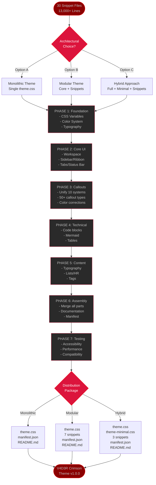

---
aliases:
  - v4d3r theme
  - V4d3r Theme
  - Theme Creation
  - Obsidian Theme
tags:
  - obsidian/advanced
  - obsidian/customization/themes
  - pkb/maintenance/refactoring
---

I'll analyze your snippets file and create a comprehensive transformation plan. Let me first examine what we're working with.# 🏗️ OBSIDIAN THEME TRANSFORMATION PROJECT PLAN

## 📊 INITIAL AUDIT SUMMARY---

## 🎯 ANALYSIS COMPLETE - YOUR THEME TRANSFORMATION PLAN IS READY

I've thoroughly analyzed your **30-file snippet collection** (13,000+ lines) and created a comprehensive transformation plan. Here's what you have:

### 📦 **THREE PLANNING DOCUMENTS DELIVERED**:

1. **`theme-transformation-audit.md`** - Complete inventory of all 30 snippets, categorized by function, with architectural recommendations

2. **`theme-transformation-workflow.md`** - Visual workflow diagram and phase-by-phase deliverables showing the 7-phase transformation process

3. **`DECISION-FORM.md`** - ⭐ **Simple checklist for you to fill out** with all architectural decisions

---

## 🔴 **CRITICAL COLOR FINDINGS**

Your snippets contain **multiple color violations** from the old Purple/Teal/Gold signature palette:

**Found colors that need correction:**
- `#7800F4` (Purple) → Must change to Crimson Red
- `#72FFF1` (Teal) → Must change to Silver Grey  
- `#FFC700` (Gold) → Must change to Salmon Red
- Various blues, greens, oranges in callout systems

**Proposed Red/Black/Grey Palette:**
- **Red Primary**: `#DC143C` (Crimson)
- **Red Dark**: `#8B0000` (DarkRed)
- **Red Bright**: `#FF6B6B` (Salmon - for highlights)
- **Greys**: 8-shade scale from `#1A1A1A` (near black) to `#E0E0E0` (light grey)

---

## ⚡ **THE TOGGLE QUESTION**

You have **50+ toggleable sections** currently in your `___v4d3r-ui-system.css` file. I've identified **THREE architecture options**:

| Approach | Description | Best For |
|----------|-------------|----------|
| **Monolithic** | Everything in one `theme.css` | Simple distribution, theme stores, beginners |
| **Modular** | Core theme + 7 separate snippets | Power users, maximum flexibility |
| **Hybrid** ⭐ | Full theme.css + minimal variant + 3 optional snippets | **Both audiences** |

**My recommendation**: **Hybrid approach** - gives you maximum distribution flexibility.

---

## 📋 **WHAT YOU NEED TO DO NOW**

**OPTION 1 - QUICK START** (Recommended):
Simply reply: **"Use all recommended options"**

I'll proceed with:
- ✅ Hybrid architecture (full + minimal + snippets)
- ✅ Tiered callout system (30 essential + 50 advanced)
- ✅ Moderate visual effects
- ✅ Proposed Crimson Red palette
- ✅ JetBrains Mono weight: 300
- ✅ Mobile optimizations included
- ✅ WCAG 2.1 AA accessibility compliance

---

**OPTION 2 - CUSTOM CONFIGURATION**:
Review the **`DECISION-FORM.md`** file and fill in your specific choices for:
1. Architecture (Monolithic/Modular/Hybrid)
2. Callout scope (All-in-one/Tiered/Minimal)
3. Visual effects intensity (Keep all/Moderate/Minimal)
4. Color palette (Approve proposed OR provide custom hex codes)
5. Additional preferences (naming, font weight, mobile, accessibility)

Then reply with your completed choices.

---

## 🚀 **TRANSFORMATION TIMELINE**

Once you confirm your decisions:

- **Phase 1** (Turns 1-2): Foundation & color system
- **Phase 2** (Turns 3-5): Core UI consolidation  
- **Phase 3** (Turns 6-8): Callout unification
- **Phase 4** (Turns 9-10): Code/Mermaid/Tables
- **Phase 5** (Turns 11-12): Content formatting
- **Phase 6** (Turns 13-14): Assembly & documentation
- **Phase 7** (Turn 15): Testing & validation

**Total**: ~15 systematic turns to production-ready theme

---

## ❓ **QUESTIONS BEFORE WE BEGIN?**

If anything in the planning documents is unclear, or if you want to discuss any architectural decisions in more detail, just ask. Otherwise, I'm ready to begin **Phase 1: Foundation System** as soon as you confirm your preferences.

**What would you like to do?**


# V4D3R CRIMSON THEME - TRANSFORMATION WORKFLOW

## 📊 VISUAL PROCESS MAP



---

## 🎯 ARCHITECTURE COMPARISON MATRIX

| Feature | Monolithic | Modular | Hybrid |
|---------|-----------|---------|--------|
| **Installation Complexity** | ⭐ Simple | ⭐⭐⭐ Complex | ⭐⭐ Moderate |
| **User Customization** | ⭐⭐ Limited | ⭐⭐⭐⭐⭐ Excellent | ⭐⭐⭐⭐ Great |
| **File Management** | ⭐⭐⭐⭐⭐ Single file | ⭐ 8+ files | ⭐⭐⭐ 3-4 files |
| **Update Maintenance** | ⭐⭐⭐⭐ Easy | ⭐⭐ Moderate | ⭐⭐⭐ Good |
| **Distribution Ready** | ⭐⭐⭐⭐⭐ Theme store | ⭐⭐ GitHub only | ⭐⭐⭐⭐ Both |
| **Beginner Friendly** | ⭐⭐⭐⭐⭐ Very | ⭐⭐ Not much | ⭐⭐⭐⭐ Yes |
| **Power User Appeal** | ⭐⭐ Limited | ⭐⭐⭐⭐⭐ Maximum | ⭐⭐⭐⭐ High |
| **Toggle Flexibility** | ⭐⭐⭐ Comments | ⭐⭐⭐⭐⭐ File-based | ⭐⭐⭐⭐ Both |

**RECOMMENDATION**: **Hybrid** - Best balance for community distribution + power user adoption

---

## 📋 PHASE-BY-PHASE DELIVERABLES

### **PHASE 1: Foundation** (Turns 1-2)
**Input:** 30 snippet files
**Output:**
```
/theme-workspace/
├── 01-foundation-variables.css
│   ├── Color Palette (Red/Black/Grey)
│   ├── Typography System
│   ├── Spacing Scale
│   └── Animation Variables
├── color-mapping.md (Old → New color conversions)
└── variable-reference.md (Complete variable documentation)
```

---

### **PHASE 2: Core UI** (Turns 3-5)
**Input:** `___v4d3r-ui-system.css` + 3 UI snippets
**Output:**
```
/theme-workspace/
├── 02-core-ui.css
│   ├── Workspace & Canvas
│   ├── Ribbon & Sidebar (with glassmorphism)
│   ├── File Explorer (00-folder-tree integrated)
│   ├── Tabs & Tab Bar
│   ├── Status Bar & Titlebar
│   └── Metadata Panel
└── ui-toggle-guide.md (Toggle documentation)
```

---

### **PHASE 3: Callouts** (Turns 6-8)
**Input:** 10 callout systems
**Output:**
```
/theme-workspace/
├── 03-callouts-unified.css
│   ├── Essential Callouts (30 types)
│   ├── Neon Callout Mod (toggleable)
│   ├── Card Callout Mod (toggleable)
│   └── Shadow Callout Mod (toggleable)
├── 03-callouts-advanced.css (companion snippet - optional)
│   └── 50+ advanced callout types
└── callout-reference.md (Complete callout library documentation)
```

---

### **PHASE 4: Technical** (Turns 9-10)
**Input:** Code, Mermaid, Table snippets
**Output:**
```
/theme-workspace/
├── 04-technical.css
│   ├── Code Blocks (syntax highlighting)
│   ├── Inline Code
│   ├── Mermaid Charts
│   └── Tables
└── technical-customization.md (Advanced user guide)
```

---

### **PHASE 5: Content** (Turns 11-12)
**Input:** Typography, lists, tags, formatting snippets
**Output:**
```
/theme-workspace/
├── 05-content.css
│   ├── Typography (JetBrains Mono integration)
│   ├── Headers (with glow effects)
│   ├── Lists & Ordered Numbers
│   ├── Horizontal Rules
│   ├── Tags
│   └── Links & Wiki-links
└── content-guide.md (Typography and formatting guide)
```

---

### **PHASE 6: Assembly** (Turns 13-14)
**Input:** All phase outputs (01-05)
**Output:**
```
/v4d3r-crimson-theme/
├── manifest.json
├── theme.css (FULL - all features)
├── theme-minimal.css (LITE - essential only)
├── README.md (Installation and usage)
├── CHANGELOG.md
└── snippets/ (Optional companions)
    ├── v4d3r-callouts-advanced.css
    ├── v4d3r-experimental-effects.css
    └── v4d3r-plugin-integrations.css
```

---

### **PHASE 7: Testing** (Turn 15)
**Input:** Assembled theme package
**Output:**
```
/v4d3r-crimson-theme/
├── [All files from Phase 6]
├── ACCESSIBILITY-REPORT.md
├── COMPATIBILITY-MATRIX.md
└── INSTALLATION-GUIDE.md
```

**Final Package:** Ready for GitHub release + Obsidian theme store submission

---

## 🔴 COLOR CORRECTION STRATEGY

### **Automated Color Mapping**

```css
/* OLD PALETTE (Purple/Teal/Gold) → NEW PALETTE (Red/Black/Grey) */

/* PURPLE → RED */
#7800F4 → #DC143C (Primary Purple → Crimson Red)
#9333EA → #FF6B6B (Light Purple → Salmon Red)
#6B21A8 → #8B0000 (Dark Purple → Dark Red)

/* TEAL → GREY */
#72FFF1 → #C0C0C0 (Teal Accent → Silver Grey)
#5EEAD4 → #808080 (Light Teal → Medium Grey)
#14B8A6 → #4A4A4A (Dark Teal → Dark Grey)

/* GOLD → RED/GREY */
#FFC700 → #FF6B6B (Gold Highlight → Salmon Red)
#F59E0B → #DC143C (Orange → Crimson)
#D97706 → #8B0000 (Dark Orange → Dark Red)

/* BLUE/GREEN → GREY */
#3B82F6 → #808080 (Blue → Medium Grey)
#10B981 → #4A4A4A (Green → Dark Grey)
```

**Implementation:**
- Phase 1: Create CSS variables with new palette
- Phases 2-5: Find/replace all hex codes systematically
- Phase 7: Visual validation of all color corrections

---

## 📊 EXPECTED THEME STATISTICS

### **FULL THEME (theme.css)**
- **Lines of Code**: ~10,000-12,000
- **Toggle Sections**: 40-50
- **CSS Variables**: 150-200
- **Callout Types**: 30 essential + mods
- **File Size**: ~250-300 KB

### **MINIMAL THEME (theme-minimal.css)**
- **Lines of Code**: ~3,000-4,000
- **Toggle Sections**: 15-20 essential
- **CSS Variables**: 100-120
- **Callout Types**: 12 essential
- **File Size**: ~80-100 KB

### **COMPANION SNIPPETS** (Optional)
- **Advanced Callouts**: ~2,000 lines (50+ types)
- **Experimental Effects**: ~1,500 lines (glassmorphism, animations)
- **Plugin Integrations**: ~1,000 lines (Dataview, Tasks, etc.)

---

## ⚡ QUICK START CHECKLIST

Before we begin Phase 1, confirm these decisions:

- [ ] **Architecture**: Monolithic / Modular / **Hybrid** ← (Recommended)
- [ ] **Callout Scope**: All-in-one / Tiered / **Minimal** ← (Your choice)
- [ ] **Visual Effects**: Keep all / Moderate / **Minimal** ← (Your choice)
- [ ] **Color Palette**: Approve proposed values / Provide custom hex codes
- [ ] **Ready to proceed**: Yes / Need more time

**Once confirmed, I'll begin Phase 1 immediately.**


# V4D3R CRIMSON THEME - ARCHITECTURAL DECISIONS

## 📋 FILL OUT THIS FORM TO PROCEED

Simply choose your preferences below, and I'll begin the transformation immediately.

---

## ✅ DECISION 1: THEME ARCHITECTURE

**Question**: How should the theme be structured for distribution?

**Choose ONE:**

- [ ] **OPTION A - MONOLITHIC** (Single `theme.css` file)
  - ✅ Simplest installation
  - ✅ Best for Obsidian theme store
  - ✅ Beginner-friendly
  - ❌ Less modular
  - ❌ Toggle changes require file editing
  
- [ ] **OPTION B - MODULAR** (Core theme + 7 companion snippets)
  - ✅ Maximum customization
  - ✅ Enable/disable entire feature sets
  - ✅ Best for power users
  - ❌ More complex installation
  - ❌ Multiple files to manage
  
- [X] **OPTION C - HYBRID** ⭐ **RECOMMENDED**
  - ✅ Full-featured `theme.css` (all features)
  - ✅ Lightweight `theme-minimal.css` alternative
  - ✅ 3 optional companion snippets for advanced users
  - ✅ Serves beginners AND power users
  - ✅ Best for community distribution
  - ❌ Requires maintaining 2 theme variants

**YOUR CHOICE:** _____

---

## ✅ DECISION 2: CALLOUT SYSTEM SCOPE

**Question**: You have 10 different callout systems totaling 100+ callout types. How should we handle this?

**Choose ONE:**

- [ ] **OPTION A - ALL-IN-ONE** (Merge everything into unified system)
  - 100+ callout types in theme.css
  - Comprehensive but massive
  - File size: ~4,000 lines just for callouts
  
- [ ] **OPTION B - TIERED SYSTEM** ⭐ **RECOMMENDED**
  - **Core Theme**: 30 essential callout types
  - **Companion Snippet**: 50+ advanced callouts (optional)
  - **Experimental Snippet**: Callout mods (neon, card, shadow styles)
  - Balanced approach
  
- [ ] **OPTION C - MINIMAL** (Essential callouts only)
  - 12-15 essential callouts in theme.css
  - Everything else as optional snippets
  - Lightweight theme

**YOUR CHOICE:** _____

---

## ✅ DECISION 3: VISUAL EFFECTS INTENSITY

**Question**: Your current theme has extensive visual effects (glassmorphism, glows, shadows, animations). Should we keep them all?

**Choose ONE:**

- [ ] **OPTION A - KEEP ALL EFFECTS** (Toggleable via CSS comments)
  - All effects included in theme.css
  - Users can enable/disable by uncommenting/commenting
  - File size: ~12,000 lines
  - Maximum visual impact
  
- [ ] **OPTION B - MODERATE APPROACH** ⭐ **RECOMMENDED**
  - Essential effects in theme.css
  - Heavy effects (glassmorphism, complex animations) in optional snippet
  - Balanced performance and aesthetics
  
- [ ] **OPTION C - MINIMAL THEME** (Performance-focused)
  - No heavy effects in core theme
  - All visual enhancements as optional snippets
  - Fastest rendering

**YOUR CHOICE:** _____

---

## ✅ DECISION 4: COLOR PALETTE CONFIRMATION

**Question**: Confirm the exact Red/Black/Grey color values you want to use.

### **PROPOSED PALETTE** (Based on your "Red, Black, Grey" requirement):

```css
/* ═══ RED SPECTRUM ═══ */
--v4d3r-red-primary:   #DC143C;  /* Crimson Red (Primary accent) */
--v4d3r-red-dark:      #8B0000;  /* Dark Red (Borders, subtle accents) */
--v4d3r-red-bright:    #FF6B6B;  /* Salmon Red (Highlights, hover states) */
--v4d3r-red-accent:    #FF0000;  /* Pure Red (Critical elements, warnings) */

/* ═══ BLACK SPECTRUM ═══ */
--v4d3r-black:         #000000;  /* Pure Black (Deep backgrounds) */
--v4d3r-black-soft:    #0A0A0A;  /* Soft Black (Slight depth) */

/* ═══ GREY SPECTRUM ═══ */
--v4d3r-grey-darkest:  #1A1A1A;  /* Near Black (Main background) */
--v4d3r-grey-darker:   #2A2A2A;  /* Dark Grey (UI backgrounds) */
--v4d3r-grey-dark:     #3A3A3A;  /* Medium-Dark Grey (Borders) */
--v4d3r-grey-medium:   #4A4A4A;  /* Medium Grey (Inactive elements) */
--v4d3r-grey:          #808080;  /* Silver Grey (Muted text) */
--v4d3r-grey-light:    #C0C0C0;  /* Light Silver (Normal text) */
--v4d3r-grey-lighter:  #D0D0D0;  /* Lighter Grey (Emphasis) */
--v4d3r-grey-lightest: #E0E0E0;  /* Very Light Grey (Highlights) */
```

**Choose ONE:**

- [x] **APPROVE PROPOSED PALETTE** (Use colors above exactly as shown)
  
- [ ] **PROVIDE CUSTOM HEX CODES** (Fill in below):

```css
/* YOUR CUSTOM PALETTE */
--v4d3r-red-primary:   #_____;  /* Primary red accent */
--v4d3r-red-dark:      #_____;  /* Dark red variant */
--v4d3r-red-bright:    #_____;  /* Bright red highlights */
--v4d3r-red-accent:    #_____;  /* Critical red */

--v4d3r-black:         #_____;  /* Pure black */
--v4d3r-black-soft:    #_____;  /* Soft black */

--v4d3r-grey-darkest:  #_____;  /* Darkest grey (background) */
--v4d3r-grey-darker:   #_____;  /* Darker grey */
--v4d3r-grey-dark:     #_____;  /* Dark grey */
--v4d3r-grey-medium:   #_____;  /* Medium grey */
--v4d3r-grey:          #_____;  /* Silver grey */
--v4d3r-grey-light:    #_____;  /* Light grey (text) */
--v4d3r-grey-lighter:  #_____;  /* Lighter grey */
--v4d3r-grey-lightest: #_____;  /* Lightest grey */
```

**YOUR CHOICE:** _____

---

## ✅ DECISION 5: ADDITIONAL PREFERENCES

### **A. Theme Naming**
What should we call the final theme?

- [x] **V4D3R Crimson** (Recommended - descriptive of color scheme)
- [ ] **V4D3R Red** (Simple and direct)
- [ ] **Custom Name**: ____________

### **B. Font Weight**
Your current snippets use JetBrains Mono Light (weight: 100). This is VERY thin. Confirm preference:

- [x] **Keep weight: 100** (Ultra-light, current setting)
- [ ] **Change to weight: 300** (Light, more readable) ⭐ **RECOMMENDED**
- [ ] **Change to weight: 400** (Normal, standard)
- [ ] **Custom weight**: _____ (200-700)

### **C. Mobile Optimization**
Should the theme include mobile-specific optimizations?

- [X] **YES** - Include mobile styles (larger touch targets, simplified layouts)
- [ ] **NO** - Desktop-focused only

### **D. Accessibility Priority**
How strict should WCAG compliance be?

- [X] **WCAG 2.1 AA** - Standard accessibility (4.5:1 text contrast minimum) ⭐ **RECOMMENDED**
- [ ] **WCAG 2.1 AAA** - Enhanced accessibility (7:1 text contrast minimum)
- [ ] **Relaxed** - Aesthetic priority over strict compliance

---

## 📊 QUICK RECOMMENDATION SUMMARY

**If you're unsure, I recommend:**

1. **Architecture**: **OPTION C - HYBRID**
   - Full theme.css + minimal variant + 3 optional snippets
   
2. **Callouts**: **OPTION B - TIERED**
   - 30 essential in theme, 50+ advanced in snippet
   
3. **Visual Effects**: **OPTION B - MODERATE**
   - Essential effects in theme, heavy effects optional
   
4. **Color Palette**: **APPROVE PROPOSED**
   - Use the crimson-based palette above
   
5. **Additional**:
   - **Name**: V4D3R Crimson
   - **Font Weight**: 300 (Light)
   - **Mobile**: YES
   - **Accessibility**: WCAG 2.1 AA

---

## 🚀 READY TO PROCEED?

Once you've filled in your choices above, reply with:

**"Confirmed. Begin Phase 1."**

And I'll immediately start creating the foundation variable system with your approved architecture and color palette.

---

## 💡 NEED HELP DECIDING?

If you're uncertain about any decision, you can also reply with:

**"Use all recommended options"**

And I'll proceed with the recommended configuration (Hybrid architecture, Tiered callouts, Moderate effects, Proposed palette).


