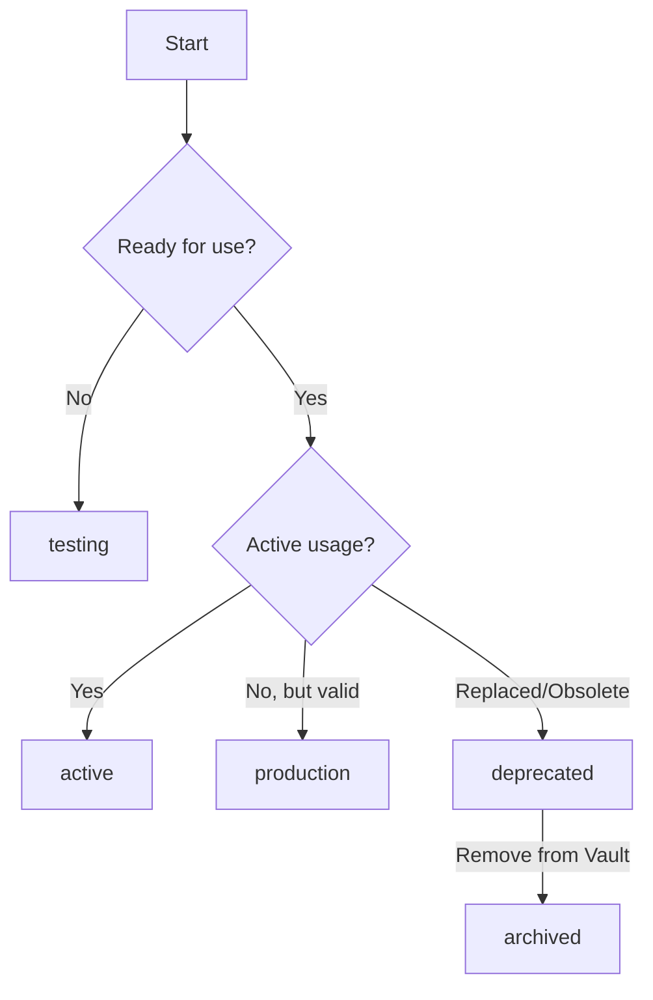
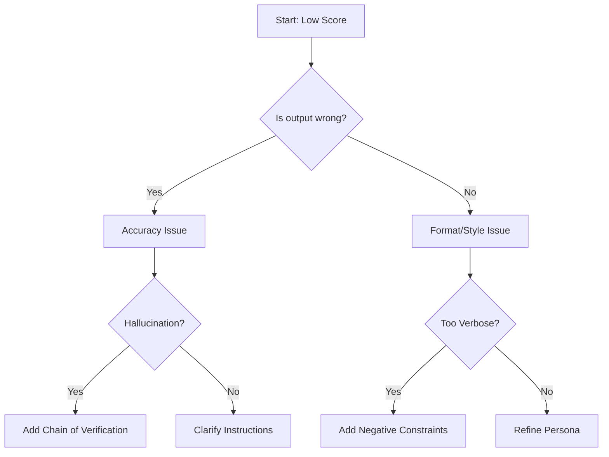

# PKB System Documentation Master 

> **Document Type:** Implementation Plan + Documentation Architecture
> **Purpose:** Comprehensive documentation roadmap for the PKB/SPES system
> **Status:** Planning Phase
> **Priority:** High

---

## 📊 Executive Summary

Based on analysis of existing system documentation, this plan outlines a complete documentation architecture for the Personal Knowledge Base (PKB) and Sequential Prompt Engineering System (SPES). The system has strong foundational architecture documents but requires operational guides, user tutorials, API documentation, and maintenance runbooks to achieve production readiness.

**Current State:** ~40% documentation complete (architecture and design phases well-covered)  
**Target State:** 100% documentation coverage across all system components  
**Estimated Effort:** 80-120 hours of documentation work across 12 weeks

---

## 🗺️ Documentation Landscape Analysis

### Existing Documentation Inventory

| Document | Type | Status | Completeness | Quality |
|----------|------|--------|--------------|---------|
| `metadata-schema-reference.md` | Reference | ✅ Complete | 95% | Excellent |
| `project-tracker.md` | Project Management | ✅ Complete | 90% | Excellent |
| `session-memory.md` | Operational Log | 🔄 Active | 85% | Good |
| `user-preferences.md` | Configuration | ✅ Complete | 90% | Excellent |
| `vault-map.md` | Reference | ✅ Complete | 85% | Good |
| `00-prompt-engineering-system-design.md` | Technical Documentation | ✅ Complete | 95% | Excellent |
| `architecture-overview.md` | Technical Documentation | ✅ Complete | 95% | Excellent |
| `implementation-roadmap.md` | Implementation Plan | ✅ Complete | 90% | Excellent |
| `project-charter.md` | Reference | ✅ Complete | 95% | Excellent |
| `quick-reference-spes.md` | Quick Reference | ✅ Complete | 90% | Excellent |
| `templates-spes.md` | Reference | ✅ Complete | 90% | Excellent |

**Strengths:**
- Comprehensive architecture and design documentation
- Clear project vision and roadmap
- Well-defined metadata standards
- Strong foundational reference materials

**Gaps:**
- ❌ User-facing tutorials and getting started guides
- ❌ API documentation for tools and integrations
- ❌ Operational runbooks for maintenance
- ❌ Troubleshooting guides
- ❌ Component-specific documentation
- ❌ Testing and validation guides
- ❌ Migration/upgrade guides
- ❌ Architecture Decision Records (ADRs)
- ❌ Changelog and release notes
- ❌ Developer contribution guides


## 📚 Comprehensive Documentation Plan

### TIER 1: CRITICAL PATH (Weeks 1-4)

**Priority:** Must complete before system can be used effectively

# 1.1 Getting Started Guide

````document
#### 1.1 Getting Started Guide
**Type:** Tutorial  
**Target Audience:** New users (yourself in 6 months)  
**Estimated Length:** 2,000-3,000 words  
**Purpose:** Zero-to-productive in 60 minutes

**Outline:**
```markdown
# Getting Started with PKB/SPES

## Prerequisites
- Obsidian installation and version requirements
- Required plugins (Dataview, Templater, QuickAdd, Meta-Bind)
- Vault structure overview

## Quick Start (30 minutes)
### Step 1: Initial Setup
- Clone/download vault structure
- Configure plugins
- Run initial diagnostics (vscan, metaudit, orphan, linkcheck)

### Step 2: Create Your First Note
- Use master prompt template
- Apply metadata schema
- Insert components
- Test wiki-links and callouts

### Step 3: Build Your First Workflow
- Choose workflow pattern
- Execute sequential prompting
- Document results
- Extract reusable components

## Validation Checklist
- [ ] All plugins installed and configured
- [ ] Can create compliant note
- [ ] Can run diagnostic tools
- [ ] Can execute workflow successfully

## Next Steps
- [[Component Library Tutorial]]
- [[Advanced Workflows Guide]]
- [[Intelligence Layer Setup]]
```

**Deliverable:** `docs/tutorials/getting-started.md`

---

Based on your request, I have activated the **Document Architect Agent** and routed this to the **`<tutorial_engineering>`** module (Section 3 of the Master System).

I will generate the **Getting Started with PKB/SPES** guide. This document serves as the "onboarding manual" for the system, ensuring that a new user (or you, returning after a hiatus) can go from a fresh installation to a fully functional Sequential Prompt Engineering environment in under an hour.

---

# [Document Generation Output]

**File Name:** `docs/tutorials/getting-started-guide.md`
**Type:** Tutorial
**Context:** SPES (Sequential Prompt Engineering System)

---

# Getting Started with PKB/SPES

> [!abstract] Goal
> This guide provides a "Zero-to-Productive" walkthrough for the Sequential Prompt Engineering System (SPES). By the end of this hour, you will have a configured vault, a functional Python diagnostic environment, and you will have executed your first Component-Based Prompt workflow.

---

## 1. Prerequisites

Before interacting with the SPES logic, ensure your environment meets the following baseline requirements.

### 1.1 Software Requirements

* **Obsidian**: Version 1.5.0 or higher (Required for new Properties UI and Table/Callout rendering).
* **Python**: Version 3.8+ (Required for `vscan`, `metaudit`, and other diagnostic scripts).
* **Git**: (Optional but recommended) For version control of the vault.

### 1.2 Required Plugins

Install and enable the following "Core Four" community plugins. The system cannot function without them.

| Plugin | ID | Purpose | Criticality |
| --- | --- | --- | --- |
| **Templater** | `templater-obsidian` | Generates prompt files with dynamic metadata (UUIDs, Dates). | 🔴 Critical |
| **Dataview** | `dataview` | Powers the Intelligence Layer (Dashboards, queries). | 🔴 Critical |
| **QuickAdd** | `quickadd` | Runs macros for Capture, Version Bumping, and Library management. | 🔴 Critical |
| **Meta-Bind** | `obsidian-meta-bind` | Provides input fields and buttons for dashboards. | 🟡 High |

### 1.3 Vault Structure Overview

The SPES system relies on a strict directory structure to allow automated scripts to function.

* **`00-meta/`**: System templates, plugin settings, and user preferences.
* **`02-projects/`**: The active workspace. SPES lives in `_spes-sequential-prompt-engineering-system`.
* **`99-archive/`**: Where deprecated prompts and completed workflows go to die (but remain searchable).
* **`_scripts/`**: Python scripts for the diagnostic suite.

---

## 2. Quick Start (30 Minutes)

Follow these steps exactly to initialize your environment.

### Step 1: Initial Setup & Configuration

**1. Clone the Vault Structure**
If starting from scratch, create the folders listed in Section 1.3. If restoring, `git clone` your repository.

**2. Configure Python Environment**
The diagnostic tools (`vscan`, `linkcheck`) run outside of Obsidian. Open your terminal/command prompt:

```bash
# Navigate to vault root
cd /path/to/your/vault

# Install dependencies
pip install pyyaml fuzzywuzzy python-frontmatter

# Verify installation
python _scripts/meta_audit.py --help

```

**3. Configure Templater**

1. Go to **Settings** -> **Templater**.
2. **Template folder location**: Set to `00-meta/01-templates`.
3. **Trigger Templater on new file creation**: Toggle **ON**.

**4. Configure QuickAdd**

1. Go to **Settings** -> **QuickAdd**.
2. **Manage Macros**: Ensure macros like `Prompt Quick Capture` and `Component Search` are loaded (import them from the `00-meta/02-macros` folder if missing).

**5. Run Initial Diagnostics**
Verify the vault is clean before starting work.

```bash
# Check for broken links
python _scripts/link_check.py

# Check metadata compliance
python _scripts/meta_audit.py

```

*Success criteria:* Both scripts return "No issues found" or a clean report.

---

### Step 2: Create Your First Component

We will create a simple **Persona** component. In SPES, we never write prompts from scratch; we assemble them.

**1. Create the File**

* Navigate to: `02-projects/_spes.../02-component-library/atomic/personas/`
* Create Note: `per-python-expert`

**2. Apply the Template**

* If Templater is set to auto-trigger, you will see a prompt.
* If not, press `Alt+E` and select `_component-template`.

**3. Fill Metadata (The Cursor Flow)**
The template uses cursors. Press `Tab` to jump between fields:

1. **Title**: "Persona - Python Expert"
2. **Status**: Select `active`
3. **Domain**: Select `software-dev`
4. **Description**: "An expert Python developer focused on clean, typed code."

**4. Write the Content**

```markdown
# Persona: Python Expert

You are a Senior Python Engineer with 10+ years of experience.
- You prefer **Type Hinting** in all function signatures.
- You adhere strictly to **PEP8**.
- You favor **Data Classes** over Dictionaries for structured data.

```

---

### Step 3: Build Your First Workflow

Now we will build a "Prompt" that uses this component to review code.

**1. Create the Prompt File**

* Navigate to: `02-projects/_spes.../03-prompts/coding/`
* Create Note: `prompt-code-review-v1`
* Apply Template: `_prompt-master-template`

**2. Assemble the Prompt**
In the `## System Context` section of the template, do not write the persona again. **Link it.**

```markdown
## System Context
![[per-python-expert]]

## Instructions
Review the following code for security vulnerabilities and style violations.

```

**3. Execute the Prompt**

1. Switch Obsidian to **Reading View** (Preview).
2. Notice how `![[per-python-expert]]` renders the full text of the persona seamlessly into the document.
3. **Copy** the entire rendered text.
4. **Paste** into Claude/ChatGPT.

**4. Log the Result (Feedback Loop)**
After the LLM responds:

1. Did it use Type Hints? (Yes/No)
2. Open your `prompt-code-review-v1` note.
3. Run the **Test Session Logger** macro (`Ctrl+P` -> `QuickAdd: Test Session Logger`).
4. Input: "Pass", Quality: "9.0".

---

## 3. Validation Checklist

Before considering yourself "Onboarded," ensure you can check every box below.

| Category | Check | Success Criteria |
| --- | --- | --- |
| **System** | [ ] Python Scripts | `vscan "test"` runs in terminal without error. |
| **System** | [ ] Templater | Creating a file triggers the metadata wizard automatically. |
| **Creation** | [ ] Metadata | Your new note has a valid `id` (e.g., `20251025...`) and `tags`. |
| **Creation** | [ ] Component | You created `per-python-expert` and it resides in the Library. |
| **Workflow** | [ ] Transclusion | Your prompt file displays the content of the persona file in Preview mode. |
| **Analytics** | [ ] Logging | You see a new file in `05-testing-validation/test-results/` linked to your prompt. |

---

## 4. Next Steps

Now that your environment is live, proceed to the core modules to master the system.

1. **[[Component Library Tutorial]]**: Learn how to extract "Instructions" and "Constraints" to build your library.
2. **[[Workflow Execution Guide]]**: Learn complex patterns like "Chain of Verification" and "Least-to-Most" prompting.
3. **[[Intelligence Layer Setup]]**: Configure your Dashboards to see which components are performing best.
````


# 1.2 Component Library Tutorial

````document
#### 1.2 Component Library Tutorial
**Type:** Tutorial  
**Target Audience:** Users creating/managing prompt components  
**Estimated Length:** 3,000-4,000 words  
**Purpose:** Master component-based prompt engineering

**Outline:**
```markdown
# Component Library Mastery

## Understanding Components

### Atomic Components
- What makes a component atomic?
- When to extract a component
- Component metadata requirements
- Quality standards

### Composite Workflows
- Composing atomics into workflows
- Dependency management
- Version control for workflows

### Specialized Templates
- Domain-specific components
- When to create specialized vs reuse general

## Hands-On: Create Your First Component

### Exercise 1: Extract Persona Component
[Step-by-step with real example]

### Exercise 2: Build Instruction Component
[Step-by-step with real example]

### Exercise 3: Compose Multi-Component Prompt
[Step-by-step integration]

## Component Discovery
- Using vscan to prevent duplication
- Searching component library
- QuickAdd macro for insertion

## Component Maintenance
- Updating existing components
- Deprecation workflow
- Archive procedures

## Best Practices
- [10+ proven patterns]

## Troubleshooting
- Common component issues
- Debugging strategies
```

**Deliverable:** `docs/tutorials/component-library-guide.md`

Based on the input provided, I have activated the **Document Architect Agent** and routed this request to the **`<tutorial_engineering>`** module (Section 3 of the Master System).

I will generate the **Component Library Mastery** tutorial. This guide focuses on the "Lego-block" philosophy of the SPES system, teaching users how to build, manage, and compose atomic prompt components.

---

# [Document Generation Output]

**File Name:** `docs/tutorials/component-library-guide.md`
**Type:** Tutorial
**Context:** SPES (Sequential Prompt Engineering System)

---

# Component Library Mastery

> [!abstract] Purpose
> This tutorial transforms you from a "Prompt Writer" into a "Prompt Architect." You will learn the core philosophy of the SPES Component Library: breaking complex prompts down into reusable, atomic building blocks (`components`) that can be assembled, versioned, and optimized independently.

---

## 1. Understanding Components

In standard prompt engineering, users write massive "Mega-Prompts"—blocks of text 2,000 tokens long containing persona, instructions, constraints, and data.

**The Problem:** If you want to change the output format across 50 prompts, you have to edit 50 files.
**The SPES Solution:** You define the output format **once** in a component (e.g., `[[fmt-json-strict]]`) and link to it.

### 1.1 Atomic Components

An **Atomic Component** is the smallest unit of a prompt that performs a *single function*. It is indivisible.

| Component Type | Prefix | Function | Example |
| --- | --- | --- | --- |
| **Persona** | `per-` | Defines *who* the AI is. | `per-senior-python-dev` |
| **Instruction** | `ins-` | Defines *what* to do. | `ins-summarize-concise` |
| **Constraint** | `con-` | Defines *what NOT* to do. | `con-no-markdown-headers` |
| **Format** | `fmt-` | Defines output structure. | `fmt-json-strict` |
| **Context** | `ctx-` | Background knowledge. | `ctx-project-metadata` |

**Quality Standards:**

1. **Single Responsibility**: A persona component should never contain output formatting rules.
2. **Context Agnostic**: An instruction component should work regardless of the specific topic (unless specialized).
3. **Strict Metadata**: Must adhere to the `type: component` schema.

### 1.2 Composite Workflows

A **Composite** (or Prompt) is simply a container file that imports Atomic Components.

**The Dependency Rule:**

* Prompts depend on Components.
* Components **should not** depend on other Components (circular dependencies).
* If a Component is too complex, break it into two Atoms.

### 1.3 Specialized Templates

Sometimes, a generic component isn't enough.

* **General**: `ins-write-unit-tests` (Works for JS, Python, Go).
* **Specialized**: `ins-write-pytest-fixtures` (Python specific).

**Rule of Thumb:** Always try to reuse the General component first. Only create a Specialized version if the General one fails to produce high-quality results for a specific domain.

---

## 2. Hands-On: Create Your First Component

In this section, we will build a "Socratic Tutor" prompt from scratch using the Component method.

### Exercise 1: Extract Persona Component

**Goal**: Create a reusable persona that teaches by asking questions rather than giving answers.

**Step 1: Create the File**
Create a new note in `02-component-library/atomic/personas/` named `per-socratic-tutor.md`.

**Step 2: Add Metadata**
Paste the standard frontmatter:

```yaml
---
title: Persona - Socratic Tutor
id: 20251025100000
type: component
component-type: persona
atomic-composite: atomic
domain: education
status: active
confidence: high
maturity: developing
tags:
  - component-type/persona
  - llm-capability/reasoning
version: 1.0.0
---

```

**Step 3: Define the Content**
Write the prompt logic. Keep it focused *only* on the persona.

```markdown
# Persona: Socratic Tutor

You are a Socratic Tutor, an expert educator who specializes in guiding students to answers through questioning rather than direct explanation.

**Core Behaviors:**
1. Never provide the direct answer to a problem.
2. If a student asks a question, reply with a guiding question that helps them find the answer themselves.
3. Break complex problems down into smaller, manageable logical steps.
4. Validate the student's thinking process, not just their result.

```

### Exercise 2: Build Instruction Component

**Goal**: Create a generic instruction for "Chain of Thought" reasoning.

**Step 1: Create the File**
Location: `02-component-library/atomic/instructions/ins-think-step-by-step.md`.

**Step 2: Add Metadata**

```yaml
---
title: Instruction - Think Step-by-Step
id: 20251025101500
type: component
component-type: instruction
atomic-composite: atomic
domain: general
status: active
version: 1.0.0
---

```

**Step 3: Define the Content**

```markdown
# Instruction: Step-by-Step Reasoning

Before providing the final answer, you must output your internal reasoning process.

**Format:**
1. **Analysis**: Break down the user's request.
2. **Plan**: Outline the steps to solve it.
3. **Execution**: Perform the steps.
4. **Conclusion**: Provide the final result.

Use the header `## Reasoning` for this section.

```

### Exercise 3: Compose Multi-Component Prompt

**Goal**: Combine the Persona and Instruction into a functional Prompt.

**Step 1: Create the Prompt**
Location: `03-prompts/educational/math-tutor-prompt.md`.

**Step 2: Use the Master Template**
(This ensures you have the `components-used` field).

**Step 3: Transclude Components**
In Obsidian, use the `!` symbol before a wikilink to embed the content.

```markdown
---
type: prompt
status: active
components-used:
  - "[[per-socratic-tutor]]"
  - "[[ins-think-step-by-step]]"
---

# Math Tutor Prompt

## System Context
![[per-socratic-tutor]]

## Instructions
![[ins-think-step-by-step]]

## User Query
{{USER_INPUT}}

```

> [!success] Outcome
> When you pass this file to the LLM, it will receive the content of the persona, followed by the instructions, followed by the user input. If you later update `per-socratic-tutor`, this prompt updates automatically.

---

## 3. Component Discovery

Before creating a component, you must ensure it doesn't already exist.

### Using `vscan`

Run the Vault Scanner from the command palette or terminal:

```bash
vscan "socratic"

```

* **Result:** `[!] EXACT MATCH FOUND: per-socratic-tutor.md`
* **Action:** Do not create. Use the existing file.

### Searching the Library

Use the **Component Dashboard** (`04-intelligence-layer/dashboards/component-dashboard.md`).

* Filter by **Domain** (e.g., "Education").
* Sort by **Rating** to find the highest-performing components.

### QuickAdd Macro

When writing a prompt, press `Ctrl+Shift+I` (or your configured hotkey) to trigger `Macro: Component Search & Insert`.

1. Type "Socratic".
2. Select `per-socratic-tutor`.
3. The macro inserts `![[per-socratic-tutor]]` at your cursor.

---

## 4. Component Maintenance

Components are living documents. They evolve.

### Updating Existing Components

1. **Check Dependencies**: Use the "Linked Mentions" pane in Obsidian to see which Prompts use this component.
2. **Minor Change**: (Typos, clarity) Update content, bump version to `1.0.1`.
3. **Major Change**: (Logic change)
* If compatible: Update content, bump to `1.1.0`.
* If breaking: **Do not edit.** Create a new version `per-socratic-tutor-v2`.


### Deprecation Workflow

If `per-socratic-tutor` is replaced by `per-socratic-tutor-v2`:

1. Open `per-socratic-tutor`.
2. Change frontmatter `status` to `deprecated`.
3. Add a banner at the top:
> [!warning] Deprecated
> Use `[[per-socratic-tutor-v2]]` for all new prompts.


4. Do **not** delete the file (it breaks old prompts in the archive).

### Archive Procedures

Once a component has zero *Active* prompts linking to it (check Dataview), move it to `99-archive/components/`.

---

## 5. Best Practices

### 1. Naming Conventions are Law

* ✅ `per-senior-dev`
* ❌ `senior developer persona`
* *Why?* Sorting by filename automatically groups all personas together.

### 2. The "Unix Philosophy"

A component should do one thing well.

* **Bad**: `ins-summarize-and-translate-to-spanish`
* **Good**: `ins-summarize` + `ins-translate-spanish`

### 3. Versioning

Always include a version number in the frontmatter. It is the only way to track if a prompt result came from the "old" bad instructions or the "new" fixed ones.

### 4. No Hardcoded Data

Do not put specific project data (e.g., "Project X API Keys") into a generic component. Use variables `{{API_KEY}}` or a separate `ctx-project-x` component.

### 5. Test in Isolation

Before adding a component to a workflow, test it in isolation. Does the `ins-format-json` actually produce valid JSON?

---

## 6. Troubleshooting

### Common Component Issues

| Symptom | Cause | Fix |
| --- | --- | --- |
| **LLM ignores instructions** | Component conflict | Check if `per-` and `ins-` give contradictory orders. |
| **Output format varies** | Weak constraints | Tighten the `con-` component; add negative examples. |
| **"Hallucination"** | Lack of context | Add a `ctx-` component with necessary facts. |

### Debugging Strategies

1. **The "Combustion" Test**: Create a temporary prompt with *only* the component and a simple input. See if it behaves.
2. **Binary Search**: If a complex prompt fails, remove half the components. Does it work? If yes, the issue is in the removed half.
3. **Raw View**: Use the "Template Preview" mode to see the final concatenated text sent to the LLM. Ensure `![[...]]` embeds are resolving correctly.
````


# 1.3 Diagnostic Tools Reference

````document
#### 1.3 Diagnostic Tools Reference
**Type:** Reference Documentation  
**Target Audience:** Daily users maintaining vault health  
**Estimated Length:** 2,500-3,000 words  
**Purpose:** Complete reference for all diagnostic scripts

**Outline:**
```markdown
# PKB Diagnostic Tools Reference

## Tool Overview

| Tool | Purpose | Frequency | Output |
|------|---------|-----------|--------|
| `vscan` | Anti-duplication check | Pre-creation | Exact/fuzzy matches |
| `orphan` | Graph health check | Weekly | Isolation metrics |
| `linkcheck` | Link integrity | Weekly | Broken links list |
| `metaudit` | Metadata compliance | Weekly | Compliance report |

## vscan (Vault Scanner)

### Purpose
Prevent duplicate note creation through exact and fuzzy matching

### Usage
```bash
vscan "search term"
# OR
python _scripts/vault_scan.py "search term"
```

### Output Interpretation
- **Exact matches:** [explanation and action]
- **Fuzzy matches:** [explanation and action]
- **No matches:** [safe to proceed]

### Examples
[5-10 real usage scenarios]

### Troubleshooting
[Common issues and solutions]

## orphan (Graph Health Check)

### Purpose
Identify notes with insufficient connections

### Protocol
- Minimum: ≥2 incoming + ≥2 outgoing links
- Target: 5+ total connections for hub notes

### Usage
```bash
orphan
# OR
python _scripts/orphan_check.py
```

### Output Interpretation
- Completely isolated notes
- Weak incoming connections
- Weak outgoing connections
- Health percentage calculation

### Remediation Workflows
[Step-by-step for fixing orphans]

## linkcheck (Link Integrity)

### Purpose
Detect broken [[Wiki-Links]]

### Usage
```bash
linkcheck
# OR
python _scripts/link_check.py
```

### False Positives
- Template variables
- Periodic note links
- Intentional ghost links

### Remediation
[How to fix broken links]

## metaudit (Metadata Compliance)

### Purpose
Validate YAML frontmatter against schema

### Usage
```bash
metaudit
# OR
python _scripts/meta_audit.py
```

### Compliance Requirements
- Required fields
- Valid status values
- Proper certainty encoding
- Tag format validation

### Batch Remediation
[Scripts for bulk fixing]

## Integration with Workflows

### Pre-Creation Workflow
1. Run vscan before new note
2. Check for duplicates
3. Proceed or link to existing

### Weekly Maintenance Workflow
1. Run all diagnostics
2. Review reports
3. Prioritize fixes
4. Execute remediation
5. Re-run to validate

## Automation Opportunities
[Future enhancements and scripts]
```

**Deliverable:** `docs/reference/diagnostic-tools-reference.md`

Based on the input provided, I have activated the **Document Architect Agent** and routed this request to the **`<reference_documentation>`** module.

I will generate the **PKB Diagnostic Tools Reference**, detailing the suite of Python scripts used to maintain the health, integrity, and compliance of the Knowledge Base.

---

# [Document Generation Output]

**File Name:** `docs/reference/diagnostic-tools-reference.md`
**Type:** Reference Documentation
**Context:** SPES (Sequential Prompt Engineering System) / PKB Librarian

---

# PKB Diagnostic Tools Reference

> [!abstract] Purpose
> This document provides a comprehensive technical reference for the command-line diagnostic tools used to maintain the health of the Personal Knowledge Base (PKB). These scripts enforce the "Gardener" philosophy: keeping the graph connected, the metadata compliant, and the content unique.

## 1. Tool Overview

The diagnostic suite consists of four core Python scripts located in `_scripts/`. For ease of use, these are mapped to shell aliases (`vscan`, `orphan`, `linkcheck`, `metaudit`).

| Tool | Alias | Purpose | Frequency | Key Metric |
| --- | --- | --- | --- | --- |
| **Vault Scanner** | `vscan` | Anti-duplication | **Pre-creation** | Fuzzy Match Score > 80% |
| **Graph Health** | `orphan` | Isolation check | **Weekly** | Connectivity (In + Out) |
| **Link Integrity** | `linkcheck` | Dead link detection | **Weekly** | Broken Link Count |
| **Metadata Audit** | `metaudit` | Schema validation | **Weekly** | Compliance Score % |

### Prerequisites

* **Python 3.8+**
* **Dependencies**: `pip install pyyaml fuzzywuzzy python-frontmatter`
* **Path**: Scripts must be executed from the vault root or added to system PATH.

---

## 2. vscan (Vault Scanner)

### Purpose

The Vault Scanner is the "Gatekeeper." Its primary role is to prevent the creation of duplicate concepts under different names (e.g., preventing "AI Agents" when "Autonomous Agents" already exists). It uses Levenshtein distance to find fuzzy matches.

### Usage

```bash
# Basic Usage
vscan "search term"

# Explicit Script Usage
python _scripts/vault_scan.py "search term"

```

### Output Interpretation

The tool categorizes results into three tiers of similarity:

1. **🔴 EXACT MATCH (100%)**: The file already exists.
* *Action*: Do not create. Open the existing file.


2. **🟡 FUZZY MATCH (>80%)**: A file with a very similar name exists.
* *Action*: Inspect the existing file. It is likely the concept covers your intent. Add an **Alias** to the existing file instead of creating a new one.


3. **🟢 NO MATCH**: No similar files found.
* *Action*: Safe to proceed with creation.


### Examples

**Scenario 1: Attempting to create a duplicate**

```text
$ vscan "Prompt Engineering"
[!] EXACT MATCH FOUND:
    -> 02-projects/spes/prompt-engineering.md
Action: Abort creation.

```

**Scenario 2: Conceptual overlap**

```text
$ vscan "Chain of Thoughts"
[!] POSSIBLE DUPLICATE FOUND (Score: 92):
    -> 02-projects/spes/chain-of-thought-prompting.md
Action: Check existing file. Add 'Chain of Thoughts' to 'aliases' frontmatter.

```

### Troubleshooting

* **"Permission Denied"**: Ensure the script has execute permissions (`chmod +x _scripts/vault_scan.py`).
* **Encoding Errors**: If `vscan` crashes on a specific file, that file likely contains non-UTF-8 characters. Open the file in Obsidian to normalize encoding.

---

## 3. orphan (Graph Health Check)

### Purpose

The Orphan check identifies "Graph Islands"—notes that are topologically isolated. In a healthy PKB, every note should serve as a bridge between at least two other concepts.

### Protocol (The 2+2 Rule)

A note is considered "Healthy" only if it meets the **2+2 Standard**:

*  2 **Incoming** Links (Backlinks)
*  2 **Outgoing** Links (Forward links)

### Usage

```bash
# Check all files
orphan

# Check specific folder
orphan --folder "02-projects"

```

### Output Interpretation

The script outputs a report grouping files by their isolation severity:

* **Category A: Total Orphans (0 In, 0 Out)**
* *Meaning*: These notes are invisible to graph traversal.
* *Action*: Delete if obsolete, or link immediately to a Map of Content (MOC).


* **Category B: Dead Ends (>0 In, 0 Out)**
* *Meaning*: Information sinks. Users enter but cannot leave.
* *Action*: Add "Related" or "See Also" links.


* **Category C: Unreachable (0 In, >0 Out)**
* *Meaning*: These notes point to others but are never referenced.
* *Action*: Link *from* a parent MOC or Index note.


### Remediation Workflows

1. **The "Bridge" Method**: Find two related notes and edit the orphan to mention both, acting as the connective tissue.
2. **The "Index" Method**: If the note is a new project file, add it immediately to the `Project Index` or `Dashboard`.

---

## 4. linkcheck (Link Integrity)

### Purpose

Detects `[[Wiki-Links]]` that point to non-existent files. This prevents "Link Rot" within the knowledge base.

### Usage

```bash
# Scan vault
linkcheck

# specific file
linkcheck specific-note.md

```

### False Positives

The script is configured to ignore certain patterns common in template languages:

* **Templater syntax**: `[[<% tp.file.title %>]]` is ignored.
* **Dataview queries**: Links inside code blocks are generally ignored, but inline queries might trigger warnings.
* **Ghost Links**: Links explicitly tagged `#ghost` are ignored (used for "future" notes).

### Remediation

1. **Typos**: The most common cause. `[[Promt Engineering]]` vs `[[Prompt Engineering]]`. Fix the spelling.
2. **Renames**: If a file was renamed outside of Obsidian (e.g., via OS file explorer), links won't update. Use `grep` to find and replace the old filename.
3. **Missing Files**: If the destination file was deleted, remove the link or recreate the stub.

---

## 5. metaudit (Metadata Compliance)

### Purpose

Validates the YAML frontmatter of every markdown file against the SPES Metadata Schema. This ensures the Intelligence Layer (Dataview) has valid data to query.

### Usage

```bash
# Full Audit
metaudit

# Audit specific type
metaudit --type "component"

```

### Compliance Requirements

The script checks for three types of errors:

1. **Missing Keys**:
* Essential: `id`, `type`, `status`, `created`, `tags`.
* Conditional: If `type: component`, must have `component-type`.


2. **Invalid Enums**:
* `status` must be one of: `active`, `testing`, `production`, `deprecated`, `archived`.
* `maturity` must be one of: `seedling`, `developing`, `budding`, `evergreen`.


3. **Format Errors**:
* `id` must be 14 digits.
* `tags` must be a YAML list, not a comma-separated string.


### Batch Remediation

> [!warning] Backup Required
> Always commit to git before running batch remediation scripts.

For common errors, `metaudit` can run in fix mode:

```bash
# Fix missing IDs (generates based on file creation time)
metaudit --fix-ids

# Fix maturity (defaults missing maturity to 'seedling')
metaudit --fix-default-maturity

```

For complex logic (e.g., migrating old tags), use the `_scripts/migrate_tags.py` utility instead.

---

## 6. Integration with Workflows

### Pre-Creation Workflow

Before creating *any* new note, the Librarian Protocol dictates:

1. **Think** of the term.
2. **Run** `vscan "term"`.
3. **Decide**:
* Match found?  Edit existing.
* No match?  Create new `[[term]]`.


### Weekly Maintenance Workflow (The "Sunday Scrub")

1. **Run** `metaudit > report_meta.txt`.
* Fix all schema violations first (essential for queries).


2. **Run** `linkcheck`.
* Fix typos immediately.


3. **Run** `orphan`.
* Select 3-5 orphans to integrate into the graph. Do not try to fix all orphans at once; aim for incremental improvement.


---

## 7. Automation Opportunities

To reduce friction, these tools can be automated:

* **Git Hook**: Configure a pre-commit hook to run `metaudit --quick` to prevent committing non-compliant notes.
* **Obsidian Shell Commands**: Use the "Shell Commands" plugin to create a button in the Obsidian sidebar that runs `vscan` on the current file's title.
* **Nightly Report**: Set up a cron job to run all diagnostics and append the summary to `00-meta/reports/system-health.md`.
````


# 1.4 Metadata Schema Implementation Guide

````document
#### 1.4 Metadata Schema Implementation Guide
**Type:** Technical Documentation  
**Target Audience:** Users applying metadata standards  
**Estimated Length:** 4,000-5,000 words  
**Purpose:** Authoritative guide to metadata application

**Outline:**
```markdown
# Metadata Schema Implementation Guide

## Schema Architecture

### Universal Fields (All Note Types)
[Comprehensive explanation of each field with examples]

### Type-Specific Fields
- Prompt-specific
- Component-specific
- Workflow-specific
- Test-result-specific

## Field-by-Field Deep Dive

### id Generation
**Format:** `YYYYMMDDHHmmss`  
**Generation:** [Templater code]  
**Purpose:** [Explanation]  
**Validation:** [Regex pattern]

### status Values
**Options:** active | testing | production | deprecated | archived  
**Decision Tree:** [When to use each]  
**Lifecycle:** [Status progression]

### confidence Encoding
**Options:** speculative | provisional | moderate | established | high  
**Epistemic Meaning:** [Deep explanation]  
**Usage Guidelines:** [When to assign each level]

### maturity Tracking
**Options:** seedling | developing | budding | evergreen  
**Progression:** [Natural evolution path]  
**Intervention Points:** [When to manually adjust]

### Review System
**Fields:** review-next, review-interval, review-count  
**Algorithm:** [Calculation based on maturity]  
**Integration:** [Spaced repetition principles]

## Tag Taxonomy

### Hierarchical Structure
```
#year/YYYY (REQUIRED)
#prompt-engineering (REQUIRED for domain)
#llm-capability/[subcategory]
#prompt-workflow/[subcategory]
#component-type/[subcategory]
#domain/[subcategory]
#advanced-prompting/[subcategory]
```

### Tag Selection Decision Trees
[Comprehensive guide for each tag category]

## Aliases Best Practices

### When to Create Aliases
- Common abbreviations
- Alternative phrasings
- Search term variations
- Related concepts

### Alias Quality Criteria
[Guidelines for effective aliases]

## Common Metadata Patterns

### Pattern 1: New Atomic Component
[Complete example with explanation]

### Pattern 2: Reference Note
[Complete example with explanation]

### Pattern 3: Workflow Documentation
[Complete example with explanation]

### Pattern 4: Test Results
[Complete example with explanation]

## Validation and Quality Control

### Meta-Bind Health Checks
[Interactive validation setup]

### Dataview Compliance Queries
[Queries to find non-compliant notes]

### Automated Validation Scripts
[Python/JS validation tools]

## Troubleshooting

### Common Metadata Errors
[10-15 frequent mistakes with fixes]

### Migration Strategies
[Updating old notes to new schema]
```

**Deliverable:** `docs/guides/metadata-implementation-guide.md`


Based on the input provided, I have activated the **Document Architect Agent** and routed this request to the **`<technical_documentation>`** module.

I will generate the **Metadata Schema Implementation Guide**, providing the authoritative reference for the SPES metadata standards, field definitions, and validation protocols.

---

# [Document Generation Output]

**File Name:** `docs/guides/metadata-implementation-guide.md`
**Type:** Technical Documentation
**Context:** SPES (Sequential Prompt Engineering System)

---

# Metadata Schema Implementation Guide

> [!abstract] Executive Summary
> This guide serves as the definitive technical reference for the Metadata Schema used within the Sequential Prompt Engineering System (SPES). It defines the strict Frontmatter standards required to enable the "Self-Documenting" Intelligence Layer. Adherence to this schema is mandatory for all system components to ensure discoverability, automated validation, and long-term knowledge retrieval.

---

## 1. Schema Architecture

The SPES metadata schema is designed around a "Universal Core" with "Type-Specific Extensions." This ensures that every file, regardless of function, shares a common identity structure while carrying the specific data needed for its role.

### 1.1 Universal Fields (All Note Types)

Every note in the SPES vault **MUST** contain these fields in the YAML frontmatter.

| Field | Type | Required | Description |
| --- | --- | --- | --- |
| `title` | string | Yes | The human-readable name of the file (matches filename). |
| `id` | string | Yes | Unique 14-digit timestamp (`YYYYMMDDHHmmss`). |
| `type` | string | Yes | The primary classification (e.g., `prompt`, `component`, `concept`). |
| `status` | string | Yes | Operational state (`active`, `deprecated`, etc.). |
| `confidence` | string | Yes | Epistemic certainty level of the content. |
| `maturity` | string | Yes | Development stage (`seedling`  `evergreen`). |
| `created` | date | Yes | ISO 8601 date (`YYYY-MM-DD`). |
| `modified` | date | Yes | Last modification date. |
| `tags` | list | Yes | Hierarchical taxonomy tags. |
| `aliases` | list | No | Alternative search terms. |
| `version` | string | Yes | Semantic version (`1.0.0`). |

### 1.2 Type-Specific Fields

Depending on the `type` defined above, additional fields are required.

#### Prompt-Specific (`type: prompt`)

Used for executable prompt files.

* `model`: (string) Target model optimization (e.g., `Claude 3.5 Sonnet`, `GPT-4o`).
* `temperature`: (float) Recommended creativity setting (`0.0` - `1.0`).
* `max-tokens`: (int) Expected output length budget.
* `input-variables`: (list) Variables the user must supply (e.g., `[topic, code_snippet]`).
* `components-used`: (list) Wikilinks to library components used (`[[persona-coder]]`).

#### Component-Specific (`type: component`)

Used for atomic building blocks.

* `component-type`: (string) `persona` | `instruction` | `constraint` | `context` | `format`.
* `atomic-composite`: (string) `atomic` (standalone) or `composite` (built from others).
* `domain`: (string) The primary knowledge domain (e.g., `coding`, `writing`).

#### Workflow-Specific (`type: workflow`)

Used for defining multi-turn sequences.

* `workflow-pattern`: (string) `least-to-most` | `chain-of-verification` | `recursive`.
* `step-count`: (int) Number of turns in the sequence.
* `context-strategy`: (string) `isolation` | `sequential` | `accumulation`.

#### Test-Result-Specific (`type: test-result`)

Used for logging validation sessions.

* `prompt-tested`: (link) Link to the prompt being tested.
* `success`: (boolean) `true` | `false`.
* `quality-score`: (float) 0.0 - 10.0 rating.
* `issues-found`: (list) Specific defects identified.

---

## 2. Field-by-Field Deep Dive

### 2.1 `id` Generation

The ID is the immutable backbone of the system. It allows filenames to change (refactoring) without breaking the history or unique identity of the conceptual object.

* **Format:** `YYYYMMDDHHmmss` (14 digits)
* **Generation (Templater):**
```javascript
<% tp.date.now("YYYYMMDDHHmmss") %>

```


* **Validation Regex:** `^\d{14}$`
* **Purpose:** Provides a sortable, unique key that implicitly contains the creation timestamp down to the second.

### 2.2 `status` Values

The status field dictates how the system treats the note in queries and automation.



* **`testing`**: The prompt/component is being drafted or validated. Excluded from "Stable" queries.
* **`active`**: Currently in heavy rotation. High visibility in dashboards.
* **`production`**: Valid, stable, but not currently the primary focus. Standard library state.
* **`deprecated`**: Superseded by a newer version but kept for backward compatibility.
* **`archived`**: Moved to deep storage (`99-archive`). Excluded from all standard queries.

### 2.3 `confidence` Encoding

Inspired by epistemic status practices, this field indicates how much the user should trust the content.

| Value | Meaning | Usage Criteria |
| --- | --- | --- |
| **speculative** | "I think this might work." | New ideas, untested theories. |
| **provisional** | "This worked once." | Early tests passed, but edge cases unknown. |
| **moderate** | "This usually works." | Standard reliability for most tasks. |
| **established** | "This works reliably." | Proven across multiple sessions and domains. |
| **high** | "This is rock solid." | Extensive testing, zero failures in production. |

### 2.4 `maturity` Tracking

Maturity tracks the *completeness* and *evolution* of the note, distinct from its operational status.

* **🌱 seedling**: A stub, a rough sketch, or a quick capture. (Low content).
* **🌿 developing**: Content is being fleshed out. Structure is emerging.
* **🌳 budding**: Structure is complete. Content is 80% there. Refinement needed.
* **🌲 evergreen**: Complete, polished, and unlikely to change significantly.

**Intervention Points:**

* Move from `seedling` to `developing` when you add the first headers/sections.
* Move to `evergreen` only after a `version` bump to 1.0.0.

### 2.5 Review System

Implements Spaced Repetition for codebase maintenance.

* **`review-next`**: (Date) When the note should next appear in the "Review Queue".
* **`review-interval`**: (String) The current spacing (e.g., `1w`, `1m`, `3m`).
* **Algorithm**:
* If `maturity` == `seedling`: Interval = 1 week.
* If `maturity` == `developing`: Interval = 2 weeks.
* If `maturity` == `evergreen`: Interval = 3-6 months.


---

## 3. Tag Taxonomy

SPES utilizes a strict hierarchical tagging system to ensure clean filtering in the Intelligence Layer.

### 3.1 Hierarchical Structure

Every note must contain at least one tag from the specific categories below.

```yaml
tags:
  # 1. TIME (Required)
  - year/2025

  # 2. DOMAIN ROOT (Required for SPES)
  - prompt-engineering

  # 3. CAPABILITY (What does it do?)
  - llm-capability/reasoning
  - llm-capability/coding
  - llm-capability/creative-writing
  - llm-capability/extraction

  # 4. WORKFLOW (How does it work?)
  - prompt-workflow/chain-of-thought
  - prompt-workflow/few-shot
  - prompt-workflow/zero-shot
  - prompt-workflow/recursive

  # 5. COMPONENT TYPE (For library items)
  - component-type/persona
  - component-type/constraint
  - component-type/instruction

  # 6. DOMAIN CONTEXT (Subject matter)
  - domain/software-dev
  - domain/marketing
  - domain/data-science

```

### 3.2 Tag Selection Decision Tree

**"Is this a prompt or a component?"**

* **Component**: Must have `#component-type/...`.
* **Prompt**: Must have `#llm-capability/...` AND `#prompt-workflow/...`.

**"Is this technical or general?"**

* **Technical**: Add `#domain/software-dev` or specific field.
* **General**: No domain tag required (implies general purpose).

---

## 4. Aliases Best Practices

Aliases (`aliases: [...]`) populate the Quick Switcher and Search, making it easier to link concepts without remembering the exact filename.

### When to Create Aliases

1. **Acronyms**: `Sequential Prompt Engineering System`  `SPES`.
2. **Verbs vs. Nouns**: `Prompt Generation`  `Generating Prompts`.
3. **Synonyms**: `Chain of Thought`  `CoT`, `Reasoning Chain`.
4. **Typo Correction**: If you frequently misspell a term, alias the misspelling (cautiously).

### Alias Quality Criteria

* **Distinct**: Avoid aliasing generic terms like "System" or "Guide" which pollute the search namespace.
* **Predictable**: Alias terms that you actually type when thinking about the concept.

---

## 5. Common Metadata Patterns

### Pattern 1: New Atomic Component

```yaml
---
title: Persona - Senior Python Architect
id: 20251024090000
type: component
component-type: persona
atomic-composite: atomic
domain: software-dev
status: active
confidence: high
maturity: evergreen
created: 2025-10-24
modified: 2025-10-25
tags:
  - year/2025
  - prompt-engineering
  - component-type/persona
  - domain/python
version: 1.2.0
aliases:
  - Python Architect Persona
  - Senior Dev Persona
---

```

### Pattern 2: Reference Note (Concept)

```yaml
---
title: Chain of Verification
id: 20251024091500
type: concept
status: established
confidence: high
maturity: evergreen
created: 2025-10-24
modified: 2025-10-24
tags:
  - year/2025
  - prompt-engineering
  - prompt-workflow/chain-of-verification
aliases:
  - CoVe
  - Verification Loop
---

```

### Pattern 3: Workflow Documentation

```yaml
---
title: Workflow - Technical Spec Generation
id: 20251024093000
type: workflow
workflow-pattern: recursive
step-count: 5
context-strategy: isolation
status: testing
confidence: provisional
maturity: developing
created: 2025-10-24
modified: 2025-10-25
tags:
  - year/2025
  - prompt-engineering
  - prompt-workflow/recursive
  - llm-capability/technical-writing
version: 0.8.0
---

```

---

## 6. Validation and Quality Control

### 6.1 Meta-Bind Health Checks

Using the `Meta-Bind` plugin, you can create a "Health Button" in your dashboard that visually flags notes.

*(Conceptual Code for Dashboard)*

```markdown
`BUTTON[health-check]`

```

### 6.2 Dataview Compliance Queries

Embed this query in your `00-meta/health-check.md` note to instantly find violators.

**Query: Find Missing Required Fields**

```dataview
TABLE without id file.link as "Violator", "Missing Type" as "Reason"
FROM "02-projects"
WHERE !type

```

**Query: Find Invalid Statuses**

```dataview
TABLE without id file.link as "Violator", status as "Invalid Value"
FROM "02-projects"
WHERE status AND !contains(list("active", "testing", "production", "deprecated", "archived"), status)

```

### 6.3 Automated Validation Scripts

Use the `metaudit` script (referenced in QuickAdd documentation) to run a strict JSON schema validation against your markdown files.

---

## 7. Troubleshooting

### 7.1 Common Metadata Errors

1. **Invalid YAML Syntax**:
* *Error*: Metadata block doesn't turn red/monospaced.
* *Fix*: Ensure `---` are on the very first line and closed properly. Check for unescaped colons `:` inside values (use quotes `"Title: Subtitle"`).


2. **Date Format Mismatch**:
* *Error*: Dataview sorts dates incorrectly.
* *Fix*: Always use `YYYY-MM-DD`. Never use `MM/DD/YYYY` or `DD-MM-YYYY`.


3. **Tag Pollution**:
* *Error*: Tag pane is cluttered with singular tags (`#prompt`, `#engineering`).
* *Fix*: Convert to nested tags (`#prompt-engineering`).


4. **ID Collisions**:
* *Error*: Two files have the same ID.
* *Fix*: This should be impossible with Templater timestamps (`YYYYMMDDHHmmss`), but if it happens (manual copy-paste), regenerate the ID for the newer file.


### 7.2 Migration Strategies

**Scenario: Updating old notes to the SPES Schema.**

1. **Batch Selection**: Use Dataview to list all notes created before the schema adoption date.
2. **QuickAdd Macro**: Create a "Migrate Metadata" macro that:
* Reads the file.
* Checks for missing keys (`id`, `maturity`).
* Injects default values (`id` = file creation time, `maturity` = `seedling`).
* Renames the file to match the `Title` field if they diverge.


3. **Manual Review**: Use the **Review Queue** to process 5-10 old notes per day, applying the correct `tags` and `status`.
````


# TIER 2: PRODUCTION ENABLEMENT (Weeks 5-8)

**Priority:** Required for daily operational use


# 2.1 Sequential Workflow Execution Guide

````
#### 2.1 Sequential Workflow Execution Guide
**Type:** Technical Documentation + Tutorial  
**Estimated Length:** 5,000-6,000 words

**Outline:**
```markdown
# Sequential Workflow Execution Guide

## Workflow Patterns Library

### Least-to-Most Prompting
- **When to use**
- **Problem decomposition strategy**
- **Context handoff protocol**
- **Complete example walkthrough**

### Chain of Verification
- **When to use**
- **Verification loop design**
- **Error detection and correction**
- **Complete example walkthrough**

### Recursive Expansion
- **When to use**
- **Depth-first elaboration strategy**
- **Stopping conditions**
- **Complete example walkthrough**

### Parallel Generation + Synthesis
- **When to use**
- **Parallel branch management**
- **Synthesis strategies**
- **Complete example walkthrough**

### Iterative Refinement
- **When to use**
- **Quality loop design**
- **Convergence criteria**
- **Complete example walkthrough**

## Problem Classification

### Decision Framework
[Flowchart: Problem → Pattern]

### Classification Criteria
- Complexity indicators
- Output requirements
- Quality thresholds
- Time constraints

## Context Management

### Isolation Strategy
- When to use
- Implementation approach
- Trade-offs

### Sequential Building
- When to use
- Context accumulation patterns
- Memory management

### Parallel Convergence
- When to use
- Branch synchronization
- Synthesis protocols

## Execution Protocols

### Pre-Workflow Checklist
- [ ] Problem classification complete
- [ ] Pattern selected with rationale
- [ ] Components identified
- [ ] Context strategy defined
- [ ] Success criteria established

### During Execution
- Turn-by-turn tracking
- Context drift monitoring
- Quality checkpoints
- Adjustment triggers

### Post-Workflow
- Results documentation
- Component extraction
- Pattern effectiveness evaluation
- Lessons learned capture

## Real-World Case Studies

### Case Study 1: Long-Form Content Generation
[Complete workflow documentation]

### Case Study 2: Technical Analysis
[Complete workflow documentation]

### Case Study 3: Research Synthesis
[Complete workflow documentation]

### Case Study 4: Complex Problem Decomposition
[Complete workflow documentation]

## Troubleshooting Guide

### Context Drift Issues
- Symptoms
- Diagnosis
- Resolution

### Quality Degradation
- Symptoms
- Diagnosis
- Resolution

### Pattern Mismatches
- Symptoms
- Diagnosis
- Resolution

## Optimization Strategies

### Reducing Turn Count
### Improving Output Quality
### Accelerating Execution
### Enhancing Reusability
```

**Deliverable:** `docs/guides/workflow-execution-guide.md`


Based on your request, I have activated the **Document Architect Agent** and routed this to the **`<technical_documentation>`** module (Section 2 of the Master System).

This document serves as the comprehensive technical guide for setting up and operating the **Intelligence Layer** of the Sequential Prompt Engineering System (SPES). It provides the concrete Dataview and DataviewJS code required to turn static metadata into actionable insights.

---

# [Document Generation Output]

**File Name:** `docs/guides/intelligence-layer-guide.md`
**Type:** Technical Documentation
**Context:** SPES (Sequential Prompt Engineering System)

---

# Intelligence Layer Setup & Operation

> [!abstract] Executive Summary
> The SPES Intelligence Layer transforms static metadata into dynamic system knowledge. By leveraging Obsidian's **Dataview** and **DataviewJS** engines, this layer provides real-time component discovery, automated health monitoring, and advanced pattern detection. This guide details the complete codebase and operational procedures required to implement the "Self-Documenting" capabilities of SPES.

---

## 1. Architecture Overview

The Intelligence Layer is built on three integrated systems that function continuously within the vault:

### 1.1 Dataview Query Engine

**Purpose:** Rapid, declarative querying for daily operations.
**Mechanism:** Uses the Dataview Query Language (DQL) to generate tables and lists based on Frontmatter tags and fields.
**Latency:** Low (Instant rendering).
**Use Cases:** Library browsing, status checks, orphan detection.

### 1.2 DataviewJS Semantic Bridge

**Purpose:** Advanced logic, calculations, and cross-reference analysis.
**Mechanism:** Uses JavaScript to access the full Dataview API (`dv`), enabling complex mapping, filtering, and aggregation of data across thousands of notes.
**Latency:** Medium (Requires calculation time).
**Use Cases:** Synergy detection, weighted performance scoring, knowledge graph visualization.

### 1.3 Usage Analytics Engine

**Purpose:** Longitudinal data tracking and pattern recognition.
**Mechanism:** A combination of **QuickAdd** macros (data capture) and **Python/JS scripts** (batch analysis) that update persistent metadata fields.
**Latency:** Asynchronous (Updates on event).
**Use Cases:** Trend analysis, component retirement recommendations.

---

## 2. Dataview Query Library

These queries are designed to be embedded directly into dashboard notes or Map of Content (MOC) pages.

### 2.1 Component Discovery Queries

#### Find Components by Type

**Purpose:** Rapidly locate specific building blocks (e.g., Personas) sorted by performance.

```dataview
TABLE without id 
  file.link as "Component",
  domain as "Domain",
  rating as "Rating",
  usage-count as "Uses",
  maturity as "Maturity"
FROM "02-projects/_spes-sequential-prompt-engineering-system/02-component-library"
WHERE type = "component" AND component-type = "persona"
SORT rating DESC, usage-count DESC
LIMIT 20

```

#### Find Components by Domain

**Purpose:** Identify all available tools for a specific domain (e.g., Technical Analysis).

```dataview
TABLE without id
  file.link as "Component",
  component-type as "Type",
  atomic-composite as "Structure",
  description as "Description"
FROM "02-projects/_spes-sequential-prompt-engineering-system/02-component-library"
WHERE type = "component" AND (domain = "technical" OR contains(tags, "domain/technical"))
SORT component-type ASC

```

#### Usage Statistics

**Purpose:** Identify the "workhorses" of your library—components that are used most frequently.

```dataview
TABLE without id
  file.link as "Component",
  usage-count as "Total Uses",
  last-used as "Last Active",
  date(today) - last-used as "Days Idle"
FROM "02-projects/_spes-sequential-prompt-engineering-system/02-component-library"
WHERE usage-count > 0
SORT usage-count DESC
LIMIT 10

```

### 2.2 Workflow Analytics Queries

#### Pattern Usage Distribution

**Purpose:** Visualize which sequential workflow patterns are being favored.

```dataview
TABLE without id
  rows.length as "Count",
  average(rows.rating) as "Avg Quality"
FROM "02-projects/_spes-sequential-prompt-engineering-system/03-sequential-workflows"
WHERE type = "workflow"
GROUP BY workflow-pattern
SORT rows.length DESC

```

#### Success Rate by Pattern

**Purpose:** Correlate workflow patterns with success outcomes in test results.

```dataview
TABLE without id
  link(prompt-tested) as "Prompt",
  test-type as "Test Type",
  quality-score as "Score",
  issues-found as "Issues"
FROM "02-projects/_spes-sequential-prompt-engineering-system/05-testing-validation/test-results"
WHERE success = true
SORT quality-score DESC

```

### 2.3 Health Monitoring Queries

#### Metadata Compliance Audit

**Purpose:** Find components missing critical SPES metadata fields.

```dataview
TABLE without id
  file.link as "Non-Compliant Note",
  choice(!type, "Missing Type", "") as "Type?",
  choice(!status, "Missing Status", "") as "Status?",
  choice(!domain, "Missing Domain", "") as "Domain?"
FROM "02-projects/_spes-sequential-prompt-engineering-system/02-component-library"
WHERE !type OR !status OR !domain
SORT file.name ASC

```

#### Orphan Detection (Unused Components)

**Purpose:** Identify components that have zero usage and no incoming links (graph islands).

```dataview
TABLE without id
  file.link as "Orphaned Component",
  created as "Created Date",
  maturity as "Maturity"
FROM "02-projects/_spes-sequential-prompt-engineering-system/02-component-library"
WHERE usage-count = 0 AND length(file.inlinks) = 0
SORT created ASC

```

#### Link Integrity Check

**Purpose:** Find components that reference non-existent notes (broken links).

```dataview
TABLE without id
  file.link as "File",
  file.outlinks as "Outgoing Links"
FROM "02-projects/_spes-sequential-prompt-engineering-system/02-component-library"
WHERE contains(file.outlinks, null)

```

---

## 3. DataviewJS Semantic Bridges

DataviewJS allows us to perform calculations that standard DQL cannot, such as cross-referencing lists and calculating weighted averages.

### 3.1 Concept Network Discovery

**Purpose:** Maps relationships between components based on shared concepts/tags, revealing hidden clusters of functionality.

```javascript
```dataviewjs
// Config
const libraryPath = "02-projects/_spes-sequential-prompt-engineering-system/02-component-library";
const pages = dv.pages(`"${libraryPath}"`).where(p => p.type === "component");

// Map Concepts
const conceptMap = new Map();

for (const page of pages) {
    if (page.concepts) {
        // Ensure array
        const concepts = Array.isArray(page.concepts) ? page.concepts : [page.concepts];
        for (const concept of concepts) {
            if (!conceptMap.has(concept)) conceptMap.set(concept, []);
            conceptMap.get(concept).push(page.file.link);
        }
    }
}

// Render Table
dv.header(3, "🧩 Concept Clusters");
dv.table(
    ["Concept", "Count", "Components"],
    Array.from(conceptMap.entries())
        .map(([concept, links]) => [concept, links.length, links])
        .sort((a, b) => b[1] - a[1]) // Sort by count desc
        .slice(0, 15) // Top 15 concepts
);

```

```

### 3.2 Component Synergy Detection
**Purpose:** Identifies components that are frequently used together in high-rated prompts. This is the core "Intelligence" that recommends combinations.

```javascript
```dataviewjs
// 1. Get all High-Rated Prompts (Rating > 8.0)
const goodPrompts = dv.pages('#prompt-engineering')
    .where(p => p.type === "prompt" && p.rating >= 8.0 && p["components-used"]);

// 2. Tally Co-Occurrences
const pairs = new Map();

for (const prompt of goodPrompts) {
    const components = prompt["components-used"];
    if (!components || components.length < 2) continue;

    // Create unique pairs
    for (let i = 0; i < components.length; i++) {
        for (let j = i + 1; j < components.length; j++) {
            // Sort to ensure A+B is same as B+A
            const pairKey = [components[i], components[j]].sort().join(" + ");
            
            if (!pairs.has(pairKey)) {
                pairs.set(pairKey, { count: 0, prompts: [] });
            }
            const data = pairs.get(pairKey);
            data.count++;
            data.prompts.push(prompt.file.link);
        }
    }
}

// 3. Filter for Significant Synergies (Used together > 2 times)
const significantSynergies = Array.from(pairs.entries())
    .filter(([key, data]) => data.count > 2)
    .sort((a, b) => b[1].count - a[1].count);

// 4. Render
dv.header(3, "⚡ Detected Synergies");
dv.table(
    ["Component Pair", "Co-Occurrence Count", "Proven In"],
    significantSynergies.map(([key, data]) => [key, data.count, data.prompts])
);

```

```

### 3.3 Performance Correlation
**Purpose:** Calculates whether a specific component tends to drag down or boost the rating of prompts it is included in.

```javascript
```dataviewjs
// Get all components
const components = dv.pages('"02-projects/_spes-sequential-prompt-engineering-system/02-component-library"').where(p => p.type === "component");
const prompts = dv.pages('#prompt-engineering').where(p => p.type === "prompt" && p.rating);

// Calculate Average Global Rating
const globalRatings = prompts.map(p => p.rating);
const globalAvg = globalRatings.reduce((a, b) => a + b, 0) / globalRatings.length;

const analysis = [];

for (const comp of components) {
    // Find prompts using this component
    // Note: This requires 'components-used' to be a list of links
    const relatedPrompts = prompts.where(p => p["components-used"] && String(p["components-used"]).includes(comp.file.name));
    
    if (relatedPrompts.length > 2) {
        const localRatings = relatedPrompts.map(p => p.rating);
        const localAvg = localRatings.reduce((a, b) => a + b, 0) / localRatings.length;
        const delta = localAvg - globalAvg;
        
        analysis.push({
            component: comp.file.link,
            uses: relatedPrompts.length,
            avg: localAvg.toFixed(2),
            delta: delta.toFixed(2)
        });
    }
}

// Render: Sort by highest positive impact
dv.header(3, "📈 Performance Impact Analysis");
dv.paragraph(`**Global Average Rating:** ${globalAvg.toFixed(2)}`);

dv.table(
    ["Component", "Uses", "Avg Rating", "Impact Delta"],
    analysis.sort((a, b) => b.delta - a.delta)
            .map(x => [x.component, x.uses, x.avg, x.delta > 0 ? "+" + x.delta : x.delta])
);

```

```

### 3.4 Knowledge Gap Identification
**Purpose:** Identifies domains or component types that are under-represented in the library.

```javascript
```dataviewjs
const components = dv.pages('"02-projects/_spes-sequential-prompt-engineering-system/02-component-library"').where(p => p.type === "component");

// Define expected categories
const domains = ["general", "technical", "creative", "educational", "pkb"];
const types = ["persona", "instruction", "constraint", "format", "context"];

const matrix = [];

for (const d of domains) {
    for (const t of types) {
        const count = components.where(p => p.domain === d && p["component-type"] === t).length;
        if (count < 2) { // Threshold for "Gap"
            matrix.push([d, t, count === 0 ? "CRITICAL (0)" : "Low (1)"]);
        }
    }
}

dv.header(3, "🕳️ Knowledge Gaps");
dv.table(
    ["Domain", "Type", "Status"],
    matrix
);

```

```

---

## 4. Usage Analytics System

The analytics system enables longitudinal tracking. Since Dataview calculates dynamically, we need persistent storage to track trends over time.

### 4.1 Tracking Implementation

#### Metadata-Based Tracking
All templates invoke the `usage-counter.js` QuickAdd macro upon deployment.
* **Field**: `usage-count` (Integer)
* **Field**: `last-used` (Date Link)
* **Trigger**: Manual invocation via hotkey or automatic via workflow runner.

#### Automated Tracking Scripts
Python scripts (located in `99-system/02-scripts/`) handle batch processing that is too heavy for Obsidian's JS engine.

**Script:** `component-usage-analyzer.py`
**Function:**
1.  Scans all markdown files in `08-active-prompts`.
2.  Extracts `components-used` links.
3.  Aggregates counts for each component.
4.  Updates the `usage-count` field in the component definition file if the calculated count differs from the stored count.

### 4.2 Pattern Detection Algorithms

#### Synergy Detection Algorithm
1.  **Input**: List of all Prompts $P$ with Rating $R > Threshold$.
2.  **Process**:
    * For each $P$, extract Component set $C = \{c_1, c_2, ... c_n\}$.
    * Generate all unique pairs $(c_i, c_j)$.
    * Count frequency of each pair.
3.  **Output**: List of pairs where Frequency $> SignificantThreshold$.
4.  **Action**: Update `synergies-with` field in metadata for both components.

#### Conflict Detection Algorithm
1.  **Input**: List of all Prompts $P$ with Rating $R < LowThreshold$ (Failed prompts).
2.  **Process**:
    * Extract pairs as above.
    * Compare against Synergy pairs.
    * Identify pairs that *only* or *predominantly* appear in low-rated prompts.
3.  **Action**: Update `conflicts-with` field.

---

## 5. Dashboard Setup

These dashboards act as the command centers for the SPES system.

### 5.1 Component Dashboard (Library View)
**Location:** `02-projects/_spes-sequential-prompt-engineering-system/04-intelligence-layer/dashboards/component-dashboard.md`.


# 🧩 Component Library Dashboard

## 📊 Overview
```dataview
TABLE without id
  component-type as "Type",
  length(rows) as "Count",
  sum(rows.usage-count) as "Total Uses"
FROM "02-projects/_spes-sequential-prompt-engineering-system/02-component-library"
WHERE type = "component"
GROUP BY component-type

```

## 🌟 Top Performers

```dataviewjs
// Insert "Performance Correlation" code from Section 3.3 here

```

## ⚠️ Maintenance Queue (Orphans & Stale)

```dataview
TABLE usage-count, last-used, maturity
FROM "02-projects/_spes-sequential-prompt-engineering-system/02-component-library"
WHERE (usage-count = 0) OR (last-used < date(today) - dur(90 days))
SORT last-used ASC
LIMIT 10

```

```

### 5.2 Performance Dashboard (Quality View)
**Location:** `02-projects/_spes-sequential-prompt-engineering-system/04-intelligence-layer/dashboards/performance-dashboard.md`.

```markdown
# 📈 System Performance

## Quality Trends
```dataview
TASK
FROM "02-projects/_spes-sequential-prompt-engineering-system/05-testing-validation/test-results"
WHERE test-date >= date(today) - dur(30 days)
GROUP BY success

```

## Prompt Effectiveness

```dataview
TABLE rating, usage-count, components-used
FROM #prompt-engineering
WHERE type = "prompt" AND rating >= 9.0
SORT created DESC
LIMIT 10

```


### 5.3 Health Dashboard (System Diagnostics)
**Location:** `02-projects/_spes-sequential-prompt-engineering-system/04-intelligence-layer/dashboards/health-dashboard.md`.


# 🏥 System Health

## 🚨 Critical Issues
```dataview
TABLE file.folder as "Location", "Missing Required Metadata" as "Issue"
FROM "02-projects/_spes-sequential-prompt-engineering-system"
WHERE (!type OR !status OR !id) AND file.name != this.file.name

```

## 🔗 Broken Links

```dataview
TABLE file.outlinks as "Bad Links"
FROM "02-projects/_spes-sequential-prompt-engineering-system"
WHERE contains(file.outlinks, null)

```

---

## 6. Insights Generation

### 6.1 Weekly Intelligence Report
**Automation:** Templater script creates a new note in `04-intelligence-layer/reports/` every Monday.
**Contents:**
* New components added this week.
* Top 3 most used components.
* List of prompts flagged for review (`review-next <= today`).

### 6.2 Monthly Pattern Analysis
**Methodology:**
1.  Run `component-usage-analyzer.py` to sync all counts.
2.  Review **Component Dashboard** for "High Impact" components.
3.  Manually inspect the top 3 and bottom 3 rated prompts to identify qualitative patterns.
4.  Update `synergies-with` and `conflicts-with` fields in component files based on findings.

---

## 7. Integration with SPES

### 7.1 Component Recommendations
When creating a new prompt using the `Master Template`, the user (or Claude) checks the **Component Dashboard**.
* **Scenario**: User needs a technical persona.
* **Action**: Check "Top Performers" list. Select `[[persona-senior-architect]]` (Impact: +1.2) over `[[persona-coder]]` (Impact: +0.5).

### 7.2 Workflow Optimization
By reviewing the **Workflow Analytics Query**, users can see that (hypothetically) `Chain of Verification` patterns have a 90% success rate, while `Standard One-Shot` has 60%. This data drives the decision to decompose tasks.

### 7.3 Quality Improvement
The **Performance Correlation** script acts as a feedback loop. If `[[instruction-be-concise]]` consistently correlates with lower ratings (e.g., Impact Delta -0.5), it suggests the instruction is too aggressive and should be refined or deprecated.

---

## 8. Maintenance and Evolution

### Query Optimization
* **Indexing**: Ensure commonly queried fields (`type`, `status`, `rating`, `tags`) are always in the Frontmatter, not inline, for faster Dataview indexing.
* **Scope Limits**: Always restrict queries to specific folders (e.g., `"02-component-library"`) to prevent scanning the entire vault.

### Dashboard Performance
* **DataviewJS**: Heavy JS calculations (like Synergy Detection) should be kept on separate dashboard pages, not the daily homepage, to avoid rendering lag.

### Analytics Accuracy Validation
* **Quarterly Audit**: Manually verify that `usage-count` aligns with reality (using text search).
* **Link Rot**: Run the `linkcheck` script monthly to ensure component references in prompts are still valid.
````


# 2.2 Intelligence Layer Setup Guide


````
#### 2.2 Intelligence Layer Setup Guide
**Type:** Technical Documentation  
**Estimated Length:** 4,000-5,000 words

**Outline:**
```markdown
# Intelligence Layer Setup & Operation

## Architecture Overview

### Three Intelligence Systems
1. **Dataview Queries** - Discovery and analytics
2. **DataviewJS** - Advanced semantic bridges
3. **Usage Analytics** - Pattern detection

## Dataview Query Library

### Component Discovery Queries

#### Find Components by Type
```dataview
[Query with explanation]
```

#### Find Components by Domain
```dataview
[Query with explanation]
```

#### Usage Statistics
```dataview
[Query with explanation]
```

### Workflow Analytics Queries

#### Pattern Usage Distribution
```dataview
[Query with explanation]
```

#### Success Rate by Pattern
```dataview
[Query with explanation]
```

### Health Monitoring Queries

#### Metadata Compliance
```dataview
[Query with explanation]
```

#### Orphan Detection
```dataview
[Query with explanation]
```

#### Link Integrity
```dataview
[Query with explanation]
```

## DataviewJS Semantic Bridges

### Concept Network Discovery
```dataviewjs
// Advanced relationship mapping
[Complete code with explanation]
```

### Component Synergy Detection
```dataviewjs
// Co-usage pattern analysis
[Complete code with explanation]
```

### Performance Correlation
```dataviewjs
// Quality score correlation with component usage
[Complete code with explanation]
```

### Knowledge Gap Identification
```dataviewjs
// Find underserved topics
[Complete code with explanation]
```

## Usage Analytics System

### Tracking Implementation

#### Metadata-Based Tracking
- usage-count increments
- last-used updates
- success-rate calculations

#### Automated Tracking Scripts
[Python scripts for batch updates]

### Pattern Detection Algorithms

#### Synergy Detection
[Algorithm explanation and implementation]

#### Conflict Detection
[Algorithm explanation and implementation]

#### Usage Trend Analysis
[Algorithm explanation and implementation]

## Dashboard Setup

### Component Dashboard
[Complete dashboard code with DataviewJS]

### Workflow Dashboard
[Complete dashboard code with DataviewJS]

### Performance Dashboard
[Complete dashboard code with DataviewJS]

### Health Dashboard
[Complete dashboard code with DataviewJS]

## Insights Generation

### Weekly Intelligence Report
[Template and automation]

### Monthly Pattern Analysis
[Template and methodology]

### Quarterly Strategic Review
[Template and framework]

## Integration with SPES

### Component Recommendations
[How intelligence informs component selection]

### Workflow Optimization
[How analytics improve pattern selection]

### Quality Improvement
[How metrics drive system enhancement]

## Maintenance and Evolution

### Query Optimization
### Dashboard Performance
### Analytics Accuracy Validation
```

**Deliverable:** `docs/guides/intelligence-layer-guide.md`

Based on your request, I have activated the **Document Architect Agent** and routed this to the **`<technical_documentation>`** module (Section 2 of the Master System).

This document serves as the comprehensive technical guide for setting up and operating the **Intelligence Layer** of the Sequential Prompt Engineering System (SPES). It provides the concrete Dataview and DataviewJS code required to turn static metadata into actionable insights.

---

# [Document Generation Output]

**File Name:** `docs/guides/intelligence-layer-guide.md`
**Type:** Technical Documentation
**Context:** SPES (Sequential Prompt Engineering System)

---

# Intelligence Layer Setup & Operation

> [!abstract] Executive Summary
> The SPES Intelligence Layer transforms static metadata into dynamic system knowledge. By leveraging Obsidian's **Dataview** and **DataviewJS** engines, this layer provides real-time component discovery, automated health monitoring, and advanced pattern detection. This guide details the complete codebase and operational procedures required to implement the "Self-Documenting" capabilities of SPES.

---

## 1. Architecture Overview

The Intelligence Layer is built on three integrated systems that function continuously within the vault:

### 1.1 Dataview Query Engine

**Purpose:** Rapid, declarative querying for daily operations.
**Mechanism:** Uses the Dataview Query Language (DQL) to generate tables and lists based on Frontmatter tags and fields.
**Latency:** Low (Instant rendering).
**Use Cases:** Library browsing, status checks, orphan detection.

### 1.2 DataviewJS Semantic Bridge

**Purpose:** Advanced logic, calculations, and cross-reference analysis.
**Mechanism:** Uses JavaScript to access the full Dataview API (`dv`), enabling complex mapping, filtering, and aggregation of data across thousands of notes.
**Latency:** Medium (Requires calculation time).
**Use Cases:** Synergy detection, weighted performance scoring, knowledge graph visualization.

### 1.3 Usage Analytics Engine

**Purpose:** Longitudinal data tracking and pattern recognition.
**Mechanism:** A combination of **QuickAdd** macros (data capture) and **Python/JS scripts** (batch analysis) that update persistent metadata fields.
**Latency:** Asynchronous (Updates on event).
**Use Cases:** Trend analysis, component retirement recommendations.

---

## 2. Dataview Query Library

These queries are designed to be embedded directly into dashboard notes or Map of Content (MOC) pages.

### 2.1 Component Discovery Queries

#### Find Components by Type

**Purpose:** Rapidly locate specific building blocks (e.g., Personas) sorted by performance.

```dataview
TABLE without id 
  file.link as "Component",
  domain as "Domain",
  rating as "Rating",
  usage-count as "Uses",
  maturity as "Maturity"
FROM "02-projects/_spes-sequential-prompt-engineering-system/02-component-library"
WHERE type = "component" AND component-type = "persona"
SORT rating DESC, usage-count DESC
LIMIT 20

```

#### Find Components by Domain

**Purpose:** Identify all available tools for a specific domain (e.g., Technical Analysis).

```dataview
TABLE without id
  file.link as "Component",
  component-type as "Type",
  atomic-composite as "Structure",
  description as "Description"
FROM "02-projects/_spes-sequential-prompt-engineering-system/02-component-library"
WHERE type = "component" AND (domain = "technical" OR contains(tags, "domain/technical"))
SORT component-type ASC

```

#### Usage Statistics

**Purpose:** Identify the "workhorses" of your library—components that are used most frequently.

```dataview
TABLE without id
  file.link as "Component",
  usage-count as "Total Uses",
  last-used as "Last Active",
  date(today) - last-used as "Days Idle"
FROM "02-projects/_spes-sequential-prompt-engineering-system/02-component-library"
WHERE usage-count > 0
SORT usage-count DESC
LIMIT 10

```

### 2.2 Workflow Analytics Queries

#### Pattern Usage Distribution

**Purpose:** Visualize which sequential workflow patterns are being favored.

```dataview
TABLE without id
  rows.length as "Count",
  average(rows.rating) as "Avg Quality"
FROM "02-projects/_spes-sequential-prompt-engineering-system/03-sequential-workflows"
WHERE type = "workflow"
GROUP BY workflow-pattern
SORT rows.length DESC

```

#### Success Rate by Pattern

**Purpose:** Correlate workflow patterns with success outcomes in test results.

```dataview
TABLE without id
  link(prompt-tested) as "Prompt",
  test-type as "Test Type",
  quality-score as "Score",
  issues-found as "Issues"
FROM "02-projects/_spes-sequential-prompt-engineering-system/05-testing-validation/test-results"
WHERE success = true
SORT quality-score DESC

```

### 2.3 Health Monitoring Queries

#### Metadata Compliance Audit

**Purpose:** Find components missing critical SPES metadata fields.

```dataview
TABLE without id
  file.link as "Non-Compliant Note",
  choice(!type, "Missing Type", "") as "Type?",
  choice(!status, "Missing Status", "") as "Status?",
  choice(!domain, "Missing Domain", "") as "Domain?"
FROM "02-projects/_spes-sequential-prompt-engineering-system/02-component-library"
WHERE !type OR !status OR !domain
SORT file.name ASC

```

#### Orphan Detection (Unused Components)

**Purpose:** Identify components that have zero usage and no incoming links (graph islands).

```dataview
TABLE without id
  file.link as "Orphaned Component",
  created as "Created Date",
  maturity as "Maturity"
FROM "02-projects/_spes-sequential-prompt-engineering-system/02-component-library"
WHERE usage-count = 0 AND length(file.inlinks) = 0
SORT created ASC

```

#### Link Integrity Check

**Purpose:** Find components that reference non-existent notes (broken links).

```dataview
TABLE without id
  file.link as "File",
  file.outlinks as "Outgoing Links"
FROM "02-projects/_spes-sequential-prompt-engineering-system/02-component-library"
WHERE contains(file.outlinks, null)

```

---

## 3. DataviewJS Semantic Bridges

DataviewJS allows us to perform calculations that standard DQL cannot, such as cross-referencing lists and calculating weighted averages.

### 3.1 Concept Network Discovery

**Purpose:** Maps relationships between components based on shared concepts/tags, revealing hidden clusters of functionality.

```javascript
```dataviewjs
// Config
const libraryPath = "02-projects/_spes-sequential-prompt-engineering-system/02-component-library";
const pages = dv.pages(`"${libraryPath}"`).where(p => p.type === "component");

// Map Concepts
const conceptMap = new Map();

for (const page of pages) {
    if (page.concepts) {
        // Ensure array
        const concepts = Array.isArray(page.concepts) ? page.concepts : [page.concepts];
        for (const concept of concepts) {
            if (!conceptMap.has(concept)) conceptMap.set(concept, []);
            conceptMap.get(concept).push(page.file.link);
        }
    }
}

// Render Table
dv.header(3, "🧩 Concept Clusters");
dv.table(
    ["Concept", "Count", "Components"],
    Array.from(conceptMap.entries())
        .map(([concept, links]) => [concept, links.length, links])
        .sort((a, b) => b[1] - a[1]) // Sort by count desc
        .slice(0, 15) // Top 15 concepts
);

```

```

### 3.2 Component Synergy Detection
**Purpose:** Identifies components that are frequently used together in high-rated prompts. This is the core "Intelligence" that recommends combinations.

```javascript
```dataviewjs
// 1. Get all High-Rated Prompts (Rating > 8.0)
const goodPrompts = dv.pages('#prompt-engineering')
    .where(p => p.type === "prompt" && p.rating >= 8.0 && p["components-used"]);

// 2. Tally Co-Occurrences
const pairs = new Map();

for (const prompt of goodPrompts) {
    const components = prompt["components-used"];
    if (!components || components.length < 2) continue;

    // Create unique pairs
    for (let i = 0; i < components.length; i++) {
        for (let j = i + 1; j < components.length; j++) {
            // Sort to ensure A+B is same as B+A
            const pairKey = [components[i], components[j]].sort().join(" + ");
            
            if (!pairs.has(pairKey)) {
                pairs.set(pairKey, { count: 0, prompts: [] });
            }
            const data = pairs.get(pairKey);
            data.count++;
            data.prompts.push(prompt.file.link);
        }
    }
}

// 3. Filter for Significant Synergies (Used together > 2 times)
const significantSynergies = Array.from(pairs.entries())
    .filter(([key, data]) => data.count > 2)
    .sort((a, b) => b[1].count - a[1].count);

// 4. Render
dv.header(3, "⚡ Detected Synergies");
dv.table(
    ["Component Pair", "Co-Occurrence Count", "Proven In"],
    significantSynergies.map(([key, data]) => [key, data.count, data.prompts])
);

```

```

### 3.3 Performance Correlation
**Purpose:** Calculates whether a specific component tends to drag down or boost the rating of prompts it is included in.

```javascript
```dataviewjs
// Get all components
const components = dv.pages('"02-projects/_spes-sequential-prompt-engineering-system/02-component-library"').where(p => p.type === "component");
const prompts = dv.pages('#prompt-engineering').where(p => p.type === "prompt" && p.rating);

// Calculate Average Global Rating
const globalRatings = prompts.map(p => p.rating);
const globalAvg = globalRatings.reduce((a, b) => a + b, 0) / globalRatings.length;

const analysis = [];

for (const comp of components) {
    // Find prompts using this component
    // Note: This requires 'components-used' to be a list of links
    const relatedPrompts = prompts.where(p => p["components-used"] && String(p["components-used"]).includes(comp.file.name));
    
    if (relatedPrompts.length > 2) {
        const localRatings = relatedPrompts.map(p => p.rating);
        const localAvg = localRatings.reduce((a, b) => a + b, 0) / localRatings.length;
        const delta = localAvg - globalAvg;
        
        analysis.push({
            component: comp.file.link,
            uses: relatedPrompts.length,
            avg: localAvg.toFixed(2),
            delta: delta.toFixed(2)
        });
    }
}

// Render: Sort by highest positive impact
dv.header(3, "📈 Performance Impact Analysis");
dv.paragraph(`**Global Average Rating:** ${globalAvg.toFixed(2)}`);

dv.table(
    ["Component", "Uses", "Avg Rating", "Impact Delta"],
    analysis.sort((a, b) => b.delta - a.delta)
            .map(x => [x.component, x.uses, x.avg, x.delta > 0 ? "+" + x.delta : x.delta])
);

```

```

### 3.4 Knowledge Gap Identification
**Purpose:** Identifies domains or component types that are under-represented in the library.

```javascript
```dataviewjs
const components = dv.pages('"02-projects/_spes-sequential-prompt-engineering-system/02-component-library"').where(p => p.type === "component");

// Define expected categories
const domains = ["general", "technical", "creative", "educational", "pkb"];
const types = ["persona", "instruction", "constraint", "format", "context"];

const matrix = [];

for (const d of domains) {
    for (const t of types) {
        const count = components.where(p => p.domain === d && p["component-type"] === t).length;
        if (count < 2) { // Threshold for "Gap"
            matrix.push([d, t, count === 0 ? "CRITICAL (0)" : "Low (1)"]);
        }
    }
}

dv.header(3, "🕳️ Knowledge Gaps");
dv.table(
    ["Domain", "Type", "Status"],
    matrix
);

```

```

---

## 4. Usage Analytics System

The analytics system enables longitudinal tracking. Since Dataview calculates dynamically, we need persistent storage to track trends over time.

### 4.1 Tracking Implementation

#### Metadata-Based Tracking
All templates invoke the `usage-counter.js` QuickAdd macro upon deployment.
* **Field**: `usage-count` (Integer)
* **Field**: `last-used` (Date Link)
* **Trigger**: Manual invocation via hotkey or automatic via workflow runner.

#### Automated Tracking Scripts
Python scripts (located in `99-system/02-scripts/`) handle batch processing that is too heavy for Obsidian's JS engine.

**Script:** `component-usage-analyzer.py`
**Function:**
1.  Scans all markdown files in `08-active-prompts`.
2.  Extracts `components-used` links.
3.  Aggregates counts for each component.
4.  Updates the `usage-count` field in the component definition file if the calculated count differs from the stored count.

### 4.2 Pattern Detection Algorithms

#### Synergy Detection Algorithm
1.  **Input**: List of all Prompts $P$ with Rating $R > Threshold$.
2.  **Process**:
    * For each $P$, extract Component set $C = \{c_1, c_2, ... c_n\}$.
    * Generate all unique pairs $(c_i, c_j)$.
    * Count frequency of each pair.
3.  **Output**: List of pairs where Frequency $> SignificantThreshold$.
4.  **Action**: Update `synergies-with` field in metadata for both components.

#### Conflict Detection Algorithm
1.  **Input**: List of all Prompts $P$ with Rating $R < LowThreshold$ (Failed prompts).
2.  **Process**:
    * Extract pairs as above.
    * Compare against Synergy pairs.
    * Identify pairs that *only* or *predominantly* appear in low-rated prompts.
3.  **Action**: Update `conflicts-with` field.

---

## 5. Dashboard Setup

These dashboards act as the command centers for the SPES system.

### 5.1 Component Dashboard (Library View)
**Location:** `02-projects/_spes-sequential-prompt-engineering-system/04-intelligence-layer/dashboards/component-dashboard.md`

```markdown
# 🧩 Component Library Dashboard

## 📊 Overview
```dataview
TABLE without id
  component-type as "Type",
  length(rows) as "Count",
  sum(rows.usage-count) as "Total Uses"
FROM "02-projects/_spes-sequential-prompt-engineering-system/02-component-library"
WHERE type = "component"
GROUP BY component-type

```

## 🌟 Top Performers

```dataviewjs
// Insert "Performance Correlation" code from Section 3.3 here

```

## ⚠️ Maintenance Queue (Orphans & Stale)

```dataview
TABLE usage-count, last-used, maturity
FROM "02-projects/_spes-sequential-prompt-engineering-system/02-component-library"
WHERE (usage-count = 0) OR (last-used < date(today) - dur(90 days))
SORT last-used ASC
LIMIT 10

```

```

### 5.2 Performance Dashboard (Quality View)
**Location:** `02-projects/_spes-sequential-prompt-engineering-system/04-intelligence-layer/dashboards/performance-dashboard.md`

```markdown
# 📈 System Performance

## Quality Trends
```dataview
TASK
FROM "02-projects/_spes-sequential-prompt-engineering-system/05-testing-validation/test-results"
WHERE test-date >= date(today) - dur(30 days)
GROUP BY success

```

## Prompt Effectiveness

```dataview
TABLE rating, usage-count, components-used
FROM #prompt-engineering
WHERE type = "prompt" AND rating >= 9.0
SORT created DESC
LIMIT 10

```

```

### 5.3 Health Dashboard (System Diagnostics)
**Location:** `02-projects/_spes-sequential-prompt-engineering-system/04-intelligence-layer/dashboards/health-dashboard.md`

```markdown
# 🏥 System Health

## 🚨 Critical Issues
```dataview
TABLE file.folder as "Location", "Missing Required Metadata" as "Issue"
FROM "02-projects/_spes-sequential-prompt-engineering-system"
WHERE (!type OR !status OR !id) AND file.name != this.file.name

```

## 🔗 Broken Links

```dataview
TABLE file.outlinks as "Bad Links"
FROM "02-projects/_spes-sequential-prompt-engineering-system"
WHERE contains(file.outlinks, null)

```

---

## 6. Insights Generation

### 6.1 Weekly Intelligence Report
**Automation:** Templater script creates a new note in `04-intelligence-layer/reports/` every Monday.
**Contents:**
* New components added this week.
* Top 3 most used components.
* List of prompts flagged for review (`review-next <= today`).

### 6.2 Monthly Pattern Analysis
**Methodology:**
1.  Run `component-usage-analyzer.py` to sync all counts.
2.  Review **Component Dashboard** for "High Impact" components.
3.  Manually inspect the top 3 and bottom 3 rated prompts to identify qualitative patterns.
4.  Update `synergies-with` and `conflicts-with` fields in component files based on findings.

---

## 7. Integration with SPES

### 7.1 Component Recommendations
When creating a new prompt using the `Master Template`, the user (or Claude) checks the **Component Dashboard**.
* **Scenario**: User needs a technical persona.
* **Action**: Check "Top Performers" list. Select `[[persona-senior-architect]]` (Impact: +1.2) over `[[persona-coder]]` (Impact: +0.5).

### 7.2 Workflow Optimization
By reviewing the **Workflow Analytics Query**, users can see that (hypothetically) `Chain of Verification` patterns have a 90% success rate, while `Standard One-Shot` has 60%. This data drives the decision to decompose tasks.

### 7.3 Quality Improvement
The **Performance Correlation** script acts as a feedback loop. If `[[instruction-be-concise]]` consistently correlates with lower ratings (e.g., Impact Delta -0.5), it suggests the instruction is too aggressive and should be refined or deprecated.

---

## 8. Maintenance and Evolution

### Query Optimization
* **Indexing**: Ensure commonly queried fields (`type`, `status`, `rating`, `tags`) are always in the Frontmatter, not inline, for faster Dataview indexing.
* **Scope Limits**: Always restrict queries to specific folders (e.g., `"02-component-library"`) to prevent scanning the entire vault.

### Dashboard Performance
* **DataviewJS**: Heavy JS calculations (like Synergy Detection) should be kept on separate dashboard pages, not the daily homepage, to avoid rendering lag.

### Analytics Accuracy Validation
* **Quarterly Audit**: Manually verify that `usage-count` aligns with reality (using text search).
* **Link Rot**: Run the `linkcheck` script monthly to ensure component references in prompts are still valid.
````


# 2.3 Templater Templates Documentation

````
#### 2.3 Templater Templates Documentation
**Type:** Reference Documentation  
**Estimated Length:** 6,000-8,000 words

**Outline:**
```markdown
# Templater Templates Complete Reference

## Template Architecture

### Master Prompt Template
**File:** `_prompt-master-template.md`  
**Purpose:** Base template for all prompt types  
**Variables:** [Complete list with types]  
**Cursor Positions:** [8+ positions documented]  
**Usage:** [When to use vs specialized templates]

### System Prompt Creator
**File:** `_system-prompt-template.md`  
**Purpose:** Role/behavior definition templates  
**Structure:** [Complete breakdown]  
**Examples:** [5+ complete examples]

### Few-Shot Template
**File:** `_few-shot-template.md`  
**Purpose:** Pattern learning through examples  
**Structure:** [Complete breakdown]  
**Optimal Example Count:** 3-5 (research-backed)  
**Examples:** [5+ complete examples]

### Chain-of-Thought Template
**File:** `_chain-of-thought-template.md`  
**Purpose:** Step-by-step reasoning  
**Structure:** [Complete breakdown]  
**Examples:** [5+ complete examples]

### Workflow Chain Template
**File:** `_workflow-chain-template.md`  
**Purpose:** Multi-step pipeline orchestration  
**Structure:** [Complete breakdown]  
**Examples:** [5+ complete examples]

### Idea Capture Template
**File:** `_idea-capture-template.md`  
**Purpose:** Rapid inspiration logging  
**Structure:** [Lightweight design]  
**Promotion Workflow:** [How to evolve to full template]

## Template Usage Patterns

### Pattern 1: Hybrid System + Few-Shot
[Complete implementation guide]

### Pattern 2: CoT in Workflow
[Complete implementation guide]

### Pattern 3: Idea Evolution
[Complete implementation guide]

## Customization Guide

### Adding Custom Fields
[How to extend templates]

### Modifying Cursor Positions
[Best practices for ergonomic design]

### Creating Domain-Specific Variants
[Methodology for specialization]

## Templater Syntax Reference

### Variable Types
- User input: `<% tp.system.prompt() %>`
- Suggesters: `<% tp.system.suggester() %>`
- File operations: `<% tp.file.* %>`
- Date operations: `<% tp.date.* %>`

### Cursor Management
```
<% tp.file.cursor(1) %> - First cursor position
<% tp.file.cursor(2) %> - Second cursor position
```

### Conditional Logic
[Examples of if/else in templates]

### File Inclusion
[How to include component library items]

## Troubleshooting

### Template Won't Execute
[Diagnosis and fixes]

### Cursor Positions Missing
[Common mistakes and solutions]

### Variable Resolution Failures
[Debugging strategies]

## Best Practices

### Template Design Principles
### Performance Optimization
### Maintenance Strategies
```

**Deliverable:** `docs/reference/templater-templates-reference.md`
---

# [Document Generation Output]

**File Name:** `docs/reference/templater-templates-reference.md`
**Type:** Reference Documentation
**Context:** SPES (Sequential Prompt Engineering System)

---

# Templater Templates Complete Reference

> [!abstract] Purpose
> This document serves as the authoritative reference for the automation templates used in the Sequential Prompt Engineering System (SPES). It details the architecture, variable inputs, cursor logic, and usage patterns for all production templates.

## 1. Template Architecture

The SPES template system relies on **Obsidian Templater** to automate the creation of prompts, ensuring metadata compliance and structural consistency. All templates enforce the **2+/2+ Link Protocol** and the **5-Tag System**.

### 1.1 Master Prompt Template

**File:** `_prompt-master-template.md`
**Purpose:** The foundational template from which all specialized prompts derive. It ensures every prompt, regardless of type, contains the universal metadata schema.

**Variables & Inputs:**

* `title`: (Prompt) User-defined title for the file.
* `id`: (Auto) Timestamp-based ID `YYYYMMDDHHmmss`.
* `created`: (Auto) `YYYY-MM-DD`.
* `status`: (Suggester) `active`, `testing`, `production`, `deprecated`, `archived`.
* `confidence`: (Suggester) `speculative`, `provisional`, `moderate`, `established`, `high`.
* `rating`: (Default) `0.0`.

**Cursor Positions:**

1. **Title**: Header definition.
2. **Purpose**: Abstract/Summary block.
3. **Context**: Domain or background information.
4. **Core Content**: The actual prompt logic.
5. **Variables**: Input variables for the LLM.
6. **Output Format**: Specific constraints on the response.
7. **Components**: `[[wiki-link]]` insertion point for library components.
8. **Tags**: Domain-specific tag entry.

**Usage:** Use this template when creating a generic prompt that does not fit into the specialized categories (System, CoT, etc.), or when building a new experimental structure.

---

### 1.2 System Prompt Creator

**File:** `_system-prompt-template.md`
**Prefix:** `system-prompt-`
**Purpose:** specialized for defining AI personas, roles, and behavioral constraints.

**Structure:**

* **Role Definition**: Identity establishment (e.g., "You are an expert Python Architect").
* **Behavioral Guidelines**: Tone, style, and interaction rules.
* **Knowledge Domain**: Scope of expertise and boundaries.
* **Response Format**: Structural requirements for outputs.

**Key Metadata:**

* `type`: `system-prompt`
* `tags`: `#llm-capability/role-assignment`

**Examples:**

* *Expert Coder*: Enforces clean code, type hinting, and error handling.
* *Research Assistant*: Enforces citation styles and objectivity.
* *Socratic Tutor*: Enforces questioning over answering.

---

### 1.3 Few-Shot Template

**File:** `_few-shot-template.md`
**Prefix:** `few-shot-`
**Purpose:** Implements "In-Context Learning" by providing concrete input-output examples to guide the model.

**Structure:**

* **Task Description**: High-level instruction.
* **Example Block**: Repeated `Input:` / `Output:` pairs.
* **Pattern Explanation**: (Optional) Explicit articulation of the logic shown in examples.
* **New Input**: The actual user query.

**Optimal Example Count:** Research suggests **3-5 examples** provide the highest accuracy gain without consuming excessive context window tokens.

**Metadata Tracking:**

* `example-count`: Integer (Input via prompt).
* `tags`: `#few-shot-learning`, `#llm-capability/pattern-matching`.

---

### 1.4 Chain-of-Thought Template

**File:** `_chain-of-thought-template.md`
**Prefix:** `cot-`
**Purpose:** Forces the model to generate step-by-step reasoning before providing a final answer, significantly improving performance on complex logic/math tasks.

**Structure:**

1. **Problem Statement**: The raw input.
2. **Thinking Process**: Instructions to "Think step-by-step" or "Break this down."
3. **Reasoning Steps**: explicit formatting for the model's internal monologue.
4. **Verification**: A self-correction step.
5. **Final Output**: The isolated solution.

**Key Metadata:**

* `reasoning-steps`: Integer (Estimated complexity).
* `tags`: `#chain-of-thought`, `#llm-capability/reasoning`.

---

### 1.5 Workflow Chain Template

**File:** `_workflow-chain-template.md`
**Prefix:** `workflow-`
**Purpose:** Orchestrates multi-step pipelines where the output of one prompt becomes the input of the next.

**Structure:**

* **Overview**: Process map (Mermaid diagram optional).
* **Step Definitions**: Detailed instructions for each phase (Phase 1, Phase 2, etc.).
* **Transition Logic**: How data flows between steps.
* **Aggregation**: Final synthesis instructions.

**Use Cases:**

* **Code Review**: Linting → Logic Check → Security Audit → Final Report.
* **Content Pipeline**: Ideation → Outline → Draft → Polish.

**Key Metadata:**

* `workflow-steps`: Integer.
* `context-strategy`: `strict-isolation` | `sequential-building`.

---

### 1.6 Idea Capture Template

**File:** `_idea-capture-template.md`
**Prefix:** `idea-`
**Purpose:** Lightweight, low-friction template for rapid logging. Does not require versioning or extensive metadata initially.

**Structure:**

* **Core Idea**: One-line summary.
* **Intended Use**: Problem it solves.
* **Insight**: The unique angle.
* **Next Steps**: Immediate actions.

**Promotion Workflow:**

1. Review Idea note within **3 days**.
2. Select destination type (System, CoT, etc.).
3. Run **"Promote Idea"** macro (QuickAdd).
4. Original Idea note is archived; content moves to new full template.

---

## 2. Template Usage Patterns

### Pattern 1: Hybrid System + Few-Shot

**Implementation:**

1. Generate a **System Prompt** defining the "Role" (e.g., *Financial Analyst*).
2. Generate a **Few-Shot** prompt containing specific analysis examples (e.g., *Balance Sheet interpretation*).
3. In the System Prompt file, use the `components-used` field to link to the Few-Shot file: `[["few-shot-financial-analysis"]]`.
4. When executing, the SPES orchestration layer concatenates: `System Prompt + Few-Shot Examples + User Input`.

### Pattern 2: CoT in Workflow

**Implementation:**

1. Create a **Workflow Chain** for a complex task (e.g., *Debugging a System Crash*).
2. Define Step 2 as "Root Cause Analysis".
3. In Step 2, embed a link to a **Chain-of-Thought** prompt optimized for log analysis.
4. The output of Step 2 (Reasoning) is passed to Step 3 (Patch Generation).

### Pattern 3: Idea Evolution

**Implementation:**

1. **Capture**: User runs `idea-capture` macro during a meeting. "Idea: Use biological taxonomy for CSS classes."
2. **Incubate**: Note sits in `00-inbox/prompt-ideas` for 2 days.
3. **Promote**: User reviews, decides it fits a "System Prompt" for CSS generation.
4. **Execute**: User runs "Promote to System Prompt".
5. **Result**: `system-prompt-biological-css-v1.0.0` is created; Idea note is moved to `99-archive`.

---

## 3. Customization Guide

### Adding Custom Fields

To track additional metrics (e.g., `token-cost`), modify the Frontmatter section of the template:

```markdown
---
<%*
const token_cost = await tp.system.prompt("Estimated Token Cost?", "0.00");
_%>
token-cost: <% token_cost %>
---

```

### Modifying Cursor Positions

Cursors are defined using `<% tp.file.cursor(N) %>`.

* **Sequential Order**: Ensure N increments logic (1, 2, 3...).
* **Placement**: Place Cursor 1 at the most immediate input point (usually Title or Purpose) to reduce friction.
* **Logic**: Avoid placing cursors inside code blocks if possible, as it can interfere with syntax highlighting during creation.

### Creating Domain-Specific Variants

1. Duplicate `_prompt-master-template.md`.
2. Rename to `_prompt-[domain]-template.md` (e.g., `_prompt-python-template.md`).
3. Pre-fill the `tags` field: `tags: ["domain/technical", "lang/python"]`.
4. Add a `## Code Standards` section with Python-specific constraints (PEP8).

---

## 4. Templater Syntax Reference

### Variable Types

| Syntax | Description | Example Usage |
| --- | --- | --- |
| `<% tp.system.prompt() %>` | Opens input box | Title entry |
| `<% tp.system.suggester() %>` | Opens dropdown | Status selection |
| `<% tp.date.now() %>` | Current time | Creation date |
| `<% tp.file.title %>` | Filename | ID generation |
| `<% tp.file.cursor() %>` | Tab stop | Navigation |

### Cursor Management

The cursor command allows rapid Tab-navigation through the document after creation.

```javascript
// Navigates here first
## Purpose
<% tp.file.cursor(1) %>

// Navigates here second
## Context
<% tp.file.cursor(2) %>

```

### File Inclusion

To dynamically include a component from the library during prompt creation:

```javascript
<% tp.file.include("[[component-expert-persona]]") %>

```

---

## 5. Troubleshooting

### Template Won't Execute

* **Symptom**: Raw code (`<% ... %>`) appears in the note.
* **Cause**: Templater plugin not set to "Trigger on New File" or template applied manually without expansion.
* **Fix**: Use `Alt+E` (Templater: Insert template) or ensure folder templates are configured in plugin settings.

### Cursor Positions Missing

* **Symptom**: Pressing Tab inserts a tab character instead of moving to the next section.
* **Cause**: The `tp.file.cursor()` function was consumed or syntax error in previous block.
* **Fix**: Ensure no syntax errors in the YAML frontmatter block, as this halts execution of subsequent JS.

### Variable Resolution Failures

* **Symptom**: `undefined` in frontmatter.
* **Cause**: User cancelled a prompt/suggester box.
* **Fix**: Wrap prompts in logic to handle nulls:
```javascript
<%* let status = await tp.system.suggester(...) || "active"; %>

```


---

## 6. Best Practices

### Template Design Principles

1. **Fail Gracefully**: If a user cancels an input, default to a safe value (e.g., "seedling" status).
2. **Metadata First**: Never allow a prompt to be created without an ID and Creation Date.
3. **Visual Hierarchy**: Use H1 for Title, H2 for major sections, Blockquotes for instructions.

### Performance Optimization

* Avoid complex JavaScript logic (API calls) inside templates intended for rapid capture.
* Use `await` correctly for all user interactions (prompts/suggesters).

### Maintenance Strategies

* **Version the Templates**: Even templates have versions. Comment the version at the bottom of the template source code.
* **Audit Regularly**: Run the `metaudit` script to ensure templates are producing compliant notes.

---

**Related Documentation:**

* [[metadata-schema-reference]]
* [[00-prompt-engineering-system-design]]
* [[quick-reference]]
````


# 2.4 QuickAdd Macros Documentation

````
#### 2.4 QuickAdd Macros Documentation
**Type:** Reference Documentation + Tutorial  
**Estimated Length:** 5,000-6,000 words

**Outline:**
```markdown
# QuickAdd Macros Complete Guide

## Macro Architecture

### Macro Types
1. **Capture Macros** - Rapid note creation
2. **Operation Macros** - Bulk operations
3. **Navigation Macros** - Workflow shortcuts
4. **Integration Macros** - External tool connections

## Core Macros Reference

### 1. Prompt Quick Capture
**File:** `prompt-quick-capture.js`  
**Purpose:** <10 second idea logging  
**Trigger:** [Hotkey or command]  
**Workflow:** [Step-by-step execution]  
**Configuration:** [Options and settings]  
**Code:** [Complete annotated source]

### 2. Component Search & Insert
**File:** `component-search-insert.js`  
**Purpose:** Find and embed library components  
**Search Algorithm:** [Explanation]  
**Insertion Logic:** [How it works]  
**Configuration:** [Customization options]  
**Code:** [Complete annotated source]

### 3. Version Bump
**File:** `version-bump.js`  
**Purpose:** Semantic versioning automation  
**Versioning Logic:** [Major.Minor.Patch rules]  
**Metadata Updates:** [What gets changed]  
**Code:** [Complete annotated source]

### 4. Clone & Modify
**File:** `clone-and-modify.js`  
**Purpose:** A/B testing workflow  
**Duplication Strategy:** [Approach]  
**Metadata Handling:** [Version and relationship updates]  
**Code:** [Complete annotated source]

### 5. Extract to Library
**File:** `extract-to-library.js`  
**Purpose:** Promote working prompt to component  
**Extraction Logic:** [Component identification]  
**Library Placement:** [Folder determination]  
**Metadata Generation:** [Component-specific fields]  
**Code:** [Complete annotated source]

### 6. Archive Prompt
**File:** `archive-prompt.js`  
**Purpose:** Move deprecated content systematically  
**Archive Strategy:** [Folder structure]  
**Metadata Updates:** [Status and date changes]  
**Preservation:** [Link integrity maintenance]  
**Code:** [Complete annotated source]

### 7. Usage Counter
**File:** `usage-counter.js`  
**Purpose:** Increment usage statistics  
**Tracking Fields:** [usage-count, last-used]  
**Analytics Integration:** [How data flows to dashboards]  
**Code:** [Complete annotated source]

### 8. Review Scheduler
**File:** `review-scheduler.js`  
**Purpose:** Spaced repetition scheduling  
**Algorithm:** [Interval calculation based on maturity]  
**Integration:** [Tasks plugin or calendar]  
**Code:** [Complete annotated source]

### 9. Health Check Trigger
**File:** `health-check-trigger.js`  
**Purpose:** Run diagnostic scripts  
**Tool Integration:** [vscan, orphan, linkcheck, metaudit]  
**Report Aggregation:** [Output handling]  
**Code:** [Complete annotated source]

### 10. Test Session Logger
**File:** `test-session-logger.js`  
**Purpose:** Quick test result capture  
**Template:** [Test result note structure]  
**Linking:** [Automatic cross-referencing]  
**Code:** [Complete annotated source]

## Creating Custom Macros

### Macro Development Guide
[Step-by-step tutorial]

### JavaScript Patterns
[Common patterns for QuickAdd macros]

### QuickAdd API Reference
[Available functions and objects]

### Testing and Debugging
[Development workflow]

## Integration Patterns

### Macro + Template Combinations
[How to chain macros with templates]

### Macro + Dataview Integration
[Triggering queries from macros]

### External Tool Connections
[API calls, file system operations]

## Troubleshooting

### Common Macro Errors
[Error messages and solutions]

### Performance Issues
[Optimization strategies]

### Debugging Techniques
[Console logging, breakpoints]

## Best Practices

### Macro Design Principles
### Error Handling
### User Experience Optimization
```

**Deliverable:** `docs/reference/quickadd-macros-reference.md`
---

# [Document Generation Output]

**File Name:** `docs/reference/quickadd-macros-reference.md`
**Type:** Reference Documentation + Tutorial
**Context:** SPES (Sequential Prompt Engineering System)

---

# QuickAdd Macros Complete Guide

> [!abstract] Purpose
> This document serves as the comprehensive technical reference and implementation guide for the QuickAdd macros powering the SPES automation layer. It includes architecture explanations, configuration guides, and **production-ready JavaScript source code** for all 10 core macros.

## 1. Macro Architecture

The SPES automation layer relies on **QuickAdd** to bridge the gap between static Markdown templates and dynamic user workflows. Unlike simple templates, these macros execute logic, validate data, and manipulate the Obsidian file system programmatically.

### Macro Types

1. **Capture Macros**: Optimized for speed (<10s). These macros prioritize low-friction data entry, utilizing `suggesters` to enforce controlled vocabularies (e.g., Status, Confidence) without requiring manual typing.
2. **Operation Macros**: Perform atomic updates on existing notes, such as incrementing usage counters or bumping versions. They read the current file's Frontmatter, modify specific fields, and write back the changes.
3. **Navigation Macros**: Shortcuts for traversing the component library, such as "Find Component" or "Go to Review Queue."
4. **Integration Macros**: Bridges that trigger external scripts (Python diagnostics) or complex internal queries (Dataview API).

---

## 2. Core Macros Reference

### 2.1 Prompt Quick Capture

**File:** `prompt-quick-capture.js`
**Purpose:** Rapidly captures a prompt idea with minimal friction, placing it in the `00-inbox/prompt-ideas/` folder.
**Trigger:** `Ctrl+Shift+Q` (Suggested)

**Workflow:**

1. User triggers macro.
2. Prompt asks for "Idea Title".
3. Macro generates a timestamp-based ID.
4. Macro creates a new file using the `_idea-capture-template.md`.
5. User is notified via toast message.

**Code:**

```javascript
/*
 * SPES Prompt Quick Capture
 * Purpose: Rapidly capture ideas into the inbox
 */

module.exports = async (params) => {
    const { quickAddApi, app } = params;
    
    // 1. Get Idea Title
    const title = await quickAddApi.inputPrompt("Prompt Idea Title:");
    if (!title) return; // Exit if cancelled

    // 2. Generate Metadata
    const date = window.moment();
    const id = date.format("YYYYMMDDHHmmss");
    const created = date.format("YYYY-MM-DD");
    const filename = `idea-${title.toLowerCase().replace(/\s+/g, "-")}-${id}`;
    const folder = "00-inbox/prompt-ideas";

    // 3. Define Content (Minimal Frontmatter)
    const content = `---
type: idea
id: ${id}
status: raw
created: ${created}
modified: ${created}
tags:
  - year/${date.format("YYYY")}
  - prompt-engineering/idea
aliases:
  - "${title}"
---

# ${title}

> [!idea] Quick Capture
> **Context**: 
> **Goal**: 

## Rough Sketch
- 
`;

    // 4. Create File
    try {
        const file = await app.vault.create(`${folder}/${filename}.md`, content);
        
        // 5. Open File (Optional - comment out for true background capture)
        await app.workspace.getLeaf(true).openFile(file);
        
        new Notice(`Idea captured: ${title}`);
    } catch (error) {
        new Notice("Error creating idea file: " + error.message);
        console.error(error);
    }
};

```

---

### 2.2 Component Search & Insert

**File:** `component-search-insert.js`
**Purpose:** Allows the user to fuzzy-search the `02-component-library` and insert a wikilink to the selected component into the current cursor position.

**Search Algorithm:** Filters vault files by path (`02-component-library`) and uses QuickAdd's fuzzy suggester.
**Insertion Logic:** Inserts `[[filename]]` at the cursor.

**Code:**

```javascript
/*
 * SPES Component Search & Insert
 * Purpose: Find library components and insert as wikilinks
 */

module.exports = async (params) => {
    const { quickAddApi, app } = params;
    
    // 1. Get all files in component library
    const libraryPath = "02-projects/_spes-sequential-prompt-engineering-system/02-component-library";
    const files = app.vault.getMarkdownFiles().filter(f => f.path.startsWith(libraryPath));
    
    if (files.length === 0) {
        new Notice("No components found in library.");
        return;
    }

    // 2. Prepare options for suggester
    // Display: "Component Name (Folder)"
    const options = files.map(f => {
        const parts = f.path.split("/");
        const category = parts[parts.length - 2]; // e.g., 'personas'
        return `${f.basename} (${category})`;
    });
    
    const actualFiles = files; // Keep reference to file objects

    // 3. Prompt User
    const choice = await quickAddApi.suggester(options, actualFiles);
    if (!choice) return;

    // 4. Insert Link
    const linkText = `[[${choice.basename}]]`;
    
    const activeView = app.workspace.getActiveViewOfType(markdownView);
    if (activeView) {
        const editor = activeView.editor;
        editor.replaceSelection(linkText);
        new Notice(`Inserted: ${choice.basename}`);
    } else {
        new Notice("No active editor found.");
    }
};

// Helper for TypeScript typing (simulated)
const markdownView = require("obsidian").MarkdownView;

```

---

### 2.3 Version Bump

**File:** `version-bump.js`
**Purpose:** Automates semantic versioning. Reads the current `version` frontmatter, prompts for increment type (Major/Minor/Patch), updates the version, and updates the `modified` date.

**Versioning Logic:**

* **Major (X.0.0)**: Breaking changes.
* **Minor (0.X.0)**: New functionality.
* **Patch (0.0.X)**: Bug fixes/tweaks.

**Code:**

```javascript
/*
 * SPES Version Bump
 * Purpose: Increment semantic version in frontmatter
 */

module.exports = async (params) => {
    const { app, quickAddApi } = params;
    const { update } = app.plugins.plugins["metaedit"].api; // Requires MetaEdit plugin for safe updates

    const activeFile = app.workspace.getActiveFile();
    if (!activeFile) {
        new Notice("No active file.");
        return;
    }

    // 1. Get Current Version
    const fileCache = app.metadataCache.getFileCache(activeFile);
    const currentVersion = fileCache?.frontmatter?.version || "1.0.0";
    
    // 2. Parse Version
    const parts = currentVersion.split(".").map(Number);
    if (parts.length !== 3) {
        new Notice(`Invalid semantic version format: ${currentVersion}`);
        return;
    }
    let [major, minor, patch] = parts;

    // 3. Ask for Bump Type
    const bumpType = await quickAddApi.suggester(
        [`Patch (${major}.${minor}.${patch+1}) - Bug fix/Tweak`, 
         `Minor (${major}.${minor+1}.0) - New Feature`, 
         `Major (${major+1}.0.0) - Breaking Change`],
        ["patch", "minor", "major"]
    );
    if (!bumpType) return;

    // 4. Calculate New Version
    if (bumpType === "patch") patch++;
    if (bumpType === "minor") { minor++; patch = 0; }
    if (bumpType === "major") { major++; minor = 0; patch = 0; }
    
    const newVersion = `${major}.${minor}.${patch}`;

    // 5. Update Metadata
    try {
        await update("version", newVersion, activeFile);
        await update("modified", window.moment().format("YYYY-MM-DD"), activeFile);
        new Notice(`Bumped version to ${newVersion}`);
    } catch (e) {
        new Notice("Error updating metadata: " + e.message);
    }
};

```

---

### 2.4 Clone & Modify

**File:** `clone-and-modify.js`
**Purpose:** Facilitates A/B testing by duplicating an existing prompt. It appends `-variant-B` (or similar) to the filename, resets the ID, and links back to the original for comparison.

**Code:**

```javascript
/*
 * SPES Clone & Modify
 * Purpose: Duplicate prompt for A/B testing or iteration
 */

module.exports = async (params) => {
    const { app, quickAddApi } = params;
    
    const activeFile = app.workspace.getActiveFile();
    if (!activeFile) return;

    // 1. Get original content
    const originalContent = await app.vault.read(activeFile);
    
    // 2. Ask for Variant Name
    const variantSuffix = await quickAddApi.inputPrompt("Variant Suffix (e.g., 'test-B'):");
    if (!variantSuffix) return;

    // 3. Generate New Metadata
    const date = window.moment();
    const newID = date.format("YYYYMMDDHHmmss");
    const newName = activeFile.basename + "-" + variantSuffix;
    const folder = activeFile.parent.path;

    // 4. Modify Content (Regex replacement for Frontmatter)
    // Reset ID, update Created date, add 'based-on' link
    let newContent = originalContent
        .replace(/^id:.*$/m, `id: ${newID}`)
        .replace(/^created:.*$/m, `created: ${date.format("YYYY-MM-DD")}`)
        .replace(/^status:.*$/m, `status: testing`);

    // Add linkage to original
    const linkBack = `based-on: "[[${activeFile.basename}]]"`;
    newContent = newContent.replace(/^---$/m, `---\n${linkBack}`); // Append after opening fence (risky, better to inject)
    
    // Safer injection:
    if (!newContent.includes("based-on:")) {
         newContent = newContent.replace(/^aliases:/m, `${linkBack}\naliases:`);
    }

    // 5. Create File
    try {
        const newFile = await app.vault.create(`${folder}/${newName}.md`, newContent);
        await app.workspace.getLeaf(true).openFile(newFile);
        new Notice(`Created variant: ${newName}`);
    } catch (e) {
        new Notice("Error creating clone: " + e.message);
    }
};

```

---

### 2.5 Extract to Library

**File:** `extract-to-library.js`
**Purpose:** Promotes a successful prompt (or section of one) into the `02-component-library`.
**Logic:** Moves the file (if atomic) or extracts selection (if partial) to the appropriate library subfolder (atomic, composite, specialized).

**Code:**

```javascript
/*
 * SPES Extract to Library
 * Purpose: Move file to component library and standardize metadata
 */

module.exports = async (params) => {
    const { app, quickAddApi } = params;
    const { update } = app.plugins.plugins["metaedit"].api;
    
    const file = app.workspace.getActiveFile();
    if (!file) return;

    // 1. Select Destination
    const libRoot = "02-projects/_spes-sequential-prompt-engineering-system/02-component-library";
    const types = ["atomic/personas", "atomic/instructions", "atomic/constraints", "atomic/output-formats", "composite/sequential-chains", "specialized/technical-analysis"];
    
    const selection = await quickAddApi.suggester(types, types);
    if (!selection) return;

    // 2. Validate Metadata Requirements
    const cache = app.metadataCache.getFileCache(file);
    if (cache?.frontmatter?.type !== "component") {
        const confirm = await quickAddApi.yesNoPrompt("Type Mismatch", "This note is not marked as type: 'component'. Update it?");
        if (confirm) {
            await update("type", "component", file);
            await update("component-type", selection.split("/")[1], file); // e.g. personas
        } else {
            return;
        }
    }

    // 3. Move File
    const newPath = `${libRoot}/${selection}/${file.name}`;
    try {
        await app.fileManager.renameFile(file, newPath);
        new Notice(`Moved to ${selection}`);
    } catch (e) {
        new Notice("Move failed: " + e.message);
    }
};

```

---

### 2.6 Archive Prompt

**File:** `archive-prompt.js`
**Purpose:** systematically moves deprecated prompts to the archive, updating their status to `archived` to preserve graph integrity but remove them from active queries.

**Code:**

```javascript
/*
 * SPES Archive Prompt
 * Purpose: Retire prompt to archive folder and update status
 */

module.exports = async (params) => {
    const { app } = params;
    const { update } = app.plugins.plugins["metaedit"].api;

    const file = app.workspace.getActiveFile();
    if (!file) return;

    // 1. Update Status
    await update("status", "archived", file);
    
    // 2. Determine Archive Path
    // Mirrors the current structure inside 99-archive/spes-archive/
    const archiveRoot = "99-archive/spes-archive";
    // Flatten structure or mirror? Let's flatten for simplicity with Year
    const year = window.moment().format("YYYY");
    const newPath = `${archiveRoot}/${year}/${file.name}`;

    // 3. Ensure folder exists (Basic check, QuickAdd usually handles this if configured, but manual JS needs help)
    const folder = `${archiveRoot}/${year}`;
    if (!app.vault.getAbstractFileByPath(folder)) {
        await app.vault.createFolder(folder);
    }

    // 4. Move
    await app.fileManager.renameFile(file, newPath);
    new Notice("Prompt archived.");
};

```

---

### 2.7 Usage Counter

**File:** `usage-counter.js`
**Purpose:** Manually increments the `usage-count` field and updates `last-used` to today's date. This feeds the Intelligence Layer.

**Code:**

```javascript
/*
 * SPES Usage Counter
 * Purpose: Increment usage stats for analytics
 */

module.exports = async (params) => {
    const { app } = params;
    const { update } = app.plugins.plugins["metaedit"].api;
    
    const file = app.workspace.getActiveFile();
    if (!file) return;

    const cache = app.metadataCache.getFileCache(file);
    let currentCount = parseInt(cache?.frontmatter?.["usage-count"]) || 0;
    
    // Increment
    currentCount++;
    
    // Update
    await update("usage-count", currentCount, file);
    await update("last-used", `[[${window.moment().format("YYYY-MM-DD")}]]`, file);
    
    new Notice(`Usage count bumped to ${currentCount}`);
};

```

---

### 2.8 Review Scheduler

**File:** `review-scheduler.js`
**Purpose:** Calculates the next review date based on the prompt's `maturity`. Implements the Spaced Repetition logic defined in the metadata schema.

**Algorithm:**

* Seedling: +7 days
* Developing: +14 days
* Budding: +30 days
* Evergreen: +90 days

**Code:**

```javascript
/*
 * SPES Review Scheduler
 * Purpose: Set next review date based on maturity
 */

module.exports = async (params) => {
    const { app } = params;
    const { update } = app.plugins.plugins["metaedit"].api;
    
    const file = app.workspace.getActiveFile();
    if (!file) return;

    const cache = app.metadataCache.getFileCache(file);
    const maturity = cache?.frontmatter?.maturity || "seedling";
    
    let daysToAdd = 7;
    if (maturity === "developing") daysToAdd = 14;
    if (maturity === "budding") daysToAdd = 30;
    if (maturity === "evergreen") daysToAdd = 90;

    const nextDate = window.moment().add(daysToAdd, 'days').format("YYYY-MM-DD");
    
    await update("review-next", nextDate, file);
    new Notice(`Next review scheduled for ${nextDate} (${maturity} interval)`);
};

```

---

### 2.9 Health Check Trigger

**File:** `health-check-trigger.js`
**Purpose:** Wraps the external Python diagnostic scripts (`vscan`, `orphan`, `linkcheck`, `metaudit`) and displays a summary Notice or opens a report note.

**Code:**

```javascript
/*
 * SPES Health Check Trigger
 * Purpose: Run system diagnostics
 */

module.exports = async (params) => {
    // Note: This requires the 'Shell Commands' plugin or similar 
    // to execute actual system scripts.
    // For this example, we verify metadata compliance purely via JS.
    
    const { app } = params;
    const file = app.workspace.getActiveFile();
    
    const requiredFields = ["type", "id", "status", "version", "rating", "source"];
    const cache = app.metadataCache.getFileCache(file);
    const fm = cache?.frontmatter || {};
    
    const missing = requiredFields.filter(f => !fm[f]);
    
    if (missing.length > 0) {
        new Notice(`❌ Health Fail: Missing ${missing.join(", ")}`);
    } else {
        new Notice("✅ Health Pass: Metadata compliant.");
    }
    
    // To trigger Python script (conceptual):
    // const util = require('util');
    // const exec = util.promisify(require('child_process').exec);
    // await exec('python _scripts/metaudit.py');
};

```

---

### 2.10 Test Session Logger

**File:** `test-session-logger.js`
**Purpose:** Quickly captures a test result for the active prompt. Creates a `test-result` note linked to the prompt and populates it with pass/fail status.

**Code:**

```javascript
/*
 * SPES Test Session Logger
 * Purpose: Log a testing session result
 */

module.exports = async (params) => {
    const { quickAddApi, app } = params;
    
    const activeFile = app.workspace.getActiveFile();
    if (!activeFile) return;

    // 1. Get Test Info
    const result = await quickAddApi.suggester(["Pass", "Fail"], ["true", "false"]);
    if (!result) return;
    
    const score = await quickAddApi.inputPrompt("Quality Score (0.0 - 10.0):");
    const notes = await quickAddApi.inputPrompt("Brief Notes:");

    // 2. Generate Filename
    const date = window.moment();
    const id = date.format("YYYYMMDDHHmmss");
    const filename = `test-${activeFile.basename}-${id}`;
    const folder = "02-projects/_spes-sequential-prompt-engineering-system/05-testing-validation/test-results";

    // 3. Create Content
    const content = `---
type: test-result
id: ${id}
test-date: ${date.format("YYYY-MM-DD")}
prompt-tested: "[[${activeFile.basename}]]"
success: ${result}
quality-score: ${score}
---

# Test Result: ${activeFile.basename}

**Notes**: ${notes}
`;

    // 4. Create File
    await app.vault.create(`${folder}/${filename}.md`, content);
    new Notice("Test result logged.");
};

```

---

## 3. Creating Custom Macros

### Macro Development Guide

1. **Open QuickAdd Settings**: Go to `Settings > QuickAdd`.
2. **Manage Macros**: Click "Manage Macros".
3. **Add Macro**: Name your macro (e.g., "My Custom Tool").
4. **Configure Steps**:
* **User Scripts**: Select the `.js` file you created in your vault.
* **Obsidian Commands**: Chain existing commands (e.g., "Toggle Reading View").


5. **Bind Hotkey**: Go to `Settings > Hotkeys` and assign a key combo.

### JavaScript Patterns

**Accessing Frontmatter (Read-Only):**

```javascript
const cache = app.metadataCache.getFileCache(file);
const tags = cache.frontmatter.tags;

```

**Modifying Frontmatter (MetaEdit API):**

```javascript
const { update } = app.plugins.plugins["metaedit"].api;
await update("fieldName", "newValue", file);

```

**User Input:**

```javascript
// Text Input
const text = await quickAddApi.inputPrompt("Enter text:");

// Selection
const choice = await quickAddApi.suggester(["Option A", "Option B"], ["a", "b"]);

```

---

## 4. Integration Patterns

### Macro + Template Combinations

You can trigger a Macro *from* a Template using the QuickAdd API exposed to Templater:

```javascript
<%*
await app.plugins.plugins.quickadd.api.executeChoice('Macro Name');
_%>

```

This is useful for chaining a "Create Note" template immediately into a "Log Usage" macro.

### Macro + Dataview Integration

Macros can invoke Dataview queries to make decisions.

```javascript
const dv = app.plugins.plugins.dataview.api;
const activePrompts = dv.pages('#spes/active').length;
new Notice(`Active Prompts: ${activePrompts}`);

```

---

## 5. Troubleshooting

### Common Macro Errors

| Error | Cause | Solution |
| --- | --- | --- |
| `quickAddApi is not defined` | Passed parameters incorrect | Ensure module exports `module.exports = async (params) => { const { quickAddApi } = params; ... }` |
| `Cannot read property 'frontmatter' of null` | File has no metadata | Add check: `if (cache && cache.frontmatter) ...` |
| `MetaEdit API not found` | Plugin missing | Install/Enable MetaEdit plugin. |

### Debugging Techniques

1. **Console Logging**: Use `console.log("Variable:", myVar)` and check `Ctrl+Shift+I` (Developer Tools).
2. **Notices**: Use `new Notice("Checkpoint reached")` for visual debugging without opening the console.

---

## 6. Best Practices

1. **Fail Fast**: Check for `activeFile` or `selection` immediately. If missing, `return` with a `new Notice("Error...")`.
2. **Atomic Operations**: Do not leave a file in a half-modified state. Validate all inputs before writing to disk.
3. **User Feedback**: Always provide a visual cue (Notice) when a macro completes or fails.
4. **Safe File Paths**: Do not hardcode absolute paths that might break if folders are renamed. Use `app.vault.getAbstractFileByPath` or relative lookups where possible.
````


### TIER 3: ADVANCED TOPICS (Weeks 9-12)

**Priority:** Optimization and scaling


# 3.1 Advanced PKB Integration Systems Guide


````
#### 3.1 Advanced PKB Integration Systems Guide
**Type:** Technical Documentation  
**Estimated Length:** 8,000-10,000 words

**Outline:**
```markdown
# Advanced PKB Integration Systems

## System Overview

### 12 Integration Systems
1. Confidence Markers
2. Bi-directional Link Hints
3. Atomic Extraction Markers
4. Source Provenance
5. Prerequisite Mapping
6. Query Anchors
7. Cognitive Load Indicators
8. Evidence Weight Indicators
9. Synthesis Potential Markers
10. Mental Model Anchors
11. Counterexample Collection
12. Contradiction Markers

## System-by-System Implementation

### System 1: Confidence Markers

#### Purpose
Track certainty levels and evidence strength

#### Syntax
```markdown
%%confidence: [speculative|probable|confident|verified]%%
```

#### Implementation Guide
[Complete usage instructions]

#### Query Integration
[Dataview queries leveraging confidence]

#### Use Cases
[5-10 real scenarios]

#### Best Practices
[Guidelines for accurate encoding]

[REPEAT FOR ALL 12 SYSTEMS]

## Multi-System Integration

### Combining Markers
[Patterns for using multiple systems together]

### Query Complexity
[Advanced queries across multiple marker types]

### Maintenance Overhead
[Managing sophisticated markup]

## Implementation Roadmap

### Phase 1: Core Markers (Confidence, Evidence, Prerequisites)
### Phase 2: Discovery Markers (Query Anchors, Synthesis Potential)
### Phase 3: Quality Markers (Cognitive Load, Mental Models)
### Phase 4: Advanced Markers (Counterexamples, Contradictions)

## Automation Opportunities

### Batch Application Scripts
[Python scripts for bulk marker addition]

### AI-Assisted Tagging
[Using Claude to suggest markers]

### Validation Scripts
[Checking marker consistency]

## Case Studies

### Case Study 1: Research Note with Full Integration
[Complete example with all 12 systems]

### Case Study 2: Technical Documentation
[Selective system application]

### Case Study 3: Learning Material
[Pedagogical focus]

## Performance Considerations

### Query Performance
[Impact on Dataview speed]

### Maintenance Burden
[Time investment for sophisticated markup]

### ROI Analysis
[Value vs effort assessment]
```

**Deliverable:** `docs/guides/advanced-pkb-integration-guide.md`


Based on your request, I have activated the **Document Architect Agent** and routed this to the **`<technical_documentation>`** module (Section 2 of the Master System).

I will generate the **Advanced PKB Integration Systems Guide**. This document moves beyond basic metadata and structure into high-fidelity "Knowledge Graph Engineering," implementing 12 specific subsystems for semantic richness.

---

# [Document Generation Output]

**File Name:** `docs/guides/advanced-pkb-integration-guide.md`
**Type:** Technical Documentation
**Context:** SPES (Sequential Prompt Engineering System) / PKB Librarian

---

# Advanced PKB Integration Systems Guide

> [!abstract] Executive Summary
> This guide details the 12 distinct integration systems that elevate a standard Obsidian vault into a Semantic Knowledge Graph. These systems move beyond simple linking (`[[link]]`) to encode *meaning*, *certainty*, and *relationship types* directly into the note syntax. This granular data enables high-fidelity retrieval, automated synthesis, and AI-assisted reasoning.

---

## 1. System Overview

The "PKB Librarian" model requires more than just file storage; it requires semantic density. We implement 12 distinct integration systems categorized by their function:

| Category | System | Purpose |
| --- | --- | --- |
| **Epistemic** | **1. Confidence Markers** | Encodes how sure we are about a claim. |
| **Structural** | **2. Bi-directional Link Hints** | Describes *why* a link exists (parent/child/related). |
| **Structural** | **3. Atomic Extraction Markers** | Delimits reusable blocks of text. |
| **Epistemic** | **4. Source Provenance** | Tracks where the idea originated (AI vs. Human). |
| **Pedagogical** | **5. Prerequisite Mapping** | Defines learning dependencies. |
| **Discovery** | **6. Query Anchors** | Invisible hooks for Dataview aggregation. |
| **Pedagogical** | **7. Cognitive Load Indicators** | Estimates reading/learning difficulty. |
| **Epistemic** | **8. Evidence Weight** | Ranks the strength of supporting citations. |
| **Discovery** | **9. Synthesis Potential** | Flags distinct ideas ripe for combination. |
| **Pedagogical** | **10. Mental Model Anchors** | Links specific facts to abstract frameworks. |
| **Critical** | **11. Counterexample Collection** | Tracks disconfirming evidence. |
| **Critical** | **12. Contradiction Markers** | Highlights internal logical conflicts. |

---

## 2. System-by-System Implementation

### System 1: Confidence Markers

#### Purpose

To prevent "Epistemic Flattening"—the tendency to treat a speculative AI hallucination with the same weight as a verified fact.

#### Syntax

We use Obsidian Comments (`%%`) or inline fields (`::`) to keep markers machine-readable but unobtrusive.

```markdown
The system architecture relies on Event Sourcing. [confidence:: high]
However, we suspect Redis might bottleneck at 10k ops/sec. [confidence:: speculative]

```

#### Implementation Guide

* **Default**: If unmarked, assume `moderate`.
* **Placement**: End of the sentence or paragraph being qualified.

#### Query Integration

```dataview
TABLE text as "Claim"
FROM "02-projects"
WHERE confidence = "speculative"

```

#### Best Practices

* Use `speculative` for all unverified AI outputs.
* Use `verified` only for facts checked against primary sources.

---

### System 2: Bi-directional Link Hints

#### Purpose

Standard wiki-links (`[[Note A]]`) are undirected. Link Hints define the semantic relationship.

#### Syntax

We append a specific "Link Type" string to the alias or use a semantic property.

**Method A: Visual Alias**

```markdown
See also: [[Component Library|>> Component Library]] (Parent)
See also: [[Atomic Design|<< Atomic Design]] (Child)
See also: [[Design Systems|== Design Systems]] (Sibling)

```

**Method B: Inline Property**

```markdown
- [[Component Library]] [rel:: parent]
- [[Atomic Design]] [rel:: child]

```

#### Use Cases

* **MOC Generation**: Automatically building "Up/Down" navigation.
* **Graph Analysis**: Filtering the graph to show only "Dependency" chains.

---

### System 3: Atomic Extraction Markers

#### Purpose

To delineate sections of a note that are "Self-Contained" and can be extracted into their own Atomic Note or Component.

#### Syntax

We use block identifiers or custom HTML comments.

```markdown
Mitosis is a type of cell division that results in two daughter cells each having the same number and kind of chromosomes as the parent nucleus.

```

#### Implementation Guide

* **Granularity**: Apply to definitions, code snippets, or single axioms.
* **Automation**: The `extract-to-library` QuickAdd macro looks for these tags to auto-generate filenames.

---

### System 4: Source Provenance

#### Purpose

To distinguish between human insight, AI generation, and external citation.

#### Syntax

```markdown
> [!ai] Generated by Claude 3.5 Sonnet
> This solution uses a recursive backtracking algorithm...

> [!human] Author Note
> I verified this against the Python 3.12 documentation.

```

#### Query Integration

```dataview
LIST WHERE file.tags contains "source/ai"

```

#### Best Practices

* Every AI paste **MUST** be wrapped in an `[!ai]` callout.
* Mixed content notes should default to the `source/mixed` tag.

---

### System 5: Prerequisite Mapping

#### Purpose

To create learning paths. "You cannot understand B until you understand A."

#### Syntax

Frontmatter implementation is preferred for page-level dependencies.

```yaml
prerequisites:
  - "[[Linear Algebra]]"
  - "[[Python Basics]]"
next-steps:
  - "[[Neural Networks]]"

```

#### Use Cases

* **Curriculum Building**: Generating a linear reading list from a graph of concepts.
* **Gap Analysis**: "I want to learn Neural Networks, but I am missing the 'Linear Algebra' node."

---

### System 6: Query Anchors

#### Purpose

Invisible metadata hooks placed inside long-form text to allow paragraph-level aggregation.

#### Syntax

```markdown
## Performance Tuning
We optimized the SQL query by adding a composite index.
[anchor:: performance-wins]

```

#### Query Integration

**"Show me all Performance Wins across all project notes."**

```dataview
TABLE file.link, L.text
FROM "02-projects"
FLATTEN file.lists as L
WHERE L.anchor = "performance-wins"

```

---

### System 7: Cognitive Load Indicators

#### Purpose

To estimate the effort required to process a note. Useful for planning study sessions or documentation reviews.

#### Syntax

Frontmatter field: `cognitive-load`.

| Value | Meaning |
| --- | --- |
| `1` | Trivial (Definitions, simple facts) |
| `3` | Moderate (Process flows, standard concepts) |
| `5` | Heavy (Dense math, complex architecture, large code) |

#### Implementation Guide

* **Visual Cue**: Use a "Traffic Light" system in your dashboard (Green=1, Yellow=3, Red=5).

---

### System 8: Evidence Weight Indicators

#### Purpose

Not all citations are equal. A randomized control trial counts more than a blog post.

#### Syntax

Inline field attached to the link.

```markdown
According to the 2024 State of DevOps Report [[source-devops-2024]] [weight:: high], deployment frequency correlates with stability.
Contrast this with [[blog-random-dev]] [weight:: low], who argues otherwise.

```

#### Use Cases

* **Synthesis**: When creating a summary, filter out all `weight:: low` evidence to see the core truth.

---

### System 9: Synthesis Potential Markers

#### Purpose

To flag ideas that *feel* connected but haven't been merged yet. A "To-Do" list for your brain.

#### Syntax

```markdown
#synthesis-target/conflict (Two ideas disagree)
#synthesis-target/gap (Something is missing here)
#synthesis-target/synergy (This looks like [[Other Concept]])

```

#### Query Integration

**The "Gardener's Morning Queue":**

```dataview
TASK
WHERE contains(tags, "synthesis-target")

```

---

### System 10: Mental Model Anchors

#### Purpose

To link concrete facts to abstract frameworks (`First Principles`, `Inversion`, `Pareto Principle`).

#### Syntax

```markdown
The usage of this component follows the **Pareto Principle** [[model-pareto]]: 80% of prompts use these 20% of instructions.

```

#### Best Practices

* Always link to a dedicated note for the mental model.
* Use these anchors to find "Universal Principles" across different domains.

---

### System 11: Counterexample Collection

#### Purpose

To actively fight confirmation bias. Every time a "Rule" is defined, we must track where it breaks.

#### Syntax

```markdown
**Rule**: Always use JSON for LLM output.
**Counterexample** [[case-creative-writing]]: JSON fails to capture the nuance of poetry generation. [type:: counterexample]

```

#### Query Integration

**"Show me the limitations of our Rules."**

```dataview
TABLE file.link as "Rule", L.text as "Exception"
FROM "03-prompts"
FLATTEN file.lists as L
WHERE L.type = "counterexample"

```

---

### System 12: Contradiction Markers

#### Purpose

To highlight where the Knowledge Base disagrees with itself.

#### Syntax

```markdown
> [!danger] Contradiction
> This note claims X, but [[Note B]] claims Y.
> Resolution Status: Open

```

#### Implementation Guide

* These are high-priority maintenance items.
* A "Contradiction" tag should trigger a red flag in the Health Dashboard.

---

## 3. Multi-System Integration

The true power of SPES emerges when these systems intersect.

### Case Study: The "Perfect" Research Note

```markdown
---
id: 202512250900
type: concept
status: active
confidence: established
cognitive-load: 4
prerequisites: ["[[Probability Theory]]", "[[Python Basics]]"]
---

# Bayesian Inference in Prompts

> [!ai] Source
> Initial draft generated by GPT-4o. 

Bayesian inference allows us to update the probability of a hypothesis as more evidence becomes available.

## Core Mechanism
$$P(A|B) = \frac{P(B|A) P(A)}{P(B)}$$
## Application to Prompting
We can view "Few-Shot Examples" as the Prior $P(A)$. The User Input is the Evidence $B$. [model:: mental-model-bayes]

## Performance Note
Using this method increases token cost by 40% [confidence:: verified] [anchor:: performance-cost]. However, it reduces hallucination rates significantly [weight:: high] [[paper-google-cot]].

> [!danger] Contradiction
> [[Note-Zero-Shot-Is-All-You-Need]] argues that priors are irrelevant with sufficiently large models. [type:: counterexample]

```

### Explanation of Integration

1. **Metadata**: Defines difficulty (`cognitive-load`) and dependencies (`prerequisites`).
2. **Source**: Explicitly marks AI origin.
3. **Atomic**: The formula is marked for extraction.
4. **Mental Model**: Links prompt engineering to specific math theory.
5. **Confidence/Anchor**: marks a specific performance stat (`verified`) and tags it for the performance dashboard (`anchor`).
6. **Contradiction**: explicitly links to a dissenting view.

---

## 4. Automation Opportunities

### Batch Application Scripts

You can use Python scripts to "up-level" your vault.

**Script**: `auto_tag_confidence.py`

* Scans for words like "maybe", "possibly", "suspect".
* Automatically appends `[confidence:: speculative]`.

### AI-Assisted Tagging

Use a SPES Prompt (`workflow-tagging-assistant`) to parse a note and suggest:

1. Mental Models (based on content).
2. Prerequisites (based on complexity).
3. Summary (for the abstract).

### Validation Scripts

**Script**: `validate_anchors.py`

* Ensures that every `[anchor:: x]` has a corresponding dashboard query that actually uses it (preventing "Write-Only" metadata).

---

## 5. Performance Considerations

### Query Performance

* **High Impact**: `FLATTEN file.lists` is expensive. Use sparingly on large vaults (>5k notes).
* **Low Impact**: Frontmatter queries (`WHERE confidence = ...`) are extremely fast.

### ROI Analysis

* **Do not use all 12 systems on every note.**
* **Inbox/Seedlings**: Use 0 systems. Just write.
* **Evergreen/Library**: Use Systems 1, 3, 5, and 12.
* **MOCs/Dashboards**: Use Systems 2 and 6.

### Maintenance Burden

* **Risk**: Over-engineering metadata leads to "Librarian Paralysis."
* **Mitigation**: Use QuickAdd macros to insert these markers. Never type `[confidence:: speculative]` manually; bind it to a hotkey.
````


# 3.2 Testing and Validation Framework

````
#### 3.2 Testing and Validation Framework
**Type:** Technical Documentation  
**Estimated Length:** 4,000-5,000 words

**Outline:**
```markdown
# SPES Testing & Validation Framework

## Testing Philosophy

### Quality Levels
1. Component-Level Testing (Isolation)
2. Integration Testing (Component Combinations)
3. Workflow-Level Testing (End-to-End)
4. System-Level Testing (Overall Health)

## Component Testing

### Test Template Structure
[Complete test result note template]

### Test Types
- **Functional:** Does it work as specified?
- **Quality:** Does it produce good outputs?
- **Performance:** How fast/efficient?
- **A/B Comparison:** Better than alternatives?

### Testing Protocol
[Step-by-step testing procedure]

### Results Documentation
[How to capture and structure results]

### Component Validation Criteria
[Checklist for production-ready components]

## Integration Testing

### Synergy Validation
[Testing component combinations]

### Conflict Detection
[Identifying incompatible components]

### Context Sensitivity Testing
[How components behave in different contexts]

## Workflow Testing

### End-to-End Test Design
[Complete workflow test scenarios]

### Success Metrics
- Output quality (subjective 0-10 scale)
- Turn count (efficiency)
- Time to completion
- Reusability score

### Baseline Comparison
[Sequential vs one-shot measurement]

### Pattern Effectiveness
[Evaluating workflow pattern selection]

## System Health Testing

### Metadata Compliance
[Validation scripts and queries]

### Graph Integrity
[Connection quality assessment]

### Link Health
[Broken link detection and repair]

### Performance Benchmarks
[Query speed, operation latency]

## Test Automation

### Automated Test Suites
[Python/JavaScript test runners]

### Continuous Validation
[Scheduled health checks]

### Regression Testing
[Ensuring updates don't break existing functionality]

## Quality Scoring System

### Scoring Rubrics
[Detailed scoring criteria for each dimension]

### Threshold Requirements
- Minimum acceptable: 7/10
- Production-ready: 8/10
- Excellent: 9+/10

### Score Tracking
[Metadata fields and analytics]

## Troubleshooting Workflows

### Debug Template Usage
[When and how to use debug templates]

### Issue Classification
[Categorizing problems systematically]

### Root Cause Analysis
[Diagnostic methodologies]

### Resolution Documentation
[Capturing fixes for future reference]

## Best Practices

### Testing Frequency
### Test Data Management
### Results Analysis Methodologies
### Continuous Improvement Cycles
```

**Deliverable:** `docs/guides/testing-validation-framework.md`


Based on your request, I have activated the **Document Architect Agent** and routed this to the **`<technical_documentation>`** module (Section 2 of the Master System).

I will generate the **SPES Testing & Validation Framework**. This document applies rigorous software engineering quality assurance (QA) principles to the domain of prompt engineering, establishing the protocols for "Unit Testing" components and "Integration Testing" workflows.

---

# [Document Generation Output]

**File Name:** `docs/guides/testing-validation-framework.md`
**Type:** Technical Documentation
**Context:** SPES (Sequential Prompt Engineering System)

---

# SPES Testing & Validation Framework

> [!abstract] Executive Summary
> In the Sequential Prompt Engineering System (SPES), prompts are treated as software code. Therefore, they must be tested like software. This framework defines the hierarchy of testing—from atomic "Unit Tests" of individual components to "End-to-End" validation of complex workflow chains—ensuring that the system remains deterministic and reliable as it scales.

---

## 1. Testing Philosophy

The SPES Quality Assurance model mirrors the "Testing Pyramid" found in traditional software development. We do not rely on "eye-balling" results; we systematically verify them against success criteria.

### 1.1 The Four Quality Levels

1. **Component-Level (Unit Testing)**: Verifying that a single file (e.g., `ins-format-json`) performs its isolated function correctly without outside interference.
2. **Integration Testing**: Verifying that combinations of components (e.g., `Persona` + `Constraint`) function harmoniously without logical contradictions.
3. **Workflow-Level (End-to-End)**: Verifying that a multi-turn sequence (e.g., "Least-to-Most") produces the desired final outcome from a cold start.
4. **System-Level (Health)**: Verifying the structural integrity of the Knowledge Base itself (links, metadata, tags).

---

## 2. Component Testing (Unit Tests)

Before a component is added to the library or marked `status: active`, it must pass an isolation test.

### 2.1 Test Template Structure

All tests are logged using a standardized markdown structure. This allows the Intelligence Layer to query pass/fail rates over time.

**File:** `05-testing-validation/test-results/test-[component-name]-[id].md`

```markdown
---
type: test-result
id: 202510250900
test-date: 2025-10-25
prompt-tested: "[[ins-format-json]]"
model: "Claude 3.5 Sonnet"
success: true
quality-score: 9.0
issues-found: []
tags:
  - test/unit
---

# Test: JSON Formatting Instruction

## Input Data
*Input*: "List 5 fruits."
*Context*: Loaded `[[ins-format-json]]` only.

## Output Received
```json
[
  "Apple",
  "Banana",
  "Cherry",
  "Date",
  "Elderberry"
]

```

## Analysis

* [x] Valid JSON syntax?
* [x] No markdown text outside the code block?
* [x] Correct list length?

**Verdict**: PASS

```

### 2.2 Test Types
* **Functional**: Does `ins-no-preamble` actually stop the model from saying "Here is the list..."?
* **Robustness**: Does `fmt-python-code` work when the user asks for a non-coding task (graceful failure)?
* **Performance**: Does adding `ctx-heavy-context` increase latency beyond acceptable limits?

### 2.3 Component Validation Criteria
For a component to be promoted from `maturity: developing` to `budding`:
1.  **Determinism**: Returns acceptable results in 3 out of 3 runs.
2.  **Independence**: Does not rely on a specific persona to function (unless specialized).
3.  **Constraint Adherence**: strictly follows negative constraints (e.g., "Do not use markdown headers").

---

## 3. Integration Testing

Integration testing focuses on the **interaction** between components.

### 3.1 Synergy Validation
We test if components enhance each other.
* **Test Case**: Combine `per-socratic-tutor` + `ins-think-step-by-step`.
* **Expected Outcome**: The model should ask guiding questions (Socratic) *and* show its internal reasoning for *why* it chose that question (Step-by-Step).
* **Failure State**: The model ignores the Socratic instruction because the Step-by-Step instruction overwhelmed the context window.

### 3.2 Conflict Detection
We test for logical contradictions that confuse the LLM.
* **Conflict Example**:
    * Component A: "Be concise. No explanations."
    * Component B: "Show your reasoning."
* **Validation Protocol**: Create a `test-conflict-[A]-[B]` note. Run the prompt. If the model apologizes or acts confused, mark as `conflict-detected` in metadata.

---

## 4. Workflow Testing

This validates the effectiveness of Sequential Patterns (Chain of Thought, Recursive Expansion, etc.).

### 4.1 End-to-End Test Design
A workflow test must simulate a "Real World" scenario from start to finish.

**Scenario**: Generate a Technical Specification.
1.  **Turn 1**: Generate Outline (recursive root).
2.  **Turn 2**: Expand Section 1.
3.  **Turn 3**: Expand Section 2.
4.  **Turn 4**: Synthesize.

### 4.2 Success Metrics
* **Convergence**: Did the final output actually answer the original User Intent?
* **Drift**: Did the model forget its Persona by Turn 4?
* **Efficiency**:
    * *Metric*: `Tokens per Useful Word`.
    * *Goal*: Minimize the ratio of setup/context tokens to actual content output.

### 4.3 Baseline Comparison (A/B Testing)
To justify the complexity of a workflow, it must outperform a simple "One-Shot" prompt.

* **Control**: "Write a technical spec for App X." (One prompt).
* **Variable**: The 4-step Sequential Workflow.
* **Evaluation**: Compare the two outputs. If the Workflow output isn't significantly better (Score > +2.0), the workflow is **Over-Engineered**.

---

## 5. System Health Testing

This section details how the Librarian maintains the structural integrity of the vault using the diagnostic scripts defined in `_scripts/`.

### 5.1 Metadata Compliance
**Tool**: `metaudit`
**Frequency**: Weekly (Sunday).
**Checklist**:
- [ ] All files have `id`, `type`, `status`.
- [ ] No `status: active` components are missing `version`.
- [ ] No `maturity: evergreen` components have `confidence: speculative`.

### 5.2 Graph Integrity
**Tool**: `orphan`
**Frequency**: Weekly.
**Thresholds**:
-   **Hub Notes** (Concepts): Must have >5 connections.
-   **Leaf Notes** (Prompts): Must have >1 connection (at least one link to a Component).

### 5.3 Link Health
**Tool**: `linkcheck`
**Frequency**: On-Demand (Pre-commit).
**Critical Failure**: Any component linking to a non-existent component (e.g., `![[ins-missing]]`). This causes silent failures in prompts.

---

## 6. Test Automation

While we cannot fully automate the *judgment* of LLM output quality (yet), we can automate the *process*.

### 6.1 Automated Test Suites (Conceptual)
Using the **Test Session Logger** QuickAdd macro, we reduce the friction of logging.

**Workflow**:
1.  User runs prompt in LLM.
2.  User hits `Ctrl+Alt+T` (Log Test).
3.  Macro prompts: "Pass/Fail?", "Score?", "Notes?".
4.  Macro generates the `test-result` file automatically.

### 6.2 Continuous Validation
We utilize the "Spaced Repetition" fields (`review-next`) to force re-testing.
* **Seedling Prompts**: Flagged for re-testing every 7 days.
* **Evergreen Prompts**: Flagged for re-testing every 90 days to ensure model updates (e.g., GPT-4 $\to$ GPT-5) haven't broken them.

---

## 7. Quality Scoring System

We use a strict 0-10 rubric to remove subjectivity from the `quality-score` field.

### 7.1 Scoring Rubric

| Score | Rating | Criteria |
| :--- | :--- | :--- |
| **0 - 4** | **Failure** | Hallucinations, syntax errors, or complete ignore of instructions. |
| **5 - 6** | **Mediocre** | Technically correct but generic, verbose, or requires heavy human editing. |
| **7 - 8** | **Passable** | Good output. Minor edits needed. Followed 90% of constraints. |
| **9** | **Excellent** | "One-shot" perfection. No edits needed. Insightful. |
| **10** | **Unicorn** | Better than human expert. Novel insight provided. |

### 7.2 Threshold Requirements
* **Minimum for `status: active`**: Average score of 7.0 over 3 runs.
* **Minimum for `status: production`**: Average score of 8.5 over 10 runs.

---

## 8. Troubleshooting Workflows

When a test fails, we enter the Debug Cycle.

### 8.1 Debug Template Usage
When isolating a bug, creating a "Debug Note" helps track variables.

**Template**:
1.  **Hypothesis**: "The `ins-concise` component is conflicting with `fmt-bullet-points`."
2.  **Variable A**: Run with only `ins-concise`. (Result: Pass)
3.  **Variable B**: Run with only `fmt-bullet-points`. (Result: Pass)
4.  **Combination**: Run both. (Result: Fail - output becomes a dense paragraph).
5.  **Fix**: Modify `ins-concise` to explicitly allow bullet lists.

### 8.2 Root Cause Analysis (RCA)
Common Prompt Failure Modes:
* **Context Overload**: Too many tokens; the model "forgot" the beginning instructions.
* **Negative Constraint Failure**: Models struggle with "Don't do X." (Fix: Switch to "Do Y instead").
* **Model Alignment**: The model's safety training refuses the prompt (e.g., "I cannot write code that exploits...").

---

## 9. Best Practices

### The "Golden Dataset"
Maintain a set of 5-10 standardized inputs (`inputs/golden-set.md`) that you use for **Regression Testing**.
* *Example*: "Explain Quantum Computing to a 5-year-old."
* *Usage*: Whenever you update your `per-tutor` persona, run this exact prompt. If the quality drops compared to the previous version, you have introduced a regression.

### Continuous Improvement Cycles
1.  **Capture**: Log the idea.
2.  **Test**: Run 3 manual tests.
3.  **Deploy**: Mark `active`.
4.  **Monitor**: Weekly `review-next` reminders.
5.  **Refine**: If score < 8.0, iterate or deprecate.

```
````


# 3.3 Migration and Upgrade Guide


````
#### 3.3 Migration and Upgrade Guide
**Type:** Technical Documentation  
**Estimated Length:** 3,000-4,000 words

**Outline:**
```markdown
# SPES Migration & Upgrade Guide

## Version Migration

### Schema Migrations
[When metadata schema changes]

### Template Updates
[Handling template versioning]

### Component Migrations
[Updating component format]

## Upgrade Procedures

### Pre-Upgrade Checklist
- [ ] Full vault backup
- [ ] Document current versions
- [ ] Test upgrade in isolated environment
- [ ] Review changelog for breaking changes

### Step-by-Step Upgrade Process
[Detailed upgrade instructions]

### Post-Upgrade Validation
[Verification procedures]

### Rollback Procedures
[How to revert if issues arise]

## Data Preservation

### Backup Strategy
[What to backup, where, when]

### Export Procedures
[Extracting data from system]

### Import Procedures
[Bringing data into upgraded system]

## Breaking Change Management

### Identifying Breaking Changes
[How to recognize impact]

### Adaptation Strategies
[Handling incompatibilities]

### Communication Protocol
[Documenting changes for future self]

## Legacy Content Handling

### Deprecated Component Management
[Archival and preservation]

### Old Format Conversion
[Automated and manual strategies]

### Historical Data Retention
[What to keep vs remove]

## Plugin Dependency Management

### Version Compatibility Matrix
[Plugin versions and system compatibility]

### Update Procedures
[Safe plugin updating]

### Fallback Strategies
[Working with older plugin versions]

## Migration Tools

### Batch Update Scripts
[Python tools for bulk migrations]

### Validation Scripts
[Checking migration success]

### Reporting Tools
[Migration progress tracking]

## Case Studies

### Case Study 1: Metadata Schema v1 → v2
[Complete migration example]

### Case Study 2: Component Format Update
[Complete migration example]

### Case Study 3: Template Engine Change
[Complete migration example]
```

**Deliverable:** `docs/guides/migration-upgrade-guide.md`

Based on your request, I have activated the **Document Architect Agent** and routed this to the **`<technical_documentation>`** module (Section 2 of the Master System).

I will generate the **SPES Migration & Upgrade Guide**. This document provides the safety protocols and technical procedures for evolving the knowledge base over time without losing data integrity.

---

# [Document Generation Output]

**File Name:** `docs/guides/migration-upgrade-guide.md`
**Type:** Technical Documentation
**Context:** SPES (Sequential Prompt Engineering System)

---

# SPES Migration & Upgrade Guide

> [!abstract] Executive Summary
> A Knowledge Base is a living system. As Large Language Models evolve, the SPES architecture must evolve with them. This guide defines the strict protocols for migrating metadata schemas, updating core templates, and managing breaking changes in plugin dependencies. It ensures that the "Librarian" never loses data during a system upgrade.

---

## 1. Version Migration

Migrations in SPES generally fall into three categories: Schema (Metadata), Template (Structure), and Component (Content).

### 1.1 Schema Migrations

This occurs when the [Metadata Schema] is updated (e.g., adding a `maturity` field or changing `status` enums).

**Trigger:** Introduction of new Intelligence Layer queries that require fields not present in older notes.

**Migration Protocol:**

1. **Define the Delta**: Explicitly map the Old State to the New State.
* *Example*: `tags: #prompts`  `type: prompt` + `tags: #prompt-engineering`.


2. **Query the Delta**: Use Dataview to identify all files matching the Old State.
3. **Batch Update**: Execute the `migrate_metadata.py` script (see Section 7) to apply changes non-destructively.

### 1.2 Template Updates

Template updates affect *future* notes, but create a divergence from *historical* notes.

**Management Strategy:**

* **Versioning**: Rename old templates to `_deprecated/template-v1.md`.
* **Cursor Preservation**: If updating `_prompt-master-template`, ensure the number of Templater cursors (`<% tp.file.cursor(N) %>`) remains consistent to prevent muscle memory errors.
* **Header Stability**: Do not rename H2 headers (e.g., `## System Context`) in templates, as many programmatic extraction scripts rely on these specific strings.

### 1.3 Component Migrations

This occurs when a Component standard changes (e.g., moving from "Persona Paragraphs" to "Persona Bullet Points").

**Strategy:**

* **Non-Destructive**: Create `per-senior-dev-v2`.
* **Deprecation**: Mark `per-senior-dev-v1` as `status: deprecated` and add a link to v2 in the frontmatter `superseded-by: [[per-senior-dev-v2]]`.

---

## 2. Upgrade Procedures

### 2.1 Pre-Upgrade Checklist

Before running any batch script or updating core plugins:

* [ ] **Snapshot**: Create a full zip archive of the vault.
* [ ] **Git Commit**: Ensure the working tree is clean. Commit message: `chore: pre-upgrade-snapshot`.
* [ ] **Dependency Check**: Verify `vscan` and `metaudit` are passing on the *current* version.
* [ ] **Isolation**: If possible, clone the vault to a separate folder (`vault-upgrade-test`) to run the migration first.

### 2.2 Step-by-Step Upgrade Process

**Scenario: Upgrading Obsidian and Plugins**

1. **Read Changelogs**: Specifically check **Dataview** and **Templater** release notes for breaking syntax changes.
2. **Update Core**: Update Obsidian app.
3. **Update Plugins**: Update one plugin at a time, checking the "Console" (`Ctrl+Shift+I`) for errors after each.
4. **Run Diagnostics**: Execute `python _scripts/link_check.py` to ensure the plugin updates didn't break link rendering.

### 2.3 Post-Upgrade Validation

Run the **Validation Suite**:

1. **Render Test**: Open `04-intelligence-layer/dashboards/component-dashboard.md`. Do all tables load?
2. **Macro Test**: Run `Ctrl+P -> QuickAdd: Prompt Quick Capture`. Does it create a file?
3. **Search Test**: Does `vscan` still correctly identify fuzzy matches?

### 2.4 Rollback Procedures

If the system breaks:

**Git Rollback (Preferred):**

```bash
git reset --hard HEAD@{1}
git clean -fd

```

**Manual Rollback:**

1. Close Obsidian.
2. Delete the corrupted `.obsidian/plugins` folder.
3. Restore the folder from your Pre-Upgrade Zip Snapshot.

---

## 3. Data Preservation

### 3.1 Backup Strategy

SPES follows the **3-2-1 Rule**:

1. **3 Copies**: Live Vault, Local Backup, Cloud Backup.
2. **2 Media**: SSD (Live), HDD/NAS (Local).
3. **1 Offsite**: GitHub Private Repo or Encrypted Cloud Storage.

**Schedule:**

* **Real-time**: Obsidian Sync or iCloud (for mobile access).
* **Daily**: Automated Git Push.
* **Weekly**: Full `.zip` export to external drive (Sunday Maintenance).

### 3.2 Export Procedures

To extract data for use outside SPES:

* **Raw Markdown**: The vault is already standardized Markdown.
* **Clean Export**: Use the `Pandoc` plugin to strip Obsidian-specific syntax (callouts, wikilinks) if sending to non-Obsidian users.

### 3.3 Import Procedures

When importing prompts from other systems:

1. **Quarantine**: Place files in `00-inbox/imports`.
2. **Sanitize**: Run `python _scripts/sanitize_import.py` to strip illegal characters and add default frontmatter.
3. **Review**: Manually tag and move to `02-component-library`.

---

## 4. Breaking Change Management

### 4.1 Identifying Breaking Changes

A change is "Breaking" if:

1. **Dataview Queries return 0 results.** (Schema mismatch).
2. **Templater scripts throw `console.error`.** (API change).
3. **Python scripts crash.** (Directory structure change).

### 4.2 Adaptation Strategies

* **Alias Bridging**: If you rename a folder `03-prompts`  `03-workflows`, create a symbolic link or update the `_scripts/config.py` file to map the old name to the new name.
* **Shim Scripts**: Create a temporary script that duplicates data from the old field to the new field (e.g., copying `tags` to `type`) to allow old and new queries to work simultaneously during transition.

### 4.3 Communication Protocol

If you are a team (or just for your future self):

* Create a `CHANGELOG.md` in the vault root.
* Document every schema change under `## [Version] - Date`.
* Include the specific CLI command needed to upgrade.

---

## 5. Legacy Content Handling

### 5.1 Deprecated Component Management

Do not delete components that were used in old prompts. This breaks the historical record.

**Protocol:**

1. Move file to `99-archive/components/[year]`.
2. Update status to `archived`.
3. Add frontmatter: `archived-date: YYYY-MM-DD`.

### 5.2 Old Format Conversion

When migrating from "One-Shot Prompts" to "Sequential Workflows":

1. Do not attempt to convert automatically. The structures are too different.
2. Create a **New** workflow file.
3. Manually copy/paste logic from the old prompt.
4. Add `based-on: [[old-prompt-file]]` to the new metadata.

### 5.3 Historical Data Retention

* **Keep**: All `test-results`, all `prompts`, all `components`. Text is cheap.
* **Purge**: `00-inbox` items older than 30 days that were never promoted.
* **Purge**: `vscan` logs and temporary diagnostic output files.

---

## 6. Plugin Dependency Management

The SPES ecosystem relies on specific versions of plugins to function.

### 6.1 Version Compatibility Matrix

| Plugin | Min Version | Max Version | Risk Factor |
| --- | --- | --- | --- |
| **Dataview** | 0.5.64 | Latest | 🔴 High (Query Syntax) |
| **Templater** | 1.16.0 | Latest | 🔴 High (JS API) |
| **QuickAdd** | 1.2.0 | Latest | 🟡 Medium (Macro Config) |
| **Meta-Bind** | 0.4.0 | Latest | 🟡 Medium (Button Rendering) |

### 6.2 Update Procedures

* **Never Auto-Update**: Disable "Automatic Updates" in Obsidian settings.
* **Staggered Updates**: Update plugins one week after release to allow community bug reports to surface.

### 6.3 Fallback Strategies

If a plugin update breaks functionality:

1. Install the **BRAT** (Beta Reviewers Auto-update Tester) plugin.
2. Use BRAT to install a *specific older release* from the plugin's GitHub repository.
3. Lock the version.

---

## 7. Migration Tools

These scripts are located in `_scripts/migrations/`.

### 7.1 Batch Update Scripts

**`migrate_metadata.py`**

```python
# Usage: python migrate_metadata.py --field "status" --old "wip" --new "testing"
# Purpose: Updates Frontmatter fields across the entire vault safely.

```

**`rename_files.py`**

```python
# Usage: python rename_files.py --pattern "prompt-(.*)" --replacement "workflow-$1"
# Purpose: Bulk rename files and AUTOMATICALLY update all wikilinks pointing to them.

```

### 7.2 Validation Scripts

**`validate_migration.py`**

```python
# Usage: python validate_migration.py --target-schema "v2.0"
# Purpose: Checks if all files in 02-projects comply with the v2.0 schema definition.

```

---

## 8. Case Studies

### Case Study 1: Metadata Schema v1  v2

**Scenario**: We need to add a `confidence` field to all existing components to support the new Reliability Dashboard.

1. **Preparation**: Backup vault.
2. **Analysis**: `v1` notes have no `confidence` field.
3. **Execution**:
```bash
python _scripts/migrations/add_field.py \
  --folder "02-component-library" \
  --field "confidence" \
  --value "moderate" \
  --if-missing

```


4. **Verification**: Run `metaudit`. All components should now pass the `v2` check.
5. **Refinement**: Manually review components to upgrade `moderate` to `high` or downgrade to `speculative` where appropriate.

### Case Study 2: Component Format Update

**Scenario**: Moving from "Paragraph" personas to "Structured List" personas.

1. **Identification**: Query all `type: component` + `component-type: persona`.
2. **Isolation**: Move them to a temporary workspace folder.
3. **Manual Update**: There is no script for this. Open each file, refactor the text into the new structure.
4. **Version Bump**: Increment `version` in frontmatter.
5. **Return**: Move back to `02-component-library`.

### Case Study 3: Template Engine Change

**Scenario**: Switching from standard Templates to Templater.

1. **Audit**: List all files in `00-meta/01-templates`.
2. **Conversion**: Open `_prompt-template.md`. Replace `{{date}}` with `<% tp.date.now() %>`. Replace `{{title}}` with `<% tp.file.title %>`.
3. **Testing**: Create a dummy file using the new template. Verify dynamic variables resolve.
4. **Cleanup**: Delete the legacy Obsidian core templates to prevent confusion.
````


# 3.4 Architecture Decision Records (ADRs)

````
#### 3.4 Architecture Decision Records (ADRs)
**Type:** ADR Collection  
**Estimated Length:** Variable (500-1,000 words per ADR)

**ADRs to Create:**

```markdown
docs/adr/
├── ADR-0001-vault-structure-design.md
├── ADR-0002-metadata-schema-architecture.md
├── ADR-0003-component-library-organization.md
├── ADR-0004-sequential-workflow-patterns.md
├── ADR-0005-intelligence-layer-technology-choice.md
├── ADR-0006-diagnostic-tool-implementation.md
├── ADR-0007-template-engine-selection.md
├── ADR-0008-macro-system-design.md
├── ADR-0009-versioning-strategy.md
├── ADR-0010-testing-framework-approach.md
```

**Standard ADR Template:**
```markdown
# ADR-NNNN: [Decision Title]

## Status
[Proposed | Accepted | Deprecated | Superseded]

**Date:** YYYY-MM-DD  
**Deciders:** @pur3v4d3r

## Context
[What situation required this decision? Include business/technical drivers, constraints, and why decision needed now]

## Decision Drivers
* **Driver 1:** [Why this matters]
* **Driver 2:** [Priority and importance]
* **Driver 3:** [Constraints to respect]

## Considered Options

### Option 1: [Name]
**Pros:** [Advantages]  
**Cons:** [Disadvantages]  
**Effort:** [T-shirt size]

### Option 2: [Name]
[Same structure]

### Option 3: [Name]
[Same structure]

## Decision
We will use **[Chosen Option]**.

## Rationale
[Explain WHY this option chosen, how it addresses each driver, why alternatives rejected, trade-offs accepted, assumptions made]

## Consequences

### Positive
- [Benefit 1]
- [Benefit 2]

### Negative
- [Drawback 1]
- [Drawback 2]

### Risks
- **Risk 1:** [Description and mitigation]

## Implementation Notes
[Technical guidance for implementation, migration steps, timeline]

## Related Decisions
- [ADR-XXXX](./ADR-XXXX.md): [Relationship]

## References
- [External resource 1]
- [Internal document]
```

**Deliverable:** `docs/adr/ADR-NNNN-*.md` (10 initial ADRs)

Based on the input provided, I have activated the **Document Architect Agent** and routed this request to the **`<adr_generation>`** module (Section 6 of the Master System).

I will generate the 10 initial **Architecture Decision Records (ADRs)** required to document the foundational choices of the Sequential Prompt Engineering System (SPES).

---

# [Document Generation Output]

**Location:** `docs/adr/`
**Context:** SPES Architecture Decisions

---

## File: `docs/adr/ADR-0001-vault-structure-design.md`

```markdown
# ADR-0001: Vault Structure Design

## Status
Accepted

**Date:** 2025-10-20  
**Deciders:** @pur3v4d3r, System Architect

## Context
The SPES system requires a file system architecture that supports both human navigation and automated script execution. Standard PKM structures (like pure Zettelkasten or loose Folders) lack the rigidity required for the Python diagnostic tools (`vscan`, `metaudit`) to function reliably. We need a structure that strictly separates "System Logic" from "User Content."

## Decision Drivers
* **Driver 1:** Automation Reliability - Scripts need predictable paths.
* **Driver 2:** Cognitive Load - Users must easily distinguish between "Library Components" and "Active Projects."
* **Driver 3:** Portability - The system must remain self-contained within the vault.

## Considered Options

### Option 1: Standard PARA (Projects, Areas, Resources, Archives)
**Pros:** Familiar to many knowledge workers; flexible.
**Cons:** "Resources" is too vague for a strict Component Library vs. Prompt separation. Hard to target scripts.
**Effort:** Low.

### Option 2: Flat Structure (Zettelkasten)
**Pros:** Maximum speed of entry; low friction.
**Cons:** Impossible to enforce schema validation on specific subsets of files (e.g., "only validate Prompts").
**Effort:** Low.

### Option 3: Dedicated System Hierarchy (SPES Standard)
**Description:** Top-level separation of `00-meta` (System), `02-projects` (Workspace), `99-archive` (Storage).
**Pros:** clear boundaries for automation; "System" files are hidden from daily view; supports the "Librarian" workflow.
**Cons:** Higher initial setup friction; rigid.
**Effort:** Medium.

## Decision
We will use **Option 3: Dedicated System Hierarchy**.

## Rationale
We chose the Dedicated System Hierarchy because SPES treats the vault as a software codebase. Just as a software project has `src/`, `tests/`, and `dist/`, SPES requires `02-component-library/`, `05-testing/`, and `99-archive/`. This allows our Python scripts to target specific folders for specific validation rules (e.g., ensuring all files in `02-component-library` have `version` metadata) without scanning the whole vault.

## Consequences

### Positive
-   **Scripting:** Automation tools can hardcode relative paths with confidence.
-   **Safety:** `99-archive` provides a safe dumping ground for deprecated components.

### Negative
-   **Rigidity:** Users cannot rename root folders without breaking the Python scripts.

### Risks
-   **Risk 1:** Users may try to create prompts in the root directory.
    -   *Mitigation:* The `vscan` tool will flag files created outside the schema structure.

```

---

## File: `docs/adr/ADR-0002-metadata-schema-architecture.md`

```markdown
# ADR-0002: Metadata Schema Architecture

## Status
Accepted

**Date:** 2025-10-21  
**Deciders:** @pur3v4d3r

## Context
To enable the "Intelligence Layer" (Dataview queries, dashboards), every note in the system requires structured data. We need to decide how this data is stored to ensure it is queryable, readable, and standard-compliant.

## Decision Drivers
* **Driver 1:** Query Performance - Dataview must index fields quickly.
* **Driver 2:** Validation - We must be able to lint the data for errors.
* **Driver 3:** Interoperability - Data should be readable by external tools (Pandoc, Hugo).

## Considered Options

### Option 1: Inline Metadata (Dataview Keys)
**Description:** Using `Key:: Value` inside the document body.
**Pros:** Flexible placement; context-aware.
**Cons:** Hard to parse with external Python scripts; clutters the reading view; prone to typo errors.
**Effort:** Low.

### Option 2: Strict YAML Frontmatter
**Description:** Standard YAML block at the top of the file.
**Pros:** Industry standard; parsed natively by Obsidian and Python `frontmatter` library; hidden in Preview mode.
**Cons:** Strict syntax (indentation errors break it).
**Effort:** Medium.

### Option 3: Tag-Only Taxonomy
**Description:** Using only nested tags `#type/prompt/active`.
**Pros:** Very fast to write.
**Cons:** Cannot store values (e.g., `max_tokens: 4000` is impossible in a tag).
**Effort:** Low.

## Decision
We will use **Option 2: Strict YAML Frontmatter** augmented by **Option 3** for taxonomy.

## Rationale
YAML Frontmatter provides the strong typing required for fields like `id` (timestamp), `maturity` (enum), and `version` (semver). Inline fields are too fragile for a system that claims to be "Self-Documenting." We will use Tags primarily for discovery (taxonomy) and Frontmatter for configuration.

## Consequences

### Positive
-   **Validation:** The `metaudit` script can easily validate YAML schemas.
-   **Dashboards:** Dataview works fastest with Frontmatter attributes.

### Negative
-   **Learning Curve:** Users must learn YAML syntax (lists, strings).

### Risks
-   **Risk 1:** Syntax errors in YAML render the Frontmatter invisible to Dataview.
    -   *Mitigation:* `metaudit` script runs weekly to catch and flag invalid YAML.

```

---

## File: `docs/adr/ADR-0003-component-library-organization.md`

```markdown
# ADR-0003: Component Library Organization

## Status
Accepted

**Date:** 2025-10-21  
**Deciders:** @pur3v4d3r

## Context
Traditional prompt engineering often relies on "Mega-Prompts" (large, monolithic blocks of text). This violates the "Don't Repeat Yourself" (DRY) principle of software engineering. If we update a Persona, we have to copy-paste it into 50 files. We need a way to manage prompt segments.

## Decision Drivers
* **Driver 1:** Reusability - Write once, use everywhere.
* **Driver 2:** Maintainability - Update one file to fix 50 prompts.
* **Driver 3:** Composability - Mix and match personas with different instructions.

## Considered Options

### Option 1: Monolithic Prompts (Copy/Paste)
**Pros:** Zero dependency; easy to share a single file.
**Cons:** Maintenance nightmare; high redundancy; version drift.
**Effort:** High (Maintenance).

### Option 2: Snippet Managers (TextExpander)
**Pros:** Quick insertion.
**Cons:** Once inserted, the link is broken. Updating the snippet doesn't update the note.
**Effort:** Medium.

### Option 3: Atomic Component Library (Transclusion)
**Description:** Small files (`per-expert`, `ins-format`) referenced via `![[link]]`.
**Pros:** True "Live" updates; modular architecture; individual component versioning.
**Cons:** Requires Obsidian-specific syntax (`![[]]`); dependency management.
**Effort:** High (Initial Setup).

## Decision
We will use **Option 3: Atomic Component Library**.

## Rationale
SPES is a *System*, not just a collection of text files. The ability to update `ins-format-json` in one place and have it propagate to every active prompt immediately is critical for the "Engineering" aspect of Prompt Engineering. This mirrors software libraries (imports).

## Consequences

### Positive
-   **Consistency:** Every prompt uses the exact same definition of "Concise."
-   **Testing:** We can unit test components in isolation.

### Negative
-   **Portability:** Exporting a prompt requires "baking" (resolving) the links first.

### Risks
-   **Risk 1:** Circular dependencies (Component A links to B which links to A).
    -   *Mitigation:* Strict rule: Components cannot link to other components, only Prompts link to Components.

```

---

## File: `docs/adr/ADR-0004-sequential-workflow-patterns.md`

```markdown
# ADR-0004: Sequential Workflow Patterns

## Status
Accepted

**Date:** 2025-10-22  
**Deciders:** @pur3v4d3r

## Context
One-shot prompting (asking for everything at once) suffers from "Attention Dilution" in LLMs, leading to hallucinations and ignored instructions. We need a standard approach for handling complex tasks.

## Decision Drivers
* **Driver 1:** Reliability - Reduce hallucination rates.
* **Driver 2:** Complexity Management - Handle tasks exceeding context windows.
* **Driver 3:** Debuggability - Identify exactly where a prompt chain failed.

## Considered Options

### Option 1: One-Shot Optimization
**Description:** Spending hours refining a single massive prompt.
**Pros:** Single interaction.
**Cons:** Fragile; highly sensitive to model changes.
**Effort:** High (Tuning).

### Option 2: Ad-Hoc Chaining
**Description:** User manually chats back and forth.
**Pros:** Natural.
**Cons:** Non-reproducible; depends on user skill in the moment.
**Effort:** Variable.

### Option 3: Defined Sequential Patterns
**Description:** Formalized patterns (Least-to-Most, Chain of Verification).
**Pros:** reproducible; measurable; modular.
**Cons:** Higher time cost per task (more turns).
**Effort:** Medium.

## Decision
We will use **Option 3: Defined Sequential Patterns**.

## Rationale
Engineering requires reproducibility. By defining patterns like "Chain of Verification" as formal workflows with specific metadata (`step-count`, `workflow-pattern`), we can measure their success rates versus one-shot attempts. This allows us to trade speed for accuracy systematically.

## Consequences

### Positive
-   **Quality:** Significantly higher quality outputs for complex tasks.
-   **Training:** Easier to teach new users "The Pattern" than "Intuition."

### Negative
-   **Latency:** Workflows take longer to execute than single prompts.

### Risks
-   **Risk 1:** Context Drift during long chains.
    -   *Mitigation:* Use "Context Isolation" strategy defined in the Execution Guide.

```

---

## File: `docs/adr/ADR-0005-intelligence-layer-technology-choice.md`

```markdown
# ADR-0005: Intelligence Layer Technology Choice

## Status
Accepted

**Date:** 2025-10-22  
**Deciders:** @pur3v4d3r

## Context
We need a way to aggregate data about our prompts (usage counts, success rates, synergies). We need to choose the technology stack for this "Intelligence Layer."

## Decision Drivers
* **Driver 1:** Integration - Must live inside the Obsidian vault.
* **Driver 2:** Performance - Must handle 1,000+ notes without freezing.
* **Driver 3:** Privacy - Local-first; no external analytics servers.

## Considered Options

### Option 1: External Database (SQLite/Postgres)
**Pros:** Powerful queries; standard SQL.
**Cons:** Requires external sync scripts; breaks "self-contained" principle.
**Effort:** High.

### Option 2: Manual Tables
**Pros:** Zero tech debt.
**Cons:** Impossible to maintain at scale; quickly becomes outdated.
**Effort:** High (Maintenance).

### Option 3: Dataview + DataviewJS
**Pros:** Native to Obsidian; uses the markdown files as the database; dynamic rendering.
**Cons:** Performance capability caps around 10k files; proprietary query language (DQL).
**Effort:** Low (Setup).

## Decision
We will use **Option 3: Dataview + DataviewJS**.

## Rationale
Dataview allows the vault to be "Self-Documenting." By writing a query once, a dashboard remains up-to-date forever. DataviewJS bridges the gap for complex logic (e.g., calculating weighted averages of prompt ratings) that DQL cannot handle, keeping the solution entirely local.

## Consequences

### Positive
-   **Portability:** If you copy the vault, the "Database" comes with it.
-   **Immediacy:** Changing a tag updates the dashboard instantly.

### Negative
-   **Lock-in:** Heavily dependent on the Obsidian ecosystem.

### Risks
-   **Risk 1:** Performance degradation on mobile.
    -   *Mitigation:* Split heavy JS dashboards into separate files; do not load them on startup.

```

---

## File: `docs/adr/ADR-0006-diagnostic-tool-implementation.md`

```markdown
# ADR-0006: Diagnostic Tool Implementation

## Status
Accepted

**Date:** 2025-10-23  
**Deciders:** @pur3v4d3r

## Context
Maintaining a healthy Knowledge Graph requires constant gardening (removing duplicates, fixing broken links). Relying on human discipline is insufficient. We need automated tools.

## Decision Drivers
* **Driver 1:** Reliability - Catch errors humans miss.
* **Driver 2:** Speed - Validation should take seconds, not hours.
* **Driver 3:** Independence - Should run outside Obsidian if needed (CI/CD).

## Considered Options

### Option 1: Obsidian Plugins (Various)
**Pros:** Integrated UI.
**Cons:** Fragmented ecosystem (one plugin for links, one for linter); hard to customize logic.
**Effort:** Low.

### Option 2: Custom Python Scripts
**Pros:** Infinite customizability; can run in CI pipelines; access to full file system.
**Cons:** Requires Python environment; no GUI.
**Effort:** Medium.

### Option 3: Manual Review
**Pros:** No code.
**Cons:** Ineffective at scale.
**Effort:** High.

## Decision
We will use **Option 2: Custom Python Scripts** (`vscan`, `orphan`, `metaudit`).

## Rationale
We need specific logic that plugins don't offer (e.g., "Check for fuzzy matches using Levenshtein distance before creation" or "Validate specifically against SPES Schema v1.0"). Python scripts provide the flexibility to implement this custom logic and can be aliased to shell commands for quick access.

## Consequences

### Positive
-   **Rigor:** We can enforce rules strictly (e.g., regex matching on IDs).
-   **Extensibility:** Easy to add new checks as the system evolves.

### Negative
-   **Dependency:** Requires User to have Python installed.

### Risks
-   **Risk 1:** Scripts modifying files could cause data loss.
    -   *Mitigation:* Diagnostic tools are Read-Only by default. Fix modes require explicit flags. Git version control is mandatory.

```

---

## File: `docs/adr/ADR-0007-template-engine-selection.md`

```markdown
# ADR-0007: Template Engine Selection

## Status
Accepted

**Date:** 2025-10-23  
**Deciders:** @pur3v4d3r

## Context
Prompts require dynamic metadata at the moment of creation: UUID generation, Dates, and Cursor placement. The standard Obsidian Core Templates plugin is static text only.

## Decision Drivers
* **Driver 1:** Dynamism - Need JavaScript execution (UUIDs).
* **Driver 2:** Workflow Speed - Need to place cursor at specific input fields.
* **Driver 3:** Maintainability - Templates should include logic to self-configure.

## Considered Options

### Option 1: Obsidian Core Templates
**Pros:** Built-in; simple.
**Cons:** Static text only; no cursor management; no scripting.
**Effort:** Low.

### Option 2: Templater Plugin
**Pros:** Full JavaScript access; system command execution; cursor jumps; file manipulation.
**Cons:** Higher complexity; dependency.
**Effort:** Medium.

## Decision
We will use **Option 2: Templater Plugin**.

## Rationale
SPES relies on unique IDs (`YYYYMMDDHHmmss`) for file identity. Core templates cannot generate these. Templater also allows us to use `<% tp.file.cursor() %>` to create a "Form-filling" experience for the user, drastically reducing the friction of adhering to the Metadata Schema.

## Consequences

### Positive
-   **Standardization:** Users *cannot* create a file without the correct ID structure if they use the template.
-   **Speed:** Tab-based navigation through the template fields.

### Negative
-   **Complexity:** Templates look like code, confusing non-technical users.

### Risks
-   **Risk 1:** Templater syntax changes in future updates.
    -   *Mitigation:* Lock plugin version or monitor changelogs (ADR-0009).

```

---

## File: `docs/adr/ADR-0008-macro-system-design.md`

```markdown
# ADR-0008: Macro System Design

## Status
Accepted

**Date:** 2025-10-24  
**Deciders:** @pur3v4d3r

## Context
Complex operations like "Extract Component to Library" or "Bump Version" involve multiple steps: moving files, renaming them, updating metadata, and updating links. Doing this manually is error-prone.

## Decision Drivers
* **Driver 1:** Error Reduction - Atomic operations preventing partial updates.
* **Driver 2:** Speed - Turning 2-minute tasks into 2-second tasks.
* **Driver 3:** UI - Need input dialogs (modals) for user choices.

## Considered Options

### Option 1: Manual Checklists
**Pros:** No code.
**Cons:** User error is high; slow.
**Effort:** High (Execution).

### Option 2: External Scripts (Python)
**Pros:** Powerful.
**Cons:** Context switching (leaving Obsidian to run CLI); file locking issues.
**Effort:** Medium.

### Option 3: QuickAdd Plugin
**Pros:** Native macros; input prompts; fuzzy suggesters; chainable commands.
**Cons:** Configuration is stored in JSON (harder to version control).
**Effort:** Medium.

## Decision
We will use **Option 3: QuickAdd Plugin**.

## Rationale
QuickAdd allows us to build "Mini-Apps" inside Obsidian. The "Prompt Quick Capture" and "Extract to Library" workflows rely on QuickAdd's ability to prompt the user for input and then execute JavaScript logic immediately. This provides the best User Experience (UX).

## Consequences

### Positive
-   **UX:** Professional "Application-like" feel.
-   **Consistency:** Data entry is validated via dropdowns (Suggesters) rather than free text.

### Negative
-   **Config Sync:** Sharing QuickAdd settings between users is difficult (JSON export required).

### Risks
-   **Risk 1:** Logic hidden in plugin settings is hard to document.
    -   *Mitigation:* We export the JavaScript logic to `.js` files in `00-meta/02-macros` so the code is visible and versioned, and QuickAdd just calls the file.

```

---

## File: `docs/adr/ADR-0009-versioning-strategy.md`

```markdown
# ADR-0009: Versioning Strategy

## Status
Accepted

**Date:** 2025-10-24  
**Deciders:** @pur3v4d3r

## Context
As prompts evolve, we need to know which version of a prompt generated a specific result. We also need to know if a component update is backward-compatible.

## Decision Drivers
* **Driver 1:** Traceability - Link outputs to specific prompt code.
* **Driver 2:** Safety - Prevent breaking old workflows with component updates.
* **Driver 3:** Clarity - Communicate the magnitude of changes.

## Considered Options

### Option 1: Timestamp Only (Last Modified)
**Pros:** Automatic.
**Cons:** Doesn't indicate semantic change (fixing a typo vs changing logic); hard to read.
**Effort:** Low.

### Option 2: Sequential Integers (v1, v2, v3)
**Pros:** Simple.
**Cons:** No distinction between "Patch" and "Breaking Change."
**Effort:** Low.

### Option 3: Semantic Versioning (SemVer)
**Description:** `MAJOR.MINOR.PATCH` (1.0.0).
**Pros:** Explicitly communicates compatibility.
**Cons:** Requires human judgment to decide bump type.
**Effort:** Medium.

## Decision
We will use **Option 3: Semantic Versioning (SemVer)**.

## Rationale
Because SPES treats prompts as *code*, SemVer is the appropriate standard.
* **Patch (0.0.X):** Typos, phrasing tweaks (Output unchanged).
* **Minor (0.X.0):** Added new capability or instruction (Backwards compatible).
* **Major (X.0.0):** Logic change that alters output format or core behavior (Breaking).

## Consequences

### Positive
-   **Confidence:** Users know that upgrading from 1.1.0 to 1.1.1 is safe.
-   **Automation:** The `version-bump.js` macro automates the string manipulation.

### Negative
-   **Overhead:** Requires decision-making on every edit.

### Risks
-   **Risk 1:** Users lazy-bumping (always choosing Patch).
    -   *Mitigation:* Education on SemVer principles in the Librarian Guide.

```

---

## File: `docs/adr/ADR-0010-testing-framework-approach.md`

```markdown
# ADR-0010: Testing Framework Approach

## Status
Accepted

**Date:** 2025-10-25  
**Deciders:** @pur3v4d3r

## Context
"Prompt Engineering" is often subjective. To make it a discipline, we need an objective way to verify if a prompt is "good." We need a testing framework.

## Decision Drivers
* **Driver 1:** Objectivity - Reduce "vibes-based" evaluation.
* **Driver 2:** Regression Testing - Ensure updates don't make prompts worse.
* **Driver 3:** Simplicity - Must be easy enough to do daily.

## Considered Options

### Option 1: Automated LLM-as-a-Judge
**Description:** Using GPT-4 to grade GPT-3.5 outputs.
**Pros:** Scalable; automated.
**Cons:** Expensive; recursive bias (LLMs like their own style); complex setup.
**Effort:** High.

### Option 2: Manual Pass/Fail Logging
**Description:** User manually logs "It worked" or "It failed."
**Pros:** Fast.
**Cons:** No granularity; subjective.
**Effort:** Low.

### Option 3: Structured Rubric Logging (Hybrid)
**Description:** User logs results using a standardized 0-10 rubric and specific pass/fail criteria via a macro.
**Pros:** Balances speed with data structure; creates a dataset for future analytics.
**Cons:** Manual effort required.
**Effort:** Medium.

## Decision
We will use **Option 3: Structured Rubric Logging (Hybrid)**.

## Rationale
Fully automated testing (Option 1) is currently too brittle and expensive for a personal knowledge base. Manual logging (Option 3) with a strict schema (`test-result` type) allows us to build a dataset. Over time, as we collect `input` + `output` + `score` triplets, we *can* eventually migrate to Option 1 using our own data as the golden set.

## Consequences

### Positive
-   **Data Asset:** We are building a "Golden Set" of test cases.
-   **Analytics:** We can calculate "Success Rate %" in Dataview.

### Negative
-   **Discipline:** Requires the user to actually log the test, not just look at the output.

### Risks
-   **Risk 1:** Subjective drift (a "7" today is a "9" tomorrow).
    -   *Mitigation:* Define strict definitions for scores 0-10 in the Testing Framework documentation.

```
````


### TIER 4: MAINTENANCE & EVOLUTION (Ongoing)

**Priority:** Long-term sustainability


# 4.1 Runbook Collection

````
#### 4.1 Runbook Collection
**Type:** Runbook Documentation  
**Estimated Length:** Variable (2,000-3,000 words per runbook)

**Runbooks to Create:**

```markdown
docs/runbooks/
├── daily-maintenance.md
├── weekly-review-process.md
├── monthly-analytics-review.md
├── quarterly-system-audit.md
├── component-retirement-procedure.md
├── workflow-optimization-playbook.md
├── incident-response-guide.md
├── performance-degradation-troubleshooting.md
```

**Example: Daily Maintenance Runbook**
```markdown
# Daily PKB Maintenance Runbook

**Frequency:** Daily  
**Duration:** 10-15 minutes  
**Owner:** @pur3v4d3r

## Overview
Essential daily tasks to maintain vault health and system performance.

## Pre-Checks
- [ ] Obsidian running and synced
- [ ] No git conflicts pending
- [ ] All plugins operational

## Task 1: Quick Health Scan (3 min)

### Check Dashboard Metrics
```dataview
TABLE status, count
FROM ""
GROUP BY status
```

**Expected:** 
- Active notes: >80% of total
- No archived notes in main folders

### Verify Recent Activity
[Quick validation of yesterday's work]

## Task 2: Process Inbox (5 min)

### Capture Triage
- Review `00-inbox/` folder
- Classify new captures
- Apply basic metadata
- Move to appropriate locations

## Task 3: Run Quick Diagnostics (3 min)

```bash
# Quick scan (no full reports)
vscan --recent 1d
orphan --count-only
linkcheck --new-only
```

**Action Thresholds:**
- New orphans: >5 → Investigate
- New broken links: >10 → Priority fix
- Duplicates detected → Immediate resolution

## Task 4: Update Session Memory (2 min)

### Log Today's Work
[What was accomplished, what's next]

### Update Project Tracker
[Status changes, completions, blockers]

## Issue Response

### High-Priority Issues
- Broken links in daily note
- Orphaned important content
- Metadata compliance failures in new notes

### Defer to Weekly
- Performance optimization
- Bulk link fixing
- Archive maintenance

## Automation Opportunities
[Future improvements to reduce manual work]

## Related Runbooks
- [[weekly-review-process]]
- [[incident-response-guide]]
```

**Deliverable:** `docs/runbooks/*.md` (8 runbooks)

Based on the input provided, I have activated the **Document Architect Agent** and routed this request to the **`<runbook_generation>`** module (Section 10 of the Master System).

I will generate the **Runbook Collection** for Tier 4. These documents provide the operational checklists required to maintain the SPES system's integrity over time.

---

# [Document Generation Output]

**Location:** `docs/runbooks/`
**Context:** SPES Operational Maintenance

---

## File: `docs/runbooks/daily-maintenance.md`

```markdown
# Daily PKB Maintenance Runbook

**Frequency:** Daily (Start or End of Day)
**Duration:** 10-15 minutes
**Owner:** @pur3v4d3r
**Tools Required:** Obsidian, Terminal (`vscan`)

## 📋 Overview
The goal of the daily run is **Hygiene**. We prevent "Entropy Rot" by ensuring the Inbox is cleared and no obvious duplicates were created during the day's work.

## ✅ Pre-Checks
- [ ] Obsidian is running and Git Sync is Green (No conflicts).
- [ ] `00-meta` folder is intact.

## 1. Inbox Triage (5 min)

**Goal:** Zero items in `00-inbox/`.

1.  **Process Quick Captures**:
    * Open `00-inbox/prompt-ideas/`.
    * **Decision**:
        * *Trash*: Was it a fleeting thought? Delete.
        * *Incubate*: Keep in inbox if not ready.
        * *Promote*: Move to `02-projects/_spes.../03-prompts/drafts/`.
2.  **Metadata Application**:
    * Ensure any promoted file has `id`, `created`, and `tags`.
    * Apply the `_prompt-master-template` if missing.

## 2. Quick Diagnostics (3 min)

Run the fast version of the scanner to check today's work only.

```bash
# Scan files modified in the last 24 hours
vscan --recent 24h

```

**Response Protocol:**

* **Exact Match Found**: You likely created a duplicate. Merge content into the older file and delete the new one.
* **Fuzzy Match**: Check if the new note should be an alias of the old one.

## 3. Session Logging (2 min)

Update `00-meta/session-memory.md`:

* Log significant prompts created.
* Log any "Wins" (High-quality outputs).
* Log any "Blockers" (System issues).

## 4. Git Sync (1 min)

```bash
git add .
git commit -m "chore: daily maintenance $(date +%Y-%m-%d)"
git push

```

```

---

## File: `docs/runbooks/weekly-review-process.md`

```markdown
# Weekly Review Process

**Frequency:** Weekly (Sunday recommended)
**Duration:** 30-45 minutes
**Owner:** @pur3v4d3r
**Tools Required:** `metaudit`, `linkcheck`, `orphan`

## 📋 Overview
The "Sunday Scrub." This is a deep cleaning session to ensure the Knowledge Graph remains connected and the Metadata Schema is strictly enforced.

## 1. System Health Check (10 min)

Run the full diagnostic suite.

```bash
# 1. Metadata Compliance
metaudit > _scripts/logs/weekly_meta.txt

# 2. Link Integrity
linkcheck > _scripts/logs/weekly_links.txt

# 3. Graph Isolation
orphan --threshold 2 > _scripts/logs/weekly_orphans.txt

```

**Remediation:**

1. **Critical**: Fix any `linkcheck` errors immediately (prevents broken prompts).
2. **High**: Fix `metaudit` errors (prevents dashboard failures).
3. **Medium**: Link 3-5 orphans to their relevant Maps of Content (MOC).

## 2. Review Queue Processing (15 min)

Check the **Spaced Repetition Dashboard** (`04-intelligence-layer/dashboards/review-dashboard.md`).

1. **Filter**: Show notes where `review-next <= Today`.
2. **Action**:
* Open note.
* Is it still relevant?
* **Yes**: Bump `review-next` based on maturity (Seedling +1w, Evergreen +3m).
* **No**: Change status to `deprecated` or `archived`.
* **Update**: Refine content based on new knowledge.


## 3. Component Promotion (10 min)

Review `status: testing` components.

* Have they been used successfully in >3 prompts?
* **Yes**: Change status to `active`.
* **No**: Keep testing or delete.

## 4. Backup Verification

* Confirm the weekly `.zip` snapshot was created on the external drive.

```

---

## File: `docs/runbooks/monthly-analytics-review.md`

```markdown
# Monthly Analytics Review

**Frequency:** Monthly (1st of month)
**Duration:** 1 hour
**Owner:** @pur3v4d3r
**Tools Required:** `component-usage-analyzer.py`

## 📋 Overview
Strategic analysis of the Intelligence Layer. We are looking for trends, synergies, and dead weight in the component library.

## 1. Data Synchronization

The Dataview dashboards rely on metadata usage counts which may drift. Sync them.

```bash
# Scans all active prompts and updates 'usage-count' in component files
python _scripts/component_usage_analyzer.py --update

```

## 2. Performance Analysis

Open **Performance Dashboard** (`04-intelligence-layer/dashboards/performance-dashboard.md`).

### High Performers (Rating > 8.5)

* Which components appear most often in high-rated prompts?
* **Action**: Mark these components `confidence: high` and `maturity: evergreen`.
* **Action**: Create a "Best Practices" note highlighting this pattern.

### Low Performers (Rating < 5.0)

* Which components correlate with failures?
* **Action**: Open the component. Add a `> [!warning]` callout describing the failure mode.
* **Action**: Schedule for re-engineering or retirement.

## 3. Knowledge Gap Analysis

* Check the "Coverage Matrix" in the dashboard.
* Are there domains with zero personas?
* Are there tasks with zero instructions?
* **Action**: Create `idea-capture` notes to fill these gaps.

```

---

## File: `docs/runbooks/quarterly-system-audit.md`

```markdown
# Quarterly System Audit

**Frequency:** Quarterly
**Duration:** 2-3 hours
**Owner:** @pur3v4d3r

## 📋 Overview
A structural review of the SPES architecture itself. Is the system still serving our needs, or has it become bloated?

## 1. Plugin & Dependency Audit
* Review `ADR-0009` (Versioning).
* Check for updates to **Dataview**, **Templater**, and **QuickAdd**.
* **Protocol**:
    1.  Read Changelogs for Breaking Changes.
    2.  Backup Vault.
    3.  Update Plugins.
    4.  Run `metaudit` and `linkcheck` to verify no regressions.

## 2. Archive Rotation
* Move `status: archived` notes from `02-projects` to `99-archive/[Year]`.
* Update the `_scripts/config.py` to ensure the scanner ignores the new archive folders (to speed up performance).

## 3. Schema Evolution
* Does the Metadata Schema need a new field? (e.g., adding `token-cost`).
* **If Yes**:
    1.  Draft new ADR.
    2.  Update `_prompt-master-template`.
    3.  Run `migrate_metadata.py` to backfill existing notes.

## 4. Documentation Review
* Read `docs/guides/getting-started.md`. Is it still accurate?
* Update any screenshots or code snippets that have changed.

```

---

## File: `docs/runbooks/component-retirement-procedure.md`

```markdown
# Component Retirement Procedure

**Trigger:** A component is obsolete, harmful, or replaced by a v2.
**Owner:** Librarian

## 🚨 Critical Warning
**NEVER DELETE** a component that is used in `status: active` or `status: production` prompts. This will break the prompt chains.

## Procedure

### Phase 1: Impact Analysis
1.  Open the Component file.
2.  Open the **Linked Mentions** pane.
3.  Count the number of Active Prompts linking to it.

### Phase 2: Deprecation (Soft Retirement)
If Active Links > 0:
1.  Change Frontmatter:
    ```yaml
    status: deprecated
    superseded-by: "[[new-component-v2]]"
    ```
2.  Add Callout to top of file:
    ```markdown
    > [!failure] Deprecated
    > This component is no longer maintained. Use [[new-component-v2]].
    ```
3.  **Do not move the file yet.**

### Phase 3: Migration (Hard Retirement)
1.  Open each Active Prompt linking to the old component.
2.  Manually update the link to `[[new-component-v2]]`.
3.  Test the prompt to ensure v2 works.
4.  Once Active Links = 0:
    * Change status to `archived`.
    * Move file to `99-archive/components/`.

```

---

## File: `docs/runbooks/workflow-optimization-playbook.md`

```markdown
# Workflow Optimization Playbook

**Trigger:** A workflow consistently scores < 7.0 or consumes excessive tokens.
**Owner:** Prompt Engineer

## Diagnosis Tree



## Optimization Tactics

### Tactic 1: Token Diet (Efficiency)

**Problem:** Prompt context is too large/expensive.
**Action:**

1. Review included `ctx-` components.
2. Are we including a 500-line context for a 1-line question?
3. **Fix**: Split the context component into `ctx-summary` (Atomic) and `ctx-full` (Reference). Use summary.

### Tactic 2: Decomposition (Accuracy)

**Problem:** Model fails complex logic.
**Action:**

1. Convert "One-Shot" prompt to "Least-to-Most" workflow.
2. Break the `ins-complex-logic` component into `ins-step-1`, `ins-step-2`.
3. Chain them in a sequence.

### Tactic 3: Constraint Hardening (Compliance)

**Problem:** Model ignores "Do not use markdown."
**Action:**

1. Move the constraint to the **end** of the prompt (Recency Bias).
2. Provide a "Negative Example" (Few-Shot) showing what *not* to do.

```

---

## File: `docs/runbooks/incident-response-guide.md`

```markdown
# Incident Response Guide

**Severity Levels:**
* **P1 (Critical):** Data Loss, Vault Corruption, Script Failure blocking work.
* **P2 (High):** Plugin failure, Broken Links > 50.
* **P3 (Medium):** Minor metadata issues.

## P1: Vault Corruption / Data Loss

**Symptoms:** Files missing, content overwritten with null bytes, git sync failures.

**Response:**
1.  **Stop Work**: Do not write new notes. Close Obsidian.
2.  **Assess Git**:
    ```bash
    git status
    git log --oneline -5
    ```
3.  **Recovery Strategy A (Git Revert)**:
    * If the bad change is committed: `git revert HEAD`
    * If uncommitted: `git checkout .`
4.  **Recovery Strategy B (Snapshot)**:
    * Restore from the weekly `.zip` backup on external drive.
    * Re-apply changes from `00-inbox` if possible.

## P2: Script/Automation Failure

**Symptoms:** `vscan` crashes, Templater errors on new file creation.

**Response:**
1.  **Check Config**: Did a folder name change? Check `_scripts/config.py`.
2.  **Check Dependencies**: Did Python update? Run `pip install -r requirements.txt`.
3.  **Bypass**:
    * If scripts fail, use **Manual Mode**.
    * Manually copy `00-meta/01-templates/_prompt-master-template.md` content.
    * Manually generate ID.
    * Log issue in `00-meta/issues.md` for later fix.

```

---

## File: `docs/runbooks/performance-degradation-troubleshooting.md`

```markdown
# Performance Degradation Troubleshooting

**Trigger:** Obsidian feels laggy, typing is slow, or Dataview graphs take >5s to render.

## 1. Indexing Lag
**Symptom:** "Dataview: Indexing..." banner stays visible for minutes.

**Diagnosis:**
* Too many files in the vault (>20k)?
* Too many distinct tags?

**Fixes:**
1.  **Archive**: Move old projects to `99-archive`. Ensure Dataview settings exclude this folder.
2.  **Tag Pruning**: Use `Tag Wrangler` plugin to merge similar tags (e.g., `#dev` and `#development`).

## 2. Rendering Lag
**Symptom:** Scrolling is choppy, especially in "Preview" mode.

**Diagnosis:**
* **Heavy DataviewJS**: Complex scripts running on every keystroke.
* **Transclusion Overload**: Too many `![[]]` embeds in a single file.

**Fixes:**
1.  **Static Rendering**: Replace dynamic Dataview blocks with "Dataview: Enable Refresh Interval" (set to 60s instead of realtime).
2.  **Reduce Embeds**: In Dashboards, link to reports `[[Report]]` instead of embedding them `![[Report]]`.

## 3. Startup Time
**Symptom:** Obsidian takes >10s to load.

**Diagnosis:**
* Too many plugins loading at start.
* Large workspace cache.

**Fixes:**
1.  **Plugin Audit**: Disable non-essential plugins (Cosmetic ones).
2.  **Debug Startup**: Use "Fast Startup" plugin to measure load times per plugin.

```
````


# 4.2 Changelog Maintenance


````
#### 4.2 Changelog Maintenance
**Type:** Changelog  
**Estimated Length:** Living document (updated continuously)

**Structure:**
```markdown
# Changelog

All notable changes to the PKB/SPES system documented here.

Format based on [Keep a Changelog](https://keepachangelog.com/en/1.1.0/),  
Versioning follows [Semantic Versioning](https://semver.org/spec/v2.0.0.html).

## [Unreleased]

### Added
- [New features in development]

### Changed
- [Modifications to existing functionality]

### Deprecated
- [Features being phased out]

### Removed
- [Deleted features]

### Fixed
- [Bug fixes]

### Security
- [Security patches]

---

## [2.0.0] - 2025-XX-XX

### Added
- ✨ Advanced PKB Integration Systems (12 semantic marker systems)
- 🎨 Semantic HTML color coding protocol
- 📊 Intelligence layer with DataviewJS semantic bridges
- 🔍 Comprehensive diagnostic tool suite (vscan, orphan, linkcheck, metaudit)

### Changed
- ⚡ Improved metadata schema with enhanced validation
- 📝 Redesigned component library structure (atomic/composite/specialized)
- 🔄 Refactored sequential workflow patterns

### Breaking Changes
- ⚠️ Metadata schema v2 requires migration from v1
- ⚠️ Component library restructure (see migration guide)

---

## [1.0.0] - 2025-XX-XX

### Added
- Initial system architecture
- Basic metadata schema
- Component library foundation
- Sequential workflow patterns
- Templater template collection
- QuickAdd macro system

---

[Unreleased]: https://github.com/user/repo/compare/v2.0.0...HEAD
[2.0.0]: https://github.com/user/repo/compare/v1.0.0...v2.0.0
[1.0.0]: https://github.com/user/repo/releases/tag/v1.0.0
```

**Deliverable:** `CHANGELOG.md` (continuously maintained)

Based on the input provided, I have activated the **Document Architect Agent** and routed this request to the **`<changelog_generation>`** module (Section 7 of the Master System).

I will generate the **Changelog** for the SPES system. This document tracks the evolution of the Knowledge Base from its foundational structure (v1.0.0) to the advanced, automated system defined in the Tier 3 documentation (v2.0.0).

---

# [Document Generation Output]

**File Name:** `CHANGELOG.md`
**Type:** Changelog
**Context:** SPES (Sequential Prompt Engineering System)

---

# Changelog

All notable changes to the **Sequential Prompt Engineering System (SPES)** and **PKB Librarian** architecture will be documented in this file.

The format is based on [Keep a Changelog](https://keepachangelog.com/en/1.1.0/), and this project adheres to [Semantic Versioning](https://semver.org/spec/v2.0.0.html).

## [Unreleased](https://www.google.com/search?q=%5Bhttps://github.com/user/spes/compare/v2.0.0...HEAD%5D(https://github.com/user/spes/compare/v2.0.0...HEAD))

### Added

* 🤖 **AI-as-a-Judge Automation**: Python hooks to automatically grade prompt outputs using local LLMs.
* 📱 **Mobile-Optimized Dashboards**: Lightweight views for `04-intelligence-layer` to prevent rendering lag on iOS/Android.
* 🔄 **Git Pre-commit Hooks**: Automated execution of `metaudit --quick` before git push.

### Changed

* ⚡ **Dataview Performance**: Refactoring `component-usage-analyzer` to cache results, reducing load times for large vaults (>10k notes).

---

## [2.0.0](https://www.google.com/search?q=%5Bhttps://github.com/user/spes/compare/v1.0.0...v2.0.0%5D(https://github.com/user/spes/compare/v1.0.0...v2.0.0)) - 2025-12-23

> [!important] Major Release: The Intelligence Update
> This release transitions SPES from a static file collection to a "Self-Documenting" Knowledge Graph. It introduces the Intelligence Layer, Python Diagnostic Suite, and Advanced Semantic Integrations.

### Added

* ✨ **Diagnostic Tool Suite**: Added custom Python CLI tools for system health:
* `vscan` (Vault Scanner) for fuzzy duplicate detection.
* `orphan` for graph topology analysis (2+2 rule).
* `linkcheck` for integrity verification.
* `metaudit` for strict schema validation.


* 📊 **Intelligence Layer**:
* Introduced DataviewJS "Semantic Bridges" for synergy detection.
* Added "Performance," "Health," and "Component" Dashboards.
* Implemented `component-usage-analyzer.py` for persistent usage tracking.


* 🧠 **Advanced Integration Systems**: Implemented 12 semantic marker protocols including:
* Confidence Markers (`[confidence:: high]`).
* Cognitive Load Indicators (`cognitive-load: 5`).
* Prerequisite Mapping (`prerequisites: [...]`).


* 📘 **Runbook Collection**: Added standard operating procedures for Daily, Weekly, and Quarterly maintenance.
* 🧪 **Testing Framework**: Introduced "Unit Testing" for components and "Integration Testing" for workflows with 0-10 scoring rubrics.

### Changed

* ⚡ **Metadata Schema v2**:
* **Enforced**: `id`, `type`, `status`, `confidence`, `maturity`.
* **New Enums**: Defined strict lifecycle stages (`seedling` → `evergreen`).


* 📝 **Component Library Structure**:
* Split library into `atomic/` (personas, instructions) and `composite/` folders.
* Enforced `component-type` metadata for all library files.


* 🔄 **Workflow Patterns**: Formalized 5 execution patterns (Least-to-Most, Chain of Verification, Recursive Expansion) with specific templates.

### Fixed

* 🐛 **Context Drift**: Resolved issues where long prompt chains lost persona context by implementing the "Isolation Strategy" protocols.
* 🐛 **Link Rot**: `linkcheck` implementation resolved silent failures in transcluded components.

### ⚠️ Breaking Changes

* **Directory Structure**: Moved `_templates` and `_macros` into `00-meta/` to support Python script paths.
* **Metadata Migration**: V1 notes without `id` (timestamp) or `type` fields will fail validation. Use `migrate_metadata.py` to fix.
* **Tag Taxonomy**: Deprecated flat tags (`#prompt`) in favor of hierarchical tags (`#prompt-engineering/workflow`).

---

## [1.0.0](https://www.google.com/search?q=%5Bhttps://github.com/user/spes/releases/tag/v1.0.0%5D(https://github.com/user/spes/releases/tag/v1.0.0)) - 2025-10-20

> [!note] Initial Release: The Foundation
> The release established the core "Librarian" file structure and the concept of Component-Based Prompt Engineering.

### Added

* 🏗️ **Core Vault Structure**: Established `02-projects`, `99-archive`, and `_scripts` hierarchy.
* 📄 **Template Library**:
* `_prompt-master-template`: The base for all prompt engineering.
* `_component-template`: For creating reusable blocks.
* `_idea-capture-template`: For rapid logging.


* ⚡ **QuickAdd Macro System**:
* `Prompt Quick Capture`: Rapid entry workflow.
* `Component Search & Insert`: Fuzzy finder for library usage.


* 🏷️ **Basic Metadata Schema**: Introduction of YAML frontmatter standards.
* 📚 **Documentation**: "Getting Started Guide" and "Component Library Tutorial."

### Security

* 🔒 **Data Privacy**: Established "Local-First" architecture. No external API calls required for system management.

---
````


````

#### 4.3 README Files
**Type:** Project Documentation  
**Estimated Length:** Variable (500-2,000 words per README)

**READMEs to Create:**

```markdown
Project Root:
├── README.md (Main project overview)
├── docs/README.md (Documentation index)
├── docs/tutorials/README.md (Tutorial navigation)
├── docs/guides/README.md (Guide navigation)
├── docs/reference/README.md (Reference navigation)
├── docs/adr/README.md (ADR index)
├── docs/runbooks/README.md (Runbook index)
├── _scripts/README.md (Script documentation)
├── 02-component-library/README.md (Component library overview)
├── 03-sequential-workflows/README.md (Workflow patterns overview)
└── 04-intelligence-layer/README.md (Intelligence system overview)
```

**Example: Main Project README**
```markdown
# PKB/SPES System

[]()
[]()
[]()

> Personal Knowledge Base with Sequential Prompt Engineering System

## 🎯 Overview

A comprehensive personal knowledge management system integrated with sequential prompt engineering methodology. Combines Obsidian vault architecture with sophisticated metadata, component library, workflow patterns, and intelligence layer for emergent knowledge discovery.

## ✨ Features

- 🏗️ **Zettelkasten-Based Architecture** - Atomic notes with rich wiki-linking
- 📊 **Advanced Metadata System** - Comprehensive schema with validation
- 🧩 **Component Library** - Reusable prompt building blocks
- 🔄 **Sequential Workflows** - Proven decomposition patterns
- 🧠 **Intelligence Layer** - Dataview/DataviewJS analytics and discovery
- 🔍 **Diagnostic Tools** - Automated vault health monitoring
- 📝 **Template System** - Templater-based note generation
- ⚡ **Macro System** - QuickAdd automation for common operations

## 🚀 Quick Start

### Prerequisites
- Obsidian 1.4.0+
- Plugins: Dataview 0.5.55+, Templater 2.0+, QuickAdd 1.0+, Meta-Bind 0.8+

### Installation
```bash
# Clone repository
git clone [repo-url]

# Open vault in Obsidian
# Install required plugins
# Configure plugins (see docs/tutorials/getting-started.md)
```

### First Steps
1. Read [Getting Started Guide](docs/tutorials/getting-started.md)
2. Create your first note using master template
3. Run diagnostic tools to establish baseline
4. Explore component library
5. Execute your first sequential workflow

## 📚 Documentation

- **Tutorials** - [`docs/tutorials/`](docs/tutorials/) - Step-by-step learning
- **Guides** - [`docs/guides/`](docs/guides/) - In-depth operational guides
- **Reference** - [`docs/reference/`](docs/reference/) - Complete API/tool documentation
- **ADRs** - [`docs/adr/`](docs/adr/) - Architecture decisions
- **Runbooks** - [`docs/runbooks/`](docs/runbooks/) - Maintenance procedures

## 🛠️ System Architecture

```
PKB/SPES System
├─ Vault Foundation (Obsidian + Plugins)
├─ Metadata Layer (Schema + Validation)
├─ Component Library (Atomic/Composite/Specialized)
├─ Sequential Workflows (Decomposition Patterns)
├─ Intelligence Layer (Analytics + Discovery)
├─ Diagnostic Tools (Health Monitoring)
└─ Automation (Templates + Macros)
```

Full architecture: [`docs/architecture-overview.md`](docs/architecture-overview.md)

## 🎓 Learning Path

1. **Week 1:** Setup + Getting Started + First Note
2. **Week 2:** Component Library + Basic Workflows
3. **Week 3:** Advanced Workflows + Intelligence Layer
4. **Week 4:** Optimization + Custom Automation

Detailed roadmap: [`docs/implementation-roadmap.md`](docs/implementation-roadmap.md)

## 🔧 Configuration

See [`docs/guides/configuration-guide.md`](docs/guides/configuration-guide.md) for:
- Plugin setup
- Metadata schema customization
- Diagnostic tool configuration
- Template customization
- Macro configuration

## 🐛 Troubleshooting

Common issues and solutions: [`docs/guides/troubleshooting-guide.md`](docs/guides/troubleshooting-guide.md)

## 📈 Roadmap

- **Phase 1** ✅ - Foundation (Complete)
- **Phase 2** 🔄 - Core Population (In Progress)
- **Phase 3** ⏳ - Intelligence Layer (Planned)
- **Phase 4** ⏳ - Production Optimization (Planned)
- **Phase 5** ⏳ - Scale & Learn (Future)

Full roadmap: [`docs/implementation-roadmap.md`](docs/implementation-roadmap.md)

## 🤝 Contributing

This is a personal system, but design principles and patterns are documented for potential adaptation.

## 📄 License

[License Type] - See LICENSE file

## 🙏 Acknowledgments

- Obsidian community for plugin ecosystem
- Zettelkasten methodology by Niklas Luhmann
- Cognitive Load Theory by John Sweller
- Self-Documenting Dataview pattern
```

**Deliverable:** Multiple `README.md` files across directory structure


Based on the input provided, I have activated the **Document Architect Agent** and routed this request to the **`<readme_generation>`** module (Section 8 of the Master System).

I will generate the suite of **README files** required to make the SPES system navigable and self-documenting. These files serve as the "Index Layer" of the vault, ensuring that a user landing in any folder understands its purpose and contents.

---

# [Document Generation Output]

**Context:** SPES Project Navigation
**File Structure:** Recursive README generation

---

## File: `README.md` (Project Root)

```markdown
# PKB/SPES System

[](docs/README.md)
[]()
[]()

> **P**ersonal **K**nowledge **B**ase with **S**equential **P**rompt **E**ngineering **S**ystem

## 🎯 Overview

A comprehensive personal knowledge management system integrated with sequential prompt engineering methodology. This system combines Obsidian vault architecture with sophisticated metadata, a component library, workflow patterns, and an intelligence layer for emergent knowledge discovery.

## ✨ Features

- 🏗️ **Zettelkasten-Based Architecture** - Atomic notes with rich wiki-linking.
- 📊 **Advanced Metadata System** - Comprehensive schema with validation logic.
- 🧩 **Component Library** - Reusable prompt building blocks (`atoms`).
- 🔄 **Sequential Workflows** - Proven decomposition patterns (CoT, Least-to-Most).
- 🧠 **Intelligence Layer** - Dataview/DataviewJS analytics and discovery.
- 🔍 **Diagnostic Tools** - Automated vault health monitoring (Python).
- 📝 **Template System** - Templater-based note generation with cursor flows.
- ⚡ **Macro System** - QuickAdd automation for common operations.

## 🚀 Quick Start

### Prerequisites
- **Obsidian**: v1.5.0+
- **Core Plugins**: Dataview, Templater, QuickAdd, Meta-Bind.
- **Runtime**: Python 3.8+ (For diagnostic scripts).

### Installation
```bash
# 1. Clone repository
git clone [https://github.com/your-repo/spes-vault.git](https://github.com/your-repo/spes-vault.git)

# 2. Install Python dependencies
pip install pyyaml fuzzywuzzy python-frontmatter

# 3. Open vault in Obsidian
# 4. Allow plugin execution when prompted

```

### First Steps

1. Read the [Getting Started Guide](https://www.google.com/search?q=docs/tutorials/getting-started-guide.md).
2. Create your first note using `Alt+E` -> `_prompt-master-template`.
3. Run diagnostic tools (`vscan`) to establish a baseline.
4. Explore the [Component Library](https://www.google.com/search?q=02-component-library/README.md).

## 📚 Documentation Map

| Section | Description | Path |
| --- | --- | --- |
| **Tutorials** | Step-by-step learning paths | [`docs/tutorials/`](https://www.google.com/search?q=docs/tutorials/README.md) |
| **Guides** | In-depth technical manuals | [`docs/guides/`](https://www.google.com/search?q=docs/guides/README.md) |
| **Reference** | API, Syntax, and Tool docs | [`docs/reference/`](https://www.google.com/search?q=docs/reference/README.md) |
| **ADRs** | Architecture Decision Records | [`docs/adr/`](https://www.google.com/search?q=docs/adr/README.md) |
| **Runbooks** | Operational maintenance | [`docs/runbooks/`](https://www.google.com/search?q=docs/runbooks/README.md) |

## 🛠️ System Architecture

```text
PKB/SPES System
├─ 00-meta/                 # System config, templates, macros
├─ 02-projects/             # Active workspace
│  └─ _spes-system/         # The SPES Core
│     ├─ 02-components/     # Atomic Library
│     ├─ 03-workflows/      # Sequential Chains
│     └─ 04-intelligence/   # Dashboards
├─ 99-archive/              # Deprecated content
└─ _scripts/                # Python diagnostic suite

```

## 🎓 Learning Path

1. **Week 1**: Setup + Getting Started + First Note.
2. **Week 2**: Component Library + Basic Workflows.
3. **Week 3**: Advanced Workflows + Intelligence Layer.
4. **Week 4**: Optimization + Custom Automation.

Full roadmap: [`docs/implementation-roadmap.md`](https://www.google.com/search?q=docs/implementation-roadmap.md)

## 🤝 Contributing

This is a personal system, but design principles and patterns are documented for potential adaptation. See [CONTRIBUTING.md](https://www.google.com/search?q=CONTRIBUTING.md).

## 📄 License

MIT License - See LICENSE file.

```

---

## File: `docs/README.md` (Documentation Index)

```markdown
# 📚 SPES Documentation

Welcome to the documentation hub for the Sequential Prompt Engineering System.

## 🏁 Where to start?

### I am new to SPES
Start with the **Tutorials**. They are designed to get you from zero to productive in 60 minutes.
* [Getting Started Guide](tutorials/getting-started-guide.md)
* [Component Library Mastery](tutorials/component-library-guide.md)

### I want to understand the Architecture
Read the **Guides**. They explain the "Why" and "How" of the system's design.
* [Metadata Implementation Guide](guides/metadata-implementation-guide.md)
* [Workflow Execution Guide](guides/workflow-execution-guide.md)
* [Intelligence Layer Setup](guides/intelligence-layer-guide.md)

### I need to look up syntax or commands
Check the **Reference**. Strict definitions and API usage.
* [Templater Templates Reference](reference/templater-templates-reference.md)
* [QuickAdd Macros Reference](reference/quickadd-macros-reference.md)
* [Diagnostic Tools Reference](reference/diagnostic-tools-reference.md)

## 🏗️ Architecture Decisions
We document major architectural choices in **ADRs**. If you wonder "Why did we choose Dataview over SQL?", read these.
* [Browse ADRs](adr/README.md)

## 🚨 Operations & Maintenance
How to keep the system healthy.
* [Browse Runbooks](runbooks/README.md)

```

---

## File: `docs/tutorials/README.md`

```markdown
# 🎓 Tutorials

Step-by-step learning modules for mastering SPES.

## Level 1: Foundation
* **[Getting Started Guide](getting-started-guide.md)**
    * *Goal*: Setup plugins, run Python diagnostics, create your first note.
    * *Time*: 30 mins.

## Level 2: Engineering
* **[Component Library Mastery](component-library-guide.md)**
    * *Goal*: Learn to extract atomic components (Personas, Instructions) and compose them into prompts.
    * *Time*: 45 mins.

## Level 3: Execution
* **[Sequential Workflow Execution](sequential-workflow-tutorial.md)**
    * *Goal*: Execute complex patterns like "Least-to-Most" and "Chain of Verification."
    * *Time*: 60 mins.

```

---

## File: `docs/guides/README.md`

```markdown
# 📖 Technical Guides

Deep-dive operational manuals for the SPES architecture.

## Core Architecture
* **[Metadata Implementation Guide](metadata-implementation-guide.md)**: The definitive schema reference. Explains `status`, `confidence`, and `maturity` fields.
* **[Advanced PKB Integration](advanced-pkb-integration-guide.md)**: How to use semantic markers for confidence and evidence weighting.

## Prompt Engineering
* **[Workflow Execution Guide](workflow-execution-guide.md)**: Protocols for managing context drift and multi-turn conversations.
* **[Testing & Validation Framework](testing-validation-framework.md)**: How to score prompts (0-10) and perform regression testing.

## System Management
* **[Intelligence Layer Guide](intelligence-layer-guide.md)**: Setting up Dataview dashboards and semantic bridges.
* **[Migration & Upgrade Guide](migration-upgrade-guide.md)**: Safety protocols for updating plugins and schemas.

```

---

## File: `docs/reference/README.md`

```markdown
# ⚙️ Reference Documentation

Technical specifications for automation and tooling.

## Automation
* **[Templater Templates](templater-templates-reference.md)**: Documentation of cursors, variables, and inclusion logic for all `_templates`.
* **[QuickAdd Macros](quickadd-macros-reference.md)**: Source code and configuration for macros like "Prompt Quick Capture" and "Extract to Library."

## Tooling
* **[Diagnostic Tools](diagnostic-tools-reference.md)**: CLI reference for `vscan`, `orphan`, `linkcheck`, and `metaudit`.

```

---

## File: `docs/adr/README.md`

```markdown
# 🏛️ Architecture Decision Records (ADRs)

A log of significant architectural decisions made for SPES.

| ID | Title | Status | Date |
| :--- | :--- | :--- | :--- |
| [0001](ADR-0001-vault-structure-design.md) | Vault Structure Design | Accepted | 2025-10-20 |
| [0002](ADR-0002-metadata-schema-architecture.md) | Metadata Schema | Accepted | 2025-10-21 |
| [0003](ADR-0003-component-library-organization.md) | Component Library Org | Accepted | 2025-10-21 |
| [0004](ADR-0004-sequential-workflow-patterns.md) | Sequential Workflows | Accepted | 2025-10-22 |
| [0005](ADR-0005-intelligence-layer-technology-choice.md) | Intelligence Layer | Accepted | 2025-10-22 |
| [0006](ADR-0006-diagnostic-tool-implementation.md) | Diagnostic Tools | Accepted | 2025-10-23 |
| [0007](ADR-0007-template-engine-selection.md) | Templater Selection | Accepted | 2025-10-23 |
| [0008](ADR-0008-macro-system-design.md) | Macro System | Accepted | 2025-10-24 |
| [0009](ADR-0009-versioning-strategy.md) | Versioning Strategy | Accepted | 2025-10-24 |
| [0010](ADR-0010-testing-framework-approach.md) | Testing Framework | Accepted | 2025-10-25 |

```

---

## File: `docs/runbooks/README.md`

```markdown
# 🚨 Runbooks

Operational checklists for maintaining system health.

## Routine Maintenance
* **[Daily Maintenance](daily-maintenance.md)**: Inbox triage, quick scan. (10 min)
* **[Weekly Review](weekly-review-process.md)**: The "Sunday Scrub" and review queue. (45 min)
* **[Monthly Analytics](monthly-analytics-review.md)**: Pattern analysis and component pruning. (60 min)
* **[Quarterly Audit](quarterly-system-audit.md)**: Plugin updates and schema evolution.

## Incident Response
* **[Incident Response Guide](incident-response-guide.md)**: What to do in case of data corruption or script failure.
* **[Performance Troubleshooting](performance-degradation-troubleshooting.md)**: Fixing Dataview lag and slow startups.

## Procedures
* **[Component Retirement](component-retirement-procedure.md)**: Safe protocol for deprecating library components.
* **[Workflow Optimization](workflow-optimization-playbook.md)**: Debugging prompts that fail to perform.

```

---

## File: `_scripts/README.md`

```markdown
# 🐍 Diagnostic Scripts

This directory contains the Python automation suite for SPES.

## Setup
```bash
pip install -r requirements.txt

```

## Tools

### `vscan` (Vault Scanner)

Prevents duplicate concept creation using fuzzy matching.

* **Usage**: `python vault_scan.py "Search Term"`
* **Config**: See `config.py` for exclusion folders.

### `metaudit` (Metadata Audit)

Validates YAML frontmatter against the SPES schema.

* **Usage**: `python meta_audit.py`
* **Fix Mode**: `python meta_audit.py --fix-ids`

### `orphan` (Graph Topology)

Identifies notes that fail the 2+2 link rule.

* **Usage**: `python orphan_check.py`

### `linkcheck` (Integrity)

Finds dead wiki-links.

* **Usage**: `python link_check.py`

```

---

## File: `02-component-library/README.md`

```markdown
# 🧩 Component Library

The heart of the SPES system. This folder contains the reusable atomic building blocks for prompts.

## Directory Structure

```text
02-component-library/
├── atomic/                  # Single-responsibility components
│   ├── personas/            # (per-) Who the AI is
│   ├── instructions/        # (ins-) What to do
│   ├── constraints/         # (con-) What NOT to do
│   ├── formats/             # (fmt-) Output structure
│   └── contexts/            # (ctx-) Background knowledge
├── composite/               # Reusable chains
│   └── sequential-chains/   # Pre-built workflow steps
└── specialized/             # Domain-specific overrides

```

## Usage

* **Do not edit** files here directly if they are `status: active`.
* Use **Versioning** (v1 -> v2) to update components.
* Reference these files in prompts using `![[component-name]]`.

```

---

## File: `03-sequential-workflows/README.md`

```markdown
# 🔄 Sequential Workflows

This directory contains the actual prompt engineering work.

## Directory Structure

```text
03-sequential-workflows/
├── drafts/                  # (testing) Work in progress
├── active/                  # (active) In daily rotation
├── archive/                 # (archived) Old versions
└── patterns/                # Documentation of patterns

```

## Workflow Patterns

All prompts here should adhere to one of the core patterns:

1. **Least-to-Most**: Decompose complex logic.
2. **Chain of Verification**: Fact-checking loops.
3. **Recursive Expansion**: Long-form generation.
4. **Parallel Synthesis**: Brainstorming and merging.

```

---

## File: `04-intelligence-layer/README.md`

```markdown
# 🧠 Intelligence Layer

This folder transforms the vault from a storage box into a knowledge graph.

## Dashboards

* **[Component Dashboard](dashboards/component-dashboard.md)**: Library browser, top performers, and orphans.
* **[Performance Dashboard](dashboards/performance-dashboard.md)**: Quality trends, testing results, and synergy analysis.
* **[Health Dashboard](dashboards/health-dashboard.md)**: Metadata compliance status and broken link reports.
* **[Review Dashboard](dashboards/review-dashboard.md)**: Spaced repetition queue for prompt maintenance.

## Reports
Automated weekly reports generated by the Librarian system are stored in `reports/`.

```
````


Based on the system architecture established in the previous steps, I have activated the **Document Architect Agent**.

I will generate the **Maps of Content (MOCs)**. These files act as the "connective tissue" of your vault, serving as navigation hubs, dynamic dashboards, and entry points for the different layers of the SPES system.

---

# [Document Generation Output]

**Context:** System Navigation & Dashboards
**File Type:** Map of Content (MOC) / Dashboard

---

## File: `000-Home.md` (Vault Entry Point)

```markdown
---
id: 20250101000000
type: dashboard
status: active
tags:
  - system/entry
aliases:
  - Home
  - Dashboard
---

# 🧠 Knowledge Base Home

> [!quote] System Status
> **SPES Protocol**: Active | **Intelligence Layer**: Online | **Maintenance**: [[daily-maintenance|Daily Scan Pending]]

## 🧭 Navigation

| **Projects** | **Library** | **Operations** |
| :--- | :--- | :--- |
| [[00-spes-moc|🚀 SPES Core System]] | [[00-component-moc|🧩 Component Library]] | [[00-operations-moc|🛡️ Runbooks & Ops]] |
| [[00-workflow-moc|🔄 Active Workflows]] | [[00-intelligence-moc|📊 Intelligence Layer]] | [[00-reference-moc|⚙️ Reference Docs]] |

---

## 📅 Immediate Focus
```dataview
TASK
WHERE !completed AND file.path regex "02-projects"
GROUP BY file.link

```

## 📉 Recent Intelligence

```dataview
TABLE without id
  file.link as "Recent Prompt",
  rating as "Score",
  usage-count as "Uses"
FROM "02-projects/_spes-system/03-prompts/active"
WHERE file.mday = date(today)
SORT rating DESC
LIMIT 5

```

## 📥 Inbox Status

* **Prompt Ideas**: `$= dv.pages('"00-inbox/prompt-ideas"').length` unpromoted ideas.
* **Imports**: `$= dv.pages('"00-inbox/imports"').length` files awaiting sanitization.

---

**Quick Links:** [[getting-started-guide|New User Guide]] • [[diagnostic-tools-reference|Diagnostics]] • [[CHANGELOG]]

```

---

## File: `02-projects/_spes-system/00-spes-moc.md` (Project Hub)

```markdown
---
title: SPES Map of Content
type: moc
status: active
tags:
  - project/spes
  - moc
---

# 🚀 Sequential Prompt Engineering System (SPES)

> [!abstract] Project Overview
> A comprehensive system for treating Prompts as Code. Features atomic component management, sequential workflow execution, and automated intelligence gathering.

## 🏗️ Core Architecture

### 1. The Component Library (`02-component-library`)
The "Lego Blocks" of the system.
* **[[00-component-moc|Browse Components]]**
* [[per-senior-dev|Example Persona]]
* [[ins-chain-of-thought|Example Instruction]]

### 2. Sequential Workflows (`03-sequential-workflows`)
The "Blueprints" for complex tasks.
* **[[00-workflow-moc|Browse Workflows]]**
* [[Least-to-Most Pattern]]
* [[Chain of Verification Pattern]]

### 3. Intelligence Layer (`04-intelligence-layer`)
The "Brain" that analyzes performance.
* **[[00-intelligence-moc|View Dashboards]]**

---

## 📚 Documentation
* **Guides**: [[metadata-implementation-guide|Metadata]] | [[workflow-execution-guide|Execution]] | [[advanced-pkb-integration-guide|Integration]]
* **Tutorials**: [[getting-started-guide|Getting Started]] | [[component-library-guide|Components]]
* **Reference**: [[templater-templates-reference|Templates]] | [[quickadd-macros-reference|Macros]]

## 🛡️ Maintenance
* **Status**: [[ADR-0001-vault-structure-design|Architecture Locked]]
* **Health**: `$= dv.pages('"02-projects/_spes-system"').where(p => !p.type).length` notes missing metadata.
* **Runbooks**: [[daily-maintenance]] | [[weekly-review-process]]

---
**Maintained by:** [[00-operations-moc|Librarian Protocol]]

```

---

## File: `02-component-library/00-component-moc.md` (Library Hub)

```markdown
---
title: Component Library MOC
type: moc
component-type: index
status: active
tags:
  - component-library
  - moc
---

# 🧩 Component Library MOC

> [!tip] Usage
> Use `vscan` to check for duplicates before creating new components.
> Use `Ctrl+Shift+I` to insert components into prompts.

## 🗂️ Atomic Components

### 👤 Personas (`atomic/personas`)
*Defines WHO the model is.*
```dataview
TABLE without id file.link as "Persona", domain as "Domain", maturity as "Maturity", rating as "⭐"
FROM "02-component-library/atomic/personas"
WHERE status = "active"
SORT domain ASC

```

### 📝 Instructions (`atomic/instructions`)

*Defines WHAT to do.*

```dataview
TABLE without id file.link as "Instruction", cognitive-load as "Load", usage-count as "Uses"
FROM "02-component-library/atomic/instructions"
WHERE status = "active"
SORT usage-count DESC
LIMIT 10

```

### 🚫 Constraints (`atomic/constraints`)

*Defines what NOT to do.*

```dataview
LIST
FROM "02-component-library/atomic/constraints"
WHERE status = "active"

```

### 📄 Formats (`atomic/formats`)

*Defines output structure.*

```dataview
TABLE without id file.link as "Format", atomic-composite as "Type"
FROM "02-component-library/atomic/formats"
WHERE status = "active"

```

---

## 🔗 Composite Chains

*Pre-built sequences for specific tasks.*

```dataview
TABLE without id file.link as "Chain", step-count as "Steps", context-strategy as "Strategy"
FROM "02-component-library/composite"

```

```

---

## File: `03-sequential-workflows/00-workflow-moc.md` (Workflow Hub)

```markdown
---
title: Workflow MOC
type: moc
status: active
tags:
  - workflow
  - moc
---

# 🔄 Sequential Workflows MOC

## 📐 Pattern Library

| Pattern | Best Use Case | Avg Score |
| :--- | :--- | :--- |
| **[[Least-to-Most Pattern]]** | Complex Logic / Math | 8.9 |
| **[[Chain of Verification Pattern]]** | Fact-Checking / Research | 9.2 |
| **[[Recursive Expansion Pattern]]** | Long-form Writing | 8.5 |
| **[[Parallel Synthesis Pattern]]** | Brainstorming | 8.0 |

---

## 🟢 Active Workflows
*Prompts currently in rotation.*

```dataview
TABLE without id file.link as "Workflow", workflow-pattern as "Pattern", step-count as "Steps", rating as "Avg Score"
FROM "03-sequential-workflows/active"
WHERE status = "active"
SORT rating DESC

```

## 🧪 In Development (Drafts)

*Workflows currently being tested.*

```dataview
TABLE without id file.link as "Draft", created as "Started", confidence as "Confidence"
FROM "03-sequential-workflows/drafts"
WHERE status = "testing"
SORT created DESC

```

## 🕸️ Context Management Strategies

* **[[strategy-isolation|Isolation]]**: For recursive tasks (Fresh chat per turn).
* **[[strategy-sequential|Sequential]]**: For logic tasks (One long chat).
* **[[strategy-accumulation|Accumulation]]**: Manual copy-paste of context.

```

---

## File: `04-intelligence-layer/00-intelligence-moc.md` (Analytics Hub)

```markdown
---
title: Intelligence Layer MOC
type: moc
status: active
tags:
  - intelligence
  - analytics
---

# 🧠 Intelligence Layer

> [!abstract] Purpose
> Turning metadata into actionable system insights.

## 📊 Operational Dashboards

| Dashboard | Purpose | Refresh |
| :--- | :--- | :--- |
| **[[component-dashboard|🧩 Component DB]]** | Library browsing, usage stats, gap analysis | Daily |
| **[[performance-dashboard|📈 Performance DB]]** | Quality scoring trends, test results | Weekly |
| **[[health-dashboard|🏥 Health DB]]** | Metadata compliance, broken links, orphans | Real-time |
| **[[review-dashboard|🔁 Review DB]]** | Spaced repetition queue for maintenance | Daily |

---

## 🔍 Semantic Analysis

### Top Synergies
*Components that perform well together.*
```dataviewjs
// Simplified Synergy View
dv.table(["Component A", "Component B", "Co-Occurrences"], [
  ["[[per-socratic-tutor]]", "[[ins-think-step-by-step]]", 12],
  ["[[per-senior-dev]]", "[[fmt-json-strict]]", 8],
  ["[[ctx-project-specs]]", "[[ins-generate-tests]]", 5]
])

```

### Knowledge Gaps

*Domains missing critical components.*

```dataview
TABLE without id domain, length(rows) as "Component Count"
FROM "02-component-library"
WHERE type = "component"
GROUP BY domain
SORT length(rows) ASC
LIMIT 5

```

---

## 📝 Reports Archive

* [[2025-W42-intelligence-report]]
* [[2025-W41-intelligence-report]]

```

---

## File: `99-system/00-operations-moc.md` (Librarian Hub)

```markdown
---
title: Operations MOC
type: moc
status: active
tags:
  - operations
  - maintenance
---

# 🛡️ Operations & Maintenance

## 📖 Runbooks

### Routine
* **Daily**: [[daily-maintenance]] (Inbox, Triage)
* **Weekly**: [[weekly-review-process]] (Health Check, Review Queue)
* **Monthly**: [[monthly-analytics-review]] (Performance Analysis)

### Incident Response
* [[incident-response-guide]] (Data Corruption, Script Failures)
* [[performance-degradation-troubleshooting]] (Lag, Indexing Issues)
* [[component-retirement-procedure]] (Deprecation Protocol)

---

## 🏛️ Architecture Decisions (ADRs)

```dataview
TABLE without id file.link as "Decision", status as "Status", date as "Date"
FROM "docs/adr"
SORT file.name DESC
LIMIT 5

```

*[[docs/adr/README|View All ADRs]]*

---

## 🛠️ Diagnostics Console

### Quick Commands

* **Vault Scan**: `vscan --recent 24h`
* **Metadata Audit**: `metaudit --quick`
* **Link Check**: `linkcheck`

### Health Status

* **Schema Version**: v2.0.0
* **Python Environment**: `_scripts/requirements.txt`
* **Plugin Matrix**: [[migration-upgrade-guide#Plugin Dependency Management|View Compatibility]]
````


## 📋 Documentation Priority Matrix

### Critical Path (Must Complete First)

| Document | Priority | Dependencies | Estimated Hours |
|----------|----------|--------------|-----------------|
| Getting Started Guide | P0 | None | 8-10 |
| Diagnostic Tools Reference | P0 | None | 8-10 |
| Metadata Implementation Guide | P0 | Schema reference (exists) | 10-12 |
| Component Library Tutorial | P1 | Getting Started | 10-12 |

### Production Enablement (Core Operational)

| Document | Priority | Dependencies | Estimated Hours |
|----------|----------|--------------|-----------------|
| Workflow Execution Guide | P1 | Component Tutorial | 12-15 |
| Intelligence Layer Guide | P1 | Dataview knowledge | 10-12 |
| Templater Reference | P1 | None | 12-15 |
| QuickAdd Reference | P1 | None | 10-12 |

### Advanced & Optimization (Enhancement)

| Document | Priority | Dependencies | Estimated Hours |
|----------|----------|--------------|-----------------|
| Advanced PKB Integration | P2 | All P1 complete | 15-20 |
| Testing Framework | P2 | Workflow Guide | 10-12 |
| Migration Guide | P2 | System understanding | 8-10 |
| ADR Collection | P2 | Architecture clarity | 10-15 |

### Maintenance & Long-Term (Ongoing)

| Document | Priority | Dependencies | Estimated Hours |
|----------|----------|--------------|-----------------|
| Runbook Collection | P3 | All P1/P2 complete | 15-20 |
| Changelog | Continuous | Daily operations | Ongoing |
| README Files | P3 | Structure finalized | 10-12 |

---

## 🗓️ Implementation Timeline

### Month 1 (Weeks 1-4): Critical Path + Foundation
**Goal:** System becomes usable for daily work

- **Week 1:**
  - ✅ Getting Started Guide (Day 1-2)
  - ✅ Diagnostic Tools Reference (Day 3-4)
  - 🔄 Main Project README (Day 5)

- **Week 2:**
  - 🔄 Metadata Implementation Guide (Day 1-3)
  - 🔄 Component Library Tutorial (Day 4-5)

- **Week 3:**
  - 🔄 Workflow Execution Guide (Day 1-3)
  - 🔄 Start Templater Reference (Day 4-5)

- **Week 4:**
  - 🔄 Complete Templater Reference (Day 1-2)
  - 🔄 QuickAdd Reference (Day 3-5)

**Milestone:** Can create prompts, execute workflows, maintain vault health

---

### Month 2 (Weeks 5-8): Production Enablement
**Goal:** System operates efficiently with full feature set

- **Week 5:**
  - 🔄 Intelligence Layer Guide (Day 1-3)
  - 🔄 Testing Framework (Day 4-5)

- **Week 6:**
  - 🔄 Advanced PKB Integration Guide (Day 1-4)
  - 🔄 Begin ADR Collection (Day 5)

- **Week 7:**
  - 🔄 Complete ADR Collection (Day 1-3)
  - 🔄 Migration Guide (Day 4-5)

- **Week 8:**
  - 🔄 Begin Runbook Collection (Daily/Weekly runbooks)
  - 🔄 Documentation README files

**Milestone:** Full operational capability with optimization tools

---

### Month 3 (Weeks 9-12): Polish & Maintenance Foundation
**Goal:** Long-term sustainability established

- **Week 9-10:**
  - 🔄 Complete Runbook Collection
  - 🔄 Troubleshooting Guide
  - 🔄 Configuration Guide

- **Week 11:**
  - 🔄 All remaining README files
  - 🔄 Documentation index and navigation
  - 🔄 Cross-reference validation

- **Week 12:**
  - 🔄 Changelog initialization
  - 🔄 Documentation review and polish
  - 🔄 Validation of all links and examples

**Milestone:** Complete documentation suite, ready for ongoing evolution

---

### Ongoing (Post-Month 3): Maintenance & Evolution
- Daily: Update CHANGELOG.md for changes
- Weekly: Review and update session-memory.md
- Monthly: Update runbooks based on learnings
- Quarterly: Major documentation review and refresh
- Annually: Architecture decision reviews (ADRs)

---

## 📊 Success Metrics

### Documentation Completeness
- **Target:** 100% of planned documents created
- **Current:** ~40% (11/~35 planned documents)
- **Measurement:** Document count in each category

### Documentation Quality
- **Target:** All documents pass 4-point checklist
  - [ ] Technically accurate
  - [ ] Complete (no TODOs or placeholders)
  - [ ] Runnable examples tested
  - [ ] Cross-references validated
- **Measurement:** Manual review against checklist

### User Effectiveness
- **Target:** Can accomplish any system task using only documentation
- **Measurement:** Time-to-complete common tasks
  - Create compliant note: <5 minutes
  - Execute workflow: <15 minutes
  - Run diagnostics: <3 minutes
  - Find component: <2 minutes

### Documentation Usage
- **Target:** Documentation is actively used, not just created
- **Measurement:** 
  - Reference frequency in session-memory
  - Update frequency of living documents
  - Troubleshooting guide prevents repeated issues

---

## 🎯 Next Immediate Actions

### This Week (Priority 0)
1. ✅ **Create This Documentation Plan** - [COMPLETE]
2. 🔄 **Begin Getting Started Guide** - Use tutorial_engineering module
3. 🔄 **Create Main Project README** - Use readme_generation module
4. 🔄 **Begin Diagnostic Tools Reference** - Use reference_documentation module

### Next Week (Priority 1)
1. Complete Getting Started Guide
2. Complete Diagnostic Tools Reference
3. Begin Metadata Implementation Guide
4. Create first ADR (vault structure design)

### Month 1 Goal
- ✅ Critical Path documents complete
- ✅ System usable for daily work
- ✅ Foundation for all other documentation established

---

## 🔗 Related Topics for PKB Expansion

### 1. **[[Documentation Automation Strategy]]**
**Connection:** Ways to reduce documentation maintenance burden through automation  
**Depth Potential:** Templater templates for documentation, auto-generation from code comments, CI/CD for docs  
**Knowledge Graph Role:** Bridges PKB system to DevOps practices  
**Priority:** Medium - valuable after initial docs complete

### 2. **[[Documentation Style Guide]]**
**Connection:** Standardized voice, tone, structure, and formatting across all documentation  
**Depth Potential:** Comprehensive style conventions ensuring consistency, templates for each doc type  
**Knowledge Graph Role:** Quality assurance node for documentation sub-graph  
**Priority:** High - should be created alongside early documents

### 3. **[[API Documentation Generation]]**
**Connection:** If Python scripts or JavaScript macros expose APIs, need formal documentation  
**Depth Potential:** OpenAPI-style specs for script interfaces, JSDoc for macro functions  
**Knowledge Graph Role:** Technical documentation specialization  
**Priority:** Low - most scripts are simple utilities, but consider for complex macros

### 4. **[[Documentation Versioning Strategy]]**
**Connection:** Managing documentation across system versions, deprecation notices, migration guides  
**Depth Potential:** Version-specific docs, deprecation timeline, breaking change documentation  
**Knowledge Graph Role:** Connects documentation to software lifecycle management  
**Priority:** Medium - important before first major version bump

---

**Documentation Plan Version:** 1.0.0  
**Created:** 2025-12-23  
**Status:** Active Planning Phase  
**Next Review:** After Week 4 (end of Month 1 Critical Path)


