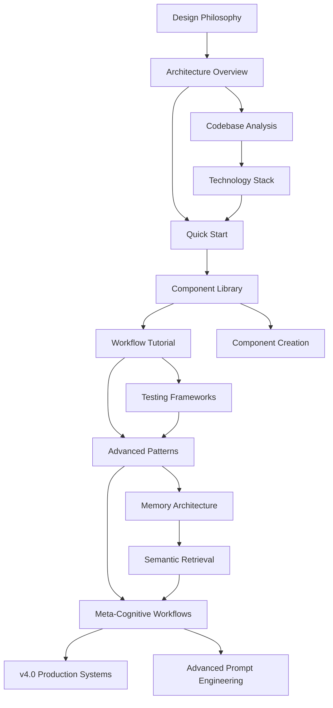

# Master Documentation Index

> [!abstract] Documentation Navigation Hub
> Complete navigation system for PKB + SPES documentation across all tiers. This index organizes 28 comprehensive documents totaling ~1.5MB of technical content into logical learning paths and reference hierarchies.

---

## Quick Navigation

| Your Goal                   | Start Here                                                      | Time Investment |
| --------------------------- | --------------------------------------------------------------- | --------------- |
| **New to SPES**             | [[08-quick-start-guide-202512271150-010]]                       | 2-3 hours       |
| **Understand Architecture** | [[03-system-architecture-overview-part1-202512271150-004]]      | 4-5 hours       |
| **Build Components**        | [[07-component-library-reference-202512271150-008]]             | 3-4 hours       |
| **Advanced Workflows**      | [[15-ADVANCED-WORKFLOW-PATTERNS]]                               | 3-4 hours       |
| **Production Deployment**   | [[prompt-engineering-agent-enhanced-tot-v400-202512271150-015]] | 4-5 hours       |
| **Contribute**              | [[16-COMMUNITY-CONTRIBUTION-GUIDE]]                             | 2 hours         |

---

## Documentation Structure Overview

```
📚 Documentation Hierarchy (4 Tiers)
│
├── Tier 1: Foundations (2 docs) — WHY & WHAT
│   ├── Design philosophy
│   └── Documentation architecture
│
├── Tier 2: Reference (4 docs) — HOW (Technical Specs)
│   ├── System architecture (2 parts)
│   ├── Codebase analysis
│   └── Technology stack
│
├── Tier 3: Tutorials (7 docs) — IMPLEMENTATION (Practical)
│   ├── Quick start
│   ├── Workflow tutorials
│   ├── Component creation
│   └── Integration guides
│
└── Tier 4: Advanced (15 docs) — MASTERY (Production & Research)
    ├── Advanced patterns (5 docs)
    ├── Production systems (5 docs)
    └── Strategic planning (2 docs)
```

---

## Tier 1: Foundations (Start Here)

**Location**: `00-meta/documentation/tier1-foundations/`

These documents answer **WHY** this system exists and **WHAT** it encompasses.

### 1. [Design Philosophy & Principles](tier1-foundations/05-design-philosophy-principles-202512271150-006.md)
- **Read First** — Foundational thinking
- **Target**: All users, architects, contributors
- **Time**: 60 minutes
- **Key Topics**: LEGO + Living Library metaphor, five first principles, decision frameworks, anti-patterns
- **Prerequisites**: None

### 2. [Documentation Architecture Master](tier1-foundations/00-documentation-architecture-master-202512271150-001.md)
- **Navigation map** for entire 32-document suite
- **Target**: Documentation strategists, project managers
- **Time**: 30 minutes
- **Key Topics**: 8-tier organization, success metrics, documentation-first philosophy
- **Note**: This is aspirational (plans 32 docs, 28 currently exist)

---

## Tier 2: Reference (Technical Specifications)

**Location**: `00-meta/documentation/tier2-reference/`

Deep technical specifications answering **HOW** the system works.

### 3. [System Architecture Overview — Part 1](tier2-reference/03-system-architecture-overview-part1-202512271150-004.md)
- **Core technical reference** (Sections 1-8)
- **Target**: Architects, developers, advanced users
- **Time**: 2-3 hours
- **Key Topics**: Component architecture, LLM adapters, design patterns, deployment architecture
- **Prerequisites**: [[05-design-philosophy-principles-202512271150-006]]

### 4. [System Architecture Overview — Part 2](tier2-reference/04-system-architecture-overview-part2-202512271150-005.md)
- **Continuation** of architecture (Sections 9-20)
- **Target**: Architects, developers
- **Time**: 2-3 hours
- **Key Topics**: Workflow orchestration, memory architecture, technology stack, use cases
- **Prerequisites**: Part 1

### 5. [Codebase Analysis Complete](tier2-reference/01-codebase-analysis-complete-202512271150-002.md)
- **Inventory** of 89 actual codebase files
- **Target**: Developers, system analysts
- **Time**: 1-2 hours
- **Key Topics**: Component catalog, maturity assessment, 165+ concept tags, migration tracking
- **Use**: Reference when developing or extending system

### 6. [Technology Stack Deep Dive](tier2-reference/06-technology-stack-deep-dive-202512271150-007.md)
- **Complete infrastructure** specifications
- **Target**: DevOps, system administrators, developers
- **Time**: 2-3 hours
- **Key Topics**: Obsidian config, LLM SDKs (Claude/Gemini/OpenAI/Ollama), Python runtime, embeddings
- **Use**: Setup, troubleshooting, integration

---

## Tier 3: Tutorials (Implementation Guides)

**Location**: `00-meta/documentation/tier3-tutorials/`

Practical implementation guidance for **building** with SPES.

### 7. [Quick Start Guide](tier3-tutorials/08-quick-start-guide-202512271150-010.md) ⭐ **START HERE IF NEW**
- **Hands-on tutorial** from zero to working system
- **Target**: New users, implementers
- **Time**: 2-3 hours
- **Key Topics**: Installation, vault setup, first components, first workflow, verification
- **Format**: Step-by-step with verification at each stage

### 8. [Workflow Execution Tutorial](tier3-tutorials/09-workflow-execution-tutorial-202512271150-011.md)
- **6 progressive tutorials** for workflow design
- **Target**: Workflow designers, advanced users
- **Time**: 3-4 hours
- **Key Topics**: Sequential, context handoff, multi-LLM, conditional, error handling, production
- **Prerequisites**: [[08-quick-start-guide-202512271150-010]]

### 9. [Component Library Reference](tier3-tutorials/07-component-library-reference-202512271150-008.md)
- **Complete specification** of SPES component system
- **Target**: Prompt engineers, workflow designers
- **Time**: 2-3 hours
- **Key Topics**: Component types, metadata, catalog, composition patterns, versioning, testing
- **Use**: Building reusable components

### 10. [Domain Templates](tier3-tutorials/07-domain-templates-202512271150-009.md)
- **4 production-ready templates**
- **Target**: Prompt engineers, template developers
- **Time**: 1-2 hours
- **Key Topics**: Document extraction, code review, decision analysis, classification
- **Use**: Starting point for domain-specific prompts

### 11. [Component Creation Guide](tier3-tutorials/11-component-creation-guide-202512271150-013.md)
- **Master component design**
- **Target**: Component designers, workflow builders
- **Time**: 2 hours
- **Key Topics**: Anatomy, instructions, personas, formats, constraints, testing
- **Prerequisites**: [[07-component-library-reference-202512271150-008]]

### 12. [Intelligence Layer Setup](tier3-tutorials/10-intelligence-layer-setup-202512271150-012.md)
- **Configure all LLM providers**
- **Target**: System administrators, advanced users
- **Time**: 1-2 hours
- **Key Topics**: Unified adapter interface, cloud LLMs, capability detection
- **Use**: Multi-LLM integration

### 13. [Implementation Guide](tier3-tutorials/implementation-guide-202512271150-014.md)
- **Deployment options** for prompt engineering agent v4.0
- **Target**: Implementers, DevOps
- **Time**: 1 hour
- **Key Topics**: Full system prompt, modular loading, Claude Projects integration
- **Use**: Production deployment

---

## Tier 4: Advanced Topics & Production Systems

**Location**: `02-projects/_spes-sequential-prompt-engineering-system/`

### Subsection A: Advanced Patterns (04-advanced-topics/)

#### 14. [Testing Frameworks](04-advanced-topics/13-TESTING-FRAMEWORKS.md)
- **Comprehensive testing** for SPES workflows
- **Target**: QA engineers, advanced developers
- **Time**: 2-3 hours
- **Key Topics**: Test pyramid, component testing, quality metrics, workflow validation, CI/CD
- **Prerequisites**: Understanding of component system

#### 15. [Advanced Workflow Patterns](04-advanced-topics/15-ADVANCED-WORKFLOW-PATTERNS.md)
- **10 advanced orchestration patterns**
- **Target**: Workflow architects, systems designers
- **Time**: 3-4 hours
- **Key Topics**: Multi-agent, conditional, iterative, human-in-loop, error recovery, state management
- **Prerequisites**: [[09-workflow-execution-tutorial-202512271150-011]]

#### 16. [ToT Cognitive Architecture](04-advanced-topics/01-tot-cognitive-architecture-202512271150-003.md)
- **Tree of Thoughts v4.0** framework
- **Target**: Prompt engineers, AI researchers
- **Time**: 2 hours
- **Key Topics**: Constraint tracking, state classification, backtracking protocols
- **Prerequisites**: Advanced prompt engineering knowledge

#### 17. [PKB Integration Systems](04-advanced-topics/12-PKB-INTEGRATION-SYSTEMS.md)
- **Deep integration** between SPES and Obsidian
- **Target**: Knowledge architects, advanced users
- **Time**: 2 hours
- **Key Topics**: Smart Connections, Dataview, Templater, Meta Bind, workflow-to-PKB pipelines
- **Prerequisites**: Obsidian plugin familiarity

#### 18. [Advanced Memory Architecture](04-advanced-topics/17-ADVANCED-MEMORY-ARCHITECTURE.md)
- **Three-layer cognitive memory** system
- **Target**: System architects, advanced practitioners
- **Time**: 3 hours
- **Key Topics**: Working → Short-term → Long-term memory, event-driven management, self-healing
- **Prerequisites**: System architecture understanding

#### 19. [Semantic Retrieval & MCP](04-advanced-topics/18-SEMANTIC-RETRIEVAL-MCP.md)
- **Vector embeddings** + Model Context Protocol
- **Target**: ML engineers, system architects
- **Time**: 4 hours
- **Key Topics**: Semantic search, Smart Connections plugin, hybrid retrieval, query anchors
- **Prerequisites**: [[17-ADVANCED-MEMORY-ARCHITECTURE]]

#### 20. [Meta-Cognitive Workflows](04-advanced-topics/19-META-COGNITIVE-WORKFLOWS.md)
- **Self-improving LLM workflows**
- **Target**: AI engineers, prompt architects
- **Time**: 4-5 hours
- **Key Topics**: Constitutional AI, ReAct framework, reflection prompting, Tree of Thoughts, Chain of Density
- **Prerequisites**: [[18-SEMANTIC-RETRIEVAL-MCP]]

#### 21. [Advanced Prompt Engineering](04-advanced-topics/20-ADVANCED-PROMPT-ENGINEERING.md)
- **Production-grade prompt engineering**
- **Target**: Prompt engineers, AI architects
- **Time**: 5 hours
- **Key Topics**: System prompt architecture, few-shot mastery, CoT mastery, prompt optimization, production deployment
- **Prerequisites**: [[19-META-COGNITIVE-WORKFLOWS]]

#### 22. [Community Contribution Guide](04-advanced-topics/16-COMMUNITY-CONTRIBUTION-GUIDE.md)
- **Standards** for contributing to SPES
- **Target**: Contributors, community members
- **Time**: 2 hours
- **Key Topics**: Contribution types, quality standards, workflows, recognition system
- **Use**: Before contributing components or documentation

---

### Subsection B: Production Systems (05-production-systems/)

#### 23. [Prompt Engineering Agent v4.0 — Enhanced ToT](05-production-systems/prompt-engineering-agent-enhanced-tot-v400-202512271150-015.md)
- **Complete v4.0 system prompt** (4,474 lines)
- **Target**: Advanced practitioners, production deployments
- **Time**: 4-5 hours
- **Key Topics**: 9-phase pipeline, ThoughtNode structure, monitoring, calibration
- **Status**: Production-ready

#### 24. [Prompt Engineering Agent v4.0 — Hybrid Orchestration](05-production-systems/prompt-engineering-agent-v400-hybrid-totcot-202512271150-016.md)
- **Hybrid ToT+CoT subsystem** (2,970 lines)
- **Target**: Complex problem solvers, architects
- **Time**: 3 hours
- **Key Topics**: 5-phase algorithm, comparative synthesis, integration patterns
- **Status**: Production-ready

#### 25. [v4.0 Quick Start](05-production-systems/README-202512271150-017.md)
- **Navigation hub** for v4.0 system
- **Target**: New v4.0 users
- **Time**: 20 minutes
- **Key Topics**: Package contents, innovations, quick start paths
- **Use**: Entry point to v4.0

#### 26. [Tier 4 Documentation Plan](05-production-systems/TIER-4-DOCUMENTATION-PLAN.md)
- **Original strategic plan** (superseded by file 27)
- **Target**: Project managers, architects
- **Time**: 1 hour
- **Status**: Historical reference only

#### 27. [Tier 4 Documentation Plan — Refined](05-production-systems/TIER-4-DOCUMENTATION-PLAN-REFINED.md)
- **Enhanced Tier 4 strategy** v2.0
- **Target**: Project managers, planning teams
- **Time**: 2 hours
- **Key Topics**: 6 advanced documents, phased rollout (4-5 months), success metrics
- **Status**: Active planning document

---

## Recommended Learning Paths

### Path 1: Beginner to Practitioner (20-25 hours)
```
1. Design Philosophy (1h)
   ↓
2. Quick Start Guide (2-3h)
   ↓
3. Component Library Reference (2-3h)
   ↓
4. Workflow Execution Tutorial (3-4h)
   ↓
5. Component Creation Guide (2h)
   ↓
6. System Architecture Part 1 (2-3h)
   ↓
7. Domain Templates (1-2h)
   ↓
8. Intelligence Layer Setup (1-2h)
   ↓
9. Testing Frameworks (2-3h)
```

**Outcome**: Can build, test, and deploy basic SPES workflows

---

### Path 2: Advanced Practitioner (35-40 hours)
**Prerequisites**: Complete Path 1

```
1. System Architecture Part 2 (2-3h)
   ↓
2. Advanced Workflow Patterns (3-4h)
   ↓
3. Advanced Memory Architecture (3h)
   ↓
4. Semantic Retrieval & MCP (4h)
   ↓
5. Meta-Cognitive Workflows (4-5h)
   ↓
6. Advanced Prompt Engineering (5h)
   ↓
7. PKB Integration Systems (2h)
   ↓
8. ToT Cognitive Architecture (2h)
```

**Outcome**: Can design sophisticated multi-agent systems with memory, semantic search, and meta-cognition

---

### Path 3: Production Deployment (15-20 hours)
**Prerequisites**: Path 1 complete

```
1. Technology Stack Deep Dive (2-3h)
   ↓
2. System Architecture (both parts) (4-6h)
   ↓
3. Testing Frameworks (2-3h)
   ↓
4. Advanced Workflow Patterns (3-4h)
   ↓
5. Implementation Guide (1h)
   ↓
6. v4.0 Enhanced ToT (4-5h)
```

**Outcome**: Can deploy production SPES systems with monitoring, testing, and quality gates

---

### Path 4: Contributor (10-12 hours)
**Prerequisites**: Path 1 complete

```
1. Community Contribution Guide (2h)
   ↓
2. Component Creation Guide (2h)
   ↓
3. Testing Frameworks (2-3h)
   ↓
4. Codebase Analysis (1-2h)
   ↓
5. Technology Stack (2-3h)
```

**Outcome**: Can contribute high-quality components, workflows, and documentation

---

## Document Relationship Map



---

## Document Statistics

| Category | Count | Total Size | Avg. Size |
|----------|-------|------------|-----------|
| **Tier 1** | 2 | ~45KB | 22KB |
| **Tier 2** | 4 | ~213KB | 53KB |
| **Tier 3** | 7 | ~320KB | 46KB |
| **Tier 4** | 15 | ~920KB | 61KB |
| **TOTAL** | **28** | **~1.5MB** | **54KB** |

---

## Quick Reference Tables

### By Time Investment

| Document | Time | Difficulty | Prerequisite |
|----------|------|------------|--------------|
| Design Philosophy | 1h | Easy | None |
| Quick Start | 2-3h | Easy | None |
| Component Library | 2-3h | Medium | Quick Start |
| Domain Templates | 1-2h | Medium | Component Library |
| Workflow Tutorial | 3-4h | Medium | Quick Start |
| System Architecture | 4-6h | Hard | Design Philosophy |
| Advanced Patterns | 3-4h | Hard | Workflow Tutorial |
| Testing Frameworks | 2-3h | Medium | Component Library |
| Memory Architecture | 3h | Hard | System Architecture |
| Semantic Retrieval | 4h | Very Hard | Memory Architecture |
| Meta-Cognitive | 4-5h | Very Hard | Semantic Retrieval |
| Advanced Prompt Eng | 5h | Very Hard | Meta-Cognitive |
| v4.0 Enhanced ToT | 4-5h | Very Hard | Advanced Prompt Eng |

---

### By Use Case

| I Want To... | Read These Documents |
|--------------|---------------------|
| Get started with SPES | 1, 7, 9 |
| Build my first workflow | 7, 8, 9 |
| Create reusable components | 9, 10, 11 |
| Integrate multiple LLMs | 6, 12 |
| Build advanced workflows | 8, 15 |
| Implement testing | 14 |
| Deploy to production | 6, 13, 23, 24 |
| Contribute to SPES | 22, 5, 14 |
| Design memory systems | 18, 19 |
| Master prompt engineering | 16, 20, 21, 23 |
| Understand architecture | 3, 4, 5 |

---

## Integration with Vault Systems

### Links to Other PKB Systems

- **SPES Project**: [02-projects/_spes-sequential-prompt-engineering-system/](../../02-projects/_spes-sequential-prompt-engineering-system/)
- **Session Memory**: [[00-meta/session-memory]]
- **Project Tracker**: [[00-meta/project-tracker]]
- **Active Context**: [[.claude/core/activeContext]]
- **Skills Registry**: [[.claude/core/activeSkills]]

---

## Maintenance & Updates

**Last Updated**: 2026-01-07 (Initial organization)
**Maintained By**: Claude Code + User
**Update Frequency**: As new documents are created or refined

**Recent Changes**:
- 2026-01-07: Reorganized all 28 documents from flat structure into tiered hierarchy
- 2026-01-07: Created master navigation index
- 2026-01-07: Parallel agent analysis completed

---

## Document Quality Matrix

| Tier | Completeness | Technical Depth | Cross-Referencing | Overall |
|------|--------------|-----------------|-------------------|---------|
| **Tier 1** | 9/10 | 8/10 | 6/10 | 8/10 |
| **Tier 2** | 9/10 | 10/10 | 7/10 | 9/10 |
| **Tier 3** | 8/10 | 9/10 | 7/10 | 8/10 |
| **Tier 4** | 8/10 | 9/10 | 6/10 | 8/10 |
| **Overall** | **8.5/10** | **9/10** | **6.5/10** | **8.3/10** |

---

**Next Steps**:
1. Add cross-document wiki-links within each file
2. Create quick-reference cheatsheets
3. Build visual documentation map
4. Complete truncated documents (18-20)
5. Implement missing documents from Tier 4 plan

---

_This master index is a living document. Update as documentation evolves._
