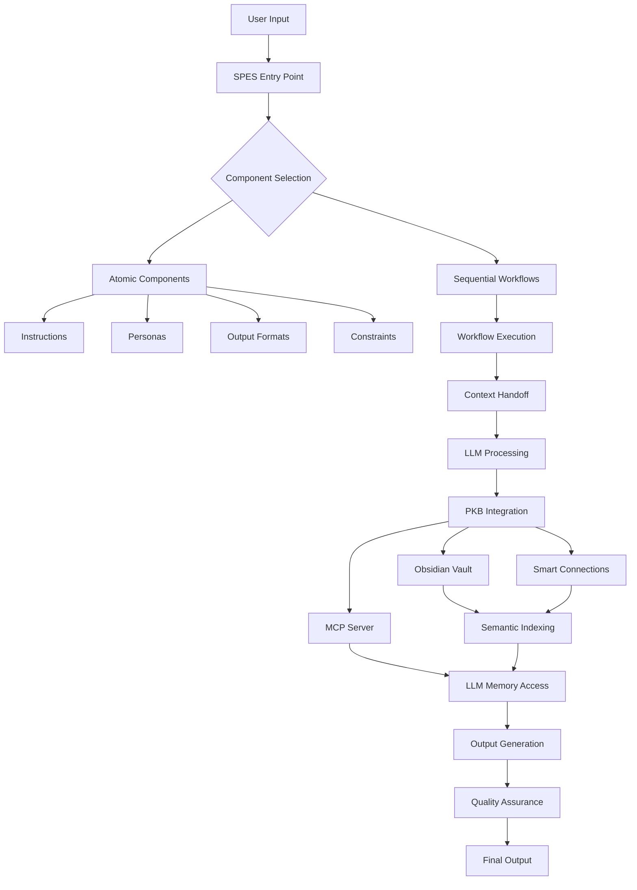

# SPES/PKB Codebase Documentation Architecture

## 🎯 Purpose & Scope

This documentation suite provides comprehensive coverage of a **Sequential Prompt Engineering System (SPES)** integrated with a **Personal Knowledge Base (PKB)** architecture, specifically designed for LLM-powered knowledge management and prompt engineering workflows.

**Source**: Repomix-generated codebase snapshot  
**Coverage**: Complete system architecture, components, workflows, and integration protocols  
**Target Audience**: AI systems, prompt engineers, knowledge workers, PKB architects  
**Documentation Philosophy**: Explicit detail on ALL system aspects—no assumptions, no shortcuts

---

## 📚 Documentation Suite Structure

### **Tier 1: Foundational Architecture** (Must Read First)

These documents establish core understanding of system design and purpose.

| Document | Purpose | Page Count | Priority |
|----------|---------|------------|----------|
| **01-System-Architecture-Overview.md** | Complete system design, component relationships, data flows | 50-80 | CRITICAL |
| **02-Design-Philosophy-Rationale.md** | Why this architecture, design decisions, trade-offs | 30-40 | CRITICAL |
| **03-Technology-Stack-Reference.md** | Obsidian, Smart Connections, MCP, embeddings, tooling | 40-60 | HIGH |
| **04-Directory-Structure-Guide.md** | File organization, folder hierarchy, naming conventions | 25-35 | HIGH |

### **Tier 2: Component Library** (Reference Documentation)

Exhaustive coverage of every reusable component in the system.

| Document | Purpose | Page Count | Priority |
|----------|---------|------------|----------|
| **05-Component-Library-Index.md** | Complete catalog of all components with metadata | 40-60 | CRITICAL |
| **06-Atomic-Components-Reference.md** | Personas, instructions, output formats, constraints | 80-120 | CRITICAL |
| **07-Sequential-Workflow-Catalog.md** | All workflow definitions, transitions, orchestration | 60-90 | HIGH |
| **08-Metadata-Schema-Specification.md** | YAML frontmatter, tags, properties, validation rules | 50-70 | HIGH |

### **Tier 3: Operational Guides** (How-To Documentation)

Step-by-step implementation and usage guides.

| Document | Purpose | Page Count | Priority |
|----------|---------|------------|----------|
| **09-Quick-Start-Guide.md** | Get up and running in 30 minutes | 15-20 | CRITICAL |
| **10-Component-Usage-Tutorial.md** | How to use and compose components | 40-60 | HIGH |
| **11-Workflow-Implementation-Guide.md** | Building sequential prompt chains | 50-70 | HIGH |
| **12-PKB-Integration-Manual.md** | Obsidian setup, Smart Connections, embedding workflows | 60-80 | HIGH |

### **Tier 4: Integration Protocols** (System Connections)

Documentation for connecting SPES with external systems.

| Document | Purpose | Page Count | Priority |
|----------|---------|------------|----------|
| **13-LLM-Integration-Protocol.md** | Claude, GPT, Gemini integration specs | 45-65 | CRITICAL |
| **14-MCP-Server-Configuration.md** | Model Context Protocol setup and usage | 40-60 | HIGH |
| **15-Smart-Connections-Integration.md** | Semantic memory retrieval system | 50-70 | HIGH |
| **16-Memory-Bank-Architecture.md** | `.claude/` directory structure and protocols | 35-50 | HIGH |

### **Tier 5: Specialized Topics** (Deep Dives)

Advanced topics for power users and system architects.

| Document | Purpose | Page Count | Priority |
|----------|---------|------------|----------|
| **17-Advanced-Tagging-System.md** | Multi-dimensional taxonomy, query patterns | 45-60 | MEDIUM |
| **18-Semantic-Markup-Protocols.md** | Inline fields, color coding, advanced PKB markers | 55-75 | MEDIUM |
| **19-Component-Development-Guide.md** | Creating new atomic components and workflows | 50-70 | MEDIUM |
| **20-Quality-Assurance-Framework.md** | Validation, testing, compliance checking | 40-55 | MEDIUM |

### **Tier 6: Maintenance & Operations** (Ongoing Management)

Documentation for system maintenance and troubleshooting.

| Document | Purpose | Page Count | Priority |
|----------|---------|------------|----------|
| **21-Troubleshooting-Diagnostics.md** | Common issues, solutions, debugging workflows | 50-70 | HIGH |
| **22-Maintenance-Procedures.md** | Regular upkeep, refactoring, optimization | 35-50 | MEDIUM |
| **23-Version-Control-Strategy.md** | Git workflows, component versioning, changelog management | 30-45 | MEDIUM |
| **24-Backup-Recovery-Procedures.md** | Data protection, disaster recovery protocols | 25-35 | MEDIUM |

### **Tier 7: Reference Materials** (Lookup Resources)

Quick-reference materials for daily use.

| Document | Purpose | Page Count | Priority |
|----------|---------|------------|----------|
| **25-Metadata-Field-Dictionary.md** | Complete listing of all metadata fields with definitions | 60-80 | HIGH |
| **26-Tag-Taxonomy-Reference.md** | Hierarchical tag structure across all domains | 70-90 | HIGH |
| **27-Component-Template-Library.md** | Reusable templates for rapid component creation | 40-60 | MEDIUM |
| **28-Workflow-Pattern-Catalog.md** | Common sequential patterns with examples | 45-65 | MEDIUM |

### **Tier 8: Case Studies & Examples** (Practical Applications)

Real-world usage examples and implementation patterns.

| Document | Purpose | Page Count | Priority |
|----------|---------|------------|----------|
| **29-Case-Study-Research-Workflow.md** | Literature review → synthesis → note creation | 30-40 | MEDIUM |
| **30-Case-Study-Content-Generation.md** | Prompt chain for article/document creation | 25-35 | MEDIUM |
| **31-Case-Study-Code-Documentation.md** | Automated technical documentation generation | 30-40 | LOW |
| **32-Example-Component-Compositions.md** | 20+ real-world component combinations | 50-70 | MEDIUM |

---

## 🔍 Key System Components Identified

### **00-meta/** (Meta-Documentation Layer)
- System indices, master manuals, operational guides
- Session memory, project tracking, vault mapping
- Reference MOCs, metadata schemas, tag taxonomies
- User preferences, folder structures

### **02-projects/_spes-sequential-prompt-engineering-system/** (Core SPES Implementation)

#### **00-project-meta/** - Project Management
- Project charter, architecture overview, implementation roadmap
- Quick reference guides, template library
- System design documentation

#### **01-claude-librarian-instructions/** - LLM Operating Procedures
- Core identity and behavioral protocols
- Component management SOPs
- Sequential workflow orchestration
- Context handoff procedures
- Quality assurance checklists
- Metadata tagging standards
- Usage analytics protocols

#### **02-component-library/** - Reusable Components

##### **atomic/instructions/**
- `claude-system-instructions-pkb-architect-v2.0.0.md` - Claude-specific PKB protocols
- `gemini-system-instructions-pkb-architect-v1.0.0.md` - Gemini-specific adaptations
- `component-instruction-foundational-scaffold-v1.0.0.md` - Base instruction framework
- `dataview-inline-queries-generation-v2.0.0.md` - Obsidian Dataview integration

##### **atomic/output-formats/**
- `component-format-atomic-extraction-signaling-v1.0.0.md` - Note spawning markers
- `component-format-epistemic-confidence-encoding-protocol-v1.0.0.md` - Certainty indicators
- `component-format-semantic-relationship-typing-protocol-v1.0.0.md` - Link type annotations

##### **atomic/personas/**
- `persona-expert-technical-analyst.md` - Specialized LLM personas
- Persona index and catalog

### **999-codebas+pkb/** (Integration Layer)
- `memory-analysis-system-integration-purposal.md` - Smart Connections + MCP integration specification

---

## 🏗️ Architecture Overview



### **System Layers**

1. **Component Layer** - Atomic building blocks (personas, instructions, constraints, formats)
2. **Orchestration Layer** - Sequential workflows, context management, handoff protocols
3. **Intelligence Layer** - LLM integration (Claude, GPT, Gemini)
4. **Knowledge Layer** - PKB/Obsidian integration, semantic retrieval
5. **Memory Layer** - Smart Connections embeddings, MCP protocol, vector search

---

## 📊 Documentation Metrics

| Metric | Value | Notes |
|--------|-------|-------|
| **Total Documents** | 32 | Complete coverage across 8 tiers |
| **Estimated Total Pages** | 1,400-1,900 | Comprehensive detail level |
| **Core Critical Docs** | 8 | Must-read for system understanding |
| **Technical References** | 12 | Lookup resources for daily use |
| **Implementation Guides** | 7 | Step-by-step how-to documentation |
| **Integration Specs** | 5 | External system connection protocols |

---

## 🎯 Documentation Principles

### **1. Explicit Detail Mandate**
- **No assumptions** - Every concept explained from first principles
- **No shortcuts** - Complete coverage, not abbreviated summaries
- **No placeholders** - All sections fully written, no TODOs
- **No references without definition** - Terms defined before use

### **2. Production-Ready Output**
- Copy-paste ready for immediate use
- Runnable code examples
- Complete configuration files
- Tested procedures

### **3. Multi-Audience Optimization**
- **Beginners**: Clear explanations, analogies, step-by-step guidance
- **Practitioners**: Practical examples, troubleshooting, workflows
- **Architects**: Design rationale, trade-offs, extensibility patterns
- **AI Systems**: Structured, parseable, semantically rich

### **4. Cross-Reference Network**
- Every document links to related concepts
- Prerequisites explicitly identified
- Bi-directional connections maintained
- Knowledge graph optimized

### **5. Versioning & Maintenance**
- Every component has semantic version
- Change history documented
- Deprecation notices included
- Migration guides provided

---

## 🚀 Recommended Reading Paths

### **Path 1: Quick Start (2-3 hours)**
Essential for getting started immediately.

1. **09-Quick-Start-Guide.md** (30 min)
2. **01-System-Architecture-Overview.md** - Skim overview section (30 min)
3. **10-Component-Usage-Tutorial.md** - Basic usage (60 min)
4. **12-PKB-Integration-Manual.md** - Obsidian setup (45 min)

### **Path 2: Deep Understanding (1-2 weeks)**
Comprehensive system mastery.

1. **02-Design-Philosophy-Rationale.md** (Day 1)
2. **01-System-Architecture-Overview.md** (Day 1-2)
3. **03-Technology-Stack-Reference.md** (Day 2)
4. **05-Component-Library-Index.md** (Day 3)
5. **06-Atomic-Components-Reference.md** (Day 3-4)
6. **07-Sequential-Workflow-Catalog.md** (Day 4-5)
7. **13-LLM-Integration-Protocol.md** (Day 5-6)
8. **15-Smart-Connections-Integration.md** (Day 6-7)
9. **17-Advanced-Tagging-System.md** (Day 7-8)
10. **19-Component-Development-Guide.md** (Day 8-10)

### **Path 3: Implementation Focus (3-5 days)**
For developers building on this system.

1. **09-Quick-Start-Guide.md** (Day 1 AM)
2. **04-Directory-Structure-Guide.md** (Day 1 PM)
3. **11-Workflow-Implementation-Guide.md** (Day 2)
4. **14-MCP-Server-Configuration.md** (Day 3 AM)
5. **16-Memory-Bank-Architecture.md** (Day 3 PM)
6. **19-Component-Development-Guide.md** (Day 4)
7. **20-Quality-Assurance-Framework.md** (Day 5)

### **Path 4: Reference Use (Ongoing)**
Daily lookup resources.

- **25-Metadata-Field-Dictionary.md** - Lookup metadata fields
- **26-Tag-Taxonomy-Reference.md** - Find appropriate tags
- **27-Component-Template-Library.md** - Copy templates
- **21-Troubleshooting-Diagnostics.md** - Fix issues

---

## 🔧 Generation Workflow

### **Phase 1: Foundational Documents** (Week 1)
Generate Tier 1 documents establishing core architecture and philosophy.

**Priority Order**:
1. 01-System-Architecture-Overview.md
2. 02-Design-Philosophy-Rationale.md
3. 03-Technology-Stack-Reference.md
4. 04-Directory-Structure-Guide.md

### **Phase 2: Component Documentation** (Week 2)
Generate Tier 2 comprehensive component references.

**Priority Order**:
1. 05-Component-Library-Index.md
2. 06-Atomic-Components-Reference.md
3. 08-Metadata-Schema-Specification.md
4. 07-Sequential-Workflow-Catalog.md

### **Phase 3: Implementation Guides** (Week 3)
Generate Tier 3 operational how-to documentation.

**Priority Order**:
1. 09-Quick-Start-Guide.md (CRITICAL PATH)
2. 10-Component-Usage-Tutorial.md
3. 11-Workflow-Implementation-Guide.md
4. 12-PKB-Integration-Manual.md

### **Phase 4: Integration Protocols** (Week 4)
Generate Tier 4 system connection specifications.

**Priority Order**:
1. 13-LLM-Integration-Protocol.md
2. 15-Smart-Connections-Integration.md
3. 14-MCP-Server-Configuration.md
4. 16-Memory-Bank-Architecture.md

### **Phase 5: Advanced Topics** (Week 5)
Generate Tier 5 deep-dive documentation.

**Priority Order**:
1. 17-Advanced-Tagging-System.md
2. 18-Semantic-Markup-Protocols.md
3. 19-Component-Development-Guide.md
4. 20-Quality-Assurance-Framework.md

### **Phase 6: Maintenance & Operations** (Week 6)
Generate Tier 6 ongoing management documentation.

**Priority Order**:
1. 21-Troubleshooting-Diagnostics.md
2. 22-Maintenance-Procedures.md
3. 23-Version-Control-Strategy.md
4. 24-Backup-Recovery-Procedures.md

### **Phase 7: Reference Materials** (Week 7)
Generate Tier 7 lookup resources.

**Priority Order**:
1. 25-Metadata-Field-Dictionary.md
2. 26-Tag-Taxonomy-Reference.md
3. 27-Component-Template-Library.md
4. 28-Workflow-Pattern-Catalog.md

### **Phase 8: Case Studies** (Week 8)
Generate Tier 8 practical examples and patterns.

**Priority Order**:
1. 32-Example-Component-Compositions.md
2. 29-Case-Study-Research-Workflow.md
3. 30-Case-Study-Content-Generation.md
4. 31-Case-Study-Code-Documentation.md

---

## 📋 Document Generation Standards

### **Every Document Must Include**:

1. **Metadata Header**
   ```yaml
   ---
   title: [Document Title]
   document_type: [architecture|reference|guide|tutorial|specification]
   tier: [1-8]
   priority: [critical|high|medium|low]
   version: [semver]
   status: [draft|review|published|deprecated]
   prerequisites: [List of required prior reading]
   estimated_reading_time: [minutes]
   last_updated: [ISO date]
   ---
   ```

2. **Executive Summary**
   - One-page overview
   - Key concepts introduced
   - Target audience
   - What readers will learn

3. **Table of Contents**
   - For documents >10 pages
   - Linked headers
   - Section summaries

4. **Comprehensive Body**
   - Explicit detail on ALL topics
   - Code examples where applicable
   - Visual diagrams (Mermaid)
   - Cross-references to related docs

5. **Examples Section**
   - Minimum 3 real-world examples
   - Runnable code/configurations
   - Common patterns demonstrated

6. **Troubleshooting Section**
   - Common issues
   - Solutions and workarounds
   - Diagnostic procedures

7. **Related Topics for Expansion**
   - 4-6 expansion topics
   - Connection explanations
   - Depth potential rationale
   - Priority assignments

8. **Glossary** (if technical terms used)

9. **References**
   - Internal document links
   - External resources
   - Source code locations

---

## 🎨 Visual Documentation Standards

### **Mermaid Diagram Usage**

Every document should include diagrams where they enhance understanding:

- **Architecture docs**: System diagrams, component relationships
- **Workflow docs**: Flowcharts, sequence diagrams
- **Integration docs**: Architecture diagrams, data flows
- **Reference docs**: Entity relationship diagrams, taxonomies

### **Code Block Standards**

- Always specify language: \`\`\`yaml, \`\`\`python, \`\`\`javascript
- Include comments explaining non-obvious logic
- Provide complete, runnable examples
- Show both basic and advanced usage

### **Callout Usage**

Semantic callouts for structured information:
- `[!definition]` - Formal definitions
- `[!example]` - Concrete illustrations
- `[!warning]` - Cautions and limitations
- `[!important]` - Critical information
- `[!tip]` - Best practices

---

## 🔗 Cross-Reference System

### **Internal Linking Strategy**

Every document must:
1. Link to prerequisite documents
2. Link to related concept documents
3. Link to implementation guides (from theory docs)
4. Link to reference materials (from guides)

### **Bi-Directional Links**

Create semantic connections:
- Theoretical concepts ↔ Practical implementations
- Component specs ↔ Usage examples
- Integration protocols ↔ Configuration guides
- Troubleshooting ↔ Related architecture

---

## 📊 Success Metrics

### **Documentation Completeness**

- [ ] All 32 documents generated
- [ ] All code examples tested
- [ ] All diagrams rendered correctly
- [ ] All cross-references valid
- [ ] All prerequisites identified
- [ ] All glossary terms defined

### **Quality Gates**

Each document must pass:
- Technical accuracy review
- Completeness audit (no TODOs)
- Readability assessment
- Example functionality verification
- Cross-reference validation
- Formatting consistency check

---

## 🚦 Status Tracking

| Tier | Documents | Status | Completion |
|------|-----------|--------|------------|
| Tier 1 | 4 docs | 📝 Planning | 0% |
| Tier 2 | 4 docs | 📝 Planning | 0% |
| Tier 3 | 4 docs | 📝 Planning | 0% |
| Tier 4 | 4 docs | 📝 Planning | 0% |
| Tier 5 | 4 docs | 📝 Planning | 0% |
| Tier 6 | 4 docs | 📝 Planning | 0% |
| Tier 7 | 4 docs | 📝 Planning | 0% |
| Tier 8 | 4 docs | 📝 Planning | 0% |

**Overall Progress**: 0/32 documents (0%)

---

## 🎯 Next Steps

### **Immediate Actions**:

1. **Review this architecture** - Validate completeness and structure
2. **Prioritize generation order** - Confirm Phase 1 documents
3. **Begin Tier 1 generation** - Start with 01-System-Architecture-Overview.md
4. **Establish review workflow** - Quality assurance process
5. **Set up version control** - Document change tracking

### **Generation Command Template**:

When ready to generate each document:

```
Generate [Document-Title.md] following these specifications:
- Type: [architecture|reference|guide|tutorial|specification]
- Tier: [1-8]
- Priority: [critical|high|medium|low]
- Target Length: [page count range]
- Key Topics: [list main sections]
- Prerequisites: [required prior reading]
- Special Focus: [any unique requirements]

Apply EXPLICIT DETAIL MANDATE: Comprehensive coverage with no assumptions,
complete examples, full explanations, production-ready output.
```

---

> [!abstract] Summary
> 
> This documentation architecture provides **complete coverage** of the SPES/PKB system across **8 tiers** and **32 comprehensive documents**, totaling an estimated **1,400-1,900 pages** of detailed documentation.
> 
> **Core Philosophy**: Explicit detail on ALL information—every concept explained, every component documented, every integration specified, every workflow illustrated.
> 
> **Outcome**: A self-contained knowledge repository enabling any user (human or AI) to understand, implement, extend, and maintain the entire SPES/PKB system without external dependencies or prior knowledge.

---

**STATUS**: Architecture Defined ✓  
**NEXT**: Begin Phase 1 - Generate Tier 1 Foundational Documents  
**PRIORITY**: Start with `01-System-Architecture-Overview.md` (CRITICAL)
