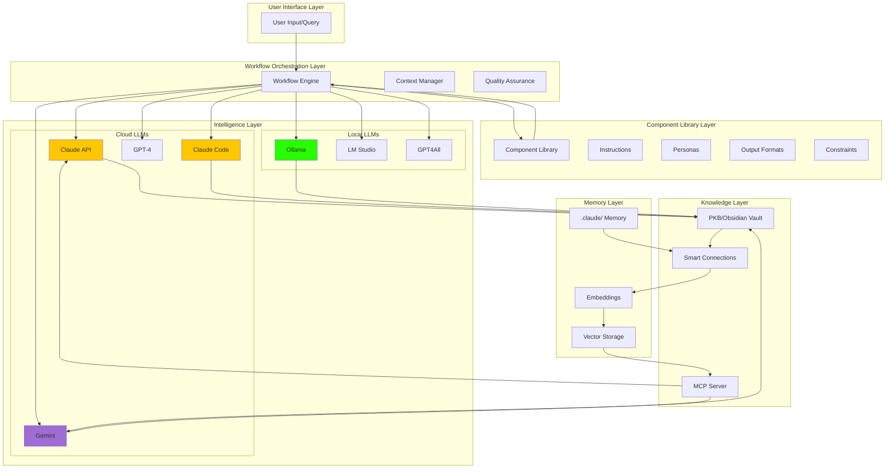
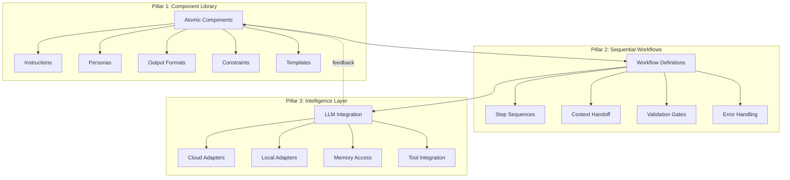
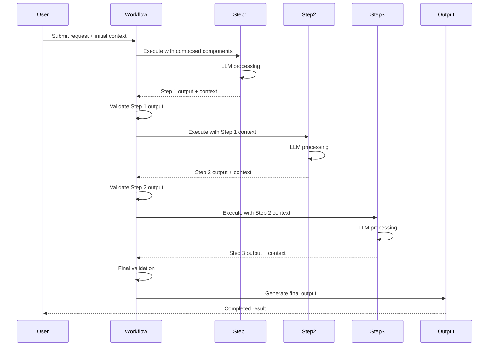
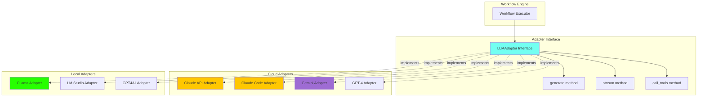
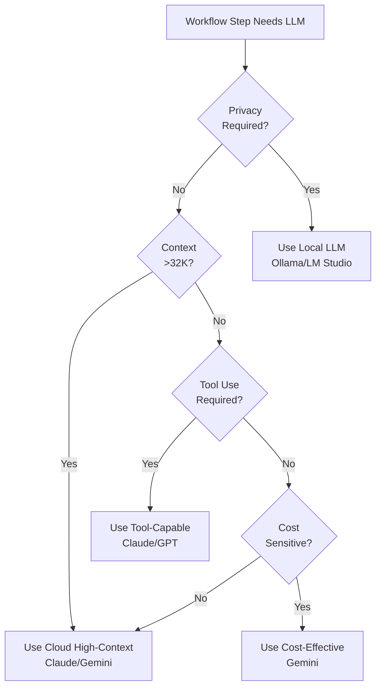
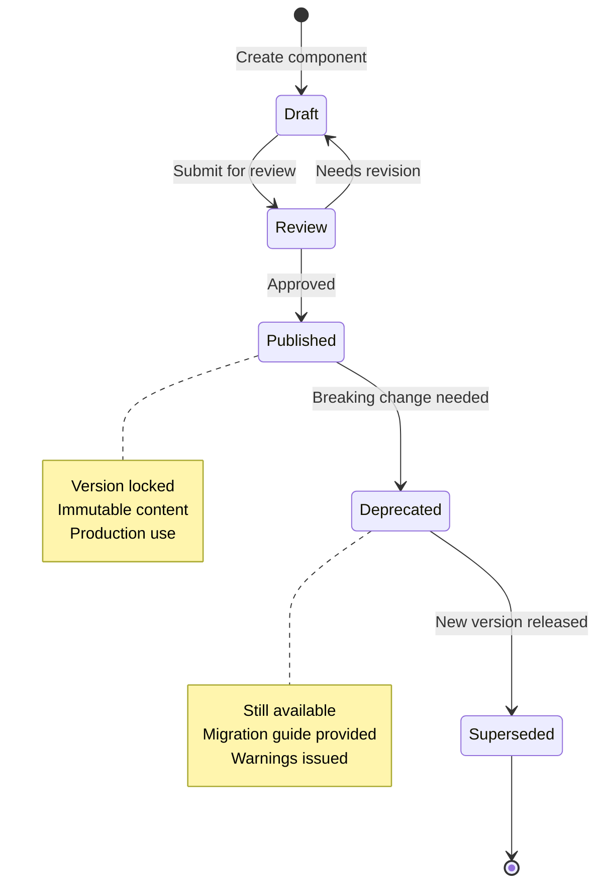
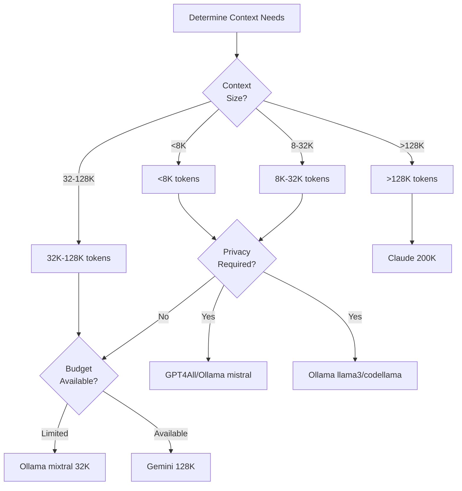
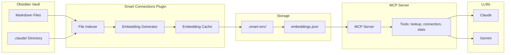
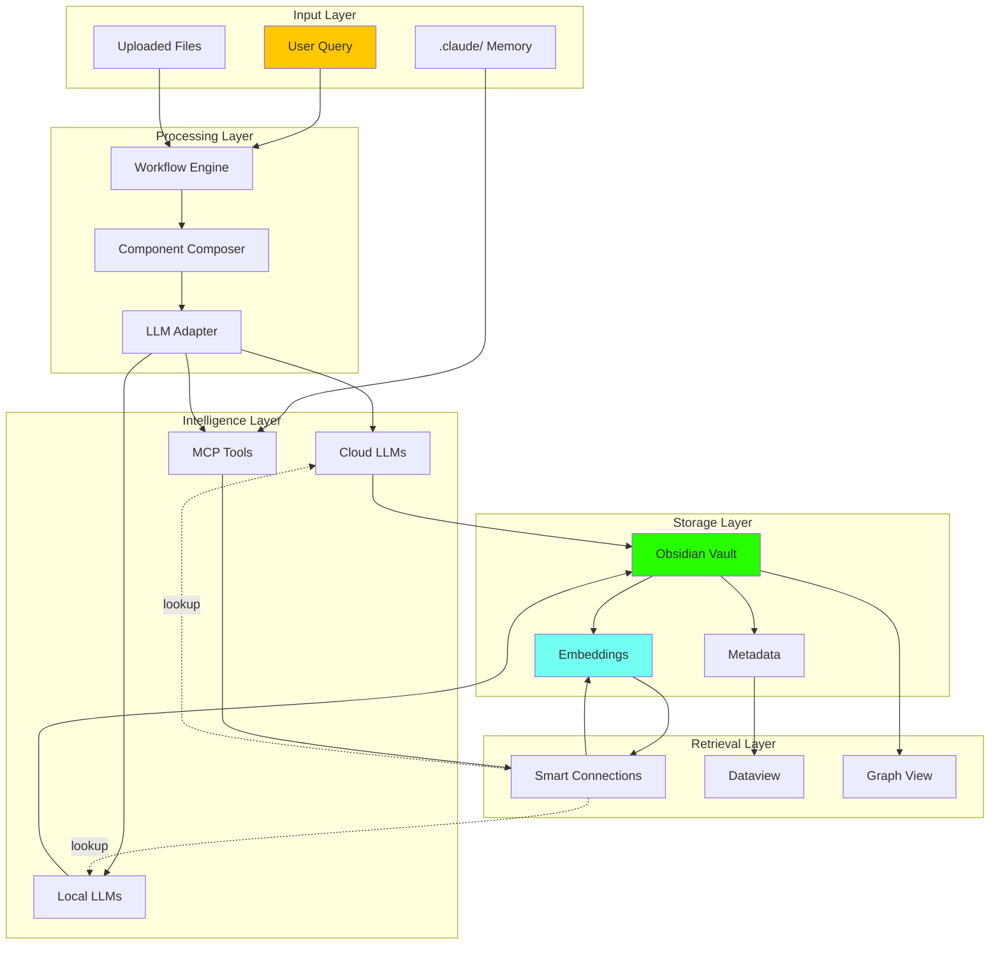

# SPES/PKB System Architecture Overview

**Version**: 2.0.0  
**Document Type**: Technical Architecture Specification  
**Audience**: System architects, developers, advanced users, AI systems  
**Scope**: Complete system topology, component relationships, integration protocols

---

## 📋 Table of Contents

1. [Executive Summary](#executive-summary)
2. [System Overview](#system-overview)
3. [Architecture Principles](#architecture-principles)
4. [Three-Pillar Architecture](#three-pillar-architecture)
5. [Component Architecture](#component-architecture)
6. [Multi-LLM Integration Layer](#multi-llm-integration-layer)
7. [PKB/Obsidian Integration](#pkbobsidian-integration)
8. [Data Architecture](#data-architecture)
9. [Workflow Orchestration](#workflow-orchestration)
10. [Memory & Semantic Retrieval](#memory--semantic-retrieval)
11. [Technology Stack](#technology-stack)
12. [Deployment Architecture](#deployment-architecture)
13. [Security Architecture](#security-architecture)
14. [Performance Characteristics](#performance-characteristics)
15. [Scalability Considerations](#scalability-considerations)
16. [Design Patterns](#design-patterns)
17. [Integration Points](#integration-points)
18. [Use Cases & Examples](#use-cases--examples)
19. [Evolution & Roadmap](#evolution--roadmap)
20. [Related Topics for Expansion](#related-topics-for-expansion)

---

## 1. Executive Summary

### 1.1 System Purpose

The **Sequential Prompt Engineering System (SPES)** integrated with **Personal Knowledge Base (PKB)** architecture is a sophisticated framework for composable, reusable prompt engineering that enables:

- **Atomic Component Composition** - LEGO-like assembly of prompt elements
- **Sequential Workflow Orchestration** - Multi-step processes with context handoff
- **Multi-LLM Integration** - Support for 7+ LLM platforms (cloud, local, specialized)
- **Semantic Memory Retrieval** - Embedding-based knowledge access via MCP
- **Knowledge Graph Enrichment** - Deep Obsidian integration with typed relationships
- **Production-Ready Operations** - QA, analytics, troubleshooting, version control

### 1.2 Architecture at a Glance



### 1.3 Key Metrics

| Metric | Value | Significance |
|--------|-------|--------------|
| **Architecture Layers** | 6 distinct layers | Separation of concerns |
| **Component Types** | 5+ categories | Atomic, composable building blocks |
| **LLM Platforms** | 7+ supported | Cloud + local + specialized |
| **Context Window Range** | 4K - 200K tokens | Adapts to LLM capabilities |
| **Knowledge Base** | Obsidian-native | Deep PKM integration |
| **Memory System** | Semantic + vector | Embedding-based retrieval |
| **Metadata Dimensions** | 6-axis tagging | Rich semantic encoding |
| **Component Versioning** | Semantic (v2.0.0) | Independent evolution |

### 1.4 Target Audiences

**Primary Users**:
- Prompt engineers building reusable libraries
- Knowledge workers with complex PKM needs
- Researchers requiring systematic note-taking
- Developers integrating LLMs into workflows

**Secondary Users**:
- AI systems consuming structured prompts
- Teams collaborating on prompt engineering
- Educators teaching LLM interaction patterns
- System architects extending the framework

### 1.5 Document Scope

This document provides **complete technical specification** of:
- System topology and component relationships
- Multi-LLM adapter architecture and integration protocols
- PKB/Obsidian integration patterns and metadata schemas
- Workflow orchestration and context handoff mechanisms
- Memory architecture and semantic retrieval protocols
- Design patterns and best practices
- Deployment models and operational considerations

**What This Document Does NOT Cover**:
- Step-by-step setup instructions (see Quick Start Guide)
- Component usage tutorials (see Component Usage Tutorial)
- Troubleshooting procedures (see Troubleshooting Guide)
- Detailed component reference (see Component Library Reference)

---

## 2. System Overview

### 2.1 What is SPES?

**SPES (Sequential Prompt Engineering System)** is a framework for creating, composing, and orchestrating reusable prompt engineering components. It treats prompts as **modular, versioned, composable units** similar to software libraries.

**Core Concept**:
```
Base Instruction + Persona + Output Format + Constraints = Composed Prompt
    ↓
Workflow orchestrates multiple composed prompts in sequence
    ↓
Each step hands off context to the next
    ↓
Final output is production-ready, semantically rich
```

### 2.2 What is PKB Integration?

The **PKB (Personal Knowledge Base)** integration connects SPES with Obsidian to create a **self-improving knowledge system**:

- Generated content automatically integrates into vault
- Metadata enables sophisticated querying (Dataview)
- Wiki-links create knowledge graph connections
- Semantic embeddings enable meaning-based retrieval
- MCP protocol provides LLM memory access

**Synergy**:
- SPES provides structured prompt engineering
- PKB provides knowledge persistence and retrieval
- Together: Outputs become searchable knowledge, knowledge informs future prompts

### 2.3 System Boundaries

**What SPES/PKB Manages**:
- ✅ Component library (instructions, personas, formats, constraints)
- ✅ Workflow definitions and orchestration
- ✅ LLM adapter management (multi-platform)
- ✅ Metadata schemas and tagging taxonomies
- ✅ PKB integration protocols
- ✅ Semantic memory retrieval
- ✅ Quality assurance and validation
- ✅ Version control and migration

**What SPES/PKB Does NOT Manage**:
- ❌ LLM training or fine-tuning
- ❌ Obsidian plugin development (uses existing plugins)
- ❌ Embedding model training (uses pre-trained models)
- ❌ User interface design (CLI/API focused)
- ❌ Multi-user collaboration (single-user system)
- ❌ Real-time synchronization across devices

### 2.4 Design Philosophy

**Atomic Composition**:
- Components are small, single-purpose units
- Combine components to create complex behaviors
- Each component independently testable and versioned

**Multi-LLM Flexibility**:
- Write once, adapt to multiple LLM platforms
- Choose LLM based on use case (cost, privacy, capability)
- Graceful degradation for limited models

**Knowledge Graph Primacy**:
- Every output enriches the knowledge graph
- Typed relationships enable sophisticated queries
- Progressive note development over time

**Production Readiness**:
- Quality assurance built-in (validation, testing)
- Comprehensive error handling and troubleshooting
- Usage analytics for continuous improvement
- Documentation-first development

**Privacy & Control**:
- Local LLM support for privacy-sensitive workflows
- All data stays in user's vault
- No external telemetry (local analytics only)
- User controls all components and workflows

---

## 3. Architecture Principles

### 3.1 Separation of Concerns

The system architecture separates responsibilities across distinct layers:

```
┌─────────────────────────────────────────────┐
│ Layer 1: User Interface                     │
│ - User queries, requests, commands          │
│ - Output presentation and formatting        │
└─────────────────────────────────────────────┘
                    ↓
┌─────────────────────────────────────────────┐
│ Layer 2: Component Library                  │
│ - Atomic components (versioned, reusable)   │
│ - Metadata schemas and taxonomies           │
│ - Template library                          │
└─────────────────────────────────────────────┘
                    ↓
┌─────────────────────────────────────────────┐
│ Layer 3: Workflow Orchestration             │
│ - Sequential step execution                 │
│ - Context handoff management                │
│ - Quality assurance gates                   │
└─────────────────────────────────────────────┘
                    ↓
┌─────────────────────────────────────────────┐
│ Layer 4: Intelligence Layer (Multi-LLM)     │
│ - Cloud LLM adapters (Claude, Gemini, GPT)  │
│ - Local LLM adapters (Ollama, LM Studio)    │
│ - Specialized tools (Claude Code)           │
└─────────────────────────────────────────────┘
                    ↓
┌─────────────────────────────────────────────┐
│ Layer 5: Knowledge Layer (PKB)              │
│ - Obsidian vault management                 │
│ - Metadata enrichment                       │
│ - Knowledge graph construction              │
└─────────────────────────────────────────────┘
                    ↓
┌─────────────────────────────────────────────┐
│ Layer 6: Memory Layer (Semantic Retrieval)  │
│ - Embedding generation                      │
│ - Vector storage and indexing               │
│ - MCP protocol for LLM access               │
└─────────────────────────────────────────────┘
```

**Benefits**:
- **Modularity**: Change one layer without affecting others
- **Testability**: Each layer independently verifiable
- **Extensibility**: Add new components to specific layers
- **Maintainability**: Clear boundaries simplify debugging

### 3.2 Dependency Inversion

Higher-level layers depend on abstractions, not concrete implementations:

```mermaid
graph TB
    WF[Workflow Engine]
    ADAPTER[LLM Adapter Interface]
    CLAUDE[Claude Adapter]
    GEMINI[Gemini Adapter]
    OLLAMA[Ollama Adapter]
    
    WF --> ADAPTER
    ADAPTER  CLAUDE
    ADAPTER  GEMINI
    ADAPTER  OLLAMA
    
    style ADAPTER fill:#72fff1
```

**Example**:
```python
# Workflow doesn't know about specific LLMs
class Workflow:
    def execute(self, llm_adapter: LLMAdapter):
        response = llm_adapter.generate(prompt)
        return response

# Adapters implement common interface
class ClaudeAdapter(LLMAdapter):
    def generate(self, prompt: str) -> str:
        # Claude-specific implementation
        pass

class OllamaAdapter(LLMAdapter):
    def generate(self, prompt: str) -> str:
        # Ollama-specific implementation
        pass
```

**Benefits**:
- Add new LLMs without changing workflow code
- Swap LLM adapters at runtime
- Test workflows with mock adapters

### 3.3 Single Responsibility Principle

Each component has exactly one reason to change:

| Component | Responsibility | Does NOT Handle |
|-----------|----------------|-----------------|
| **Instruction** | Define LLM behavioral guidance | Output formatting, persona |
| **Persona** | Establish role and expertise | Instructions, constraints |
| **Output Format** | Specify structure and syntax | Content generation, validation |
| **Constraint** | Define boundaries and limits | Positive instructions |
| **Workflow** | Orchestrate component sequence | Component implementation |

### 3.4 Open/Closed Principle

**Open for Extension**:
- Add new components without modifying existing ones
- Create new workflows by composing existing components
- Add new LLM adapters without changing core system

**Closed for Modification**:
- Versioned components are immutable
- Breaking changes require new major version
- Workflows reference specific component versions

**Example**:
```yaml
# Adding new component: NO modification to existing components
components/
  atomic/
    instructions/
      existing-instruction-v1.0.0.md  # Unchanged
      new-instruction-v1.0.0.md       # New, extends library

# Upgrading component: Old version remains available
components/
  atomic/
    instructions/
      instruction-v1.0.0.md  # Still used by older workflows
      instruction-v2.0.0.md  # New features, breaking changes
```

### 3.5 Composition Over Inheritance

Components combine through composition, not inheritance:

```
❌ Inheritance Approach (Rigid):
BasePrompt
  ├─ CodingPrompt
  │   └─ PythonCodingPrompt
  └─ WritingPrompt
      └─ TechnicalWritingPrompt

✅ Composition Approach (Flexible):
Instruction(coding) + Persona(python-expert) + Format(clean-code)
Instruction(writing) + Persona(technical-writer) + Format(markdown)
Instruction(coding) + Persona(technical-writer) + Format(documentation)
```

**Benefits**:
- Infinite combinations from finite components
- No rigid hierarchies to maintain
- Easily experiment with new compositions

### 3.6 Versioning & Immutability

**Semantic Versioning** (MAJOR.MINOR.PATCH):
- **MAJOR**: Incompatible API changes (breaking)
- **MINOR**: New features (backward compatible)
- **PATCH**: Bug fixes (no new features)

**Immutability Guarantee**:
- Published component versions never change content
- Workflows reference specific versions
- Reproducibility guaranteed across time

**Example**:
```markdown
# component-instruction-v1.0.0.md
# First release - stable

# component-instruction-v1.1.0.md  
# Added optional parameter - still compatible with v1.0.0 workflows

# component-instruction-v2.0.0.md
# Changed parameter interface - BREAKING
# Migration guide provided
```

---

## 4. Three-Pillar Architecture

The system is built on three foundational pillars:



### 4.1 Pillar 1: Component Library

**Purpose**: Atomic, reusable building blocks for prompt engineering

**Component Types**:

#### 4.1.1 Instructions
**Role**: Define LLM behavioral guidance and task specifications

**Structure**:
```yaml
---
type: instruction
version: 2.0.0
llm_compatibility:
  cloud: [claude, gemini, gpt]
  local: [ollama]
context_requirements:
  minimum_tokens: 4000
---

# Instruction: [Name]

## Core Directive
[Clear, imperative statement of what the LLM should do]

## Behavioral Guidelines
[How the LLM should approach the task]

## Output Expectations
[What the output should include/exclude]

## Edge Case Handling
[How to handle ambiguous or problematic inputs]

## Composition Notes
[How this instruction works with other components]
```

**Examples**:
- `claude-system-instructions-pkb-architect-v2.0.0` - Obsidian PKB expertise
- `dataview-inline-queries-generation-v2.0.0` - Dataview query construction
- `component-instruction-foundational-scaffold-v1.0.0` - Base instruction framework

#### 4.1.2 Personas
**Role**: Establish expertise, role, and communication style

**Structure**:
```yaml
---
type: persona
version: 1.0.0
expertise_domains: [software-architecture, system-design]
---

# Persona: [Role Title]

## Identity
You are [role description with authority and expertise].

## Expertise Areas
- [Domain 1]: [Depth of knowledge]
- [Domain 2]: [Depth of knowledge]

## Communication Style
- [Characteristic 1]
- [Characteristic 2]

## Priorities
1. [What this persona values most]
2. [Secondary priority]

## Constraints
- [What this persona avoids]
- [Limitations of this role]
```

**Examples**:
- `persona-expert-technical-analyst` - Code analysis and review
- (More personas in library, indexed in personas directory)

#### 4.1.3 Output Formats
**Role**: Specify output structure, syntax, and semantic markers

**Structure**:
```yaml
---
type: output-format
version: 1.0.0
output_type: markdown
---

# Format: [Name]

## Structure Template
[Exact output structure specification]

## Syntax Requirements
- [Formatting rule 1]
- [Formatting rule 2]

## Semantic Markers
[Special annotations or metadata to include]

## Validation Criteria
[How to verify output meets format]

## Examples
[Concrete demonstrations]
```

**Examples**:
- `component-format-atomic-extraction-signaling-v1.0.0` - Mark concepts for note spawning
- `component-format-epistemic-confidence-encoding-protocol-v1.0.0` - Certainty tracking
- `component-format-semantic-relationship-typing-protocol-v1.0.0` - Typed wiki-links

#### 4.1.4 Constraints
**Role**: Define boundaries, limitations, and prohibited behaviors

**Structure**:
```yaml
---
type: constraint
version: 1.0.0
enforcement: strict
---

# Constraint: [Name]

## Prohibited Actions
- [Action 1 that must not occur]
- [Action 2 that must not occur]

## Required Guardrails
- [Safety measure 1]
- [Safety measure 2]

## Boundary Conditions
[When this constraint applies]

## Violation Handling
[What happens if constraint violated]
```

**Status**: Planned but not yet in codebase snapshot (architecture references them)

#### 4.1.5 Templates
**Role**: Boilerplate structures for creating new components

**Example**:
```markdown
# _spes-metadata-adapter-template.md

Purpose: Standardize metadata across component versions

Structure:
---
[standard YAML frontmatter]
---

# [Component Name]

[Standard sections all components must have]
```

### 4.2 Pillar 2: Sequential Workflows

**Purpose**: Orchestrate multi-step processes with context handoff

**Workflow Architecture**:



**Workflow Definition Structure**:

```yaml
---
type: workflow
version: 1.0.0
name: research-paper-to-pkb-notes
description: Convert research paper to integrated PKB notes
steps: 3
---

# Workflow: [Name]

## Metadata
- **Total Steps**: [N]
- **Average Duration**: [Estimate]
- **LLM Requirements**: [Context, features needed]
- **Output**: [What this workflow produces]

## Step Sequence

### Step 1: [Step Name]
**Purpose**: [What this step accomplishes]

**Input Schema**:
- `input_field_1`: [Type and description]
- `input_field_2`: [Type and description]

**Component Composition**:
- Instruction: `[component-id-v1.0.0]`
- Persona: `[component-id-v1.0.0]`
- Format: `[component-id-v1.0.0]`
- Constraints: `[component-id-v1.0.0]`

**Output Schema**:
- `output_field_1`: [Type and description]
- `output_field_2`: [Type and description]

**Context Handoff**:
- Carries forward: `[field1, field2]`
- Discards: `[field3]`

**Validation Criteria**:
- [ ] Criterion 1
- [ ] Criterion 2

---

### Step 2: [Step Name]
[Same structure as Step 1]

---

## Error Handling

**Step 1 Failures**:
- [Error type]: [Resolution strategy]

**Step 2 Failures**:
- [Error type]: [Resolution strategy]

**Retry Policy**:
- Max retries: [N]
- Backoff strategy: [exponential/linear]

## Success Criteria

**Overall Workflow Success**:
- [ ] All steps completed
- [ ] All validations passed
- [ ] Output meets quality standards

## Example Execution

[Concrete example showing input → Step 1 → Step 2 → Step 3 → output]
```

**Key Workflow Concepts**:

1. **Context Handoff**: Each step receives output from previous step
2. **Validation Gates**: Quality checks between steps
3. **Error Recovery**: Retry logic and fallback strategies
4. **State Management**: Track workflow progress and intermediate outputs
5. **LLM Selection**: Choose appropriate LLM per step

### 4.3 Pillar 3: Intelligence Layer

**Purpose**: Multi-LLM integration with adapter abstraction

**Architecture**:



**Adapter Interface**:

```python
class LLMAdapter(ABC):
    """Base interface all LLM adapters must implement"""
    
    @abstractmethod
    def generate(
        self,
        prompt: str,
        max_tokens: int = 4096,
        temperature: float = 0.7,
        **kwargs
    ) -> str:
        """Generate response from composed prompt"""
        pass
    
    @abstractmethod
    def stream(
        self,
        prompt: str,
        **kwargs
    ) -> Iterator[str]:
        """Stream response chunks"""
        pass
    
    @abstractmethod
    def call_tools(
        self,
        prompt: str,
        tools: List[Tool],
        **kwargs
    ) -> ToolCallResult:
        """Execute tools/function calls"""
        pass
    
    @abstractmethod
    def get_capabilities(self) -> LLMCapabilities:
        """Return LLM capability metadata"""
        pass
```

**Capability Detection**:

```python
@dataclass
class LLMCapabilities:
    """Metadata about LLM capabilities"""
    context_window: int  # Maximum tokens
    supports_streaming: bool
    supports_tools: bool
    supports_vision: bool
    supports_json_mode: bool
    max_output_tokens: int
    cost_per_1k_tokens: float
    latency_p50_ms: int
```

**LLM Selection Strategy**:



---

## 5. Component Architecture

### 5.1 Component Lifecycle



**Lifecycle States**:

1. **Draft** - Component under development
   - Not versioned yet
   - Can be modified freely
   - Not referenced by workflows

2. **Review** - Component submitted for approval
   - Metadata validated
   - Examples tested
   - Documentation checked

3. **Published** - Component available for use
   - Version number assigned (v1.0.0)
   - Content immutable
   - Can be referenced by workflows

4. **Deprecated** - Component has known issues or better alternatives
   - Still available for backward compatibility
   - Warnings issued when used
   - Migration path documented

5. **Superseded** - Newer version replaces this one
   - Old version still accessible
   - Migration guide provided
   - Both versions coexist

### 5.2 Component Metadata Schema

**Universal Frontmatter** (all components):

```yaml
---
# Identity
title: [Human-readable component name]
type: [instruction|persona|output-format|constraint|template]
version: [MAJOR.MINOR.PATCH]
id: "[YYYYMMDDHHMMSS]"
created: YYYY-MM-DDTHH:MM:SS
status: [draft|review|published|deprecated|superseded]

# Categorization
tags:
  - component-type/[type]
  - domain/[primary-domain]
  - use-case/[application]
aliases: [Alternative names, abbreviations]

# LLM Compatibility
llm_compatibility:
  cloud: [claude, gemini, gpt]
  local: [ollama, lm-studio, gpt4all]
  tools: [claude-code]
  
context_requirements:
  minimum_tokens: [N]
  recommended_tokens: [N]
  optimal_tokens: [N]

features_required:
  - tool_use: [required|optional|none]
  - function_calling: [required|optional|none]
  - streaming: [required|optional|none]
  - json_mode: [required|optional|none]

# Relationships
prerequisites: [[Component 1]], [[Component 2]]
related: [[Related Component 1]], [[Related Component 2]]
supersedes: [[Old Component Version]]

# Quality
tested_with: [List of LLMs tested]
test_results: [Link to test documentation]
examples_count: [N]

# Authorship
author: [Creator name]
maintainer: [Current maintainer]
license: [License type]
---
```

### 5.3 Component Composition Patterns

**Pattern 1: Basic Composition**
```yaml
Composed Prompt:
  Instruction: task-specific-instruction-v1.0.0
  Output: Generate response
```

**Pattern 2: Persona Enhancement**
```yaml
Composed Prompt:
  Instruction: task-specific-instruction-v1.0.0
  Persona: domain-expert-v1.0.0
  Output: Generate response with expertise
```

**Pattern 3: Format Specification**
```yaml
Composed Prompt:
  Instruction: task-specific-instruction-v1.0.0
  Persona: domain-expert-v1.0.0
  Format: structured-output-v1.0.0
  Output: Generate formatted response with expertise
```

**Pattern 4: Full Composition**
```yaml
Composed Prompt:
  Instruction: task-specific-instruction-v1.0.0
  Persona: domain-expert-v1.0.0
  Format: structured-output-v1.0.0
  Constraints: safety-boundaries-v1.0.0
  Output: Generate safe, formatted response with expertise
```

**Composition Order** (matters for prompt construction):
```
1. System Instructions (base behavior)
2. Persona (role and expertise)
3. Constraints (boundaries and limits)
4. Output Format (structure requirements)
5. Task Instruction (specific directive)
6. User Input (actual content to process)
```

### 5.4 Component Versioning Strategy

**Semantic Versioning Rules**:

```yaml
Version Format: MAJOR.MINOR.PATCH

MAJOR (v2.0.0):
  - Breaking changes to interface
  - Incompatible with previous version
  - Requires workflow updates
  - Migration guide MUST be provided
  
  Examples:
    - Changed parameter names
    - Removed features
    - Fundamentally different approach

MINOR (v1.1.0):
  - New features added
  - Backward compatible
  - Optional enhancements
  - No workflow changes needed
  
  Examples:
    - Added optional parameters
    - New examples
    - Improved documentation

PATCH (v1.0.1):
  - Bug fixes only
  - No new features
  - Fully backward compatible
  - Transparent to workflows
  
  Examples:
    - Fixed typos
    - Corrected examples
    - Improved clarity
```

**Version Migration**:

```markdown
# Migration Guide: v1.0.0 → v2.0.0

## Breaking Changes

### Change 1: Parameter Rename
**Old (v1.0.0)**:
```yaml
output_style: markdown
```

**New (v2.0.0)**:
```yaml
format: markdown
```

**Migration**: Replace all instances of `output_style` with `format`

### Change 2: Removed Feature
**Removed**: `legacy_mode` parameter
**Reason**: Performance issues, better alternatives
**Migration**: Use `modern_approach` instead (see example)

## New Features (Backward Compatible)

### Feature 1: Advanced Options
**Added**: `advanced_options` parameter (optional)
**Default**: If not specified, behaves like v1.0.0

## Testing
- [ ] Update workflow references to v2.0.0
- [ ] Test all affected workflows
- [ ] Verify outputs match expectations

---

## 6. Multi-LLM Integration Layer

### 6.1 Cloud LLM Adapters

#### 6.1.1 Claude API Adapter (v2.0.0)

**Maturity**: Production-ready  
**Status**: Primary LLM target  
**Context**: 200K tokens  
**Strengths**: Reasoning, long-context, instruction-following

**Integration Points**:
```python
class ClaudeAPIAdapter(LLMAdapter):
    """Anthropic Claude API integration"""
    
    def __init__(self):
        self.api_key = os.getenv("ANTHROPIC_API_KEY")
        self.base_url = "https://api.anthropic.com/v1"
        self.model = "claude-sonnet-4-20250514"
        self.max_tokens = 200000
    
    def generate(self, prompt: str, **kwargs) -> str:
        """Generate response via Claude API"""
        response = anthropic.messages.create(
            model=self.model,
            max_tokens=kwargs.get('max_tokens', 4096),
            messages=[{"role": "user", "content": prompt}]
        )
        return response.content[0].text
    
    def call_tools(self, prompt: str, tools: List[Tool]) -> ToolCallResult:
        """Execute tools via Claude function calling"""
        response = anthropic.messages.create(
            model=self.model,
            tools=tools,
            messages=[{"role": "user", "content": prompt}]
        )
        return self._parse_tool_calls(response)
```

**MCP Integration**:
```python
def enable_mcp_memory(self):
    """Enable MCP server for semantic memory access"""
    self.mcp_tools = [
        {
            "name": "lookup",
            "description": "Semantic search in knowledge base",
            "input_schema": {
                "type": "object",
                "properties": {
                    "query": {"type": "string"},
                    "limit": {"type": "integer"}
                }
            }
        },
        {
            "name": "connection",
            "description": "Find related notes",
            "input_schema": {
                "type": "object",
                "properties": {
                    "file_path": {"type": "string"},
                    "limit": {"type": "integer"}
                }
            }
        }
    ]
```

**Component Optimization**:
- Uses full 200K context for comprehensive components
- Leverages reasoning for complex workflows
- Project isolation for component libraries

#### 6.1.2 Claude Code Adapter (v2.0.0)

**Maturity**: Production-ready  
**Status**: Specialized for coding tasks  
**Context**: 200K tokens  
**Strengths**: Agentic coding, filesystem access, tool use

**Use Cases**:
1. **Code Generation**: Create code + tests + documentation
2. **Codebase Analysis**: Analyze entire repositories
3. **PKB Documentation**: Generate technical notes from code
4. **Automated Refactoring**: Apply patterns across codebase

**Integration Pattern**:
```yaml
Workflow: "SPES + Claude Code Coding"

Context Loading:
  - Load SPES components via MCP lookup
  - Access .claude/ memory for coding standards
  - Read existing codebase via filesystem tools

Execution:
  - Claude Code generates code autonomously
  - Uses tools: read_file, write_file, run_command
  - Iterates on failures without human intervention

Output:
  - Code files written to vault
  - Documentation generated as PKB notes
  - Cross-references established via wiki-links
```

**Example Command**:
```bash
# Claude Code with SPES context
claude-code --prompt "Generate Python testing framework using SPES clean-code component" \
  --context .claude/patterns/code-templates.md \
  --mcp-server obsidian-smart-connections \
  --vault-path /path/to/vault
```

#### 6.1.3 Gemini Adapter (v1.0.0+)

**Maturity**: Full partner (upgraded from emerging)  
**Status**: Production-ready  
**Context**: 128K tokens (up to 2M experimental)  
**Strengths**: Speed, cost-efficiency, Google services integration

**Integration Points**:
```python
class GeminiAdapter(LLMAdapter):
    """Google Gemini API integration"""
    
    def __init__(self):
        self.api_key = os.getenv("GOOGLE_API_KEY")
        self.model = "gemini-2.0-flash-exp"
        self.max_tokens = 128000
    
    def generate(self, prompt: str, **kwargs) -> str:
        """Generate response via Gemini API"""
        model = genai.GenerativeModel(self.model)
        response = model.generate_content(
            prompt,
            generation_config={
                "temperature": kwargs.get('temperature', 0.7),
                "max_output_tokens": kwargs.get('max_tokens', 8192)
            }
        )
        return response.text
```

**Component Optimization**:
- Uses large context for batch processing
- Leverages speed for iterative workflows
- Cost-effective for high-volume operations

**Gemini-Specific Features**:
```yaml
Features:
  - Google Drive integration (native)
  - Multimodal support (text + images)
  - Grounding (search integration)
  - JSON mode (structured outputs)

SPES Integration:
  - Google Drive as PKB storage (alternative to Obsidian)
  - Image analysis for diagrams/screenshots
  - Search grounding for research workflows
```

#### 6.1.4 GPT-4 Adapter (Planned)

**Maturity**: Planned  
**Status**: Architecture defined, not yet implemented  
**Context**: 128K tokens  
**Strengths**: Tool use, structured outputs, function calling

**Planned Features**:
```python
class GPT4Adapter(LLMAdapter):
    """OpenAI GPT-4 integration (planned)"""
    
    def __init__(self):
        self.api_key = os.getenv("OPENAI_API_KEY")
        self.model = "gpt-4-turbo"
        self.max_tokens = 128000
    
    def generate_structured(
        self,
        prompt: str,
        schema: dict,
        **kwargs
    ) -> dict:
        """Generate with strict schema adherence"""
        response = openai.chat.completions.create(
            model=self.model,
            messages=[{"role": "user", "content": prompt}],
            response_format={"type": "json_schema", "schema": schema}
        )
        return json.loads(response.choices[0].message.content)
```

### 6.2 Local LLM Adapters

#### 6.2.1 Ollama Adapter (v1.0.0)

**Maturity**: Production-ready  
**Status**: Universal local LLM adapter  
**Context**: 4K-32K tokens (model-dependent)  
**Strengths**: Privacy, offline, no API costs

**Supported Models**:
```yaml
Recommended Models:
  - llama3:8b (8K context, general purpose)
  - llama3:70b (8K context, advanced reasoning)
  - codellama:13b (16K context, code generation)
  - mistral:7b (8K context, fast inference)
  - mixtral:8x7b (32K context, instruction-following)

Experimental:
  - llama3.1:405b (128K context, requires significant hardware)
```

**Integration**:
```python
class OllamaAdapter(LLMAdapter):
    """Ollama local LLM integration"""
    
    def __init__(self, model: str = "llama3:8b"):
        self.base_url = "http://localhost:11434/api"
        self.model = model
        self.context_window = self._detect_context_window()
    
    def generate(self, prompt: str, **kwargs) -> str:
        """Generate via Ollama API"""
        response = requests.post(
            f"{self.base_url}/generate",
            json={
                "model": self.model,
                "prompt": prompt,
                "stream": False,
                "options": {
                    "temperature": kwargs.get('temperature', 0.7),
                    "num_ctx": self.context_window
                }
            }
        )
        return response.json()['response']
    
    def _detect_context_window(self) -> int:
        """Auto-detect model context window"""
        model_info = requests.get(
            f"{self.base_url}/show",
            json={"name": self.model}
        ).json()
        return model_info.get('context_length', 8192)
```

**Component Optimization for Local LLMs**:

```yaml
Optimization Strategy: Progressive Context Loading

Step 1 - Minimal (< 4K tokens):
  - Component metadata only
  - Core instruction
  - User query
  - Total: ~2-3K tokens

Step 2 - If insufficient, add (< 8K tokens):
  - Component full content
  - 1-2 examples
  - Total: ~5-7K tokens

Step 3 - If still insufficient (< 16K tokens):
  - All examples
  - Related components (summaries)
  - Total: ~12-15K tokens

Step 4 - If still insufficient:
  - Fallback to cloud LLM
  - OR split into multiple passes
```

**Performance Characteristics**:
```yaml
Hardware: M2 MacBook Pro, 32GB RAM

Model: llama3:8b
  - Inference Time: 20-40 tokens/sec
  - Total Response (500 tokens): ~15-20 seconds
  - Context Processing: ~2 sec per 1K tokens

Model: codellama:13b
  - Inference Time: 12-25 tokens/sec
  - Total Response (500 tokens): ~25-35 seconds
  - Context Processing: ~3 sec per 1K tokens

Model: mistral:7b
  - Inference Time: 25-50 tokens/sec
  - Total Response (500 tokens): ~10-15 seconds
  - Context Processing: ~1.5 sec per 1K tokens
```

#### 6.2.2 LM Studio Adapter (Beta)

**Maturity**: Beta  
**Status**: Windows/Mac optimized  
**Context**: 4K-32K tokens  
**Strengths**: GUI management, model discovery, cross-platform

**Features**:
- Visual model management
- One-click model downloads
- Performance profiling
- OpenAI-compatible API

**Integration**:
```python
class LMStudioAdapter(LLMAdapter):
    """LM Studio integration (OpenAI-compatible)"""
    
    def __init__(self):
        self.base_url = "http://localhost:1234/v1"
        self.client = OpenAI(
            base_url=self.base_url,
            api_key="not-needed"  # LM Studio doesn't require key
        )
    
    def generate(self, prompt: str, **kwargs) -> str:
        """Generate via LM Studio's OpenAI-compatible API"""
        response = self.client.chat.completions.create(
            model="local-model",  # LM Studio auto-routes to loaded model
            messages=[{"role": "user", "content": prompt}],
            temperature=kwargs.get('temperature', 0.7)
        )
        return response.choices[0].message.content
```

#### 6.2.3 GPT4All Adapter (Beta)

**Maturity**: Beta  
**Status**: Offline-first design  
**Context**: 4K-8K tokens  
**Strengths**: Fully offline, minimal dependencies, simple setup

**Integration**:
```python
class GPT4AllAdapter(LLMAdapter):
    """GPT4All integration (fully offline)"""
    
    def __init__(self, model_name: str = "mistral-7b-openorca.Q4_0.gguf"):
        from gpt4all import GPT4All
        self.model = GPT4All(model_name)
        self.context_window = 8192
    
    def generate(self, prompt: str, **kwargs) -> str:
        """Generate via GPT4All"""
        response = self.model.generate(
            prompt,
            max_tokens=kwargs.get('max_tokens', 512),
            temp=kwargs.get('temperature', 0.7)
        )
        return response
```

**Limitations**:
- Smaller context windows (4K-8K)
- No tool/function calling support
- Limited to GGUF format models
- CPU-only inference (slower)

**Best Use Cases**:
- Privacy-critical workflows
- Offline environments
- Simple query-response tasks
- Educational/learning purposes

### 6.3 LLM Selection Matrix

**Decision Framework**:

| Use Case | Primary LLM | Fallback | Rationale |
|----------|-------------|----------|-----------|
| **Code Generation** | Claude Code | Ollama (codellama) | Extended context + filesystem access |
| **Research Notes** | Claude API | Gemini | Large context + reasoning quality |
| **Quick Queries** | Gemini | Ollama (mistral) | Speed + cost efficiency |
| **Privacy-Sensitive** | Ollama | LM Studio | Fully local processing |
| **Batch Processing** | Gemini | GPT-4 | Cost per token + speed |
| **Creative Writing** | Claude API | GPT-4 | Nuance + coherence |
| **Data Analysis** | Gemini | Claude Code | Structured output + tools |
| **Documentation** | Claude API | Claude Code | Quality + tool integration |
| **Learning/Education** | GPT4All | Ollama | Offline + cost-free |

**Context Window Considerations**:



### 6.4 Adapter Capability Detection

**Automatic Capability Probing**:

```python
class AdapterCapabilityDetector:
    """Detect and cache LLM adapter capabilities"""
    
    def probe_adapter(self, adapter: LLMAdapter) -> LLMCapabilities:
        """Probe adapter for capabilities"""
        
        capabilities = LLMCapabilities()
        
        # Test context window
        capabilities.context_window = self._test_context_window(adapter)
        
        # Test streaming
        capabilities.supports_streaming = self._test_streaming(adapter)
        
        # Test tool use
        capabilities.supports_tools = self._test_tools(adapter)
        
        # Test JSON mode
        capabilities.supports_json_mode = self._test_json_mode(adapter)
        
        # Measure latency
        capabilities.latency_p50_ms = self._measure_latency(adapter)
        
        return capabilities
    
    def _test_context_window(self, adapter: LLMAdapter) -> int:
        """Binary search for max context"""
        test_sizes = [4096, 8192, 16384, 32768, 65536, 131072]
        max_working = 0
        
        for size in test_sizes:
            try:
                test_prompt = "Hello" * (size // 10)  # Rough token estimate
                adapter.generate(test_prompt, max_tokens=10)
                max_working = size
            except Exception:
                break
        
        return max_working
```

**Graceful Degradation**:

```python
class ComponentSelector:
    """Select components based on LLM capabilities"""
    
    def select_components(
        self,
        required_components: List[Component],
        llm_capabilities: LLMCapabilities
    ) -> List[Component]:
        """Choose components that fit within LLM limits"""
        
        selected = []
        total_tokens = 0
        
        # Sort by priority
        sorted_components = sorted(
            required_components,
            key=lambda c: c.priority,
            reverse=True
        )
        
        for component in sorted_components:
            component_tokens = self._estimate_tokens(component)
            
            if total_tokens + component_tokens <= llm_capabilities.context_window:
                selected.append(component)
                total_tokens += component_tokens
            else:
                # Try compressed version
                compressed = self._compress_component(component)
                compressed_tokens = self._estimate_tokens(compressed)
                
                if total_tokens + compressed_tokens <= llm_capabilities.context_window:
                    selected.append(compressed)
                    total_tokens += compressed_tokens
                else:
                    logger.warning(f"Component {component.id} exceeds context, skipping")
        
        return selected
```

---

## 7. PKB/Obsidian Integration

### 7.1 Vault Architecture

**Directory Structure**:

```
vault-root/
├── .obsidian/                    # Obsidian configuration
│   ├── plugins/
│   │   ├── smart-connections/
│   │   ├── dataview/
│   │   ├── templater/
│   │   └── meta-bind/
│   └── workspace.json
│
├── .smart-env/                   # Smart Connections data
│   ├── embeddings.json           # Vector embeddings
│   ├── collections.json          # Embedding collections
│   └── smart-connections.log
│
├── .claude/                      # LLM memory directory
│   ├── core/                     # Essential persistent memory
│   │   ├── system-patterns.md
│   │   ├── coding-standards.md
│   │   └── project-context.md
│   ├── sessions/                 # Session-specific context
│   │   ├── 2025-12-25-session.md
│   │   └── active-context.md
│   ├── decisions/                # Architecture Decision Records
│   │   ├── ADR-001-llm-selection.md
│   │   └── ADR-002-metadata-schema.md
│   └── patterns/                 # Reusable patterns
│       ├── code-templates.md
│       └── workflow-patterns.md
│
├── 00-meta/                      # System documentation
│   ├── vault-map.md
│   ├── metadata-schema-reference.md
│   ├── tag-taxonomy.md
│   └── session-memory.md
│
├── 01-fleeting/                  # Temporary notes
│   └── daily-notes/
│
├── 02-projects/                  # Active projects
│   ├── _spes-sequential-prompt-engineering-system/
│   │   ├── 00-project-meta/
│   │   ├── 01-claude-librarian-instructions/
│   │   └── 02-component-library/
│   └── [other-projects]/
│
├── 03-areas/                     # Areas of responsibility
│
├── 04-resources/                 # Reference materials
│   ├── research-papers/
│   ├── technical-docs/
│   └── tutorials/
│
└── 05-archives/                  # Completed/inactive
```

### 7.2 Smart Connections Integration

**Purpose**: Generate semantic embeddings for meaning-based retrieval

**Architecture**:



**Configuration**:

```json
{
  "smart_connections_settings": {
    "embedding_model": "TaylorAI/bge-micro-v2",
    "embedding_provider": "transformers",
    "smart_view_filter": {
      "show_full_path": false,
      "exclude_paths": [
        ".obsidian",
        ".trash"
      ]
    },
    "excluded_headings": "",
    "file_exclusions": "",
    "folder_exclusions": ".git, .obsidian",
    "show_full_path": false,
    "expanded_view": true,
    "language": "en",
    "log_render": false,
    "log_render_files": false,
    "recently_sent_retry_notice": false,
    "skip_sections": false
  }
}
```

**Embedding Generation**:

```javascript
// Smart Connections auto-embedds on file save
class SmartConnectionsIndexer {
  async on_file_modified(file) {
    // Extract text content
    const content = await this.app.vault.read(file);
    
    // Chunk content (max 512 tokens per chunk)
    const chunks = this.chunk_content(content, 512);
    
    // Generate embeddings
    for (const chunk of chunks) {
      const embedding = await this.embedding_model.embed(chunk.text);
      
      // Store with metadata
      this.embeddings_cache.add({
        file_path: file.path,
        chunk_index: chunk.index,
        content: chunk.text,
        embedding: embedding,
        updated_at: Date.now()
      });
    }
    
    // Persist to .smart-env/
    await this.save_embeddings();
  }
}
```

**MCP Tools**:

```python
# Tool 1: Semantic Lookup
@mcp_tool
def lookup(query: str, limit: int = 10) -> List[SearchResult]:
    """
    Search knowledge base by semantic similarity
    
    Args:
        query: Natural language search query
        limit: Max results to return
    
    Returns:
        List of semantically similar chunks with file paths
    """
    query_embedding = embedding_model.embed(query)
    
    results = vector_store.similarity_search(
        query_embedding,
        limit=limit
    )
    
    return [
        SearchResult(
            file_path=r.file_path,
            content=r.content,
            similarity=r.score,
            chunk_index=r.chunk_index
        )
        for r in results
    ]

# Tool 2: Connection Finding
@mcp_tool
def connection(file_path: str, limit: int = 5) -> List[Connection]:
    """
    Find notes related to given file
    
    Args:
        file_path: Path to source file
        limit: Max connections to return
    
    Returns:
        List of related files with similarity scores
    """
    file_embedding = embedding_cache.get_file_embedding(file_path)
    
    related = vector_store.find_similar(
        file_embedding,
        limit=limit,
        exclude=[file_path]  # Don't return self
    )
    
    return [
        Connection(
            file_path=r.file_path,
            similarity=r.score,
            shared_concepts=r.overlapping_entities
        )
        for r in related
    ]

# Tool 3: Stats
@mcp_tool
def stats() -> MemoryStats:
    """
    Get memory bank statistics
    
    Returns:
        Metrics about indexed content
    """
    return MemoryStats(
        total_files=len(embedding_cache.files),
        total_chunks=len(embedding_cache.chunks),
        total_embeddings=len(embedding_cache.embeddings),
        index_size_mb=embedding_cache.size_mb,
        last_updated=embedding_cache.last_updated
    )
```

### 7.3 Metadata Schema

**YAML Frontmatter Standard**:

```yaml
---
# === IDENTITY ===
title: [Human-readable note title]
aliases: [Alternative names, search terms]
tags:
  - domain/subdomain/concept       # WHAT (content domain)
  - type/[note-type]                # KIND (structural type)
  - status/[maturity]               # MATURITY (lifecycle stage)
  - source/[origin]                 # WHERE (provenance)
  - context/[application]           # WHEN (usage context)
  - mode/[engagement]               # HOW (interaction mode)

# === TEMPORAL ===
id: "YYYYMMDDHHMMSS"
created: YYYY-MM-DDTHH:MM:SS
modified: YYYY-MM-DDTHH:MM:SS
week: "[[YYYY-Wnn]]"
month: "[[YYYY-MM]]"
quarter: "[[YYYY-Qn]]"
year: "[[YYYY]]"

# === CLASSIFICATION ===
type: [atomic|reference|moc|synthesis|project|dashboard]
status: [seedling|budding|evergreen|wilting]
certainty: [speculative|probable|confident|verified]
priority: [critical|high|medium|low]

# === RELATIONSHIPS ===
link-up: [[Parent Concept]], [[Broader Topic]]
link-related: [[Related Note 1]], [[Related Note 2]]
prerequisites: [[Required Knowledge 1]], [[Required Knowledge 2]]

# === PROVENANCE ===
source: [URL or citation]
author: [Original author if external]
license: [License if applicable]

# === QUALITY ===
reviewed: [true|false]
reviewed_by: [Reviewer name]
reviewed_date: YYYY-MM-DD
---
```

**Tag Taxonomy** (6-axis system):

```yaml
1. DOMAIN (What it's about):
   #pkm/methodology/zettelkasten
   #cognitive-science/memory/working-memory
   #prompt-engineering/techniques/chain-of-thought

2. TYPE (Kind of note):
   #type/atomic-note
   #type/reference-note
   #type/moc
   #type/synthesis-note

3. STATUS (Maturity):
   #status/seedling        # Initial capture
   #status/budding         # Developing
   #status/evergreen       # Mature, maintained
   #status/wilting         # Needs review

4. SOURCE (Provenance):
   #source/research-paper
   #source/personal-insight
   #source/book
   #source/conversation

5. CONTEXT (Usage):
   #context/daily-workflow
   #context/project-specific
   #context/research
   #context/learning

6. MODE (Engagement):
   #mode/reading
   #mode/writing
   #mode/creating
   #mode/reviewing
```

### 7.4 Knowledge Graph Enrichment

**Typed Relationships**:

```markdown
# Working Memory

Working memory is [[Cognitive Load Theory|CLT]]^foundation-for-this
- Foundation relationship: CLT builds upon working memory research

Related to [[Schema Theory]]^complements
- Complementary relationship: Both explain knowledge organization

See also [[Long-Term Memory]]^contrasts
- Contrast relationship: Different storage systems

Component: [[Phonological Loop]]^part-of
- Compositional relationship: Phonological loop is part of working memory

Example: [[Remembering Phone Numbers]]^example-of
- Illustration relationship: Concrete instance of working memory
```

**Relationship Type Vocabulary**:

| Syntax | Meaning | Use When |
|--------|---------|----------|
| `^foundation-for-this` | This note builds upon target | Prerequisites |
| `^prerequisite` | Must understand target first | Dependencies |
| `^extends` | This elaborates on target | Extensions |
| `^complements` | Works with target synergistically | Compatible concepts |
| `^contrasts` | Differs from or opposes target | Distinctions |
| `^part-of` | This is component of target | Composition |
| `^example-of` | Concrete instance of target | Illustrations |
| `^alternative-to` | Different approach to same goal | Options |
| `^supersedes` | Replaces or improves upon target | Evolution |

**Semantic Markers** (inline metadata):

```markdown
In this section, we discuss %%extract-atomic: Germane Cognitive Load%%
which %%confidence: verified%% refers to the mental effort dedicated to
schema construction. This %%evidence: meta-analysis%% shows consistent
benefits across domains.

Related to [[Intrinsic Load]]^contrasts where %%counterexample: complexity-always-bad%%
some tasks inherently require high cognitive demand.

%%QA:cognitive-load:reduction-strategies%%
Strategies for reducing extraneous load include...
```

**Marker Types**:

```yaml
Extraction Signals:
  %%extract-atomic: [Concept Name]%%
  Purpose: Flag for future note creation

Confidence Encoding:
  %%confidence: [speculative|probable|confident|verified]%%
  Purpose: Track epistemic status

Evidence Weight:
  %%evidence: [anecdotal|single-study|multiple-studies|meta-analysis|consensus]%%
  Purpose: Indicate claim support strength

Query Anchors:
  %%QA:domain:topic%%
  Purpose: Semantic search targets

Contradictions:
  %%contradiction: [description]%%
  %%resolution-status: [resolved|ongoing|unresolvable]%%
  Purpose: Track conflicting information
```

### 7.5 Dataview Integration

**Inline Fields**:

```markdown
[**Cognitive-Load**:: The total mental effort being used in working memory]
[**Intrinsic-Load**:: Inherent complexity of material, determined by element interactivity]
**Germane-Load**:: Productive effort dedicated to schema construction
```

**Dataview Queries**:

```dataview
TABLE
  confidence,
  evidence-weight,
  status
WHERE contains(file.content, "%%confidence: verified%%")
  AND type = "reference-note"
SORT file.mtime DESC
LIMIT 20
```

**Complex Query Example**:

```dataviewjs
// Find all notes in knowledge graph cluster
const startNote = dv.current();
const visited = new Set();
const cluster = [];

function traverse(note, depth = 0) {
  if (depth > 2 || visited.has(note.file.path)) return;
  visited.add(note.file.path);
  cluster.push({ note: note.file.name, depth });
  
  // Follow outbound links
  for (const link of note.file.outlinks) {
    const linkedNote = dv.page(link.path);
    if (linkedNote) traverse(linkedNote, depth + 1);
  }
}

traverse(startNote);

dv.table(
  ["Note", "Depth"],
  cluster.map(c => [c.note, c.depth])
);
```

---

## 8. Data Architecture

### 8.1 Data Flow Topology

**Complete Data Flow**:



### 8.2 State Management

**Session State**:

```yaml
Session:
  id: session-2025-12-25-001
  started: 2025-12-25T10:00:00
  active_workflow: research-paper-to-notes
  current_step: 2
  
  context:
    user_query: "Process this research paper on spaced repetition"
    uploaded_file: "papers/spacing-effect-meta-analysis.pdf"
    step_1_output:
      citations: [...]
      key_claims: [...]
    memory_accessed:
      - .claude/patterns/research-workflow.md
      - .claude/core/citation-standards.md
  
  llm_state:
    adapter: claude-api
    model: claude-sonnet-4-20250514
    context_used: 45000 tokens
    calls_made: 2
  
  outputs:
    created_notes: []
    modified_notes: []
    errors: []
```

**Workflow State**:

```yaml
Workflow: research-paper-to-pkb-notes
  version: 1.0.0
  status: in-progress
  
  steps:
    - step: 1
      name: Extract Citations
      status: completed
      started: 2025-12-25T10:01:00
      completed: 2025-12-25T10:02:30
      duration_sec: 90
      llm_calls: 1
      output: {...}
    
    - step: 2
      name: Generate Atomic Notes
      status: in-progress
      started: 2025-12-25T10:02:35
      estimated_completion: 2025-12-25T10:05:00
      llm_calls: 1
      output: null
    
    - step: 3
      name: Integrate to PKB
      status: pending
      dependencies: [step-2]
```

### 8.3 Caching Strategy

**Component Cache**:

```python
class ComponentCache:
    """Cache compiled components for reuse"""
    
    def __init__(self):
        self.cache = {}
        self.ttl = 3600  # 1 hour
    
    def get_compiled(self, component_id: str) -> Optional[CompiledComponent]:
        """Get cached compiled component"""
        if component_id in self.cache:
            entry = self.cache[component_id]
            if time.time() - entry['cached_at'] < self.ttl:
                return entry['compiled']
        return None
    
    def set_compiled(self, component_id: str, compiled: CompiledComponent):
        """Cache compiled component"""
        self.cache[component_id] = {
            'compiled': compiled,
            'cached_at': time.time()
        }
```

**Embedding Cache**:

```javascript
// Smart Connections caches embeddings in .smart-env/
class EmbeddingCache {
  async get_embeddings(file_path) {
    // Check cache first
    if (this.cache.has(file_path)) {
      const entry = this.cache.get(file_path);
      
      // Verify file hasn't changed
      const current_mtime = await this.get_file_mtime(file_path);
      if (entry.mtime === current_mtime) {
        return entry.embeddings;
      }
    }
    
    // Generate and cache
    const embeddings = await this.generate_embeddings(file_path);
    this.cache.set(file_path, {
      embeddings,
      mtime: await this.get_file_mtime(file_path)
    });
    
    return embeddings;
  }
}
```

---

*This document continues in Part 2 with sections 9-20...*
