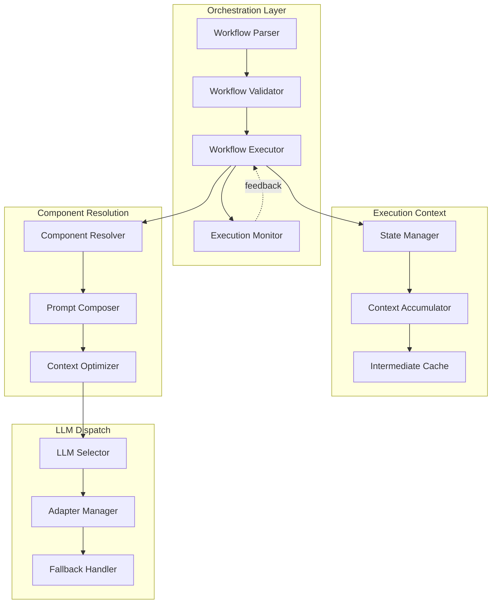
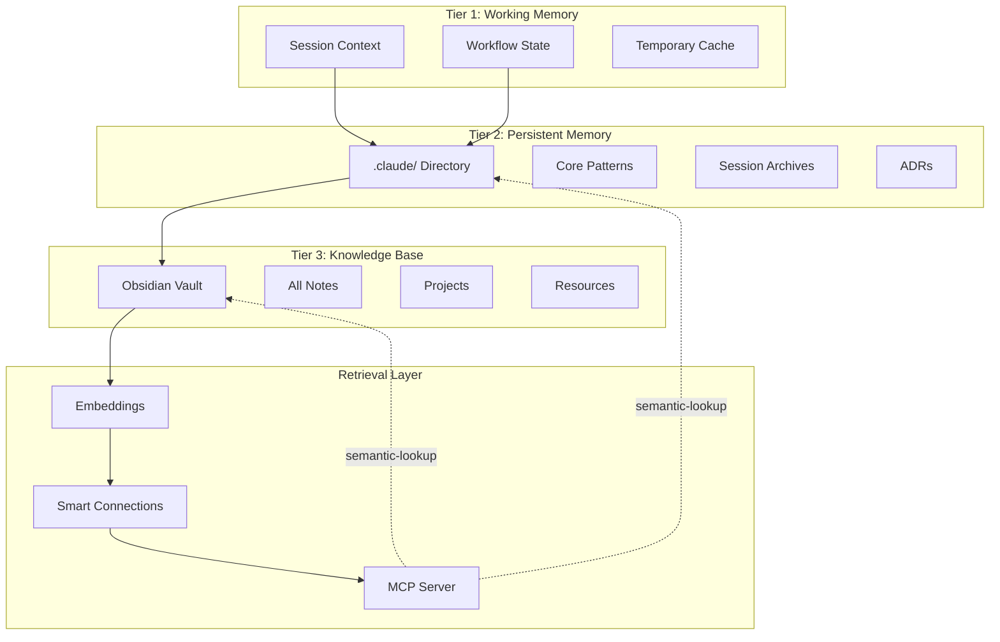
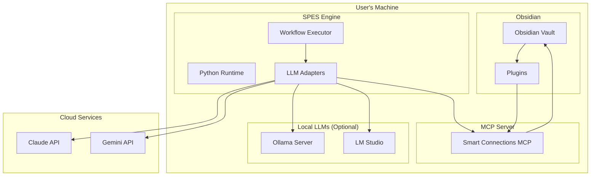
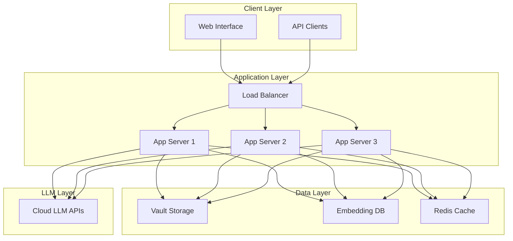

# SPES/PKB System Architecture Overview - Part 2

**Sections 9-20**

---

## 9. Workflow Orchestration

### 9.1 Orchestration Engine

**Purpose**: Manage sequential execution of multi-step workflows with context handoff

**Architecture**:



**Workflow Executor Implementation**:

```python
class WorkflowExecutor:
    """Execute multi-step workflows with context management"""
    
    def __init__(self, workflow_def: WorkflowDefinition):
        self.workflow = workflow_def
        self.state_manager = StateManager()
        self.context_accumulator = ContextAccumulator()
        self.component_resolver = ComponentResolver()
        self.llm_selector = LLMSelector()
    
    async def execute(self, initial_input: dict) -> WorkflowResult:
        """Execute complete workflow"""
        
        # Initialize state
        self.state_manager.create_session(self.workflow.id)
        self.context_accumulator.add_input(initial_input)
        
        try:
            for step in self.workflow.steps:
                # Execute step
                step_result = await self._execute_step(step)
                
                # Validate output
                if not self._validate_step_output(step, step_result):
                    raise StepValidationError(step.name, step_result.errors)
                
                # Accumulate context for next step
                self.context_accumulator.add_step_output(step.name, step_result)
                
                # Update state
                self.state_manager.mark_step_complete(step.name)
            
            # Generate final output
            final_output = self._generate_final_output()
            
            return WorkflowResult(
                success=True,
                output=final_output,
                metadata=self.state_manager.get_metadata()
            )
        
        except Exception as e:
            return self._handle_workflow_failure(e)
    
    async def _execute_step(self, step: WorkflowStep) -> StepResult:
        """Execute single workflow step"""
        
        # Resolve components
        components = self.component_resolver.resolve(step.component_ids)
        
        # Compose prompt
        composed_prompt = self._compose_prompt(step, components)
        
        # Select LLM
        llm_adapter = self.llm_selector.select(
            step.requirements,
            components
        )
        
        # Execute with retry logic
        for attempt in range(step.max_retries):
            try:
                response = await llm_adapter.generate(
                    composed_prompt,
                    **step.llm_parameters
                )
                
                return StepResult(
                    success=True,
                    output=response,
                    llm_used=llm_adapter.name,
                    attempt=attempt + 1
                )
            
            except Exception as e:
                if attempt < step.max_retries - 1:
                    await self._apply_retry_backoff(attempt)
                    continue
                raise
    
    def _compose_prompt(
        self,
        step: WorkflowStep,
        components: List[Component]
    ) -> str:
        """Compose prompt from components and context"""
        
        sections = []
        
        # Add system instructions
        for comp in components:
            if comp.type == ComponentType.INSTRUCTION:
                sections.append(comp.content)
        
        # Add persona if specified
        persona_comps = [c for c in components if c.type == ComponentType.PERSONA]
        if persona_comps:
            sections.append(persona_comps[0].content)
        
        # Add constraints
        constraint_comps = [c for c in components if c.type == ComponentType.CONSTRAINT]
        for constraint in constraint_comps:
            sections.append(constraint.content)
        
        # Add context from previous steps
        context = self.context_accumulator.get_context_for_step(step)
        if context:
            sections.append(f"# Previous Step Context\n\n{context}")
        
        # Add current step instructions
        sections.append(f"# Current Task\n\n{step.instruction}")
        
        # Add output format requirements
        format_comps = [c for c in components if c.type == ComponentType.OUTPUT_FORMAT]
        if format_comps:
            sections.append(format_comps[0].content)
        
        return "\n\n".join(sections)
```

### 9.2 Context Handoff Protocol

**Handoff Strategies**:

```yaml
Strategy 1 - Full Context Accumulation:
  Description: Each step receives all outputs from all previous steps
  Use When: Steps are interdependent, need full history
  Trade-off: Context grows linearly, may exceed limits
  
  Example:
    Step 1 output: {citations: [...]}
    Step 2 receives: {citations: [...]}
    Step 2 output: {citations: [...], key_claims: [...]}
    Step 3 receives: {citations: [...], key_claims: [...]}

Strategy 2 - Selective Handoff:
  Description: Each step specifies which fields to carry forward
  Use When: Large outputs, only subset needed downstream
  Trade-off: Must specify dependencies explicitly
  
  Example:
    Step 1 output: {raw_text: "...", citations: [...], metadata: {...}}
    Step 1 handoff: carry_forward=[citations, metadata]
    Step 2 receives: {citations: [...], metadata: {...}}

Strategy 3 - Summarized Context:
  Description: Compress previous outputs before handoff
  Use When: Working with local LLMs (small context)
  Trade-off: May lose information in compression
  
  Example:
    Step 1 output: {detailed_analysis: "5000 words..."}
    Summarizer: compress to 500 words
    Step 2 receives: {analysis_summary: "500 words..."}

Strategy 4 - Reference-Based Handoff:
  Description: Store outputs in PKB, pass file references
  Use When: Very large outputs, future retrieval needed
  Trade-off: Requires file I/O, MCP lookup overhead
  
  Example:
    Step 1 output: {...} → saved to vault/temp/step1-output.md
    Step 2 receives: {step1_path: "vault/temp/step1-output.md"}
    Step 2 uses: MCP lookup to read file content
```

**Context Accumulator Implementation**:

```python
class ContextAccumulator:
    """Manage context across workflow steps"""
    
    def __init__(self, strategy: HandoffStrategy = HandoffStrategy.SELECTIVE):
        self.strategy = strategy
        self.contexts = {}
        self.current_tokens = 0
        self.max_tokens = 100000  # Configurable
    
    def add_step_output(self, step_name: str, output: StepResult):
        """Add step output to accumulated context"""
        
        if self.strategy == HandoffStrategy.FULL:
            # Keep everything
            self.contexts[step_name] = output.output
        
        elif self.strategy == HandoffStrategy.SELECTIVE:
            # Keep only specified fields
            carried = {
                k: v for k, v in output.output.items()
                if k in output.carry_forward
            }
            self.contexts[step_name] = carried
        
        elif self.strategy == HandoffStrategy.SUMMARIZED:
            # Compress if exceeding limits
            tokens = self._estimate_tokens(output.output)
            if self.current_tokens + tokens > self.max_tokens:
                compressed = self._compress_output(output.output)
                self.contexts[step_name] = compressed
            else:
                self.contexts[step_name] = output.output
        
        elif self.strategy == HandoffStrategy.REFERENCE:
            # Save to file, store reference
            file_path = self._save_to_temp_file(step_name, output.output)
            self.contexts[step_name] = {"_ref": file_path}
        
        self.current_tokens = self._recalculate_tokens()
    
    def get_context_for_step(self, step: WorkflowStep) -> str:
        """Get formatted context for current step"""
        
        relevant_contexts = {}
        
        # Include only dependencies
        for dep in step.dependencies:
            if dep in self.contexts:
                relevant_contexts[dep] = self.contexts[dep]
        
        # Format as markdown
        formatted = []
        for step_name, context in relevant_contexts.items():
            if isinstance(context, dict) and "_ref" in context:
                # Dereference file
                content = self._read_temp_file(context["_ref"])
                formatted.append(f"## {step_name}\n\n{content}")
            else:
                formatted.append(f"## {step_name}\n\n{json.dumps(context, indent=2)}")
        
        return "\n\n".join(formatted)
```

### 9.3 Validation Gates

**Validation Types**:

```yaml
Pre-Step Validation:
  Purpose: Verify step can execute
  Checks:
    - All required components available
    - LLM adapter functional
    - Context within limits
    - Dependencies satisfied
  Action on Failure: Skip or abort workflow

Mid-Step Validation:
  Purpose: Monitor execution progress
  Checks:
    - LLM still responsive
    - Timeout not exceeded
    - Token limits not breached
  Action on Failure: Retry or fallback

Post-Step Validation:
  Purpose: Verify output quality
  Checks:
    - Output format correct
    - Required fields present
    - Semantic validation passes
    - No errors in output
  Action on Failure: Retry with corrections

Final Validation:
  Purpose: Verify complete workflow
  Checks:
    - All steps completed
    - Final output meets requirements
    - Quality standards satisfied
  Action on Failure: Report to user
```

**Validator Implementation**:

```python
class StepValidator:
    """Validate step execution and outputs"""
    
    def __init__(self, validation_config: dict):
        self.config = validation_config
    
    def validate_output(self, step: WorkflowStep, output: Any) -> ValidationResult:
        """Validate step output against requirements"""
        
        errors = []
        warnings = []
        
        # Check output format
        if step.output_schema:
            schema_errors = self._validate_schema(output, step.output_schema)
            errors.extend(schema_errors)
        
        # Check required fields
        for field in step.required_fields:
            if field not in output:
                errors.append(f"Missing required field: {field}")
        
        # Semantic validation
        if step.semantic_validators:
            for validator in step.semantic_validators:
                result = validator(output)
                if not result.valid:
                    errors.append(result.error_message)
        
        # Quality checks
        if step.quality_requirements:
            quality_score = self._assess_quality(output, step.quality_requirements)
            if quality_score < step.min_quality_score:
                warnings.append(f"Quality score {quality_score} below threshold")
        
        return ValidationResult(
            valid=len(errors) == 0,
            errors=errors,
            warnings=warnings
        )
    
    def _validate_schema(self, output: Any, schema: dict) -> List[str]:
        """Validate output against JSON schema"""
        try:
            jsonschema.validate(output, schema)
            return []
        except jsonschema.ValidationError as e:
            return [str(e)]
```

### 9.4 Error Handling & Recovery

**Error Taxonomy**:

```yaml
Transient Errors (Retry):
  - API rate limits
  - Network timeouts
  - Temporary service unavailable
  - LLM overloaded
  
  Strategy: Exponential backoff retry

Recoverable Errors (Fallback):
  - Component not found → Use alternative
  - LLM unavailable → Use fallback LLM
  - Context too large → Compress and retry
  - Validation failed → Request corrections
  
  Strategy: Attempt recovery, then fallback

Permanent Errors (Abort):
  - Invalid workflow definition
  - Missing required resources
  - Authentication failure
  - Irrecoverable validation failure
  
  Strategy: Abort with clear error message

User Errors (Guidance):
  - Invalid input format
  - Missing required parameters
  - Ambiguous request
  
  Strategy: Provide guidance, request clarification
```

**Recovery Handler**:

```python
class RecoveryHandler:
    """Handle errors with intelligent recovery strategies"""
    
    async def handle_error(
        self,
        error: Exception,
        step: WorkflowStep,
        attempt: int
    ) -> RecoveryAction:
        """Determine recovery action for error"""
        
        if isinstance(error, RateLimitError):
            # Wait and retry
            wait_time = self._calculate_backoff(attempt)
            return RecoveryAction.RETRY_AFTER(wait_time)
        
        elif isinstance(error, ContextTooLargeError):
            # Compress context and retry
            return RecoveryAction.COMPRESS_AND_RETRY
        
        elif isinstance(error, ComponentNotFoundError):
            # Try to find alternative component
            alternative = self._find_alternative_component(error.component_id)
            if alternative:
                return RecoveryAction.USE_ALTERNATIVE(alternative)
            return RecoveryAction.ABORT
        
        elif isinstance(error, LLMUnavailableError):
            # Fallback to different LLM
            fallback_llm = self._select_fallback_llm(step)
            if fallback_llm:
                return RecoveryAction.USE_FALLBACK_LLM(fallback_llm)
            return RecoveryAction.ABORT
        
        elif isinstance(error, ValidationError):
            # Request corrections from LLM
            if attempt < step.max_correction_attempts:
                correction_prompt = self._build_correction_prompt(error)
                return RecoveryAction.REQUEST_CORRECTION(correction_prompt)
            return RecoveryAction.ABORT
        
        else:
            # Unknown error, abort
            return RecoveryAction.ABORT
```

---

## 10. Memory & Semantic Retrieval

### 10.1 Memory Architecture

**Three-Tier Memory System**:



**Memory Tiers**:

```yaml
Tier 1 - Working Memory:
  Scope: Current session/workflow
  Lifetime: Session duration
  Size: ~100K tokens
  Access: Direct (in-memory)
  
  Contents:
    - Current workflow state
    - Accumulated context
    - Intermediate outputs
    - User preferences for session

Tier 2 - Persistent Memory:
  Scope: Cross-session knowledge
  Lifetime: Permanent (manually curated)
  Size: ~1-5MB of critical patterns
  Access: MCP semantic lookup
  
  Contents:
    - .claude/core/ - Essential patterns
    - .claude/sessions/ - Session archives
    - .claude/decisions/ - ADRs
    - .claude/patterns/ - Reusable templates

Tier 3 - Knowledge Base:
  Scope: All captured knowledge
  Lifetime: Permanent (PKB managed)
  Size: Unlimited
  Access: MCP semantic lookup + manual
  
  Contents:
    - All notes in vault
    - Projects and areas
    - Research and resources
    - Generated outputs
```

### 10.2 MCP Protocol Integration

**MCP Server Architecture**:

```yaml
MCP Server: smart-connections-mcp

Transport: SSE (Server-Sent Events)
Port: 3000 (default)
Authentication: None (local only)

Capabilities:
  - resources: List available resources
  - tools: Provide lookup, connection, stats tools
  - prompts: Optional prompt templates

Tools Exposed:
  1. lookup(query, limit) → Search results
  2. connection(file_path, limit) → Related files
  3. stats() → Memory bank statistics
```

**Tool Usage in Workflows**:

```python
class MCPMemoryAccess:
    """Access memory via MCP tools"""
    
    async def semantic_lookup(
        self,
        query: str,
        limit: int = 10
    ) -> List[MemoryChunk]:
        """Search knowledge base semantically"""
        
        # Call MCP lookup tool
        results = await self.mcp_client.call_tool(
            "lookup",
            {
                "query": query,
                "limit": limit
            }
        )
        
        return [
            MemoryChunk(
                file_path=r["file_path"],
                content=r["content"],
                similarity=r["similarity"]
            )
            for r in results
        ]
    
    async def find_related_notes(
        self,
        current_file: str,
        limit: int = 5
    ) -> List[RelatedNote]:
        """Find notes related to current file"""
        
        results = await self.mcp_client.call_tool(
            "connection",
            {
                "file_path": current_file,
                "limit": limit
            }
        )
        
        return [
            RelatedNote(
                file_path=r["file_path"],
                similarity=r["similarity"]
            )
            for r in results
        ]
```

**Memory-Augmented Workflow**:

```yaml
Workflow: "Memory-Augmented Code Generation"

Step 1 - Retrieve Coding Standards:
  MCP Lookup:
    query: "Python coding standards best practices"
    limit: 3
  
  Result:
    - .claude/core/coding-standards.md (similarity: 0.95)
    - projects/python-patterns/style-guide.md (similarity: 0.89)
    - resources/pep8-reference.md (similarity: 0.87)
  
  Action: Include top result in context

Step 2 - Generate Code:
  Components:
    - Instruction: code-generation-v2.0.0
    - Memory: Coding standards from Step 1
  
  LLM: Claude Code
  Output: Generated code following standards

Step 3 - Document in PKB:
  Action: Create note with wiki-links to standards
  Memory Update: New note auto-embedded for future retrieval
```

### 10.3 Embedding Generation

**Embedding Model**:

```yaml
Model: TaylorAI/bge-micro-v2
Type: Dense retrieval, sentence transformers
Dimensions: 384
Max Sequence: 512 tokens
Performance: ~1000 sequences/sec on M2 MacBook

Alternatives:
  - all-MiniLM-L6-v2 (384d, faster)
  - bge-small-en-v1.5 (384d, better quality)
  - gte-small (384d, instruction-tuned)
```

**Chunking Strategy**:

```python
class ContentChunker:
    """Chunk content for embedding generation"""
    
    def __init__(self, chunk_size: int = 512, overlap: int = 50):
        self.chunk_size = chunk_size
        self.overlap = overlap
    
    def chunk_document(self, content: str) -> List[Chunk]:
        """Split document into overlapping chunks"""
        
        # Tokenize
        tokens = self.tokenizer.encode(content)
        
        chunks = []
        start = 0
        
        while start < len(tokens):
            end = min(start + self.chunk_size, len(tokens))
            chunk_tokens = tokens[start:end]
            
            chunks.append(Chunk(
                text=self.tokenizer.decode(chunk_tokens),
                start_idx=start,
                end_idx=end,
                token_count=len(chunk_tokens)
            ))
            
            # Move forward with overlap
            start += (self.chunk_size - self.overlap)
        
        return chunks
```

**Semantic Search**:

```python
class SemanticSearchEngine:
    """Search embeddings by similarity"""
    
    def __init__(self, embeddings_db: EmbeddingsDB):
        self.db = embeddings_db
        self.model = SentenceTransformer('TaylorAI/bge-micro-v2')
    
    def search(
        self,
        query: str,
        limit: int = 10,
        threshold: float = 0.5
    ) -> List[SearchResult]:
        """Search for similar content"""
        
        # Generate query embedding
        query_embedding = self.model.encode(query)
        
        # Compute similarities
        all_embeddings = self.db.get_all_embeddings()
        similarities = cosine_similarity(
            [query_embedding],
            all_embeddings
        )[0]
        
        # Filter and sort
        results = []
        for idx, score in enumerate(similarities):
            if score >= threshold:
                chunk = self.db.get_chunk(idx)
                results.append(SearchResult(
                    file_path=chunk.file_path,
                    content=chunk.text,
                    similarity=score,
                    chunk_index=chunk.index
                ))
        
        results.sort(key=lambda r: r.similarity, reverse=True)
        return results[:limit]
```

### 10.4 Memory Maintenance

**Automatic Operations**:

```yaml
On File Save:
  - Generate embeddings for new/modified content
  - Update embedding cache
  - Invalidate old embeddings
  
On File Delete:
  - Remove embeddings from cache
  - Update vector index
  
On Vault Load:
  - Index all files missing embeddings
  - Verify embedding cache integrity
  
Scheduled (Daily):
  - Garbage collect orphaned embeddings
  - Compact embedding database
  - Verify MCP server health
```

**Manual Maintenance**:

```yaml
User Commands:
  - Rebuild entire embedding index
  - Clear embedding cache
  - Export embeddings for backup
  - Import embeddings from backup
  - Verify embedding quality
```

---

## 11. Technology Stack

### 11.1 Core Technologies

**Platform Foundation**:

```yaml
Operating System:
  - macOS (primary development)
  - Linux (supported)
  - Windows (limited support via WSL)

Knowledge Base:
  - Obsidian v1.5.0+
  - Markdown specification: CommonMark + Obsidian extensions

Programming Languages:
  - Python 3.10+ (workflow engine, adapters)
  - JavaScript/TypeScript (Obsidian plugins)
  - Bash (automation scripts)
```

### 11.2 LLM APIs & SDKs

**Cloud LLMs**:

```yaml
Anthropic Claude:
  - SDK: anthropic-sdk-python v0.18.0+
  - API Version: 2023-06-01
  - Models: claude-sonnet-4-20250514
  - Authentication: API key via ANTHROPIC_API_KEY

Google Gemini:
  - SDK: google-generativeai v0.3.0+
  - API Version: v1beta
  - Models: gemini-2.0-flash-exp, gemini-pro
  - Authentication: API key via GOOGLE_API_KEY

OpenAI GPT (Planned):
  - SDK: openai-python v1.0.0+
  - API Version: v1
  - Models: gpt-4-turbo, gpt-4
  - Authentication: API key via OPENAI_API_KEY
```

**Local LLMs**:

```yaml
Ollama:
  - API: HTTP REST API
  - Endpoint: http://localhost:11434/api
  - Models: User-managed (pull via ollama CLI)
  - Installation: https://ollama.ai

LM Studio:
  - API: OpenAI-compatible REST API
  - Endpoint: http://localhost:1234/v1
  - Models: GUI-managed
  - Installation: https://lmstudio.ai

GPT4All:
  - SDK: gpt4all-python
  - API: Native Python bindings
  - Models: GGUF format, auto-downloaded
  - Installation: pip install gpt4all
```

**Specialized Tools**:

```yaml
Claude Code:
  - Type: Command-line tool
  - SDK: Same as Claude API
  - Installation: npm install -g @anthropic-ai/claude-code
  - Usage: claude-code [options] [prompt]
```

### 11.3 Obsidian Plugins

**Essential Plugins**:

```yaml
Smart Connections (v1.8.0+):
  Purpose: Semantic embeddings and MCP server
  Configuration: .obsidian/plugins/smart-connections/data.json
  Critical For: Memory retrieval, semantic search

Dataview (v0.5.55+):
  Purpose: Query and visualize note metadata
  Language: Dataview Query Language + DataviewJS
  Critical For: Dynamic dashboards, metadata queries

Templater (v2.0.0+):
  Purpose: Template system with JavaScript execution
  Language: Templater Template Language
  Critical For: Note creation automation, dynamic content

Meta Bind (v1.0.0+):
  Purpose: Interactive buttons and input fields
  Language: Meta Bind syntax
  Critical For: Workflow triggers, interactive dashboards
```

**Optional Plugins**:

```yaml
QuickAdd:
  Purpose: Rapid content capture
  Use: Note creation shortcuts

Breadcrumbs:
  Purpose: Visualize note hierarchies
  Use: Navigation enhancement

Excalidraw:
  Purpose: Diagram creation
  Use: Visual documentation

Advanced Tables:
  Purpose: Table formatting
  Use: Structured data editing
```

### 11.4 Python Dependencies

**Core Libraries**:

```python
# requirements.txt

# LLM SDKs
anthropic>=0.18.0
google-generativeai>=0.3.0
openai>=1.0.0

# Embedding & Vector Search
sentence-transformers>=2.2.0
numpy>=1.24.0
scikit-learn>=1.3.0

# API & Protocol
requests>=2.31.0
aiohttp>=3.9.0
sse-starlette>=1.6.0  # MCP server

# Data Processing
pyyaml>=6.0
jsonschema>=4.17.0
pydantic>=2.0.0

# Utilities
python-dotenv>=1.0.0
tenacity>=8.2.0  # Retry logic
loguru>=0.7.0  # Logging
```

**Development Dependencies**:

```python
# requirements-dev.txt

# Testing
pytest>=7.4.0
pytest-asyncio>=0.21.0
pytest-cov>=4.1.0

# Code Quality
black>=23.7.0
ruff>=0.0.285
mypy>=1.5.0

# Documentation
mkdocs>=1.5.0
mkdocs-material>=9.2.0
```

### 11.5 File Formats

**Component Storage**:

```yaml
Component Files:
  Format: Markdown (.md)
  Frontmatter: YAML
  Content: CommonMark + extensions
  Encoding: UTF-8
  
  Example: component-instruction-v2.0.0.md

Workflow Definitions:
  Format: YAML (.yml) or Markdown with YAML
  Schema: JSON Schema for validation
  Encoding: UTF-8
  
  Example: workflow-research-to-notes-v1.0.0.yml

Configuration:
  Format: YAML (.yml) or JSON (.json)
  Schema: Pydantic models
  Encoding: UTF-8
  
  Example: config.yml, .env
```

**Data Storage**:

```yaml
Embeddings:
  Format: JSON (.json)
  Structure: Array of {file_path, chunk_index, embedding, metadata}
  Location: .smart-env/embeddings.json
  Encoding: UTF-8

Cache:
  Format: Pickle (.pkl) or JSON (.json)
  Structure: Key-value store
  Location: .cache/
  Encoding: Binary (pickle) or UTF-8 (JSON)

Logs:
  Format: Plain text (.log) or JSON Lines (.jsonl)
  Structure: Timestamp, level, message, context
  Location: logs/
  Encoding: UTF-8
```

---

## 12. Deployment Architecture

### 12.1 Local Deployment (Primary)

**Single-User Configuration**:



**Directory Structure**:

```
~/PKB-System/
├── vault/                        # Obsidian vault
│   ├── .obsidian/
│   ├── .smart-env/
│   ├── .claude/
│   └── [vault contents]
│
├── spes/                         # SPES engine
│   ├── workflows/
│   ├── adapters/
│   ├── components/
│   └── config/
│
├── scripts/                      # Automation
│   ├── init-vault.sh
│   ├── start-mcp-server.sh
│   └── run-workflow.py
│
├── logs/                         # System logs
├── cache/                        # Component cache
└── .env                          # Environment config
```

**Environment Configuration**:

```bash
# .env

# Vault Configuration
VAULT_PATH=/Users/username/PKB-System/vault
SPES_PATH=/Users/username/PKB-System/spes

# Cloud LLM API Keys
ANTHROPIC_API_KEY=sk-ant-...
GOOGLE_API_KEY=AIza...
OPENAI_API_KEY=sk-...

# Local LLM Configuration
OLLAMA_BASE_URL=http://localhost:11434
LMSTUDIO_BASE_URL=http://localhost:1234

# MCP Configuration
MCP_SERVER_PORT=3000
MCP_SERVER_HOST=localhost

# Default LLM Selection
DEFAULT_CLOUD_LLM=claude
DEFAULT_LOCAL_LLM=ollama
FALLBACK_LLM=gemini

# Logging
LOG_LEVEL=INFO
LOG_FILE=logs/spes.log

# Performance
MAX_WORKERS=4
CACHE_TTL=3600
```

### 12.2 Startup Sequence

**System Initialization**:

```yaml
Phase 1 - Prerequisites:
  1. Verify Obsidian vault exists
  2. Check required plugins installed
  3. Validate environment variables
  4. Verify Python dependencies

Phase 2 - Plugin Initialization:
  1. Start Obsidian
  2. Load Smart Connections plugin
  3. Wait for embedding index ready
  4. Start MCP server (port 3000)

Phase 3 - SPES Engine:
  1. Load component library
  2. Initialize LLM adapters
  3. Verify adapter connectivity
  4. Load workflow definitions

Phase 4 - Health Checks:
  1. Test cloud LLM APIs (if configured)
  2. Test local LLMs (if running)
  3. Test MCP server connectivity
  4. Verify embedding generation

Phase 5 - Ready:
  1. System status: READY
  2. Accept workflow execution requests
```

**Startup Script**:

```bash
#!/bin/bash
# scripts/start-system.sh

set -e

echo "Starting SPES/PKB System..."

# 1. Check prerequisites
echo "Checking prerequisites..."
if [ ! -d "$VAULT_PATH" ]; then
    echo "Error: Vault not found at $VAULT_PATH"
    exit 1
fi

# 2. Start Obsidian (macOS)
echo "Starting Obsidian..."
open -a Obsidian "$VAULT_PATH"
sleep 5  # Wait for Obsidian to initialize

# 3. Verify MCP server
echo "Checking MCP server..."
until curl -s http://localhost:3000/health > /dev/null; do
    echo "Waiting for MCP server..."
    sleep 2
done
echo "MCP server ready"

# 4. Start local LLMs (if configured)
if [ "$USE_LOCAL_LLMS" = "true" ]; then
    echo "Starting Ollama..."
    ollama serve &
    sleep 3
fi

# 5. Initialize SPES engine
echo "Initializing SPES engine..."
cd "$SPES_PATH"
python -m spes.engine.init

echo "System ready!"
```

### 12.3 Cloud Deployment (Future)

**Multi-User Architecture** (Planned):



**Considerations**:
- Vault storage: S3-compatible object storage
- Embedding DB: Vector database (Pinecone, Weaviate)
- Caching: Redis cluster
- Authentication: OAuth2 / JWT
- Multi-tenancy: Isolated vault per user

---

## 13. Security Architecture

### 13.1 API Key Management

**Storage**:

```yaml
Local Development:
  Method: .env file (gitignored)
  Location: Project root
  Access: Environment variables
  Rotation: Manual

Production (Future):
  Method: Secret management service
  Options: AWS Secrets Manager, HashiCorp Vault
  Access: API with IAM roles
  Rotation: Automated
```

**Access Control**:

```python
class SecureConfig:
    """Secure configuration management"""
    
    def __init__(self):
        load_dotenv()  # Load .env
        self._validate_keys()
    
    @property
    def anthropic_key(self) -> str:
        """Get Anthropic API key"""
        key = os.getenv("ANTHROPIC_API_KEY")
        if not key:
            raise ConfigurationError("ANTHROPIC_API_KEY not set")
        return key
    
    def _validate_keys(self):
        """Validate all required keys present"""
        required = ["ANTHROPIC_API_KEY"]
        missing = [k for k in required if not os.getenv(k)]
        if missing:
            raise ConfigurationError(f"Missing keys: {missing}")
```

### 13.2 Data Privacy

**Local Data**:

```yaml
User Data Locations:
  - Obsidian vault: User's local filesystem
  - Embeddings: .smart-env/ (local)
  - Cache: .cache/ (local)
  - Logs: logs/ (local)

Guarantees:
  - No data sent to external services except LLM APIs
  - No telemetry or analytics to Anthropic/others
  - Local LLMs: No data leaves machine
  - Cloud LLMs: Data sent only for processing (per API ToS)

User Control:
  - Can delete all data at any time
  - Can export vault for backup
  - Can choose local-only mode
```

**LLM API Privacy**:

```yaml
Claude API:
  - Data retention: Per Anthropic's API terms
  - Training: Not used for model training
  - Privacy: See anthropic.com/privacy

Gemini API:
  - Data retention: Per Google's API terms
  - Training: Optional opt-in
  - Privacy: See google.com/privacy

Local LLMs:
  - Data retention: None (fully local)
  - Training: N/A
  - Privacy: 100% local processing
```

### 13.3 Input Validation

**User Input Sanitization**:

```python
class InputValidator:
    """Validate and sanitize user inputs"""
    
    def validate_workflow_input(self, data: dict) -> dict:
        """Validate workflow input"""
        
        # Check for prompt injection attempts
        dangerous_patterns = [
            r"<\|im_start\|>",  # Special tokens
            r"<\|im_end\|>",
            r"###",  # Common delimiters
            r"SYSTEM:",
            r"ignore previous instructions",
        ]
        
        for field, value in data.items():
            if isinstance(value, str):
                for pattern in dangerous_patterns:
                    if re.search(pattern, value, re.IGNORECASE):
                        raise SecurityError(
                            f"Potential injection detected in field: {field}"
                        )
        
        # Validate against schema
        self._validate_schema(data)
        
        return data
```

### 13.4 Component Integrity

**Version Verification**:

```python
class ComponentVerifier:
    """Verify component integrity"""
    
    def verify_component(self, component_path: str) -> bool:
        """Verify component hasn't been tampered with"""
        
        # Load component
        with open(component_path) as f:
            content = f.read()
        
        # Extract metadata
        metadata = self._parse_frontmatter(content)
        
        # Verify version format
        if not self._valid_version(metadata.get("version")):
            return False
        
        # Verify required fields
        required = ["title", "type", "version", "created"]
        if not all(field in metadata for field in required):
            return False
        
        # Verify signature (if present)
        if "signature" in metadata:
            return self._verify_signature(content, metadata["signature"])
        
        return True
```

---

## 14. Performance Characteristics

### 14.1 Latency Benchmarks

**LLM Response Times**:

```yaml
Claude API (claude-sonnet-4):
  - First token: 200-500ms
  - Streaming: 40-60 tokens/sec
  - Total (500 token response): 10-15 seconds
  - Context processing: ~100ms per 10K tokens

Gemini (gemini-2.0-flash):
  - First token: 100-300ms
  - Streaming: 60-100 tokens/sec
  - Total (500 token response): 5-10 seconds
  - Context processing: ~50ms per 10K tokens

Ollama (llama3:8b, M2 MacBook Pro):
  - First token: 1-2 seconds
  - Streaming: 20-40 tokens/sec
  - Total (500 token response): 15-25 seconds
  - Context processing: ~2 sec per 1K tokens

Ollama (codellama:13b, M2 MacBook Pro):
  - First token: 2-4 seconds
  - Streaming: 12-25 tokens/sec
  - Total (500 token response): 25-40 seconds
  - Context processing: ~3 sec per 1K tokens
```

**Component Operations**:

```yaml
Component Loading:
  - Parse frontmatter: <1ms
  - Load content: <5ms
  - Compile prompt: 10-50ms
  - Cache hit: <1ms

Embedding Generation:
  - Single chunk (512 tokens): 50-100ms
  - Full document (10 chunks): 500-1000ms
  - Embedding search (10K docs): 50-200ms

Metadata Operations:
  - Parse YAML: <1ms
  - Validate schema: 1-5ms
  - Query Dataview: 10-100ms (depends on vault size)
```

### 14.2 Throughput Characteristics

**Workflow Execution**:

```yaml
Simple Workflow (1-2 steps):
  - Setup: 100-200ms
  - LLM calls: 10-30 seconds
  - Validation: 10-50ms
  - Total: 10-35 seconds

Medium Workflow (3-5 steps):
  - Setup: 200-500ms
  - LLM calls: 30-120 seconds
  - Validation: 50-200ms
  - Total: 30-125 seconds

Complex Workflow (6-10 steps):
  - Setup: 500-1000ms
  - LLM calls: 60-300 seconds
  - Validation: 100-500ms
  - Total: 1-5 minutes
```

**Concurrent Workflows**:

```yaml
Single User (Sequential):
  - Workflows/hour: 12-60
  - Depends on: Workflow complexity

Single User (Parallel, 4 workers):
  - Workflows/hour: 40-200
  - Bottleneck: LLM API rate limits
  - Recommended: 2-4 parallel max
```

### 14.3 Resource Utilization

**Memory Usage**:

```yaml
SPES Engine (Idle):
  - Python process: 50-100MB
  - Component cache: 10-50MB
  - Total: 60-150MB

SPES Engine (Active):
  - Python process: 100-300MB
  - Workflow state: 50-200MB
  - Component cache: 10-50MB
  - Total: 160-550MB

Obsidian + Plugins:
  - Obsidian app: 200-500MB
  - Smart Connections: 100-300MB
  - Dataview: 50-150MB
  - Total: 350-950MB

Local LLMs (Ollama):
  - llama3:8b: 4-6GB (model loaded)
  - codellama:13b: 7-9GB (model loaded)
  - mixtral:8x7b: 26-30GB (model loaded)
```

**Disk Usage**:

```yaml
Obsidian Vault:
  - Notes: 10MB-10GB+ (user dependent)
  - Attachments: 0-100GB+ (user dependent)
  - Typical: 100MB-1GB

Smart Connections:
  - Embeddings (.smart-env/): 1-100MB
  - Scales with: Number of notes × chunk count
  - Typical: 10-50MB

SPES Components:
  - Component library: 1-10MB
  - Workflow definitions: 1-5MB
  - Cache: 10-100MB
  - Logs: 10MB-1GB (rotated)

Local LLM Models:
  - llama3:8b: 4.7GB
  - codellama:13b: 7.3GB
  - mixtral:8x7b: 26.4GB
```

### 14.4 Optimization Strategies

**Component Caching**:

```python
class ComponentCache:
    """LRU cache for compiled components"""
    
    def __init__(self, max_size: int = 100):
        self.cache = OrderedDict()
        self.max_size = max_size
    
    def get(self, component_id: str) -> Optional[Component]:
        """Get cached component (LRU)"""
        if component_id in self.cache:
            # Move to end (most recently used)
            self.cache.move_to_end(component_id)
            return self.cache[component_id]
        return None
    
    def put(self, component_id: str, component: Component):
        """Add to cache (evict LRU if full)"""
        if component_id in self.cache:
            self.cache.move_to_end(component_id)
        else:
            if len(self.cache) >= self.max_size:
                # Remove least recently used
                self.cache.popitem(last=False)
        self.cache[component_id] = component
```

**Context Compression**:

```python
class ContextCompressor:
    """Compress context to fit LLM limits"""
    
    def compress(self, context: str, max_tokens: int) -> str:
        """Compress context to fit within token limit"""
        
        current_tokens = self._estimate_tokens(context)
        
        if current_tokens <= max_tokens:
            return context
        
        # Strategy 1: Remove examples
        compressed = self._remove_examples(context)
        if self._estimate_tokens(compressed) <= max_tokens:
            return compressed
        
        # Strategy 2: Summarize sections
        compressed = self._summarize_sections(compressed, max_tokens)
        if self._estimate_tokens(compressed) <= max_tokens:
            return compressed
        
        # Strategy 3: Truncate
        return self._truncate_to_fit(compressed, max_tokens)
```

**Batch Processing**:

```python
class BatchProcessor:
    """Process multiple items efficiently"""
    
    async def process_batch(
        self,
        items: List[Any],
        workflow: Workflow,
        batch_size: int = 10
    ):
        """Process items in batches"""
        
        results = []
        
        for i in range(0, len(items), batch_size):
            batch = items[i:i+batch_size]
            
            # Process batch in parallel
            tasks = [
                self._process_item(item, workflow)
                for item in batch
            ]
            batch_results = await asyncio.gather(*tasks)
            results.extend(batch_results)
        
        return results
```

---

## 15. Scalability Considerations

### 15.1 Component Library Growth

**Current Scale**:
- 10-50 components (initial library)
- Linear lookup time: O(n)
- Acceptable for small libraries

**Growth Projection**:

```yaml
Year 1 (50-200 components):
  - Index: Hash table for O(1) lookup
  - Cache: LRU cache top 20 components
  - Search: Linear scan acceptable

Year 2 (200-500 components):
  - Index: Hash table + tag index
  - Cache: LRU cache top 50 components
  - Search: Tag-based filtering

Year 3 (500-1000+ components):
  - Index: Database (SQLite)
  - Cache: Tiered caching (hot/warm/cold)
  - Search: Full-text search engine
```

**Indexing Strategy**:

```python
class ComponentIndex:
    """Index for efficient component lookup"""
    
    def __init__(self):
        self.by_id = {}  # O(1) by ID
        self.by_type = defaultdict(list)  # O(1) by type
        self.by_tag = defaultdict(list)  # O(1) by tag
        self.by_version = defaultdict(list)  # O(1) by version
    
    def add_component(self, component: Component):
        """Add component to all indexes"""
        self.by_id[component.id] = component
        self.by_type[component.type].append(component)
        for tag in component.tags:
            self.by_tag[tag].append(component)
        self.by_version[component.version].append(component)
    
    def search(
        self,
        type: Optional[str] = None,
        tags: Optional[List[str]] = None,
        version: Optional[str] = None
    ) -> List[Component]:
        """Search components by criteria"""
        
        results = set(self.by_id.values())
        
        if type:
            results &= set(self.by_type[type])
        
        if tags:
            for tag in tags:
                results &= set(self.by_tag[tag])
        
        if version:
            results &= set(self.by_version[version])
        
        return list(results)
```

### 15.2 Vault Size Scaling

**Embedding Generation Time**:

```yaml
Vault Size vs. Initial Indexing Time:

1,000 notes:
  - Chunks: ~10,000
  - Indexing time: 5-10 minutes
  - Embedding size: ~5MB

10,000 notes:
  - Chunks: ~100,000
  - Indexing time: 50-90 minutes
  - Embedding size: ~50MB

100,000 notes:
  - Chunks: ~1,000,000
  - Indexing time: 8-15 hours
  - Embedding size: ~500MB
```

**Optimization Strategies**:

```yaml
Incremental Indexing:
  - Only reindex changed files
  - Track file mtimes
  - Skip unchanged content

Parallel Processing:
  - Use multiprocessing for embedding generation
  - 4-8 workers optimal
  - CPU-bound operation

Embedding Compression:
  - Quantize float32 → float16 (50% size reduction)
  - Minimal quality loss
  - Faster similarity computation
```

### 15.3 Concurrent Workflow Execution

**Current**: Sequential execution (one workflow at a time)

**Future**: Parallel execution with worker pool

```python
class WorkflowExecutor:
    """Execute workflows with worker pool"""
    
    def __init__(self, max_workers: int = 4):
        self.executor = ThreadPoolExecutor(max_workers=max_workers)
        self.semaphore = asyncio.Semaphore(max_workers)
    
    async def execute_parallel(
        self,
        workflows: List[Workflow],
        inputs: List[dict]
    ) -> List[WorkflowResult]:
        """Execute multiple workflows in parallel"""
        
        async def execute_with_limit(workflow, input_data):
            async with self.semaphore:
                return await self._execute_workflow(workflow, input_data)
        
        tasks = [
            execute_with_limit(wf, inp)
            for wf, inp in zip(workflows, inputs)
        ]
        
        return await asyncio.gather(*tasks)
```

**Rate Limiting**:

```python
class RateLimiter:
    """Respect LLM API rate limits"""
    
    def __init__(self, requests_per_minute: int = 50):
        self.rpm = requests_per_minute
        self.requests = deque()
    
    async def acquire(self):
        """Wait if rate limit exceeded"""
        now = time.time()
        
        # Remove requests older than 1 minute
        while self.requests and self.requests[0] < now - 60:
            self.requests.popleft()
        
        # Wait if at limit
        if len(self.requests) >= self.rpm:
            sleep_time = 60 - (now - self.requests[0])
            await asyncio.sleep(sleep_time)
        
        self.requests.append(now)
```

---

## 16. Design Patterns

### 16.1 Adapter Pattern (LLM Integration)

**Problem**: Support multiple LLM providers with different APIs

**Solution**: Common interface with provider-specific adapters

```python
# Interface
class LLMAdapter(ABC):
    @abstractmethod
    def generate(self, prompt: str, **kwargs) -> str:
        pass

# Concrete implementations
class ClaudeAdapter(LLMAdapter):
    def generate(self, prompt: str, **kwargs) -> str:
        return anthropic_api.generate(prompt, **kwargs)

class GeminiAdapter(LLMAdapter):
    def generate(self, prompt: str, **kwargs) -> str:
        return gemini_api.generate(prompt, **kwargs)

# Usage
def execute_workflow(adapter: LLMAdapter):
    response = adapter.generate("prompt")  # Works with any adapter
```

### 16.2 Strategy Pattern (Context Handoff)

**Problem**: Different workflows need different context strategies

**Solution**: Pluggable context handoff strategies

```python
class HandoffStrategy(ABC):
    @abstractmethod
    def handoff(self, prev_output: dict, next_step: Step) -> dict:
        pass

class FullHandoff(HandoffStrategy):
    def handoff(self, prev_output: dict, next_step: Step) -> dict:
        return prev_output  # Pass everything

class SelectiveHandoff(HandoffStrategy):
    def handoff(self, prev_output: dict, next_step: Step) -> dict:
        return {k: v for k, v in prev_output.items() 
                if k in next_step.required_fields}

class SummarizedHandoff(HandoffStrategy):
    def handoff(self, prev_output: dict, next_step: Step) -> dict:
        return {"summary": self._summarize(prev_output)}

# Usage
workflow.handoff_strategy = SelectiveHandoff()
```

### 16.3 Template Method Pattern (Workflow Execution)

**Problem**: Workflows have common structure but different steps

**Solution**: Define skeleton in base class, customize in subclasses

```python
class WorkflowTemplate:
    """Template for workflow execution"""
    
    def execute(self) -> WorkflowResult:
        """Template method defining execution flow"""
        
        self.initialize()
        
        for step in self.get_steps():
            self.before_step(step)
            result = self.execute_step(step)
            self.after_step(step, result)
        
        return self.finalize()
    
    # Abstract methods (must override)
    @abstractmethod
    def get_steps(self) -> List[Step]:
        pass
    
    @abstractmethod
    def execute_step(self, step: Step) -> StepResult:
        pass
    
    # Hook methods (optional override)
    def initialize(self):
        pass
    
    def before_step(self, step: Step):
        pass
    
    def after_step(self, step: Step, result: StepResult):
        pass
    
    def finalize(self) -> WorkflowResult:
        pass
```

### 16.4 Builder Pattern (Prompt Composition)

**Problem**: Complex prompts require many optional parts

**Solution**: Fluent interface for step-by-step construction

```python
class PromptBuilder:
    """Build complex prompts fluently"""
    
    def __init__(self):
        self.parts = []
    
    def with_instruction(self, instruction: Component):
        self.parts.append(("instruction", instruction))
        return self
    
    def with_persona(self, persona: Component):
        self.parts.append(("persona", persona))
        return self
    
    def with_format(self, format: Component):
        self.parts.append(("format", format))
        return self
    
    def with_constraints(self, constraints: Component):
        self.parts.append(("constraints", constraints))
        return self
    
    def with_context(self, context: str):
        self.parts.append(("context", context))
        return self
    
    def build(self) -> str:
        """Compile final prompt"""
        sections = []
        for part_type, content in self.parts:
            sections.append(self._format_section(part_type, content))
        return "\n\n".join(sections)

# Usage
prompt = (PromptBuilder()
    .with_instruction(code_gen_instruction)
    .with_persona(python_expert)
    .with_format(clean_code_format)
    .with_context(previous_step_output)
    .build())
```

### 16.5 Observer Pattern (Workflow Monitoring)

**Problem**: Multiple components need to react to workflow events

**Solution**: Event-driven monitoring with observers

```python
class WorkflowEvent:
    """Base class for workflow events"""
    pass

class StepStartedEvent(WorkflowEvent):
    def __init__(self, step_name: str):
        self.step_name = step_name

class StepCompletedEvent(WorkflowEvent):
    def __init__(self, step_name: str, result: StepResult):
        self.step_name = step_name
        self.result = result

class WorkflowObserver(ABC):
    @abstractmethod
    def on_event(self, event: WorkflowEvent):
        pass

class LoggingObserver(WorkflowObserver):
    def on_event(self, event: WorkflowEvent):
        if isinstance(event, StepStartedEvent):
            logger.info(f"Step started: {event.step_name}")
        elif isinstance(event, StepCompletedEvent):
            logger.info(f"Step completed: {event.step_name}")

class MetricsObserver(WorkflowObserver):
    def on_event(self, event: WorkflowEvent):
        if isinstance(event, StepCompletedEvent):
            self.record_duration(event.step_name, event.result.duration)

# Usage
workflow = Workflow()
workflow.add_observer(LoggingObserver())
workflow.add_observer(MetricsObserver())
```

---

## 17. Integration Points

### 17.1 External Tool Integration

**Available via MCP/Tools**:

```yaml
Research Tools:
  - PubMed (biomedical research)
  - Scholar Gateway (academic papers)
  - Web Search (general information)

Productivity Tools:
  - Atlassian (Jira, Confluence)
  - Notion
  - Linear

Creative Tools:
  - Canva (design)
  - Invideo (video generation)
  - BioRender (scientific figures)

Development Tools:
  - GitHub (code repositories)
  - GitLab
  - Cloudflare (deployment)

Knowledge Tools:
  - Hugging Face (models, datasets, papers)
  - Learning Commons (educational standards)
```

**Integration Pattern**:

```python
class MCPToolIntegration:
    """Integrate external tools via MCP"""
    
    async def search_academic_papers(self, query: str) -> List[Paper]:
        """Search academic papers via Scholar Gateway"""
        
        results = await self.mcp_client.call_tool(
            "scholar-gateway",
            "semanticSearch",
            {
                "query": query,
                "topN": 10
            }
        )
        
        return [Paper(**r) for r in results]
    
    async def create_canva_design(self, prompt: str) -> str:
        """Generate design via Canva MCP"""
        
        result = await self.mcp_client.call_tool(
            "canva",
            "create_design",
            {
                "prompt": prompt,
                "format": "social_media_post"
            }
        )
        
        return result["design_url"]
```

### 17.2 API Endpoints (Future)

**REST API** (Planned):

```yaml
POST /api/v1/workflows/execute
  Body:
    workflow_id: string
    input: object
    llm_preference: string (optional)
  
  Response:
    workflow_result: object
    metadata: object

GET /api/v1/components
  Query:
    type: string (optional)
    tags: string[] (optional)
    version: string (optional)
  
  Response:
    components: Component[]

GET /api/v1/components/{id}
  Response:
    component: Component

POST /api/v1/memory/search
  Body:
    query: string
    limit: integer
  
  Response:
    results: SearchResult[]
```

### 17.3 Webhook Integration (Future)

**Event Notifications**:

```yaml
Workflow Completed:
  Event: workflow.completed
  Payload:
    workflow_id: string
    result: object
    duration_ms: integer

Component Updated:
  Event: component.updated
  Payload:
    component_id: string
    old_version: string
    new_version: string

Error Occurred:
  Event: workflow.error
  Payload:
    workflow_id: string
    error: object
    step_name: string
```

---

## 18. Use Cases & Examples

### 18.1 Research Paper to PKB Notes

**Workflow**: `research-paper-to-pkb-notes-v1.0.0`

**Input**: PDF research paper

**Steps**:

```yaml
Step 1 - Extract Citations:
  Components:
    - Instruction: extract-citations-v1.0.0
    - Format: citation-list-format-v1.0.0
  LLM: Claude API (large context)
  Output:
    citations: List[Citation]
    key_claims: List[str]

Step 2 - Generate Atomic Notes:
  Components:
    - Instruction: atomic-note-generation-v2.0.0
    - Format: obsidian-note-format-v1.0.0
  LLM: Claude API
  Memory: Retrieve similar notes via MCP
  Output:
    notes: List[AtomicNote]

Step 3 - Create Synthesis Note:
  Components:
    - Instruction: synthesis-note-creation-v1.0.0
    - Format: obsidian-note-format-v1.0.0
  LLM: Claude API
  Output:
    synthesis_note: SynthesisNote

Step 4 - Integrate to Vault:
  Action: Write notes to vault
  Update: Generate embeddings
  Create: Wiki-links between notes
```

**Output**:
- 5-10 atomic notes (concepts from paper)
- 1 synthesis note (paper overview + integration)
- Metadata: Tags, citations, relationships
- Graph: Connected to existing knowledge

### 18.2 Code Documentation Generation

**Workflow**: `code-to-documentation-v1.0.0`

**Input**: Code repository

**Steps**:

```yaml
Step 1 - Analyze Codebase:
  Tool: Claude Code
  Memory: Retrieve coding standards via MCP
  Output:
    architecture: CodeArchitecture
    modules: List[Module]
    functions: List[Function]

Step 2 - Generate API Docs:
  Components:
    - Instruction: api-doc-generation-v1.0.0
    - Format: markdown-api-format-v1.0.0
  LLM: Claude Code
  Output:
    api_docs: str (markdown)

Step 3 - Generate Tutorials:
  Components:
    - Instruction: tutorial-generation-v1.0.0
    - Persona: technical-writer-v1.0.0
  LLM: Claude API
  Output:
    tutorial: str (markdown)

Step 4 - Create PKB Notes:
  Action: Convert docs to PKB notes
  Create: Technical reference notes
  Link: To existing code patterns
```

**Output**:
- API documentation (markdown)
- Usage tutorials
- PKB notes with code examples
- Links to design patterns

### 18.3 Daily Literature Review

**Workflow**: `daily-research-digest-v1.0.0`

**Input**: Research domains (tags)

**Steps**:

```yaml
Step 1 - Search Recent Papers:
  Tool: Scholar Gateway MCP
  Query: Papers from last 7 days in domains
  Output:
    papers: List[Paper]

Step 2 - Filter Relevant:
  LLM: Gemini (cost-effective)
  Memory: Retrieve user interests via MCP
  Output:
    relevant_papers: List[Paper]

Step 3 - Generate Summaries:
  LLM: Claude API (quality)
  Output:
    summaries: List[Summary]

Step 4 - Create Digest Note:
  Format: Daily note template
  Output: Obsidian daily note with summaries
```

**Output**:
- Daily note with research summaries
- Links to full papers
- Tags for easy filtering

---

## 19. Evolution & Roadmap

### 19.1 Version History

**v1.0.0** (Q4 2024):
- Initial component library
- Basic workflow engine
- Claude adapter only
- Manual execution

**v2.0.0** (Q1 2025):
- Multi-LLM adapter architecture
- Local LLM support (Ollama)
- Smart Connections integration
- MCP protocol support
- Automated quality assurance
- Comprehensive metadata schema

**v2.1.0** (Planned Q2 2025):
- Claude Code integration
- Gemini full partner status
- LM Studio adapter
- GPT4All adapter
- Enhanced context compression

### 19.2 Future Enhancements

**Near-Term (2025)**:

```yaml
Q2:
  - GPT-4 adapter
  - Workflow marketplace
  - Component testing framework
  - Performance profiling tools

Q3:
  - Cloud deployment option
  - Multi-user support
  - REST API
  - Webhook integrations

Q4:
  - Advanced workflow DAGs
  - Conditional branching
  - Loop support
  - Parallel step execution
```

**Long-Term (2026+)**:

```yaml
Workflow Enhancements:
  - Visual workflow editor
  - Workflow templates marketplace
  - A/B testing workflows
  - Workflow analytics dashboard

Component Ecosystem:
  - Community component contributions
  - Component certification
  - Automated testing
  - Version migration tools

LLM Integration:
  - Fine-tuning support
  - Custom model adapters
  - Hybrid routing (cloud + local)
  - Cost optimization engine

PKB Features:
  - Multi-vault support
  - Cross-vault queries
  - Collaborative editing
  - Real-time sync
```

### 19.3 Research Directions

**Active Research**:

```yaml
Prompt Optimization:
  - Automated prompt tuning
  - Genetic algorithm optimization
  - Few-shot example selection AI

Context Management:
  - Neural compression
  - Semantic deduplication
  - Hierarchical summarization

LLM Selection:
  - Learned routing policies
  - Cost-performance optimization
  - Quality prediction models

Memory Enhancement:
  - Episodic memory systems
  - Forgetting mechanisms
  - Memory consolidation
```

---

## 20. Related Topics for PKB Expansion

### 1. **[[Component Library Deep Dive]]**

**Connection**: This architecture overview introduces the component library at a high level, but detailed specifications of each component type, versioning strategies, and composition patterns warrant dedicated exploration.

**Depth Potential**: 
- Complete reference of all component types with examples
- Component lifecycle management
- Testing and validation frameworks
- Migration guides between versions
- Best practices for component design

**Knowledge Graph Role**: Central reference node for component system, linked from architecture overview, workflow guides, and usage tutorials.

**Priority**: **HIGH** - Foundation for understanding SPES system

**Prerequisites**: Understanding of architecture overview, basic prompt engineering concepts

---

### 2. **[[Multi-LLM Adapter Implementation Guide]]**

**Connection**: Architecture defines adapter interface and integration patterns, but implementation details, performance optimization, and provider-specific nuances require deeper treatment.

**Depth Potential**:
- Detailed implementation for each LLM adapter
- Performance benchmarking methodologies
- Error handling and retry strategies
- Cost optimization techniques
- Capability detection algorithms

**Knowledge Graph Role**: Implementation bridge between architecture and operational deployment, connects to performance docs, troubleshooting guides.

**Priority**: **HIGH** - Critical for multi-LLM functionality

**Prerequisites**: Architecture overview, Python programming, API integration experience

---

### 3. **[[Workflow Orchestration Engine Internals]]**

**Connection**: Architecture describes workflow execution at conceptual level, but engine internals including state management, context accumulation, and validation require technical specification.

**Depth Potential**:
- State machine implementation
- Context handoff protocols (detailed)
- Validation gate design patterns
- Error recovery mechanisms
- Performance optimization strategies

**Knowledge Graph Role**: Technical implementation detail node, bridges architecture to actual codebase, supports developer onboarding.

**Priority**: **MEDIUM-HIGH** - Important for advanced users and contributors

**Prerequisites**: Architecture overview, workflow concepts, Python async programming

---

### 4. **[[Smart Connections + MCP Integration Protocol]]**

**Connection**: Architecture shows MCP as memory layer, but semantic embedding generation, vector search algorithms, and retrieval optimization are separate complex topics.

**Depth Potential**:
- Embedding model selection and tuning
- Chunking strategies for optimal retrieval
- Vector similarity algorithms
- MCP protocol specification
- Performance scaling for large vaults

**Knowledge Graph Role**: Integration specification node, connects knowledge management to LLM intelligence layer, critical for memory-augmented workflows.

**Priority**: **HIGH** - Differentiating feature of system

**Prerequisites**: Architecture overview, vector embeddings fundamentals, Obsidian plugin development basics

---

### 5. **[[PKB Metadata Schema & Taxonomy Design]]**

**Connection**: Architecture introduces 6-axis metadata system but detailed taxonomy hierarchies, controlled vocabularies, and query patterns deserve comprehensive documentation.

**Depth Potential**:
- Complete tag taxonomy with 4-level hierarchies
- Metadata field specifications
- Dataview query patterns library
- Graph query examples
- Metadata evolution strategies

**Knowledge Graph Role**: Reference specification for all PKB operations, supports Dataview queries, graph navigation, semantic search.

**Priority**: **MEDIUM-HIGH** - Essential for effective PKB usage

**Prerequisites**: Architecture overview, Obsidian basics, Dataview fundamentals

---

### 6. **[[Local LLM Optimization Guide]]**

**Connection**: Architecture covers local LLM adapters but context compression, performance tuning, and hardware optimization are specialized topics.

**Depth Potential**:
- Hardware requirements analysis
- Model selection criteria
- Context compression algorithms
- Inference optimization techniques
- Privacy-preserving workflows

**Knowledge Graph Role**: Specialized guide for privacy-focused users, connects to adapter implementation, performance characteristics.

**Priority**: **MEDIUM** - Important for privacy-conscious users

**Prerequisites**: Multi-LLM architecture understanding, local LLM setup experience

---

**END OF SYSTEM ARCHITECTURE OVERVIEW**

**Document Status**: Complete  
**Total Sections**: 20  
**Pages**: ~150-180 (estimated when printed)  
**Reading Time**: 3-4 hours for comprehensive understanding  
**Related Documents**: 
- Quick Start Guide (for setup)
- Component Library Reference (for usage)
- Workflow Tutorial (for practical examples)
- Troubleshooting Guide (for debugging)
