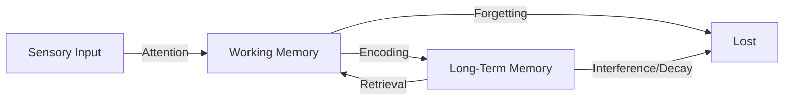

---
tags: #cognitive-science #cognitive-science #type/report/psychology #cognitive-science #type/reference
aliases: [Learning How to Learn, Cognitive Development Mastery, Self-Directed Learning Framework, Lifelong Learning Architecture]
---

> [!comprehensive-reference] 📚 Comprehensive Reference: Mastering Lifelong Self-Directed Learning
> - **Generated**: 2025-11-12
> - **Version**: 1.0
> - **Type**: Master Reference Documentation
> - **Scope**: Complete framework for cognitive development and knowledge mastery

> [!abstract]
> **Executive Overview**
> This master reference document synthesizes cognitive neuroscience, learning theory, metacognitive science, and knowledge management into an integrated framework for becoming a lifelong self-motivated knowledge specialist. It addresses the complete developmental arc from understanding your cognitive architecture through mastering metacognitive regulation to building sophisticated external knowledge systems that amplify learning capacity. This is your foundational blueprint for systematic self-improvement and intellectual growth.

> [!how-to-use-this]
> **Navigation Guide**
> This comprehensive reference spans six major domains covering all aspects of self-directed learning mastery. Each section builds upon previous foundations, creating a developmental progression from cognitive fundamentals through expert-level knowledge synthesis. Use this as both a sequential learning path and a permanent reference resource. Cross-references throughout connect concepts within your existing PKB ecosystem.

## 📑 Table of Contents

1. **[[#🧠 I. Cognitive Architecture: Understanding Your Learning Machinery]]**
2. **[[#⚙️ II. Learning Mechanisms: How Knowledge Is Acquired]]**
3. **[[#🎯 III. Metacognitive Mastery: Thinking About Thinking]]**
4. **[[#📚 IV. Knowledge Management Systems: Externalizing Your Mind]]**
5. **[[#🔄 V. Advanced Integration: Synthesis and Transfer]]**
6. **[[#♾️ VI. Lifelong Practice: Sustaining Growth]]**

---

# 🧠 I. Cognitive Architecture: Understanding Your Learning Machinery

> [!the-purpose]
> **Section Purpose**
> Before you can optimize learning, you must understand the biological and psychological systems that enable it. This section explores the fundamental cognitive machinery that underlies all learning processes—from neural plasticity to working memory to executive function.

## 1.1 Neural Foundations of Learning

### Neuroplasticity and Neurogenesis

> [!definition]
> - **Neuroplasticity**:: The brain's lifelong capacity to reorganize itself by forming new neural connections in response to learning, experience, and environmental changes
> - **Neurogenesis**:: The process of generating new neurons, particularly in the hippocampus, which continues throughout adult life and supports learning and memory

The human brain is not a fixed structure but rather a dynamic, adaptive organ that physically and chemically changes in response to learning experiences. This fundamental capacity—neuroplasticity—enables the acquisition of new skills, knowledge, and behaviors throughout the entire lifespan. Understanding neuroplasticity dismantles the dangerous misconception that intelligence or learning capacity is fixed after childhood.

Recent neuroscience research demonstrates that older adults can learn new skills and induce measurable brain changes through practice, contradicting the myth that the brain "solidifies" with age. The key insight is that the brain's plasticity is activity-dependent: it reorganizes based on what you practice and how you practice it.

**Mechanisms of Neural Change**:

1. **Synaptic Strengthening**: Repeated activation of neural pathways strengthens [[Synaptic Connections]], making future activation more efficient (long-term potentiation)
2. **Myelin Formation**: Practiced skills develop thicker myelin sheaths around neural pathways, accelerating signal transmission 
3. **Dendritic Branching**: Learning creates new dendritic branches, expanding the brain's connection network
4. **Neural Pruning**: Unused connections are eliminated, making the brain more efficient at prioritized tasks

> [!core-principle]
> **The Principle of Use-Dependent Plasticity**
> The brain's structure literally reflects your behavior patterns. Whatever you practice—whether productive or counterproductive—becomes neurologically reinforced. This is why [[Deliberate Practice]] and intentional habit formation are foundational to self-improvement.

Optimal learning requires environmental conditions that promote neuroplasticity and neurogenesis: adequate sleep, proper nutrition, regular exercise, and moderate (not extreme) stress levels. These aren't optional lifestyle choices but fundamental requirements for cognitive optimization.

### The Role of Stress in Learning

> [!warning]
> **The Stress-Learning Curve**
> Stress and learning follow an inverted-U relationship: Too little stress leads to disengagement and poor encoding; moderate stress optimizes attention and memory consolidation; excessive stress impairs cognitive function and inhibits learning.

Moderate stress activates the sympathetic nervous system, releasing cortisol and norepinephrine that enhance attention, focus, and memory consolidation. However, chronic or extreme stress damages the hippocampus (memory center) and impairs prefrontal cortex function (executive control).

**Practical Application**: Design learning environments with "desirable difficulties" that create moderate cognitive challenge without overwhelming anxiety. This includes techniques like [[Testing Effect]], [[Interleaving]], and [[Spacing Effect]]—all of which introduce manageable stress that enhances learning.

## 1.2 Working Memory and Cognitive Load

### Working Memory Architecture

> [!definition]
> - **[[Working Memory]]**:: The limited-capacity system for temporarily holding and manipulating information during cognitive tasks
> - **Capacity Limits**:: Typically 4±1 "chunks" of information can be actively maintained simultaneously
> - **Duration**:: Information fades from working memory within 10-20 seconds without rehearsal

Working memory serves as your cognitive workspace—the mental "scratch pad" where conscious thinking occurs. It's the bottleneck of human cognition and understanding its limitations is critical for designing effective learning strategies.

**Components of Working Memory** (Baddeley's Model):
- **Phonological Loop**: Processes verbal and auditory information (inner speech)
- **Visuospatial Sketchpad**: Handles visual and spatial information (mental imagery)
- **Episodic Buffer**: Integrates information from different modalities with [[Long-Term Memory]]
- **Central Executive**: Directs attention and coordinates the other components

The relationship with [[Long-Term Working Memory]] is crucial: Experts develop sophisticated [[Schemas|schemas]] that allow them to chunk information efficiently, effectively expanding working memory capacity within their domain of expertise.

### Cognitive Load Theory

[[Cognitive Load Theory]] explains how the limited capacity of working memory affects learning efficiency. Understanding the three types of cognitive load enables you to optimize learning conditions:

| Load Type               | Definition                                       | Strategy                                                                 |
| ----------------------- | ------------------------------------------------ | ------------------------------------------------------------------------ |
| **[[Intrinsic Load]]**  | Inherent difficulty of the material              | Cannot be reduced; requires building prerequisite knowledge              |
| **[[Extraneous Load]]** | Load imposed by poor instructional design        | Minimize through clear presentation, eliminating distractions            |
| **[[Germane Load]]**    | Productive effort devoted to schema construction | Maximize through deliberate practice, elaboration, and connection-making |

> [!methodology-and-sources]
> **Managing Cognitive Load**
> 1. **Reduce Extraneous Load**: Eliminate split-attention effects, redundant information, and poor formatting
> 2. **Manage Intrinsic Load**: Break complex material into manageable chunks; build prerequisite knowledge first
> 3. **Optimize Germane Load**: Use elaborative rehearsal, self-explanation, and concept mapping to deepen processing
> 4. **Leverage Automation**: Move procedural skills to automaticity to free working memory for higher-order thinking

> [!key-claim]
> **The Expertise Reversal Effect**
> Strategies that support novices (heavy guidance, worked examples) become counterproductive for experts who need more autonomous problem-solving to continue developing. Your learning strategies must evolve as your expertise grows.

## 1.3 Executive Functions

> [!definition]
> - **[[Executive Functions]]**:: Higher-order cognitive processes that control and regulate other cognitive abilities, enabling goal-directed behavior
> - **Neural Substrate**:: Primarily mediated by the prefrontal cortex
> - **Developmental Trajectory**:: Continues developing into the mid-20s; maintains plasticity throughout life

Executive functions comprise three core capacities: inhibitory control (resisting impulses), working memory (holding and manipulating information), and cognitive flexibility (adapting to changing demands). These domains contribute critically to reasoning, problem-solving, and planning.

### The Three Pillars of Executive Function

1. [[Inhibitory Control]]
- Resisting distractions and automatic responses
- Maintaining focus on relevant information
- Suppressing irrelevant thoughts or impulses
- *Application*: Essential for sustained attention during [[Deliberate Practice]] and resisting the temptation of [[Illusions Of Comprehension]]

2. [[Working Memory]] (Executive Aspect)
- Updating mental representations as new information arrives
- Manipulating information held in consciousness
- Integrating multiple streams of information
- *Application*: Critical for complex reasoning, problem-solving, and connecting new knowledge to existing [[Schemas|schemas]]

3. [[Cognitive Flexibility]]
- Shifting between different tasks or mental sets
- Viewing problems from multiple perspectives
- Adapting strategies when current approach isn't working
- *Application*: Enables transfer of learning, creative problem-solving, and recovery from ineffective study strategies

> [!use-cases-and-examples]
> **Executive Functions in Self-Directed Learning**
> - **Planning a Research Project**: Cognitive flexibility to explore multiple approaches; working memory to hold research questions and findings; inhibitory control to resist tangential interests
> - **Reading Complex Material**: Inhibitory control to suppress mind-wandering; working memory to connect concepts across paragraphs; cognitive flexibility to revise mental models when encountering contradictory information
> - **Skill Practice**: Inhibitory control to maintain focus during repetitive practice; working memory to apply feedback; cognitive flexibility to adjust technique

Executive functions are not merely relevant for academic success—they predict professional progress, job stability, healthy lifestyle habits, and quality interpersonal relationships throughout adult life. Investing in executive function development pays dividends across all life domains.

### Strengthening Executive Functions

> [!methodology-and-sources]
> **Evidence-Based Executive Function Training**
> 1. **[[Deliberate Practice]]**: Focused, challenging practice with immediate feedback strengthens all three EF components
> 2. **[[Metacognitive Reflection]]**: Regular self-monitoring and strategy adjustment trains executive control
> 3. **Physical Exercise**: Aerobic activity enhances prefrontal cortex function and executive capacity
> 4. **Mindfulness Meditation**: Strengthens attentional control and cognitive flexibility
> 5. **Challenging Cognitive Tasks**: Novel, complex activities (learning instruments, languages, programming) build executive reserves

---

# ⚙️ II. Learning Mechanisms: How Knowledge Is Acquired

> [!the-purpose]
> **Section Purpose**
> Understanding the cognitive architecture is necessary but insufficient—you must also understand the specific mechanisms and processes through which knowledge moves from external stimuli into durable internal representations. This section explores memory systems, encoding strategies, and evidence-based learning techniques.

## 2.1 Memory Systems Architecture

### The Multi-Store Model

> [!definition]
> - **Sensory Memory**:: Ultra-brief (milliseconds) storage of sensory input; most information never reaches conscious awareness
> - **Short-Term/[[Working Memory]]**:: Limited-capacity conscious processing (seconds to minutes)
> - **[[Long-Term Memory]]**:: Potentially unlimited storage of consolidated information (hours to lifetime)

The flow of information through these systems determines what gets learned and what gets forgotten. Understanding this progression allows you to design interventions at each stage:



### Long-Term Memory Subsystems

Long-term memory is not monolithic but comprises multiple specialized systems:

| Memory Type | Content | Consciousness | Example |
|-------------|---------|---------------|---------|
| **Explicit/Declarative** | Facts, events, concepts | Conscious, reportable | Recalling this definition |
| **Episodic** | Personal experiences, events | Conscious, context-rich | Your first day of school |
| **Semantic** | General knowledge, concepts | Conscious, decontextualized | Knowing Paris is in France |
| **Implicit/Procedural** | Skills, habits, conditioning | Unconscious, demonstrated | Riding a bicycle, typing |

> [!core-principle]
> **Principle of Encoding Specificity**
> Memory retrieval is most effective when the retrieval context matches the encoding context. This is why practicing recall in varied contexts (a form of [[Interleaving]]) builds more robust, transferable knowledge than studying in a single, consistent environment.

Procedural memory (skills) benefits from repetitive practice to achieve automaticity, while declarative memory (facts, concepts) requires diverse, elaborative encoding strategies such as connection-making, self-explanation, and varied retrieval practice.

## 2.2 The Science of Forgetting

### The Curve of Forgetting

The [[Curve Of Forgetting]] demonstrates that without reinforcement, newly learned information decays rapidly—potentially 50-80% within 24 hours. This isn't a design flaw but a feature: Your brain prioritizes information that proves persistently relevant through repeated retrieval.

> [!analogy]
> **The Path Through the Forest**
> Imagine a  path through dense forest representing a newly learned concept. After your first walk (initial learning), the path is barely visible. Without regular traversal, vegetation quickly reclaims the trail (forgetting). However, each time you walk the path again (retrieval practice), it becomes clearer, wider, and more permanent—eventually becoming a well-worn road requiring minimal maintenance.

**Implications for Learning Design**:
1. **Accept Initial Forgetting**: It's normal and unavoidable
2. **Schedule Strategic Review**: Use [[Spacing Effect]] principles to reinforce at optimal intervals
3. **Embrace [[Retrieval Practice]]**: Testing yourself isn't assessment—it's the learning mechanism itself
4. **Vary Contexts**: Each retrieval from a different context/state strengthens and flexibilizes the memory trace

### Interference and Consolidation

Two primary mechanisms cause forgetting beyond simple decay:

> [!definition]
> - **Proactive Interference**:: Old learning interferes with new learning (prior knowledge creates confusion)
> - **Retroactive Interference**:: New learning interferes with recalling old learning
> - **[[Memory Consolidation]]**:: The process of stabilizing memory traces, particularly during sleep

Sleep is not merely rest but an active period of memory consolidation where the brain replays learning experiences, strengthens neural connections, and integrates new information with existing knowledge structures. All-night cramming sessions sacrifice the very mechanism that would make the learning stick.

> [!methodology-and-sources]
> **Optimizing Consolidation**
> 1. **Sleep After Learning**: Aim for learning sessions several hours before sleep to maximize consolidation
> 2. **Naps Enhance Learning**: Even brief (20-90 minute) naps post-learning improve retention
> 3. **Avoid Interference**: Don't study similar topics back-to-back; interleave with dissimilar material
> 4. **Space Practice**: Distributed practice allows consolidation between sessions

## 2.3 Evidence-Based Learning Techniques

Based on [[Cognitive Science]] and empirical learning research, certain techniques consistently demonstrate superior learning outcomes compared to common but ineffective practices.

### High-Utility Techniques (Strongly Recommended)

**1. [[Retrieval Practice]] (Testing Effect)**

> [!definition]
> **[[Retrieval Practice]]**:: Actively recalling information from memory without looking at materials; the single most powerful learning technique across domains

The [[Retrieval Practice Loop]] in your PKB system represents a reinforcing feedback loop where testing yourself strengthens memory, which improves future retrieval, creating a positive spiral of learning consolidation.

**Why It Works**:
- Retrieval itself is a memory modifier, strengthening the recalled information
- Identifies knowledge gaps accurately (avoiding [[Illusions Of Comprehension]])
- Creates multiple retrieval pathways, making knowledge more accessible
- Triggers elaborative processing as you reconstruct information

**Implementation Methods**:
- Flashcards (spaced repetition software like Anki)
- Practice problems without looking at solutions
- Self-quizzing after reading/lectures
- Teaching/explaining to others (the [[Feynman Technique]])
- Free recall: Write everything you remember about a topic from memory

> [!warning]
> **Common Mistake: Recognition vs. Recall**
> Reading notes and feeling familiar with material creates an [[Illusions Of Comprehension|illusion of knowing]]. True learning requires effortful recall without cues—which feels harder but produces dramatically better retention.

**2. [[Spacing Effect]] (Distributed Practice)**

> [!definition]
> **[[Spacing Effect]]**:: Learning is more effective when study sessions are distributed over time rather than massed into single sessions

The spacing effect is one of the most robust findings in learning science, yet students consistently favor massed practice (cramming) despite its inferiority.

**Optimal Spacing Schedules**:
- **First Review**: 1 day after initial learning
- **Second Review**: 3-7 days after first review
- **Third Review**: 2-4 weeks after second review
- **Subsequent Reviews**: Increasingly longer intervals (months, then years for lifetime retention)

This aligns with your understanding of [[The Insight Compounding Loop]]—spaced retrieval allows each practice session to build on partially-forgotten material, creating stronger encoding through effortful retrieval.

**3. [[Interleaving]]**

> [!definition]
> **[[Interleaving]]**:: Mixing different types of problems or topics during study sessions rather than blocking them by type

Research shows that interleaving various problems and topics substantially improves test performance compared to blocking practice by problem type, even though interleaving feels more difficult during practice.

**Why It Works**:
- Forces discrimination between problem types (when to apply which strategy)
- Prevents over-learning of single problem types
- Builds flexible knowledge that transfers to novel situations
- Mimics real-world conditions where problems don't come labeled by type

**Implementation**:
- Mix problem types within homework sets
- Alternate between related topics during study sessions
- Combine review of old material with learning new material
- Practice applying concepts to varied contexts

**4. [[Elaborative Interrogation]] and [[Self-Explanation]]**

> [!definition]
> - **[[Elaborative Interrogation]]**:: Generating explanations for why stated facts are true ("Why would this be the case?")
> - **[[Self-Explanation]]**:: Explaining to yourself how new information relates to what you already know

These techniques force deep, generative processing that creates rich, interconnected knowledge structures rather than isolated facts.

This connects directly to your [[Constructivist Epistemology]] understanding—knowledge is constructed through active integration with existing [[Schemas|schemas]], not passively received.

**Question Stems for Elaboration**:
- "Why does this make sense?"
- "How does this connect to [related concept]?"
- "What would happen if this were false?"
- "Can I think of an example?"
- "What principle underlies this?"

**5. [[Chunking]]**

> [!definition]
> **[[Chunking]]**:: Organizing individual pieces of information into meaningful groups or patterns

[[Chunking]] addresses [[Working Memory]]'s limited capacity by packaging information into larger, meaningful units. Experts in any domain are distinguished by sophisticated chunking schemes that allow them to process complex information efficiently.

**Chunking Development**:
1. **Recognition**: Identify repeating patterns in domain
2. **Compression**: Group related elements into single units
3. **Hierarchical Organization**: Build chunks of chunks (sub-routines)
4. **Automatization**: Practice until chunks activate unconsciously

**Example**: Chess masters don't remember individual piece positions but meaningful configurations (chunks) like "castled king position" or "fianchettoed bishop formation."

### Moderate-Utility Techniques

**6. [[Concept Mapping]] and Visual Organization**

Creating node-link diagrams that show relationships between concepts promotes:
- Explicit relationship identification
- Integration of new and existing knowledge
- Revealing gaps in understanding
- Alternative retrieval pathways

This aligns with your [[03-notes/01_permanent-notes/02_personal-knowledge-base/Networked Thought]] approach in Obsidian, where concepts become nodes in a knowledge graph with explicit, typed relationships.

**7. Dual Coding (Verbal + Visual)**

> [!core-principle]
> **Dual Coding Theory**
> Information encoded both verbally and visually creates redundant memory traces and multiple retrieval pathways, improving retention and understanding.

Combine text explanations with:
- Diagrams and illustrations
- Mental imagery
- Physical demonstrations
- Spatial arrangements

Multisensory instruction engages multiple brain regions simultaneously, creating richer encoding and stronger neural connections.

### Low-Utility Techniques (Not Recommended)

> [!warning]
> **Ineffective but Popular Strategies**
> Despite widespread use, these techniques show minimal learning benefits:

- **Rereading/Reviewing**: Passive exposure creates familiarity but not retrieval strength
- **Highlighting/Underlining**: Without subsequent processing, minimal benefit
- **Summarization** (without testing): Better than nothing, but inferior to retrieval practice
- **Massed Practice (Cramming)**: Produces short-term performance but poor long-term retention

## 2.4 Desirable Difficulties

> [!core-principle]
> **The Paradox of Difficulty**
> Learning strategies that feel easier during practice often produce weaker long-term retention, while strategies that feel harder during practice produce superior learning outcomes. This is the principle of [[Desirable Difficulties]].

This principle is central to [[Cognitive Load Theory]]—germane load (productive cognitive effort) should be maximized while extraneous load (wasted effort) is minimized.

**Examples of Desirable Difficulties**:
1. **Retrieval Practice** (vs. rereading): Effortful recall strengthens memory more than passive review
2. **Spacing** (vs. massing): Forgetting between sessions makes retrieval harder but more beneficial
3. **Interleaving** (vs. blocking): Mixed practice is more challenging but builds discriminative ability
4. **Generation** (vs. reading): Producing answers is harder than recognizing them but more effective
5. **Variation** (vs. constant practice): Varying conditions complicates practice but improves transfer

> [!analogy]
> **Weight Training for the Mind**
> Just as muscles grow stronger through the stress of resistance training (not through comfortable stretching), memory and understanding strengthen through the productive struggle of difficult retrieval and application—not through comfortable familiarity with material.

**Practical Application**: When designing study sessions, prioritize methods that feel challenging and effortful. If learning feels too easy, you're probably not optimizing for long-term retention.

---

# 🎯 III. Metacognitive Mastery: Thinking About Thinking

> [!the-purpose]
> **Section Purpose**
> Understanding cognitive mechanisms is necessary but insufficient for mastery. You must also develop sophisticated metacognitive abilities—the capacity to monitor, evaluate, and regulate your own learning processes. This section explores the neuroscience and practice of metacognition, connecting to your existing understanding of self-regulated learning.

## 3.1 Metacognitive Architecture

### Defining Metacognition

> [!definition]
> - **[[Metacognition]]**:: Higher-order thinking that involves active control over cognitive processes engaged in learning
> - **Two Components**: 
>   - **[[Metacognitive Knowledge]]**: Understanding of how human cognition works generally and your own cognitive processes specifically
>   - **[[Metacognitive Regulation]]**: The active monitoring and control of cognitive processes during learning

Metacognition comprises both the ability to be aware of one's cognitive processes (metacognitive knowledge) and to regulate them (metacognitive control). Following Nelson and Narens' framework, metacognitive knowledge represents information flow from the object level (actual cognitive processes) to the meta-level (awareness), while metacognitive control represents flow from meta-level to object level (regulation of those processes).

### Neural Substrates of Metacognition

While educational and neuroscience approaches to metacognition have developed largely separately, emerging research is identifying specific brain regions that encode metacognitive processes, particularly the prefrontal cortex and anterior cingulate cortex involved in monitoring and control.

**Key Brain Regions**:
- **Prefrontal Cortex**: Executive control, strategy selection, cognitive monitoring
- **Anterior Cingulate Cortex**: Error detection, conflict monitoring, performance evaluation
- **Medial Temporal Lobe**: Metamemory judgments, confidence assessments
- **Posterior Parietal Cortex**: Integration of confidence and decision-making

> [!core-principle]
> **Metacognition as Learnable Skill**
> Metacognitive abilities are not fixed traits but trainable skills that improve with practice and explicit instruction. Research consistently shows metacognitive training enhances learning outcomes across domains and age groups.

## 3.2 Metacognitive Knowledge

[[Metacognitive Knowledge]] encompasses three domains: person knowledge, task knowledge, and strategy knowledge.

### Person Knowledge (Knowing Yourself as Learner)

Understanding your own cognitive characteristics, strengths, limitations, and preferences:

**Areas of Self-Knowledge**:
1. **Cognitive Strengths/Weaknesses**: Where you excel naturally vs. require extra effort
2. **Learning Preferences**: Conditions that optimize your learning (time of day, environment, modalities)
3. **Motivational Patterns**: What energizes vs. depletes you
4. **Attentional Capacity**: How long you can sustain focus; signs of fatigue
5. **Prior Knowledge**: Accurate assessment of what you already know

> [!use-cases-and-examples]
> **Self-Knowledge in Action**
> - *Recognizing* you retain verbal information better than visual → *Adapting* by creating written summaries of diagrams
> - *Noticing* focus deteriorates after 45 minutes → *Implementing* Pomodoro technique with breaks
> - *Understanding* you have strong [[Working Memory]] → *Leveraging* this for complex problem-solving vs. simple memorization

> [!warning]
> **The Dunning-Kruger Effect**
> The [[Dunning-Kruger Effect]] describes how incompetence in a domain impairs metacognitive ability—novices cannot accurately assess their own skill level because assessment requires the very expertise they lack. This creates dangerous overconfidence in early learning stages.

**Mitigating Strategy**: Seek external feedback, use objective performance metrics, and adopt humble curiosity about what you don't know you don't know.

### Task Knowledge (Understanding Cognitive Demands)

Accurate assessment of task difficulty, structure, and requirements:

**Key Assessments**:
- **Intrinsic Difficulty**: How complex is the material itself?
- **Required Depth**: What level of understanding is needed? (recognition vs. application vs. synthesis)
- **Time Requirements**: How long will mastery realistically take?
- **Prerequisites**: What foundational knowledge is necessary?

> [!methodology-and-sources]
> **Task Analysis Protocol**
> 1. **Decompose**: Break complex tasks into component skills
> 2. **Assess Prerequisites**: Identify necessary foundational knowledge
> 3. **Estimate Difficulty**: Compare to past learning experiences
> 4. **Plan Resources**: Allocate time, attention, and tools accordingly
> 5. **Set Criteria**: Define what "success" looks like for this task

### Strategy Knowledge (Knowing When/Why/How to Use Techniques)

Understanding cognitive strategies, their appropriate application contexts, and limitations:

**Dimensions of Strategy Knowledge**:
1. **Declarative**: What strategies exist? (knowing names and procedures)
2. **Conditional**: When/where should each strategy be applied? (contextual appropriateness)
3. **Procedural**: How is each strategy implemented? (execution skills)
4. **Evaluative**: How effective was the strategy? (outcome assessment)

| Strategy | When to Use | When NOT to Use | Why It Works |
|----------|-------------|-----------------|--------------|
| **Retrieval Practice** | After initial exposure; periodically for review | Before initial understanding; for pure recognition tasks | Strengthens memory traces through effortful recall |
| **[[Elaborative Interrogation]]** | For conceptual material requiring deep understanding | For arbitrary facts, procedural skills | Builds connections to existing knowledge |
| **[[Interleaving]]** | When discriminating between problem types matters | Early skill acquisition (block first, then interleave) | Develops flexible, transferable knowledge |
| **[[Chunking]]** | When working memory is overwhelmed; in domains with patterns | For truly random information with no structure | Reduces cognitive load by grouping information |

## 3.3 Metacognitive Regulation

[[Metacognitive Regulation]] involves three cyclical phases: [[Metacognitive Planning]], monitoring/control, and [[Metacognitive Reflection]].

### Planning Phase

> [!definition]
> **[[Metacognitive Planning]]**:: Setting learning goals, activating relevant prior knowledge, and selecting appropriate strategies before engaging with material

Students with high metacognitive knowledge and regulation initiate self-regulated learning processes earlier, primarily employing strategic task-specific approaches rather than relying solely on time management.

**Pre-Learning Questions**:
- What do I already know about this topic? ([[Prior Knowledge]] activation)
- What specifically do I need to learn? (goal clarification)
- How difficult will this be for me? (task assessment)
- What strategies should I use? (strategy selection)
- How much time will I need? (resource allocation)
- How will I know if I've learned it? (success criteria)

> [!methodology-and-sources]
> **Effective Planning Protocol**
> 1. **Skim Material**: Get overview of scope and difficulty
> 2. **Activate Prior Knowledge**: Write/speak what you already know
> 3. **Generate Questions**: What do you want to learn? What confuses you?
> 4. **Select Strategies**: Choose evidence-based techniques appropriate for material
> 5. **Schedule Sessions**: Plan spaced practice with realistic time estimates
> 6. **Establish Checkpoints**: Set intermediate goals for progress monitoring

### Monitoring and Control Phase

> [!definition]
> - **[[Metacognitive Control]]**:: Online monitoring of comprehension and strategy effectiveness during learning, with adaptive adjustments
> - **[[Metacognitive Calibration]]**:: Accuracy of self-assessments compared to actual performance

Metacognition involves cognitive self-awareness and self-regulation of cognitive processes, serving as a key predictor of successful learning and academic achievement.

**During-Learning Questions**:
- Am I understanding this? (comprehension monitoring)
- Is this strategy working? (effectiveness evaluation)
- Am I staying focused? (attention regulation)
- Should I slow down/speed up? (pacing adjustment)
- Do I need to seek help? (resource utilization)

> [!warning]
> **Illusions of Knowing**
> [[Illusions Of Comprehension]] occur when fluency (ease of processing) is mistaken for learning. Material can feel familiar without actual understanding or retrieval ability.

**Calibration Strategies**:
1. **Self-Testing**: Regularly quiz yourself to compare perceived vs. actual knowledge
2. **Explain-to-Others**: If you can't explain clearly, you don't understand
3. **Apply to Novel Contexts**: Transfer to new situations reveals depth of understanding
4. **Seek Feedback**: External assessment corrects calibration errors
5. **Track Predictions**: Record confidence ratings and check against performance

### Reflection Phase

> [!definition]
> **[[Metacognitive Reflection]]**:: Post-learning evaluation of outcomes, strategy effectiveness, and lessons for future learning

[[Structured Reflection]] using frameworks like [[Reflective Observation]] transforms experience into learning by making tacit lessons explicit.

**Post-Learning Questions**:
- Did I achieve my learning goals? (outcome evaluation)
- Which strategies worked well? Which didn't? (strategy assessment)
- What surprised me or challenged my expectations? (belief revision)
- What would I do differently next time? (adaptive planning)
- How does this connect to other knowledge? (integration)
- What should I practice next? (future planning)

> [!methodology-and-sources]
> **Structured Reflection Protocol**
> 1. **Performance Assessment**: How well did I actually learn? (use testing, not feeling)
> 2. **Strategy Evaluation**: Rate effectiveness of each strategy used
> 3. **Challenge Identification**: What was most difficult? Why?
> 4. **Success Attribution**: What enabled my successes?
> 5. **Lesson Extraction**: What general principles can I take forward?
> 6. **Action Planning**: What specific changes will I make next time?

This reflection protocol feeds into [[The Insight Compounding Loop]] in your PKB system—each learning session generates insights that improve future learning, creating exponential growth.

## 3.4 Self-Regulated Learning (SRL)

> [!definition]
> **[[Self-Regulated Learning]]**:: The process whereby learners activate and sustain cognitions, behaviors, and affects that are systematically oriented toward attainment of learning goals

Self-regulated learning exhibits interdependence—metacognitive processes, motivation, and strategic behavior interact dynamically throughout learning episodes. Your understanding of [[Self-Regulation-Theory]], [[Self-Determination Theory]], and [[Self-Behavioral Management]] all contribute to this framework.

### Zimmerman's Cyclical Model of SRL

SRL is not a linear process but a cyclical one with three phases:

**1. Forethought Phase**
- **Task Analysis**: Goal setting, strategic planning
- **Self-Motivation Beliefs**: Self-efficacy, outcome expectations, intrinsic interest, goal orientation

**2. Performance Phase**
- **Self-Control**: Attention focusing, self-instruction, imagery, task strategies
- **Self-Observation**: [[Metacognitive Control|Metacognitive monitoring]], self-recording

**3. Self-Reflection Phase**
- **Self-Judgment**: Self-evaluation, causal attribution
- **Self-Reaction**: Self-satisfaction, adaptive/defensive reactions

> [!core-principle]
> **The Cycle of Self-Improvement**
> Each completion of the SRL cycle generates information that informs the next cycle. Over time, you develop increasingly accurate self-knowledge, refined strategies, and improved self-regulation—but only if you close the loop with honest reflection and adaptive response.

Recent research shows that explicit metacognitive support significantly enhances self-regulated learning, particularly in technology-enhanced environments. Students receiving metacognitive prompts demonstrate better learning processes, higher achievement, and improved learning experiences compared to those without such support.

### Integration with Your Existing Framework

Your PKB notes reveal sophisticated understanding of related constructs:

- **[[Self-Determination Theory]]**: Provides motivational foundation (autonomy, competence, relatedness)
- **[[Locus Of Control]]** & [[Agency-(Stoicism)]]: Distinguish between controllable (effort, strategies) and uncontrollable (innate ability, task difficulty) factors
- **[[Dichotomy Of Control]]**: Apply Stoic principles—focus on what you can control (study methods, reflection practice) not outcomes
- **[[Psychological Resilience]]**: Develop antifragility through controlled challenges and learning from setbacks

> [!analogy]
> **The Thermostat vs. Thermometer**
> A thermometer merely reports temperature; a thermostat monitors temperature and adjusts to maintain desired state. Self-regulated learners are thermostats—actively monitoring their learning state and making adjustments to reach goals, not passive recipients of instruction.

### Developing SRL Capacity

> [!methodology-and-sources]
> **Building Self-Regulation Skills**
> 1. **Start with Structure**: Use external scaffolds (templates, checklists) initially
> 2. **Make Processes Explicit**: Verbalize your thinking and strategy use
> 3. **Practice Metacognitive Questioning**: Internalize the questions from each SRL phase
> 4. **Track Your Cycles**: Document planning, monitoring, and reflection for several learning episodes
> 5. **Gradual Release**: Slowly remove scaffolds as processes become automatic
> 6. **Seek Feedback**: Discuss your learning processes with [[More Knowledgeable Other|more knowledgeable others]]

Research on children's metacognitive development shows that teacher/mentor support is essential, especially in early stages. Scaffolding from more experienced others enables learners to operate within their [[Zone Of Proximal Development]] until they can self-regulate independently.

---

# 📚 IV. Knowledge Management Systems: Externalizing Your Mind

> [!the-purpose]
> **Section Purpose**
> While internal cognitive and metacognitive development is foundational, true mastery requires sophisticated external systems that capture, organize, and amplify your learning. This section synthesizes [[Knowledge Management]], [[03-notes/01_permanent-notes/02_personal-knowledge-base/Personal Knowledge Management]], and your Obsidian-based PKB infrastructure into a comprehensive framework for lifelong knowledge work.

## 4.1 Theoretical Foundations of PKM

### From Information to Knowledge to Wisdom

> [!definition]
> **The Data-Information-Knowledge-Wisdom (DIKW) Hierarchy**:
> - **Data**: Raw, unorganized facts
> - **Information**: Data organized into meaningful patterns
> - **Knowledge**: Information internalized, understood, and connected
> - **Wisdom**: Knowledge applied with judgment, insight, and ethical consideration

Personal Knowledge Management (PKM) is the process of collecting information that a person uses to gather, classify, store, search, retrieve, and share knowledge in daily activities—fundamentally a bottom-up approach where knowledge workers take responsibility for their own growth and learning.

The critical insight: Information becomes knowledge only through active cognitive processing—connection-making, application, and integration with existing understanding. Your PKM system is not a storage repository but a thinking environment.

### The PKM Imperative

Modern knowledge workers face unprecedented information overload. Studies show employees spend an average of 9.3 hours per week searching for information, and 80% of global workers report information overload. Without systematic PKM practices, this deluge overwhelms rather than empowers.

The global knowledge management market was valued around $667.46 billion in 2024, expected to grow to almost $2.99 trillion by 2033, underscoring the critical importance of effective knowledge management at both individual and organizational levels.

**Why PKM Matters**:
1. **Coping with Complexity**: Systematic organization reduces overwhelm and supports clear thinking
2. **Continuous Learning**: Enables structured capture and review of new knowledge
3. **Creative Synthesis**: Facilitates connecting disparate ideas to generate insights
4. **Knowledge Preservation**: Prevents loss of hard-won insights and understanding
5. **Cognitive Offloading**: Frees working memory for thinking, not remembering
6. **Compounding Returns**: Knowledge builds on knowledge through network effects

> [!core-principle]
> **The Principle of Externalizing Cognition**
> The human mind is better at generating ideas than storing them, connecting concepts than organizing them, and thinking than remembering. External knowledge systems should handle what tools do best (storage, organization, search) while humans focus on what we do best (understanding, synthesis, insight generation).

### PKM vs. Digital Hoarding

> [!warning]
> **The Critical Distinction**
> Many note-taking systems devolve into "digital hoarding"—accumulating information without processing it. True PKM requires transformation: raw information → processed notes → connected knowledge → synthesized insights → applied wisdom.

Professionals who excel—whether consultants analyzing client information or researchers linking various studies—clearly distinguish between information storage (which creates clutter) and knowledge management (which creates understanding through connections and processing).

**Digital Hoarding Signs**:
- Clipping/saving content without reading or processing
- Accumulating notes with no internal connections
- Search becoming difficult due to volume
- Rarely revisiting captured information
- No clear organization or retrieval system

**True PKM Characteristics**:
- Active processing of every captured item
- Rich network of connections between concepts
- Regular review and refinement of notes
- Easy retrieval through multiple access paths
- Frequent reuse and synthesis of knowledge

## 4.2 PKM System Architecture

Your PKB system reflects sophisticated understanding of [[Note-Taking Infrastructure]], [[Methodological Frameworks]], and [[03-notes/01_permanent-notes/02_personal-knowledge-base/Networked Thought]].

### Core Components of Effective PKM

Successful PKM systems rest upon four pillars that transform raw data into usable knowledge:

**1. Capture: Information Intake**

> [!definition]
> **Capture**:: The systematic process of collecting information from various sources in ways that facilitate future processing and integration

**Capture Principles**:
- **Friction Reduction**: Make capture as effortless as possible
- **Contextual Metadata**: Record source, date, and initial thoughts
- **Selective Attention**: Not everything deserves capture; filter for personal relevance
- **Quick Processing**: Brief initial thoughts while context is fresh

This aligns with your [[Stock Of Concrete Experiences]]—capturing experiences and observations that will later become raw material for reflection and abstraction.

**Capture Tools by Context**:
- **Desktop Research**: Web clipper, copy-paste to inbox
- **Mobile Insights**: Voice memos, quick capture apps
- **Reading**: Margin notes, highlights with commentary
- **Conversations**: Brief notes immediately after
- **Internal Thoughts**: Dedicated "idea inbox"

**2. Organization: Structure and Taxonomy**

> [!methodology-and-sources]
> **Organization Philosophy**
> Your organization system should serve future retrieval and connection-making, not just filing. The goal is creating multiple access pathways, not perfect categories.

**Organization Strategies**:

- **PARA Method**: Projects, Areas, Resources, Archives (temporal organization)
- **Zettelkasten**: Atomic notes with organic linking structure (your primary approach)
- **Johnny Decimal**: Hierarchical decimal organization (10 areas, 10 categories each)
- **Thematic Folders**: Subject-based hierarchy (traditional but limited)
- **Tag-Based**: Flexible, multi-dimensional classification

Your Obsidian vault uses a sophisticated hybrid: folder structure for primary organization (permanent notes, literature notes, reference materials) combined with extensive tagging and wiki-linking for multi-dimensional access.

**Organization Principles**:
- **Progressive Summarization**: Layer compression (highlight → bold → summary note)
- **Atomic Notes**: One concept per note for maximum reusability
- **Consistent Naming**: Predictable patterns aid discovery
- **Metadata Schemas**: Structured frontmatter enables programmatic querying
- **Folder Hierarchy**: Shallow (2-3 levels max) to prevent over-organization

**3. Retrieval: Finding Knowledge When Needed**

PKM transforms information haystacks into well-organized file cabinets where the right information is just a few clicks away.

**Retrieval Methods**:
- **Full-Text Search**: Find specific terms across entire vault
- **Tag Queries**: Filter by metadata classifications
- **Backlinks**: See all notes referencing current note
- **Graph Exploration**: Visual navigation of concept relationships
- **Index Notes/MOCs**: Curated starting points for topics
- **Dataview Queries**: Programmatic filtering and aggregation

> [!quick-reference]
> **Retrieval Best Practices**
> - 🔗 **Multiple Pathways**: Ensure each note can be found via several routes
> - 📊 **Use Dataview**: Dynamic queries prevent manual maintenance
> - 🗺️ **Create MOCs**: Maps of Content provide topical navigation hubs
> - 🏷️ **Strategic Tagging**: Tags should answer "how would I search for this?"
> - 🔎 **Test Retrieval**: Periodically try to find information; note difficulties

**4. Synthesis: Creating New Knowledge**

> [!core-principle]
> **Synthesis is the Endpoint**
> The ultimate purpose of PKM is not storage or organization but synthesis—generating new insights through connecting existing knowledge in novel ways.

This represents [[The Insight Compounding Loop]]—accumulated knowledge enables insights, which feed back to improve knowledge acquisition, creating exponential growth.

**Synthesis Activities**:
- **Connection-Making**: Linking previously separate concepts
- **Pattern Recognition**: Identifying themes across disparate notes
- **Abstraction**: Moving from specific examples to general principles
- **Application**: Applying concepts to new domains
- **Creation**: Writing, building, teaching from your knowledge base
- **Debate**: Engaging with contrasting perspectives in your notes

> [!methodology-and-sources]
> **Synthesis Workflow**
> 1. **Lateral Discovery**: Browse connections and unexpected links
> 2. **Thematic Clustering**: Group related notes around emerging themes
> 3. **Outline Generation**: Structure synthesis around key questions
> 4. **Draft Creation**: Write connecting narrative synthesizing multiple notes
> 5. **Publish/Apply**: Create external artifact (article, presentation, project) from synthesis
> 6. **Reflect Back**: Update source notes with insights from synthesis

## 4.3 Zettelkasten Methodology

Your PKB system centers on [[Zettelkasten methodology]], a sophisticated note-taking and knowledge development approach pioneered by sociologist Niklas Luhmann.

### Core Zettelkasten Principles

**1. Atomicity: One Idea Per Note**

> [!definition]
> **Atomic Note**:: A note expressing a single, self-contained idea or concept that can be understood independently

**Benefits of Atomicity**:
- **Reusability**: Notes can be linked in multiple contexts
- **Clarity**: Forces precise articulation of ideas
- **Flexibility**: Concepts can be recombined in novel ways
- **Maintenance**: Easier to update specific ideas than monolithic documents

**Atomicity Guidelines**:
- Can this be split further without losing coherence?
- Can I link to this note from various contexts?
- Does the note title accurately describe the single idea?
- Can someone understand this note without reading others?

**2. Connectivity: Network Over Hierarchy**

> [!core-principle]
> **The Network Effect in Knowledge**
> The value of a knowledge base grows non-linearly with connections. A note's value comes not just from its content but from its position in a web of related concepts.

**Types of Connections**:
- **Direct Links**: Explicit wiki-links between related notes
- **Backlinks**: Reverse connections showing where note is referenced
- **Index Notes/MOCs**: Curated collections organizing related notes
- **Proximity in Graph**: Concepts that frequently co-occur become clustered

**Connection-Making Questions**:
- What concept does this elaborate on? (link to parent)
- What examples illustrate this? (link to specifics)
- What contradicts or contrasts with this? (link to counterpoints)
- What does this remind me of? (link to analogies)
- What problems does this help solve? (link to applications)

**3. Progressive Elaboration: Notes Mature Over Time**

> [!methodology-and-sources]
> **Note Lifecycle**
> 1. **Fleeting Note**: Quick capture of idea (temporary)
> 2. **Literature Note**: Processing of source material (contextual)
> 3. **Permanent Note**: Atomic, evergreen concept (long-term)
> 4. **Structure Note/MOC**: Organizing clusters of permanents (navigational)
> 5. **Synthesis Note**: Original insights from connections (creative)

Your metadata scheme tracks note status (seedling, budding, evergreen) reflecting this maturation process.

**Elaboration Practices**:
- Revisit notes periodically and add connections
- Update notes when learning related concepts
- Refine language for clarity and precision
- Add examples as you encounter them
- Link new notes to existing relevant notes

**4. Own Words: Avoid Copy-Paste Comprehension**

> [!warning]
> **The Plagiarism Trap**
> Copying passages from sources into notes creates the illusion of understanding without actual comprehension. True learning requires translation into your own conceptual framework.

**Principles of Reformulation**:
- Paraphrase in your own language
- Explain as if teaching someone unfamiliar with the topic
- Connect to your existing knowledge structures
- Extract the principle, not just the example
- Question and critique, don't just accept

**5. Write for Future Self: Assume Forgetting**

> [!analogy]
> **Notes as Messages to Future You**
> Writing a note is communicating with a future version of yourself who will have forgotten the current context. Write clearly enough that Future You can pick up the idea without needing to revisit source materials.

**Guidelines**:
- Provide sufficient context for standalone comprehension
- Explain jargon and technical terms
- Include concrete examples
- Make connections explicit rather than assuming they're obvious
- Date-stamp and source notes for credibility assessment

## 4.4 Practical PKM Implementation

### Daily/Weekly Routines

> [!methodology-and-sources]
> **The PKM Maintenance Cycle**
> 
> **Daily Practices (10-15 minutes)**:
> - Process capture inbox (empty all inboxes daily)
> - Write 1-2 permanent notes from processed material
> - Link new notes to existing knowledge
> - Quick review of recent notes
> 
> **Weekly Review (45-60 minutes)**:
> - Curate week's notes into thematic clusters
> - Identify emerging patterns or themes
> - Update MOCs/index notes
> - Reflect on learning progress
> - Plan next week's knowledge priorities
> 
> **Monthly Synthesis (2-3 hours)**:
> - Deep synthesis session: connect distant concepts
> - Create structure notes for major themes
> - Prune outdated or duplicate notes
> - Evaluate PKM system effectiveness
> - Document meta-learning insights

### Progressive Summarization Technique

Your understanding of [[Progressive Summarization]] aligns with Tiago Forte's compression layers.

**Layer 1: Original Capture**
- Clip/save source material in full

**Layer 2: Bold Highlights**
- Bold key passages (15-25% of content)
- First-pass filtering for relevance

**Layer 3: Highlighted Highlights**
- Highlight the bolded passages (top 5-10%)
- Second compression layer

**Layer 4: Mini-Summary**
- 3-5 bullet executive summary at top
- Core ideas in your own words

**Layer 5: Remix/Create**
- Permanent notes, syntheses, original content
- Material is now internalized and transformed

### Evergreen Notes vs. Reference Notes

| Aspect | Evergreen Notes | Reference Notes |
|--------|----------------|-----------------|
| **Content** | Your original thoughts and syntheses | Information from external sources |
| **Language** | Your own words and framing | May include quotes and technical language |
| **Links** | Extensively connected to your knowledge graph | Limited connections, more isolated |
| **Evolution** | Regularly updated and refined | Generally static after initial capture |
| **Purpose** | Building your thinking | Preserving source material |
| **Examples** | Conceptual understanding, personal models | Book summaries, article clippings, research papers |

Your permanent notes are evergreen notes—atomic, interconnected, continually refined.

### Avoiding Common PKM Pitfalls

> [!warning]
> **PKM Anti-Patterns**
> 
> **1. Premature Organization**
> - Don't spend hours creating folder hierarchies before content exists
> - Let structure emerge organically from connections
> 
> **2. Tool-Switching**
> Constant migration between platforms interrupts workflow and creates disorganized knowledge bases, ultimately reducing effectiveness.
> - Choose tools thoughtfully; commit to giving them time
> 
> **3. Perfectionism Paralysis**
> - Done is better than perfect for capture and initial processing
> - Notes can always be refined later
> 
> **4. Feature Obsession**
> - Resist the urge to tweak systems instead of using them
> - Simple, consistent practices beat complex, abandoned ones
> 
> **5. Capture Without Processing**
> - Reading/clipping without creating permanent notes wastes effort
> - Always complete the processing loop

---

# 🔄 V. Advanced Integration: Synthesis and Transfer

> [!the-purpose]
> **Section Purpose**
> Having developed cognitive foundations, metacognitive awareness, and external knowledge systems, this section addresses advanced challenges: How do you synthesize knowledge across domains? How does expertise develop? How do you transfer learning to novel contexts? These are the hallmarks of true mastery.

## 5.1 Expertise Development

### The Path to Expertise

> [!definition]
> **Expertise**:: Domain-specific superior performance that is consistent, reproducible, and measurably better than that of novices or competent practitioners

Expertise is not merely accumulated experience (time in domain) but rather the result of specific, focused practice aimed at improving performance. This is the central insight of [[Deliberate Practice]] theory.

### Deliberate Practice Framework

K. Anders Ericsson's Deliberate Practice Framework proposes that expert performance results from extended engagement in practice activities specifically designed to improve performance, rather than from innate talent. However, the framework has been refined through decades of research and debate.

**Core Characteristics of [[Deliberate Practice]]**:

1. **Well-Defined Goals**: Specific performance targets, not vague improvement desires
2. **Full Concentration**: Sustained, focused attention on practice activities
3. **Immediate Feedback**: Knowledge of results allowing real-time adjustment
4. **Difficulty Calibration**: Tasks slightly beyond current ability (within [[Zone Of Proximal Development]])
5. **Repetition with Refinement**: Not mindless repetition but iterative improvement
6. **Mental Representations**: Building increasingly sophisticated [[Schemas|schemas]] of domain structure

More recent research has found more nuanced effects than originally claimed: deliberate practice is strongly associated with expertise but effect sizes are smaller than in Ericsson's original violin study, and individual differences and domain-specific factors also play significant roles.

> [!use-cases-and-examples]
> **Deliberate Practice Across Domains**
> 
> **Chess**:
> - Not just playing games but analyzing positions, studying master games, solving tactical puzzles with immediate correctness feedback
> 
> **Music**:
> - Not just playing pieces but isolating difficult passages, using metronome for rhythm precision, recording/analyzing performances
> 
> **Writing**:
> - Not just writing but analyzing exemplary texts, deliberate sentence-level revision, seeking detailed feedback on specific aspects
> 
> **Learning/Cognition**:
> - Not just reading/studying but testing yourself immediately, analyzing mistakes, deliberately varying practice conditions, seeking metacognitive feedback

### Expert-Novice Differences

Research on expertise reveals consistent patterns distinguishing experts from novices:

| Dimension | Novices | Experts |
|-----------|---------|---------|
| **Knowledge Structure** | Isolated facts, surface features | Rich [[Schema|schemas]], deep principles |
| **Problem Representation** | Concrete, formula-focused | Abstract, conceptual patterns |
| **Pattern Recognition** | Limited, effortful | Rapid, intuitive |
| **[[Working Memory]]** | Standard capacity (4±1 chunks) | Extended capacity through [[Long-Term Working Memory|domain-specific schemas]] |
| **Metacognitive Accuracy** | Poor calibration, overconfidence early ([[Dunning-Kruger Effect]]) | Well-calibrated, accurate self-assessment |
| **Strategy Use** | Limited repertoire, inflexible | Extensive, adaptively deployed |
| **Error Detection** | External feedback required | Self-monitoring, early error detection |

> [!core-principle]
> **Experts Think Differently, Not Just Better**
> Expertise is not simply having more knowledge but having fundamentally different cognitive structures and processes. Experts don't work harder—they work smarter because they've automated low-level operations and can focus attention on strategic aspects.

### Building Mental Representations

The theory of deliberate practice emphasizes incorporating a self-reflective feedback loop into skill delivery or development, rather than simply performing tasks repetitively until mastered.

> [!definition]
> **Mental Representation**:: A mental structure corresponding to an object, idea, collection of information, or anything concrete or abstract that the mind is thinking about

**Characteristics of Expert Mental Representations**:
- **Chunked**: Information organized into meaningful patterns
- **Hierarchical**: Higher-order chunks composed of lower-order elements
- **Flexible**: Accessible from multiple entry points
- **Efficient**: Minimal cognitive load to activate
- **Actionable**: Directly connected to procedures and strategies

**Developing Strong Representations**:
1. **Study Exemplars**: Analyze outstanding examples in domain
2. **Compare/Contrast**: Identify similarities and differences between cases
3. **Abstract Principles**: Extract underlying patterns from specific instances
4. **Anticipate**: Predict outcomes before seeing results
5. **Explain**: Articulate rationale for strategies and solutions
6. **Reflect**: Analyze what makes approaches effective or ineffective

This connects to your understanding of [[Stock Of Abstract Conceptualizations]]—developing higher-order principles abstracted from [[Stock Of Concrete Experiences]].

### The Plateau Problem and Arrested Development

> [!warning]
> **The Danger of Competent Automaticity**
> If individuals abandon deliberate practice principles during their career, arrested development causes mastery to languish. Comfortable competence becomes the enemy of continued growth.

**Escape Plateaus By**:
- Seeking new challenges slightly beyond current skill
- Getting specific feedback from those more skilled
- Analyzing errors systematically
- Decomposing complex skills into improvable components
- Returning to fundamentals with deeper understanding
- Cross-training in related domains

## 5.2 Transfer of Learning

### The Transfer Problem

> [!definition]
> **Transfer of Learning**:: The application of knowledge, skills, or strategies learned in one context to novel situations or domains

Transfer is both the ultimate goal of education (learning that generalizes) and its central challenge (most learning remains bound to original context).

**Types of Transfer**:
- **Near Transfer**: Application to very similar contexts (e.g., multiplication facts to division)
- **Far Transfer**: Application to substantially different contexts (e.g., logical reasoning from chess to law)
- **Positive Transfer**: Prior learning facilitates new learning
- **Negative Transfer**: Prior learning interferes with new learning
- **Vertical Transfer**: Foundation knowledge enables higher-level learning
- **Lateral Transfer**: Applying concept across domains at similar complexity

Research shows that interleaving various problems and topics, rather than blocking practice by type, substantially improves test performance and promotes transfer by forcing learners to discriminate between problem types and develop flexible knowledge.

### Conditions Supporting Transfer

**Factors Promoting Transfer**:

1. **Deep Understanding**: Superficial learning rarely transfers; principle-level understanding does
2. **Varied Practice**: Exposure to concept in multiple contexts
3. **Explicit Abstraction**: Deliberately extracting general principles from specific examples
4. **Metacognitive Awareness**: Recognizing when knowledge applies to new situations
5. **Analogical Reasoning**: Seeing structural similarities despite surface differences
6. **Procedural Flexibility**: Multiple solution strategies rather than single algorithm

> [!methodology-and-sources]
> **Transfer-Promoting Practices**
> 1. **Teach for Understanding**: Emphasize "why" not just "how"
> 2. **Use Varied Examples**: Show principle applying in diverse contexts
> 3. **Make Connections Explicit**: Don't assume transfer; scaffold it
> 4. **Practice in Novel Contexts**: Test yourself in unfamiliar applications
> 5. **Analogical Comparison**: Explicitly compare structure of different domains
> 6. **Reflection on Principles**: After problem-solving, extract transferable lessons

### Cognitive Apprenticeship Model

> [!definition]
> **[[Cognitive Apprenticeship]]**:: A model for instruction that makes thinking visible, enabling novices to observe and practice expert cognitive processes

**Six Teaching Methods**:
1. **Modeling**: Expert demonstrates while articulating reasoning
2. **Coaching**: Provide hints and feedback during learner practice
3. **[[Scaffolding]]**: Temporary support gradually removed
4. **Articulation**: Learner verbalizes thinking process
5. **Reflection**: Compare learner and expert performances
6. **Exploration**: Encourage independent problem posing and solving

This connects to [[More Knowledgeable Other]] and [[Zone Of Proximal Development]]—learning optimally occurs with expert guidance within reach but beyond independent capability.

## 5.3 Interdisciplinary Synthesis

### The Value of Broad Knowledge

> [!core-principle]
> **The Medici Effect**
> Breakthrough insights often occur at the intersection of disciplines, where concepts from one domain provide novel frameworks for understanding another.

PKM promotes creativity and innovation by synthesizing diverse sources of information and facilitating connections between seemingly unrelated concepts, enabling generation of novel ideas and solutions to complex problems.

**Benefits of Cross-Domain Knowledge**:
- **Analogical Transfer**: Solutions from one domain apply to another
- **Perspective Shifting**: Multiple lenses reveal different aspects of problems
- **Innovation Potential**: Novel combinations create new possibilities
- **Robustness**: Understanding validated across contexts is more reliable
- **Antifragility**: Diverse knowledge sources provide resilience

### Building T-Shaped Expertise

> [!definition]
> **T-Shaped Knowledge Profile**:
> - **Vertical Bar**: Deep expertise in one or two domains
> - **Horizontal Bar**: Broad familiarity across many domains

**Cultivation Strategy**:
1. **Depth First**: Develop genuine expertise in primary domain (years of [[Deliberate Practice]])
2. **Strategic Breadth**: Acquire working knowledge in adjacent or complementary fields
3. **Connection-Making**: Actively seek analogies and transfer opportunities
4. **Cross-Pollination**: Apply methods from one domain to problems in another
5. **Collaborative Learning**: Engage with experts from other fields

Your PKB system, with extensive cross-referencing between [[Cognitive Psychology]], [[Instructional Design]], [[Stoic Philosophy]], and [[Knowledge Management]], exemplifies this interdisciplinary approach.

### Synthesis Techniques

**1. Conceptual Blending**
- Identify structural parallels between different domains
- Map elements from one domain onto another
- Generate hybrid concepts combining features of both

**2. Analogical Reasoning**
- Surface structural similarities beneath different contexts
- Transfer problem-solving strategies across domains
- Use familiar domain to reason about unfamiliar one

**3. Principle Extraction**
- Abstract general principles from specific domains
- Test principle applicability across contexts
- Refine principle through boundary testing

**4. Framework Integration**
- Combine complementary theoretical perspectives
- Identify where frameworks conflict (reveals assumptions)
- Create meta-frameworks encompassing multiple approaches

> [!use-cases-and-examples]
> **Interdisciplinary Synthesis Examples**
> 
> - **Cognitive Psychology → Education**: Learning science principles applied to instructional design
> - **Economics → Psychology**: Behavioral economics applying psychological insights to economic decision-making
> - **Computer Science → Biology**: Algorithms inspired by natural selection, neural networks from brain architecture
> - **Stoic Philosophy → Modern Psychology**: [[Cognitive-Behavioral Therapy]] incorporates Stoic principles of cognitive reframing

---

# ♾️ VI. Lifelong Practice: Sustaining Growth

> [!the-purpose]
> **Section Purpose**
> The previous sections established what to do and how to do it. This final section addresses the perhaps most critical question for lifelong mastery: How do you sustain these practices over decades? This section explores motivation, habit formation, community, and the philosophical foundations of continuous learning.

## 6.1 Motivation and Self-Determination

Your understanding of [[Self-Determination Theory]] provides a robust motivational framework with three fundamental psychological needs.

### Self-Determination Theory (SDT)

> [!definition]
> **[[Self-Determination Theory]]**:: A macro-theory of human motivation distinguishing autonomous (self-directed) from controlled (externally regulated) motivation, and identifying three basic psychological needs

**The Three Psychological Needs**:

**1. Autonomy**
- **Definition**: Sense of volition and self-endorsement of actions
- **In Learning**: Choice in what, when, and how you learn; self-selected goals
- **Practical Application**: Design your own curriculum; pursue genuine curiosity
- **Warning**: External deadlines and evaluations can undermine autonomy (but not always negatively)

**2. Competence**
- **Definition**: Feeling effective and capable in one's activities
- **In Learning**: Experiencing progress and mastery; receiving positive feedback
- **Practical Application**: Set appropriately challenging goals; track progress; celebrate milestones
- **Warning**: Tasks too easy (boring) or too hard (frustrating) undermine competence

**3. Relatedness**
- **Definition**: Feeling connected to and valued by others
- **In Learning**: Learning communities, study groups, mentorship relationships
- **Practical Application**: Join learning communities; teach others; find accountability partners
- **Connection**: This relates to your understanding of [[More Knowledgeable Other]]—social learning is deeply motivating.

> [!core-principle]
> **Intrinsic Motivation is Sustainable**
> When learning fulfills autonomy, competence, and relatedness needs, it becomes intrinsically motivated—pursued for its own satisfaction rather than external rewards. Intrinsic motivation is self-sustaining and doesn't require willpower.

The interaction between motivation and cognition is crucial to fostering efficient learning. Teachers and learners can promote motivated behavior through flexible goal-setting, success expectation through self-regulation, and valuing tasks appropriately.

### From Fixed to Growth Mindset

> [!definition]
> **Mindset Theory** (Carol Dweck):
> - **Fixed Mindset**: Believes abilities are innate and unchangeable
> - **Growth Mindset**: Believes abilities develop through effort and learning

**Impact on Learning Behavior**:

| Fixed Mindset | Growth Mindset |
|---------------|----------------|
| Avoids challenges (might reveal inadequacy) | Embraces challenges (opportunities for growth) |
| Gives up easily when frustrated | Persists through setbacks |
| Views effort as sign of low ability | Views effort as path to mastery |
| Threatened by others' success | Inspired by others' success |
| Ignores negative feedback | Learns from criticism |

Research with older adults shows that believing the brain solidifies with age becomes a self-fulfilling prophecy. Those who understand neuroplasticity persists throughout life continue learning successfully.

**Cultivating Growth Mindset**:
- Praise effort and strategy, not innate "talent"
- Frame failures as learning opportunities
- Use "not yet" language ("I don't understand this yet")
- Study biographies of experts (reveal years of practice, not just talent)
- Focus on process goals (what you'll practice) over performance goals (what score you'll achieve)

## 6.2 Habit Formation and Behavioral Design

### The Architecture of Habits

> [!definition]
> **Habit**:: An automatic behavioral response triggered by contextual cues, executed with minimal conscious attention

Habits are the brain's efficiency mechanism—automating frequent behaviors to free cognitive resources for novel challenges. For lifelong learning, the goal is making learning behaviors automatic.

**Habit Loop** (Charles Duhigg):
1. **Cue**: Trigger that initiates behavior (time, location, emotional state, preceding action)
2. **Routine**: The behavior itself
3. **Reward**: Positive reinforcement that strengthens loop

> [!methodology-and-sources>
> **Habit Formation Protocol**
> 1. **Start Ridiculously Small**: Make habit so easy it's harder to skip than do (2-minute rule)
> 2. **Anchor to Existing Routine**: "After I [existing habit], I will [new habit]"
> 3. **Make Cue Obvious**: Environmental design to trigger behavior
> 4. **Make Routine Easy**: Reduce friction; prepare environment in advance
> 5. **Make Reward Immediate**: Track progress; celebrate completion
> 6. **Never Miss Twice**: One miss is accident; two is new pattern
> 7. **Increase Gradually**: Once automatic, slowly expand scope

**Examples for Learning Habits**:
- **Morning Reading**: After morning coffee → Read 1 page → Feel intellectual stimulation
- **Flashcard Review**: While commuting → Review 5 cards → Sense of progress
- **Reflection Practice**: Before bed → Write 3 sentences about what you learned → Clarity feeling
- **PKM Processing**: When inbox reaches 5 items → Process one note → Reduced mental clutter

### Environment Design

> [!core-principle]
> **Behavior is a Function of Person and Environment**
> Willpower is overrated and unreliable. Well-designed environments make desired behaviors automatic and undesired behaviors difficult.

**Strategies**:

**Make Good Behaviors Easy**:
- Keep learning materials visible and accessible
- Pre-load apps/websites you want to use
- Reduce steps required to start learning
- Create dedicated learning space

**Make Bad Behaviors Hard**:
- Remove distractions from environment
- Use website blockers during deep work
- Keep phone in different room
- Add friction to procrastination-enabling behaviors

**Visual Cues**:
- Post learning goals prominently
- Track habits visibly (wall calendar, app)
- Place books/materials as environmental reminders
- Use desktop backgrounds, phone wallpapers as triggers

## 6.3 Learning Communities and Social Learning

PKM tools enable individuals to collaborate effectively with others by facilitating knowledge sharing and dissemination. By centralizing information repositories and providing mechanisms for collaborative annotation and discussion, PKM fosters collective intelligence.

### The Power of Community

**Benefits of Learning Communities**:

1. **Accountability**: Social commitment increases follow-through
2. **Perspective Diversity**: Exposure to different viewpoints and approaches
3. **Motivation**: Social comparison and vicarious success inspire effort
4. **Feedback**: Others identify blind spots and misconceptions
5. **Resource Sharing**: Distributed knowledge exceeds individual capacity
6. **Belonging**: Fulfills [[Relatedness]] need from [[Self-Determination Theory]]

### Modes of Social Learning

**1. Communities of Practice**
- Groups united by shared domain of interest
- Range from novice to expert with open knowledge flow
- Learning through legitimate peripheral participation
- Examples: Study groups, online forums, professional associations

**2. Mastermind Groups**
- Peer-to-peer support and accountability
- Regular meetings to share goals, progress, challenges
- Members at similar skill levels
- Focus on mutual growth

**3. Mentorship Relationships**
- [[More Knowledgeable Other]] provides guidance, feedback, and [[Scaffolding]]
- Accelerates learning through expert modeling
- Provides emotional support and confidence
- Can be formal (assigned) or informal (sought)

**4. Teaching Others**
- Feynman Technique principle: To teach is to learn twice
- Identifying knowledge gaps through explanation
- Reinforcing understanding through articulation
- Building reputation and network

> [!use-cases-and-examples]
> **Finding Your Learning Community**
> - **Local**: University classes, library programs, meetup groups
> - **Online**: Discord servers, Reddit communities, course forums, Twitter learning circles
> - **Hybrid**: Study groups combining online coordination with in-person sessions
> - **Created**: Start your own—post publicly about learning goals and invite others

### Balancing Solitude and Community

> [!warning]
> **The Oversharing Trap**
> Constantly sharing learning progress can become performance rather than practice. Deep learning requires substantial solitary, focused work. Balance social engagement with private reflection and practice.

**Optimal Balance**:
- **80% Private**: Individual study, practice, reflection
- **20% Social**: Sharing, teaching, receiving feedback, accountability

## 6.4 Philosophical Foundations

Your grounding in [[Stoic Philosophy]], [[Logotherapy]], and related frameworks provides existential foundation for lifelong learning commitment.

### Stoic Principles for Learning

**1. [[Dichotomy Of Control]]**
- **What You Control**: Your effort, attention, learning strategies, attitude
- **What You Don't**: Outcomes, others' judgments, innate aptitudes, external circumstances
- **Application**: Focus energy on what's controllable; accept what isn't with equanimity

**2. [[Agency-(Stoicism)]]**
- Recognizing your power to choose responses
- Taking ownership of your learning journey
- Not victim to circumstances but agent creating circumstances

**3. Amor Fati (Love of Fate)**
- Not merely accepting but embracing challenges
- Viewing obstacles as opportunities for growth
- Reframing "problems" as "practice"

**4. Premeditatio Malorum (Negative Visualization)**
- Anticipating potential failures and setbacks
- Preparing psychological resilience in advance
- Reducing disappointment through realistic expectations

> [!the-philosophy]
> **Learning as Virtue Practice**
> The Stoics saw continuous learning and self-improvement as moral imperatives—not optional luxuries but fundamental to living a good life. Knowledge and wisdom were considered virtues worth pursuing regardless of external rewards.

### Logotherapy: Learning as Meaning-Making

Viktor Frankl's [[Logotherapy]] emphasizes finding meaning as the primary human motivation.

**Three Sources of Meaning**:
1. **Creative Values**: What you contribute to the world through work and deeds
2. **Experiential Values**: What you experience through beauty, relationships, learning
3. **Attitudinal Values**: The attitude you adopt toward unavoidable suffering

**Learning as Meaning**:
- **Creative**: Building knowledge that enables contribution
- **Experiential**: The inherent joy of understanding and discovery
- **Attitudinal**: Growing through challenges and intellectual struggle

> [!core-principle]
> **Meaning Sustains Motivation**
> When learning connects to personal meaning (not just instrumental goals like careers or grades), it becomes deeply intrinsically motivating and sustainable across lifetimes.

### The Lifelong Learning Identity

> [!definition]
> **Learning Identity**:: The degree to which you see "learner" as a core component of self-concept

Developing strong learning identity involves:
- Viewing learning as ongoing, not phase-limited (childhood/school)
- Seeing yourself as someone who perpetually grows and evolves
- Making learning part of daily identity, not occasional activity
- Reframing: Not "I'm learning Spanish" but "I'm a language learner"

**Identity-Based Habits** (James Clear):
- Don't aim to "read more"—become "a reader"
- Don't try to "learn programming"—become "a programmer"
- Don't want to "understand cognition"—become "a cognitive science enthusiast"

This subtle shift from behavior goals to identity makes actions self-reinforcing: "Readers read" becomes simple fact, not effortful goal.

## 6.5 Sustaining the Practice

### Long-Term Maintenance Strategies

**1. Periodic System Review**
- **Quarterly**: Assess which learning strategies are working; adjust what isn't
- **Annually**: Reflect on year's learning; set next year's priorities; update long-term vision

**2. Cultivate Curiosity**
- Follow intellectual interests even if "impractical"
- Pursue questions that genuinely puzzle you
- Read widely across disciplines
- Maintain "curiosity list" of intriguing topics

**3. Embrace Plateaus**
- Recognize plateaus as consolidation periods, not failures
- Use plateaus to refine fundamentals
- Trust that invisible progress is occurring

**4. Celebrate Progress**
- Document what you couldn't do a year ago that's now easy
- Review old notes to see knowledge growth
- Share insights and teaching to appreciate understanding depth

**5. Renew Motivation**
- Revisit your "why"—purpose behind learning
- Explore new applications of knowledge
- Connect with learning community
- Teach what you've learned
- Find new challenges within domain

### The Meta-Skill: Learning How to Learn

> [!core-principle]
> **The Ultimate Transferable Skill**
> Learning how to learn—the meta-skill this entire document addresses—is perhaps the most valuable capability you can develop. Unlike domain-specific knowledge (which becomes outdated), meta-learning skills apply across all future learning.

**Components of Meta-Learning Mastery**:
- **Cognitive self-knowledge**: Understanding your learning machinery
- **Strategy repertoire**: Multiple evidence-based techniques
- **Metacognitive skill**: Monitoring, evaluating, and adapting learning processes
- **System design**: Creating external structures supporting learning
- **Synthesis capacity**: Connecting knowledge across domains
- **Sustained motivation**: Intrinsic drive for continuous growth

Your work across [[Metacognition]], [[Self-Regulated Learning]], [[Knowledge Management]], [[Heutagogy]], and related domains represents exactly this meta-skill development.

### The Compounding Returns of Learning

> [!analogy]
> **Knowledge as Compound Interest**
> Like financial investments, learning compounds exponentially. Each concept learned makes related concepts easier to learn (prior knowledge effect). Each metacognitive insight improves all future learning. Each note in your PKB creates more connection opportunities for future notes.

This is precisely [[The Insight Compounding Loop]] and [[The Motivation And Confidence Loop]] you've identified—positive feedback cycles where learning success breeds future learning success.

**The Long Game**:
- Small daily improvements → Dramatic capability over years
- Consistent practice >> occasional intensity
- Process focus >> outcome obsession
- Decades of growth >> quick fixes

---

## 🎯 Synthesis & Mastery

> [!the-philosophy]
> **The Deeper Purpose of Lifelong Learning**
> This document provides tools and frameworks for effective learning, but the ultimate purpose transcends techniques. Lifelong self-directed learning is a commitment to perpetual growth, intellectual humility, and service. As your understanding deepens, your capacity to contribute meaningfully expands. Knowledge pursued for its own sake—out of genuine curiosity and love of understanding—paradoxically becomes most practically valuable.

### Cognitive Models for Integration

To integrate this comprehensive framework, consider these overarching mental models:

**1. The Virtuous Learning Cycle**
```
Effective Learning Strategies → Enhanced Knowledge
         ↑                              ↓
Refined Metacognition ← Better Outcomes
```

Each complete cycle strengthens all components. Your [[Reinforcing Loop]] understanding applies here.

**2. The Three Pillars Integration**
- **Internal Development**: Cognitive psychology, neuroscience, metacognition
- **External Systems**: PKM, Zettelkasten, knowledge organization
- **Social Context**: Communities, mentorship, teaching

All three must develop in concert for mastery.

**3. Process Over Product**
Focus on:
- Daily practices over distant goals
- Learning process over performance outcomes
- System improvement over specific achievements
- Present engagement over future rewards

### From Consumer to Creator

The progression from [[Stock Of Concrete Experiences]] through [[Reflective Observation]] to [[Stock Of Abstract Conceptualizations]] to [[Stock Of Experimental Results]] represents transformation from passive receiver to active creator of knowledge.

**The Trajectory**:
1. **Novice**: Consume existing knowledge
2. **Competent**: Apply knowledge to standard problems
3. **Proficient**: Adapt knowledge to novel situations
4. **Expert**: Generate new knowledge, original insights
5. **Master**: Teach others to generate knowledge

Your goal as a "lifelong self-motivated knowledge management specialist/expert/master" is reaching the highest levels—not just learning but contributing to collective knowledge.

### Final Synthesis: The Integrated Framework

This master reference has woven together:
- **Neural foundations** (plasticity, memory systems, executive functions)
- **Learning science** (evidence-based techniques, desirable difficulties)
- **Metacognitive capacity** (self-awareness, self-regulation, calibration)
- **Knowledge systems** (PKM, Zettelkasten, synthesis practices)
- **Expertise development** (deliberate practice, transfer, interdisciplinary integration)
- **Lifelong sustainability** (motivation, habit, community, meaning)

> [!key-claim]
> **The Master Principle**
> Becoming a lifelong learning master is not achieving a final state but committing to a continuous process. Mastery is a direction, not a destination. The practices in this document—when applied consistently over years and decades—transform not just what you know but who you are. You become someone for whom learning is as natural as breathing, whose knowledge systems are extensions of thought, whose metacognitive awareness enables perpetual self-improvement, and whose growing expertise enables meaningful contribution to others.

---

## 📊 Metadata & Attribution

> [!methodology-and-sources]
> **Research Methodology**
> This reference note synthesizes:
> - **Cognitive Neuroscience Literature**: Neural bases of learning, memory, executive function, metacognition
> - **Educational Psychology**: Evidence-based learning strategies, metacognition, self-regulated learning
> - **Knowledge Management Theory**: PKM principles, Zettelkasten methodology, organizational science
> - **Expertise Research**: Deliberate practice frameworks, expert-novice differences, skill acquisition
> - **Motivational Psychology**: Self-determination theory, growth mindset, habit formation
> - **Philosophical Frameworks**: Stoic principles, logotherapy, meaning-making
> 
> **Primary Sources Referenced**:
> - Contemporary metacognition and SRL research (2024-2025)
> - Deliberate practice literature and critiques
> - Personal knowledge management ecosystem analysis
> - Cognitive neuroscience of learning
> - User's existing PKB note collection (~50 permanent notes)
> 
> **Confidence Levels**:
> - Cognitive Psychology/Neuroscience sections: HIGH (well-established research)
> - Evidence-based learning techniques: HIGH (robust empirical support)
> - Metacognition and SRL: HIGH (strong theoretical and empirical basis)
> - PKM methodology: MEDIUM-HIGH (emerging field, practitioner-driven)
> - Long-term sustainability strategies: MEDIUM (more individual variation)

## 🔄 Version History

| Version | Date | Changes |
|---------|------|---------|
| 1.0 | 2025-11-12 | Initial comprehensive compilation integrating 6 major domains |

---

# 🔗 Related Topics for PKB Expansion

1. **[[Spaced Repetition Systems and Software]]**
   - *Connection*: Directly applies the spacing effect through algorithmic scheduling (SuperMemo, Anki)
   - *Depth Potential*: Technical implementation details, algorithm comparison, optimization strategies
   - *Knowledge Graph Role*: Bridges learning science and practical implementation tools

2. **[[Cognitive Biases in Learning and Knowledge Work]]**
   - *Connection*: Extends understanding of how [[Cognitive Biases]] specifically impact learning effectiveness, metacognitive accuracy, and knowledge management decisions
   - *Depth Potential*: Catalog of biases relevant to learners, debiasing strategies, relationship to [[Illusions Of Comprehension]]
   - *Knowledge Graph Role*: Connects cognitive psychology to practical learning strategy and metacognitive development

3. **[[Advanced Obsidian Workflows for Knowledge Synthesis]]**
   - *Connection*: Technical deep-dive into plugins (Dataview, Templater, etc.), query optimization, and automation for your PKB system
   - *Depth Potential*: Specific implementations of theoretical PKM principles in Obsidian ecosystem
   - *Knowledge Graph Role*: Practical implementation node for knowledge management theory

4. **[[Interdisciplinary Mental Models and Frameworks]]**
   - *Connection*: Catalog of transferable thinking tools from various disciplines (Bayesian reasoning, systems thinking, first principles)
   - *Depth Potential*: Each model deserves atomic note; collection becomes synthesis tool
   - *Knowledge Graph Role*: Central hub connecting multiple domains; enables analogical reasoning and cross-domain transfer

---
```
<thinking>
This is a monumentally significant request that requires deep analysis and comprehensive research. Let me break down what's being asked:

## REQUEST CLASSIFICATION
- **Type**: Comprehensive Reference Note (Highest Complexity)
- **Scope**: Meta-level synthesis of cognitive development, self-directed learning, and lifelong knowledge mastery
- **Research Required**: YES - This requires validation of cutting-edge research in cognitive science, learning theory, and knowledge management
- **Note Type**: Reference Note (Master Document)

## USER CONTEXT ANALYSIS
The user has created ~50 permanent notes covering:
- **Cognitive Psychology Domain**: Metacognition, working memory, cognitive load, dual-process theory, chunking
- **Learning Theory Domain**: Constructivism, heutagogy, pedagogy, scaffolding, ZPD
- **Self-Regulation Domain**: Self-determination theory, self-regulated learning, metacognitive regulation
- **Philosophical Foundations**: Stoicism, Socratic method, logotherapy, agency
- **Systems Thinking**: Various feedback loops, stocks of knowledge, insight compounding
- **PKM Infrastructure**: Note-taking systems, networked thought, methodological frameworks

This indicates an advanced learner building a sophisticated PKB system around becoming a "lifelong self-motivated knowledge management specialist/expert/master."

## STRUCTURAL PLANNING

Given the scope, this reference note needs to:

1. **Integrate Existing Knowledge**: Connect the user's 50+ notes into a coherent framework
2. **Fill Knowledge Gaps**: Identify missing pieces in the cognitive development → knowledge mastery pipeline
3. **Provide Actionable Framework**: Not just theory but practical implementation pathways
4. **Serve as North Star Document**: The ultimate reference for lifelong self-directed learning mastery

### INFORMATION ARCHITECTURE DECISIONS

**Primary Hierarchy** (Developmental Progression):
1. Foundations (Cognitive Architecture - HOW the mind learns)
2. Mechanisms (Learning Processes - WHAT makes learning effective)
3. Metacognitive Mastery (Self-Awareness & Regulation - MONITORING learning)
4. Knowledge Management Systems (Externalization & Organization - CAPTURING learning)
5. Advanced Integration (Synthesis & Transfer - APPLYING learning)
6. Lifelong Practice (Sustainability & Growth - SUSTAINING learning)

**Rationale**: This mirrors natural development from understanding one's cognitive machinery → using it effectively → managing its outputs → achieving mastery

**Cross-Referencing Strategy**: Heavy wiki-linking to user's existing notes, showing how they interconnect in this master framework

**Callout Strategy**: 
- [!definition] for core concepts
- [!core-principle] for fundamental laws
- [!methodology-and-sources] for practical frameworks
- [!warning] for common pitfalls
- [!analogy] for difficult concepts
- [!what-this-does] for system explanations
- [!quick-reference] for decision aids

## RESEARCH REQUIREMENTS

I need to research:
1. **Current neuroscience** on learning and memory consolidation (2024-2025 updates)
2. **Recent developments** in metacognitive training and self-regulated learning
3. **Contemporary PKM methodologies** (Zettelkasten, PARA, CODE, etc.)
4. **Cognitive science** on expertise development and deliberate practice
5. **Educational psychology** on andragogy and heutagogy
6. **Information science** on knowledge organization systems

## WIKI-LINK OPPORTUNITIES

From user's existing notes (will extensively cross-reference):
- All cognitive psychology concepts
- All learning theory frameworks
- All self-regulation mechanisms
- All philosophical foundations
- All PKM infrastructure notes

Additional concepts to introduce as wiki-links:
- [[Deliberate Practice]]
- [[Interleaving]]
- [[Spacing Effect]]
- [[Desirable Difficulties]]
- [[Transfer of Learning]]
- [[Expert-Novice Differences]]
- [[Cognitive Apprenticeship]]
- [[Mental Models]]
- [[Progressive Summarization]]
- [[Evergreen Notes]]
- [[Atomic Notes]]
- [[Concept Mapping]]
- [[Elaborative Interrogation]]
- [[Self-Explanation]]
- [[Feynman Technique]]
- [[Cognitive Flexibility]]
- [[Epistemic Cognition]]

## METADATA PLANNING

**Tags**: 
- #reference-note (note type)
- #cognitive-development (primary domain)
- #self-directed-learning (methodology)
- #knowledge-management (application)
- #meta-learning (philosophical)

**Aliases**:
- Learning How to Learn
- Cognitive Development Mastery
- Self-Directed Learning Framework
- Lifelong Learning Architecture

## RESEARCH EXECUTION

Let me conduct systematic research to ensure this reference note captures cutting-edge understanding…
</thinking>
```

```
I'll conduct comprehensive research to build you an authoritative master reference document. This will take several targeted searches across cognitive science, learning theory, knowledge management, and neuroscience.Now I have extensive research to build from. Let me create the comprehensive master reference document.
```