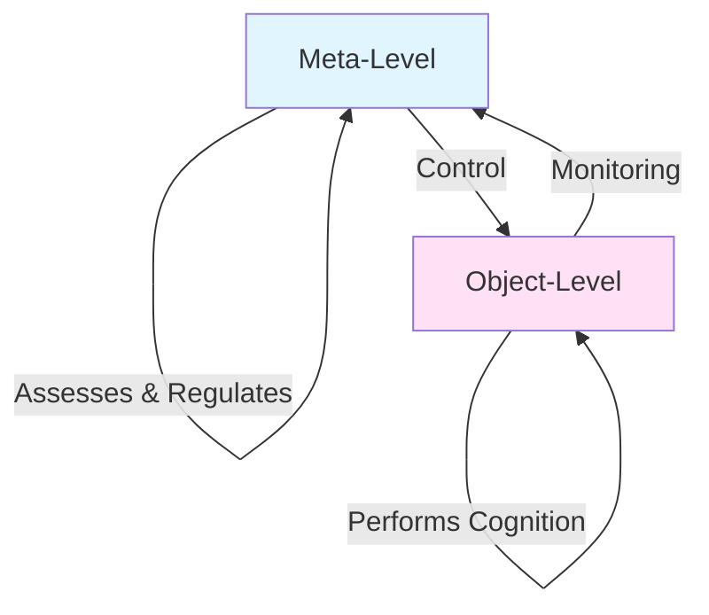
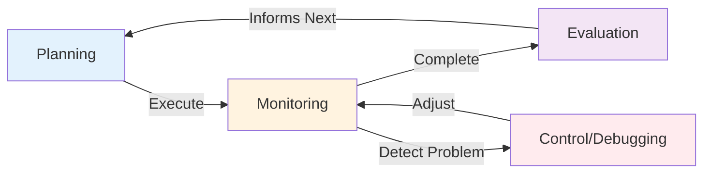

---
tags: #type/report/psychology #type/report/psychology #cognitive-science #pkm #cognitive-science #type/reference
aliases: [Thinking About Thinking, Metacognitive Awareness, Self-Reflection, Cognitive Monitoring]
---

> [!comprehensive-reference] 📚 Comprehensive-Reference
> - **Generated**:: 2025-11-13
> - **Version**:: 1.0  
> - **Type**:: Reference Documentation
> - **Scope**:: Complete coverage of metacognition theory, frameworks, and techniques

> [!abstract]
> **Executive Overview**
> Metacognition—literally "thinking about thinking"—represents the apex of human cognitive capability: the ability to monitor, control, and optimize one's own mental processes. This comprehensive reference encompasses theoretical foundations from [[Flavell]]'s seminal 1979 model through contemporary [[Self-Regulated Learning]] frameworks, detailed taxonomies of metacognitive knowledge and regulation, practical techniques for knowledge workers and lifelong learners, and empirical research on metacognitive judgment accuracy. Essential for anyone engaged in systematic [[Cognitive Development]], this resource provides both theoretical depth and actionable strategies for becoming an expert self-directed learner.

> [!how-to-use-this]
> **Navigation Guide**
> This reference note is organized into eight major sections covering all aspects of metacognition from foundational theory to advanced applications. Use the table of contents for quick navigation, or search for specific terms using [[wiki-links]]. The document progresses from theoretical frameworks → component taxonomies → regulatory processes → practical techniques → advanced topics, enabling both sequential reading and targeted lookup. Key takeaways are highlighted in callout boxes throughout.

## 📑 Table of Contents

1. [Foundational Concepts & Historical Development](#1-foundational-concepts--historical-development)
2. [Theoretical Frameworks & Models](#2-theoretical-frameworks--models)
3. [Metacognitive Knowledge: The Three Variables](#3-metacognitive-knowledge-the-three-variables)
4. [Metacognitive Regulation: Planning, Monitoring, Evaluation](#4-metacognitive-regulation-planning-monitoring-evaluation)
5. [Metacognitive Experiences & Judgment Accuracy](#5-metacognitive-experiences--judgment-accuracy)
6. [Practical Techniques & Strategies](#6-practical-techniques--strategies)
7. [Integration with Self-Regulated Learning](#7-integration-with-self-regulated-learning)
8. [Applications for Knowledge Workers & Lifelong Learning](#8-applications-for-knowledge-workers--lifelong-learning)

---

## 1. 📚 Foundational Concepts & Historical Development

> [!definition]
> - **Metacognition**:: The awareness and control of one's own cognitive processes; "thinking about thinking"
> - **Etymology**:: From Greek *meta* (beyond, about) + *cognition* (knowing, thinking)
> - **Core Function**:: Enables learners to plan, monitor, and evaluate their learning, leading to more effective knowledge acquisition and problem-solving

### The Genesis of Metacognition

Metacognition was formally introduced as a theoretical construct by American developmental psychologist [[John H. Flavell]] in 1976, though philosophical roots trace back to Plato's writings on "cognizing about cognition" and Aristotle's works *On the Soul* and *Parva Naturalia*. Flavell's seminal 1979 paper defined metacognition as "knowledge and cognition about cognitive phenomena", establishing it as a distinct area of cognitive psychology research.

In his 1976 work, Flavell recognized metacognition consisted of both monitoring and regulation aspects, defining it as "the active monitoring and consequent regulation and orchestration of cognitive processes in relation to the cognitive objects or data on which they bear, usually in service of some concrete goal or objective". This dual-process conceptualization—awareness *and* control—remains foundational to contemporary understanding.

### Evolutionary Context

Before Flavell's formalization, related concepts existed in research on memory "monitoring" and "knowledge about knowledge". Even Vygotsky has been credited as an originator of metacognition research, demonstrating the construct's deep roots in developmental and educational psychology. The field exploded after Flavell's work, with the first papers distinguishing between self-regulated learning and metacognition emerging in the mid-1980s.

### Core Distinctions

> [!key-claim]
> **Metacognition vs. Cognition**
> Cognitive strategies facilitate learning and task completion, whereas metacognitive strategies *monitor* the process itself. For example, recalling information is cognitive; assessing *how well* you recall and adjusting your study approach is metacognitive.

Metacognition encompasses two primary components: (1) **metacognitive knowledge**—awareness of your own thinking and approaches for learning, and (2) **metacognitive regulation**—how you control your thinking for learning. This framework, crystallized by educational researchers building on Flavell's foundation, provides the organizational backbone for modern metacognition research.

### Why Metacognition Matters

Research demonstrates that metacognitive components develop with age, with children showing developmental trends in understanding task difficulty and strategy effectiveness by ages 10-12. Contemporary educational research shows metacognition and self-regulation approaches yield high impact: an average of +8 months additional academic progress. For knowledge workers and lifelong learners, metacognitive skill represents the difference between passive information consumption and active knowledge construction.

> [!principle-point]
> **The Metacognitive Advantage**
> Metacognition transforms learning from a reactive process to a proactive, self-directed enterprise. Those who develop strong metacognitive abilities become architects of their own expertise, capable of adapting to novel domains and optimizing learning across their lifespan.

---

## 2. ⚙️ Theoretical Frameworks & Models

### Flavell's 1979 Four-Component Model

Flavell's formal model of metacognitive monitoring includes four interacting classes of phenomena: (1) metacognitive knowledge, (2) metacognitive experiences, (3) goals or tasks, and (4) actions or strategies.

> [!the-philosophy]
> **Flavell's Insight**
> These four components don't operate in isolation but interact dynamically. Metacognitive experiences often act as prompts for both metacognitive goals and strategies. For instance, sensing confusion (experience) triggers the goal of clarifying understanding, which activates the strategy of re-reading more carefully.

#### Component 1: Metacognitive Knowledge

Metacognitive knowledge represents one's knowledge or beliefs about factors affecting cognitive activities, divided into three categories: **person variables**, **task variables**, and **strategy variables**. This knowledge may be activated consciously or unconsciously and fundamentally shapes how individuals approach learning challenges.

Person variables involve individual knowledge and beliefs about oneself as a learner and of others—for example, recognizing that you're better at visual learning than auditory learning. Task variables comprise all knowledge about a proposed task, acting as guidance for managing it and predicting success. Strategy variables involve identifying goals and sub-goals and selecting cognitive processes to achieve them.

> [!important-links]
> **Deep Dive Sections**
> For exhaustive coverage of these three variables, see [[#3. Metacognitive Knowledge: The Three Variables]]

#### Component 2: Metacognitive Experiences

Metacognitive experiences are subjective internal responses to one's own metacognitive knowledge, goals, or strategies. Examples include worry about failing an exam, the thought that you've just given an excellent presentation, or the feeling that something very important is about to happen. These experiences are often affective and may occur consciously or below conscious awareness.

Flavell provides the example of sensing that a textbook chapter isn't learned well enough for an exam—this metacognitive experience then triggers either cognitive strategies (re-reading) or metacognitive strategies (self-testing to assess knowledge).

#### Component 3: Goals/Tasks

The goals or tasks component represents the objectives that activate metacognitive monitoring. Flavell emphasized that metacognition can be activated intentionally (such as by a memory search for specific information) or unintentionally (by environmental cues). Goals provide the "why" that drives the deployment of metacognitive resources.

#### Component 4: Actions/Strategies  

Metacognitive actions or strategies are the regulatory moves made to achieve metacognitive goals. This includes planning which approach to take, monitoring comprehension during execution, and evaluating success after completion. These actions form the bridge between awareness and control.

### The Two-Component Framework (Knowledge + Regulation)

A simplified and widely-adopted framework divides metacognition into two primary components: **metacognitive knowledge** and **metacognitive regulation**. This model, refined by researchers like [[Gregory Schraw]] and [[David Moshman]], provides a more tractable structure for both research and practical application.

| Component | Description | Subcategories |
|-----------|-------------|---------------|
| **[[Metacognitive Knowledge]]** | Awareness of your own thinking and approaches for learning | [[Declarative Knowledge]], [[Procedural Knowledge]], [[Conditional Knowledge]] |
| **[[Metacognitive Regulation]]** | How you control your thinking for learning | [[Planning]], [[Monitoring]], [[Evaluation]], [[Control/Debugging]] |

> [!core-principle]
> **The Knowledge-Regulation Dialectic**
> Knowledge without regulation is inert awareness; regulation without knowledge is blind adjustment. Effective metacognition requires both: understanding *what* strategies exist and *how* to deploy them, combined with the executive control to *actually implement* and adjust those strategies during learning.

### Nelson & Narens' Monitoring-Control Model

Nelson and Narens' 1990 model conceptualizes metacognition as consisting of monitoring and control processes that assess the current state of working memory and use that information to regulate subsequent actions. This information-processing perspective emphasizes the bidirectional flow between meta-level (monitoring/control) and object-level (cognitive processing).



This model inspired subsequent researchers to include additional higher-level metacognitive skills such as planning and evaluating, expanding beyond the core monitoring-control loop.

### Integration: The Comprehensive View

> [!synthesis]
> **Unified Framework**
> Contemporary metacognition research integrates insights from all major frameworks:
> - **Flavell** provides the phenomenological richness (experiences, knowledge, goals, strategies)
> - **Schraw/Moshman** offers practical organization (knowledge types + regulation phases)
> - **Nelson/Narens** supplies the information-processing mechanism (monitoring ↔ control loop)
> 
> Together, these create a complete picture: metacognition involves possessing knowledge about cognition, experiencing subjective feelings during cognitive tasks, setting goals for performance, monitoring progress, and executing regulatory control—all in service of optimizing learning and problem-solving.

---

## 3. 🎯 Metacognitive Knowledge: The Three Variables

Metacognitive knowledge refers to what individuals know about themselves as cognitive processors, about different approaches for learning and problem-solving, and about the demands of particular learning tasks. Flavell's original tripartite division—person, task, and strategy variables—remains the most widely-used taxonomy.

### Person Variables: Knowledge About Self as Learner

> [!definition]
> - **Person Variables**:: What one recognizes about their strengths and weaknesses in learning and processing information
> - **Scope**:: Includes beliefs about oneself, others, and universal properties of human cognition

Person variables involve individual knowledge and beliefs about oneself as a learner and of others. This encompasses both:

1. **Intraindividual Knowledge**: Understanding your own cognitive profile
   - "I learn better through visual diagrams than verbal explanations"
   - "I have strong logical reasoning but weaker spatial visualization"
   - "I need quiet environments to concentrate deeply"

2. **Interindividual Knowledge**: Recognizing differences between people
   - "My colleague is better at remembering names than I am"
   - "Children generally have shorter attention spans than adults"
   - "Experts in a domain perceive patterns that novices miss"

3. **Universal Knowledge**: Understanding general cognitive principles
   - "Everyone has limited working memory capacity"
   - "Distributed practice is more effective than massed practice"
   - "Strong emotions can impair rational decision-making"

#### Declarative Person Knowledge

Declarative knowledge involves knowing about yourself as a learner, including awareness of personal learning strengths and challenges. This self-knowledge forms the foundation for strategic adaptation.

**Examples of Declarative Person Knowledge:**
- "I'm better at mathematics than at creative writing"
- "I tend to procrastinate when tasks feel overwhelming"
- "I remember information better when I can connect it to personal experiences"
- "Morning hours are when my concentration peaks"

#### The Role of Self-Efficacy

Person variables intimately connect with [[Self-Efficacy]]—beliefs about one's capacity to succeed. Self-efficacy beliefs can affect performance phase processes directly, including choice of activities, effort expenditure, and persistence. Accurate person knowledge paired with high self-efficacy creates a powerful combination for self-directed learning.

> [!warning]
> **The Dunning-Kruger Trap**
> Inaccurate person variables can be devastating. Those with limited competence may overestimate their abilities (the [[Dunning-Kruger Effect]]), while highly skilled individuals may underestimate themselves (impostor syndrome). Developing accurate self-knowledge requires systematic [[Self-Assessment]] and external feedback calibration.

### Task Variables: Understanding Demands & Complexity

> [!definition]
> - **Task Variables**:: What one knows or can figure out about the nature of a task and the processing demands required to complete it
> - **Function**:: Guides resource allocation, strategy selection, and effort investment

Task knowledge includes recognition that it will take more time to read, comprehend, and remember a technical article than a similar-length passage from a novel. This understanding enables proactive planning rather than reactive surprise when tasks prove challenging.

#### Dimensions of Task Analysis

**1. Difficulty Level**
- Objective difficulty (inherent complexity)
- Subjective difficulty (perceived challenge based on current skills)
- Distinction between "hard but doable" vs. "currently beyond capacity"

**2. Information Characteristics**
- Whether information is concrete or abstract, organized or disorganized, familiar or novel
- Density of key concepts vs. supporting detail
- Degree of prior knowledge required

**3. Goal Specifications**
- Clarity of success criteria
- Time constraints and deadlines
- Standards for acceptable performance (recall, application, analysis, creation)

**4. Resource Requirements**
- Cognitive load (working memory demands)
- Prerequisite knowledge or skills
- External tools or materials needed
- Estimated time investment

#### Procedural Task Knowledge

Procedural knowledge involves knowing *how* to use learning strategies for different task types. This includes understanding which approaches work for which tasks:

| Task Type | Effective Strategies | Rationale |
|-----------|---------------------|-----------|
| **Conceptual Learning** | Elaboration, analogies, concept mapping | Builds relational understanding |
| **Procedural Skills** | Deliberate practice, spacing, immediate feedback | Develops automaticity |
| **Factual Memorization** | [[03-notes/01_permanent-notes/01_cognitive-development/Spaced Repetition]], [[Mnemonic Devices]], [[Self-Testing]] | Leverages memory principles |
| **Problem-Solving** | Worked examples, problem categorization, reflection | Develops pattern recognition |
| **Complex Projects** | Task decomposition, milestone planning, progress monitoring | Manages cognitive load |

### Strategy Variables: The Metacognitive Toolkit

> [!definition]
> - **Strategy Variables**:: Knowledge about cognitive and metacognitive strategies, including how to identify goals and sub-goals and select processes to achieve them
> - **Essence**:: Understanding *which* strategies exist, *how* they work, *when* to use them, and *why* they're effective

Strategy variables represent the learner's cognitive toolkit—the collection of approaches, techniques, and methods available for tackling learning challenges. This goes beyond simply knowing strategies exist; it requires deep understanding of their mechanisms, constraints, and optimal deployment contexts.

#### Three Levels of Strategy Knowledge

**1. Declarative Strategy Knowledge (WHAT)  **
- Knowing that strategies exist
- Understanding their basic definitions
- Awareness of what learning strategies are available

**2. Procedural Strategy Knowledge (HOW)**
- Knowing how to use learning strategies effectively
- Understanding implementation mechanics
- Recognizing common pitfalls in execution

**3. Conditional Strategy Knowledge (WHEN/WHY)**
- Knowing when and why to use particular learning strategies
- Understanding situational appropriateness
- Grasping the cognitive principles underlying strategy effectiveness

> [!example]
> **Strategy Knowledge in Action: [[Elaborative Interrogation]]**
> - **Declarative**: "Elaborative interrogation means asking yourself 'why' questions about facts"
> - **Procedural**: "Generate specific 'why' questions for each key concept, then answer them using prior knowledge and logical inference"
> - **Conditional**: "Use this when learning conceptual material with causal relationships; less effective for arbitrary associations or rote memorization"

#### The Strategy Repertoire

Effective self-directed learners cultivate broad strategy repertoires across multiple categories:

**Cognitive Strategies** (operate on content):
- [[Rehearsal]] (repetition, copying)
- [[Elaboration]] (connecting to prior knowledge)
- [[Organization]] (chunking, hierarchies, schemas)
- [[Critical Thinking]] (analysis, evaluation, synthesis)

**Metacognitive Strategies** (operate on learning process):
- [[Self-Questioning]] (monitoring comprehension)
- [[Think-Aloud Protocols]] (externalizing reasoning)
- [[Self-Explanation]] (articulating understanding)
- [[Error Analysis]] (learning from mistakes)

**Resource Management Strategies**:
- [[time management]] (scheduling, prioritization)
- [[Environment Control]] (minimizing distractions)
- [[Help-Seeking]] (knowing when/how to request assistance)
- [[Effort Regulation]] (maintaining motivation and persistence)

#### Strategy Interactions and Combinations

Flavell emphasized that metacognitive knowledge variables overlap, with individuals working with combinations and interactions of available knowledge. Sophisticated learners don't deploy single strategies in isolation but orchestrate combinations tailored to specific person-task configurations.

**Example Strategic Orchestration:**
*Task*: Mastering a complex technical concept (e.g., [[Gradient Descent]] in machine learning)

*Strategic Combination*:
1. **Task Analysis** → Recognize high conceptual complexity requiring deep understanding
2. **Person Assessment** → Acknowledge weak math intuition but strong visual learning
3. **Strategy Selection** → 
   - Primary: Create visual diagrams showing how gradient descent works
   - Secondary: Use worked examples to see concrete applications
   - Tertiary: Implement code to gain procedural understanding
4. **Metacognitive Monitoring** → Self-test with prediction questions
5. **Evaluation** → Teach concept to peer to verify understanding

### The Knowledge Types Framework (Alternative Taxonomy)

Educational researchers additionally categorize metacognitive knowledge into **declarative**, **procedural**, and **conditional** knowledge, cutting across the person/task/strategy dimensions:

| Knowledge Type | Definition | Example Application |
|----------------|------------|---------------------|
| **[[Declarative Knowledge]]** | Knowing *about* yourself as a learner, task demands, and what strategies exist | "I know that [[03-notes/01_permanent-notes/01_cognitive-development/Pomodoro Technique]] involves 25-minute work intervals" |
| **[[Procedural Knowledge]]** | Knowing *how* to use learning strategies | "I can effectively implement spaced repetition using flashcard software" |
| **[[Conditional Knowledge]]** | Knowing *when* and *why* to use particular strategies | "I use concept mapping for complex relationships but simple lists for linear sequences" |

> [!analogy]
> **The Craftsman's Knowledge**
> Think of a master carpenter: they know what tools exist in their workshop (declarative), can skillfully operate each tool (procedural), and understand which tool suits which job and why (conditional). Similarly, metacognitive mastery requires knowing your cognitive toolkit, being able to wield each tool effectively, and possessing the wisdom to select the right tool for the job.

---

## 4. 🔄 Metacognitive Regulation: Planning, Monitoring, Evaluation

Metacognitive regulation refers to adjustments individuals make to their processes to help control their learning, such as planning, information management strategies, comprehension monitoring, de-bugging strategies, and evaluation of progress and goals. While metacognitive *knowledge* provides the raw material, metacognitive *regulation* represents the executive functions that deploy that knowledge strategically.

### The Regulatory Cycle

Most metacognition frameworks describe regulation as occurring in three distinct but interconnected phases: planning, monitoring, and evaluation. This cyclical process repeats iteratively throughout learning, with each cycle informing subsequent ones.



> [!principle-point]
> **The Metacognitive Loop**
> Effective self-regulated learners don't simply execute these phases once; they engage in continuous micro-cycles of planning-monitoring-evaluation throughout a learning session. A single hour of study might involve dozens of these rapid regulatory loops.

### Planning: The Foundation Phase

> [!definition]
> - **Planning**:: Deciding what strategies to use for a future learning task and when you will use them
> - **Timing**:: Occurs *before* engaging with learning material
> - **Output**:: A strategic approach specifying goals, methods, and success criteria

Planning involves two key tasks: (1) deciding what you need to learn, and (2) deciding how you are going to learn that material. This seemingly simple formulation belies sophisticated cognitive work requiring integration of person, task, and strategy knowledge.

#### Components of Effective Planning

**1. Goal Setting & Task Definition**

In Winne and Hadwin's COPES model, planning is divided into task definition and goal setting/planning phases. Task definition involves processing available information about task conditions, including specifications, materials required, knowledge needed, and whether learning is individual or collaborative.

**Goal-Setting Framework:**
- **Outcome Goals**: What you want to achieve (e.g., "Understand Bayesian inference")
- **Performance Goals**: Measurable targets (e.g., "Solve 10 practice problems correctly")
- **Process Goals**: Behavioral commitments (e.g., "Study 2 hours using worked examples")

When students link strategic plans for learning to shortand long-term goals in a sequential or hierarchical system, they can practice more effectively.

**2. Activating Prior Knowledge**

Before engaging with material, effective planners ask: "What do I already know about this topic?" This activation primes relevant schemas, identifies connections, and reveals knowledge gaps.

**Prior Knowledge Activation Questions:**
- What concepts am I already familiar with?
- How does this topic relate to things I've previously learned?
- What confusions or misconceptions might I have?
- What questions do I already have about this subject?

**3. Strategy Selection**

Strategic planning refers to choosing or constructing advantageous learning methods appropriate for the task and environmental setting. This requires conditional knowledge—understanding which strategies fit which situations.

**Strategy Selection Heuristic:**

| Task Characteristic | Recommended Strategies | Rationale |
|---------------------|------------------------|-----------|
| **High Novelty** | Elaboration, analogies, worked examples | Build connections to known concepts |
| **High Complexity** | Decomposition, concept mapping, spacing | Manage cognitive load |
| **Requires Recall** | Retrieval practice, self-testing | Strengthen memory encoding |
| **Requires Application** | Problem-solving, case analysis, simulation | Develop procedural fluency |
| **Requires Transfer** | Varied practice, interleaving, abstraction | Promote flexible understanding |

**4. Resource Allocation & Time Management**

- Estimate time requirements realistically
- Schedule study sessions accounting for energy levels
- Identify materials, tools, or support needed
- Create contingency plans for obstacles

> [!helpful-tip]
> **The Planning Fallacy Counter-Strategy**
> Humans systematically underestimate task duration (the [[Planning Fallacy]]). Counter this by: (1) breaking tasks into granular sub-tasks, (2) estimating each sub-task separately, (3) adding 25-50% buffer time, and (4) tracking actual vs. estimated times to calibrate future estimates.

#### Planning Techniques for Self-Directed Learners

**Pre-Learning Self-Interrogation:**
During planning, students can ask: 'What do I know about this topic?', 'Have I done a task like this before?', 'What strategies worked last time?'

**Structured Planning Protocols:**

1. **KWL Framework** (Know-Want-Learned)
   - K: What do I already *Know*?
   - W: What do I *Want* to learn?
   - L: What did I *Learn*? (completed after)

2. **Strategic Learning Plan Template**
   - Learning Objective: [Specific, measurable goal]
   - Current Understanding: [Baseline assessment]
   - Selected Strategies: [2-3 primary approaches with rationale]
   - Success Criteria: [How I'll know I've learned it]
   - Time Allocation: [Realistic schedule]
   - Monitoring Checkpoints: [When I'll assess progress]

3. **Backward Planning**
   - Start with desired end state
   - Work backward identifying prerequisite steps
   - Create timeline with milestones

### Monitoring: Real-Time Awareness

> [!definition]
> - **Monitoring**:: Assessing your understanding of concepts and the effectiveness of your strategies *while learning*
> - **Timing**:: Occurs *during* active learning engagement
> - **Function**:: Provides real-time feedback to guide ongoing cognitive processes

Monitoring requires asking "How am I doing at learning this?" You are constantly tracking what you have learned, what you don't yet know, and whether your study strategies are helping you learn effectively. This continuous self-assessment distinguishes expert learners from novices.

#### The Challenge of Monitoring

Students may believe ineffective strategies are working, or continue using approaches they know aren't effective if those approaches brought success in the past. Accurate monitoring is difficult because:

1. **Illusions of Competence**: Familiarity ≠ understanding
2. **Fluency Traps**: Material *feeling* easy during review but failing to retrieve later
3. **Delayed Feedback**: True comprehension often only reveals itself during later testing
4. **Confirmation Bias**: Seeking evidence that supports existing beliefs about understanding

#### Monitoring Techniques

**1. Comprehension Monitoring**

Monitoring involves using "fix-up" strategies when meaning breaks down. Effective monitors constantly ask themselves:

**During Reading/Lecture:**
- Am I understanding the main ideas?
- Can I explain this concept in my own words?
- What parts am I confused about?
- Does this match my expectations?
- Am I maintaining focus or drifting?

Asking students to identify the most important ideas and areas of confusion provides tools to monitor understanding.

**2. Metacognitive Self-Questioning**

While monitoring progress, learners can ask: 'How am I doing?', 'What should I do next?', 'Should I try a different strategy?'

**Monitoring Question Framework:**
- **Understanding Check**: "Can I paraphrase this accurately?"
- **Connection Check**: "How does this relate to what I already know?"
- **Application Check**: "Could I use this to solve a problem?"
- **Confusion Detection**: "What specifically don't I understand?"
- **Strategy Check**: "Is my current approach working?"

**3. Calibration & Judgment Accuracy**

Effective monitoring requires accurate [[Metacognitive Calibration]]—the ability to judge one's own performance realistically. Metacognitive calibration is the capacity to accurately self-assess performance, forming the basis for error detection and self-monitoring.

**Calibration Improvement Strategies:**
- Immediate feedback on practice attempts
- Comparing predicted vs. actual performance
- Using objective measures (practice tests) rather than subjective feelings
- Tracking accuracy over time to identify systematic biases

**4. Think-Aloud Protocols**

Metacognitive talk involves saying out loud what you are thinking while carrying out a task, helping learners focus and monitor cognitive processing while developing deeper understanding of thinking processes.

**Think-Aloud Example (Problem-Solving):**
> "Okay, I need to find the derivative of this function. Let me identify what kind of function this is first—it looks like a product of two functions, so I'll need the product rule. The product rule says… [recites rule]. Now I'll apply it. The first function is x², its derivative is 2x. The second function is sin(x), its derivative is cos(x). So applying the formula: x²·cos(x) + sin(x)·2x. Let me simplify… I'm getting 2x·sin(x) + x²·cos(x). Does that make sense? Let me check the pattern…"

**5. Progress Tracking**

- Maintain learning logs documenting what was covered
- Use checklists to verify completion of sub-goals
- Track time spent vs. progress made
- Note emerging questions or confusion points

> [!warning]
> **The Monitoring-Action Gap**
> Monitoring alone is insufficient—it must connect to *control*. Noticing confusion without taking corrective action wastes the metacognitive investment. See [[#Control & Debugging: The Missing Fourth Phase]] below.

### Evaluation: Reflective Assessment

> [!definition]
> - **Evaluation**:: Appraising your prior plan and adjusting it for future learning
> - **Timing**:: Occurs *after* completing a learning episode or assessment
> - **Purpose**:: Extract lessons for improving future learning efforts

Evaluation involves reflection on how well you met your learning objectives after completing a unit of study or receiving feedback such as a test or assignment. This retrospective analysis closes the metacognitive loop, converting experience into wisdom.

#### Components of Effective Evaluation

**1. Performance Assessment**

Students can consider: 'How well did I do?', 'What didn't go well?', 'What could I do differently next time?', 'What went well?'

**Evaluation Framework:**
| Dimension | Guiding Questions |
|-----------|------------------|
| **Outcome Assessment** | Did I achieve my learning goals? What's the gap between target and actual? |
| **Strategy Assessment** | Which strategies or knowledge were most beneficial? Which were less effective? |
| **Process Assessment** | Did I follow my plan? Where did I deviate and why? |
| **Effort Assessment** | Was my time investment proportional to results? |
| **Attribution Assessment** | What factors contributed to success/struggle? (within my control vs. external) |

**2. Error Analysis**

Reflective writing assignments can include: What worked well when preparing? What did not work well? What will I change next time?

**Error Categorization:**
- **Knowledge Gaps**: Missing prerequisite information
- **Misconceptions**: Incorrect understanding
- **Procedural Errors**: Correct knowledge, flawed execution
- **Strategic Errors**: Wrong approach for task type
- **Metacognitive Errors**: Poor planning or monitoring

**3. Calibration Review**

Students tend to evaluate their plans based solely on performance, rather than considering how well plans met other goals for learning. Comprehensive evaluation considers:

- Were confidence predictions accurate?
- Did perceived difficulty match actual difficulty?
- Were time estimates realistic?
- Did anticipated strategies prove effective?

**4. Transfer Identification**

Students should ask: 'What other types of problem can I use this strategy for?' This promotes generalization beyond specific contexts.

**Transfer Questions:**
- In what other domains could this strategy apply?
- What principles or patterns are reusable?
- How might I adapt this approach for different tasks?

#### Evaluation Techniques for Knowledge Workers

**1. After-Action Reviews (AARs)**

Military-derived technique for systematic reflection:
- What was supposed to happen? (Plan)
- What actually happened? (Reality)
- Why the difference? (Analysis)
- What will we do differently? (Adaptation)

**2. Learning Journals**

Journaling and reflective writing promote self-awareness and self-regulation, enhancing ability to set goals, monitor progress, and make informed adjustments.

**Journal Prompts:**
- Most significant insight from today's learning?
- Most challenging concept—why was it difficult?
- How did my understanding evolve?
- What metacognitive strategies did I use?
- What will I do differently tomorrow?

**3. The "Muddiest Point" Technique**

Have learners write down what part of material remains most confusing, then investigate further to encourage exploration and self-directed learning. This quick exercise yields high metacognitive returns.

**4. Retrospective Planning**

After completing a project or learning cycle:
- If starting over, how would you approach it differently?
- What early indicators predicted later difficulties?
- Which early investments paid dividends?
- What would you tell past-self before beginning?

### Control & Debugging: The Missing Fourth Phase

If a student identifies what they don't understand (monitoring) while solving a problem, they have an opportunity to fill knowledge gaps by seeking new information, rereading, summarizing instructions, trying new ideas, and so forth (control/debugging).

> [!key-claim]
> **Beyond Awareness to Action**
> Many metacognition discussions focus on awareness (monitoring) at the expense of control (adjustment). But monitoring without subsequent control action is metacognitively incomplete. The regulation cycle must include responsive adjustments when monitoring reveals problems.

**Control Strategies:**

| Detected Problem | Control Response |
|------------------|------------------|
| **Comprehension failure** | Re-read, seek alternative explanation, break down into sub-concepts |
| **Strategy ineffectiveness** | Switch to alternate strategy, combine approaches, seek help |
| **Attention drift** | Take break, change environment, use [[03-notes/01_permanent-notes/01_cognitive-development/Pomodoro Technique]] |
| **Excessive difficulty** | Revisit prerequisites, simplify goals, scaffold with easier examples |
| **Insufficient challenge** | Advance to harder material, seek deeper understanding, teach others |

**The DAPPR Control Protocol:**
1. **Detect**: Monitoring reveals problem
2. **Analyze**: Diagnose root cause
3. **Plan**: Select corrective strategy
4. **Perform**: Implement adjustment
5. **Re-assess**: Monitor whether correction worked

> [!analogy]
> **The Thermostat Metaphor**
> Metacognitive regulation functions like a thermostat: monitoring senses temperature (current state), compares it to setpoint (goal), and activates heating/cooling (control) when discrepancies arise. A thermostat that only *monitors* temperature without adjusting it is useless. Similarly, metacognitive monitoring without control is an incomplete system.

---

## 5. 🧠 Metacognitive Experiences & Judgment Accuracy

Metacognitive experiences are conscious reflections about cognitive processes—feelings, judgments, or estimates about one's knowledge state or performance. Unlike metacognitive knowledge (stable beliefs) or regulation (deliberate actions), metacognitive experiences are momentary, subjective, and often affective.

### Types of Metacognitive Experiences & Judgments

Metamemory has been studied across the learning process, from just prior to learning through retrieval to post-response confidence. Each type of metacognitive judgment serves distinct functions in the regulatory cycle.

#### 1. Ease-of-Learning (EOL) Judgments

- **Timing**: Before learning begins
- **Function**: Predicting how difficult material will be to learn
- **Example**: "This calculus chapter looks challenging; I'll need 3 hours to master it"
- **Use Case**: Informs initial planning and resource allocation

#### 2. Judgments of Learning (JOL)

> [!definition]
> - **JOL**:: Predictions about the probability of successfully recalling information in the future
> - **Typical Prompt**:: "How confident are you that you will remember this in one week?"

In JOL tasks, individuals memorize stimuli (e.g., word pairs) and predict the likelihood of correctly recalling them later. The delayed-JOL effect shows that judgments made after a delay (rather than immediately) are significantly more accurate.

**JOL Applications:**
- Deciding which material needs additional study
- Allocating study time to difficult items
- Scheduling review sessions based on predicted forgetting

**Improving JOL Accuracy:**
- Use delayed rather than immediate JOLs (wait >10 minutes after studying)
- Base judgments on retrieval attempts, not passive review
- Compare predictions to actual performance to calibrate

#### 3. Feeling-of-Knowing (FOK) Judgments

> [!definition]
> - **FOK**:: When unable to retrieve an answer, predicting the probability of recognizing it later
> - **Phenomenology**:: The sensation that information is "on the tip of your tongue" or "in there somewhere"

In episodic FOK paradigms, participants learn paired words, attempt recall, and when unable to recall, judge whether they will recognize the target among distractors. In semantic FOK paradigms, word definitions or general knowledge questions are presented, and participants judge recognition likelihood when recall fails.

Research shows FOK experiences enhance metacognitive sensitivity of subsequent confidence judgments—that is, experiencing a strong FOK improves the accuracy of later retrospective confidence.

**FOK in Practice:**
- Deciding whether to continue search vs. abandon
- Determining whether to look up information
- Allocating retrieval effort efficiently

#### 4. Tip-of-the-Tongue (TOT) States

TOT states represent a specific, intense type of FOK where retrieval feels imminent. TOT experiences are associated with increased possibility of retrieval of missing information and enhance confidence sensitivity.

**TOT Phenomenology:**
- Strong feeling that answer is accessible
- Often accompanied by partial retrieval (first letter, number of syllables)
- Temporary but typically resolves to full retrieval or abandonment

#### 5. Retrospective Confidence Judgments (RCJ)

> [!definition]
> - **RCJ**:: Confidence in the accuracy of a just-provided response
> - **Typical Prompt**:: "How confident are you that your answer is correct?" (scale 0-100%)

Retrospective confidence judgments are given after initial response to assess accuracy of past decisions. These judgments are critical for error detection and correction.

Research comparing prospective (FOK, JOL) and retrospective confidence shows that retrospective judgments tend to be more accurate, likely because they benefit from having completed the cognitive task.

### Accuracy Metrics: Calibration & Resolution

Metacognitive accuracy is assessed through two primary metrics: **calibration** (absolute accuracy) and **resolution** (relative accuracy).

#### Calibration (Absolute Accuracy)

> [!definition]
> - **Calibration**:: The relationship between participants' average level of performance and average metacognitive judgment magnitude
> - **Perfect Calibration**:: Mean confidence = mean accuracy

Metacognitive calibration is the capacity to accurately self-assess one's performance, forming the basis for error detection and self-monitoring.

**Calibration Biases:**
- **Overconfidence**: Judgments exceed actual performance (common in novices)
- **Underconfidence**: Judgments below actual performance (can occur in experts)
- Unskilled individuals often exhibit inflated self-assessments due to inability to recognize their own incompetence ([[Dunning-Kruger Effect]])

**Calibration Curve Example:**

| Confidence Level | Actual Accuracy | Calibration |
|------------------|----------------|-------------|
| 50% confident | 50% correct | ✅ Perfect |
| 70% confident | 50% correct | ❌ Overconfident |
| 90% confident | 60% correct | ❌ Severely overconfident |
| 70% confident | 85% correct | ❌ Underconfident |

#### Resolution (Relative Accuracy)

> [!definition]
> - **Resolution**:: The trial-by-trial association between response accuracy and confidence in that response's accuracy
> - **Measure**:: Typically assessed using gamma correlations or signal detection metrics (d')
> - **Perfect Resolution**:: High confidence for correct responses, low confidence for incorrect responses

Resolution indicates whether someone can *discriminate* their correct from incorrect judgments, even if their overall calibration is poor. A learner might be overconfident overall (poor calibration) but still show good resolution if they consistently assign higher confidence to items they actually know.

**Why Resolution Matters:**
- Enables strategic study allocation to low-confidence items
- Supports adaptive testing strategies
- Allows error detection even without external feedback

### The Dual-Process Model of Metacognitive Judgment

Metacognitive judgments rely on both **information-based** and **experience-based** cues, though amounts differ across judgment types.

#### Information-Based Processing (Analytic)

- **Characteristics**: Deliberate, conscious, analytic
- **Basis**: Explicit reasoning about knowledge state
- **Example**: "I studied this topic thoroughly for 2 hours, used spaced repetition, and successfully solved practice problems—therefore I should remember it well"
- **Strength**: Can incorporate sophisticated knowledge about learning principles
- **Weakness**: Effortful and slow

#### Experience-Based Processing (Heuristic)

- **Characteristics**: Non-conscious, non-analytic, inferential heuristics that operate implicitly and unintentionally
- **Basis**: Subjective feelings and fluency cues
- **Example**: Material "feels familiar" so it seems known (even if it can't be retrieved)
- **Strength**: Fast, automatic, low cognitive load
- **Weakness**: Vulnerable to fluency illusions and biases

> [!warning]
> **The Fluency Trap**
> Experience-based judgments can mislead because they rely on inferential heuristics rather than direct access to memory traces. Material that *feels* familiar during review (high processing fluency) may fail to retrieve later, creating dangerous illusions of competence.

**Common Fluency-Based Heuristics:**
- **Cue Familiarity**: If the question seems familiar, the answer must be known
- **Processing Ease**: If material is easy to process during review, it must be learned
- **Accessibility**: If related information comes to mind easily, target information is probably available
- **Affect**: Positive feelings during study suggest effective learning

### Improving Metacognitive Judgment Accuracy

Students can be provided with data showing increased performance after evidence-based strategies; however, beliefs that strategies don't work may persist even facing contradictory data. Improving accuracy requires systematic practice and calibration.

**Calibration-Improvement Techniques:**

**1. Generate-and-Test Cycles**
- Make explicit predictions before checking answers
- Compare predicted to actual performance
- Analyze patterns in mis-calibration
- Adjust future judgments based on feedback

**2. Use Objective Performance Measures**
- Practice tests rather than self-assessment feelings
- Immediate feedback on practice attempts
- Track accuracy data over time
- Mini quizzes for formative evaluation can improve students' ability to accurately judge their knowledge

**3. Delay Judgments**
- Delayed judgments of learning are significantly more accurate than immediate judgments
- Wait at least 10 minutes after studying before assessing knowledge
- Use retrieval attempts (testing effect) rather than passive review to inform judgments

**4. Decompose Aggregate Judgments**
- Break "How well do I know this topic?" into specific sub-questions
- Assess component skills separately
- Avoid global, vague confidence assessments

**5. Seek Disconfirming Evidence**
- Actively look for what you *don't* understand
- Test edge cases and applications
- Ask yourself: "What could reveal I don't actually know this?"

**6. External Calibration**
- Compare self-assessments with others' assessments
- Seek objective performance feedback
- Teach material to others to reveal knowledge gaps

> [!core-principle]
> **The Metacognitive Paradox**
> The least skilled are least able to recognize their lack of skill (poor metacognitive accuracy compounds poor performance), while experts may underestimate their advantage (curse of knowledge). Breaking this paradox requires external feedback and deliberate calibration practice.

---

## 6. 🛠️ Practical Techniques & Strategies

Research highlights three of the most effective evidence-based learning strategies: (1) self-testing, (2) spacing, and (3) interleaving. However, a comprehensive metacognitive toolkit extends far beyond these core techniques, encompassing strategies for each phase of the regulatory cycle.

### Planning-Phase Techniques

#### 1. Pre-Learning Assessment

**The KWL Framework**
- **K**: What do I already *Know*? (activate prior knowledge)
- **W**: What do I *Want* to learn? (set learning goals)
- **L**: What did I *Learn*? (post-learning evaluation)

**Syllabus Mining**
Look at your syllabus or course schedule, reading list, and learning objectives to understand course structure. Ask why material might be ordered this way, how topics connect, what key themes emerge, and what prior knowledge could inform learning.

#### 2. Goal-Setting Protocols

**SMART Goals for Learning**
- **Specific**: "Master the chain rule in calculus" (not "learn calculus")
- **Measurable**: "Solve 15 chain rule problems with 90% accuracy"
- **Achievable**: Within current skill level with reasonable stretch
- **Relevant**: Connected to broader learning objectives
- **Time-bound**: "By end of this week"

**Learning Objective Hierarchies**
- Long-term goals (semester/year)
- Intermediate goals (unit/topic)
- Session goals (daily/weekly)
- Each level informs the next

#### 3. Strategic Pre-Reading

Before reading textbook or attending lecture, look at the topic covered and ask what you already know about it.

**Survey-Question-Read (SQR) Preparation**
1. **Survey**: Skim headers, figures, summaries to build mental scaffold
2. **Question**: Convert headers into questions you'll answer while reading
3. **Read**: Actively seek answers to your generated questions

### Monitoring-Phase Techniques

#### 1. Self-Testing & Retrieval Practice

> [!key-claim]
> **The Testing Effect**
> Self-testing provides opportunities to monitor understanding and identify knowledge gaps while activating relevant knowledge and encoding information so it can be more easily accessed from memory in the future.

**Self-Testing Methods:**
- **Flashcards**: For factual recall and definitions
- **Practice Problems**: For procedural skills and application
- **Free Recall**: Write everything you remember without prompts
- **Teach-Back**: Explain concept to another person (or rubber duck)

**Implementation Guidelines:**
- Test *before* feeling ready (don't wait until mastery)
- Use closed-book testing to force retrieval
- Review errors immediately after each test
- Re-test after spacing interval

#### 2. Self-Questioning During Learning

Asking self-reflective questions is key to metacognition, allowing us to take inventory of where we currently are (what we know), how we learn (what's working), and where we want to be (whether we've mastered material).

**Comprehension-Monitoring Questions:**

| Question Category | Example Questions |
|------------------|------------------|
| **Understanding** | Can I paraphrase this in my own words? |
| **Connection** | How does this information conflict with my prior understanding? |
| **Application** | Could I use this to solve a problem? Does this answer make sense given the information provided? |
| **Clarification** | What parts am I still confused about? |
| **Strategy** | What strategy did I use to solve this problem that was helpful? |

#### 3. Think-Aloud & Verbalization

Talking through material—with classmates, friends, a tutor, or even a pet—helps you make more sense of material and internalize it more deeply. Verbalizing thoughts is a great way to test how well you know material.

**Think-Aloud Protocol:**
1. Verbalize every thought while working
2. Don't censor or organize—just speak mental processes aloud
3. Notice when you get stuck or confused
4. Identify successful vs. unsuccessful reasoning paths
5. Record or have observer note metacognitive moments

#### 4. The 3-2-1 Technique

The 3-2-1 is a reading response technique extraordinarily easy to use and adaptable to different disciplines. By asking students to identify most important ideas and areas of confusion, it provides tools to monitor understanding.

**3-2-1 Framework:**
- **3**: Three key takeaways or important ideas
- **2**: Two areas of confusion or questions
- **1**: One connection to prior knowledge or real-world application

(Alternatively, instructors can modify the "1" to be: one exam question, one visualization, one prediction of what's next, etc.)

#### 5. Progress Tracking & Learning Logs

**Daily Learning Log Template:**
```markdown
## Date: [YYYY-MM-DD]

### Today's Goal
[What I intended to learn/accomplish]

### What I Studied
- [Topic 1]: [Time spent]
- [Topic 2]: [Time spent]

### Key Insights
- [Most important concept learned]
- [Surprising discovery]

### Confusion Points  
- [What I don't understand]
- [Questions to resolve]

### Metacognitive Observations
- Strategy effectiveness: [What worked/didn't work]
- Attention/focus quality: [Self-assessment]
- Adjustment made: [How I adapted approach]

### Tomorrow's Plan
[What I'll do differently based on today's learning]
```

### Evaluation-Phase Techniques

#### 1. After-Action Reviews (AARs)

**Four-Question AAR Protocol:**
1. **What was supposed to happen?**  
   - Review initial plan and goals
2. **What actually happened?**  
   - Describe reality without judgment
3. **Why the difference?**  
   - Analyze root causes (not superficial symptoms)
4. **What will we do differently?**  
   - Extract actionable lessons for next time

#### 2. Error Analysis Protocols

Reflection assignments following learning activities can help learners think about their thinking and develop plans for growth, using questions like: What worked well when preparing? What did not work well? What will I change before my next attempt?

**Error Categorization Matrix:**

| Error Type | Description | Corrective Action |
|------------|-------------|------------------|
| **Knowledge Gap** | Lacked prerequisite information | Fill specific gap; may need to backtrack |
| **Misconception** | Had incorrect understanding | Explicitly identify and replace faulty model |
| **Procedural** | Knew what to do but executed incorrectly | Focus on deliberate practice of procedure |
| **Strategic** | Used wrong approach for problem type | Learn to identify problem categories better |
| **Attentional** | Made careless mistakes despite knowing correct answer | Develop checking routines; address fatigue |

#### 3. Calibration Reviews

**Confidence-Performance Analysis:**
1. For each assessment, record predicted score *before* receiving results
2. Compare prediction to actual performance
3. Calculate calibration error (prediction - actual)
4. Identify patterns (consistently over/underconfident? domain-specific?)
5. Adjust future predictions based on historical data

#### 4. The "Muddiest Point" Retrospective

Have learners write down what part of material remains most confusing after a learning session, then investigate further to encourage exploration of knowledge and self-directed learning. This quick exercise has high yield for metacognitive practice.

**Enhanced Muddiest Point Protocol:**
- Identify specific confusion (not vague "I don't get it")
- Hypothesize *why* it's confusing (missing prerequisite? complex concept? poor explanation?)
- Develop plan to clarify (re-read? find alternate resource? ask for help?)
- Follow up and document whether confusion resolved

### Cross-Phase Learning Strategies

#### 1. Spaced Repetition

> [!definition]
> - **Spacing Effect**:: Students space studying when they spread learning of the same material over multiple sessions rather than massing it in one session
> - **Mechanism**:: Spacing requires intentional planning and benefits from retrieval practice between sessions

**Implementing Spaced Repetition:**
- Use spaced repetition software (Anki, SuperMemo) for automated scheduling
- Follow expanding intervals: review after 1 day, 3 days, 7 days, 14 days, 30 days…
- Adjust intervals based on retrieval difficulty (harder items → shorter intervals)
- Combine with active recall for maximum benefit

**Why It Works:**
- Desirable difficulties enhance long-term retention
- Retrieval strengthens memory traces
- Spacing prevents fluency illusions from massed practice

#### 2. Interleaving

> [!definition]
> - **Interleaving**:: Mixing different topics or types of problems within a study session rather than blocking them by type
> - **Contrast**: **Blocked practice** (AAABBBCCC) vs. **Interleaved practice** (ABCABCABC)

**When to Interleave:**
- Practicing different problem types in mathematics
- Studying related but distinct concepts
- Building discrimination skills (learning to categorize problems)

**Benefits:**
- Improves ability to identify problem types
- Strengthens discriminatory knowledge
- Enhances long-term retention despite feeling harder during practice

#### 3. Elaborative Interrogation

**The "Why" Strategy:**
- For each fact or concept, ask "Why is this true?"
- Generate explanations connecting to prior knowledge
- Create causal chains linking ideas
- Build deeper conceptual understanding beyond surface facts

**Example:**
- **Fact**: Water boils at lower temperatures at high altitudes
- **Why?**: Lower atmospheric pressure → reduced pressure on water surface → molecules escape more easily → lower temperature needed to transition to gas phase
- **Connection**: Relates to kinetic theory of gases, vapor pressure, and mountain climbing challenges

#### 4. Self-Explanation

In courses requiring problem-solving, explaining steps aloud ensures real understanding and exposes knowledge gaps.

**Self-Explanation Protocol:**
- Explain solution steps in your own words (don't just describe what you did)
- Justify *why* each step is necessary
- Connect to underlying principles
- Anticipate where this strategy would/wouldn't work

#### 5. Concrete Examples & Worked Examples

**Learning From Worked Examples:**
- Study example solutions before attempting problems
- Self-explain each step in the example
- Cover the solution and attempt to reproduce it
- Compare your reproduction to original
- Transition to independent problem-solving

**Generating Your Own Examples:**
- Create concrete instances of abstract principles
- Use multiple, varied examples (not just one)
- Test edge cases and boundary conditions
- Build example repositories for future reference

### Domain-Specific Metacognitive Strategies

#### For Conceptual Learning (Science, Philosophy, Theory)

- **Concept Mapping**: Visually represent relationships between ideas
- **Analogical Reasoning**: "This concept is like [familiar domain]…"
- **Principle Extraction**: Identify underlying rule or pattern
- **Counterexample Generation**: When would this *not* apply?

#### For Procedural Learning (Math, Programming, Skills)

- **Deliberate Practice**: Focus on error-prone steps
- **Varied Practice**: Apply procedure in different contexts
- **Procedural Self-Explanation**: Narrate why each step
- **Error Prediction**: Where am I likely to make mistakes?

#### For Factual Knowledge (Vocabulary, Dates, Names)

- **Elaborative Encoding**: Connect facts to rich contexts
- **Mnemonics**: Create memorable associations
- **Spaced Retrieval**: System for repeated testing
- **Discrimination Practice**: Learn to distinguish similar items

#### For Reading Comprehension

**SQ3R Method:**
1. **Survey**: Preview material structure
2. **Question**: Generate questions from headers
3. **Read**: Actively seek answers
4. **Recite**: Summarize in your own words
5. **Review**: Consolidate and test understanding

### Metacognitive Strategies for Motivation & Volition

While not purely metacognitive, effective self-regulated learners also employ strategies to manage motivation and maintain effort:

**Motivation Regulation:**
- **Goal Proximity**: Break distant goals into near-term milestones
- **Value Enhancement**: Connect material to personal interests/goals
- **Self-Reward**: Build in incentives for completing sessions
- **Social Commitment**: Study with others or publicly declare goals

**Volitional Control:**
- **Implementation Intentions**: "If [situation], then I will [response]"
- **Temptation Bundling**: Pair challenging study with enjoyable activity
- **Environmental Design**: Remove distractions before beginning
- **Pre-Commitment**: Make it harder to quit than continue

> [!the-philosophy]
> **Metacognition as Orchestration**
> The art of self-directed learning lies not in mastering any single technique but in orchestrating a symphony of strategies tailored to person-task-goal configurations. Like a conductor selecting instruments and dynamics for each musical phrase, the metacognitive learner deploys techniques flexibly, monitoring their effectiveness, and adapting the composition in real-time.

---

## 7. 🔁 Integration with Self-Regulated Learning

Self-regulated learning (SRL) includes the cognitive, metacognitive, behavioral, motivational, and emotional/affective aspects of learning, making it an extraordinary umbrella under which a considerable number of learning variables are studied within a comprehensive, holistic approach. Metacognition forms a crucial pillar within this broader architecture.

### The SRL-Metacognition Relationship

> [!key-claim]
> **Metacognition as SRL Component**
> SRL theory attends to development of three learning processes: metacognition, motivation, and strategic action. While metacognition focuses specifically on cognitive self-awareness and regulation, SRL encompasses this plus motivational, emotional, and behavioral self-management.

Self-regulated learning is defined as learning guided by metacognition (thinking about one's thinking), strategic action (planning, monitoring, and evaluating personal progress against a standard), and motivation to learn. Thus metacognition is *necessary but not sufficient* for full SRL.

**Conceptual Hierarchy:**
```
Self-Regulated Learning (Umbrella Construct)
├── Metacognition (Cognitive awareness & regulation)
├── Motivation Regulation (Goal-orientation, self-efficacy, value)
├── Emotion Regulation (Managing affect during learning)
├── Behavioral Regulation (Action control, environment management)
└── Social Regulation (Collaborative learning, help-seeking)
```

### Major SRL Models & Metacognition's Role

#### Zimmerman's Cyclical Three-Phase Model

Zimmerman suggested self-regulated learning has three stages: **Forethought** (learners' preparing work before performance), **Volitional Control** (also called "performance control," occurs during learning, involving attention and willpower), and **Self-Reflection** (reviewing performance toward final goals).

| Phase | Metacognitive Processes | Additional SRL Components |
|-------|------------------------|---------------------------|
| **Forethought** | Task analysis: setting goals and strategic planning | Self-efficacy beliefs, outcome expectations, goal orientation |
| **Performance** | Monitoring, self-control, attentional focusing | Effort regulation, environmental structuring, help-seeking |
| **Self-Reflection** | Self-evaluation, causal attribution | Self-satisfaction, adaptive/defensive responses |

Zimmerman's model shows self-efficacy beliefs can affect performance phase processes directly, such as choice of activities, effort, and persistence, highlighting how motivation interacts with metacognitive regulation.

#### Winne & Hadwin's COPES Model

Winne and Hadwin's model deserves special mention for its information-processing perspective, organizing SRL into four recursive phases: (1) Task Definition, (2) Goals and Plan(s), (3) Study Tactics, and (4) Adaptations to Metacognition.

**The COPES Framework:**
- **C**onditions: Resources and constraints (external + internal)
- **O**perations: Cognitive tactics and strategies
- **P**roducts: Outcomes of operations (become new conditions for next phase)
- **E**valuations: Monitoring standards
- **S**tandards: Criteria for success

Conditions include both cognitive conditions (memories, beliefs, dispositions, motivation, domain knowledge, task knowledge, strategy knowledge) and task conditions (resources, instructional cues, time, context). This mirrors Flavell's person, task, and strategy variables within an information-processing architecture.

> [!analogy]
> **Winne & Hadwin's Recursive Loop**
> Each phase generates *products* (e.g., task representation, goals, tactics applied, strategic adaptations) that become *conditions* for the next phase. This creates a self-feeding loop where learning continuously informs itself—metacognition operating on the products of previous metacognitive cycles. It's turtles all the way down, but productively so.

#### Pintrich's Four-Phase Model

Pintrich's model explicitly recognizes metacognitive facets differentiated by Flavell: metacognitive knowledge, skills, and experiences, embedding them within a broader framework that includes cognitive, motivational, and contextual components across four phases:

1. **Forethought, Planning, Activation**
2. **Monitoring**
3. **Control**
4. **Reaction and Reflection**

Each phase operates across four areas: cognition, motivation/affect, behavior, and context.

#### Efklides' MASRL Model

Efklides' Metacognition and Affect model of SRL (MASRL) explores how emotion and motivation interact with metacognition, distinguishing between two levels: the Person level (macro) and the Task level (micro).

The Person level represents generalized SRL functioning, including cognition, motivation, self-concept, affect, volition, metacognitive knowledge, and metacognitive skills. The Task level involves moment-to-moment processing during specific task engagement, heavily influenced by [[Metacognitive Experiences]].

> [!principle-point]
> **Efklides' Contribution**
> While other models treat emotion as separate from metacognition, Efklides integrates them deeply. Metacognitive experiences have an affective character—they are feelings, not just thoughts. This recognition that metacognition is partially affective challenges overly rationalist accounts of self-regulation.

### The Metacognition-Motivation Interface

Self-regulation involves where motivation and metacognition intersect. This intersection is critical because:

1. **Motivation Activates Metacognition**: Without caring about learning, sophisticated metacognitive knowledge remains dormant
2. **Metacognition Supports Motivation**: Monitoring progress and achieving sub-goals sustains motivational commitment
3. **Metacognitive Experiences Affect Motivation**: Feelings of confusion can undermine confidence, while feelings of fluency can encourage continued effort

**Bidirectional Influences:**
```
Metacognition ←→ Motivation
     ↑              ↑
     └──────────────┘
    Joint Influence on Learning Outcomes
```

Motivation is needed to apply effort and continue when faced with difficulty. Learners in mastery goal structures (emphasizing developing competence) show positive correlations with metacognitive skills, while performance-avoidance structures are associated with procrastination and poor grades.

### Social Metacognition & Co-Regulation

Hadwin et al.'s model addresses social aspects of regulation, an emerging research line within SRL. Learning doesn't occur in isolation; metacognitive and regulatory processes can be:

1. **Self-Regulated**: Individual plans, monitors, evaluates own learning
2. **Co-Regulated**: Members provide modeling of cognitive/metacognitive strategies plus motivational support  
3. **Socially-Shared Regulated**: Group collectively plans, implements, evaluates actions

Individuals plan, monitor, and evaluate their contributions to the group (self-regulation) while members within the group provide modeling of cognitive and metacognitive strategies plus motivational support (co-regulation). Together the group might plan, implement, and evaluate collective actions (socially-shared regulation).

**Implications for Knowledge Workers:**
- Peer review as co-regulation mechanism
- Team retrospectives as shared evaluation
- Mentorship as co-regulated skill development
- Communities of practice as contexts for social metacognition

> [!synthesis]
> **From Metacognition to Self-Regulated Learning**
> The evolution from metacognition research to comprehensive SRL models represents a maturation of the field: recognition that thinking about thinking, while necessary, must integrate with motivation (the *will* to learn), emotion (the *feelings* during learning), behavior (the *actions* of learning), and social context (the *environment* of learning). For practical application, this means metacognitive strategies must be embedded within supportive motivational structures, emotionally safe contexts, and socially enriched environments.

---

## 8. 💼 Applications for Knowledge Workers & Lifelong Learning

Development of general knowledge of the learning process is essential for lifelong learning. For knowledge workers engaged in continuous learning, professional development, and expertise cultivation, metacognition transforms from an academic concept into a practical toolkit for career-long growth.

### The Lifelong Learner's Metacognitive Profile

**Characteristics of Metacognitively Sophisticated Learners:**

Self-regulated learners monitor, direct, and regulate actions toward goals of information acquisition, expanding expertise, and self-improvement. They are cognizant of their academic strengths and weaknesses and have a repertoire of strategies they appropriately apply to tackle day-to-day challenges.

Students who use a wide variety of metacognitive skills do better on exams and complete work more efficiently. These skills can be applied in all subject areas as students become more adept at planning, monitoring, and evaluating their own processes of learning.

**Expert vs. Novice Learners:**

| Dimension | Novice Learner | Expert Learner |
|-----------|---------------|----------------|
| **Strategy Use** | Limited repertoire, inflexible application | Broad toolkit, adaptive deployment |
| **Monitoring** | Infrequent, inaccurate | Continuous, well-calibrated |
| **Planning** | Reactive, surface-level | Proactive, strategic |
| **Attribution** | External (luck, difficulty) | Internal but malleable (effort, strategy) |
| **Goals** | Performance-focused | Learning/mastery-focused |
| **Self-Efficacy** | Fixed mindset | [[growth mindset]] |

When experts were compared to non-experts and novices, they reported greatest use of metacognitive processes and most positive motivational beliefs.

### Applications to Professional Learning

#### 1. Onboarding & Learning New Domains

When entering a new field or role, metacognition accelerates the learning curve:

**Strategic Onboarding Framework:**

**Phase 1: Task Definition & Gap Analysis** (Weeks 1-2)
- Identify core competencies required
- Assess current knowledge (person variables)
- Map learning landscape (task variables)
- Interview experts about learning pathways

**Phase 2: Strategic Learning Plan** (Week 2-3)
- Set proximal and distal learning goals
- Identify highest-ROI knowledge areas
- Select appropriate learning strategies for each competency
- Schedule deliberate practice sessions

**Phase 3: Monitored Execution** (Ongoing)
- Weekly learning logs documenting progress
- Regular self-testing on key concepts
- Calibration checks (predicted vs. actual performance)
- Strategy effectiveness reviews

**Phase 4: Accelerated Expertise** (Months 3-6)
- Teach concepts to others (ultimate monitoring test)
- Tackle increasingly complex projects
- Reflect on what accelerated/hindered learning
- Codify personal learning system for next domain

#### 2. Technical Skill Acquisition

For knowledge workers acquiring technical skills (programming languages, analytical tools, design software), metacognition optimizes the learning process:

**Metacognitive Protocol for Technical Learning:**

1. **Decompose the Skill** (Planning)
   - Break into discrete sub-skills
   - Identify prerequisite knowledge
   - Assess learning curve for each component
   - Prioritize by importance and difficulty

2. **Structured Practice with Monitoring** (Execution)
   - Start with tutorials and worked examples
   - Self-explain each step
   - Attempt increasingly complex problems
   - Track time-to-solution as proficiency metric
   - Keep error log categorizing mistake types

3. **Deliberate Difficulty Progression** (Control)
   - When 80% proficient at current level, increase difficulty
   - Interleave related skills to build discrimination
   - Return to challenging areas after spacing interval
   - Seek projects that require new skill application

4. **Reflection & Consolidation** (Evaluation)
   - After each learning session: What worked? What didn't?
   - Weekly: Which strategies yielded fastest progress?
   - Monthly: Compare current to baseline capability
   - Update mental model of skill structure

#### 3. Reading & Research for Knowledge Work

Looking at syllabi or reading lists to understand structure, asking why material might be ordered a certain way, how readings connect, what themes emerge, and what prior knowledge could inform new material applies directly to professional reading.

**Metacognitive Reading Strategy (for Articles, Books, Documentation):**

**Before Reading:**
- Skim abstract/summary/conclusions
- Identify: What do I need to learn from this?
- Activate prior knowledge: What do I already know about this topic?
- Set reading goals (comprehension level, key questions to answer)
- Estimate reading time based on complexity

**During Reading:**
- Use 3-2-1 technique: identify 3 main ideas, 2 confusions/questions, 1 connection
- Pause periodically to summarize in own words
- Flag sections requiring re-reading
- Note potential applications to work
- Maintain "parking lot" for tangential ideas

**After Reading:**
- Free recall without looking at text (retrieval practice)
- Compare recall to actual content (calibration)
- Create synthesis note or concept map
- Identify action items or next reading
- Assess: Did I achieve reading goals?

#### 4. Project Planning & Execution

**Metacognitive Project Management:**

**Inception Phase:**
- Deconstruct project into work breakdown structure
- Assess personal strengths/weaknesses for each component (person variables)
- Evaluate task complexity and risks (task variables)
- Select methodologies and tools (strategy variables)
- Create project learning plan (What skills will I need to develop?)

**Execution Phase:**
- Weekly project reviews (Are we on track? What's blocking us?)
- Retrospectives after milestones (What went well? What didn't?)
- Risk monitoring (What assumptions have proven false?)
- Strategy pivots (When should we change approach?)

**Completion Phase:**
- Comprehensive after-action review
- Document lessons learned
- Update personal project playbook
- Assess skill development achieved

#### 5. Cognitive Apprenticeship in Professional Settings

The procedure for classroom activities based on philosophy of gradual learning control transference has four phases: (1) explicit instruction where teacher directly explains skills, (2) guided practice where teacher acts as collaborator to guide and aid students in self-regulation, (3) cooperative practice among peers, and (4) independent practice where students work autonomously.

This model translates to professional mentorship:

1. **Modeling**: Mentor demonstrates while thinking aloud
2. **Coaching**: Apprentice attempts with real-time guidance
3. **Scaffolding**: Gradually reduce support as competence grows
4. **Articulation**: Apprentice explains their process
5. **Reflection**: Joint analysis of performance
6. **Exploration**: Independent problem-solving with new variations

### Building a Personal Metacognitive System

For systematic cognitive development, knowledge workers benefit from creating an integrated metacognitive practice:

#### 1. The Learning Operating System

**Daily Practices:**
- Morning: Review learning goals for the day
- During work: Brief monitoring check-ins (Pomodoro breaks)
- Evening: 5-minute learning log

**Weekly Practices:**
- Learning review (progress toward goals)
- Strategy effectiveness assessment
- Next week's learning plan
- Calibration analysis (predicted vs. actual)

**Monthly Practices:**
- Comprehensive skill assessment
- Long-term goal progress check
- Learning system optimization
- Knowledge consolidation (concept maps, summaries)

**Quarterly Practices:**
- Deep reflection on learning trajectory
- Major strategy adjustments
- Update personal learning manifesto
- Celebrate milestones

#### 2. The Metacognitive Toolkit Stack

**Foundation Layer: Self-Knowledge**
- Regular [[Strengths Assessment]] exercises
- Learning style preferences (with awareness of limitations)
- Energy pattern tracking (when is focus optimal?)
- Knowledge gap mapping

**Regulatory Layer: Process Management**
- Planning templates for different task types
- Monitoring protocols (checklists, self-questioning frameworks)
- Evaluation rubrics (what defines success?)
- Strategy decision trees (if/then rules)

**Knowledge Layer: Learning Resources**
- Personal knowledge management system ([[PKM]])
- Spaced repetition for critical facts
- Project/learning portfolios
- Teaching materials (for elaboration and self-testing)

**Social Layer: External Support**
- Accountability partnerships
- Mentor relationships
- Communities of practice
- Peer review arrangements

#### 3. Metacognitive Journaling Practice

Journaling and reflective writing promote self-awareness and self-regulation, enhancing ability to set goals, monitor progress, and make informed adjustments to learning strategies.

**Weekly Reflection Template:**

```markdown
# Week of [Date Range]

## Learning Objectives Achieved
- [ ] [Goal 1]
- [ ] [Goal 2]
- [ ] [Goal 3]

## Most Valuable Insight
[What's the one thing that will change how you think or work?]

## Metacognitive Observations

### Planning Quality
How effective was my planning this week? (1-10): __
What planning strategy worked best?
What will I plan differently next time?

### Monitoring Accuracy
Were my self-assessments accurate? Examples:
Did I catch mistakes in real-time? When did I miss them?

### Strategy Effectiveness
Which learning strategies were most effective?
- [Strategy X]: [Result/Observation]
Which strategies underperformed?
- [Strategy Y]: [Result/Observation]

### Calibration Check
| What I Predicted | What Actually Happened | Calibration Error |
|------------------|----------------------|------------------|
| [Prediction 1] | [Reality 1] | [Diff] |

## Adjustments for Next Week
Based on this week's experience, I will:
1. [Specific adjustment to planning/monitoring/evaluation]
2. [Strategy addition/removal/modification]
3. [Goal adjustment if needed]
```

### Overcoming Common Metacognitive Challenges

#### Challenge 1: The Illusion of Competence

**Problem**: Students may believe ineffective strategies are working, or continue using approaches they know aren't effective.

**Solution**:
- Use objective performance measures, not feelings
- Implement regular testing
- Seek external feedback
- Track metrics over time

#### Challenge 2: Poor Calibration

**Problem**: Systematic overor under-confidence in judgments.

**Solution**:
- Generate explicit predictions before checking
- Compare predicted to actual performance
- Calculate calibration metrics
- Adjust future judgments based on historical error patterns

#### Challenge 3: Strategy Inertia

**Problem**: Continuing with familiar but suboptimal strategies.

**Solution**:
- Experiment with new techniques systematically
- Run controlled comparisons (A/B test learning strategies)
- Seek evidence-based recommendations from research
- Join communities practicing meta-learning

#### Challenge 4: Insufficient Planning

**Problem**: Jumping directly into execution without strategic preparation.

**Solution**:
- Mandate planning time before all major tasks
- Use planning templates to reduce activation energy
- Track planning time vs. execution time
- Analyze cases where planning saved effort later

#### Challenge 5: Monitoring Neglect

**Problem**: Failing to check understanding during learning.

**Solution**:
- Schedule monitoring breaks (e.g., Pomodoro intervals)
- Use forcing functions (self-testing requirements)
- Pair with accountability partner
- Implement monitoring checklists

> [!the-mission]
> **Metacognition as Professional Superpower**
> In knowledge work, *how you learn* is as important as *what you learn*. Technology, methodologies, and best practices evolve faster than formal education can track. Those who master metacognition—who become expert learners—gain competitive advantage through accelerated skill acquisition, better retention, superior problem-solving, and adaptive expertise. Metacognition is the meta-skill that enables acquisition of all other skills.

---

## 🎯 Synthesis & Mastery

### The Metacognitive Mindset

> [!the-philosophy]
> **Thinking About Thinking as a Way of Life**
> Metacognition is not merely a collection of techniques or a theoretical framework—it represents a fundamental orientation toward learning and growth. The metacognitive mindset involves:
> 
> - **Curiosity about your own mind**: How do *I* learn best? What are *my* cognitive strengths and limitations?
> - **Comfort with uncertainty**: Acknowledging "I don't know" or "I'm confused" as the first step toward knowing
> - **Process over outcome**: Valuing *how* you solved a problem as much as *that* you solved it
> - **Growth orientation**: Believing cognitive abilities can be developed through deliberate practice
> - **Reflective practice**: Making time to think about thinking, not just think
> 
> Those who adopt this mindset transform learning from something that happens *to* them into something they actively *orchestrate*.

### Integrated Metacognitive Architecture

The comprehensive metacognitive framework integrates:

**Knowledge Dimensions:**
- Person Variables (self-knowledge)
- Task Variables (situational understanding)
- Strategy Variables (methodological repertoire)
- Declarative, Procedural, Conditional knowledge types

**Regulatory Processes:**
- Planning (before learning)
- Monitoring (during learning)
- Evaluation (after learning)
- Control/Debugging (adaptive corrections)

**Experiential Components:**
- Metacognitive feelings (FOK, JOL, TOT, confidence)
- Judgment accuracy (calibration & resolution)
- Affective responses to cognitive states

**Broader Integration:**
- Motivation and self-efficacy
- Emotional regulation
- Social and collaborative learning
- Environmental and resource management

### From Theory to Practice: The Implementation Hierarchy

**Level 1: Awareness**
- Recognize that metacognition exists
- Understand its importance for learning
- Begin noticing your own thinking patterns

**Level 2: Knowledge Acquisition**
- Learn about person, task, and strategy variables
- Study evidence-based learning strategies
- Understand monitoring and regulation processes

**Level 3: Deliberate Application**
- Consciously deploy metacognitive strategies
- Use planning, monitoring, evaluation frameworks
- Experiment with different techniques

**Level 4: Skillful Execution**
- Metacognitive strategies become semi-automatic
- Monitoring operates continuously in background
- Strategy selection happens fluidly

**Level 5: Adaptive Expertise**
- Create novel strategies for unique situations
- Intuitively sense what will work before trying
- Help others develop metacognitive skills
- Metacognition is transparent—you just "learn well"

The journey from novice to expert metacognitive practitioner requires years, but each level builds on the last, and even partial mastery yields significant benefits.

### The Metacognitive Learner's Creed

**I am aware that:**
- Learning is a skill that can itself be learned
- My current capabilities do not define my potential
- Difficulty and confusion signal growth opportunities
- Effective learning requires deliberate, strategic effort

**I commit to:**
- Planning before acting
- Monitoring during execution
- Evaluating after completion
- Adjusting based on evidence

**I will cultivate:**
- Accurate self-knowledge of my cognitive profile
- A broad repertoire of learning strategies
- The wisdom to match strategies to situations
- The discipline to sustain metacognitive practice

**I will seek:**
- Objective feedback on my performance
- External calibration for my judgments
- Varied challenges that stretch my capabilities
- Communities of fellow learners

**I accept:**
- That true understanding takes time
- That I will make mistakes and learn from them
- That some strategies will fail, informing better choices
- That becoming an expert learner is a lifelong journey

> [!quote]
> *"The unexamined life is not worth living."* — Socrates  
> *"The unexamined learning is not worth calling learning."* — The Metacognitive Corollary

---

## 📊 Metadata & Attribution

> [!methodology-and-sources]
> **Research Methodology**
> This comprehensive reference was compiled through systematic web research across educational psychology, cognitive science, and learning sciences domains. Five distinct research queries targeted:
> 1. Core metacognition frameworks and Flavell's foundational models
> 2. Metacognitive regulation processes (planning, monitoring, evaluation)
> 3. Self-regulated learning integration (Zimmerman, Winne & Hadwin frameworks)
> 4. Practical techniques and strategies for knowledge workers
> 5. Metacognitive experiences and judgment accuracy
> 
> **Primary Sources:**
> - Original theoretical papers (Flavell 1976, 1979; Nelson & Narens 1990; Schraw & Dennison 1994)
> - Educational psychology research journals (CBE Life Sciences Education, Metacognition and Learning, Frontiers in Psychology)
> - Applied metacognition resources (TEAL Center Fact Sheets, Cambridge Education, EEF Teaching Toolkit)
> - Empirical studies on judgment accuracy, calibration, and FOK/JOL research
> 
> **Synthesis Approach:**
> Information was integrated across multiple theoretical frameworks to create a unified reference that balances theoretical depth with practical applicability. Emphasis was placed on actionable techniques grounded in empirical research while maintaining fidelity to foundational cognitive psychology theory.
> 
> **Confidence Level:**
> - **High**: Foundational theory, major frameworks, core regulatory processes, evidence-based learning strategies
> - **Medium**: Specific applications to knowledge work (extrapolated from educational research)
> - **Lower**: Cutting-edge integration of metacognition with emotion/motivation (emerging research area)

## 🔄 Version History

| Version | Date | Changes |
|---------|------|---------|
| 1.0 | 2025-11-13 | Initial comprehensive compilation integrating Flavell's 1979 model, two-component framework, SRL integration, regulatory processes, practical techniques, metacognitive experiences/judgments, and knowledge worker applications |

---

## 🔗 Related Topics for PKB Expansion

1. **[[Self-Regulated Learning Models: Comprehensive Framework Comparison]]**
   - *Connection*: This reference touched on multiple SRL models (Zimmerman, Winne & Hadwin, Pintrich, Efklides) but didn't exhaustively compare their architectures, empirical support, or practical implications
   - *Depth Potential*: A full comparison would map isomorphisms across models, analyze measurement approaches, and synthesize into a unified practical framework
   - *Knowledge Graph Role*: Bridge between metacognition and broader self-regulation literature; connects to motivation, emotion regulation, and behavioral control

2. **[[Evidence-Based Learning Strategies: The Science of Effective Study]]**
   - *Connection*: This note identified key strategies (self-testing, spacing, interleaving) but didn't provide comprehensive coverage of all empirically-validated techniques
   - *Depth Potential*: Full treatment would cover retrieval practice, elaborative interrogation, self-explanation, distributed practice, dual coding, worked examples, concrete examples—plus the cognitive mechanisms underlying each
   - *Knowledge Graph Role*: Forms the "strategy variables" knowledge base; essential complement to metacognitive knowledge about *when/why* to deploy strategies

3. **[[Metacognitive Calibration & Judgment Accuracy: Assessment and Improvement]]**
   - *Connection*: Metacognitive experiences and judgment accuracy received moderate coverage but merit dedicated deep-dive
   - *Depth Potential*: Exhaustive treatment would cover FOK, JOL, EOL, TOT, RCJ in detail; measurement methods (gamma, d', calibration curves); bias patterns (overconfidence, Dunning-Kruger); improvement protocols; domain differences; neural correlates
   - *Knowledge Graph Role*: Technical specialization within metacognition; connects to assessment, feedback systems, and self-awareness development

4. **[[Deliberate Practice & Expertise Development: From Novice to Master]]**
   - *Connection*: Expert-novice differences in metacognition were mentioned but expertise development pathway deserves full exploration
   - *Depth Potential*: Coverage of Ericsson's deliberate practice framework, 10,000-hour rule debates, role of metacognition in skill acquisition, expertise transfer, adaptive expertise vs. routine expertise, cognitive flexibility
   - *Knowledge Graph Role*: Links metacognition to long-term skill development; connects to professional development, mastery learning, and cognitive apprenticeship models

---

*This reference note represents foundational knowledge in metacognition suitable for knowledge workers, researchers, educators, and lifelong learners engaged in systematic cognitive development. For specific applications, consult the practical techniques section; for theoretical depth, explore the frameworks and models sections.*

```
<thinking>
## PHASE 1: Request Analysis & Research Planning

**REQUEST CLASSIFICATION:**
- Type: comprehensive_reference_note
- Scope: Reference (exhaustive coverage)
- Domain: Cognitive psychology, metacognition, learning science, self-directed learning
- Research Required: YES - Need current frameworks, empirical research, and pedagogical approaches
- User Context: Part of cognitive development project, focus on practical application for self-education and knowledge work

**INITIAL SCOPE MAPPING:**
The topic "Metacognition and Metacognitive Techniques" encompasses:
- Primary domain: Cognitive psychology, educational psychology
- Adjacent domains: Learning science, neuroscience, instructional design, knowledge work optimization
- Depth requirement: HIGH - User needs comprehensive reference for systematic cognitive development
- Practical emphasis: Techniques must be actionable for self-education context

**USER'S EXPLICIT REQUIREMENTS:**
1. Coverage of strategy variables
2. Coverage of task variables
3. Coverage of persona variables
4. Metacognitive regulation (planning, monitoring, evaluation)
5. All types of metacognitive techniques
6. Focus on abilities and monitoring/regulating material
7. Application to self-education and lifelong learning/knowledge work

**RESEARCH STRATEGY:**
I need to execute systematic searches covering:
1. Core metacognition frameworks (Flavell, Nelson & Narens, Schraw)
2. Metacognitive knowledge dimensions (person, task, strategy)
3. Metacognitive regulation processes (planning, monitoring, evaluation, control)
4. Educational applications and learning strategies
5. Contemporary research and cognitive development applications

Let me conduct the research phase now.

## SYSTEMATIC WEB RESEARCH

**SEARCH 1: Core Metacognition Framework**
QUERY RATIONALE: Need foundational theoretical framework and definitions
EXPECTED INSIGHT: Flavell's model, contemporary definitions, core components
</thinking><thinking>
**FINDINGS SUMMARY FROM SEARCH 1:**
Excellent foundational material. Key discoveries:
- Flavell's 1979 model is the seminal framework with four components: (1) metacognitive knowledge, (2) metacognitive experiences, (3) goals/tasks, (4) strategies/actions
- Metacognitive knowledge has three subcategories: person variables, task variables, strategy variables (exactly what user requested!)
- Metacognitive regulation involves planning, monitoring, and evaluation (exactly what user requested!)
- Schraw & Moshman framework adds procedural and conditional knowledge dimensions
- Contemporary definitions emphasize "awareness and control of thinking for learning"

**SEARCH 2: Metacognitive Regulation Deep Dive**
QUERY RATIONALE: Need detailed information on planning, monitoring, and evaluation processes
EXPECTED INSIGHT: Specific techniques, frameworks, and applications for each regulatory process
</thinking><thinking>
**FINDINGS SUMMARY FROM SEARCH 2:**
Excellent detail on metacognitive regulation processes:
- Planning: Deciding what to learn, how to approach task, setting goals, activating prior knowledge, selecting strategies
- Monitoring: Assessing understanding in real-time, tracking progress, using "fix-up" strategies, self-questioning during learning
- Evaluation: Reflecting on success/failure, appraising effectiveness of strategies, adjusting future plans
- Additional regulation component identified: Control/Debugging (adjusting strategies when problems detected)
- Nelson & Narens model adds granularity to monitoring and control
- Specific techniques identified: self-testing, spacing, interleaving, self-questioning, think-aloud protocols, 3-2-1 technique

**SEARCH 3: Self-Regulated Learning and Advanced Metacognitive Techniques**
QUERY RATIONALE: Need connection to self-regulated learning frameworks and more advanced applications
EXPECTED INSIGHT: Zimmerman's model, Winne & Hadwin framework, practical techniques for knowledge workers
</thinking><thinking>
**FINDINGS SUMMARY FROM SEARCH 3:**
Excellent SRL framework connections:
- Zimmerman's three-phase cyclical model: Forethought (task analysis, self-motivation) → Performance/Volitional Control → Self-Reflection
- Winne & Hadwin's four-phase COPES model: (1) Task Definition, (2) Goal Setting & Planning, (3) Studying Tactics/Enacting, (4) Adaptation
- COPES acronym: Conditions, Operations, Products, Evaluations, Standards
- Integration of metacognition with motivation, emotion, and volition
- Efklides' MASRL model: Person level (macro) and Task level (micro)
- Key insight: SRL is broader umbrella that includes metacognition plus motivational and volitional components

**SEARCH 4: Practical Metacognitive Techniques and Applications**
QUERY RATIONALE: Need specific, actionable techniques for knowledge workers and self-learners
EXPECTED INSIGHT: Concrete strategies, protocols, and daily practices
</thinking><thinking>
**FINDINGS SUMMARY FROM SEARCH 4:**
Excellent practical techniques discovered:
- Self-testing (flashcards, practice questions, retrieval practice)
- Spacing (distributed practice over time)
- Interleaving (mixing different topics/skills)
- Think-aloud protocols (verbalizing reasoning)
- Self-questioning techniques (before, during, after learning)
- Reflective writing/journaling
- "Muddiest Point" technique
- 3-2-1 technique
- Problem-Based Learning (PBL)
- Reflective dialogue
- Metacognitive argumentation
- Self-Regulated Strategy Development (SRSD) model

**SEARCH 5: Metacognitive Experiences and Judgment Accuracy**
QUERY RATIONALE: Need information on feeling-of-knowing, judgment of learning, and accuracy calibration
EXPECTED INSIGHT: Monitoring accuracy, confidence judgments, metacognitive feelings
</thinking><thinking>
**FINDINGS SUMMARY FROM SEARCH 5:**
Excellent detail on metacognitive experiences and judgments:
- Types of metacognitive judgments:
  * Feeling-of-Knowing (FOK): Prediction of future recognition when recall fails
  * Judgment of Learning (JOL): Prediction of future recall success
  * Ease-of-Learning (EOL): Prediction before learning begins
  * Tip-of-the-Tongue (TOT): Specific type of FOK with imminent retrieval feeling
  * Retrospective Confidence: Judgment after response
  * Remember/Know paradigms
- Calibration: Absolute accuracy (mean judgment vs. mean performance)
- Resolution: Relative accuracy (item-by-item correspondence between judgment and performance)
- Metacognitive sensitivity: Ability to discriminate correct from incorrect responses
- Information-based vs. experience-based judgments (dual-process model)
- Noetic feelings (sense of knowing) vs. autonoetic feelings (remembering)

I have sufficient material now. Let me structure Phase 2 planning.

**PHASE 2: STRUCTURAL PLANNING**

STRUCTURAL REASONING:
The comprehensive reference note should be organized around:

├── Foundational Concepts & Definitions
│   ├── Historical development (Flavell 1970s)
│   ├── Core definitions and terminology
│   └── Relationship to related constructs (SRL, cognitive psychology)
│
├── Theoretical Frameworks & Models
│   ├── Flavell's 1979 Model (four components)
│   ├── Two-Component Framework (Knowledge + Regulation)
│   ├── Nelson & Narens Model (Monitoring + Control)
│   └── Integration with SRL (Zimmerman, Winne & Hadwin)
│
├── METACOGNITIVE KNOWLEDGE (Person, Task, Strategy Variables)
│   ├── Person Variables (declarative knowledge about self)
│   ├── Task Variables (understanding task demands)
│   ├── Strategy Variables (knowing strategies)
│   ├── Knowledge Types (Declarative, Procedural, Conditional)
│   └── Metacognitive Experiences (feelings, judgments)
│
├── METACOGNITIVE REGULATION (Planning, Monitoring, Evaluation)
│   ├── Planning Phase
│   ├── Monitoring Phase
│   ├── Evaluation Phase
│   └── Control/Debugging
│
├── PRACTICAL TECHNIQUES & STRATEGIES
│   ├── Planning Techniques
│   ├── Monitoring Techniques
│   ├── Evaluation Techniques
│   ├── Learning Strategies (self-testing, spacing, interleaving)
│   └── Domain-Specific Applications
│
├── METACOGNITIVE EXPERIENCES & JUDGMENTS
│   ├── Types of Judgments (FOK, JOL, TOT, etc.)
│   ├── Accuracy & Calibration
│   ├── Dual-Process Model
│   └── Improving Judgment Accuracy
│
├── APPLICATION TO SELF-DIRECTED LEARNING
│   ├── Lifelong Learning Context
│   ├── Knowledge Work Applications
│   ├── Expert Development
│   └── Cognitive Development Projects
│
└── SYNTHESIS & ADVANCED TOPICS
    ├── Integration with Motivation & Emotion
    ├── Social Metacognition
    ├── Assessment Methods
    └── Future Directions

This structure moves from foundational theory → detailed components → practical application → advanced topics, matching the user's need for both reference material and actionable techniques for cognitive development.

Now I'll proceed to Phase 3: Reference Note Construction.
</thinking>
```