---
aliases:
  - Self-Regulated PKM
  - PKM Self-Regulation
  - SRL in PKM
  - Zimmerman's Cycle in Obsidian
  - Metacognitive Feedback Loops
tags:
  - year/2025
  - pkb/architecture
  - pkm/workflow
  - pkm/workflow/capture
  - pkm/workflow/process
  - pkm/principles/emergence
source: gemini-pro-3.0
id: "20251120234447"
created: 2025-11-20T23:44:47
week: "[[2025-W47]]"
month: "[[2025-11]]"
quarter: "[[2025-Q4]]"
year: "[[2025]]"
type: pkb/report
link-up:
  - "[[pkb-knowledge-moc]]"
link-related:
  - "[[2025-11-20|Daily-Note]]"
---
# Integration of Self-Regulated Learning (SRL) into PKM Architecture

This request falls squarely into the domain of **Advanced Knowledge Architecture** and **Cognitive Science applied to Systems Design**. It requires a Reference Note that synthesizes educational psychology theory (Zimmerman's model) with technical implementation in Obsidian.

Here is a comprehensive reference note designed to serve as a foundational document in your Personal Knowledge Base.

-----

```yaml
---
tags: #pkm #self-regulated-learning #cognitive-science #obsidian-workflow #metacognition #reference-note
aliases: [SRL in PKM, Zimmerman's Cycle in Obsidian, Metacognitive Feedback Loops, Adaptive Learning Systems]
status: #stable
---
```

# 🔄 Integration of Self-Regulated Learning (SRL) into PKM Architecture

> [!abstract] Executive Summary
> This note explores the architectural integration of **Self-Regulated Learning (SRL)** principles—specifically **Zimmerman’s Cyclical Phases**—into [[03-notes/01_permanent-notes/02_personal-knowledge-base/Personal Knowledge Management]] systems. By embedding metacognitive feedback loops directly into the structure of tools like [[obsidian]], a static repository is transformed into a dynamic, adaptive learning environment. This shift moves the user from passive information collection to active, goal-directed knowledge construction.

## 1\. Theoretical Foundation: The Cyclical Nature of SRL

To design an effective [[Metacognitive Architecture]], one must first understand the underlying mechanism of self-regulation. Barry Zimmerman's model posits that learning is not a linear event but a cyclical process composed of three distinct phases.

### The Three Phases of Zimmerman's Model

1.  **Forethought Phase (Pre-Action):**
      * *Processes:* [[Task Analysis]], [[Goal Setting]], Strategic Planning, and Self-Motivation beliefs.
      * *PKM Context:* Defining the "Why" before creating a note or starting a project. Setting metadata intent.
2.  **Performance Phase (Action):**
      * *Processes:* Self-Control (focus strategies) and [[Self-Observation]] (metacognitive monitoring).
      * *PKM Context:* The act of [[Atomic Note]] creation, linking, and synthesizing.
3.  **Self-Reflection Phase (Post-Action):**
      * *Processes:* [[Self-Judgment]] (evaluating performance) and Self-Reaction (adaptive modification).
      * *PKM Context:* Reviewing the knowledge graph, spaced repetition, and refining workflows based on friction points.

> [!key-claim] The Architectural Imperative
> A PKM system that lacks specific mechanisms for **Forethought** and **Self-Reflection** inevitably degrades into a "Graveyard of Ideas." The system must be architected to *force* the user out of the Performance phase (mere collecting) and into the cyclical loop of planning and reviewing.

-----

## 2. Designing Metacognitive Feedback Loops in Obsidian

A **Metacognitive Feedback Loop** is a system design pattern where the output of the [[Self-Reflection]] phase explicitly acts as the input for the next [[Forethought]] phase.

### Mathematical Representation of the Loop

In a functional SRL system, the strategy for time $t+1$ is a function of the reflection at time $t$:

$$Strategy_{t+1} = f(Reflection_t, Outcome_t)$$

We implement this in Obsidian through **Templates**, **Queries**, and **Rituals**.

### Phase I: Architecting Forethought (The Setup)

The goal here is to reduce [[Cognitive Load]] during work by pre-loading intent.

**Mechanism:** *The Daily Note Prelude & Project Templates*

  * **Goal Setting:** Use frontmatter to explicitly state learning objectives.
  * **Strategic Planning:** Using [[dataview]] to surface relevant past notes *before* writing begins.

**Obsidian Implementation Example:**
A "Study Session" template that triggers Forethought:

````markdown
## 🎯 Session Intent
- **Learning Goal:** [What specifically am I trying to solve/understand?]
- **Strategy:** [[Feynman Technique]] | [[Progressive Summarization]]
- **Related Open Loops:**
  ```dataview
  TASK FROM "Daily Notes" WHERE !completed AND text allows "research"
````

````

### Phase II: Architecting Performance (Volitional Control)

During the work, the system should minimize distraction and facilitate [[Metacognitive Monitoring]] (tracking "Am I understanding this?").

**Mechanism:** *Status Tags & Scaffolding*

* **Metacognitive Tagging:** Instead of just tagging topics, tag your *understanding level*.
    * `#status/confusion`
    * `#status/hypothesis`
    * `#status/verified`
* **Procedural Scaffolding:** Use callouts to prompt deeper thinking during the writing process.

> [!methodology-and-sources] Interactive Note-Taking
> Use a "Confusion Log" within your notes. If you get stuck, create a header `### 🛑 Knowledge Gaps`. This specifically isolates the barrier to understanding, turning a vague feeling of difficulty into a concrete problem to solve in the next cycle.

### Phase III: Architecting Self-Reflection (The Review)

This is the most critical yet most neglected phase. The system must surface data for evaluation.

**Mechanism:** *The Periodic Review & Graph Analysis*

* **Self-Judgment:** Compare the "Session Intent" (Phase I) with the actual output.
* **Adaptive Reaction:** If the goal wasn't met, was it a failure of *effort* or *strategy*?

**Obsidian Implementation:**
A "Weekly Review" template that pulls data from Daily Notes:
```markdown
## 🔄 Weekly Retrospective
### Goal Analysis
- **Success Rate:** (Review completed tasks vs. planned tasks)
- **Friction Points:** (Review notes tagged #status/confusion)

### 🧠 Metacognitive Adjustment
> [!question] Strategic Pivot
> Based on this week's friction, how will I change my note-taking strategy next week?
> - [ ] Switch from highlighting to own-words summarization?
> - [ ] Break atomic notes down further?
````

-----

## 3. The Loop Diagram: Connecting the Phases

The following diagram illustrates how Obsidian features bridge the psychological phases of Zimmerman's model.

```mermaid
graph TD
    subgraph Forethought ["Phase 1: Forethought (Planning)"]
        A[Daily Note Template] --> B{Goal Setting}
        B --> C[Strategic Selection]
    end

    subgraph Performance ["Phase 2: Performance (Action)"]
        D[Active Note Making] --> E[Metacognitive Tagging]
        E --> F[Linking & Graphing]
    end

    subgraph Reflection ["Phase 3: Reflection (Review)"]
        G[Weekly Review] --> H[Self-Evaluation]
        H --> I[Adaptive Adjustment]
    end

    C -->|Initiates| D
    F -->|Data for| G
    I -->|Modifies Template/Strategy| A
    
    style A fill:#2a3845,stroke:#69b3a2,stroke-width:2px
    style D fill:#2a3845,stroke:#69b3a2,stroke-width:2px
    style G fill:#2a3845,stroke:#69b3a2,stroke-width:2px
```



-----

## 4. Principles of Self-Reflective Adaptation

To make the system truly "Self-Regulated," the user must engage in **Double-Loop Learning**.

1.  **Single-Loop:** "I didn't finish the reading. I will try harder next time." (Effort adjustment).
2.  **Double-Loop:** "I didn't finish the reading because the text is too dense for my current window. I will change the *structure* of my reading time or break the text into smaller atomic units." (System adjustment).

> [!important] The Role of Friction
> In a PKM, friction (difficulty finding notes, difficulty connecting ideas) is not a bug; it is a **signal**. It is data for the Reflection phase. If you consistently ignore friction, you break the feedback loop.

### Implementation Strategy: The "Protocol Update"

Create a specific note called `[[00 Meta - System Protocols]]`.

  * During your **Weekly Review**, if you identify a strategy failure, you must edit this protocol note.
  * *Example Update:* "Protocol Change: Do not create MOCs (Maps of Content) until at least 10 atomic notes exist on the topic. Premature structure creates anxiety."

-----

## 5. Application Checklist

To implement SRL in your Obsidian vault immediately:

  * [ ] **Forethought:** Update your Daily Note template to include a "Primary Learning Objective" for the day.
  * [ ] **Performance:** Create a set of "Metacognitive Tags" (`#confusion`, `#insight`, `#gap`) to track your mental state, not just content.
  * [ ] **Reflection:** Schedule a recurring "Friday Review" where you query all notes tagged `#confusion` and decide on a strategy to resolve them.
  * [ ] **Adaptation:** Maintain a "Workflow Changelog" to track how your system evolves based on your reflection.

-----

## 🔗 Related Topics for PKB Expansion

1.  **[[Metacognitive Scaffolding]]**

      * *Connection:* How specific templates can act as "training wheels" for higher-order thinking.
      * *Depth Potential:* Explore how to fade scaffolds over time as skills improve.
      * *Knowledge Graph Role:* Connects SRL to Instructional Design.

2.  **[[Second Brain Architecture]]**

      * *Connection:* The macro-structure (PARA, ACCESS) that houses these micro-loops.
      * *Depth Potential:* Comparison of rigid vs. organic architectures in supporting SRL.
      * *Knowledge Graph Role:* Structural parent to this workflow note.

3.  **[[The spacing effect & Active Recall]]**

      * *Connection:* Specific strategies used during the "Performance" and "Reflection" phases.
      * *Depth Potential:* The neuroscience of memory consolidation within digital systems.
      * *Knowledge Graph Role:* Technical implementation details of the learning process.

4.  **[[Algorithmic Serendipity]]**

      * *Connection:* How the "Reflection" phase can uncover unexpected connections (unplanned learning).
      * *Depth Potential:* Using graph randomness to trigger creative insights.
      * *Knowledge Graph Role:* The creative counter-balance to the structured SRL cycle.

-----

### 📚 References & Resources

> [!cite]
>
>   - **Zimmerman, B. J. (2002).** *Becoming a Self-Regulated Learner: An Overview.* Theory Into Practice. — The foundational paper defining the three phases.
>   - **Ahrens, S. (2017).** *How to Take Smart Notes.* — Applies forethought and reflection to the Zettelkasten method.
>   - **Winne, P. H., & Hadwin, A. F. (1998).** *Studying as Self-Regulated Learning.* — Explores the cognitive processing aspect of the cycle.

-----

> [!helpful-tip] Next Step for User
> Would you like me to generate the specific **Dataview code blocks** for the "Weekly Retrospective" template mentioned in Phase III, or design a "Project Kickoff" template that enforces the Forethought phase?