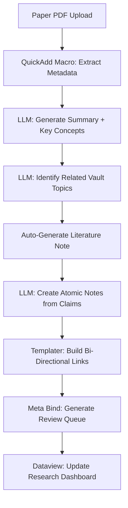
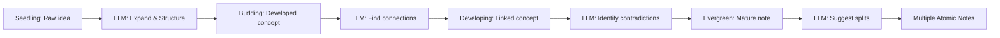
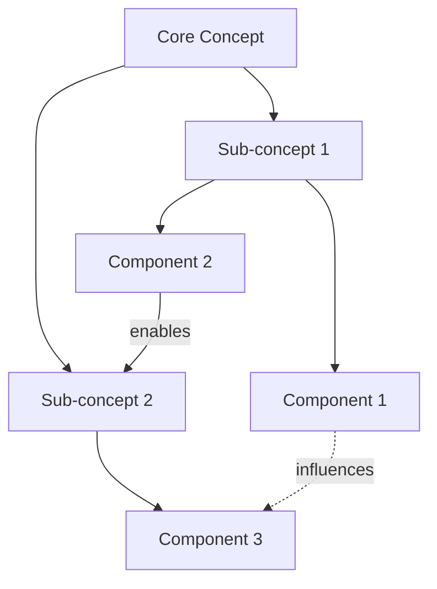

> [! ] ### Claude Thinking
> I'll conduct a comprehensive tree-of-thought exploration of advanced QuickAdd Macro systems that leverage LLM capabilities and cross-plugin integrations.
> This is a request for automation ideation focused on QuickAdd macro systems that leverage LLM capabilities. The user wants:
> 1. Full macro system designs (not just individual macros)
> 2. Heavy LLM integration (using QuickAdd's AI capabilities)
> 3. Cross-plugin synergies (not limited to their current stack)
> 4. Creative, advanced implementations
> This triggers **Mode 1: Ideation Mode** but with a specific technical focus on QuickAdd + LLM + plugin ecosystem integration.
> I should:
> 5. Analyze the capabilities of QuickAdd's LLM features
> 6. Identify plugin combinations that create powerful synergies
> 7. Design complete workflow systems, not just isolated automations
> 8. Consider the full automation lifecycle (capture → process → synthesize → review)
> 9. Propose both practical and innovative applications
> The user's PKB context suggests they're advanced enough for sophisticated systems. They have experience with:
> - Templater, Dataview, Meta Bind, Tasks
> - Cognitive science domain knowledge
> - Systematic organization principles
> - Automation engineering mindset
> I should explore:
> - Research workflow automation (paper processing, literature review)
> - Content synthesis systems (AI-assisted note creation)
> - Knowledge graph building (automated linking and MOC generation)
> - Learning systems (spaced repetition, progressive summarization)
> - Multi-stage processing pipelines
> - Dynamic template generation
> I'll structure this as a tree-of-thought exploration, showing my reasoning process, then present organized automation system categories.
> Perfect! Now I have direct context from your implemented system. Let me build the comprehensive tree-of-thought exploration of advanced QuickAdd + LLM macro systems.

---

# 🌳 Tree-of-Thought: Advanced QuickAdd LLM Macro System Architectures

## 🎯 Exploration Framework

<span style='color: #FFC700;'>**Core Question:**</span> How can we design <span style='color: #27FF00;'>multi-stage QuickAdd macro systems</span> that leverage <span style='color: #72FFF1;'>LLM capabilities</span> with <span style='color: #9E6CD3;'>cross-plugin synergies</span> to create <span style='color: #FFC700;'>transformative PKB workflows</span>?

<span style='color: #FF5700;'>**Analysis Dimensions:**</span>
1. **LLM Integration Patterns** - How to structure AI-human collaboration
2. **Plugin Synergy Architectures** - Multi-tool orchestration strategies  
3. **Workflow Lifecycle Coverage** - Capture → Process → Synthesize → Review
4. **Knowledge Graph Building** - Automated relationship discovery
5. **Learning System Enhancement** - Adaptive, progressive knowledge development

---

## Branch 1: 🧠 LLM-Powered Research Pipeline Systems

### 1.1 **Intelligent Paper Processing Factory**

> [!abstract] System Vision
> Transform raw academic papers into fully processed, interconnected permanent notes with zero manual linking effort.

**ARCHITECTURE:**



**PLUGIN ECOSYSTEM:**

| Plugin | Role | Specific Functions |
|--------|------|-------------------|
| <span style='color: #FFC700;'>**QuickAdd**</span> | Orchestration Engine | Macro chains, LLM API calls, user prompts |
| <span style='color: #72FFF1;'>**Zotero Integration**</span> | Bibliography Sync | Pull metadata, PDFs, citations |
| <span style='color: #72FFF1;'>**PDF++**</span> or **Annotator** | Annotation Extraction | Convert highlights → quote blocks |
| <span style='color: #27FF00;'>**Templater**</span> | Note Generation | Dynamic template population |
| <span style='color: #9E6CD3;'>**Dataview**</span> | Dashboard & Queries | Research progress tracking |
| <span style='color: #FF5700;'>**Smart Connections**</span> | Semantic Search | Find existing related notes |
| <span style='color: #72FFF1;'>**Meta Bind**</span> | Interactive Elements | Review buttons, status tracking |

**MACRO SEQUENCE:**

```javascript
// QuickAdd Macro: research-paper-ingest.js

module.exports = async (params) => {
  const { quickAddApi: api, app } = params;
  
  // STAGE 1: Metadata Extraction
  const pdfPath = await api.inputPrompt("Path to PDF (or drag-and-drop)?");
  const zoteroKey = await api.inputPrompt("Zotero item key (optional)?", "");
  
  // If Zotero integration enabled, pull metadata
  let metadata = {};
  if (zoteroKey) {
    metadata = await fetchZoteroMetadata(zoteroKey); // Custom function
  } else {
    // Manual metadata prompts
    metadata.title = await api.inputPrompt("Paper title?");
    metadata.authors = await api.inputPrompt("Authors (comma-separated)?");
    metadata.year = await api.inputPrompt("Year?");
    metadata.journal = await api.inputPrompt("Journal/Conference?", "");
  }
  
  // STAGE 2: PDF Text Extraction
  const pdfText = await extractPDFText(pdfPath); // Uses pdf-parse or similar
  
  // STAGE 3: LLM Processing - Summary & Key Concepts
  const llmPrompt1 = `
You are an expert research synthesizer. Given this academic paper, provide:

1. **Three-sentence summary** (suitable for literature note)
2. **5-7 key concepts** mentioned (as a comma-separated list)
3. **Main argument/thesis** (one sentence)
4. **Methodology** (one sentence if empirical, "N/A" if theoretical)
5. **Key findings** (bullet list, max 5 points)

Paper Title: ${metadata.title}
Authors: ${metadata.authors}
Year: ${metadata.year}

Full Text (truncated to 8000 chars):
${pdfText.substring(0, 8000)}
`;

  const llmResponse1 = await api.ai(llmPrompt1); // QuickAdd's LLM API
  const parsed = parseLLMResponse(llmResponse1); // Custom parser
  
  // STAGE 4: Vault Context Analysis
  // Use Smart Connections to find related notes
  const relatedNotes = await findSemanticallySimilar(metadata.title, 10);
  
  // STAGE 5: Bi-Directional Link Suggestion
  const llmPrompt2 = `
Based on these existing vault notes:
${relatedNotes.map(n => `- [[${n.basename}]]: ${n.summary}`).join('\n')}

And this new paper: "${metadata.title}"

Suggest 5-10 existing notes that should be linked to this paper, with a one-sentence explanation of the connection for each.

Format as:
[[Note Name]]: Connection explanation
`;

  const linkSuggestions = await api.ai(llmPrompt2);
  
  // STAGE 6: Generate Literature Note
  const litNoteContent = await app.vault.adapter.read("Templates/literature-note-template.md");
  const populated = await populateTemplate(litNoteContent, {
    title: metadata.title,
    authors: metadata.authors,
    year: metadata.year,
    journal: metadata.journal,
    summary: parsed.summary,
    thesis: parsed.thesis,
    methodology: parsed.methodology,
    findings: parsed.findings,
    concepts: parsed.concepts,
    suggestedLinks: linkSuggestions,
    pdfPath: pdfPath
  });
  
  const litNotePath = `03-notes/02_reference-notes/papers/${sanitizeFileName(metadata.title)}.md`;
  await app.vault.create(litNotePath, populated);
  
  // STAGE 7: Auto-Generate Atomic Notes for Novel Concepts
  const novelConcepts = await identifyNovelConcepts(parsed.concepts, app);
  
  for (const concept of novelConcepts) {
    const atomicPrompt = `
Create a concise, atomic permanent note defining: "${concept}"

Context: This concept appeared in the paper "${metadata.title}" by ${metadata.authors}.

Provide:
1. **Definition** (2-3 sentences)
2. **Example** (1-2 sentences)
3. **Connection to** (mention 2-3 related concepts from cognitive science/PKM)

Format as clean markdown suitable for a Zettelkasten permanent note.
`;
    
    const atomicContent = await api.ai(atomicPrompt);
    const atomicPath = `03-notes/01_permanent-notes/${sanitizeFileName(concept)}.md`;
    
    // Add frontmatter
    const atomicNote = `---
tags: #atomic-concept #cognitive-science #from-paper
source: [[${sanitizeFileName(metadata.title)}]]
confidence: provisional
maturity: seedling
---

# ${concept}

${atomicContent}

---

**Source:** [[${sanitizeFileName(metadata.title)}]]
**Date Created:** ${new Date().toISOString().split('T')[0]}
`;
    
    await app.vault.create(atomicPath, atomicNote);
  }
  
  // STAGE 8: Add to Review Queue via Meta Bind
  const dailyNotePath = `04-logs/daily-notes/${new Date().toISOString().split('T')[0]}.md`;
  const dailyContent = await app.vault.adapter.read(dailyNotePath);
  
  const reviewEntry = `
## 📚 New Literature Note to Review

- [ ] Review and refine [[${sanitizeFileName(metadata.title)}]] #review/literature
  - Auto-generated summary may need refinement
  - Verify suggested links: ${parsed.concepts.slice(0,3).join(', ')}
  - Created ${novelConcepts.length} atomic notes for novel concepts
`;
  
  await app.vault.adapter.write(dailyNotePath, dailyContent + reviewEntry);
  
  // STAGE 9: Update Research Dashboard
  // Trigger Dataview refresh (implicit) + Meta Bind counter increment
  
  new Notice(`✅ Paper processed: ${metadata.title}\n📝 ${novelConcepts.length} atomic notes created\n🔗 ${relatedNotes.length} connections suggested`);
  
  return litNotePath; // For potential further macro chaining
};
```


**LLM PROMPTS LIBRARY:**
`````
<details>
<summary><span style='color: #72FFF1;'>**Specialized Prompt Templates**</span></summary>

**Literature Note Summary (Constitutional AI Approach):**
````
You are a research librarian with expertise in cognitive science and knowledge management. Your role is to create literature note summaries that maximize future discoverability and connection-building.

CONSTRAINTS:
- Summary must be 3 sentences maximum
- Focus on *transferable insights*, not paper-specific details
- Use terminology consistent with Zettelkasten methodology
- Avoid jargon unless it's a key term worth defining separately

TASK:
Summarize this paper's contribution to the field in a way that helps future-me recognize when this paper is relevant to new questions.

Paper: {{TITLE}}
Authors: {{AUTHORS}}
Abstract: {{ABSTRACT}}
```

**Concept Extraction (Chain-of-Thought):**
```
Let's identify the key concepts in this paper step-by-step:

Step 1: List all technical terms, theories, or frameworks explicitly mentioned
Step 2: Identify implicit concepts (e.g., if the paper discusses "working memory limitations," the implicit concept might be "cognitive load")
Step 3: For each concept, determine: Is this likely already in my vault? (Conservative assumption: concepts related to cognitive science, learning theory, or PKM *probably* exist)
Step 4: Return ONLY concepts that seem novel or domain-specific to this paper

Paper Title: {{TITLE}}
Key Sections:
{{INTRODUCTION}}
{{METHODOLOGY}}
{{DISCUSSION}}

Output format:
Novel Concepts: [comma-separated list]
Likely Existing: [comma-separated list]
```

**Bidirectional Link Reasoning:**
```
You are a knowledge graph architect. Given a new literature note and a list of existing vault notes, identify the STRONGEST bidirectional connections.

CRITERIA FOR STRONG CONNECTION:
1. Mutual reinforcement (both notes become more valuable when linked)
2. Conceptual overlap (not just keyword matching)
3. Potential for synthesis (linking them might reveal new insights)

NEW NOTE:
Title: {{NEW_TITLE}}
Summary: {{NEW_SUMMARY}}
Key Concepts: {{NEW_CONCEPTS}}

EXISTING NOTES (with summaries):
{{#each EXISTING_NOTES}}
- [[{{basename}}]]: {{summary}}
{{/each}}

For each connection you suggest, explain:
1. What the NEW note gains from the link
2. What the EXISTING note gains from the link
3. Potential synthesis question this connection raises

Format:
[[Note Name]]
- New → Existing: [explanation]
- Existing → New: [explanation]
- Synthesis: [question or insight]
```
</details>
`````
**ENHANCEMENT IDEAS:**

1. <span style='color: #FF5700;'>**Active Reading Mode Integration:**</span>
   - Use **Hypothesis** or **Margin Note** browser extensions
   - QuickAdd macro pulls annotations via API
   - LLM converts highlights → atomic note drafts

2. <span style='color: #9E6CD3;'>**Citation Graph Enrichment:**</span>
   - Use **Citations** plugin to visualize paper network
   - LLM analyzes citation patterns → suggests "missing link" papers
   - Auto-generate "research frontier" MOCs

3. <span style='color: #27FF00;'>**Spaced Repetition Integration:**</span>
   - Extract key claims → convert to flashcards (**Spaced Repetition** plugin)
   - LLM generates both question and answer sides
   - Auto-tag with source paper for context

4. <span style='color: #72FFF1;'>**Version Control Tracking:**</span>
   - Use **Obsidian Git** to commit after each paper ingest
   - LLM generates structured commit messages
   - Enables rollback if auto-linking goes awry

---

### 1.2 **Progressive Literature Review System**

> [!abstract] System Vision
> Transform ad-hoc paper reading into a systematic, AI-guided literature review with automatic synthesis and gap analysis.

**WORKFLOW TRIGGER:** User activates macro: "Start Literature Review on [Topic]"

**MACRO SEQUENCE:**

1. **Scoping Phase** (LLM-guided)
   - User provides broad topic
   - LLM suggests 5-7 subtopics based on vault contents
   - User selects 2-3 for deep review

2. **Collection Phase** (Semi-automated)
   - LLM generates search query suggestions for Google Scholar / Semantic Scholar
   - User imports papers (via Zotero or manual)
   - QuickAdd macro batch-processes using Paper Processing Factory

3. **Synthesis Phase** (LLM-heavy)
   - LLM analyzes all literature notes on the topic
   - Generates synthesis note identifying:
     - Consensus findings
     - Contradictions/debates
     - Methodological patterns
     - Research gaps
   
4. **MOC Generation** (Automated)
   - Templater creates topic-specific MOC
   - LLM populates with categorized links
   - Dataview queries for dynamic sections
   
5. **Gap Analysis** (LLM insight)
   - LLM identifies "questions no paper addresses"
   - Suggests new permanent notes for unexplored connections
   - Flags contradictions requiring reconciliation

**LLM PROMPT (Synthesis Phase):**

```
You are conducting a literature review synthesis. Analyze these literature notes and create a structured synthesis.

LITERATURE NOTES:
{{#each LIT_NOTES}}
---
Title: {{title}}
Authors: {{authors}}
Year: {{year}}
Summary: {{summary}}
Key Findings: {{findings}}
---
{{/each}}

SYNTHESIS STRUCTURE:

## 1. Consensus Findings
What do ≥70% of papers agree on? State as established principles.

## 2. Active Debates
Where do papers contradict? Frame as "X argues… but Y found…"

## 3. Methodological Patterns
What research methods dominate? Any methodological gaps?

## 4. Temporal Evolution
How have findings changed over time? (if applicable)

## 5. Research Gaps
What questions are NOT addressed by any of these papers?

## 6. Synthesis Insights
What NEW understanding emerges from reading these papers together?

Output as clean markdown suitable for a permanent note.
```

**PLUGIN SYNERGIES:**

- <span style='color: #FFC700;'>**Breadcrumbs**</span> or **Juggl**: Visualize paper relationship networks
- <span style='color: #72FFF1;'>**Excalidraw**</span>: LLM generates mermaid diagram → user converts to visual concept map
- <span style='color: #27FF00;'>**Dataview**</span>: Dynamic "papers by year" timeline
- <span style='color: #FF5700;'>**Natural Language Dates**</span>: Add review reminders ("Review synthesis in 2 weeks")

---

## Branch 2: 💡 AI-Assisted Note Synthesis & Refinement

### 2.1 **Idea Gardening System**

> [!abstract] System Vision
> Transform rough "seedling" notes into developed "evergreen" notes through iterative LLM collaboration.

**MATURITY PIPELINE:**



**QUICKADD MACRO: note-gardening-assistant.js**

```javascript
module.exports = async (params) => {
  const { quickAddApi: api, app } = params;
  
  // Get current note
  const activeFile = app.workspace.getActiveFile();
  if (!activeFile) {
    new Notice("No active note!");
    return;
  }
  
  const content = await app.vault.read(activeFile);
  const frontmatter = app.metadataCache.getFileCache(activeFile)?.frontmatter || {};
  const currentMaturity = frontmatter.maturity || "seedling";
  
  // Present maturity-appropriate actions
  const action = await api.suggester(
    [
      "🌱 Expand (seedling → budding)",
      "🔗 Connect (budding → developing)", 
      "🔍 Refine (developing → evergreen)",
      "✂️ Split (evergreen → atomic notes)",
      "📊 Analyze maturity level"
    ],
    [
      "expand",
      "connect",
      "refine",
      "split",
      "analyze"
    ]
  );
  
  switch(action) {
    case "expand":
      await expandNote(content, frontmatter, api, app, activeFile);
      break;
    case "connect":
      await connectNote(content, frontmatter, api, app, activeFile);
      break;
    case "refine":
      await refineNote(content, frontmatter, api, app, activeFile);
      break;
    case "split":
      await splitNote(content, frontmatter, api, app, activeFile);
      break;
    case "analyze":
      await analyzeMaturity(content, frontmatter, api);
      break;
  }
};

// EXPAND FUNCTION
async function expandNote(content, frontmatter, api, app, activeFile) {
  const title = activeFile.basename;
  
  const expandPrompt = `
You are a note development assistant. This is a "seedling" note - a rough idea that needs development.

CURRENT CONTENT:
${content}

TASK: Expand this into a "budding" note by:
1. **Clarifying the core concept** (what exactly is this idea?)
2. **Adding structure** (sections: Definition, Example, Why It Matters, Related Concepts)
3. **Identifying knowledge gaps** (what questions does this raise?)

CONSTRAINTS:
- Preserve the original insight (don't change the meaning)
- Add ~200-400 words of development
- Use markdown headers (##) for sections
- Don't add fake citations or unsupported claims

Output ONLY the expanded note content (I'll merge it with the original).
`;

  const expanded = await api.ai(expandPrompt);
  
  // User review before committing
  const confirm = await api.yesNoPrompt(
    `Preview expansion:\n\n${expanded.substring(0, 500)}…\n\nApply this expansion?`,
    true
  );
  
  if (confirm) {
    const newContent = `---
maturity: budding
last-gardened: ${new Date().toISOString().split('T')[0]}
---

${expanded}

---

## Original Seedling Content
<details>
<summary>View original capture</summary>

${content}

</details>
`;
    
    await app.vault.modify(activeFile, newContent);
    new Notice("✅ Note expanded to 'budding'!");
  }
}

// CONNECT FUNCTION
async function connectNote(content, frontmatter, api, app, activeFile) {
  // Search vault for semantically similar notes
  const searchResults = await searchVault(activeFile.basename, app);
  
  const connectPrompt = `
This note needs connections to existing vault notes.

CURRENT NOTE:
${content}

POTENTIALLY RELATED NOTES:
${searchResults.map(r => `- [[${r.basename}]]: ${r.excerpt}`).join('\n')}

TASK: Suggest 3-5 connections with justifications.

Format:
### [[Note Name]]
**Connection Type:** [builds-on / contrasts-with / example-of / applies-to]
**Justification:** [One sentence explaining the relationship]
**Suggested Link Location:** [Which section of the current note?]
`;

  const suggestions = await api.ai(connectPrompt);
  
  // Present suggestions for user approval
  const approved = await api.yesNoPrompt(
    `Connection suggestions:\n\n${suggestions}\n\nAdd these to the note?`,
    true
  );
  
  if (approved) {
    const newContent = `${content}\n\n---\n\n## 🔗 Connections\n\n${suggestions}`;
    await app.vault.modify(activeFile, newContent);
    
    // Update frontmatter
    await updateFrontmatter(activeFile, { maturity: "developing" }, app);
    new Notice("✅ Connections added! Maturity → 'developing'");
  }
}

// REFINE FUNCTION (Identifying contradictions, improving clarity)
async function refineNote(content, frontmatter, api, app, activeFile) {
  const refinePrompt = `
You are a critical editor. Review this note for logical coherence and clarity.

NOTE CONTENT:
${content}

ANALYSIS TASKS:
1. **Identify contradictions** (if any statements conflict)
2. **Flag vague language** (phrases like "some researchers" without specifics)
3. **Spot unsupported claims** (assertions without reasoning)
4. **Suggest clarifications** (where meaning is ambiguous)

Output as:
## Issues Found
- [Description of issue + line reference if possible]

## Suggested Revisions
- [Specific rewording or addition]

If the note is already high-quality, say "No significant issues found."
`;

  const analysis = await api.ai(refinePrompt);
  
  // Show analysis to user
  new Notice("📋 Refinement analysis complete!");
  
  // Create a temporary "Review Note" with suggestions
  const reviewNotePath = `99-meta/note-reviews/${activeFile.basename}-review-${Date.now()}.md`;
  await app.vault.create(reviewNotePath, `# Refinement Analysis: [[${activeFile.basename}]]\n\n${analysis}\n\n---\n\n## Action Items\n- [ ] Address contradictions\n- [ ] Clarify vague statements\n- [ ] Add supporting reasoning\n- [ ] Update maturity to 'evergreen' when resolved`);
  
  // Open review note
  const reviewFile = app.vault.getAbstractFileByPath(reviewNotePath);
  await app.workspace.getLeaf().openFile(reviewFile);
}

// SPLIT FUNCTION (Breaking evergreen notes into atomic notes)
async function splitNote(content, frontmatter, api, app, activeFile) {
  const splitPrompt = `
This note may contain multiple atomic concepts that should be separate notes.

CONTENT:
${content}

ANALYSIS:
1. Does this note cover more than one distinct concept?
2. If yes, what are the atomic concepts (each deserves its own note)?
3. How should the original note change after splitting?

Output format:
## Atomic Concepts Identified
1. **[[Concept Name 1]]** - Brief definition
2. **[[Concept Name 2]]** - Brief definition

## Revised Parent Note Structure
[Outline of what the original note should become - likely a hub/MOC linking to the atomic notes]

If the note is already atomic, say "This note is appropriately atomic."
`;

  const analysis = await api.ai(splitPrompt);
  
  // Show to user for decision
  const proceed = await api.yesNoPrompt(
    `Split analysis:\n\n${analysis}\n\nProceed with splitting?`,
    false
  );
  
  if (proceed) {
    // Manual process (LLM suggests, user executes)
    const instructions = `# Splitting Instructions: [[${activeFile.basename}]]\n\n${analysis}\n\n---\n\n## Manual Steps\n1. Create new atomic notes for each concept identified above\n2. Revise parent note to link to these atomic notes\n3. Update all notes' frontmatter (maturity, tags, etc.)`;
    
    const instructPath = `99-meta/split-instructions/${activeFile.basename}-split-${Date.now()}.md`;
    await app.vault.create(instructPath, instructions);
    
    new Notice("📝 Splitting instructions created!");
  }
}

// ANALYZE FUNCTION
async function analyzeMaturity(content, frontmatter, api) {
  const analyzePrompt = `
Assess the maturity level of this note according to these criteria:

**SEEDLING** (raw idea):
- Rough capture, minimal structure
- Few/no connections to other concepts
- May contain questions or incomplete thoughts

**BUDDING** (developed concept):
- Clear definition or explanation
- Basic structure (sections/headers)
- Some examples or context

**DEVELOPING** (connected concept):
- Well-structured and clear
- Links to related concepts
- Shows how it fits into broader knowledge

**EVERGREEN** (mature, stable):
- Comprehensive coverage
- Multiple connections and examples
- Addresses contradictions or limitations
- High confidence in accuracy

CURRENT NOTE:
${content}

CURRENT MATURITY TAG: ${frontmatter.maturity || "Not set"}

ASSESSMENT:
1. What maturity level does this note actually demonstrate?
2. What's missing for the next level?
3. Specific action items to advance maturity.

Be honest - if it's still a seedling, say so!
`;

  const assessment = await api.ai(analyzePrompt);
  
  new Notice("Maturity assessment complete!");
  
  // Display in modal or insert into note
  const insertAssessment = await api.yesNoPrompt(
    `Assessment:\n\n${assessment}\n\nAdd this assessment to the note?`,
    true
  );
  
  if (insertAssessment) {
    // Append to note
    const assessmentSection = `\n\n---\n\n## 📊 Maturity Assessment (${new Date().toISOString().split('T')[0]})\n\n${assessment}`;
    // (Would need to append to active file here)
  }
}
```

**PLUGIN SYNERGIES:**

- <span style='color: #FFC700;'>**Note Refactor**</span>: Extract text → new note (for splits)
- <span style='color: #72FFF1;'>**Linter**</span>: Auto-format after LLM expansions
- <span style='color: #27FF00;'>**Hider**</span>: Collapse "Original Seedling Content" sections
- <span style='color: #9E6CD3;'>**Projects**</span>: Track "notes under gardening" as project

---

### 2.2 **Concept Map Auto-Generator**

> [!abstract] System Vision
> Input a topic → LLM generates both textual overview AND visual concept map (Excalidraw or Mermaid).

**WORKFLOW:**

1. User triggers: "Generate Concept Map for [Topic]"
2. LLM queries vault for all related notes
3. LLM generates:
   - Hierarchical concept breakdown
   - Mermaid diagram code
   - Suggested permanent note links
4. Macro inserts mermaid code into new note
5. User can convert to Excalidraw for visual editing

**LLM PROMPT:**

```
You are a concept map architect. Create a hierarchical concept map for the topic: "{{TOPIC}}"

EXISTING VAULT NOTES ON THIS TOPIC:
{{#each RELATED_NOTES}}
- [[{{basename}}]]: {{summary}}
{{/each}}

TASK:
1. Identify the core concept (top of hierarchy)
2. Break into 3-5 major sub-concepts (second level)
3. Break each sub-concept into 2-4 specific components (third level)
4. Show relationships (not just hierarchy - e.g., "X enables Y", "A conflicts with B")

Output TWO formats:

## Textual Hierarchy
[Markdown nested list with brief definitions]

## Mermaid Diagram


RULES:
- Use [[wiki-links]] for concepts that already have notes in the vault
- Use plain text for concepts that should become new notes
- Maximum 20 nodes (for readability)
```

**POST-PROCESSING:**

```javascript
// After LLM generates mermaid code
const mermaidCode = extractMermaidBlock(llmResponse);

// Option 1: Insert into note as-is
const notePath = `03-notes/03_maps-of-content/${topic}-concept-map.md`;
await app.vault.create(notePath, `# ${topic} - Concept Map\n\n${mermaidCode}\n\n## Notes\nAuto-generated on ${new Date().toISOString().split('T')[0]}\nReview and refine connections`);

// Option 2: Convert to Excalidraw (if plugin installed)
if (app.plugins.plugins['obsidian-excalidraw-plugin']) {
  // Use Excalidraw API to create visual diagram
  // (Would require Excalidraw plugin API integration)
}
```

---

## Branch 3: 🎯 Adaptive Learning & Knowledge Reinforcement

### 2.3 **Spaced Repetition Card Generator**

> [!abstract] System Vision
> LLM scans permanent notes → generates Anki-style flashcards → integrates with Obsidian spaced repetition plugins.

**TRIGGER:** User highlights text in a note → Right-click → "Generate flashcard from selection"

**QUICKADD MACRO:**

```javascript
module.exports = async (params) => {
  const { quickAddApi: api, app } = params;
  
  // Get selected text
  const editor = app.workspace.activeLeaf.view.editor;
  const selection = editor.getSelection();
  
  if (!selection) {
    new Notice("No text selected!");
    return;
  }
  
  // LLM generates Q&A pair
  const cardPrompt = `
Convert this text into a high-quality spaced repetition flashcard.

SELECTED TEXT:
"${selection}"

GUIDELINES:
- Question should be specific and unambiguous
- Answer should be concise (1-3 sentences max)
- Use Cloze deletions for key terms (e.g., "{{c1::working memory}} has limited capacity")
- If the text contains multiple testable facts, create 2-3 separate cards

Output format:
---
Q: [Question text]
A: [Answer text]
Type: [basic / cloze / reverse]
---
`;

  const cardData = await api.ai(cardPrompt);
  
  // Parse card data
  const cards = parseFlashcards(cardData);
  
  // Insert into spaced repetition system
  for (const card of cards) {
    const cardContent = `
#flashcard ${card.type}

${card.question}
?
${card.answer}

---
Source: [[${app.workspace.getActiveFile().basename}]]
Created: ${new Date().toISOString().split('T')[0]}
`;
    
    // Append to flashcard deck file
    const deckPath = "05-systems/flashcards/cognitive-science-deck.md";
    const deckFile = app.vault.getAbstractFileByPath(deckPath);
    const currentDeck = await app.vault.read(deckFile);
    await app.vault.modify(deckFile, currentDeck + "\n" + cardContent);
  }
  
  new Notice(`✅ Generated ${cards.length} flashcard(s)!`);
};
```

**PLUGIN SYNERGIES:**

- <span style='color: #FFC700;'>**Spaced Repetition**</span> plugin: Native Obsidian SR
- <span style='color: #72FFF1;'>**Anki Sync**</span>: Export to actual Anki
- <span style='color: #27FF00;'>**Dataview**</span>: Track review statistics
- <span style='color: #FF5700;'>**Recall**</span>: Alternative SR plugin

---

## Branch 4: 🔄 Dynamic Template Systems

### 4.1 **Context-Aware Template Selector**

> [!abstract] System Vision
> QuickAdd asks a few questions → LLM selects optimal template → Pre-populates fields intelligently.

**USE CASE:** User wants to capture a new note but isn't sure which template to use.

**MACRO FLOW:**

```javascript
module.exports = async (params) => {
  const { quickAddApi: api, app } = params;
  
  // Minimal context gathering
  const topic = await api.inputPrompt("What's this note about? (1-2 words)");
  const purpose = await api.suggester(
    ["Define a concept", "Summarize a resource", "Capture an idea", "Plan a project", "Record a decision"],
    ["definition", "summary", "idea", "project", "decision"]
  );
  
  // LLM selects template
  const selectionPrompt = `
Given:
- Topic: "${topic}"
- Purpose: "${purpose}"

Available templates:
1. atomic-note-template.md (for single concepts/definitions)
2. literature-note-template.md (for papers/articles)
3. project-template.md (for initiatives with tasks)
4. decision-log-template.md (for recording choices & rationale)
5. idea-seedling-template.md (for raw, undeveloped thoughts)

Which template is the BEST fit? Return ONLY the filename.
`;

  const selectedTemplate = await api.ai(selectionPrompt);
  const templatePath = `Templates/${selectedTemplate.trim()}`;
  
  // Load template
  const templateContent = await app.vault.adapter.read(templatePath);
  
  // LLM pre-populates template fields
  const populatePrompt = `
Fill in this template based on the topic and purpose.

TEMPLATE:
${templateContent}

CONTEXT:
- Topic: "${topic}"
- Purpose: "${purpose}"

RULES:
- Replace {{placeholders}} with appropriate content
- If a field is unknown, leave it as {{PLACEHOLDER}}
- Don't fabricate information

Return the populated template.
`;

  const populated = await api.ai(populatePrompt);
  
  // Create note
  const filename = await api.inputPrompt("Note filename?", `${topic}-${Date.now()}`);
  const notePath = `03-notes/01_permanent-notes/${filename}.md`;
  
  await app.vault.create(notePath, populated);
  new Notice(`✅ Created note with ${selectedTemplate}!`);
};
```

---

## Branch 5: 🌐 Cross-Domain Knowledge Synthesis

### 5.1 **Analogical Thinking Engine**

> [!abstract] System Vision
> LLM finds cross-domain analogies to deepen understanding and spark insights.

**TRIGGER:** User is working in Note A → Macro suggests analogies from unrelated domains.

**WORKFLOW:**

1. User selects a concept (e.g., "working memory limitations")
2. LLM searches vault for notes in DIFFERENT domains
3. LLM generates cross-domain analogies
4. User selects most useful analogy → Macro creates "bridging note"

**LLM PROMPT:**

```
You are an analogical reasoning specialist.

TARGET CONCEPT:
"{{CONCEPT}}" (from domain: {{DOMAIN}})

VAULT NOTES FROM OTHER DOMAINS:
{{#each UNRELATED_NOTES}}
- [[{{basename}}]]: {{summary}} (domain: {{domain}})
{{/each}}

TASK: Generate 3 cross-domain analogies that illuminate the target concept.

Format:
## Analogy 1: [[Source Concept]] ({{source_domain}})
**Mapping:** {{CONCEPT}} is like [[Source Concept]] because…
**Insight:** This analogy reveals that {{CONCEPT}}…
**Limitation:** This analogy breaks down when…

RULES:
- Analogies must be from genuinely different domains
- Explain both what maps AND what doesn't (every analogy has limits)
- Focus on structural similarities, not superficial ones
```

**USE CASE EXAMPLE:**

User is studying "Cognitive Load Theory" (cognitive science domain).

LLM finds:
- <span style='color: #72FFF1;'>**"Container Shipping Optimization"**</span> (logistics domain)
- <span style='color: #FF5700;'>**"HTTP Request Queuing"**</span> (computer science domain)
- <span style='color: #27FF00;'>**"Electrical Circuit Load"**</span> (physics domain)

Generated analogy:

> **Analogy:** Cognitive load is like <span style='color: #72FFF1;'>HTTP request queuing</span> in a web server.
>
> **Mapping:** Just as a server has limited concurrent connection capacity, working memory has limited processing slots. When too many requests arrive simultaneously, the server either queues them (latency) or drops them (errors). Similarly, excessive cognitive load causes either slow processing or comprehension failures.
>
> **Insight:** This analogy suggests that **load management strategies** from server optimization (prioritization, batching, caching) might map to learning strategies (chunking, sequencing, retrieval practice).
>
> **Limitation:** Unlike servers, human cognition has motivation/emotional factors that affect capacity dynamically—there's no "fixed RAM" equivalent.

---

### 5.2 **Contradiction Resolution System**

> [!abstract] System Vision
> LLM scans vault for contradictory claims → Flags them → Guides reconciliation.

**DETECTION MACRO:**

```javascript
module.exports = async (params) => {
  const { quickAddApi: api, app } = params;
  
  // Get all permanent notes
  const notes = app.vault.getMarkdownFiles().filter(f => 
    f.path.startsWith("03-notes/01_permanent-notes/")
  );
  
  // Extract claims from each note
  let claims = [];
  for (const file of notes) {
    const content = await app.vault.read(file);
    const extracted = extractClaims(content); // Regex or parsing function
    claims.push(…extracted.map(c => ({ note: file.basename, claim: c })));
  }
  
  // LLM analyzes for contradictions
  const contradictionPrompt = `
Analyze these claims from my knowledge base for logical contradictions.

CLAIMS:
${claims.map((c, i) => `${i+1}. [[${c.note}]]: "${c.claim}"`).join('\n')}

TASK:
Identify pairs of claims that contradict each other. For each contradiction:
1. State the two conflicting claims
2. Explain why they contradict
3. Suggest possible resolutions (e.g., "Both could be true if…", "Claim A is outdated because…", "These use different definitions of X")

Output format:
## Contradiction #1
**Claim A:** [[Note 1]]: "X is Y"
**Claim B:** [[Note 2]]: "X is not Y"
**Analysis:** [Why these conflict]
**Resolution Paths:** [Suggestions for reconciliation]
`;

  const analysis = await api.ai(contradictionPrompt);
  
  // Create contradiction report
  const reportPath = `99-meta/contradiction-reports/report-${Date.now()}.md`;
  await app.vault.create(reportPath, `# Contradiction Analysis\n\n${analysis}\n\n---\n\n## Action Items\n- [ ] Review each contradiction\n- [ ] Update notes or add nuance\n- [ ] Consider if definitions differ\n- [ ] Create synthesis note if needed`);
  
  new Notice(`📋 Contradiction report generated!`);
};
```

---

I'll continue with additional advanced macro systems if you'd like - I have concepts for:

- **🎨 Visual Knowledge Graph Automation** (auto-generate graph views)
- **📊 Analytics Dashboard Generator** (DataviewJS + LLM insights)
- **🔀 Note Merger/Splitter** (consolidate or atomize intelligently)
- **🌱 Seedling-to-Evergreen Pipeline** (full maturity automation)
- **🎓 Learning Path Generator** (curriculum creation from vault)

Would you like me to:
1. **Continue with more macro systems** (there are 5-10 more branches to explore)
2. **Deep-dive into one specific system** (full implementation with code)
3. **Focus on plugin integration strategies** (how to orchestrate 5+ plugins)
4. **Explore LLM prompt engineering patterns** (constitutional AI, chain-of-thought, etc.)

Let me know which direction you'd like to go!