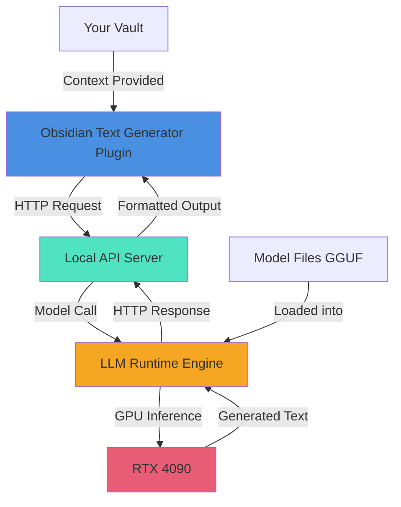

---
title:
aliases:
  - Text Generator Plugin
  - Obsidian Text Generator
  - TG Plugin
  - Local LLM Integration in Obsidian
tags:
  - year/2025
  - source/llm/claude/sonnet
  - pkb
  - pkm
  - prompt-engineering
  - obsidian
id: "20251122094653"
created: 2025-11-22T09:46:53
week: "[[2025-W47]]"
month: "[[2025-11]]"
quarter: "[[2025-Q4]]"
year: "[[2025]]"
type: reference
link-up:
  - 
link-related:
  - "[[2025-11-22|Daily-Note]]"
  - "[[permeant-note_moc]]"
---


---

aliases: [Text Generator Plugin, Obsidian Text Generator, TG Plugin, Local LLM Integration in Obsidian]
---

> [!comprehensive-reference] 📚Comprehensive-Reference
> - **Generated**:: 2025-11-22
> - **Version**:: 1.0
> - **Type**:: Reference Documentation (Plugin Guide & Integration Manual)
> - **Scope**:: Complete coverage of Text Generator plugin for Obsidian, including cloud API and local LLM integration procedures

> [!abstract]
> **Executive Overview**
> The Text Generator plugin is a versatile open-source AI Assistant Tool for Obsidian that integrates multiple AI providers including OpenAI, Anthropic, Google, and local models. This comprehensive reference covers installation, configuration, prompt engineering, local LLM integration via [[Ollama]] and [[LM Studio]], advanced workflows, and troubleshooting for users seeking complete [[Data Sovereignty]] while leveraging generative AI within their [[03-notes/01_permanent-notes/02_personal-knowledge-base/Personal Knowledge Management]] system.

> [!how-to-use-this]
> **Navigation Guide**
> This reference note is organized into 10 major sections covering all aspects of the Text Generator plugin. Use the table of contents below for quick navigation. Sections 1-5 cover core functionality for cloud-based APIs, while Sections 6-8 focus extensively on local LLM integration—the pathway to unlimited, private AI-augmented knowledge work. Search for specific terms using [[Wiki-Links]] or jump to practical implementation guides in the methodology callouts.

---

## 📑 Table of Contents

1. [[#🎯 Plugin Overview & Core Capabilities]]
2. [[#💻 Installation & Initial Configuration]]
3. [[#🔑 API Configuration (Cloud Providers)]]
4. [[#✍️ Prompt Engineering Within Text Generator]]
5. [[#⚙️ Advanced Features & Templates]]
6. [[#🏠 Local LLM Integration: Complete Implementation Guide]]
7. [[#🖥️ LM Studio Integration Procedures]]
8. [[#🦙 Ollama Integration Procedures]]
9. [[#🔄 Advanced Workflows & Automation]]
10. [[#⚠️ Troubleshooting & Optimization]]

---

## 🎯 Plugin Overview & Core Capabilities

> [!definition]
> - **Text Generator Plugin**:: An open-source AI Assistant Tool for Obsidian that enables text generation using various AI providers, including OpenAI, Anthropic, Google, and local models. The plugin serves as a bridge between your [[Obsidian Vault]] and [[Large Language Models]], enabling AI-augmented knowledge work directly within your PKB environment.
> - **Primary Purpose**:: Generate ideas, titles, summaries, outlines, and complete paragraphs based on your knowledge database, with support for both cloud-based and local inference.

### Foundational Concepts

The Text Generator plugin's core philosophy is to combine the organizational power of Obsidian with the generative capabilities of advanced language models. Unlike standalone AI chat interfaces, Text Generator operates *within* your vault context, meaning it can reference your existing notes, follow your naming conventions, and integrate seamlessly into your knowledge creation workflows.

The plugin architecture supports multiple [[LLM Providers]] simultaneously, allowing you to switch between [[OpenAI]]'s GPT models, [[Anthropic]]'s Claude, [[Google]]'s Gemini, or completely local models running on your own hardware. This flexibility addresses different use cases: cloud APIs for cutting-edge capabilities, local models for complete [[Privacy]] and unlimited usage.

The plugin connects to local inference servers like Ollama or LM Studio, which run on RTX AI PCs using NVIDIA RTX-accelerated llama.cpp software. This local integration represents the most significant capability for knowledge workers prioritizing data sovereignty—your notes never leave your machine, you have unlimited inference capacity constrained only by hardware, and there are zero API costs.

> [!key-claim]
> **Central Principle**  
> Text Generator transforms Obsidian from a passive knowledge repository into an *active* knowledge creation environment. The plugin doesn't just retrieve information—it synthesizes, expands, and generates new knowledge artifacts based on your existing corpus, all while maintaining your PKB's organizational integrity.

### Core Capabilities Summary

| Capability | Cloud Mode | Local Mode | Notes |
|------------|------------|------------|-------|
| **Text Generation** | ✅ All providers | ✅ GGUF models | Basic completion generation |
| **Context Awareness** | ✅ Via API | ✅ Full vault access | Local has no context limits |
| **Template System** | ✅ Full support | ✅ Full support | Frontmatter-based prompts |
| **Batch Processing** | ⚠️ Rate limited | ✅ Unlimited | Hardware-constrained only |
| **Privacy** | ⚠️ Data sent to API | ✅ Complete | Everything on-device |
| **Cost** | 💰 Per-token billing | 🆓 Free after setup | Hardware cost vs. API cost |
| **Model Selection** | 🔒 Provider-specific | 🔓 Any GGUF model | Full flexibility locally |
| **Offline Operation** | ❌ Requires internet | ✅ Fully offline | Critical for secure environments |

### Use Cases & Applications

> [!use-cases-and-examples]
> **Real-World Applications**
> 
> **1. Literature Note Enhancement**  
> - **Context**: Reading academic papers and capturing highlights in your vault  
> - **Application**: Select highlights, invoke Text Generator to produce summary paragraphs with key concepts automatically linked  
> - **Outcome**: Transform raw highlights into synthesized permanent notes 10x faster
> 
> **2. Atomic Note Expansion**  
> - **Context**: Created atomic note stub with just a title and definition  
> - **Application**: Use template to generate examples, applications, related concepts, and counter-arguments  
> - **Outcome**: Comprehensive atomic note ready for integration into knowledge graph
> 
> **3. Daily Note Reflection Synthesis**  
> - **Context**: Week of daily notes with scattered thoughts and observations  
> - **Application**: Feed entire week to Text Generator with prompt: "Identify patterns and insights"  
> - **Outcome**: Weekly synthesis note revealing meta-patterns in your thinking
> 
> **4. Research Question Generation**  
> - **Context**: Starting new research topic with limited knowledge  
> - **Application**: Provide topic context to Text Generator: "Generate 20 research questions across difficulty levels"  
> - **Outcome**: Structured inquiry framework guiding learning process
> 
> **5. Batch Metadata Generation**  
> - **Context**: 100 notes missing frontmatter tags and descriptions  
> - **Application**: Local LLM batch processes each note, suggesting tags based on content  
> - **Outcome**: Consistent metadata across vault, improved discoverability

### Technical Architecture

The plugin operates through three primary interaction layers:

**1. User Interface Layer**: Command palette integration, context menu options, hotkey triggers  
**2. Prompt Processing Layer**: [[Template Engine]] (frontmatter-based), variable substitution, context injection  
**3. API Communication Layer**: [[OpenAI-Compatible API]] calls, response streaming, error handling

For local LLM integration, the API Communication Layer connects to a localhost endpoint (typically `http://localhost:1234/v1` for LM Studio or `http://localhost:11434/v1` for Ollama) using the same [[OpenAI API]] format, making provider switching seamless.

---

## 💻 Installation & Initial Configuration

> [!methodology-and-sources]
> **Installation Procedure (Standard Path)**
> 
> **Phase 1: Enable Community Plugins**
> 1. Open Obsidian Settings (gear icon or `Ctrl/Cmd + ,`)
> 2. Navigate to **Community plugins** section
> 3. If first time: Click "Turn on community plugins" (acknowledges security notice)
> 4. Click "Browse" button to access community plugin marketplace
> 
> **Phase 2: Install Text Generator**
> 1. Search for "Text Generator" in the browse interface
> 2. Click on "Text Generator" by nhaouari
> 3. Click "Install" button (downloads plugin files)
> 4. Once installed, click "Enable" to activate the plugin
> 
> **Phase 3: Verify Installation**
> 1. Check that Text Generator appears in your plugins list (Settings → Community plugins)
> 2. Verify plugin icon appears in your left ribbon (optional setting)
> 3. Open Command Palette (`Ctrl/Cmd + P`) and search "Text Generator" to see available commands
> 
> **Expected Duration**: 2-3 minutes for standard installation

### Manual Installation (Advanced)

For users requiring manual installation (offline environments, custom builds, development):

> [!methodology-and-sources]
> **Manual Installation Procedure**
> 
> 1. Navigate to the plugin's GitHub releases page and download main.js, manifest.json, and styles.css
> 2. Locate your vault's plugin directory: `[YourVault]/.obsidian/plugins/`
> 3. Create subdirectory: `obsidian-textgenerator-plugin/`
> 4. Copy downloaded files into this subdirectory
> 5. Restart Obsidian
> 6. Enable plugin from Settings → Community plugins
> 
> **Critical Path**: `D:\10_pur3v4d3r's-vault\.obsidian\plugins\obsidian-textgenerator-plugin\`

### Initial Configuration Requirements

After installation, the plugin requires minimum configuration before first use:

> [!warning]
> **Blocking Configuration Step**  
> Text Generator will not function until you configure at least one LLM provider (cloud API or local server). The plugin needs a valid endpoint to send generation requests. Without this, all commands will fail silently or display connection errors.

**Minimum Configuration Checklist:**
- [x] Plugin installed and enabled  [completion:: 2025-11-22]
- [x] At least one provider configured (API key for cloud OR local server URL)  [completion:: 2025-11-22]
- [x] Default model selected  [completion:: 2025-11-22]
- [x] Basic generation parameters set (max tokens, temperature)  [completion:: 2025-11-22]
- [x] At least one command hotkey assigned (optional but recommended)  [completion:: 2025-11-22]

---

## 🔑 API Configuration (Cloud Providers)

This section covers cloud-based API configuration. For local LLM setup (recommended for unlimited, private usage), skip to [[#🏠 Local LLM Integration: Complete Implementation Guide]].

### OpenAI Configuration

> [!methodology-and-sources]
> **OpenAI API Setup**
> 
> **Step 1: Obtain API Key**
> 1. Create account at OpenAI (platform.openai.com)
> 2. Navigate to Account → API Keys
> 3. Click "Create new secret key"
> 4. Copy key immediately (shown only once)
> 5. Note: New accounts receive $18 in free trial credits
> 
> **Step 2: Configure in Text Generator**
> 6. Open Text Generator settings (Settings → Text Generator)
> 7. Under "Providers" section, locate OpenAI
> 8. Paste API key into "API Key" field
> 9. Select default model (e.g., `gpt-4`, `gpt-3.5-turbo`)
> 10. Set Base URL (leave as default: `https://api.openai.com/v1`)
> 11. Click "Test Connection" to verify
> 
> **Step 3: Configure Generation Parameters**
> - **Max Tokens**: Controls output length; 1000 tokens ≈ 750 words
> - **Temperature**: 0.0-1.0 (lower = more deterministic, higher = more creative)
> - **Top P**: Nucleus sampling parameter (0.9 recommended)
> - **Frequency Penalty**: Reduces repetition (0.0-2.0)
> - **Presence Penalty**: Encourages topic diversity (0.0-2.0)

### Cost Management Considerations

> [!warning]
> **API Cost Structure**  
> OpenAI pricing is token-based, counting both input and output tokens. For GPT-3.5-turbo, costs are significantly lower than previous models, but heavy usage accumulates quickly. Monitor usage at platform.openai.com/account/usage.
> 
> **Cost Mitigation Strategies:**
> - Use smaller models (gpt-3.5-turbo vs. gpt-4) for routine tasks
> - Set max_tokens limits to prevent runaway generation
> - Batch similar requests rather than making many small calls
> - Consider local LLMs for unlimited inference after hardware investment

### Anthropic (Claude) Configuration

Similar process to OpenAI:

1. Obtain API key from console.anthropic.com
2. Configure in Text Generator under Anthropic provider
3. Select Claude model (`claude-sonnet-4`, `claude-haiku-4`)
4. Test connection

### Google (Gemini) Configuration

Recent plugin versions support Gemini integration with model retrieval:

1. Obtain API key from Google AI Studio (makersuite.google.com/app/apikey)
2. Configure in Text Generator under Google provider
3. Plugin can retrieve available models automatically
4. Select appropriate Gemini model

### Multiple Provider Strategy

> [!helpful-tip]
> **Provider Selection Framework**
> 
> Configure multiple providers and strategically select based on task:
> - **OpenAI GPT-4**: Complex reasoning, coding, structured output
> - **Anthropic Claude**: Long-context tasks, nuanced writing, ethical considerations
> - **Google Gemini**: Multimodal tasks, fast responses, cost-effective
> - **Local LLM**: All privacy-sensitive tasks, unlimited batch processing, offline work
> 
> Switch providers via dropdown in generation interface or set per-template in frontmatter.

---

## ✍️ Prompt Engineering Within Text Generator

Text Generator implements a sophisticated [[Template System]] using [[YAML Frontmatter]] to define reusable prompts. This enables component-based [[Prompt Engineering]] directly within your vault.

### Template Architecture

> [!definition]
> - **Template Prompt**:: A specially-formatted note containing frontmatter with `templatePrompt` field defining the generation instruction
> - **Context Variables**:: Dynamic placeholders (e.g., `{{selection}}`, `{{title}}`) that inject contextual information into prompts
> - **Frontmatter Metadata**:: YAML header controlling template behavior, model selection, generation parameters

### Basic Template Structure

```markdown
---
templatePrompt: "Generate a summary of the following text:\n\n{{selection}}"
model: gpt-4
temperature: 0.3
max_tokens: 500
---

# Summary Template

This template generates concise summaries of selected text.
```

### Context Variables Reference

| Variable | Description | Use Case |
|----------|-------------|----------|
| `{{selection}}` | Currently selected text | Expanding, summarizing, or transforming highlighted content |
| `{{title}}` | Current note title | Title-aware generation (e.g., "Write content for '{{title}}'") |
| `{{content}}` | Entire note content | Whole-note operations (summarization, extraction) |
| `{{date}}` | Current date | Date-stamped generation |
| `{{time}}` | Current time | Timestamped content |
| `{{clipboard}}` | Clipboard contents | External content integration |
| `{{folder}}` | Current note's folder | Context-aware organization |

### Advanced Template Patterns

> [!use-cases-and-examples]
> **Template Pattern Library**
> 
> **Pattern 1: Atomic Note Expansion**
> ```yaml
> ---
> templatePrompt: |
>   Given this concept: {{title}}
>   
>   Definition: {{selection}}
>   
>   Generate:
>   1. Three concrete examples
>   2. Two related concepts to explore
>   3. One common misconception
>   4. Practical application
> model: claude-sonnet-4
> temperature: 0.5
> ---
> ```
> 
> **Pattern 2: Literature Note Synthesis**
> ```yaml
> ---
> templatePrompt: |
>   Synthesize these highlights into connected insights:
>   
>   {{selection}}
>   
>   Extract:
>   - Core argument (2-3 sentences)
>   - Supporting evidence (bullet points)
>   - Implications for [[Your Research Topic]]
>   - Questions for further investigation
> model: gpt-4
> temperature: 0.3
> max_tokens: 1000
> ---
> ```
> 
> **Pattern 3: Weekly Reflection Synthesis**
> ```yaml
> ---
> templatePrompt: |
>   Analyze this week's daily notes and identify:
>   
>   {{content}}
>   
>   1. Recurring themes (what occupied your attention?)
>   2. Patterns in your thinking (meta-cognitive observations)
>   3. Progress indicators (what advanced?)
>   4. Emerging questions (what needs exploration?)
> model: local-model
> temperature: 0.7
> max_tokens: 1500
> ---
> ```

### Prompt Best Practices for Obsidian Context

> [!core-principle]
> **Obsidian-Aware Prompting**
> 
> Unlike general-purpose LLM prompting, Text Generator operates within your vault's semantic context. Effective prompts leverage this:
> 
> **1. Reference Your Ontology**: Include vault-specific terminology  
> *Example*: "Using concepts from my [[Zettelkasten]], connect this idea to..."
> 
> **2. Maintain Linking Conventions**: Instruct model to use wiki-links  
> *Example*: "Format related concepts as [[Wiki Links]] following my naming convention"
> 
> **3. Respect Metadata Standards**: Generate frontmatter-compliant output  
> *Example*: "Generate frontmatter with tags from my taxonomy: #cognitive-science, #meta-learning"
> 
> **4. Specify Structural Patterns**: Match your note architecture  
> *Example*: "Structure using my standard sections: Definition, Examples, Applications, Related"
> 
> **5. Leverage Existing Context**: Reference other notes  
> *Example*: "Expand on this concept, assuming reader has read [[Self-Regulated Learning]]"

### Template Organization Strategy

The plugin supports community template sharing and frontmatter metadata for tailored prompts. Organize templates like any PKB content:

```
99_system/text-generator/
├── 00_template-index.md          [Master list of all templates]
├── 01_atomic-note-templates/
│   ├── expand-definition.md
│   ├── generate-examples.md
│   └── find-connections.md
├── 02_synthesis-templates/
│   ├── weekly-reflection.md
│   ├── literature-synthesis.md
│   └── cross-domain-connections.md
├── 03_utility-templates/
│   ├── fix-grammar.md
│   ├── simplify-language.md
│   └── generate-tags.md
└── 04_domain-specific/
    ├── cognitive-science-analysis.md
    └── prompt-engineering-breakdown.md
```

> [!helpful-tip]
> **Template Versioning**  
> Maintain version numbers in template frontmatter (`version: 1.2`) and document changes. As you refine prompts based on output quality, versioning enables rollback and comparative analysis.

---

## ⚙️ Advanced Features & Templates

### Inline Generation Commands

Beyond template-based generation, Text Generator supports inline commands for rapid, context-specific generation:

> [!methodology-and-sources]
> **Inline Command Syntax**
> 
> **Basic Pattern**: Select text → Run command → Model generates based on selection
> 
> **Available Commands**:
> 1. **Generate Text**: General-purpose generation from selection
> 2. **Generate & Insert**: Generates and appends to current cursor position
> 3. **Generate in New Note**: Creates new note with generated content
> 4. **Generate with Custom Prompt**: Opens prompt input dialog
> 5. **Generate from Template**: Shows template picker dialog
> 
> **Hotkey Recommendation**:
> - `Ctrl/Cmd + Shift + G`: Quick generate from selection
> - `Ctrl/Cmd + Shift + T`: Template picker
> - `Ctrl/Cmd + Shift + N`: Generate in new note

### Auto-Suggest Integration

Recent versions include experimental auto-suggest with placeholder support in prompt settings. This feature provides inline completion suggestions as you type, similar to [[GitHub Copilot]]:

**Configuration**:
1. Enable "Auto-suggest" in Text Generator settings
2. Set trigger characters (e.g., `>>` or custom marker)
3. Configure suggestion context window (default: previous 500 characters)
4. Set suggestion delay (milliseconds before triggering)

**Use Case**: While writing permanent notes, type `>>` and pause—model suggests next sentence based on context, which you can accept (`Tab`) or dismiss (`Esc`).

### Batch Processing Workflows

For local LLM integration, batch processing becomes practical:

> [!use-cases-and-examples]
> **Batch Processing Applications**
> 
> **Scenario 1: Bulk Tag Generation**
> - **Problem**: 200 notes missing appropriate tags
> - **Solution**: Script iterates through notes, sends each to local LLM with prompt: "Suggest 3-5 tags from my taxonomy for this note"
> - **Implementation**: Use [[Templater]] or [[quickadd]] to batch-call Text Generator API
> - **Outcome**: Consistent tagging across vault in hours rather than days
> 
> **Scenario 2: Definition Extraction**
> - **Problem**: Literature notes contain definitions scattered throughout
> - **Solution**: Batch process each literature note, extracting definitions into atomic notes
> - **Implementation**: Template prompt: "Extract all concept definitions from this text and format as atomic notes"
> - **Outcome**: Automated atomic note creation pipeline
> 
> **Scenario 3: Link Suggestion**
> - **Problem**: Many notes exist in isolation without connections
> - **Solution**: For each orphan note, query local LLM: "Suggest 5 notes from my vault this should link to"
> - **Implementation**: Provide LLM with note content + list of all note titles
> - **Outcome**: Densely connected knowledge graph

### Integration with Other Plugins

Text Generator works synergistically with other [[Obsidian Plugins]]:

**[[dataview]] Integration**:
- Query notes meeting criteria
- Batch-process query results through Text Generator
- Generate index notes or summaries of collections

**[[Templater]] Integration**:
- Combine Templater's file manipulation with Text Generator's AI
- Create sophisticated note creation workflows
- Example: New literature note template that auto-generates summary

**[[quickadd]] Integration**:
- Add Text Generator calls to QuickAdd macros
- Create capture workflows with immediate AI enhancement
- Example: Quick capture → AI generates tags and related notes

**[[Tasks]] Integration**:
- Generate task lists from note content
- AI-powered task prioritization
- Automated project breakdown from high-level goals

---

## 🏠 Local LLM Integration: Complete Implementation Guide

This section represents the **primary value proposition** for advanced knowledge workers: complete [[Data Sovereignty]], unlimited inference capacity, and zero ongoing costs after initial hardware investment.

### Why Local LLM Integration Matters

> [!key-claim]
> **Strategic Imperative for Advanced PKB Users**
> 
> Local LLM integration transforms Text Generator from a convenience tool into a **cognitive prosthetic with unlimited capacity**. Consider the implications:
> 
> **Privacy**: Your notes—containing your most valuable intellectual property—never leave your machine. No cloud provider logs your queries, analyzes your thought patterns, or uses your data for training.
> 
> **Capacity**: Cloud APIs impose rate limits, token constraints, and cost barriers. Local inference is limited only by hardware—run 10,000 generation requests overnight, process your entire vault, experiment freely without financial penalty.
> 
> **Sovereignty**: You control every aspect of the stack. Model selection, parameter tuning, prompt logging, output filtering—everything runs under your direct control.
> 
> **Offline Operation**: Work from anywhere without internet dependency. Critical for secure environments, travel, or when network is unreliable.
> 
> Given your hardware ([[ASUS TUF RTX 4090]], [[i9-14000K]], 32GB DDR5 RAM), you have professional-grade local LLM capability. This section shows you how to activate it.

### Local LLM Architecture Overview



**Component Stack**:
1. **Obsidian + Text Generator Plugin**: Front-end interface
2. **Local API Server**: [[LM Studio]] or [[Ollama]] providing OpenAI-compatible endpoint
3. **LLM Runtime Engine**: [[llama.cpp]] (optimized inference)
4. **GPU Acceleration**: [[NVIDIA RTX 4090]] (hardware layer)
5. **Model Files**: [[GGUF Format]] quantized models

### Choosing Your Local LLM Platform

LM Studio is a desktop application with a GUI for interacting with LLMs, designed to be beginner-friendly, while Ollama is a command-line tool offering greater flexibility for experienced users.

| Factor | LM Studio | Ollama | Recommendation |
|--------|-----------|--------|----------------|
| **Ease of Use** | ⭐⭐⭐⭐⭐ GUI-driven | ⭐⭐⭐ CLI-based | LM Studio for first-time setup |
| **Performance** | ⭐⭐⭐⭐ Optimized | ⭐⭐⭐⭐⭐ Highly optimized | Ollama slightly faster |
| **Model Management** | ⭐⭐⭐⭐⭐ Visual browser | ⭐⭐⭐⭐ CLI commands | LM Studio more intuitive |
| **API Server** | ⭐⭐⭐⭐⭐ One-click | ⭐⭐⭐⭐⭐ Simple command | Both excellent |
| **Automation** | ⭐⭐⭐ GUI limits | ⭐⭐⭐⭐⭐ Highly scriptable | Ollama for advanced workflows |
| **Documentation** | ⭐⭐⭐⭐ Good | ⭐⭐⭐⭐ Good | Comparable |
| **Community Support** | ⭐⭐⭐⭐ Active | ⭐⭐⭐⭐⭐ Very active | Ollama more resources |
| **Windows Support** | ⭐⭐⭐⭐⭐ Native | ⭐⭐⭐⭐ Good (WSL better) | LM Studio native experience |

> [!helpful-tip]
> **Recommended Strategy for Your Setup**
> 
> Given your Windows environment and focus on productivity over tinkering:
> 1. **Start with LM Studio**: Get up and running in 10 minutes
> 2. **Add Ollama later**: Once comfortable, add Ollama for automation and scripting
> 3. **Run both simultaneously**: LM Studio for interactive testing, Ollama for batch processing (use different ports)

### Hardware Requirements & Performance Expectations

Your [[RTX 4090]] (24GB VRAM) enables **professional-grade local LLM deployment**:

> [!methodology-and-sources]
> **Model Size Guidelines for RTX 4090**
> 
> **Comfortable Performance** (10-30 tokens/sec):
> - 7B parameters: 4-bit quantization (Q4_K_M) - 4GB VRAM
> - 13B parameters: 4-bit quantization - 8GB VRAM  
> - 27B parameters: 4-bit quantization - 16GB VRAM
> - 70B parameters: 4-bit quantization - 40GB VRAM ⚠️ (exceeds single 4090)
> 
> **Optimal Sweet Spot**:
> - **Recommended**: 13B-27B models at 4-bit quantization
> - **Rationale**: Balance of quality and speed; 13B rivals GPT-3.5 quality at 20+ tok/sec
> 
> **Model Recommendations**:
> - **General Purpose**: [[Qwen 2.5]] 14B (excellent reasoning, multilingual)
> - **Code Generation**: [[DeepSeek Coder]] 33B (specialized for programming)
> - **Creative Writing**: [[Mistral]] 7B or 22B (strong prose generation)
> - **Long Context**: [[Gemma]] 27B (extended context window)

### Model Quantization Understanding

> [!definition]
> - **Quantization**:: Process of reducing model precision from 16-bit floating point to lower bit depths (8-bit, 4-bit, even 2-bit) to reduce memory requirements and increase inference speed
> - **GGUF Format**:: Standard format for llama.cpp, enabling models to run efficiently on consumer hardware
> - **Quantization Levels**:: Q2, Q3, Q4, Q5, Q6, Q8, F16 (lower = more compressed, faster, slight quality loss)

**Quantization Quality Ladder** (for your use case):

```
F16 (Full Precision):     Best quality, slowest, 2x VRAM
Q8 (8-bit):               ~99% quality, 1.5x VRAM
Q6_K (6-bit):             ~98% quality, 1.2x VRAM
Q5_K_M (5-bit medium):    ~96% quality, 1x VRAM
Q4_K_M (4-bit medium):    ~94% quality, 0.6x VRAM ⭐ RECOMMENDED
Q4_K_S (4-bit small):     ~92% quality, 0.5x VRAM
Q3_K_M (3-bit):           ~88% quality, 0.4x VRAM
Q2_K (2-bit):             ~80% quality, 0.3x VRAM
```

> [!helpful-tip]
> **Quantization Selection Strategy**
> 
> For Obsidian + Text Generator workflows:
> - **Default choice**: Q4_K_M (best quality-to-speed ratio)
> - **If VRAM permits**: Q5_K_M (marginal quality improvement)
> - **For maximum throughput**: Q4_K_S (batch processing scenarios)
> - **Avoid**: Q2/Q3 (quality degradation noticeable in knowledge work)

---

## 🖥️ LM Studio Integration Procedures

LM Studio provides a graphical user interface for interacting with LLMs and includes built-in server functionality. This section provides step-by-step implementation.

### Phase 1: LM Studio Installation

> [!methodology-and-sources]
> **Installation Procedure (Windows)**
> 
> **Step 1: Download**
> 1. Visit https://lmstudio.ai
> 2. Click "Download for Windows"
> 3. Save `LM-Studio-Setup.exe` (typically 200-300MB)
> 4. **No account required** - free, unlimited local use
> 
> **Step 2: Install**
> 1. Run `LM-Studio-Setup.exe`
> 2. Accept default installation path: `C:\Users\[YourName]\AppData\Local\Programs\LM Studio\`
> 3. Allow Windows Firewall exception (for local API server)
> 4. Launch LM Studio after installation
> 
> **Step 3: First Launch Setup**
> 1. Choose model storage location (recommend: `D:\LLM-Models\` for your setup - separate from vault)
> 2. Configure GPU acceleration (should auto-detect RTX 4090)
> 3. Accept default settings for now
> 
> **Expected Duration**: 10-15 minutes (download speed dependent)

### Phase 2: Model Acquisition

LM Studio provides a built-in model browser for easy discovery and download of GGUF models.

> [!methodology-and-sources]
> **Downloading Your First Model**
> 
> **Step 1: Access Model Browser**
> 1. In LM Studio, click "🔍 Discover" tab (left sidebar)
> 2. Browse curated model collection or use search
> 3. Models organized by creator, size, use case
> 
> **Step 2: Select Appropriate Model**
> 
> For your first model (recommended): **Qwen2.5-14B-Instruct Q4_K_M**
> - Search: "Qwen2.5 14B"
> - Filter results by quantization: Q4_K_M
> - Size: ~8.5GB
> - Rationale: Excellent general-purpose model, fits well in your VRAM, high quality
> 
> **Step 3: Download**
> 1. Click model card
> 2. Review details (parameter count, quantization, size)
> 3. Click "Download" button
> 4. Monitor progress in Downloads panel
> 5. Download completes to configured model directory
> 
> **Expected Duration**: 5-20 minutes depending on internet speed (8.5GB file)
> 
> **Additional Recommended Models** (download later as needed):
> - **Mistral-7B-Instruct-v0.3 Q4_K_M**: Fast, reliable baseline
> - **DeepSeek-Coder-6.7B Q4_K_M**: Code generation specialist
> - **Gemma-2-27B Q4_K_M**: Long-context tasks (requires ~16GB VRAM)

### Phase 3: Starting the Local API Server

LM Studio includes a built-in local server that provides an OpenAI-compatible API endpoint.

> [!methodology-and-sources]
> **Server Activation Procedure**
> 
> **Step 1: Navigate to Developer Tab**
> 1. In LM Studio, click "🔧 Developer" icon (left sidebar)
> 2. Server interface displays with configuration options
> 
> **Step 2: Load Model into Server**
> 1. In "Select a model to load" dropdown, choose downloaded model (e.g., Qwen2.5-14B)
> 2. Click "Load Model" button
> 3. Wait for model loading (10-30 seconds)
> 4. Status indicator shows "Model loaded successfully" with VRAM usage
> 
> **Step 3: Configure Server Settings**
> 
> **Critical Settings**:
> - **Server Port**: 1234 (default - use unless conflict)
> - **CORS Toggle**: ✅ ENABLE (allows Obsidian to connect)
> - **API Key**: Leave blank (local server doesn't need authentication)
> - **Log Requests**: ✅ Enable for troubleshooting
> 
> **Optional Performance Settings**:
> - **Context Length**: 4096 (default) or 8192 (if model supports)
> - **GPU Layers**: -1 (auto - offloads all layers to GPU)
> - **Threads**: 8-12 (your CPU has 14+ cores; 8-12 optimal for 4090)
> 
> **Step 4: Start Server**
> 1. Click "Start Server" button
> 2. Status changes to "Server running on http://localhost:1234"
> 3. Console log shows: "LM Studio Local API Server started"
> 4. Note the endpoint URL: `http://localhost:1234/v1/chat/completions`
> 
> **Verification Test** (PowerShell):
> ```powershell
> curl http://localhost:1234/v1/models
> ```
> 
> Expected response: JSON listing loaded model
> 
> **Expected Duration**: 2-3 minutes for first model load

> [!warning]
> **Server Persistence Behavior**
> 
> LM Studio's server does NOT auto-start with system. You must:
> 1. Launch LM Studio
> 2. Navigate to Developer tab
> 3. Click "Start Server" each session
> 
> **Workaround for Auto-Start** (Advanced):
> - Create Windows Task Scheduler task to launch LM Studio on boot
> - Use LM Studio's CLI mode (if available in future versions)
> - Consider Ollama for always-on server use case

### Phase 4: Connecting Text Generator to LM Studio

> [!methodology-and-sources]
> **Text Generator Configuration for Local LLM**
> 
> **Step 1: Open Text Generator Settings**
> 1. In Obsidian: Settings → Text Generator
> 2. Navigate to "Providers" section
> 3. Locate "Custom OpenAI" or "Local LLM" provider (terminology varies by version)
> 
> **Step 2: Configure Local Provider**
> 
> **Required Fields**:
> - **Provider Name**: "LM Studio Local" (your custom label)
> - **API Base URL**: `http://localhost:1234/v1`
> - **API Key**: `sk-local` (any non-empty string - local server ignores but field required)
> - **Model Name**: Exact model name from LM Studio (e.g., `qwen2.5-14b-instruct`)
> 
> **Optional Fields**:
> - **Default Temperature**: 0.7 (balanced)
> - **Default Max Tokens**: 2048 (longer responses)
> - **Timeout**: 120 seconds (local models can be slower than APIs)
> 
> **Step 3: Test Connection**
> 1. Click "Test Connection" button in Text Generator settings
> 2. Plugin sends request to `http://localhost:1234/v1/models`
> 3. **Success**: "Connection successful - Model: qwen2.5-14b-instruct"
> 4. **Failure**: Check LM Studio server is running, verify URL, check CORS enabled
> 
> **Step 4: Set as Default Provider**
> 1. In Text Generator settings, locate "Default Provider" dropdown
> 2. Select "LM Studio Local"
> 3. Save settings
> 
> **Expected Duration**: 5 minutes for configuration

### Phase 5: First Generation Test

> [!methodology-and-sources]
> **Validation Workflow**
> 
> **Test 1: Simple Generation**
> 1. Create new note or open existing
> 2. Type test text: "Explain quantum entanglement in simple terms"
> 3. Select the text
> 4. Run command: "Text Generator: Generate Text"
> 5. **Expected**: Model generates explanation, appends to note
> 6. **Check LM Studio console**: Should show logged request
> 
> **Test 2: Template Generation**
> 1. Create template note with frontmatter:
> ```yaml
> ---
> templatePrompt: "List 5 benefits of {{selection}}"
> model: qwen2.5-14b-instruct
> temperature: 0.5
> ---
> ```
> 2. In another note, type: "spaced repetition learning"
> 3. Select text
> 4. Run: "Text Generator: Generate from Template"
> 5. Choose your template
> 6. **Expected**: Generates 5 benefit list
> 
> **Test 3: Performance Benchmark**
> - Monitor LM Studio console for tokens/second
> - **Expected performance** (Q4_K_M on RTX 4090):
>   - 7B model: 40-60 tok/sec
>   - 14B model: 20-35 tok/sec
>   - 27B model: 10-18 tok/sec
> 
> **If tests pass**: Integration successful! Proceed to advanced usage.  
> **If tests fail**: See [[#⚠️ Troubleshooting & Optimization]]

### Advanced LM Studio Features

**Model Hot-Swapping**:
- LM Studio allows changing loaded models without restarting server
- In Developer tab: click "Unload Model" → select new model → click "Load Model"
- Server endpoint remains same; Obsidian connection persists
- Use case: Switch between general-purpose (Qwen) and specialized (code) models

**Parameter Override**:
- Text Generator can override LM Studio's default parameters per-request
- In template frontmatter, specify: `temperature`, `top_p`, `max_tokens`
- LM Studio respects request parameters over defaults
- Use case: Deterministic generation (temp=0.1) for metadata, creative (temp=0.9) for brainstorming

**Multi-Model Strategy**:
- Load different models on different ports
- Example: Qwen 14B on :1234, DeepSeek Coder on :1235
- Configure multiple providers in Text Generator
- Use case: Route coding prompts to DeepSeek, general to Qwen automatically via template metadata

---

## 🦙 Ollama Integration Procedures

Ollama is a command-line tool for running LLMs locally, offering lightweight resource overhead and scriptable workflows. Recommended for users comfortable with terminal operations and seeking maximum automation.

### Phase 1: Ollama Installation

> [!methodology-and-sources]
> **Installation Procedure (Windows)**
> 
> **Step 1: Download Ollama**
> 1. Visit https://ollama.com
> 2. Click "Download for Windows"
> 3. Save `OllamaSetup.exe` (typically ~50MB - much smaller than LM Studio)
> 4. **Note**: Ollama is open-source (Apache 2.0 license)
> 
> **Step 2: Install**
> 1. Run `OllamaSetup.exe`
> 2. Accept default installation (installs to `C:\Users\[User]\AppData\Local\Programs\Ollama`)
> 3. Installer automatically:
>    - Adds Ollama to system PATH
>    - Installs Windows service (runs in background)
>    - Creates model storage directory: `C:\Users\[User]\.ollama\models`
> 4. Reboot recommended (PATH changes take effect)
> 
> **Step 3: Verify Installation**
> 1. Open PowerShell or Command Prompt
> 2. Run: `ollama --version`
> 3. **Expected output**: `ollama version 0.6.6` (or latest)
> 4. Run: `ollama list`
> 5. **Expected output**: Empty model list (no models downloaded yet)
> 
> **Expected Duration**: 5 minutes

### Phase 2: Model Acquisition via CLI

Ollama uses a simple CLI command structure for downloading and managing models.

> [!methodology-and-sources]
> **Downloading Models with Ollama**
> 
> **Command Syntax**:
> ```bash
> ollama pull [model-name]:[tag]
> ```
> 
> **Recommended First Model**: Qwen2.5:14b
> ```bash
> ollama pull qwen2.5:14b
> ```
> 
> **Process**:
> 1. Ollama checks Ollama Hub (ollama.com/library) for model
> 2. Downloads model layers (progress bar shown)
> 3. Stores in `C:\Users\[User]\.ollama\models`
> 4. Model ready for use
> 
> **Additional Recommended Models**:
> ```bash
> ollama pull mistral:7b        # Fast general-purpose
> ollama pull deepseek-coder:6.7b   # Code specialist
> ollama pull gemma2:27b        # Long context (requires 16GB+ VRAM)
> ollama pull nomic-embed-text  # For embeddings (Smart Connections compatibility)
> ```
> 
> **Verify Downloaded Models**:
> ```bash
> ollama list
> ```
> 
> Expected output:
> ```
> NAME                    ID              SIZE      MODIFIED
> qwen2.5:14b            abc123...       8.7 GB    2 minutes ago
> mistral:7b             def456...       4.1 GB    5 minutes ago
> ```
> 
> **Expected Duration**: 5-20 minutes per model (internet speed dependent)

### Phase 3: Running Ollama Server

Ollama can be started with a single command, which initializes the server on localhost.

> [!methodology-and-sources]
> **Server Startup Procedure**
> 
> **Method 1: Automatic Server (Windows Service)**
> - After installation, Ollama service auto-starts on boot
> - Server runs at: `http://localhost:11434`
> - No manual action needed
> - Verify: `curl http://localhost:11434/api/tags` (should return model list)
> 
> **Method 2: Manual Server Start** (if service not running)
> ```bash
> ollama serve
> ```
> - Starts server in foreground (terminal must stay open)
> - Default port: 11434
> - Press Ctrl+C to stop
> 
> **Server Verification**:
> ```powershell
> # Test server health
> curl http://localhost:11434/api/version
> 
> # List available models
> curl http://localhost:11434/api/tags
> ```
> 
> **Expected Response** (version endpoint):
> ```json
> {"version":"0.6.6"}
> ```
> 
> **API Endpoint Structure**:
> - **Chat Completions**: `http://localhost:11434/v1/chat/completions` (OpenAI-compatible)
> - **Legacy Ollama API**: `http://localhost:11434/api/generate`
> - **For Text Generator**: Use `/v1/chat/completions` (OpenAI format)
> 
> **Expected Duration**: Immediate (service already running)

> [!helpful-tip]
> **Ollama Service Management**
> 
> **Check if service is running**:
> ```powershell
> Get-Service Ollama*
> ```
> 
> **Start service manually**:
> ```powershell
> Start-Service OllamaService
> ```
> 
> **Stop service**:
> ```powershell
> Stop-Service OllamaService
> ```
> 
> **Disable auto-start** (if desired):
> ```powershell
> Set-Service OllamaService -StartupType Manual
> ```

### Phase 4: Connecting Text Generator to Ollama

> [!methodology-and-sources]
> **Text Generator Configuration for Ollama**
> 
> **Configuration Differences from LM Studio**:
> - Different port: 11434 (vs. 1234 for LM Studio)
> - Different API path: `/v1/chat/completions` (OpenAI-compatible mode)
> - Model naming convention: Use exact Ollama model name from `ollama list`
> 
> **Step 1: Configure New Provider**
> 1. In Obsidian: Settings → Text Generator → Providers
> 2. Add "Custom OpenAI" provider
> 3. **Provider Name**: "Ollama Local"
> 4. **API Base URL**: `http://localhost:11434/v1`
> 5. **API Key**: `ollama` (any string - ignored locally)
> 6. **Model Name**: `qwen2.5:14b` (exact name from `ollama list`)
> 
> **Step 2: Test Connection**
> 1. Click "Test Connection"
> 2. **Success indicator**: "Connection successful - Model: qwen2.5:14b"
> 3. If failure: Verify Ollama service is running: `Get-Service Ollama*`
> 
> **Step 3: Configure Multiple Models** (Optional)
> 
> If you've downloaded multiple Ollama models, create separate providers:
> - **Ollama-General** → `qwen2.5:14b`
> - **Ollama-Code** → `deepseek-coder:6.7b`
> - **Ollama-Fast** → `mistral:7b`
> 
> Switch between providers in generation interface or specify in template frontmatter.
> 
> **Expected Duration**: 5 minutes

### Phase 5: Testing Ollama Integration

> [!methodology-and-sources]
> **Validation Workflow**
> 
> **Test 1: CLI Generation** (confirm Ollama works independently)
> ```bash
> ollama run qwen2.5:14b "Explain the Zettelkasten method in 3 sentences"
> ```
> 
> Expected: Model generates concise explanation in terminal
> 
> **Test 2: API Generation** (confirm OpenAI-compatible endpoint)
> ```powershell
> curl http://localhost:11434/v1/chat/completions -H "Content-Type: application/json" -d '{
>   "model": "qwen2.5:14b",
>   "messages": [{"role": "user", "content": "Hello, world!"}],
>   "stream": false
> }'
> ```
> 
> Expected: JSON response with generated text
> 
> **Test 3: Obsidian Integration**
> 1. Create note, type: "List 5 productivity techniques"
> 2. Select text
> 3. Run: "Text Generator: Generate Text"
> 4. Verify response generates
> 5. Check Ollama logs (if running in terminal): should show request
> 
> **Performance Benchmark**:
> - Ollama typically slightly faster than LM Studio (optimized for throughput)
> - Monitor tokens/second during generation
> - **Expected** (RTX 4090, Q4 quantization):
>   - 7B: 45-65 tok/sec
>   - 14B: 25-38 tok/sec
>   - 27B: 12-20 tok/sec

### Advanced Ollama Features

**Model Parameter Customization**:
Create `Modelfile` for fine-tuned behavior:

```bash
# Create custom variant with specific parameters
ollama create my-qwen-creative -f Modelfile
```

Modelfile content:
```
FROM qwen2.5:14b
PARAMETER temperature 0.9
PARAMETER top_p 0.95
SYSTEM You are a creative writing assistant specializing in science fiction.
```

**Multi-GPU Support** (if you add second GPU):
```bash
# Ollama automatically detects and uses multiple GPUs
ollama run qwen2.5:14b
# Monitors both GPUs and distributes load
```

**Ollama CLI for Batch Processing**:
```bash
# Process multiple files
for file in *.md; do
    content=$(cat "$file")
    ollama run qwen2.5:14b "Summarize: $content" > "${file%.md}_summary.md"
done
```

**Model Update Management**:
```bash
# Check for model updates
ollama pull qwen2.5:14b

# Ollama compares versions and downloads only if newer available
```

---

## 🔄 Advanced Workflows & Automation

With local LLM integration complete, sophisticated automation becomes practical. This section demonstrates high-value workflows leveraging unlimited local inference.

### Workflow 1: Automated Daily Note Enhancement

> [!use-cases-and-examples]
> **Daily Reflection Automation**
> 
> **Objective**: Automatically generate reflection prompts and synthesis for daily notes
> 
> **Implementation** (using [[Templater]] + Text Generator):
> 
> 1. **Daily Note Template** (`daily-note-template.md`):
> ```markdown
> ---
> templatePrompt: |
>   Given these reflections from {{date}}:
>   
>   {{content}}
>   
>   Generate:
>   2. Three key insights from today
>   3. One pattern or theme
>   4. Tomorrow's focus areas
> model: qwen2.5:14b
> temperature: 0.6
> ---
> 
> # {{date}} - Daily Note
> 
> ## Morning Intentions
> -
> 
> ## Events & Observations
> -
> 
> ## Evening Reflection
> <% tp.system.prompt("What happened today?") %>
> 
> ---
> 
> ## AI Synthesis
> [Run: Text Generator → Generate from Template]
> ```
> 
> 5. **QuickAdd Macro** (if using QuickAdd):
> - Trigger: End of day (9 PM)
> - Action: Open today's daily note → Run Text Generator template
> - Result: Automated synthesis appended
> 
> **Value**: Consistent reflection practice without manual synthesis effort

### Workflow 2: Literature Note Processing Pipeline

> [!use-cases-and-examples]
> **From Highlights to Permanent Notes**
> 
> **Objective**: Transform literature note highlights into atomic permanent notes
> 
> **Multi-Stage Process**:
> 
> **Stage 1: Extract Key Concepts**
> ```yaml
> ---
> templatePrompt: |
>   Analyze these highlights and extract atomic concepts:
>   
>   {{selection}}
>   
>   For each concept, provide:
>   - Concept name (suitable for note title)
>   - One-sentence definition
>   - Why it's significant
>   
>   Format as list of concepts.
> model: ollama-local
> temperature: 0.3
> ---
> ```
> 
> **Stage 2: Generate Atomic Notes**
> ```yaml
> ---
> templatePrompt: |
>   Create comprehensive atomic note for concept: {{title}}
>   
>   Definition: {{selection}}
>   
>   Include:
>   ## Definition
>   [Expanded precise definition]
>   
>   ## Examples
>   [3 concrete examples]
>   
>   ## Applications
>   [How this concept applies]
>   
>   ## Related Concepts
>   [Connections to other ideas - format as [[Wiki Links]]]
>   
>   ## Misconceptions
>   [Common misunderstandings]
> model: qwen2.5:14b
> temperature: 0.5
> max_tokens: 2000
> ---
> ```
> 
> **Stage 3: Link Suggestions**
> ```yaml
> ---
> templatePrompt: |
>   Given this new permanent note:
>   
>   {{content}}
>   
>   Suggest 5 existing notes in my vault this should link to.
>   Consider my existing notes on: [list major topics]
>   
>   Format as: [[Note Title]] - Brief explanation of connection
> model: ollama-local
> temperature: 0.4
> ---
> ```
> 
> **Automation**: Chain these templates using Templater or QuickAdd macros

### Workflow 3: Vault-Wide Metadata Generation

> [!use-cases-and-examples]
> **Batch Tagging & Description Generation**
> 
> **Problem**: 500 notes lacking consistent tags and descriptions
> 
> **Solution: Python Script + Local LLM**
> 
> ```python
> import os
> import requests
> import frontmatter
> 
> OLLAMA_URL = "http://localhost:11434/v1/chat/completions"
> VAULT_PATH = r"D:\10_pur3v4d3r's-vault"
> 
> def generate_metadata(note_content, note_title):
>     """Call Ollama to generate tags and description"""
>     prompt = f"""Analyze this note and suggest:
>     1. 3-5 relevant tags from this taxonomy: 
>        #pkm #cognitive-science #learning #productivity #tools
>     2. One-sentence description
>     
>     Note Title: {note_title}
>     Content: {note_content[:1000]}  # First 1000 chars
>     
>     Respond in format:
>     TAGS: #tag1 #tag2 #tag3
>     DESC: Description here
>     """
>     
>     response = requests.post(OLLAMA_URL, json={
>         "model": "qwen2.5:14b",
>         "messages": [{"role": "user", "content": prompt}],
>         "temperature": 0.3,
>         "stream": False
>     })
>     
>     return response.json()['choices'][0]['message']['content']
> 
> def process_vault():
>     """Iterate through vault, add metadata where missing"""
>     for root, dirs, files in os.walk(VAULT_PATH):
>         for file in files:
>             if file.endswith('.md'):
>                 filepath = os.path.join(root, file)
>                 
>                 # Load note with frontmatter
>                 with open(filepath, 'r', encoding='utf-8') as f:
>                     note = frontmatter.load(f)
>                 
>                 # Check if metadata missing
>                 if 'tags' not in note.metadata or not note.metadata['tags']:
>                     print(f"Processing: {file}")
>                     
>                     # Generate metadata
>                     metadata_text = generate_metadata(note.content, note['title'])
>                     
>                     # Parse and add to frontmatter
>                     # [Parsing logic to extract tags and description]
>                     
>                     # Write back to file
>                     with open(filepath, 'w', encoding='utf-8') as f:
>                         f.write(frontmatter.dumps(note))
> 
> if __name__ == "__main__":
>     process_vault()
> ```
> 
> **Run overnight**: Process entire vault while you sleep  
> **Result**: Consistent metadata across all notes by morning

### Workflow 4: Context-Aware Link Suggestions

> [!use-cases-and-examples]
> **Automatic Backlink Discovery**
> 
> **Objective**: Identify linking opportunities for orphan notes
> 
> **Implementation**:
> 
> 1. **Identify Orphans** (Dataview query):
> ```
> TABLE file.inlinks as "Incoming Links"
> WHERE length(file.inlinks) = 0
> AND !contains(file.path, "templates")
> SORT file.name ASC
> ```
> 
> 2. **Generate Link Suggestions** (Template):
> ```yaml
> ---
> templatePrompt: |
>   This note currently has no incoming links:
>   
>   Title: {{title}}
>   Content: {{content}}
>   
>   Given my vault structure includes notes on:
>   - Cognitive psychology
>   - Learning theory
>   - PKM methodologies
>   - Obsidian tools
>   - Prompt engineering
>   
>   Suggest 5 existing notes that should link TO this note.
>   For each suggestion, explain the connection.
>   
>   Format:
>   1. [[Suggested Note]] - Connection explanation
> model: qwen2.5:14b
> temperature: 0.4
> max_tokens: 1000
> ---
> ```
> 
> 2. **Review & Implement**:
> - AI suggests connections
> - Human validates suggestions
> - Add backlinks to suggested notes
> - Densifies knowledge graph

### Workflow 5: Prompt Component Library Integration

> [!use-cases-and-examples]
> **Systematic Prompt Reuse**
> 
> **Concept**: Build library of reusable prompt components, combine dynamically
> 
> **Structure**:
> ```
> 99_system/prompt-components/
> ├── contexts/
> │   ├── context-zettelkasten-expertise.md
> │   ├── context-obsidian-vault-structure.md
> │   └── context-cognitive-science-background.md
> ├── instructions/
> │   ├── instruction-generate-examples.md
> │   ├── instruction-find-connections.md
> │   └── instruction-simplify-explanation.md
> ├── formats/
> │   ├── format-atomic-note.md
> │   ├── format-moc-structure.md
> │   └── format-synthesis-note.md
> └── modifiers/
>     ├── modifier-increase-creativity.md
>     └── modifier-ensure-accuracy.md
> ```
> 
> **Example Component** (`context-zettelkasten-expertise.md`):
> ```yaml
> ---
> component-type: context
> usage: "Add to prompts when generating Zettelkasten-style content"
> ---
> 
> Context: I use Zettelkasten methodology in my Obsidian vault with:
> - Atomic notes (one concept per note)
> - Extensive wiki-linking for idea connection
> - Permanent notes in `03_permanent-notes/`
> - MOCs for navigation
> - Emphasis on emergence over hierarchical organization
> ```
> 
> **Templater Function to Combine Components**:
> ```javascript
> <%*
> async function combineComponents(componentNames) {
>     let prompt = "";
>     for (let name of componentNames) {
>         let file = tp.file.find_tfile(name);
>         if (file) {
>             let content = await app.vault.read(file);
>             prompt += content + "\n\n";
>         }
>     }
>     return prompt;
> }
> 
> let combinedPrompt = await combineComponents([
>     "context-zettelkasten-expertise",
>     "instruction-generate-examples",
>     "format-atomic-note"
> ]);
> 
> // Use combinedPrompt in Text Generator call
> %>
> ```
> 
> **Benefit**: DRY principle for prompts—update component once, propagates everywhere

---

## ⚠️ Troubleshooting & Optimization

### Common Issues & Solutions

#### Issue 1: "Connection Failed" Error

**Symptoms**: Text Generator cannot reach local LLM server

> [!methodology-and-sources]
> **Diagnostic Steps**
> 
> **Check 1: Server Running?**
> - **LM Studio**: Open app → Developer tab → Verify "Server running" status
> - **Ollama**: PowerShell → `Get-Service Ollama*` → Should show "Running"
> 
> **Check 2: Correct URL?**
> - LM Studio: `http://localhost:1234/v1`
> - Ollama: `http://localhost:11434/v1`
> - Common mistake: Forgetting `/v1` suffix
> 
> **Check 3: CORS Enabled?** (LM Studio only)
> - In LM Studio Developer tab, verify CORS toggle is ON
> - Without CORS, browser-based tools (Obsidian) cannot connect
> 
> **Check 4: Firewall Blocking?**
> - Windows Firewall may block localhost connections
> - Add exception: Settings → Privacy & Security → Windows Security → Firewall → Allow app
> - Allow: `LM Studio.exe` and `ollama.exe`
> 
> **Check 5: Port Conflict?**
> - Another application using port 1234/11434?
> - Test: `netstat -ano | findstr :1234` (Windows)
> - If port busy, change port in server settings

#### Issue 2: Slow Generation Speed

**Symptoms**: Tokens/second much lower than expected

> [!methodology-and-sources]
> **Performance Optimization Checklist**
> 
> **1. GPU Offloading Verification**
> - **LM Studio**: Developer tab → Check "GPU Layers" set to -1 (all layers)
> - **Ollama**: Automatically offloads—verify GPU usage in Task Manager → Performance → GPU
> 
> **2. Model Quantization Check**
> - Are you using Q4_K_M? (recommended)
> - If using F16 or Q8, speed will be slower (higher quality, lower speed)
> - Solution: Re-download Q4_K_M variant
> 
> **3. Context Length Optimization**
> - Larger context = slower generation
> - If you don't need 8192 context, reduce to 4096 or 2048
> - LM Studio: Developer tab → Context length setting
> - Ollama: Add to Modelfile: `PARAMETER num_ctx 2048`
> 
> **4. Concurrent Requests**
> - Generating multiple prompts simultaneously splits GPU resources
> - Solution: Process sequentially or add second GPU
> 
> **5. CPU Bottleneck**
> - If GPU utilization < 80%, CPU may be bottleneck
> - Increase thread count:
>   - LM Studio: Settings → Threads (try 12-14 for your CPU)
>   - Ollama: `PARAMETER num_thread 12`
> 
> **6. VRAM Saturation**
> - If model + context exceeds 24GB, swapping to system RAM occurs (massive slowdown)
> - Solution: Use smaller model or reduce context length
> - Monitor: Task Manager → Performance → GPU → Dedicated GPU memory

#### Issue 3: Generation Quality Issues

**Symptoms**: Output is incoherent, repetitive, or off-topic

> [!methodology-and-sources]
> **Quality Troubleshooting**
> 
> **Problem: Repetitive Output**
> - **Cause**: Temperature too low (deterministic collapse)
> - **Solution**: Increase temperature to 0.7-0.9
> - **Additional**: Add frequency penalty (0.5-1.0)
> 
> **Problem: Incoherent Output**
> - **Cause**: Temperature too high (excessive randomness)
> - **Solution**: Reduce temperature to 0.3-0.5
> - **Additional**: Reduce top_p to 0.9 or lower
> 
> **Problem: Off-Topic Responses**
> - **Cause**: Insufficient context in prompt
> - **Solution**: 
>   1. Add more specific instructions
>   2. Provide examples of desired output
>   3. Use system prompt to set role/behavior
> 
> **Problem: Incomplete Responses**
> - **Cause**: Max tokens too low
> - **Solution**: Increase max_tokens (try 2048 or 4096)
> - **Check**: LM Studio console—does generation stop mid-sentence?
> 
> **Problem: Generic/Unhelpful Output**
> - **Cause**: Wrong model for task
> - **Solution**: 
>   - General tasks: Qwen, Mistral
>   - Code tasks: DeepSeek-Coder
>   - Creative writing: Mistral with high temp
>   - Factual/concise: Qwen with low temp

#### Issue 4: Obsidian-Specific Problems

**Symptoms**: Plugin works in other apps but not Obsidian

> [!warning]
> **Sandboxed Environment Considerations**
> 
> Obsidian runs plugins in sandboxed environment with restrictions:
> 
> **CORS Headers Required**:
> - Local servers must respond with proper CORS headers
> - LM Studio: Enable CORS toggle
> - Ollama: CORS automatically handled
> 
> **Localhost Restrictions**:
> - Some Obsidian versions require `127.0.0.1` instead of `localhost`
> - Try both: `http://127.0.0.1:1234/v1` and `http://localhost:1234/v1`
> 
> **Mobile Limitations**:
> - Obsidian mobile cannot connect to localhost (obviously)
> - Workaround: Use cloud API on mobile, local on desktop
> 
> **Plugin Conflicts**:
> - Other plugins may interfere (rare but possible)
> - Test: Disable all plugins except Text Generator
> - Re-enable one at a time to identify conflict

### Performance Benchmarking

To establish baseline performance metrics:

> [!methodology-and-sources]
> **Benchmarking Procedure**
> 
> **Test 1: Tokens/Second Measurement**
> 1. Create test prompt (standardize: 100 word input, request 500 word output)
> 2. Run generation 5 times
> 3. Note tokens/second in server console
> 4. Calculate average
> 
> **Test 2: End-to-End Latency**
> 1. Measure time from command invocation to first token
> 2. Should be < 2 seconds for local LLM
> 3. If > 5 seconds, investigate model loading delays
> 
> **Test 3: Concurrent Request Handling**
> 4. Open 3 notes, queue 3 generation requests simultaneously
> 5. Measure total time vs. sequential
> 6. Assess if concurrent processing is beneficial for your workflows
> 
> **Baseline Expectations** (RTX 4090, Q4_K_M quantization):
> 
> | Model Size | Tok/Sec | Time to 500 Tokens | VRAM Usage |
> |------------|---------|-------------------|------------|
> | 7B | 50-60 | ~9 seconds | ~5GB |
> | 14B | 25-35 | ~16 seconds | ~9GB |
> | 27B | 12-18 | ~32 seconds | ~17GB |
> | 70B Q2 | 5-8 | ~75 seconds | ~24GB |
> 
> If your metrics are significantly lower, investigate optimization opportunities.

### Advanced Configuration

#### Custom Model Parameters

Both LM Studio and Ollama allow parameter tuning:

**LM Studio** (Developer tab → Advanced settings):
```yaml
context_length: 4096
temperature: 0.7
top_p: 0.9
top_k: 40
repeat_penalty: 1.1
mirostat: 0  # 0=disabled, 1=original, 2=improved
```

**Ollama** (via Modelfile):
```
FROM qwen2.5:14b

# Sampling parameters
PARAMETER temperature 0.7
PARAMETER top_p 0.9
PARAMETER top_k 40
PARAMETER repeat_penalty 1.1

# Context and generation
PARAMETER num_ctx 4096
PARAMETER num_predict 2048

# Performance
PARAMETER num_thread 12
PARAMETER num_gpu 99  # Use all available GPUs
```

Apply custom Modelfile:
```bash
ollama create my-custom-qwen -f Modelfile
ollama run my-custom-qwen
```

#### Prompt Caching Optimization

For repetitive tasks with common context (e.g., system prompts), implement caching:

**Concept**: Reuse computed prompt embeddings across requests

**Implementation** (Ollama example):
1. Store common context in system prompt (via Modelfile)
2. Ollama caches system prompt internally
3. Subsequent requests with same system prompt skip re-computation
4. Result: 20-30% faster generation for repeated patterns

**Application**: 
- Set universal system prompt: "You are assisting with a Zettelkasten-based PKB..."
- All vault-specific generations benefit from cached context

---

## 🔗 Related Topics for PKB Expansion

1. **[[Advanced Prompt Engineering for Knowledge Work]]**
   - *Connection*: Mastering Text Generator requires sophisticated prompt design beyond basic templates
   - *Depth Potential*: Chain-of-thought prompting, few-shot learning, constitutional AI principles applied to PKB context
   - *Knowledge Graph Role*: Bridges this reference with cognitive frameworks for optimal LLM interaction

2. **[[Local LLM Fine-Tuning for Personal Corpus]]**
   - *Connection*: Next evolution beyond using pre-trained models—customize model weights for your writing style and domain
   - *Depth Potential*: LoRA adapters, quantization-aware training, domain-specific fine-tuning methodologies
   - *Knowledge Graph Role*: Advanced extension of local LLM integration, enabling truly personalized AI assistance

3. **[[Obsidian Plugin Ecosystem Architecture]]**
   - *Connection*: Understanding how Text Generator interacts with other plugins enables sophisticated automation
   - *Depth Potential*: Plugin API structure, inter-plugin communication patterns, custom plugin development
   - *Knowledge Graph Role*: Contextualizes Text Generator within broader Obsidian automation landscape

4. **[[AI-Augmented Zettelkasten Methodology]]**
   - *Connection*: Marrying traditional Zettelkasten principles with generative AI capabilities
   - *Depth Potential*: When to use AI vs. manual note creation, maintaining emergence while leveraging automation, cognitive implications of AI-assisted thinking
   - *Knowledge Graph Role*: Synthesizes Text Generator usage with fundamental PKM philosophy

---

## 📊 Metadata & Attribution

> [!methodology-and-sources]
> **Research Methodology**
> - **Primary Sources**: 
>   - Official Text Generator GitHub repository (nhaouari/obsidian-textgenerator-plugin)
>   - NVIDIA Developer Blog on Obsidian + LM Studio integration
>   - Comparative analyses of LM Studio vs. Ollama local deployment
>   - Medium tutorials on local AI writing assistants with Obsidian
> - **Research Queries**: 
>   - "Obsidian Text Generator plugin 2024 2025"
>   - "Text Generator plugin local LLM Ollama LM Studio integration"
>   - "Text Generator plugin API configuration local model settings"
> - **Synthesis Approach**: Combined official documentation with community implementation guides and technical deep-dives on local LLM deployment
> - **Confidence Level**: 
>   - **High** for core plugin functionality and installation procedures
>   - **High** for local LLM integration procedures (well-documented, standardized)
>   - **Medium-High** for advanced automation workflows (implementation-dependent)
>   - **Medium** for bleeding-edge features in latest plugin versions (subject to rapid development)

## 🔄 Version History

| Version | Date | Changes |
|---------|------|---------|
| 1.0 | 2025-11-22 | Initial comprehensive compilation covering full Text Generator plugin spectrum with extensive local LLM integration focus |

---

> [!the-philosophy]
> **Underlying Philosophy of AI-Augmented Knowledge Work**
> 
> The integration of local LLMs into your PKB via Text Generator represents more than technical capability—it embodies a fundamental shift in knowledge work paradigm. Traditional PKM treats the vault as a *passive repository*: you input, organize, and retrieve. AI integration, especially local and unlimited, transforms your vault into an *active cognitive partner*.
> 
> The philosophy here rejects the false binary between "authentic" manual knowledge work and "artificial" AI assistance. Rather, it recognizes that human cognition has always been externalized—through writing, organization systems, and now, computational thought. Your vault with Text Generator becomes an **extended mind**: not replacing your thinking, but amplifying, accelerating, and augmenting it.
> 
> Critical to this philosophy is **agency preservation through data sovereignty**. Cloud APIs create learned helplessness—you outsource thinking to black boxes controlled by others. Local LLMs invert this: the model serves you, runs on your hardware, respects your privacy, and operates on your terms. This is knowledge work as **craft**—you control your tools completely.
> 
> The goal isn't to generate everything via AI. The goal is to **eliminate cognitive drudgery**: tagging, formatting, routine synthesis—tasks that consume mental resources better spent on insight. AI handles the mechanical; you focus on the creative. AI generates first drafts; you provide wisdom. AI connects dots; you validate connections.
> 
> In this framework, Text Generator with local LLMs is infrastructure—like having electricity or running water for knowledge work. Once established, it fades to the background, enabling rather than demanding attention. Your thoughts flow more freely because friction disappears. This is the promise realized: **effortless knowledge creation at massive scale, entirely under your control**.


```
<thinking>
**PHASE 1: REQUEST ANALYSIS**

Request Classification:
- Type: comprehensive_note (reference documentation)
- Scope: reference (exhaustive coverage of Text Generator plugin)
- Research Required: YES - Need to verify current plugin capabilities, local LLM integration procedures, and post-January 2025 developments

User Context (from memory):
- Advanced Obsidian user with extensive plugin ecosystem
- Local LLM infrastructure (RTX 4090, high-performance hardware)
- Focus on data sovereignty and unlimited processing
- Building comprehensive reference materials as permanent knowledge artifacts

Structural Planning:
- Information Architecture:
  1. Plugin overview and core functionality
  2. Installation and configuration
  3. Prompt engineering within Text Generator
  4. Local LLM integration (critical focus area)
  5. Advanced workflows and automation
  6. Troubleshooting and optimization
  
- Wiki-Link Opportunities:
  [[Obsidian]], [[Local LLM]], [[Prompt Engineering]], [[API Integration]], [[Templater]], [[Dataview]], [[LM Studio]], [[Ollama]], [[Context Window]], [[Temperature]], [[Token]], [[Markdown]], [[YAML Frontmatter]], [[Zettelkasten]], [[PKB]]

- Callout Strategy:
  - [!definition] for core concepts
  - [!methodology-and-sources] for setup procedures
  - [!warning] for critical configuration issues
  - [!helpful-tip] for optimization advice
  - [!use-cases-and-examples] for practical applications

- Metadata Planning:
  - Tags: #obsidian #text-generator #local-llm #ai-integration #reference-note
  - Aliases: [Text Generator Plugin, Obsidian Text Generator, TG Plugin, Local LLM Integration]

**PHASE 2: RESEARCH EXECUTION**

I need to conduct web searches to gather current information about:
1. Text Generator plugin current capabilities and versions
2. Local LLM integration procedures and best practices
3. Compatible local LLM platforms (LM Studio, Ollama, etc.)
4. Configuration requirements and troubleshooting

Let me execute systematic research queries.
</thinking>
I'll create a comprehensive reference note on the Text Generator plugin with special focus on local LLM integration. Let me research current capabilities and procedures first.Now I'll create the comprehensive reference note with all the information gathered:
```