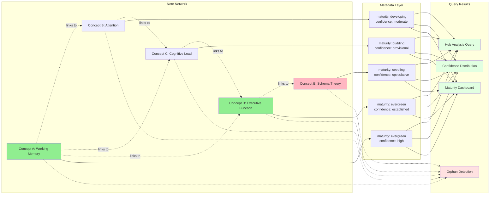

# Permanent Note System Architecture

---
tags: #system-architecture #visual-guide #mermaid-diagram
aliases: [System Diagram, Architecture Overview]
---

> [!abstract] Overview
> Visual representation of the complete permanent note system, showing how Templater, Dataview, Meta Bind, and Tasks plugins interact to create an intelligent knowledge management ecosystem.

## 🏗️ System Architecture Diagram

## 📊 Data Flow: Note Creation

## 🔄 Data Flow: Review Completion

## 🎯 Data Flow: Status Progression

## 🧠 Knowledge Graph Interaction

## 🔗 Plugin Interaction Matrix

## 📈 Review System State Machine

## 🎓 Learning Pathways

---

## 🔍 Component Responsibility Map

| Component | Primary Responsibility | Writes To | Reads From |
|-----------|----------------------|-----------|------------|
| **Templater** | Initial note creation, structure generation | Frontmatter, Body content | User input prompts |
| **Meta Bind** | Interactive metadata editing | Frontmatter fields | Frontmatter fields |
| **Dataview** | Query and display metadata | None (read-only) | Frontmatter, File system |
| **Tasks** | Review task management | Task state, Task metadata | Task definitions, Due dates |
| **Frontmatter** | Metadata storage | File YAML header | N/A (storage layer) |

---

## 🚀 Future Architecture Extensions

### Planned Enhancement: AI Integration

### Planned Enhancement: Collaborative Features

---

**Architecture Version**: 1.0  
**Last Updated**: 2024-11-21  
**System Status**: Production-Ready