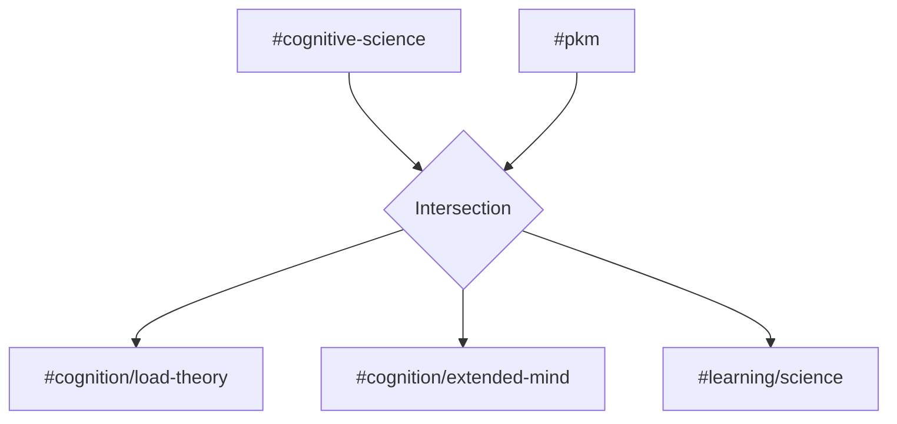

---
aliases:
  - Tag System Design
  - Hierarchical Tagging Framework
  - PKB Tag Architecture
  - Cognitive Science Tag System
  - Taxonomic Classification System
---

### CLAUDE 4.5 SONNET COMPREHENSIVE REFERENCE NOTE GENERATOR
---

aliases: [Tag System Design, Hierarchical Tagging Framework, PKB Tag Architecture, Cognitive Science Tag System, Taxonomic Classification System]
---

> [!comprehensive-reference] 📚Comprehensive-Reference
> - **Generated**:: 2024-11-22
> - **Version**:: 1.0
> - **Type**:: Reference Documentation (Tag Taxonomy)
> - **Scope**:: Hierarchical tag systems for Cognitive Science and PKB/PKM domains

> [!abstract]
> **Executive Overview**
> This reference note provides a comprehensive, hierarchical [[Tag Taxonomy]] for organizing knowledge in [[Cognitive Science]] and [[03-notes/01_permanent-notes/02_personal-knowledge-base/Personal Knowledge Management]] domains within an [[obsidian]] vault. The taxonomy follows multi-level abstraction principles, enabling both broad categorization and granular specificity while maintaining semantic clarity and discoverability.

> [!how-to-use-this]
> **Navigation Guide**
> This taxonomy is organized into two primary domain sections, each containing multiple hierarchical levels from high-level domains down to specific topics. Use the tag levels progressively: start with top-level domain tags, then add mid-level specialization tags, and finally granular topic tags as needed. The cross-domain integration section shows how tags can bridge both domains for interdisciplinary notes.

---

## 📑 Table of Contents

1. [[#🧠 Cognitive Science Tag Taxonomy]]
2. [[#🗂️ PKB/PKM Tag Taxonomy]]
3. [[#🔄 Cross-Domain Integration Tags]]
4. [[#📐 Tag Usage Guidelines & Best Practices]]
5. [[#🔗 Related Topics for PKB Expansion]]

---

## 🧠 Cognitive Science Tag Taxonomy

> [!definition]
> **Hierarchical Tag Structure**
> - **Level 1 (L1)**: Broad domain categories (e.g., `#cognitive-science`)
> - **Level 2 (L2)**: Major subdisciplines (e.g., `#cognitive-psychology`)
> - **Level 3 (L3)**: Specialized topics (e.g., `#working-memory`)
> - **Level 4 (L4)**: Granular concepts (e.g., `#phonological-loop`)
> - **Cross-cutting**: Methodological or application tags (e.g., `#empirical-research`, `#applied-cognition`)

### Level 1: Top-Level Domain Tags

> [!core-principle]
> **Domain Anchor Tags**
> These represent the highest abstraction level—use ONE per note to establish primary domain affiliation.

```
#cognitive-science          [Master domain tag]
#neuroscience              [When brain/neural focus is primary]
#behavioral-science        [When behavior analysis is primary]
#learning-science          [When learning mechanisms are primary]
```

### Level 2: Major Subdisciplines

> [!methodology-and-sources]
> **Subdiscipline Classification**
> These tags represent established academic subdisciplines. Use 1-2 per note to indicate specialized focus areas.

**Theoretical Foundations**
```
#cognitive-psychology      [Mental processes, information processing]
#cognitive-neuroscience    [Brain-cognition relationships]
#cognitive-linguistics     [Language and cognition intersection]
#cognitive-development     [Developmental trajectories of cognition]
#cognitive-anthropology    [Cultural cognition studies]
```


**Applied Domains**
```
#educational-psychology    [Learning in educational contexts]
#instructional-design      [Systematic learning design]
#human-factors            [Cognition in system design]
#decision-science         [Choice and judgment processes]
#cognitive-ergonomics     [Cognitive work design]
```

**Methodological Approaches**
```
#experimental-psychology   [Experimental methods in cognition]
#computational-modeling    [Mathematical/computational approaches]
#neuroimaging             [Brain imaging methodologies]
#psychometrics            [Measurement of cognitive constructs]
```

### Level 3: Core Cognitive Systems & Processes

> [!key-claim]
> **Cognitive Architecture Tags**
> These tags map to established cognitive systems and processes. They form the core vocabulary for tagging cognitive concepts.

**Memory Systems**
```
#memory-systems           [General memory tag]
#working-memory           [Short-term active processing]
#long-term-memory         [Consolidated knowledge storage]
#episodic-memory          [Personal experiences/events]
#semantic-memory          [Conceptual knowledge]
#procedural-memory        [Skills and procedures]
#prospective-memory       [Remembering to perform actions]
#autobiographical-memory  [Personal life history]
```

**Attention & Perception**
```
#attention               [General attentional processes]
#selective-attention     [Focus filtering]
#divided-attention       [Multi-tasking capacity]
#sustained-attention     [Vigilance over time]
#perception              [Sensory interpretation]
#visual-perception       [Vision-specific processing]
#auditory-perception     [Hearing-specific processing]
#multimodal-integration  [Cross-sensory processing]
```

**Executive Functions**
```
#executive-function      [General executive control tag]
#inhibitory-control      [Response inhibition]
#cognitive-flexibility   [Mental set-shifting]
#planning                [Goal-oriented organizing]
#task-switching          [Context shifting]
#self-regulation         [Behavioral/cognitive control]
#error-monitoring        [Performance supervision]
```

**Language & Communication**
```
#language-processing     [General language tag]
#phonology              [Sound systems]
#syntax                 [Grammatical structure]
#semantics              [Meaning representation]
#pragmatics             [Contextual language use]
#reading                [Written comprehension]
#speech-production      [Verbal output]
#bilingualism           [Multiple language systems]
```

**Reasoning & Problem-Solving**
```
#reasoning              [General reasoning tag]
#deductive-reasoning    [Logical inference]
#inductive-reasoning    [Pattern generalization]
#abductive-reasoning    [Inference to best explanation]
#problem-solving        [Goal-directed thinking]
#creative-thinking      [Novel solution generation]
#critical-thinking      [Evaluative analysis]
#analogical-reasoning   [Similarity-based inference]
```

**Learning & Knowledge Acquisition**
```
#learning-processes     [General learning tag]
#skill-acquisition      [Procedural learning]
#conceptual-learning    [Knowledge construction]
#implicit-learning      [Unconscious acquisition]
#explicit-learning      [Conscious acquisition]
#transfer-of-learning   [Generalization across contexts]
#expertise-development  [Skill mastery progression]
```

### Level 4.0: Granular Concepts & Mechanisms

> [!helpful-tip]
> **Granular Tags for Deep Dives**
> Use these when creating atomic notes on specific mechanisms or phenomena. They provide maximum specificity for knowledge graph precision.

**Memory Mechanisms**
```
#encoding               [Information intake processes]
#consolidation          [Memory stabilization]
#retrieval              [Memory access]
#reconsolidation        [Memory updating]
#interference           [Memory competition]
#phonological-loop      [Verbal working memory]
#visuospatial-sketchpad [Visual working memory]
#central-executive      [Working memory control]
```

**Attentional Mechanisms**
```
#bottom-up-attention    [Stimulus-driven capture]
#top-down-attention     [Goal-driven control]
#attentional-blink      [Temporal attention limitation]
#change-blindness       [Failed change detection]
#inattentional-blindness [Awareness failures]
```

**Cognitive Control**
```
#conflict-monitoring    [Response competition detection]
#performance-monitoring [Error detection systems]
#cognitive-control      [Executive regulation]
#response-inhibition    [Prepotent response suppression]
```

**Learning Phenomena**
```
#spacing-effect         [Distributed practice benefit]
#testing-effect         [Retrieval practice benefit]
#generation-effect      [Self-generation advantage]
#desirable-difficulties [Beneficial learning challenges]
#interleaving           [Mixed practice benefits]
#elaborative-encoding   [Deep processing strategy]
```

### Level 4.1: Theoretical Frameworks & Models

> [!core-principle]
> **Theory Tags**
> Tag theoretical frameworks separately to distinguish empirical findings from explanatory models.

**Information Processing Models**
```
#information-processing-theory
#dual-process-theory
#levels-of-processing
#spreading-activation
#parallel-distributed-processing
#symbolic-architecture
```

**Cognitive Architecture Theories**
```
#ACT-R                  [Adaptive Control of Thought-Rational]
#SOAR                   [State, Operator, And Result]
#global-workspace-theory
#multiple-drafts-model
```

**Cognitive Load & Resources**
```
#cognitive-load-theory
#working-memory-capacity
#cognitive-resources
#mental-effort
#intrinsic-load
#extraneous-load
#germane-load
```

**Metacognition & Self-Regulation**
```
#metacognition
#metamemory
#metacomprehension
#self-regulated-learning
#monitoring
#control-processes
#calibration
```

**Embodied & Situated Cognition**
```
#embodied-cognition
#situated-cognition
#grounded-cognition
#extended-cognition
#distributed-cognition
#enactive-cognition
```

### Cross-Cutting: Research & Application Tags

> [!methodology-and-sources]
> **Methodological & Application Tags**
> These tags cut across cognitive domains to indicate research approach or practical application context.

**Research Methodologies**
```
#empirical-research
#experimental-design
#cognitive-modeling
#neuroimaging-studies
#behavioral-experiments
#longitudinal-research
#cross-sectional-research
#meta-analysis
```

**Applied Contexts**
```
#applied-cognition
#cognitive-training
#cognitive-enhancement
#cognitive-rehabilitation
#educational-applications
#workplace-cognition
#technology-cognition
#clinical-cognition
```

**Special Populations**
```
#developmental-cognition
#aging-cognition
#cognitive-decline
#neurodevelopmental
#cognitive-disorders
#cross-cultural-cognition
```

---

## 🗂️ PKB/PKM Tag Taxonomy

> [!definition]
> **PKB/PKM Hierarchical Structure**
> - **Level 1 (L1)**: Domain identifier (e.g., `#pkm`)
> - **Level 2 (L2)**: System components (e.g., `#capture-system`, `#note-organization`)
> - **Level 3 (L3)**: Specific methodologies/tools (e.g., `#zettelkasten`, `#dataview`)
> - **Level 4 (L4)**: Granular techniques/features (e.g., `#progressive-summarization`, `#fleeting-notes`)
> - **Cross-cutting**: Workflow stages, content types, status indicators

### Level 1: Top-Level Domain Tags

```
#pkm                    [Personal Knowledge Management - master tag]
#pkb                    [Personal Knowledge Base - system architecture focus]
#knowledge-work         [Broader knowledge work practices]
#second-brain           [Digital extension of cognition]
#productivity-systems   [Task/project management integration]
```

### Level 2: System Architecture Components

> [!core-principle]
> **System Component Classification**
> These tags map to the major subsystems within a PKB. Use to indicate which aspect of the system a note addresses.

**Core PKB Infrastructure**
```
#vault-architecture     [Overall structural design]
#folder-hierarchy       [Directory organization]
#naming-conventions     [File naming systems]
#metadata-systems       [Frontmatter, tags, properties]
#linking-strategy       [Wiki-link practices]
#tag-taxonomy           [Tag organization systems - THIS NOTE]
```

**Knowledge Workflows**
```
#capture-system         [Information intake processes]
#processing-workflow    [Information refinement]
#organization-system    [Classification and filing]
#synthesis-workflow     [Knowledge integration]
#retrieval-system       [Information access]
#review-system          [Spaced review processes]
```

**Content Types & Structures**
```
#note-types             [Classification of note kinds]
#note-organization      [Note structuring approaches]
#knowledge-graph        [Graph-based knowledge representation]
#index-systems          [Navigation and discovery]
#dashboard-design       [Overview and monitoring]
```

### Level 3: Methodologies & Frameworks

> [!methodology-and-sources]
> **Established PKM Methodologies**
> These represent proven knowledge management frameworks. Tag notes that explain, implement, or reference these methods.

**Core PKM Methodologies**
```
#zettelkasten          [Slip-box method]
#PARA                  [Projects, Areas, Resources, Archives]
#GTD                   [Getting Things Done]
#building-second-brain [Tiago Forte's BASB method]
#evergreen-notes       [Andy Matuschak's approach]
#digital-garden        [Public, evolving knowledge]
```

**Note-Taking & Processing Frameworks**
```
#cornell-method        [Structured note-taking]
#outline-method        [Hierarchical organization]
#mind-mapping          [Visual association]
#concept-mapping       [Relationship diagramming]
#progressive-summarization [Layered highlighting/summarization]
```

**Knowledge Integration Approaches**
```
#atomic-notes          [Single-concept notes]
#moc-system            [Maps of Content]
#structure-notes       [Organizing hubs]
#hub-notes             [Connection centers]
#index-notes           [Curated collections]
```

### Level 3: Tool & Technology Tags

> [!helpful-tip]
> **Platform & Plugin Tags**
> Use these to indicate which tools/technologies a note discusses or requires. Useful for filtering implementation-specific content.

**Platform Tags**
```
#obsidian              [Obsidian-specific content]
#notion                [Notion-specific content]
#roam-research         [Roam-specific content]
#logseq                [Logseq-specific content]
#remnote               [RemNote-specific content]
#markdown              [Markdown formatting/usage]
```

**Obsidian Plugin Ecosystem**
```
#dataview              [Dataview plugin]
#templater             [Templater plugin]
#quickadd              [QuickAdd plugin]
#tasks-plugin          [Tasks plugin]
#smart-connections     [Smart Connections AI]
#excalidraw            [Drawing integration]
#breadcrumbs           [Hierarchies plugin]
#meta-bind             [Interactive metadata]
```

**Automation & Scripting**
```
#automation            [General automation]
#javascript            [JavaScript scripting]
#dataviewjs            [DataviewJS queries]
#templater-scripts     [Templater automation]
#quickadd-macros       [QuickAdd macro creation]
```

**Integration & Interoperability**
```
#api-integration       [External API usage]
#export-import         [Data migration]
#sync-systems          [Cross-device sync]
#backup-systems        [Data preservation]
#version-control       [Git/versioning]
```

### Level 4: Granular Techniques & Features

> [!key-claim]
> **Granular Implementation Tags**
> These provide maximum specificity for technical how-to notes and implementation guides.

**Note Creation & Templates**
```
#note-templates        [Template design]
#frontmatter-design    [YAML metadata structure]
#template-automation   [Dynamic template generation]
#quick-capture         [Rapid note creation]
#daily-notes           [Daily note practices]
#meeting-notes         [Meeting capture]
```

**Linking & Connection**
```
#wiki-links            [Internal linking]
#backlinks             [Reverse link utilization]
#unlinked-mentions     [Potential connections]
#link-density          [Linking strategies]
#bidirectional-links   [Reciprocal connections]
#transclusion          [Embedded content]
```

**Organization & Classification**
```
#tag-strategy          [Tagging approaches]
#folder-strategy       [Directory usage]
#file-naming           [Naming patterns]
#metadata-schema       [Structured properties]
#status-tracking       [Note lifecycle states]
```

**Search & Retrieval**
```
#search-operators      [Advanced search techniques]
#dataview-queries      [Query construction]
#graph-analysis        [Graph view usage]
#semantic-search       [Meaning-based search]
#filter-strategies     [Result refinement]
```

**Review & Maintenance**
```
#spaced-repetition     [SRS integration]
#progressive-review    [Layered review cycles]
#link-maintenance      [Broken link repair]
#tag-cleanup           [Tag rationalization]
#orphan-notes          [Unconnected note management]
```

### Level 2-3: Cognitive & Learning Integration

> [!core-principle]
> **Learning Science in PKM**
> Tags bridging cognitive science and knowledge management practices.

**Learning Strategies**
```
#active-recall         [Retrieval practice in PKM]
#elaborative-interrogation [Deep questioning]
#self-explanation      [Explanatory note-taking]
#interleaved-practice  [Mixed topic review]
#concrete-examples     [Illustration strategy]
```

**Cognitive Optimization**
```
#cognitive-load-management [Reducing mental overhead]
#attention-management  [Focus techniques]
#memory-enhancement    [Encoding/retrieval optimization]
#metacognitive-monitoring [Self-awareness practices]
```

### Cross-Cutting: Workflow & Status Tags

> [!methodology-and-sources]
> **Process & Lifecycle Tags**
> These tags indicate workflow stage or note maturity. Use for filtering and dashboard creation.

**Workflow Stages**
```
#capture               [Initial intake]
#process               [Refinement stage]
#synthesize            [Integration stage]
#publish               [Sharing/output]
#archive               [Long-term storage]
```

**Note Lifecycle Status**
```
#seedling              [Early-stage note]
#budding               [Developing note]
#evergreen             [Mature, stable note]
#in-progress           [Active development]
#needs-review          [Requires attention]
#needs-links           [Connection needed]
#stub                  [Placeholder]
```

**Priority & Focus**
```
#high-priority         [Important work]
#active-project        [Current focus]
#long-term-project     [Ongoing effort]
#someday-maybe         [Future consideration]
#reference             [Stable reference material]
```

**Content Classification**
```
#atomic-concept        [Single-concept note]
#reference-note        [Comprehensive resource]
#literature-note       [Source material summary]
#permanent-note        [Synthesized knowledge]
#fleeting-note         [Quick capture]
#project-note          [Project-specific]
#moc                   [Map of Content]
```

---

## 🔄 Cross-Domain Integration Tags

> [!key-claim]
> **Bridging Cognitive Science and PKM**
> These tags are specifically designed for notes that integrate cognitive science principles with PKM practice—a core competency for evidence-based knowledge work.

### Applied Cognitive Science in PKM

```
#cognitive-pkm          [Cognition applied to PKM design]
#evidence-based-pkm     [Research-informed practices]
#learning-optimization  [Cognitive enhancement through PKM]
#memory-systems-design  [PKM aligned with memory research]
#attention-architecture [PKM for focus management]
```

### Specific Integration Areas

**Memory Enhancement**
```
#spaced-review-system   [SRS + memory research]
#retrieval-practice-pkm [Testing effect in notes]
#encoding-strategies    [Effective note-taking from cognition]
#consolidation-workflow [Memory stabilization in PKM]
```

**Cognitive Load Management**
```
#extraneous-load-reduction [Simplifying PKM interfaces]
#germane-load-optimization [Productive cognitive effort]
#working-memory-support    [External memory augmentation]
```

**Metacognition & Self-Regulation**
```
#metacognitive-pkm      [Self-monitoring in knowledge work]
#learning-analytics     [Tracking knowledge growth]
#reflection-systems     [Structured self-reflection]
#calibration-practices  [Accuracy monitoring]
```

**Educational Psychology Applications**
```
#instructional-design-pkm [Teaching self through notes]
#andragogy-pkm            [Adult learning in PKM]
#self-directed-learning   [Autonomous knowledge work]
#expertise-development    [Skill mastery through PKM]
```

---

## 📐 Tag Usage Guidelines & Best Practices

> [!methodology-and-sources]
> **Tag Application Principles**
> Effective tagging requires strategic selection. More tags ≠ better organization. Each tag should serve a discoverable purpose.

### Optimal Tag Density

> [!helpful-tip]
> **Tag Count Recommendations**
> - **Simple notes**: 3-5 tags (domain + 1-2 specific)
> - **Reference notes**: 5-8 tags (domain + subdiscipline + topics)
> - **Integration notes**: 6-10 tags (multiple domains + cross-cutting)
> - **Avoid**: More than 10 tags (indicates lack of focus or over-classification)

### Hierarchical Tagging Strategy

> [!core-principle]
> **Progressive Specificity**
> Always include hierarchical progression: start broad, get specific only when needed.

**Pattern: General → Specific**
```markdown
# Example 1: Memory Research Note
#cognitive-science          [L1: Domain]
#cognitive-psychology       [L2: Subdiscipline]
#memory-systems             [L3: Core system]
#working-memory             [L3: Specific system]
#phonological-loop          [L4: Mechanism]
#empirical-research         [Cross-cutting: Method]
```

```markdown
# Example 2: PKM Implementation Note
#pkm                        [L1: Domain]
#capture-system             [L2: Component]
#quickadd                   [L3: Tool]
#quickadd-macros            [L4: Technique]
#automation                 [Cross-cutting: Feature]
#in-progress                [Cross-cutting: Status]
```

### Tag Combination Patterns

> [!example]
> **Common Tag Combinations**

**Cognitive Science Theory Note:**
```
#cognitive-science
#cognitive-load-theory
#working-memory-capacity
#instructional-design
#reference-note
```

**Applied PKM Technique:**
```
#pkm
#obsidian
#dataview
#dataview-queries
#automation
#in-progress
```

**Integration Note (Cog Sci + PKM):**
```
#cognitive-pkm
#spaced-review-system
#memory-systems-design
#obsidian
#tasks-plugin
#evidence-based-pkm
#reference-note
```

### Search & Query Optimization

> [!methodology-and-sources]
> **Dataview Query Examples**
> Leverage hierarchical tags in Dataview queries for powerful filtering.

**Find all cognitive science notes on memory:**
```dataview
LIST
FROM #cognitive-science 
WHERE contains(tags, "memory")
SORT file.mtime DESC
```

**Find PKM implementation notes in progress:**
```dataview
TABLE status, tags
FROM #pkm 
WHERE contains(tags, "in-progress")
SORT file.ctime DESC
```

**Find integration notes between cognition and PKM:**
```dataview
LIST
WHERE contains(tags, "cognitive-pkm") 
   OR (contains(tags, "cognitive-science") 
       AND contains(tags, "pkm"))
```

### Tag Maintenance Practices

> [!warning]
> **Common Tag Problems**
> - **Tag proliferation**: Creating too many similar tags (e.g., #memory, #memory-systems, #memories)
> - **Inconsistent casing**: #CognitiveScience vs. #cognitive-science
> - **Typos**: #cogntive-science
> - **Orphan tags**: Tags used once and never again
> - **Semantic overlap**: Multiple tags meaning same thing

**Maintenance Checklist:**
- [ ] Review tag usage quarterly with Dataview query
- [ ] Consolidate synonymous tags
- [ ] Retire unused tags (< 3 notes)
- [ ] Standardize tag casing and formatting
- [ ] Document tag taxonomy updates in this note
- [ ] Use Tag Wrangler plugin for batch edits

### Tag vs. Folder Decision Framework

> [!helpful-tip]
> **When to Use Tags vs. Folders**

**Use Folders When:**
- Clear hierarchical containment (e.g., all daily notes)
- Mutually exclusive categories (note can only be in one place)
- File system organization matters (exports, backups)

**Use Tags When:**
- Multiple categorizations needed (note fits many contexts)
- Cross-cutting concerns (methodology, status, content type)
- Discovery and querying are priorities
- Flexibility to reclassify is important

**Use Both When:**
- Folder = structural location (where it lives)
- Tags = semantic classification (what it means)

Example:
```
Location: 03_permanent-notes/cognitive-science/
Tags: #cognitive-science #working-memory #cognitive-load-theory #reference-note
```

---

## 🎯 Implementation Roadmap

> [!methodology-and-sources]
> **Adopting This Taxonomy**

### Phase 1: Foundation (Week 1)
1. **Audit existing tags**: Run Dataview query to list all current tags
2. **Map to hierarchy**: Classify existing tags using this taxonomy
3. **Identify gaps**: Note which areas lack tags
4. **Document decisions**: Create tag decision log

### Phase 2: Standardization (Weeks 2-3)
1. **Batch rename**: Use Tag Wrangler to consolidate synonyms
2. **Apply hierarchy**: Add L1/L2 tags to notes missing them
3. **Remove orphans**: Delete single-use tags
4. **Update templates**: Embed new tag patterns in note templates

### Phase 3: Integration (Week 4+)
1. **Create tag queries**: Build Dataview dashboards by tag category
2. **Refine over time**: Adjust taxonomy based on usage patterns
3. **Document evolution**: Track changes in version history
4. **Train habits**: Consistently apply taxonomy to new notes

---

## 🔗 Related Topics for PKB Expansion

1. **[[Dataview Queries for Tag-Based Discovery]]**
   - *Connection*: This taxonomy becomes far more powerful when paired with sophisticated Dataview queries that leverage hierarchical tag structure
   - *Depth Potential*: Advanced query patterns for filtering by tag combinations, tag density analysis, orphan tag detection, semantic tag search, and automated tag suggestion systems
   - *Knowledge Graph Role*: Bridges tag taxonomy theory with practical implementation, making this system actionable in daily PKM workflows

2. **[[Cognitive Load Theory Applied to Tag Design]]**
   - *Connection*: The hierarchical structure of this taxonomy directly implements cognitive load principles—minimizing extraneous load through clear organization while supporting germane load through meaningful categorization
   - *Depth Potential*: Analysis of how tag complexity affects working memory, optimal tag density for retrieval, tag naming conventions for recognition vs. recall, and visual tag design for reduced cognitive friction
   - *Knowledge Graph Role*: Provides theoretical justification for why this taxonomy structure works, connecting abstract cognitive science to practical PKM implementation

3. **[[Cross-Domain Knowledge Integration Strategies]]**
   - *Connection*: The cross-domain integration tags represent explicit mechanisms for connecting Cognitive Science and PKM—a meta-practice of knowledge integration itself
   - *Depth Potential*: Frameworks for identifying integration opportunities, techniques for synthesizing across domains, progressive abstraction methods, and emergent property recognition in cross-disciplinary notes
   - *Knowledge Graph Role*: Elevates tag usage from classification tool to knowledge synthesis mechanism, enabling discovery of non-obvious connections between cognitive principles and PKM practices

4. **[[Tag-Based Spaced Repetition Systems]]**
   - *Connection*: Tags indicating note maturity (#seedling, #budding, #evergreen) and lifecycle status can drive automated review schedules aligned with spaced repetition research
   - *Depth Potential*: Implementation of tag-driven review queues, progressive interval spacing based on tag status, integration with Tasks plugin for scheduled reviews, and learning analytics derived from tag-based review patterns
   - *Knowledge Graph Role*: Transforms static tags into dynamic learning tools, creating a feedback loop between note development and memory consolidation—a practical application of both cognitive science and PKM principles

---

## 📊 Metadata & Attribution

> [!methodology-and-sources]
> **Development Methodology**
> - **Approach**: Systematic domain analysis combining established academic subdisciplines (Cognitive Science) with practitioner-validated methodologies (PKM/PKB)
> - **Cognitive Science Structure**: Based on standard cognitive psychology textbook organization (e.g., Goldstein's "Cognitive Psychology"), augmented with contemporary research areas
> - **PKM Structure**: Synthesized from Zettelkasten principles, PARA methodology, Obsidian ecosystem documentation, and Building a Second Brain framework
> - **Integration Layer**: Original synthesis connecting cognitive principles to PKM design decisions
> - **Confidence Level**: 🟢 HIGH for established subdisciplines and methodologies; 🟡 MEDIUM for emerging cross-domain integration areas

## 🔄 Version History

| Version | Date | Changes |
|---------|------|---------|
| 1.0 | 2024-11-22 | Initial comprehensive taxonomy covering Cognitive Science (L1-L4) and PKB/PKM (L1-L4) domains with cross-domain integration tags and usage guidelines |

---

> [!helpful-tip]
> **Living Document**
> This taxonomy should evolve with your vault. As you develop expertise in new cognitive domains or adopt new PKM methodologies, extend the appropriate hierarchical branches. Document all changes in the version history to maintain a clear evolution record.


```
<thinking>
This is a request for comprehensive tag taxonomy development for two major domains: Cognitive Science and PKB/PKM (Personal Knowledge Base/Personal Knowledge Management). The user needs hierarchical organization covering multiple angles and levels of abstraction.

**Request Classification:**
- Type: comprehensive_note (tag taxonomy reference)
- Scope: reference (permanent resource)
- Research Required: NO (this is taxonomic design based on domain knowledge)
- Note Type: Reference Note (requires metadata header)

**Structural Planning:**

Information Architecture:
1. Introduction to tag taxonomy principles
2. Cognitive Science Taxonomy (hierarchical)
   - Top-level domains
   - Mid-level specializations
   - Granular topic tags
   - Methodological tags
   - Application tags
3. PKB/PKM Taxonomy (hierarchical)
   - System architecture tags
   - Methodology tags
   - Tool/technology tags
   - Workflow tags
   - Content type tags
4. Cross-domain integration tags
5. Usage guidelines and best practices

Wiki-Link Opportunities:
- [[Tag Taxonomy]]
- [[Hierarchical Classification]]
- [[Cognitive Science]]
- [[Personal Knowledge Management]]
- [[Obsidian Tag System]]
- [[Information Architecture]]
- [[Metacognition]]
- [[Knowledge Graph]]
- [[Zettelkasten]]
- [[PARA Method]]
- [[GTD]]
- [[Spaced Repetition]]
- [[Active Recall]]
- [[Working Memory]]
- [[Executive Function]]
- [[Cognitive Load Theory]]
- [[Self-Regulated Learning]]
- Multiple more based on specific cognitive and PKM concepts

Callout Strategy:
- [!definition] for key taxonomic principles
- [!core-principle] for organizational philosophy
- [!methodology-and-sources] for usage guidelines
- [!helpful-tip] for practical application
- [!warning] for common mistakes
- [!example] for concrete tag usage scenarios
- [!quick-reference] for tag lookup tables

Metadata Planning:
Tags: #pkm #cognitive-science #tag-taxonomy #information-architecture #reference-note
Aliases: [Tag System Design, Hierarchical Tagging Framework, PKB Tag Architecture, Cognitive Science Tag System]
</thinking>
```

### GEMINI PRO 3.0 EXPERT PKB ARCHITECT

-----

```yaml
---
tags: #pkm/taxonomy #information-architecture #cognitive-science #ontology
aliases: [Tag Taxonomy, PKB Ontology, Cognitive Science Tags, Knowledge Organization]
---
```

# 🗂️ High-Level Tag Taxonomy: Cognitive Science & PKM

> [!abstract] System Philosophy
> This taxonomy utilizes a **Nested Tagging Strategy** (e.g., `#parent/child/grandchild`). This aligns with [[obsidian]]'s native search and graph grouping capabilities.
>
>   * **Top-Level Tags (L1):** Broad Domains (The "Containers")
>   * **Mid-Level Tags (L2):** Specific Disciplines or Processes (The "Category")
>   * **Low-Level Tags (L3):** Atomic Concepts or Specific Contexts (The "Instance")

-----

## 🧠 Domain 1: Cognitive Science (`#cog-sci`)

Cognitive science is interdisciplinary. To avoid a cluttered graph, we must organize tags by **Functional Process** (how the mind works) and **Disciplinary Lens** (who is studying it).

### The Hierarchy

#### 1\. The Architecture of Mind (Process-Based)

These tags categorize notes based on *what function* the brain/mind is performing.

  * **`#cog-sci/perception`**: For sensory processing, signal detection theory, and phenomenology.
      * *Use for:* [[Visual Cortex]], [[Auditory Processing]], [[Proprioception]].
  * **`#cog-sci/memory`**: The storage and retrieval mechanisms.
      * *Use for:* [[Long-Term Potentiation]], [[Working Memory]], [[03-notes/01_permanent-notes/01_cognitive-development/Spaced Repetition]].
  * **`#cog-sci/attention`**: The allocation of cognitive resources.
      * *Use for:* [[Selective Attention]], [[Flow State]], [[Attentional Blink]].
  * **`#cog-sci/learning`**: The acquisition of knowledge and skills.
      * *Use for:* [[Hebbian Learning]], [[Operant Conditioning]], [[Constructivism]].
  * **`#cog-sci/decision-making`**: Evaluation, judgment, and choice.
      * *Use for:* [[Heuristics]], [[Bias]], [[Game Theory]].
  * **`#cog-sci/emotion`**: Affective neuroscience and psychological states.
      * *Use for:* [[Emotional Intelligence]], [[Amygdala Hijack]], [[Valence]].

#### 2\. The Disciplinary Lens (Field-Based)

These tags categorize notes based on the *academic tradition* or *methodology*.

  * **`#cog-sci/neuroscience`**: Biological and physical substrates.
      * *Sub-tags:* `#cog-sci/neuroscience/anatomy`, `#cog-sci/neuroscience/plasticity`.
  * **`#cog-sci/psychology`**: Behavioral and mental analysis.
      * *Sub-tags:* `#cog-sci/psychology/behavioral`, `#cog-sci/psychology/developmental`.
  * **`#cog-sci/linguistics`**: Language processing and structure.
      * *Sub-tags:* `#cog-sci/linguistics/semantics`, `#cog-sci/linguistics/syntax`.
  * **`#cog-sci/philosophy`**: Epistemology and philosophy of mind.
      * *Sub-tags:* `#cog-sci/philosophy/mind`, `#cog-sci/philosophy/ethics`.
  * **`#cog-sci/ai`**: Computational modeling of mind (Artificial Intelligence).
      * *Sub-tags:* `#cog-sci/ai/neural-networks`, `#cog-sci/ai/agi`.

> [!example] Tagging an Atomic Note
> **Note Title:** [[The Hippocampus and Spatial Navigation]]
> **Tags:** `#cog-sci/neuroscience/anatomy` `#cog-sci/memory/spatial`

-----

## ⚙️ Domain 2: PKB & PKM (`#pkm`)

For Personal Knowledge Management, we distinguish between the **Methodology** (the theory) and the **Workflow** (the action).

### The Hierarchy

#### 1\. The Workflow Lifecycle (Action-Based)

These tags track the state of information as it moves through your system.

  * **`#pkm/capture`**: Ingesting information (Inbox phase).
      * *Use for:* Quick capture ideas, raw highlights.
  * **`#pkm/process`**: Refining and atomizing information.
      * *Use for:* Turning highlights into [[Atomic Notes]], progressive summarization.
  * **`#pkm/connect`**: Linking and gardening.
      * *Use for:* Building MOCs, reviewing orphans.
  * **`#pkm/synthesis`**: Creating new outputs.
      * *Use for:* Writing essays, project deliverables, content creation.
  * **`#pkm/maintenance`**: System hygiene.
      * *Use for:* Reviewing plugins, reorganizing folders, deprecating tags.

#### 2\. Methodologies & Frameworks (Theory-Based)

  * **`#pkm/zettelkasten`**: Notes related to the "Slip-box" method.
      * *Sub-tags:* `#pkm/zettelkasten/structure`, `#pkm/zettelkasten/principles`.
  * **`#pkm/para`**: Tiago Forte’s Projects, Areas, Resources, Archives.
  * **`#pkm/lyt`**: Nick Milo’s Linking Your Thinking (Maps of Content).
  * **`#pkm/metacognition`**: Thinking about thinking (The overlap with CogSci).

#### 3\. Note Archetypes (Type-Based)

> [!helpful-tip]
> Some users prefer a root tag `#type/` for this, but keeping it under `#pkm/` keeps the domain tight. Choose what fits your brain.

  * **`#pkm/type/atomic`**: Single concept, declarative knowledge.
  * **`#pkm/type/source`**: Reference material (books, videos, papers).
  * **`#pkm/type/moc`**: Map of Content (Hubs).
  * **`#pkm/type/daily`**: Journaling and logging.
  * **`#pkm/type/definition`**: Pure terminology.

-----

## 🔗 The "Bridge" Tags (Intersection)

The most powerful area of your vault is where CogSci explains *why* PKM works. These tags bridge the two domains.



### Critical Intersection Concepts

  * **`#cognitive-load`**: Managing the volume of information (PKM) based on brain limits (CogSci).
  * **`#extended-mind`**: The philosophy that your PKB is an actual extension of your biological brain (Clark & Chalmers).
  * **`#active-recall`**: A learning mechanism applied through note retrieval strategies.

-----

## 🛠️ Implementation Strategy

> [!methodology-and-sources] How to Apply This Taxonomy
>
> 1.  **Don't Retag Everything:** Start using these tags for *new* notes only.
> 2.  **Use Tag Wrangler:** If you have the **Tag Wrangler** plugin installed in Obsidian, you can rename your existing messy tags to these nested versions in batch.
> 3.  **Graph Groups:** Go to your Graph View settings -\> Groups. Assign colors to your L1 tags:
>       * `tag:#cog-sci` = 🔵 Blue (Theory/Science)
>       * `tag:#pkm` = 🟢 Green (Action/System)
> 4.  **Folder Independence:** Remember, these tags allow you to abandon rigid folder structures. A note can be located anywhere but found instantly via `#cog-sci/memory`.

-----

## 🔗 Related Topics for PKB Expansion

1.  **[[Taxonomy vs. Folksonomy]]**

      * *Connection:* Understanding the difference between rigid hierarchy (Taxonomy) and organic tagging (Folksonomy).
      * *Depth Potential:* High. Crucial for long-term vault health.
      * *Knowledge Graph Role:* Theoretical foundation for information architecture.

2.  **[[The Extended Mind Thesis]]**

      * *Connection:* The philosophical backbone of why we build PKBs.
      * *Depth Potential:* Very High. Connects Philosophy, AI, and PKM.
      * *Knowledge Graph Role:* A bridge note connecting `#cog-sci/philosophy` and `#pkm`.

3.  **[[Cognitive Load Theory]]**

      * *Connection:* Explains why "Collector's Fallacy" happens and how to design atomic notes.
      * *Depth Potential:* Moderate. Practical application of neuroscience.
      * *Knowledge Graph Role:* Links `#cog-sci/attention` with `#pkm/process`.

4.  **[[Graph View Topology]]**

      * *Connection:* How to visualize these tags using Obsidian's graph.
      * *Depth Potential:* Technical/Structural.
      * *Knowledge Graph Role:* A technical guide for vault analysis.

Would you like me to dive deeper into the **Intersection Concepts** (like [[The Extended Mind Thesis]]) to help you write the foundational notes that connect these two domains?


Here is a comprehensive, hierarchically structured tag taxonomy designed for **Cognitive Science** and **Personal Knowledge Management (PKM)**.

I have designed this using **Nested Tags** (e.g., `#parent/child`). This is the most robust way to handle taxonomies in Obsidian, as it allows you to filter by the broad category (Parent) or the specific niche (Child) using the tag pane or [[dataview]] queries.

-----

### 🧩 Reference Note: Domain Taxonomy Expansion

```yaml
---
tags: #pkm #taxonomy-design #cognitive-science #reference-note
aliases: [Tag Hierarchy, Knowledge Classification, Vault Taxonomy]
created: 2025-11-22
---
```

> [\!abstract]
> **Taxonomy Strategy**
> This document provides a "Top-Down" classification system. It moves from **Domain** (High-level field) $\to$ **Sub-discipline** (Specific branch) $\to$ **Function** (Action/Process).
>
>   * **Usage**: Use the highest level necessary. Do not over-tag.
>   * **Syntax**: Represented here as `#domain/sub-category`.

-----

## 🧠 Domain A: Cognitive Science

*The study of mind, intelligence, and mental processes.*

This hierarchy covers the biological "hardware," the psychological "software," and the computational models used to understand them.

### 1\. The Biological Substrate (Hardware)

*Focus: The physical mechanisms of the brain.*

  * **`#neuroscience`**: The broad study of the nervous system.
      * **`#neuroscience/neuroplasticity`**: Brain's ability to reorganize/change.
      * **`#neuroscience/anatomy`**: Brain structure (Hippocampus, Prefrontal Cortex).
      * **`#neuroscience/neurochemistry`**: Neurotransmitters (Dopamine, Serotonin).
  * **`#evolutionary-psych`**: How evolution shaped current cognitive structures.

### 2\. Mental Processes (Software/Operating System)

*Focus: The functions the brain performs.*

  * **`#cognition`**: General mental action/process.
      * **`#cognition/memory`**: Encoding, storage, retrieval.
          * *Related*: [[03-notes/01_permanent-notes/01_cognitive-development/Spaced Repetition]], [[Active Recall]].
      * **`#cognition/attention`**: Focus, flow states, distraction.
      * **`#cognition/perception`**: How we interpret sensory data.
      * **`#cognition/metacognition`**: Thinking about thinking (monitoring one's own learning).
  * **`#decision-making`**: Heuristics, biases, and choice architecture.
      * **`#decision-making/biases`**: Cognitive errors (Confirmation Bias, Sunk Cost).
      * **`#decision-making/models`**: Frameworks for making choices (Probabilistic thinking).

### 3\. Learning & Development (Application)

*Focus: How information is acquired and utilized.*

  * **`#learning-science`**: The scientific study of learning.
      * **`#learning-science/acquisition`**: Initial grasping of concepts.
      * **`#learning-science/retention`**: Long-term storage.
      * **`#learning-science/transfer`**: Applying knowledge to new contexts.
  * **`#psychology/developmental`**: Cognitive changes across the lifespan.

### 4\. Abstract & Computational (Theory)

*Focus: Modeling the mind.*

  * **`#philosophy-of-mind`**: Consciousness, qualia, dualism vs. monism.
      * **`#philosophy-of-mind/consciousness`**: The "hard problem" of subjective experience.
  * **`#artificial-intelligence`**: Computational modeling of cognitive processes.
      * **`#ai/neural-networks`**: Systems inspired by biological brains.
      * **`#ai/alignment`**: Aligning AI goals with human cognitive values.

-----

## 🗄️ Domain B: PKM (Personal Knowledge Management)

*The art and science of capturing, organizing, and creating value from information.*

This hierarchy is organized by **Workflow Stage** and **System Architecture**.

### 1\. The Workflow (Lifecycle of a Note)

*Focus: The movement of information through your system.*

  * **`#pkm/capture`**: Ingesting information (Inbox, fleeting notes).
  * **`#pkm/process`**: The act of distilling and refining.
      * **`#pkm/process/distillation`**: Summarizing, highlighting.
      * **`#pkm/process/connection`**: Linking, bridging concepts.
  * **`#pkm/synthesis`**: Combining ideas to create new insight.
  * **`#pkm/output`**: The final product (Writing, Content Creation).

### 2\. The Architecture (Note Types & Structure)

*Focus: The building blocks of the vault.*

  * **`#pkm/structure`**: Organizational structural notes.
      * **`#pkm/structure/moc`**: Maps of Content / Hubs.
      * **`#pkm/structure/index`**: Linear lists or tables of contents.
      * **`#pkm/structure/dashboard`**: High-level navigational spaces.
  * **`#pkm/note-type`**: Classification of the note itself.
      * **`#note-type/fleeting`**: Temporary, raw thoughts.
      * **`#note-type/literature`**: Notes on external sources (books, articles).
      * **`#note-type/atomic`**: Single-concept, permanent notes.
      * **`#note-type/evergreen`**: Mature notes that are constantly updated.

### 3\. Methodology & Philosophy (Frameworks)

*Focus: The "Why" and "How" rules.*

  * **`#pkm/methodology`**: Specific named systems.
      * **`#methodology/zettelkasten`**: Luhmann’s slip-box method.
      * **`#methodology/para`**: Tiago Forte’s Projects/Areas/Resources/Archives.
      * **`#methodology/ace`**: Nick Milo's Atlas/Calendar/Effort.
  * **`#pkm/philosophy`**: Guiding principles.
      * **`#pkm/philosophy/digital-minimalism`**: Reducing friction/clutter.
      * **`#pkm/philosophy/thinking-tools`**: Using the vault to extend cognition.

-----

## 🔗 The Intersection: Where CogSci Meets PKM

These tags represent the overlap—using cognitive science principles *within* your PKM workflows. These are powerful for "Synthesis Notes."

> [\!insight]
> **The Extended Mind Thesis**
> Using PKM tools effectively is an application of the **Extended Mind Thesis**—the idea that our cognition extends beyond our biological brain into our tools (notebooks, Obsidian).

  * **`#cognitive-scaffolding`**: Using note structures to support higher-level thinking.
  * **`#external-cognition`**: Offloading mental processing to the vault.
  * **`#cognitive-load-management`**: Designing notes to reduce overwhelm.
  * **`#attention-economy`**: Curating inputs to protect focus.

-----

## 🛠️ Implementation Guide

### How to use this in Frontmatter

When creating a new note, select **one** primary hierarchy and **one** descriptive tag.

**Example 1: A note about "The Forgetting Curve"**

```yaml
---
tags: #cognition/memory #learning-science #retention
aliases: [Ebbinghaus Forgetting Curve, Memory Decay]
---
```

**Example 2: A Map of Content for your "Writing" folder**

```yaml
---
tags: #pkm/structure/moc #pkm/output #writing
aliases: [Writing Hub, Content Dashboard]
---
```

### 🔍 Self-Critique & Optimization

> [\!tip]
> **Avoid "Collector's Fallacy"**
> Do not create tags just to have them. Only add a tag to your system if you plan to **query** it later (e.g., "Show me all notes about `#neuroscience/neuroplasticity`"). If you will never search for it, the tag is noise.

-----

## 🚀 Recommended Next Step

Would you like me to generate a **Dataview query** that utilizes these new nested tags to create a dynamic dashboard for your "Cognitive Science" or "PKM" studies?