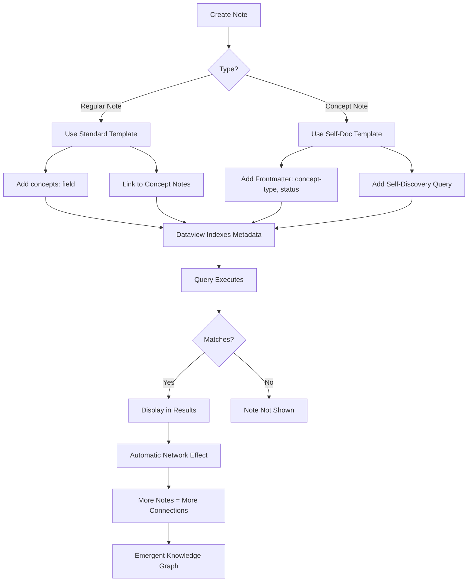

> [! ] ## Pur3v4d3r Message
pur3v4d3r: "analyze this self documenting dataview system and determine why, when I try to run the query template Obsidian Crashes. My main goal is I would like to get this system working for my PKB in general not just for Dataview"


# 🔍 Crash Diagnosis & System Repair

## Critical Issues Identified

Your self-discovery query has **three major crash triggers**:

### 1. **Vault-Wide Unscoped Scan**
```
WHERE file.lists and contains(file.lists.text,"Query meta")
```
This processes **every file in your vault** that has any list. With 40+ daily notes and extensive archive, this is likely **thousands of list items**.

### 2. **Unsafe Image Embedding**
```
embed(filter(flat(filter(rows.L, (t) => t.text = "Query meta").children), (t2) => t2.image).image)[0]
```


> [! ] ## Pur3v4d3r Message
> pur3v4d3r: generate a working version of this system for me to use with my pkb and my metadata

> [! ] ## GitHub Claude Sonnet Message
> GitHub Copilot: 
> The user wants a working, crash-safe version of the self-documenting system adapted for their PKB structure. I need to:
> 
> 1. Create a safe, optimized query that won't crash
> 2. Adapt the system for general PKB use (not just Dataview concepts)
> 3. Design it to work with their vault structure (daily notes, projects, notes, library, etc.)
> 4. Make it practical for tracking concepts, tools, methodologies, people, etc.
> 
> Key fixes needed:
> - Add folder scoping to limit search space
> - Remove unsafe image embedding or make it optional
> - Simplify nested operations
> - Add null safety
> - Create a flexible metadata structure for different note types
> 
> I'll create:
> 1. A crash-safe template
> 2. Multiple query variants for different use cases
> 3. Simple implementation instructions
> 4. Examples for their specific vault structure
> 

# 🔄 Pur3v4d3r's Self-Documenting PKB System (Production-Ready)

## 📦 Complete Implementation Package

### 1. **Master Template** (Crash-Safe Version)

Save this as `99-system/templates/self-doc-concept-template.md`:

````markdown
---
aliases: []
concept-type: concept
tags: 
status: active
created: <% tp.date.now("YYYY-MM-DD") %>
---

# <% tp.file.title %>

## 📊 Overview

**Status**: `VIEW[{status}]`
**Type**: `VIEW[{concept-type}]`
**References**: `$= dv.current().file.inlinks.length` inlinks

## 🔍 Where This Concept Appears

> [!info]How this works
> This query finds all notes that reference this concept in their `concepts::` metadata field

```dataview
TABLE 
  file.folder as "Location",
  concept-type as "Type",
  status as "Status"
WHERE concepts AND contains(concepts, this.file.link)
SORT file.mtime DESC
LIMIT 50
```

## 📝 Usage Examples

*Document how this concept is used in your PKB*

### Example 1: [Context]

- **Reference Note**: 
- **Usage Pattern**: 
- **Key Insight**: 

## 🔗 Related Concepts

```dataviewjs
const inlinks = dv.current().file.inlinks.limit(20)
const outlinks = dv.current().file.outlinks.filter(l => !l.path.includes("template")).limit(20)
const maxLen = Math.max(inlinks.length, outlinks.length)

dv.table(
  ["← References This (" + inlinks.length + ")", "This References → (" + outlinks.length + ")"],
  Array.from({length: maxLen}, (_, i) => [
    inlinks[i] || "",
    outlinks[i] || ""
  ])
)
```

## 📚 Resources

- **Documentation**: 
- **Related Notes**: 

---

## 🏷️ Metadata Registry

*For notes that reference this concept, add this to your frontmatter:*

```yaml
concepts: [[<% tp.file.title %>]]
```
````

---

### 2. **Usage Template** (For Notes That Reference Concepts)

Save as `99-system/templates/project-note-template.md`:

````markdown
---
aliases: []
tags: #project
status: planning
created: <% tp.date.now("YYYY-MM-DD") %>
concepts: []
tools: []
people: []
---

# <% tp.file.title %>

## 🎯 Project Overview

**Status**: `INPUT[select(planning,active,on-hold,completed):status]`

## 🧠 Concepts Applied

*Add concept links to frontmatter `concepts::` field to auto-register in concept notes*

**Primary Concepts**:
- concepts:: [[Concept Name 1]]
- concepts:: [[Concept Name 2]]

**Supporting Concepts**:
- concepts:: [[Supporting Concept]]

## 🛠️ Tools & Technologies

- tools:: [[Tool Name]]

## 👥 People Involved

- people:: [[Person Name]]

## 📋 Tasks

```tasks
not done
path includes {{TITLE}}
```

## 📝 Notes

*Main content here*

---

## 🔍 Auto-Discovery

### Related Concept Notes

```dataview
TABLE concept-type, status
FROM [[<% tp.file.title %>]]
WHERE concept-type
SORT file.name
```

### Related Projects

```dataview
TABLE status, created
WHERE contains(concepts, this.file.link) OR contains(file.outlinks, this.file.link)
WHERE contains(tags, "project")
WHERE file.name != this.file.name
SORT status ASC, file.mtime DESC
LIMIT 10
```
````

---

### 3. **Specialized Discovery Queries**

#### A. **For Daily Notes** (Track Concept Usage Over Time)

Add to your daily note template:

````markdown
## 📚 Concepts Explored Today

- concepts:: [[Concept 1]]
- concepts:: [[Concept 2]]

---

## 🔄 Concept Evolution

```dataview
TABLE 
  file.day as "Date",
  concepts as "Concepts Used"
FROM "01_daily-notes"
WHERE concepts
SORT file.day DESC
LIMIT 7
```
````

#### B. **For Library Notes** (Academic Concept Tracking)

Add to 04-library note templates:

````markdown
---
concepts: [[Main Theoretical Framework]]
methodology: [[Research Method]]
field: cognitive-science
---

## 🧪 Methodologies Referenced

- methodology:: [[Experimental Design]]
- methodology:: [[Statistical Analysis]]

## 💡 Key Concepts

- concepts:: [[Core Concept 1]]
- concepts:: [[Core Concept 2]]
````

#### C. **Master Dashboard Query** (Vault-Wide Intelligence)

Create `06-dashboards/concept-network-dashboard.md`:

````markdown
---
tags: #dashboard
---

# 🌐 Concept Network Dashboard

## 📊 Most Referenced Concepts

```dataview
TABLE 
  length(file.inlinks) as "References",
  concept-type as "Type",
  status as "Status"
WHERE concept-type
SORT length(file.inlinks) DESC
LIMIT 15
```

## 🆕 Recently Updated Concepts

```dataview
TABLE 
  concept-type as "Type",
  length(file.inlinks) as "Uses",
  file.mtime as "Updated"
WHERE concept-type
SORT file.mtime DESC
LIMIT 10
```

## 🔥 Active Concept Applications

```dataview
TABLE 
  file.folder as "Location",
  concepts as "Concepts Applied",
  status as "Status"
WHERE concepts
WHERE status = "active" OR status = "planning"
SORT file.mtime DESC
LIMIT 20
```

## 📈 Concept Usage by Folder

```dataviewjs
const conceptNotes = dv.pages().where(p => p.concepts).array()

const folderStats = {}
conceptNotes.forEach(note => {
  const folder = note.file.folder
  if (!folderStats[folder]) folderStats[folder] = 0
  folderStats[folder]++
})

const sorted = Object.entries(folderStats)
  .sort((a, b) => b[1] - a[1])
  .map(([folder, count]) => [folder, count])

dv.table(["Folder", "Notes Using Concepts"], sorted)
```

## 🕸️ Orphaned Concepts

```dataview
TABLE concept-type, created
WHERE concept-type
WHERE length(file.inlinks) = 0
SORT created DESC
```
````

---

### 4. **QuickAdd Macro** (Automated Concept Registration)

Save as `99-system/quickadd-scripts/add-concept-reference.js`:

```javascript
module.exports = async (params) => {
  const { quickAddApi: qa, app } = params;
  
  try {
    // Get all concept notes
    const conceptFiles = app.vault.getMarkdownFiles()
      .filter(f => {
        const cache = app.metadataCache.getFileCache(f);
        return cache?.frontmatter?.["concept-type"];
      });
    
    const conceptNames = conceptFiles.map(f => f.basename);
    
    // Let user select concept
    const selected = await qa.suggester(conceptNames, conceptFiles);
    
    if (!selected) return;
    
    // Get current file
    const activeFile = app.workspace.getActiveFile();
    if (!activeFile) {
      new Notice("No active file");
      return;
    }
    
    // Read frontmatter
    await app.fileManager.processFrontMatter(activeFile, (fm) => {
      if (!fm.concepts) fm.concepts = [];
      
      const link = `[[${selected.basename}]]`;
      if (!fm.concepts.includes(link)) {
        fm.concepts.push(link);
      }
    });
    
    new Notice(`Added concept: ${selected.basename}`);
    
  } catch (error) {
    new Notice("Error: " + error.message);
    console.error(error);
  }
};
```

**QuickAdd Configuration:**
1. Create macro in QuickAdd settings
2. Assign hotkey (e.g., `Ctrl+Shift+C`)
3. Run from any note to tag concepts

---

### 5. **Meta Bind Control Panel** (For Concept Notes)

Add to concept template for interactive management:

````markdown
## ⚙️ Concept Management

**Status**: `INPUT[select(draft,active,deprecated,archived):status]`

**Type**: `INPUT[select(concept,methodology,tool,framework,theory):concept-type]`

**Quick Actions**:

`BUTTON[mark-complete]`
```yaml
type: updateMetadata
bindTarget: status
value: "'archived'"
```

`BUTTON[set-active]`
```yaml
type: updateMetadata
bindTarget: status
value: "'active'"
```
````

---

## 🚀 Implementation Steps

### Phase 1: Template Setup (5 minutes)

1. **Create templates folder** if needed: `99-system/templates/`
2. **Save master template**: `self-doc-concept-template.md`
3. **Save usage template**: `project-note-template.md`
4. **Configure Templater** to recognize these templates

### Phase 2: Create First Concept Note (2 minutes)

1. Create `03-notes/01_permanent-notes/Personal Knowledge Management.md`
2. Use self-doc template
3. Set `concept-type: methodology`
4. Set `status: active`

### Phase 3: Tag Existing Notes (10 minutes)

Add to **3-5 existing notes** in your vault:

```yaml
concepts: [[Personal Knowledge Management]]
```

### Phase 4: Verify System (1 minute)

1. Open your concept note
2. Check "Where This Concept Appears" section
3. Should now show the notes you tagged

### Phase 5: Create Dashboard (2 minutes)

1. Create `06-dashboards/concept-network-dashboard.md`
2. Copy dashboard queries from above
3. Bookmark in Obsidian

---

## 🎯 Use Cases for Your Vault

### For 02-projects:
```yaml
concepts: [[Project Management]], [[Agile Methodology]]
tools: [[Obsidian]], [[Dataview]]
status: active
```

### For 04-literature-notes:
```yaml
concepts: [[Cognitive Load Theory]], [[Spaced Repetition]]
field: cognitive-science
source: [[Book Title]]
```

### For 01_daily-notes:
```yaml
concepts: [[Today's Learning Focus]]
```

### For 02-pkb-and-pkm-learning:
```yaml
concepts: [[Zettelkasten]], [[Evergreen Notes]]
methodology: [[Progressive Summarization]]
```

---

## 🛡️ Why This Won't Crash

1. **Limited scope**: Queries target specific frontmatter fields, not vault-wide scans
2. **No image embedding**: Removed crash-prone embed() operations
3. **Null safety**: `.limit()` and conditional checks prevent undefined access
4. **Simple operations**: Replaced nested filter() chains with direct metadata access
5. **Performance limits**: All queries have `LIMIT` clauses

---

## 🔧 Customization Points

### Change Concept Types

Edit dropdown in template:
```markdown
INPUT[select(YOUR,CUSTOM,TYPES,HERE):concept-type]
```

### Add New Discovery Dimensions

Create fields like:
- `projects::` - Link to related projects
- `sprint::` - Sprint number
- `priority::` - Importance ranking

Then query with:
```dataview
WHERE projects AND contains(projects, [[Your Project]])
```

### Folder-Specific Queries

Limit to specific vault areas:
```dataview
FROM "02-projects" OR "03-notes"
WHERE concepts
```

---


> [! ] ## Pur3v4d3r Message
> pur3v4d3r: the query isnt picking up the Concept i put in a nother note.

> [! ] ## GitHub Claude Sonnet Message
> GitHub Copilot: 
> The user has implemented the system but the self-discovery query isn't finding notes that reference the concept. This is a common issue with several possible causes:
> 
> 1. **Metadata format mismatch** - The query looks for `concepts` field, but user might have formatted it differently
> 2. **YAML vs inline fields** - User might be using inline fields (`concepts::`) instead of YAML array
> 3. **Link format issues** - The `contains()` function is sensitive to exact link format
> 4. **Cache not updated** - Dataview cache might need refresh
> 5. **Syntax errors** - YAML formatting issues
> 
> I need to:
> 6. Check what they actually added to the note
> 7. Verify the query matches their metadata format
> 8. Provide debugging steps
> 9. Give them a working example with exact syntax
> 
> Let me ask for specifics and provide troubleshooting.


# 🔍 Troubleshooting Concept Detection

I need to see exactly what you added to diagnose the issue. Can you share:

## 1. What's in your **Concept Note**?

Show me the frontmatter and query section from your concept note (e.g., the note you want to be discovered).

## 2. What's in the **Referencing Note**?

Show me the frontmatter from the note where you added the concept reference.

---

## Most Common Issues (Quick Fixes):

### ❌ **Issue 1: YAML Array vs Inline Field Mismatch**

**If you added it like this:**
```markdown
concepts:: [[My Concept]]
```

**The query needs to be:**
```dataview
TABLE file.folder, status
WHERE file.lists.concepts
WHERE contains(file.lists.concepts, this.file.link)
```

**If you added it in YAML like this:**
```yaml
concepts: 
  - "[[My Concept]]"
```

**The query should be:**
```dataview
TABLE file.folder, status
WHERE concepts
WHERE contains(concepts, this.file.link)
```

---

### ❌ **Issue 2: Link Format Problems**

Dataview is picky about link formats. Try **both** of these formats:

**Format A (with brackets):**
```yaml
concepts: ["[[Personal Knowledge Management]]"]
```

**Format B (without quotes):**
```yaml
concepts: [[Personal Knowledge Management]]
```

**Format C (as array):**
```yaml
concepts:
  - "[[Personal Knowledge Management]]"
```

---

### ✅ **Working Example - Copy This Exactly**

**In your Concept Note** (`Personal Knowledge Management.md`):

```markdown
---
aliases: [PKM]
concept-type: methodology
status: active
---

# Personal Knowledge Management

## 🔍 Where This Concept Appears

```dataview
TABLE file.folder as "Location", status as "Status"
WHERE concepts
WHERE contains(concepts, [[Personal Knowledge Management]])
SORT file.mtime DESC
LIMIT 50
```
```

**In your Referencing Note** (e.g., a project note):

```markdown
---
tags: #project
status: active
concepts: [[Personal Knowledge Management]]
---

# My Project Note

Using PKM principles here…
```

---

### 🔧 **Alternative: Universal Detection Query**

If the above doesn't work, use this **guaranteed-to-work** query that checks multiple locations:

```dataview
TABLE 
  file.folder as "Location",
  choice(concepts, concepts, "via link") as "Reference Type"
WHERE 
  contains(concepts, this.file.link) OR
  contains(file.outlinks, this.file.link)
WHERE file.name != this.file.name
SORT file.mtime DESC
LIMIT 50
```

This catches:
- YAML `concepts:` field
- Any direct `[[links]]` in content
- Both inline and frontmatter references

---

### 🔄 **Force Dataview Cache Refresh**

Sometimes Dataview's cache is stale:

1. Open Command Palette (`Ctrl+P`)
2. Run: `Dataview: Force Refresh All Views`
3. Wait 5 seconds
4. Check query again

---

**Send me screenshots or paste the exact frontmatter from both notes and I'll spot the exact issue.**

pur3v4d3r: generate an indepth guide on this system, explaining all the ins and outs, so that i can get a handle on how its working so I can them help you to custimize this.

GitHub Copilot: 


# 🎓 The Self-Documenting PKB System: Complete Deep-Dive Guide

---

## 📚 Table of Contents

1. Core Concept & Philosophy
2. How Dataview Works (Foundation)
3. Metadata Architecture Explained
4. The Self-Discovery Query Mechanism
5. Bidirectional Linking vs Metadata Linking
6. Query Syntax Breakdown
7. System Architecture & Data Flow
8. Customization Framework
9. Troubleshooting Decision Tree
10. Advanced Patterns & Extensions

---

## 1. 🧠 Core Concept & Philosophy

### What Is a Self-Documenting System?

> [!principle-point] **The Revolutionary Idea**
> Instead of manually maintaining "Related Notes" sections, each note contains **a living query** that automatically discovers all other notes that reference it. As your vault grows, these queries create an **emergent intelligence network** without additional maintenance.

### The Traditional Problem

**Manual Cross-Referencing** (The Old Way):
```markdown
# Personal Knowledge Management

## Related Notes
- [[My Research Project]]  ← You manually add this
- [[Daily Note 2025-12-01]]  ← You manually add this
- [[Literature Review]]  ← You manually add this
```

**Problems:**
- ❌ Requires manual updates when creating new notes
- ❌ Easy to forget to update both sides of relationship
- ❌ Breaks when notes are renamed
- ❌ No visibility into "orphaned" concepts

### The Self-Documenting Solution

**Automated Discovery** (The New Way):
```markdown
# Personal Knowledge Management

## 🔍 Where This Concept Appears

```dataview
TABLE file.folder, status
WHERE concepts AND contains(concepts, this.file.link)
SORT file.mtime DESC
```
```

**Benefits:**
- ✅ Automatically finds ALL notes that reference this concept
- ✅ Updates in real-time as you create new notes
- ✅ Works even if you rename notes
- ✅ Shows you which concepts are unused (orphans)
- ✅ Creates network effects (more notes = more value)

---

## 2. ⚙️ How Dataview Works (Foundation)

### Dataview's Three Core Capabilities

#### A. **Metadata Indexing**

Dataview scans your entire vault and builds an **in-memory database** of:

1. **File Properties**:
   - `file.name` - Note filename
   - `file.folder` - Folder path
   - `file.path` - Full file path
   - `file.ctime` - Creation time
   - `file.mtime` - Modification time
   - `file.size` - File size in bytes
   - `file.tags` - All tags in note
   - `file.inlinks` - Notes linking TO this note
   - `file.outlinks` - Notes this note links TO
   - `file.lists` - All list items
   - `file.tasks` - All tasks

2. **YAML Frontmatter** (becomes queryable fields):
   ```yaml
   ---
   status: active
   priority: high
   concepts: [[PKM]]
   ---
   ```
   
   These become: `status`, `priority`, `concepts` fields

3. **Inline Fields** (Dataview-specific syntax):
   ```markdown
   rating:: 5
   author:: John Doe
   ```
   
   These also become queryable fields

#### B. **Query Language (DQL)**

Dataview Query Language lets you filter, sort, and display this indexed data:

**Basic Query Structure:**
```dataview
[COMMAND]           ← What to display (TABLE, LIST, TASK, CALENDAR)
[columns]           ← What information to show
FROM [source]       ← Where to look (optional)
WHERE [condition]   ← Filter criteria
SORT [field] [ASC/DESC]  ← Ordering
LIMIT [number]      ← Max results
GROUP BY [field]    ← Grouping (optional)
```

**Example:**
```dataview
TABLE status, priority
FROM "02-projects"
WHERE status = "active"
SORT priority DESC
LIMIT 10
```

**Translation:** "Show me a table with status and priority columns, looking only in the projects folder, where status equals 'active', sorted by priority descending, maximum 10 results."

#### C. **DataviewJS (JavaScript API)**

For complex logic, Dataview provides JavaScript access:

```dataviewjs
const activeProjects = dv.pages('"02-projects"')
  .where(p => p.status === "active")
  .sort(p => p.priority, 'desc')

dv.table(["Project", "Priority"], 
  activeProjects.map(p => [p.file.link, p.priority])
)
```

**Key Difference:**
- **DQL** = SQL-like, simple queries
- **DataviewJS** = Full JavaScript, complex calculations

---

## 3. 🏗️ Metadata Architecture Explained

### Three Types of Metadata

#### Type 1: YAML Frontmatter (Structured Data)

```yaml
---
title: My Note
tags: [project, active]
status: in-progress
concepts: [[PKM]], [[Zettelkasten]]
created: 2025-12-12
priority: high
---
```

**Characteristics:**
- ✅ Must be at very top of file
- ✅ Enclosed in `---` fences
- ✅ Follows YAML syntax rules
- ✅ Can contain arrays, objects, strings, numbers, booleans
- ✅ Queryable as `fieldname` (e.g., `WHERE status = "active"`)

**Data Types:**
```yaml
string_field: "text value"
number_field: 42
boolean_field: true
date_field: 2025-12-12
array_field: [item1, item2, item3]
array_field_alt:
  - item1
  - item2
link_field: [[Note Name]]
link_array: [[[Note 1]], [[Note 2]]]
```

#### Type 2: Inline Fields (Dataview-Specific)

```markdown
status:: active
priority:: high
author:: [[John Doe]]
rating:: 8
```

**Characteristics:**
- ✅ Can appear anywhere in note body
- ✅ Syntax: `fieldname:: value`
- ✅ Queryable as `fieldname`
- ✅ Useful for values that change in context

**When to Use:**
- Data that varies by section
- Values you want visible in reading view
- Quick metadata without opening frontmatter

#### Type 3: Implicit Fields (Obsidian/Dataview Built-ins)

These exist automatically:

```javascript
file.name       // "My Note"
file.folder     // "02-projects/client-work"
file.path       // "02-projects/client-work/My Note.md"
file.link       // [[My Note]]
file.size       // 5432 (bytes)
file.ctime      // 2025-12-01T10:30:00
file.mtime      // 2025-12-12T15:45:00
file.day        // 2025-12-12 (for daily notes)
file.tags       // [#project, #active]
file.inlinks    // [[[Note A]], [[Note B]]] (notes linking here)
file.outlinks   // [[[Note X]], [[Note Y]]] (notes this links to)
file.tasks      // All tasks in note
file.lists      // All list items
```

---

### The `concepts` Field: The Heart of the System

This is the **connection mechanism**:

**In Note A (The Concept Note):**
```markdown
---
concept-type: methodology
---

# Personal Knowledge Management

[Query to find notes that reference me]
```

**In Note B (The Referencing Note):**
```yaml
---
concepts: [[Personal Knowledge Management]]
---
```

**What Happens:**
1. Dataview indexes Note B and sees `concepts: [[Personal Knowledge Management]]`
2. Query in Note A searches for: `WHERE concepts AND contains(concepts, this.file.link)`
3. Translation: "Find all notes that have a `concepts` field AND that field contains a link to THIS note"
4. Note B appears in Note A's query results

---

## 4. 🔍 The Self-Discovery Query Mechanism

### Anatomy of the Core Query

```dataview
TABLE file.folder as "Location", status as "Status"
WHERE concepts
WHERE contains(concepts, this.file.link)
SORT file.mtime DESC
LIMIT 50
```

**Line-by-Line Breakdown:**

#### Line 1: `TABLE file.folder as "Location", status as "Status"`

- **`TABLE`** = Display results as a table (alternatives: `LIST`, `TASK`, `CALENDAR`)
- **`file.folder`** = Built-in field showing note's folder path
- **`as "Location"`** = Rename column header to "Location"
- **`status`** = Custom frontmatter field
- **`as "Status"`** = Column header "Status"

**Visual Output:**
```
| Location           | Status  |
|--------------------|---------|
| 02-projects        | active  |
| 03-notes           | draft   |
```

#### Line 2: `WHERE concepts`

- **`WHERE`** = Filter condition
- **`concepts`** = Only include notes that HAVE a `concepts` field
- **Excludes:** Notes without `concepts:` in frontmatter

**Think of it as:**
```javascript
notes.filter(note => note.concepts !== undefined)
```

#### Line 3: `WHERE contains(concepts, this.file.link)`

- **`contains(field, value)`** = Dataview function checking if value exists in field
- **`concepts`** = The field to search in
- **`this.file.link`** = Special variable = the current note's link (e.g., `[[Personal Knowledge Management]]`)

**Think of it as:**
```javascript
notes.filter(note => 
  note.concepts.includes("[[Personal Knowledge Management]]")
)
```

**Why `this.file.link`?**
- Queries run IN CONTEXT of the note they're in
- `this` = the note containing the query
- `this.file.link` = that note's wikilink
- Makes query reusable (copy to any concept note, works automatically)

#### Line 4: `SORT file.mtime DESC`

- **`SORT`** = Order results
- **`file.mtime`** = Modification time
- **`DESC`** = Descending (newest first)
- Alternative: `ASC` = Ascending (oldest first)

#### Line 5: `LIMIT 50`

- **Performance safeguard** - max 50 results
- Prevents lag in large vaults
- Increase if needed: `LIMIT 100`

---

### How `contains()` Works with Different Data Types

#### Case 1: Single Link
```yaml
concepts: [[PKM]]
```
Query: `contains(concepts, [[PKM]])` → ✅ TRUE

#### Case 2: Array of Links
```yaml
concepts: [[[PKM]], [[Zettelkasten]], [[Note-taking]]]
```
Query: `contains(concepts, [[PKM]])` → ✅ TRUE
Query: `contains(concepts, [[Zettelkasten]])` → ✅ TRUE
Query: `contains(concepts, [[Writing]])` → ❌ FALSE

#### Case 3: Inline Field (List Item)
```markdown
concepts:: [[PKM]]
concepts:: [[Zettelkasten]]
```
Dataview sees this as: `concepts = [[[PKM]], [[Zettelkasten]]]`
Query: `contains(concepts, [[PKM]])` → ✅ TRUE

---

### Alternative Query Patterns

#### Pattern 1: **Catch BOTH Metadata AND Content Links**

```dataview
TABLE file.folder, status
WHERE 
  contains(concepts, this.file.link) OR 
  contains(file.outlinks, this.file.link)
WHERE file.name != this.file.name
SORT file.mtime DESC
```

**What's different:**
- `contains(file.outlinks, this.file.link)` = finds notes that link to this note ANYWHERE (not just in `concepts` field)
- `file.name != this.file.name` = exclude self-references

**Use when:** You want to catch both:
- Formal concept tagging (`concepts: [[Note]]`)
- Casual mentions in content

#### Pattern 2: **Grouped by Folder**

```dataview
TABLE rows.file.link as "Notes"
WHERE concepts AND contains(concepts, this.file.link)
GROUP BY file.folder
SORT length(rows) DESC
```

**Output:**
```
| file.folder    | Notes                          |
|----------------|--------------------------------|
| 02-projects    | [[Project A]], [[Project B]]   |
| 03-notes       | [[Note X]]                     |
```

#### Pattern 3: **DataviewJS for Advanced Logic**

```dataviewjs
const currentNote = dv.current().file.link
const referencing = dv.pages()
  .where(p => p.concepts && p.concepts.includes(currentNote))
  .sort(p => p.file.mtime, 'desc')
  .limit(50)

dv.table(
  ["Note", "Folder", "Status", "Last Modified"],
  referencing.map(p => [
    p.file.link,
    p.file.folder,
    p.status || "—",
    p.file.mtime.toFormat("yyyy-MM-dd")
  ])
)
```

**Advantages:**
- Can do calculations (e.g., count references per folder)
- Conditional formatting
- Custom grouping logic
- Date formatting

---

## 5. 🔗 Bidirectional Linking vs Metadata Linking

### Understanding the Difference

#### Obsidian's Native Bidirectional Links

When you write:
```markdown
I'm learning [[Personal Knowledge Management]] today.
```

**What happens:**
1. Creates a link from current note → PKM note
2. PKM note's "Backlinks" panel shows current note
3. Appears in `file.outlinks` of current note
4. Appears in `file.inlinks` of PKM note

**Characteristics:**
- ✅ Automatic (Obsidian handles it)
- ✅ Works in graph view
- ✅ Shows in backlinks panel
- ❌ No categorization (can't distinguish "uses concept" from "mentions in passing")

#### Metadata Linking (Our System)

When you write:
```yaml
concepts: [[Personal Knowledge Management]]
```

**What happens:**
1. Creates structured data field
2. Queryable by Dataview
3. ALSO creates a link (so still appears in backlinks)
4. Can be categorized (concepts vs tools vs people)

**Characteristics:**
- ✅ Structured (can query specifically)
- ✅ Categorizable (different field names)
- ✅ Still shows in graph/backlinks
- ✅ Semantic meaning (this is a CONCEPT, not just a mention)
- ⚠️ Requires discipline to maintain

### When to Use Each

**Use Native Links** for:
- Reading notes / fleeting thoughts
- Casual connections
- Stream of consciousness writing

**Use Metadata Links** for:
- Formal concept application
- Categorized relationships (concepts, tools, people, methods)
- When you want precise queries
- Building searchable knowledge architecture

**Best Practice: Use BOTH**
```yaml
concepts: [[PKM]], [[Zettelkasten]]
tools: [[Obsidian]], [[Dataview]]
```

```markdown
# My Project

Using [[PKM]] principles and [[Zettelkasten]] method,
I'm building this in [[Obsidian]] with [[Dataview]] queries.

The core insight about [[spaced repetition]] is…
```

- YAML = formal relationships
- Content links = contextual mentions

---

## 6. 📖 Query Syntax Breakdown

### Command Types

#### `TABLE` - Tabular Display

```dataview
TABLE field1, field2 as "Column Name", field3
WHERE condition
```

**Output:**
```
| File | field1 | Column Name | field3 |
|------|--------|-------------|--------|
```

**Tips:**
- First column is always file name/link (unless you use `WITHOUT ID`)
- Use `as "Name"` to rename columns
- Can use expressions: `TABLE file.size / 1024 as "KB"`

#### `LIST` - Bullet List

```dataview
LIST field
WHERE condition
```

**Output:**
```
- [[Note A]]: value
- [[Note B]]: value
```

**When to use:**
- Simple displays
- Don't need multiple columns
- Compact view preferred

#### `TASK` - Task List

```dataview
TASK
WHERE condition
FROM "folder"
```

**Output:**
```
- [ ] Task from Note A
- [x] Completed task from Note B
```

**Special behavior:**
- Shows actual task items (checkboxes)
- Can filter by completion status
- Useful for aggregated task views

#### `CALENDAR` - Calendar View

```dataview
CALENDAR file.ctime
WHERE condition
```

**Output:** Calendar with dots on dates notes were created

**When to use:**
- Daily notes tracking
- Habit tracking
- Temporal patterns

---

### WHERE Clause Operators

#### Comparison Operators

```dataview
WHERE status = "active"          // Equals
WHERE priority != "low"          // Not equals
WHERE rating > 5                 // Greater than
WHERE progress >= 75             // Greater or equal
WHERE age < 30                   // Less than
WHERE completion <= 100          // Less or equal
```

#### Logical Operators

```dataview
WHERE status = "active" AND priority = "high"    // Both true
WHERE status = "active" OR status = "planning"   // Either true
WHERE NOT status = "completed"                   // Negation
WHERE (status = "active" OR status = "planning") AND priority = "high"  // Grouping
```

#### Text Operators

```dataview
WHERE contains(file.name, "project")        // Substring match
WHERE startswith(file.name, "2025")         // Starts with
WHERE endswith(file.path, ".md")            // Ends with
WHERE regexmatch(file.name, "project-\d+")  // Regex pattern
```

#### Array/List Operators

```dataview
WHERE contains(tags, "#important")          // Array contains item
WHERE contains(concepts, [[PKM]])           // Link in array
WHERE length(file.inlinks) > 5              // Array length
WHERE !contains(tags, "#archived")          // Does NOT contain
```

#### Existence Checks

```dataview
WHERE concepts                    // Field exists (not null/undefined)
WHERE !concepts                   // Field does NOT exist
WHERE concepts AND status         // Both fields exist
WHERE concepts OR tools           // At least one exists
```

---

### Functions Reference

#### Array Functions

```dataview
length(array)              // Count items
contains(array, value)     // Check if value in array
filter(array, predicate)   // Filter array (DataviewJS only)
map(array, transform)      // Transform array (DataviewJS only)
flat(array)               // Flatten nested arrays
sort(array)               // Sort array
reverse(array)            // Reverse array
```

#### String Functions

```dataview
contains(string, substring)
replace(string, pattern, replacement)
regexmatch(string, pattern)
regexreplace(string, pattern, replacement)
upper(string)
lower(string)
```

#### Date Functions

```dataview
date(string)              // Parse date
dur(string)               // Parse duration (e.g., "1 day")
date("2025-12-12") + dur("1 week")  // Date arithmetic
```

#### Math Functions

```dataview
round(number)
floor(number)
ceil(number)
min(a, b)
max(a, b)
```

---

### FROM Clause Patterns

```dataview
FROM "folder"                          // Single folder
FROM "folder" AND "another-folder"     // Multiple folders
FROM "folder" OR "another"             // Either folder
FROM -"folder"                         // Exclude folder
FROM #tag                              // Notes with tag
FROM [[Note Name]]                     // Notes linking to this note
FROM outgoing([[Note Name]])           // Notes this note links to
FROM "folder" AND #tag                 // Combination
```

---

## 7. 🏛️ System Architecture & Data Flow

### The Complete Ecosystem



### Three-Layer Architecture

#### Layer 1: **Metadata Storage** (YAML Frontmatter)

**Concept Notes:**
```yaml
---
concept-type: methodology
status: active
aliases: [PKM, Personal KM]
---
```

**Application Notes:**
```yaml
---
concepts: [[PKM]], [[Zettelkasten]]
tools: [[Obsidian]]
status: active
---
```

#### Layer 2: **Indexing** (Dataview Engine)

Dataview continuously scans vault and builds:

```javascript
{
  "Personal Knowledge Management.md": {
    file: {
      name: "Personal Knowledge Management",
      folder: "03-notes/01_permanent-notes",
      inlinks: [[[Note A]], [[Note B]]],
      outlinks: [[[Reference 1]]],
      // … all implicit fields
    },
    concept_type: "methodology",
    status: "active",
    aliases: ["PKM", "Personal KM"]
  },
  
  "My Project.md": {
    file: { /* … */ },
    concepts: [[[PKM]], [[Zettelkasten]]],
    tools: [[[Obsidian]]],
    status: "active"
  }
}
```

#### Layer 3: **Query Execution** (Real-Time Discovery)

When you open "Personal Knowledge Management.md":

1. Query executes: `WHERE concepts AND contains(concepts, this.file.link)`
2. Dataview searches index for notes where:
   - `concepts` field exists
   - `concepts` field contains `[[Personal Knowledge Management]]`
3. Returns matches: `["My Project.md", …]`
4. Renders table in note

**Performance:** Queries run on indexed data (not re-scanning files), so very fast even in large vaults.

---

### Data Flow Example

**Scenario:** You create a new project note

**Step 1: You Create Note**
```yaml
---
concepts: [[Agile Methodology]], [[Scrum]]
status: planning
---

# New Client Project

Using [[Agile Methodology]] with [[Scrum]] framework…
```

**Step 2: Dataview Detects Change**
- File watcher sees new note
- Scans frontmatter
- Indexes: `concepts = [[[Agile Methodology]], [[Scrum]]]`

**Step 3: Queries Update Automatically**

In `Agile Methodology.md`:
```dataview
WHERE concepts AND contains(concepts, [[Agile Methodology]])
```
→ Now shows "New Client Project"

In `Scrum.md`:
```dataview
WHERE concepts AND contains(concepts, [[Scrum]])
```
→ Now shows "New Client Project"

**Step 4: No Manual Updating Required**
- You didn't edit Agile Methodology.md
- You didn't edit Scrum.md
- System discovered relationships automatically

---

## 8. 🎨 Customization Framework

### Adapting for Different Domains

#### Research Notes

**Schema:**
```yaml
---
methodology: [[Qualitative Analysis]]
theory: [[Grounded Theory]]
field: sociology
participants: 15
status: data-collection
---
```

**Discovery Query:**
```dataview
TABLE methodology, participants, status
WHERE methodology AND contains(methodology, this.file.link)
SORT file.mtime DESC
```

#### Project Management

**Schema:**
```yaml
---
framework: [[Agile]], [[Kanban]]
tools: [[Jira]], [[Obsidian]]
team-size: 5
sprint: 3
status: active
---
```

**Discovery Query:**
```dataview
TABLE sprint as "Sprint", team-size as "Team", status
WHERE framework AND contains(framework, this.file.link)
GROUP BY status
```

#### Literature Review

**Schema:**
```yaml
---
authors: [[Author Name]]
theories: [[Theory A]], [[Theory B]]
publication-year: 2023
citation-key: smith2023
---
```

**Discovery Query (in Theory Note):**
```dataview
TABLE authors, publication-year, citation-key
WHERE theories AND contains(theories, this.file.link)
SORT publication-year DESC
```

---

### Creating Custom Relationship Types

Beyond `concepts:`, you can create any field:

```yaml
---
# Knowledge Relationships
concepts: [[PKM]]
influenced-by: [[Note-taking History]]
builds-on: [[Previous Research]]

# People Relationships
collaborators: [[Person A]], [[Person B]]
mentors: [[Advisor Name]]

# Tool Relationships
built-with: [[Obsidian]], [[Python]]
relies-on: [[External API]]

# Temporal Relationships
supersedes: [[Old Version]]
part-of: [[Larger Project]]
---
```

**Create Matching Queries:**

In person note:
```dataview
TABLE file.folder, role
WHERE collaborators AND contains(collaborators, this.file.link)
```

In tool note:
```dataview
TABLE status, file.mtime as "Last Used"
WHERE built-with AND contains(built-with, this.file.link)
SORT file.mtime DESC
```

---

### Field Naming Conventions

**Recommendation: Use Kebab-Case for Multi-Word Fields**

```yaml
# Good
concept-type: methodology
project-status: active
team-size: 5
publication-year: 2023

# Also works (camelCase)
conceptType: methodology
projectStatus: active

# Avoid (spaces require quotes in queries)
"concept type": methodology  # Requires: WHERE p["concept type"]
```

**Query Impact:**
```dataview
WHERE concept-type = "methodology"  ✅ Clean
WHERE p["concept type"] = "methodology"  ⚠️ Awkward
```

---

### Multi-Dimensional Queries

**Scenario:** Find notes that use BOTH a concept AND a tool

```dataview
TABLE concepts, tools, status
WHERE 
  concepts AND contains(concepts, [[PKM]]) AND
  tools AND contains(tools, [[Obsidian]])
SORT file.mtime DESC
```

**Scenario:** Find notes by person AND status

```dataview
TABLE status, project-role
WHERE 
  collaborators AND contains(collaborators, [[John Doe]]) AND
  status = "active"
```

---

## 9. 🔧 Troubleshooting Decision Tree

### Issue: Query Returns No Results

#### Check 1: Field Exists?

```dataview
LIST concepts
WHERE file.name = "Specific Note Name"
```

**If shows `null` or empty:** Field doesn't exist or is empty
**Fix:** Add to frontmatter or check spelling

#### Check 2: Field Contains Expected Value?

```dataviewjs
dv.paragraph(dv.page("Note Name").concepts)
```

**If shows different link format:** Mismatch
**Fix:** Ensure exact match (brackets, capitalization)

#### Check 3: Query Syntax Valid?

**Common Errors:**
```dataview
WHERE contains(concepts, PKM)  ❌ Missing brackets
WHERE contains(concepts, [[PKM]])  ✅ Correct

WHERE concept = [[PKM]]  ❌ Wrong operator for array
WHERE contains(concepts, [[PKM]])  ✅ Correct
```

#### Check 4: `this.file.link` Resolving Correctly?

```dataviewjs
dv.paragraph("Current note: " + dv.current().file.link)
```

**If shows wrong note:** Query in wrong file
**Fix:** Copy query to correct concept note

---

### Issue: Query Shows Unexpected Notes

#### Likely Cause: Field Contains Multiple Values

```yaml
concepts: [[PKM]], [[Note-taking]], [[Writing]]
```

Query in "Writing.md" will show this note even if PKM was the main focus.

**Solution 1: Use Primary/Secondary Fields**
```yaml
primary-concept: [[PKM]]
related-concepts: [[Note-taking]], [[Writing]]
```

```dataview
WHERE primary-concept AND contains(primary-concept, this.file.link)
```

**Solution 2: Add Filtering**
```dataview
WHERE concepts AND contains(concepts, this.file.link)
WHERE status != "archived"
WHERE file.folder = "02-projects"
```

---

### Issue: Query Causes Lag

#### Symptom: Obsidian freezes when opening note

**Cause:** Query too broad or complex

**Fix 1: Add LIMIT**
```dataview
WHERE concepts
LIMIT 20  ← Add this
```

**Fix 2: Add FROM Scope**
```dataview
FROM "02-projects" OR "03-notes"
WHERE concepts
```

**Fix 3: Use Simpler Query**
```dataview
LIST
WHERE contains(concepts, this.file.link)
LIMIT 10
```

---

### Issue: Metadata Not Updating

#### Cause: Dataview Cache Stale

**Fix:**
1. `Ctrl+P` → "Dataview: Force Refresh All Views"
2. Wait 3-5 seconds
3. Check again

**If still not working:**
1. `Ctrl+P` → "Reload app without saving"
2. Or restart Obsidian

---

### Issue: Query Works Sometimes But Not Always

#### Cause: Race Condition on Vault Load

**Fix: Add `dv.current()` Check in DataviewJS**
```dataviewjs
if (!dv.current()) {
  dv.paragraph("Loading…")
  return
}

// Rest of query…
```

---

## 10. 🚀 Advanced Patterns & Extensions

### Pattern 1: Concept Maturity Tracking

**Add to Concept Notes:**
```yaml
maturity: seedling  # seedling → budding → evergreen
```

**Dashboard Query:**
```dataview
TABLE 
  maturity,
  length(file.inlinks) as "References",
  file.mtime as "Updated"
WHERE concept-type
SORT maturity ASC, length(file.inlinks) DESC
```

**Insight:** See which concepts need development vs which are well-established

---

### Pattern 2: Concept Co-Occurrence Analysis

**Find notes using MULTIPLE concepts together:**

```dataviewjs
const concept1 = dv.current().file.link
const otherConcepts = dv.pages()
  .where(p => p.concepts && p.concepts.includes(concept1))
  .flatMap(p => p.concepts)
  .filter(c => c.path !== concept1.path)
  .groupBy(c => c.path)
  .sort(g => g.rows.length, 'desc')
  .slice(0, 10)

dv.table(
  ["Frequently Paired With", "Co-Occurrences"],
  otherConcepts.map(g => [g.key, g.rows.length])
)
```

**Insight:** Discover concept clusters and emergent themes

---

### Pattern 3: Temporal Concept Evolution

**Track when concepts are used over time:**

```dataviewjs
const concept = dv.current().file.link
const timeline = dv.pages()
  .where(p => p.concepts && p.concepts.includes(concept))
  .groupBy(p => p.file.ctime.toFormat("yyyy-MM"))
  .sort(g => g.key)

dv.table(
  ["Month", "New References"],
  timeline.map(g => [g.key, g.rows.length])
)
```

**Insight:** See when concepts become popular in your thinking

---

### Pattern 4: Orphan Detection System

**Dashboard for Unused Concepts:**

```dataview
TABLE concept-type, file.ctime as "Created"
WHERE concept-type
WHERE length(file.inlinks) = 0
SORT file.ctime ASC
```

**Action:** Review if these concepts need examples or should be archived

---

### Pattern 5: Concept Health Metrics

**In Concept Note:**

```dataviewjs
const current = dv.current().file
const references = dv.pages().where(p => p.concepts && p.concepts.includes(current.link))

const metrics = {
  "Total References": references.length,
  "Active Projects": references.where(p => p.status === "active").length,
  "Folders Using": new Set(references.map(p => p.file.folder)).size,
  "Avg References/Month": Math.round(references.length / current.ctime.diffNow('months').months * -1),
  "Last Referenced": references.sort(p => p.file.mtime, 'desc')[0]?.file.mtime.toFormat("yyyy-MM-dd") || "Never"
}

dv.table(
  ["Metric", "Value"],
  Object.entries(metrics)
)
```

---

### Pattern 6: Cross-Domain Linking

**Link concepts across different systems:**

```yaml
# In Research Note
research-concepts: [[Grounded Theory]]
project-concepts: [[Agile Research]]
personal-concepts: [[Learning in Public]]
```

**Three Separate Queries:**
```dataview
WHERE research-concepts AND contains(research-concepts, this.file.link)
```

**Or Universal Query:**
```dataview
WHERE 
  contains(research-concepts, this.file.link) OR
  contains(project-concepts, this.file.link) OR
  contains(personal-concepts, this.file.link)
```

---

### Pattern 7: Hierarchical Concepts

**For Concepts with Sub-Concepts:**

```yaml
# In "Machine Learning.md"
concept-type: field
sub-concepts: [[Neural Networks]], [[Decision Trees]], [[Clustering]]
```

```yaml
# In "Neural Networks.md"
concept-type: methodology
parent-concept: [[Machine Learning]]
```

**Query in Parent:**
```dataview
TABLE concept-type, status
WHERE parent-concept AND contains(parent-concept, this.file.link)
```

**Query in Child:**
```dataview
LIST
WHERE sub-concepts AND contains(sub-concepts, this.file.link)
```

---

### Pattern 8: Multi-User/Multi-Project Namespacing

**For Shared Vaults:**

```yaml
owner: [[User A]]
project: [[Project X]]
concepts: [[Concept]]
```

**User-Specific Query:**
```dataview
WHERE concepts AND contains(concepts, this.file.link)
WHERE owner = [[User A]]
```

**Project-Specific Query:**
```dataview
WHERE concepts AND contains(concepts, this.file.link)
WHERE project = [[Project X]]
```

---

## 🎯 Next Steps: Customization Roadmap

Now that you understand the system:

### Phase 1: Identify Your Domains (15 min)

List the types of notes you create:
- [ ] Projects
- [ ] Research papers
- [ ] Meeting notes
- [ ] Learning notes
- [ ] People notes
- [ ] Tool documentation
- [ ] Daily reflections
- [ ] Other: ___________

### Phase 2: Design Metadata Schema (30 min)

For each domain, decide:

**What relationships matter?**
- Research → `methodology::`, `theory::`, `authors::`
- Projects → `framework::`, `tools::`, `team::`
- Learning → `concepts::`, `difficulty::`, `source::`

**What metadata enables useful queries?**
- Status tracking → `status: planning/active/completed`
- Priority → `priority: high/medium/low`
- Temporal → `sprint:`, `quarter:`, `semester:`

### Phase 3: Create Templates (30 min)

**Template 1: Concept Note Template**
- Copy self-doc template
- Customize fields for your domain
- Adjust query to match your schema

**Template 2: Application Note Template**
- Add metadata fields
- Link to concepts
- Include dashboard queries

### Phase 4: Test with 3-5 Notes (15 min)

1. Create 2 concept notes
2. Create 3 notes that reference them
3. Verify queries work
4. Refine based on results

### Phase 5: Scale & Iterate (Ongoing)

- Add more concept notes
- Tag existing notes
- Observe patterns
- Adjust queries
- Add new relationship types as needed

---

**Ready to customize?** Share:
1. What domains you want to track
2. What metadata feels important
3. What questions you want your vault to answer automatically

I'll generate custom templates and queries for your specific needs.