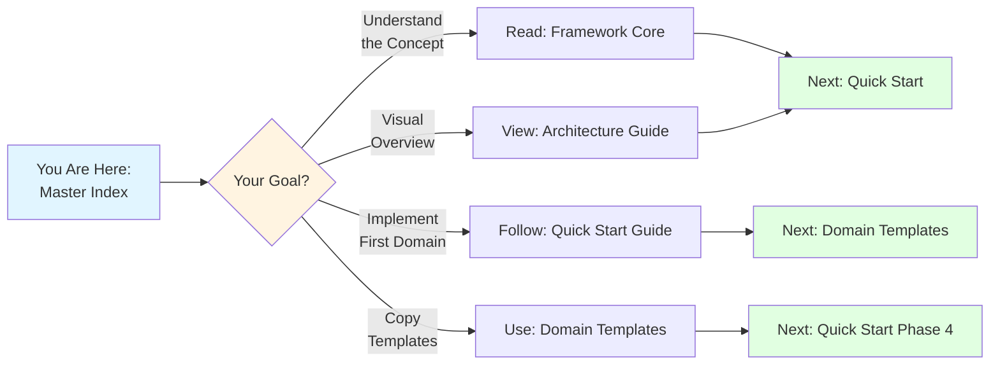
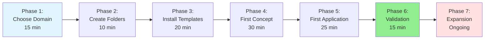

# 📚 Self-Documenting Knowledge System: Master Index

---
tags: #pkm #master-index #navigation #system-documentation
aliases: [System Documentation Hub, Self-Documenting System Index, Documentation Master]
---

> [!abstract] Welcome to the Self-Documenting Knowledge System
> This is your **central navigation hub** for the complete self-documenting knowledge architecture documentation. Whether you're just beginning or scaling to multiple domains, start here to find the right resource for your needs.

---

## 🎯 Quick Start: Where Should I Begin?

### New to the System? Start Here:



**Recommended Learning Path**:
1. ✅ **This document** (5 min) - Understand the documentation structure
2. 📘 **Framework Core** (20 min) - Learn the conceptual foundation
3. 🗺️ **Architecture Guide** (15 min) - See the visual overview
4. 🚀 **Quick Start Guide** (2-3 hours) - Implement your first domain
5. 🎨 **Domain Templates** (reference) - Customize for your needs

---

## 📖 Complete Documentation Library

### Core Documentation (Read in Order)

#### 1. [[#Self-Documenting Framework Core]] 
**File**: `self-documenting-framework-core.md`

> [!definition] **What It Is**
> The **theoretical foundation** explaining how self-documenting systems work, why they're revolutionary, and the universal mechanics that apply to any domain.

**Key Topics Covered**:
- ✨ The self-documenting paradigm (why this approach is different)
- 🔧 Three invariant components (work across all domains)
- 📋 Metadata architecture design
- ⚙️ Progress tracking system
- 🔍 Self-discovery query patterns
- 🌐 Relationship mapping
- 🎯 Domain configuration methodology
- 📊 System monitoring and health checks

**When to Use**:
- 📚 First-time reading to understand core concepts
- 🔍 Reference when designing custom domains
- 🎓 Teaching others about the system
- 🤔 Troubleshooting conceptual issues

**Reading Time**: 30-45 minutes
**Complexity**: Intermediate - assumes familiarity with Obsidian and Dataview

---

#### 2. [[#Domain Implementation Templates]]
**File**: `domain-implementation-templates.md`

> [!definition] **What It Is**
> **Production-ready templates** for five different domain types. Copy-paste-customize these to instantiate domains in 1-3 hours.

**Templates Included**:

| Template | Domain Type | Use Case | Setup Time |
|----------|-------------|----------|------------|
| **Template A** | Cognitive Science | Research papers, theories, studies | 45-60 min |
| **Template B** | PKM Methodology | Workflows, tools, methods | 30-45 min |
| **Template C** | Prompt Engineering | AI techniques, prompts | 30-40 min |
| **Template D** | Cosmology/Science | Scientific theories, phenomena | 45-60 min |
| **Template E** | Custom Domain | Any domain (blank slate) | 60-90 min |

**Each Template Contains**:
1. ✅ Complete domain configuration note
2. ✅ Customized concept note template
3. ✅ Customized application note template
4. ✅ Example concept note (fully worked)
5. ✅ Example application note (fully worked)
6. ✅ Domain health dashboard

**When to Use**:
- 🎨 Implementing your first domain
- 🔄 Adding additional domains to your PKB
- 📋 Reference for metadata schema design
- 🧪 Seeing complete worked examples

**Reading Time**: 20-30 minutes (scanning), 60-90 minutes (thorough study)
**Complexity**: Intermediate - ready for immediate use

---

#### 3. [[#Quick Start Implementation Guide]]
**File**: `quick-start-implementation-guide.md`

> [!definition] **What It Is**
> Your **action-oriented roadmap** from zero to working system in 2-3 hours. Step-by-step instructions with decision trees, troubleshooting, and validation checklists.

**7 Implementation Phases**:



**Key Features**:
- 🎯 Decision tree for domain selection
- 📋 Copy-paste instructions for every step
- ✅ Validation checkpoints after each phase
- 🔧 Comprehensive troubleshooting section
- 📊 Success indicators and milestones
- 🔍 Syntax quick reference

**When to Use**:
- 🚀 First implementation (follow sequentially)
- 🔄 Adding new domains (skip to relevant phases)
- 🐛 Troubleshooting issues (dedicated section)
- ✅ Validating system health

**Reading Time**: 3-4 hours (includes implementation)
**Complexity**: Beginner-friendly - assumes no prior experience

---

#### 4. [[#Visual Architecture Guide]]
**File**: `visual-architecture-guide.md`

> [!definition] **What It Is**
> **Architectural diagrams and workflow maps** showing system structure, data flow, and component interactions using Mermaid visualizations.

**Visual Content Includes**:

| Diagram Type | Purpose | Use Case |
|--------------|---------|----------|
| **System Architecture** | Three-layer model | Understanding overall structure |
| **Intelligence Loop** | How self-discovery works | Explaining automation to others |
| **Folder Structure** | Standard organization | Setting up domains |
| **Note Anatomy** | Component breakdown | Creating well-structured notes |
| **Query Flow** | Technical mechanics | Debugging query issues |
| **Implementation Sequence** | Step-by-step process | Following implementation path |
| **Knowledge Graph** | Relationship mapping | Visualizing connections |
| **Multi-Domain System** | Scaling strategy | Managing multiple domains |
| **Health Monitoring** | Analytics flow | System maintenance |
| **Troubleshooting Tree** | Diagnostic path | Solving problems systematically |

**When to Use**:
- 🖼️ Visual learners who prefer diagrams
- 👥 Training others on the system
- 🧩 Understanding component relationships
- 🎓 Teaching Dataview query mechanics
- 🔍 Quick reference for structure

**Reading Time**: 15-30 minutes
**Complexity**: Beginner-friendly - visual format aids comprehension

---

### Supplementary Documentation

#### 5. Original Implementation Examples
**Files**: 
- `self-documenting-dataview-implementation-guide.md` (uploaded)
- `self-documenting-dataview-system-reference.md` (uploaded)

> [!definition] **What They Are**
> The **original Dataview-specific documentation** that inspired this generalized system. These show the system applied to documenting Dataview commands, queries, and functions.

**Content Overview**:
- Detailed Dataview command documentation (FLATTEN, GROUP BY, WHERE, etc.)
- Self-documenting query patterns for DQL documentation
- Progress tracking with advanced DataviewJS
- Query metadata architecture
- Bidirectional relationship mapping

**When to Use**:
- 📚 See a complete, mature implementation example
- 🔍 Understand advanced Dataview patterns in practice
- 🎓 Learn sophisticated metadata architecture
- 🧪 Compare generalized system to specific instantiation

**Reading Time**: 45-60 minutes
**Complexity**: Advanced - assumes strong Dataview knowledge

---

## 🗺️ Navigation by Use Case

### Use Case 1: "I'm Brand New to This System"

**Your Path**:
1. ✅ **Start here** (Master Index) - 5 minutes
2. 📘 [[#Self-Documenting Framework Core]] - Section 1 & 2 only (15 min)
3. 🗺️ [[#Visual Architecture Guide]] - Skim diagrams (10 min)
4. 🚀 [[#Quick Start Implementation Guide]] - Phase 1-6 (2-3 hours)
5. 🎨 [[#Domain Implementation Templates]] - Choose your template (reference)

**Time Investment**: 3-4 hours to working system
**Outcome**: One fully operational self-documenting domain

---

### Use Case 2: "I Want to Understand the Theory First"

**Your Path**:
1. 📘 [[#Self-Documenting Framework Core]] - Complete read (45 min)
2. 🗺️ [[#Visual Architecture Guide]] - Study all diagrams (30 min)
3. 🎨 [[#Domain Implementation Templates]] - Read Template A or B examples (30 min)
4. 🚀 [[#Quick Start Implementation Guide]] - When ready to implement (2-3 hours)

**Time Investment**: 4-5 hours (includes deep understanding)
**Outcome**: Conceptual mastery + operational system

---

### Use Case 3: "I Just Want to Copy Templates and Go"

**Your Path**:
1. 🎨 [[#Domain Implementation Templates]] - Find your domain (10 min)
2. 🚀 [[#Quick Start Implementation Guide]] - Phase 2-6 only (2 hours)
3. 📘 [[#Self-Documenting Framework Core]] - Reference as needed

**Time Investment**: 2-3 hours to working system
**Outcome**: Fast implementation with templates

---

### Use Case 4: "I Want to Design a Custom Domain"

**Your Path**:
1. 📘 [[#Self-Documenting Framework Core]] - Sections 2, 3, 7 (30 min)
2. 🎨 [[#Domain Implementation Templates]] - Template E + Worksheet (30 min)
3. 🚀 [[#Quick Start Implementation Guide]] - Phase 1 decision tree + Phase 2-6 (3 hours)
4. 🗺️ [[#Visual Architecture Guide]] - Reference for structure (as needed)

**Time Investment**: 4-5 hours (includes custom design)
**Outcome**: Fully customized domain matching your needs

---

### Use Case 5: "Something's Not Working"

**Your Path**:
1. 🚀 [[#Quick Start Implementation Guide]] - Troubleshooting Section (15 min)
2. 🗺️ [[#Visual Architecture Guide]] - Query Flow Diagram (5 min)
3. 📘 [[#Self-Documenting Framework Core]] - Component reference (10 min)

**Time Investment**: 30-60 minutes problem-solving
**Outcome**: Issue diagnosed and resolved

---

### Use Case 6: "I'm Scaling to Multiple Domains"

**Your Path**:
1. 📘 [[#Self-Documenting Framework Core]] - Section 8 (Multi-Domain Strategy) (20 min)
2. 🎨 [[#Domain Implementation Templates]] - Choose additional templates (10 min each)
3. 🗺️ [[#Visual Architecture Guide]] - Multi-Domain System diagram (5 min)
4. 🚀 [[#Quick Start Implementation Guide]] - Phase 2-6 for each domain (1-2 hours each)

**Time Investment**: 2-3 hours per additional domain
**Outcome**: Multi-domain integrated system

---

## 📊 Documentation Quick Reference

### Key Concepts Glossary

| Term | Definition | Where to Learn More |
|------|------------|---------------------|
| **Self-Discovery Query** | Dataview query that finds notes referencing the current note | Framework Core §1, Architecture Guide |
| **Concept Note** | Documentation of a single theory, method, or principle | Framework Core §3, Domain Templates |
| **Application Note** | Note demonstrating concept usage (study, workflow, etc.) | Framework Core §3, Domain Templates |
| **Metadata Schema** | Structured fields for domain-specific information | Framework Core §2, Domain Templates |
| **Status Tasks** | Checklist driving progress tracking | Framework Core §3, Quick Start Phase 4 |
| **Domain Configuration** | Settings file defining taxonomy and schema | Framework Core §2, Domain Templates |
| **Knowledge Graph Position** | Bidirectional link analysis showing relationships | Framework Core §3, Architecture Guide |
| **Domain Health Dashboard** | Analytics for monitoring domain coverage | Framework Core §6, Domain Templates |
| **Intelligence Loop** | Self-updating cycle as notes are created | Architecture Guide |
| **Orphan Concept** | Concept note with no application notes | Framework Core §6, Quick Start §7 |

---

### Common Queries Reference

#### Self-Discovery Query (Core Pattern)
```dataview
TABLE WITHOUT ID
  file.link as "📄 Note",
  Field1,
  Field2,
  Field3
FROM "Knowledge Domains/[Domain]/01-Applications"
FLATTEN file.outlinks as links
WHERE meta(links).path = this.file.path
GROUP BY file.link
```

**Customization Points**:
- `Field1, Field2, Field3`: Replace with your metadata field names
- `"Knowledge Domains/[Domain]/01-Applications"`: Your applications folder path

---

#### Progress Tracking (DataviewJS)
```javascript
status:: `$= dv.current().status`
```

Place this immediately after frontmatter. Requires:
- DataviewJS enabled
- Status Tasks section in note
- Progress tracking code in domain config

---

#### Orphan Detection
```dataview
LIST
FROM "Knowledge Domains/[Domain]/00-Concepts"
WHERE length(file.inlinks) = 0 AND Type != null
```

Shows concepts with no application notes.

---

#### Concept Coverage
```dataview
TABLE
  Type as "Concept Type",
  length(file.inlinks) as "Usage Count",
  status as "Documentation Status"
FROM "Knowledge Domains/[Domain]/00-Concepts"
WHERE Type != null
SORT length(file.inlinks) DESC
```

Shows which concepts are most/least referenced.

---

## 🎯 Implementation Checklists

### Checklist: First Domain Setup

**Phase 1: Planning** (15 min)
- [ ] Read Master Index (this document)
- [ ] Choose domain type from templates
- [ ] Identify 3-5 concepts to document initially
- [ ] Gather 5-10 applications (studies, workflows, etc.)

**Phase 2: Infrastructure** (30 min)
- [ ] Create folder structure (00-Concepts, 01-Applications, 02-Synthesis, 03-Meta)
- [ ] Copy domain configuration from template
- [ ] Copy concept note template
- [ ] Copy application note template
- [ ] Create domain overview MOC

**Phase 3: First Implementation** (60 min)
- [ ] Create first concept note
- [ ] Document definition and characteristics
- [ ] Configure self-discovery query
- [ ] Add status tasks section
- [ ] Create first application note
- [ ] Link to concept

**Phase 4: Validation** (30 min)
- [ ] Verify application appears in concept query
- [ ] Test progress tracking
- [ ] Check knowledge graph section
- [ ] Confirm no Dataview errors
- [ ] Create second application to verify scaling

**Phase 5: Expansion** (Ongoing)
- [ ] Document 3-5 more concepts
- [ ] Create 10+ application notes
- [ ] Build domain health dashboard
- [ ] Schedule weekly review

---

### Checklist: Adding Additional Domain

**Prerequisite**: One domain fully operational

- [ ] Choose new domain type
- [ ] Create folder structure
- [ ] Copy/customize templates
- [ ] Document 3 concepts
- [ ] Create 5 applications
- [ ] Verify self-discovery working
- [ ] Add to Domain Registry note
- [ ] Identify cross-domain concepts

**Time**: 2-3 hours (faster than first domain)

---

## 🔗 External Resources & References

### Obsidian Resources
- **Obsidian Help Documentation**: https://help.obsidian.md/
- **Dataview Plugin Documentation**: https://blacksmithgu.github.io/obsidian-dataview/
- **Obsidian Community Forum**: https://forum.obsidian.md/

### Related Methodologies
- **Zettelkasten Method**: Note-taking methodology emphasizing atomic notes
- **PARA Method**: Organizational framework (Projects, Areas, Resources, Archives)
- **Building a Second Brain**: PKM framework by Tiago Forte

### Technical Learning Resources
- **Dataview Query Language Tutorial**: Included in Dataview docs
- **DataviewJS API Reference**: For advanced scripting
- **YAML Frontmatter Guide**: Obsidian Help docs

---

## 💡 Tips for Success

### For First-Time Implementers

> [!helpful-tip] Start Small, Scale Gradually
> - Don't try to document your entire knowledge base on Day 1
> - Start with 3-5 concepts you reference frequently
> - Create 5-10 application notes to validate system
> - **The system becomes valuable through consistent use, not exhaustive initial setup**

> [!helpful-tip] Trust the Self-Discovery Process
> - It feels magical when applications automatically appear in concept queries
> - Resist urge to manually maintain cross-references
> - Let the queries do the work - that's the point!

> [!helpful-tip] Customize, Don't Perfect
> - Templates are starting points, not rigid requirements
> - Adapt metadata schema as you learn what you need
> - Taxonomy can evolve - don't overthink initial design

---

### For Scaling to Multiple Domains

> [!helpful-tip] Establish Patterns First
> - Get your first domain to 50+ notes before adding second domain
> - Learn what works for you before replicating
> - Second domain will be 2-3x faster than first

> [!helpful-tip] Identify Shared Concepts Early
> - Some concepts appear in multiple domains (e.g., "emergence", "feedback loops")
> - Document these as cross-domain concepts
> - Create synthesis notes connecting domains

> [!helpful-tip] Build Central Infrastructure
> - Domain Registry note tracks all domains
> - Cross-domain analytics dashboard
> - Shared concept index

---

### For Long-Term Maintenance

> [!helpful-tip] Weekly Health Checks (15 min)
> - Run orphan detection for each domain
> - Check incomplete documentation (Status Tasks)
> - Review recent applications for quality

> [!helpful-tip] Monthly Deep Dives (30 min)
> - Analyze domain growth trends
> - Identify high-value concepts (many inlinks)
> - Create synthesis notes connecting multiple concepts
> - Refine taxonomy if needed

> [!helpful-tip] Quarterly System Reviews (60 min)
> - Evaluate metadata schema effectiveness
> - Optimize query performance
> - Update templates based on learnings
> - Celebrate growth and impact

---

## 🎓 Learning Progression

### Beginner Stage (Weeks 1-2)
**Skills Developed**:
- ✅ Understanding self-documenting concept
- ✅ Creating notes from templates
- ✅ Basic Dataview query comprehension
- ✅ Metadata field usage

**Milestone**: One domain with 5 concepts, 10 applications

---

### Intermediate Stage (Weeks 3-6)
**Skills Developed**:
- ✅ Customizing templates for your needs
- ✅ Modifying queries for specific use cases
- ✅ Multi-domain management
- ✅ Health dashboard creation

**Milestone**: 2 domains with 15+ concepts each, cross-domain connections

---

### Advanced Stage (Months 2-3)
**Skills Developed**:
- ✅ Designing custom domains from scratch
- ✅ Advanced query patterns
- ✅ Cross-domain synthesis notes
- ✅ Performance optimization

**Milestone**: 3+ domains, 50+ concepts, sophisticated analytics

---

### Expert Stage (Month 3+)
**Skills Developed**:
- ✅ Meta-system design and optimization
- ✅ Methodology innovation
- ✅ Training others on system
- ✅ Contributing patterns back to community

**Milestone**: Self-sustaining system with 100+ concepts, teaching others

---

## 🚀 Next Steps: Your Action Plan

### If You're Reading This for the First Time:

**Right Now** (30 minutes):
1. ✅ Read [[#Self-Documenting Framework Core]] - Sections 1-2
2. ✅ Skim [[#Visual Architecture Guide]] - Look at diagrams
3. ✅ Choose your first domain from templates

**This Week** (3-4 hours):
1. ✅ Follow [[#Quick Start Implementation Guide]] - Phases 1-6
2. ✅ Validate system is working
3. ✅ Document 3 concepts, create 5 applications

**Next Week** (2-3 hours):
1. ✅ Add 5 more concepts
2. ✅ Create 10 more applications
3. ✅ Build health dashboard
4. ✅ Establish weekly review habit

**This Month** (5-6 hours):
1. ✅ Reach 15 concepts, 30 applications in first domain
2. ✅ Start second domain
3. ✅ Create first synthesis notes
4. ✅ Optimize queries based on usage

---

### If You're Already Implementing:

**Check Your Progress**:
- How many concepts documented?
- How many applications created?
- Are self-discovery queries working?
- Any orphan concepts?

**Based on Where You Are**:

**< 10 Concepts**:
- Focus on foundation building
- Document core concepts first
- Create multiple applications per concept

**10-20 Concepts**:
- Start synthesis notes
- Build health dashboard
- Consider second domain

**20+ Concepts**:
- Optimize query performance
- Create cross-domain connections
- Develop advanced analytics

---

## 📞 Getting Help

### Troubleshooting Resources

1. **Quick Start Guide Troubleshooting Section**
   - Most common issues covered
   - Step-by-step diagnostic process
   - Solutions for 6 major issue types

2. **Architecture Guide Decision Trees**
   - Visual troubleshooting flows
   - Systematic diagnostic approach

3. **Framework Core Advanced Patterns**
   - Complex issue resolution
   - Performance optimization
   - Edge case handling

### Community Resources

- **Obsidian Discord**: Real-time help from community
- **Obsidian Forum**: Search for Dataview-related issues
- **r/ObsidianMD**: Reddit community for discussions

---

## 🎯 Success Stories & Use Cases

### Example 1: Academic Researcher
**Domain**: Cognitive Science
**Setup Time**: 3 hours
**After 3 Months**: 45 theories documented, 120 research papers analyzed
**Impact**: "Self-discovery queries show me everywhere I've used a theory. Writing literature reviews is 10x faster."

### Example 2: PKM Developer
**Domain**: PKM Methodology
**Setup Time**: 2 hours
**After 2 Months**: 25 methods, 60 workflow implementations
**Impact**: "I can track which plugins I use where, see patterns in my own system, and optimize based on real data."

### Example 3: AI Researcher
**Domain**: Prompt Engineering
**Setup Time**: 2.5 hours
**After 1 Month**: 15 techniques, 50 prompt implementations
**Impact**: "Every prompt links to techniques automatically. I can see which patterns work for which use cases instantly."

---

# 🔗 Related Topics for PKB Expansion

1. **[[Integration with Spaced Repetition Systems]]**
   - *Connection*: Self-documenting concepts could feed into spaced repetition for learning
   - *Depth Potential*: Automated flashcard generation from concept notes
   - *Knowledge Graph Role*: Optimizes learning based on concept usage patterns

2. **[[Automated Knowledge Graph Visualization]]**
   - *Connection*: Transform self-documenting metadata into visual networks
   - *Depth Potential*: Force-directed layouts, interactive exploration, clustering analysis
   - *Knowledge Graph Role*: Makes relationship patterns visible and explorable

3. **[[Cross-Domain Concept Ontology]]**
   - *Connection*: Some concepts transcend domains and need unified representation
   - *Depth Potential*: Shared concept library, multi-domain instantiation patterns
   - *Knowledge Graph Role*: Creates high-leverage connection points across domains

4. **[[Progressive Knowledge Maturity System]]**
   - *Connection*: Track concept understanding from seedling to evergreen
   - *Depth Potential*: Confidence scoring, review scheduling, maturity analytics
   - *Knowledge Graph Role*: Adds temporal dimension showing knowledge evolution

---

> [!important] You're Ready to Begin
> This master index has given you the complete map. Now choose your starting point:
> 
> - **Want theory first?** → Go to Framework Core
> - **Want to implement now?** → Go to Quick Start Guide
> - **Want visual overview?** → Go to Architecture Guide
> - **Want templates?** → Go to Domain Templates
>
> **The system becomes valuable through use, not perfect planning.**
> 
> Pick one, start, and let the self-organizing intelligence emerge. 🚀
