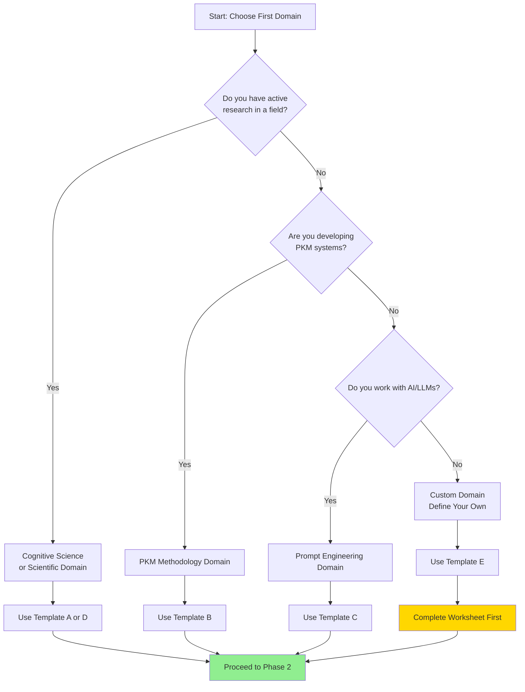

# 🚀 Self-Documenting System: Quick Start Implementation Guide

---
tags: #pkm #implementation-guide #getting-started #dataview #action-plan
aliases: [Domain Setup Guide, First Domain Implementation, Self-Documenting Quick Start]
---

> [!abstract] Guide Purpose
> This is your **action-oriented roadmap** for implementing your first self-documenting knowledge domain. Unlike the theoretical framework and templates, this guide provides **step-by-step instructions**, **decision trees**, and **troubleshooting** to get you from zero to working system in 2-3 hours. This guide assumes you've reviewed the [[Self-Documenting Framework Core]] and are ready to implement.

---

## 📋 Pre-Implementation Checklist

Before beginning, verify you have:

### Technical Prerequisites
- [ ] **Obsidian** installed (version 1.4.0 or higher recommended)
- [ ] **Dataview plugin** installed and enabled (Settings → Community Plugins → Browse → "Dataview")
- [ ] **DataviewJS enabled** (Dataview settings → Enable JavaScript Queries = ON)
- [ ] **Comfortable with YAML frontmatter** (or willing to learn)
- [ ] **15-30 minutes of focused time** for initial setup

### Knowledge Prerequisites
- [ ] You've read the [[Self-Documenting Framework Core]] (at least sections 1-3)
- [ ] You've reviewed at least ONE domain template from [[Domain Implementation Templates]]
- [ ] You've identified which domain you want to implement first
- [ ] You understand the core concept: notes discover their own usage through queries

> [!important] If Any Box is Unchecked
> - Missing Dataview? Go to Settings → Community Plugins → Browse → Search "Dataview" → Install → Enable
> - DataviewJS not enabled? Go to Dataview plugin settings → Enable JavaScript Queries
> - Haven't read core framework? Start there first - this guide assumes that foundation
> - Don't have 30 minutes? Bookmark this and return when you do (rushing causes errors)

---

## 🎯 Phase 1: Choose Your Domain (15 minutes)

### Decision Tree: Which Domain Should I Implement First?



### Recommendation Logic

**Choose [[Cognitive Science Domain]] if:**
- ✅ You're actively reading research papers
- ✅ You have theories/concepts you reference frequently
- ✅ You want to track studies and their relationships
- ✅ You're building knowledge in psychology, neuroscience, education, or related fields

**Choose [[PKM Methodology Domain]] if:**
- ✅ You're developing your own PKB system
- ✅ You experiment with different note-taking methods
- ✅ You want to document your workflows and tools
- ✅ You're learning Obsidian plugins and want to track their usage

**Choose [[Prompt Engineering Domain]] if:**
- ✅ You work with AI assistants frequently
- ✅ You develop and refine prompts
- ✅ You want to track which techniques work for different tasks
- ✅ You're building a prompt library

**Choose [[Custom Domain]] if:**
- ✅ Your area doesn't fit the pre-made templates
- ✅ You have a specific domain you're passionate about
- ✅ You're comfortable with more setup work
- ⚠️ **Note**: Requires completing the customization worksheet first

### Quick Selection Shortcut

> [!helpful-tip] When in Doubt, Start with PKM Methodology
> - **Why**: You're already doing PKM (you're reading this!), so you have immediate content to document
> - **Advantage**: You can document your own system while building it (meta-cognition)
> - **Easiest validation**: Your workflows and tool usage are self-evident
> - **Quick wins**: You'll see value immediately as you document what you already do

**MY DECISION**: I will implement the **[____________________]** domain first.

---

## 🏗️ Phase 2: Create Folder Structure (10 minutes)

### Step-by-Step Folder Creation

**Step 1: Create Domain Root Folder**

1. In Obsidian, click the folder icon with "+" (or right-click in file explorer)
2. Create folder: `Knowledge Domains`
3. Inside that, create folder with your domain name:
   - `Knowledge Domains/Cognitive Science` OR
   - `Knowledge Domains/PKM Methodology` OR
   - `Knowledge Domains/Prompt Engineering` OR
   - `Knowledge Domains/[Your Custom Domain Name]`

**Step 2: Create Subfolder Structure**

Inside your domain folder, create these four subfolders:

```
[Your Domain Name]/
├── 00-Concepts/           ← Create this folder
├── 01-Applications/       ← Create this folder
├── 02-Synthesis/          ← Create this folder
└── 03-Meta/              ← Create this folder
```

> [!helpful-tip] Folder Naming Convention
> The `00-`, `01-`, `02-`, `03-` prefixes ensure folders sort in logical order. The numbers don't affect functionality - they're just for organization.

**Step 3: Verification**

Your file explorer should look like this:

```
📁 Knowledge Domains/
  📁 [Your Domain Name]/
    📁 00-Concepts/
    📁 01-Applications/
    📁 02-Synthesis/
    📁 03-Meta/
```

**Checkpoint**: 
- [ ] All four subfolders created
- [ ] Folder names match exactly (including number prefixes)
- [ ] Located in correct path

---

## 📝 Phase 3: Install Templates (20 minutes)

### For Pre-Made Domains (Templates A, B, C, D)

**Step 1: Copy Domain Configuration Note**

1. Open [[Domain Implementation Templates]] document
2. Navigate to YOUR domain's section (Template A, B, C, or D)
3. Find "Domain Configuration Note" section
4. Copy ENTIRE markdown content (from `---` to end of code block)
5. In Obsidian, create new note: `03-Meta/_Domain-Config.md`
6. Paste content
7. **Save** (Ctrl/Cmd + S)

**Step 2: Copy Concept Note Template**

1. In [[Domain Implementation Templates]], find "Concept Note Template" for your domain
2. Copy ENTIRE content
3. Create new note: `03-Meta/_Concept-Template.md`
4. Paste content
5. **Save**

**Step 3: Copy Application Note Template**

1. Find "Application Note Template" for your domain
2. Copy ENTIRE content
3. Create new note: `03-Meta/_Application-Template.md`
4. Paste content
5. **Save**

**Step 4: Create Domain Overview MOC**

1. Create new note: `03-Meta/[Your Domain Name] Overview MOC.md`
2. Add this basic structure:

```markdown
---
tags: #moc #[your-domain-tag]
Type: MOC
---

# [Your Domain Name] Overview

## 🎯 Domain Purpose

[Brief description of what this domain covers]

## 📊 Domain Status

**Concept Count**: `$= dv.pages('"Knowledge Domains/[Your Domain Name]/00-Concepts"').length`
**Application Count**: `$= dv.pages('"Knowledge Domains/[Your Domain Name]/01-Applications"').length`

## 🗂️ Concept Categories

### [Concept Type 1]
```dataview
LIST
FROM "Knowledge Domains/[Your Domain Name]/00-Concepts"
WHERE Type = "[Type1]"
SORT file.name ASC
```

### [Concept Type 2]
```dataview
LIST
FROM "Knowledge Domains/[Your Domain Name]/00-Concepts"
WHERE Type = "[Type2]"
SORT file.name ASC
```

## 📈 Recent Applications

```dataview
TABLE
  file.cday as "Created"
FROM "Knowledge Domains/[Your Domain Name]/01-Applications"
SORT file.cday DESC
LIMIT 10
```

## 🔗 Quick Links

- [[_Domain-Config]] - Domain configuration
- [[_Concept-Template]] - Template for new concepts
- [[_Application-Template]] - Template for new applications
```

3. **Customize**: Replace `[Your Domain Name]`, `[Type1]`, `[Type2]` with your actual values
4. **Save**

**Checkpoint**:
- [ ] `_Domain-Config.md` created in `03-Meta/`
- [ ] `_Concept-Template.md` created in `03-Meta/`
- [ ] `_Application-Template.md` created in `03-Meta/`
- [ ] `[Domain Name] Overview MOC.md` created in `03-Meta/`
- [ ] All templates saved without errors

### For Custom Domain (Template E)

**Step 1: Complete Customization Worksheet FIRST**

Before copying any templates, complete the worksheet in Template E:

1. Open [[Domain Implementation Templates]]
2. Navigate to "Template E: Custom Domain"
3. Find "Customization Worksheet"
4. **Fill out completely** (on paper or in temporary note)
5. This defines YOUR taxonomy and metadata schema

**Step 2: Customize and Copy Configuration**

1. Copy the blank Domain Configuration template
2. **Find and replace ALL placeholders**:
   - `[YOUR DOMAIN NAME]` → Your actual domain name
   - `[YOUR-DOMAIN-TAG]` → Your tag (lowercase, hyphens)
   - `[Type 1]`, `[Type 2]`, etc. → Your concept types from worksheet
   - `[FieldName1]`, `[FieldName2]`, etc. → Your metadata fields from worksheet
3. Save as `03-Meta/_Domain-Config.md`

**Step 3: Customize Concept Template**

1. Copy Universal Concept Note Template from Framework Core document
2. Replace `[CONCEPT-TYPE]` with your types
3. Replace `[DOMAIN-MOC]` with your MOC link
4. Replace `[METADATA-FIELD-1]`, etc. with your schema
5. Replace `[APPLICATION-NOTES-FOLDER]` with your path
6. Customize Status Tasks for your domain
7. Save as `03-Meta/_Concept-Template.md`

**Step 4: Customize Application Template**

1. Copy Universal Application Note Template
2. Replace all metadata field placeholders
3. Customize sections for your domain
4. Save as `03-Meta/_Application-Template.md`

**Step 5: Create MOC** (same process as pre-made domains above)

---

## 🎨 Phase 4: Create Your First Concept (30 minutes)

This is where the magic begins! You'll document ONE concept completely.

### Choosing Your First Concept

**Selection Criteria**:
- ✅ **Foundational**: Something you reference often
- ✅ **Familiar**: You understand it well enough to explain
- ✅ **Active**: You're currently using or researching it
- ❌ **Avoid**: Obscure concepts with no applications yet

**Domain-Specific Recommendations**:

| Domain | Suggested First Concept | Why? |
|--------|------------------------|------|
| Cognitive Science | Working Memory, Cognitive Load Theory, or Spacing Effect | Widely referenced, well-researched, likely to appear in many papers |
| PKM Methodology | Zettelkasten, Atomic Notes, or Daily Notes | Central to most PKM systems, easy to find applications |
| Prompt Engineering | Chain-of-Thought or Few-Shot Learning | Fundamental techniques you probably already use |
| Custom Domain | Your most frequently referenced concept | Whatever you link to most often |

### Step-by-Step Concept Creation

**Step 1: Duplicate Template**

1. Open `03-Meta/_Concept-Template.md`
2. Right-click → "Duplicate"
3. Move duplicate to `00-Concepts/` folder
4. Rename to `[Your Concept Name].md`

**Step 2: Fill in Frontmatter**

```yaml
---
aliases: [Alternative Name 1, Abbreviation]
Type: [Choose from your taxonomy]
MOC: "[[Your Domain Overview MOC]]"
---
```

**Example for "Working Memory" in Cognitive Science**:
```yaml
---
aliases: [WM, Short-Term Memory, Active Memory]
Type: Theory
MOC: "[[Cognitive Science Overview MOC]]"
---
```

**Step 3: Add Title and Status Field**

```markdown
# [Concept Name]

status:: `$= dv.current().status`
```

The status field will initially show `undefined` - this is NORMAL. It will populate once you complete Status Tasks.

**Step 4: Write Core Definition**

```markdown
## 🎯 Definition

> [!definition]
> [2-3 sentence definition of this concept]
>
> **Origin**: [Who first proposed it, when]
> **Category**: [Type]
```

> [!helpful-tip] Writing Good Definitions
> - Start broad, then get specific
> - Include attribution if known (but okay to say "unknown" or "traditional")
> - Use your own words (synthesize, don't just quote)
> - Aim for clarity over comprehensiveness in this section

**Step 5: Document Key Characteristics**

```markdown
## 🔑 Core Characteristics

[Write 1-2 paragraphs describing essential features]

### Key Components (if applicable)

1. **[Component 1]**: [Description]
2. **[Component 2]**: [Description]
```

**Step 6: Add Self-Discovery Query Section**

```markdown
## 🔬 Applications

### Where This Concept Appears

**Self-Discovery Query**: This automatically populates with notes that reference this concept.

```dataview
TABLE WITHOUT ID
  file.link as "📄 Note",
  [FieldName1],
  [FieldName2],
  [FieldName3]
FROM "Knowledge Domains/[Your Domain]/01-Applications"
FLATTEN file.outlinks as links
WHERE meta(links).path = this.file.path
GROUP BY file.link
```
```

**CRITICAL**: Replace `[FieldName1]`, etc. with YOUR metadata fields from domain configuration!

**Example for Cognitive Science**:
```dataview
TABLE WITHOUT ID
  file.link as "📄 Research Note",
  StudyType,
  Theories,
  KeyFindings
FROM "Knowledge Domains/Cognitive Science/01-Applications"
FLATTEN file.outlinks as links
WHERE meta(links).path = this.file.path
GROUP BY file.link
```

**Step 7: Add Related Concepts Section**

```markdown
## 🔗 Related Concepts

- [[Related Concept 1]] - [How they connect]
- [[Related Concept 2]] - [How they connect]
```

**Step 8: Complete Status Tasks**

```markdown
## 📊 Status Tasks

- [x] Core definition documented
- [x] Key characteristics identified
- [ ] Usage examples provided
- [ ] Related concepts linked
- [ ] Applications documented
- [ ] Limitations/caveats noted
- [ ] References cited
```

Check off what you've completed. The progress bar will update automatically!

**Step 9: Add Knowledge Graph Section**

```markdown
## 🌐 Knowledge Graph Position

```dataviewjs
const inboundLinks = dv.page(dv.current().file.path).file.inlinks;
const outboundLinks = dv.page(dv.current().file.path).file.outlinks;

dv.table(
    ["📥 Used By (Inbound)", "📤 Builds On (Outbound)"],
    Array.from({length: Math.max(inboundLinks.length, outboundLinks.length)}, (_, i) => [
        inboundLinks[i] || "",
        outboundLinks[i] || ""
    ])
);
```
```

This code is universal - copy exactly as shown.

**Step 10: Save and Verify**

1. **Save** the note (Ctrl/Cmd + S)
2. Switch to **Reading Mode** (Ctrl/Cmd + E)
3. Verify:
   - [ ] Status progress bar appears (even if showing 0% or undefined)
   - [ ] Self-discovery query section renders (table may be empty - that's okay!)
   - [ ] Knowledge graph section shows a table (may be empty)
   - [ ] No error messages or red text

**Checkpoint**:
- [ ] First concept note created in `00-Concepts/`
- [ ] Frontmatter completed
- [ ] Definition and characteristics documented
- [ ] Self-discovery query configured
- [ ] Status tasks section present
- [ ] No Dataview errors

---

## 📄 Phase 5: Create Your First Application (25 minutes)

Now you'll create a note that USES the concept, which will automatically appear in the concept's self-discovery query.

### Step-by-Step Application Creation

**Step 1: Duplicate Application Template**

1. Open `03-Meta/_Application-Template.md`
2. Right-click → "Duplicate"
3. Move to `01-Applications/` folder
4. Rename to describe your application:
   - Cognitive Science: `Study - [Author Year - Brief Title].md`
   - PKM: `Workflow - [Workflow Name].md`
   - Prompt Eng: `Prompt - [Use Case].md`
   - Custom: `[Your naming convention].md`

**Step 2: Fill in Metadata**

**Top of note after frontmatter**:

```markdown
## 📊 Metadata

[FieldName1]:: [Value]
[FieldName2]:: [[Concept 1]], [[Concept 2]]
[FieldName3]:: [Value]
```

**Example for Cognitive Science**:
```markdown
## 📊 Research Metadata

StudyType:: Experimental
Theories:: [[Working Memory]], [[Cognitive Load Theory]]
Paradigm:: Cognitivist
Population:: University students, N=85
KeyFindings:: WM training showed no far transfer to fluid intelligence
```

**CRITICAL**: In `[FieldName2]`, include a wiki-link to the concept you just created!

**Step 3: Link to Concept in Content**

In the main body of your application note, reference your concept:

```markdown
## 🧠 Concepts Applied

This [study/workflow/implementation] uses:

- **[[Your Concept Name]]** - [Brief description of how it's used]
- [Additional concepts if relevant]
```

**Step 4: Add Content**

Write the substance of your application note:
- For research: Summary of study, findings, methodology
- For workflow: Step-by-step process, triggers, outcomes
- For prompt: The prompt itself, context, effectiveness
- For custom: Whatever your domain requires

Don't overthink it - even a brief note is sufficient for testing!

**Step 5: Save and Switch to Concept Note**

1. **Save** your application note
2. Open your concept note from Phase 4
3. Switch to **Reading Mode**
4. Scroll to "Where This Concept Appears" section

**✨ MOMENT OF TRUTH ✨**

You should see your application note appear in the self-discovery query table!

```
📄 Note | FieldName1 | FieldName2 | FieldName3
[Your Application Note] | [Value] | [[Concept]] | [Value]
```

> [!important] If Application Doesn't Appear
> See [[#Troubleshooting]] section below. Most common issues:
> - Metadata field names don't match domain configuration
> - Folder path in query is incorrect
> - Forgot to link to concept in application note
> - Need to refresh/reopen note to trigger query

**Checkpoint**:
- [ ] Application note created in `01-Applications/`
- [ ] Metadata fields filled in with correct field names
- [ ] Wiki-link to concept included
- [ ] Application appears in concept's self-discovery query
- [ ] Metadata displays correctly in query table

---

## ✅ Phase 6: System Validation (15 minutes)

### Validation Checklist

**Structural Validation**:
- [ ] Domain folder structure complete (00-Concepts, 01-Applications, 02-Synthesis, 03-Meta)
- [ ] All template files in Meta folder
- [ ] Domain configuration documented
- [ ] MOC note created

**Functional Validation**:
- [ ] At least one concept note in `00-Concepts/`
- [ ] At least one application note in `01-Applications/`
- [ ] Application note links to concept note
- [ ] Self-discovery query shows application in concept note
- [ ] Metadata fields display correctly in query
- [ ] Status progress bar works (shows percentage)
- [ ] Knowledge graph section shows links

**Content Validation**:
- [ ] Concept definition is clear and complete
- [ ] Application note demonstrates concept usage
- [ ] Metadata matches domain schema
- [ ] No placeholder text remains (e.g., `[FieldName]`)

### Testing the Intelligence Loop

**Test 1: Create Second Application**

1. Create another application note using your template
2. Link to the SAME concept
3. Verify it appears in concept's self-discovery query
4. **Expected result**: Query now shows TWO notes

**Test 2: Progress Tracking**

1. Open your concept note
2. Check/uncheck items in Status Tasks section
3. Save and reopen (or wait ~5 seconds)
4. **Expected result**: Progress bar percentage updates

**Test 3: Knowledge Graph**

1. Create link from concept note to another note (can be temporary test note)
2. Check Knowledge Graph Position section
3. **Expected result**: Outbound links column shows the link

**Test 4: MOC Integration**

1. Open your Domain Overview MOC
2. Verify concept count shows "1"
3. Verify application count shows "1" (or more if you created multiple)
4. **Expected result**: Dataview queries in MOC execute successfully

> [!key-claim] Success Criteria
> If all four tests pass, **your self-documenting system is fully operational**. You now have a working foundation that will scale as you add more concepts and applications.

---

## 🚀 Phase 7: Expansion Strategy (Ongoing)

### Week 1: Establish Foundation (3-5 hours)

**Day 1-2: Core Concepts (2-3 hours)**
- Document 3-5 foundational concepts in your domain
- Use concepts you already understand well
- Focus on concepts you reference frequently

**Day 3-4: Initial Applications (1-2 hours)**
- Create 5-10 application notes
- Can be brief - even 2-3 paragraphs
- Ensure each links to at least one concept

**Day 5: Validation Round**
- Verify all self-discovery queries working
- Check for orphan concepts (concepts with no applications)
- Review metadata consistency

### Week 2: Build Momentum (2-3 hours)

- Document 5 more concepts (1 per day)
- Create 10 more applications (2 per day)
- Start seeing network effects (some applications reference multiple concepts)

### Week 3: Synthesis & Refinement (2 hours)

- Create first synthesis notes (cross-concept analysis)
- Identify gaps in coverage
- Refine metadata schema if needed
- Build domain health dashboard

### Month 2+: Sustainable Growth

**Ongoing Workflows**:

1. **When You Read/Research**:
   - Encounter new concept → Create concept note
   - Apply concept → Create application note
   - System auto-updates → No manual maintenance

2. **Weekly Review** (15 min):
   - Check Domain Health Dashboard
   - Identify orphan concepts
   - Review incomplete documentation (Status Tasks)

3. **Monthly Deep Dive** (30 min):
   - Create synthesis notes
   - Refine taxonomy if needed
   - Update domain configuration
   - Celebrate growth (watch your knowledge graph expand!)

### Scaling to Multiple Domains

**After Domain 1 is Established (50+ notes)**:

1. **Choose Second Domain** using Phase 1 decision tree
2. **Replicate Process**: Phases 2-6 go MUCH faster (60-90 min total)
3. **Identify Cross-Domain Concepts**: Some concepts will span multiple domains
4. **Build Domain Registry**: Central tracking note (template in Framework Core)

**Timeline Recommendation**:
- Domain 1: Weeks 1-4 (establish foundation)
- Domain 2: Week 5-6 (leverage learned patterns)
- Domain 3: Week 7-8
- Domain 4: Week 9-10

---

## 🔧 Troubleshooting

### Issue 1: Application Doesn't Appear in Self-Discovery Query

**Symptom**: Concept note's "Where This Concept Appears" section is empty despite creating application note.

**Diagnosis Checklist**:
1. **Did you link to the concept?**
   - Open application note
   - Search for `[[Concept Name]]`
   - If missing → Add the link and save

2. **Is the folder path correct in query?**
   - Open concept note
   - Find the self-discovery query
   - Check `FROM "Knowledge Domains/[Domain]/01-Applications"`
   - Compare to actual folder path
   - If different → Fix path in query

3. **Are metadata field names correct?**
   - Check domain configuration for field names
   - Verify application note uses EXACT same spelling
   - Case-sensitive! `StudyType` ≠ `studytype`

4. **Did you refresh?**
   - Close and reopen the concept note
   - Or switch to Edit mode and back to Reading mode
   - Dataview queries sometimes need refresh

**Solution Steps**:
```markdown
1. Open application note
2. Ensure: [FieldName]:: [[Concept Name]]
3. Save application note
4. Open concept note
5. Verify FROM path matches actual folder
6. Switch to Edit mode, then Reading mode
7. Check "Where This Concept Appears" section
```

---

### Issue 2: Status Progress Bar Doesn't Update

**Symptom**: Status bar shows `undefined` or doesn't change when checking tasks.

**Common Causes**:
1. **DataviewJS not enabled**
   - Go to Settings → Dataview → Enable JavaScript Queries
   - Toggle ON and restart Obsidian

2. **Tasks not in correct section**
   - Tasks must be under a heading called exactly "Status Tasks"
   - Capitalization matters!

3. **Need to trigger update**
   - Check/uncheck a task
   - Save note (Ctrl/Cmd + S)
   - Wait 5-10 seconds
   - Switch to Reading mode

**Solution**:
```markdown
## Status Tasks

- [ ] Task 1
- [ ] Task 2
```
Not:
```markdown
## Status tasks  ← Wrong (lowercase 't')
## status-tasks  ← Wrong (hyphen)
## 📊 Status Tasks  ← Wrong (emoji prefix)
```

---

### Issue 3: DataviewJS Errors in Console

**Symptom**: Red error text or "Evaluation Error" message.

**How to Check Console**:
1. Press `Ctrl + Shift + I` (Windows/Linux) or `Cmd + Option + I` (Mac)
2. Click "Console" tab
3. Look for error messages

**Common Errors and Fixes**:

**Error**: `Cannot read property 'path' of undefined`
**Fix**: Metadata field doesn't exist in application note
- Add missing metadata field to application note

**Error**: `Unexpected token`
**Fix**: Syntax error in DataviewJS code
- Ensure all quotes match (no mixing `'` and `"`)
- Check for missing commas or brackets

**Error**: `meta is not a function`
**Fix**: Outdated Dataview version
- Update Dataview plugin to latest version

---

### Issue 4: Query Shows "No Results"

**Symptom**: Self-discovery query executes but shows empty table.

**Diagnosis**:
1. **Check if application notes exist**
   - Navigate to `01-Applications` folder
   - If empty → Need to create application notes

2. **Verify links**
   - Open an application note
   - Does it contain `[[Concept Name]]`?
   - Is concept name spelled exactly right?

3. **Check query path**
   - Is FROM path pointing to correct folder?
   - Should be: `"Knowledge Domains/[Domain]/01-Applications"`
   - Path is relative to vault root

**Quick Test**:
```dataview
LIST
FROM "Knowledge Domains/[Your Domain]/01-Applications"
```

If this shows files, but main query doesn't, problem is in WHERE clause.

---

### Issue 5: Metadata Not Displaying in Query Table

**Symptom**: Application appears in query but metadata columns are empty.

**Cause**: Field name mismatch

**Solution**:
1. Open domain configuration note
2. Find metadata field schema
3. Note EXACT field names (including capitalization)
4. Open application note
5. Verify field names match EXACTLY

**Example**:
```markdown
❌ Wrong:
studytype:: Experimental
Theories:: [[Working Memory]]

✅ Correct (for Cognitive Science):
StudyType:: Experimental
Theories:: [[Working Memory]]
```

---

### Issue 6: Knowledge Graph Section Empty

**Symptom**: "Knowledge Graph Position" section shows empty table.

**This is NORMAL if**:
- No other notes link to this concept yet (inlinks empty)
- This concept doesn't link to other notes yet (outlinks empty)

**This is a PROBLEM if**:
- Application notes exist but don't show in inlinks
- **Fix**: Application notes must use WIKI-LINK syntax `[[Concept]]`, not just text

**Quick Test**:
1. Create temporary note
2. Add `[[Your Concept]]` link
3. Open concept note
4. Check if temporary note appears in inlinks column

---

## 📚 Quick Reference: Essential Syntax

### YAML Frontmatter
```yaml
---
tags: #tag1 #tag2
aliases: [Alt Name, Abbrev]
Type: ConceptType
MOC: "[[MOC Link]]"
---
```

### Inline Metadata Fields
```markdown
FieldName:: Single Value
FieldName:: [[Link 1]], [[Link 2]], [[Link 3]]
FieldName:: Free text description
```

### Self-Discovery Query Template
```dataview
TABLE WITHOUT ID
  file.link as "📄 Note",
  Field1,
  Field2,
  Field3
FROM "Knowledge Domains/[Domain]/01-Applications"
FLATTEN file.outlinks as links
WHERE meta(links).path = this.file.path
GROUP BY file.link
```

### Status Progress Tracking (DataviewJS)
```javascript
status:: `$= dv.current().status`

// Later in note:
## Status Tasks
- [ ] Task 1
- [ ] Task 2
```

### Knowledge Graph (DataviewJS)
```javascript
const inboundLinks = dv.page(dv.current().file.path).file.inlinks;
const outboundLinks = dv.page(dv.current().file.path).file.outlinks;

dv.table(
    ["📥 Inbound", "📤 Outbound"],
    Array.from({length: Math.max(inboundLinks.length, outboundLinks.length)}, (_, i) => [
        inboundLinks[i] || "",
        outboundLinks[i] || ""
    ])
);
```

---

## 🎯 Success Indicators

### After 1 Week:
- ✅ 3-5 concept notes documented
- ✅ 5-10 application notes created
- ✅ Self-discovery queries working
- ✅ Comfortable with template workflow

### After 1 Month:
- ✅ 10-15 concept notes
- ✅ 20-30 application notes
- ✅ Network effects visible (concepts auto-populating with multiple applications)
- ✅ Domain health dashboard showing growth

### After 3 Months:
- ✅ 2-3 domains operational
- ✅ 50+ total concept notes
- ✅ 100+ application notes
- ✅ Cross-domain synthesis notes emerging
- ✅ System feels self-sustaining

---

## 🎓 What You've Learned

By completing this guide, you've:

1. **Implemented a self-documenting knowledge architecture** that actively discovers its own usage
2. **Mastered advanced Dataview patterns** including FLATTEN + GROUP BY + WHERE + meta()
3. **Created automated progress tracking** with DataviewJS and status fields
4. **Built relationship mapping** showing bidirectional link analysis
5. **Established a scalable foundation** that grows more valuable with each note

**This is NOT a static system.** Every note you add strengthens the network. The queries update automatically. The knowledge graph builds itself.

You've created something rare: a **genuinely intelligent personal knowledge system**.

---

# 🔗 Related Topics for PKB Expansion

1. **[[Advanced Dataview Query Patterns]]**
   - *Connection*: Foundation established; ready for sophisticated analytics
   - *Depth Potential*: Multi-level GROUP BY, custom calculations, conditional formatting
   - *Knowledge Graph Role*: Unlocks deeper insights from self-documenting system

2. **[[Domain Health Analytics Dashboard]]**
   - *Connection*: Monitor and optimize each domain's growth
   - *Depth Potential*: Orphan detection, coverage analysis, growth trends, concept impact scoring
   - *Knowledge Graph Role*: Meta-intelligence about knowledge development

3. **[[Cross-Domain Synthesis Strategies]]**
   - *Connection*: Connect insights across multiple knowledge domains
   - *Depth Potential*: Identifying shared concepts, creating interdisciplinary synthesis notes
   - *Knowledge Graph Role*: Bridges between domains create exponential value

4. **[[Automated Knowledge Maintenance Workflows]]**
   - *Connection*: Scale the system without proportional time investment
   - *Depth Potential*: Automated health checks, broken link detection, coverage gap identification
   - *Knowledge Graph Role*: Keeps knowledge graph healthy as it scales to hundreds of notes

---

> [!important] Next Steps
> You've completed the implementation! Now:
> 1. **Document 2-3 more concepts this week**
> 2. **Create 5-7 more application notes**
> 3. **Watch the self-discovery queries populate automatically**
> 4. **Celebrate** when you see the network effects emerge!
>
> The system becomes more valuable every day. Trust the process.
