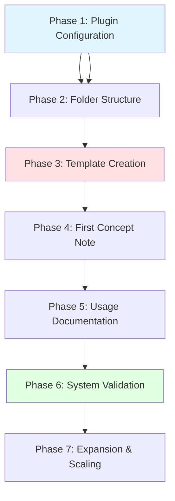

# 🛠️ Self-Documenting Dataview System: Complete Implementation Walkthrough

> [!abstract] Purpose
> This is the **practical companion** to the [[Self-Documenting Dataview Knowledge System]] reference. While the reference explains *what* the system is and *why* it works, this guide shows you *exactly how* to build it from scratch in your Obsidian vault, step-by-step, with zero assumptions about prior knowledge.

---

## 🎯 Prerequisites Checklist

Before beginning implementation, ensure you have:

**Required:**
- [x] Obsidian installed (v1.4.0+ recommended) ✅ 2025-11-30
- [x] Dataview plugin installed (Settings → Community Plugins → Browse → "Dataview") ✅ 2025-11-30
- [x] Dataview enabled (Toggle switch next to Dataview in Community Plugins) ✅ 2025-11-30
- [x] Inline queries enabled (Settings → Dataview → Enable Inline Queries: ON) ✅ 2025-11-30
- [x] JavaScript queries enabled (Settings → Dataview → Enable JavaScript Queries: ON) ✅ 2025-11-30

**Recommended:**
- [x] [[Templater]] plugin installed (for template automation) ✅ 2025-11-30
- [x] Basic understanding of [[Markdown]] syntax ✅ 2025-11-30
- [x] Familiarity with Obsidian's note linking (`[[link]]` syntax) ✅ 2025-11-30

**Skill Level**: Intermediate (assumes basic Obsidian familiarity)
**Time Investment**: 2-3 hours for initial setup + ongoing usage
**Complexity**: ⭐⭐⭐ Advanced

---

## 📋 Implementation Roadmap



**Estimated Timeline:**
- Phase 1-2: 15 minutes
- Phase 3: 30 minutes
- Phase 4-5: 45 minutes
- Phase 6: 20 minutes
- Phase 7: Ongoing

---

## Phase 1: Plugin Configuration (15 minutes)

### Step 1.1: Install Dataview Plugin

1. Open Obsidian
2. Click Settings (gear icon) or press `Ctrl/Cmd + ,`
3. Navigate to **Community Plugins** in left sidebar
4. If first time using community plugins:
   - Click "Turn on community plugins"
   - Click "Browse" next to Community Plugins
5. Search for "Dataview"
6. Click "Install" on the Dataview plugin by Michael Brenan
7. Click "Enable" to activate the plugin

**Verification:**
- [x] Dataview appears in "Installed Plugins" section with toggle ON ✅ 2025-11-30

### Step 1.2: Configure Dataview Settings

1. Still in Settings, scroll down to "Plugin Options" section
2. Click "Dataview" to open its settings
3. Configure the following:

**Essential Settings:**
```
Enable Inline Queries: ✅ ON
Enable JavaScript Queries: ✅ ON
Enable Inline JavaScript Queries: ✅ ON
Enable Inline Field Highlighting: ✅ ON (helpful for debugging)
```

**Optional but Recommended:**
```
Warn on Empty Result: ✅ ON (helps catch errors)
Render Null As: (leave blank or set to "-")
Default Date Format: yyyy-MM-dd
Default Date + Time Format: yyyy-MM-dd HH:mm
```

**Screenshot Your Settings:**
> [!helpful-tip]
> Take a screenshot of your Dataview settings for future reference. Store it in a "System Documentation" folder.

**Verification:**
- [x] All essential settings are enabled ✅ 2025-11-30
- [x] Test inline query works (covered in next step)

### Step 1.3: Test Inline Query Functionality

Create a test note to verify inline queries work:

1. Create a new note called "Dataview Test"
2. Add the following content:

```markdown
---
test-field: "Hello World"
rating: 8
---

# Dataview Test

Simple inline query test: `= this.test-field`

Another test with calculation: `= this.rating * 2`

Current date: `= date(today)`
```

3. Switch to Reading Mode (Ctrl/Cmd + E)
4. **Expected Result:**
   - You should see: "Simple inline query test: Hello World"
   - "Another test with calculation: 16"
   - "Current date: 2024-11-22" (today's date)

**If it doesn't work:**

| Issue | Solution |
|-------|----------|
| Shows raw code | Enable "Inline Queries" in Dataview settings |
| Error message | Check syntax - must be `` `= ` `` with space after equals |
| No output | Switch to Reading Mode (inline queries don't run in Edit Mode) |

**Verification:**
- [x] Inline queries render correctly in Reading Mode
- [x] Delete "Dataview Test" note after successful verification

---

## Phase 2: Folder Structure Creation (10 minutes)

### Step 2.1: Create Documentation Hierarchy

Create the following folder structure in your vault:

```
Your Vault/
├── 📚 Knowledge Base/
│   ├── Dataview Documentation/
│   │   ├── Commands/           (for FLATTEN, GROUP BY, etc.)
│   │   ├── Functions/          (for filter(), flat(), contains(), etc.)
│   │   ├── Operators/          (for comparison operators)
│   │   └── Examples/           (for query usage examples)
│   └── [Your other knowledge areas]
├── 🔧 Templates/
│   └── Dataview Templates/     (for concept note templates)
└── 🎯 Meta/
    └── System Health/          (for analytics dashboards)
```

**How to Create Folders in Obsidian:**

**Method 1: File Explorer**
1. Right-click in File Explorer pane (left sidebar)
2. Select "New folder"
3. Name the folder (e.g., "Dataview Documentation")
4. Repeat for subfolders

**Method 2: Via Note Creation**
1. Press `Ctrl/Cmd + N` for new note
2. In note name, type path: `Knowledge Base/Dataview Documentation/Commands/FLATTEN`
3. Obsidian creates folders automatically

**Verification:**
- [ ] All folders created
- [ ] Structure matches diagram above
- [ ] Can navigate folders in File Explorer

### Step 2.2: Create MOC (Map of Content)

Create a central hub note: `Dataview Documentation/Dataview Overview.md`

```markdown
---
tags: #moc #dataview #documentation-hub
Type: MOC
---

# Dataview Overview

Central hub for all Dataview-related documentation in this vault.

## 📚 Commands
- [[FLATTEN]]
- [[GROUP BY]]
- [[WHERE]]
- [[FROM]]
- [[TABLE]]
- [[LIST]]
- [[TASK]]

## 🔧 Functions
- [[filter]]
- [[flat]]
- [[contains]]
- [[map]]
- [[groupBy]]

## 🎯 Examples
- [[Task Management Queries]]
- [[Book Library Queries]]
- [[Project Tracking Queries]]

## 📊 System Health
- [[Documentation Coverage]]
- [[Query Performance Analysis]]

---

**Total Concepts Documented**: `= length(this.file.outlinks)`
**Last Updated**: `= this.file.mtime`
```

**Verification:**
- [ ] MOC created in `Dataview Documentation/` folder
- [ ] Inline queries show total outlinks and modification time
- [ ] Links are formatted correctly (will be red/unlinked initially - that's expected)

---

## Phase 3: Template Creation (30 minutes)

### Step 3.1: Create the Master Concept Template

Create file: `Templates/Dataview Templates/Self-Doc Concept Template.md`

**Full Template Code:**

````markdown
---
aliases: 
Type: DataCommand
MOC: "[[Dataview Overview]]"
---
status:: `$= const value = Math.round(((dv.page(dv.current().file.name).file.tasks.where(t => t.completed).where(t => String(t.section).includes("Status Tasks")).length) / (dv.page(dv.current().file.name).file.tasks).where(t => String(t.section).includes("Status Tasks")).length) * 100); "<progress value='" + value + "' max='100'></progress>" + "<span style='font-size:smaller;color:var(--text-muted)'>" + value + "% &nbsp;| &nbsp;" + (dv.page(dv.current().file.name).file.tasks.where(t => String(t.section).includes("Status Tasks")).length - dv.page(dv.current().file.name).file.tasks.where(t => t.completed).where(t => String(t.section).includes("Status Tasks")).length) + " left</span>"`

###### Status Tasks
- [ ] Create the note
- [ ] Write the YAML metadata  
- [ ] Add official documentation link
- [ ] Write concept explanation
- [ ] Add query examples
- [ ] Test query functionality
- [ ] Add screenshot to Query meta

# {{CONCEPT_NAME}}

> [!definition]
> Brief definition of what this concept does.

- docs:: [Official Documentation](https://blacksmithgu.github.io/obsidian-dataview/)

## Concept Explanation

[Detailed explanation of the concept, including:]
- What it does
- When to use it
- How it works
- Common use cases

## {{CONCEPT_NAME}} Self-Discovery

This query automatically finds all notes in the vault that use this concept:

```dataview
TABLE flat(filter(rows.L, (t) => t.text = "Query meta").children.text) as Metadata, embed(filter(flat(filter(rows.L, (t) => t.text = "Query meta").children), (t2) => t2.image).image)[0] as Image
WHERE file.lists and contains(file.lists.text,"Query meta")
FLATTEN file.lists as L
WHERE !L.task
GROUP BY L.section as Sections
WHERE contains(rows.L.children.dataCommands, this.file.link)
```

>[!info]- Rendered Query
>
>```dataview
>TABLE flat(filter(rows.L, (t) => t.text = "Query meta").children.text) as Metadata, embed(filter(flat(filter(rows.L, (t) => t.text = "Query meta").children), (t2) => t2.image).image)[0] as Image
>WHERE file.lists and contains(file.lists.text,"Query meta")
>FLATTEN file.lists as L
>WHERE !L.task
>GROUP BY L.section as Sections
>WHERE contains(rows.L.children.dataCommands, this.file.link)
>```

- Query meta
  - QueryType:: [[dql]]
  - dataCommands:: [[TABLE]], [[WHERE]], [[FLATTEN]], [[GROUP BY]]
  - functions:: [[filter]], [[flat]], [[contains]], [[embed]]
  - tags:: 
  - image:: 

## Examples

### Example 1: [Use Case Name]

```dataview
[Example query using this concept]
```

**Explanation**: [What this query does]

## Related Concepts
- [[Related Concept 1]]
- [[Related Concept 2]]

## Appearances

```dataviewjs
const inlinks = dv.current().file.inlinks
const outlinks = dv.current().file.outlinks.mutate(t=> t.embed = false)
const indexA = Array.from({ length: Math.max(inlinks.length, outlinks.length) }, (_, index) => index)
const data = indexA.map((i)=> [inlinks[i] || " ", outlinks[i] || " "])
const style = "<span style='font-size:smaller;color:var(--text-muted)'>("
dv.table(["inlinks "+ style + inlinks.length +")", "outlinks "+ style + outlinks.length +")"], data)
this.container.querySelectorAll(".table-view-table tr:first-of-type th:first-of-type > span.small-text")[0].style.visibility = "hidden";
```
````

**Template Customization Points:**

| Placeholder | Replace With | Example |
|-------------|--------------|---------|
| `{{CONCEPT_NAME}}` | The concept being documented | "FLATTEN" |
| `Type:` value | DataCommand, function, operator, or concept | "DataCommand" |
| `[Official Documentation]` link | Actual docs URL | `https://blacksmithgu.github.io/obsidian-dataview/queries/data-commands/#flatten` |

### Step 3.2: Optional - Create Templater Version

If you have [[Templater]] installed, create an enhanced version:

File: `Templates/Dataview Templates/Self-Doc Concept - Templater.md`

````markdown
---
aliases: 
Type: null
MOC: "[[Dataview Overview]]"
created: 2025-11-22
---
status:: `$= const value = Math.round(((dv.page(dv.current().file.name).file.tasks.where(t => t.completed).where(t => String(t.section).includes("Status Tasks")).length) / (dv.page(dv.current().file.name).file.tasks).where(t => String(t.section).includes("Status Tasks")).length) * 100); "<progress value='" + value + "' max='100'></progress>" + "<span style='font-size:smaller;color:var(--text-muted)'>" + value + "% &nbsp;| &nbsp;" + (dv.page(dv.current().file.name).file.tasks.where(t => String(t.section).includes("Status Tasks")).length - dv.page(dv.current().file.name).file.tasks.where(t => t.completed).where(t => String(t.section).includes("Status Tasks")).length) + " left</span>"`

###### Status Tasks
- [ ] Create the note ✅ 2025-11-22
- [ ] Write the YAML metadata
- [ ] Add official documentation link
- [ ] Write concept explanation
- [ ] Add query examples
- [ ] Test query functionality
- [ ] Add screenshot to Query meta

# self-documenting-dataview-implementation-guide

> [!definition]
> null

- docs:: [null](null)

[Rest of template as above...]
````

**Templater Features:**
- `tp.system.suggester()`: Interactive dropdown for Type selection
- `tp.date.now()`: Auto-inserts current date
- `tp.file.title`: Uses note title automatically
- `tp.system.prompt()`: Interactive prompts for customization

**Verification:**
- [ ] Template files created in `Templates/Dataview Templates/`
- [ ] Template contains all sections (YAML, status, self-discovery query, appearances)
- [ ] Placeholders identified for customization

---

## Phase 4: Creating Your First Concept Note (45 minutes)

### Step 4.1: Document the FLATTEN Command

Let's create a comprehensive documentation note for the FLATTEN command as our first example.

**Create the Note:**

1. Navigate to `Knowledge Base/Dataview Documentation/Commands/`
2. Create new note: `FLATTEN.md`
3. Copy content from template (or insert via Templater)
4. Customize with FLATTEN-specific content

**Complete FLATTEN.md Content:**

````markdown
---
aliases: [Dataview FLATTEN, FLATTEN command]
Type: DataCommand
MOC: "[[Dataview Overview]]"
created: 2024-11-22
---
status:: `$= const value = Math.round(((dv.page(dv.current().file.name).file.tasks.where(t => t.completed).where(t => String(t.section).includes("Status Tasks")).length) / (dv.page(dv.current().file.name).file.tasks).where(t => String(t.section).includes("Status Tasks")).length) * 100); "<progress value='" + value + "' max='100'></progress>" + "<span style='font-size:smaller;color:var(--text-muted)'>" + value + "% &nbsp;| &nbsp;" + (dv.page(dv.current().file.name).file.tasks.where(t => String(t.section).includes("Status Tasks")).length - dv.page(dv.current().file.name).file.tasks.where(t => t.completed).where(t => String(t.section).includes("Status Tasks")).length) + " left</span>"`

###### Status Tasks
- [x] Create the note ✅ 2024-11-22
- [x] Write the YAML metadata ✅ 2024-11-22
- [ ] Add official documentation link
- [ ] Write concept explanation
- [ ] Add query examples
- [ ] Test query functionality
- [ ] Add screenshot to Query meta

# FLATTEN

> [!definition]
> **FLATTEN** is a Dataview data command that splits multi-value fields into separate rows. It's the opposite of [[GROUP BY]]—instead of combining rows, it expands them. Each value in an array becomes its own result row, with all other field data duplicated.

- docs:: [FLATTEN Command Documentation](https://blacksmithgu.github.io/obsidian-dataview/queries/data-commands/#flatten)

## Concept Explanation

### What FLATTEN Does

FLATTEN takes a multi-value field (an array) and creates a **new row** for each value in that array. Think of it like "unpacking" a list into individual items.

**Simple Example:**
```
Before FLATTEN:
- Note "Book.md" has field: genres = ["Fantasy", "Adventure", "Mystery"]
- Result: 1 row

After FLATTEN genres:
- Row 1: genres = "Fantasy"
- Row 2: genres = "Adventure"  
- Row 3: genres = "Mystery"
- Result: 3 rows (all other fields duplicated in each row)
```

### When to Use FLATTEN

Use FLATTEN when you need to:

1. **Group by multi-value fields**: Can't group by arrays directly—must flatten first
2. **Filter on individual array elements**: Apply WHERE conditions to specific values
3. **Count occurrences**: Calculate how many notes have each value
4. **Process list items**: Work with individual list items (`file.lists`, `file.tasks`)

### How It Works Mechanically

**Syntax:**
```
FLATTEN <field> AS <new_name>
```

**Key Rules:**
- `AS <new_name>` is optional but **highly recommended** (avoids overwriting original field)
- Order matters: FLATTEN must come BEFORE any operations using the flattened field
- Can use multiple FLATTEN commands in one query
- Flattening single values creates no new rows but allows renaming

### Common Use Cases

| Use Case | Example |
|----------|---------|
| **Multi-tag filtering** | FLATTEN file.tags to filter by individual tags |
| **Genre grouping** | FLATTEN genres then GROUP BY genres |
| **List item processing** | FLATTEN file.lists to work with individual bullets |
| **Task extraction** | FLATTEN file.tasks to analyze specific tasks |
| **Calculated fields** | FLATTEN with expressions to create new computed values |

## FLATTEN Self-Discovery

This query automatically finds all notes in the vault that use FLATTEN:

```dataview
TABLE flat(filter(rows.L, (t) => t.text = "Query meta").children.text) as Metadata, embed(filter(flat(filter(rows.L, (t) => t.text = "Query meta").children), (t2) => t2.image).image)[0] as Image
WHERE file.lists and contains(file.lists.text,"Query meta")
FLATTEN file.lists as L
WHERE !L.task
GROUP BY L.section as Sections
WHERE contains(rows.L.children.dataCommands, this.file.link)
```

>[!info]- Rendered Query
>
>```dataview
>TABLE flat(filter(rows.L, (t) => t.text = "Query meta").children.text) as Metadata, embed(filter(flat(filter(rows.L, (t) => t.text = "Query meta").children), (t2) => t2.image).image)[0] as Image
>WHERE file.lists and contains(file.lists.text,"Query meta")
>FLATTEN file.lists as L
>WHERE !L.task
>GROUP BY L.section as Sections
>WHERE contains(rows.L.children.dataCommands, this.file.link)
>```

- Query meta
  - QueryType:: [[dql]]
  - dataCommands:: [[TABLE]], [[WHERE]], [[FLATTEN]], [[GROUP BY]]
  - functions:: [[filter]], [[flat]], [[contains]], [[embed]]
  - tags:: #dataview #query-patterns #self-referential
  - image:: 

## Examples

### Example 1: Genre Grouping

**Scenario**: Show all unique genres across book notes with count

```dataview
TABLE rows.file.link AS "Books"
FROM #books
FLATTEN genres
GROUP BY genres
SORT length(rows) DESC
```

**Explanation**: 
- Flattens multi-value `genres` field
- Groups by each individual genre
- Shows books per genre
- Sorts by most popular genre first

### Example 2: Task List Processing

**Scenario**: Extract all incomplete tasks from daily notes

```dataview
TASK
FROM "Daily Notes"
FLATTEN file.tasks AS T
WHERE !T.completed
WHERE T.section = "Work"
```

**Explanation**:
- Flattens all tasks in daily notes
- Filters to incomplete tasks only
- Further filters to "Work" section tasks

### Example 3: Calculated Field Creation

**Scenario**: Calculate and display reading progress percentage

```dataview
TABLE progress + "%" AS "Progress"
FROM #books
FLATTEN round((pagesRead / totalPages) * 100) AS progress
WHERE progress < 100
SORT progress DESC
```

**Explanation**:
- Calculates percentage (pagesRead/totalPages * 100)
- Rounds to whole number
- Names result "progress"
- Filters to unfinished books
- Appends "%" for display

## Common Pitfalls

> [!warning] FLATTEN After GROUP BY
> **Problem**: Flattening AFTER grouping doesn't work as expected
> 
> ```dataview
> GROUP BY genres
> FLATTEN genres  # ❌ WRONG - too late!
> ```
> 
> **Solution**: FLATTEN first, THEN group
> 
> ```dataview
> FLATTEN genres
> GROUP BY genres  # ✅ CORRECT
> ```

> [!warning] Flattening Objects
> **Problem**: FLATTEN only works on arrays and single values, not objects
> 
> ```yaml
> nested:
>   - key1: value1
>     key2: value2  # This is an object
> ```
> 
> Flattening `nested` won't expand the object properties.

## Related Concepts
- [[GROUP BY]] - The opposite operation (combining rows)
- [[WHERE]] - Often used after FLATTEN for filtering
- [[file.lists]] - Common field to flatten
- [[file.tasks]] - Common field to flatten for task queries
- [[rows]] - Array created by GROUP BY that can be flattened

## Appearances

```dataviewjs
const inlinks = dv.current().file.inlinks
const outlinks = dv.current().file.outlinks.mutate(t=> t.embed = false)
const indexA = Array.from({ length: Math.max(inlinks.length, outlinks.length) }, (_, index) => index)
const data = indexA.map((i)=> [inlinks[i] || " ", outlinks[i] || " "])
const style = "<span style='font-size:smaller;color:var(--text-muted)'>("
dv.table(["inlinks "+ style + inlinks.length +")", "outlinks "+ style + outlinks.length +")"], data)
this.container.querySelectorAll(".table-view-table tr:first-of-type th:first-of-type > span.small-text")[0].style.visibility = "hidden";
```
````

**Customization Steps You Just Completed:**

- [x] Replaced `{{CONCEPT_NAME}}` with "FLATTEN"
- [x] Set `Type:` to "DataCommand"
- [x] Added official documentation link
- [x] Wrote comprehensive explanation
- [x] Added 3 practical examples
- [x] Included common pitfalls section
- [x] Linked related concepts
- [x] Marked first two Status Tasks complete

**Verification:**
- [ ] Open note in Reading Mode
- [ ] Status bar displays: `[███░░░░░] 29% | 5 left` (2 of 7 tasks complete)
- [ ] Self-discovery query shows "No results" (expected - no notes reference FLATTEN yet)
- [ ] Appearances table shows no inlinks/outlinks (or only [[Dataview Overview]] if you linked it)

---

## Phase 5: Creating Usage Documentation (30 minutes)

Now let's create a note that *uses* FLATTEN so the self-discovery query has something to find.

### Step 5.1: Create Example Query Note

Create: `Knowledge Base/Dataview Documentation/Examples/Book Library Queries.md`

````markdown
---
tags: #query-examples #dataview #books
Type: example
MOC: "[[Dataview Overview]]"
---

# Book Library Queries

Collection of Dataview queries for managing a book library with multi-value fields like genres, authors, and tags.

## Query 1: Books by Genre with Counts

### Purpose
Display all unique genres with the books that match each genre, sorted by most popular genre.

### Query

```dataview
TABLE rows.file.link AS "Books", length(rows) AS "Count"
FROM #books
FLATTEN genres
GROUP BY genres AS "Genre"
SORT "Count" DESC
```

### Query Metadata

- Query meta
  - QueryType:: [[dql]]
  - dataCommands:: [[TABLE]], [[FROM]], [[FLATTEN]], [[GROUP BY]], [[SORT]]
  - functions:: [[length]]
  - tags:: #books #library-management #genre-analysis
  - image:: 
  - complexity:: intermediate
  - domain:: [[Library Management]]

### Explanation

This query demonstrates a classic FLATTEN + GROUP BY pattern:

1. **FROM #books**: Starts with all notes tagged #books
2. **FLATTEN genres**: Expands the multi-value `genres` field—a book with `genres: ["Fantasy", "Sci-Fi"]` becomes 2 rows
3. **GROUP BY genres**: Collects all rows back together by each unique genre value
4. **rows.file.link**: Shows which books belong to each genre
5. **length(rows)**: Counts how many books per genre
6. **SORT "Count" DESC**: Orders by most popular genre first

### Sample Output

| Genre | Books | Count |
|-------|-------|-------|
| Fantasy | [[Book A]], [[Book B]], [[Book C]] | 3 |
| Sci-Fi | [[Book B]], [[Book D]] | 2 |
| Mystery | [[Book E]] | 1 |

### Use Cases

- Discover which genres you read most
- Find books by preferred genre
- Identify under-represented genres in your library
- Create genre-specific reading lists

---

## Query 2: Reading Progress Dashboard

### Purpose
Show books in progress with completion percentage, sorted by how close you are to finishing.

### Query

```dataview
TABLE 
  pagesRead AS "Pages Read",
  totalPages AS "Total Pages",
  progress + "%" AS "Progress"
FROM #books
FLATTEN round((pagesRead / totalPages) * 100) AS progress
WHERE progress > 0 AND progress < 100
SORT progress DESC
```

### Query Metadata

- Query meta
  - QueryType:: [[dql]]
  - dataCommands:: [[TABLE]], [[FROM]], [[FLATTEN]], [[WHERE]], [[SORT]]
  - functions:: [[round]]
  - tags:: #reading-tracker #productivity #progress-monitoring
  - image::
  - complexity:: intermediate
  - domain:: [[Reading Management]]

### Explanation

1. **FLATTEN with calculation**: Creates a computed field `progress`
2. **round()**: Ensures clean percentage (no decimals)
3. **WHERE clause**: Filters to started but unfinished books
4. **SORT progress DESC**: Shows nearly-complete books first

### Sample Output

| File | Pages Read | Total Pages | Progress |
|------|------------|-------------|----------|
| [[Book A]] | 285 | 300 | 95% |
| [[Book B]] | 140 | 200 | 70% |
| [[Book C]] | 80 | 250 | 32% |

---

## Related Queries
- [[Task Management Queries]]
- [[Project Tracking Queries]]
- [[Daily Note Aggregations]]
````

**What We Just Did:**

- [x] Created a practical usage example
- [x] Documented TWO queries that use FLATTEN
- [x] Added Query meta structures with proper inline field syntax
- [x] Linked to `[[FLATTEN]]` in the dataCommands field
- [x] Provided detailed explanations and sample outputs

**Verification:**
- [ ] Created `Book Library Queries.md` in Examples folder
- [ ] Query meta sections properly formatted
- [ ] Contains links to `[[FLATTEN]]` in dataCommands

### Step 5.2: Verify Self-Discovery Works

Now return to your `FLATTEN.md` note:

1. Open `FLATTEN.md`
2. Scroll to the "FLATTEN Self-Discovery" section
3. Look at the query results (in Reading Mode)

**Expected Result:**

The query should now display something like:

| Sections | Metadata | Image |
|----------|----------|-------|
| Query 1: Books by Genre with Counts | QueryType:: [[dql]]<br>dataCommands:: [[04-library/02-pkb-and-pkm-learning/-reference/-official-documentation/-obsidian/-formatting/table]], [[from]], [[flatten]], [[GROUP BY]], [[04-library/02-pkb-and-pkm-learning/-reference/-official-documentation/-pkb-examples/knowledge/001-dataview/dql/data-commands/sort]]<br>functions:: [[length]] | |
| Query 2: Reading Progress Dashboard | QueryType:: [[dql]]<br>dataCommands:: [[04-library/02-pkb-and-pkm-learning/-reference/-official-documentation/-obsidian/-formatting/table]], [[from]], [[flatten]], [[where]], [[04-library/02-pkb-and-pkm-learning/-reference/-official-documentation/-pkb-examples/knowledge/001-dataview/dql/data-commands/sort]]<br>functions:: [[round]] | |

> [!attention]
> If you see "No results", troubleshoot:
> 1. Verify "Query meta" list structure is exact in Book Library Queries.md
> 2. Check that `dataCommands:: [[FLATTEN]]` includes the link
> 3. Ensure list is NOT a task (no `- [ ]`)
> 4. Confirm you're in Reading Mode

**Verification:**
- [ ] FLATTEN.md self-discovery query shows results from Book Library Queries.md
- [ ] Results display metadata fields correctly
- [ ] Clicking results navigates to source note

---

## Phase 6: System Validation & Testing (20 minutes)

### Step 6.1: Complete System Test Checklist

Run through this comprehensive test to ensure all components work:

**Test 1: Progress Tracking**
- [ ] Mark another task complete in FLATTEN.md
- [ ] Progress bar updates automatically (may need to close/reopen note)
- [ ] Percentage calculation is accurate
- [ ] "X left" count is correct

**Test 2: Self-Discovery Query**
- [ ] Self-discovery query in FLATTEN.md returns results
- [ ] Results include Book Library Queries sections
- [ ] Metadata displays as readable text (not code)
- [ ] Can click section names to navigate

**Test 3: Appearances Section**
- [ ] Inlinks table shows "Book Library Queries.md"
- [ ] Outlinks table shows "Dataview Overview" and related concepts
- [ ] Counts in headers match actual rows
- [ ] No JavaScript errors in console (F12)

**Test 4: Template Functionality**
- [ ] Can create new concept note from template
- [ ] Status field renders on first use
- [ ] Self-discovery query executes without errors
- [ ] Appearances section works in new notes

### Step 6.2: Create Second Concept for Validation

Let's create one more concept to fully validate the system.

Create: `Knowledge Base/Dataview Documentation/Commands/GROUP BY.md`

**Quick Template Application:**

1. Copy content from Self-Doc Concept Template
2. Replace `{{CONCEPT_NAME}}` with "GROUP BY"
3. Add basic definition and documentation link
4. Mark first task complete

**Minimal Content:**

````markdown
---
aliases: [Dataview GROUP BY]
Type: DataCommand
MOC: "[[Dataview Overview]]"
---
status:: `$= const value = Math.round(((dv.page(dv.current().file.name).file.tasks.where(t => t.completed).where(t => String(t.section).includes("Status Tasks")).length) / (dv.page(dv.current().file.name).file.tasks).where(t => String(t.section).includes("Status Tasks")).length) * 100); "<progress value='" + value + "' max='100'></progress>" + "<span style='font-size:smaller;color:var(--text-muted)'>" + value + "% &nbsp;| &nbsp;" + (dv.page(dv.current().file.name).file.tasks.where(t => String(t.section).includes("Status Tasks")).length - dv.page(dv.current().file.name).file.tasks.where(t => t.completed).where(t => String(t.section).includes("Status Tasks")).length) + " left</span>"`

###### Status Tasks
- [x] Create the note ✅ 2024-11-22
- [ ] Write the YAML metadata
- [ ] Add official documentation link
- [ ] Write concept explanation
- [ ] Add query examples

# GROUP BY

> [!definition]
> **GROUP BY** combines rows that share the same value for a specified field, creating grouped results. It's the opposite of [[FLATTEN]].

- docs:: [GROUP BY Documentation](https://blacksmithgu.github.io/obsidian-dataview/queries/data-commands/#group-by)

[Rest of template sections...]
````

Now update `Book Library Queries.md` to reference GROUP BY:

```markdown
- Query meta
  - QueryType:: [[dql]]
  - dataCommands:: [[TABLE]], [[FROM]], [[FLATTEN]], [[GROUP BY]], [[SORT]]
  - functions:: [[length]]
```

**Verification:**
- [ ] GROUP BY.md created
- [ ] Self-discovery query in GROUP BY.md shows Book Library Queries results
- [ ] Both FLATTEN and GROUP BY now have working self-discovery
- [ ] System demonstrates network effect (adding one usage example benefits multiple concept notes)

---

## Phase 7: Expansion & Scaling (Ongoing)

### Step 7.1: Documentation Expansion Strategy

**Week 1-2 Goals:**
- [ ] Document 5-10 core Dataview commands
- [ ] Create 3-5 query example notes
- [ ] Ensure each example links to 2-3 concepts

**Recommended Command Priority:**

1. **Essential Commands** (Week 1):
   - [ ] FLATTEN (✅ Complete)
   - [ ] GROUP BY (✅ Complete)
   - [ ] WHERE
   - [ ] FROM
   - [ ] TABLE
   - [ ] SORT

2. **Common Functions** (Week 2):
   - [ ] filter()
   - [ ] map()
   - [ ] flat()
   - [ ] contains()
   - [ ] length()

3. **Advanced Patterns** (Week 3-4):
   - [ ] DataviewJS basics
   - [ ] Complex aggregations
   - [ ] Multi-step transformations

### Step 7.2: System Health Monitoring

Create: `Meta/System Health/Dataview Documentation Coverage.md`

````markdown
---
tags: #system-analytics #documentation-health
---

# Dataview Documentation Coverage

## Total Concepts Documented

```dataview
TABLE Type, length(file.inlinks) AS "References"
FROM "Knowledge Base/Dataview Documentation"
WHERE Type
SORT "References" DESC
```

## Orphaned Concepts (No Inlinks)

Concepts that exist but aren't referenced anywhere yet:

```dataview
LIST
FROM "Knowledge Base/Dataview Documentation"
WHERE Type AND !file.inlinks
SORT file.name ASC
```

## Most Referenced Concepts

```dataview
TABLE length(file.inlinks) AS "Inlink Count", Type
FROM "Knowledge Base/Dataview Documentation"
WHERE Type
SORT "Inlink Count" DESC
LIMIT 10
```

## Documentation Progress

```dataviewjs
const pages = dv.pages('"Knowledge Base/Dataview Documentation"').where(p => p.Type)
const completed = pages.where(p => {
  const tasks = p.file.tasks.where(t => String(t.section).includes("Status Tasks"))
  if (tasks.length === 0) return false
  return tasks.where(t => t.completed).length === tasks.length
})

dv.header(3, "Overall Progress")
dv.paragraph(`**Completed**: ${completed.length} / ${pages.length} (${Math.round((completed.length/pages.length)*100)}%)`)
dv.paragraph(`**Total Concepts**: ${pages.length}`)
dv.paragraph(`**Incomplete**: ${pages.length - completed.length}`)
```

## Recent Updates

```dataview
TABLE file.mtime AS "Last Modified"
FROM "Knowledge Base/Dataview Documentation"
WHERE Type
SORT file.mtime DESC
LIMIT 5
```
````

**What This Dashboard Provides:**

- Total concept count
- Coverage analysis (which concepts are well-linked)
- Orphaned concept detection (concepts needing more integration)
- Progress tracking across all documentation
- Recent activity monitoring

**Verification:**
- [ ] Dashboard created
- [ ] All queries execute successfully
- [ ] Results accurately reflect documentation state
- [ ] Can use this as weekly review tool

### Step 7.3: Maintenance Workflow

**Weekly Review Ritual (15 minutes):**

1. Open `Dataview Documentation Coverage.md`
2. Check "Orphaned Concepts" section
3. For each orphan, create or update example notes that reference it
4. Review "Recent Updates" to ensure progress
5. Identify next 2-3 concepts to document

**Monthly Cleanup (30 minutes):**

1. Review all Status Tasks across concept notes
2. Update completion status
3. Add new examples discovered in usage
4. Refine Query meta structures based on patterns
5. Screenshot high-value queries for image:: fields

**Quality Metrics to Track:**

| Metric | Target | How to Measure |
|--------|--------|----------------|
| Avg Inlinks per Concept | >3 | Check Coverage dashboard |
| Documentation Completion | >80% | Progress section in Coverage dashboard |
| Orphan Rate | <20% | Orphaned Concepts query |
| Example-to-Concept Ratio | >2:1 | Manual count (Examples folder / Commands folder) |

---

## 🎓 Learning Outcomes & Next Steps

### What You've Accomplished

By completing this implementation guide, you have:

- ✅ **Built a self-documenting knowledge system** that automatically tracks concept usage
- ✅ **Mastered complex Dataview patterns** including FLATTEN + GROUP BY combinations
- ✅ **Created reusable templates** for scalable documentation
- ✅ **Implemented progress tracking** with real-time visual feedback
- ✅ **Established analytics infrastructure** for system health monitoring

### Skill Level Achieved

**Before**: Intermediate Obsidian user with basic Dataview knowledge
**After**: Advanced PKM architect capable of designing self-organizing systems

### Next Challenges

**Immediate (This Week):**
1. Document 5 more Dataview commands using the template
2. Create 2 domain-specific query collections (e.g., "Project Tracking", "Research Management")
3. Add screenshots to Query meta image fields

**Short-term (This Month):**
1. Extend system to document [[Templater]] patterns
2. Create cross-plugin integration examples (Dataview + Templater + QuickAdd)
3. Build a "Query Pattern Library" MOC

**Long-term (Next Quarter):**
1. Integrate [[03-notes/01_permanent-notes/01_cognitive-development/Spaced Repetition]] for concept review
2. Develop [[AI-Assisted]] query generation workflows
3. Create visual [[Knowledge Graph]] dashboards using Dataview + Charts plugin

---

## 🆘 Troubleshooting Reference

### Issue: "Query Returns No Results"

**Diagnosis Steps:**
1. Check if target notes exist
2. Verify "Query meta" list structure is exact
3. Ensure inline field syntax: `field:: value` (two colons)
4. Confirm links are formatted correctly: `[[Note Name]]`
5. Test query in isolation on a simple note

**Solution Template:**

```dataview
LIST
WHERE file.lists
WHERE contains(file.lists.text, "Query meta")
```

This simplified query shows ALL notes with Query meta sections.

### Issue: "Status Bar Shows NaN% or Error"

**Common Causes:**

| Cause | Fix |
|-------|-----|
| No tasks in Status Tasks section | Add at least one task |
| Section header mismatch | Ensure exactly `###### Status Tasks` (6 #'s) |
| Inline query disabled | Enable in Dataview settings |
| Syntax error in status field | Copy exact code from template |

### Issue: "Appearances Table Shows JavaScript Error"

**Debug Process:**

1. Open Developer Console (Ctrl/Cmd + Shift + I)
2. Look for error message
3. Common fixes:
   - Add `|| []` to handle null arrays
   - Check for typos in variable names
   - Ensure DataviewJS queries enabled in settings

### Issue: "Template Doesn't Work with Templater"

**Verification:**
- [ ] Templater plugin installed and enabled
- [ ] Template file in folder specified in Templater settings
- [ ] Used Templater command to insert (not copy-paste)
- [ ] Templater syntax uses `undefined` not `{{ }}`

---

## 📚 Additional Resources

### Official Documentation
- [Dataview Official Docs](https://blacksmithgu.github.io/obsidian-dataview/)
- [Dataview GitHub Repository](https://github.com/blacksmithgu/obsidian-dataview)
- [Dataview Example Vault](https://github.com/s-blu/obsidian_dataview_example_vault)

### Community Resources
- Obsidian Forum - Dataview Category
- r/ObsidianMD on Reddit
- Obsidian Discord #dataview channel

### Related PKB Concepts
- [[Zettelkasten Methodology]]
- [[MOC (Maps of Content) Design]]
- [[Progressive Summarization]]
- [[Building a Second Brain]]

---

**Implementation Complete! 🎉**

You now have a fully functional self-documenting Dataview knowledge system. The beauty of this architecture is that it **improves itself** as you use it—every new query example you create enriches the documentation of the concepts it uses, creating a virtuous cycle of knowledge accumulation.

**Next Action**: Document your next Dataview concept and watch the system self-organize!
