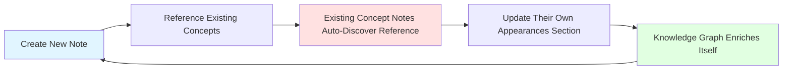

# 🔄 Self-Documenting Dataview Knowledge System: Architecture & Implementation

> [!abstract] Executive Summary
> This reference document analyzes and provides implementation guidance for an advanced **self-documenting knowledge architecture** where each concept note automatically discovers and displays all other notes that reference it. This creates a **recursive intelligence system** that becomes exponentially more valuable as the knowledge base grows, implementing genuine network effects within your [[03-notes/01_permanent-notes/02_personal-knowledge-base/Personal Knowledge Management]] vault. The system combines sophisticated [[dataview]] queries, [[DataviewJS]] progress tracking, and metadata architecture to create a living, self-organizing documentation ecosystem.

---

## 1. 🎯 System Overview: The Self-Documenting Paradigm

### What Makes This System Revolutionary

> [!principle-point]
> **The Core Insight**: Traditional documentation requires manual maintenance of cross-references. This system **inverts that paradigm**—each note contains a query that actively *discovers* its own usage across the vault. As you create new notes and link to existing concepts, the referenced notes automatically update their "Appearances" sections without any manual intervention.

**The Intelligence Loop:**


### System Components

The architecture consists of five integrated layers:

1. **[[Metadata Architecture Layer]]**: Standardized frontmatter and inline field conventions
2. **[[Progress Tracking Layer]]**: Automated completion percentage calculations
3. **[[Self-Referential Query Layer]]**: Queries that find notes referencing the current note
4. **[[Relationship Mapping Layer]]**: Bidirectional link analysis (inlinks/outlinks)
5. **[[Query Metadata Layer]]**: Structured documentation of queries themselves

---

## 2. 📐 Metadata Architecture: The Foundation

### Standard Frontmatter Structure

Every concept documentation note follows this YAML pattern:

```yaml
---
aliases: [Alternative Name 1, Abbreviation]
Type: DataCommand | function | operator | concept
MOC: "[[Dataview Overview]]"
---
```

> [!definition]
> **Type Field**: Categorical classification enabling query-based filtering
> - `DataCommand`: Dataview commands like FLATTEN, GROUP BY, WHERE
> - `function`: Dataview functions like filter(), flat(), contains()
> - `operator`: Logical/comparison operators
> - `concept`: Theoretical or methodological concepts
>
> **MOC Field**: Link to parent [[Map of Content]], creating hierarchical structure

### Inline Metadata Fields

The system uses Dataview's inline field syntax (`field:: value`) for dynamic content:

```markdown
status:: `$= [DataviewJS expression for progress calculation]`
```

This field appears immediately after frontmatter and calculates real-time completion percentage based on task completion in the "Status Tasks" section.

---

## 3. ⚙️ Progress Tracking System: DataviewJS Implementation

### The Self-Updating Status Field

> [!methodology-and-sources]
> **Technical Approach**: The status field uses **inline DataviewJS** (denoted by `` `$= ` ``) to execute JavaScript that:
> 1. Counts total tasks in the "Status Tasks" section
> 2. Counts completed tasks (marked with `✅` or `- [x]`)
> 3. Calculates percentage: `(completed / total) * 100`
> 4. Renders an HTML progress bar with styled metadata

**Complete Implementation:**

```javascript
status:: `$= const setPage = "CURRENT_NOTE_NAME"; const setFilter = "Status Tasks"; const value = Math.round(((dv.page(setPage).file.tasks.where(t => t.completed).where(t => String(t.section).includes(setFilter)).length) / (dv.page(setPage).file.tasks).where(t => String(t.section).includes(setFilter)).length) * 100); "<progress value='" + value + "' max='100'></progress>" + "<span style='font-size:smaller;color:var(--text-muted)'>" + value + "% &nbsp;| &nbsp;" + (dv.page(setPage).file.tasks.where(t => String(t.section).includes(setFilter)).length - dv.page(setPage).file.tasks.where(t => t.completed).where(t => String(t.section).includes(setFilter)).length) + " left</span>"`
```

**Code Breakdown:**

| Component | Purpose | Technical Detail |
|-----------|---------|------------------|
| `const setPage = "PAGE_NAME"` | Target note for task counting | Replace with actual note name or use `dv.current().file.name` |
| `const setFilter = "Status Tasks"` | Section identifier | Matches the header name containing tracked tasks |
| `dv.page(setPage).file.tasks` | Access all tasks | Dataview API method to retrieve task objects |
| `.where(t => t.completed)` | Filter completed tasks | Boolean check for task completion status |
| `.where(t => String(t.section).includes(setFilter))` | Filter by section | Ensures only "Status Tasks" section tasks are counted |
| `.length` | Count array items | Returns number of matching tasks |
| `Math.round((completed/total)*100)` | Calculate percentage | Rounded to nearest whole number |
| `<progress value='X' max='100'>` | HTML progress bar | Native HTML5 element for visual representation |
| `<span style='...''>` | Styled text output | Displays percentage and remaining count |

**Usage Example:**

```markdown
status:: `$= const setPage = "FLATTEN"; const setFilter = "Status Tasks"; const value = Math.round(((dv.page(setPage).file.tasks.where(t => t.completed).where(t => String(t.section).includes(setFilter)).length) / (dv.page(setPage).file.tasks).where(t => String(t.section).includes(setFilter)).length) * 100); "<progress value='" + value + "' max='100'></progress>" + "<span style='font-size:smaller;color:var(--text-muted)'>" + value + "% &nbsp;| &nbsp;" + (dv.page(setPage).file.tasks.where(t => String(t.section).includes(setFilter)).length - dv.page(setPage).file.tasks.where(t => t.completed).where(t => String(t.section).includes(setFilter)).length) + " left</span>"`

###### Status Tasks
- [x] create the note ✅ 2023-08-12
- [x] Write the YAML metadata ✅ 2023-10-13
- [x] Write the query ✅ 2023-08-12
- [ ] Link to the Doc Page
```

**Renders as:**
```
[████████████░░░░] 75% | 1 left
```

### Alternative: Templater-Based Dynamic Status

For those who prefer [[Templater]] syntax:

```
status:: `$= const value = Math.round(((dv.page(dv.current().file.name).file.tasks.where(t => t.completed).where(t => String(t.section).includes("Status Tasks")).length) / (dv.page(dv.current().file.name).file.tasks).where(t => String(t.section).includes("Status Tasks")).length) * 100); "<progress value='" + value + "' max='100'></progress>" + "<span style='font-size:smaller;color:var(--text-muted)'>" + value + "% &nbsp;| &nbsp;" + (dv.page(dv.current().file.name).file.tasks.where(t => String(t.section).includes("Status Tasks")).length - dv.page(dv.current().file.name).file.tasks.where(t => t.completed).where(t => String(t.section).includes("Status Tasks")).length) + " left</span>"`
```

**Advantage**: Uses `dv.current().file.name` instead of hardcoded page name, making it template-portable.

---

## 4. 🔍 Self-Referential Query System: The Core Intelligence

### The Discovery Query Pattern

> [!key-claim]
> **The Revolutionary Mechanism**: Each concept note contains a query that searches the entire vault for notes where that concept is referenced in a **Query meta** list structure. This creates automatic backlink intelligence that shows *how* and *where* the concept is being used.

**Standard Self-Discovery Query:**

```
TABLE flat(filter(rows.L, (t) => t.text = "Query meta").children.text) as Metadata, embed(filter(flat(filter(rows.L, (t) => t.text = "Query meta").children), (t2) => t2.image).image)[0] as Image
WHERE file.lists and contains(file.lists.text,"Query meta")
FLATTEN file.lists as L
WHERE !L.task
GROUP BY L.section as Sections
WHERE contains(rows.L.children.dataCommands, this.file.link)
```

### Query Deconstruction: Understanding Each Clause

Let me break down this sophisticated query step-by-step:

#### **Clause 1: TABLE Statement**

```
TABLE flat(filter(rows.L, (t) => t.text = "Query meta").children.text) as Metadata
```

> [!methodology-and-sources]
> **What This Does**: After grouping (explained later), `rows` contains all notes grouped by section. This clause:
> 1. Filters `rows.L` to find list items with text "Query meta"
> 2. Accesses `.children.text` to get the child list items (the metadata fields)
> 3. Uses `flat()` to flatten nested arrays into a single-level array
> 4. Names the column "Metadata"

#### **Clause 2: Image Embedding**

```
embed(filter(flat(filter(rows.L, (t) => t.text = "Query meta").children), (t2) => t2.image).image)[0] as Image
```

> [!methodology-and-sources]
> **What This Does**: 
> 1. Inner filter: Find "Query meta" list items, get their children
> 2. `flat()`: Flatten nested structure
> 3. Outer filter: Keep only items that have an `image` property
> 4. `.image`: Extract image field
> 5. `[0]`: Take first image
> 6. `embed()`: Render image in results
> 7. Names column "Image"

#### **Clause 3: Source Filter**

```
WHERE file.lists and contains(file.lists.text,"Query meta")
```

> [!methodology-and-sources]
> **What This Does**: Initial filtering before FLATTEN
> - `file.lists`: Only files that contain list items
> - `contains(file.lists.text, "Query meta")`: Only files with a list item containing "Query meta" text
> 
> This dramatically reduces the dataset before expensive operations.

#### **Clause 4: FLATTEN Operation**

```
FLATTEN file.lists as L
```

> [!definition]
> **FLATTEN Mechanics**: 
> - [[flatten]] is the opposite of [[GROUP BY]]
> - For each file, it creates a **new row** for each list item
> - Each row is a full duplicate of the original file data, except the flattened field
> - `as L` creates a new field called `L` that contains each individual list item
>
> **Example**: A file with 5 list items becomes 5 rows in the query results

**Visual Representation:**

```
BEFORE FLATTEN:
Row 1: File "Note A" (contains 3 lists)

AFTER FLATTEN file.lists as L:
Row 1: File "Note A", L = List Item 1
Row 2: File "Note A", L = List Item 2  
Row 3: File "Note A", L = List Item 3
```

#### **Clause 5: Task Filter**

```
WHERE !L.task
```

> [!methodology-and-sources]
> **What This Does**: Exclude task list items (`- [ ]` or `- [x]`)
> - `L.task` is a boolean property of list items
> - `!L.task` means "not a task" (regular bullet points only)
> 
> This ensures we only process metadata list items, not checklist tasks.

#### **Clause 6: GROUP BY**

```
GROUP BY L.section as Sections
```

> [!definition]
> **GROUP BY Mechanics**:
> When you group results, Dataview creates a new data structure:
> ```
> {
>   key: "Section Name",  // The value you grouped by
>   rows: [...]           // All original rows that matched
> }
> ```
> 
> **Critical Rule**: After GROUP BY, you MUST use `rows.field` to access original data.

**In This Query:**
- Groups all flattened list items by their containing section (header)
- Creates one result row per unique section name
- Names the group key "Sections"
- All original file/list data is now in `rows.L`

**Visual Representation:**

```
AFTER GROUP BY L.section:
Group 1: Sections = "FLATTEN Overview", rows = [all list items from that section]
Group 2: Sections = "GROUP BY Overview", rows = [all list items from that section]
```

#### **Clause 7: The Magic Filter**

```
WHERE contains(rows.L.children.dataCommands, this.file.link)
```

> [!key-claim]
> **This is the self-referential intelligence**:
> - `this.file.link`: Link to the CURRENT note (the one containing this query)
> - `rows.L.children.dataCommands`: The `dataCommands::` field from Query meta sections
> - `contains()`: Check if current note is referenced
>
> **Translation**: "Show me only sections where the `dataCommands::` field contains a link to THIS note"

**Example Workflow:**

1. Current note is "FLATTEN.md"
2. Query searches vault for "Query meta" sections
3. Filters to sections where `dataCommands:: [[FLATTEN]]`
4. Displays metadata about queries that use FLATTEN command

### The Query Meta Structure

For the self-discovery query to work, other notes must follow this list structure:

```markdown
- Query meta
  - QueryType:: [[dql]]
  - dataCommands:: [[Table]], [[WHERE]], [[FLATTEN]], [[GROUP BY]]
  - functions:: [[filter]], [[flat]], [[contains]], [[embed]]
  - tags:: #data-processing #automation
  - image:: [[Screenshot.png]]
```

> [!definition]
> **Query Meta List Structure**:
> - Parent list item: "Query meta" (exact text trigger)
> - Child items: Inline fields using `field:: value` syntax
> - `dataCommands::`: Array of links to command/concept notes
> - `functions::`: Array of links to function notes
> - `QueryType::`: Type classification (DQL, DataviewJS, Inline)
> - `tags::`: Topical categorization
> - `image::`: Optional screenshot of query output

---

## 5. 🔗 Relationship Mapping: Bidirectional Link Analysis

### The Appearances Section

Every concept note includes a DataviewJS block that visualizes **inlinks** (notes linking TO this note) and **outlinks** (notes this note links TO):

**Complete Implementation:**

````javascript
```dataviewjs
const inlinks = dv.current().file.inlinks
const outlinks = dv.current().file.outlinks.mutate(t=> t.embed = false)
const indexA = Array.from({ length: Math.max(inlinks.length, outlinks.length) }, (_, index) => index)
const data = indexA.map((i)=> [inlinks[i] || " ", outlinks[i] || " "])
const style = "<span style='font-size:smaller;color:var(--text-muted)'>("
dv.table(["inlinks "+ style + inlinks.length +")", "outlinks "+ style + outlinks.length +")"], data)
this.container.querySelectorAll(".table-view-table tr:first-of-type th:first-of-type > span.small-text")[0].style.visibility = "hidden";
`````


**Code Breakdown:**

| Line | Purpose | Technical Explanation |
|------|---------|----------------------|
| `const inlinks = dv.current().file.inlinks` | Get all backlinks | Array of pages linking to current note |
| `const outlinks = dv.current().file.outlinks.mutate(t=> t.embed = false)` | Get all forward links | Removes embed status (shows all as regular links) |
| `const indexA = Array.from({...})` | Create index array | Length = max of inlinks/outlinks to ensure all are displayed |
| `const data = indexA.map(...)` | Pair links by index | Creates rows pairing inlink[i] with outlink[i] |
| `const style = "..."` | Header styling | Muted text for count display |
| `dv.table([...], data)` | Render table | Two columns: inlinks and outlinks |
| `this.container.querySelectorAll(...)` | DOM manipulation | Hides specific UI element for cleaner display |

**Example Output:**

| inlinks (12) | outlinks (8) |
|--------------|--------------|
| [[Query Example 1]] | [[Dataview Overview]] |
| [[Dashboard Note]] | [[DQL Reference]] |
| [[Project Analysis]] | [[04-library/02-pkb-and-pkm-learning/-reference/-official-documentation/-obsidian/-bases/functions]] |
| [[Research Query]] | [[Data Commands]] |

### Why This Matters

> [!principle-point]
> **Network Intelligence**: The combination of self-discovery queries + bidirectional link analysis creates a **360-degree view** of each concept:
> - **Self-Discovery Query**: "Where am I actively being used?"
> - **Inlinks**: "Who references me?"
> - **Outlinks**: "What concepts do I depend on?"
>
> This transforms static documentation into dynamic relationship mapping.

---

## 6. 🏗️ Implementation Guide: Building Your Own System

### Phase 1: Template Creation

**Step 1: Create the Master Template**

Create a file called `Template - Self-Doc Concept.md` in your templates folder:

````markdown
---
aliases: 
Type: DataCommand
MOC: "[[Dataview Overview]]"
---
status:: `$= const value = Math.round(((dv.page(dv.current().file.name).file.tasks.where(t => t.completed).where(t => String(t.section).includes("Status Tasks")).length) / (dv.page(dv.current().file.name).file.tasks).where(t => String(t.section).includes("Status Tasks")).length) * 100); "<progress value='" + value + "' max='100'></progress>" + "<span style='font-size:smaller;color:var(--text-muted)'>" + value + "% &nbsp;| &nbsp;" + (dv.page(dv.current().file.name).file.tasks.where(t => String(t.section).includes("Status Tasks")).length - dv.page(dv.current().file.name).file.tasks.where(t => t.completed).where(t => String(t.section).includes("Status Tasks")).length) + " left</span>"`

###### Status Tasks
- [ ] Create the note
- [ ] Write the YAML metadata
- [ ] Add the docs page
- [ ] Write the query overview
- [ ] Add example screenshots

# {{TITLE}}

- docs:: [Official Documentation Link]

## {{TITLE}} Overview

```dataview
TABLE flat(filter(rows.L, (t) => t.text = "Query meta").children.text) as Metadata, embed(filter(flat(filter(rows.L, (t) => t.text = "Query meta").children), (t2) => t2.image).image)[0] as Image
WHERE file.lists and contains(file.lists.text,"Query meta")
FLATTEN file.lists as L
WHERE !L.task
GROUP BY L.section as Sections
WHERE contains(rows.L.children.dataCommands, this.file.link)
```

>[!info]- Rendered
>
>```
>TABLE flat(filter(rows.L, (t) => t.text = "Query meta").children.text) as Metadata, embed(filter(flat(filter(rows.L, (t) => t.text = "Query meta").children), (t2) => t2.image).image)[0] as Image
>WHERE file.lists and contains(file.lists.text,"Query meta")
>FLATTEN file.lists as L
>WHERE !L.task
>GROUP BY L.section as Sections
>WHERE contains(rows.L.children.dataCommands, this.file.link)
>```

- Query meta
  - QueryType:: [[dql]]
  - dataCommands:: 
  - functions:: 
  - tags:: 
  - image:: 

## Appearances

```dataviewjs
const inlinks = dv.current().file.inlinks
const outlinks = dv.current().file.outlinks.mutate(t=> t.embed = false)
const indexA = Array.from({ length: Math.max(inlinks.length, outlinks.length) }, (_, index) => index)
const data = indexA.map((i)=> [inlinks[i] || " ", outlinks[i] || " "])
const style = "<span style='font-size:smaller;color:var(--text-muted)'>("
dv.table(["inlinks "+ style + inlinks.length +")", "outlinks "+ style + outlinks.length +")"], data)
this.container.querySelectorAll(".table-view-table tr:first-of-type th:first-of-type > span.small-text")[0].style.visibility = "hidden";
```
````


### Phase 2: Creating Concept Notes

**Step 2: Document Your First Concept**

Use the template to create a note for a Dataview command (example: "FLATTEN.md"):

1. Replace `{{TITLE}}` with "FLATTEN"
2. Update `Type:` field to match (DataCommand, function, etc.)
3. Fill in the `docs::` link to official documentation
4. Complete Status Tasks as you work
5. Add relevant Query meta fields

### Phase 3: Creating Usage Examples

**Step 3: Create Notes That Use the Concept**

In any query-containing note, add the Query meta structure:

```markdown
## Example: Book Library Query

```dataview
TABLE title, rating, genres
FROM #books
FLATTEN genres
WHERE rating > 7
```

- Query meta
  - QueryType:: [[dql]]
  - dataCommands:: [[04-library/02-pkb-and-pkm-learning/-reference/-official-documentation/-obsidian/-formatting/table]], [[from]], [[flatten]], [[where]]
  - functions:: 
  - tags:: #library #data-organization
  - image:: [[Book-Query-Screenshot.png]]


### Phase 4: Watch the System Self-Organize

**Step 4: Observe Automatic Updates**

When you open the "FLATTEN" concept note, the self-discovery query will now automatically show your "Book Library Query" example in its results because it referenced `[[FLATTEN]]` in the dataCommands field.

---

## 7. 🎨 Advanced Patterns & Variations

### Pattern 1: Function-Specific Discovery

For function documentation notes, modify the WHERE clause:

```
WHERE contains(rows.L.children.functions, this.file.link)
```

**Use Case**: Your "filter()" function note discovers all queries using filter()

### Pattern 2: Multi-Concept Discovery

To find queries using ANY of several related concepts:

```
WHERE contains(rows.L.children.dataCommands, this.file.link) 
   OR contains(rows.L.children.functions, this.file.link)
```

**Use Case**: Comprehensive usage tracking across categories

### Pattern 3: Complexity-Based Filtering

Add complexity tracking to Query meta:

```markdown
- Query meta
  - QueryType:: [[dql]]
  - complexity:: intermediate
  - dataCommands:: [[FLATTEN]], [[GROUP BY]]
```

Then filter queries by complexity level:

```
WHERE contains(rows.L.children.dataCommands, this.file.link)
WHERE contains(rows.L.children.complexity, "intermediate")
```

### Pattern 4: Domain-Specific Organization

Extend the system for domain-specific documentation:

```markdown
- Query meta
  - QueryType:: [[dataviewjs]]
  - domain:: [[Task Management]]
  - useCase:: [[Habit Tracking]]
  - dataCommands:: 
  - functions:: [[dv.pages]], [[groupBy]], [[map]]
```

**Discovery Query for Domain:**

```
WHERE contains(rows.L.children.domain, this.file.link)
```

---

## 8. 🔧 Troubleshooting & Optimization

### Common Issues

#### Issue 1: Progress Bar Not Displaying

**Symptom**: Status field shows raw code instead of progress bar

**Causes & Solutions:**

| Cause | Solution |
|-------|----------|
| Inline DataviewJS disabled | Enable in Dataview settings: `Settings > Dataview > Enable Inline Queries` |
| Syntax error in inline code | Verify backticks: `` `$= ` `` with no spaces |
| No tasks in "Status Tasks" section | Add at least one task, causes division by zero |
| Header mismatch | Ensure section header is exactly `###### Status Tasks` (6 #'s) |

#### Issue 2: Self-Discovery Query Returns Nothing

**Symptom**: Query runs but shows no results

**Diagnostic Checklist:**

- [ ] Verify other notes contain "Query meta" list items
- [ ] Check that `dataCommands::` field includes link to current note
- [ ] Ensure list structure is exact (parent "Query meta", children with `::`)
- [ ] Confirm files are not in excluded folders
- [ ] Test query on a known working example

**Debug Query:**

```
LIST
WHERE file.lists
WHERE contains(file.lists.text, "Query meta")
```

This will show all files with "Query meta" sections.

#### Issue 3: Appearances Table Shows Errors

**Symptom**: DataviewJS errors in console

**Common Fixes:**

```
// Add null checks
const inlinks = dv.current().file.inlinks || []
const outlinks = dv.current().file.outlinks.mutate(t=> t.embed = false) || []

// Handle edge case of no links
if (inlinks.length === 0 && outlinks.length === 0) {
    dv.paragraph("No links found")
} else {
    // ... rest of code
}
```

### Performance Optimization

#### Optimization 1: Scope Limitation

If your vault is large (>5000 notes), limit query scope:

```
TABLE ...
FROM "Documentation/Dataview"  -- Limit to specific folder
WHERE file.lists and contains(file.lists.text,"Query meta")
...
```

#### Optimization 2: Cached Field Access

Instead of repeated property access:

```
// BEFORE (slower)
dv.page(setPage).file.tasks.where(...)

// AFTER (faster - cache the tasks)
const allTasks = dv.page(setPage).file.tasks
const completedTasks = allTasks.where(t => t.completed)...
```

#### Optimization 3: Index-Based Grouping

For very large result sets, pre-filter before FLATTEN:

```
TABLE ...
WHERE file.lists and contains(file.lists.text,"Query meta")
WHERE contains(file.outlinks, this.file.link)  -- Pre-filter
FLATTEN file.lists as L
...
```

---

## 9. 🚀 Integration with Existing PKB Systems

### Integration Pattern 1: Zettelkasten Compatibility

Adapt the system for [[Zettelkasten]] atomic notes:

**Modified Template for Atomic Concepts:**

```yaml
---
aliases: 
Type: concept
zettel-type: permanent
MOC: "[[Knowledge MOC]]"
related-concepts:: [[Concept A]], [[Concept B]]
---
```

**Discovery Query for Concept Relationships:**

```
LIST
WHERE contains(related-concepts, this.file.link)
```

### Integration Pattern 2: PARA Method

For [[para method]] organization:

```yaml
---
Type: resource
PARA-category: resources
project:: [[Active Project Name]]
---
```

**Project-Specific Discovery:**

```
TABLE project, status
WHERE Type = "resource"
WHERE contains(project, [[Current Project]])
```

### Integration Pattern 3: Academic Research

For literature review and research notes:

```markdown
- Research meta
  - methodology:: [[Grounded Theory]]
  - theoretical-framework:: [[Social Cognitive Theory]]
  - analysis-methods:: [[Thematic Analysis]]
  - citations:: [@Smith2023], [@Jones2024]
```

**Methodology Discovery Query:**

```
TABLE flat(filter(rows.L, (t) => t.text = "Research meta").children.text)
WHERE contains(file.lists.text,"Research meta")
FLATTEN file.lists as L
WHERE contains(rows.L.children.methodology, this.file.link)
```

---

## 10. 📊 System Analytics & Health Monitoring

### Health Dashboard Query

Create a dedicated "System Health" note with diagnostic queries:

**Coverage Metrics:**

```
TABLE 
  Type,
  length(file.inlinks) as "References",
  length(file.outlinks) as "Dependencies",
  file.mtime as "Last Updated"
FROM "Documentation/Dataview"
WHERE Type
SORT "References" DESC
```

**Orphaned Concept Detection:**

```
LIST
FROM "Documentation/Dataview"
WHERE Type AND !file.inlinks
```

**Completion Status Overview:**

```
const pages = dv.pages('"Documentation/Dataview"').where(p => p.Type)
const completed = pages.where(p => {
  const tasks = p.file.tasks.where(t => String(t.section).includes("Status Tasks"))
  return tasks.where(t => t.completed).length === tasks.length
})

dv.header(3, "Documentation Progress")
dv.paragraph(`**Completed**: ${completed.length} / ${pages.length} (${Math.round((completed.length/pages.length)*100)}%)`)
```

---

## 11. 🎓 Learning Outcomes & System Mastery

### Skill Progression Path

**Beginner** (Weeks 1-2):
- ✅ Understand self-discovery query mechanics
- ✅ Create concept notes from template
- ✅ Add Query meta to existing queries
- ✅ Interpret progress tracking output

**Intermediate** (Weeks 3-4):
- ✅ Customize queries for specific needs
- ✅ Troubleshoot common query errors
- ✅ Create domain-specific variations
- ✅ Optimize query performance

**Advanced** (Month 2+):
- ✅ Design multi-layered discovery systems
- ✅ Integrate with complex PKB architectures
- ✅ Build analytics dashboards
- ✅ Develop custom DataviewJS extensions

### Mastery Indicators

You've mastered the system when you can:

1. **Design Discovery Queries**: Create self-referential queries for new metadata structures without reference
2. **Debug Complex Queries**: Troubleshoot FLATTEN + GROUP BY interactions independently
3. **Extend the Architecture**: Add new metadata layers that maintain system coherence
4. **Teach Others**: Explain the self-documenting paradigm to other PKM practitioners

---

## 12. 🔮 Future Enhancements & Evolution

### Potential System Extensions

**1. AI-Assisted Query Generation**

Integrate with [[Claude API]] or [[GPT-4]] to:
- Auto-generate Query meta from query analysis
- Suggest optimal dataCommands based on query structure
- Identify missing documentation opportunities

**2. Visual Knowledge Graph Integration**

Combine with [[Obsidian Graph View]] modifications:
- Color-code nodes by concept Type
- Size nodes by reference count (inlinks)
- Create filtered views showing concept usage patterns

**3. Spaced Repetition Integration**

Link to [[03-notes/01_permanent-notes/01_cognitive-development/Spaced Repetition]] systems:
```yaml
---
sr-due: 2024-12-01
sr-interval: 30
sr-ease: 250
---
```

Query for concepts needing review based on usage frequency and last modification time.

**4. Automated Screenshot Capture**

Use [[Templater]] + external scripts to auto-capture query screenshots:
- Trigger screenshot on query save
- Auto-insert into `image::` field
- Version control for query output changes

---

# 🔗 Related Topics for PKB Expansion

1. **[[Advanced Dataview Query Patterns]]**
   - *Connection*: Deep dive into complex FLATTEN + GROUP BY + WHERE combinations for sophisticated data transformations
   - *Depth Potential*: Multi-level grouping, calculated fields, conditional aggregations, performance optimization techniques
   - *Knowledge Graph Role*: Technical reference hub connecting query syntax, use cases, and optimization strategies

2. **[[DataviewJS API Complete Reference]]**
   - *Connection*: Programmatic access to Dataview's capabilities beyond DQL limitations
   - *Depth Potential*: Custom table rendering, DOM manipulation, external API integration, async operations
   - *Knowledge Graph Role*: Advanced technical domain linking JavaScript, Obsidian API, and custom automation

3. **[[Self-Organizing Knowledge Systems Theory]]**
   - *Connection*: Theoretical foundations of emergent organization, network effects in knowledge bases, and information architecture principles
   - *Depth Potential*: Systems thinking applied to PKM, complexity theory, graph theory applications, cognitive load management
   - *Knowledge Graph Role*: Conceptual framework connecting computer science, cognitive science, and knowledge management

4. **[[Query-Driven Documentation Workflows]]**
   - *Connection*: Methodology for maintaining living documentation through automated discovery and relationship mapping
   - *Depth Potential*: Documentation-as-code principles, continuous documentation, quality metrics, stakeholder-specific views
   - *Knowledge Graph Role*: Workflow methodology cluster linking software engineering, technical writing, and knowledge management practices

---

**Document Metadata:**
- **Version**: 1.0
- **Last Updated**: 2024-11-22
- **Maintainer**: PKB Architect
- **Status**: Production-Ready Reference
- **Complexity Level**: Advanced
- **Prerequisites**: [[Dataview Plugin]], [[DataviewJS]], [[Metadata Architecture]], [[Markdown Fundamentals]]
