# 🗺️ Self-Documenting Knowledge System: Visual Architecture Guide

---
tags: #pkm #system-architecture #visual-guide #dataview #reference-note
aliases: [System Architecture Overview, Visual Reference Guide, Self-Documenting System Map]
---

> [!abstract] Document Purpose
> This visual reference provides **architectural diagrams**, **workflow maps**, and **decision trees** for understanding and implementing the self-documenting knowledge system. Use this as a companion to the implementation guides when you need to see "the big picture" or understand how components interact.

---

## 🏗️ System Architecture: Three-Layer Model


> [!definition]
> **Layer 1 (Foundation)**: Core mechanics that work identically across ALL domains. These never change.
>
> **Layer 2 (Configuration)**: Domain-specific settings and schemas. Customize once per domain.
>
> **Layer 3 (Implementation)**: Your actual content - concepts, applications, synthesis. Grows continuously.

---

## 🔄 The Intelligence Loop: How Self-Discovery Works


**The Magic**:
1. You create notes and link concepts naturally
2. Queries automatically discover these links
3. Concept notes self-update with usage information
4. No manual cross-reference maintenance needed

---

## 📁 Folder Architecture: Standard Structure


**Naming Conventions**:
- `00-` = Concept documentation (self-documenting notes)
- `01-` = Applications (notes that USE concepts)
- `02-` = Synthesis (cross-concept analysis)
- `03-` = Meta (configuration and templates)

**Numbers ensure proper sort order** in file explorer.

---

## 🎯 Concept Note Anatomy

```mermaid
graph TD
    A[Concept Note] --> B[🔝 Frontmatter]
    A --> C[📊 Status Field]
    A --> D[📝 Definition & Characteristics]
    A --> E[🔬 Self-Discovery Query]
    A --> F[✅ Status Tasks]
    A --> G[🌐 Knowledge Graph]
    
    B --> B1[Type: Theory/Method/etc]
    B --> B2[MOC: Link to domain]
    B --> B3[Aliases: Alternative names]
    
    C --> C1[Auto-updating progress bar]
    C --> C2[Based on Status Tasks]
    
    D --> D1[Core definition]
    D --> D2[Key characteristics]
    D --> D3[Principles/components]
    
    E --> E1[FLATTEN outlinks pattern]
    E --> E2[WHERE matches this file]
    E --> E3[Shows applications automatically]
    
    F --> F1[Documentation checklist]
    F --> F2[Drives progress tracking]
    
    G --> G1[Inbound links to/from this concept]
    G --> G2[Visual relationship mapping]
    
    style A fill:#e1f5ff
    style E fill:#ffe1e1
    style C fill:#e1ffe1
```



---

## 📄 Application Note Anatomy

```mermaid
graph TD
    A[Application Note] --> B[🔝 Frontmatter]
    A --> C[📊 Inline Metadata]
    A --> D[🧠 Concepts Applied Section]
    A --> E[📝 Main Content]
    
    B --> B1[Type: Application]
    B --> B2[MOC: Link to domain]
    B --> B3[Tags: Domain-specific]
    
    C --> C1[Field1:: Primary classification]
    C --> C2[Field2:: Links to concepts]
    C --> C3[Field3:: Additional context]
    
    D --> D1[List of concept links]
    D --> D2[How each is applied]
    D --> D3[Wiki-link format required]
    
    E --> E1[Study summary]
    E --> E2[Implementation details]
    E --> E3[Analysis/results]
    
    style A fill:#ffe1e1
    style C2 fill:#e1ffe1
    style D1 fill:#e1ffe1
```



**Critical Connection**: `Field2` (metadata) + Section D (Concepts Applied) create wiki-links that self-discovery queries detect.

---

## 🔍 Self-Discovery Query: Technical Flow


**Query Breakdown**:

```dataview
TABLE WITHOUT ID               ← No ID column
  file.link as "📄 Note",     ← Display file as link
  Field1,                      ← Show metadata field
  Field2,
  Field3
FROM "Domain/01-Applications"  ← Search this folder
FLATTEN file.outlinks as links ← Expand outlinks array
WHERE meta(links).path = this.file.path  ← Filter: only links TO this concept
GROUP BY file.link             ← Remove duplicates
```

---

## ⚙️ Progress Tracking: DataviewJS Flow


**Technical Details**:

```javascript
// 1. Get current file path
const setPage = dv.current().file.path;

// 2. Count completed tasks in "Status Tasks" section
const pgText = dv.current().file.tasks
    .where(t => t.section.subpath === "Status Tasks" && t.checked === true)
    .length;

// 3. Count total tasks in same section
const pgTotal = dv.current().file.tasks
    .where(t => t.section.subpath === "Status Tasks")
    .length;

// 4. Calculate percentage
const setPercent = Math.round((pgText / pgTotal) * 100);

// 5. Update status field with HTML progress bar
fm["status"] = "<progress value='" + setPercent + "' max='100'> </progress> " + setPercent + "%";
```

---

## 🎨 Domain Instantiation: Implementation Sequence

```mermaid
graph TD
    A[Start] --> B{Choose Domain Type}
    
    B -->|Pre-made| C[Template A, B, C, or D]
    B -->|Custom| D[Template E:<br/>Complete Worksheet]
    
    C --> E[Phase 2: Create Folders]
    D --> E
    
    E --> F[00-Concepts/<br/>01-Applications/<br/>02-Synthesis/<br/>03-Meta/]
    
    F --> G[Phase 3: Install Templates]
    
    G --> H[Copy Domain Config<br/>Copy Concept Template<br/>Copy Application Template<br/>Create MOC]
    
    H --> I[Phase 4: First Concept]
    
    I --> J[Duplicate Template<br/>Fill Frontmatter<br/>Write Definition<br/>Configure Query]
    
    J --> K[Phase 5: First Application]
    
    K --> L[Duplicate Template<br/>Add Metadata<br/>Link to Concept<br/>Write Content]
    
    L --> M{Validation:<br/>Does Application<br/>Appear in Query?}
    
    M -->|Yes| N[✅ System Operational!]
    M -->|No| O[Troubleshooting:<br/>Check Links,<br/>Verify Paths,<br/>Fix Field Names]
    
    O --> M
    
    N --> P[Phase 7: Expansion<br/>Add More Concepts<br/>Add More Applications<br/>System Self-Organizes]
    
    style A fill:#e1f5ff
    style N fill:#90EE90
    style O fill:#FFD700
    style P fill:#e1ffe1
```



**Timeline Estimates**:
- Pre-made Domain: **2-3 hours** to operational system
- Custom Domain: **3-4 hours** (includes planning)

---

## 🌐 Knowledge Graph: Relationship Mapping


**Legend**:
- **Solid Arrows** (→): Outlinks (Concept A references B and C)
- **Dashed Arrows** (-.->): Inlinks (Applications reference concepts)
- **Blue Nodes**: Concept Notes (documented entities)
- **Red Nodes**: Application Notes (usage examples)
- **Purple Nodes**: Synthesis Notes (cross-concept analysis)

**Knowledge Graph Section Shows**:
- **Inbound Links**: Other notes that reference this concept
- **Outbound Links**: Other concepts this note builds on

---

## 🔀 Multi-Domain System Architecture


**Domain Independence**: Each domain operates autonomously with its own:
- Taxonomy
- Metadata schema
- Folder structure
- Templates

**Meta-System Integration**: Domain Registry tracks all domains, enabling:
- Cross-domain queries
- Shared concept identification
- System-wide analytics

---

## 📊 Domain Health Monitoring Flow


**Health Indicators**:
- ✅ **Green**: All concepts have applications, all documentation complete
- ⚠️ **Yellow**: Some orphans or incomplete documentation (normal during growth)
- 🚨 **Red**: Many orphans, stagnant growth (needs attention)

---

## 🔄 Content Creation Workflow


**Key Insight**: The system maintains itself. You create content naturally; queries handle organization automatically.

---

## 🎯 Decision Tree: Troubleshooting Path

```mermaid
graph TD
    A[Problem Detected] --> B{What's the Issue?}
    
    B -->|Application Not<br/>in Query| C{Is Concept<br/>Linked?}
    C -->|No| C1[Add [[Concept]] Link]
    C -->|Yes| C2{Is Path<br/>Correct?}
    C2 -->|No| C3[Fix FROM Path]
    C2 -->|Yes| C4{Are Field<br/>Names Right?}
    C4 -->|No| C5[Match Field Names<br/>to Config]
    C4 -->|Yes| C6[Refresh Note]
    
    B -->|Status Bar<br/>Not Working| D{DataviewJS<br/>Enabled?}
    D -->|No| D1[Enable in Settings]
    D -->|Yes| D2{Tasks in<br/>'Status Tasks'?}
    D2 -->|No| D3[Fix Section Name]
    D2 -->|Yes| D4[Wait & Refresh]
    
    B -->|Metadata<br/>Not Showing| E{Field Names<br/>Match Config?}
    E -->|No| E1[Fix Field Names<br/>Case-Sensitive!]
    E -->|Yes| E2{Fields in<br/>Query?}
    E2 -->|No| E3[Add to TABLE]
    E2 -->|Yes| E4[Check Application<br/>Has Fields]
    
    B -->|Query<br/>Error| F{Check<br/>Console}
    F --> F1[Ctrl+Shift+I<br/>View Error]
    F1 --> F2[Fix Syntax<br/>Based on Message]
    
    style A fill:#ffe1e1
    style C1 fill:#90EE90
    style C3 fill:#90EE90
    style C5 fill:#90EE90
    style D1 fill:#90EE90
    style E1 fill:#90EE90
```

**Troubleshooting Principle**: Start with most common issues (linking, paths, field names) before investigating complex problems.

---

## 📈 Growth Trajectory: Expected Development


**Milestones**:
- **Week 1**: System operational, validation complete
- **Week 2-3**: Foundation solid (15 concepts, 30 applications)
- **Month 2**: Second domain active
- **Month 3+**: Self-sustaining ecosystem with visible network effects

---

## 🎓 Skill Progression Map


**Learning Path**:
1. **Beginner (Week 1-2)**: Follow templates exactly, focus on understanding mechanics
2. **Intermediate (Week 3-6)**: Customize for your needs, experiment with variations
3. **Advanced (Month 2-3)**: Design custom domains, optimize queries, create synthesis
4. **Expert (Month 3+)**: Meta-system design, performance optimization, methodology innovation

---

## 🔗 System Integration: Six-Pillar Hub Architecture


**Integration Points**:
- Each pillar connects to self-documenting system
- Domain Registry serves as central navigation hub
- Health dashboards feed into Analytics pillar
- Review scheduling managed by Maintenance pillar

---

# 🔗 Related Topics for PKB Expansion

1. **[[Mermaid Diagram Best Practices for PKB]]**
   - *Connection*: Visual system documentation crucial for complex architectures
   - *Depth Potential*: Advanced diagram types, interactive elements, automatic generation
   - *Knowledge Graph Role*: Makes implicit system structure explicit and shareable

2. **[[Query Performance Optimization in Large Vaults]]**
   - *Connection*: As system scales to hundreds of notes, query efficiency matters
   - *Depth Potential*: Caching strategies, query optimization, folder scoping techniques
   - *Knowledge Graph Role*: Maintains system responsiveness as knowledge graph grows

3. **[[Domain Taxonomy Evolution Strategies]]**
   - *Connection*: Taxonomies need refinement as understanding deepens
   - *Depth Potential*: Versioning systems, migration patterns, backwards compatibility
   - *Knowledge Graph Role*: Allows knowledge architecture to mature without breaking existing notes

4. **[[Visual Knowledge Graph Generation]]**
   - *Connection*: Transform self-documenting metadata into visual network diagrams
   - *Depth Potential*: Force-directed layouts, clustering algorithms, interactive visualization
   - *Knowledge Graph Role*: Makes relationship patterns visible, reveals structural insights

---

> [!helpful-tip] Using This Visual Guide
> - **During Planning**: Review architecture diagrams to understand system design
> - **During Implementation**: Follow workflow sequences for step-by-step guidance
> - **During Troubleshooting**: Use decision trees to diagnose issues systematically
> - **For Training**: Share diagrams with collaborators to explain system mechanics
