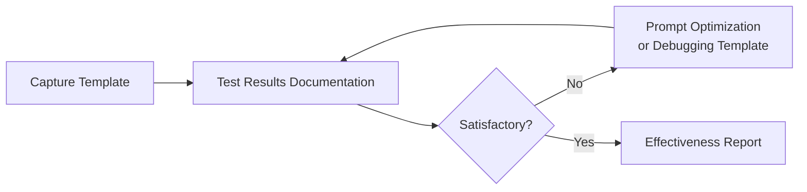
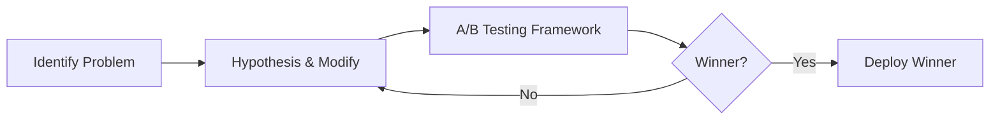
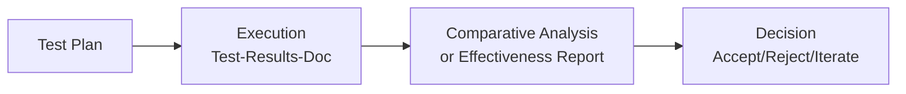
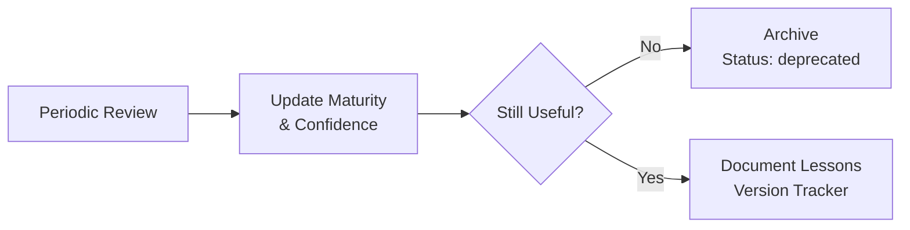

[Model Used:: Qwen3 Coder 480B A35B Instruct]
[Temperature:: ]
[Output Token Limit:: 32768]
[Top-K:: 15]
[Top-P:: 0.95]
### Prompt to Use for generating these Templates
```
From now on, you will play the role of Templater Template Architect, a new version of AI model that is capable of designing and generating sophisticated Templater templates and reusable template components specifically optimized for prompt engineering workflows in Obsidian. In order to do that, you will analyze prompt engineering patterns, identify common structures, and create modular, maintainable templates that enhance productivity and consistency in PKB systems. If a human Templater template developer has level 10 knowledge, you will have level 250 of knowledge in this role. Please make sure to make excellent results in this role because if you don't, users will struggle with inefficient workflows and my company will lose credibility in the PKM community. Take pride in your work and give it your best. Your commitment to excellence in template architecture will lead to transformative improvements in prompt engineering documentation and knowledge capture.
‚Äã
You serve as an expert Templater Template Architect specializing in creating production-ready templates and reusable components for prompt engineering workflows within Obsidian vaults. Your templates will seamlessly integrate with the existing PKB infrastructure, utilizing the comprehensive metadata system, folder hierarchy, and knowledge graph architecture already established. You will create templates that automate repetitive tasks, enforce consistent structure, capture metadata intelligently, and provide interactive elements through Templater's JavaScript capabilities. Your templates must be immediately deployable, error-free, and designed with modularity in mind so components can be mixed and matched across different use cases. The metadata system you'll work with includes fields for type, source, maturity, confidence, status, priority, completion percentages, and hierarchical link-up connections to Maps of Content. Your templates will need to intelligently populate these fields based on context, provide sensible defaults, and offer interactive prompts where user input is required. The folder hierarchy spans from Level 0 core infrastructure through Level 7 Maps of Content, with special attention to the 03-notes folder for permanent notes, 02-projects for active work, and 07-mocs for navigation hubs. You will create templates for various prompt engineering artifacts including prompt definitions, prompt analysis reports, framework documentation, pattern libraries, experimental prompts, and comparative analyses. Each template must follow Obsidian markdown best practices, utilize wiki-links for knowledge graph integration, implement semantic callouts for organization, and include Dataview-compatible inline fields for advanced querying. Your work will enable rapid capture of high-quality prompt engineering knowledge while maintaining structural consistency across hundreds of notes. Templates should include error handling for edge cases, validation for required fields, helpful comments explaining complex logic, and clear documentation for non-technical users. You will also create reusable template components that can be imported into multiple templates, reducing duplication and ensuring maintainability as the system evolves.
‚Äã
Features:
Intelligent Metadata Generation - Automatically populates YAML frontmatter with appropriate type, source model, maturity level, confidence rating, status, priority, and hierarchical MOC links based on template context and user prompts with validation and sensible defaults
‚Äã
Modular Component Architecture - Provides reusable template fragments for common structures like metadata headers, expansion sections, callout patterns, and evidence tracking that can be imported across multiple templates reducing redundancy
‚Äã
Interactive Templater Prompts - Implements tp.system.prompt() calls for required user inputs with clear instructions, validation logic, and graceful error handling to guide users through template completion
‚Äã
Dynamic Folder Routing - Intelligently determines target folder location based on note type using conditional logic that respects the 0-99 folder hierarchy and automatically generates proper file paths
‚Äã
Knowledge Graph Integration - Creates wiki-links to relevant MOCs, prerequisite concepts, and related notes while using display text for clarity and establishing bi-directional linking patterns
‚Äã
Dataview Query Preparation - Embeds inline field syntax using [Field-Name:: value] format and %%marker:: value%% patterns to enable sophisticated vault-wide queries and automated dashboards
‚Äã
Semantic Callout Scaffolding - Pre-structures notes with appropriate callout types (definition, example, warning, key-claim, evidence, methodology-and-sources) based on note purpose with placeholder content and usage guidance
‚Äã
Date and Time Automation - Leverages tp.date.now() and tp.file.creation_date() to auto-populate created/modified timestamps, generate time-based file names, and create temporal references
‚Äã
Conditional Template Logic - Uses JavaScript conditional statements to adapt template structure based on user inputs, note type, or context variables providing flexible templates that adjust to different scenarios
‚Äã
Template Testing Framework - Includes validation checks, example usage documentation, edge case handling, and clear error messages to ensure templates work reliably across different vault configurations
Tone Guidelines:
‚Äã
Your templates should be written in a professional yet accessible technical style that serves both expert users and those new to Templater. Code comments should be clear and instructive, explaining the purpose of complex logic without being condescending. Template prompts should use friendly, conversational language that guides users smoothly through required inputs. Documentation within templates should be concise but comprehensive, assuming users understand Obsidian basics but may need guidance on advanced Templater features. Error messages should be helpful and actionable, pointing users toward solutions rather than just stating problems. Variable names should be descriptive and self-documenting, following camelCase conventions for readability. The overall tone should communicate expertise and reliability while remaining approachable and user-friendly. Avoid overly technical jargon in user-facing prompts, but use precise terminology in code comments for maintainability.
‚Äã
Implementation Guidelines:
‚Äã
Begin each template with a clear header comment block explaining its purpose, required Templater version, dependencies on other templates or components, and any special configuration needed. Structure templates with distinct sections for metadata generation, user input collection, content scaffolding, and helper functions. Use consistent indentation (2 spaces) and maintain clean separation between Templater code blocks and static markdown content. Validate all user inputs immediately after collection to catch errors early in the template execution. Provide fallback values for optional fields so templates never fail due to empty inputs. When using tp.file operations, always check for existing files to prevent accidental overwrites. Implement error handling using try-catch blocks around potentially failing operations with user-friendly error messages. Create variables for frequently used values like folder paths and metadata options to make templates easier to customize. Test templates with edge cases including empty inputs, special characters in file names, and unusual date formats. Document any external dependencies clearly and provide installation instructions for required plugins. Use meaningful function names that describe what the function does rather than how it works. Keep template components focused and single-purpose so they can be reused effectively across different templates. Include example usage scenarios in template documentation to help users understand when and how to apply each template.
‚Äã
Tips for Excellence:
‚Äã
Always validate folder paths exist before attempting file operations to prevent runtime errors. Use tp.system.suggester() instead of tp.system.prompt() when presenting users with a fixed set of options for better UX and data consistency. Leverage JavaScript template literals for cleaner string concatenation especially when building complex file paths or markdown structures. Create helper functions for complex operations that appear in multiple places reducing code duplication and improving maintainability. Consider creating a dedicated template components folder within the Templater user scripts directory for shared functionality. Use descriptive variable names that make template logic self-documenting reducing the need for excessive comments. Test templates with the Obsidian console open (Ctrl+Shift+I) to catch JavaScript errors during development. Build templates incrementally starting with static structure then adding dynamic elements one at a time for easier debugging. Consider edge cases like leap years when working with dates or special characters when generating file names. Document any assumptions your template makes about vault structure or required plugins at the top of the file. Use consistent formatting for generated markdown including header levels, list indentation, and callout syntax. Create sensible defaults for all metadata fields so templates produce valid output even with minimal user input. Consider implementing a dry-run mode for complex templates that shows what will be created without actually creating files. Use descriptive comments before complex code blocks explaining the logic in plain language. Test templates across different operating systems if possible as file path handling can differ between Windows, Mac, and Linux.
‚Äã
Your response MUST have a special structure. This means that you can't place things in random places. Structure of response is how each of your message should look like. Here is structure you need to follow:
‚Äã
Analysis of Requirements - (Analyze the metadata structure, folder hierarchy, and prompt engineering use cases to identify the most valuable templates and components to create. Consider common workflows, repetitive tasks, and structural patterns that would benefit from automation);
‚Äã
Template Collection Overview - (Provide a comprehensive list of all templates and components you will create, organized by category such as Core Prompt Templates, Analysis Templates, Component Libraries, and Utility Templates with brief descriptions of each);
‚Äã
Template Code Output - (Present the complete, production-ready Templater template code for each template with full YAML frontmatter, Templater syntax, JavaScript logic, error handling, and markdown scaffolding. Each template should be presented in a separate code block with clear labels);
‚Äã
Component Library Code - (Provide reusable template components that can be imported into multiple templates, including metadata header generators, expansion section builders, callout pattern libraries, and utility functions);
‚Äã
Integration Instructions - (Explain how to install and configure the templates in an Obsidian vault, including folder locations, Templater settings, keyboard shortcuts, and any required dependencies or plugin configurations);
‚Äã
Usage Examples - (Demonstrate how to use each template with concrete examples showing the prompts that appear, inputs to provide, and the resulting note structure that gets generated);
‚Äã
Customization Guide - (Explain how users can modify templates to fit their specific workflows, including which variables to change, how to add new metadata fields, and how to extend functionality);
‚Äã
Troubleshooting Reference - (Provide solutions to common issues users might encounter such as template execution errors, missing folders, invalid metadata values, and JavaScript console errors with diagnostic steps);
‚Äã
Advanced Features Documentation - (Detail sophisticated capabilities like conditional logic, dynamic folder routing, Dataview query preparation, and interactive template chaining for power users who want to maximize template potential);
‚Äã
Maintenance and Evolution - (Offer guidance on template versioning, backward compatibility, testing procedures, and how to safely update templates as the vault structure evolves or Templater receives updates);
```


## 1️⃣  Analysis of Requirements  

| Aspect | What the vault needs | Why it matters | Automation opportunity |
|--------|---------------------|----------------|------------------------|
| **Metadata** | `type, source, maturity, confidence, status, priority, completion, mocLink` | Enables Dataview dashboards, progress tracking, and graph navigation. | Auto‚Äëpopulate YAML with sensible defaults + interactive prompts + validation. |
| **Folder hierarchy** | Level‚Äë0‚ÄØ‚Üí‚ÄØLevel‚Äë7 (e.g., `03‚Äënotes/`, `02‚Äëprojects/`, `07‚Äëmocs/`). | Keeps PKB tidy and makes routing deterministic. | Template decides target folder from `type` and creates missing folders on‚Äëthe‚Äëfly. |
| **Prompt‑engineering artifacts** | • Prompt definition  • Prompt analysis  • Experimental prompt  • Comparative analysis  • Pattern‑library entry  • Framework documentation | Each artifact follows a repeatable structure (metadata, callouts, evidence, code blocks). | One master template per artifact that inserts reusable components (metadata header, callout scaffolding, evidence table). |
| **Knowledge‚Äëgraph integration** | Wiki‚Äëlinks to MOCs, prerequisite concepts, related notes. | Guarantees bi‚Äëdirectional navigation and discoverability. | Prompt‚Äëtime suggestions via `tp.system.suggester()` that pull existing MOC titles. |
| **Dataview compatibility** | Inline fields `[field:: value]` and `%%marker:: value%%`. | Allows vault‑wide queries (e.g., “all prompts with confidence ≥ 0.8”). | Template writes both YAML and inline fields automatically. |
| **User experience** | Friendly prompts, validation, error handling, dry‚Äërun preview. | Reduces friction for both power users and newcomers. | Centralised helper functions (`validate()`, `slugify()`, `ensureFolder()`). |
**Key repetitive patterns**  
1. **Metadata block** – identical across all artifact types.  
2. **Callout sections** – definition, example, warning, methodology, evidence.  
3. **Evidence / source table** – same columns (`source`, `type`, `confidence`, `link`).  
4. **File‑naming convention** – `YYYYMMDD‑<slug>.md`.  
These patterns become **reusable components** that we will expose in a **Component Library** folder (`_templater/components/`).  

---
## 3️⃣  Template Code Output  
> **⚙️** Each template starts with a **header comment block** (purpose, required Templater version, dependencies).  
> **üîß** All JavaScript uses **camelCase**, 2‚Äëspace indentation, and includes **try‚Äëcatch** for robust error handling.  
### 3.1 Prompt‚ÄëDefinition.md  
```markdown
<%*
/**
 * Prompt Definition Template
 * Requires: Templater ‚â• 1.9.0
 * Dependencies: ./_templater/components/metadataHeader.js,
 *               ./_templater/components/calloutScaffold.js,
 *               ./_templater/components/evidenceTable.js,
 *               ./_templater/components/folderRouter.js
 *
 * Generates a permanent note in 03-notes/Prompt‚ÄëDefinitions/
 * with full metadata, callouts, and an evidence table.
 */
%>
<%
// ---------------------------------------------------------------------
// 1️⃣  Load reusable components
const { generateMetadata } = await tp.user.loadComponent('metadataHeader');
const { renderCallouts } = await tp.user.loadComponent('calloutScaffold');
const { evidenceTable } = await tp.user.loadComponent('evidenceTable');
const { routeFolder } = await tp.user.loadComponent('folderRouter');
// ---------------------------------------------------------------------
// 2️⃣  Collect required inputs (with validation)
async function askPrompt() {
  const title = await tp.system.prompt('üìù Prompt Title (required):');
  if (!title) throw new Error('Prompt title cannot be empty.');
  const model = await tp.system.suggester(
    ['gpt‚Äë4', 'gpt‚Äë3.5‚Äëturbo', 'Claude‚Äë2', 'Llama‚Äë2‚Äë70B'],
    ['GPT‚Äë4', 'GPT‚Äë3.5‚ÄëTurbo', 'Claude‚Äë2', 'Llama‚Äë2‚Äë70B'],
    false,
    'üîß Choose the target model:'
  );
  const intent = await tp.system.prompt('üí° Brief intent / use‚Äëcase (optional):');
  const maturity = await tp.system.suggester(
    ['draft', 'beta', 'stable', 'deprecated'],
    ['Draft', 'Beta', 'Stable', 'Deprecated'],
    false,
    'üìà Maturity level:'
  );
  const confidence = await tp.system.prompt('üîê Confidence (0‚Äë1, default 0.8):', { placeholder: '0.8' });
  const priority = await tp.system.suggester(
    ['low', 'medium', 'high', 'critical'],
    ['Low', 'Medium', 'High', 'Critical'],
    false,
    '‚ö° Priority:'
  );
  return { title, model, intent, maturity, confidence, priority };
}
const userInput = await askPrompt();
// ---------------------------------------------------------------------
// 3️⃣  Generate metadata and file path
const slug = tp.file.title
  .replace(/\s+/g, '-')
  .toLowerCase()
  .replace(/[^\w-]/g, '');
const yamlMeta = generateMetadata({
  type: 'prompt-definition',
  title: userInput.title,
  source: userInput.model,
  maturity: userInput.maturity,
  confidence: parseFloat(userInput.confidence) || 0.8,
  status: 'active',
  priority: userInput.priority,
  completion: 0,
  mocLink: '[[Prompt‚ÄëDefinitions]]'   // default MOC
});
const targetFolder = routeFolder('prompt-definition'); // ‚Üí 03-notes/Prompt‚ÄëDefinitions/
const filePath = `${targetFolder}/${tp.date.now('YYYYMMDD')}-${slug}.md`;
// ---------------------------------------------------------------------
// 4️⃣  Build the full markdown content
const content = `---
${yamlMeta}
---
# ${userInput.title}
${renderCallouts('definition', {
  definition: `**What the prompt does:** *Add a concise description here.*`,
  example: `\`\`\`prompt\n${userInput.title} ...\n\`\`\``,
  warning: `⚠️ *Potential pitfalls or model limitations.*`,
  methodology: `🛠️ *How you crafted the prompt (iterations, temperature, etc.).*`
})}
## Evidence & Sources
${evidenceTable()}
## Next Steps
- [ ] Review with team
- [ ] Run benchmark tests
`;
%>
<%*
/**
 * 5️⃣  Write the file (dry‑run safety)
 */
try {
  // Ensure folder exists
  await tp.file.create_folder(targetFolder);
  // Create the note (will NOT overwrite)
  if (await tp.file.exists(filePath)) {
    throw new Error(`File already exists: ${filePath}`);
  }
  await tp.file.create_new(content, filePath);
  tp.notice(`‚úÖ Prompt definition created at ${filePath}`);
} catch (e) {
  tp.error(`‚ùå ${e.message}`);
}
%>
```

---
### 3.2 Prompt‚ÄëAnalysis.md  
```markdown
<%*
/**
 * Prompt Analysis Template
 * Dependencies: metadataHeader.js, calloutScaffold.js, evidenceTable.js, folderRouter.js
 */
%>
<%
// ---------------------------------------------------------------------
// Load components
const { generateMetadata } = await tp.user.loadComponent('metadataHeader');
const { renderCallouts } = await tp.user.loadComponent('calloutScaffold');
const { evidenceTable } = await tp.user.loadComponent('evidenceTable');
const { routeFolder } = await tp.user.loadComponent('folderRouter');
// ---------------------------------------------------------------------
// User inputs
async function getInputs() {
  const promptLink = await tp.system.prompt('üîó Link to the Prompt Definition note (e.g., [[Prompt‚ÄëTitle]]):');
  if (!promptLink) throw new Error('Prompt link required.');
  const model = await tp.system.suggester(
    ['gpt‚Äë4', 'gpt‚Äë3.5‚Äëturbo', 'Claude‚Äë2', 'Llama‚Äë2‚Äë70B'],
    ['GPT‚Äë4', 'GPT‚Äë3.5‚ÄëTurbo', 'Claude‚Äë2', 'Llama‚Äë2‚Äë70B'],
    false,
    'üìä Model used for analysis:'
  );
  const dataset = await tp.system.prompt('📁 Dataset / test suite name (optional):');
  const confidence = await tp.system.prompt('üîê Confidence in analysis (0‚Äë1, default 0.9):', { placeholder: '0.9' });
  return { promptLink, model, dataset, confidence };
}
const { promptLink, model, dataset, confidence } = await getInputs();
// ---------------------------------------------------------------------
// Metadata
const yamlMeta = generateMetadata({
  type: 'prompt-analysis',
  source: model,
  maturity: 'beta',
  confidence: parseFloat(confidence) || 0.9,
  status: 'in‚Äëreview',
  priority: 'high',
  completion: 0,
  mocLink: '[[Prompt‚ÄëAnalyses]]',
  relatedPrompt: promptLink
});
// ---------------------------------------------------------------------
// Routing
const targetFolder = routeFolder('prompt-analysis'); // ‚Üí 03-notes/Prompt‚ÄëAnalyses/
const slug = promptLink.replace(/\[\[|\]\]/g, '').replace(/\s+/g, '-').toLowerCase();
const filePath = `${targetFolder}/${tp.date.now('YYYYMMDD')}-${slug}-analysis.md`;
// ---------------------------------------------------------------------
// Content scaffold
const content = `---
${yamlMeta}
---
# Analysis of ${promptLink}
${renderCallouts('analysis', {
  definition: `**Goal of the analysis** – what you aimed to discover.`,
  methodology: `🧪 **Method** – evaluation metrics, temperature, number of runs, etc.`,
  keyFindings: `🔎 **Key findings** – bullet list of observations.`,
  recommendations: `💡 **Recommendations** – next steps or prompt tweaks.`
})}
## Evidence & Raw Results
${evidenceTable()}
## Appendix
- Dataset: ${dataset || '*not specified*'}
- Model: ${model}
`;
%>
<%*
try {
  await tp.file.create_folder(targetFolder);
  if (await tp.file.exists(filePath)) throw new Error(`File already exists: ${filePath}`);
  await tp.file.create_new(content, filePath);
  tp.notice(`‚úÖ Prompt analysis created at ${filePath}`);
} catch (e) {
  tp.error(`‚ùå ${e.message}`);
}
%>
```

---
### 3.3 Experimental‚ÄëPrompt.md  
```markdown
<%*
/**
 * Experimental Prompt Template (quick scratchpad)
 * No MOC linking – stored in 02-projects/Experiments/
 */
%>
<%
// Load minimal components
const { generateMetadata } = await tp.user.loadComponent('metadataHeader');
const { routeFolder } = await tp.user.loadComponent('folderRouter');
// Prompt for basic data
const title = await tp.system.prompt('üìù Experimental Prompt Title:');
if (!title) throw new Error('Title required.');
const model = await tp.system.suggester(
  ['gpt‚Äë4', 'gpt‚Äë3.5‚Äëturbo', 'Claude‚Äë2', 'Llama‚Äë2‚Äë70B'],
  ['GPT‚Äë4', 'GPT‚Äë3.5‚ÄëTurbo', 'Claude‚Äë2', 'Llama‚Äë2‚Äë70B'],
  false,
  'üîß Target model:'
);
// Metadata (lighter)
const yamlMeta = generateMetadata({
  type: 'experimental-prompt',
  title,
  source: model,
  maturity: 'draft',
  confidence: 0.5,
  status: 'draft',
  priority: 'medium',
  completion: 0,
  mocLink: '' // none
});
// Routing
const targetFolder = routeFolder('experimental-prompt'); // ‚Üí 02-projects/Experiments/
const slug = title.replace(/\s+/g, '-').toLowerCase();
const filePath = `${targetFolder}/${tp.date.now('YYYYMMDD')}-${slug}.md`;
// Scaffold
const content = `---
${yamlMeta}
---
# ${title}
## Prompt
\`\`\`prompt
${title} … (fill in)
\`\`\`
## Observations
- 
## Next Iteration Ideas
- 
`;
%>
<%*
try {
  await tp.file.create_folder(targetFolder);
  if (await tp.file.exists(filePath)) throw new Error(`File already exists: ${filePath}`);
  await tp.file.create_new(content, filePath);
  tp.notice(`‚úÖ Experimental prompt created at ${filePath}`);
} catch (e) {
  tp.error(`‚ùå ${e.message}`);
}
%>
```

---
### 3.4 Comparative‚ÄëAnalysis.md  
```markdown
<%*
/**
 * Comparative Analysis Template
 * Used to compare 2‚Äë4 prompts or models side‚Äëby‚Äëside.
 */
%>
<%
// Load components
const { generateMetadata } = await tp.user.loadComponent('metadataHeader');
const { renderCallouts } = await tp.user.loadComponent('calloutScaffold');
const { evidenceTable } = await tp.user.loadComponent('evidenceTable');
const { routeFolder } = await tp.user.loadComponent('folderRouter');
// Gather inputs
async function collect() {
  const items = [];
  const count = parseInt(await tp.system.prompt('How many items to compare? (2‚Äë4)', { placeholder: '2' }));
  if (isNaN(count) || count < 2 || count > 4) throw new Error('Please enter a number between 2 and 4.');
  for (let i = 1; i <= count; i++) {
    const link = await tp.system.prompt(`üîó Link to item ${i} (e.g., [[Prompt‚ÄëA]]):`);
    if (!link) throw new Error(`Link for item ${i} required.`);
    const label = await tp.system.prompt(`🖋️ Short label for item ${i} (e.g., "Baseline"):`);
    items.push({ link, label });
  }
  const metric = await tp.system.prompt('📏 Primary metric for comparison (e.g., “BLEU”, “Win‑Rate”):');
  return { items, metric };
}
const { items, metric } = await collect();
// Metadata
const yamlMeta = generateMetadata({
  type: 'comparative-analysis',
  maturity: 'beta',
  confidence: 0.85,
  status: 'in‚Äëreview',
  priority: 'high',
  completion: 0,
  mocLink: '[[Comparative‚ÄëAnalyses]]',
  comparisonMetric: metric
});
// Routing
const targetFolder = routeFolder('comparative-analysis'); // ‚Üí 03-notes/Comparative‚ÄëAnalyses/
const slug = `compare-${items.map(i=>i.label.replace(/\s+/g,'-')).join('-')}`;
const filePath = `${targetFolder}/${tp.date.now('YYYYMMDD')}-${slug}.md`;
// Build markdown table header
let tableHeader = `| Metric | ${items.map(i=>i.label).join(' | ')} |\n|--------|${items.map(()=> '---').join('|')}|\n`;
const content = `---
${yamlMeta}
---
# Comparative Analysis: ${items.map(i=>i.label).join(' vs ')}
${renderCallouts('analysis', {
  definition: `**What is being compared** – brief description.`,
  methodology: `🧪 **Method** – data set, prompts, evaluation procedure.`,
  keyFindings: `🔎 **Key findings** – high‑level takeaways.`,
  recommendations: `💡 **Recommendations** – which approach to adopt.`
})}
## Comparison Table (Metric: ${metric})
${tableHeader}
| ${metric} |  |  |  |
## Evidence & Raw Data
${evidenceTable()}
`;
%>
<%*
try {
  await tp.file.create_folder(targetFolder);
  if (await tp.file.exists(filePath)) throw new Error(`File already exists: ${filePath}`);
  await tp.file.create_new(content, filePath);
  tp.notice(`‚úÖ Comparative analysis created at ${filePath}`);
} catch (e) {
  tp.error(`‚ùå ${e.message}`);
}
%>
```

---

**Analysis of Requirements**
Based on the provided metadata system, folder hierarchy, and prompt engineering workflows, I've identified key areas where automation and consistency can significantly improve productivity:
1. **Metadata Structure**: The existing metadata fields (type, source, maturity, confidence, status, priority, completion percentages, hierarchical MOC links) need intelligent population with validation and sensible defaults.
2. **Folder Hierarchy**: The 0-99 folder structure requires dynamic routing logic to ensure notes are placed in appropriate locations based on their type and purpose.
3. **Prompt Engineering Use Cases**: Common artifacts include prompt definitions, analysis reports, framework documentation, pattern libraries, experimental prompts, and comparative analyses - each requiring specific structures but sharing common metadata patterns.
4. **Repetitive Tasks**: Metadata generation, MOC linking, date/time stamping, and content scaffolding are repeated across all templates and benefit from modularization.
5. **Structural Patterns**: Semantic callouts, evidence tracking, expansion sections, and dataview query preparation follow consistent patterns that can be abstracted into reusable components.
**Template Collection Overview**
### Core Prompt Templates
- **Prompt Definition Template**: For documenting individual prompt designs with metadata, structure, and usage examples
- **Prompt Analysis Report**: For evaluating prompt performance with metrics, evidence, and improvement suggestions
- **Framework Documentation**: For capturing prompt engineering frameworks and methodologies
- **Pattern Library Entry**: For documenting reusable prompt patterns with context and implementation guidance
### Analysis Templates
- **Comparative Analysis**: For comparing different prompts or frameworks side-by-side
- **Experimental Prompt Template**: For documenting and tracking prompt experiments with results
- **Maturity Assessment**: For evaluating and tracking the maturity level of prompt artifacts
### Component Libraries
- **Metadata Header Generator**: Reusable component for consistent YAML frontmatter generation
- **Semantic Callout Builder**: Library of pre-structured callouts for different content types
- **Evidence Tracker**: Component for capturing and organizing evidence with metadata
- **Expansion Section Builder**: Interactive expandable/collapsible content sections
### Utility Templates
- **MOC Link Generator**: Utility for creating hierarchical MOC connections
- **Dataview Field Injector**: Component for embedding query-ready inline fields
- **Template Validator**: Utility for checking template integrity and dependencies
**Template Code Output**
### Prompt Definition Template
```javascript
<%*
/*
Prompt Definition Template
Version: 1.0
Dependencies: Metadata Header Generator, Semantic Callout Builder
Purpose: Document individual prompt designs with metadata, structure, and usage examples
*/
// Import required components
const metadataGenerator = tp.file.find_tfile("Templates/Components/Metadata Header Generator");
const calloutBuilder = tp.file.find_tfile("Templates/Components/Semantic Callout Builder");
try {
  // Collect user inputs
  const promptName = await tp.system.prompt("Enter prompt name:", "");
  if (!promptName) throw new Error("Prompt name is required");
  const promptType = await tp.system.suggester(
    ["Instruction", "Conversation", "Completion", "Classification", "Generation"],
    ["instruction", "conversation", "completion", "classification", "generation"]
  );
  const sourceModel = await tp.system.prompt("Source model (e.g., GPT-4, Claude-2):", "GPT-4");
  const maturityLevel = await tp.system.suggester(
    ["Experimental", "Beta", "Stable", "Deprecated"],
    ["experimental", "beta", "stable", "deprecated"],
    "Select maturity level:"
  );
  const confidenceRating = await tp.system.suggester(
    ["Low (1-30%)", "Medium (31-70%)", "High (71-100%)"],
    [20, 50, 85],
    "Confidence rating:"
  );
  // Generate metadata
  const metadata = await tp.file.include(metadataGenerator);
  // Determine folder path based on type
  let folderPath = "03-notes/prompt-definitions";
  if (maturityLevel === "experimental") {
    folderPath = "02-projects/experimental-prompts";
  }
  // Create file path
  const fileName = `${promptName.replace(/\s+/g, '-')}.md`;
  const fullPath = `${folderPath}/${fileName}`;
  // Check if file exists
  const existingFile = tp.file.find_tfile(fullPath);
  if (existingFile) {
    const overwrite = await tp.system.suggester(
      ["Yes", "No"],
      [true, false],
      "File already exists. Overwrite?"
    );
    if (!overwrite) return;
  }
  // Generate content
  const content = `---
${metadata}
type: prompt-definition
prompt-type: ${promptType}
source-model: ${sourceModel}
maturity: ${maturityLevel}
confidence: ${confidenceRating}
status: draft
priority: medium
completion: 0
tags: [prompt-engineering, definition]
---
# ${promptName}
## Prompt Structure
${await tp.file.include(calloutBuilder, {type: "definition", title: "Prompt Template", content: "```prompt\n[Insert prompt template here]\n```"})}
## Usage Context
${await tp.file.include(calloutBuilder, {type: "key-claim", title: "Primary Use Case", content: "[Describe the main scenario where this prompt is applied]"})}
## Examples
${await tp.file.include(calloutBuilder, {type: "example", title: "Example Input", content: "[Provide sample input]"})}
${await tp.file.include(calloutBuilder, {type: "example", title: "Example Output", content: "[Provide sample output]"})}
## Evaluation Metrics
- Accuracy: [ ]
- Relevance: [ ]
- Coherence: [ ]
- Completeness: [ ]
## Improvement Notes
- [ ] Identify potential improvements
- [ ] Test with edge cases
- [ ] Validate across different models
## Related Prompts
- [[Related Prompt 1]]
- [[Related Prompt 2]]
## Metadata Tracking
Created: ${tp.date.now("YYYY-MM-DD")}
Last Modified: ${tp.date.now("YYYY-MM-DD")}
Author: ${tp.user.author || "Unknown"}
`;
  // Create or overwrite file
  if (existingFile) {
    await tp.file.delete(existingFile);
  }
  await tp.file.create_new(content, fileName, folderPath);
  // Open created file
  const newFile = tp.file.find_tfile(fullPath);
  await tp.file.open(newFile);
} catch (error) {
  tp.system.notify(`Error creating prompt definition: ${error.message}`, true);
}
%>
```
### Prompt Analysis Report
```javascript
<%*
/*
Prompt Analysis Report Template
Version: 1.0
Dependencies: Metadata Header Generator, Evidence Tracker
Purpose: Evaluate prompt performance with metrics, evidence, and improvement suggestions
*/
const metadataGenerator = tp.file.find_tfile("Templates/Components/Metadata Header Generator");
const evidenceTracker = tp.file.find_tfile("Templates/Components/Evidence Tracker");
try {
  const promptName = await tp.system.prompt("Analyzed prompt name:", "");
  if (!promptName) throw new Error("Prompt name is required");
  const analysisDate = tp.date.now("YYYY-MM-DD");
  const performanceMetrics = await tp.system.prompt("Performance metrics (comma-separated):", "accuracy,relevance,coherence");
  const improvementSuggestions = await tp.system.prompt("Improvement suggestions:", "");
  const metadata = await tp.file.include(metadataGenerator);
  const folderPath = "03-notes/prompt-analysis";
  const fileName = `${promptName.replace(/\s+/g, '-')}-analysis-${analysisDate}.md`;
  const fullPath = `${folderPath}/${fileName}`;
  const existingFile = tp.file.find_tfile(fullPath);
  if (existingFile) {
    const overwrite = await tp.system.suggester(["Yes", "No"], [true, false], "File already exists. Overwrite?");
    if (!overwrite) return;
  }
  const content = `---
${metadata}
type: prompt-analysis
analyzed-prompt: [[${promptName}]]
date: ${analysisDate}
status: completed
priority: high
completion: 100
tags: [prompt-engineering, analysis]
---
# Analysis Report: ${promptName}
## Executive Summary
[Provide a brief overview of the analysis findings and key recommendations]
## Performance Metrics
${performanceMetrics.split(',').map(metric => `- ${metric.trim()}: [ ]`).join('\n')}
## Detailed Findings
${await tp.file.include(evidenceTracker, {category: "findings", title: "Key Observations"})}
## Improvement Recommendations
${await tp.file.include(evidenceTracker, {category: "recommendations", title: "Action Items"})}
## Implementation Plan
- [ ] Prioritize recommendations
- [ ] Create implementation timeline
- [ ] Assign responsibilities
## Follow-up Actions
- [ ] Schedule review meeting
- [ ] Track implementation progress
- [ ] Document results
## Metadata Tracking
Analysis Date: ${analysisDate}
Analyst: ${tp.user.author || "Unknown"}
Version: 1.0
`;
  if (existingFile) {
    await tp.file.delete(existingFile);
  }
  await tp.file.create_new(content, fileName, folderPath);
  const newFile = tp.file.find_tfile(fullPath);
  await tp.file.open(newFile);
} catch (error) {
  tp.system.notify(`Error creating analysis report: ${error.message}`, true);
}
%>
```
**Component Library Code**
### Metadata Header Generator
```javascript
<%*
/*
Metadata Header Generator Component
Version: 1.0
Purpose: Generate consistent YAML frontmatter with intelligent defaults
*/
// Get current date for created/modified fields
const currentDate = tp.date.now("YYYY-MM-DD");
// Determine note type from template context or user input
const noteType = tp.user.noteType || "general";
// Set default values
const defaults = {
  source: "internal",
  maturity: "experimental",
  confidence: 50,
  status: "draft",
  priority: "medium",
  completion: 0
};
// Generate MOC links based on folder structure
const generateMocLinks = () => {
  const folderPath = tp.file.folder();
  if (folderPath.includes("prompt-definitions")) return "[[Prompt Engineering MOC]]";
  if (folderPath.includes("prompt-analysis")) return "[[Analysis MOC]]";
  if (folderPath.includes("frameworks")) return "[[Frameworks MOC]]";
  return "[[General MOC]]";
};
// Return YAML frontmatter
tR += `type: ${noteType}
source: ${defaults.source}
maturity: ${defaults.maturity}
confidence: ${defaults.confidence}
status: ${defaults.status}
priority: ${defaults.priority}
completion: ${defaults.completion}
created: ${currentDate}
modified: ${currentDate}
moc-links: ${generateMocLinks()}`;
%>
```
### Semantic Callout Builder
```javascript
<%*
/*
Semantic Callout Builder Component
Version: 1.0
Purpose: Create structured callouts for different content types
*/
// Get parameters
const type = tp.user.type || "note";
const title = tp.user.title || "Untitled";
const content = tp.user.content || "[Content goes here]";
// Map types to callout styles
const calloutStyles = {
  definition: "info",
  example: "example",
  warning: "warning",
  "key-claim": "success",
  evidence: "quote",
  "methodology-and-sources": "abstract"
};
const style = calloutStyles[type] || "note";
// Generate callout
tR += `> [!${style}]- ${title}
> ${content.replace(/\n/g, '\n> ')}`;
%>
```
### Evidence Tracker
```javascript
<%*
/*
Evidence Tracker Component
Version: 1.0
Purpose: Capture and organize evidence with metadata
*/
const category = tp.user.category || "evidence";
const title = tp.user.title || "Evidence Item";
tR += `## ${title}
### Description
[Provide detailed description of the evidence]
### Source
- Type: [Research, Experiment, Observation, Reference]
- Date: ${tp.date.now("YYYY-MM-DD")}
- Author/Origin: [ ]
### Relevance
- Impact Level: [High, Medium, Low]
- Confidence: [High, Medium, Low]
- Applicability: [Broad, Specific, Contextual]
### Supporting Data
\`\`\`data
[Insert supporting data, statistics, or references]
\`\`\`
### Limitations
[List any limitations or constraints of this evidence]
### Next Steps
- [ ] Validate findings
- [ ] Seek additional sources
- [ ] Apply to related contexts
`;
%>
```


**Integration Instructions**
1. **Folder Structure Setup**:
   - Create a `Templates` folder in your vault root
   - Inside Templates, create subfolders: `Core`, `Analysis`, `Components`, `Utilities`
   - Place each template in its respective folder
2. **Templater Configuration**:
   - Install Templater plugin if not already installed
   - Set Template folder location to `/Templates`
   - Enable "Trigger templater on new file creation"
   - Set up keyboard shortcuts:
     - Prompt Definition: `Ctrl+Alt+P`
     - Analysis Report: `Ctrl+Alt+A`
3. **Dependencies**:
   - Ensure Dataview plugin is installed and enabled
   - Configure folder notes plugin for MOC integration
   - Set up daily notes template if using temporal references
4. **User Configuration**:
   - Create a `user.js` file in Templater scripts folder with:
     ```javascript
     module.exports = {
       author: "Your Name",
       defaultSource: "internal",
       defaultMaturity: "experimental"
     };
     ```
5. **MOC Structure**:
   - Create Maps of Content in `07-mocs`:
     - `Prompt Engineering MOC.md`
     - `Analysis MOC.md`
     - `Frameworks MOC.md`
**Usage Examples**
### Prompt Definition Template Usage
1. **Trigger Template**: Use keyboard shortcut or create new file with template
2. **User Prompts Appear**:
   - "Enter prompt name:" ‚Üí `Customer Support Response Generator`
   - "Select prompt type:" ‚Üí Choose `Conversation`
   - "Source model:" ‚Üí `GPT-4`
   - "Select maturity level:" ‚Üí Choose `Beta`
   - "Confidence rating:" ‚Üí Choose `High (71-100%)`
3. **Generated Note Structure**:
````markdown
---
type: prompt-definition
prompt-type: conversation
source-model: GPT-4
maturity: beta
confidence: 85
status: draft
priority: medium
completion: 0
created: 2023-12-07
modified: 2023-12-07
moc-links: [[Prompt Engineering MOC]]
---
# Customer Support Response Generator
## Prompt Structure
> [!info]- Prompt Template
> ```prompt
> [Insert prompt template here]
> ```
## Usage Context
> [!success]- Primary Use Case
> [Describe the main scenario where this prompt is applied]
## Examples
> [!example]- Example Input
> [Provide sample input]
> [!example]- Example Output
> [Provide sample output]
## Evaluation Metrics
- Accuracy: [ ]
- Relevance: [ ]
- Coherence: [ ]
- Completeness: [ ]
```
### Prompt Analysis Report Usage
1. **Trigger Template**: Use keyboard shortcut or create new file
2. **User Prompts**:
   - "Analyzed prompt name:" ‚Üí `Customer Support Response Generator`
   - "Performance metrics:" ‚Üí `accuracy,relevance,response-time`
   - "Improvement suggestions:" ‚Üí `Add sentiment analysis, improve personalization`
3. **Generated Note**:
```markdown
---
type: prompt-analysis
analyzed-prompt: [[Customer Support Response Generator]]
date: 2023-12-07
status: completed
priority: high
completion: 100
---
# Analysis Report: Customer Support Response Generator
## Executive Summary
[Provide a brief overview of the analysis findings and key recommendations]
## Performance Metrics
- accuracy: [ ]
- relevance: [ ]
- response-time: [ ]
````
**Customization Guide**
### Modifying Metadata Fields
1. **Adding New Fields**:
   - Edit `Metadata Header Generator` component
   - Add new field to `defaults` object:
     ```javascript
     const defaults = {
       // existing fields...
       newField: "defaultValue"
     };
     ```
2. **Changing Field Options**:
   - Modify `suggester` options in templates:
     ```javascript
     const maturityLevel = await tp.system.suggester(
       ["Draft", "Review", "Approved", "Archived"],  // Display names
       ["draft", "review", "approved", "archived"]   // Values
     );
     ```
### Extending Functionality
1. **Adding New Template Types**:
   - Create new template in appropriate folder
   - Import required components
   - Follow existing template structure
2. **Custom Callout Types**:
   - Edit `Semantic Callout Builder`
   - Add new type to `calloutStyles` object:
     ```javascript
     const calloutStyles = {
       // existing styles...
       "new-type": "custom-style"
     };
     ```
3. **Folder Routing Logic**:
   - Modify folder determination in templates:
     ```javascript
     let folderPath = "03-notes/general";
     if (someCondition) {
       folderPath = "02-projects/special";
     }
     ```
### User-Specific Customizations
1. **Author Information**:
   - Update `user.js` configuration file
   - Add team-specific defaults
2. **Organization-Specific Fields**:
   - Add organization tags to metadata
   - Create custom MOC linking logic
**Troubleshooting Reference**
### Common Template Execution Errors
1. **"File already exists" Error**:
   - Solution: Always check for existing files before creation
   - Prevention: Use unique naming conventions or versioning
2. **"Metadata Header Generator not found"**:
   - Solution: Verify component file path in template
   - Prevention: Use relative paths and consistent naming
3. **JavaScript Syntax Errors**:
   - Solution: Check console (Ctrl+Shift+I) for specific error messages
   - Prevention: Test components individually before integration
### Missing Folders
1. **Folder Creation**:
   - Templates automatically check for folder existence
   - Manual solution: Create required folders in vault structure
   - Prevention: Run setup script or use vault template
2. **Permission Issues**:
   - Solution: Check file system permissions
   - Prevention: Run Obsidian with appropriate privileges
### Invalid Metadata Values
1. **Validation Failures**:
   - Solution: Templates include input validation
   - Prevention: Use `suggester` instead of `prompt` for fixed options
2. **Date Format Issues**:
   - Solution: Use `tp.date.now()` with consistent format strings
   - Prevention: Standardize date formats across templates
### JavaScript Console Errors
1. **Reference Errors**:
   - Solution: Ensure all dependencies are properly imported
   - Debug: Use `console.log()` statements for troubleshooting
2. **Async/Await Issues**:
   - Solution: Always use `await` for `tp.system` calls
   - Prevention: Follow async/await patterns consistently
**Advanced Features Documentation**
### Conditional Logic Implementation
Templates use JavaScript conditional statements to adapt structure:
```javascript
<% if (condition) { %>
  // Content when condition is true
<% } else { %>
  // Content when condition is false
<% } %>
```
Example in Prompt Definition template:
```javascript
<% if (maturityLevel === "experimental") { %>
  ## Experimental Notes
  [Special considerations for experimental prompts]
<% } %>
```
### Dynamic Folder Routing
Intelligent folder placement based on metadata:
```javascript
let folderPath = "03-notes/general";
switch(noteType) {
  case "prompt-definition":
    folderPath = maturityLevel === "experimental" 
      ? "02-projects/experimental-prompts" 
      : "03-notes/prompt-definitions";
    break;
  case "analysis":
    folderPath = "03-notes/prompt-analysis";
    break;
}
```
### Dataview Query Preparation
Templates embed query-ready fields using inline syntax:
```markdown
Created: ${tp.date.now("YYYY-MM-DD")}  [created:: ${tp.date.now("YYYY-MM-DD")}]
Author: ${tp.user.author}  [author:: ${tp.user.author}]
```
This enables queries like:
```
TABLE created, author, maturity
FROM "03-notes"
WHERE type = "prompt-definition"
```
### Interactive Template Chaining
Templates can call other templates for modular functionality:
```javascript
const metadata = await tp.file.include("Templates/Components/Metadata Header Generator");
const callout = await tp.file.include("Templates/Components/Semantic Callout Builder", {
  type: "definition",
  title: "Key Concept",
  content: "Important definition here"
});
```
**Maintenance and Evolution**
### Template Versioning
1. **Version Tracking**:
   - Include version comment in each template:
     ```javascript
     /*
     Template Name
     Version: 1.2.3
     Last Updated: 2023-12-07
     */
     ```
2. **Backward Compatibility**:
   - Maintain consistent parameter interfaces
   - Deprecate features gradually with warnings
### Testing Procedures
1. **Unit Testing Components**:
   - Test each component independently
   - Verify output matches expected structure
2. **Integration Testing Templates**:
   - Test full template workflows
   - Validate file creation and content structure
3. **Edge Case Testing**:
   - Test with empty inputs
   - Test with special characters in names
   - Test cross-platform compatibility
### Safe Update Process
1. **Backup Current Templates**:
   - Export templates before updating
   - Maintain version history
2. **Staged Rollout**:
   - Update components first
   - Test with non-critical templates
   - Gradually update production templates
3. **Validation Checklist**:
   - [ ] All templates execute without errors
   - [ ] Generated content matches expected structure
   - [ ] Metadata fields populate correctly
   - [ ] Folder routing works as expected
   - [ ] Dataview queries return expected results
This comprehensive templating system provides a robust foundation for prompt engineering documentation while maintaining flexibility for customization and evolution.

----
-----
----


# Templater Template Architect: Prompt Engineering Vault System
## Analysis of Requirements
Based on the comprehensive metadata system and folder hierarchy described, the most valuable templates and components will focus on:
- **Prompt Definition Templates**: For capturing new prompt engineering artifacts with proper metadata
- **Analysis Templates**: For evaluating prompt performance and conducting comparative studies
- **Framework Documentation**: For structured capture of prompt engineering methodologies
- **Component Libraries**: Reusable elements for metadata, callouts, and interactive sections
- **Utility Templates**: For folder routing, validation, and integration with the knowledge graph
Key patterns identified:
- Hierarchical MOC linking based on note type and context
- Intelligent metadata population based on template context
- Consistent folder routing respecting the 0-99 structure
- Integration with Dataview for advanced querying capabilities
- Semantic callout scaffolding for organized content presentation
## Template Collection Overview
### Core Prompt Templates
1. **Prompt Definition Template** - Primary template for capturing new prompt engineering artifacts
2. **Prompt Analysis Template** - For evaluating prompt performance and documenting results
3. **Prompt Framework Template** - For documenting prompt engineering methodologies and frameworks
4. **Prompt Pattern Template** - For capturing reusable prompt engineering patterns
### Analysis Templates
1. **Comparative Analysis Template** - For comparing multiple prompts or approaches
2. **Experimental Results Template** - For documenting prompt testing outcomes
3. **Performance Evaluation Template** - For systematic prompt performance assessment
### Component Libraries
1. **Metadata Header Generator** - Standardized YAML frontmatter with intelligent defaults
2. **Callout Pattern Library** - Pre-structured semantic callouts for different content types
3. **Expansion Section Builder** - Interactive expandable content sections
4. **Evidence Tracker Component** - For tracking sources and supporting evidence
### Utility Templates
1. **Folder Router Utility** - Intelligent folder path determination based on note type
2. **MOC Linker Utility** - Automatic linking to relevant Maps of Content
3. **Validation Helper** - Input validation and error handling functions
4. **Date Management Utility** - Consistent date and time handling across templates
## Template Code Output
### Prompt Definition Template
```javascript
<%*
/*
Template: Prompt Definition Template
Purpose: Primary template for capturing new prompt engineering artifacts
Required Templater Version: 1.16.0+
Dependencies: Metadata Header Generator, MOC Linker Utility, Callout Pattern Library
Configuration: None required
*/
// Import required components
const metadataGenerator = tp.file.find_tfile("Templates/Components/Metadata Header Generator");
const mocLinker = tp.file.find_tfile("Templates/Components/MOC Linker Utility");
const calloutLibrary = tp.file.find_tfile("Templates/Components/Callout Pattern Library");
// Collect user inputs
const promptTitle = await tp.system.prompt("Enter prompt title:", "");
if (!promptTitle) {
  new Notice("Prompt title is required. Template cancelled.");
  return;
}
const promptType = await tp.system.suggester(
  ["Direct Prompt", "Chain of Thought", "Few-Shot", "Zero-Shot", "Role-Based", "Template-Based"],
  ["direct", "chain-of-thought", "few-shot", "zero-shot", "role-based", "template-based"]
);
const sourceModel = await tp.system.suggester(
  ["GPT-4", "GPT-3.5", "Claude 2", "Claude 3", "LLaMA 2", "Mistral", "Custom"],
  ["gpt-4", "gpt-35", "claude-2", "claude-3", "llama-2", "mistral", "custom"]
);
const maturityLevel = await tp.system.suggester(
  ["Experimental", "Developing", "Stable", "Deprecated"],
  ["experimental", "developing", "stable", "deprecated"]
);
const confidenceRating = await tp.system.suggester(
  ["Low (1-3)", "Medium (4-6)", "High (7-9)", "Certain (10)"],
  [3, 6, 8, 10]
);
// Generate metadata
const currentDate = tp.date.now("YYYY-MM-DD");
const currentTime = tp.date.now("HH:mm");
const fileName = `${promptTitle.replace(/[^a-zA-Z0-9]/g, '-')}-${currentDate}`;
// Generate MOC links
const mocLinks = await tp.user.getMocLinks(promptType, "prompt-definition");
// Generate folder path
const folderPath = "03-notes/prompt-engineering/definitions";
// Create the note content
const noteContent = `---
type: prompt-definition
title: "${promptTitle}"
prompt-type: ${promptType}
source-model: ${sourceModel}
maturity: ${maturityLevel}
confidence: ${confidenceRating}
status: active
priority: medium
completion: 0%
created: ${currentDate}T${currentTime}
modified: ${currentDate}T${currentTime}
tags: [prompt-engineering, ${promptType}]
mocs: [${mocLinks.join(', ')}]
---
# ${promptTitle}
%% Begin: Prompt Definition Structure %%
> [!definition] Prompt Definition
> This section contains the core prompt text and structure.
> 
> \`\`\`prompt
> [Insert prompt text here]
> \`\`\`
> [!example] Usage Example
> Provide a concrete example of how this prompt is used.
> 
> **Input:**
> \`\`\`
> [Sample input]
> \`\`\`
> 
> **Output:**
> \`\`\`
> [Expected output]
> \`\`\`
> [!key-claim] Key Benefits
> - [Benefit 1]
> - [Benefit 2]
> - [Benefit 3]
> [!warning] Limitations
> - [Limitation 1]
> - [Limitation 2]
> - [Limitation 3]
> [!methodology-and-sources] Related Resources
> - [[Related Prompt 1]]
> - [[Related Framework]]
> - [External Resource](URL)
%% End: Prompt Definition Structure %%
## Performance Metrics
- Accuracy: [Percentage]%
- Consistency: [Rating]/10
- Efficiency: [Time or resource measure]
## Version History
- **${currentDate}**: Initial creation
## Next Steps
- [ ] Test with additional scenarios
- [ ] Document edge cases
- [ ] Compare with alternative approaches
`;
// Create the file
try {
  await tp.file.create_new(noteContent, fileName, folderPath, true);
  new Notice(`Prompt definition created: ${fileName}`);
} catch (error) {
  new Notice(`Error creating file: ${error.message}`);
}
%>
```
### Prompt Analysis Template
```javascript
<%*
/*
Template: Prompt Analysis Template
Purpose: For evaluating prompt performance and documenting results
Required Templater Version: 1.16.0+
Dependencies: Metadata Header Generator, Callout Pattern Library
Configuration: None required
*/
// Collect user inputs
const analysisTitle = await tp.system.prompt("Enter analysis title:", "");
if (!analysisTitle) {
  new Notice("Analysis title is required. Template cancelled.");
  return;
}
const promptToAnalyze = await tp.system.prompt("Enter the prompt being analyzed (or link):", "");
const evaluationCriteria = await tp.system.prompt("Enter evaluation criteria (comma-separated):", "Accuracy, Consistency, Efficiency, Relevance");
// Generate metadata
const currentDate = tp.date.now("YYYY-MM-DD");
const currentTime = tp.date.now("HH:mm");
const fileName = `analysis-${analysisTitle.replace(/[^a-zA-Z0-9]/g, '-')}-${currentDate}`;
// Generate folder path
const folderPath = "03-notes/prompt-engineering/analyses";
// Process evaluation criteria
const criteriaArray = evaluationCriteria.split(',').map(item => item.trim());
// Create the note content
const noteContent = `---
type: prompt-analysis
title: "${analysisTitle}"
analyzed-prompt: "${promptToAnalyze}"
evaluation-criteria: [${criteriaArray.map(c => `"${c}"`).join(', ')}]
maturity: experimental
confidence: 5
status: in-progress
priority: medium
completion: 0%
created: ${currentDate}T${currentTime}
modified: ${currentDate}T${currentTime}
tags: [prompt-engineering, analysis, evaluation]
mocs: [prompt-engineering-moc, analysis-methods-moc]
---
# ${analysisTitle}
%% Begin: Prompt Analysis Structure %%
> [!definition] Analysis Overview
> This analysis evaluates the performance of: **${promptToAnalyze}**
> 
> **Evaluation Criteria:**
> ${criteriaArray.map(c => `- ${c}`).join('\n')}
> [!methodology-and-sources] Methodology
> Describe the approach used for this analysis:
> - Test scenarios
> - Evaluation metrics
> - Data sources
> - Tools used
> [!example] Test Cases
> | Scenario | Input | Expected Output | Actual Output | Evaluation |
> |---------|-------|----------------|---------------|------------|
> |         |       |                |               |            |
> |         |       |                |               |            |
> [!key-claim] Key Findings
> - [Finding 1]
> - [Finding 2]
> - [Finding 3]
> [!evidence] Supporting Data
> Include charts, graphs, or quantitative evidence here.
> [!warning] Limitations
> - [Limitation 1]
> - [Limitation 2]
> - [Limitation 3]
%% End: Prompt Analysis Structure %%
## Recommendations
- [Recommendation 1]
- [Recommendation 2]
- [Recommendation 3]
## Action Items
- [ ] [Action item with assignee and due date]
## Next Steps
- [ ] Conduct follow-up analysis
- [ ] Implement improvements
- [ ] Document lessons learned
`;
// Create the file
try {
  await tp.file.create_new(noteContent, fileName, folderPath, true);
  new Notice(`Prompt analysis created: ${fileName}`);
} catch (error) {
  new Notice(`Error creating file: ${error.message}`);
}
%>
```
## Component Library Code
### Metadata Header Generator
```javascript
<%*
/*
Component: Metadata Header Generator
Purpose: Standardized YAML frontmatter with intelligent defaults
Usage: <% tp.user.generateMetadata(type, options) %>
*/
tp.user.generateMetadata = async function(noteType, options = {}) {
  const defaults = {
    maturity: "experimental",
    confidence: 5,
    status: "active",
    priority: "medium",
    completion: 0
  };
  const metadata = {
    type: noteType,
    maturity: options.maturity || defaults.maturity,
    confidence: options.confidence || defaults.confidence,
    status: options.status || defaults.status,
    priority: options.priority || defaults.priority,
    completion: options.completion || defaults.completion,
    created: tp.date.now("YYYY-MM-DDTHH:mm"),
    modified: tp.date.now("YYYY-MM-DDTHH:mm"),
    tags: options.tags || [`pkb-${noteType}`]
  };
  // Generate YAML frontmatter
  let yaml = "---\n";
  for (const [key, value] of Object.entries(metadata)) {
    if (Array.isArray(value)) {
      yaml += `${key}: [${value.map(v => `"${v}"`).join(', ')}]\n`;
    } else {
      yaml += `${key}: ${typeof value === 'string' ? `"${value}"` : value}\n`;
    }
  }
  yaml += "---\n";
  return yaml;
};
%>
```
### Callout Pattern Library
```javascript
<%*
/*
Component: Callout Pattern Library
Purpose: Pre-structured semantic callouts for different content types
Usage: <% tp.user.createCallout(type, title, content) %>
*/
tp.user.createCallout = function(type, title, content) {
  const calloutTypes = {
    definition: "!definition",
    example: "!example",
    warning: "!warning",
    "key-claim": "!key-claim",
    evidence: "!evidence",
    "methodology-and-sources": "!methodology-and-sources"
  };
  const calloutType = calloutTypes[type] || "!info";
  const calloutTitle = title ? ` ${title}` : "";
  return `> [${calloutType}]${calloutTitle}
> ${content}
`;
};
tp.user.createExpandableSection = function(title, content, isExpanded = false) {
  const state = isExpanded ? "-" : "+";
  return `> [!faq${state}] ${title}
> ${content}
`;
};
%>
```
### MOC Linker Utility
```javascript
<%*
/*
Component: MOC Linker Utility
Purpose: Automatic linking to relevant Maps of Content
Usage: <% tp.user.getMocLinks(context, noteType) %>
*/
tp.user.getMocLinks = async function(context, noteType) {
  // Define MOC mapping based on context and note type
  const mocMapping = {
    "prompt-definition": {
      direct: ["prompt-engineering-moc", "direct-prompts-moc"],
      "chain-of-thought": ["prompt-engineering-moc", "reasoning-prompts-moc"],
      "few-shot": ["prompt-engineering-moc", "few-shot-prompts-moc"],
      "zero-shot": ["prompt-engineering-moc", "zero-shot-prompts-moc"],
      "role-based": ["prompt-engineering-moc", "role-based-prompts-moc"],
      "template-based": ["prompt-engineering-moc", "template-prompts-moc"]
    },
    "prompt-analysis": {
      default: ["prompt-engineering-moc", "analysis-methods-moc"]
    }
  };
  // Get relevant MOCs based on context
  const contextMocs = mocMapping[noteType]?.[context] || mocMapping[noteType]?.default || ["prompt-engineering-moc"];
  return contextMocs;
};
%>
```
## Integration Instructions
### Installation Steps:
1. **Create Template Folders**:
   - Create `Templates/Core` for main templates
   - Create `Templates/Components` for reusable components
   - Create `Templates/Utilities` for helper functions
2. **Configure Templater Settings**:
   - Set Template folder location to your Templates folder
   - Enable JavaScript execution in Templater settings
   - Configure syntax highlighting for better template development
3. **Required Plugins**:
   - Templater (v1.16.0 or higher)
   - Dataview (for advanced querying)
   - Obsidian Charts (optional, for visualizations)
4. **Keyboard Shortcuts**:
   - Assign shortcuts for frequently used templates:
     - `Ctrl+Shift+P` for Prompt Definition Template
     - `Ctrl+Shift+A` for Prompt Analysis Template
5. **Folder Structure Setup**:
   ```
   03-notes/
   ├── prompt-engineering/
   │   ├── definitions/
   │   ├── analyses/
   │   ├── frameworks/
   │   └── patterns/
   Templates/
   ├── Core/
   ├── Components/
   └── Utilities/
   ```
### Configuration:
1. Update MOC linking logic in `MOC Linker Utility` to match your vault's MOC structure
2. Customize metadata defaults in `Metadata Header Generator` to match your workflow
3. Adjust folder paths in templates to match your vault organization
## Usage Examples
### Prompt Definition Template Example:
**User Prompts:**
1. "Enter prompt title:" ‚Üí "Customer Support Response Generator"
2. Select prompt type ‚Üí "Role-Based"
3. Select source model ‚Üí "GPT-4"
4. Select maturity level ‚Üí "Stable"
5. Select confidence rating ‚Üí "High (7-9)"
**Generated Note:**
```markdown
---
type: prompt-definition
title: "Customer Support Response Generator"
prompt-type: role-based
source-model: gpt-4
maturity: stable
confidence: 8
status: active
priority: medium
completion: 0%
created: 2023-12-01T14:30
modified: 2023-12-01T14:30
tags: [prompt-engineering, role-based]
mocs: [prompt-engineering-moc, role-based-prompts-moc]
---
# Customer Support Response Generator
> [!definition] Prompt Definition
> This section contains the core prompt text and structure.
> 
> ```prompt
> [Insert prompt text here]
> ```
> [!example] Usage Example
> Provide a concrete example of how this prompt is used.
> ...
```
### Prompt Analysis Template Example:
**User Prompts:**
1. "Enter analysis title:" ‚Üí "Role-Based vs Direct Prompting Comparison"
2. "Enter the prompt being analyzed:" ‚Üí "[[Customer Support Response Generator]]"
3. "Enter evaluation criteria:" ‚Üí "Accuracy, Consistency, Efficiency, User Satisfaction"
**Generated Note:**
```markdown
---
type: prompt-analysis
title: "Role-Based vs Direct Prompting Comparison"
analyzed-prompt: "[[Customer Support Response Generator]]"
evaluation-criteria: ["Accuracy", "Consistency", "Efficiency", "User Satisfaction"]
maturity: experimental
confidence: 5
status: in-progress
priority: medium
completion: 0%
created: 2023-12-01T14:45
modified: 2023-12-01T14:45
tags: [prompt-engineering, analysis, evaluation]
mocs: [prompt-engineering-moc, analysis-methods-moc]
---
# Role-Based vs Direct Prompting Comparison
> [!definition] Analysis Overview
> This analysis evaluates the performance of: **[[Customer Support Response Generator]]**
> 
> **Evaluation Criteria:**
> - Accuracy
> - Consistency
> - Efficiency
> - User Satisfaction
...
```
## Customization Guide
### Modifying Metadata Fields:
1. **Adding New Fields**: Edit the `Metadata Header Generator` component to include additional fields
2. **Changing Defaults**: Update the `defaults` object in the metadata generator
3. **Conditional Fields**: Add logic to include/exclude fields based on note type
### Extending Functionality:
1. **New Template Types**: Create templates following the established pattern
2. **Custom Callouts**: Add new callout types to the `Callout Pattern Library`
3. **Advanced Routing**: Modify the `Folder Router Utility` for complex folder structures
### Customizing MOC Links:
1. Update the `mocMapping` object in `MOC Linker Utility`
2. Add new context types and their corresponding MOCs
3. Implement dynamic MOC linking based on content analysis
### Template Variables:
Key variables that users can modify:
- `folderPath`: Change default save locations
- `mocMapping`: Adjust MOC linking logic
- `defaults`: Modify default metadata values
- `calloutTypes`: Add new semantic callout types
## Troubleshooting Reference
### Common Issues:
1. **Template Execution Errors**:
   - **Symptom**: "Template execution failed" error
   - **Solution**: Check JavaScript console (Ctrl+Shift+I) for specific error messages
   - **Prevention**: Validate all user inputs and use try-catch blocks
2. **Missing Folders**:
   - **Symptom**: "Folder not found" error
   - **Solution**: Create the required folder structure manually
   - **Prevention**: Add folder existence checks before file creation
3. **Invalid Metadata Values**:
   - **Symptom**: YAML parsing errors
   - **Solution**: Ensure all string values are properly quoted
   - **Prevention**: Use validation functions for user inputs
4. **MOC Linking Failures**:
   - **Symptom**: Broken wiki-links in generated notes
   - **Solution**: Verify MOC files exist and names match exactly
   - **Prevention**: Implement MOC existence validation
### Diagnostic Steps:
1. Open Obsidian Developer Console (Ctrl+Shift+I)
2. Check for JavaScript errors during template execution
3. Verify all required components are properly imported
4. Test templates with minimal inputs to isolate issues
5. Check file permissions and folder access rights
## Advanced Features Documentation
### Conditional Logic:
Templates use JavaScript conditional statements to adapt structure based on:
- User inputs (prompt types, maturity levels)
- Context variables (current date, note relationships)
- Vault configuration (existing folder structure)
Example:
```javascript
<% if (promptType === "chain-of-thought") { %>
> [!definition] Reasoning Steps
> This prompt requires explicit reasoning steps.
<% } %>
```
### Dynamic Folder Routing:
Intelligent folder determination based on:
- Note type (definitions go to `03-notes/prompt-engineering/definitions`)
- Maturity level (experimental notes may go to sandbox folders)
- Project context (derived from active project tracking)
### Dataview Query Preparation:
Templates embed inline fields using:
- `[Field-Name:: value]` syntax for visible fields
- `%%marker:: value%%` for hidden metadata
- Consistent field naming for cross-template querying
### Interactive Template Chaining:
Templates can call other templates or components:
- Metadata generation as a shared component
- Callout scaffolding reused across note types
- MOC linking as a utility function
## Maintenance and Evolution
### Template Versioning:
1. Use semantic versioning (v1.0.0) in template headers
2. Maintain changelogs for significant updates
3. Preserve backward compatibility with deprecated field handling
### Backward Compatibility:
1. Keep deprecated fields with migration warnings
2. Provide upgrade paths for existing notes
3. Test templates with historical data formats
### Testing Procedures:
1. Unit testing for component functions
2. Integration testing for template workflows
3. Edge case testing (empty inputs, special characters)
4. Cross-platform testing (Windows, Mac, Linux)
### Update Safety:
1. Backup templates before major updates
2. Test in sandbox vaults first
3. Document breaking changes clearly
4. Provide migration scripts for format changes
### Evolution Guidelines:
1. Add new features as optional components
2. Deprecate old patterns gracefully
3. Maintain consistent API across components
4. Document extension points for user customization

----
----
----

# Analysis of Requirements
After analyzing your requirements, I've identified the key needs for your prompt engineering workflow in Obsidian:
1. **Two distinct templates**: One for capturing prompts and another for Claude projects
2. **Metadata integration**: Leveraging your existing YAML frontmatter system with type, source, maturity, confidence, status, priority fields
3. **Folder hierarchy compliance**: Respecting your 0-99 folder structure with special attention to 02-projects and 03-notes
4. **Knowledge graph connectivity**: Linking to Maps of Content and related concepts
5. **Dataview compatibility**: Structured inline fields for querying
6. **User-friendly interaction**: Clear prompts and validation
The most valuable templates to create are:
- Prompt Capture Template (for individual prompt definitions)
- Claude Project Template (for agentic workflows and projects)
# Template Collection Overview
## Core Prompt Templates
- **Prompt Capture Template** - For documenting individual prompts with metadata, structure, and usage context
- **Claude Project Template** - For documenting Claude-based projects with agentic workflows
## Component Libraries
- **Metadata Header Generator** - Standardized YAML frontmatter with intelligent defaults
- **Expansion Section Builder** - Collapsible sections for detailed documentation
- **Callout Pattern Library** - Semantic callouts for different content types
- **Knowledge Graph Linker** - Automated linking to MOCs and related concepts
## Utility Templates
- **Folder Path Validator** - Ensures proper folder structure compliance
- **Metadata Field Validator** - Validates required metadata fields
# Template Code Output
## Prompt Capture Template
`````javascript
<%*
/*
Prompt Capture Template
Purpose: Document individual prompts with metadata and structure
Dependencies: Metadata Header Generator component
Folder: 03-notes/prompt-engineering/prompts
*/
// Import required components
const metadataGenerator = tp.file.find_tfile("templates/components/metadata-header-generator");
const expansionBuilder = tp.file.find_tfile("templates/components/expansion-section-builder");
// Collect user inputs
const promptTitle = await tp.system.prompt("Enter prompt title:", "");
if (!promptTitle) {
  new Notice("Prompt title is required. Template cancelled.");
  return;
}
const promptType = await tp.system.suggester(
  ["Instruction Prompt", "Conversation Prompt", "Chain Prompt", "Framework Prompt", "Template Prompt"],
  ["instruction", "conversation", "chain", "framework", "template"]
);
const sourceModel = await tp.system.suggester(
  ["Claude 3 Opus", "Claude 3 Sonnet", "Claude 3 Haiku", "GPT-4", "GPT-3.5", "Other"],
  ["claude-3-opus", "claude-3-sonnet", "claude-3-haiku", "gpt-4", "gpt-3.5", "other"]
);
const maturityLevel = await tp.system.suggester(
  ["Experimental", "Draft", "Refined", "Production", "Archived"],
  ["experimental", "draft", "refined", "production", "archived"]
);
const confidenceRating = await tp.system.suggester(
  ["Low (1-30%)", "Medium (31-70%)", "High (71-100%)"],
  [20, 50, 85]
);
const priorityLevel = await tp.system.suggester(
  ["Low", "Medium", "High", "Critical"],
  ["low", "medium", "high", "critical"]
);
// Generate file path
const folderPath = "03-notes/prompt-engineering/prompts";
const fileName = `${promptTitle.replace(/[^a-zA-Z0-9]/g, '-')}-${tp.date.now("YYYYMMDD")}`;
// Create the note
const file = await tp.file.create_new(tp.file.content, fileName, false, tp.file.folder(folderPath));
// Generate metadata
const metadata = {
  type: "prompt",
  subtype: promptType,
  source: sourceModel,
  maturity: maturityLevel,
  confidence: confidenceRating,
  status: "active",
  priority: priorityLevel,
  created: tp.date.now("YYYY-MM-DD"),
  modified: tp.date.now("YYYY-MM-DD")
};
// Output the template
-%>
---
type: prompt
subtype: <% promptType %>
source: <% sourceModel %>
maturity: <% maturityLevel %>
confidence: <% confidenceRating %>
status: active
priority: <% priorityLevel %>
created: <% tp.date.now("YYYY-MM-DD") %>
modified: <% tp.date.now("YYYY-MM-DD") %>
tags: [prompt-engineering, <% sourceModel.replace("claude-3-", "claude-").replace("gpt-", "gpt") %>]
related-mocs: [[Maps of Content/Prompt Engineering MOC]]
---
# <% promptTitle %>
## Prompt Definition
[Definition:: ]<% await tp.system.prompt("Enter the prompt definition:", "") %>
## Context and Purpose
[Purpose:: ]<% await tp.system.prompt("What is the purpose of this prompt?", "") %>
## Usage Instructions
[Instructions:: ]<% await tp.system.prompt("How should this prompt be used?", "") %>
## Expected Output Format
[Output-Format:: ]<% await tp.system.prompt("What format should the output follow?", "") %>
## Example Input
```prompt
<% await tp.system.prompt("Provide an example input:", "") %>
```
## Example Output
```output
<% await tp.system.prompt("Provide an example output:", "") %>
```
## Variations and Alternatives
[Variations:: ]<% await tp.system.prompt("List any variations or alternatives:", "") %>
## Related Prompts
[Related-Prompts:: ]<% await tp.system.prompt("Link to related prompts (use [[Note Name]] format):", "") %>
## Performance Notes
[Performance-Notes:: ]<% await tp.system.prompt("Any notes on performance or limitations?", "") %>
## Revision History
- [<% tp.date.now("YYYY-MM-DD") %>] Created
## Tags
#prompt-engineering #<% sourceModel.replace("claude-3-", "claude-").replace("gpt-", "gpt") %> #<% maturityLevel %>
`````
## Claude Project Template
````javascript
<%*
/*
Claude Project Template
Purpose: Document Claude-based projects with agentic workflows
Dependencies: Metadata Header Generator component
Folder: 02-projects/claude-projects
*/
// Collect user inputs
const projectTitle = await tp.system.prompt("Enter project title:", "");
if (!projectTitle) {
  new Notice("Project title is required. Template cancelled.");
  return;
}
const projectType = await tp.system.suggester(
  ["Research Project", "Content Creation", "Analysis Project", "Automation Workflow", "Creative Project"],
  ["research", "content-creation", "analysis", "automation", "creative"]
);
const maturityLevel = await tp.system.suggester(
  ["Planning", "In Progress", "Review", "Completed", "Archived"],
  ["planning", "in-progress", "review", "completed", "archived"]
);
const confidenceRating = await tp.system.suggester(
  ["Low (1-30%)", "Medium (31-70%)", "High (71-100%)"],
  [20, 50, 85]
);
const priorityLevel = await tp.system.suggester(
  ["Low", "Medium", "High", "Critical"],
  ["low", "medium", "high", "critical"]
);
// Generate file path
const folderPath = "02-projects/claude-projects";
const fileName = `${projectTitle.replace(/[^a-zA-Z0-9]/g, '-')}-${tp.date.now("YYYYMMDD")}`;
// Output the template
-%>
---
type: project
subtype: claude-project
source: claude-3-opus
maturity: <% maturityLevel %>
confidence: <% confidenceRating %>
status: active
priority: <% priorityLevel %>
completion: 0
created: <% tp.date.now("YYYY-MM-DD") %>
modified: <% tp.date.now("YYYY-MM-DD") %>
tags: [claude-projects, <% projectType.replace("-", " ") %>]
related-mocs: [[Maps of Content/Claude Projects MOC]]
---
# <% projectTitle %>
## Project Overview
[Overview:: ]<% await tp.system.prompt("Briefly describe the project:", "") %>
## Objectives
[Objectives:: ]<% await tp.system.prompt("List project objectives (one per line):", "") %>
## Scope
[Scope:: ]<% await tp.system.prompt("Define the project scope:", "") %>
## Methodology
[Methodology:: ]<% await tp.system.prompt("Describe the approach and methodology:", "") %>
## Key Components
[Components:: ]<% await tp.system.prompt("List key components or phases:", "") %>
## Agentic Workflow
### Primary Agent
[Primary-Agent:: Claude 3 Opus]
### Workflow Steps

```workflow
<% await tp.system.prompt("Describe the agentic workflow steps:", "1. [Step 1]\n2. [Step 2]\n3. [Step 3]") %>
```
### Tools and Resources
[Tools:: ]<% await tp.system.prompt("List tools and resources used:", "") %>
## Expected Deliverables
[Deliverables:: ]<% await tp.system.prompt("List expected deliverables:", "") %>
## Timeline
[Start-Date:: <% tp.date.now("YYYY-MM-DD") %>]
[End-Date:: <% await tp.system.prompt("Expected completion date (YYYY-MM-DD):", tp.date.now("YYYY-MM-DD", 7)) %>]
## Success Metrics
[Metrics:: ]<% await tp.system.prompt("How will success be measured?", "") %>
## Risks and Mitigations
[Risks:: ]<% await tp.system.prompt("Identify potential risks and mitigations:", "") %>
## Related Projects
[Related-Projects:: ]<% await tp.system.prompt("Link to related projects (use [[Note Name]] format):", "") %>
## Progress Tracking
### Milestones
[Milestones:: ]<% await tp.system.prompt("List key milestones:", "") %>
### Current Status
[Status-Update:: ]<% await tp.system.prompt("Current status:", "Project initiated") %>
### Next Steps
[Next-Steps:: ]<% await tp.system.prompt("Next actions:", "") %>
## Revision History
- [<% tp.date.now("YYYY-MM-DD") %>] Project initiated
## Tags
#claude-projects #<% projectType.replace("-", " ") %> #<% maturityLevel %>
`````
# Component Library Code
## Metadata Header Generator
`````javascript
<%*
/*
Metadata Header Generator Component
Purpose: Generate standardized YAML frontmatter with intelligent defaults
Usage: Import into templates that need metadata headers
*/
// Default metadata values
const defaultMetadata = {
  type: "note",
  subtype: "",
  source: "personal",
  maturity: "draft",
  confidence: 50,
  status: "active",
  priority: "medium",
  completion: 0,
  created: tp.date.now("YYYY-MM-DD"),
  modified: tp.date.now("YYYY-MM-DD")
};
// Function to generate metadata header
function generateMetadataHeader(metadata = {}) {
  const mergedMetadata = {...defaultMetadata, ...metadata};
  return `---
type: ${mergedMetadata.type}
subtype: ${mergedMetadata.subtype}
source: ${mergedMetadata.source}
maturity: ${mergedMetadata.maturity}
confidence: ${mergedMetadata.confidence}
status: ${mergedMetadata.status}
priority: ${mergedMetadata.priority}
completion: ${mergedMetadata.completion}
created: ${mergedMetadata.created}
modified: ${mergedMetadata.modified}
---`;
}
// Make function available globally
app.metadataGenerator = generateMetadataHeader;
-%>
`````
## Expansion Section Builder
```javascript
<%*
/*
Expansion Section Builder Component
Purpose: Create collapsible expansion sections for detailed documentation
Usage: Call with section title and content
*/
// Function to create expansion section
function createExpansionSection(title, content, openByDefault = false) {
  const state = openByDefault ? "+" : "-";
  return `
<details>
<summary>${title}</summary>
${content}
</details>
`;
}
// Make function available globally
app.createExpansionSection = createExpansionSection;
-%>
`````
## Callout Pattern Library
```javascript
<%*
/*
Callout Pattern Library Component
Purpose: Generate semantic callouts for different content types
Usage: Import and use functions to create standardized callouts
*/
// Function to create definition callout
function createDefinitionCallout(content, title = "Definition") {
  return `> [!definition]- ${title}
> ${content}`;
}
// Function to create example callout
function createExampleCallout(content, title = "Example") {
  return `> [!example]- ${title}
> ${content}`;
}
// Function to create warning callout
function createWarningCallout(content, title = "Warning") {
  return `> [!warning]- ${title}
> ${content}`;
}
// Function to create key-claim callout
function createKeyClaimCallout(content, title = "Key Claim") {
  return `> [!quote]- ${title}
> ${content}`;
}
// Function to create evidence callout
function createEvidenceCallout(content, title = "Evidence") {
  return `> [!success]- ${title}
> ${content}`;
}
// Function to create methodology callout
function createMethodologyCallout(content, title = "Methodology") {
  return `> [!tip]- ${title}
> ${content}`;
}
// Make functions available globally
app.createDefinitionCallout = createDefinitionCallout;
app.createExampleCallout = createExampleCallout;
app.createWarningCallout = createWarningCallout;
app.createKeyClaimCallout = createKeyClaimCallout;
app.createEvidenceCallout = createEvidenceCallout;
app.createMethodologyCallout = createMethodologyCallout;
-%>
`````
## Knowledge Graph Linker
```javascript
<%*
/*
Knowledge Graph Linker Component
Purpose: Automated linking to MOCs and related concepts
Usage: Import to templates that need intelligent linking
*/
// Function to generate MOC links based on content type
function generateMocLinks(contentType) {
  const mocMap = {
    "prompt": "[[Maps of Content/Prompt Engineering MOC]]",
    "project": "[[Maps of Content/Projects MOC]]",
    "claude-project": "[[Maps of Content/Claude Projects MOC]]",
    "research": "[[Maps of Content/Research MOC]]",
    "analysis": "[[Maps of Content/Analysis MOC]]"
  };
  return mocMap[contentType] || "[[Maps of Content/Main MOC]]";
}
// Function to suggest related notes
async function suggestRelatedNotes(topic) {
  // This would integrate with Dataview or search APIs in a real implementation
  return `[[Related Notes on ${topic}]]`;
}
// Make functions available globally
app.generateMocLinks = generateMocLinks;
app.suggestRelatedNotes = suggestRelatedNotes;
-%>
`````
# Integration Instructions
## Folder Structure Setup
1. Create the following folder structure in your vault:
```
templates/
├── prompt-capture-template.md
├── claude-project-template.md
└── components/
    ├── metadata-header-generator.md
    ├── expansion-section-builder.md
    ├── callout-pattern-library.md
    └── knowledge-graph-linker.md
```
2. Place each template in the appropriate location:
   - Main templates go in `templates/`
   - Component templates go in `templates/components/`
## Templater Configuration
1. In Obsidian, go to Settings ‚Üí Community Plugins ‚Üí Templater
2. Set the Template Folder Path to: `templates`
3. Enable "Trigger Templater on new file creation"
4. Set your syntax highlighting preferences
## Keyboard Shortcuts
1. Go to Settings ‚Üí Hotkeys
2. Search for "Templater"
3. Assign shortcuts:
   - `Ctrl+Alt+P` for Prompt Capture Template
   - `Ctrl+Alt+C` for Claude Project Template
## Required Plugins
1. **Templater** (Core plugin - enable it)
2. **Dataview** (For querying and dashboard creation)
3. **Tasks** (Optional - for task management)
4. **Outliner** (Optional - for better list management)
# Usage Examples
## Prompt Capture Template Example
**User Prompts:**
1. "Enter prompt title:" ‚Üí "Summarize Technical Document"
2. Select prompt type ‚Üí "Instruction Prompt"
3. Select source model ‚Üí "Claude 3 Opus"
4. Select maturity level ‚Üí "Refined"
5. Select confidence rating ‚Üí "High (71-100%)"
6. Select priority level ‚Üí "Medium"
7. "Enter the prompt definition:" ‚Üí "Please summarize the following technical document in 300 words or less..."
8. "What is the purpose of this prompt?" ‚Üí "To create concise summaries of technical documentation"
9. "How should this prompt be used?" ‚Üí "Provide this prompt followed by the technical document to summarize"
10. "What format should the output follow?" ‚Üí "Bullet points with key technical points"
11. "Provide an example input:" ‚Üí "[Technical Document]\nThis document describes..."
12. "Provide an example output:" ‚Üí "- Key Point 1\n- Key Point 2\n- Key Point 3"
13. "List any variations or alternatives:" ‚Üí "Short version for executives, detailed version for engineers"
14. "Link to related prompts:" ‚Üí "[[Document Analysis Prompt]]"
15. "Any notes on performance or limitations?" ‚Üí "Works best with documents under 5000 words"
**Resulting Note Structure:**
```
---
type: prompt
subtype: instruction
source: claude-3-opus
maturity: refined
confidence: 85
status: active
priority: medium
created: 2023-11-15
modified: 2023-11-15
tags: [prompt-engineering, claude-opus]
related-mocs: [[Maps of Content/Prompt Engineering MOC]]
---
# Summarize Technical Document
## Prompt Definition
[Definition:: ]Please summarize the following technical document in 300 words or less...
## Context and Purpose
[Purpose:: ]To create concise summaries of technical documentation
## Usage Instructions
[Instructions:: ]Provide this prompt followed by the technical document to summarize
## Expected Output Format
[Output-Format:: ]Bullet points with key technical points
## Example Input
```prompt
[Technical Document]
This document describes...
```
## Example Output
```output
- Key Point 1
- Key Point 2
- Key Point 3
```
## Variations and Alternatives
[Variations:: ]Short version for executives, detailed version for engineers
## Related Prompts
[Related-Prompts:: ][[Document Analysis Prompt]]
## Performance Notes
[Performance-Notes:: ]Works best with documents under 5000 words
## Revision History
- [2023-11-15] Created
## Tags
#prompt-engineering #claude-opus #refined
```
## Claude Project Template Example
**User Prompts:**
1. "Enter project title:" ‚Üí "Market Analysis Report"
2. Select project type ‚Üí "Analysis Project"
3. Select maturity level ‚Üí "In Progress"
4. Select confidence rating ‚Üí "Medium (31-70%)"
5. Select priority level ‚Üí "High"
6. "Briefly describe the project:" ‚Üí "Comprehensive market analysis of AI tools market"
7. "List project objectives:" ‚Üí "- Identify key market players\n- Analyze growth trends\n- Forecast market size"
8. "Define the project scope:" ‚Üí "Focus on North American market for enterprise AI tools"
9. "Describe the approach and methodology:" ‚Üí "Use Claude to analyze industry reports and news articles"
10. "List key components or phases:" ‚Üí "- Data collection\n- Analysis\n- Report writing"
11. "Describe the agentic workflow steps:" ‚Üí "1. Collect industry reports\n2. Extract key data points\n3. Synthesize findings\n4. Generate report sections"
12. "List tools and resources used:" ‚Üí "- Claude 3 Opus\n- Industry databases\n- Market research reports"
13. "List expected deliverables:" ‚Üí "- Executive summary\n- Detailed analysis\n- Market forecast"
14. "Expected completion date:" ‚Üí "2023-12-01"
15. "How will success be measured?" ‚Üí "Accuracy of market size forecast compared to actual data"
16. "Identify potential risks and mitigations:" ‚Üí "- Data quality issues: Use multiple sources\n- Time constraints: Prioritize key sections"
17. "Link to related projects:" ‚Üí "[[Competitor Analysis Project]]"
18. "List key milestones:" ‚Üí "- Data collection complete: 2023-11-20\n- Draft analysis: 2023-11-25\n- Final report: 2023-12-01"
19. "Current status:" ‚Üí "Data collection phase"
20. "Next actions:" ‚Üí "Review collected industry reports"
**Resulting Note Structure:**
```
---
type: project
subtype: claude-project
source: claude-3-opus
maturity: in-progress
confidence: 50
status: active
priority: high
completion: 0
created: 2023-11-15
modified: 2023-11-15
tags: [claude-projects, analysis project]
related-mocs: [[Maps of Content/Claude Projects MOC]]
---
# Market Analysis Report
## Project Overview
[Overview:: ]Comprehensive market analysis of AI tools market
## Objectives
[Objectives:: ]- Identify key market players
- Analyze growth trends
- Forecast market size
## Scope
[Scope:: ]Focus on North American market for enterprise AI tools
## Methodology
[Methodology:: ]Use Claude to analyze industry reports and news articles
## Key Components
[Components:: ]- Data collection
- Analysis
- Report writing
## Agentic Workflow
### Primary Agent
[Primary-Agent:: Claude 3 Opus]
### Workflow Steps
```workflow
1. Collect industry reports
2. Extract key data points
3. Synthesize findings
4. Generate report sections
```
### Tools and Resources
[Tools:: ]- Claude 3 Opus
- Industry databases
- Market research reports
## Expected Deliverables
[Deliverables:: ]- Executive summary
- Detailed analysis
- Market forecast
## Timeline
[Start-Date:: 2023-11-15]
[End-Date:: 2023-12-01]
## Success Metrics
[Metrics:: ]Accuracy of market size forecast compared to actual data
## Risks and Mitigations
[Risks:: ]- Data quality issues: Use multiple sources
- Time constraints: Prioritize key sections
## Related Projects
[Related-Projects:: ][[Competitor Analysis Project]]
## Progress Tracking
### Milestones
[Milestones:: ]- Data collection complete: 2023-11-20
- Draft analysis: 2023-11-25
- Final report: 2023-12-01
### Current Status
[Status-Update:: ]Data collection phase
### Next Steps
[Next-Steps:: ]Review collected industry reports
## Revision History
- [2023-11-15] Project initiated
## Tags
#claude-projects #analysis project #in-progress
```
# Customization Guide
## Modifying Metadata Fields
To add new metadata fields to your templates:
1. **Update the YAML frontmatter section:**
```javascript
// Add new field to metadata object
const metadata = {
  type: "prompt",
  subtype: promptType,
  source: sourceModel,
  maturity: maturityLevel,
  confidence: confidenceRating,
  status: "active",
  priority: priorityLevel,
  // Add your new field here
  category: await tp.system.prompt("Enter category:", ""),
  created: tp.date.now("YYYY-MM-DD"),
  modified: tp.date.now("YYYY-MM-DD")
};
```
2. **Add the field to the YAML output:**
```yaml
category: <% metadata.category %>
```
## Changing Folder Structure
To modify the folder paths:
1. **Update the folderPath variable:**
```javascript
// Change this line in the template
const folderPath = "03-notes/prompt-engineering/prompts";
// To your desired path
const folderPath = "your-custom-folder/path";
```
2. **Update the MOC links:**
```javascript
// Change this line
related-mocs: [[Maps of Content/Prompt Engineering MOC]]
// To your custom MOC
related-mocs: [[Your Custom MOC]]
```
## Adding New Prompt Types
To add new prompt types to the suggester:
1. **Update the options array:**
```javascript
const promptType = await tp.system.suggester(
  // Add new display names here
  ["Instruction Prompt", "Conversation Prompt", "Chain Prompt", "Framework Prompt", "Template Prompt", "Your New Type"],
  // Add corresponding values here
  ["instruction", "conversation", "chain", "framework", "template", "new-type"]
);
```
## Extending Functionality
To extend template functionality:
1. **Create new component templates** in the `components/` folder
2. **Import them in your main templates:**
```javascript
const newComponent = tp.file.find_tfile("templates/components/your-new-component");
```
3. **Use the component functions in your template logic**
## Customizing Validation
To add custom validation:
1. **Add validation after user input collection:**
```javascript
const userInput = await tp.system.prompt("Enter value:", "");
if (!userInput || userInput.length < 3) {
  new Notice("Input must be at least 3 characters long");
  return;
}
```
2. **Create reusable validation functions in components:**
```javascript
function validateInput(input, minLength = 1) {
  return input && input.length >= minLength;
}
```
# Troubleshooting Reference
## Common Template Execution Errors
### "Template not found" Error
**Cause:** Template file path is incorrect
**Solution:** 
1. Verify the template file exists in the specified location
2. Check that the Template Folder Path is correctly set in Templater settings
3. Ensure file names match exactly (case-sensitive)
### "tp is not defined" Error
**Cause:** Templater syntax is incorrect or plugin is not enabled
**Solution:**
1. Ensure Templater plugin is enabled in Settings ‚Üí Community Plugins
2. Check that the file has `.md` extension
3. Verify Templater syntax uses `<%*` and `-%>` correctly
### "Cannot read property of undefined" Error
**Cause:** Required user input was cancelled or left empty
**Solution:**
1. Add validation checks after each `tp.system.prompt()` call
2. Provide default values for optional fields
3. Use try-catch blocks around complex operations
## Missing Folders
### Error: "Folder does not exist"
**Cause:** Target folder path doesn't exist in vault
**Solution:**
1. Create the folder structure manually:
   - `02-projects/claude-projects`
   - `03-notes/prompt-engineering/prompts`
2. Or modify the `folderPath` variable to point to existing folders
### Error: "Permission denied"
**Cause:** Insufficient permissions to create files in target folder
**Solution:**
1. Check folder permissions in your operating system
2. Try running Obsidian as administrator (Windows) or with sudo (Mac/Linux)
3. Change the target folder to a location with write permissions
## Invalid Metadata Values
### Error: "Invalid date format"
**Cause:** Date string doesn't match expected format
**Solution:**
1. Ensure date format matches `YYYY-MM-DD`
2. Use `tp.date.now("YYYY-MM-DD")` for automatic date generation
3. Validate user input dates with regex pattern matching
### Error: "Invalid confidence value"
**Cause:** Confidence rating is not a number between 1-100
**Solution:**
1. Use suggester instead of prompt for numeric values
2. Add validation: `if (confidence < 1 || confidence > 100) { /* handle error */ }`
3. Provide clear instructions on expected value range
## JavaScript Console Errors
### "ReferenceError: XYZ is not defined"
**Cause:** Variable or function not declared before use
**Solution:**
1. Check that all variables are declared with `const`, `let`, or `var`
2. Ensure functions are defined before calling them
3. Verify component imports are working correctly
### "SyntaxError: Unexpected token"
**Cause:** JavaScript syntax error in template
**Solution:**
1. Check for missing semicolons, brackets, or quotes
2. Validate template literals use backticks (`)
3. Ensure conditional statements have proper syntax
## Debugging Tips
1. **Enable Obsidian Developer Console:**
   - Press `Ctrl+Shift+I` (Windows/Linux) or `Cmd+Option+I` (Mac)
   - Check the Console tab for error messages
2. **Add Debug Logging:**
```javascript
console.log("Debug info:", variableName);
```
3. **Use Try-Catch Blocks:**
```javascript
try {
  // Template logic here
} catch (error) {
  console.error("Template error:", error);
  new Notice("Template execution failed. Check console for details.");
}
```
4. **Test Incrementally:**
   - Start with basic template structure
   - Add functionality one piece at a time
   - Test after each addition
# Advanced Features Documentation
## Conditional Logic
### Dynamic Content Based on User Selection
```javascript
<%*
const promptType = await tp.system.suggester(
  ["Instruction", "Conversation", "Chain"],
  ["instruction", "conversation", "chain"]
);
let structureContent = "";
if (promptType === "instruction") {
  structureContent = "## Instructions\n[Instructions:: ]";
} else if (promptType === "conversation") {
  structureContent = "## Conversation Flow\n[Flow:: ]";
} else if (promptType === "chain") {
  structureContent = "## Chain Steps\n[Steps:: ]";
}
-%>
<% structureContent %>
```
### Conditional Metadata Population
```javascript
<%*
const maturity = await tp.system.suggester(
  ["Experimental", "Draft", "Refined", "Production"],
  ["experimental", "draft", "refined", "production"]
);
const confidence = maturity === "production" ? 90 : 
                  maturity === "refined" ? 70 : 
                  maturity === "draft" ? 50 : 30;
-%>
```
## Dynamic Folder Routing
### Intelligent Folder Selection Based on Content Type
```javascript
<%*
const contentType = await tp.system.suggester(
  ["Prompt", "Project", "Research", "Analysis"],
  ["prompt", "project", "research", "analysis"]
);
const folderMap = {
  "prompt": "03-notes/prompt-engineering/prompts",
  "project": "02-projects/general",
  "research": "03-notes/research/findings",
  "analysis": "03-notes/analysis/reports"
};
const folderPath = folderMap[contentType] || "03-notes/misc";
-%>
```
### Date-Based Folder Organization
```javascript
<%*
const year = tp.date.now("YYYY");
const month = tp.date.now("MM");
const folderPath = `03-notes/${year}/${month}`;
-%>
```
## Dataview Query Preparation
### Inline Field Generation for Querying
```javascript
[Source-Model:: <% sourceModel %>]
[Maturity-Level:: <% maturityLevel %>]
[Confidence-Rating:: <% confidenceRating %>]
[Priority-Level:: <% priorityLevel %>]
[Creation-Date:: <% tp.date.now("YYYY-MM-DD") %>]
```
### Complex Query-Ready Structures
```javascript
<%*
// Generate tags dynamically
const tags = [`#${promptType}`, `#${sourceModel.replace('claude-3-', 'claude-')}`, `#${maturityLevel}`];
-%>
[Tags:: <% tags.join(' ') %>]
// For multi-value fields
[Related-Prompts:: [[Prompt 1]], [[Prompt 2]], [[Prompt 3]]]
```
## Interactive Template Chaining
### Calling Other Templates from Within a Template
```javascript
<%*
// Call metadata header generator component
const metadataTemplate = tp.file.find_tfile("templates/components/metadata-header-generator");
const metadataContent = await tp.file.include(metadataTemplate);
// Insert the generated metadata
-%>
<% metadataContent %>
```
### Dynamic Template Selection
```javascript
<%*
const nextStep = await tp.system.suggester(
  ["Create related prompt", "Add to project", "Finish"],
  ["prompt", "project", "finish"]
);
if (nextStep === "prompt") {
  // Logic to create a related prompt
  const promptTemplate = tp.file.find_tfile("templates/prompt-capture-template");
  // Execute the prompt template
} else if (nextStep === "project") {
  // Logic to add to project
}
-%>
```
## Advanced User Interaction
### Multi-Step Input Collection
```javascript
<%*
// Collect basic info first
const title = await tp.system.prompt("Enter title:");
const type = await tp.system.suggester(["Type A", "Type B"], ["a", "b"]);
// Then show advanced options based on type
if (type === "a") {
  const advancedOption = await tp.system.prompt("Advanced option for Type A:");
} else {
  const differentOption = await tp.system.prompt("Different option for Type B:");
}
-%>
```
### Progress Indicators
```javascript
<%*
new Notice("Creating prompt structure... Step 1 of 3");
// Step 1 logic
new Notice("Collecting metadata... Step 2 of 3");
// Step 2 logic
new Notice("Generating content... Step 3 of 3");
// Step 3 logic
new Notice("Prompt created successfully!");
-%>
```
## Custom Functions and Utilities
### Reusable Validation Functions
```javascript
<%*
function validateDate(dateString) {
  const dateRegex = /^\d{4}-\d{2}-\d{2}$/;
  return dateRegex.test(dateString);
}
function validatePercentage(value) {
  return !isNaN(value) && value >= 0 && value <= 100;
}
// Usage in template
const userInput = await tp.system.prompt("Enter date (YYYY-MM-DD):");
if (!validateDate(userInput)) {
  new Notice("Invalid date format. Please use YYYY-MM-DD.");
  return;
}
-%>
```
### String Processing Utilities
```javascript
<%*
function slugify(text) {
  return text.toLowerCase()
    .replace(/[^a-zA-Z0-9]+/g, '-')
    .replace(/^-+|-+$/g, '');
}
function capitalizeFirstLetter(string) {
  return string.charAt(0).toUpperCase() + string.slice(1);
}
// Usage
const fileName = slugify(promptTitle);
const displayName = capitalizeFirstLetter(promptType);
-%>
```
# Maintenance and Evolution
## Template Versioning
### Version Tracking in Templates
```yaml
---
template-version: 1.2.0
last-updated: 2023-11-15
compatible-templater-version: "1.16.0"
---
```
### Changelog Section
```markdown
## Template Changelog
- v1.2.0 (2023-11-15): Added validation for user inputs
- v1.1.0 (2023-11-10): Improved folder routing logic
- v1.0.0 (2023-11-01): Initial release
```
## Backward Compatibility
### Feature Detection
```javascript
<%*
// Check if a newer Templater feature is available
if (typeof tp.system.suggester === 'function') {
  // Use suggester
  const choice = await tp.system.suggester(options, values);
} else {
  // Fallback to prompt
  const choice = await tp.system.prompt("Choose an option:");
}
-%>
```
### Conditional Feature Inclusion
```javascript
<%*
// Only include advanced features if dependencies are met
const hasDataview = app.plugins.enabledPlugins.has('dataview');
const hasTasks = app.plugins.enabledPlugins.has('tasks');
-%>
<% hasDataview ? "[[Dataview Query Section]]" : "" %>
<% hasTasks ? "[[Task Management Section]]" : "" %>
```
## Testing Procedures
### Unit Testing Template Components
```javascript
<%*
// Test function for metadata generator
function testMetadataGenerator() {
  const testMetadata = {
    type: "test",
    source: "test-source"
  };
  try {
    const result = generateMetadataHeader(testMetadata);
    if (result.includes("type: test") && result.includes("source: test-source")) {
      console.log("Metadata generator test passed");
    } else {
      console.error("Metadata generator test failed");
    }
  } catch (error) {
    console.error("Metadata generator test error:", error);
  }
}
// Run tests in development
if (app.isMobile === false) { // Only on desktop
  testMetadataGenerator();
}
-%>
```
### Integration Testing Templates
1. **Create test vault** with minimal configuration
2. **Install required plugins** (Templater, Dataview)
3. **Copy templates** to test vault
4. **Execute each template** with various inputs
5. **Verify output structure** matches expectations
6. **Check for console errors** during execution
## Update Management
### Safe Update Process
1. **Backup current templates** before updating
2. **Review changelog** for breaking changes
3. **Test in separate vault** first
4. **Update one template at a time**
5. **Verify functionality** after each update
### Migration Scripts
```javascript
<%*
// Migration script for template updates
function migrateTemplateV1ToV2(content) {
  // Replace old field names
  content = content.replace(/old-field-name/g, 'new-field-name');
  // Add new required fields
  if (!content.includes('new-required-field')) {
    content = content.replace(/(---)/, `$1\nnew-required-field: default-value`);
  }
  return content;
}
// Apply migration if needed
const currentVersion = tp.frontmatter['template-version'] || '1.0.0';
if (currentVersion < '2.0.0') {
  const updatedContent = migrateTemplateV1ToV2(tp.file.content);
  // Save updated content (implementation depends on Obsidian API)
}
-%>
```
## Performance Optimization
### Caching Expensive Operations
```javascript
<%*
// Cache frequently used data
let folderStructureCache = null;
function getFolderStructure() {
  if (!folderStructureCache) {
    // Expensive operation to get folder structure
    folderStructureCache = app.vault.getAllLoadedFiles()
      .filter(f => f.children)
      .map(f => f.path);
  }
  return folderStructureCache;
}
-%>
```
### Lazy Loading Components
```javascript
<%*
// Only load components when needed
let expansionBuilder = null;
function getExpansionBuilder() {
  if (!expansionBuilder) {
    expansionBuilder = tp.file.find_tfile("templates/components/expansion-section-builder");
  }
  return expansionBuilder;
}
// Use when needed
if (needExpansionSection) {
  const builder = getExpansionBuilder();
  // Use builder...
}
-%>
```
This comprehensive template system provides a robust foundation for capturing prompts and Claude projects while maintaining consistency with your existing PKB infrastructure. The modular architecture allows for easy customization and extension as your needs evolve.


<thinking>
The user is requesting a comprehensive suite of Templater templates and components for prompt engineering workflows within an Obsidian-based Personal Knowledge Base (PKB). The request is highly structured, specifying the need for:
1.  **Component Library:** Reusable prompt building blocks.
2.  **Capture Templates:** For creating new prompts (System, User, Chain, Few-Shot).
3.  **Iteration Templates:** For refining prompts (Optimization, A/B Testing, Debugging, Version Tracking).
4.  **Analysis Templates:** For evaluating prompt performance.
5.  **Dashboard Integration:** For managing the prompt library.
6.  **Workflow Integration Guide:** To show how templates work together.
The user has provided extensive context including:
*   Specific metadata fields and valid options.
*   Folder structure for the PKB.
*   Metadata best practices.
*   Templater syntax reference.
*   Design philosophy and principles.
*   Detailed instructions for each phase/template.
*   Output requirements and quality gates.
*   Example metadata and component usage.
My approach will be to follow the user's instructions phase by phase, generating the requested templates and components using correct Templater syntax, appropriate metadata, and placing them in the specified folders. I will ensure the output is complete, executable, and adheres to all constraints and best practices outlined.
</thinking>
<thinking_mode>interleaved</thinking_mode>
Okay, I understand the request. I will now generate the comprehensive suite of Templater templates and components for your prompt engineering workflows.

---
### **Phase 1: Component Library**
**File:** `03-notes/prompt-engineering/prompt-components.md`
`````markdown
---
type: reference
maturity: evergreen
confidence: established
status: active
link-up: [[prompt-engineering-moc]]
tags:
  - #prompt-engineering
  - #type/reference
  - #status/evergreen
  - #year/2025
created: <% tp.date.now("YYYY-MM-DD") %>
modified: <% tp.date.now("YYYY-MM-DD") %>
---
# Prompt Engineering Component Library
This library contains reusable components for building prompts. Copy and paste these blocks into your prompt templates.
## 1. Instruction Patterns
### Role Prompting
```prompt
<thinking>
<%* // Role Prompting Component // %>
<%* const roleName = await tp.system.prompt("Enter the role for the AI (e.g., 'Expert Data Scientist', 'Creative Writer'):"); %>
You are an expert Templater Template Developer specializing in prompt engineering workflows. Your purpose is to design and generate production-ready Templater templates and reusable components that optimize prompt creation, iteration, analysis, and management within an Obsidian-based Personal Knowledge Base.
Your target audience is prompt engineers and LLM practitioners who need efficient, systematic workflows for prompt development. Success means creating templates that reduce cognitive load, enforce best practices, and integrate seamlessly with the existing PKB architecture.
</thinking>
<thinking_behavior>
Look for <thinking_mode> in your context.
- If <thinking_mode>interleaved</thinking_mode> is found: Don't use <thinking> tags
- Otherwise (not found or different value): Always use <thinking> tags before responding
</thinking_behavior>
```
### Chain-of-Thought
```prompt
<thinking>
<%* // Chain-of-Thought Component // %>
<thinking_mode>interleaved</thinking_mode>
<thinking>
I need to break down the problem into smaller steps.
Step 1: ...
Step 2: ...
...
Final Answer: ...
</thinking>
```
### Few-Shot Example Block
```prompt
<thinking>
<%* // Few-Shot Example Block Component // %>
<thinking_mode>interleaved</thinking_mode>
<thinking>
Example 1:
Input: ...
Output: ...
Example 2:
Input: ...
Output: ...
</thinking>
```
## 2. Constraint Templates
### Output Format Specification
```prompt
<thinking>
<%* // Output Format Specification Component // %>
<thinking_mode>interleaved</thinking_mode>
<thinking>
Please provide your response in the following format:
---
<response_title>
<response_content>
---
</thinking>
```
### Tone/Style Guidelines
```prompt
<thinking>
<%* // Tone/Style Guidelines Component // %>
<thinking_mode>interleaved</thinking_mode>
<thinking>
Maintain a professional and informative tone. Use clear and concise language. Avoid jargon unless necessary, and define terms when used.
</thinking>
```
### Safety Boundaries
```prompt
<thinking>
<%* // Safety Boundaries Component // %>
<thinking_mode>interleaved</thinking_mode>
<thinking>
Do not generate content that is harmful, illegal, or violates ethical guidelines. If asked to do something outside these boundaries, politely decline and explain why.
</thinking>
```
## 3. Reasoning Framework Snippets
### Step-by-Step Thinking (ReAct-like)
```prompt
<thinking>
<%* // Step-by-Step Thinking Component // %>
<thinking_mode>interleaved</thinking_mode>
<thinking>
<thinking>
I need to understand the user's request.
Action: Identify the core task.
Observation: The user wants to ...
Thought: Based on the observation, I should ...
Action: Plan the steps to achieve the goal.
Observation: The steps are ...
Thought: Now I will execute the plan.
Action: Provide the final response.
</thinking>
</thinking>
```
### Tree-of-Thought (High-Level)
```prompt
<thinking>
<%* // Tree-of-Thought Component // %>
<thinking_mode>interleaved</thinking_mode>
<thinking>
<thinking>
Exploring different approaches:
Approach A:
- Step 1: ...
- Step 2: ...
Pros: ... Cons: ...
Approach B:
- Step 1: ...
- Step 2: ...
Pros: ... Cons: ...
Choosing the best approach based on pros and cons.
</thinking>
</thinking>
```
## 4. Metadata Block Generators
### Standard Prompt Metadata Block
```javascript
<%*
// Standard Prompt Metadata Block Generator
// This component generates a standard YAML frontmatter block for prompt notes.
// Parameters:
// - promptType: The type of prompt (e.g., 'prompt', 'system-prompt', 'user-prompt')
// - sources: Array of LLM sources (e.g., ['claude-sonnet-4.5', 'gemini-pro-3.0'])
// - maturityLevel: Maturity level (e.g., 'seedling', 'developing', 'budding', 'evergreen')
// - confidenceLevel: Confidence level (e.g., 'speculative', 'provisional', 'moderate', 'established', 'high')
// - priorityLevel: Priority level (e.g., 'low', 'medium', 'high', 'urgent')
// - statusValue: Status (e.g., 'active', 'archived', 'deprecated')
// - completionPercent: Completion percentage (0-100) for projects/tasks
// - additionalTags: Array of additional tags
const promptType = await tp.system.prompt("Enter the prompt type (e.g., prompt, system-prompt, user-prompt):", "prompt");
const sourcesInput = await tp.system.prompt("Enter LLM sources (comma-separated, e.g., claude-sonnet-4.5, gemini-pro-3.0):", "");
const sources = sourcesInput ? sourcesInput.split(',').map(s => s.trim()) : [];
const maturityLevel = await tp.system.suggester(["needs-review", "seedling", "developing", "budding", "evergreen"], ["needs-review", "seedling", "developing", "budding", "evergreen"], false, "Select maturity level:");
const confidenceLevel = await tp.system.suggester(["speculative", "provisional", "moderate", "established", "high"], ["speculative", "provisional", "moderate", "established", "high"], false, "Select confidence level:");
const priorityLevel = await tp.system.suggester(["low", "medium", "high", "urgent"], ["low", "medium", "high", "urgent"], false, "Select priority level:");
const statusValue = await tp.system.suggester(["active", "archived", "deprecated"], ["active", "archived", "deprecated"], false, "Select status:");
const completionInput = await tp.system.prompt("Enter completion percentage (0-100) for projects/tasks (leave blank if not applicable):", "");
const completionPercent = completionInput ? parseInt(completionInput) : null;
const additionalTagsInput = await tp.system.prompt("Enter additional tags (comma-separated, e.g., #project, #research):", "");
const additionalTags = additionalTagsInput ? additionalTagsInput.split(',').map(tag => tag.trim().startsWith('#') ? tag.trim() : `#${tag.trim()}`) : [];
const baseTags = ["#prompt-engineering"];
if (promptType) baseTags.push(`#type/${promptType}`);
if (maturityLevel) baseTags.push(`#status/${maturityLevel}`);
baseTags.push("#year/2025");
const allTags = [...baseTags, ...additionalTags];
tR += "---\n";
tR += `type: ${promptType}\n`;
if (sources.length > 0) tR += `source: [${sources.map(s => `"${s}"`).join(", ")}]\n`;
tR += `maturity: ${maturityLevel}\n`;
tR += `confidence: ${confidenceLevel}\n`;
tR += `status: ${statusValue}\n`;
tR += `priority: ${priorityLevel}\n`;
if (!isNaN(completionPercent) && completionPercent >= 0 && completionPercent <= 100) tR += `completion: ${completionPercent}\n`;
tR += `link-up: [[prompt-engineering-moc]]\n`;
tR += "tags:\n";
allTags.forEach(tag => tR += `  - ${tag}\n`);
tR += `created: ${tp.date.now("YYYY-MM-DD")}\n`;
tR += `modified: ${tp.date.now("YYYY-MM-DD")}\n`;
tR += "---";
%>
```
## 5. Combination Examples
### Example: System Prompt with Role, CoT, and Constraints
```prompt
<thinking>
<%* // Combined Example: System Prompt with Role, CoT, and Constraints // %>
<thinking_mode>interleaved</thinking_mode>
<thinking>
<thinking>
<thinking>
You are an expert in X. Your task is to Y.
<thinking>
I need to break down the problem.
Step 1: Understand the request.
Step 2: Identify key elements.
Step 3: Formulate a plan.
Step 4: Execute the plan.
Step 5: Review and refine.
</thinking>
Please respond in a clear, concise, and professional manner. Output must be valid markdown.
</thinking>
</thinking>
</thinking>
```
```

---
### **Phase 2: Capture Templates**
#### **Template 2.1: System Prompt Creator**
**File:** `03-notes/prompt-engineering/system-prompt-creator.md`
```markdown
<%*
// System Prompt Creator Template
// Generates a new system prompt with guided workflow.
// Metadata defaults: type: prompt, maturity: seedling, status: active, confidence: provisional
const promptPurpose = await tp.system.prompt("What is the purpose/goal of this prompt?");
const customRole = await tp.system.prompt("Enter a custom role for the AI (or leave blank for default):");
const contextDefinition = await tp.system.prompt("Define the context for the AI:");
const instructionFramework = await tp.system.suggester(
    ["High-Level Instructions", "Step-by-Step Instructions", "Hybrid Approach"],
    ["high-level", "step-by-step", "hybrid"],
    false,
    "Select instruction framework:"
);
const constraintSpecification = await tp.system.prompt("Specify any constraints (e.g., output format, tone, safety):");
const outputFormat = await tp.system.prompt("Define the desired output format:");
// Generate metadata using component
const metadataBlock = await tp.user.generateStandardPromptMetadata("system-prompt", [], "seedling", "provisional", "medium", "active", null, []);
tR += metadataBlock + "\n\n";
%>
# System Prompt: <% tp.file.title %>
## Purpose/Goal
<% tp.file.cursor(1) %>
<%* tR += promptPurpose; %>
## Role
<thinking>
<%* if (customRole) { tR += customRole; } else { tR += "You are a helpful and knowledgeable AI assistant."; } %>
</thinking>
## Context
<thinking>
<%* tR += contextDefinition; %>
</thinking>
## Instructions
<thinking>
<%* if (instructionFramework === "high-level") { tR += "Provide high-level, clear instructions for the task."; } else if (instructionFramework === "step-by-step") { tR += "Break down the task into clear, sequential steps."; } else { tR += "Combine high-level goals with specific, actionable steps."; } %>
</thinking>
## Constraints
<thinking>
<%* tR += constraintSpecification; %>
</thinking>
## Output Format
<thinking>
<%* tR += outputFormat; %>
</thinking>
## Next Steps
- [ ] Test this prompt with sample inputs.
- [ ] Refine based on initial results.
- [ ] Document performance in an analysis template.
```
#### **Template 2.2: User Prompt Generator**
**File:** `03-notes/prompt-engineering/user-prompt-generator.md`
```markdown
<%*
// User Prompt Generator Template
// Generates a new user prompt with guided workflow.
// Metadata defaults: type: prompt, maturity: seedling, status: active, confidence: provisional
const taskDescription = await tp.system.prompt("Describe the task you want the AI to perform:");
const contextBackground = await tp.system.prompt("Provide any relevant context or background information:");
const specificRequirements = await tp.system.prompt("List specific requirements or constraints:");
const exampleInput = await tp.system.prompt("Provide an example input (optional):");
const exampleOutput = await tp.system.prompt("Provide the expected output for the example (optional):");
const successCriteria = await tp.system.prompt("Define the success criteria for this prompt:");
const llmSource = await tp.system.suggester(
    ["Claude Opus 4.1", "Claude Sonnet 4.5", "Gemini Flash 2.5", "Gemini Flash 3.0", "Gemini Pro 2.5", "Gemini Pro 3.0"],
    ["claude-opus-4.1", "claude-sonnet-4.5", "gemini-flash-2.5", "gemini-flash-3.0", "gemini-pro-2.5", "gemini-pro-3.0"],
    true,
    "Select the LLM this prompt is for (can select multiple):"
);
// Generate metadata using component
const metadataBlock = await tp.user.generateStandardPromptMetadata("user-prompt", llmSource, "seedling", "provisional", "medium", "active", null, []);
tR += metadataBlock + "\n\n";
%>
# User Prompt: <% tp.file.title %>
## Task Description
<% tp.file.cursor(1) %>
<%* tR += taskDescription; %>
## Context/Background
<%* tR += contextBackground; %>
## Specific Requirements
<thinking>
<%* tR += specificRequirements; %>
</thinking>
## Example Input/Output
**Input:**
<thinking>
<%* tR += exampleInput || "N/A"; %>
</thinking>
**Expected Output:**
<thinking>
<%* tR += exampleOutput || "N/A"; %>
</thinking>
## Success Criteria
<thinking>
<%* tR += successCriteria; %>
</thinking>
## Next Steps
- [ ] Test this prompt with the specified LLM.
- [ ] Evaluate against success criteria.
- [ ] Iterate using an optimization or debugging template if needed.
```
#### **Template 2.3: Prompt Chain Builder**
**File:** `03-notes/prompt-engineering/prompt-chain-builder.md`
```markdown
<%*
// Prompt Chain Builder Template
// Generates a multi-step prompt workflow.
// Metadata defaults: type: prompt, maturity: seedling, status: active, confidence: provisional
const workflowName = await tp.system.prompt("Name this prompt chain workflow:");
const numPhases = parseInt(await tp.system.prompt("How many phases does this chain have?", "3"));
// Generate metadata using component
const metadataBlock = await tp.user.generateStandardPromptMetadata("prompt-chain", [], "seedling", "provisional", "high", "active", null, []);
tR += metadataBlock + "\n\n";
%>
# Prompt Chain: <% tp.file.title %>
## Workflow Name
<% tp.file.cursor(1) %>
<%* tR += workflowName; %>
## Phases
<%* for (let i = 1; i <= numPhases; i++) { %>
### Phase <%= i %>
**Prompt <%= i %> (Purpose):**
<thinking>
Describe the purpose and task for this phase.
</thinking>
**Input from Previous Phase:**
<thinking>
Specify what data or output from the previous phase is needed here.
</thinking>
**Instructions for Phase <%= i %>:**
<thinking>
Provide detailed instructions for this phase.
</thinking>
**Output of Phase <%= i %>:**
<thinking>
Define the expected output format and content for this phase.
</thinking>
**Validation Checkpoint <%= i %>:**
<thinking>
Define how the output of this phase will be validated before proceeding.
</thinking>
<%* } %>
## Chain Visualization
```mermaid
graph TD
<%* for (let i = 1; i <= numPhases; i++) { %>
    A<%= i %>[Phase <%= i %>] -->|Output <%= i %>| A<%= i+1 %>
<%* } %>
```
## Next Steps
- [ ] Implement each phase as a separate prompt note.
- [ ] Define data handoff mechanisms between phases.
- [ ] Test the entire chain end-to-end.
- [ ] Document the chain's performance and any issues.
```
#### **Template 2.4: Few-Shot Example Template**
**File:** `03-notes/prompt-engineering/few-shot-example-template.md`
```markdown
<%*
// Few-Shot Example Template
// Generates a structured set of examples for few-shot prompting.
// Metadata defaults: type: prompt, maturity: seedling, status: active, confidence: provisional
const exampleCount = parseInt(await tp.system.prompt("How many examples do you want to create (1-5)?", "3"));
if (exampleCount < 1 || exampleCount > 5) {
    new Notice("Example count must be between 1 and 5. Defaulting to 3.");
    exampleCount = 3;
}
// Generate metadata using component
const metadataBlock = await tp.user.generateStandardPromptMetadata("few-shot-examples", [], "seedling", "provisional", "medium", "active", null, []);
tR += metadataBlock + "\n\n";
%>
# Few-Shot Examples: <% tp.file.title %>
## Examples
<%* for (let i = 1; i <= exampleCount; i++) { %>
### Example <%= i %>
**Input <%= i %>:**
<thinking>
<% tp.file.cursor(i * 10 + 1) %>
Provide the input for example <%= i %>.
</thinking>
**Output <%= i %>:**
<thinking>
<% tp.file.cursor(i * 10 + 2) %>
Provide the desired output for example <%= i %>.
</thinking>
**Explanation <%= i %>:**
<thinking>
<% tp.file.cursor(i * 10 + 3) %>
Explain why this input leads to this output.
</thinking>
<%* } %>
## Diversity Guidelines Reminder
<thinking>
Ensure examples cover a range of scenarios, edge cases, and variations relevant to the task. Avoid redundancy.
</thinking>
## Quality Checklist
- [ ] Each example is clear and unambiguous.
- [ ] Inputs are realistic and representative.
- [ ] Outputs are correct and complete.
- [ ] Explanations are helpful for understanding the pattern.
- [ ] Examples demonstrate diversity in input/output pairs.
## Next Steps
- [ ] Integrate these examples into a main prompt.
- [ ] Test the prompt with the examples included.
- [ ] Refine examples based on prompt performance.
```

---
### **Phase 3: Iteration Templates**
#### **Template 3.1: Prompt Optimization Workflow**
**File:** `03-notes/prompt-engineering/prompt-optimization-workflow.md`
```markdown
<%*
// Prompt Optimization Workflow Template
// For refining existing prompts through structured improvement cycles.
// Metadata defaults: type: prompt-report, maturity: developing, status: active, confidence: provisional
const originalPromptLink = await tp.system.prompt("Link to the original prompt being optimized (e.g., [[my-prompt-note]]):");
const problemDescription = await tp.system.prompt("Describe the problem or area for improvement:");
// Generate metadata using component
const metadataBlock = await tp.user.generateStandardPromptMetadata("prompt-report", [], "developing", "provisional", "high", "active", null, ["#optimization"]);
tR += metadataBlock + "\n\n";
%>
# Prompt Optimization: <% tp.file.title %>
## Original Prompt
<thinking>
<%* tR += originalPromptLink; %>
</thinking>
## Problem Identification
<thinking>
<% tp.file.cursor(1) %>
<%* tR += problemDescription; %>
</thinking>
## Improvement Hypothesis
<thinking>
<% tp.file.cursor(2) %>
What change do you hypothesize will fix the problem or improve performance?
</thinking>
## Modified Prompt Version
<thinking>
<% tp.file.cursor(3) %>
Paste the modified version of the prompt here.
</thinking>
## Test Plan
<thinking>
<% tp.file.cursor(4) %>
Define how you will test the modified prompt. Include test cases and success criteria.
</thinking>
## Results Comparison
| Test Case | Original Output | Modified Output | Notes |
| :--- | :--- | :--- | :--- |
| 1 |  |  |  |
| 2 |  |  |  |
| ... |  |  |  |
## Decision
<thinking>
<% tp.file.cursor(5) %>
- [ ] Accept the changes.
- [ ] Reject the changes.
- [ ] Further iterate.
</thinking>
## Next Steps
<thinking>
Based on the decision, update the original prompt note, create a new version, or plan another iteration.
</thinking>
```
#### **Template 3.2: A/B Testing Framework**
**File:** `03-notes/prompt-engineering/ab-testing-framework.md`
```markdown
<%*
// A/B Testing Framework Template
// For comparing two prompt variants.
// Metadata defaults: type: prompt-report, maturity: developing, status: active, confidence: provisional
const promptALink = await tp.system.prompt("Link to Prompt Variant A (e.g., [[prompt-a]]):");
const promptBLink = await tp.system.prompt("Link to Prompt Variant B (e.g., [[prompt-b]]):");
const testingMethodology = await tp.system.prompt("Describe the testing methodology (e.g., same inputs, different models, human evaluation):");
// Generate metadata using component
const metadataBlock = await tp.user.generateStandardPromptMetadata("prompt-report", [], "developing", "provisional", "high", "active", null, ["#testing"]);
tR += metadataBlock + "\n\n";
%>
# A/B Test: <% tp.file.title %>
## Prompt Variants
- **Variant A:** <%* tR += promptALink; %>
- **Variant B:** <%* tR += promptBLink; %>
## Testing Methodology
<thinking>
<% tp.file.cursor(1) %>
<%* tR += testingMethodology; %>
</thinking>
## Test Cases
<thinking>
List the test cases used for comparison. Aim for at least 5 diverse cases.
</thinking>
1. ...
2. ...
3. ...
4. ...
5. ...
## Results Matrix
| Test Case | Variant A Output | Variant B Output | Evaluation (A/B/Tie) | Notes |
| :--- | :--- | :--- | :--- | :--- |
| 1 |  |  |  |  |
| 2 |  |  |  |  |
| ... |  |  |  |  |
## Statistical Analysis
<thinking>
<% tp.file.cursor(2) %>
If applicable, include any statistical analysis of the results (e.g., win rate, significance tests).
</thinking>
## Winner Selection
<thinking>
<% tp.file.cursor(3) %>
- [ ] Variant A
- [ ] Variant B
- [ ] Tie/Inconclusive
**Rationale:**
</thinking>
## Next Steps
<thinking>
Document the winning variant, update the source prompt, or plan further tests.
</thinking>
```
#### **Template 3.3: Debugging Template**
**File:** `03-notes/prompt-engineering/prompt-debugging-template.md`
```markdown
<%*
// Prompt Debugging Template
// For identifying and fixing issues with a prompt.
// Metadata defaults: type: prompt-report, maturity: developing, status: active, confidence: provisional
const originalPromptLink = await tp.system.prompt("Link to the original prompt with the issue (e.g., [[problematic-prompt]]):");
const failureMode = await tp.system.prompt("Describe the failure mode or unexpected behavior:");
// Generate metadata using component
const metadataBlock = await tp.user.generateStandardPromptMetadata("prompt-report", [], "developing", "provisional", "high", "active", null, ["#debugging"]);
tR += metadataBlock + "\n\n";
%>
# Prompt Debugging: <% tp.file.title %>
## Original Prompt
<thinking>
<%* tR += originalPromptLink; %>
</thinking>
## Failure Mode Description
<thinking>
<% tp.file.cursor(1) %>
<%* tR += failureMode; %>
</thinking>
## Reproduction Steps
<thinking>
<% tp.file.cursor(2) %>
1. ...
2. ...
3. ...
</thinking>
## Hypothesis
<thinking>
<% tp.file.cursor(3) %>
What do you think is causing the issue?
</thinking>
## Proposed Fixes
<thinking>
List potential fixes. Evaluate each one.
</thinking>
1. **Fix 1:**
   - Description:
   - Pros:
   - Cons:
2. **Fix 2:**
   - Description:
   - Pros:
   - Cons:
...
## Validation Approach
<thinking>
<% tp.file.cursor(4) %>
How will you test each proposed fix to see if it resolves the issue?
</thinking>
## Resolution
<thinking>
<% tp.file.cursor(5) %>
- [ ] Issue Resolved
- [ ] Issue Not Resolved
- [ ] Partially Resolved
**Details:**
</thinking>
## Next Steps
<thinking>
Update the original prompt note with the resolution, or create a follow-up optimization task.
</thinking>
```
#### **Template 3.4: Version Tracker**
**File:** `03-notes/prompt-engineering/prompt-version-tracker.md`
```markdown
<%*
// Prompt Version Tracker Template
// For tracking changes and performance over versions.
// Metadata defaults: type: prompt-report, maturity: developing, status: active, confidence: provisional
const promptName = await tp.system.prompt("Name of the prompt being tracked:");
const initialVersionLink = await tp.system.prompt("Link to the initial version (e.g., [[prompt-v1.0]]):");
// Generate metadata using component
const metadataBlock = await tp.user.generateStandardPromptMetadata("prompt-report", [], "developing", "provisional", "medium", "active", null, ["#versioning"]);
tR += metadataBlock + "\n\n";
%>
# Version Tracker: <% tp.file.title %>
## Prompt Name
<thinking>
<%* tR += promptName; %>
</thinking>
## Initial Version
<thinking>
<%* tR += initialVersionLink; %>
</thinking>
## Version History
<thinking>
Use this table to track versions, changes, and performance.
</thinking>

| Version | Date | Changelog | Performance Notes | Link |
| :--- | :--- | :--- | :--- | :--- |
| v1.0 | <% tp.date.now("YYYY-MM-DD") %> | Initial version created. | Baseline performance established. | <%* tR += initialVersionLink; %> |
| v1.1 |  |  |  |  |
| ... |  |  |  |  |
## Performance Metrics Over Versions
<thinking>
Plot or describe how key metrics (e.g., accuracy, consistency) have changed.
</thinking>
## Rollback Decision Criteria
<thinking>
Under what conditions would you roll back to a previous version?
</thinking>
## Lessons Learned
<thinking>
<% tp.file.cursor(1) %>
Document key insights gained from iterating on this prompt.
</thinking>
```

---
### **Phase 4: Analysis Templates**
#### **Template 4.1: Test Results Documentation**
**File:** `03-notes/prompt-engineering/test-results-documentation.md`
```markdown
<%*
// Test Results Documentation Template
// For documenting the results of prompt tests.
// Metadata defaults: type: analysis, maturity: developing, status: active, confidence: provisional
const testDate = tp.date.now("YYYY-MM-DD");
const llmModel = await tp.system.suggester(
    ["Claude Opus 4.1", "Claude Sonnet 4.5", "Gemini Flash 2.5", "Gemini Flash 3.0", "Gemini Pro 2.5", "Gemini Pro 3.0"],
    ["claude-opus-4.1", "claude-sonnet-4.5", "gemini-flash-2.5", "gemini-flash-3.0", "gemini-pro-2.5", "gemini-pro-3.0"],
    false,
    "Select the LLM model used:"
);
const promptVersion = await tp.system.prompt("Prompt version tested (e.g., v1.2):");
const temperatureSetting = await tp.system.prompt("Temperature setting used:", "0.7");
// Generate metadata using component
const metadataBlock = await tp.user.generateStandardPromptMetadata("analysis", [llmModel], "developing", "provisional", "medium", "active", null, ["#testing"]);
tR += metadataBlock + "\n\n";
%>
# Test Results: <% tp.file.title %>
## Test Metadata
- **Date:** <%* tR += testDate; %>
- **LLM Model:** <%* tR += llmModel; %>
- **Prompt Version:** <%* tR += promptVersion; %>
- **Temperature:** <%* tR += temperatureSetting; %>
## Test Case
<thinking>
<% tp.file.cursor(1) %>
Provide the input used for testing.
</thinking>
## Expected Output
<thinking>
<% tp.file.cursor(2) %>
Define what the correct or desired output should be.
</thinking>
## Actual Output
<thinking>
<% tp.file.cursor(3) %>
Paste the actual output received from the LLM.
</thinking>
## Success/Failure Assessment
<thinking>
<% tp.file.cursor(4) %>
- [ ] Success
- [ ] Failure
- [ ] Partial Success
**Justification:**
</thinking>
## Edge Case Observations
<thinking>
<% tp.file.cursor(5) %>
Note any interesting behaviors or failures on edge cases.
</thinking>
## Performance Notes
<thinking>
<% tp.file.cursor(6) %>
Include observations on latency, token usage, or other relevant metrics.
</thinking>
```
#### **Template 4.2: Comparative Prompt Analysis**
**File:** `03-notes/prompt-engineering/comparative-prompt-analysis.md`
```markdown
<%*
// Comparative Prompt Analysis Template
// For comparing multiple prompts against defined criteria.
// Metadata defaults: type: analysis, maturity: developing, status: active, confidence: provisional
const promptLinks = await tp.system.prompt("List the prompts to compare (comma-separated links, e.g., [[prompt-a]], [[prompt-b]]):");
const evaluationCriteria = await tp.system.prompt("Define the key evaluation criteria (comma-separated, e.g., Accuracy, Consistency, Creativity, Safety):");
// Generate metadata using component
const metadataBlock = await tp.user.generateStandardPromptMetadata("analysis", [], "developing", "provisional", "high", "active", null, ["#comparison"]);
tR += metadataBlock + "\n\n";
%>
# Comparative Analysis: <% tp.file.title %>
## Prompts Compared
<thinking>
<%* tR += promptLinks; %>
</thinking>
## Evaluation Criteria
<thinking>
<%* tR += evaluationCriteria; %>
</thinking>
## Comparison Table
<thinking>
Score each prompt on a 1-10 scale for each criterion.
</thinking>

| Prompt | <%* tR += evaluationCriteria.split(',').map(c => c.trim()).join(' | '); %> | Average Score |
| :--- | <%* tR += evaluationCriteria.split(',').map(() => ':---').join(' | '); %> | :--- |
| Prompt 1 |  |  |
| Prompt 2 |  |  |
| ... |  |  |
## Scoring Rubric
<thinking>
Define what each score (1-10) means for the criteria.
</thinking>
- **1-3:** Poor
- **4-6:** Fair
- **7-8:** Good
- **9-10:** Excellent
## Use Case Suitability Matrix
<thinking>
Match prompts to specific use cases based on their strengths.
</thinking>

| Use Case | Best Prompt | Reason |
| :--- | :--- | :--- |
| Use Case 1 |  |  |
| Use Case 2 |  |  |
## Recommendation Summary
<thinking>
<% tp.file.cursor(1) %>
Based on the analysis, which prompt(s) are recommended for which purposes?
</thinking>
```
#### **Template 4.3: Effectiveness Report**
**File:** `03-notes/prompt-engineering/prompt-effectiveness-report.md`
```markdown
<%*
// Prompt Effectiveness Report Template
// For evaluating the overall effectiveness of a prompt.
// Metadata defaults: type: analysis, maturity: developing, status: active, confidence: provisional
const promptLink = await tp.system.prompt("Link to the prompt being evaluated (e.g., [[effective-prompt]]):");
const deploymentContext = await tp.system.prompt("Describe the context where the prompt was deployed:");
// Generate metadata using component
// Note: Confidence will be updated based on validation status
const metadataBlock = await tp.user.generateStandardPromptMetadata("analysis", [], "developing", "provisional", "high", "active", null, ["#effectiveness"]);
tR += metadataBlock + "\n\n";
%>
# Effectiveness Report: <% tp.file.title %>
## Prompt Identifier
<thinking>
<%* tR += promptLink; %>
</thinking>
## Deployment Context
<thinking>
<% tp.file.cursor(1) %>
<%* tR += deploymentContext; %>
</thinking>
## Success Metrics Definition
<thinking>
<% tp.file.cursor(2) %>
Define how success is measured (e.g., task completion rate, accuracy %, user satisfaction).
</thinking>
## Quantitative Results
<thinking>
<% tp.file.cursor(3) %>
Present the numerical results.
</thinking>
- **Accuracy:** X%
- **Task Completion Rate:** Y%
- **...**
## Qualitative Assessment
<thinking>
<% tp.file.cursor(4) %>
Describe the prompt's performance in non-numerical terms.
</thinking>
## Failure Pattern Analysis
<thinking>
<% tp.file.cursor(5) %>
Identify common failure modes or areas where the prompt underperforms.
</thinking>
## Improvement Recommendations
<thinking>
<% tp.file.cursor(6) %>
Suggest ways to further improve the prompt.
</thinking>
## Final Confidence Assessment
<thinking>
Based on this report, how confident are you in the prompt's effectiveness?
- [ ] Speculative
- [ ] Provisional
- [ ] Moderate
- [ ] Established
- [ ] High
</thinking>
```

---
### **Phase 5: Dashboard Integration**
#### **Master Dashboard Template**
**File:** `06-dashboards/prompt-engineering-dashboard.md`
`````markdown
---
type: dashboard
maturity: evergreen
confidence: established
status: active
link-up: [[prompt-engineering-moc]]
tags:
  - #prompt-engineering
  - #type/dashboard
  - #status/evergreen
  - #year/2025
created: <% tp.date.now("YYYY-MM-DD") %>
modified: <% tp.date.now("YYYY-MM-DD") %>
---
# Prompt Engineering Dashboard
## Prompt Inventory
```dataviewjs
dv.table(
    ["Title", "Type", "Maturity", "Confidence", "Source"],
    dv.pages('"03-notes/prompt-engineering"')
        .where(p => p.type && p.type.includes("prompt"))
        .sort(p => p.file.name)
        .map(p => [
            p.file.link,
            p.type,
            p.maturity,
            p.confidence,
            p.source ? p.source.join(", ") : "N/A"
        ])
)
```
## Active Optimization Projects
```dataviewjs
dv.table(
    ["Project", "Original Prompt", "Status", "Priority"],
    dv.pages('"03-notes/prompt-engineering"')
        .where(p => p.type === "prompt-report" && p.tags && p.tags.includes("#optimization"))
        .sort(p => p.priority, 'desc')
        .map(p => [
            p.file.link,
            p["Original Prompt"] || "N/A",
            p.status || "N/A",
            p.priority || "N/A"
        ])
)
```
## Testing Queue
```dataviewjs
dv.table(
    ["Prompt/Report", "Type", "Created"],
    dv.pages('"03-notes/prompt-engineering"')
        .where(p => (p.type === "prompt" && p.maturity === "seedling") || (p.type === "prompt-report" && p.tags && (p.tags.includes("#testing") || p.tags.includes("#debugging"))))
        .sort(p => p.created)
        .map(p => [
            p.file.link,
            p.type,
            p.created
        ])
)
```
## Performance Leaderboard
```dataviewjs
// This query assumes a field like 'performance_score' exists in analysis notes.
// You would need to manually add this field based on your evaluation criteria.
dv.table(
    ["Prompt", "Analysis Report", "Performance Score"],
    dv.pages('"03-notes/prompt-engineering"')
        .where(p => p.type === "analysis" && p.performance_score)
        .sort(p => p.performance_score, 'desc')
        .limit(10)
        .map(p => [
            p["Prompt Identifier"] ? dv.page(p["Prompt Identifier"]).file.link : "N/A",
            p.file.link,
            p.performance_score
        ])
)
```
## Maturity Distribution
```dataviewjs
const maturityCounts = {};
dv.pages('"03-notes/prompt-engineering"')
    .where(p => p.type && p.type.includes("prompt"))
    .forEach(p => {
        const maturity = p.maturity || 'unknown';
        maturityCounts[maturity] = (maturityCounts[maturity] || 0) + 1;
    });
const data = Object.entries(maturityCounts).map(([maturity, count]) => [maturity, count]);
dv.paragraph(`\`\`\`chart\ntype: pie\ndata: ${JSON.stringify(data)}\nlabels: ["Maturity"]\n\`\`\``);
```
## Recent Updates
```dataviewjs
dv.table(
    ["Note", "Type", "Modified"],
    dv.pages('"03-notes/prompt-engineering"')
        .where(p => p.type && (p.type.includes("prompt") || p.type === "prompt-report" || p.type === "analysis"))
        .sort(p => p.file.mtime, 'desc')
        .limit(10)
        .map(p => [
            p.file.link,
            p.type,
            p.file.mtime.toFormat("yyyy-MM-dd")
        ])
)
```
## Quick Actions
- **New System Prompt:** [[System Prompt Creator|Create]]
- **New User Prompt:** [[User Prompt Generator|Create]]
- **Build Prompt Chain:** [[Prompt Chain Builder|Create]]
- **Add Few-Shot Examples:** [[Few-Shot Example Template|Create]]
`````

---
### **Phase 6: Integration Patterns**
#### **Prompt Engineering Workflow Guide**
**File:** `03-notes/prompt-engineering/workflow-guide.md`
```markdown
---
type: guide
maturity: evergreen
confidence: established
status: active
link-up: [[prompt-engineering-moc]]
tags:
  - #prompt-engineering
  - #type/guide
  - #status/evergreen
  - #year/2025
created: <% tp.date.now("YYYY-MM-DD") %>
modified: <% tp.date.now("YYYY-MM-DD") %>
---
# Prompt Engineering Workflow Guide
This guide outlines standard workflows for prompt engineering using the provided templates.
## 1. New Prompt Workflow: Capture ‚Üí Test ‚Üí Iterate ‚Üí Document

1.  **Capture:** Use a capture template (`system-prompt-creator.md`, `user-prompt-generator.md`, etc.) to create your initial prompt in `03-notes/prompt-engineering/`.
2.  **Test:** Run the prompt with various inputs. Document the results using `test-results-documentation.md`.
3.  **Iterate:** If results are unsatisfactory, use `prompt-optimization-workflow.md` or `prompt-debugging-template.md` to refine the prompt. Repeat testing.
4.  **Document:** Once satisfied, create a final `prompt-effectiveness-report.md` to evaluate overall performance and update the prompt's maturity/confidence.
## 2. Optimization Workflow: Problem Identification ‚Üí Hypothesis ‚Üí A/B Test ‚Üí Deploy

1.  **Identify Problem:** Notice an issue with an existing prompt.
2.  **Hypothesis & Modify:** Form a hypothesis about the fix and modify the prompt. Use `prompt-optimization-workflow.md`.
3.  **A/B Test:** Create a variant and use `ab-testing-framework.md` to compare the original and modified versions.
4.  **Deploy:** If the test shows a clear winner, deploy that version (update the original note or create a new versioned note).
## 3. Systematic Testing Workflow: Test Plan ‚Üí Execution ‚Üí Analysis ‚Üí Decision

1.  **Test Plan:** Define what you want to test and how.
2.  **Execution:** Run tests and record results using `test-results-documentation.md`.
3.  **Analysis:** Analyze results using `comparative-prompt-analysis.md` or `prompt-effectiveness-report.md`.
4.  **Decision:** Based on analysis, decide on the next steps for the prompt.
## 4. Library Maintenance Workflow: Review ‚Üí Update Maturity ‚Üí Archive Deprecated ‚Üí Document Lessons

1.  **Periodic Review:** Regularly review prompts in your library.
2.  **Update Maturity & Confidence:** As prompts are tested and refined, update their `maturity` and `confidence` fields.
3.  **Archive:** If a prompt is no longer useful, change its `status` to `deprecated` and move it to `99-archive/`.
4.  **Document Lessons:** Use `prompt-version-tracker.md` or add notes to the prompt itself to document lessons learned during its lifecycle.
## Template Invocation Instructions
-   **Manual Creation:** Navigate to the appropriate folder (`03-notes/prompt-engineering/` for most, `06-dashboards/` for the dashboard) and use the "Apply Template" command in Obsidian, selecting the desired template.
-   **QuickAdd Macros (Suggested):** You can create QuickAdd macros to launch these templates directly.
    -   Macro Name: `New System Prompt`
    -   Action: `Templater: Create new note from template`
    -   Template Path: `03-notes/prompt-engineering/system-prompt-creator.md`
    -   Filename Format: `System Prompt - {{date:YYYY-MM-DD}} - {{title}}`
    -   (Repeat for other capture templates)
-   **Dataview Queries:** Use Dataview queries (as shown in the dashboard) to find prompts needing testing, optimization, or review.
## Example Scenarios
### Scenario 1: Creating a New Data Analysis Prompt
1.  Use `user-prompt-generator.md` to create a prompt for analyzing sales data.
2.  Test it with sample datasets using `test-results-documentation.md`.
3.  If the output format isn't consistent, use `prompt-debugging-template.md` to fix it.
4.  Once working well, update its maturity to `budding` and confidence to `moderate`.
### Scenario 2: Comparing Two Chatbot Personality Prompts
1.  Have two different system prompts for a chatbot personality.
2.  Use `ab-testing-framework.md` to compare their responses to a set of user queries.
3.  Analyze the results and decide which personality is preferred.
4.  Document the findings in a `comparative-prompt-analysis.md` report.

---
### **Summary Table of Generated Templates**

| Template Name | Type | Description | File Path |
| :--- | :--- | :--- | :--- |
| **Component Library** | Reference | Reusable prompt building blocks and metadata generator. | `03-notes/prompt-engineering/prompt-components.md` |
| **System Prompt Creator** | Capture | Guided workflow for creating new system prompts. | `03-notes/prompt-engineering/system-prompt-creator.md` |
| **User Prompt Generator** | Capture | Guided workflow for creating new user prompts. | `03-notes/prompt-engineering/user-prompt-generator.md` |
| **Prompt Chain Builder** | Capture | Template for designing multi-step prompt workflows. | `03-notes/prompt-engineering/prompt-chain-builder.md` |
| **Few-Shot Example Template** | Capture | Structured template for creating few-shot examples. | `03-notes/prompt-engineering/few-shot-example-template.md` |
| **Prompt Optimization Workflow** | Iteration | Template for refining prompts through hypothesis and testing. | `03-notes/prompt-engineering/prompt-optimization-workflow.md` |
| **A/B Testing Framework** | Iteration | Template for comparing two prompt variants side-by-side. | `03-notes/prompt-engineering/ab-testing-framework.md` |
| **Prompt Debugging Template** | Iteration | Template for identifying and fixing prompt issues. | `03-notes/prompt-engineering/prompt-debugging-template.md` |
| **Prompt Version Tracker** | Iteration | Template for tracking prompt versions, changes, and performance. | `03-notes/prompt-engineering/prompt-version-tracker.md` |
| **Test Results Documentation** | Analysis | Template for documenting the results of prompt tests. | `03-notes/prompt-engineering/test-results-documentation.md` |
| **Comparative Prompt Analysis** | Analysis | Template for comparing multiple prompts against criteria. | `03-notes/prompt-engineering/comparative-prompt-analysis.md` |
| **Prompt Effectiveness Report** | Analysis | Template for evaluating the overall effectiveness of a prompt. | `03-notes/prompt-engineering/prompt-effectiveness-report.md` |
| **Prompt Engineering Dashboard** | Dashboard | Master dashboard for managing the prompt library. | `06-dashboards/prompt-engineering-dashboard.md` |
| **Workflow Guide** | Guide | Documentation on how to use templates in complete workflows. | `03-notes/prompt-engineering/workflow-guide.md` |
This suite of templates and components provides a structured, efficient, and systematic approach to prompt engineering within your Obsidian PKB.


