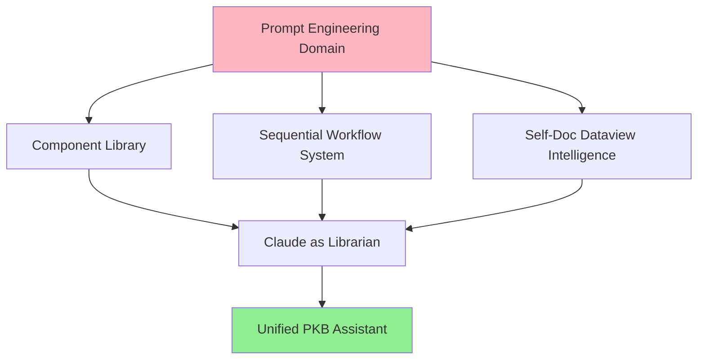

Review [[pur3v4d3r-self-documenting-pkb-system]] and clarify:
Additional relationship types? (e.g., frameworks::, principles::)
Review system integration? (auto-prioritize concepts by usage)
Domain-specific templates? (cognitive-science template, prompt-engineering template)
MOC auto-generation queries?
Ready to proceed with implementation when you confirm the approach.

These are the answers to your questions. Check the log for information.

- Do you want additional relationship types? (e.g., `frameworks::`, `principles::`)
	- Answer = Yes, you can add more than that to
- Should we integrate with your review system? (auto-prioritize concepts by usage)
	- Answer = Yes this is a great idea.
- Do you want domain-specific templates? (cognitive-science template, prompt-engineering template)
	- Answer = Yes
- Should we create MOC auto-generation queries?
	- Answer = Yes

Idea: I think we should consider starting with prompt engineering.
My logic -> [1] I have a project, to implement a new style of prompt engineering into my knowledge workflow, sequential prompting. Basically transition from crafting one high quality prompt for a one high quality output to problem decomposition and context/content management.
[2] I have another project for turning Claude (originally was meant to be the desktop version, before thinking of approaching the issue a different way, and coming up with using Claude Code in VS Code.) to have Claude become my pkb/prompting librarian.

So why don't we do this, before implementing this analyze all of what me and Clade Chat came up with for turning Claude into pkb/prompting librarian. Then we think of how we can combine this so is a single project.

000_databsae -> Note: Yes is a typo, still need to fix but doing so mean fixing all the Quickadd choices that lead to folders inside. This is all of my prompt engineering work.

These are the notes I have on the Prompt Engineering Project for Claude. I also added in a side arc that I did some digging on for turning a local llm into the same thing. These are for you to also analyze in case there useful information for us to use in them.
[[reference-comprehensive-claude-prompt-component-librarian-2025111004]]
[[reference-comprehensive-claude-prompt-engineering-mastery-202511100]]
[[reference-comprehensive-local-llm-prompt-librarian-2025111218]]
[[reference-technical-component-librarian-claude-project-2025111218]]
[[reference-technical-llm-pkb-integration-systems-2025121411]]

🚀 Implementation Roadmap
Phase 1: Foundation (Week 1-2)
Merge your existing component library structure with prompt engineering focus
Create Claude instruction sets (the actual librarian prompts)
Implement basic sequential workflow templates (problem decomposition patterns)
Phase 2: Intelligence (Week 3-4)
Adapt self-documenting dataview for prompt components
Add the 16 integration systems (start with epistemic encoding, relationship typing, application contexts)
Create usage tracking Dataview queries
Phase 3: Automation (Week 5-6)
Build component discovery workflows (vs can + Dataview)
Create composition assistance (Claude suggests component combinations)
Implement performance analytics
🎨 Why This Works
Prompt Engineering is ideal first domain:
Bounded knowledge space (your own components)
Immediate utility (use it while building it)
Clear success metrics (does the prompt work?)
Sequential prompting + Component library = Multiplicative:
Decompose complex prompts into steps
Each step draws from component library
Library grows as you solve new problems
Self-doc dataview provides memory:
Claude doesn't remember between sessions
Dataview queries surface patterns automatically
"This context usually needs these components"
🔧 Immediate Next Steps
Decision Point: Do you want me to: 
Option A: Create the unified project structure + Claude librarian instruction sets 
Option B: Start with the sequential prompting framework + decomposition templates
Option C: Focus on adapting self-doc dataview for prompt components first All three eventually combine, but which foundation do you want to build first?

02-projects/
└── _spes-sequential-prompt-engineering-system/
    ├── 00-project-meta/
    │   ├── project-charter.md                    # Vision, objectives, success metrics
    │   ├── architecture-overview.md              # System design doc
    │   └── implementation-roadmap.md             # Phased development plan
    │
    ├── 01-claude-librarian-instructions/         # 🎯 CRITICAL MEMORY SYSTEM
    │   ├── 00-librarian-core-identity.md        # Who Claude is in this system
    │   ├── 01-component-management-sop.md       # How to create/modify/retire components
    │   ├── 02-sequential-workflow-protocols.md  # How to decompose problems
    │   ├── 03-context-handoff-procedures.md     # How to manage multi-turn conversations
    │   ├── 04-quality-assurance-checklist.md    # Validation & testing protocols
    │   ├── 05-metadata-tagging-standards.md     # How to structure component metadata
    │   └── 06-usage-analytics-protocols.md      # How to track & learn from patterns
    │
    ├── 02-component-library/                     # Pillar 1: Reusable prompt components
    │   ├── atomic/                              # Single-purpose building blocks
    │   │   ├── personas/
    │   │   ├── instructions/
    │   │   ├── constraints/
    │   │   ├── output-formats/
    │   │   └── context-framers/
    │   ├── composite/                           # Multi-component workflows
    │   │   ├── sequential-chains/
    │   │   ├── parallel-branches/
    │   │   └── recursive-loops/
    │   └── specialized/                         # Domain-specific templates
    │       ├── educational-content/
    │       ├── technical-analysis/
    │       ├── creative-writing/
    │       └── pkb-operations/
    │
    ├── 03-sequential-workflows/                  # Pillar 2: Decomposition frameworks
    │   ├── decomposition-templates/
    │   │   ├── least-to-most-prompting.md
    │   │   ├── chain-of-verification.md
    │   │   ├── recursive-expansion-loop.md
    │   │   └── staged-generation.md
    │   ├── problem-types/                       # Pre-analyzed decomposition strategies
    │   │   ├── long-form-generation.md
    │   │   ├── technical-explanation.md
    │   │   ├── comparative-analysis.md
    │   │   └── research-synthesis.md
    │   └── context-handoff-patterns/
    │       ├── strict-isolation.md              # No context carryover
    │       ├── sequential-building.md           # Each turn builds on last
    │       └── parallel-convergence.md          # Multiple paths merge
    │
    ├── 04-intelligence-layer/                    # Pillar 3: Auto-discovery & analytics
    │   ├── dataview-queries/
    │   │   ├── component-relationships.md       # Which components work together?
    │   │   ├── usage-patterns.md               # What gets used most?
    │   │   ├── performance-tracking.md         # Success rate by component
    │   │   └── knowledge-gaps.md               # Missing components
    │   ├── 16-integration-systems/             # PKB integration protocols
    │   │   ├── epistemic-encoding.md
    │   │   ├── relationship-typing.md
    │   │   ├── cognitive-load-markers.md
    │   │   └── [… other 13 systems]
    │   └── metadata-schema/
    │       ├── component-metadata-spec.md
    │       └── workflow-metadata-spec.md
    │
    ├── 05-testing-validation/                    # Quality assurance
    │   ├── component-tests/
    │   │   ├── unit-tests/                     # Individual component validation
    │   │   ├── integration-tests/              # Component combination tests
    │   │   └── system-tests/                   # Full workflow tests
    │   ├── test-results/                       # Timestamped test logs
    │   └── validation-framework.md             # Testing methodology
    │
    ├── 06-analytics-dashboards/                  # Performance & insights
    │   ├── component-usage-dashboard.md
    │   ├── workflow-success-metrics.md
    │   ├── knowledge-growth-tracker.md
    │   └── claude-learning-insights.md         # Pattern discoveries
    │
    ├── 07-automation-scripts/                    # Tooling & utilities
    │   ├── component-generator.md              # Templates for new components
    │   ├── metadata-validator.py               # Check compliance
    │   └── workflow-initializer.md             # Quick-start new workflows
    │
    └── 99-archive/                              # Deprecated components & learnings
        ├── retired-components/
        └── failed-experiments/

