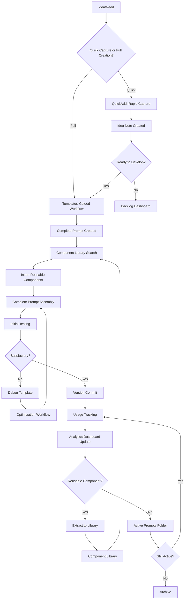

# Prompt Engineering System Design Document

> [!abstract] Executive Summary
> This document defines the complete architecture for a production-ready **Prompt Engineering System** integrated into the existing Obsidian PKB and SPES infrastructure. The system provides comprehensive tooling for creating, testing, optimizing, and managing prompt components through Templater templates, QuickAdd macros, Meta-Bind interfaces, and Dataview intelligence queries. Designed for daily workflow integration, the system emphasizes modularity, progressive disclosure, and fail-graceful operation.

---

## 🎯 SYSTEM OBJECTIVES

### Primary Goals
1. **Reduce Friction**: Create new prompts in <30 seconds, capture ideas in <10 seconds
2. **Enforce Quality**: Consistent metadata, self-validation, guided workflows
3. **Enable Discovery**: Find relevant components through intelligent queries
4. **Support Iteration**: Version tracking, A/B testing, optimization workflows
5. **Build Intelligence**: Usage analytics, pattern detection, recommendation engine

### Success Criteria (MVP)
- [ ] Can create system prompt with guided workflow
- [ ] Can insert reusable components from library
- [ ] Can view all prompts organized by type/status
- [ ] Can track prompt versions and changes
- [ ] Can document test results systematically
- [ ] System self-validates (broken links, missing metadata detected)

---

## 🏛️ ARCHITECTURE OVERVIEW

### Core System Components

```
┌─────────────────────────────────────────────────────────────────┐
│              PROMPT ENGINEERING SYSTEM                          │
├─────────────────────────────────────────────────────────────────┤
│                                                                 │
│  ┌──────────────┐  ┌──────────────┐  ┌───────────────────┐    │
│  │   CREATION   │  │   TESTING    │  │   INTELLIGENCE    │    │
│  │   LAYER      │  │   LAYER      │  │   LAYER           │    │
│  │              │  │              │  │                   │    │
│  │ • Templates  │  │ • A/B Tests  │  │ • Dataview        │    │
│  │ • QuickAdd   │  │ • Results    │  │ • Analytics       │    │
│  │ • Macros     │  │ • Debug      │  │ • Discovery       │    │
│  │ • Meta-Bind  │  │ • Compare    │  │ • Patterns        │    │
│  └──────┬───────┘  └──────┬───────┘  └────────┬──────────┘    │
│         │                 │                    │               │
│         └─────────────────┴────────────────────┘               │
│                           │                                    │
│              ┌────────────┴────────────┐                       │
│              │   SPES INTEGRATION      │                       │
│              │                         │                       │
│              │ • Component Library     │                       │
│              │ • Sequential Workflows  │                       │
│              │ • Claude Librarian      │                       │
│              └────────────┬────────────┘                       │
│                           │                                    │
│              ┌────────────┴────────────┐                       │
│              │   PKB FOUNDATION        │                       │
│              │   (Obsidian Vault)      │                       │
│              └─────────────────────────┘                       │
└─────────────────────────────────────────────────────────────────┘
```

### System Layers

#### Layer 1: Creation Layer
**Purpose**: Generate new prompts and components with minimal friction
**Components**:
- **Templater Templates** (20+): Guided creation workflows for all prompt types
- **QuickAdd Macros** (10+): Rapid capture and common operations
- **Meta-Bind Forms**: In-note interactive fields for dynamic content
- **Component Library**: Reusable building blocks (SPES Pillar 1)

#### Layer 2: Testing Layer
**Purpose**: Validate, compare, and optimize prompts systematically
**Components**:
- **A/B Testing Framework**: Side-by-side comparison templates
- **Test Results Documentation**: Structured test logging
- **Debugging Templates**: Systematic issue identification
- **Version Tracking**: Change history and performance delta

#### Layer 3: Intelligence Layer
**Purpose**: Auto-discover patterns, recommend components, track usage
**Components**:
- **Dataview Dashboards** (6+): Library overview, usage analytics, health checks
- **DataviewJS Queries** (10+): Semantic bridges, pattern detection, recommendations
- **Usage Analytics**: Track component performance and popularity
- **Quality Metrics**: Automated health scoring

---

## 📊 DATA FLOW: PROMPT LIFECYCLE



### Lifecycle Phases

**Phase 1: Ideation**
- Quick capture via QuickAdd (10 seconds)
- Minimal metadata: title, type, initial notes
- Stored in: `00-inbox/prompt-ideas/`

**Phase 2: Creation**
- Templater guided workflow (2-5 minutes)
- Component library search and insertion
- Full metadata population
- Stored in: `02-component-library/` or project folder

**Phase 3: Testing**
- Structured test execution
- Results documentation
- A/B comparison if needed
- Stored in: `05-testing-validation/results/`

**Phase 4: Optimization**
- Debug template for issues
- Hypothesis-driven refinement
- Version tracking with performance delta
- Updated in place with version bump

**Phase 5: Production**
- Active usage in workflows
- Usage analytics tracking
- Periodic review via dashboard
- Maintained in active library

**Phase 6: Evolution**
- Extract successful patterns to library
- Identify improvement opportunities
- Retire deprecated components
- Archive completed projects

---

## 🗂️ FOLDER STRUCTURE & ORGANIZATION

### Integration with Existing Vault

```
d:\10_pur3v4d3r's-vault\
│
├── 00-inbox/
│   └── prompt-ideas/              # Quick captures (QuickAdd)
│
├── 02-projects/
│   └── _spes-sequential-prompt-engineering-system/
│       │
│       ├── 00-project-meta/
│       │   ├── 00-prompt-engineering-system-design.md [THIS FILE]
│       │   ├── 01-implementation-tracker.md
│       │   └── 02-quick-reference-guide.md
│       │
│       ├── 02-component-library/     [EXISTING - SPES Pillar 1]
│       │   ├── atomic/
│       │   │   ├── personas/
│       │   │   ├── instructions/
│       │   │   ├── constraints/
│       │   │   ├── output-formats/
│       │   │   └── context-framers/
│       │   ├── composite/
│       │   │   ├── sequential-chains/
│       │   │   ├── parallel-branches/
│       │   │   └── recursive-loops/
│       │   └── specialized/
│       │       ├── educational-content/
│       │       ├── technical-analysis/
│       │       ├── creative-writing/
│       │       └── pkb-operations/
│       │
│       ├── 03-sequential-workflows/  [EXISTING - SPES Pillar 2]
│       │   ├── decomposition-templates/
│       │   ├── problem-types/
│       │   └── context-handoff-patterns/
│       │
│       ├── 04-intelligence-layer/    [EXISTING - SPES Pillar 3]
│       │   ├── dashboards/
│       │   ├── analytics/
│       │   └── discovery-queries/
│       │
│       ├── 05-testing-validation/
│       │   ├── ab-tests/            # A/B comparison logs
│       │   ├── test-results/        # Structured test documentation
│       │   └── debug-logs/          # Issue investigation notes
│       │
│       └── 08-active-prompts/       [NEW]
│           ├── agentic/             # Claude Projects, Gemini Gems
│           ├── system-prompts/      # System/instruction prompts
│           ├── user-prompts/        # User interaction prompts
│           └── chains/              # Multi-step workflows
│
├── 06-dashboards/
│   └── prompt-engineering-dashboard.md  # Master overview
│
└── 99-system/
    ├── 01-quickadd/
    │   ├── 01-macros/
    │   │   ├── prompt-quick-capture.js
    │   │   ├── component-search-insert.js
    │   │   ├── version-bump.js
    │   │   └── [10+ more macros]
    │   └── 02-templates/
    │       ├── _prompt-master-template.md
    │       ├── _system-prompt-creator.md
    │       ├── _few-shot-template.md
    │       └── [20+ specialized templates]
    │
    └── 02-scripts/
        ├── prompt-health-check.py
        ├── component-usage-analyzer.py
        └── metadata-validator.py
```

### Rationale for Structure

**Decision**: Integrate with existing SPES foundation
**Rationale**:
- Avoids duplication
- Leverages existing component library infrastructure
- Uses established Claude Librarian instructions
- Maintains architectural coherence

**Decision**: Separate active prompts from library components
**Rationale**:
- Library = reusable building blocks (high churn, strict quality)
- Active prompts = working documents (project-specific, evolving)
- Clear lifecycle progression: active → tested → extract to library

**Decision**: Testing in dedicated subfolder
**Rationale**:
- Keeps test artifacts separate from production prompts
- Enables bulk operations (archive all tests before date X)
- Structured logging for analytics

---

## 🔌 INTEGRATION MAP: PLUGIN → FUNCTION

### Templater (Primary Creation Engine)
**Functions**:
- Guided prompt creation workflows
- User input collection (suggester, prompt)
- Dynamic metadata generation (timestamps, IDs)
- File operations (move, rename)
- Component insertion via file inclusion

**Key Templates** (20+):
1. Master Prompt Template (base for all)
2. System Prompt Creator
3. User Prompt Generator
4. Claude Project Instructions
5. Gemini Gem Instructions
6. Few-Shot Template
7. Chain-of-Thought Template
8. Prompt Chain Builder
9. Optimization Workflow
10. A/B Testing Framework
11. Debug Template
12. Version Tracker
13. Test Results Documentation
14. Comparative Analysis
15. Effectiveness Report
16. Idea Template
17. Component Extractor
18. Workflow Guide Template
19. Constitutional AI Template
20. Tree-of-Thoughts Template

### QuickAdd (Rapid Operations)
**Functions**:
- Ultra-fast captures (<10 sec)
- Macro execution for common tasks
- Multi-choice workflows
- Script integration for complex logic

**Key Macros** (10+):
1. **Prompt Quick Capture**: Minimal friction idea logging
2. **Component Search & Insert**: Find and embed library components
3. **Version Bump**: Increment version, log changes
4. **Clone & Modify**: Duplicate prompt for A/B testing
5. **Extract to Library**: Promote working prompt to reusable component
6. **Archive Prompt**: Move to archive with metadata update
7. **Test Session Logger**: Quick test result capture
8. **Usage Counter**: Increment usage stats
9. **Health Check Trigger**: Run diagnostic scripts
10. **Review Scheduler**: Set next-review dates based on spaced repetition

**Capture Workflows**:
- Multi-choice prompt type selection
- Quick template vs full workflow routing
- Smart folder destination based on type

### Meta-Bind (In-Note Interactivity)
**Functions**:
- Dynamic form fields within notes
- Real-time metadata editing
- Button triggers for actions
- Interactive sliders, toggles, suggesters

**Use Cases**:
- **Rating Slider**: `INPUT[slider(min(1), max(10)):rating]`
- **Status Dropdown**: `INPUT[suggester(...):status]`
- **Quick Actions**: `BUTTON[run-test]`, `BUTTON[bump-version]`
- **Usage Counter**: `VIEW[{usage-count}]` with increment button
- **Test Toggle**: `INPUT[toggle:is-tested]`

### Dataview/DataviewJS (Intelligence Layer)
**Functions**:
- Library overviews and filtering
- Usage analytics and trends
- Semantic bridge discovery (find related prompts)
- Health checks (missing metadata, broken links)
- Component recommendations

**Key Dashboards** (6+):
1. **Prompt Library Overview**: All prompts by type/status
2. **Component Usage Analytics**: Most/least used, performance scores
3. **Testing Dashboard**: Pending tests, recent results
4. **Health Monitor**: Metadata compliance, link integrity
5. **Idea Backlog**: Captured ideas awaiting development
6. **Archive Browser**: Historical prompts with search

**Key Queries** (10+):
1. Find prompts by component usage
2. Semantic siblings (shared context links)
3. Prompts needing review (staleness check)
4. Top-rated prompts by domain
5. Usage trends over time
6. Component performance comparison
7. Orphan detection (no usage records)
8. Version history timeline
9. Test results aggregation
10. Missing metadata alerts

### Tasks Plugin (Review System)
**Functions**:
- Spaced repetition for prompt review
- Due date tracking
- Priority management

**Integration**:
- Review fields in prompt metadata
- Automated scheduling via Templater
- Dashboard query for due reviews

---

## 🔧 TECHNICAL DECISIONS & TRADE-OFFS

### Decision 1: Markdown Files vs Database
**Choice**: Markdown files with rich YAML frontmatter
**Rationale**:
- Native Obsidian integration (search, links, graph)
- Human-readable and directly editable
- Version control via Git
- Future-proof (plain text)
- Leverages existing vault infrastructure
**Trade-off**: Query performance slower than database (acceptable for <10k prompts)

### Decision 2: Templater vs Custom Plugin
**Choice**: Templater + QuickAdd (no custom plugin)
**Rationale**:
- No development overhead
- User already familiar with tools
- Community support and maintenance
- Extensible via JavaScript
**Trade-off**: Some UI limitations (no native forms, modal dialogs basic)

### Decision 3: Component Library = Markdown Notes
**Choice**: Each component is a separate `.md` file
**Rationale**:
- Searchable via Obsidian search
- Linkable via wiki-links (graph integration)
- Individually version-controlled
- Can include examples, usage notes, metadata
**Trade-off**: Slight overhead vs single JSON database (acceptable for usability gain)

### Decision 4: Manual Workflow Execution
**Choice**: User triggers workflows, not fully automated
**Rationale**:
- Flexibility (user decides when to test, optimize)
- Transparency (no hidden magic)
- Learning opportunity (user sees process)
**Trade-off**: Slightly more friction (acceptable for daily workflow)

### Decision 5: Metadata-Heavy Approach
**Choice**: Extensive YAML frontmatter (15+ fields)
**Rationale**:
- Enables sophisticated Dataview queries
- Future-proofs for analytics
- Supports intelligent recommendations
- Required for self-documenting system
**Trade-off**: Initial overhead creating prompts (mitigated by templates auto-populating)

### Decision 6: Atomic-First Component Design
**Choice**: Smallest reusable units in library, compose upward
**Rationale**:
- Maximum reusability
- Easier to test individual pieces
- Clear dependency trees
- Flexible composition
**Trade-off**: More files to manage (acceptable with good search/dashboards)

---

## ⚠️ RISK ANALYSIS & MITIGATION

### Risk 1: User Abandons System (Too Complex)
**Likelihood**: Medium | **Impact**: Critical
**Mitigation**:
- Progressive disclosure (simple workflows first, advanced optional)
- Excellent documentation with examples
- Quick capture as entry point (<10 sec, minimal fields)
- Pre-built templates for common cases
- Dashboard shows value immediately (usage stats, recommendations)

### Risk 2: Metadata Inconsistency
**Likelihood**: High | **Impact**: High
**Mitigation**:
- Templates auto-populate all required fields
- Validation scripts detect missing/invalid metadata
- Health dashboard highlights issues
- Meta-Bind suggesters enforce controlled vocabularies

### Risk 3: Component Library Becomes Cluttered
**Likelihood**: High | **Impact**: Medium
**Mitigation**:
- Clear component lifecycle (seedling → tested → evergreen → archived)
- Periodic review workflow (mark stale components)
- Usage analytics identify unused components
- Archive automation (move to 99-archive if unused >6 months)

### Risk 4: Performance Degradation (Too Many Files)
**Likelihood**: Low | **Impact**: Medium
**Mitigation**:
- Dataview queries optimized (specific folders, indexed fields)
- Dashboard pagination (limit results to 50)
- Archive old prompts (move completed projects)
- Expected scale: <1000 prompts, <500 components (well within Obsidian limits)

### Risk 5: Testing Overhead (User Skips Tests)
**Likelihood**: High | **Impact**: Medium
**Mitigation**:
- Make testing optional but valuable (show impact in dashboard)
- Simplest test = quick note in metadata (not formal template)
- Gamification (completion badges, quality scores)
- A/B testing only for critical prompts

### Risk 6: Integration Conflicts (Plugin Updates)
**Likelihood**: Low | **Impact**: Medium
**Mitigation**:
- Minimize plugin-specific syntax (use standard markdown where possible)
- Document plugin versions in project-charter
- Fallback: All templates readable as plain markdown
- Test templates after plugin updates

---

## 🎯 IMPLEMENTATION PRIORITIES

### Phase 0: Planning & Architecture ✅ [CURRENT]
- [x] System design document
- [ ] Implementation tracker
- [ ] Quick reference guide

### Phase 1: Foundation (MVP)
**Goal**: Basic creation, organization, discovery
**Deliverables**:
1. Master Prompt Template
2. Metadata schema enforcement
3. Component library structure (build on SPES)
4. QuickAdd quick captures (2-3 macros)
5. Dataview library dashboard

**Success Metric**: Can create and find prompts reliably

### Phase 2: Guided Creation
**Goal**: Specialized templates for all prompt types
**Deliverables**:
1. System prompt creator
2. Few-shot template
3. Chain builder
4. Agentic templates (Claude Project, Gemini Gem)
5. 15+ additional specialized templates

**Success Metric**: User has template for every common scenario

### Phase 3: Testing & Optimization
**Goal**: Validate and improve prompts systematically
**Deliverables**:
1. A/B testing framework
2. Debug template
3. Optimization workflow
4. Version tracking
5. Test results documentation

**Success Metric**: Can measure and improve prompt quality

### Phase 4: Intelligence & Analytics
**Goal**: Auto-discover patterns, recommend components
**Deliverables**:
1. Usage analytics dashboard
2. Component recommendation queries
3. Semantic bridge detection
4. Health monitoring
5. Pattern detection scripts

**Success Metric**: System proactively suggests improvements

### Phase 5: Automation & Polish
**Goal**: Reduce friction, automate repetitive tasks
**Deliverables**:
1. Advanced QuickAdd macros (10+)
2. Python scripts for bulk operations
3. Review system integration
4. Archive automation
5. Production documentation

**Success Metric**: Daily workflows feel effortless

---

## 📚 METADATA SCHEMA (MASTER REFERENCE)

### Universal Fields (All Prompt Types)
```yaml
---
type: "prompt" | "component" | "workflow" | "test-result"
id: "<timestamp-based-unique-id>"
status: "active" | "testing" | "production" | "deprecated" | "archived"
version: "semver-string"
rating: "0.0-10.0"
source: "claude-sonnet" | "claude-opus" | "gemini-pro" | "gemini-flash" | "original" | "local-llm" | "other"
created: "YYYY-MM-DD"
modified: "YYYY-MM-DD"
usage-count: integer
last-used: "[[YYYY-MM-DD]]"

# Review system integration
review-next: "YYYY-MM-DD"
review-interval: integer (days)
review-count: integer

# Quality metrics
confidence: "speculative" | "provisional" | "moderate" | "established" | "high"
maturity: "seedling" | "developing" | "budding" | "evergreen"
priority: "low" | "medium" | "high" | "urgent"

# Categorization
tags:
  - "year/YYYY"
  - "prompt-engineering"
  - "llm-capability/generation|reasoning|analysis"
  - "prompt-workflow/creation|testing|deployment"
  - Additional domain tags

# Graph integration
aliases: []
link-up: "[[prompt-engineering-moc]]"
link-related: []

# Optional fields
components-used: []  # [[component-links]]
test-results: []     # [[test-result-links]]
---
```

### Component-Specific Fields
```yaml
component-type: "persona" | "instruction" | "constraint" | "format" | "context"
atomic-composite: "atomic" | "composite"
domain: "general" | "technical" | "creative" | "educational" | "pkb"
conflicts-with: []  # [[component-links]] that don't work together
synergies-with: []  # [[component-links]] that work well together
performance-score: 0.0-10.0
```

### Test Result Fields
```yaml
prompt-tested: "[[prompt-link]]"
test-date: "YYYY-MM-DD"
test-type: "functional" | "quality" | "performance" | "ab-comparison"
success: boolean
quality-score: 0.0-10.0
issues-found: []
recommendations: []
```

---

## 🔗 INTEGRATION WITH EXISTING SYSTEMS

### SPES Foundation
**Existing Infrastructure**:
- Component library structure (atomic/composite/specialized)
- Claude Librarian instruction set
- Sequential workflow patterns
- Metadata standards

**Integration Points**:
- Prompt templates → call SPES workflows
- Components → populate SPES library
- Testing → validate SPES workflows
- Analytics → track SPES usage

### PKB Foundation
**Existing Infrastructure**:
- 00-meta memory system
- Vault diagnostic tools (vscan, orphan, linkcheck, metaudit)
- Graph-first philosophy
- Anti-duplication protocols

**Integration Points**:
- Use vscan before creating components (avoid duplication)
- Orphan detection for unused components
- Link integrity for component references
- Metadata audit for schema compliance

### Review System
**Existing Infrastructure**:
- Spaced repetition fields
- Review dashboards
- Interval calculation

**Integration Points**:
- Prompts get review dates based on maturity
- Review dashboard includes prompt review section
- Usage → extends review interval (proven prompts)

---

## 📖 REFERENCE: BEST PRACTICES

### Prompt Engineering Patterns to Support

1. **Structural Patterns**
   - XML tagging for organization
   - Clear section headers
   - Explicit constraints
   - Output specification
   - Context-first ordering

2. **Advanced Techniques**
   - Chain-of-Thought (step-by-step reasoning)
   - Few-Shot Learning (2-5 examples)
   - Role Prompting (persona establishment)
   - Constitutional AI (principle-based constraints)
   - Tree-of-Thoughts (parallel exploration)
   - Task Decomposition (sequential workflows)
   - Self-Consistency (multi-generation synthesis)
   - Reflection (review and improve)

3. **Component Categories**
   - **Personas**: Identity/role frames
   - **Instructions**: Task directives
   - **Constraints**: Boundaries/restrictions
   - **Formats**: Output templates
   - **Context**: Background/framing
   - **Examples**: Few-shot demonstrations
   - **Principles**: Value-based guidelines

---

## ✅ NEXT STEPS

### Immediate (Phase 0 Completion)
1. ✅ Create this system design document
2. [ ] Create implementation tracker with detailed task breakdown
3. [ ] Create quick reference guide for daily usage
4. [ ] Present Phase 0 deliverables to user for approval

### Phase 1 Preparation
1. Review existing `_claude-project-template.md` for patterns
2. Analyze sequential prompting report for technique incorporation
3. Map SPES component library structure
4. Design master template with all patterns
5. Define metadata schema rigorously

---

## 📝 DOCUMENT METADATA

**Version**: 1.0.0
**Status**: Complete - Pending Review
**Author**: Claude Sonnet 4.5 (SPES Librarian)
**Review Required**: User approval to proceed to Phase 1
**Dependencies**: None (foundational document)
**Estimated Read Time**: 25 minutes

---

**Related Documents**:
- [[project-charter]] - Vision and objectives
- [[architecture-overview]] - SPES three-pillar architecture
- [[01-implementation-tracker]] - Phased delivery plan
- [[implementation-roadmap]] - Timeline and milestones

---

*This design document serves as the blueprint for all subsequent implementation phases. No development work proceeds without user approval of this architecture.*
