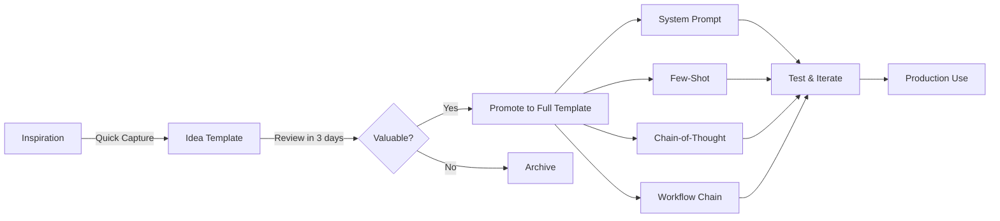

# SPES Specialized Template Guide

This document provides an overview of the 5 specialized Templater templates created for the SPES (Sequential Prompt Engineering System).

---

## 📋 Template Overview

| Template | Prefix | Type | Purpose | Use When |
|----------|--------|------|---------|----------|
| `_system-prompt-template.md` | `system-prompt` | Role/Behavior | Sets foundational model behavior | Defining identity, tone, expertise |
| `_few-shot-template.md` | `few-shot` | Pattern Learning | Teaches through examples | Need 3-5 demonstrations |
| `_chain-of-thought-template.md` | `cot` | Reasoning | Step-by-step thinking | Complex problem solving |
| `_workflow-chain-template.md` | `workflow` | Orchestration | Multi-step processes | Sequential task chains |
| `_idea-capture-template.md` | `idea` | Quick Capture | Rapid idea logging | Inspiration strikes |

---

## 🎯 Template Details

### 1. System Prompt Template

**File**: `_system-prompt-template.md`
**Naming**: `system-prompt-[title]-[version]-[timestamp].md`

**Structure**:
- Role Definition (who the model should be)
- Behavioral Guidelines (how it should act)
- Knowledge Domain (what it should know)
- Response Format (how it should output)
- Examples (demonstrations)

**Best For**:
- Creating AI personas
- Setting conversational tone
- Establishing expertise boundaries
- Defining output formats

**Key Fields**:
- 8+ cursor positions for guided input
- Type: `system-prompt`
- Custom tags: `#system-prompt`, `#llm-capability/role-assignment`

---

### 2. Few-Shot Template

**File**: `_few-shot-template.md`
**Naming**: `few-shot-[title]-[version]-[timestamp].md`

**Structure**:
- Task Description
- Example Pairs (3-5 input-output demonstrations)
- Pattern Explanation
- New Input Section

**Best For**:
- Teaching classification tasks
- Demonstrating formatting patterns
- Showing transformation rules
- Pattern-based generation

**Key Fields**:
- Example count tracking (`example-count`)
- Type: `few-shot`
- Custom tags: `#few-shot-learning`, `#llm-capability/pattern-matching`

**Optimal Example Count**: 3-5 examples (research-backed sweet spot)

---

### 3. Chain-of-Thought Template

**File**: `_chain-of-thought-template.md`
**Naming**: `cot-[title]-[version]-[timestamp].md`

**Structure**:
- Problem Statement
- Reasoning Steps (explicit step-by-step thinking)
- Solution Template
- Verification (sanity checks)

**Best For**:
- Math/logic problems
- Complex analysis tasks
- Debugging/troubleshooting
- Multi-step reasoning

**Key Fields**:
- Reasoning steps count (`reasoning-steps`)
- Type: `chain-of-thought`
- Custom tags: `#chain-of-thought`, `#llm-capability/reasoning`

**Pro Tip**: Use "Let's think step by step" phrasing for best results

---

### 4. Workflow Chain Template

**File**: `_workflow-chain-template.md`
**Naming**: `workflow-[title]-[version]-[timestamp].md`

**Structure**:
- Workflow Overview (process map)
- Step Definitions (detailed instructions)
- Transition Logic (data flow)
- Output Aggregation (combining results)

**Best For**:
- Multi-stage pipelines
- Content creation workflows
- Code review processes
- Research analysis chains

**Key Fields**:
- Workflow steps count (`workflow-steps`)
- Type: `workflow-chain`
- Custom tags: `#workflow-chain`, `#llm-capability/orchestration`

**Architecture**: Each step has input/output contracts + error handling

---

### 5. Idea Capture Template

**File**: `_idea-capture-template.md`
**Naming**: `idea-[title]-[timestamp].md` (NO VERSION)

**Structure**:
- Core Idea (brief description)
- Intended Use (problem solved)
- Key Insight (unique angle)
- Rough Sketch (quick outline)
- Next Steps (development path)
- Promotion Decision (convert or archive)

**Best For**:
- Rapid idea logging
- Brainstorming sessions
- Inspiration capture
- Pre-development notes

**Key Fields**:
- Status: `raw` (default)
- Promoted-to: (links to full template if promoted)
- No version number (ideas are disposable)
- 3-day review cycle

**Promotion Paths**:
```
Idea → System Prompt (role/behavior ideas)
Idea → Few-Shot (pattern learning ideas)
Idea → Chain-of-Thought (reasoning ideas)
Idea → Workflow Chain (process ideas)
Idea → Prompt Master (general ideas)
```

---

## 🔄 Workflow: From Idea to Production



---

## 🎨 Common Patterns

### Pattern 1: System Prompt + Few-Shot Hybrid
Combine system-level behavior with concrete examples:
1. Start with system prompt (sets the stage)
2. Add few-shot examples (demonstrates specifics)
3. Use for specialized tasks requiring both context and patterns

### Pattern 2: Chain-of-Thought in Workflows
Embed reasoning steps within workflow stages:
1. Workflow step calls chain-of-thought prompt
2. Reasoning output feeds into next workflow step
3. Use for complex analysis pipelines

### Pattern 3: Idea → Test → Promote → Iterate
Rapid development cycle:
1. Capture idea in 2-5 minutes
2. Quick test with rough version
3. Promote to full template if promising
4. Iterate with version increments

---

## 🧩 Component Integration

All templates support the **Component Library** system:

**Reusable Components**:
- Personas (system prompt fragments)
- Instructions (task descriptions)
- Constraints (behavioral rules)
- Formats (output templates)
- Context Framers (knowledge scoping)

**Usage**:
1. Search component library (`Ctrl+P` → "Component Search")
2. Link components in `components-used` frontmatter
3. Reference components with `[[wiki-links]]`
4. Track component effectiveness through usage

---

## 📊 Metadata Standards

All templates include:

**Core Metadata**:
- `type`: Template category
- `id`: Unique timestamp ID
- `status`: active | testing | production | deprecated | archived
- `version`: Semantic versioning (major.minor.patch)
- `rating`: Quality score 0.0-10.0
- `confidence`: speculative | provisional | moderate | established | high

**Temporal Tracking**:
- `created`: Creation date
- `modified`: Last modification
- `review-next`: Next review date
- `review-interval`: Days between reviews

**Usage Analytics**:
- `usage-count`: Number of times used
- `last-used`: Most recent usage date
- `test-results`: Array of test result links

**Type-Specific**:
- System Prompt: N/A
- Few-Shot: `example-count`
- Chain-of-Thought: `reasoning-steps`
- Workflow Chain: `workflow-steps`
- Idea: `promoted-to`, `status: raw`

---

## 🧪 Testing Strategy

Each template includes testing sections:

**Test Structure**:
1. Objective (what's being tested)
2. Input/Scenario (test case)
3. Expected Output (ideal result)
4. Actual Output (what happened)
5. Result (pass/fail)
6. Quality Score (/10)
7. Issues Found (problems discovered)
8. Link (to detailed test results)

**Version History Table**:
Tracks changes, quality deltas, and links to previous versions.

---

## 🔗 Graph Integration

All templates maintain **2+/2+** link protocol:
- Minimum 2 incoming links (inlinks)
- Minimum 2 outgoing links (outlinks)

**Automatic Connections**:
- Link to daily note (creation date)
- Link to weekly review
- Link to `[[prompt-engineering-moc]]`

**DataviewJS Queries**:
Each template includes semantic bridge query to find related prompts based on shared context.

---

## 🚀 Quick Start

### Creating a New Prompt

1. **Choose Template Type**:
   - Role/behavior? → System Prompt
   - Pattern learning? → Few-Shot
   - Reasoning? → Chain-of-Thought
   - Multi-step? → Workflow Chain
   - Quick idea? → Idea Capture

2. **Trigger Template**:
   - Use Templater hotkey or command
   - Select appropriate template
   - Answer guided questions

3. **Fill Content**:
   - Follow cursor positions (8+)
   - Use placeholders as guides
   - Link to components where applicable

4. **Test & Iterate**:
   - Document test results
   - Update rating based on performance
   - Increment version on significant changes

5. **Maintain**:
   - Review at scheduled intervals
   - Update `last-used` and `usage-count`
   - Promote maturity: seedling → evergreen

---

## 📚 Resources

**Related Notes**:
- [[prompt-engineering-moc]] - Main MOC
- [[spes-system-overview]] - SPES architecture
- [[component-library]] - Reusable components
- [[prompt-testing-framework]] - Testing methodology

**Template Files**:
- `_prompt-master-template.md` - General template
- `_component-template.md` - Component template
- `_claude-project-template.md` - Claude Project template
- `_gemini-gem-template.md` - Gemini Gem template

---

## 🎓 Best Practices

1. **Start with Ideas**: Use idea capture liberally, promote selectively
2. **Test Early**: Document first test results before broad usage
3. **Version Properly**: Bump version on significant changes, track in history table
4. **Link Richly**: Connect to related prompts, components, and notes
5. **Review Regularly**: Follow review intervals, update based on performance
6. **Rate Honestly**: Quality ratings guide future decisions
7. **Archive Fearlessly**: Move deprecated prompts to archive, keep vault clean

---

## 🔧 Customization

All templates are **customizable**:

**Modify for Your Needs**:
- Add custom fields to frontmatter
- Adjust cursor positions
- Change section structure
- Add domain-specific sections

**Maintain Consistency**:
- Keep file naming convention
- Preserve metadata standards
- Maintain 8+ cursor positions
- Include version history table

---

## 📞 Support

**Issues?**
- Check template syntax (Templater format)
- Verify file naming automation
- Test cursor positions
- Validate frontmatter YAML

**Questions?**
- Consult `[[prompt-engineering-moc]]`
- Review `[[00-meta/session-memory]]`
- Reference `[[00-meta/user-preferences]]`

---

*Created: 2025-12-20 | Template Guide Version: 1.0.0*
*Part of SPES (Sequential Prompt Engineering System)*
