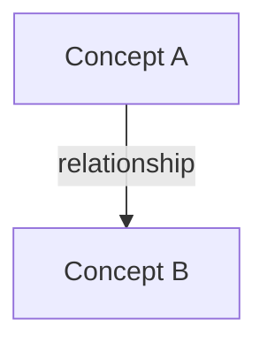
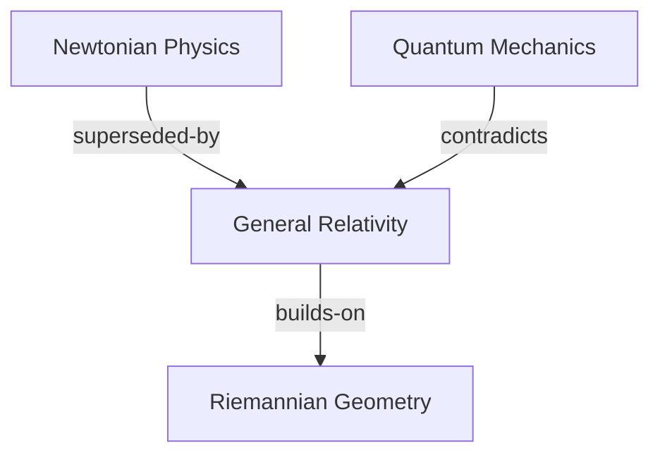

# Format: Semantic Relationship Typing Protocol

> [!definition] Component Definition
> A controlled vocabulary and syntax protocol that instructs the LLM to explicitly define the semantic nature of connections between concepts (e.g., `supports`, `contradicts`, `supersedes`) rather than using generic links.

## 🎯 When to Use
- **Map of Content (MOC) Creation**: When structuring high-level overviews where relationship types define the map's logic.
- **History of Science/Ideas**: When tracing how theories evolved, superseded, or built upon one another.
- **Argument Mapping**: When analyzing debates to show which evidence supports or falsifies which claims.
- **Graph Analysis**: When generating data for graph databases or Dataview queries that filter by edge type.

## 🚫 When NOT to Use
- **Quick Capture**: When speed is prioritized over structure.
- **General Prose**: The syntax (`→(type)→`) disrupts reading flow in standard paragraphs.
- **Simple Lists**: When a bulleted list of "Related Links" suffices.
- **Ambiguous Connections**: When the relationship is too vague to categorize (use standard `[[link]]` instead).

## 📝 COMPONENT TEXT
```prompt
<semantic_relationship_typing>
## 🔗 Link Relationship Encoding Protocol

When establishing connections between concepts, encode the semantic relationship type.

<relationship_vocabulary>
### Core Relationship Types

| Relationship | Symbol | Definition | Use Case |
|--------------|--------|------------|----------|
| `builds-on` | →(builds-on)→ | Theoretical foundation | B extends/requires A |
| `supersedes` | →(supersedes)→ | Historical replacement | B replaces A |
| `contradicts` | →(contradicts)→ | Logical/empirical conflict | A and B incompatible |
| `supports` | →(supports)→ | Evidential backing | A provides evidence for B |
| `modulates` | →(modulates)→ | Causal influence | A affects magnitude of B |
| `instantiates` | →(instantiates)→ | Example of category | A is instance of B |
| `developed-by` | →(developed-by)→ | Attribution | B created A |
| `applied-in` | →(applied-in)→ | Practical domain | A is applied in context B |
| `extends` | →(extends)→ | Elaboration | B expands scope of A |
| `operationalizes` | →(operationalizes)→ | Abstract to measurable | B makes A testable |
| `analogous-to` | →(analogous-to)→ | Cross-domain parallel | A structurally similar to B |
| `precondition-for` | →(precondition-for)→ | Logical dependency | A must exist for B |
| `falsifies` | →(falsifies)→ | Empirical refutation | A disproves B |
| `synthesizes` | →(synthesizes)→ | Integration | C combines A + B |
| `component-of` | →(component-of)→ | Part-whole | A is part of B |
| `contrasts-with` | →(contrasts-with)→ | Distinguished from | A differs meaningfully from B |
</relationship_vocabulary>

<syntax_specification>
### Syntax Patterns

**Inline Field Format (Recommended):**
`[**Relationship-Type**:: [[Source]] →(relation)→ [[Target]]]`

**Narrative Integration:**
`[[Cognitive Load Theory]] →(builds-on)→ [[Working Memory Model]] and →(extends)→ [[Information Processing Theory]].`

**Complex Multi-Relation:**
`[**Theoretical-Lineage**:: [[Filter Model]] →(superseded-by)→ [[Attenuation Model]] →(integrated-into)→ [[Capacity Model]]]`

**With Annotations:**
`[**Relationship**:: [[CLT]] →(applied-in)→ [[Instructional Design]] | annotation:"primary application domain since 1980s"]`
</syntax_specification>

<generation_heuristics>
### Relationship Selection Guide

**Temporal/Historical Relations:**
- `supersedes`: Theory A historically replaced by Theory B
- `builds-on`: Theory B emerged from foundation of Theory A
- `developed-by`: Attribution to researcher/theorist

**Logical/Structural Relations:**
- `component-of`: Part-whole relationships
- `precondition-for`: Necessary conditions
- `instantiates`: Example-category relationships
- `operationalizes`: Abstract-concrete mappings

**Evidential Relations:**
- `supports`: Evidence favoring a claim
- `falsifies`: Evidence against a claim
- `contradicts`: Incompatible claims

**Functional Relations:**
- `modulates`: Causal/influence relationships
- `applied-in`: Domain of application
- `extends`: Scope expansion

**Comparative Relations:**
- `analogous-to`: Cross-domain structural similarity
- `contrasts-with`: Meaningful distinction
- `synthesizes`: Integration of multiple sources
</generation_heuristics>

<output_requirements>
### Density Guidelines
- Reference notes: 8-15 explicit relationship encodings
- MOCs: Heavy relationship typing (primary purpose)
- Atomic notes: 2-5 key relationships minimum
- Always encode when introducing how concepts relate
</output_requirements>
</semantic_relationship_typing>
```

## 🔀 VARIATIONS

### Variation 1: Mermaid Diagram Format
Use this when visual representation is preferred over inline text metadata.

```prompt
<semantic_visual_mapping>
Instead of inline text, generate a Mermaid graph to visualize relationships.

Format:


Example:

</semantic_visual_mapping>
```

### Variation 2: RDF/Triple Format (Machine Readable)
Use this for strict data interoperability or knowledge graph construction.

```prompt
<semantic_triple_encoding>
Output relationships as strict Subject-Predicate-Object triples.

Format: `<Subject> <Predicate> <Object>`

Vocabulary:
- owl:sameAs (analogous-to)
- skos:narrower (component-of)
- prov:wasDerivedFrom (builds-on)
- ex:contradicts

Example:
<General_Relativity> <ex:supersedes> <Newtonian_Gravity>
<String_Theory> <prov:wasDerivedFrom> <Quantum_Field_Theory>
</semantic_triple_encoding>
```

## 🤝 RELATIONSHIPS

### Works Well With
- [[epistemic-confidence-encoding]] - Combine them to state *how sure* we are about a relationship (e.g., `[[A]] →(causes)→ [[B]]^speculative`).
- [[obsidian-markdown-formatter]] - Ensures the syntax renders correctly in the target tool.
- [[argument-analyzer]] - Uses `supports` and `falsifies` types to structure logical evaluations.

### Conflicts With
- [[simple-wikilink-format]] - This component explicitly forbids "naked" links when a relationship is known.
- [[narrative-flow-writer]] - The arrow syntax `→(type)→` breaks the natural rhythm of reading.

## 📊 PERFORMANCE DATA

### Usage Statistics
- **Total Uses**: `VIEW[0]`
- **Last Used**: `VIEW[]`
- **Performance Score**: `VIEW[0.0]`/10

### Test Results
#### Test 1: History of Psychology
**Date**: 2025-12-21
**Prompt Used In**: [[pkm-concept-mapper]]
**Quality Score**: N/A
**Notes**: Initial formalization. Need to verify if LLMs correctly distinguish between `builds-on` (theoretical extension) and `supersedes` (replacement).

## 💡 USAGE EXAMPLES

### Example 1: Scientific Theory Evolution
**Context**: Tracing the shift from Geocentrism to Heliocentrism.
**Full Prompt**:
```markdown
Explain the relationship between the Ptolemaic system, the Copernican system, and Kepler's laws using the <semantic_relationship_typing> protocol.
```
**Outcome**:
```markdown
[**Astronomical-Paradigm-Shift**:: [[Ptolemaic System]] →(superseded-by)→ [[Copernican System]]]

However, the circular orbits of Copernicus were inaccurate.
[**Orbital-Mechanics**:: [[Kepler's Laws]] →(modifies)→ [[Copernican System]] | annotation:"replaced circular orbits with ellipses"]

[**Mathematical-Foundation**:: [[Kepler's Laws]] →(precondition-for)→ [[Newtonian Gravitation]]]
```
**Effectiveness**: ⭐⭐⭐⭐⭐

### Example 2: Medical Mechanism
**Context**: Describing how a drug interacts with a biological pathway.
**Full Prompt**:
```markdown
Describe how SSRIs affect serotonin using the relationship markers.
```
**Outcome**:
```markdown
[**Mechanism-of-Action**:: [[SSRI]] →(inhibits)→ [[Serotonin Transporter (SERT)]]]

[**Downstream-Effect**:: [[Inhibition of SERT]] →(modulates)→ [[Synaptic Serotonin Levels]]]

[**Clinical-Outcome**:: [[Increased Serotonin]] →(supports)→ [[Mood Regulation]]]
```
**Effectiveness**: ⭐⭐⭐⭐⭐

## 🔧 OPTIMIZATION HISTORY

### Version 1.0.0 - 2025-12-21
**Changes**: Initial formalization of the user's XML module.
**Impact**: Standardized the vocabulary and syntax for component library inclusion.

## 🎓 LESSONS LEARNED

- **Directionality Matters**: The arrow syntax `→(relation)→` implies direction. LLMs sometimes get the subject/object reversed (e.g., saying A supersedes B when B supersedes A). The "Selection Guide" helps, but examples are crucial.
- **Over-tagging**: In narrative text, tagging *every* verb as a relationship makes the text unreadable. It is best used in specific "Metadata" sections or bullet points, rather than inline within paragraphs.
- **Dataview Syntax**: The `[Key:: Value]` syntax is fragile. The LLM must be strict about the double colons.

## 📚 REFERENCES

- **Source**: User submitted XML (Module 2).
- **Concept**: Semantic Web / Linked Data principles.
- **Tool**: Obsidian Dataview Plugin (Inline Fields).
```