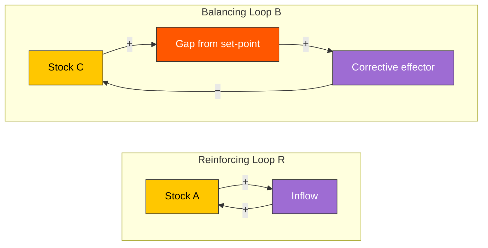

# Feedback Loop

> [!definition] Feedback Loop
> A **feedback loop** is a causal architecture in which an output of a system becomes an input back into the same system, such that the system's later behavior is conditioned by its own earlier behavior. The defining structural property is *closure*: a path exists from a node back to itself through one or more intermediate nodes.
>
> **Two canonical types**: *reinforcing* loops (the output amplifies the same direction of change — exponential growth or collapse) and *balancing* loops (the output opposes the change — regulation toward a set-point).
>
> **See also**: [[mental-model]], [[homeostasis-and-equilibrium]], [[predictive-coding]], [[control-theory]]

## In-Depth Definition

The concept is one of the most-rediscovered in the history of science. It appears in James Clerk Maxwell's 1868 mathematical analysis of the flyball governor (the first paper to give a stability proof for a feedback system), in Walter Cannon's 1932 *The Wisdom of the Body* under the term *homeostasis*, in Harold Black's 1934 patent on the negative-feedback amplifier (which made long-distance telephony possible), in Norbert Wiener's 1948 *Cybernetics* (which generalized the concept across biology, engineering, and social science), in Jay Forrester's 1961 *Industrial Dynamics* (which gave it the stock-flow notation now standard in systems-dynamics modeling), and in Donella Meadows' 2008 *Thinking in Systems* (which popularized the practitioner-level vocabulary).

The convergence is structural. *Linear causation* — A causes B causes C — is a model adequate for many tractable problems but inadequate for any system in which the consequences of an action *come back to the actor*. The moment causation closes — A causes B which causes (eventually) more or less of A — the system's behavior cannot be predicted by following the chain forward; one must analyze the *loop* as a unit. This is why feedback architecture is the constitutive concept of systems thinking and the diagnostic that separates linear-causal reasoning from systems reasoning.

The two basic loop types behave very differently. **Reinforcing loops** (also called positive feedback) amplify deviations: more births → more parents → more births; more sales → more reputation → more sales; more debt → more interest → more debt. They produce *exponential* dynamics — explosive growth or collapse — until some constraint binds. **Balancing loops** (negative feedback) oppose deviations: as a thermostat senses temperature above set-point it reduces heating; as predator population rises, prey decline, reducing predator food supply, reducing predators. They produce *regulation toward equilibrium* — but, critically, only when the loop's gain and phase characteristics fall within stability bounds. A balancing loop with too much gain or too much delay *oscillates* (boom-bust cycles, monetary-policy overshoot) or *destabilizes* (financial-crisis cascades).

Real systems are *networks* of loops. The interesting dynamics emerge from the interaction: a balancing loop limits the runaway of a reinforcing loop (logistic growth); two balancing loops with different time constants produce oscillation; reinforcing loops dominating in one regime can flip to balancing loops in another (regime change). The discipline of systems-dynamics modeling (Forrester, Sterman, Meadows) is largely the discipline of identifying the relevant loops and their interactions.

> [!boundary] Scope of Valid Application
> **Applies when**: (a) the system has *closure* — outputs reach back to inputs; (b) the time horizon includes at least one full loop traversal; (c) the practitioner cares about *dynamic* behavior (settling, oscillation, instability), not just steady-state values.
>
> **Does NOT apply when**: (a) the system is genuinely open-loop — a falling rock's trajectory does not depend on its own past trajectory; (b) the loops exist but operate on time scales irrelevant to the question (the carbon cycle is feedback-rich but irrelevant to a 1-hour decision); (c) the network is so dense that no specific loop is *load-bearing* — every node feeds back to every other, and the model collapses into "everything affects everything", which is true but unhelpful.
>
> **Far-transfer caveats**: practitioners who learn the typology often *over*-attribute feedback structure, seeing loops where the data only supports correlation. The discipline requires evidence of the actual causal closure, not just the suspicion of it.

## Mechanism / How It Works

```
REINFORCING LOOP (R)             BALANCING LOOP (B)

       +                                +
   ┌──────┐                         ┌──────┐
   │      ▼                         │      ▼
  more   even                      more   less    (opposite sign)
  X →    more X                    X →    X
   ▲      │                         ▲      │
   └──────┘                         └──────┘
       +                                −

  exponential growth                regulated equilibrium
  or collapse                       (stable for moderate gain;
                                    oscillatory for high gain;
                                    unstable for high gain + delay)
```

The mechanism is governed by three parameters: *gain* (how strongly the loop amplifies), *delay* (how long the loop takes to traverse), and *sign* (reinforcing or balancing). The product of signs around the loop determines its type — an even number of negatives is reinforcing, an odd number is balancing. Stability — for balancing loops — depends on the relationship between gain and delay: higher gain demands shorter delay, or the system overshoots its set-point and oscillates.

## Visual Representation



```text
   REINFORCING (R)                 BALANCING (B)

       Stock                            Stock
        │                                │
        │ feeds                          │ deviation
        ▼                                ▼
       Flow ──── (+) ──── back to     Comparator
                          Stock           │
                                          │ error
                                          ▼
                                      Effector
                                          │
                                          │ (−) reduces deviation
                                          ▼
                                       back to Stock
```

## Related Mental Models (Latticework Position)

> [!key-claim] Systems Family
> Feedback loops are the *structural primitive* of systems thinking. They appear as the underlying topology in [[homeostasis-and-equilibrium]] (biology), [[predictive-coding]] (neural), [[control-theory]] (engineering), [[market-equilibrium]] (economics), [[evolutionary-fitness]] (biology), and [[group-dynamics]] (sociology). To master one of these is to make subsequent ones easier to learn — *the loop topology generalizes*.

> [!warning] When NOT to Reach for This Model
> 1. **Genuinely open-loop systems**: ballistic trajectories, single-shot transactions with strangers, decay processes with no return path. Imposing loop structure here adds nothing.
> 2. **Static / equilibrium-only questions**: if the question is "what is the steady-state value?" and the system is stable, the loop dynamics are usually unnecessary detail. The loop matters when *transitions, oscillations, or instability* matter.
> 3. **Excessive density**: when "everything affects everything" the loop notation degenerates into a hairball whose pedagogical and predictive value collapses. At this point return to first-principles or sub-system isolation.

## Real-World Examples

> [!example] Canonical Example (engineering)
> **PID-controlled heating**. A room thermostat senses room temperature, compares to set-point, and modulates heater output proportionally to the error (P), the error's integral over time (I), and its rate of change (D). The architecture is a textbook balancing loop. Tuned correctly, the room settles at set-point with minor overshoot. Tuned with too much gain, it oscillates. The same PID structure controls aircraft autopilots, industrial chemical reactors, and (with adaptation) the cruise control in modern cars. The transferability of the loop topology is why a control engineer trained on one system can adapt rapidly to another.

> [!example] Far-Transfer Example (epidemiology)
> The SIR (Susceptible-Infected-Recovered) compartmental model of infectious disease is a network of reinforcing and balancing loops: the infection compartment grows reinforcingly through contact with susceptibles (more infected → more transmission → more infected), bounded by depletion of the susceptible pool (a balancing loop) and by recovery (another balancing loop). The R-effective parameter is precisely the *gain* of the reinforcing loop after balancing-loop offsets are applied. The 2020–22 COVID-19 modeling community used this same architecture across dozens of national contexts.

> [!example] Personal Application
> The most consequential loop I am running: writing this PKB → understanding consolidates → I can write more and better → loop. It is reinforcing, with a delay of weeks-to-months between input and observable output, and the gain is moderate but compounding. The loop's regime would change if I either (a) lost the writing practice (collapse to baseline), or (b) added a forcing function that converted compounded understanding into externalized work — currently weak, since the lattice mostly serves my own thinking and is not yet a public artifact. Identifying the missing forcing function (regular publication, teaching, or a paid engagement that consumes the compounded output) changed what I am planning to build *next*, even though the loop itself is healthy.

## Research & Empirical Foundation

The empirical foundation rests on convergent results across distinct disciplines: **(1) Engineering control theory** has a century of empirical validation in deployed systems (telephone amplifiers, autopilots, industrial control); the formal stability criteria (Routh-Hurwitz, Nyquist, Bode) are confirmed at industrial scale daily. **(2) Physiological homeostasis** (Cannon 1932; modern textbooks of physiology) confirms balancing-loop architecture in temperature, glucose, pH, blood pressure, osmolarity, and dozens of other regulated variables. **(3) Systems-dynamics simulation** (Forrester 1961, 1969; Sterman 2000) has produced predictively validated models in industrial supply chains, urban dynamics, and macroeconomic modeling. **(4) Ecological population dynamics** (Lotka 1925; Volterra 1926; modern ecology) confirms predator-prey oscillation as the empirical signature of two coupled balancing loops with phase delay.

> [!cite] Forrester, J. W. (1961)
> *Industrial Dynamics.* MIT Press. The founding text of system dynamics; introduces the stock-flow-feedback formalism and demonstrates feedback-loop modeling for industrial supply chains, including the *bullwhip effect* derivation.

> [!cite] Meadows, D. H. (2008)
> *Thinking in Systems: A Primer.* Chelsea Green. The most accessible articulation of the practitioner-level vocabulary; introduces the *leverage point* hierarchy that operationalizes loop analysis for intervention design.

> [!cite] Wiener, N. (1948)
> *Cybernetics: or Control and Communication in the Animal and the Machine.* MIT Press. The cross-disciplinary synthesis that named the field and demonstrated the topological equivalence of feedback in biological, engineered, and social systems.

## Pitfalls & Limitations

> [!warning] Failure Mode 1 — Collapsing Time
> Reasoning about a loop as if its traversal were instantaneous. Real feedback always has delay (sensing latency, actuation latency, propagation delay), and the delay determines whether the loop stabilizes, oscillates, or destabilizes. Models without delay are often qualitatively wrong.

> [!warning] Failure Mode 2 — Spurious Loops
> Drawing loops that satisfy the diagrammatic structure but lack actual causal closure. Two correlated variables can produce a *graphically* loop-like diagram even when the causation is one-way or shared-confounder. The loop must be empirically real, not just diagrammatically asserted.

> [!warning] Failure Mode 3 — Ignoring Loop Hierarchy
> Real systems contain loops at multiple time scales. Intervening on a fast loop without considering the slow loop in which it sits often produces the *fix that fails* (Senge 1990) — short-term success that destabilizes the long-term regime. The classic case is short-term economic stimulus that compromises long-term institutional credibility.

## Practical Exercises

1. **Loop-typing drill**: for any dynamic phenomenon (growth of an organization, the boom-bust of an asset class, the cycle of dieting and weight regain), draw the relevant loops and label each as R or B. Identify which loop is currently dominant.
2. **Delay annotation**: for each loop edge, estimate the delay (instant / minutes / months / years). Loops with significant delays are the candidates for oscillation; flag them.
3. **Leverage point identification**: per Meadows' hierarchy, ask which intervention point (parameter, structure, goal, paradigm) would actually change the loop's regime, vs which would only adjust its operating value within the same regime.

## Case Studies

> [!case-study] The Bullwhip Effect (Supply-Chain Oscillation)
> Forrester's 1961 demonstration: small fluctuations in retail demand for a consumer good propagate, *amplified*, upstream through wholesalers, distributors, and manufacturers, producing wild swings in factory orders. The cause is the *interaction of multiple balancing loops with delay*: each tier reorders to maintain its target inventory, but the lag between order and receipt means orders are placed against stale information. Each tier's correction overshoots, and the overshoot compounds upstream. The case is paradigmatic because (a) it is empirically robust (replicated in supply chains across industries), (b) it has no malicious actor — every agent is rationally trying to maintain target inventory, and (c) the cure is structural (information-sharing, lead-time reduction) not behavioral (no amount of better forecasting at one tier fixes it). It is a model that *requires* feedback-loop reasoning; first-order analysis cannot reproduce the oscillation.

## Personal Notes

> [!reflection]
> I have been treating sleep as a linear input ("get enough hours") and missing the loop structure: under-sleep → reduced executive function → poorer evening choices (food, screen time, late commits) → worse sleep → loop. Identifying it as a *reinforcing loop* rather than a one-day deficit changed the intervention point: not "sleep more tonight" but "interrupt the chain at the evening-choice node, where leverage is highest because choices there compound through the next 8–10 hours." Most of the interventions I had previously tried (caffeine timing, blue-light filters, sleep-tracking) were attempting to break the loop at low-leverage nodes; the [[unintended-consequences]] were minor improvements that the reinforcing structure absorbed without regime change.

## Three-Layer Quality Self-Assessment

> [!methodology-and-sources]
> - **Fidelity (5/5)**: formal mathematical theory (control theory) with century of empirical validation; structurally crisp.
> - **Tractability (4/5)**: easy to state, harder to *use* — most novice errors come from collapsing time (ignoring delay) or imagining loops where causation is one-way. Real-world loop identification is non-trivial.
> - **Transferability (5/5)**: applies across engineering, biology, neuroscience, economics, ecology, sociology, organizational dynamics. One of the highest-transferability models in the lattice.
> - **Weakest dimension**: tractability → **Cultivation target**: build fluency in *delay diagnosis*. Most failure modes trace to ignored time gaps between cause and observed consequence; explicit delay annotation on every loop diagram is the standard discipline.

## Source Material

- Primary: [[mental-models-foundational-report-2026-05-10]]
- Methodological lineage: Maxwell 1868; Cannon 1932; Wiener 1948; Forrester 1961; Meadows 2008

## Connections (Reciprocal Links Audit)

*Auto-populated by `linkcheck` during Phase 8.*
