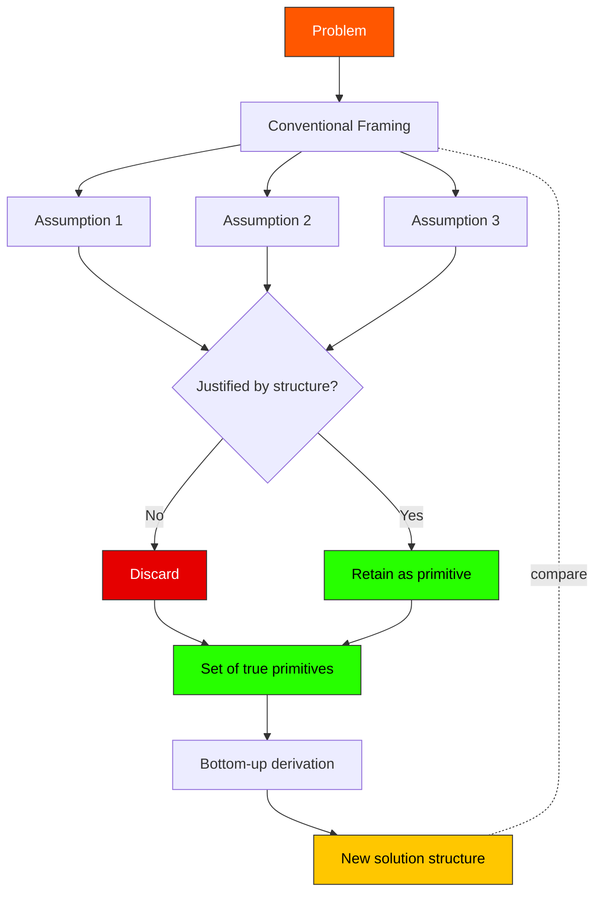

# First Principles Thinking

> [!definition] First Principles Thinking
> **First principles thinking** is the practice of reasoning forward from a problem's *load-bearing primitives* — claims justified independently rather than inherited by analogy, convention, or authority — and deriving conclusions from those primitives by sound inference, refusing intermediate appeals to "how it's usually done."
>
> **Defining property**: refusal of inherited framings. The practitioner asks not *what does my reference class do here?* but *what is actually true about this situation, and what follows?*
>
> **See also**: [[mental-model]], [[inversion]], [[axiomatization]], [[reasoning-by-analogy]] (the contrast)

## In-Depth Definition

The lineage runs from Aristotle's *Posterior Analytics* — where *archē* names the starting points of demonstrative knowledge — through Descartes' methodical doubt (suspend every belief that can be doubted; rebuild only what survives), through the axiomatic tradition in mathematics, into modern engineering culture where the practice has become a recognizable working method. The contemporary popularization owes much to Elon Musk's frequent invocation of "physics-style reasoning," in which a problem's apparent constraints (rocket cost, battery cost, manufacturing throughput) are decomposed to material, energy, and labor primitives and reconstituted bottom-up. The reconstruction routinely reveals that conventional cost figures embed assumptions — supplier markups, scale floors, design conservatism — that the primitives do not require.

The method has two operative moves. The *destructive* move is the disciplined refusal of analogy: when tempted to conclude *X must be the case because in similar situation Y, X was the case*, the first-principles practitioner asks *what is actually true about this situation that compels X?* Often the answer is: nothing; the inherited X was an artifact of conditions that do not hold here. The *constructive* move is the bottom-up rebuild: identify the genuine load-bearing premises, articulate them explicitly, then derive consequences without slipping in unjustified intermediates.

The contrast partner is [[reasoning-by-analogy]]. Analogy is fast, cheap, and usually right — most situations *are* relevantly similar to past situations. First-principles reasoning is slow, expensive, and usually unnecessary, but in the minority of cases where the inherited analogies *are* misleading, only first-principles reasoning gets the right answer. The mature practitioner does not always reason from first principles; the mature practitioner *recognizes which problems demand it*.

> [!boundary] Scope of Valid Application
> **Applies when**: (a) inherited solutions are visibly failing or suspiciously expensive; (b) the problem is novel enough that reference-class data may not generalize; (c) the cost of getting the answer wrong is high enough to justify the analytic expense; (d) the practitioner has access to or can derive the relevant primitives (physics, microeconomics, the underlying mechanism).
>
> **Does NOT apply when**: (a) the problem is routine and well-understood within an existing framework — first-principles re-derivation here is wasted effort and often error-prone; (b) the practitioner lacks the depth to identify true primitives versus conventional intermediates (in which case first-principles framing produces *plausibly-justified bad reasoning*); (c) time pressure is acute.
>
> **Far-transfer caveats**: invocations of "first principles" in popular discourse often mean "I dismiss conventional opinion." That is *not* first-principles thinking; it is the destructive move without the constructive move. Genuine practice requires the rebuild.

## Mechanism / How It Works

```
1. State the problem and the conventional framing.
2. Enumerate the conventional framing's load-bearing premises.
3. For each premise, ask:
     - Is this premise justified by the problem's actual structure?
     - Or is it inherited from a reference class that may not apply?
4. Discard any premise that fails (3).
5. Identify the *true primitives* — the claims that survive scrutiny
    OR that derive from physical, mathematical, or causal necessity.
6. Re-derive the problem's structure from primitives forward.
7. Compare the bottom-up structure to the conventional framing.
   The gap is the value of the exercise.
```

In practice steps 2–4 are the hardest, because conventional framings make their assumptions invisible. The Socratic / Cartesian discipline — *what would I have to believe for this to be true?* — is the standard tool for surfacing them.

## Visual Representation



```text
   Problem
      │
      ▼
   Conventional framing ──┐
      │                   │
      ▼                   │
   Assumptions:           │ (kept for comparison)
   ┌─ A1 ─┐               │
   ├─ A2 ─┤── interrogate │
   └─ A3 ─┘   each one    │
      │                   │
      ▼                   │
   Primitives that        │
   survive scrutiny       │
      │                   │
      ▼                   │
   Re-derive bottom-up    │
      │                   │
      ▼                   │
   New solution ◀─────────┘ compare; the gap is the insight
```

## Related Mental Models (Latticework Position)

> [!key-claim] Decomposition Family
> First-principles thinking belongs to a family of *decomposition* moves: [[reductionism]] (metaphysical), [[axiomatization]] (mathematical), [[refactoring]] (software), [[mental-model|mental-model construction]] (cognitive). Each operates on a different substrate; the structural move — *strip the system to load-bearing primitives, rebuild* — is shared.

> [!warning] When NOT to Reach for This Model
> 1. **Routine problems with mature reference classes**: rederiving the structural-analysis of a standard beam from material primitives wastes time and may introduce error; the inherited handbook formula encodes more validated practice than a fresh derivation can match.
> 2. **Insufficient primitive-knowledge**: without genuine grounding in the relevant physics / economics / biology, "first-principles" reasoning becomes confident speculation. The destructive move is easy; the constructive rebuild requires depth.
> 3. **Social and political problems with no clean primitives**: first-principles framing here often imports the practitioner's contested *values* as supposedly-neutral primitives, producing brittle and parochial conclusions.

## Real-World Examples

> [!example] Canonical Example (engineering)
> Musk's SpaceX rocket-cost analysis: rather than accepting the prevailing $65M+ price tag for an orbital launch, the team decomposed cost to raw materials (aluminum, copper, titanium, carbon fiber) plus labor and energy, found the materials cost was perhaps 2% of the conventional price, concluded the remaining 98% was inherited supply-chain markup and design conservatism, and re-derived a feasible architecture from the primitives. The cost reduction (∼10×) is the empirical payoff of first-principles framing.

> [!example] Far-Transfer Example (mathematics)
> Hilbert's 1899 *Foundations of Geometry* re-axiomatized Euclidean geometry from first principles, exposing implicit assumptions Euclid had used (continuity, betweenness) without ever stating them. The exercise did not change geometry's *theorems* but revealed the *true logical dependencies* — and the rigor enabled the later non-Euclidean re-derivations that physics needed for general relativity. The structural payoff (clarity about what depends on what) is identical to Musk's: separate genuine necessity from inherited convention.

> [!example] Personal Application
> When I rebuilt this PKB's metadata schema the conventional framing was "adopt the Zettelkasten conventions; tweak as needed." Suspending that and asking *what is metadata for, in a graph of my own concepts* produced a different set of primitives: predicate-style fields (`hallucination_check`, `cultivation-class`, `construct-maturity`) that participate in queries, not just declarative tags. The destructive move took ~30 minutes of writing out what I actually wanted to query; the constructive rebuild took ~2 weeks of iteration as new query needs surfaced and old conventions had to be unlearned. The cost ratio (1:30) is roughly typical of first-principles work in my experience — the destructive move is fast and feels productive; the rebuild is slow because every silently-decided convention now requires explicit re-decision.

## Research & Empirical Foundation

The methodological literature is older than experimental cognitive science: Aristotle's *Posterior Analytics*, Descartes' *Discourse on Method*, Mill's *System of Logic*, Polya's *How to Solve It*. Modern decision-theoretic and behavioral work largely treats first-principles thinking as a special case of deliberate System-2 reasoning (Kahneman 2011) deployed to override misleading intuitive analogies. Empirical evaluation faces the difficulty that first-principles reasoning, when correctly applied, produces non-obvious correct answers — but the same outputs can issue from luck or domain expertise, making attribution hard.

> [!cite] Aristotle, *Posterior Analytics* (c. 350 BCE)
> Establishes *archē* as the indemonstrable starting point of demonstrative knowledge. The originating treatment in the Western tradition.

> [!cite] Descartes, R. (1637)
> *Discourse on the Method*. The methodological re-articulation: doubt every inherited belief, retain only what survives indubitable scrutiny, rebuild knowledge bottom-up.

> [!cite] Polya, G. (1945)
> *How to Solve It*. Princeton University Press. Translates the philosophical tradition into a working heuristic toolkit, of which first-principles decomposition is the central move.

## Pitfalls & Limitations

> [!warning] Failure Mode 1 — Pseudo-Primitives
> Mistaking conventional intermediates for genuine primitives. A common pattern: the "first principle" turns out, on examination, to be itself an inherited framing one or two levels deeper. The discipline is recursive — keep asking *what justifies that?* until you reach genuine necessity (physics, mathematics, definition).

> [!warning] Failure Mode 2 — Destructive Without Constructive
> Dismantling the conventional framing without producing a working alternative. This is contrarianism dressed in first-principles vocabulary. The practice's value lies in the *rebuild*, not in the dismantling.

> [!warning] Failure Mode 3 — Smuggling Values as Primitives
> Particularly in social, political, or design problems, one's contested values can present themselves as neutral primitives. Diagnostic: would a thoughtful person disagreeing with you accept your "primitives" as primitives? If not, you have not bottomed out.

## Practical Exercises

1. **Cost decomposition drill**: pick a familiar product whose price you take for granted. Decompose to materials, energy, and labor primitives. Compute the gap between the primitive cost and the market price; account for the gap (legitimate intermediation vs. inherited inefficiency).
2. **Premise enumeration**: for any contested decision in your current work, write out every premise the conventional framing requires. For each, mark *justified by problem structure* or *inherited from analogy*. Discard the second class and re-derive.
3. **Companion to inversion**: pair this exercise with [[inversion]]. After deriving the first-principles solution, ask *what would have to be true about the primitives for this rebuild to fail?* The combination is more powerful than either alone.

## Case Studies

> [!case-study] The Apollo Lunar Rendezvous Decision
> NASA's choice of *lunar-orbit rendezvous* (LOR) over *direct ascent* and *Earth-orbit rendezvous* in 1962 was a first-principles victory. The conventional framing — direct ascent — was supported by inherited analogy to ballistic missiles and was politically dominant. John Houbolt's bottom-up rocket-equation analysis showed LOR required dramatically less mass to lunar orbit and back, but only by *abandoning* the analogy that "going to the moon means landing the whole rocket." The decomposition revealed that *what gets sent home* and *what gets landed* could be different vehicles, collapsing the mass budget. The conventional framing had bundled an unjustified premise; first-principles re-derivation unbundled it.

## Personal Notes

> [!reflection]
> First-principles work is expensive and I systematically under-budget for it. The pattern: I imagine the destructive phase will reveal one or two surprises and the rebuild will be quick. In practice the destructive phase reveals 5–8 hidden dependencies and the rebuild requires re-deciding things the convention had silently decided for me. The hidden cost of conventions is that they price-out the deliberation I now have to pay for in cash. The discipline I am still trying to install: budget the rebuild at *5x* my naive estimate, and refuse to start the destructive move on any problem where I cannot afford the rebuild at that multiplier.

## Three-Layer Quality Self-Assessment

> [!methodology-and-sources]
> - **Fidelity (5/5)**: ancient lineage, formally crisp, well-articulated across philosophy, mathematics, and engineering practice.
> - **Tractability (3/5)**: high cognitive cost. Doing it well requires substantial domain knowledge plus the discipline to suspend inherited framings — both expensive. Score reduced two points for this real-time cost.
> - **Transferability (5/5)**: the structural move applies wherever inherited framings exist, which is everywhere.
> - **Weakest dimension**: tractability → **Cultivation target**: build a 10-minute *cost-decomposition* daily drill on small problems to reduce activation energy until the move becomes habitual rather than heroic.

## Source Material

- Primary: [[mental-models-foundational-report-2026-05-10]]
- Classical: Aristotle *Posterior Analytics*; Descartes *Discourse on Method*

## Connections (Reciprocal Links Audit)

*Auto-populated by `linkcheck` during Phase 8.*
