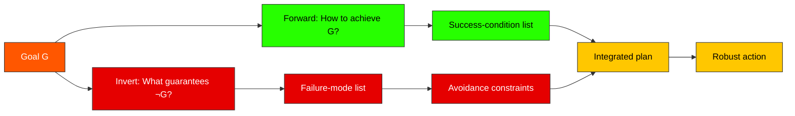

# Inversion

> [!definition] Inversion
> **Inversion** is the deliberate reformulation of a question into its opposite or backward form: *what guarantees failure?* in place of *what guarantees success?*; *what should I avoid?* in place of *what should I pursue?*; *who must this not be?* in place of *who must this be?* The reformulated question routinely surfaces evidence and constraints that the forward question hides.
>
> **Defining property**: directional reversal of inquiry without changing its underlying object. The two formulations are logically related (often equivalent), psychologically very different, and operationally complementary.
>
> **See also**: [[mental-model]], [[first-principles-thinking]], [[premortem-analysis]], [[contrapositive]]

## In-Depth Definition

The dictum *"Invert, always invert"* is attributed to the 19th-century mathematician [[carl-gustav-jacobi|Carl Gustav Jacobi]] as his standard prescription for handling intractable problems: when forward derivation is blocked, attempt the inverse formulation, which is often dramatically easier. The same insight has independent lineages in logic (the equivalence of a conditional and its contrapositive), in mathematical optimization (primal-dual methods), in cognitive psychology (the Wason selection task and its deontic variants), and in security engineering (threat modeling and red teams). [[Charlie-Munger|Munger]] is responsible for inversion's modern presence in the decision-making literature: his recurring advice to "always invert" — to ask *how could this go badly?* before asking *how could this go well?* — is a direct import of Jacobi's mathematical heuristic into life and investment decisions.

Inversion does two related kinds of work. The first is *failure-mode surfacing*: forward planning enumerates success conditions and tends to omit failure paths that don't naturally come to mind under the success frame. Inverting — asking what would *guarantee* failure — recruits a different and often more vivid set of evidence (recent disasters, near misses, structural fragilities). The premortem (Klein 2007), in which a team imagines the project has already failed and writes its post-hoc explanation, is a packaged inversion ritual: it routinely surfaces risks the forward planning had not noticed.

The second kind of work is *constraint extraction via negation*: rather than specifying what a solution must achieve, specify what it must *not* do. The negative specification is often shorter, less contestable, and easier to verify. Hippocratic medicine's *primum non nocere* ("first, do no harm"), Taleb's *via negativa*, and most regulatory regimes are negative-specification practices. They work because catastrophic outcomes are typically narrower and easier to characterize than optimal outcomes.

> [!boundary] Scope of Valid Application
> **Applies when**: (a) forward reasoning is blocked, slow, or low-yield; (b) the problem has identifiable failure modes whose enumeration is feasible; (c) avoidance of bad outcomes is more decision-relevant than maximization of good outcomes (most risk-management contexts); (d) cognitive biases of the success-frame are likely to dominate (planning fallacy, optimism bias).
>
> **Does NOT apply when**: (a) the problem is genuinely *open-ended* with no well-defined failure (some creative or exploratory work); (b) over-applied, inversion produces *paralysis by failure-imagination* — every action has imaginable failure modes, and an organization that weights failure-avoidance too heavily ossifies; (c) the problem is in a regime where success and failure modes are roughly symmetric and forward enumeration is just as productive.
>
> **Far-transfer caveats**: inversion is not pessimism. The pessimist asks *what will go wrong?* and stops; the inverter asks *what would guarantee failure?* in order to *engineer the avoidance into the forward plan*. The output of an inversion is action, not despondency.

## Mechanism / How It Works

```
Forward question:  How do I achieve goal G?
                              │
                              ▼
                        ┌─────────────┐
                        │  Inversion  │
                        └──────┬──────┘
                              │
                              ▼
Backward question: What would guarantee NOT achieving G?
                              │
                              ▼
                  Enumerate failure modes
                              │
                              ▼
                  Engineer their avoidance
                              │
                              ▼
                  Re-merge with forward plan
```

The merge step matters: inversion is not a substitute for forward planning but a *complement* to it. The mature deployment runs both passes, then integrates the avoidance constraints from the backward pass into the forward plan as boundary conditions.

## Visual Representation



```text
                ┌─────────┐
                │  Goal   │
                └────┬────┘
        ┌───────────┴───────────┐
        ▼                       ▼
   FORWARD PASS            INVERSION PASS
   How to win?             How to lose?
        │                       │
        ▼                       ▼
   Success conditions     Failure modes
        │                       │
        └─────────┬─────────────┘
                  ▼
        Integrated plan with
        forward intent + reverse
        avoidance constraints
                  │
                  ▼
            Robust action
```

## Related Mental Models (Latticework Position)

> [!key-claim] Reversal Family
> Inversion belongs to a family of *directional-reversal* moves: [[contrapositive]] (logic), [[dual-problem]] (optimization), [[adversarial-thinking]] (security), [[devils-advocate]] (deliberation), [[premortem-analysis]] (project planning), [[via-negativa]] (epistemics). Each reverses inquiry direction at a different level of formality. The structural insight — that the backward question recruits different evidence than the forward question — is the same.

> [!warning] When NOT to Reach for This Model
> 1. **Open-ended creative exploration**: in pure-discovery work where there is no well-defined "failure," inversion produces nothing useful and may inhibit the generative state.
> 2. **Action-paralysis risk**: organizations that *only* invert (every initiative attacked through its failure modes before approval) ossify. Inversion must be balanced by forward initiative; over-applied, it becomes the rationalization of inaction.
> 3. **Personal psychological cost**: chronic inversion as a personality trait correlates with anxiety; the practice is most healthy as an *episodic* deployment, not a constant background mode.

## Real-World Examples

> [!example] Canonical Example (mathematics)
> Solving *find x such that f(x) = y* is often blocked when f is complex. Solving *find x such that f(x) ≠ y* (find a counter-example to f(x) = y) is sometimes easier and equally informative. The technique generalizes: many proofs that seem hard direct become tractable as proofs by contradiction (assume the negation, derive an absurdity). Jacobi's recommendation captures this: *invert*.

> [!example] Far-Transfer Example (security engineering)
> **Threat modeling** (STRIDE, attack trees): rather than asking *how do users accomplish their goals through this system?*, the security analyst asks *what would an attacker do to abuse this system?* The inversion routinely surfaces vulnerabilities (race conditions, parameter pollution, social-engineering vectors) that the user-success frame never reaches. Modern security practice would be unrecognizable without this institutionalized inversion. The same maneuver, applied to *strategic* rather than *security* planning, is the premortem.

> [!example] Personal Application
> Before committing to the latticework master plan I inverted: *what would guarantee this project fails?* The answers were specific — uncalibrated word counts producing burnout, deferring connection-density until "later," writing notes I would not re-read, retrofitting metadata mid-build. The plan was rewritten *around* these failure modes (1500–1900 word band, bridges-table maintained per session, far-transfer examples enforced as a quality gate, schema retrofit deferred to Phase 8 by explicit decision). Inversion did not tell me what to build; it told me what to *protect against* during the build, which is a different and earlier question — and the protection has held across all six sessions to date.

## Research & Empirical Foundation

Empirical support comes from three streams. **(1) Cognitive psychology**: the Wason selection task literature (Wason 1968; Cosmides & Tooby 1992) shows striking performance jumps when conditional-rule problems are reformulated in deontic / contrapositive form — direct evidence that inverted formulations recruit qualitatively different reasoning. **(2) Premortem effectiveness**: Klein (2007) and follow-up work in organizational decision-making document substantial improvements in risk identification when teams perform structured premortems versus standard forward planning. **(3) Optimization theory**: strong duality results in linear and convex programming establish formal conditions under which the inverted (dual) problem yields exactly the same optimum as the forward (primal) problem — providing the mathematical foundation for inversion's practical power.

> [!cite] Bell, E. T. (1937)
> *Men of Mathematics*. Simon & Schuster. Reports Jacobi's methodological dictum *Man muss immer umkehren* and its application across his work in elliptic functions and number theory.

> [!cite] Klein, G. (2007)
> "Performing a Project Premortem." *Harvard Business Review*, 85(9), 18–19. Operationalizes inversion as a team ritual: imagine the project has failed; write the post-hoc explanation; engineer avoidance.

> [!cite] Cosmides, L., & Tooby, J. (1992)
> "Cognitive Adaptations for Social Exchange." In Barkow, Cosmides & Tooby (eds.), *The Adapted Mind*. Oxford UP. The classic demonstration that humans solve contrapositive (deontic) reformulations of conditional logic problems they cannot solve in direct form.

## Pitfalls & Limitations

> [!warning] Failure Mode 1 — Inversion Without Forward Re-merge
> Performing the inversion pass and then *only* acting on the avoidance constraints, never re-merging with forward intent. The result is a defensive, risk-averse plan that avoids failure but does not pursue success.

> [!warning] Failure Mode 2 — Imagined Catastrophes Crowd Out Probable Realities
> Failure-mode enumeration weights vivid, available, narratively-coherent failures over mundane likely ones. The discipline is to weight by *probability and impact*, not by imagistic salience.

> [!warning] Failure Mode 3 — Habituation
> Inversion is so powerful and so cheap that, paradoxically, it can be *under*-deployed: practitioners adopt it as background sensibility ("I'm always thinking about what could go wrong") without ever performing the structured exercise. The structured form (write the failure modes down; rank them; act on them) routinely outperforms the vague form.

## Practical Exercises

1. **Premortem ritual**: at the *start* of a non-trivial project, gather stakeholders. Stipulate that the project has failed. Each participant writes the post-hoc explanation independently. Compare; consolidate; engineer avoidance into the plan.
2. **Daily inversion**: for any decision involving more than trivial stakes, before committing, ask *what would I have to do to guarantee this fails?* Write three answers. Check the current plan against each.
3. **Pair with first principles**: after a [[first-principles-thinking|first-principles]] derivation, run an inversion pass on the derivation itself: *what would have to be true about my primitives for this rebuild to fail?* The combination is more robust than either alone.

## Case Studies

> [!case-study] Boeing 737 MAX MCAS
> The MCAS automated stabilizer system on the 737 MAX was designed from a strong forward frame: *how do we make this aircraft handle like the previous generation despite its different aerodynamic balance?* The system worked when its single angle-of-attack sensor was healthy. A structured inversion — *what would guarantee catastrophic failure?* — would have surfaced the single-sensor dependency, the absence of pilot disclosure, and the silent authority MCAS held over trim. Two crashes (Lion Air 610, 2018; Ethiopian 302, 2019) made the unperformed inversion legible after the fact. Modern aviation safety culture exists in large part *because* inversion is institutionalized; the MAX failure was a localized lapse in that culture.

## Personal Notes

> [!reflection]
> I invert reliably for projects but rarely for relationships and almost never for habits. The asymmetry is suspicious: the cost of failure in the latter two domains is higher and the inversion is cheaper, yet I systematically underuse it there. Probable cause: inversion in the personal domain *feels* morbid ("what would guarantee this relationship fails?"); in the project domain it feels professional. The framing is what is blocking the move, not the difficulty of the move itself — which means the unblock is reframing inversion-in-personal-domains as preventative-maintenance rather than morbidity, a small move I keep almost-making and not quite executing.

## Three-Layer Quality Self-Assessment

> [!methodology-and-sources]
> - **Fidelity (5/5)**: anchored in classical logic (contrapositive equivalence) and modern optimization (duality), with the Jacobi pedigree as the methodological articulation.
> - **Tractability (5/5)**: cheap, fast, and trainable. The structured premortem can be performed in 30 minutes.
> - **Transferability (5/5)**: applies wherever forward reasoning applies, which is everywhere.
> - **Composite (5.0)**: an *exemplary* model — high quality on all three dimensions. Cultivation target shifts from acquisition (already mastered) to *guarding against complacency-driven under-deployment*.

## Source Material

- Primary: [[mental-models-foundational-report-2026-05-10]]
- Methodological lineage: Jacobi (19th c.); Munger 1994 USC address; Klein 2007 HBR

## Connections (Reciprocal Links Audit)

*Auto-populated by `linkcheck` during Phase 8.*
