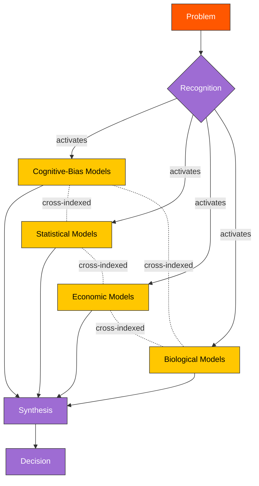

# Latticework of Mental Models

> [!definition] Latticework of Mental Models
> A **latticework of mental models** is a deliberately cultivated, *cross-indexed* collection of [[mental-model|mental models]] drawn from many disciplines, organized so that the holder can route any incoming problem to the model — or *combination* of models — best fit to its structure. The latticework is not a list, not a library, and not a curriculum: its defining property is the *connective tissue* between models that allows analogical transport, mutual constraint, and ensemble combination.
>
> **Defining property**: structural cross-indexing. A model *belongs* to a latticework only when its connections to other models in the lattice are explicit, load-bearing, and operable.
>
> **See also**: [[mental-model]], [[first-principles-thinking]], [[inversion]], [[map-vs-territory]]

## In-Depth Definition

The phrase entered serious intellectual circulation through [[charlie-munger]]'s 1994 USC address, where he proposed that "worldly wisdom" requires "a latticework of models" drawn from psychology, mathematics, biology, physics, engineering, accounting, and history. The argument has two halves. The *negative* half is the **man-with-a-hammer syndrome**: an agent who has mastered only one discipline will compulsively apply that discipline's models to every problem, including problems whose causal structure lies elsewhere. The *positive* half is constructive: deliberately accumulate the *big ideas* of every major discipline, hold them simultaneously available, and route problems to whichever subset of models actually fits.

The deeper claim — easily missed in popular treatments — is that the *connections between models* matter more than the models themselves. A reader who memorizes a hundred mental models from a popular book has compiled a *list*; the latticework requires that each model be linked to others by explicit *structural correspondences*, so that recognizing problem A as structurally akin to problem B (even across disciplines) becomes a routine cognitive operation. This is why [[analogy|analogical reasoning]] sits at the heart of latticework practice: without cross-domain mapping, the lattice is just a heap.

The architecture is not idiosyncratic to Munger. It echoes Herbert Simon's account of expertise as access to a richly indexed long-term memory of patterns; it parallels the AI literature on *mixture of experts* and *ensemble methods*; it has structural cousins in biological evolution's preference for modular, recombinable systems; and it tracks the philosophy-of-science consensus that no single theoretical framework exhausts an interesting domain. What is distinctive is Munger's emphasis on the *cultivation discipline*: a latticework is not something one has, but something one builds, deliberately, over decades.

> [!boundary] Scope of Valid Application
> **Applies when**: problems are open-ended, structurally varied, and benefit from reframing — i.e., most real-world strategic, investment, design, and life-decision problems where the framing of the problem is itself contested or unclear.
>
> **Does NOT apply when**: (a) problems are narrow, technical, and squarely inside a single discipline whose models are well-validated (designing a bridge, performing a known surgical procedure); (b) speed is paramount and routing through multiple models would exceed the problem's time budget; (c) the practitioner lacks the depth in *any* single discipline to use its models well — premature latticework-building over a shallow base produces the worst of both worlds.
>
> **Far-transfer caveats**: do not confuse a latticework with a *set of metaphors*. Mental models in a latticework must be *operationalizable* — they must support specific predictions, distinctions, and decisions, not just rhetorical decoration.

## Mechanism / How It Works

A working latticework operates in three phases per problem:

1. **Recognition** — incoming problem activates models whose structural features match. A skilled practitioner often activates multiple candidate models in parallel; the question is which fits *best*.
2. **Routing & combination** — selected models are deployed simultaneously rather than sequentially. Their predictions and constraints are compared. Where they agree, confidence rises; where they disagree, the disagreement itself becomes diagnostic information.
3. **Synthesis or override** — when models converge, decision is straightforward. When they diverge, the practitioner must judge *which model's domain assumptions are best honored by the actual problem*. This judgment is itself a meta-skill cultivated over time.

The cultivation phase — building the lattice — proceeds by acquiring *one big idea per discipline*, demanding for each new model an explicit articulation of its *structural correspondence* to at least one model already in the lattice. This is the rule that converts a list into a network.

## Visual Representation



```text
                  ┌─────────────────┐
                  │     Problem      │
                  └────────┬────────┘
                           ▼
                   ┌──────────────┐
                   │ Recognition  │
                   └─┬──┬──┬──┬───┘
                     │  │  │  │   parallel activation
       ┌─────────────┘  │  │  └─────────────┐
       ▼                ▼  ▼                ▼
 ┌─────────┐    ┌─────────┐ ┌─────────┐  ┌─────────┐
 │ Bias    │◀──▶│ Stats   │◀▶│ Econ   │◀▶│ Biology │
 │ models  │    │ models  │ │ models  │  │ models  │
 └─────┬───┘    └────┬────┘ └────┬────┘  └────┬────┘
       │             │           │            │
       └──────┬──────┴─────┬─────┴──────┬─────┘
              ▼            ▼            ▼
                   ┌─────────────┐
                   │  Synthesis  │
                   └──────┬──────┘
                          ▼
                   ┌─────────────┐
                   │  Decision   │
                   └─────────────┘
   (Dotted lines between disciplines = cross-indexed structural analogs)
```

## Related Mental Models (Latticework Position)

> [!key-claim] Self-Referential Density
> This note is *meta* to the entire section: every other mental-model note in the latticework is a node *in* the structure this note describes. Its outgoing analogs reach to cognition ([[mental-model]]), machine learning ([[ensemble-methods]]), evolutionary biology ([[modularity-in-evolution]]), and the philosophy of multidisciplinary inquiry ([[interdisciplinarity]]).

> [!warning] When NOT to Reach for This Model
> 1. **Single-discipline expert problems**: a cardiac surgeon mid-operation does not need to consult evolutionary biology. The latticework is for problem *framing* and *strategic* judgment, not for crowding tactical execution.
> 2. **Decision paralysis risk**: novices building their first lattice often invoke five models when one would do, producing analysis paralysis. The discipline includes knowing when one model is enough.
> 3. **Substituting breadth for depth**: a lattice built on shallow understanding of many fields underperforms deep mastery of one. Munger's recommendation presupposes serious depth in *every* discipline added — perhaps two-dozen big ideas per field, deeply understood — not a TED-Talk acquaintance.

## Real-World Examples

> [!example] Canonical Example (investment)
> Munger and Buffett's investment record at Berkshire Hathaway. Their public reasoning routinely braids accounting, microeconomics (incentives), psychology (cognitive biases like social proof and authority), industry-specific dynamics (insurance float, consumer franchise economics), and game-theoretic competitive analysis — explicitly rejecting any single-framework approach (efficient-market dogma, pure technical analysis, pure value screens).

> [!example] Far-Transfer Example (machine learning)
> **Random forests** (Breiman, 2001) train many shallow decision trees on bootstrap samples and average their predictions. Each tree alone is a weak learner; the *ensemble* outperforms any single tree because errors are partially uncorrelated and cancel in aggregation. Munger's latticework is the cognitive analog: each mental model is a "weak learner" with characteristic blind spots, and the practitioner's wisdom is the ensemble's averaged prediction. The mathematical guarantee that bagging reduces variance is the formal counterpart to the latticework's qualitative claim that multidisciplinary thinking reduces error.

> [!example] Personal Application
> The clearest case in my own work was framing the SPES (sequential prompt engineering) project. Read purely through software-architecture models the system looked like a component library — version-controlled artifacts with a dependency graph. Read through pedagogy models (heutagogy in particular) the same artifacts looked like a curriculum. Read through Kelly's grid of personal constructs they were a public proxy for my own concept-formation. Each frame surfaced different requirements, and the synthesis — that all three are *simultaneously true* of the same artifacts — produced design constraints (versioning + cognitive scaffolding + concept-grid coverage) that no single frame would have generated. The disagreement *among* frames was where the design lived; agreement would have signaled redundancy, not insight.

## Research & Empirical Foundation

Empirical support comes from three convergent sources. **(1) Expertise research**: Tetlock's two-decade *Expert Political Judgment* and *Superforecasting* programs found that the best forecasters are reliably "foxes" (Berlin's term) — practitioners who weave multiple analytic frameworks — not "hedgehogs" (single-framework specialists). **(2) Ensemble learning theory**: formal guarantees from Breiman, Schapire, and others establish that combining diverse weak learners reduces generalization error, providing a mathematical analog to the latticework claim. **(3) Innovation studies**: research on breakthrough scientific contributions (Uzzi et al. 2013) shows the most-cited papers exhibit *unusual combinations* of conventional source material — innovation tracks cross-domain re-combination, not within-domain depth alone.

> [!cite] Munger, C. (1994)
> "A Lesson on Elementary, Worldly Wisdom As It Relates to Investment Management & Business." Address at USC Marshall School of Business; reprinted in *Poor Charlie's Almanack* (Kaufman ed., 2005). The originating articulation of the latticework concept and the man-with-a-hammer warning.

> [!cite] Tetlock, P. E., & Gardner, D. (2015)
> *Superforecasting: The Art and Science of Prediction*. Crown. Empirical demonstration that multi-framework "fox" reasoners outperform single-framework "hedgehog" specialists at long-horizon prediction tasks.

> [!cite] Breiman, L. (2001)
> "Random Forests." *Machine Learning*, 45(1), 5–32. Formal treatment of ensemble methods establishing the variance-reduction theorem that supplies the structural analog to latticework reasoning.

## Pitfalls & Limitations

> [!warning] Failure Mode 1 — Heap, Not Lattice
> Acquiring many models without explicit cross-indexing produces a *heap* — a list of unconnected items — rather than a lattice. Diagnostic: the practitioner can name many models but cannot articulate, on demand, the structural correspondence between any two specified models in different disciplines.

> [!warning] Failure Mode 2 — Premature Synthesis
> Combining models before each is well-understood individually produces fluent-sounding but unreliable predictions. The cultivation order matters: deep mastery of each model first, then cross-indexing, then ensemble use.

> [!warning] Failure Mode 3 — Aestheticization
> The latticework can become a *style* — name-dropping models in conversation — divorced from operational use in actual decisions. Diagnostic: when have your latticework activations *changed* a decision you would otherwise have made differently?

## Practical Exercises

1. **Pair-link drill**: pick two mental models from different disciplines in your current lattice. In writing, articulate the precise structural correspondence — what is mapped to what, and what is *not* mapped. If the correspondence is vague, the link is decorative.
2. **Routing diary**: for one week, log each non-trivial decision plus the two or three mental models you actively used. Review at week's end: which models were systematically over-invoked? Under-invoked? Which cross-indexed pairs proved load-bearing?
3. **Hammer audit**: identify your own discipline of deepest training. List five recent problems you framed *primarily* through that discipline's models. For each, ask: which other discipline's model would have been a better fit?

## Case Studies

> [!case-study] The 2008 Financial Crisis Risk Models
> Pre-2008 financial-risk modeling at major banks relied overwhelmingly on Gaussian-copula and value-at-risk frameworks — a single-discipline (financial mathematics) toolkit. Critics inside and outside finance who routinely applied models from *psychology* (herding, cognitive biases), *complex systems* (cascading failure in tightly coupled networks), and *history* (Kindleberger's recurring-mania pattern) issued early warnings that the math-only practitioners systematically dismissed. The crisis is a textbook case of catastrophic single-discipline framing in a problem whose causal structure spanned several disciplines.

## Personal Notes

> [!reflection]
> I default to ~3–5 frames per problem and then stop. Munger's standard of "80–90 frames" is aspirational; the operational question for me is whether each *additional* frame past the first 5 produces marginal insight or marginal noise. My honest estimate: somewhere around frame 7–10 the marginal insight collapses unless I am working at the edge of a field I do not know, in which case the additional frames have to come from *other* people because I do not own the lattice deeply enough to add them myself. The conspicuously absent disciplines from my own current lattice are biology (especially evolutionary and ecological models) and pure mathematics beyond probability/optimization — acquiring two or three big ideas from each at depth would probably be the highest-leverage lattice expansion available to me, and is currently un-budgeted.

## Three-Layer Quality Self-Assessment

> [!methodology-and-sources]
> - **Fidelity (4/5)**: the concept is well-articulated as a *practice* but lacks a single canonical formal specification; it lives in essays, addresses, and exemplars rather than in a unifying technical literature. Score reduced one point for absence of formalization.
> - **Tractability (4/5)**: the practice is teachable and learnable but slowly — Munger himself emphasizes decades of cultivation. Single-decision deployment is fast once the lattice exists.
> - **Transferability (5/5)**: applies to virtually any domain involving non-trivial judgment under structural uncertainty.
> - **Weakest dimension**: fidelity → **Cultivation target**: enforce explicit `structural-correspondence` annotations in every cross-disciplinary link in this PKB to convert a literary concept into an operationally specified architecture.

## Source Material

- Primary: [[mental-models-foundational-report-2026-05-10]]
- Munger primary: *Poor Charlie's Almanack* (Kaufman ed., 2005); 1994 USC address transcript

## Connections (Reciprocal Links Audit)

*Auto-populated by `linkcheck` during Phase 8. Expected eventual incoming density: ≥ 25 (every Phase 2–7 model note will reference this meta-architecture).*
