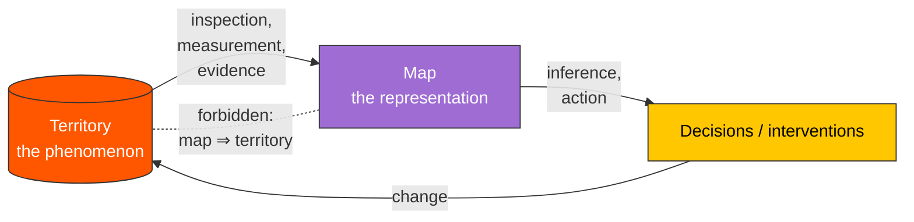

# The Map Is Not the Territory

> [!definition] The Map Is Not the Territory
> **The map is not the territory** is the epistemic principle, articulated by Alfred Korzybski in 1933, that any representation of a phenomenon is *systematically distinct* from the phenomenon itself: it is necessarily incomplete (it omits features), it is at a different level of abstraction (it is not made of the same stuff), and it can be *wrong* (its claims may not correspond to reality) while still being internally consistent.
>
> **Defining property**: the *gap* between representation and represented is permanent and asymmetric. The map can be modified by inspecting the territory; the territory is not modified by editing the map. Any inference that conflates the two — *because the map says so, the territory must be so* — is an error.
>
> **See also**: [[mental-model]], [[abstraction]], [[reification-fallacy]], [[bayesian-updating]]

## In-Depth Definition

The aphorism is Korzybski's, drawn from his 1933 *Science and Sanity*, and is the founding principle of *general semantics* — a movement that sought to inoculate ordinary thought against the systematic confusions Korzybski took to be embedded in conventional ("Aristotelian") language use. Korzybski himself stated three corollaries that travel with the original principle: (1) **a map is not the territory it represents**; (2) **a map covers not all the territory** (omission is constitutive of mapping); (3) **a map is self-reflexive** (it can be modified by reference to the territory, including by reference to itself as a feature of the territory).

The structural insight predates Korzybski. Charles Sanders Peirce's semiotic distinction between sign and referent encodes the same warning. The mathematical theory of representations (group representations, model theory) makes the same point with formal precision: a representation preserves *some* of the represented structure's relations, and the value of the representation lies precisely in this *partial* faithfulness — total faithfulness would mean the map *is* the territory and would defeat the purpose of mapping. George Box's later aphorism "all models are wrong, but some are useful" is the working scientist's restatement.

The principle does *not* counsel skepticism toward representation as such. Maps are indispensable: thinking without representation is impossible, and the alternative to a partial map is no map. The principle counsels *awareness of representation as representation*: never to forget that one is operating on the map, never to take the map's silences as territorial silences, never to take the map's structure as the territory's structure beyond the warrant of the mapping process.

The standard illustration is Korzybski's own: a menu describes meals, but cannot be eaten. The structural error of treating the menu as the meal is an error humans make routinely with words, theories, mental models, statistical summaries, organizational charts, financial statements, and every other representational artifact.

> [!boundary] Scope of Valid Application
> **Applies when**: (a) any representation is in use (which is essentially always, for cognition); (b) the consequences of mistaking the representation for the represented are non-trivial — investment decisions, scientific inference, policy design, interpersonal judgment; (c) multiple representations of the same territory exist and choice between them is consequential.
>
> **Does NOT apply** as a *blanket counsel of doubt*: the principle is not "do not trust representations" but "trust them as representations, with awareness of the gap." Mistaken application produces *paralyzing skepticism* (every map is rejected because it is not the territory) which is just as dysfunctional as naive realism.
>
> **Far-transfer caveats**: in fluent expert use, the gap becomes phenomenologically invisible. The expert physicist *sees* the wave function as the system; the expert programmer *sees* the type system as the program; the expert manager *sees* the org chart as the organization. The discipline must be deliberately re-installed periodically, because expertise erodes it as a side-effect of building fluency.

## Mechanism / How It Works

```
Territory (the phenomenon) ──┐
       ▲                     │ inspection / measurement
       │ acts on             ▼
       │              Map (the representation)
       │                     │
       │ guides action       │ inference, manipulation
       │                     ▼
       └────── Decisions / interventions
```

The principle's practical import: the upward arrow (territory → map) can produce updates to the map; the downward arrow (map → decisions → territory) is how representations have effects. The *forbidden short-circuit* is the inference *map → territory* without the inspection arrow — concluding that the territory has a feature merely because the map shows it. Bayesian updating ([[bayesian-updating]]) is the formal discipline of letting the upward arrow systematically modify the map in light of evidence.

## Visual Representation



```text
                  inspection
   ┌─────────────────────────────────────┐
   │                                     │
   ▼                                     │
 ┌────────────┐                    ┌──────────┐
 │    Map     │ ─── inference ───▶ │ Decisions │
 │ (represent.)│                    └──────┬─────┘
 └────────────┘                           │
       ║                                   │ act
       ║  FORBIDDEN: assume map = territory │
       ║                                   ▼
       ║                            ┌──────────────┐
       ╚════════════════════════════ │  Territory  │
                                    │ (phenomenon) │
                                    └──────────────┘
```

## Related Mental Models (Latticework Position)

> [!key-claim] Representation-Discipline Family
> The map-territory distinction belongs to a family of *representational-discipline* models: [[abstraction]], [[reification-fallacy]] (its negation as failure mode), [[representation-theory]] (formal version), [[bayesian-updating]] (the corrective procedure), [[fallibilism]] (the epistemological position). Each is a different facet of the same insight: representations have a relationship to what they represent, that relationship is partial, and treating it as total is the master error.

> [!warning] When NOT to Reach for This Model
> 1. **Pragmatic action under tight deadline**: when a decision must be made in seconds, deliberate map-territory reflection is wasted overhead — *most of the time the map is good enough for the action at hand*. The discipline pays off in periodic reflective passes, not in every micro-decision.
> 2. **Communication with the unfamiliar**: invoking "the map is not the territory" in casual conversation often reads as pedantic or evasive; the principle does its work *internally* in one's own reasoning, not as a conversational move.
> 3. **Excessive deployment as paralysis**: applied uniformly to every representation, the principle defeats action. The mature deployment is *selective*: deployed when stakes are high, when the map's lineage is suspect, when multiple maps disagree, or when the territory has visibly changed.

## Real-World Examples

> [!example] Canonical Example (Korzybski's own)
> The menu is not the meal. One can read the menu, choose from it, criticize it as a menu, and act on its information — but one cannot eat the menu, and the deliciousness of the meal is not predictable from the elegance of the menu's typography. The asymmetry is total: the meal exists without the menu, the menu does not feed.

> [!example] Far-Transfer Example (statistics)
> A correlation coefficient *r* is a map of a relationship between two variables. It summarizes (compresses) information; it omits (the shape of the joint distribution, outliers, non-linearity); it can be misleading (Anscombe's quartet shows four datasets with identical *r*, mean, and variance but radically different scatter-plot territories). A statistician who treats *r* as the territory misses what the data actually says. Anscombe's quartet is, in effect, an empirical demonstration of Korzybski's principle within statistics.

> [!example] Personal Application
> For ~6 months I tracked productivity through a Tasks-plugin completion count — a compact, queryable map. The map showed steady output; the territory (what I actually got done that mattered) was diverging from it because I was completing more tasks of decreasing significance to inflate the metric I was watching. The map's transparency came from its precision: an integer per day, easy to compare day-to-day. The corrective was not a better metric — any single number would have produced its own version of the same gaming — it was *periodic forced contact with the territory* by writing a monthly retrospective in prose, which deliberately re-installs the friction the metric had eliminated. The lesson generalized: every dashboard I rely on requires a parallel prose practice, or the dashboard's compactness will eventually drift into Goodhart territory.

## Research & Empirical Foundation

The principle's status is largely *philosophical* rather than empirical, but it is reinforced by empirical streams in cognitive psychology and decision research. **(1) Naive realism studies** (Ross & Ward 1996) demonstrate that humans systematically take their own perceptions and conceptual representations as faithful renderings of reality, and underestimate the contribution of their cognitive apparatus to the percept. **(2) Theory-ladenness of observation** (Hanson 1958; Kuhn 1962) in philosophy of science establishes that observations are always interpreted through prior theoretical commitments — there is no map-free access to the territory, only better and worse maps. **(3) Representation-aware design in HCI and visualization** (Tufte 1983; Few 2009) translates the principle into design heuristics: every visualization is a representational choice; choice of map shapes inference about the territory.

> [!cite] Korzybski, A. (1933)
> *Science and Sanity: An Introduction to Non-Aristotelian Systems and General Semantics.* International Non-Aristotelian Library. The originating articulation of the map-territory distinction as a principle of disciplined cognition.

> [!cite] Bateson, G. (1972)
> *Steps to an Ecology of Mind.* University of Chicago Press. Bateson's reformulation, "the map is not the territory, and the name is not the thing named," generalizes Korzybski's principle into ecology, anthropology, and systems theory, anchoring it in the broader insight that *information is difference, not substance*.

> [!cite] Box, G. E. P. (1979)
> "Robustness in the Strategy of Scientific Model Building." In *Robustness in Statistics*, ed. R. L. Launer & G. N. Wilkinson, Academic Press, pp. 201–236. The "all models are wrong, but some are useful" formulation: the working statistician's restatement of Korzybski's principle as methodological advice.

## Pitfalls & Limitations

> [!warning] Failure Mode 1 — Reification
> Treating a category from the map as an entity in the territory: speaking of "the economy" as a thing that has intentions; speaking of "intelligence" as a substance one possesses in a quantity; speaking of "the market" as an agent that decides. The categorical convenience of the map is mistaken for ontological reality.

> [!warning] Failure Mode 2 — Map-Switch Resistance
> A map that has been profitable becomes the *only* map the practitioner knows. When the territory changes (or when the original map was always partial), the practitioner cannot perceive the alternative representations that would now serve better. The discipline of *holding multiple maps* is necessary correction.

> [!warning] Failure Mode 3 — Skeptical Paralysis
> The opposite failure: invoking the principle to refuse all representations as inadequate. *No* map serves all purposes; *some* maps serve some purposes. The principle counsels awareness of the gap, not refusal of representation.

## Practical Exercises

1. **Map-switch drill**: take a phenomenon you currently model with one representation (a financial metric, a personality framework, an architectural diagram). Find a *second* representation of the same phenomenon (a different metric, a different framework, a different decomposition). Note the differences in what each representation surfaces and silences.
2. **Anscombe-style audit**: when a decision rides on a summary statistic, look at the underlying data. The summary is the map; the data is the territory. The exercise is to *re-experience the gap* periodically, not just affirm it intellectually.
3. **Vocabulary discipline**: for one week, when speaking of an abstract entity (the market, the customer, the organization), substitute a more concrete description and notice the inferential shift. The substitution exposes how much of one's reasoning rides on the abbreviation.

## Case Studies

> [!case-study] The 2008 Mortgage-Backed Security Crisis (revisited)
> Sub-prime mortgage-backed securities were rated by structured statistical models that mapped historical default correlations. The map showed acceptable risk; the territory contained a correlated nationwide housing-price decline that the historical correlation matrix did not encode (because no comparable nationwide decline had occurred in the training period). Decision-makers — investors, regulators, ratings agencies — treated the map as the territory: they reasoned *the model says risk is acceptable, therefore risk is acceptable*. The failure was not the model's existence (a map is necessary) but the absence of map-territory discipline (the map's silences were taken as territorial silences). This case appears in [[latticework-of-mental-models]] as a single-discipline failure; it appears here as a map-territory failure. Both readings are accurate — they are *different maps* of the same crisis.

## Personal Notes

> [!reflection]
> Most of my high-fluency representations have become invisible: my model of my own emotions, my model of close relationships, my model of "how learning feels when it is working." Each was hard-won, then naturalized, then assumed. The observation that *fluency itself is the warning sign* is the most operationally useful thing in this note for me — it gives a heuristic for when to invest in deliberate map-territory contact (whenever a representation has become effortless, suspect it). The deliberate friction I am still missing in my personal life: a regular practice that forces re-contact with relationship territories I have stopped checking on because the maps feel reliable.

## Three-Layer Quality Self-Assessment

> [!methodology-and-sources]
> - **Fidelity (5/5)**: founding principle of general semantics, structurally identical to formal results in representation theory and semiotics, restated by working scientists (Box) and ecologists (Bateson).
> - **Tractability (5/5)**: instantly graspable in its slogan form; the structured exercise (map-switch drill) is cheap.
> - **Transferability (5/5)**: applies to any cognitive activity that uses representations, which is all of them.
> - **Composite (5.0)**: an *exemplary* model. Cultivation target shifts from acquisition (one-line aphorism, immediately memorable) to *guarding against transparency illusion* — the model's biggest enemy is its own apparent obviousness, which lets fluent users assume they are deploying it when they have stopped doing so.

## Source Material

- Primary: [[mental-models-foundational-report-2026-05-10]]
- Foundational: Korzybski 1933 *Science and Sanity*; Bateson 1972 *Steps to an Ecology of Mind*

## Connections (Reciprocal Links Audit)

*Auto-populated by `linkcheck` during Phase 8.*
