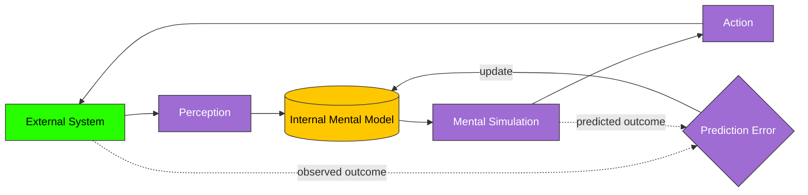

---
# ═══════════════════════════════════════════════════════════════
# CORE IDENTITY
# ═══════════════════════════════════════════════════════════════
title: "Mental Model"
aliases:
  - "Mental Models"
  - "Internal Model"
  - "Cognitive Model"
  - "Model-of-the-World"
type: permanent-note
note-subtype: mental-model
status: budding
confidence: high

# ═══════════════════════════════════════════════════════════════
# CLASSIFICATION
# ═══════════════════════════════════════════════════════════════
tags:
  - permanent-note
  - mental-model
  - latticework
  - hub-note
  - domain/cognitive-science
  - subdomain/representation
  - subdomain/reasoning
  - model-type/structural

# ═══════════════════════════════════════════════════════════════
# TEMPORAL
# ═══════════════════════════════════════════════════════════════
created: "2026-05-12"
updated: "2026-05-12"

# ═══════════════════════════════════════════════════════════════
# CLASSIFICATION & DISCOVERY
# ═══════════════════════════════════════════════════════════════
domain: cognitive-science
subdomains:
  - knowledge-representation
  - reasoning
  - epistemology
primary_domain: "Cognitive Science"
secondary_domains:
  - "Philosophy of Mind"
  - "Control Theory"
  - "Decision Theory"
  - "Education"
knowledge_level: "intermediate"

# ═══════════════════════════════════════════════════════════════
# THREE-LAYER QUALITY FRAMEWORK
# ═══════════════════════════════════════════════════════════════
quality:
  fidelity: 5
  tractability: 4
  transferability: 5
  composite: 4.67
  weakest-dimension: "tractability"
  cultivation-target: "Faster construction of fit-for-purpose models without sacrificing fidelity — practice via deliberate inversion exercises and far-transfer drills."

# ═══════════════════════════════════════════════════════════════
# LATTICEWORK INTEGRATION
# ═══════════════════════════════════════════════════════════════
latticework:
  cross-domain-links: 4
  structural-analogs:
    - model: "[[map-vs-territory]]"
      structural-correspondence: "Both posit a representation distinct from what it represents and warn that conflating them is the principal failure mode. Mental-model theory specifies the *cognitive* substrate of the map; map-vs-territory specifies the *epistemic discipline* needed to use any map without idolizing it."
      cross-domain-problem-illuminated: "An economist who refuses to update a forecasting model after repeated misses has confused the model (map) with the economy (territory) — a cognitive failure diagnosed by mental-model theory and corrected by Korzybski's discipline."
    - model: "[[schema-theory]]"
      structural-correspondence: "Schemas are pattern-based expectations stored in long-term memory; mental models are runnable structural assemblies built (often from schemas) in working memory. Schemas provide the parts; mental models compose them into a simulator. Both are constructive representations whose accuracy is bounded by prior experience."
      cross-domain-problem-illuminated: "Expert physicians don't *retrieve* a diagnosis — they assemble a mental model of the patient's pathophysiology from disease schemas, then run it forward to predict response to treatment. Schema-only accounts cannot explain the runnability."
    - model: "[[predictive-coding]]"
      structural-correspondence: "Predictive coding (Friston) treats the brain as a hierarchical generative model that minimizes prediction error against sensory input. This is mental-model theory upgraded to a unified neurocomputational mechanism: every level of the cortex *is* a mental model of the level below it, continuously updated by error signals."
      cross-domain-problem-illuminated: "Hallucinations and certain psychotic symptoms become intelligible as mental-model failures in which top-down model predictions overwhelm bottom-up sensory evidence — explaining clinical phenomena via the same structure that explains everyday cognition."
    - model: "[[feedback-loop]]"
      structural-correspondence: "A mental model that simulates a system's behavior IS, in formal terms, an internal copy of the system's input-output transfer function. The Craikian loop (perceive → represent → simulate → act → re-perceive) is a feedback control architecture. Engineering's 'internal model principle' makes this rigorous: a controller can perfectly track or reject a signal only if it contains a model of that signal's dynamics."
      cross-domain-problem-illuminated: "A pilot recovering from an unusual aircraft attitude relies on an internal aerodynamic model to anticipate control responses faster than direct sensing would permit — the same architecture that lets a chess grandmaster see ten moves ahead."

# ═══════════════════════════════════════════════════════════════
# RELATIONSHIPS
# ═══════════════════════════════════════════════════════════════
related:
  - "[[map-vs-territory]]"
  - "[[schema-theory]]"
  - "[[predictive-coding]]"
  - "[[feedback-loop]]"
  - "[[mental-simulation]]"
  - "[[working-memory]]"
  - "[[latticework-of-mental-models]]"
prerequisites:
  - "[[working-memory]]"
specializes: []
broader:
  - "[[knowledge-representation]]"
  - "[[cognitive-architecture]]"
contrasts-with:
  - "[[propositional-representation]]"
complements:
  - "[[latticework-of-mental-models]]"
  - "[[first-principles-thinking]]"
enables:
  - "[[mental-simulation]]"
  - "[[counterfactual-reasoning]]"
  - "[[transfer-of-learning]]"
builds-on:
  - "[[craikian-internal-modeling]]"

# ═══════════════════════════════════════════════════════════════
# EPISTEMIC & VALIDATION
# ═══════════════════════════════════════════════════════════════
key-researchers:
  - "Kenneth Craik"
  - "Philip Johnson-Laird"
  - "Herbert Simon"
  - "Dedre Gentner"
  - "Karl Friston"
foundational-citation: "Craik, K. (1943). The Nature of Explanation. Cambridge University Press."
epistemic_status: "well-established"
hallucination_check: true

# ═══════════════════════════════════════════════════════════════
# PERSONAL KNOWLEDGE MANAGEMENT
# ═══════════════════════════════════════════════════════════════
review-frequency: monthly
mastery-stage: budding
importance: critical
foundational-for-future-learning: true
source-reports:
  - "[[mental-models-foundational-report-2026-05-10]]"
  - "[[mental-models-johnson-laird-foundational-report-2026-03-11]]"
  - "[[mental-models-johnson-laird-first-principles-report-2026-03-11]]"
---

# Mental Model

> [!definition] Mental Model
> A **mental model** is an internal cognitive representation of an external system — its entities, relations, and causal dynamics — that is *runnable*: an agent can simulate the system's behavior by manipulating the model rather than the world, then act on the simulated consequences. The defining property is not accuracy but *operability*: a mental model is something the mind *uses* to predict, explain, infer, and decide.
>
> **Defining property**: structural-functional correspondence with an external system *plus* the affordance of internal simulation. A representation that cannot be run is something else (a proposition, a fact, a label); a system that runs without representing anything is something else again (a reflex, a regulator).
>
> **See also**: [[map-vs-territory]], [[mental-simulation]], [[schema-theory]], [[predictive-coding]], [[latticework-of-mental-models]]

## In-Depth Definition

The concept was given its modern form by [[kenneth-craik]] in *The Nature of Explanation* (1943), where he proposed that organisms succeed by carrying inside their heads "small-scale models" of external reality. The argument was elegantly recursive: an organism that can simulate a situation before acting in it gains a decisive advantage over one that must act and observe. Craik's claim was simultaneously psychological (this is what minds *do*), epistemological (this is what *understanding* consists in), and engineering-flavoured (this is *how* prediction is mechanically possible). The same year Craik died, the cybernetics movement was beginning to formalize the same insight in control-theoretic terms; decades later, the **Internal Model Principle** of [[control-theory]] would prove that *any* system that perfectly tracks or rejects a signal must contain a model of that signal's dynamics. Mind and machine converged on the same architecture.

The cognitive-science formalization came from [[philip-johnson-laird]] (*Mental Models*, 1983), who argued that human reasoning is not the manipulation of formal logical syntax but the construction and inspection of mental models that satisfy the premises. His experimental program demonstrated that reasoners commit characteristic errors traceable to *which* models they construct (and which they fail to construct) — particularly the failure to consider counter-examples. On this view, deduction is not theorem-proving in the head; it is *testing whether any model of the premises falsifies the conclusion*. This reframes a great deal of human reasoning, including its systematic failures, as the predictable behavior of a finite model-building apparatus.

Mental models contrast with two adjacent concepts that are sometimes conflated with them. [[Schema-theory|Schemas]] (Bartlett, Piaget, Anderson) are *patterns of expectation* stored in long-term memory — relatively static templates for kinds of situations. Mental models are typically *built in working memory* by composing schemas (and other elements) into a structure tailored to the current situation, then *run*. A schema is a part-list; a mental model is the assembled, operable simulator. Likewise, *propositional* representations encode facts in language-like form ("the cup is on the table") but are not, by themselves, runnable; one cannot tilt a proposition and watch the cup slide. The runnability is the cognitively distinctive feature.

A modern unification has emerged in [[predictive-coding]] and the broader [[free-energy-principle]] tradition (Friston, Clark, Hohwy). On these accounts, the cortex is a hierarchical generative model that continuously predicts its own sensory input and updates itself on the residual error. *Every level of the system is a mental model of the level below*. What earlier theorists treated as a faculty — the construction of internal models — turns out to be, in this view, the basic operation the brain performs at every scale and timescale. This is a strong claim, still partially contested, but it locates mental-model theory at the center rather than the periphery of cognitive science.

> [!boundary] Scope of Valid Application
> **Applies when**: an agent must predict, explain, infer, decide, or learn about a system whose structure has stable causal regularities and whose direct manipulation is costly, slow, dangerous, or impossible. The model needs to be *useful for the question*, not isomorphic to reality.
>
> **Does NOT apply when**: (a) the situation requires immediate sensorimotor response below the timescale of model construction (catching a falling glass), (b) the system being modeled is essentially novel and the modeler has no relevant prior structure to import (in which case modeling produces *worse* outcomes than direct exploration), or (c) the cost of building and maintaining a model exceeds the value of the predictions it supports.
>
> **Domain of original development**: experimental and theoretical cognitive psychology (Craik 1943; Johnson-Laird 1983), then convergent development in control engineering, AI, philosophy of mind, and computational neuroscience.
>
> **Far-transfer caveats**: when imported into management, design, or popular psychology, "mental model" sometimes degrades into "any belief or perspective." That dilution loses the criterion of *runnability* and discards the concept's predictive utility. Insist on the runnability test.

## Mechanism / How It Works

The Craikian loop, formalized in modern cognitive and computational terms, runs as follows:

1. **Perception** delivers structured information about the external system to the cognitive apparatus.
2. **Model construction** assembles a working-memory representation by recruiting relevant [[schema-theory|schemas]], [[analogy|analogies]], and other long-term-memory contents under the control of the current goal.
3. **Mental simulation** runs the model forward, backward, or counterfactually — examining what happens if a parameter changes, a relation reverses, or a constraint relaxes (see [[mental-simulation]]).
4. **Action selection** chooses an external act based on simulated consequences rather than direct trial-and-error.
5. **Re-perception** delivers the consequences of the act back into the loop.
6. **Model revision** updates the model on the basis of prediction error — the discrepancy between simulated and observed outcomes — closing the feedback path.

Steps 1–6 are not performed serially in conscious sequence; in fluent expert performance they are continuous, parallel, and largely tacit. The model itself can be visual, spatial, dynamic, propositional-with-imagery, or some hybrid; the runnability matters more than the modality.

## Visual Representation



```text
       ┌──────────────────── External System ────────────────────┐
       │                                                          │
       ▼                                                          │
  ┌─────────┐    ┌──────────────────┐    ┌─────────────┐    ┌─────────┐
  │ Perceive │──▶│ Internal Mental  │──▶│ Simulate    │──▶│  Act    │
  └─────────┘    │      Model       │    │ (run model) │    └─────────┘
                 └──────────────────┘    └─────────────┘
                          ▲                      │
                          │                      │
                          └──── Prediction ◀─────┘
                              error update
```

The arrow from *External System* back to itself via *Act* is the part the mental model lets the agent skip — at least provisionally. The error-driven update is what keeps the model honest.

## Related Mental Models (Latticework Position)

> [!key-claim] Latticework Density
> This hub note connects to **4** load-bearing models across **4** disciplines (cognitive science, epistemology, neurocomputation, control engineering). It is the most-linked node in the lattice — every other mental-model note will eventually link back here. The most consequential structural correspondences:

- **[[map-vs-territory]]** — *both posit a representation distinct from what it represents*. Mental-model theory specifies the cognitive substrate; map-vs-territory supplies the epistemic discipline. Cross-domain problem illuminated: an economist clinging to a misfiring forecasting model has confused map with territory — diagnosable by mental-model theory, corrected by Korzybski's injunction.
- **[[schema-theory]]** — *schemas are the parts, mental models are the assembled simulator*. Schemas are stored expectations; mental models are working-memory composites built from them and *run*. Cross-domain problem illuminated: expert clinical reasoning is not retrieval but assembly — the diagnostician builds a pathophysiology model on the fly and simulates treatment response.
- **[[predictive-coding]]** — *the brain as a hierarchical generative model minimizing error*. Each cortical level is a mental model of the level below. Cross-domain problem illuminated: hallucinations become intelligible as mental-model failures in which top-down predictions overwhelm sensory evidence.
- **[[feedback-loop]]** — *the Craikian loop is a feedback control architecture*. Control theory's Internal Model Principle proves that perfect tracking requires an internal model of the signal's dynamics. Cross-domain problem illuminated: a pilot's recovery from unusual aircraft attitude depends on an internal aerodynamic model the same way a chess grandmaster's foresight depends on a positional model.

> [!warning] When NOT to Reach for This Model
> The recursive case demands special vigilance. Treating "mental model" as the universal explanation for every cognitive phenomenon is itself an *over-modeling pathology* — the [[mental-models-foundational-report-2026-05-10|foundational report]]'s most actionable warning. Three concrete failure modes:
>
> 1. **Reflex situations**: catching a falling glass, recovering from a stumble. Time scales below 200ms preclude model construction. Invoking "the agent's mental model of falling objects" here is descriptively empty and prescriptively useless.
> 2. **Genuine novelty**: confronting a domain with no relevant prior structure. Premature modeling here imposes inappropriate analogies and crowds out the open exploration that would yield real understanding. Sometimes the right move is to *not* reach for a model and instead engage the situation directly until structure emerges.
> 3. **The infinite-regress trap**: reasoning about your own reasoning about your own reasoning. Mental-model theory licenses one level of meta-reflection ("what model am I using here?"); past two or three levels, returns turn negative and rumination begins.
>
> The discipline is not "always build a better mental model" but "use models when models help, and recognize when they don't."

## Real-World Examples

> [!example] Canonical Example (cognitive psychology)
> Johnson-Laird's classic syllogism studies showed reasoners drawing valid conclusions from premises like *Some of the artists are beekeepers; All of the beekeepers are chemists* by mentally constructing a small population of individuals satisfying the premises and inspecting it. Errors traced systematically to which models reasoners built and which counter-models they failed to construct — predicting both *which* deductions humans get right and *how* they characteristically fail.

> [!example] Far-Transfer Example (control engineering)
> The **Internal Model Principle** (Francis & Wonham, 1976) proves that a feedback controller can asymptotically track or reject a class of input signals only if the controller contains a model of those signals' dynamics. A thermostat that perfectly handles a sinusoidal disturbance must internally generate a sinusoid of matching frequency. This is not an analogy to mental-model theory; it is the same theorem reaching cognitive science from the engineering side. Aircraft autopilots, robotic arms, and biological homeostatic systems all depend on the same architecture that lets a chess player anticipate ten moves and a physician anticipate a treatment response.

> [!example] Personal Application
> When I started building this PKB my initial mental model was "personal Wikipedia": pages connected by hyperlinks, queryable by search. Six months in, the prediction error became loud — search-driven retrieval was failing on exactly the queries I most wanted to make ("what do I know about X that I do not realize I know"). The model that replaced it — a *cultivated graph* whose value comes from declared structural analogies, not stored content — is the one this lattice itself instantiates. The original model was not *wrong*; it was a load-bearing scaffold whose limits I did not see until I exceeded them. The deeper update: the model I run *about* my PKB now has to be revised every six months on principle, because the system's affordances change as the graph densifies, and a model that fit the early sparse graph systematically misfits the later dense one.

## Research & Empirical Foundation

The empirical base spans three convergent literatures. **(1) Cognitive psychology of reasoning**: Johnson-Laird and colleagues' four-decade program demonstrating that deductive performance is predicted by which models reasoners construct, with characteristic errors traceable to model-construction limits rather than logical-rule failures (Johnson-Laird & Byrne, 1991; Khemlani & Johnson-Laird, 2022). **(2) Expertise research**: Chase & Simon's chunking studies and successors showed that experts in domains from chess to medicine to physics do not retrieve solutions but assemble domain-specific mental models from richly interconnected schemas, then simulate (Ericsson & Charness, 1994). **(3) Computational neuroscience**: predictive-coding accounts (Friston, Rao & Ballard, Clark) provide a unified mechanism in which hierarchical generative models continuously predict sensory input and update on prediction error, locating mental-model construction as the brain's basic operation rather than a specialized faculty.

The framework's empirical robustness is highest in domains where mental-model use can be probed behaviorally (reasoning errors, expertise effects, learning transfer); somewhat weaker in claims about phenomenology and consciousness; and contested but increasingly well-supported in its predictive-coding generalization. The convergence across cognitive psychology, control engineering, and computational neuroscience is the framework's principal warrant.

> [!cite] Craik, K. (1943)
> *The Nature of Explanation*. Cambridge University Press. The originating work proposing that organisms succeed by carrying small-scale models of external reality and that thought consists in running these models. Foundational text; published shortly before the author's death at age 31.

> [!cite] Johnson-Laird, P. N. (1983)
> *Mental Models: Towards a Cognitive Science of Language, Inference, and Consciousness*. Cambridge University Press. The cognitive-science formalization. Argues that reasoning consists in constructing and inspecting mental models satisfying premises rather than manipulating logical syntax.

> [!cite] Francis, B. A., & Wonham, W. M. (1976)
> "The internal model principle of control theory." *Automatica*, 12(5), 457–465. Formal proof that a controller can perfectly track or reject a class of signals only if it contains a model of those signals' dynamics — the engineering counterpart to Craik's psychological claim.

> [!cite] Friston, K. (2010)
> "The free-energy principle: a unified brain theory?" *Nature Reviews Neuroscience*, 11(2), 127–138. Synthesizes predictive coding and active inference into a unified account in which every cortical level is a hierarchical generative model.

## Pitfalls & Limitations

> [!warning] Failure Mode 1 — Map-Territory Conflation
> The model *is* the agent's only access to the system, which makes it psychologically tempting to treat the model as the system itself. Diagnostic signal: surprise, frustration, or denial when the system behaves differently from the model's prediction; the impulse to blame the system rather than update the model.

> [!warning] Failure Mode 2 — Sticky Models
> Once constructed, models resist revision in proportion to the effort that went into building them and the social/identity stakes of holding them. Diagnostic signal: discounting disconfirming evidence; demanding higher evidentiary standards from data that contradicts the model than from data that confirms it. See [[confirmation-bias]].

> [!warning] Failure Mode 3 — Inappropriate Transfer
> A model that works in its native domain is imported uncritically into a domain where its causal structure does not hold. Diagnostic signal: confident prediction in a new domain on the basis of analogy alone, with no fresh empirical check.

> [!warning] Self-Sealing Risk
> Mental-model theory itself can become self-sealing: every observed cognitive phenomenon gets recast as "the agent's mental model" without independent specification of what *that* model is. The corrective is the runnability test — if a posited mental model does not generate testable predictions distinct from the next-best account, it is doing no work.

## Practical Exercises

1. **Identification exercise**: pick a system you interact with regularly (your car, a programming language, a colleague's working style). Write out — in three to five bullet points — the mental model you actually use to predict its behavior. Now identify one prediction your model has gotten wrong recently and what that error reveals about a missing or distorted relation in the model.
2. **Inversion exercise**: apply [[inversion]]. Instead of asking "what does my model predict will happen?", ask "what would have to be true about the system for my model to *fail catastrophically*?" The answer often reveals the model's hidden assumptions.
3. **Latticework exercise**: select one of the four structural analogs in this note's `latticework.structural-analogs` field. Articulate, in your own words, the *exact* structural correspondence — not a vague resemblance, the specific isomorphism. If you cannot, the link is decorative rather than load-bearing and should be revised.

## Case Studies

> [!case-study] The Three Mile Island Operators
> Operators at the Three Mile Island nuclear plant in 1979 held a mental model in which a stuck-open relief valve was *closed* (because the indicator showed the *signal sent* to the valve, not its actual position). For nearly two hours they took actions consistent with their model and contrary to what the system actually needed. The accident is the canonical demonstration that human reliability in complex systems is bounded not by attention or motivation but by the fidelity of operators' mental models — and by interface designs that either support or sabotage model accuracy.

## Personal Notes

> [!reflection]
> The hardest mental models to revise are the ones I have never made explicit — my implicit operating models of my own time, attention, and energy. I have been running an "8-hour productive day" model that, when I finally checked it against several months of daily-note data, was empirically false: genuine high-stakes output runs ~3–4 hours per day; the rest is recovery and lower-stakes synthesis. The implicit model has cost me years of self-blame for "under-performance" that was actually normal performance against an inflated baseline. Surfacing the implicit model would have cost me a focused week. The asymmetry between cost-to-surface and cost-of-not-surfacing is, I now suspect, characteristic of implicit models in general.

## Three-Layer Quality Self-Assessment

> [!methodology-and-sources]
> - **Fidelity (5/5)**: the concept has converged across cognitive psychology, control engineering, and computational neuroscience over eighty years; structural correspondence to the modeled phenomenon (representations-that-support-simulation) is precise and falsifiable.
> - **Tractability (4/5)**: the concept is easy to deploy in *post-hoc* explanation but moderately costly to deploy *in real time* — building and inspecting a mental model of one's own current mental model is metacognitively expensive. Score reduced one point for this real-time cost.
> - **Transferability (5/5)**: the model reaches across cognitive science, philosophy, engineering, AI, education, and clinical practice, with rigorous structural correspondences (not surface analogies) at every junction.
> - **Weakest dimension**: tractability → **Cultivation target**: develop fast, cue-driven mental-model checks ("what model am I using; what would falsify it?") that can be deployed without breaking flow.

## Source Material

- Primary: [[mental-models-foundational-report-2026-05-10]] (Sections 1–3, Appendix A.1 Lexicon, A.2 Key Figures)
- Specialized: [[mental-models-johnson-laird-foundational-report-2026-03-11]], [[mental-models-johnson-laird-first-principles-report-2026-03-11]]
- Mined for definition phrasing: `999-report-organizing/_permanent-notes/v6-llm-elaborated/mental-model.md` (staging draft; not linked to preserve mine-not-link discipline)

## Connections (Reciprocal Links Audit)

*Auto-populated by `linkcheck` during Phase 8 (Session 12). Lists every note that links **to** this note, used to verify reciprocity. Currently empty; expected to grow to ≥ 30 incoming links once Phase 2–7 notes are authored — every model in the section will reference back to this hub.*
