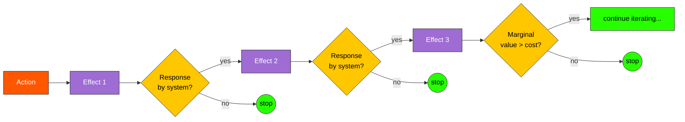

# Second-Order Thinking

> [!definition] Second-Order Thinking
> **Second-order thinking** is the disciplined practice of asking *"and then what?"* — iteratively projecting consequences past the first effect of an action, into the responses that effect provokes, into the responses to those responses, until the relevant horizon is reached or returns to analysis diminish.
>
> **Defining property**: *iteration depth*. First-order thinking stops at the immediate effect; second-order thinking continues into the cascade. The two share the same predictive substrate (whatever mental model generates the prediction) but differ in how many times they re-apply it.
>
> **See also**: [[mental-model]], [[feedback-loop]], [[chess-lookahead]], [[unintended-consequences]]

## In-Depth Definition

The discipline has many names — Garrett Hardin's *and then what?*, Howard Marks' *second-level thinking* (1990s memos to Oaktree clients), Frédéric Bastiat's *that which is seen and that which is not seen* (1850), Robert Merton's *unintended consequences of purposive social action* (1936), the chess-theoretic concept of *ply-depth*. The convergence across these traditions reflects that the underlying cognitive move — *iterate the prediction* — is so general that every consequentialist tradition independently rediscovers it.

The diagnostic is structural. *First-order thinking* answers the question *what happens?* and stops. *Second-order thinking* answers *what happens, and then what happens because that happened, and then what happens because of that?* The first-order answer is usually correct as far as it goes; the trouble is that it does not go far enough. A price ceiling on rents lowers rents (first-order, true), reduces housing supply (second-order, predictable), creates housing shortages and informal markets (third-order, often missed), and entrenches incumbent tenants while disadvantaging newcomers (fourth-order, structural). All four are real; the policy debate often runs on the first two.

The *depth* of useful second-order thinking is contingent. Some problems collapse cleanly at ply-2 (the second-order effect dominates and stabilizes). Others (ecological, social, financial) cascade through many plies before settling, and in some cases never settle — they *oscillate* (boom-bust cycles, predator-prey dynamics) or *diverge* (compounding inequalities, runaway feedback). The skill is not "always go as deep as possible" but *recognize when one more ply matters*. Routine decisions deserve first-order analysis; high-stakes decisions in complex systems deserve depth.

The cognitive cost is real. Each additional ply roughly doubles the branching of the reasoning tree, and human working memory is a hard limit. The standard mitigations are (a) pruning at each ply (most branches don't matter; identify the load-bearing one), (b) writing it down (offload working memory to paper), and (c) pairing with [[inversion]] (run the depth analysis backward from a hypothesized failure rather than forward from the action — often more tractable).

> [!boundary] Scope of Valid Application
> **Applies when**: (a) the system has feedback structure (most social, ecological, economic systems do); (b) the time horizon of consequences extends past the immediate; (c) the actor has the standing to *cause* second-order effects (the action matters); (d) the cost of unintended consequences is non-trivial.
>
> **Does NOT apply when**: (a) the decision is *immediate-effect only* — pulling a hand from a hot stove does not need ply-3 analysis; (b) the system is genuinely well-modeled by linear additivity (rare in practice but not impossible); (c) deliberation cost exceeds expected information gain (most micro-decisions).
>
> **Far-transfer caveats**: second-order *imagination* without second-order *evidence* produces overconfident speculation. The discipline is to anticipate plausibly, not to assert with certainty about distant plies. Calibration deteriorates roughly geometrically with depth.

## Mechanism / How It Works

```
First-order:    Action → Effect₁
                                  STOP

Second-order:   Action → Effect₁ → Response → Effect₂
                                                    STOP

Third-order:    Action → Effect₁ → Response₁ → Effect₂ → Response₂ → Effect₃
                                                                          STOP

n-th order:     Action → Effect₁ → ... → Effectₙ
                                              ▲
                                              │
                          stop when (a) horizon reached
                                  or (b) marginal value of ply < cost
                                  or (c) confidence collapses
```

The iteration *itself* is mechanically simple. The discipline is in (a) actually performing the iteration rather than stopping at ply-1, (b) honestly assessing each subsequent ply's plausibility (resisting the temptation to extend the chain in whichever direction confirms the original intent), and (c) knowing when to stop (the *horizon problem*).

## Visual Representation



```text
   Action
      │
      ▼
   Effect 1 ────┐  ← first-order thinking stops here
      │         │
      ▼         │
   System response
      │         │
      ▼         │
   Effect 2 ────┤  ← second-order thinking stops here
      │         │
      ▼         │
   System response
      │         │
      ▼         │
   Effect 3 ────┘  ← third-order thinking stops here
      │
      ▼
   ... continue while marginal value > cost
```

## Related Mental Models (Latticework Position)

> [!key-claim] Depth Family
> Second-order thinking belongs to a family of *iteration-depth* practices: [[chess-lookahead]] (formal game-tree search), [[recursion]] (computer science), [[mathematical-induction]] (mathematics), [[scenario-planning]] (strategy), [[premortem-analysis]] (risk). Each iterates a forward operation; the structural insight — *one more ply often changes the answer* — is shared.

> [!warning] When NOT to Reach for This Model
> 1. **Reflex / safety domain**: high-frequency, low-stakes, immediate-effect decisions (driving, walking, ordinary motor control). Second-order analysis here adds latency without value.
> 2. **Systems with no closure**: if the action genuinely does not feed back into the agent's relevant world (a one-shot transaction with strangers in a foreign country), second-order analysis is wasted — the second-order effects accrue to others, outside the actor's loop.
> 3. **Deliberation paralysis**: practitioners who chronically extend the depth analysis end up unable to act. The depth must be *bounded* by the decision deadline; otherwise it functions as procrastination.

## Real-World Examples

> [!example] Canonical Example (public policy)
> **Rent control**. First-order: rents fall for current tenants (true, observable, popular). Second-order: landlords reduce maintenance investment and new rental construction declines (predictable, observable in the rent-controlled cities of the late 20th c.). Third-order: housing stock degrades and shortages emerge, especially affecting newcomers; informal markets and key-money payments reinstate the suppressed price (well-documented in NYC, San Francisco). Fourth-order: policy entrenches incumbents and disadvantages mobility, with knock-on effects on labor-market efficiency. The first-order benefit is genuine; the policy debate's failure is to weigh it against plies 2–4, which mainstream economic analysis identifies but political rhetoric typically suppresses.

> [!example] Far-Transfer Example (chess)
> A grandmaster's edge over an expert is not raw calculation speed (modern engines exceed both by orders of magnitude). It is reliable depth-with-pruning: the grandmaster considers fewer candidate moves at each ply but follows the load-bearing branches further. Stockfish ply-depths of 30+ are routine; human grandmasters reliably reach 10–15 in critical positions. The transferable insight is that second-order thinking's value comes from *focused depth*, not *exhaustive breadth* — a heuristic directly applicable to non-game decisions.

> [!example] Personal Application
> When I added `hallucination_check: true` to the metadata schema the first-order effect was clean: audit-trail and queryability. The second-order effect I missed: I started producing more cautious notes because the field made the audit explicit, which improved quality but slowed throughput by ~20%. The third-order effect was different again: notes that survived the slower process started getting *re-read* because I trusted them, which was the whole point of the metadata in the first place. I would have predicted the second-order effect if asked, but I would not have spontaneously reached the third-order; the surprise came from failing to *iterate* a model I already had, not from a missing model. That is the diagnostic the note flags as the most common failure mode, and the failure was self-administered.

## Research & Empirical Foundation

The empirical literature is dispersed across decision research, expert-novice studies in chess and other strategic domains, and policy-evaluation studies. **(1) Expert-novice depth differences** (Chase & Simon 1973; de Groot 1965 in chess; Klein 1989 in firefighting; Ericsson & colleagues across domains) consistently show experts reach greater iteration depth before quality of analysis degrades. **(2) Forecasting calibration** (Tetlock 2005; Tetlock & Gardner 2015) shows that *superforecasters* iterate causal chains further than ordinary forecasters and update more frequently as plies fail to materialize as expected. **(3) Policy-evaluation literature** (Pritchett, Sandefur, Banerjee, Duflo on development; Sowell on economics) consistently identifies first-order policy analysis as the dominant failure mode in interventions whose stated goals are not achieved.

> [!cite] Hardin, G. (1985)
> *Filters Against Folly: How to Survive Despite Economists, Ecologists, and the Merely Eloquent.* Viking. Hardin's "and then what?" question is the most compact operational form of second-order thinking; the book is an extended ecological case for the discipline.

> [!cite] Bastiat, F. (1850)
> *Ce qu'on voit et ce qu'on ne voit pas* ("That Which Is Seen and That Which Is Not Seen"). Paris. The founding economic articulation: the broken-window parable is precisely a demonstration that first-order analysis (the glazier's earnings) misses second-order foregone alternatives.

> [!cite] Marks, H. (2018)
> *Mastering the Market Cycle: Getting the Odds on Your Side.* Houghton Mifflin Harcourt. The investment-management articulation: "second-level thinking" is presented as the structural source of edge over first-level market consensus.

## Pitfalls & Limitations

> [!warning] Failure Mode 1 — Confidence Decay Ignored
> Each additional ply degrades predictive confidence (compounding uncertainty). The practitioner who reasons to ply-5 with the same confidence as ply-1 is not deeper, just *more wrong, more confidently*. Calibration must scale inversely with depth.

> [!warning] Failure Mode 2 — Motivated Iteration
> Extending the chain only in directions that confirm the desired conclusion. The discipline requires running iterations *both* in directions that support and that undermine the action under consideration. Pair with [[inversion]] explicitly.

> [!warning] Failure Mode 3 — Horizon Mismatch
> Iterating past the horizon at which one's models are reliable. Most domain models are calibrated on observed data through some past horizon; predictions beyond that horizon (climate models past 50 years; economic models past one cycle) are *extrapolations of the model*, not iterations *within* it.

## Practical Exercises

1. **Forced ply-3 drill**: for any decision involving more than trivial stakes, write the chain *Action → Effect₁ → Response₁ → Effect₂ → Response₂ → Effect₃*. The act of writing forces the iteration past the comfortable stopping point.
2. **Pair with inversion**: run the same chain with the *Action → Failure* substitution. The two together (forward second-order + backward inversion) cover the consequence space more reliably than either alone. Many failures are visible in one frame but not the other.
3. **Re-read past decisions**: select a past decision whose consequences are now known. Reconstruct what your *prospective* second-order analysis would have produced. Compare to the realized chain. Where did your model break, and at which ply?

## Case Studies

> [!case-study] Antibiotic Resistance
> The mid-20th-century deployment of broad-spectrum antibiotics was a first-order triumph: bacterial infections that had killed for centuries became routinely treatable. The second-order effect — selection pressure on bacterial populations favoring resistance genes — was visible in the medical literature within a decade of penicillin's mass deployment, but the *third-order* effect (broad agricultural use compounding selection pressure to the point of widespread resistance to multiple antibiotic classes) took half a century to manifest at clinical scale. The case is canonical for the discipline because the model that predicted the second and third-order effects (Darwinian selection acting on bacterial populations) was *available throughout*; the failure was not absence of the right mental model but failure to iterate it.

## Personal Notes

> [!reflection]
> My typical depth in personal decisions is ~1.5 orders — I see first consequences clearly, see second consequences when prompted, almost never spontaneously reach third. What stops me is usually social pressure (the room is moving on) or pseudo-completion (the first-order analysis felt like a *whole* answer). The most efficient lever is probably the social one: explicit permission to slow the room down. The cost of asking is small; I systematically over-estimate it, which is itself a second-order failure — I am not iterating my model of *the social cost of asking* often enough to notice that the predicted cost rarely materializes.

## Three-Layer Quality Self-Assessment

> [!methodology-and-sources]
> - **Fidelity (5/5)**: structurally crisp, operationally well-defined, formally underwritten by both decision theory and game-theoretic depth-of-search results.
> - **Tractability (3/5)**: high cognitive cost. Each additional ply roughly doubles the reasoning tree's branching, and confidence calibration degrades. Score reduced two points for the real-time effort required.
> - **Transferability (5/5)**: applies to any consequentialist reasoning context, which is most of practical decision-making.
> - **Weakest dimension**: tractability → **Cultivation target**: build endurance for the *third and fourth* iterations, where most novel insight lives but where most practitioners stop. Forced-depth drills (always go to ply-3 minimum on stakes-bearing decisions) are the standard discipline.

## Source Material

- Primary: [[mental-models-foundational-report-2026-05-10]]
- Methodological lineage: Bastiat 1850; Merton 1936; Hardin 1985; Marks 2018

## Connections (Reciprocal Links Audit)

*Auto-populated by `linkcheck` during Phase 8.*
