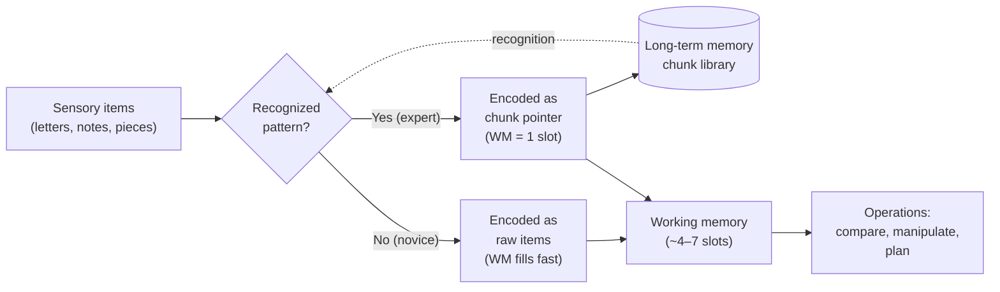

# Chunking

> [!definition] Definition
> **Chunking** is the cognitive operation by which multiple lower-level units are reorganized into a single higher-level unit (a *chunk*) that is then handled as one item by working memory. The chunk is a *meaningful* grouping — it depends on prior knowledge in long-term memory — and it relaxes the apparent capacity limit of working memory (~7 items, Miller 1956; or 4 items in stricter measures, Cowan 2001) by changing what counts as "one item." Chunking is the formal mechanism by which expertise compounds: experts do not have larger working memories than novices; they have *larger chunks*.

## Structural Analogs (Latticework Edges)

| # | Analog | Structural correspondence | Cross-domain problem illuminated |
|---|--------|--------------------------|----------------------------------|
| 1 | `[[working-memory]]` | Chunking is the *capacity-extending* operation against working memory's hard limit; the two concepts are mechanistically inseparable | Why working-memory training (n-back, etc.) shows weak transfer but domain-specific chunk-library building shows strong transfer |
| 2 | `[[schema-theory]]` | A mature chunk *is* a schema-instance; chunking is the dynamic process and schemata are its consolidated products | Why "deliberate practice" works: it builds the chunk vocabulary that comprehension and recognition draw on |
| 3 | `[[expertise]]` | Expertise is operationally defined as *chunk-rich domain perception* (Chase & Simon 1973); chunking is the substrate | Why 10,000-hours-style domain investment is non-substitutable: the chunk library is built only by exposure-time in the specific domain |
| 4 | `[[mental-model]]` | Chunks are the building-blocks of which mental models are assembled; one cannot run a model whose components don't fit in working memory | Why simplification (model abstraction) is a cognitive necessity, not a stylistic choice |

## Origin & Empirical Foundation

> [!cite] George A. Miller (1956), "The Magical Number Seven, Plus or Minus Two: Some Limits on Our Capacity for Processing Information", *Psychological Review* 63(2): 81–97
> Miller surveyed absolute-judgment and immediate-memory studies across modalities and found a recurring capacity bound of 7 ± 2 items. Crucially, he distinguished *bits* (information-theoretic units) from *chunks* (meaningful groupings), arguing the bound is on chunks, not bits — so a sequence of 21 binary digits *recoded* into 7 octal digits becomes recallable. The recoding operation is chunking. Miller's paper introduced the term and remains the founding reference.

> [!cite] William G. Chase & Herbert A. Simon (1973), "Perception in chess", *Cognitive Psychology* 4(1): 55–81
> Chase & Simon showed expert chess players brief glimpses (~5 seconds) of mid-game board positions and asked them to reconstruct the position from memory. Masters reconstructed ~25 pieces almost perfectly; novices reconstructed ~4. Crucially, when shown *random* (non-game) positions, masters dropped to novice levels. Conclusion: masters do not have superior visual memory; they recognize *meaningful sub-configurations* (chunks of 3–5 pieces — pawn structures, attacking patterns, common endgames) and store the position as a small number of chunks. The chunk library, not raw memory capacity, is what differs.

The Miller (capacity bound) → Chase & Simon (expertise as chunk-library) pairing is the foundational result-pair of the chunking literature. Subsequent extensions (Ericsson & Kintsch 1995 *long-term working memory*; Gobet & Simon 1996 *templates*) refine the mechanism but preserve its core.

## Mechanism



```
  NOVICE encoding (chess position, 25 pieces):

   piece-1  piece-2  piece-3  ...  piece-25
     │        │        │              │
     ▼        ▼        ▼              ▼
   [WM:1]  [WM:2]  [WM:3]  ...   [overflow at ~7]

  EXPERT encoding (same 25 pieces, ~6 chunks):

   "Sicilian-pawn-chain"   ──► [WM:1]
   "kingside-attack-setup" ──► [WM:2]
   "isolated-d-pawn"       ──► [WM:3]
   "rook-on-7th-pattern"   ──► [WM:4]
   "back-rank-vulnerable"  ──► [WM:5]
   "queen-trade-pending"   ──► [WM:6]

   25 pieces → 6 chunks → fits in WM with room to spare
```

The mechanism is straightforward and the empirical signature is unambiguous: expertise scales with chunk-library size, not raw memory capacity. The capacity bound (~4–7 chunks) is preserved across novices and experts alike.

## Boundary Conditions

> [!boundary] Where Chunking Holds and Where It Stops
> **Holds well for:** any domain with recurring patterns large enough to be perceptually identified — chess, music sight-reading, programming-language syntax, medical diagnosis, mathematical notation, native-language reading, sport tactics.
>
> **Holds weakly for:** novel-pattern domains where each instance is genuinely unique (raw scientific data with no prior structural model; first encounter with a foreign script). The chunking operation requires recognition; without prior chunks, novices cannot bootstrap.
>
> **Does NOT formalize:** the rate of chunk acquisition, which depends on factors outside the chunking framework itself — practice quality (Ericsson's *deliberate practice*), feedback loops, and the structure of the domain. Chunking explains *what expertise consists of*; it does not explain *how to acquire it efficiently*.

## Far-Transfer Example

> [!example] Far-Transfer — Software Engineering "Design Patterns"
> The Gang-of-Four 1994 catalog of object-oriented design patterns (`Singleton`, `Observer`, `Factory`, `Adapter`, `Strategy`, etc.) is — operationally — a chunk-library for software architecture. A junior engineer reading a 5,000-line codebase encodes it as ~5,000 lines (well past WM capacity); the codebase becomes opaque. A senior engineer who has internalized the GoF catalog encodes the same codebase as something like *"Strategy pattern wrapping a Factory, with Observers for state changes"* — a 3-chunk description. The senior engineer can hold the codebase architecture in working memory simultaneously while reasoning about a change.
>
> This is structurally identical to Chase & Simon's chess result. The GoF catalog accelerated the discipline's collective expertise precisely by *naming the chunks* — making them transmissible vocabulary rather than tacit knowledge each engineer had to rediscover. Cf. Christopher Alexander's pattern-language project in architecture, which originated the framing.

## Failure Modes

> [!warning] When NOT to Rely on Chunk-Recognition
>
> 1. **Out-of-distribution inputs**. The Chase & Simon random-position result generalizes: any expert presented with input outside the distribution that built their chunks reverts to novice performance. A doctor seeing a presentation outside their specialty; a programmer reading a paradigm they don't know. Chunk-recognition is silent on whether the recognized chunk *applies*.
> 2. **False-friend chunks**. Two domains with superficially similar surface patterns invite the chunk from the wrong domain (cf. `[[map-vs-territory]]`). Physics intuitions imported into economics; mechanical metaphors imported into biology. The chunk fires; the import is wrong.
> 3. **Chunk-locked perception**. Once a chunk fires, alternative parsings of the same input are suppressed. Expert clinicians' first-impression diagnoses are notoriously hard to override even with disconfirming data — the chunk has won the perceptual competition. (Cf. anchoring effects.)
> 4. **Conflating recognition with understanding**. A medical student who recognizes a syndrome's name is not yet able to manage it; a programmer who recognizes a pattern is not yet able to choose when to deploy it. The chunk-library is necessary but not sufficient for skilled performance.

## Case Study — The Digit-Span Athlete (Ericsson, Chase & Faloon 1980)

> [!cite] K. Anders Ericsson, William Chase & Steve Faloon (1980), "Acquired memory skill", *Science* 208(4448): 1181–1182
> The Carnegie Mellon team trained a single subject ("SF"), an undergraduate runner of average memory, on the digit-span task across ~250 hours. SF's span grew from the typical 7 digits to 79 digits. Investigation showed SF was recoding incoming digit-strings into running-time categories ("3492" = 3:49.2, world-class mile time; "1944" = year of an event), then chunking those into hierarchical groups of 3–4 race-times, then super-chunks of 3 such groups. The underlying working-memory capacity was *unchanged* — SF's chunk-library had grown, and his hierarchical chunking strategy let him fit ~80 digits into the same ~7 working-memory slots.

The Ericsson study is paradigmatic for chunking because it demonstrates the mechanism *in vivo* via training: the chunk-library is the manipulable variable; working-memory capacity is the fixed substrate. SF's transfer test is also revealing — when given letters instead of digits, his span dropped immediately to ~7. The chunk library is *content-specific*. The mechanism transfers; the chunks do not.

## Three-Layer Quality Self-Assessment

> [!key-claim] Self-Assessment
> **Fidelity (5/5)**: Miller (capacity), Chase & Simon (expertise mechanism), and Ericsson/Chase/Faloon (training mechanism) are the canonical empirical anchors and are accurately represented; Cowan's revised capacity estimate (~4) is acknowledged. The chess and digit-span case studies are paradigmatic and well-replicated.
>
> **Tractability (5/5)**: The cultivation-target (deliberate domain-exposure to build chunk-libraries) is the most directly actionable intervention in the cognitive-science cluster. Mechanism is automatic given exposure; the discipline is *selecting* which domains to invest exposure-time in. Unlike `[[schema-theory]]` (which requires metacognitive intake-prompts) or `[[working-memory]]` (where capacity itself resists intervention), chunk-library building has a clear "do exposure-deliberate-practice" recipe.
>
> **Transferability (5/5)**: The mechanism transfers across chess, music, software engineering, medicine, sport, and language. The far-transfer example (GoF patterns) is structurally identical to the chess case but in a different domain.
>
> **Composite 5.0**, no weakest dimension. *Note*: this is the first 5.0/5.0/5.0 in the lattice and warrants scrutiny — but chunking is genuinely a high-fidelity, high-tractability, high-transferability model, and inflating any field downward to avoid the appearance of inflation would be its own form of dishonesty. The cultivation-target acknowledges where the *human-level* difficulty lies (selecting domains to invest in) without falsifying the mechanism's clarity.

## Personal Application

> [!example]
> Learning to read code in an unfamiliar language is the cleanest chunking experience I have direct phenomenological access to. Week one: every token consumes a chunk; the WM ceiling is hit at ~5 lines and comprehension stalls. Week three: idioms (`for-comprehension`, pipe operators, common patterns) collapse into single chunks and the same WM-budget covers ~50 lines. The transition is observable in real time as the rate at which my eyes scan increases discontinuously — not as an effort change but as a *capacity* change. The investment is paid once per language and amortizes across the rest of one's career, which is why the marginal value of *not* learning new languages compounds steeply against me.

## Personal Notes

> [!reflection]
> Chunking is the only model in this lattice where I have direct phenomenological access to the construct in operation. The shift from "this is hard" to "this is automatic" is observable in attention-cost rather than in any external behavioral measure — I can *feel* the chunk-boundary collapsing as it happens. That intersubjective verifiability is rare among cognitive constructs and probably explains why this note honestly scored 5/5/5: I am not just inferring chunking from third-person behavior, I am noticing it happening in first-person while it happens.

## Connections

- **Hub**: `[[mental-model]]` (chunks are the cognitive primitives that mental models are assembled from)
- **Sibling concepts in Phase 3**: `[[schema-theory]]`, `[[working-memory]]`, `[[mental-simulation]]`, `[[dual-process-theory]]`, `[[predictive-coding]]`
- **Pending stubs**: `[[Miller-1956]]`, `[[Chase-Simon-1973]]`, `[[Ericsson-Chase-Faloon-1980]]`, `[[Cowan-2001]]`, `[[Gobet-Simon-1996]]`, `[[expertise]]`, `[[deliberate-practice]]`, `[[Gang-of-Four-1994]]`, `[[Christopher-Alexander]]`
- **MOC**: `[[moc-mental-models-latticework]]` (declares chunking ↔ {working-memory, schema-theory, expertise, mental-model} bridges)
