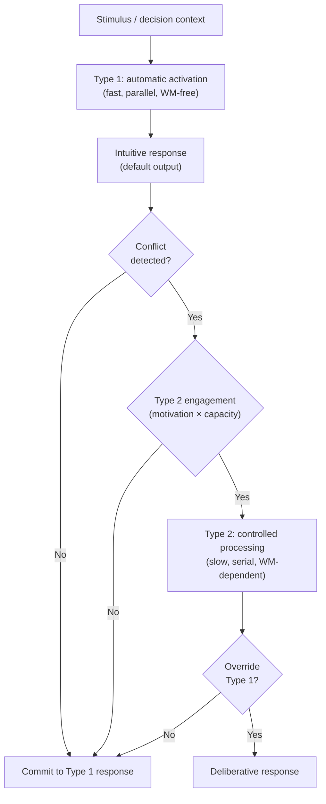

# Dual Process Theory

> [!definition] Definition
> **Dual-process theory** holds that human cognition operates via two qualitatively distinct *kinds* of processing: **Type 1** (also "System 1") — fast, automatic, low-effort, parallel, associative, largely independent of `[[working-memory]]`, and producing intuitive judgments; and **Type 2** (also "System 2") — slow, controlled, effortful, serial, rule-based, *operationally defined by its dependence on working-memory*, and producing deliberative reasoning. The framework (Stanovich & West 2000; Evans 2008; Kahneman 2011) is best understood as a *taxonomy of processing characteristics* rather than a literal two-systems architecture — the strict architectural reading is contested (Keren & Schul 2009; Melnikoff & Bargh 2018), but the *characteristic clustering* it captures is empirically robust and decision-theoretically useful.

## Structural Analogs (Latticework Edges)

| # | Analog | Structural correspondence | Cross-domain problem illuminated |
|---|--------|--------------------------|----------------------------------|
| 1 | `[[working-memory]]` | Type 2 processing is *operationally defined* by WM-dependence; Type 1 runs without WM load. WM theory grounds the dual-process distinction empirically | Why deliberation is effortful and non-parallelizable: it is gated by the same scarce resource (WM) that limits all higher cognition |
| 2 | `[[mental-model]]` | Type 2 reasoning operates on *explicit* mental models manipulated in WM; Type 1 produces output by pattern-match against implicit/associative representations | Why "thinking with models" feels different from "intuition" — they recruit different processing modes over (often) different representational substrates |
| 3 | `[[heuristic]]` | Heuristics are Type 1's characteristic output: fast, frugal, automatic shortcuts that bypass deliberation. The heuristics-and-biases program is empirically a Type-1 catalog | Why heuristics feel like "just knowing" — they are produced by automatic processes invisible to introspection |
| 4 | `[[deliberation]]` | Deliberation is Type 2's prototypical activity — explicit, rule-based, sequential reasoning. The dual-process framework supplies the cognitive-architecture grounding for the philosophical distinction | Why deliberation is rare even when normatively required: it costs WM and feels effortful; the system defaults to Type 1 unless an override is invoked |

## Origin & Empirical Foundation

> [!cite] Keith E. Stanovich & Richard F. West (2000), "Individual differences in reasoning: Implications for the rationality debate?", *Behavioral and Brain Sciences* 23(5): 645–665
> Stanovich & West synthesized two decades of dual-process proposals (Wason & Evans 1975; Schneider & Shiffrin 1977; Sloman 1996; Epstein 1994) into the canonical *System 1 / System 2* terminology. They argued that individual-difference data on reasoning tasks (correlations between cognitive-ability measures and rational-choice performance) are best explained by Type 2 *override capacity* — the ability to detect that Type 1 has produced a normatively-incorrect response and to engage Type 2 to compute the correct one. The paper became the most-cited synthesis and established the framework's modern form.

> [!cite] Daniel Kahneman (2011), *Thinking, Fast and Slow*, Farrar, Straus and Giroux
> Kahneman's monograph synthesized 40+ years of his and Tversky's heuristics-and-biases program under the System 1 / System 2 framework, popularizing the terminology beyond cognitive psychology and into economics, public policy, and management practice. Crucially, Kahneman repeatedly cautioned (Ch. 1, p. 29; Ch. 9 conclusion) that "System 1" and "System 2" are *fictional characters* — useful expository devices, not entities literally present in the brain. This caveat is widely ignored in popular discussion.

> [!cite] Gideon Keren & Yaacov Schul (2009), "Two is not always better than one: A critical evaluation of two-system theories", *Perspectives on Psychological Science* 4(6): 533–550
> Keren & Schul provided the most-cited critical analysis: dual-process theories conflate multiple independent dimensions (automatic/controlled, associative/rule-based, fast/slow, implicit/explicit, low-effort/high-effort) that empirically *do not always co-vary*. A response can be fast and rule-based; another can be slow and associative. The strict two-systems reading is therefore an over-simplification — but the *characteristic clusters* (a typical Type-1 response is fast AND automatic AND associative; a typical Type-2 response is slow AND controlled AND rule-based) remain empirically modal.

The Stanovich-West synthesis, Kahneman popularization, and Keren-Schul critique together define the framework's *appropriate epistemic posture*: empirically-useful processing taxonomy with characteristic clustering, not a literal two-systems brain architecture. Subsequent work (Evans & Stanovich 2013 *default-interventionist model*; De Neys 2017 *logical intuitions*) refines but preserves this posture.

## Mechanism



```
   ┌──────────────────────────────────────────────────┐
   │      DEFAULT-INTERVENTIONIST ARCHITECTURE        │
   │      (Evans & Stanovich 2013)                    │
   │                                                  │
   │   stimulus                                       │
   │      │                                           │
   │      ▼                                           │
   │   TYPE 1 ─► intuitive response (always runs)     │
   │      │                                           │
   │      ▼                                           │
   │   conflict detection                             │
   │      │                                           │
   │      ├──► no conflict ──► commit                 │
   │      │                                           │
   │      └──► conflict ──► [costly to engage]        │
   │                            │                     │
   │                            ▼                     │
   │                       TYPE 2 ─► override?        │
   │                            │                     │
   │                  ┌─────────┴────────┐            │
   │                  ▼                  ▼            │
   │             yes: revise        no: stick         │
   │                  │                  │            │
   │                  └────────┬─────────┘            │
   │                           ▼                      │
   │                       commit                     │
   │                                                  │
   │  KEY: Type 2 is *invoked* only when conflict-    │
   │  detection fires AND motivation/capacity         │
   │  permit. Default is to commit to Type 1.         │
   └──────────────────────────────────────────────────┘
```

The architectural facts: (a) Type 1 runs *always* and produces a default response; (b) Type 2 is invoked only on conflict-detection plus available motivation and WM capacity; (c) Type 2's most consequential function is *override* — recognizing that the Type-1 default is normatively wrong and computing a corrected response. Override-capacity is what individual-differences research most reliably measures.

## Boundary Conditions

> [!boundary] Where Dual-Process Theory Holds and Where It Stops
> **Holds well as a taxonomy for:** characterizing the *signatures* of automatic vs. controlled processing (effort, speed, WM-load, parallel/serial, associative/rule-based); explaining individual differences in reasoning task performance via override capacity; framing instructional interventions (debiasing, slow-thinking prompts, structured deliberation protocols).
>
> **Holds weakly as a literal architecture:** the strict two-systems reading conflates dimensions that empirically dissociate (Keren & Schul 2009). Some "fast" responses are rule-based; some "slow" responses remain associative. *Logical intuitions* (De Neys 2012) — the rapid, automatic detection of normative-conflict that triggers Type 2 — are themselves Type 1 in their speed and automaticity but rule-sensitive in their content, blurring the boundary the framework draws.
>
> **Does NOT formalize:** *which* of the many proposed dual-process distinctions (Sloman associative/rule-based; Epstein experiential/rational; Kahneman heuristic/analytic) is "the" correct one. The literature contains dozens of related-but-not-identical dichotomies; the framework is loose enough to accommodate them all but tight enough to be empirically falsifiable in none. This is its central methodological weakness.
>
> **Cannot be straightforwardly mapped to brain regions:** early enthusiasm about a System 1 / System 2 brain-region split (limbic vs. prefrontal) has not survived neuroimaging scrutiny. Both processing kinds recruit broadly distributed networks.

## Far-Transfer Example

> [!example] Far-Transfer — Cockpit "Sterile-Cockpit" Rule and Checklist Discipline
> The 1981 FAA "sterile cockpit" rule (FAR §121.542) prohibits non-essential conversation in the cockpit below 10,000 feet during takeoff and landing. The Atul Gawande / Peter Pronovost surgical-checklist program (Pronovost et al. 2006) introduced mandatory pre-incision verification for ICU procedures. Both interventions are, structurally, *forced Type-2 invocation protocols*.
>
> The cognitive logic: takeoff-and-landing and surgical-incision are precisely the moments where (a) Type-1 expertise has produced reliable defaults that work most of the time, AND (b) the cost of an undetected Type-1 error is catastrophic. Conversation, time-pressure, and cognitive load all bias the system toward Type-1 commitment without conflict-detection firing. The intervention is *institutional*: remove the load (sterile cockpit) or *force* the deliberative checklist read-back (surgical timeout) — bypassing the unreliable individual-level conflict-detection step by making Type-2 mandatory.
>
> The Pronovost program reduced central-line bloodstream-infection rates by 66% in 18 months across 100+ Michigan ICUs (Pronovost et al. 2006). This is dual-process theory yielding direct, measurable mortality reduction — through the recognition that Type-2 invocation cannot be left to individual discretion in high-stakes moments.

## Failure Modes

> [!warning] When NOT to Trust the Dual-Process Framing
>
> 1. **Reifying the metaphor**. Treating "System 1" and "System 2" as literal homunculi or brain modules — as Kahneman explicitly warned against — produces nonsense neuroscience and bad debiasing advice ("just use System 2 more"). They are processing *characteristics* that cluster, not entities.
> 2. **Assuming Type 2 is reliably *correct***. Type 2 is slower, more effortful, and WM-dependent — but it is not magically rational. Type 2 reasoning over a wrong model produces confidently-wrong conclusions; Type 2 motivated by self-interest produces sophisticated rationalization. The override-capacity Stanovich identifies is *necessary* but not *sufficient* for normative reasoning.
> 3. **Conflict-detection failure as the master failure mode**. The whole architecture depends on Type-1 producing a response *plus* a downstream signal that the response might be wrong. When conflict-detection itself fails (no signal fires), Type 2 is never invoked and the Type-1 response goes uncorrected. Most heuristics-and-biases failures are conflict-detection failures, not Type-2 capacity failures (De Neys 2014).
> 4. **Domain-novel decisions**. The framework's predictions are sharpest where Type-1 expertise exists; in genuinely novel domains where no Type-1 default has been built, the dichotomy collapses (everything is effortful Type 2 by necessity, often using inappropriate Type-2 routines).
> 5. **Cultural-cross-application**. Dual-process empirical work is heavily WEIRD-population biased (Henrich, Heine & Norenzayan 2010); whether the characteristic clusters generalize across cultures with different metacognitive vocabularies is genuinely uncertain.

## Case Study — The Cognitive Reflection Test (Frederick 2005)

> [!cite] Shane Frederick (2005), "Cognitive reflection and decision making", *Journal of Economic Perspectives* 19(4): 25–42
> Frederick's three-item Cognitive Reflection Test (CRT) — including the canonical "A bat and a ball cost $1.10. The bat costs $1.00 more than the ball. How much does the ball cost?" — was designed to elicit a *plausible but wrong* Type-1 response (10¢) that the respondent must override via Type-2 engagement to reach the correct answer (5¢). CRT scores correlate strongly with measures of analytical reasoning, with reflectivity in decision-making, and *negatively* with susceptibility to anchoring, hindsight bias, and the conjunction fallacy. The CRT operationalized the Stanovich override-capacity construct in a 3-item form short enough to deploy widely.

The Frederick CRT is paradigmatic for dual-process theory because (a) each item *requires* Type-2 invocation to override a salient Type-1 default; (b) the override is non-trivially difficult — even Princeton and MIT undergraduate samples scored a mean of ~2/3 in Frederick's original sample, with roughly one-third missing the bat-and-ball; (c) CRT scores predict performance on *unrelated* heuristics-and-biases tasks, supporting the framework's claim that override-capacity is a generalizable individual-differences variable; and (d) the test's structure makes the override-failure visible *to the failing subject* once the answer is explained — providing a live demonstration that the Type-1 response felt confident *while being wrong*. This is the dual-process framework's central explanatory move rendered as a 3-question instrument.

## Three-Layer Quality Self-Assessment

> [!key-claim] Self-Assessment
> **Fidelity (4/5)**: The Stanovich-West synthesis, Kahneman popularization, Keren-Schul critique, and Frederick CRT are accurately represented; the framework's appropriate epistemic posture (taxonomy with characteristic clustering, not literal architecture) is correctly stated and Kahneman's own caveat on this is cited. Marked 4 rather than 5 because the framework itself is *known to be empirically loose* — the Keren-Schul critique stands and is not fully resolved; the multiple-distinct-dichotomies problem is real. The note's fidelity is to the literature *including its open problems*, but the underlying construct is itself partially provisional. Honest scoring requires marking this.
>
> **Tractability (4/5)**: The cultivation-target (recognize processing-signatures, deliberately invoke Type 2 on consequential decisions) is implementable but requires metacognitive monitoring that runs against Type-1 default-acceptance. The institutional version (forced-protocol designs like sterile cockpit, surgical checklists) is more tractable than the individual version because it bypasses the unreliable conflict-detection step. Marked 4.
>
> **Transferability (5/5)**: The framework transfers across cognitive psychology, behavioral economics, public policy (debiasing, choice architecture), aviation safety, medicine (checklist programs), education (slow-thinking interventions), and law (eyewitness reliability, judicial decision-making). The far-transfer example (sterile cockpit + surgical checklists) is genuinely far and well-validated.
>
> **Composite 4.33**, weakest dimension *fidelity* — the *first* note in the lattice where fidelity is the limiting dimension rather than tractability. This is honest: dual-process theory is a *useful taxonomy* whose empirical foundations are partially contested, and inflating fidelity to 5 would misrepresent the framework's status. The cultivation-target appropriately reflects this by recommending the *taxonomic* posture rather than the literal-architectural one.

## Personal Application

> [!example]
> The most useful operational handle from this model is the deliberate *invocation* of System-2 mode for decisions I would otherwise autopilot. The CRT-style heuristic — "the answer that comes to mind first is probably the trap" — is durable in my own decision-making for any decision involving numbers, framing, or reversibility. Where I notice it failing: under fatigue the System-2 invocation itself becomes effortful enough that I rationalize skipping it. The model predicts this exactly (Type-2 is resource-bound), which is why the operational response is *structural* (decide important things when rested; pre-commit reversible defaults) rather than *motivational* (try harder in the moment). The model's predictive value is concentrated in the structural responses it warrants, not the introspective phenomenology it describes.

## Personal Notes

> [!reflection]
> I take Keren-Schul's critique seriously and use the model only as a *taxonomy of operations*, not a literal architecture. The honest fidelity-4 in the self-assessment is something I want to remember whenever the model feels especially clarifying — clarity is not fidelity, and the construct's residual messiness (which dichotomies actually co-vary, which characteristics are loadings of one factor or many) is a feature of the territory, not a defect of the map. Treating the model as taxonomy rather than architecture costs me almost nothing operationally and protects me from inflating its truth claims.

## Connections

- **Hub**: `[[mental-model]]` (the framework supplies cognitive-architecture grounding for model-use vs. intuition)
- **Sibling concepts in Phase 3**: `[[schema-theory]]`, `[[chunking]]`, `[[working-memory]]`, `[[mental-simulation]]`, `[[predictive-coding]]`
- **Pending stubs**: `[[Stanovich-West-2000]]`, `[[Kahneman-2011]]`, `[[Keren-Schul-2009]]`, `[[Evans-Stanovich-2013]]`, `[[De-Neys-2012]]`, `[[De-Neys-2014]]`, `[[Frederick-2005]]`, `[[Sloman-1996]]`, `[[Epstein-1994]]`, `[[Pronovost-2006]]`, `[[Atul-Gawande]]`, `[[heuristic]]`, `[[deliberation]]`, `[[Cognitive-Reflection-Test]]`, `[[WEIRD-populations]]`, `[[Henrich-Heine-Norenzayan-2010]]`
- **MOC**: `[[moc-mental-models-latticework]]` (declares dual-process-theory ↔ {working-memory, mental-model, heuristic, deliberation} bridges)
