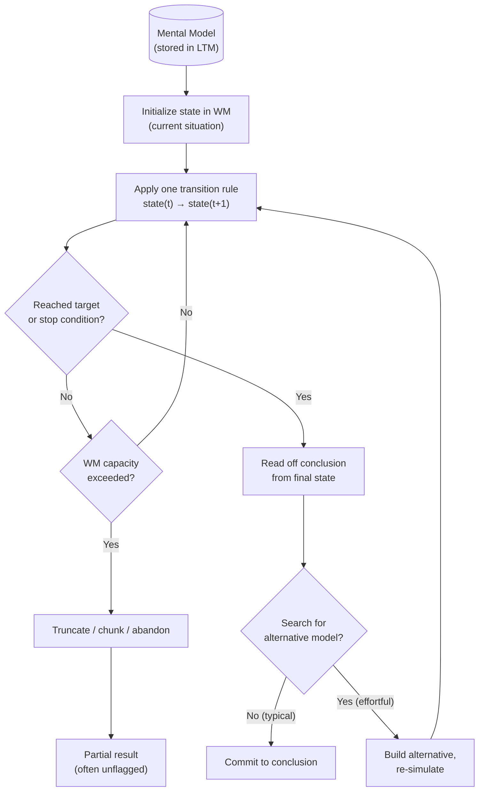

# Mental Simulation

> [!definition] Definition
> **Mental simulation** is the cognitive operation of *running* a mental model forward (or backward, or counterfactually) to derive consequences not directly perceived. It is the dynamic complement to representation: a mental model is the *substrate*; mental simulation is the *act of executing it*. The operation is bounded by `[[working-memory]]` capacity (each step's intermediate state must fit in the workspace), inherits the model's fidelity (a wrong model simulated faithfully produces wrong predictions), and constitutes the *running-the-model* operation that distinguishes explanatory model-use from mere pattern-recognition (Johnson-Laird 1983; Hegarty 2004; Kahneman & Tversky 1982).

## Structural Analogs (Latticework Edges)

| # | Analog | Structural correspondence | Cross-domain problem illuminated |
|---|--------|--------------------------|----------------------------------|
| 1 | `[[mental-model]]` | Substrate-vs-execution distinction: the model is the data structure; simulation is the procedure that runs over it. Inseparable but distinct | Why merely *having* a model is insufficient; the operation of running it must be invoked, and is often skipped in favor of recognition |
| 2 | `[[working-memory]]` | WM is the workspace in which simulation steps are executed; capacity bounds limit simulation depth, breadth, and parallel branches | Why complex what-if reasoning fails partway through: simulation overflows the workspace; the bottleneck is substrate, not skill |
| 3 | `[[second-order-thinking]]` | Second-order thinking *is* iterated mental simulation — each ply is one simulation step composed with the previous; depth-extension is the same operation applied recursively | Why "and then what?" is hard but trainable: the operation is simulation; the discipline is not stopping after ply-1 |
| 4 | `[[counterfactual-reasoning]]` | Counterfactual reasoning is mental simulation initialized with an altered antecedent; the mechanism is the same, only the starting state changes | Why we can think about "what would have happened if…" at all — the same machinery that predicts forward can be re-purposed to construct alternative pasts |

## Origin & Empirical Foundation

> [!cite] Philip N. Johnson-Laird (1983), *Mental Models: Towards a Cognitive Science of Language, Inference, and Consciousness*, Cambridge University Press
> Johnson-Laird's central thesis: human reasoning proceeds primarily by constructing a *model of the situation described*, then *running the model* to read off conclusions, and (when motivated) *searching for alternative models* that would render the conclusion false. Logical inference is not (typically) the application of formal rules; it is the simulation of a representational structure. The framework explains canonical reasoning failures — e.g., the Wason selection task, syllogistic errors with figural effects — by reference to which models people *spontaneously construct* and which *alternative models they fail to consider*. Mental simulation is the operation at the heart of the framework.

> [!cite] Daniel Kahneman & Amos Tversky (1982), "The simulation heuristic", in *Judgment Under Uncertainty: Heuristics and Biases* (Kahneman, Slovic & Tversky, eds.), Cambridge University Press, pp. 201–208
> Kahneman & Tversky introduced the *simulation heuristic*: people judge probabilities, causality, and counterfactuals by mentally simulating scenarios and assessing the *ease* with which the simulation runs. The famous demonstration: subjects told two travelers missed flights — one by 5 minutes, one by 30 minutes — judge the 5-minute miss to feel "worse" because the close-call counterfactual ("if only the taxi had been faster…") is easier to mentally simulate. The heuristic explains regret asymmetries, hindsight bias, and the *availability* of counterfactual alternatives.

The Johnson-Laird (model-running) → Kahneman-Tversky (simulation-as-judgment-heuristic) pairing situates mental simulation as both a *cognitive primitive* (the basic operation of model-based reasoning) and a *judgment substrate* (probability, causality, counterfactual evaluations are simulation-derived). Subsequent extensions (Hegarty 2004 *spatial mental simulation*; Gilbert & Wilson 2007 *affective forecasting*; Schacter et al. 2007 *constructive simulation* in episodic memory and prospection) extend the operation across spatial, affective, and autobiographical domains.

## Mechanism



```
   ┌──────────────────────────────────────────────────┐
   │                MENTAL SIMULATION                 │
   │                                                  │
   │  state(t=0) ──► [transition rule] ──► state(t=1) │
   │                       │                          │
   │                       ▼                          │
   │  state(t=1) ──► [transition rule] ──► state(t=2) │
   │                       │                          │
   │                       ▼                          │
   │  state(t=2) ──► [transition rule] ──► state(t=3) │
   │                       │                          │
   │            (each row consumes WM slots;          │
   │             depth bounded by ~4–7 chunks)        │
   │                                                  │
   │   FAILURE MODES:                                 │
   │   - Truncation (silent)                          │
   │   - Wrong transition rule (model-error)          │
   │   - Single-model commitment (no alt search)      │
   └──────────────────────────────────────────────────┘
```

The architectural fact the diagrams encode: mental simulation is a *step-wise* operation, each step costs WM, and the operation has *three orthogonal failure modes* — truncation (run out of WM), model-error (wrong transition rule), and commitment-to-single-model (no alternative search). The first failure is silent (truncated simulations *feel complete*); the second is invisible without external feedback; the third is the master failure mode Johnson-Laird identified.

## Boundary Conditions

> [!boundary] Where Mental Simulation Holds and Where It Stops
> **Holds well for:** spatial reasoning (mental rotation, route-planning), causal reasoning over short chains, counterfactual reasoning, narrative comprehension, prospection (imagining future personal scenarios), simple game-tree search, mechanical reasoning over familiar systems.
>
> **Holds weakly for:** highly nonlinear systems (chaotic dynamics defeat WM-bounded simulation almost immediately), large statistical aggregates (humans do not natively simulate distributions; we simulate prototypes — cf. *base-rate neglect*), long temporal horizons (simulations decay in fidelity exponentially with simulated-time), domains where the transition rules are not internalized.
>
> **Does NOT formalize:** the *correctness* of the simulated model. Simulating faithfully an incorrect model produces confidently-wrong predictions — and the confidence comes from the simulation feeling smooth, not from the model being right. This is the operation's central epistemic vulnerability and is why simulation must be *coupled* with model-criticism, not run in isolation.

## Far-Transfer Example

> [!example] Far-Transfer — Crash Investigation as Forensic Mental Simulation
> Aircraft accident investigators (NTSB, AAIB) reconstruct the final minutes of a flight by *running mental simulations* over the recovered evidence: flight-data-recorder traces, cockpit-voice recordings, wreckage geometry, weather data. The simulation begins with the last known stable state, applies known aircraft dynamics, pilot-action transitions, and environmental forces, and is iterated forward to the recovered impact state. When the simulation matches the evidence, it is provisionally accepted; when it diverges, the model is revised (different control input assumed, different system failure hypothesized).
>
> The investigation's *signature failure mode* is precisely the one Johnson-Laird identified: commitment to a single simulated narrative without searching for alternative models that would also fit the evidence. Modern accident-investigation methodology (the "alternative hypotheses" requirement; HFACS frameworks) is institutionalized counter-discipline — *force* the construction of multiple competing simulations before committing.
>
> This is structurally identical to clinical differential diagnosis (simulate disease-trajectory candidates against the patient's evidence) and to historical-causation inference (simulate alternative counterfactual paths and evaluate which best fits the surviving evidence). Same operation; different domain; same failure mode.

## Failure Modes

> [!warning] When NOT to Trust a Mental Simulation
>
> 1. **Smoothness as truth-signal**. A simulation that runs *easily* feels veridical; one that requires effort feels suspect. Both reactions are unreliable. The simulation's ease tracks the *familiarity* of its transition rules, not their *correctness* (cf. `[[fluency-bias]]`).
> 2. **Single-model commitment**. The Johnson-Laird master failure: subjects construct one model, simulate it, and commit — without ever asking *what other model is consistent with the same evidence?* Differential-diagnosis discipline, alternative-hypothesis methodology, and Munger's "invert, always invert" all target this failure.
> 3. **Affective forecasting errors** (Gilbert & Wilson 2007). Simulations of *future emotional states* are systematically wrong: people overestimate the duration and intensity of both positive and negative future emotions because the simulation focuses on the inciting event and omits adaptation, distraction, and life-context noise.
> 4. **Truncation invisibility**. When WM overflows mid-simulation, the truncated result is *not flagged as truncated* — it is reported as the complete answer. This is among the most important failure modes for high-stakes decisions.
> 5. **Compounding model-error**. Each simulation step inherits the previous step's error; small per-step errors compound into large terminal errors over long chains. This is why simulating 10 steps ahead is qualitatively different from simulating 2.

## Case Study — Affective Forecasting and the Tenure Decision (Gilbert et al. 1998)

> [!cite] Daniel T. Gilbert, Elizabeth C. Pinel, Timothy D. Wilson, Stephen J. Blumberg & Thalia P. Wheatley (1998), "Immune neglect: A source of durability bias in affective forecasting", *Journal of Personality and Social Psychology* 75(3): 617–638
> Gilbert and colleagues asked junior faculty to predict their happiness 5 years after a future tenure decision (positive or negative outcome), and separately surveyed senior faculty whose tenure decision had occurred 5+ years prior. The prediction-actuality gap was striking: junior faculty predicted that a *negative* tenure outcome would leave them substantially less happy than a *positive* one, 5 years on. Senior faculty's actual reported happiness, 5+ years post-decision, showed almost no difference between the two groups. The prediction simulated the *event* and read off the immediate emotional consequence; it failed to simulate the psychological-immune-system processes (rationalization, re-prioritization, new-context engagement) that adapt to most major life changes within ~6 months. Gilbert called this *immune neglect*.

The Gilbert et al. study is paradigmatic for mental simulation because (a) it demonstrates the operation in vivo on a high-stakes real-world judgment; (b) it identifies a *systematic* and *replicable* simulation-error (not random noise); (c) it locates the error precisely — in *what gets omitted* from the simulated state-trajectory rather than in faulty transition rules; and (d) the corrective is straightforward and testable: explicitly include adaptation processes in the simulation, or substitute the simulation with empirical data from people who have already lived the outcome (the "surrogation" intervention, Gilbert et al. 2009). This is mental simulation theory yielding actionable cognitive de-biasing.

## Three-Layer Quality Self-Assessment

> [!key-claim] Self-Assessment
> **Fidelity (5/5)**: The Johnson-Laird (model-running), Kahneman & Tversky (simulation heuristic), and Gilbert (affective forecasting) lineages are accurately represented. The three orthogonal failure modes (truncation, model-error, single-model commitment) are correctly identified as the empirical signature of the operation. The note candidly distinguishes simulation-fidelity from model-correctness.
>
> **Tractability (4/5)**: The operation is universal (any literate adult simulates routinely); the discipline is *invoking* it explicitly rather than substituting recognition or first-impression, and *constructing alternative simulations* rather than committing to the first. Both interventions are testable and trainable (forced what-if writing; differential-diagnosis frameworks). Marked 4 — better than `[[working-memory]]` (3) because the lever is invocation-discipline rather than capacity-raising; comparable to `[[schema-theory]]` (4) which also requires metacognitive discipline.
>
> **Transferability (5/5)**: The operation transfers across reasoning research, accident investigation, clinical diagnosis, historical inference, affective forecasting, and game-tree search. The crash-investigation far-transfer is genuinely far-domain.
>
> **Composite 4.67**, weakest dimension *tractability*. Cultivation-target appropriately targets the invocation-discipline rather than the underlying capacity.

## Personal Application

> [!example]
> Before sending a difficult email I have been (for years, half-consciously) running a mental simulation of how the recipient will read it. Making the simulation *explicit* — actually narrating to myself, sentence by sentence, what I think they will read — surfaces ambiguities my implicit simulation glossed over. The discipline is not capacity (I could always do this); it is invocation. The invocation cost is ~3 minutes per email; the cost of a misread email runs to weeks of repair. The expected-value math is overwhelming and I *still* have to force the invocation, which confirms the note's cultivation-target verbatim: simulation is cheap to run and consistently under-run, and the leverage is on triggers that force the run, not on capacity to run.

## Personal Notes

> [!reflection]
> The Gilbert-Wilson immune-neglect finding lands hard for me personally. I systematically over-predict how badly future-me will feel about negative outcomes, which causes me to over-insure against them — declining opportunities whose downside is real but whose post-realization severity my simulation overweights. The corrective is not to stop simulating; it is to *include the resilience term* in the simulation explicitly. I have not yet operationalized this; it remains a known weakness and a candidate for an explicit pre-decision checklist item.

## Connections

- **Hub**: `[[mental-model]]` (mental simulation is the *act of running* a mental model)
- **Sibling concepts in Phase 3**: `[[schema-theory]]`, `[[chunking]]`, `[[working-memory]]`, `[[dual-process-theory]]`, `[[predictive-coding]]`
- **Pending stubs**: `[[Johnson-Laird-1983]]`, `[[Kahneman-Tversky-1982]]`, `[[Hegarty-2004]]`, `[[Gilbert-Wilson-2007]]`, `[[Gilbert-1998]]`, `[[Schacter-2007]]`, `[[fluency-bias]]`, `[[affective-forecasting]]`, `[[prospection]]`, `[[differential-diagnosis]]`, `[[NTSB]]`, `[[HFACS]]`
- **MOC**: `[[moc-mental-models-latticework]]` (declares mental-simulation ↔ {mental-model, working-memory, second-order-thinking, counterfactual-reasoning} bridges)
