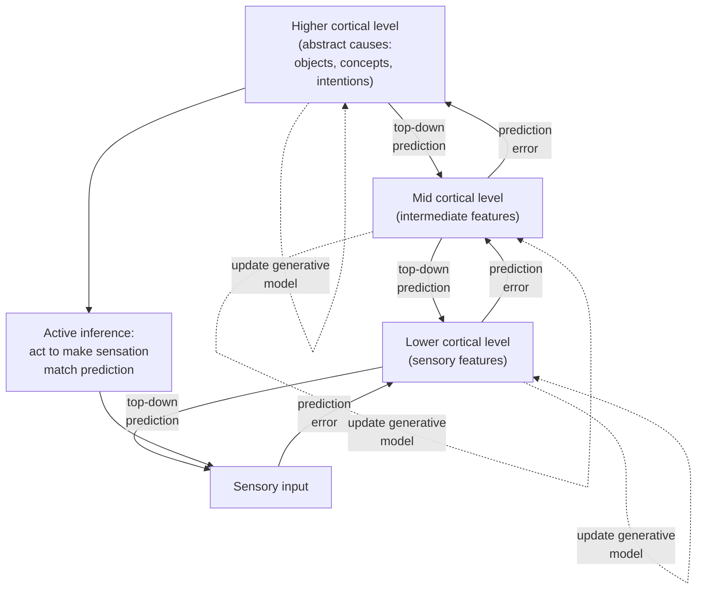

# Predictive Coding

> [!definition] Definition
> **Predictive coding** is a theoretical framework in computational neuroscience and cognitive science holding that the brain is a *hierarchical generative-inference machine*: at every level of the cortical hierarchy, neurons encode top-down *predictions* about the input from the level below; the level below transmits *only the prediction error* (the residual unexplained by the prediction) upward; weights at all levels are continuously updated to minimize long-run prediction-error. Perception is *constrained inference* (the best-explaining causes of sensory input given the generative model); learning is *prediction-error-driven model update*; action is *active inference* (selecting actions that make sensations match predictions). The framework (Rao & Ballard 1999; Friston 2005, 2010; Clark 2013) is currently the dominant unifying theoretical proposal in computational neuroscience, though its claims to *literal neural implementation* remain partially contested.

## Structural Analogs (Latticework Edges)

| # | Analog | Structural correspondence | Cross-domain problem illuminated |
|---|--------|--------------------------|----------------------------------|
| 1 | `[[feedback-loop]]` | Predictive coding *is* a balancing feedback loop in representational state-space: top-down predictions vs. bottom-up sensory data vs. prediction-error. The architecture imports cybernetic feedback into perception itself | Why perception is not passive recording: the loop continuously matches predictions against input, and what reaches conscious awareness is the loop's *equilibrium settlement* |
| 2 | `[[schema-theory]]` | A schema acts as the *generative model* whose top-down predictions are matched against bottom-up sensory data — schema-mediated reconstruction (Bartlett) is predictive coding in cognitive vocabulary | Why memory and perception both show *systematic distortion toward priors* — same mechanism: priors win where evidence is weak; schema-defaults / model-predictions fill in |
| 3 | `[[mental-model]]` | The brain's generative model *is* a mental model rendered in computational-neural vocabulary — same explanatory function (predict the world's behavior; compress experience), different epistemic posture (computational implementation vs. cognitive abstraction) | Why mental models *feel* perceptual rather than constructed — perception itself is model-driven inference, not raw data |
| 4 | `[[Bayesian-inference]]` | Predictive coding is approximate hierarchical Bayesian inference implemented in cortical microcircuits; precision-weighting on prediction-error is the (approximate) variance-weighting in Bayesian update | Why Bayes-optimal-like behavior emerges from neural systems that don't explicitly compute posterior probabilities — the architecture *approximates* the math without implementing it symbolically |

## Origin & Empirical Foundation

> [!cite] Rajesh P. N. Rao & Dana H. Ballard (1999), "Predictive coding in the visual cortex: A functional interpretation of some extra-classical receptive-field effects", *Nature Neuroscience* 2(1): 79–87
> Rao & Ballard proposed a hierarchical predictive-coding model of primary visual cortex in which higher-level neurons send predictions to lower-level neurons via cortico-cortical feedback, and lower-level neurons transmit only the residual prediction-error upward via feedforward connections. The model parsimoniously explained several otherwise-puzzling extra-classical receptive-field effects (end-stopping, surround suppression) as the signature of prediction-error rather than raw stimulus encoding. This is the founding empirically-anchored predictive-coding paper.

> [!cite] Karl Friston (2010), "The free-energy principle: A unified brain theory?", *Nature Reviews Neuroscience* 11(2): 127–138
> Friston generalized predictive coding into the *free-energy principle*: any self-organizing system that maintains its boundary against entropic dissipation must, in effect, *minimize the long-run prediction-error of its generative model of the environment* (formally, an upper bound on surprise called variational free energy). Perception minimizes free energy by updating the model; action minimizes it by changing the world to match predictions ("active inference"). The framework is grand-unifying — Friston has extended it to perception, learning, motor control, attention, decision-making, and psychiatric symptom formation — but its grandness is also the basis for the most-cited critiques (Williams 2018; Colombo & Wright 2021): the principle as Friston states it is so general it risks unfalsifiability.

> [!cite] Andy Clark (2013), "Whatever next? Predictive brains, situated agents, and the future of cognitive science", *Behavioral and Brain Sciences* 36(3): 181–204
> Clark's BBS target article surveyed the predictive-coding research program, articulating its philosophical implications (perception is "controlled hallucination"; the boundary between perception, imagination, and action becomes principled rather than sharp), and integrating it with embodied/situated cognition. Clark's framing — particularly the *prediction-error minimization* unifying schema and the *precision-weighting* mechanism for attention — became the standard cognitive-science presentation of the framework.

The Rao & Ballard (cortical implementation) → Friston (free-energy generalization) → Clark (cognitive-science synthesis) lineage defines the framework's modern form. Empirical support is strong for some claims (top-down expectation effects on early visual processing; prediction-error signals in dopaminergic and cortical recordings) and contested for others (the strict claim that *all* cortical computation is prediction-error coding; the literal-implementation claims of free-energy minimization). The appropriate epistemic posture is: *useful unifying framework with strong evidence for some claims, ongoing investigation of others, and grand-unifying claims requiring sustained skepticism*.

## Mechanism



```
   ┌──────────────────────────────────────────────────┐
   │           HIERARCHICAL PREDICTIVE CODING         │
   │                                                  │
   │   LEVEL 3 (abstract: objects, intent)            │
   │      │                          ▲                │
   │      │ predictions ↓     errors │                │
   │      ▼                          │                │
   │   LEVEL 2 (intermediate features)                │
   │      │                          ▲                │
   │      │ predictions ↓     errors │                │
   │      ▼                          │                │
   │   LEVEL 1 (sensory features)                     │
   │      │                          ▲                │
   │      │ predictions ↓     errors │                │
   │      ▼                          │                │
   │   SENSORY INPUT (raw data)                       │
   │                                                  │
   │   At each level: weights update to               │
   │   minimize long-run upward error.                │
   │                                                  │
   │   Precision-weighting (≈ inverse variance)       │
   │   modulates how much each error signal           │
   │   actually drives update — high-precision        │
   │   errors dominate; low-precision are damped.     │
   │   This *is* attention.                           │
   │                                                  │
   │   ACTIVE INFERENCE: act on the world so that     │
   │   incoming sensation matches prediction.         │
   └──────────────────────────────────────────────────┘
```

The architectural facts: (a) prediction flows *down* the hierarchy, error flows *up*; (b) only the residual prediction-error is transmitted, dramatically compressing what propagates upward (this is the framework's original neural-coding-efficiency motivation); (c) precision-weighting on error signals *is* the framework's account of attention — attended channels have high precision, dominate update; unattended are damped; (d) action is recruited into the same machinery via active inference — moving the eyes, the body, or the world to make sensations match predictions. This last move is the deepest theoretical commitment: it dissolves the perception/action boundary into a single inference loop.

## Boundary Conditions

> [!boundary] Where Predictive Coding Holds and Where It Stops
> **Holds well as a framework for:** explaining top-down expectation effects on perception (placebo effects, illusions, attention modulation of early visual processing); modeling certain psychiatric phenomena (psychotic hallucinations as runaway high-precision priors; autism as atypical precision-weighting; depression as systematic prior-to-evidence imbalance); accounting for sensory adaptation, repetition suppression, and the phenomenology of "controlled hallucination" in normal perception.
>
> **Holds weakly as a strict neural implementation:** evidence for *literal* prediction-error coding in cortex is mixed; some predicted neural signatures (canonical microcircuit layouts predicting prediction vs. error in distinct laminae) have partial but not unanimous support. Direct experimental dissociation of prediction-coding from alternative accounts (efficient coding, sparse coding, attention models) is methodologically difficult.
>
> **Does NOT formalize:** the *content* of generative models — predictive coding describes the *update mechanics* but is silent on which models any individual brain contains, how they were learned, or what level of detail they specify. (This is the same limit as `[[schema-theory]]` — a recurring family-failure of representational-architecture theories.)
>
> **Free-energy principle in particular** suffers from a *generality-vs-falsifiability* tension: as a general principle of self-organizing systems, it is so flexible that almost any behavior can be reconstructed as free-energy-minimizing post-hoc. Critics (Williams 2018; Colombo & Wright 2021) argue it is closer to a *framework or modeling style* than to an empirically-falsifiable theory in the strict sense.

## Far-Transfer Example

> [!example] Far-Transfer — Bayesian Spam Filtering and Modern Machine Learning
> The architecture predictive coding describes — hierarchical generative model + prediction-error-driven update — is structurally identical to *modern machine-learning paradigms*: variational autoencoders (Kingma & Welling 2013) are explicitly hierarchical generative models trained to minimize an upper bound on data-likelihood (the variational free-energy bound); diffusion models reverse a noising process by iterated prediction-error minimization; and the *predictive-processing* framing has been productively imported into reinforcement-learning agents (Schmidhuber's *world models*; Ha & Schmidhuber 2018).
>
> A practical illustration: a Bayesian spam filter (Graham 2002) maintains a *generative model* of word-frequencies given spam vs. ham; a new email is classified by computing which model better predicts it (lower prediction error = better fit); the model is updated by the residual when the user labels mistakes. This is predictive coding's mechanism rendered in software — the brain-and-machine-learning convergence is not coincidental, both are solving the same inference problem, and the historical influence has flowed in both directions.
>
> This far-transfer is paradigmatic because it shows the framework's *abstract structure* surviving translation into a domain (software classification) with no neural implementation at all. The *architecture* transfers; the *substrate* does not need to.

## Failure Modes

> [!warning] When NOT to Lean on Predictive Coding
>
> 1. **Strong-prior pathologies**. If the framework is descriptively right, then *very strong priors* dominate weak sensory evidence — and this is the proposed mechanism for hallucination, delusion, and certain perceptual illusions. The corresponding *cognitive* failure mode is well-documented (`[[confirmation-bias]]`, `[[motivated-reasoning]]`): once a prior is strong enough, contradictory evidence is treated as low-precision noise rather than allowed to update the model. Recognizing this pattern *in oneself* is the central debiasing intervention the framework suggests.
> 2. **Reifying the math**. The free-energy principle is mathematically elegant; treating it as a *literal* description of what neurons compute (rather than an abstract characterization of inference-like behavior) is a recurring overreach in popular discussion. Friston himself sometimes does this; the responsible position is to use the framework as an *interpretive lens* and a *modeling strategy*, not as a settled implementation claim.
> 3. **Substituting framework-talk for empirical investigation**. Many papers re-describe a known phenomenon (perceptual illusion X, learning effect Y) in predictive-coding vocabulary without thereby producing new empirical predictions. Re-description is not explanation. Test: does the predictive-coding account *predict* something the alternative accounts do not?
> 4. **The framework cannot be used as decision-procedure**. Unlike `[[chunking]]` (build chunk libraries) or `[[mental-simulation]]` (force explicit simulation runs), predictive coding does not directly yield a personal-cultivation recipe. Its tractability for first-person decision-improvement is genuinely lower than the rest of the cognitive-science cluster — and this should be reflected honestly in scoring (it is, see Self-Assessment).
> 5. **Out-of-distribution everything**. The framework predicts that systems trained on one distribution catastrophically misclassify out-of-distribution inputs (because their priors do not span the new region). This is the predicted failure mode for both human perception in genuinely novel environments and for ML models on adversarial examples — the convergence is striking but cuts both ways.

## Case Study — Hollow-Mask Illusion as Prior-Dominated Perception

> [!cite] Danai Dima, Jonathan P. Roiser, Detlef E. Dietrich, Catrin Bonnemann, Heinrich Lanfermann, Hinderk M. Emrich & Wolfgang Dillo (2009), "Understanding why patients with schizophrenia do not perceive the hollow-mask illusion using dynamic causal modelling", *NeuroImage* 46(4): 1180–1186
> The hollow-mask illusion: a concave (hollow) mask viewed at moderate distance is perceived as convex (a normal face) — the strong prior "faces are convex" overrides the bottom-up depth evidence and constructs a perceived face that does not match the physical stimulus. Healthy controls reliably show the illusion; patients with schizophrenia *do not* — they correctly perceive the mask as concave. Dima et al. used dynamic causal modelling of fMRI data to test the predictive-coding interpretation: in healthy controls, top-down face-prior signals (from fusiform face area downward) dominated bottom-up depth signals; in schizophrenia patients, the top-down → bottom-up connection was weakened, allowing veridical bottom-up perception to dominate. The pattern is consistent with the broader predictive-coding account of psychosis (Fletcher & Frith 2009; Sterzer et al. 2018) as a precision-weighting disorder — pathologically *weak* priors permit aberrant bottom-up signals to drive perception in some conditions; pathologically *strong* high-level priors permit hallucinations in others.

The hollow-mask paradigm is paradigmatic for predictive coding because (a) it produces a *clean dissociation* between physical stimulus and conscious percept that the framework parsimoniously explains; (b) the illusion is a controlled-hallucination demonstration in healthy subjects, supporting the framework's central claim that normal perception is prior-driven inference, not raw sensory pickup; (c) the schizophrenia *absence* of the illusion supports the framework's predicted-perception account of psychiatric symptoms (atypical precision balance produces atypical perception); and (d) the dynamic-causal-modelling analysis directly probes the proposed top-down/bottom-up information flow predicted by the architecture. The result is one of the cleaner empirical wins for the framework — though it does not, by itself, validate the broader free-energy claims.

## Three-Layer Quality Self-Assessment

> [!key-claim] Self-Assessment
> **Fidelity (4/5)**: The Rao-Ballard, Friston, and Clark lineages are accurately represented; the framework's appropriate epistemic posture (useful unifying framework; strong evidence for *some* claims; grand-unifying claims requiring sustained skepticism) is correctly stated; both the Williams 2018 and Colombo & Wright 2021 critiques are acknowledged. The hollow-mask case is well-documented and correctly framed. Marked 4 rather than 5 because the underlying construct itself is *partially provisional* — the literal-implementation claims of strict predictive coding remain contested in computational neuroscience, and free-energy as a *general principle* genuinely strains falsifiability. Inflating fidelity to 5 would misrepresent the framework's status. This is the *second* fidelity-limited note in the lattice, after `[[dual-process-theory]]` — a recurring honest signal that mature cognitive-science theories often have empirical postures looser than physics-grade.
>
> **Tractability (3/5)**: The framework is primarily an *interpretive lens* rather than a personal-decision recipe. The closest cultivation lever (recognize when one's perception/inference is being shaped by strong priors; ask what bottom-up evidence would update them) is real but indirect. Marked 3, equal to `[[working-memory]]`, and correctly the lowest tractability in the cognitive-science cluster.
>
> **Transferability (5/5)**: The architecture transfers across computational neuroscience, psychiatry (psychosis, autism, depression accounts), perception research, machine learning (variational autoencoders, world models, Bayesian classifiers), and philosophy of mind (controlled-hallucination framings). The far-transfer example (Bayesian spam filtering, modern ML) is genuine far-transfer.
>
> **Composite 4.0**, weakest dimension *tractability*. Cultivation-target appropriately positions the framework as an interpretive lens rather than a recipe, and the cultivation-target is correspondingly modest.

## Personal Application

> [!example]
> The most valuable use of this model in my own thinking has been as a lens on *surprise* — when something surprises me, the model says I have a prediction error and the location of the error is informative about which generative model needs updating. I have started briefly logging surprises in daily notes with a one-line "what did I expect / what did I see / what does the gap imply about my prior?" The compounding effect is real: surprises that would previously have been forgotten within a day now become diagnostic data about which of my models — about people, projects, time, my own reactions — are systematically miscalibrated. The discipline costs me ~30 seconds per surprise; the model-revision payoff accumulates over months.

## Personal Notes

> [!reflection]
> I take Williams 2018 and Colombo & Wright 2021 seriously. The grand-unified version of predictive coding (free-energy-principle-as-everything) is more philosophical move than empirical claim, and conflating the two domains is the failure mode I most need to guard against in my own use. The hierarchical-Bayes intuition is the durable, operationally-useful part; the metaphysics is optional and I treat it as such. Honest fidelity-4 reflects this restraint — the parts I use are well-supported, the parts I don't use are contested, and I gain nothing by importing the contested parts to inflate the model's apparent scope.

## Connections

- **Hub**: `[[feedback-loop]]` (predictive coding is the architectural specialization of balancing-loop topology in representational state-space — declared as cross-bridge in Session 4)
- **Sibling concepts in Phase 3**: `[[schema-theory]]`, `[[chunking]]`, `[[working-memory]]`, `[[mental-simulation]]`, `[[dual-process-theory]]`
- **Pending stubs**: `[[Rao-Ballard-1999]]`, `[[Friston-2005]]`, `[[Friston-2010]]`, `[[Clark-2013]]`, `[[Williams-2018]]`, `[[Colombo-Wright-2021]]`, `[[Fletcher-Frith-2009]]`, `[[Sterzer-2018]]`, `[[Dima-2009]]`, `[[Karl-Friston]]`, `[[Andy-Clark]]`, `[[free-energy-principle]]`, `[[active-inference]]`, `[[Bayesian-inference]]`, `[[variational-autoencoder]]`, `[[Kingma-Welling-2013]]`, `[[world-models]]`, `[[Ha-Schmidhuber-2018]]`, `[[Paul-Graham]]`, `[[hollow-mask-illusion]]`, `[[motivated-reasoning]]`
- **MOC**: `[[moc-mental-models-latticework]]` (declares predictive-coding ↔ {feedback-loop, schema-theory, mental-model, Bayesian-inference} bridges)
