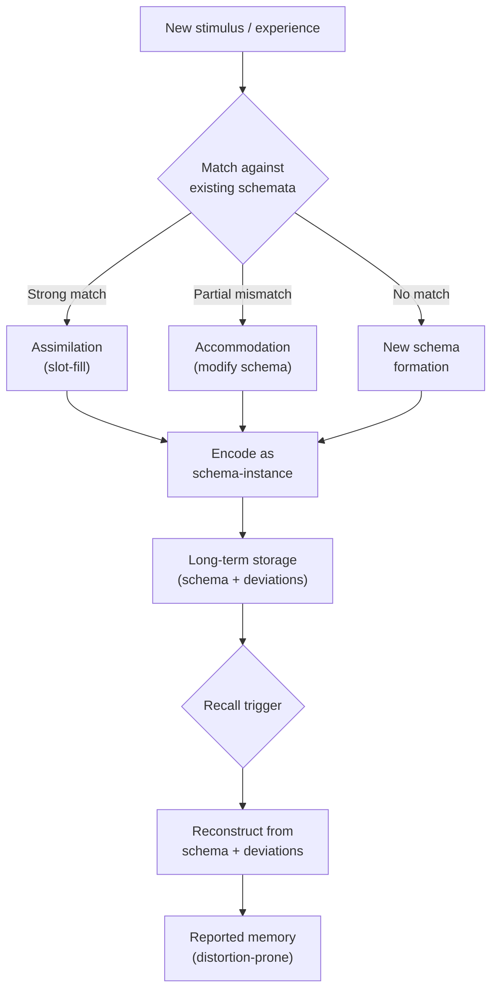

# Schema Theory

> [!definition] Definition
> A **schema** (plural: *schemata*) is an organized, generalized cognitive structure — abstracted from prior experience — that guides the encoding, storage, and reconstruction of new information. Schemata are not stored *records* but stored *frameworks for reconstruction*: at recall, the schema is re-instantiated and missing detail is inferred (often unwittingly) from its slot-defaults. Schema theory is the empirical-psychological tradition (Bartlett 1932; Piaget 1952; Rumelhart 1980) that treats memory and comprehension as schema-mediated rather than record-mediated.

## Structural Analogs (Latticework Edges)

| # | Analog | Structural correspondence | Cross-domain problem illuminated |
|---|--------|--------------------------|----------------------------------|
| 1 | `[[mental-model]]` | A schema is a *cognitively-instantiated* mental model — the empirically-studied substrate beneath the philosophical category | Why "having a model" is not optional: comprehension itself is schema-mediated, so the question is *which* schema, not *whether* one is in use |
| 2 | `[[chunking]]` | Schemata *are the chunks* once they cross from sequence-grouping into stable representational structure | Why expertise looks like memory: experts recognize schema-instances; novices encode raw features |
| 3 | `[[predictive-coding]]` | A schema acts as the *generative model* whose top-down predictions are matched against bottom-up sensory data | Why misperception is systematic, not random: errors follow schema-defaults |
| 4 | `[[Bartlett-1932]]` | Bartlett's *War of the Ghosts* recall studies — Western subjects systematically distorted a Native American folk-tale toward Western schemata — established schema-mediated reconstruction empirically | Why eyewitness memory is unreliable in *predictable* directions, not randomly |

## Origin & Empirical Foundation

> [!cite] Frederic Bartlett (1932), *Remembering: A Study in Experimental and Social Psychology*, Cambridge University Press
> Bartlett gave Cambridge undergraduates the Native American folk-tale "The War of the Ghosts" and asked them to reproduce it after delays of hours, days, and months. Reproductions showed *systematic* distortions: supernatural elements were rationalized; unfamiliar cultural practices were Anglicized; and the tale's structure was reshaped toward conventional Western narrative. Bartlett concluded that memory is "an *imaginative reconstruction* … built out of the relation of our attitude towards a whole active mass of organised past reactions or experience" — i.e., schema-mediated. This is the founding empirical result of schema theory.

The tradition forks into two productive lineages:

1. **Piagetian developmental schemata** ([[Piaget-1952]]): schemata develop through *assimilation* (incorporating new experience into existing schema) and *accommodation* (modifying schema to fit recalcitrant experience). Cognitive growth is the dialectic of these two operations.
2. **Schank & Abelson scripts** (1977) and Rumelhart's adult schema theory (1980): schemata as structured slot-and-filler representations supporting top-down comprehension. The "restaurant script" — entering, ordering, eating, paying — is the canonical example.

## Mechanism



```
   ┌────────────────────────────────────────┐
   │   ENCODING (schema-mediated)           │
   │                                        │
   │   stimulus ──► schema-match            │
   │                  │                     │
   │                  ▼                     │
   │            slot-filling                │
   │                  │                     │
   │                  ▼                     │
   │   stored: schema-pointer + deviations  │
   └──────────────────┬─────────────────────┘
                      │ delay
                      ▼
   ┌────────────────────────────────────────┐
   │   RECALL (schema-mediated)             │
   │                                        │
   │   schema re-instantiated               │
   │     + deviations replayed              │
   │     + missing slots inferred from      │
   │       schema defaults                  │
   │                                        │
   │   ⇒ "memory" is reconstruction,        │
   │     not playback                       │
   └────────────────────────────────────────┘
```

The critical asymmetry: deviations from schema are stored *as* deviations; conformities are stored *as* the schema. At recall, conformities are inferred (not retrieved) and inferred-conformities are indistinguishable from retrieved-conformities to the rememberer. This is the formal mechanism of *systematic* memory distortion.

## Boundary Conditions

> [!boundary] Where Schema Theory Holds and Where It Stops
> **Holds well for:** narrative memory, event memory, gist-level comprehension, expert recognition, social-script behavior, reading comprehension of conventional text. The empirical base is broad and replicated.
>
> **Holds weakly for:** rote-verbatim memory of meaningless material (where schemata cannot anchor), highly distinctive single-trial events (von Restorff effects override schema-defaults), and procedural skill (where motor-program theories are more parsimonious).
>
> **Does NOT formalize:** the *content* of any specific schema. Schema theory provides a vocabulary (slots, defaults, scripts, frames) but is mute on which schemata any individual mind contains. This is its main limitation as an explanatory framework — and the reason competing accounts (exemplar theory, distributed-representation accounts) remain live.

## Far-Transfer Example

> [!example] Far-Transfer — Software API Documentation Comprehension
> Consider two engineers reading the same REST API documentation:
>
> - **Junior engineer** has no `[[REST-API]]` schema. She encodes endpoint-by-endpoint, slot by slot. After a week she remembers approximate URLs but cannot reconstruct the auth flow.
> - **Senior engineer** has a robust REST schema with default slots: *resource nouns, verb-method mapping (GET/POST/PUT/DELETE), status-code conventions, pagination patterns, auth-header location*. He reads the docs in 1/4 the time, encoding only the *deviations from default* (e.g., "this API uses cursor-pagination, not offset"). After a week, he can reconstruct most of the API by re-instantiating the REST schema and replaying the deviations.
>
> The senior engineer is not faster because he reads faster — he is faster because he encodes *less*. Most of the API is inferable from his schema; only the deviations need storage. This is the operational definition of *expertise*: schema-rich domain encoding.

## Failure Modes

> [!warning] When NOT to Trust Schema-Driven Reasoning
>
> 1. **Cross-cultural communication**. The Bartlett finding is the founding cautionary tale: when source and recipient hold different schemata, reconstruction *systematically* distorts toward the recipient's defaults. The distortions are predictable but rarely noticed.
> 2. **Eyewitness testimony involving rare events**. Schema-defaults fill in plausible details that the witness sincerely "remembers." Loftus's misinformation studies (1974) extended Bartlett with quantitative rigor.
> 3. **Inferring expertise from confidence**. Schema-richness and *correctness* are independent. A confidently-held wrong schema produces confidently-recalled wrong content. (See `[[dunning-kruger-effect]]`.)
> 4. **Reading novel domains as if they were familiar**. The strongest schema is not always the appropriate schema. Engineers reading legal contracts, doctors reading code — both default to inappropriate schemata and miss the deviations.

## Case Study — The "Office" Schema Experiment (Brewer & Treyens 1981)

> [!cite] William Brewer & James Treyens (1981), "Role of schemata in memory for places", *Cognitive Psychology* 13(2): 207–230
> Subjects waited briefly in a graduate-student office, then were unexpectedly asked to recall its contents. Items consistent with an "office" schema (desk, chair, papers) were recalled at high rates *whether or not they were actually present* — including a non-existent set of books that 9 of 30 subjects "remembered." Items inconsistent with the schema (a skull, a wine bottle) were recalled with high accuracy when present (von Restorff distinctiveness) but rarely intruded when absent.

The Brewer & Treyens design quantifies the two predictions of schema theory simultaneously: (a) schema-consistent absent items intrude as false memories; (b) schema-inconsistent present items are encoded distinctively. Both predictions confirmed. This is paradigmatic for schema theory because it demonstrates the theory's *asymmetric* memory consequences: errors are not random — they are *toward* the schema.

## Three-Layer Quality Self-Assessment

> [!key-claim] Self-Assessment
> **Fidelity (5/5)**: The Bartlett → Piaget → Rumelhart lineage is the canonical empirical foundation; the slot-and-filler mechanism, the assimilation/accommodation dialectic, and the Brewer & Treyens replication are accurately represented. The note candidly flags the theory's weakness (silence on schema-content) rather than overclaiming.
>
> **Tractability (4/5)**: The cultivation-target (schema-elicitation prompts at intake) is implementable but requires deliberate metacognitive practice that runs against the grain of automatic comprehension. Easier than `[[second-order-thinking]]` (which requires cognitive ply-extension); harder than `[[opportunity-cost]]` (which requires only a single elicitation question). Marked 4.
>
> **Transferability (5/5)**: The Bartlett mechanism transfers cleanly to API-comprehension (computing), eyewitness testimony (law), differential diagnosis (medicine), and reading comprehension (education). The far-transfer example is genuine far-transfer, not in-domain restatement.
>
> **Composite 4.67**, weakest dimension *tractability*. Cultivation-target appropriately targets the weakest dimension via metacognitive intake-prompts.

## Personal Application

> [!example]
> Reading Christopher Alexander's *A Pattern Language* changed my schema for "design" itself. Before: design = aesthetic + functional choices made by an authority. After: design = a pattern-grammar that emerges from repeated successful resolutions of recurring tensions in a context. The same revised schema then re-applied — without further deliberate effort — to PKB structure (notes-as-patterns), to prompt engineering (components-as-patterns), and to my own conversational style (frames-as-patterns). The cost was real (a few months of disorientation as the old schema decomposed before the new one stabilized), but the cross-domain transfer was the entire payoff and confirmed schema-theory's central claim: revising one well-placed schema reorganizes work in domains whose connection to the trigger was invisible at the time.

## Personal Notes

> [!reflection]
> The schemas I find hardest to revise are the ones embedded in language I use fluently. Switching languages — or even switching from prose to code — surfaces schema-disagreements that monolingual reflection cannot reach. The strong Whorfian claim is not supportable, but the operational corollary (force a language-switch when stuck) holds up empirically in my own work, often enough that I now treat "I can only express this one way" as a diagnostic that the schema underneath is doing more constraining work than I had noticed.

## Connections

- **Hub**: `[[mental-model]]` (philosophical parent of which schemata are the empirical specialization)
- **Sibling concepts in Phase 3**: `[[chunking]]`, `[[working-memory]]`, `[[mental-simulation]]`, `[[dual-process-theory]]`, `[[predictive-coding]]`
- **Pending stubs**: `[[Bartlett-1932]]`, `[[Piaget-1952]]`, `[[Rumelhart-1980]]`, `[[Schank-Abelson-1977]]`, `[[Brewer-Treyens-1981]]`, `[[Loftus-1974]]`, `[[REST-API]]`
- **MOC**: `[[moc-mental-models-latticework]]` (declares schema-theory ↔ {mental-model, chunking, predictive-coding, Bartlett-1932} bridges)
