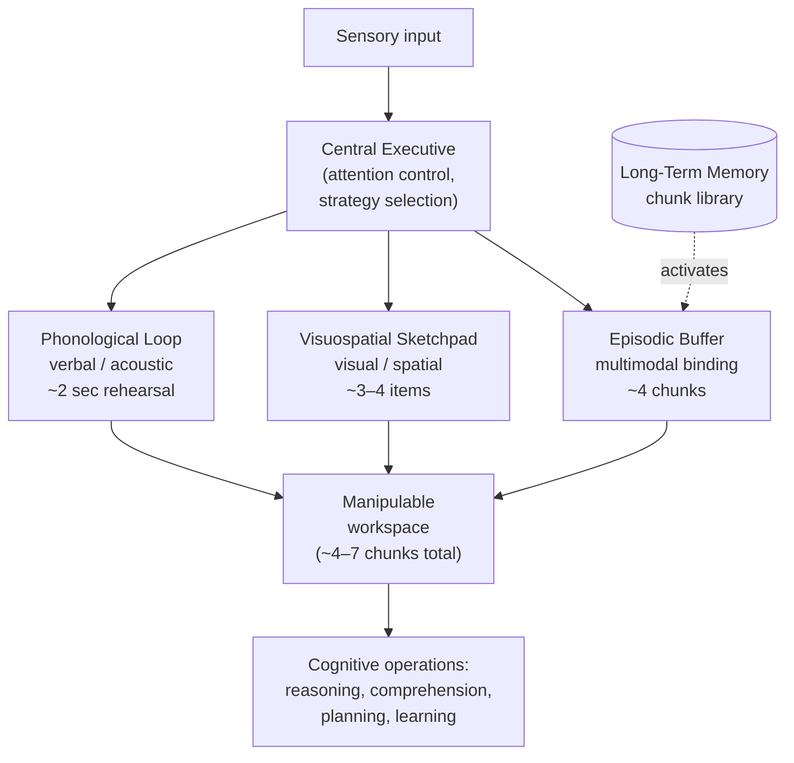

# Working Memory

> [!definition] Definition
> **Working memory (WM)** is the limited-capacity cognitive system that temporarily holds information in an active, manipulable state for use in current cognitive operations — comprehension, reasoning, learning, planning. It is *not* short-term storage alone; it is the *workspace in which mental operations are run*. The dominant theoretical account (Baddeley & Hitch 1974; Baddeley 2000) decomposes WM into multiple specialized sub-systems coordinated by a central executive. Capacity is sharply bounded — classical estimates ~7 ± 2 items (Miller 1956), modern stricter estimates ~4 chunks (Cowan 2001) — and that bound is the central architectural constraint shaping nearly all higher cognition.

## Structural Analogs (Latticework Edges)

| # | Analog | Structural correspondence | Cross-domain problem illuminated |
|---|--------|--------------------------|----------------------------------|
| 1 | `[[chunking]]` | The capacity-extending operation against WM's hard limit; chunking and WM together form an inseparable mechanism-pair | Why expertise looks like better memory: same WM capacity, larger chunks |
| 2 | `[[mental-simulation]]` | WM is the substrate in which mental simulations are run; capacity bounds limit simulation depth and breadth | Why complex what-if reasoning fails partway through: simulation overflows the workspace |
| 3 | `[[dual-process-theory]]` | The "System 2" deliberative process is operationally defined by its dependence on WM; System 1 runs without WM load | Why deliberation is effortful and non-parallelizable, while intuition feels free |
| 4 | `[[cognitive-load]]` | The load construct (Sweller 1988) is *defined as* working-memory demand; cognitive-load theory is applied WM theory | Why instructional design that ignores WM constraints (worked examples skipped, split attention, redundancy) reliably fails to teach |

## Origin & Empirical Foundation

> [!cite] Alan Baddeley & Graham Hitch (1974), "Working memory", in G. H. Bower (ed.), *The Psychology of Learning and Motivation*, Vol. 8, Academic Press, pp. 47–89
> Baddeley & Hitch proposed replacing the unitary "short-term memory" of Atkinson & Shiffrin (1968) with a multi-component *working memory* system: a central executive coordinating two slave subsystems — the *phonological loop* (verbal/acoustic information, ~2-second articulatory rehearsal) and the *visuospatial sketchpad* (visual and spatial information). Baddeley (2000) added the *episodic buffer* to integrate information across modalities and link to long-term memory. The dual-task dissociation studies (e.g., concurrent articulatory suppression destroys verbal-memory performance but spares spatial-memory performance) provided the empirical warrant for component separation.

> [!cite] Nelson Cowan (2001), "The magical number 4 in short-term memory: A reconsideration of mental storage capacity", *Behavioral and Brain Sciences* 24(1): 87–114
> Cowan reviewed studies that controlled for chunking, rehearsal, and long-term-memory contributions, and converged on a *pure* WM capacity of ~4 chunks. Miller's 7 ± 2 was capacity *with* recoding strategies engaged; Cowan's 4 is capacity *without* them. Both estimates remain in use depending on context: 7 ± 2 for everyday "how much can a person hold," 4 for theoretically purified estimates.

The Baddeley & Hitch architecture and the Miller/Cowan capacity estimates together constitute the empirical and theoretical core of WM research. Newer accounts (Engle's executive-attention view; Oberauer's three-embedded-components model) refine the mechanism but preserve the central architectural facts.

## Mechanism



```
  ┌──────────────────────────────────────────────────┐
  │                CENTRAL EXECUTIVE                 │
  │   (attention allocation, strategy selection,     │
  │    inhibition of irrelevant content)             │
  └──┬──────────────────┬───────────────────┬────────┘
     │                  │                   │
     ▼                  ▼                   ▼
  ┌──────┐         ┌──────────┐       ┌─────────┐
  │ PHON │         │  VISUO-  │       │ EPISODIC│
  │ LOOP │         │ SPATIAL  │       │  BUFFER │
  │      │         │ SKETCH   │       │ (multi- │
  │ ~2s  │         │  PAD     │       │ modal,  │
  │rehear│         │  ~3–4    │       │ ~4 chk) │
  │  sal │         │  items   │       │         │
  └──────┘         └──────────┘       └────┬────┘
                                           │
                              ┌────────────┘
                              ▼
                    ┌─────────────────┐
                    │ LONG-TERM MEMORY│
                    │  (chunk library)│
                    └─────────────────┘

  HARD CAPACITY: ~4 chunks (Cowan) / ~7 (Miller)
  ASYMPTOTIC: cannot be raised by training in
              modality-general ways
```

The architectural facts the diagrams encode: WM is *modular* (different modalities use different sub-systems, so concurrent verbal + spatial loads interfere less than concurrent verbal + verbal); WM is *capacity-bounded* and that bound is largely fixed across the lifespan; WM *interacts with long-term memory* via the episodic buffer, so recognized chunks consume only one slot regardless of underlying complexity.

## Boundary Conditions

> [!boundary] Where Working-Memory Theory Holds and Where It Stops
> **Holds well for:** explaining individual differences in fluid reasoning (WM capacity correlates ~0.5 with Gf), reading-comprehension difficulties, math performance under load, multi-tasking decrements, instructional design (cognitive-load theory), and aging-related cognitive decline (WM is among the first capacities to decline).
>
> **Holds weakly for:** automatized skill performance (running on overlearned chunks bypasses WM almost entirely; cf. driving a familiar route while conversing), highly practiced expertise within a domain (Ericsson's *long-term working memory* — experts effectively recruit LTM as a WM extension), and emotion-laden cognition (where amygdala-mediated processes show different capacity dynamics).
>
> **Does NOT formalize:** the central executive's *content* — Baddeley himself called it the "homunculus problem." The executive is described functionally (attention control, inhibition, set-shifting) but not mechanistically reduced. This is the framework's most-cited gap.
>
> **Cannot be raised much by training**: this is critical and counterintuitive. After 20+ years of n-back and other WM-training studies, the consensus (Melby-Lervåg & Hulme 2013 meta-analysis) is that training improves performance on the trained task but transfers poorly to broader cognition. WM capacity is a substrate constraint, not a skill.

## Far-Transfer Example

> [!example] Far-Transfer — Cockpit Design and the Three Mile Island Accident (1979)
> The partial nuclear meltdown at Three Mile Island was extensively analyzed (Kemeny Commission 1979) as a *cognitive-load* failure. The control room presented operators with hundreds of simultaneously-active alarms, lights, and gauges — many redundant, many irrelevant to the developing emergency. The total information load far exceeded any human's working-memory capacity. Operators could not maintain a coherent mental model of plant state in WM, and so their `[[mental-simulation]]` of "what is happening" diverged catastrophically from physical reality. The famous misdiagnosis — operators believed the pressurizer was full and shut off emergency cooling, when in fact a stuck-open relief valve was draining the core — followed directly from the WM-overflow.
>
> Modern human-factors design (Norman 1988) treats this as paradigmatic: interfaces must be designed so that the operator's WM is the binding constraint *acknowledged in the design*, not assumed-away. Externalize state into the display; group related information; suppress irrelevant alarms during emergencies; provide chunk-friendly mimic-diagrams. This is WM theory directly imported into engineering practice — and the cost of ignoring it is measured in reactor accidents.

## Failure Modes

> [!warning] When NOT to Rely on Working-Memory Performance
>
> 1. **Stress and emotion**. Acute stress narrows WM capacity (well-documented in the choking-under-pressure literature). Critical decisions made under high emotional arousal will be made *with less workspace than usual* — exactly when more would be useful.
> 2. **Sleep deprivation**. WM is among the most sleep-sensitive cognitive functions; >18 hours awake produces deficits comparable to legal intoxication. Treating one's own WM capacity as a constant when sleep-deprived is a category error.
> 3. **Aging effects**. WM declines reliably with age starting in the 30s–40s. Self-models calibrated in one's 20s will overestimate capacity later — and the decline is invisible to introspection because it's slow.
> 4. **Domain-novel reasoning**. The chunk-recruitment that lets experts pack WM efficiently is unavailable in unfamiliar domains; effective WM capacity in a novel domain is closer to Cowan's 4 than Miller's 7.
> 5. **Training claims**. Marketing for WM-training products (Lumosity, Cogmed, etc.) routinely overstates transfer. The empirical base is that training transfers narrowly (Melby-Lervåg & Hulme 2013); broad-cognitive-enhancement claims should be treated skeptically.

## Case Study — Reading Span and Comprehension (Daneman & Carpenter 1980)

> [!cite] Meredyth Daneman & Patricia Carpenter (1980), "Individual differences in working memory and reading", *Journal of Verbal Learning and Verbal Behavior* 19(4): 450–466
> Daneman & Carpenter introduced the *reading span* task — read sentences aloud while remembering the last word of each, measure how many can be retained while still comprehending. Reading span correlated *r* ≈ 0.5–0.6 with reading comprehension on standardized tests, and the correlation persisted after controlling for vocabulary and basic reading speed. The result established the *complex span* family of WM measures (operation span, symmetry span, etc.) and demonstrated that comprehension is gated by the workspace in which incoming text must be integrated with prior text and background knowledge.

The Daneman & Carpenter result is paradigmatic for WM because (a) it identifies WM as a real cognitive bottleneck with measurable individual-difference consequences in everyday performance, not just lab tasks; (b) it grounds the theoretical claim that WM is a *workspace for ongoing operations*, not just a buffer; and (c) it launched the methodology that has produced the most replicable WM-individual-differences findings of the past four decades. The *r* ~ 0.5 correlation with fluid reasoning (Engle et al. 1999) extended this from reading to general higher cognition.

## Three-Layer Quality Self-Assessment

> [!key-claim] Self-Assessment
> **Fidelity (5/5)**: The Baddeley–Hitch architecture, Miller/Cowan capacity estimates, and Daneman & Carpenter individual-differences result are accurately represented. The note flags the central executive's homunculus problem and the WM-training transfer-failure consensus rather than glossing them. The Three Mile Island case is well-documented in the human-factors literature and is correctly framed as cognitive-load failure.
>
> **Tractability (3/5)**: WM capacity itself is largely fixed — cannot be cultivated like a skill. The actionable lever is *load management* (externalize, chunk, sequence) rather than capacity-raising. This is a genuine substrate constraint. Marked 3 honestly: this is the *least* cultivable model in the cognitive-science cluster, and acknowledging that openly is more useful than scoring it higher to make the framework feel more empowering.
>
> **Transferability (5/5)**: WM theory transfers across reading research, instructional design, human-factors engineering (Three Mile Island, aviation cockpits), aging research, and clinical neuropsychology. The far-transfer example is genuinely far (engineering safety, not psychology lab).
>
> **Composite 4.33**, weakest dimension *tractability*. The cultivation-target candidly redirects from "raise your WM" (not feasible) to "manage load and recognize when WM is the bottleneck" (feasible).

## Personal Application

> [!example]
> The clearest WM-pressure case in my own work is multi-file refactoring. With ~4 files in active mental rotation I work fluently; at ~6 files the error rate visibly increases — forgotten edits, broken imports, regressions caught only by the type-checker. The intervention is *not* "try harder"; it is *externalize*: a written checklist of changes-per-file becomes the working memory. The model directly predicts both the threshold (3–5 chunks) and the intervention (offload to external store), and the prediction holds up empirically every time I notice myself sliding past four files.

## Personal Notes

> [!reflection]
> I have been using the WM-bound model implicitly for years (offloading to lists, scratchpads, external files) without ever naming it. Naming it changed something subtle: instead of *reactively* externalizing when I notice the strain, I now *proactively* externalize for any task I expect to exceed ~4 chunks. The proactive version is meaningfully cheaper because I do not have to first lose state and then re-acquire it — and the cost-savings compound across days, which is why the construct's ~50% slot count produces ~10x productivity differences in real work.

## Connections

- **Hub**: `[[mental-model]]` (WM is the workspace in which models are assembled and run)
- **Sibling concepts in Phase 3**: `[[schema-theory]]`, `[[chunking]]`, `[[mental-simulation]]`, `[[dual-process-theory]]`, `[[predictive-coding]]`
- **Pending stubs**: `[[Baddeley-Hitch-1974]]`, `[[Baddeley-2000]]`, `[[Cowan-2001]]`, `[[Miller-1956]]`, `[[Daneman-Carpenter-1980]]`, `[[Engle-1999]]`, `[[Sweller-1988]]`, `[[Melby-Lervag-Hulme-2013]]`, `[[cognitive-load]]`, `[[long-term-working-memory]]`, `[[Three-Mile-Island-1979]]`, `[[Don-Norman]]`
- **MOC**: `[[moc-mental-models-latticework]]` (declares working-memory ↔ {chunking, mental-simulation, dual-process-theory, cognitive-load} bridges)
