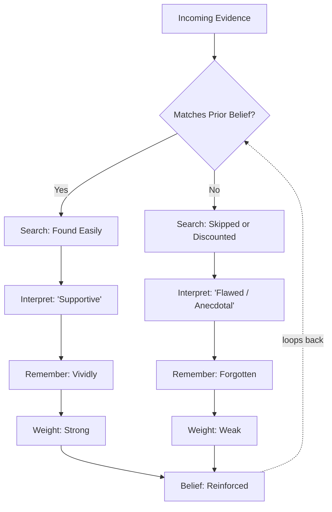

# WORKED EXAMPLE — SEE-I: Confirmation Bias

> [!abstract] How to Use This Worked Example
> This is a **completed reference session** showing the [[SEE-I Method]] applied to the concept of [[Confirmation Bias]]. SEE-I is a **mastery diagnostic** disguised as an elaboration tool: if you cannot do all four steps, you do not understand the concept — you merely recognize the words. Compare every section to the [[_master-see-i-elaboration-v1.0.0|template prompts]]. Notice that the *Exemplify* step requires a **transfer test** (an example from a domain different from where you first learned the concept), and that the *Illustrate* step requires an **analogy**, not just another example.
>
> **Concept:** Confirmation Bias  ·  **Framework:** SEE-I  ·  **Mastery rating:** 4 / 5
> **Session duration:** ~14 minutes

---

## S · STATE

> *State the concept clearly in **one** sentence. No jargon ladders.*

[**Statement**:: Confirmation bias is the systematic human tendency to seek, interpret, remember, and weight evidence in ways that favor a prior belief — and to discount evidence that contradicts it — usually without conscious awareness.]

> **Why this statement, specifically.** Notice four moves:
> 1. **"Systematic"** — not random. The bias produces predictable directional error.
> 2. **"Seek, interpret, remember, weight"** — names the four distinct mechanisms, because the bias operates at every stage of information processing, not just one.
> 3. **"Favor a prior belief"** — specifies what the bias is *toward*. Without this, the concept becomes vague.
> 4. **"Without conscious awareness"** — distinguishes the bias from deliberate dishonesty.

---

## E · ELABORATE

> *Explain it in your own words, in depth. ~150 words. Cover: what it includes, what it excludes, why it matters.*

> Confirmation bias is **not a single mechanism but a family** of cognitive tendencies that all push reasoning toward conclusions the reasoner already favors. It includes **search bias** (we Google phrasings that match our view), **interpretation bias** (we read ambiguous evidence as supporting our side), **memory bias** (we recall confirming instances more readily than disconfirming ones), and **weighting bias** (we judge confirming evidence as strong and disconfirming evidence as flawed).
>
> What confirmation bias **excludes** is *deliberate* selective use of evidence — that is dishonesty, not bias. It also excludes *cultural* preferences for certain conclusions — that is [[Sociocentrism]], a related but distinct phenomenon.
>
> The concept matters because it is **the default mode of human cognition**, not an aberration. It operates equally in experts and novices, in formal reasoning and casual judgment. Almost every other debiasing technique — [[Steelmanning]], [[Pre-Mortem|pre-mortems]], red-teaming, adversarial collaboration — exists because of confirmation bias. Without it, none would be necessary.

---

## E · EXEMPLIFY

> *Provide **two** concrete examples. At least one should be from a domain different from where you first learned the concept (transfer test).*

**Example 1 (familiar domain — psychology / personal reasoning):**
> A person who believes they are bad at math signs up for a calculus class. On the first quiz, they score 60%. They take this as confirmation: *"See, I really am bad at math."* They do not notice that the class average was 55%, that their score improved from the diagnostic, and that 60% means they got more right than wrong. The same evidence, weighted by someone with a self-concept of "math person," would be filed as "rough start, on track to improve." Same data, different memory, different conclusion.

**Example 2 (different domain — software engineering, the transfer test):**
> A developer believes a bug is caused by a race condition. They add log statements, find one log entry that is out of expected order, and conclude they were right. They ship the fix. The bug returns three days later because the real cause was a stale cache; the out-of-order log was unrelated thread scheduling that happens harmlessly all the time. Confirmation bias operated at the **interpretation** stage: the log entry was ambiguous, but the developer's prior hypothesis made it read as supportive evidence. A control test (running the same code path without the suspected race) would have falsified the hypothesis; the developer never ran it, because they already had "enough" evidence.

**Counter-example (something that LOOKS like this concept but isn't):**
> A scientist who has tested a hypothesis 100 times and continues to favor it after seeing 100 confirmations is **not** exhibiting confirmation bias if they actively designed those tests to be capable of falsifying the hypothesis. The structure of [[Falsificationism|Popperian]] science is precisely the institutional defense against confirmation bias: a hypothesis you cannot kill is suspect even when supported. Repeatedly *failing to disconfirm* is different from *selectively confirming*.

---

## I · ILLUSTRATE

> *Use an analogy, metaphor, or visual to make the concept vivid.*

**Analogy:** "Confirmation bias is like a security guard at a nightclub who waves through anyone wearing your team's jersey and demands ID from anyone in the opposing team's colors. The guard isn't deciding who is or isn't 21 — they're filtering by team and then *describing* the filter as 'enforcing the rules.'"

> The analogy captures three crucial features:
> 1. **Asymmetric scrutiny** — same standard nominally applied, but the *threshold* differs by allegiance.
> 2. **Process-level operation** — the bias is in the gatekeeping function itself, not in the final decisions.
> 3. **Self-justifying** — the guard genuinely experiences themselves as enforcing rules, not as biased.

**Visual / Mermaid diagram:**

> The diagram makes the **feedback loop** explicit: each operation of the bias strengthens the prior belief that triggers the next operation. This is why confirmation bias compounds over time and why merely "trying to be objective" is insufficient — the prior belief is doing the gatekeeping at every stage.

---

## 🧠 Mastery Self-Check

| Question | Answer |
|---|---|
| Could I teach this to a smart 12-year-old? | `✅ yes` |
| Could I distinguish it from 2 commonly-confused concepts? | `✅ yes — see below` |
| Could I apply it to a novel case? | `✅ yes — the software debugging example was a transfer test, and I generated it without searching` |
| Can I name the [[Paul-Elder Framework|Paul-Elder]] element this concept belongs to? | `✅ — primarily Information (1.3) and Point of View (1.8); the bias operates on how we collect evidence and from where we evaluate it` |

**Commonly-confused concepts (and the distinction):**
- **Confirmation Bias** vs. **[[Motivated Reasoning]]** → Confirmation bias operates *unconsciously* on evidence-handling; motivated reasoning is the broader phenomenon of cognition being shaped by *desired conclusions*, which can include conscious or semi-conscious goal pursuit. Confirmation bias is one mechanism by which motivated reasoning works.
- **Confirmation Bias** vs. **[[Belief Perseverance]]** → Confirmation bias affects how we process *new* evidence; belief perseverance is the tendency to *retain* a belief even after its original supporting evidence has been refuted. The first is about evidence intake; the second is about evidence withdrawal.
- **Confirmation Bias** vs. **[[Selection Bias]]** → Selection bias is a *statistical* property of how a sample was assembled (often without any cognition involved); confirmation bias is a *cognitive* property of how an individual reasoner handles evidence. A randomly-assembled biased sample is selection bias without confirmation bias.

**Mastery rating:** `4 / 5` — withholding the fifth point because I did not separately address the **neuroscience** of confirmation bias (dopaminergic reward for belief-consistent information), which a true 5/5 understanding would include.

---

## ⚙ Metacognitive Check

- **Which of the four steps was hardest?**
  > The **counter-example** in the Exemplify section. It is easy to give examples *of* a concept; it is hard to give an example of something that *looks* like the concept but isn't. The difficulty exposed that my mental boundary between [[Confirmation Bias]] and [[Falsificationism|legitimate hypothesis-supporting science]] was fuzzier than I had assumed. Working out the distinction sharpened the concept.

- **What gap did this exercise expose?**
  > I cannot articulate the neural mechanism of confirmation bias precisely. I know it involves dopaminergic reward for belief-consistent information and amygdala-mediated discomfort for belief-threatening information, but I cannot describe the circuit. This is the **layer of explanation below my current understanding** and is what would move my mastery from 4 to 5.

- **What further reading/practice would close that gap?**
  > Read [[Jonas Kaplan|Kaplan, Gimbel & Harris (2016)]] on the neural correlates of political belief challenge; do a SEE-I session on [[Neural Reward Prediction Error]] as the substrate.

---

# 🔗 Related

## How This Example Demonstrates SEE-I

- **State** — One sentence. Notice the deliberate density: every word in the statement is doing semantic work. The hardest part is fitting the concept into a single sentence without losing precision.
- **Elaborate** — ~150 words covering what's included, excluded, and why it matters. Notice the "excludes" subsection is often where the concept gets sharpened.
- **Exemplify** — TWO examples + a counter-example. The transfer test (different domain) is the diagnostic of real understanding. Counter-examples expose conceptual edges.
- **Illustrate** — Analogy, not example. Analogies map *structure*; examples instantiate. The Mermaid diagram is optional but powerful for concepts with feedback loops or hierarchy.

## Wiki-Link Cluster

- [[SEE-I Method]] · [[Paul-Elder Framework]] · [[Elements of Thought]]
- [[Confirmation Bias]] · [[Motivated Reasoning]] · [[Belief Perseverance]] · [[Selection Bias]]
- [[Steelmanning]] · [[Pre-Mortem]] · [[Falsificationism]]
- [[Cognitive Biases]] · [[Dual Process Theory]]
- [[Feynman Technique]] — adjacent mastery technique
- [[Critical Thinking Practice MOC]]
- [[Worked Examples & Practice Problems MOC]]
